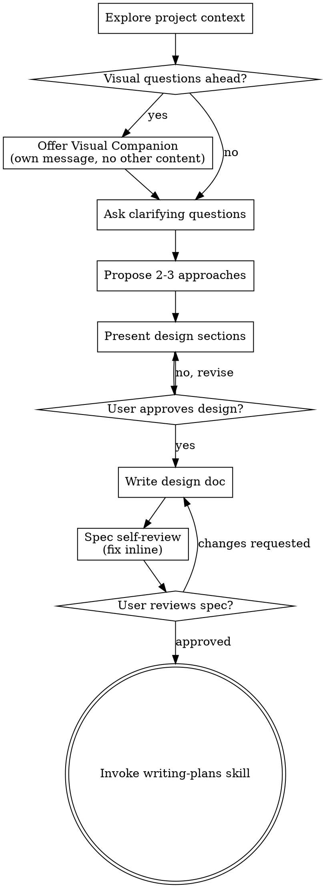
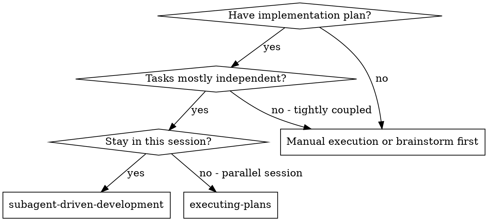
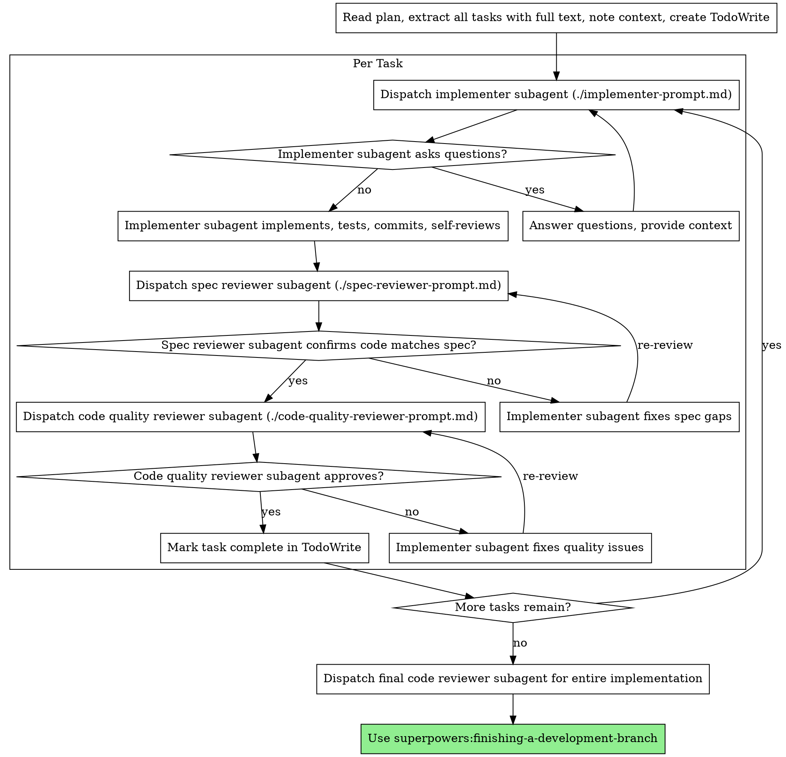

# M3C URL shortener implementation plan

**Session ID:** ses_1bbeec72cffeBkMTwaDQ4fGndw
**Created:** 5/20/2026, 9:27:19 AM
**Updated:** 5/20/2026, 10:05:31 AM

---

## User

Continue this project from M3C, Read docs/superpowers/plans/implementation-tracker.md and docs/superpowers/specs/2026-05-18-url-shortener-design.md, and other implemented plans in this directory. Create a small M3C plan then implement it, use worktrees and subagents.merge into main and clean worktree after finishing.Skip testing with every single step/task and leave it at the end before merging.

---

## Assistant (Build · gpt-5.5 · 3.8s)

**Tool: skill**

**Input:**
```json
{
  "name": "using-git-worktrees"
}
```

**Output:**
```
<skill_content name="using-git-worktrees">
# Skill: using-git-worktrees

# Using Git Worktrees

## Overview

Ensure work happens in an isolated workspace. Prefer your platform's native worktree tools. Fall back to manual git worktrees only when no native tool is available.

**Core principle:** Detect existing isolation first. Then use native tools. Then fall back to git. Never fight the harness.

**Announce at start:** "I'm using the using-git-worktrees skill to set up an isolated workspace."

## Step 0: Detect Existing Isolation

**Before creating anything, check if you are already in an isolated workspace.**

```bash
GIT_DIR=$(cd "$(git rev-parse --git-dir)" 2>/dev/null && pwd -P)
GIT_COMMON=$(cd "$(git rev-parse --git-common-dir)" 2>/dev/null && pwd -P)
BRANCH=$(git branch --show-current)
```

**Submodule guard:** `GIT_DIR != GIT_COMMON` is also true inside git submodules. Before concluding "already in a worktree," verify you are not in a submodule:

```bash
# If this returns a path, you're in a submodule, not a worktree — treat as normal repo
git rev-parse --show-superproject-working-tree 2>/dev/null
```

**If `GIT_DIR != GIT_COMMON` (and not a submodule):** You are already in a linked worktree. Skip to Step 3 (Project Setup). Do NOT create another worktree.

Report with branch state:
- On a branch: "Already in isolated workspace at `<path>` on branch `<name>`."
- Detached HEAD: "Already in isolated workspace at `<path>` (detached HEAD, externally managed). Branch creation needed at finish time."

**If `GIT_DIR == GIT_COMMON` (or in a submodule):** You are in a normal repo checkout.

Has the user already indicated their worktree preference in your instructions? If not, ask for consent before creating a worktree:

> "Would you like me to set up an isolated worktree? It protects your current branch from changes."

Honor any existing declared preference without asking. If the user declines consent, work in place and skip to Step 3.

## Step 1: Create Isolated Workspace

**You have two mechanisms. Try them in this order.**

### 1a. Native Worktree Tools (preferred)

The user has asked for an isolated workspace (Step 0 consent). Do you already have a way to create a worktree? It might be a tool with a name like `EnterWorktree`, `WorktreeCreate`, a `/worktree` command, or a `--worktree` flag. If you do, use it and skip to Step 3.

Native tools handle directory placement, branch creation, and cleanup automatically. Using `git worktree add` when you have a native tool creates phantom state your harness can't see or manage.

Only proceed to Step 1b if you have no native worktree tool available.

### 1b. Git Worktree Fallback

**Only use this if Step 1a does not apply** — you have no native worktree tool available. Create a worktree manually using git.

#### Directory Selection

Follow this priority order. Explicit user preference always beats observed filesystem state.

1. **Check your instructions for a declared worktree directory preference.** If the user has already specified one, use it without asking.

2. **Check for an existing project-local worktree directory:**
   ```bash
   ls -d .worktrees 2>/dev/null     # Preferred (hidden)
   ls -d worktrees 2>/dev/null      # Alternative
   ```
   If found, use it. If both exist, `.worktrees` wins.

3. **Check for an existing global directory:**
   ```bash
   project=$(basename "$(git rev-parse --show-toplevel)")
   ls -d ~/.config/superpowers/worktrees/$project 2>/dev/null
   ```
   If found, use it (backward compatibility with legacy global path).

4. **If there is no other guidance available**, default to `.worktrees/` at the project root.

#### Safety Verification (project-local directories only)

**MUST verify directory is ignored before creating worktree:**

```bash
git check-ignore -q .worktrees 2>/dev/null || git check-ignore -q worktrees 2>/dev/null
```

**If NOT ignored:** Add to .gitignore, commit the change, then proceed.

**Why critical:** Prevents accidentally committing worktree contents to repository.

Global directories (`~/.config/superpowers/worktrees/`) need no verification.

#### Create the Worktree

```bash
project=$(basename "$(git rev-parse --show-toplevel)")

# Determine path based on chosen location
# For project-local: path="$LOCATION/$BRANCH_NAME"
# For global: path="~/.config/superpowers/worktrees/$project/$BRANCH_NAME"

git worktree add "$path" -b "$BRANCH_NAME"
cd "$path"
```

**Sandbox fallback:** If `git worktree add` fails with a permission error (sandbox denial), tell the user the sandbox blocked worktree creation and you're working in the current directory instead. Then run setup and baseline tests in place.

## Step 3: Project Setup

Auto-detect and run appropriate setup:

```bash
# Node.js
if [ -f package.json ]; then npm install; fi

# Rust
if [ -f Cargo.toml ]; then cargo build; fi

# Python
if [ -f requirements.txt ]; then pip install -r requirements.txt; fi
if [ -f pyproject.toml ]; then poetry install; fi

# Go
if [ -f go.mod ]; then go mod download; fi
```

## Step 4: Verify Clean Baseline

Run tests to ensure workspace starts clean:

```bash
# Use project-appropriate command
npm test / cargo test / pytest / go test ./...
```

**If tests fail:** Report failures, ask whether to proceed or investigate.

**If tests pass:** Report ready.

### Report

```
Worktree ready at <full-path>
Tests passing (<N> tests, 0 failures)
Ready to implement <feature-name>
```

## Quick Reference

| Situation | Action |
|-----------|--------|
| Already in linked worktree | Skip creation (Step 0) |
| In a submodule | Treat as normal repo (Step 0 guard) |
| Native worktree tool available | Use it (Step 1a) |
| No native tool | Git worktree fallback (Step 1b) |
| `.worktrees/` exists | Use it (verify ignored) |
| `worktrees/` exists | Use it (verify ignored) |
| Both exist | Use `.worktrees/` |
| Neither exists | Check instruction file, then default `.worktrees/` |
| Global path exists | Use it (backward compat) |
| Directory not ignored | Add to .gitignore + commit |
| Permission error on create | Sandbox fallback, work in place |
| Tests fail during baseline | Report failures + ask |
| No package.json/Cargo.toml | Skip dependency install |

## Common Mistakes

### Fighting the harness

- **Problem:** Using `git worktree add` when the platform already provides isolation
- **Fix:** Step 0 detects existing isolation. Step 1a defers to native tools.

### Skipping detection

- **Problem:** Creating a nested worktree inside an existing one
- **Fix:** Always run Step 0 before creating anything

### Skipping ignore verification

- **Problem:** Worktree contents get tracked, pollute git status
- **Fix:** Always use `git check-ignore` before creating project-local worktree

### Assuming directory location

- **Problem:** Creates inconsistency, violates project conventions
- **Fix:** Follow priority: existing > global legacy > instruction file > default

### Proceeding with failing tests

- **Problem:** Can't distinguish new bugs from pre-existing issues
- **Fix:** Report failures, get explicit permission to proceed

## Red Flags

**Never:**
- Create a worktree when Step 0 detects existing isolation
- Use `git worktree add` when you have a native worktree tool (e.g., `EnterWorktree`). This is the #1 mistake — if you have it, use it.
- Skip Step 1a by jumping straight to Step 1b's git commands
- Create worktree without verifying it's ignored (project-local)
- Skip baseline test verification
- Proceed with failing tests without asking

**Always:**
- Run Step 0 detection first
- Prefer native tools over git fallback
- Follow directory priority: existing > global legacy > instruction file > default
- Verify directory is ignored for project-local
- Auto-detect and run project setup
- Verify clean test baseline

Base directory for this skill: file:///C:/Users/Shaheen/.cache/opencode/packages/superpowers@git+https_/github.com/obra/superpowers.git/node_modules/superpowers/skills/using-git-worktrees
Relative paths in this skill (e.g., scripts/, reference/) are relative to this base directory.
Note: file list is sampled.

<skill_files>

</skill_files>
</skill_content>
```

---

## Assistant (Build · gpt-5.5 · 2.3s)

**Tool: skill**

**Input:**
```json
{
  "name": "writing-plans"
}
```

**Output:**
```
<skill_content name="writing-plans">
# Skill: writing-plans

# Writing Plans

## Overview

Write comprehensive implementation plans assuming the engineer has zero context for our codebase and questionable taste. Document everything they need to know: which files to touch for each task, code, testing, docs they might need to check, how to test it. Give them the whole plan as bite-sized tasks. DRY. YAGNI. TDD. Frequent commits.

Assume they are a skilled developer, but know almost nothing about our toolset or problem domain. Assume they don't know good test design very well.

**Announce at start:** "I'm using the writing-plans skill to create the implementation plan."

**Context:** If working in an isolated worktree, it should have been created via the `superpowers:using-git-worktrees` skill at execution time.

**Save plans to:** `docs/superpowers/plans/YYYY-MM-DD-<feature-name>.md`
- (User preferences for plan location override this default)

## Scope Check

If the spec covers multiple independent subsystems, it should have been broken into sub-project specs during brainstorming. If it wasn't, suggest breaking this into separate plans — one per subsystem. Each plan should produce working, testable software on its own.

## File Structure

Before defining tasks, map out which files will be created or modified and what each one is responsible for. This is where decomposition decisions get locked in.

- Design units with clear boundaries and well-defined interfaces. Each file should have one clear responsibility.
- You reason best about code you can hold in context at once, and your edits are more reliable when files are focused. Prefer smaller, focused files over large ones that do too much.
- Files that change together should live together. Split by responsibility, not by technical layer.
- In existing codebases, follow established patterns. If the codebase uses large files, don't unilaterally restructure - but if a file you're modifying has grown unwieldy, including a split in the plan is reasonable.

This structure informs the task decomposition. Each task should produce self-contained changes that make sense independently.

## Bite-Sized Task Granularity

**Each step is one action (2-5 minutes):**
- "Write the failing test" - step
- "Run it to make sure it fails" - step
- "Implement the minimal code to make the test pass" - step
- "Run the tests and make sure they pass" - step
- "Commit" - step

## Plan Document Header

**Every plan MUST start with this header:**

```markdown
# [Feature Name] Implementation Plan

> **For agentic workers:** REQUIRED SUB-SKILL: Use superpowers:subagent-driven-development (recommended) or superpowers:executing-plans to implement this plan task-by-task. Steps use checkbox (`- [ ]`) syntax for tracking.

**Goal:** [One sentence describing what this builds]

**Architecture:** [2-3 sentences about approach]

**Tech Stack:** [Key technologies/libraries]

---
```

## Task Structure

````markdown
### Task N: [Component Name]

**Files:**
- Create: `exact/path/to/file.py`
- Modify: `exact/path/to/existing.py:123-145`
- Test: `tests/exact/path/to/test.py`

- [ ] **Step 1: Write the failing test**

```python
def test_specific_behavior():
    result = function(input)
    assert result == expected
```

- [ ] **Step 2: Run test to verify it fails**

Run: `pytest tests/path/test.py::test_name -v`
Expected: FAIL with "function not defined"

- [ ] **Step 3: Write minimal implementation**

```python
def function(input):
    return expected
```

- [ ] **Step 4: Run test to verify it passes**

Run: `pytest tests/path/test.py::test_name -v`
Expected: PASS

- [ ] **Step 5: Commit**

```bash
git add tests/path/test.py src/path/file.py
git commit -m "feat: add specific feature"
```
````

## No Placeholders

Every step must contain the actual content an engineer needs. These are **plan failures** — never write them:
- "TBD", "TODO", "implement later", "fill in details"
- "Add appropriate error handling" / "add validation" / "handle edge cases"
- "Write tests for the above" (without actual test code)
- "Similar to Task N" (repeat the code — the engineer may be reading tasks out of order)
- Steps that describe what to do without showing how (code blocks required for code steps)
- References to types, functions, or methods not defined in any task

## Remember
- Exact file paths always
- Complete code in every step — if a step changes code, show the code
- Exact commands with expected output
- DRY, YAGNI, TDD, frequent commits

## Self-Review

After writing the complete plan, look at the spec with fresh eyes and check the plan against it. This is a checklist you run yourself — not a subagent dispatch.

**1. Spec coverage:** Skim each section/requirement in the spec. Can you point to a task that implements it? List any gaps.

**2. Placeholder scan:** Search your plan for red flags — any of the patterns from the "No Placeholders" section above. Fix them.

**3. Type consistency:** Do the types, method signatures, and property names you used in later tasks match what you defined in earlier tasks? A function called `clearLayers()` in Task 3 but `clearFullLayers()` in Task 7 is a bug.

If you find issues, fix them inline. No need to re-review — just fix and move on. If you find a spec requirement with no task, add the task.

## Execution Handoff

After saving the plan, offer execution choice:

**"Plan complete and saved to `docs/superpowers/plans/<filename>.md`. Two execution options:**

**1. Subagent-Driven (recommended)** - I dispatch a fresh subagent per task, review between tasks, fast iteration

**2. Inline Execution** - Execute tasks in this session using executing-plans, batch execution with checkpoints

**Which approach?"**

**If Subagent-Driven chosen:**
- **REQUIRED SUB-SKILL:** Use superpowers:subagent-driven-development
- Fresh subagent per task + two-stage review

**If Inline Execution chosen:**
- **REQUIRED SUB-SKILL:** Use superpowers:executing-plans
- Batch execution with checkpoints for review

Base directory for this skill: file:///C:/Users/Shaheen/.cache/opencode/packages/superpowers@git+https_/github.com/obra/superpowers.git/node_modules/superpowers/skills/writing-plans
Relative paths in this skill (e.g., scripts/, reference/) are relative to this base directory.
Note: file list is sampled.

<skill_files>
<file>C:\Users\Shaheen\.cache\opencode\packages\superpowers@git+https_\github.com\obra\superpowers.git\node_modules\superpowers\skills\writing-plans\plan-document-reviewer-prompt.md</file>
</skill_files>
</skill_content>
```

---

## Assistant (Build · gpt-5.5 · 5.8s)

I'm using the using-git-worktrees skill to set up an isolated workspace, and the writing-plans skill to create the small M3C plan before implementation. I'll first inspect the repo state and the existing project docs, then create the isolated branch/worktree and proceed from there.

**Tool: bash**

**Input:**
```json
{
  "command": "git rev-parse --git-dir; git rev-parse --git-common-dir; git branch --show-current; git rev-parse --show-superproject-working-tree",
  "description": "Detects git worktree isolation state"
}
```

**Output:**
```
.git
.git
main

```

**Tool: glob**

**Input:**
```json
{
  "pattern": "docs/superpowers/plans/*.md"
}
```

**Output:**
```
C:\Users\Shaheen\URL_shortner_super_powers\docs\superpowers\plans\implementation-tracker.md
C:\Users\Shaheen\URL_shortner_super_powers\docs\superpowers\plans\2026-05-20-url-shortener-m3b-admin-dashboard-shell.md
C:\Users\Shaheen\URL_shortner_super_powers\docs\superpowers\plans\2026-05-19-url-shortener-m3a-public-react-form.md
C:\Users\Shaheen\URL_shortner_super_powers\docs\superpowers\plans\2026-05-19-url-shortener-m2c-admin-analytics-api.md
C:\Users\Shaheen\URL_shortner_super_powers\docs\superpowers\plans\2026-05-19-url-shortener-m2b-admin-link-management.md
C:\Users\Shaheen\URL_shortner_super_powers\docs\superpowers\plans\2026-05-19-url-shortener-m2a-admin-auth-sessions.md
C:\Users\Shaheen\URL_shortner_super_powers\docs\superpowers\plans\2026-05-19-url-shortener-m1d-redirect-clicks.md
C:\Users\Shaheen\URL_shortner_super_powers\docs\superpowers\plans\2026-05-19-url-shortener-m1c-public-link-creation.md
C:\Users\Shaheen\URL_shortner_super_powers\docs\superpowers\plans\2026-05-19-url-shortener-m1b-prisma.md
C:\Users\Shaheen\URL_shortner_super_powers\docs\superpowers\plans\2026-05-19-url-shortener-m1a-scaffold.md
```

**Tool: glob**

**Input:**
```json
{
  "pattern": "docs/superpowers/specs/*.md"
}
```

**Output:**
```
C:\Users\Shaheen\URL_shortner_super_powers\docs\superpowers\specs\2026-05-18-url-shortener-design.md
```

**Tool: read**

**Input:**
```json
{
  "filePath": "C:\\Users\\Shaheen\\URL_shortner_super_powers\\docs\\superpowers\\plans\\implementation-tracker.md"
}
```

**Output:**
```
<path>C:\Users\Shaheen\URL_shortner_super_powers\docs\superpowers\plans\implementation-tracker.md</path>
<type>file</type>
<content>
1: # URL Shortener Implementation Tracker
2: 
3: Design spec: `docs/superpowers/specs/2026-05-18-url-shortener-design.md`
4: 
5: ## Milestones
6: 
7: - [x] M1A: Project scaffold, Fastify health endpoint, Docker Compose PostgreSQL
8: - [x] M1B: Prisma schema and database connection
9: - [x] M1C: Public link creation validation and code generation
10: - [x] M1D: Redirect route and click counting basics
11: - [x] M2A: Admin authentication and sessions
12: - [x] M2B: Admin link management API
13: - [x] M2C: Admin analytics API
14: - [x] M3A: Public React form
15: - [x] M3B: Admin dashboard UI shell
16: - [ ] M3C: Dashboard charts and link table
17: - [ ] M4A: OpenAPI docs, Docker production image, final verification
18: 
19: ## Current Status
20: 
21: - Current plan: `docs/superpowers/plans/2026-05-20-url-shortener-m3b-admin-dashboard-shell.md`
22: - Last updated: 2026-05-20

(End of file - total 22 lines)
</content>
```

**Tool: read**

**Input:**
```json
{
  "filePath": "C:\\Users\\Shaheen\\URL_shortner_super_powers\\docs\\superpowers\\specs\\2026-05-18-url-shortener-design.md"
}
```

**Output:**
```
<path>C:\Users\Shaheen\URL_shortner_super_powers\docs\superpowers\specs\2026-05-18-url-shortener-design.md</path>
<type>file</type>
<content>
1: # URL Shortener Backend And Admin Dashboard Design
2: 
3: ## Summary
4: 
5: Build a production-oriented URL shortener using a Node.js/TypeScript backend, PostgreSQL, and a React/Vite frontend. The service will support public anonymous link creation, short-link redirects, OpenAPI documentation, and a polished admin dashboard with link management and analytics.
6: 
7: The first version uses one deployable application container. PostgreSQL runs as a separate service, including through Docker Compose for local development.
8: 
9: ## Goals
10: 
11: - Public users can create short links without logging in.
12: - Public users can optionally choose a custom alias and optional expiration date.
13: - The service redirects active, non-expired short links and records human-looking clicks.
14: - Obvious bots and crawlers do not inflate analytics.
15: - Admins can log in, manage links, and view analytics charts by day, referrer, and device.
16: - The public API is documented with OpenAPI.
17: - The app runs locally with Docker Compose and is deployable as a Docker container.
18: 
19: ## Non-Goals For V1
20: 
21: - Public user accounts or link ownership.
22: - Public metadata endpoints for existing short links.
23: - Public stats pages.
24: - Multi-admin management UI.
25: - Separate domains for dashboard, API, and redirects.
26: - CAPTCHA or admin-managed denylists.
27: 
28: ## Technology Choices
29: 
30: - Backend: Fastify with TypeScript.
31: - Frontend: React with Vite.
32: - Database: PostgreSQL.
33: - Database access and migrations: Prisma.
34: - Admin authentication: cookie-based server-side sessions.
35: - Password hashing: Argon2.
36: - Deployment: Docker app container plus separate PostgreSQL service.
37: 
38: Fastify is preferred over a minimal Express setup because it has strong TypeScript ergonomics, schema-driven validation, OpenAPI-friendly route definitions, and good performance for redirect/API traffic.
39: 
40: ## Application Architecture
41: 
42: The repository will contain one full-stack application with clear backend and frontend boundaries:
43: 
44: - `server/`: Fastify API, redirect route, admin auth, OpenAPI docs, PostgreSQL access, validation, rate limiting, and operational endpoints.
45: - `web/`: React/Vite public form and admin dashboard.
46: - Docker Compose: local app and PostgreSQL services.
47: 
48: The same app serves public pages, admin pages, API routes, docs, and redirects from one domain.
49: 
50: Routes:
51: 
52: - `/`: public link creation page.
53: - `/api/links`: public REST endpoint for creating short links.
54: - `/api/admin/*`: authenticated admin APIs.
55: - `/docs`: OpenAPI documentation UI.
56: - `/admin/*`: React admin dashboard.
57: - `/:code`: short-link redirect route.
58: 
59: Reserved routes such as `admin`, `api`, `docs`, asset paths, and health routes cannot be used as custom aliases. The redirect route is registered so it does not swallow internal application routes.
60: 
61: ## Data Model
62: 
63: ### `links`
64: 
65: Stores each shortened URL.
66: 
67: Fields:
68: 
69: - `id`: primary key.
70: - `original_url`: destination URL.
71: - `short_code`: unique public code or alias.
72: - `is_custom_alias`: whether the code was user-supplied.
73: - `is_active`: whether redirects are allowed.
74: - `expires_at`: optional expiration timestamp.
75: - `total_click_count`: denormalized count for fast dashboard summaries.
76: - `created_at`: creation timestamp.
77: - `updated_at`: update timestamp.
78: 
79: ### `click_events`
80: 
81: Stores analytics events for counted clicks.
82: 
83: Fields:
84: 
85: - `id`: primary key.
86: - `link_id`: foreign key to `links`.
87: - `clicked_at`: event timestamp.
88: - `referrer_host`: normalized referrer host when available.
89: - `device_type`: coarse device category such as desktop, mobile, tablet, or unknown.
90: - `browser`: coarse browser/user-agent summary.
91: - `ip_hash`: irreversible hash or equivalent privacy-preserving representation.
92: 
93: Raw full IP addresses are not stored in click analytics.
94: 
95: ### `admin_users`
96: 
97: Stores admin login identities.
98: 
99: Fields:
100: 
101: - `id`: primary key.
102: - `email`: unique admin email.
103: - `password_hash`: Argon2 password hash.
104: - `created_at`: creation timestamp.
105: - `last_login_at`: optional last login timestamp.
106: 
107: The initial admin is created through a setup or seed command. V1 does not include public registration or admin user management screens.
108: 
109: ### `admin_sessions`
110: 
111: Stores server-side admin sessions.
112: 
113: Fields:
114: 
115: - `id`: primary key.
116: - `admin_user_id`: foreign key to `admin_users`.
117: - `session_token_hash`: hash of the browser session token.
118: - `expires_at`: session expiration timestamp.
119: - `created_at`: creation timestamp.
120: 
121: ## Public Link Creation
122: 
123: Public users can create links through both the web form and `POST /api/links`.
124: 
125: Request fields:
126: 
127: - `url`: required destination URL.
128: - `alias`: optional custom alias.
129: - `expiresAt`: optional expiration timestamp.
130: 
131: Validation rules:
132: 
133: - Destination URLs must use `http` or `https`.
134: - Localhost, private IP ranges, loopback addresses, and internal hostnames are blocked.
135: - Aliases must be URL-safe, length-limited, unique, and not reserved.
136: - Public creation is rate-limited by IP.
137: 
138: If no alias is provided, the backend generates a random URL-safe code and retries on uniqueness collisions. If a custom alias collides or fails validation, the API returns a clear validation error instead of silently replacing it.
139: 
140: Successful responses include the generated short URL based on the configured public base URL.
141: 
142: ## Redirect Behavior
143: 
144: When a user visits `/:code`, the service:
145: 
146: 1. Looks up the link by short code.
147: 2. Verifies the link exists, is active, and is not expired.
148: 3. Shows a branded unavailable page for missing, inactive, or expired links.
149: 4. Redirects valid links to their original URL.
150: 5. Records click analytics for human-looking visits.
151: 
152: Obvious bots and crawlers are redirected but not counted. Click recording should avoid adding noticeable latency to redirects. The dashboard uses `links.total_click_count` for fast summaries and `click_events` for detailed charts.
153: 
154: ## Public API
155: 
156: V1 exposes only the public API needed for anonymous link creation.
157: 
158: - `POST /api/links`: create a short link.
159: 
160: V1 does not expose `GET /api/links/:code` or other public metadata endpoints. Visitors use `GET /:code` for redirects, and admins use authenticated admin APIs for link metadata.
161: 
162: ## Admin Dashboard
163: 
164: The admin dashboard is a custom polished SaaS analytics interface built with React/Vite and served under `/admin/*`.
165: 
166: V1 features:
167: 
168: - Admin login and logout.
169: - Overview cards for total links, total clicks, active links, and recent clicks.
170: - Analytics charts by day, referrer, and device.
171: - Search, filter, and paginate all links.
172: - View link details and click history.
173: - Edit original URL, active status, and expiration date.
174: - Delete or deactivate links.
175: - Copy short URLs from the dashboard.
176: 
177: The visual direction should be clean and analytics-focused: crisp cards, strong typography, responsive charts, polished empty/loading states, and a restrained palette with one strong accent color.
178: 
179: ## Admin API
180: 
181: Admin APIs live under `/api/admin/*` and require an authenticated session.
182: 
183: Expected endpoint groups:
184: 
185: - Session endpoints for login, logout, and current admin.
186: - Link listing, searching, filtering, pagination, update, deletion, and deactivation.
187: - Link detail and click history endpoints.
188: - Analytics endpoints for time-series clicks, referrer breakdowns, and device breakdowns.
189: 
190: Admin requests without a valid session return `401`. Validation errors return structured JSON responses with stable error codes and readable messages.
191: 
192: ## Authentication And Sessions
193: 
194: Admin login uses database-backed admin users and server-side sessions.
195: 
196: Session cookie behavior:
197: 
198: - `HttpOnly` to prevent JavaScript access.
199: - `SameSite=Lax` for same-domain dashboard usage.
200: - `Secure` in production.
201: - Session token stored only as a hash in the database.
202: - Expired sessions are rejected and can be cleaned up periodically.
203: 
204: This avoids JWT storage complexity and fits the same-domain deployment model.
205: 
206: ## Error Handling
207: 
208: Public and admin APIs return consistent JSON errors with stable codes and human-readable messages. The public form renders these errors inline.
209: 
210: Redirect errors use branded HTML pages rather than JSON:
211: 
212: - Unknown short code.
213: - Inactive link.
214: - Expired link.
215: 
216: Operational errors should be logged server-side without leaking secrets or sensitive request data to users.
217: 
218: ## Security And Abuse Protection
219: 
220: Security requirements:
221: 
222: - Rate-limit public link creation by IP.
223: - Validate and normalize destination URLs.
224: - Block private network, loopback, localhost, and internal destinations.
225: - Reject unsafe or reserved aliases.
226: - Use Argon2 for admin passwords.
227: - Use secure cookie settings in production.
228: - Store hashed or privacy-preserving IP metadata for analytics rather than raw full IP addresses.
229: - Avoid logging secrets, session tokens, or full sensitive request bodies.
230: 
231: V1 does not include CAPTCHA or admin-managed denylists, but the design leaves room to add them later.
232: 
233: ## Configuration
234: 
235: Environment variables configure:
236: 
237: - App port.
238: - Database URL.
239: - Public base URL used when generating short links.
240: - Session secret or token signing material.
241: - Cookie secure mode.
242: - Rate limit settings.
243: - Optional log level.
244: 
245: The app assumes one base domain in v1, but the public base URL remains configurable so a dedicated short-link domain can be introduced later.
246: 
247: ## Operations
248: 
249: Local development uses Docker Compose with at least:
250: 
251: - App service.
252: - PostgreSQL service.
253: 
254: Operational endpoints:
255: 
256: - Health endpoint for container checks.
257: - OpenAPI documentation at `/docs`.
258: 
259: Database migrations manage schema changes. Seed or setup commands create the initial admin user.
260: 
261: ## Testing Strategy
262: 
263: Unit tests cover:
264: 
265: - Random short code generation and collision retry behavior.
266: - Alias validation and reserved alias rejection.
267: - URL validation and private network blocking.
268: - Bot detection.
269: - Expiration and active-status checks.
270: 
271: API tests cover:
272: 
273: - Public link creation.
274: - Validation and rate-limit errors.
275: - Redirect behavior for valid, missing, inactive, expired, and bot visits.
276: - Admin login/logout/session checks.
277: - Admin link search, edit, delete/deactivate, and analytics endpoints.
278: 
279: UI tests cover:
280: 
281: - Public form success and error states.
282: - Admin login.
283: - Dashboard overview rendering.
284: - Basic link table interactions.
285: 
286: ## Implementation Notes
287: 
288: - Keep the public API surface small in v1: only public link creation is exposed as JSON.
289: - Keep redirect logic separate from dashboard/API logic so it remains easy to test and optimize.
290: - Keep analytics aggregation behind admin API endpoints so chart implementation can change without affecting stored data.
291: - Prefer explicit route schemas to support validation and OpenAPI generation.

(End of file - total 291 lines)
</content>
```

---

## Assistant (Build · gpt-5.5 · 11.6s)

**Tool: skill**

**Input:**
```json
{
  "name": "brainstorming"
}
```

**Output:**
```
<skill_content name="brainstorming">
# Skill: brainstorming

# Brainstorming Ideas Into Designs

Help turn ideas into fully formed designs and specs through natural collaborative dialogue.

Start by understanding the current project context, then ask questions one at a time to refine the idea. Once you understand what you're building, present the design and get user approval.

<HARD-GATE>
Do NOT invoke any implementation skill, write any code, scaffold any project, or take any implementation action until you have presented a design and the user has approved it. This applies to EVERY project regardless of perceived simplicity.
</HARD-GATE>

## Anti-Pattern: "This Is Too Simple To Need A Design"

Every project goes through this process. A todo list, a single-function utility, a config change — all of them. "Simple" projects are where unexamined assumptions cause the most wasted work. The design can be short (a few sentences for truly simple projects), but you MUST present it and get approval.

## Checklist

You MUST create a task for each of these items and complete them in order:

1. **Explore project context** — check files, docs, recent commits
2. **Offer visual companion** (if topic will involve visual questions) — this is its own message, not combined with a clarifying question. See the Visual Companion section below.
3. **Ask clarifying questions** — one at a time, understand purpose/constraints/success criteria
4. **Propose 2-3 approaches** — with trade-offs and your recommendation
5. **Present design** — in sections scaled to their complexity, get user approval after each section
6. **Write design doc** — save to `docs/superpowers/specs/YYYY-MM-DD-<topic>-design.md` and commit
7. **Spec self-review** — quick inline check for placeholders, contradictions, ambiguity, scope (see below)
8. **User reviews written spec** — ask user to review the spec file before proceeding
9. **Transition to implementation** — invoke writing-plans skill to create implementation plan

## Process Flow



**The terminal state is invoking writing-plans.** Do NOT invoke frontend-design, mcp-builder, or any other implementation skill. The ONLY skill you invoke after brainstorming is writing-plans.

## The Process

**Understanding the idea:**

- Check out the current project state first (files, docs, recent commits)
- Before asking detailed questions, assess scope: if the request describes multiple independent subsystems (e.g., "build a platform with chat, file storage, billing, and analytics"), flag this immediately. Don't spend questions refining details of a project that needs to be decomposed first.
- If the project is too large for a single spec, help the user decompose into sub-projects: what are the independent pieces, how do they relate, what order should they be built? Then brainstorm the first sub-project through the normal design flow. Each sub-project gets its own spec → plan → implementation cycle.
- For appropriately-scoped projects, ask questions one at a time to refine the idea
- Prefer multiple choice questions when possible, but open-ended is fine too
- Only one question per message - if a topic needs more exploration, break it into multiple questions
- Focus on understanding: purpose, constraints, success criteria

**Exploring approaches:**

- Propose 2-3 different approaches with trade-offs
- Present options conversationally with your recommendation and reasoning
- Lead with your recommended option and explain why

**Presenting the design:**

- Once you believe you understand what you're building, present the design
- Scale each section to its complexity: a few sentences if straightforward, up to 200-300 words if nuanced
- Ask after each section whether it looks right so far
- Cover: architecture, components, data flow, error handling, testing
- Be ready to go back and clarify if something doesn't make sense

**Design for isolation and clarity:**

- Break the system into smaller units that each have one clear purpose, communicate through well-defined interfaces, and can be understood and tested independently
- For each unit, you should be able to answer: what does it do, how do you use it, and what does it depend on?
- Can someone understand what a unit does without reading its internals? Can you change the internals without breaking consumers? If not, the boundaries need work.
- Smaller, well-bounded units are also easier for you to work with - you reason better about code you can hold in context at once, and your edits are more reliable when files are focused. When a file grows large, that's often a signal that it's doing too much.

**Working in existing codebases:**

- Explore the current structure before proposing changes. Follow existing patterns.
- Where existing code has problems that affect the work (e.g., a file that's grown too large, unclear boundaries, tangled responsibilities), include targeted improvements as part of the design - the way a good developer improves code they're working in.
- Don't propose unrelated refactoring. Stay focused on what serves the current goal.

## After the Design

**Documentation:**

- Write the validated design (spec) to `docs/superpowers/specs/YYYY-MM-DD-<topic>-design.md`
  - (User preferences for spec location override this default)
- Use elements-of-style:writing-clearly-and-concisely skill if available
- Commit the design document to git

**Spec Self-Review:**
After writing the spec document, look at it with fresh eyes:

1. **Placeholder scan:** Any "TBD", "TODO", incomplete sections, or vague requirements? Fix them.
2. **Internal consistency:** Do any sections contradict each other? Does the architecture match the feature descriptions?
3. **Scope check:** Is this focused enough for a single implementation plan, or does it need decomposition?
4. **Ambiguity check:** Could any requirement be interpreted two different ways? If so, pick one and make it explicit.

Fix any issues inline. No need to re-review — just fix and move on.

**User Review Gate:**
After the spec review loop passes, ask the user to review the written spec before proceeding:

> "Spec written and committed to `<path>`. Please review it and let me know if you want to make any changes before we start writing out the implementation plan."

Wait for the user's response. If they request changes, make them and re-run the spec review loop. Only proceed once the user approves.

**Implementation:**

- Invoke the writing-plans skill to create a detailed implementation plan
- Do NOT invoke any other skill. writing-plans is the next step.

## Key Principles

- **One question at a time** - Don't overwhelm with multiple questions
- **Multiple choice preferred** - Easier to answer than open-ended when possible
- **YAGNI ruthlessly** - Remove unnecessary features from all designs
- **Explore alternatives** - Always propose 2-3 approaches before settling
- **Incremental validation** - Present design, get approval before moving on
- **Be flexible** - Go back and clarify when something doesn't make sense

## Visual Companion

A browser-based companion for showing mockups, diagrams, and visual options during brainstorming. Available as a tool — not a mode. Accepting the companion means it's available for questions that benefit from visual treatment; it does NOT mean every question goes through the browser.

**Offering the companion:** When you anticipate that upcoming questions will involve visual content (mockups, layouts, diagrams), offer it once for consent:
> "Some of what we're working on might be easier to explain if I can show it to you in a web browser. I can put together mockups, diagrams, comparisons, and other visuals as we go. This feature is still new and can be token-intensive. Want to try it? (Requires opening a local URL)"

**This offer MUST be its own message.** Do not combine it with clarifying questions, context summaries, or any other content. The message should contain ONLY the offer above and nothing else. Wait for the user's response before continuing. If they decline, proceed with text-only brainstorming.

**Per-question decision:** Even after the user accepts, decide FOR EACH QUESTION whether to use the browser or the terminal. The test: **would the user understand this better by seeing it than reading it?**

- **Use the browser** for content that IS visual — mockups, wireframes, layout comparisons, architecture diagrams, side-by-side visual designs
- **Use the terminal** for content that is text — requirements questions, conceptual choices, tradeoff lists, A/B/C/D text options, scope decisions

A question about a UI topic is not automatically a visual question. "What does personality mean in this context?" is a conceptual question — use the terminal. "Which wizard layout works better?" is a visual question — use the browser.

If they agree to the companion, read the detailed guide before proceeding:
`skills/brainstorming/visual-companion.md`

Base directory for this skill: file:///C:/Users/Shaheen/.cache/opencode/packages/superpowers@git+https_/github.com/obra/superpowers.git/node_modules/superpowers/skills/brainstorming
Relative paths in this skill (e.g., scripts/, reference/) are relative to this base directory.
Note: file list is sampled.

<skill_files>
<file>C:\Users\Shaheen\.cache\opencode\packages\superpowers@git+https_\github.com\obra\superpowers.git\node_modules\superpowers\skills\brainstorming\visual-companion.md</file>
<file>C:\Users\Shaheen\.cache\opencode\packages\superpowers@git+https_\github.com\obra\superpowers.git\node_modules\superpowers\skills\brainstorming\spec-document-reviewer-prompt.md</file>
<file>C:\Users\Shaheen\.cache\opencode\packages\superpowers@git+https_\github.com\obra\superpowers.git\node_modules\superpowers\skills\brainstorming\scripts\stop-server.sh</file>
<file>C:\Users\Shaheen\.cache\opencode\packages\superpowers@git+https_\github.com\obra\superpowers.git\node_modules\superpowers\skills\brainstorming\scripts\start-server.sh</file>
<file>C:\Users\Shaheen\.cache\opencode\packages\superpowers@git+https_\github.com\obra\superpowers.git\node_modules\superpowers\skills\brainstorming\scripts\server.cjs</file>
<file>C:\Users\Shaheen\.cache\opencode\packages\superpowers@git+https_\github.com\obra\superpowers.git\node_modules\superpowers\skills\brainstorming\scripts\helper.js</file>
<file>C:\Users\Shaheen\.cache\opencode\packages\superpowers@git+https_\github.com\obra\superpowers.git\node_modules\superpowers\skills\brainstorming\scripts\frame-template.html</file>
</skill_files>
</skill_content>
```

---

## Assistant (Build · gpt-5.5 · 10.0s)

The existing design spec covers M3C, so I’m treating it as the approved design source and not creating a new spec. Next I’ll create a short implementation plan for the remaining dashboard charts/link table work, then execute it in a separate worktree.

**Tool: read**

**Input:**
```json
{
  "filePath": "C:\\Users\\Shaheen\\URL_shortner_super_powers\\docs\\superpowers\\plans\\2026-05-20-url-shortener-m3b-admin-dashboard-shell.md"
}
```

**Output:**
```
<path>C:\Users\Shaheen\URL_shortner_super_powers\docs\superpowers\plans\2026-05-20-url-shortener-m3b-admin-dashboard-shell.md</path>
<type>file</type>
<content>
1: # M3B Admin Dashboard UI Shell Implementation Plan
2: 
3: > **For agentic workers:** REQUIRED SUB-SKILL: Use superpowers:subagent-driven-development (recommended) or superpowers:executing-plans to implement this plan task-by-task. Steps use checkbox (`- [ ]`) syntax for tracking.
4: 
5: **Goal:** Add a React admin dashboard shell at `/admin/*` with login, current-session loading, logout, and overview cards backed by the existing admin APIs.
6: 
7: **Architecture:** Keep the existing Vite app and Fastify static serving boundary. The React app switches between the public form and admin dashboard based on `window.location.pathname`, and the backend serves the same built app for `/admin/*` without interfering with `/api/*` or redirects. M3B stops at the dashboard shell; detailed charts and full link table interactions remain M3C.
8: 
9: **Tech Stack:** Fastify, TypeScript, React, Vite, Vitest, Testing Library, CSS.
10: 
11: ---
12: 
13: ## File Structure
14: 
15: - Modify `web/src/App.tsx`: route between the public form and the admin dashboard shell based on the current path.
16: - Create `web/src/AdminApp.tsx`: admin session loading, login form, overview cards, recent link preview, and logout.
17: - Modify `web/src/App.test.tsx`: keep public form tests and add admin shell tests.
18: - Modify `web/src/styles.css`: add admin dashboard shell, login, card, and responsive navigation styles while preserving public form styles.
19: - Modify `src/public-web.ts`: serve the React shell for `/admin` and `/admin/*` paths.
20: - Modify `tests/public-web.test.ts`: verify admin deep links serve the frontend shell and `/api/*` still bypasses it.
21: - Modify `docs/superpowers/plans/implementation-tracker.md`: mark M3B complete and set current plan to this file after verification.
22: 
23: ### Task 1: Admin React Shell
24: 
25: **Files:**
26: - Modify: `web/src/App.tsx`
27: - Create: `web/src/AdminApp.tsx`
28: - Modify: `web/src/App.test.tsx`
29: - Modify: `web/src/styles.css`
30: 
31: - [ ] **Step 1: Add admin UI tests**
32: 
33: Extend `web/src/App.test.tsx` with tests that render `/admin`, mock authenticated and unauthenticated admin API responses, submit login credentials to `/api/admin/session`, and call logout with `DELETE /api/admin/session`.
34: 
35: - [ ] **Step 2: Implement admin path routing**
36: 
37: Modify `web/src/App.tsx` so `App` returns `<AdminApp />` when `window.location.pathname` is `/admin` or starts with `/admin/`; otherwise it renders the existing public form unchanged.
38: 
39: - [ ] **Step 3: Implement `AdminApp`**
40: 
41: Create `web/src/AdminApp.tsx` with local state for session loading, login form values, auth errors, overview totals, link preview data, and logout. Use existing endpoints:
42: 
43: ```text
44: GET /api/admin/session
45: POST /api/admin/session
46: DELETE /api/admin/session
47: GET /api/admin/analytics/overview
48: GET /api/admin/links?page=1&pageSize=5&status=active
49: ```
50: 
51: Unauthenticated admins see a polished login panel. Authenticated admins see a sidebar/topbar shell, overview cards for total links, total clicks, active links, and recent clicks, plus a recent active links preview.
52: 
53: - [ ] **Step 4: Style the admin shell**
54: 
55: Add responsive admin styles to `web/src/styles.css`: full-height admin surface, login card, dashboard sidebar, header, overview grid, link preview list, loading and error states, and mobile stacking at narrow widths.
56: 
57: ### Task 2: Admin Deep-Link Serving
58: 
59: **Files:**
60: - Modify: `src/public-web.ts`
61: - Modify: `tests/public-web.test.ts`
62: 
63: - [ ] **Step 1: Add backend serving tests**
64: 
65: Extend `tests/public-web.test.ts` to verify `GET /admin` and `GET /admin/links` serve `index.html` from `webRoot`, while `GET /api/admin/session` does not serve the shell.
66: 
67: - [ ] **Step 2: Implement admin fallback serving**
68: 
69: Modify `src/public-web.ts` so it registers explicit `GET /` plus `GET /admin` and `GET /admin/*` handlers that send `index.html` when it exists. Keep static asset serving for frontend assets and keep `/api/*` untouched.
70: 
71: ### Task 3: Tracker, Final Verification, Merge, Cleanup
72: 
73: **Files:**
74: - Modify: `docs/superpowers/plans/implementation-tracker.md`
75: 
76: - [ ] **Step 1: Update tracker**
77: 
78: Mark M3B complete and set current plan to `docs/superpowers/plans/2026-05-20-url-shortener-m3b-admin-dashboard-shell.md`.
79: 
80: - [ ] **Step 2: Run end-of-milestone verification only**
81: 
82: Run these commands after all implementation is complete:
83: 
84: ```bash
85: npm run typecheck
86: npm test
87: npm run build
88: ```
89: 
90: Expected: all commands pass.
91: 
92: - [ ] **Step 3: Commit, merge into main, and remove worktree**
93: 
94: Commit the M3B changes on `m3b-admin-dashboard-shell`, merge the branch into `main`, then remove `.worktrees/m3b-admin-dashboard-shell` after confirming `main` contains the work.
95: 
96: ## Self-Review
97: 
98: - Spec coverage: Implements the first admin dashboard UI milestone from the existing design: login/logout, responsive dashboard shell, overview cards, and basic link preview. Charts and full link table interactions are intentionally left for M3C.
99: - Placeholder scan: No placeholders, TODOs, or unspecified file paths remain.
100: - Type consistency: Endpoint paths and response properties match the existing M2A/M2B/M2C admin APIs.

(End of file - total 100 lines)
</content>
```

**Tool: read**

**Input:**
```json
{
  "filePath": "C:\\Users\\Shaheen\\URL_shortner_super_powers\\docs\\superpowers\\plans\\2026-05-19-url-shortener-m3a-public-react-form.md"
}
```

**Output:**
```
<path>C:\Users\Shaheen\URL_shortner_super_powers\docs\superpowers\plans\2026-05-19-url-shortener-m3a-public-react-form.md</path>
<type>file</type>
<content>
1: # M3A Public React Form Implementation Plan
2: 
3: > **For agentic workers:** REQUIRED SUB-SKILL: Use superpowers:subagent-driven-development (recommended) or superpowers:executing-plans to implement this plan task-by-task. Steps use checkbox (`- [ ]`) syntax for tracking.
4: 
5: **Goal:** Add the public React/Vite landing page at `/` so anonymous visitors can create short links with optional aliases and expiration dates.
6: 
7: **Architecture:** Keep the existing Fastify API as the backend boundary and add a focused `web/` React app for the public form. The backend serves the built Vite assets from `dist/web` and keeps `/api/*`, `/health`, admin APIs, and short-link redirects separate.
8: 
9: **Tech Stack:** Fastify, TypeScript, React, Vite, Vitest, Testing Library, `@fastify/static`.
10: 
11: ---
12: 
13: ## File Structure
14: 
15: - Modify `package.json` and `package-lock.json` to add React, Vite, static serving, and UI test tooling, plus build scripts for backend and frontend.
16: - Create `web/index.html`, `web/tsconfig.json`, `web/vite.config.ts`, `web/src/main.tsx`, `web/src/App.tsx`, `web/src/App.test.tsx`, and `web/src/styles.css` for the public form.
17: - Create `src/public-web.ts` to serve built frontend assets.
18: - Modify `src/server.ts` to register public web serving before redirect routes.
19: - Create `tests/public-web.test.ts` to verify `/` serves the built public page without interfering with API routes.
20: - Modify `docs/superpowers/plans/implementation-tracker.md` to mark M3A complete after implementation and verification.
21: 
22: ### Task 1: Frontend Tooling And Public Form
23: 
24: **Files:**
25: - Modify: `package.json`
26: - Modify: `package-lock.json`
27: - Create: `web/index.html`
28: - Create: `web/tsconfig.json`
29: - Create: `web/vite.config.ts`
30: - Create: `web/src/main.tsx`
31: - Create: `web/src/App.tsx`
32: - Create: `web/src/App.test.tsx`
33: - Create: `web/src/styles.css`
34: 
35: - [ ] **Step 1: Add dependencies and scripts**
36: 
37: Run: `npm install @vitejs/plugin-react vite react react-dom @testing-library/react @testing-library/jest-dom @testing-library/user-event jsdom @types/react @types/react-dom --save-dev`
38: 
39: Then adjust `package.json` scripts so they include:
40: 
41: ```json
42: {
43:   "scripts": {
44:     "dev": "tsx watch src/index.ts",
45:     "dev:web": "vite --config web/vite.config.ts --host 0.0.0.0",
46:     "postinstall": "prisma generate",
47:     "prebuild": "node -e \"fs.rmSync('dist', { recursive: true, force: true })\"",
48:     "build": "npm run build:server && npm run build:web",
49:     "build:server": "tsc -p tsconfig.build.json",
50:     "build:web": "vite build --config web/vite.config.ts",
51:     "typecheck": "tsc -p tsconfig.json --noEmit && tsc -p web/tsconfig.json --noEmit",
52:     "start": "node dist/index.js",
53:     "test": "vitest run --exclude dist/**",
54:     "db:generate": "prisma generate",
55:     "db:migrate": "prisma migrate dev",
56:     "db:studio": "prisma studio"
57:   }
58: }
59: ```
60: 
61: - [ ] **Step 2: Add the web project shell**
62: 
63: Create `web/index.html`:
64: 
65: ```html
66: <!doctype html>
67: <html lang="en">
68:   <head>
69:     <meta charset="UTF-8" />
70:     <meta name="viewport" content="width=device-width, initial-scale=1.0" />
71:     <title>Shorten a URL</title>
72:   </head>
73:   <body>
74:     <div id="root"></div>
75:     <script type="module" src="/src/main.tsx"></script>
76:   </body>
77: </html>
78: ```
79: 
80: Create `web/tsconfig.json`:
81: 
82: ```json
83: {
84:   "compilerOptions": {
85:     "target": "ES2022",
86:     "useDefineForClassFields": true,
87:     "lib": ["DOM", "DOM.Iterable", "ES2022"],
88:     "allowJs": false,
89:     "skipLibCheck": true,
90:     "esModuleInterop": true,
91:     "allowSyntheticDefaultImports": true,
92:     "strict": true,
93:     "forceConsistentCasingInFileNames": true,
94:     "module": "ESNext",
95:     "moduleResolution": "Bundler",
96:     "resolveJsonModule": true,
97:     "isolatedModules": true,
98:     "noEmit": true,
99:     "jsx": "react-jsx",
100:     "types": ["vitest/globals", "@testing-library/jest-dom"]
101:   },
102:   "include": ["src"]
103: }
104: ```
105: 
106: Create `web/vite.config.ts`:
107: 
108: ```ts
109: import react from "@vitejs/plugin-react";
110: import { defineConfig } from "vite";
111: 
112: export default defineConfig({
113:   root: "web",
114:   plugins: [react()],
115:   build: {
116:     outDir: "../dist/web",
117:     emptyOutDir: true,
118:   },
119:   test: {
120:     environment: "jsdom",
121:     globals: true,
122:     setupFiles: ["./src/test-setup.ts"],
123:   },
124: });
125: ```
126: 
127: Create `web/src/test-setup.ts`:
128: 
129: ```ts
130: import "@testing-library/jest-dom/vitest";
131: ```
132: 
133: Create `web/src/main.tsx`:
134: 
135: ```tsx
136: import React from "react";
137: import { createRoot } from "react-dom/client";
138: import { App } from "./App";
139: import "./styles.css";
140: 
141: createRoot(document.getElementById("root") as HTMLElement).render(
142:   <React.StrictMode>
143:     <App />
144:   </React.StrictMode>,
145: );
146: ```
147: 
148: - [ ] **Step 3: Write public form tests**
149: 
150: Create `web/src/App.test.tsx`:
151: 
152: ```tsx
153: import { render, screen, waitFor } from "@testing-library/react";
154: import userEvent from "@testing-library/user-event";
155: import { afterEach, describe, expect, it, vi } from "vitest";
156: import { App } from "./App";
157: 
158: afterEach(() => {
159:   vi.restoreAllMocks();
160: });
161: 
162: describe("App", () => {
163:   it("creates a short link from the public form", async () => {
164:     const fetchMock = vi.spyOn(globalThis, "fetch").mockResolvedValue(
165:       new Response(
166:         JSON.stringify({
167:           shortUrl: "https://sho.rt/launch",
168:           shortCode: "launch",
169:           url: "https://example.com",
170:           isCustomAlias: true,
171:           expiresAt: null,
172:         }),
173:         { status: 201, headers: { "content-type": "application/json" } },
174:       ),
175:     );
176: 
177:     render(<App />);
178:     await userEvent.type(screen.getByLabelText(/destination url/i), "https://example.com");
179:     await userEvent.type(screen.getByLabelText(/custom alias/i), "launch");
180:     await userEvent.click(screen.getByRole("button", { name: /create short link/i }));
181: 
182:     await waitFor(() => expect(fetchMock).toHaveBeenCalledWith("/api/links", expect.any(Object)));
183:     expect(JSON.parse(String(fetchMock.mock.calls[0][1]?.body))).toEqual({
184:       url: "https://example.com",
185:       alias: "launch",
186:     });
187:     expect(await screen.findByRole("link", { name: "https://sho.rt/launch" })).toBeInTheDocument();
188:   });
189: 
190:   it("shows API validation errors inline", async () => {
191:     vi.spyOn(globalThis, "fetch").mockResolvedValue(
192:       new Response(JSON.stringify({ code: "INVALID_URL", message: "URL must use http or https." }), {
193:         status: 400,
194:         headers: { "content-type": "application/json" },
195:       }),
196:     );
197: 
198:     render(<App />);
199:     await userEvent.type(screen.getByLabelText(/destination url/i), "ftp://example.com");
200:     await userEvent.click(screen.getByRole("button", { name: /create short link/i }));
201: 
202:     expect(await screen.findByRole("alert")).toHaveTextContent("URL must use http or https.");
203:   });
204: });
205: ```
206: 
207: - [ ] **Step 4: Implement the public form**
208: 
209: Create `web/src/App.tsx` with a controlled form that posts to `/api/links`, includes `url`, optional trimmed `alias`, optional `expiresAt`, shows loading text while submitting, renders API error messages in `role="alert"`, and renders the returned `shortUrl` as a copyable link.
210: 
211: - [ ] **Step 5: Style the public page**
212: 
213: Create `web/src/styles.css` with a responsive polished landing-page layout, clear focus styles, inline form spacing, success and error states, and mobile-friendly width constraints.
214: 
215: ### Task 2: Fastify Static Serving For The Public Page
216: 
217: **Files:**
218: - Modify: `package.json`
219: - Modify: `package-lock.json`
220: - Create: `src/public-web.ts`
221: - Modify: `src/server.ts`
222: - Create: `tests/public-web.test.ts`
223: 
224: - [ ] **Step 1: Add static serving dependency**
225: 
226: Run: `npm install @fastify/static`
227: 
228: - [ ] **Step 2: Write backend serving tests**
229: 
230: Create `tests/public-web.test.ts`:
231: 
232: ```ts
233: import { mkdtemp, writeFile } from "node:fs/promises";
234: import { join } from "node:path";
235: import { tmpdir } from "node:os";
236: import { describe, expect, it } from "vitest";
237: import { buildServer } from "../src/server.js";
238: import type { DatabaseClient } from "../src/db.js";
239: 
240: function createDbStub(): DatabaseClient {
241:   return {
242:     link: {
243:       create: async () => {
244:         throw new Error("link.create should not be called");
245:       },
246:       findUnique: async () => null,
247:       update: async () => ({}),
248:     },
249:     clickEvent: {
250:       create: async () => ({}),
251:     },
252:     adminUser: {
253:       findUnique: async () => null,
254:       update: async () => ({}),
255:     },
256:     adminSession: {
257:       create: async () => ({ id: "session_1", expiresAt: new Date() }),
258:       findUnique: async () => null,
259:       deleteMany: async () => ({ count: 0 }),
260:     },
261:     $queryRaw: async () => [],
262:     $disconnect: async () => {},
263:   };
264: }
265: 
266: describe("public web serving", () => {
267:   it("serves the public React shell at root", async () => {
268:     const webRoot = await mkdtemp(join(tmpdir(), "shortener-web-"));
269:     await writeFile(join(webRoot, "index.html"), "<!doctype html><title>Public Form</title>");
270:     const app = buildServer({
271:       logger: false,
272:       prisma: createDbStub(),
273:       publicBaseUrl: "https://sho.rt",
274:       ipHashSecret: "test-secret",
275:       sessionSecret: "test-session-secret",
276:       webRoot,
277:     });
278: 
279:     try {
280:       const response = await app.inject({ method: "GET", url: "/" });
281:       expect(response.statusCode).toBe(200);
282:       expect(response.headers["content-type"]).toContain("text/html");
283:       expect(response.body).toContain("Public Form");
284:     } finally {
285:       await app.close();
286:     }
287:   });
288: 
289:   it("keeps API routes ahead of the public web shell", async () => {
290:     const webRoot = await mkdtemp(join(tmpdir(), "shortener-web-"));
291:     await writeFile(join(webRoot, "index.html"), "<!doctype html><title>Public Form</title>");
292:     const app = buildServer({
293:       logger: false,
294:       prisma: createDbStub(),
295:       publicBaseUrl: "https://sho.rt",
296:       ipHashSecret: "test-secret",
297:       sessionSecret: "test-session-secret",
298:       webRoot,
299:     });
300: 
301:     try {
302:       const response = await app.inject({ method: "GET", url: "/api/links" });
303:       expect(response.statusCode).not.toBe(200);
304:       expect(response.body).not.toContain("Public Form");
305:     } finally {
306:       await app.close();
307:     }
308:   });
309: });
310: ```
311: 
312: - [ ] **Step 3: Implement static web serving**
313: 
314: Create `src/public-web.ts` that registers `@fastify/static` for the provided `webRoot`, serves `/` with `index.html`, and does nothing if no web root is available. Use `existsSync` so tests and development can build the server without a frontend build.
315: 
316: - [ ] **Step 4: Register public web serving before redirects**
317: 
318: Modify `src/server.ts` so `ServerOptions` accepts `webRoot?: string`, registers `publicWebRoutes` after `/health` and before `redirectRoutes`, and keeps `/api/*` untouched.
319: 
320: ### Task 3: Tracker, Final Verification, Merge, Cleanup
321: 
322: **Files:**
323: - Modify: `docs/superpowers/plans/implementation-tracker.md`
324: 
325: - [ ] **Step 1: Mark M3A complete in tracker**
326: 
327: Update `docs/superpowers/plans/implementation-tracker.md`:
328: 
329: ```md
330: - [x] M3A: Public React form
331: ```
332: 
333: Set current plan to:
334: 
335: ```md
336: - Current plan: `docs/superpowers/plans/2026-05-19-url-shortener-m3a-public-react-form.md`
337: ```
338: 
339: - [ ] **Step 2: Run end-of-milestone verification only**
340: 
341: Run these commands after all implementation is complete:
342: 
343: ```bash
344: npm run typecheck
345: npm test
346: npm run build
347: ```
348: 
349: Expected: all commands pass.
350: 
351: - [ ] **Step 3: Commit, merge into main, and remove worktree**
352: 
353: Commit the M3A changes on `m3a-public-react-form`, merge the branch into `main`, then remove `.worktrees/m3a-public-react-form` after confirming `main` contains the work.

(End of file - total 353 lines)
</content>
```

**Tool: read**

**Input:**
```json
{
  "filePath": "C:\\Users\\Shaheen\\URL_shortner_super_powers\\docs\\superpowers\\plans\\2026-05-19-url-shortener-m2c-admin-analytics-api.md"
}
```

**Output:**
```
<path>C:\Users\Shaheen\URL_shortner_super_powers\docs\superpowers\plans\2026-05-19-url-shortener-m2c-admin-analytics-api.md</path>
<type>file</type>
<content>
1: # M2C Admin Analytics API Implementation Plan
2: 
3: > **For agentic workers:** REQUIRED SUB-SKILL: Use superpowers:subagent-driven-development (recommended) or superpowers:executing-plans to implement this plan task-by-task. Steps use checkbox (`- [ ]`) syntax for tracking.
4: 
5: **Goal:** Add authenticated admin analytics APIs for overview cards and chart breakdowns by day, referrer, and device.
6: 
7: **Architecture:** Keep analytics aggregation in `src/admin/routes.ts` beside the existing admin API, using small helper functions for date parsing, Prisma capability checks, and response serialization. Tests extend `tests/admin-routes.test.ts` with an in-memory database stub that records aggregate calls and verifies response shape.
8: 
9: **Tech Stack:** Fastify, TypeScript, Prisma-style client, Vitest.
10: 
11: ---
12: 
13: ## File Structure
14: 
15: - Modify: `src/db.ts` to add typed optional `clickEvent.groupBy`, `clickEvent.count`, and `link.count` argument shapes used by admin analytics.
16: - Modify: `src/admin/routes.ts` to register `GET /api/admin/analytics/overview`, `GET /api/admin/analytics/clicks-by-day`, `GET /api/admin/analytics/referrers`, and `GET /api/admin/analytics/devices`.
17: - Modify: `tests/admin-routes.test.ts` to add analytics fixtures, database stub methods, and route coverage.
18: - Modify: `docs/superpowers/plans/implementation-tracker.md` to mark M2C complete and update the current plan.
19: 
20: ## Task 1: Admin Analytics Endpoints
21: 
22: **Files:**
23: - Modify: `tests/admin-routes.test.ts`
24: - Modify: `src/db.ts`
25: - Modify: `src/admin/routes.ts`
26: - Modify: `docs/superpowers/plans/implementation-tracker.md`
27: 
28: - [ ] **Step 1: Write failing route tests**
29: 
30: Add tests under `describe("admin analytics routes", () => { ... })` in `tests/admin-routes.test.ts` for:
31: 
32: ```ts
33: it("requires an authenticated admin session for analytics overview", async () => {
34:   const app = buildServer({ ...serverDefaults, prisma: createDbStub() });
35: 
36:   try {
37:     const response = await app.inject({ method: "GET", url: "/api/admin/analytics/overview" });
38: 
39:     expect(response.statusCode).toBe(401);
40:     expect(response.json()).toEqual({ code: "UNAUTHENTICATED", message: "Admin session is required." });
41:   } finally {
42:     await app.close();
43:   }
44: });
45: 
46: it("returns overview card totals for authenticated admins", async () => {
47:   const prisma = createDbStub({ passwordHash: await hash("correct-password") });
48:   const app = buildServer({ ...serverDefaults, prisma });
49:   const token = "browser-token";
50:   await prisma.adminSession.create({
51:     data: {
52:       adminUserId: "admin_1",
53:       sessionTokenHash: hashSessionToken(token, serverDefaults.sessionSecret),
54:       expiresAt: new Date("2999-01-01T00:00:00.000Z"),
55:     },
56:   });
57: 
58:   try {
59:     const response = await app.inject({
60:       method: "GET",
61:       url: "/api/admin/analytics/overview",
62:       headers: { cookie: `admin_session=${token}` },
63:     });
64: 
65:     expect(response.statusCode).toBe(200);
66:     expect(response.json()).toEqual({
67:       overview: { totalLinks: 2, totalClicks: 15, activeLinks: 1, recentClicks: 3 },
68:     });
69:   } finally {
70:     await app.close();
71:   }
72: });
73: 
74: it("returns clicks grouped by day for the requested range", async () => {
75:   const prisma = createDbStub({ passwordHash: await hash("correct-password") });
76:   const app = buildServer({ ...serverDefaults, prisma });
77:   const token = "browser-token";
78:   await prisma.adminSession.create({
79:     data: {
80:       adminUserId: "admin_1",
81:       sessionTokenHash: hashSessionToken(token, serverDefaults.sessionSecret),
82:       expiresAt: new Date("2999-01-01T00:00:00.000Z"),
83:     },
84:   });
85: 
86:   try {
87:     const response = await app.inject({
88:       method: "GET",
89:       url: "/api/admin/analytics/clicks-by-day?from=2026-05-18T00:00:00.000Z&to=2026-05-20T00:00:00.000Z",
90:       headers: { cookie: `admin_session=${token}` },
91:     });
92: 
93:     expect(response.statusCode).toBe(200);
94:     expect(response.json()).toEqual({
95:       days: [
96:         { date: "2026-05-18", clicks: 2 },
97:         { date: "2026-05-19", clicks: 1 },
98:       ],
99:     });
100:     expect(prisma.calls.clickGroupBy[0]).toMatchObject({ by: ["clickedAt"], where: { clickedAt: { gte: new Date("2026-05-18T00:00:00.000Z"), lte: new Date("2026-05-20T00:00:00.000Z") } } });
101:   } finally {
102:     await app.close();
103:   }
104: });
105: 
106: it("returns referrer and device analytics breakdowns", async () => {
107:   const prisma = createDbStub({ passwordHash: await hash("correct-password") });
108:   const app = buildServer({ ...serverDefaults, prisma });
109:   const token = "browser-token";
110:   await prisma.adminSession.create({
111:     data: {
112:       adminUserId: "admin_1",
113:       sessionTokenHash: hashSessionToken(token, serverDefaults.sessionSecret),
114:       expiresAt: new Date("2999-01-01T00:00:00.000Z"),
115:     },
116:   });
117: 
118:   try {
119:     const referrers = await app.inject({
120:       method: "GET",
121:       url: "/api/admin/analytics/referrers?limit=2",
122:       headers: { cookie: `admin_session=${token}` },
123:     });
124:     const devices = await app.inject({
125:       method: "GET",
126:       url: "/api/admin/analytics/devices",
127:       headers: { cookie: `admin_session=${token}` },
128:     });
129: 
130:     expect(referrers.statusCode).toBe(200);
131:     expect(referrers.json()).toEqual({ referrers: [{ referrer: "example.com", clicks: 2 }, { referrer: "Direct", clicks: 1 }] });
132:     expect(devices.statusCode).toBe(200);
133:     expect(devices.json()).toEqual({ devices: [{ deviceType: "desktop", clicks: 2 }, { deviceType: "mobile", clicks: 1 }] });
134:   } finally {
135:     await app.close();
136:   }
137: });
138: 
139: it("rejects invalid analytics date ranges", async () => {
140:   const prisma = createDbStub({ passwordHash: await hash("correct-password") });
141:   const app = buildServer({ ...serverDefaults, prisma });
142:   const token = "browser-token";
143:   await prisma.adminSession.create({
144:     data: {
145:       adminUserId: "admin_1",
146:       sessionTokenHash: hashSessionToken(token, serverDefaults.sessionSecret),
147:       expiresAt: new Date("2999-01-01T00:00:00.000Z"),
148:     },
149:   });
150: 
151:   try {
152:     const response = await app.inject({
153:       method: "GET",
154:       url: "/api/admin/analytics/clicks-by-day?from=not-a-date",
155:       headers: { cookie: `admin_session=${token}` },
156:     });
157: 
158:     expect(response.statusCode).toBe(400);
159:     expect(response.json()).toEqual({ code: "VALIDATION_ERROR", message: "Invalid analytics request." });
160:   } finally {
161:     await app.close();
162:   }
163: });
164: ```
165: 
166: - [ ] **Step 2: Run tests to verify they fail**
167: 
168: Run: `npm test -- tests/admin-routes.test.ts`
169: 
170: Expected: FAIL with 404s for missing `/api/admin/analytics/*` routes or type errors for missing stub analytics capabilities.
171: 
172: - [ ] **Step 3: Implement minimal analytics routes**
173: 
174: Add the smallest production code to support the tests:
175: 
176: - `GET /api/admin/analytics/overview` returns total links, active links, sum of `totalClickCount`, and click events from the last 24 hours.
177: - `GET /api/admin/analytics/clicks-by-day` accepts optional `from` and `to`, validates ISO dates, groups click events by day, and returns `{ days: [{ date, clicks }] }` sorted ascending.
178: - `GET /api/admin/analytics/referrers` accepts optional positive `limit` capped at 25, groups by `referrerHost`, maps `null` to `Direct`, and returns `{ referrers: [{ referrer, clicks }] }`.
179: - `GET /api/admin/analytics/devices` groups by `deviceType` and returns `{ devices: [{ deviceType, clicks }] }`.
180: 
181: - [ ] **Step 4: Run focused tests to verify they pass**
182: 
183: Run: `npm test -- tests/admin-routes.test.ts`
184: 
185: Expected: PASS.
186: 
187: - [ ] **Step 5: Run full verification**
188: 
189: Run: `npm test`
190: 
191: Expected: PASS.
192: 
193: Run: `npm run typecheck`
194: 
195: Expected: PASS.
196: 
197: - [ ] **Step 6: Update tracker**
198: 
199: Update `docs/superpowers/plans/implementation-tracker.md`:
200: 
201: ```md
202: - [x] M2C: Admin analytics API
203: ...
204: - Current plan: `docs/superpowers/plans/2026-05-19-url-shortener-m2c-admin-analytics-api.md`
205: ```
206: 
207: - [ ] **Step 7: Commit**
208: 
209: Run:
210: 
211: ```bash
212: git add src/db.ts src/admin/routes.ts tests/admin-routes.test.ts docs/superpowers/plans/implementation-tracker.md docs/superpowers/plans/2026-05-19-url-shortener-m2c-admin-analytics-api.md
213: git commit -m "feat: add admin analytics API"
214: ```
215: 
216: Expected: commit succeeds.
217: 
218: ## Self-Review
219: 
220: - Spec coverage: Implements authenticated analytics endpoints for overview cards and chart data by day, referrer, and device from the Admin API section.
221: - Placeholder scan: No placeholders remain.
222: - Type consistency: Route names, response property names, and database method names match the task steps.

(End of file - total 222 lines)
</content>
```

**Tool: read**

**Input:**
```json
{
  "filePath": "C:\\Users\\Shaheen\\URL_shortner_super_powers\\docs\\superpowers\\plans\\2026-05-19-url-shortener-m2b-admin-link-management.md"
}
```

**Output:**
```
<path>C:\Users\Shaheen\URL_shortner_super_powers\docs\superpowers\plans\2026-05-19-url-shortener-m2b-admin-link-management.md</path>
<type>file</type>
<content>
1: # M2B Admin Link Management API Implementation Plan
2: 
3: > **For agentic workers:** REQUIRED SUB-SKILL: Use superpowers:subagent-driven-development (recommended) or superpowers:executing-plans to implement this plan task-by-task. Steps use checkbox (`- [ ]`) syntax for tracking.
4: 
5: **Goal:** Add authenticated admin APIs for listing, searching, filtering, updating, deactivating, and deleting short links.
6: 
7: **Architecture:** Keep M2B within the existing Fastify admin route plugin so session authentication is shared with current admin session endpoints. Validate request input at the route boundary, use Prisma link queries directly, and return stable JSON errors for unauthenticated and invalid admin requests.
8: 
9: **Tech Stack:** Fastify, TypeScript, Prisma, Vitest.
10: 
11: ---
12: 
13: ## File Structure
14: 
15: - Modify `src/admin/routes.ts`: add reusable admin session guard and link management endpoints under `/api/admin/links`.
16: - Modify `tests/admin-routes.test.ts`: extend the DB stub and add API tests for auth, list/search/filter/pagination, update/deactivate, validation, not-found, and delete behavior.
17: - Modify `docs/superpowers/plans/implementation-tracker.md`: mark M2B complete and point current plan at this file.
18: 
19: ### Task 1: Admin Link Route Tests
20: 
21: **Files:**
22: - Modify: `tests/admin-routes.test.ts`
23: 
24: - [ ] **Step 1: Add failing tests**
25: 
26: Add tests showing:
27: - `GET /api/admin/links` requires a valid admin session.
28: - `GET /api/admin/links?q=docs&status=active&page=2&pageSize=1` returns paginated link data and passes search/filter options to the DB.
29: - `PATCH /api/admin/links/:id` updates `originalUrl`, `isActive`, and nullable `expiresAt`.
30: - `POST /api/admin/links/:id/deactivate` sets `isActive` to false.
31: - `DELETE /api/admin/links/:id` returns `204`.
32: - invalid update input returns `{ code: "VALIDATION_ERROR", message: "Invalid admin link request." }`.
33: - missing links return `{ code: "NOT_FOUND", message: "Link not found." }`.
34: 
35: - [ ] **Step 2: Verify tests fail**
36: 
37: Run: `npm test -- tests/admin-routes.test.ts`
38: 
39: Expected: FAIL with `404`/missing endpoint assertions before production code exists.
40: 
41: ### Task 2: Admin Link Routes
42: 
43: **Files:**
44: - Modify: `src/admin/routes.ts`
45: 
46: - [ ] **Step 1: Implement authenticated routes**
47: 
48: Add a local `requireAdmin` helper that reads the existing cookie, validates the session with `findAdminBySessionToken`, clears invalid cookies, and returns `401` with the existing `UNAUTHENTICATED` JSON shape when missing or invalid.
49: 
50: - [ ] **Step 2: Implement `GET /api/admin/links`**
51: 
52: Support `q`, `status`, `page`, and `pageSize`. Default to page `1`, page size `20`, cap page size at `100`, order by newest first, and return `{ links, pagination }`.
53: 
54: - [ ] **Step 3: Implement mutations**
55: 
56: Add `PATCH /api/admin/links/:id`, `POST /api/admin/links/:id/deactivate`, and `DELETE /api/admin/links/:id`. Validate update fields, return `404` for Prisma not-found errors, and return `204` for delete.
57: 
58: - [ ] **Step 4: Verify tests pass**
59: 
60: Run: `npm test -- tests/admin-routes.test.ts`
61: 
62: Expected: PASS.
63: 
64: ### Task 3: Tracker And Full Verification
65: 
66: **Files:**
67: - Modify: `docs/superpowers/plans/implementation-tracker.md`
68: 
69: - [ ] **Step 1: Update tracker**
70: 
71: Set M2B to complete and update the current plan path to this plan.
72: 
73: - [ ] **Step 2: Run full verification**
74: 
75: Run: `npm test`, `npm run typecheck`, and `npm run build`.
76: 
77: Expected: all commands pass.

(End of file - total 77 lines)
</content>
```

**Tool: glob**

**Input:**
```json
{
  "pattern": ".gitignore"
}
```

**Output:**
```
C:\Users\Shaheen\URL_shortner_super_powers\.gitignore
```

**Tool: glob**

**Input:**
```json
{
  "pattern": "package.json"
}
```

**Output:**
```
C:\Users\Shaheen\URL_shortner_super_powers\package.json
```

---

## Assistant (Build · gpt-5.5 · 4.9s)

I found the repo is currently on `main` in a normal checkout. The user explicitly requested worktrees, so I’ll create a project-local `.worktrees/m3c-dashboard-charts-link-table` branch after verifying the worktree directory is ignored.

**Tool: bash**

**Input:**
```json
{
  "command": "git check-ignore -q .worktrees",
  "description": "Checks .worktrees ignore status"
}
```

**Output:**
```
(no output)
```

**Tool: read**

**Input:**
```json
{
  "filePath": "C:\\Users\\Shaheen\\URL_shortner_super_powers\\.gitignore"
}
```

**Output:**
```
<path>C:\Users\Shaheen\URL_shortner_super_powers\.gitignore</path>
<type>file</type>
<content>
1: .worktrees/
2: node_modules/
3: dist/
4: src/generated/
5: .env
6: .env.*
7: !.env.example

(End of file - total 7 lines)
</content>
```

**Tool: read**

**Input:**
```json
{
  "filePath": "C:\\Users\\Shaheen\\URL_shortner_super_powers\\package.json"
}
```

**Output:**
```
<path>C:\Users\Shaheen\URL_shortner_super_powers\package.json</path>
<type>file</type>
<content>
1: {
2:   "name": "url-shortener-super-powers",
3:   "version": "0.1.0",
4:   "private": true,
5:   "type": "module",
6:   "scripts": {
7:     "dev": "tsx watch src/index.ts",
8:     "dev:web": "vite --config web/vite.config.ts --host 0.0.0.0",
9:     "postinstall": "prisma generate",
10:     "prebuild": "node -e \"fs.rmSync('dist', { recursive: true, force: true })\"",
11:     "build": "npm run build:server && npm run build:web",
12:     "build:server": "tsc -p tsconfig.build.json",
13:     "build:web": "vite build --config web/vite.config.ts",
14:     "typecheck": "tsc -p tsconfig.json --noEmit && tsc -p web/tsconfig.json --noEmit",
15:     "start": "node dist/index.js",
16:     "test": "vitest run --exclude dist/** --exclude .worktrees/**",
17:     "db:generate": "prisma generate",
18:     "db:migrate": "prisma migrate dev",
19:     "db:studio": "prisma studio"
20:   },
21:   "dependencies": {
22:     "@fastify/cors": "11.1.0",
23:     "@fastify/helmet": "13.0.2",
24:     "@fastify/static": "^9.1.3",
25:     "@prisma/client": "^7.8.0",
26:     "argon2": "^0.44.0",
27:     "fastify": "5.8.5",
28:     "fastify-plugin": "^5.1.0"
29:   },
30:   "devDependencies": {
31:     "@testing-library/jest-dom": "^6.9.1",
32:     "@testing-library/react": "^16.3.2",
33:     "@testing-library/user-event": "^14.6.1",
34:     "@types/node": "24.10.1",
35:     "@types/react": "^19.2.14",
36:     "@types/react-dom": "^19.2.3",
37:     "@vitejs/plugin-react": "^5.2.0",
38:     "jsdom": "^29.1.1",
39:     "prisma": "^7.8.0",
40:     "react": "^19.2.6",
41:     "react-dom": "^19.2.6",
42:     "tsx": "4.20.6",
43:     "typescript": "5.9.3",
44:     "vite": "^7.3.3",
45:     "vitest": "4.0.14"
46:   }
47: }

(End of file - total 47 lines)
</content>
```

---

## Assistant (Build · gpt-5.5 · 4.2s)

I’ll skip baseline tests per your instruction to leave testing until the end before merging, but still run setup if needed in the worktree.

**Tool: bash**

**Input:**
```json
{
  "command": "git worktree add \".worktrees/m3c-dashboard-charts-link-table\" -b \"m3c-dashboard-charts-link-table\"",
  "description": "Creates M3C isolated git worktree",
  "timeout": 120000
}
```

**Output:**
```
Preparing worktree (new branch 'm3c-dashboard-charts-link-table')
HEAD is now at 0925556 feat: add admin dashboard shell

```

---

## Assistant (Build · gpt-5.5 · 6.4s)

Worktree created at `.worktrees/m3c-dashboard-charts-link-table`. I’ll inspect the current admin UI and tests inside that worktree, then write the small M3C plan.

**Tool: glob**

**Input:**
```json
{
  "pattern": "web/src/*",
  "path": "C:\\Users\\Shaheen\\URL_shortner_super_powers\\.worktrees\\m3c-dashboard-charts-link-table"
}
```

**Output:**
```
C:\Users\Shaheen\URL_shortner_super_powers\.worktrees\m3c-dashboard-charts-link-table\web\src\test-setup.ts
C:\Users\Shaheen\URL_shortner_super_powers\.worktrees\m3c-dashboard-charts-link-table\web\src\App.tsx
C:\Users\Shaheen\URL_shortner_super_powers\.worktrees\m3c-dashboard-charts-link-table\web\src\styles.css
C:\Users\Shaheen\URL_shortner_super_powers\.worktrees\m3c-dashboard-charts-link-table\web\src\App.test.tsx
C:\Users\Shaheen\URL_shortner_super_powers\.worktrees\m3c-dashboard-charts-link-table\web\src\main.tsx
C:\Users\Shaheen\URL_shortner_super_powers\.worktrees\m3c-dashboard-charts-link-table\web\src\AdminApp.tsx
```

**Tool: glob**

**Input:**
```json
{
  "pattern": "src/**/*.ts",
  "path": "C:\\Users\\Shaheen\\URL_shortner_super_powers\\.worktrees\\m3c-dashboard-charts-link-table"
}
```

**Output:**
```
C:\Users\Shaheen\URL_shortner_super_powers\.worktrees\m3c-dashboard-charts-link-table\src\server.ts
C:\Users\Shaheen\URL_shortner_super_powers\.worktrees\m3c-dashboard-charts-link-table\src\types\fastify.d.ts
C:\Users\Shaheen\URL_shortner_super_powers\.worktrees\m3c-dashboard-charts-link-table\src\redirect-routes.ts
C:\Users\Shaheen\URL_shortner_super_powers\.worktrees\m3c-dashboard-charts-link-table\src\redirect-analytics.ts
C:\Users\Shaheen\URL_shortner_super_powers\.worktrees\m3c-dashboard-charts-link-table\src\public-web.ts
C:\Users\Shaheen\URL_shortner_super_powers\.worktrees\m3c-dashboard-charts-link-table\src\links\validation.ts
C:\Users\Shaheen\URL_shortner_super_powers\.worktrees\m3c-dashboard-charts-link-table\src\links\service.ts
C:\Users\Shaheen\URL_shortner_super_powers\.worktrees\m3c-dashboard-charts-link-table\src\links\routes.ts
C:\Users\Shaheen\URL_shortner_super_powers\.worktrees\m3c-dashboard-charts-link-table\src\links\code.ts
C:\Users\Shaheen\URL_shortner_super_powers\.worktrees\m3c-dashboard-charts-link-table\src\index.ts
C:\Users\Shaheen\URL_shortner_super_powers\.worktrees\m3c-dashboard-charts-link-table\src\config.ts
C:\Users\Shaheen\URL_shortner_super_powers\.worktrees\m3c-dashboard-charts-link-table\src\db.ts
C:\Users\Shaheen\URL_shortner_super_powers\.worktrees\m3c-dashboard-charts-link-table\src\admin\routes.ts
C:\Users\Shaheen\URL_shortner_super_powers\.worktrees\m3c-dashboard-charts-link-table\src\admin\auth.ts
```

**Tool: glob**

**Input:**
```json
{
  "pattern": "tests/**/*.ts",
  "path": "C:\\Users\\Shaheen\\URL_shortner_super_powers\\.worktrees\\m3c-dashboard-charts-link-table"
}
```

**Output:**
```
C:\Users\Shaheen\URL_shortner_super_powers\.worktrees\m3c-dashboard-charts-link-table\tests\redirect-routes.test.ts
C:\Users\Shaheen\URL_shortner_super_powers\.worktrees\m3c-dashboard-charts-link-table\tests\redirect-analytics.test.ts
C:\Users\Shaheen\URL_shortner_super_powers\.worktrees\m3c-dashboard-charts-link-table\tests\public-web.test.ts
C:\Users\Shaheen\URL_shortner_super_powers\.worktrees\m3c-dashboard-charts-link-table\tests\links.validation.test.ts
C:\Users\Shaheen\URL_shortner_super_powers\.worktrees\m3c-dashboard-charts-link-table\tests\links.service.test.ts
C:\Users\Shaheen\URL_shortner_super_powers\.worktrees\m3c-dashboard-charts-link-table\tests\links.routes.test.ts
C:\Users\Shaheen\URL_shortner_super_powers\.worktrees\m3c-dashboard-charts-link-table\tests\health.test.ts
C:\Users\Shaheen\URL_shortner_super_powers\.worktrees\m3c-dashboard-charts-link-table\tests\config.test.ts
C:\Users\Shaheen\URL_shortner_super_powers\.worktrees\m3c-dashboard-charts-link-table\tests\admin-routes.test.ts
C:\Users\Shaheen\URL_shortner_super_powers\.worktrees\m3c-dashboard-charts-link-table\tests\admin-auth.test.ts
```

**Tool: read**

**Input:**
```json
{
  "filePath": "C:\\Users\\Shaheen\\URL_shortner_super_powers\\.worktrees\\m3c-dashboard-charts-link-table\\web\\src\\AdminApp.tsx"
}
```

**Output:**
```
<path>C:\Users\Shaheen\URL_shortner_super_powers\.worktrees\m3c-dashboard-charts-link-table\web\src\AdminApp.tsx</path>
<type>file</type>
<content>
1: import { FormEvent, useEffect, useState } from "react";
2: 
3: type Admin = {
4:   id?: string;
5:   email: string;
6: };
7: 
8: type Overview = {
9:   totalLinks: number;
10:   totalClicks: number;
11:   activeLinks: number;
12:   recentClicks: number;
13: };
14: 
15: type AdminLink = {
16:   id: string;
17:   originalUrl: string;
18:   shortCode: string;
19:   isActive: boolean;
20:   expiresAt: string | null;
21:   totalClickCount: number;
22:   createdAt: string;
23:   updatedAt: string;
24: };
25: 
26: type SessionResponse = {
27:   admin?: Admin;
28:   message?: string;
29: };
30: 
31: type OverviewResponse = {
32:   overview?: Overview;
33: };
34: 
35: type LinksResponse = {
36:   links?: AdminLink[];
37: };
38: 
39: const emptyOverview: Overview = {
40:   totalLinks: 0,
41:   totalClicks: 0,
42:   activeLinks: 0,
43:   recentClicks: 0,
44: };
45: 
46: export function AdminApp() {
47:   const currentPath = window.location.pathname;
48:   const [sessionLoading, setSessionLoading] = useState(true);
49:   const [admin, setAdmin] = useState<Admin | null>(null);
50:   const [email, setEmail] = useState("");
51:   const [password, setPassword] = useState("");
52:   const [authError, setAuthError] = useState<string | null>(null);
53:   const [isSubmitting, setIsSubmitting] = useState(false);
54:   const [isLoggingOut, setIsLoggingOut] = useState(false);
55:   const [dashboardLoading, setDashboardLoading] = useState(false);
56:   const [dashboardError, setDashboardError] = useState<string | null>(null);
57:   const [overview, setOverview] = useState<Overview>(emptyOverview);
58:   const [links, setLinks] = useState<AdminLink[]>([]);
59: 
60:   useEffect(() => {
61:     let isCurrent = true;
62: 
63:     async function loadSession() {
64:       try {
65:         const response = await fetch("/api/admin/session");
66:         const data = (await parseJson(response)) as SessionResponse | null;
67:         if (!isCurrent) {
68:           return;
69:         }
70:         if (response.ok && data?.admin !== undefined) {
71:           setAdmin(data.admin);
72:           void loadDashboard();
73:         } else {
74:           setAdmin(null);
75:         }
76:       } catch {
77:         if (isCurrent) {
78:           setAdmin(null);
79:           setAuthError("Unable to check the admin session. Please sign in.");
80:         }
81:       } finally {
82:         if (isCurrent) {
83:           setSessionLoading(false);
84:         }
85:       }
86:     }
87: 
88:     void loadSession();
89: 
90:     return () => {
91:       isCurrent = false;
92:     };
93:   }, []);
94: 
95:   async function loadDashboard() {
96:     setDashboardLoading(true);
97:     setDashboardError(null);
98: 
99:     try {
100:       const [overviewResponse, linksResponse] = await Promise.all([
101:         fetch("/api/admin/analytics/overview"),
102:         fetch("/api/admin/links?page=1&pageSize=5&status=active"),
103:       ]);
104:       const [overviewData, linksData] = await Promise.all([
105:         parseJson(overviewResponse) as Promise<OverviewResponse | null>,
106:         parseJson(linksResponse) as Promise<LinksResponse | null>,
107:       ]);
108: 
109:       if (!overviewResponse.ok || !linksResponse.ok) {
110:         setDashboardError("Unable to load dashboard data.");
111:         return;
112:       }
113: 
114:       setOverview(overviewData?.overview ?? emptyOverview);
115:       setLinks(Array.isArray(linksData?.links) ? linksData.links : []);
116:     } catch {
117:       setDashboardError("Unable to load dashboard data.");
118:     } finally {
119:       setDashboardLoading(false);
120:     }
121:   }
122: 
123:   async function handleLogin(event: FormEvent<HTMLFormElement>) {
124:     event.preventDefault();
125:     setAuthError(null);
126:     setIsSubmitting(true);
127: 
128:     try {
129:       const response = await fetch("/api/admin/session", {
130:         method: "POST",
131:         headers: { "content-type": "application/json" },
132:         body: JSON.stringify({ email, password }),
133:       });
134:       const data = (await parseJson(response)) as SessionResponse | null;
135: 
136:       if (!response.ok) {
137:         setAuthError(readApiMessage(data, "Invalid email or password."));
138:         return;
139:       }
140: 
141:       setPassword("");
142:       setAdmin({ email });
143:       await loadDashboard();
144:     } catch {
145:       setAuthError("Unable to sign in. Please try again.");
146:     } finally {
147:       setIsSubmitting(false);
148:     }
149:   }
150: 
151:   async function handleLogout() {
152:     setIsLoggingOut(true);
153:     try {
154:       await fetch("/api/admin/session", { method: "DELETE" });
155:     } finally {
156:       setAdmin(null);
157:       setOverview(emptyOverview);
158:       setLinks([]);
159:       setIsLoggingOut(false);
160:     }
161:   }
162: 
163:   if (sessionLoading) {
164:     return (
165:       <main className="admin-app admin-loading" aria-live="polite">
166:         <div className="admin-spinner" />
167:         <p>Checking admin session...</p>
168:       </main>
169:     );
170:   }
171: 
172:   if (admin === null) {
173:     return (
174:       <main className="admin-app admin-login-page">
175:         <section className="admin-login-card" aria-labelledby="admin-login-title">
176:           <p className="admin-kicker">URL shortener control room</p>
177:           <h1 id="admin-login-title">Admin sign in</h1>
178:           <p className="admin-login-copy">Monitor link volume, click activity, and active campaigns from one focused workspace.</p>
179: 
180:           <form className="admin-login-form" onSubmit={handleLogin}>
181:             <label className="field">
182:               <span>Email address</span>
183:               <input
184:                 type="email"
185:                 value={email}
186:                 onChange={(event) => setEmail(event.target.value)}
187:                 autoComplete="email"
188:                 required
189:               />
190:             </label>
191:             <label className="field">
192:               <span>Password</span>
193:               <input
194:                 type="password"
195:                 value={password}
196:                 onChange={(event) => setPassword(event.target.value)}
197:                 autoComplete="current-password"
198:                 required
199:               />
200:             </label>
201:             <button className="primary-button" type="submit" disabled={isSubmitting}>
202:               {isSubmitting ? "Signing in..." : "Sign in"}
203:             </button>
204:           </form>
205: 
206:           {authError !== null ? (
207:             <div className="admin-alert" role="alert">
208:               {authError}
209:             </div>
210:           ) : null}
211:         </section>
212:       </main>
213:     );
214:   }
215: 
216:   return (
217:     <main className="admin-app admin-dashboard-shell">
218:       <aside className="admin-sidebar" aria-label="Admin navigation">
219:         <div>
220:           <p className="admin-logo">ShortOps</p>
221:           <p className="admin-sidebar-copy">Analytics and link health</p>
222:         </div>
223:         <nav>
224:           <a href="/admin" aria-current={currentPath === "/admin" ? "page" : undefined}>
225:             Overview
226:           </a>
227:           <a href="/admin/links" aria-current={currentPath.startsWith("/admin/links") ? "page" : undefined}>
228:             Links
229:           </a>
230:         </nav>
231:       </aside>
232: 
233:       <section className="admin-dashboard-main" aria-labelledby="admin-dashboard-title">
234:         <header className="admin-topbar">
235:           <div>
236:             <p className="admin-kicker">
237:               Signed in as <span>{admin.email}</span>
238:             </p>
239:             <h1 id="admin-dashboard-title">Admin dashboard</h1>
240:           </div>
241:           <button className="secondary-button" type="button" onClick={handleLogout} disabled={isLoggingOut}>
242:             {isLoggingOut ? "Logging out..." : "Log out"}
243:           </button>
244:         </header>
245: 
246:         {dashboardError !== null ? (
247:           <div className="admin-alert" role="alert">
248:             {dashboardError}
249:           </div>
250:         ) : null}
251: 
252:         <section className="admin-overview-grid" aria-label="Overview totals">
253:           <MetricCard label="Total links" value={overview.totalLinks} />
254:           <MetricCard label="Total clicks" value={overview.totalClicks} />
255:           <MetricCard label="Active links" value={overview.activeLinks} />
256:           <MetricCard label="Recent clicks" value={overview.recentClicks} />
257:         </section>
258: 
259:         <section className="admin-panel" aria-labelledby="recent-links-title">
260:           <div className="admin-panel-header">
261:             <div>
262:               <p className="admin-kicker">Live preview</p>
263:               <h2 id="recent-links-title">Recent active links</h2>
264:             </div>
265:             {dashboardLoading ? <span className="admin-muted">Refreshing...</span> : null}
266:           </div>
267: 
268:           {links.length === 0 ? (
269:             <p className="admin-empty">No active links to preview yet.</p>
270:           ) : (
271:             <ul className="admin-link-list">
272:               {links.map((link) => (
273:                 <li key={link.id}>
274:                   <div>
275:                     <strong>{link.shortCode}</strong>
276:                     <span>{link.originalUrl}</span>
277:                   </div>
278:                   <span className="admin-click-count">{formatNumber(link.totalClickCount)} clicks</span>
279:                 </li>
280:               ))}
281:             </ul>
282:           )}
283:         </section>
284:       </section>
285:     </main>
286:   );
287: }
288: 
289: function MetricCard({ label, value }: { label: string; value: number }) {
290:   return (
291:     <article className="admin-metric-card">
292:       <span>{label}</span>
293:       <strong>{formatNumber(value)}</strong>
294:     </article>
295:   );
296: }
297: 
298: async function parseJson(response: Response): Promise<unknown> {
299:   try {
300:     return await response.json();
301:   } catch {
302:     return null;
303:   }
304: }
305: 
306: function readApiMessage(data: SessionResponse | null, fallback: string): string {
307:   return typeof data?.message === "string" && data.message !== "" ? data.message : fallback;
308: }
309: 
310: function formatNumber(value: number): string {
311:   return new Intl.NumberFormat("en-US").format(value);
312: }

(End of file - total 312 lines)
</content>
```

**Tool: read**

**Input:**
```json
{
  "filePath": "C:\\Users\\Shaheen\\URL_shortner_super_powers\\.worktrees\\m3c-dashboard-charts-link-table\\web\\src\\App.test.tsx"
}
```

**Output:**
```
<path>C:\Users\Shaheen\URL_shortner_super_powers\.worktrees\m3c-dashboard-charts-link-table\web\src\App.test.tsx</path>
<type>file</type>
<content>
1: // @vitest-environment jsdom
2: import "./test-setup";
3: import { cleanup, render, screen, waitFor } from "@testing-library/react";
4: import userEvent from "@testing-library/user-event";
5: import { afterEach, beforeEach, describe, expect, it, vi } from "vitest";
6: import { App } from "./App";
7: 
8: const rootUrl = "/";
9: 
10: beforeEach(() => {
11:   window.history.pushState({}, "", rootUrl);
12: });
13: 
14: afterEach(() => {
15:   cleanup();
16:   window.history.pushState({}, "", rootUrl);
17:   vi.restoreAllMocks();
18: });
19: 
20: describe("App", () => {
21:   it("creates a short link from the public form", async () => {
22:     const fetchMock = vi.spyOn(globalThis, "fetch").mockResolvedValue(
23:       new Response(
24:         JSON.stringify({
25:           shortUrl: "https://sho.rt/launch",
26:           shortCode: "launch",
27:           url: "https://example.com",
28:           isCustomAlias: true,
29:           expiresAt: null,
30:         }),
31:         { status: 201, headers: { "content-type": "application/json" } },
32:       ),
33:     );
34: 
35:     render(<App />);
36:     await userEvent.type(screen.getByLabelText(/destination url/i), "https://example.com");
37:     await userEvent.type(screen.getByLabelText(/custom alias/i), " launch ");
38:     await userEvent.click(screen.getByRole("button", { name: /create short link/i }));
39: 
40:     await waitFor(() => expect(fetchMock).toHaveBeenCalledWith("/api/links", expect.any(Object)));
41:     expect(JSON.parse(String(fetchMock.mock.calls[0][1]?.body))).toEqual({
42:       url: "https://example.com",
43:       alias: "launch",
44:     });
45:     expect(await screen.findByRole("link", { name: "https://sho.rt/launch" })).toHaveAttribute(
46:       "href",
47:       "https://sho.rt/launch",
48:     );
49:     expect(screen.getByRole("button", { name: /copy short link/i })).toBeInTheDocument();
50:   });
51: 
52:   it("omits empty optional fields from the submit payload", async () => {
53:     const fetchMock = vi.spyOn(globalThis, "fetch").mockResolvedValue(
54:       new Response(JSON.stringify({ shortUrl: "https://sho.rt/abc123" }), {
55:         status: 201,
56:         headers: { "content-type": "application/json" },
57:       }),
58:     );
59: 
60:     render(<App />);
61:     await userEvent.type(screen.getByLabelText(/destination url/i), "https://example.com/empty-options");
62:     await userEvent.type(screen.getByLabelText(/custom alias/i), "   ");
63:     await userEvent.click(screen.getByRole("button", { name: /create short link/i }));
64: 
65:     await waitFor(() => expect(fetchMock).toHaveBeenCalledTimes(1));
66:     expect(JSON.parse(String(fetchMock.mock.calls[0][1]?.body))).toEqual({
67:       url: "https://example.com/empty-options",
68:     });
69:   });
70: 
71:   it("shows API validation errors inline", async () => {
72:     vi.spyOn(globalThis, "fetch").mockResolvedValue(
73:       new Response(JSON.stringify({ code: "INVALID_URL", message: "URL must use http or https." }), {
74:         status: 400,
75:         headers: { "content-type": "application/json" },
76:       }),
77:     );
78: 
79:     render(<App />);
80:     await userEvent.type(screen.getByLabelText(/destination url/i), "ftp://example.com");
81:     await userEvent.click(screen.getByRole("button", { name: /create short link/i }));
82: 
83:     expect(await screen.findByRole("alert")).toHaveTextContent("URL must use http or https.");
84:   });
85: 
86:   it("shows a readable fallback error when the API returns malformed JSON", async () => {
87:     vi.spyOn(globalThis, "fetch").mockResolvedValue(
88:       new Response("not json", { status: 500, headers: { "content-type": "text/plain" } }),
89:     );
90: 
91:     render(<App />);
92:     await userEvent.type(screen.getByLabelText(/destination url/i), "https://example.com");
93:     await userEvent.click(screen.getByRole("button", { name: /create short link/i }));
94: 
95:     expect(await screen.findByRole("alert")).toHaveTextContent("Unable to create link. Please try again.");
96:   });
97: 
98:   it("renders the admin login at /admin and submits credentials", async () => {
99:     window.history.pushState({}, "", "/admin");
100:     const fetchMock = vi.spyOn(globalThis, "fetch").mockImplementation(async (input, init) => {
101:       const url = String(input);
102:       if (url === "/api/admin/session" && init?.method === "POST") {
103:         return new Response(null, { status: 204 });
104:       }
105:       if (url === "/api/admin/session") {
106:         return new Response(JSON.stringify({ code: "UNAUTHENTICATED", message: "Admin session is required." }), {
107:           status: 401,
108:           headers: { "content-type": "application/json" },
109:         });
110:       }
111:       if (url === "/api/admin/analytics/overview") {
112:         return new Response(
113:           JSON.stringify({ overview: { totalLinks: 12, totalClicks: 345, activeLinks: 9, recentClicks: 21 } }),
114:           { status: 200, headers: { "content-type": "application/json" } },
115:         );
116:       }
117:       if (url === "/api/admin/links?page=1&pageSize=5&status=active") {
118:         return new Response(
119:           JSON.stringify({
120:             links: [
121:               {
122:                 id: "link-1",
123:                 originalUrl: "https://example.com/campaign",
124:                 shortCode: "campaign",
125:                 isActive: true,
126:                 expiresAt: null,
127:                 totalClickCount: 88,
128:                 createdAt: "2026-05-20T10:00:00.000Z",
129:                 updatedAt: "2026-05-20T10:00:00.000Z",
130:               },
131:             ],
132:             pagination: { page: 1, pageSize: 5, totalItems: 1, totalPages: 1 },
133:           }),
134:           { status: 200, headers: { "content-type": "application/json" } },
135:         );
136:       }
137:       return new Response(null, { status: 404 });
138:     });
139: 
140:     render(<App />);
141: 
142:     expect(await screen.findByRole("heading", { name: /admin sign in/i })).toBeInTheDocument();
143:     await userEvent.type(screen.getByLabelText(/email address/i), "admin@example.com");
144:     await userEvent.type(screen.getByLabelText(/password/i), "correct horse battery staple");
145:     await userEvent.click(screen.getByRole("button", { name: /sign in/i }));
146: 
147:     await waitFor(() =>
148:       expect(fetchMock).toHaveBeenCalledWith(
149:         "/api/admin/session",
150:         expect.objectContaining({
151:           method: "POST",
152:           body: JSON.stringify({ email: "admin@example.com", password: "correct horse battery staple" }),
153:         }),
154:       ),
155:     );
156:     expect(await screen.findByRole("heading", { name: /admin dashboard/i })).toBeInTheDocument();
157:     expect(screen.getByText("12")).toBeInTheDocument();
158:     expect(screen.getByText("campaign")).toBeInTheDocument();
159:   });
160: 
161:   it("renders an authenticated admin dashboard and logs out", async () => {
162:     window.history.pushState({}, "", "/admin/links");
163:     const fetchMock = vi.spyOn(globalThis, "fetch").mockImplementation(async (input, init) => {
164:       const url = String(input);
165:       if (url === "/api/admin/session" && init?.method === "DELETE") {
166:         return new Response(null, { status: 204 });
167:       }
168:       if (url === "/api/admin/session") {
169:         return new Response(JSON.stringify({ admin: { id: "admin-1", email: "admin@example.com" } }), {
170:           status: 200,
171:           headers: { "content-type": "application/json" },
172:         });
173:       }
174:       if (url === "/api/admin/analytics/overview") {
175:         return new Response(
176:           JSON.stringify({ overview: { totalLinks: 42, totalClicks: 1200, activeLinks: 37, recentClicks: 64 } }),
177:           { status: 200, headers: { "content-type": "application/json" } },
178:         );
179:       }
180:       if (url === "/api/admin/links?page=1&pageSize=5&status=active") {
181:         return new Response(
182:           JSON.stringify({
183:             links: [
184:               {
185:                 id: "link-1",
186:                 originalUrl: "https://example.com/product-launch",
187:                 shortCode: "launch",
188:                 isActive: true,
189:                 expiresAt: null,
190:                 totalClickCount: 311,
191:                 createdAt: "2026-05-20T10:00:00.000Z",
192:                 updatedAt: "2026-05-20T10:00:00.000Z",
193:               },
194:             ],
195:             pagination: { page: 1, pageSize: 5, totalItems: 1, totalPages: 1 },
196:           }),
197:           { status: 200, headers: { "content-type": "application/json" } },
198:         );
199:       }
200:       return new Response(null, { status: 404 });
201:     });
202: 
203:     render(<App />);
204: 
205:     expect(await screen.findByRole("heading", { name: /admin dashboard/i })).toBeInTheDocument();
206:     expect(screen.getByText("admin@example.com")).toBeInTheDocument();
207:     expect(screen.getByText("1,200")).toBeInTheDocument();
208:     expect(screen.getByText("launch")).toBeInTheDocument();
209:     expect(screen.getByRole("link", { name: /overview/i })).not.toHaveAttribute("aria-current");
210:     expect(screen.getByRole("link", { name: /links/i })).toHaveAttribute("aria-current", "page");
211: 
212:     await userEvent.click(screen.getByRole("button", { name: /log out/i }));
213: 
214:     await waitFor(() =>
215:       expect(fetchMock).toHaveBeenCalledWith("/api/admin/session", expect.objectContaining({ method: "DELETE" })),
216:     );
217:     expect(await screen.findByRole("heading", { name: /admin sign in/i })).toBeInTheDocument();
218:   });
219: 
220:   it("can rerender from the public form to the admin shell without changing hook order", async () => {
221:     vi.spyOn(globalThis, "fetch").mockResolvedValue(
222:       new Response(JSON.stringify({ code: "UNAUTHENTICATED", message: "Admin session is required." }), {
223:         status: 401,
224:         headers: { "content-type": "application/json" },
225:       }),
226:     );
227: 
228:     const { rerender } = render(<App />);
229:     expect(screen.getByRole("heading", { name: /share cleaner links in seconds/i })).toBeInTheDocument();
230: 
231:     window.history.pushState({}, "", "/admin");
232:     rerender(<App />);
233: 
234:     expect(await screen.findByRole("heading", { name: /admin sign in/i })).toBeInTheDocument();
235:   });
236: });

(End of file - total 236 lines)
</content>
```

**Tool: read**

**Input:**
```json
{
  "filePath": "C:\\Users\\Shaheen\\URL_shortner_super_powers\\.worktrees\\m3c-dashboard-charts-link-table\\web\\src\\styles.css"
}
```

**Output:**
```
<path>C:\Users\Shaheen\URL_shortner_super_powers\.worktrees\m3c-dashboard-charts-link-table\web\src\styles.css</path>
<type>file</type>
<content>
1: :root {
2:   color: #172033;
3:   background: #f4f0e8;
4:   font-family:
5:     Inter, ui-sans-serif, system-ui, -apple-system, BlinkMacSystemFont, "Segoe UI", sans-serif;
6:   font-synthesis: none;
7:   text-rendering: optimizeLegibility;
8:   -webkit-font-smoothing: antialiased;
9: }
10: 
11: * {
12:   box-sizing: border-box;
13: }
14: 
15: body {
16:   margin: 0;
17:   min-width: 320px;
18:   min-height: 100vh;
19: }
20: 
21: button,
22: input {
23:   font: inherit;
24: }
25: 
26: a {
27:   color: #1f5eff;
28:   font-weight: 700;
29:   overflow-wrap: anywhere;
30: }
31: 
32: .page-shell {
33:   display: grid;
34:   grid-template-columns: minmax(0, 0.95fr) minmax(320px, 520px);
35:   align-items: center;
36:   gap: clamp(2rem, 6vw, 5rem);
37:   min-height: 100vh;
38:   padding: clamp(1.25rem, 4vw, 4rem);
39:   background:
40:     radial-gradient(circle at 10% 20%, rgba(255, 122, 89, 0.18), transparent 30%),
41:     radial-gradient(circle at 85% 10%, rgba(31, 94, 255, 0.16), transparent 26%),
42:     linear-gradient(135deg, #fffaf1 0%, #eef3ff 100%);
43: }
44: 
45: .hero {
46:   max-width: 680px;
47: }
48: 
49: .eyebrow {
50:   margin: 0 0 1rem;
51:   color: #ff5c35;
52:   font-size: 0.8rem;
53:   font-weight: 800;
54:   letter-spacing: 0.14em;
55:   text-transform: uppercase;
56: }
57: 
58: h1 {
59:   margin: 0;
60:   color: #12192b;
61:   font-size: clamp(2.75rem, 8vw, 6rem);
62:   line-height: 0.9;
63:   letter-spacing: -0.07em;
64: }
65: 
66: .hero-copy {
67:   max-width: 34rem;
68:   margin: 1.5rem 0 0;
69:   color: #526076;
70:   font-size: clamp(1.05rem, 2vw, 1.25rem);
71:   line-height: 1.7;
72: }
73: 
74: .card {
75:   width: 100%;
76:   border: 1px solid rgba(23, 32, 51, 0.1);
77:   border-radius: 2rem;
78:   padding: clamp(1.25rem, 4vw, 2rem);
79:   background: rgba(255, 255, 255, 0.82);
80:   box-shadow: 0 24px 70px rgba(18, 25, 43, 0.16);
81:   backdrop-filter: blur(18px);
82: }
83: 
84: .link-form {
85:   display: grid;
86:   gap: 1.1rem;
87: }
88: 
89: .field-row {
90:   display: grid;
91:   grid-template-columns: repeat(2, minmax(0, 1fr));
92:   gap: 1rem;
93: }
94: 
95: .field {
96:   display: grid;
97:   gap: 0.45rem;
98:   color: #28344d;
99:   font-weight: 700;
100: }
101: 
102: .field small {
103:   color: #68758b;
104:   font-weight: 500;
105: }
106: 
107: input {
108:   width: 100%;
109:   border: 1px solid #d7deea;
110:   border-radius: 1rem;
111:   padding: 0.9rem 1rem;
112:   color: #172033;
113:   background: #ffffff;
114:   transition:
115:     border-color 160ms ease,
116:     box-shadow 160ms ease,
117:     transform 160ms ease;
118: }
119: 
120: input:focus-visible,
121: button:focus-visible,
122: a:focus-visible {
123:   outline: 3px solid rgba(31, 94, 255, 0.35);
124:   outline-offset: 3px;
125: }
126: 
127: input:focus {
128:   border-color: #1f5eff;
129:   box-shadow: 0 0 0 4px rgba(31, 94, 255, 0.12);
130: }
131: 
132: .primary-button,
133: .secondary-button {
134:   border: 0;
135:   border-radius: 999px;
136:   cursor: pointer;
137:   font-weight: 800;
138:   transition:
139:     opacity 160ms ease,
140:     transform 160ms ease,
141:     box-shadow 160ms ease;
142: }
143: 
144: .primary-button {
145:   margin-top: 0.4rem;
146:   padding: 1rem 1.25rem;
147:   color: #ffffff;
148:   background: linear-gradient(135deg, #1f5eff, #7638ff);
149:   box-shadow: 0 16px 34px rgba(31, 94, 255, 0.28);
150: }
151: 
152: .secondary-button {
153:   width: fit-content;
154:   padding: 0.7rem 1rem;
155:   color: #1f5eff;
156:   background: #eaf0ff;
157: }
158: 
159: button:hover:not(:disabled) {
160:   transform: translateY(-1px);
161: }
162: 
163: button:disabled {
164:   cursor: not-allowed;
165:   opacity: 0.65;
166: }
167: 
168: .message {
169:   display: grid;
170:   gap: 0.6rem;
171:   margin-top: 1.1rem;
172:   border-radius: 1.2rem;
173:   padding: 1rem;
174:   line-height: 1.5;
175: }
176: 
177: .message-error {
178:   border: 1px solid #ffc6bd;
179:   color: #8a1f11;
180:   background: #fff1ee;
181: }
182: 
183: .message-success {
184:   border: 1px solid #bae8cf;
185:   color: #123f28;
186:   background: #effcf4;
187: }
188: 
189: .message-success span {
190:   font-weight: 800;
191: }
192: 
193: .admin-app {
194:   min-height: 100vh;
195:   color: #172033;
196:   background:
197:     radial-gradient(circle at 16% 10%, rgba(31, 94, 255, 0.18), transparent 28%),
198:     radial-gradient(circle at 82% 14%, rgba(255, 92, 53, 0.16), transparent 24%),
199:     #f6f8fc;
200: }
201: 
202: .admin-app h1,
203: .admin-app h2,
204: .admin-app p {
205:   margin: 0;
206: }
207: 
208: .admin-app h1 {
209:   color: #111827;
210:   font-size: clamp(2rem, 5vw, 3.4rem);
211:   line-height: 1;
212:   letter-spacing: -0.05em;
213: }
214: 
215: .admin-app h2 {
216:   color: #111827;
217:   font-size: clamp(1.4rem, 3vw, 2rem);
218:   letter-spacing: -0.035em;
219: }
220: 
221: .admin-loading,
222: .admin-login-page {
223:   display: grid;
224:   place-items: center;
225:   padding: clamp(1rem, 4vw, 3rem);
226: }
227: 
228: .admin-spinner {
229:   width: 2.75rem;
230:   height: 2.75rem;
231:   border: 4px solid rgba(31, 94, 255, 0.18);
232:   border-top-color: #1f5eff;
233:   border-radius: 999px;
234: }
235: 
236: .admin-login-card {
237:   width: min(100%, 460px);
238:   border: 1px solid rgba(23, 32, 51, 0.1);
239:   border-radius: 2rem;
240:   padding: clamp(1.4rem, 5vw, 2.4rem);
241:   background: rgba(255, 255, 255, 0.9);
242:   box-shadow: 0 28px 80px rgba(18, 25, 43, 0.18);
243:   backdrop-filter: blur(20px);
244: }
245: 
246: .admin-kicker {
247:   color: #1f5eff;
248:   font-size: 0.76rem;
249:   font-weight: 900;
250:   letter-spacing: 0.14em;
251:   text-transform: uppercase;
252: }
253: 
254: .admin-login-copy {
255:   margin-top: 1rem;
256:   color: #5f6b80;
257:   line-height: 1.7;
258: }
259: 
260: .admin-login-form {
261:   display: grid;
262:   gap: 1rem;
263:   margin-top: 1.6rem;
264: }
265: 
266: .admin-alert {
267:   margin-top: 1rem;
268:   border: 1px solid #ffc6bd;
269:   border-radius: 1rem;
270:   padding: 0.9rem 1rem;
271:   color: #8a1f11;
272:   background: #fff1ee;
273: }
274: 
275: .admin-dashboard-shell {
276:   display: grid;
277:   grid-template-columns: 270px minmax(0, 1fr);
278: }
279: 
280: .admin-sidebar {
281:   display: flex;
282:   position: sticky;
283:   top: 0;
284:   flex-direction: column;
285:   justify-content: space-between;
286:   min-height: 100vh;
287:   border-right: 1px solid rgba(23, 32, 51, 0.1);
288:   padding: 1.4rem;
289:   background: rgba(255, 255, 255, 0.78);
290:   backdrop-filter: blur(18px);
291: }
292: 
293: .admin-logo {
294:   color: #111827;
295:   font-size: 1.25rem;
296:   font-weight: 900;
297:   letter-spacing: -0.04em;
298: }
299: 
300: .admin-sidebar-copy,
301: .admin-muted,
302: .admin-empty {
303:   color: #69768c;
304: }
305: 
306: .admin-sidebar-copy {
307:   margin-top: 0.3rem;
308:   line-height: 1.5;
309: }
310: 
311: .admin-sidebar nav {
312:   display: grid;
313:   gap: 0.5rem;
314:   margin-top: 2rem;
315: }
316: 
317: .admin-sidebar a {
318:   border-radius: 1rem;
319:   padding: 0.85rem 1rem;
320:   color: #334155;
321:   text-decoration: none;
322: }
323: 
324: .admin-sidebar a[aria-current="page"] {
325:   color: #ffffff;
326:   background: #172033;
327: }
328: 
329: .admin-dashboard-main {
330:   display: grid;
331:   align-content: start;
332:   gap: 1.2rem;
333:   padding: clamp(1rem, 4vw, 2rem);
334: }
335: 
336: .admin-topbar,
337: .admin-panel-header {
338:   display: flex;
339:   align-items: center;
340:   justify-content: space-between;
341:   gap: 1rem;
342: }
343: 
344: .admin-topbar {
345:   border: 1px solid rgba(23, 32, 51, 0.1);
346:   border-radius: 1.6rem;
347:   padding: clamp(1rem, 3vw, 1.5rem);
348:   background: rgba(255, 255, 255, 0.76);
349: }
350: 
351: .admin-overview-grid {
352:   display: grid;
353:   grid-template-columns: repeat(4, minmax(0, 1fr));
354:   gap: 1rem;
355: }
356: 
357: .admin-metric-card,
358: .admin-panel {
359:   border: 1px solid rgba(23, 32, 51, 0.1);
360:   border-radius: 1.4rem;
361:   background: rgba(255, 255, 255, 0.86);
362:   box-shadow: 0 18px 45px rgba(18, 25, 43, 0.08);
363: }
364: 
365: .admin-metric-card {
366:   display: grid;
367:   gap: 0.75rem;
368:   padding: 1.2rem;
369: }
370: 
371: .admin-metric-card span {
372:   color: #64748b;
373:   font-weight: 800;
374: }
375: 
376: .admin-metric-card strong {
377:   color: #111827;
378:   font-size: clamp(1.8rem, 4vw, 2.6rem);
379:   letter-spacing: -0.05em;
380: }
381: 
382: .admin-panel {
383:   padding: clamp(1rem, 3vw, 1.4rem);
384: }
385: 
386: .admin-link-list {
387:   display: grid;
388:   gap: 0.7rem;
389:   margin: 1rem 0 0;
390:   padding: 0;
391:   list-style: none;
392: }
393: 
394: .admin-link-list li {
395:   display: flex;
396:   align-items: center;
397:   justify-content: space-between;
398:   gap: 1rem;
399:   border: 1px solid #e4eaf3;
400:   border-radius: 1rem;
401:   padding: 0.9rem 1rem;
402:   background: #ffffff;
403: }
404: 
405: .admin-link-list div {
406:   display: grid;
407:   gap: 0.25rem;
408:   min-width: 0;
409: }
410: 
411: .admin-link-list strong {
412:   color: #111827;
413: }
414: 
415: .admin-link-list span {
416:   overflow-wrap: anywhere;
417: }
418: 
419: .admin-click-count {
420:   flex: 0 0 auto;
421:   color: #1f5eff;
422:   font-weight: 900;
423: }
424: 
425: @media (max-width: 820px) {
426:   .page-shell {
427:     grid-template-columns: 1fr;
428:     align-items: start;
429:   }
430: 
431:   .hero {
432:     padding-top: 2rem;
433:   }
434: 
435:   .admin-dashboard-shell {
436:     grid-template-columns: 1fr;
437:   }
438: 
439:   .admin-sidebar {
440:     position: static;
441:     min-height: auto;
442:     border-right: 0;
443:     border-bottom: 1px solid rgba(23, 32, 51, 0.1);
444:   }
445: 
446:   .admin-overview-grid {
447:     grid-template-columns: repeat(2, minmax(0, 1fr));
448:   }
449: }
450: 
451: @media (max-width: 560px) {
452:   .page-shell {
453:     padding: 1rem;
454:   }
455: 
456:   .card {
457:     border-radius: 1.35rem;
458:   }
459: 
460:   .field-row {
461:     grid-template-columns: 1fr;
462:   }
463: 
464:   .admin-topbar,
465:   .admin-panel-header,
466:   .admin-link-list li {
467:     align-items: stretch;
468:     flex-direction: column;
469:   }
470: 
471:   .admin-overview-grid {
472:     grid-template-columns: 1fr;
473:   }
474: }

(End of file - total 474 lines)
</content>
```

---

## Assistant (Build · gpt-5.5 · 5.3s)

**Tool: skill**

**Input:**
```json
{
  "name": "subagent-driven-development"
}
```

**Output:**
```
<skill_content name="subagent-driven-development">
# Skill: subagent-driven-development

# Subagent-Driven Development

Execute plan by dispatching fresh subagent per task, with two-stage review after each: spec compliance review first, then code quality review.

**Why subagents:** You delegate tasks to specialized agents with isolated context. By precisely crafting their instructions and context, you ensure they stay focused and succeed at their task. They should never inherit your session's context or history — you construct exactly what they need. This also preserves your own context for coordination work.

**Core principle:** Fresh subagent per task + two-stage review (spec then quality) = high quality, fast iteration

**Continuous execution:** Do not pause to check in with your human partner between tasks. Execute all tasks from the plan without stopping. The only reasons to stop are: BLOCKED status you cannot resolve, ambiguity that genuinely prevents progress, or all tasks complete. "Should I continue?" prompts and progress summaries waste their time — they asked you to execute the plan, so execute it.

## When to Use



**vs. Executing Plans (parallel session):**
- Same session (no context switch)
- Fresh subagent per task (no context pollution)
- Two-stage review after each task: spec compliance first, then code quality
- Faster iteration (no human-in-loop between tasks)

## The Process



## Model Selection

Use the least powerful model that can handle each role to conserve cost and increase speed.

**Mechanical implementation tasks** (isolated functions, clear specs, 1-2 files): use a fast, cheap model. Most implementation tasks are mechanical when the plan is well-specified.

**Integration and judgment tasks** (multi-file coordination, pattern matching, debugging): use a standard model.

**Architecture, design, and review tasks**: use the most capable available model.

**Task complexity signals:**
- Touches 1-2 files with a complete spec → cheap model
- Touches multiple files with integration concerns → standard model
- Requires design judgment or broad codebase understanding → most capable model

## Handling Implementer Status

Implementer subagents report one of four statuses. Handle each appropriately:

**DONE:** Proceed to spec compliance review.

**DONE_WITH_CONCERNS:** The implementer completed the work but flagged doubts. Read the concerns before proceeding. If the concerns are about correctness or scope, address them before review. If they're observations (e.g., "this file is getting large"), note them and proceed to review.

**NEEDS_CONTEXT:** The implementer needs information that wasn't provided. Provide the missing context and re-dispatch.

**BLOCKED:** The implementer cannot complete the task. Assess the blocker:
1. If it's a context problem, provide more context and re-dispatch with the same model
2. If the task requires more reasoning, re-dispatch with a more capable model
3. If the task is too large, break it into smaller pieces
4. If the plan itself is wrong, escalate to the human

**Never** ignore an escalation or force the same model to retry without changes. If the implementer said it's stuck, something needs to change.

## Prompt Templates

- `./implementer-prompt.md` - Dispatch implementer subagent
- `./spec-reviewer-prompt.md` - Dispatch spec compliance reviewer subagent
- `./code-quality-reviewer-prompt.md` - Dispatch code quality reviewer subagent

## Example Workflow

```
You: I'm using Subagent-Driven Development to execute this plan.

[Read plan file once: docs/superpowers/plans/feature-plan.md]
[Extract all 5 tasks with full text and context]
[Create TodoWrite with all tasks]

Task 1: Hook installation script

[Get Task 1 text and context (already extracted)]
[Dispatch implementation subagent with full task text + context]

Implementer: "Before I begin - should the hook be installed at user or system level?"

You: "User level (~/.config/superpowers/hooks/)"

Implementer: "Got it. Implementing now..."
[Later] Implementer:
  - Implemented install-hook command
  - Added tests, 5/5 passing
  - Self-review: Found I missed --force flag, added it
  - Committed

[Dispatch spec compliance reviewer]
Spec reviewer: ✅ Spec compliant - all requirements met, nothing extra

[Get git SHAs, dispatch code quality reviewer]
Code reviewer: Strengths: Good test coverage, clean. Issues: None. Approved.

[Mark Task 1 complete]

Task 2: Recovery modes

[Get Task 2 text and context (already extracted)]
[Dispatch implementation subagent with full task text + context]

Implementer: [No questions, proceeds]
Implementer:
  - Added verify/repair modes
  - 8/8 tests passing
  - Self-review: All good
  - Committed

[Dispatch spec compliance reviewer]
Spec reviewer: ❌ Issues:
  - Missing: Progress reporting (spec says "report every 100 items")
  - Extra: Added --json flag (not requested)

[Implementer fixes issues]
Implementer: Removed --json flag, added progress reporting

[Spec reviewer reviews again]
Spec reviewer: ✅ Spec compliant now

[Dispatch code quality reviewer]
Code reviewer: Strengths: Solid. Issues (Important): Magic number (100)

[Implementer fixes]
Implementer: Extracted PROGRESS_INTERVAL constant

[Code reviewer reviews again]
Code reviewer: ✅ Approved

[Mark Task 2 complete]

...

[After all tasks]
[Dispatch final code-reviewer]
Final reviewer: All requirements met, ready to merge

Done!
```

## Advantages

**vs. Manual execution:**
- Subagents follow TDD naturally
- Fresh context per task (no confusion)
- Parallel-safe (subagents don't interfere)
- Subagent can ask questions (before AND during work)

**vs. Executing Plans:**
- Same session (no handoff)
- Continuous progress (no waiting)
- Review checkpoints automatic

**Efficiency gains:**
- No file reading overhead (controller provides full text)
- Controller curates exactly what context is needed
- Subagent gets complete information upfront
- Questions surfaced before work begins (not after)

**Quality gates:**
- Self-review catches issues before handoff
- Two-stage review: spec compliance, then code quality
- Review loops ensure fixes actually work
- Spec compliance prevents over/under-building
- Code quality ensures implementation is well-built

**Cost:**
- More subagent invocations (implementer + 2 reviewers per task)
- Controller does more prep work (extracting all tasks upfront)
- Review loops add iterations
- But catches issues early (cheaper than debugging later)

## Red Flags

**Never:**
- Start implementation on main/master branch without explicit user consent
- Skip reviews (spec compliance OR code quality)
- Proceed with unfixed issues
- Dispatch multiple implementation subagents in parallel (conflicts)
- Make subagent read plan file (provide full text instead)
- Skip scene-setting context (subagent needs to understand where task fits)
- Ignore subagent questions (answer before letting them proceed)
- Accept "close enough" on spec compliance (spec reviewer found issues = not done)
- Skip review loops (reviewer found issues = implementer fixes = review again)
- Let implementer self-review replace actual review (both are needed)
- **Start code quality review before spec compliance is ✅** (wrong order)
- Move to next task while either review has open issues

**If subagent asks questions:**
- Answer clearly and completely
- Provide additional context if needed
- Don't rush them into implementation

**If reviewer finds issues:**
- Implementer (same subagent) fixes them
- Reviewer reviews again
- Repeat until approved
- Don't skip the re-review

**If subagent fails task:**
- Dispatch fix subagent with specific instructions
- Don't try to fix manually (context pollution)

## Integration

**Required workflow skills:**
- **superpowers:using-git-worktrees** - Ensures isolated workspace (creates one or verifies existing)
- **superpowers:writing-plans** - Creates the plan this skill executes
- **superpowers:requesting-code-review** - Code review template for reviewer subagents
- **superpowers:finishing-a-development-branch** - Complete development after all tasks

**Subagents should use:**
- **superpowers:test-driven-development** - Subagents follow TDD for each task

**Alternative workflow:**
- **superpowers:executing-plans** - Use for parallel session instead of same-session execution

Base directory for this skill: file:///C:/Users/Shaheen/.cache/opencode/packages/superpowers@git+https_/github.com/obra/superpowers.git/node_modules/superpowers/skills/subagent-driven-development
Relative paths in this skill (e.g., scripts/, reference/) are relative to this base directory.
Note: file list is sampled.

<skill_files>
<file>C:\Users\Shaheen\.cache\opencode\packages\superpowers@git+https_\github.com\obra\superpowers.git\node_modules\superpowers\skills\subagent-driven-development\spec-reviewer-prompt.md</file>
<file>C:\Users\Shaheen\.cache\opencode\packages\superpowers@git+https_\github.com\obra\superpowers.git\node_modules\superpowers\skills\subagent-driven-development\implementer-prompt.md</file>
<file>C:\Users\Shaheen\.cache\opencode\packages\superpowers@git+https_\github.com\obra\superpowers.git\node_modules\superpowers\skills\subagent-driven-development\code-quality-reviewer-prompt.md</file>
</skill_files>
</skill_content>
```

---

## Assistant (Build · gpt-5.5 · 4.9s)

I’m using subagent-driven-development to execute the M3C plan after writing it. Since the plan is intentionally small and the user asked for end-only testing, I’ll keep the tasks broad, avoid per-step test runs, and verify once before merge.

**Tool: todowrite**

**Input:**
```json
{
  "todos": [
    {
      "content": "Create M3C implementation plan",
      "status": "in_progress",
      "priority": "high"
    },
    {
      "content": "Implement dashboard charts and link table",
      "status": "pending",
      "priority": "high"
    },
    {
      "content": "Review M3C implementation",
      "status": "pending",
      "priority": "high"
    },
    {
      "content": "Run final verification",
      "status": "pending",
      "priority": "high"
    },
    {
      "content": "Commit, merge to main, clean worktree",
      "status": "pending",
      "priority": "high"
    }
  ]
}
```

**Output:**
```
[
  {
    "content": "Create M3C implementation plan",
    "status": "in_progress",
    "priority": "high"
  },
  {
    "content": "Implement dashboard charts and link table",
    "status": "pending",
    "priority": "high"
  },
  {
    "content": "Review M3C implementation",
    "status": "pending",
    "priority": "high"
  },
  {
    "content": "Run final verification",
    "status": "pending",
    "priority": "high"
  },
  {
    "content": "Commit, merge to main, clean worktree",
    "status": "pending",
    "priority": "high"
  }
]
```

---

## Assistant (Build · gpt-5.5 · 20.8s)

I’m adding `docs/superpowers/plans/2026-05-20-url-shortener-m3c-dashboard-charts-link-table.md` with a concise plan for extending the existing admin dashboard with analytics charts, searchable/paginated link table, copy actions, and tracker update.

**Tool: apply_patch**

**Input:**
```json
{
  "patchText": "*** Begin Patch\n*** Add File: .worktrees/m3c-dashboard-charts-link-table/docs/superpowers/plans/2026-05-20-url-shortener-m3c-dashboard-charts-link-table.md\n+# M3C Dashboard Charts And Link Table Implementation Plan\n+\n+> **For agentic workers:** REQUIRED SUB-SKILL: Use superpowers:subagent-driven-development (recommended) or superpowers:executing-plans to implement this plan task-by-task. Steps use checkbox (`- [ ]`) syntax for tracking.\n+\n+**Goal:** Finish the admin dashboard UI with analytics charts and a searchable, filterable, paginated link table backed by the existing admin APIs.\n+\n+**Architecture:** Extend the existing single-file `AdminApp` dashboard rather than introducing routing or state libraries. Authenticated admins load overview totals, chart data, and link data from the M2B/M2C APIs; the React UI keeps query/filter/page state locally and refetches table data when those controls change.\n+\n+**Tech Stack:** Fastify, TypeScript, React, Vite, Vitest, Testing Library, CSS.\n+\n+---\n+\n+## File Structure\n+\n+- Modify `web/src/AdminApp.tsx`: add analytics response types, chart data loading, link table state, search/filter/pagination controls, copy-short-link action, and responsive chart/table rendering.\n+- Modify `web/src/App.test.tsx`: add admin tests for chart rendering, table search/filter pagination, and copy action.\n+- Modify `web/src/styles.css`: style chart panels, horizontal bar charts, compact line-ish daily chart, table controls, status pills, pagination, and mobile table cards.\n+- Modify `docs/superpowers/plans/implementation-tracker.md`: mark M3C complete and set this plan as the current plan.\n+\n+### Task 1: Admin Charts And Link Table\n+\n+**Files:**\n+- Modify: `web/src/AdminApp.tsx`\n+- Modify: `web/src/App.test.tsx`\n+- Modify: `web/src/styles.css`\n+\n+- [ ] **Step 1: Add UI coverage for M3C**\n+\n+Extend `web/src/App.test.tsx` with tests that authenticate an admin, mock these endpoints, and verify visible chart/table behavior:\n+\n+```text\n+GET /api/admin/analytics/overview\n+GET /api/admin/analytics/clicks-by-day\n+GET /api/admin/analytics/referrers\n+GET /api/admin/analytics/devices\n+GET /api/admin/links?page=1&pageSize=5&status=active\n+GET /api/admin/links?page=1&pageSize=10&status=all&q=docs\n+GET /api/admin/links?page=2&pageSize=10&status=all&q=docs\n+```\n+\n+The tests should assert that the dashboard renders daily clicks, referrer/device breakdowns, table rows, search and status controls, pagination metadata, and a copy button that writes the short URL to `navigator.clipboard.writeText`.\n+\n+- [ ] **Step 2: Implement dashboard data loading**\n+\n+Update `AdminApp` so authenticated admins load overview, clicks-by-day, referrers, devices, and links. Keep the initial recent active links query compatible with M3B, then load the full table with local state:\n+\n+```text\n+page: 1\n+pageSize: 10\n+status: all | active | inactive\n+q: trimmed search string\n+```\n+\n+- [ ] **Step 3: Render charts and table**\n+\n+Add three analytics panels after the overview cards:\n+\n+- Daily clicks with proportional bars and exact click counts.\n+- Top referrers with `Direct` displayed when the API returns that label.\n+- Devices with proportional bars and device labels.\n+\n+Replace the preview list with an all-links table containing short code, destination, status, clicks, expiration, created date, and a copy action.\n+\n+- [ ] **Step 4: Add responsive styles**\n+\n+Extend `styles.css` with dashboard chart and table styles that match the existing dashboard visual language and remain usable on mobile.\n+\n+### Task 2: Tracker, Final Verification, Merge, Cleanup\n+\n+**Files:**\n+- Modify: `docs/superpowers/plans/implementation-tracker.md`\n+\n+- [ ] **Step 1: Update tracker**\n+\n+Mark M3C complete and set current plan to `docs/superpowers/plans/2026-05-20-url-shortener-m3c-dashboard-charts-link-table.md`.\n+\n+- [ ] **Step 2: Run end-of-milestone verification only**\n+\n+Run these commands after all implementation is complete:\n+\n+```bash\n+npm run typecheck\n+npm test\n+npm run build\n+```\n+\n+Expected: all commands pass.\n+\n+- [ ] **Step 3: Commit, merge into main, and remove worktree**\n+\n+Commit the M3C changes on `m3c-dashboard-charts-link-table`, merge the branch into `main`, then remove `.worktrees/m3c-dashboard-charts-link-table` after confirming `main` contains the work.\n+\n+## Self-Review\n+\n+- Spec coverage: Implements the dashboard charts by day/referrer/device, search/filter/pagination for all links, and copy short URLs from the Admin Dashboard section of the design spec.\n+- Placeholder scan: No placeholders, TODOs, or unspecified file paths remain.\n+- Type consistency: Endpoint paths and response shapes match the implemented M2B/M2C admin APIs and existing M3B admin dashboard types.\n*** End Patch"
}
```

**Output:**
```
Success. Updated the following files:
A .worktrees/m3c-dashboard-charts-link-table/docs/superpowers/plans/2026-05-20-url-shortener-m3c-dashboard-charts-link-table.md
```

---

## Assistant (Build · gpt-5.5 · 4.0s)

**Tool: todowrite**

**Input:**
```json
{
  "todos": [
    {
      "content": "Create M3C implementation plan",
      "status": "completed",
      "priority": "high"
    },
    {
      "content": "Implement dashboard charts and link table",
      "status": "in_progress",
      "priority": "high"
    },
    {
      "content": "Review M3C implementation",
      "status": "pending",
      "priority": "high"
    },
    {
      "content": "Run final verification",
      "status": "pending",
      "priority": "high"
    },
    {
      "content": "Commit, merge to main, clean worktree",
      "status": "pending",
      "priority": "high"
    }
  ]
}
```

**Output:**
```
[
  {
    "content": "Create M3C implementation plan",
    "status": "completed",
    "priority": "high"
  },
  {
    "content": "Implement dashboard charts and link table",
    "status": "in_progress",
    "priority": "high"
  },
  {
    "content": "Review M3C implementation",
    "status": "pending",
    "priority": "high"
  },
  {
    "content": "Run final verification",
    "status": "pending",
    "priority": "high"
  },
  {
    "content": "Commit, merge to main, clean worktree",
    "status": "pending",
    "priority": "high"
  }
]
```

---

## Assistant (Build · gpt-5.5 · 337.3s)

Dispatching an implementation subagent for the single main M3C task. It will edit only inside the M3C worktree and leave verification to the end as requested.

**Tool: task**

**Input:**
```json
{
  "description": "Implement M3C UI",
  "subagent_type": "general",
  "prompt": "You are implementing Task 1 from docs/superpowers/plans/2026-05-20-url-shortener-m3c-dashboard-charts-link-table.md in the git worktree at C:\\Users\\Shaheen\\URL_shortner_super_powers\\.worktrees\\m3c-dashboard-charts-link-table. Do not work in the parent checkout. Do not commit. Do not run full verification or focused tests during implementation; the user requested testing only at the end before merging.\n\nContext:\n- Existing design spec: docs/superpowers/specs/2026-05-18-url-shortener-design.md\n- Existing M3B admin dashboard is in web/src/AdminApp.tsx and web/src/styles.css.\n- Existing UI tests are in web/src/App.test.tsx.\n- M2B links API supports GET /api/admin/links with q, status, page, pageSize and returns { links, pagination }.\n- M2C analytics APIs support:\n  - GET /api/admin/analytics/overview -> { overview: { totalLinks, totalClicks, activeLinks, recentClicks } }\n  - GET /api/admin/analytics/clicks-by-day -> { days: [{ date, clicks }] }\n  - GET /api/admin/analytics/referrers -> { referrers: [{ referrer, clicks }] }\n  - GET /api/admin/analytics/devices -> { devices: [{ deviceType, clicks }] }\n\nTask:\n1. Modify web/src/App.test.tsx to add admin coverage for charts, search/filter pagination, and copy action. Keep existing tests passing. Use jsdom-compatible clipboard mocking.\n2. Modify web/src/AdminApp.tsx:\n   - Add types for analytics day/referrer/device and pagination.\n   - Load overview, clicks-by-day, referrers, devices, and links for authenticated admins.\n   - Preserve M3B initial behavior enough that existing tests still pass.\n   - Add local table state: page=1, pageSize=10, status all/active/inactive, q trimmed search string.\n   - Render overview cards, daily clicks chart, referrer/device breakdowns, and all-links table.\n   - Table columns: short code, destination URL, status, clicks, expiration, created date, copy action.\n   - Implement copy action using navigator.clipboard.writeText. Copy value should be `${window.location.origin}/${shortCode}`.\n   - Include loading/error/empty states.\n3. Modify web/src/styles.css to style chart panels, proportional bars, table controls, status pills, pagination, and mobile responsive table behavior while matching existing visual language.\n\nImportant constraints:\n- Keep changes small and pragmatic. Do not add dependencies or routing libraries.\n- Do not modify backend unless absolutely necessary.\n- Do not run npm test/typecheck/build; final verification will happen later.\n- Return status DONE, DONE_WITH_CONCERNS, NEEDS_CONTEXT, or BLOCKED. Include files changed and concise notes."
}
```

**Output:**
```
task_id: ses_1bbed514affek1WnpOsZJcTWO4 (for resuming to continue this task if needed)

<task_result>
DONE_WITH_CONCERNS

Files changed:
- `web/src/App.test.tsx`
- `web/src/AdminApp.tsx`
- `web/src/styles.css`

Notes:
- Added admin UI coverage for analytics charts, search/filter pagination, and clipboard copy mocking.
- Implemented analytics loading, chart panels, all-links table, local query state, pagination, copy action, and responsive styling.
- Did not run tests/typecheck/build per instruction. 
- Observed untracked plan file remains untouched: `docs/superpowers/plans/2026-05-20-url-shortener-m3c-dashboard-charts-link-table.md`.
</task_result>
```

---

## Assistant (Build · gpt-5.5 · 8.8s)

The implementation subagent completed the UI task with the expected concern that verification has not run yet. I’ll inspect the diff, then run spec and quality review subagents before final verification.

**Tool: bash**

**Input:**
```json
{
  "command": "git status --short",
  "workdir": "C:\\Users\\Shaheen\\URL_shortner_super_powers\\.worktrees\\m3c-dashboard-charts-link-table",
  "description": "Shows M3C worktree status"
}
```

**Output:**
```
 M web/src/AdminApp.tsx
 M web/src/App.test.tsx
 M web/src/styles.css
?? docs/superpowers/plans/2026-05-20-url-shortener-m3c-dashboard-charts-link-table.md

```

**Tool: bash**

**Input:**
```json
{
  "command": "git diff -- web/src/AdminApp.tsx web/src/App.test.tsx web/src/styles.css docs/superpowers/plans/2026-05-20-url-shortener-m3c-dashboard-charts-link-table.md",
  "workdir": "C:\\Users\\Shaheen\\URL_shortner_super_powers\\.worktrees\\m3c-dashboard-charts-link-table",
  "description": "Shows M3C implementation diff",
  "timeout": 120000
}
```

**Output:**
```
warning: in the working copy of 'web/src/AdminApp.tsx', LF will be replaced by CRLF the next time Git touches it
warning: in the working copy of 'web/src/App.test.tsx', LF will be replaced by CRLF the next time Git touches it
warning: in the working copy of 'web/src/styles.css', LF will be replaced by CRLF the next time Git touches it
diff --git a/web/src/AdminApp.tsx b/web/src/AdminApp.tsx
index c8592e7..2baaac1 100644
--- a/web/src/AdminApp.tsx
+++ b/web/src/AdminApp.tsx
@@ -1,4 +1,5 @@
-import { FormEvent, useEffect, useState } from "react";
+import { useEffect, useRef, useState } from "react";
+import type { FormEvent, ReactNode } from "react";
 
 type Admin = {
   id?: string;
@@ -23,6 +24,30 @@ type AdminLink = {
   updatedAt: string;
 };
 
+type AnalyticsDay = {
+  date: string;
+  clicks: number;
+};
+
+type AnalyticsReferrer = {
+  referrer: string;
+  clicks: number;
+};
+
+type AnalyticsDevice = {
+  deviceType: string;
+  clicks: number;
+};
+
+type Pagination = {
+  page: number;
+  pageSize: number;
+  totalItems: number;
+  totalPages: number;
+};
+
+type LinkStatusFilter = "all" | "active" | "inactive";
+
 type SessionResponse = {
   admin?: Admin;
   message?: string;
@@ -34,6 +59,19 @@ type OverviewResponse = {
 
 type LinksResponse = {
   links?: AdminLink[];
+  pagination?: Pagination;
+};
+
+type ClicksByDayResponse = {
+  days?: AnalyticsDay[];
+};
+
+type ReferrersResponse = {
+  referrers?: AnalyticsReferrer[];
+};
+
+type DevicesResponse = {
+  devices?: AnalyticsDevice[];
 };
 
 const emptyOverview: Overview = {
@@ -54,8 +92,22 @@ export function AdminApp() {
   const [isLoggingOut, setIsLoggingOut] = useState(false);
   const [dashboardLoading, setDashboardLoading] = useState(false);
   const [dashboardError, setDashboardError] = useState<string | null>(null);
+  const [tableLoading, setTableLoading] = useState(false);
+  const [tableError, setTableError] = useState<string | null>(null);
   const [overview, setOverview] = useState<Overview>(emptyOverview);
+  const [days, setDays] = useState<AnalyticsDay[]>([]);
+  const [referrers, setReferrers] = useState<AnalyticsReferrer[]>([]);
+  const [devices, setDevices] = useState<AnalyticsDevice[]>([]);
   const [links, setLinks] = useState<AdminLink[]>([]);
+  const [page, setPage] = useState(1);
+  const [pageSize] = useState(10);
+  const [status, setStatus] = useState<LinkStatusFilter>("all");
+  const [searchInput, setSearchInput] = useState("");
+  const [q, setQ] = useState("");
+  const [pagination, setPagination] = useState<Pagination>({ page: 1, pageSize: 10, totalItems: 0, totalPages: 1 });
+  const [copiedCode, setCopiedCode] = useState<string | null>(null);
+  const hasLoadedTable = useRef(false);
+  const latestLinksRequest = useRef("");
 
   useEffect(() => {
     let isCurrent = true;
@@ -69,7 +121,6 @@ export function AdminApp() {
         }
         if (response.ok && data?.admin !== undefined) {
           setAdmin(data.admin);
-          void loadDashboard();
         } else {
           setAdmin(null);
         }
@@ -92,27 +143,54 @@ export function AdminApp() {
     };
   }, []);
 
+  useEffect(() => {
+    if (admin === null) {
+      return;
+    }
+
+    void loadDashboard();
+  }, [admin]);
+
+  useEffect(() => {
+    if (admin === null) {
+      return;
+    }
+
+    void loadLinks();
+  }, [admin, page, pageSize, status, q]);
+
   async function loadDashboard() {
     setDashboardLoading(true);
     setDashboardError(null);
 
     try {
-      const [overviewResponse, linksResponse] = await Promise.all([
+      const [overviewResponse, previewLinksResponse, daysResponse, referrersResponse, devicesResponse] = await Promise.all([
         fetch("/api/admin/analytics/overview"),
         fetch("/api/admin/links?page=1&pageSize=5&status=active"),
+        fetch("/api/admin/analytics/clicks-by-day"),
+        fetch("/api/admin/analytics/referrers"),
+        fetch("/api/admin/analytics/devices"),
       ]);
-      const [overviewData, linksData] = await Promise.all([
+      const [overviewData, previewLinksData, daysData, referrersData, devicesData] = await Promise.all([
         parseJson(overviewResponse) as Promise<OverviewResponse | null>,
-        parseJson(linksResponse) as Promise<LinksResponse | null>,
+        parseJson(previewLinksResponse) as Promise<LinksResponse | null>,
+        parseJson(daysResponse) as Promise<ClicksByDayResponse | null>,
+        parseJson(referrersResponse) as Promise<ReferrersResponse | null>,
+        parseJson(devicesResponse) as Promise<DevicesResponse | null>,
       ]);
 
-      if (!overviewResponse.ok || !linksResponse.ok) {
+      if (!overviewResponse.ok || !previewLinksResponse.ok) {
         setDashboardError("Unable to load dashboard data.");
         return;
       }
 
       setOverview(overviewData?.overview ?? emptyOverview);
-      setLinks(Array.isArray(linksData?.links) ? linksData.links : []);
+      if (!hasLoadedTable.current) {
+        setLinks(Array.isArray(previewLinksData?.links) ? previewLinksData.links : []);
+      }
+      setDays(daysResponse.ok && Array.isArray(daysData?.days) ? daysData.days : []);
+      setReferrers(referrersResponse.ok && Array.isArray(referrersData?.referrers) ? referrersData.referrers : []);
+      setDevices(devicesResponse.ok && Array.isArray(devicesData?.devices) ? devicesData.devices : []);
     } catch {
       setDashboardError("Unable to load dashboard data.");
     } finally {
@@ -120,6 +198,42 @@ export function AdminApp() {
     }
   }
 
+  async function loadLinks() {
+    setTableLoading(true);
+    setTableError(null);
+
+    const params = new URLSearchParams();
+    params.set("page", String(page));
+    params.set("pageSize", String(pageSize));
+    params.set("status", status);
+    if (q !== "") {
+      params.set("q", q);
+    }
+    const requestKey = params.toString();
+    latestLinksRequest.current = requestKey;
+
+    try {
+      const response = await fetch(`/api/admin/links?${requestKey}`);
+      const data = (await parseJson(response)) as LinksResponse | null;
+      if (latestLinksRequest.current !== requestKey) {
+        return;
+      }
+      if (!response.ok) {
+        setTableError("Unable to load links.");
+        return;
+      }
+
+      const nextPagination = data?.pagination ?? { page, pageSize, totalItems: data?.links?.length ?? 0, totalPages: 1 };
+      hasLoadedTable.current = true;
+      setLinks(Array.isArray(data?.links) ? data.links : []);
+      setPagination({ ...nextPagination, totalPages: Math.max(1, nextPagination.totalPages) });
+    } catch {
+      setTableError("Unable to load links.");
+    } finally {
+      setTableLoading(false);
+    }
+  }
+
   async function handleLogin(event: FormEvent<HTMLFormElement>) {
     event.preventDefault();
     setAuthError(null);
@@ -140,7 +254,6 @@ export function AdminApp() {
 
       setPassword("");
       setAdmin({ email });
-      await loadDashboard();
     } catch {
       setAuthError("Unable to sign in. Please try again.");
     } finally {
@@ -155,11 +268,38 @@ export function AdminApp() {
     } finally {
       setAdmin(null);
       setOverview(emptyOverview);
+      setDays([]);
+      setReferrers([]);
+      setDevices([]);
       setLinks([]);
+      hasLoadedTable.current = false;
+      latestLinksRequest.current = "";
+      setPagination({ page: 1, pageSize, totalItems: 0, totalPages: 1 });
       setIsLoggingOut(false);
     }
   }
 
+  function handleSearchSubmit(event: FormEvent<HTMLFormElement>) {
+    event.preventDefault();
+    setPage(1);
+    setQ(searchInput.trim());
+  }
+
+  function handleStatusChange(nextStatus: LinkStatusFilter) {
+    setPage(1);
+    setStatus(nextStatus);
+  }
+
+  async function handleCopy(shortCode: string) {
+    const shortUrl = `${window.location.origin}/${shortCode}`;
+    try {
+      await navigator.clipboard.writeText(shortUrl);
+      setCopiedCode(shortCode);
+    } catch {
+      setCopiedCode(null);
+    }
+  }
+
   if (sessionLoading) {
     return (
       <main className="admin-app admin-loading" aria-live="polite">
@@ -256,36 +396,170 @@ export function AdminApp() {
           <MetricCard label="Recent clicks" value={overview.recentClicks} />
         </section>
 
-        <section className="admin-panel" aria-labelledby="recent-links-title">
+        <section className="admin-chart-grid" aria-label="Analytics charts">
+          <ChartPanel title="Daily clicks" kicker="Traffic" emptyMessage="No click activity yet.">
+            <BarList items={days.map((day) => ({ label: day.date, value: day.clicks }))} valueSuffix="clicks" />
+          </ChartPanel>
+
+          <ChartPanel title="Top referrers" kicker="Sources" emptyMessage="No referrer data yet.">
+            <BarList items={referrers.map((referrer) => ({ label: referrer.referrer, value: referrer.clicks }))} valueSuffix="clicks" />
+          </ChartPanel>
+
+          <ChartPanel title="Devices" kicker="Audience" emptyMessage="No device data yet.">
+            <BarList items={devices.map((device) => ({ label: device.deviceType, value: device.clicks }))} valueSuffix="clicks" />
+          </ChartPanel>
+        </section>
+
+        <section className="admin-panel" aria-labelledby="all-links-title">
           <div className="admin-panel-header">
             <div>
-              <p className="admin-kicker">Live preview</p>
-              <h2 id="recent-links-title">Recent active links</h2>
+              <p className="admin-kicker">Inventory</p>
+              <h2 id="all-links-title">All links</h2>
             </div>
-            {dashboardLoading ? <span className="admin-muted">Refreshing...</span> : null}
+            {dashboardLoading || tableLoading ? <span className="admin-muted">Refreshing...</span> : null}
           </div>
 
+          <form className="admin-table-controls" onSubmit={handleSearchSubmit}>
+            <label className="field admin-search-field">
+              <span>Search links</span>
+              <input value={searchInput} onChange={(event) => setSearchInput(event.target.value)} placeholder="Search short code or URL" />
+            </label>
+            <label className="field admin-status-field">
+              <span>Status</span>
+              <select value={status} onChange={(event) => handleStatusChange(event.target.value as LinkStatusFilter)}>
+                <option value="all">All</option>
+                <option value="active">Active</option>
+                <option value="inactive">Inactive</option>
+              </select>
+            </label>
+            <button className="secondary-button" type="submit">
+              Search
+            </button>
+          </form>
+
+          {tableError !== null ? (
+            <div className="admin-alert" role="alert">
+              {tableError}
+            </div>
+          ) : null}
+
           {links.length === 0 ? (
-            <p className="admin-empty">No active links to preview yet.</p>
+            <p className="admin-empty">No links match the current filters.</p>
           ) : (
-            <ul className="admin-link-list">
-              {links.map((link) => (
-                <li key={link.id}>
-                  <div>
-                    <strong>{link.shortCode}</strong>
-                    <span>{link.originalUrl}</span>
-                  </div>
-                  <span className="admin-click-count">{formatNumber(link.totalClickCount)} clicks</span>
-                </li>
-              ))}
-            </ul>
+            <div className="admin-table-wrap">
+              <table className="admin-links-table">
+                <thead>
+                  <tr>
+                    <th scope="col">Short code</th>
+                    <th scope="col">Destination URL</th>
+                    <th scope="col">Status</th>
+                    <th scope="col">Clicks</th>
+                    <th scope="col">Expiration</th>
+                    <th scope="col">Created</th>
+                    <th scope="col">Copy</th>
+                  </tr>
+                </thead>
+                <tbody>
+                  {links.map((link) => (
+                    <tr key={link.id}>
+                      <td data-label="Short code">{link.shortCode}</td>
+                      <td data-label="Destination URL">
+                        <a href={link.originalUrl}>{link.originalUrl}</a>
+                      </td>
+                      <td data-label="Status">
+                        <span className={`admin-status-pill ${link.isActive ? "is-active" : "is-inactive"}`}>
+                          {link.isActive ? "Active" : "Inactive"}
+                        </span>
+                      </td>
+                      <td data-label="Clicks">{formatNumber(link.totalClickCount)}</td>
+                      <td data-label="Expiration">{formatDate(link.expiresAt, "No expiration")}</td>
+                      <td data-label="Created">{formatDate(link.createdAt, "Unknown")}</td>
+                      <td data-label="Copy">
+                        <button className="admin-copy-button" type="button" onClick={() => void handleCopy(link.shortCode)}>
+                          {copiedCode === link.shortCode ? "Copied" : `Copy ${link.shortCode}`}
+                        </button>
+                      </td>
+                    </tr>
+                  ))}
+                </tbody>
+              </table>
+            </div>
           )}
+
+          <div className="admin-pagination" aria-label="Link pagination">
+            <span>
+              Page {pagination.page} of {pagination.totalPages} - {formatNumber(pagination.totalItems)} links
+            </span>
+            <div>
+              <button className="secondary-button" type="button" onClick={() => setPage((current) => Math.max(1, current - 1))} disabled={page <= 1}>
+                Previous
+              </button>
+              <button
+                className="secondary-button"
+                type="button"
+                onClick={() => setPage((current) => Math.min(pagination.totalPages, current + 1))}
+                disabled={page >= pagination.totalPages}
+              >
+                Next
+              </button>
+            </div>
+          </div>
         </section>
       </section>
     </main>
   );
 }
 
+function ChartPanel({
+  title,
+  kicker,
+  emptyMessage,
+  children,
+}: {
+  title: string;
+  kicker: string;
+  emptyMessage: string;
+  children: ReactNode;
+}) {
+  return (
+    <section className="admin-panel admin-chart-panel" aria-labelledby={`${title.toLowerCase().replace(/\s+/g, "-")}-title`}>
+      <div className="admin-panel-header">
+        <div>
+          <p className="admin-kicker">{kicker}</p>
+          <h2 id={`${title.toLowerCase().replace(/\s+/g, "-")}-title`}>{title}</h2>
+        </div>
+      </div>
+      {children ?? <p className="admin-empty">{emptyMessage}</p>}
+    </section>
+  );
+}
+
+function BarList({ items, valueSuffix }: { items: { label: string; value: number }[]; valueSuffix: string }) {
+  if (items.length === 0) {
+    return <p className="admin-empty">No data to display yet.</p>;
+  }
+
+  const maxValue = Math.max(...items.map((item) => item.value), 1);
+
+  return (
+    <ul className="admin-bar-list">
+      {items.map((item) => (
+        <li key={item.label}>
+          <div className="admin-bar-row">
+            <span>{item.label}</span>
+            <strong>
+              {formatNumber(item.value)} {valueSuffix}
+            </strong>
+          </div>
+          <div className="admin-bar-track" aria-hidden="true">
+            <span style={{ width: `${Math.max(4, (item.value / maxValue) * 100)}%` }} />
+          </div>
+        </li>
+      ))}
+    </ul>
+  );
+}
+
 function MetricCard({ label, value }: { label: string; value: number }) {
   return (
     <article className="admin-metric-card">
@@ -310,3 +584,11 @@ function readApiMessage(data: SessionResponse | null, fallback: string): string
 function formatNumber(value: number): string {
   return new Intl.NumberFormat("en-US").format(value);
 }
+
+function formatDate(value: string | null, fallback: string): string {
+  if (value === null || value === "") {
+    return fallback;
+  }
+
+  return new Intl.DateTimeFormat("en-US", { month: "short", day: "numeric", year: "numeric" }).format(new Date(value));
+}
diff --git a/web/src/App.test.tsx b/web/src/App.test.tsx
index 104136c..4b28e82 100644
--- a/web/src/App.test.tsx
+++ b/web/src/App.test.tsx
@@ -217,6 +217,146 @@ describe("App", () => {
     expect(await screen.findByRole("heading", { name: /admin sign in/i })).toBeInTheDocument();
   });
 
+  it("renders admin analytics charts and all-links table", async () => {
+    window.history.pushState({}, "", "/admin");
+    vi.spyOn(globalThis, "fetch").mockImplementation(async (input, init) => {
+      const url = String(input);
+      if (url === "/api/admin/session") {
+        return new Response(JSON.stringify({ admin: { id: "admin-1", email: "admin@example.com" } }), {
+          status: 200,
+          headers: { "content-type": "application/json" },
+        });
+      }
+      if (url === "/api/admin/analytics/overview") {
+        return jsonResponse({ overview: { totalLinks: 21, totalClicks: 809, activeLinks: 18, recentClicks: 44 } });
+      }
+      if (url === "/api/admin/analytics/clicks-by-day") {
+        return jsonResponse({
+          days: [
+            { date: "2026-05-18", clicks: 14 },
+            { date: "2026-05-19", clicks: 31 },
+          ],
+        });
+      }
+      if (url === "/api/admin/analytics/referrers") {
+        return jsonResponse({ referrers: [{ referrer: "Direct", clicks: 52 }] });
+      }
+      if (url === "/api/admin/analytics/devices") {
+        return jsonResponse({ devices: [{ deviceType: "mobile", clicks: 47 }] });
+      }
+      if (url === "/api/admin/links?page=1&pageSize=5&status=active") {
+        return jsonResponse({ links: [adminLink({ id: "active-preview", shortCode: "active" })] });
+      }
+      if (url === "/api/admin/links?page=1&pageSize=10&status=all") {
+        return jsonResponse({
+          links: [
+            adminLink({
+              id: "docs-link",
+              originalUrl: "https://example.com/docs",
+              shortCode: "docs",
+              totalClickCount: 73,
+              expiresAt: "2026-06-01T00:00:00.000Z",
+            }),
+          ],
+          pagination: { page: 1, pageSize: 10, totalItems: 1, totalPages: 1 },
+        });
+      }
+      return new Response(null, { status: 404 });
+    });
+
+    render(<App />);
+
+    expect(await screen.findByRole("heading", { name: /admin dashboard/i })).toBeInTheDocument();
+    expect(await screen.findByRole("heading", { name: /daily clicks/i })).toBeInTheDocument();
+    expect(screen.getByText("2026-05-19")).toBeInTheDocument();
+    expect(screen.getByText("31 clicks")).toBeInTheDocument();
+    expect(screen.getByRole("heading", { name: /top referrers/i })).toBeInTheDocument();
+    expect(screen.getByText("Direct")).toBeInTheDocument();
+    expect(screen.getByRole("heading", { name: /devices/i })).toBeInTheDocument();
+    expect(screen.getByText("mobile")).toBeInTheDocument();
+    expect(screen.getByRole("heading", { name: /all links/i })).toBeInTheDocument();
+    expect(screen.getByRole("columnheader", { name: /short code/i })).toBeInTheDocument();
+    expect(screen.getByRole("cell", { name: "docs" })).toBeInTheDocument();
+    expect(screen.getByText("73")).toBeInTheDocument();
+    expect(screen.getByText(/page 1 of 1/i)).toBeInTheDocument();
+  });
+
+  it("searches, filters, paginates, and copies admin links", async () => {
+    window.history.pushState({}, "", "/admin/links");
+    const writeText = vi.fn().mockResolvedValue(undefined);
+    Object.defineProperty(navigator, "clipboard", {
+      configurable: true,
+      value: { writeText },
+    });
+    const fetchMock = vi.spyOn(globalThis, "fetch").mockImplementation(async (input) => {
+      const url = String(input);
+      if (url === "/api/admin/session") {
+        return jsonResponse({ admin: { id: "admin-1", email: "admin@example.com" } });
+      }
+      if (url === "/api/admin/analytics/overview") {
+        return jsonResponse({ overview: { totalLinks: 21, totalClicks: 809, activeLinks: 18, recentClicks: 44 } });
+      }
+      if (url === "/api/admin/analytics/clicks-by-day") {
+        return jsonResponse({ days: [] });
+      }
+      if (url === "/api/admin/analytics/referrers") {
+        return jsonResponse({ referrers: [] });
+      }
+      if (url === "/api/admin/analytics/devices") {
+        return jsonResponse({ devices: [] });
+      }
+      if (url === "/api/admin/links?page=1&pageSize=5&status=active") {
+        return jsonResponse({ links: [adminLink({ id: "active-preview", shortCode: "active" })] });
+      }
+      if (url === "/api/admin/links?page=1&pageSize=10&status=all") {
+        return jsonResponse({ links: [], pagination: { page: 1, pageSize: 10, totalItems: 0, totalPages: 1 } });
+      }
+      if (url === "/api/admin/links?page=1&pageSize=10&status=all&q=docs") {
+        return jsonResponse({
+          links: [adminLink({ id: "docs-1", originalUrl: "https://example.com/docs/start", shortCode: "docs" })],
+          pagination: { page: 1, pageSize: 10, totalItems: 12, totalPages: 2 },
+        });
+      }
+      if (url === "/api/admin/links?page=2&pageSize=10&status=all&q=docs") {
+        return jsonResponse({
+          links: [adminLink({ id: "docs-2", originalUrl: "https://example.com/docs/api", shortCode: "api-docs" })],
+          pagination: { page: 2, pageSize: 10, totalItems: 12, totalPages: 2 },
+        });
+      }
+      if (url === "/api/admin/links?page=1&pageSize=10&status=active&q=docs") {
+        return jsonResponse({
+          links: [adminLink({ id: "active-docs", originalUrl: "https://example.com/docs/live", shortCode: "live-docs" })],
+          pagination: { page: 1, pageSize: 10, totalItems: 1, totalPages: 1 },
+        });
+      }
+      return new Response(null, { status: 404 });
+    });
+
+    render(<App />);
+
+    expect(await screen.findByRole("heading", { name: /all links/i })).toBeInTheDocument();
+    await userEvent.type(screen.getByLabelText(/search links/i), " docs ");
+    await userEvent.click(screen.getByRole("button", { name: /search/i }));
+
+    await waitFor(() => expect(fetchMock).toHaveBeenCalledWith("/api/admin/links?page=1&pageSize=10&status=all&q=docs"));
+    expect(await screen.findByRole("cell", { name: "docs" })).toBeInTheDocument();
+    await userEvent.click(screen.getByRole("button", { name: /copy docs/i }));
+    expect(writeText).toHaveBeenCalledWith(`${window.location.origin}/docs`);
+    expect(screen.getByText(/page 1 of 2/i)).toBeInTheDocument();
+
+    await userEvent.click(screen.getByRole("button", { name: /next/i }));
+
+    await waitFor(() => expect(fetchMock).toHaveBeenCalledWith("/api/admin/links?page=2&pageSize=10&status=all&q=docs"));
+    expect(await screen.findByRole("cell", { name: "api-docs" })).toBeInTheDocument();
+    expect(screen.getByText(/page 2 of 2/i)).toBeInTheDocument();
+
+    await userEvent.selectOptions(screen.getByLabelText(/status/i), "active");
+
+    await waitFor(() => expect(fetchMock).toHaveBeenCalledWith("/api/admin/links?page=1&pageSize=10&status=active&q=docs"));
+    expect(await screen.findByRole("cell", { name: "live-docs" })).toBeInTheDocument();
+    expect(screen.getByLabelText(/status/i)).toHaveValue("active");
+  });
+
   it("can rerender from the public form to the admin shell without changing hook order", async () => {
     vi.spyOn(globalThis, "fetch").mockResolvedValue(
       new Response(JSON.stringify({ code: "UNAUTHENTICATED", message: "Admin session is required." }), {
@@ -234,3 +374,32 @@ describe("App", () => {
     expect(await screen.findByRole("heading", { name: /admin sign in/i })).toBeInTheDocument();
   });
 });
+
+function jsonResponse(body: unknown, status = 200) {
+  return new Response(JSON.stringify(body), { status, headers: { "content-type": "application/json" } });
+}
+
+function adminLink(overrides: Partial<AdminLinkFixture> = {}) {
+  return {
+    id: "link-1",
+    originalUrl: "https://example.com/campaign",
+    shortCode: "campaign",
+    isActive: true,
+    expiresAt: null,
+    totalClickCount: 88,
+    createdAt: "2026-05-20T10:00:00.000Z",
+    updatedAt: "2026-05-20T10:00:00.000Z",
+    ...overrides,
+  };
+}
+
+type AdminLinkFixture = {
+  id: string;
+  originalUrl: string;
+  shortCode: string;
+  isActive: boolean;
+  expiresAt: string | null;
+  totalClickCount: number;
+  createdAt: string;
+  updatedAt: string;
+};
diff --git a/web/src/styles.css b/web/src/styles.css
index cc4d407..95af54d 100644
--- a/web/src/styles.css
+++ b/web/src/styles.css
@@ -19,7 +19,8 @@ body {
 }
 
 button,
-input {
+input,
+select {
   font: inherit;
 }
 
@@ -104,7 +105,8 @@ h1 {
   font-weight: 500;
 }
 
-input {
+input,
+select {
   width: 100%;
   border: 1px solid #d7deea;
   border-radius: 1rem;
@@ -118,13 +120,15 @@ input {
 }
 
 input:focus-visible,
+select:focus-visible,
 button:focus-visible,
 a:focus-visible {
   outline: 3px solid rgba(31, 94, 255, 0.35);
   outline-offset: 3px;
 }
 
-input:focus {
+input:focus,
+select:focus {
   border-color: #1f5eff;
   box-shadow: 0 0 0 4px rgba(31, 94, 255, 0.12);
 }
@@ -383,6 +387,146 @@ button:disabled {
   padding: clamp(1rem, 3vw, 1.4rem);
 }
 
+.admin-chart-grid {
+  display: grid;
+  grid-template-columns: 1.2fr repeat(2, minmax(0, 0.9fr));
+  gap: 1rem;
+}
+
+.admin-chart-panel {
+  min-height: 280px;
+}
+
+.admin-bar-list {
+  display: grid;
+  gap: 1rem;
+  margin: 1.1rem 0 0;
+  padding: 0;
+  list-style: none;
+}
+
+.admin-bar-row {
+  display: flex;
+  align-items: baseline;
+  justify-content: space-between;
+  gap: 1rem;
+}
+
+.admin-bar-row span {
+  color: #334155;
+  font-weight: 800;
+  overflow-wrap: anywhere;
+}
+
+.admin-bar-row strong {
+  flex: 0 0 auto;
+  color: #1f5eff;
+  font-size: 0.9rem;
+}
+
+.admin-bar-track {
+  height: 0.75rem;
+  margin-top: 0.45rem;
+  overflow: hidden;
+  border-radius: 999px;
+  background: #e6ecf7;
+}
+
+.admin-bar-track span {
+  display: block;
+  height: 100%;
+  border-radius: inherit;
+  background: linear-gradient(90deg, #1f5eff, #7638ff);
+}
+
+.admin-table-controls {
+  display: grid;
+  grid-template-columns: minmax(220px, 1fr) minmax(150px, 220px) auto;
+  align-items: end;
+  gap: 1rem;
+  margin-top: 1.1rem;
+}
+
+.admin-table-wrap {
+  width: 100%;
+  margin-top: 1rem;
+  overflow-x: auto;
+}
+
+.admin-links-table {
+  width: 100%;
+  border-collapse: collapse;
+  min-width: 820px;
+}
+
+.admin-links-table th,
+.admin-links-table td {
+  border-bottom: 1px solid #e4eaf3;
+  padding: 0.9rem 0.75rem;
+  text-align: left;
+  vertical-align: top;
+}
+
+.admin-links-table th {
+  color: #64748b;
+  font-size: 0.76rem;
+  font-weight: 900;
+  letter-spacing: 0.1em;
+  text-transform: uppercase;
+}
+
+.admin-links-table td {
+  color: #253047;
+  font-weight: 700;
+}
+
+.admin-links-table a {
+  font-weight: 700;
+}
+
+.admin-status-pill {
+  display: inline-flex;
+  border-radius: 999px;
+  padding: 0.3rem 0.65rem;
+  font-size: 0.82rem;
+  font-weight: 900;
+}
+
+.admin-status-pill.is-active {
+  color: #126338;
+  background: #dcfce7;
+}
+
+.admin-status-pill.is-inactive {
+  color: #8a1f11;
+  background: #fff1ee;
+}
+
+.admin-copy-button {
+  border: 0;
+  border-radius: 999px;
+  padding: 0.5rem 0.75rem;
+  color: #1f5eff;
+  background: #eaf0ff;
+  cursor: pointer;
+  font-weight: 900;
+}
+
+.admin-pagination {
+  display: flex;
+  align-items: center;
+  justify-content: space-between;
+  gap: 1rem;
+  margin-top: 1rem;
+  color: #64748b;
+  font-weight: 800;
+}
+
+.admin-pagination div {
+  display: flex;
+  gap: 0.6rem;
+}
+
 .admin-link-list {
   display: grid;
   gap: 0.7rem;
@@ -446,6 +590,11 @@ button:disabled {
   .admin-overview-grid {
     grid-template-columns: repeat(2, minmax(0, 1fr));
   }
+
+  .admin-chart-grid,
+  .admin-table-controls {
+    grid-template-columns: 1fr;
+  }
 }
 
 @media (max-width: 560px) {
@@ -463,7 +612,9 @@ button:disabled {
 
   .admin-topbar,
   .admin-panel-header,
-  .admin-link-list li {
+  .admin-link-list li,
+  .admin-pagination,
+  .admin-pagination div {
     align-items: stretch;
     flex-direction: column;
   }
@@ -471,4 +622,45 @@ button:disabled {
   .admin-overview-grid {
     grid-template-columns: 1fr;
   }
+
+  .admin-links-table {
+    min-width: 0;
+  }
+
+  .admin-links-table thead {
+    display: none;
+  }
+
+  .admin-links-table,
+  .admin-links-table tbody,
+  .admin-links-table tr,
+  .admin-links-table td {
+    display: block;
+    width: 100%;
+  }
+
+  .admin-links-table tr {
+    margin-top: 0.85rem;
+    border: 1px solid #e4eaf3;
+    border-radius: 1rem;
+    padding: 0.35rem 0;
+    background: #ffffff;
+  }
+
+  .admin-links-table td {
+    display: grid;
+    grid-template-columns: 8rem minmax(0, 1fr);
+    gap: 0.75rem;
+    border-bottom: 0;
+    padding: 0.65rem 0.85rem;
+  }
+
+  .admin-links-table td::before {
+    content: attr(data-label);
+    color: #64748b;
+    font-size: 0.75rem;
+    font-weight: 900;
+    letter-spacing: 0.08em;
+    text-transform: uppercase;
+  }
 }

```

**Tool: read**

**Input:**
```json
{
  "filePath": "C:\\Users\\Shaheen\\URL_shortner_super_powers\\.worktrees\\m3c-dashboard-charts-link-table\\web\\src\\AdminApp.tsx"
}
```

**Output:**
```
<path>C:\Users\Shaheen\URL_shortner_super_powers\.worktrees\m3c-dashboard-charts-link-table\web\src\AdminApp.tsx</path>
<type>file</type>
<content>
1: import { useEffect, useRef, useState } from "react";
2: import type { FormEvent, ReactNode } from "react";
3: 
4: type Admin = {
5:   id?: string;
6:   email: string;
7: };
8: 
9: type Overview = {
10:   totalLinks: number;
11:   totalClicks: number;
12:   activeLinks: number;
13:   recentClicks: number;
14: };
15: 
16: type AdminLink = {
17:   id: string;
18:   originalUrl: string;
19:   shortCode: string;
20:   isActive: boolean;
21:   expiresAt: string | null;
22:   totalClickCount: number;
23:   createdAt: string;
24:   updatedAt: string;
25: };
26: 
27: type AnalyticsDay = {
28:   date: string;
29:   clicks: number;
30: };
31: 
32: type AnalyticsReferrer = {
33:   referrer: string;
34:   clicks: number;
35: };
36: 
37: type AnalyticsDevice = {
38:   deviceType: string;
39:   clicks: number;
40: };
41: 
42: type Pagination = {
43:   page: number;
44:   pageSize: number;
45:   totalItems: number;
46:   totalPages: number;
47: };
48: 
49: type LinkStatusFilter = "all" | "active" | "inactive";
50: 
51: type SessionResponse = {
52:   admin?: Admin;
53:   message?: string;
54: };
55: 
56: type OverviewResponse = {
57:   overview?: Overview;
58: };
59: 
60: type LinksResponse = {
61:   links?: AdminLink[];
62:   pagination?: Pagination;
63: };
64: 
65: type ClicksByDayResponse = {
66:   days?: AnalyticsDay[];
67: };
68: 
69: type ReferrersResponse = {
70:   referrers?: AnalyticsReferrer[];
71: };
72: 
73: type DevicesResponse = {
74:   devices?: AnalyticsDevice[];
75: };
76: 
77: const emptyOverview: Overview = {
78:   totalLinks: 0,
79:   totalClicks: 0,
80:   activeLinks: 0,
81:   recentClicks: 0,
82: };
83: 
84: export function AdminApp() {
85:   const currentPath = window.location.pathname;
86:   const [sessionLoading, setSessionLoading] = useState(true);
87:   const [admin, setAdmin] = useState<Admin | null>(null);
88:   const [email, setEmail] = useState("");
89:   const [password, setPassword] = useState("");
90:   const [authError, setAuthError] = useState<string | null>(null);
91:   const [isSubmitting, setIsSubmitting] = useState(false);
92:   const [isLoggingOut, setIsLoggingOut] = useState(false);
93:   const [dashboardLoading, setDashboardLoading] = useState(false);
94:   const [dashboardError, setDashboardError] = useState<string | null>(null);
95:   const [tableLoading, setTableLoading] = useState(false);
96:   const [tableError, setTableError] = useState<string | null>(null);
97:   const [overview, setOverview] = useState<Overview>(emptyOverview);
98:   const [days, setDays] = useState<AnalyticsDay[]>([]);
99:   const [referrers, setReferrers] = useState<AnalyticsReferrer[]>([]);
100:   const [devices, setDevices] = useState<AnalyticsDevice[]>([]);
101:   const [links, setLinks] = useState<AdminLink[]>([]);
102:   const [page, setPage] = useState(1);
103:   const [pageSize] = useState(10);
104:   const [status, setStatus] = useState<LinkStatusFilter>("all");
105:   const [searchInput, setSearchInput] = useState("");
106:   const [q, setQ] = useState("");
107:   const [pagination, setPagination] = useState<Pagination>({ page: 1, pageSize: 10, totalItems: 0, totalPages: 1 });
108:   const [copiedCode, setCopiedCode] = useState<string | null>(null);
109:   const hasLoadedTable = useRef(false);
110:   const latestLinksRequest = useRef("");
111: 
112:   useEffect(() => {
113:     let isCurrent = true;
114: 
115:     async function loadSession() {
116:       try {
117:         const response = await fetch("/api/admin/session");
118:         const data = (await parseJson(response)) as SessionResponse | null;
119:         if (!isCurrent) {
120:           return;
121:         }
122:         if (response.ok && data?.admin !== undefined) {
123:           setAdmin(data.admin);
124:         } else {
125:           setAdmin(null);
126:         }
127:       } catch {
128:         if (isCurrent) {
129:           setAdmin(null);
130:           setAuthError("Unable to check the admin session. Please sign in.");
131:         }
132:       } finally {
133:         if (isCurrent) {
134:           setSessionLoading(false);
135:         }
136:       }
137:     }
138: 
139:     void loadSession();
140: 
141:     return () => {
142:       isCurrent = false;
143:     };
144:   }, []);
145: 
146:   useEffect(() => {
147:     if (admin === null) {
148:       return;
149:     }
150: 
151:     void loadDashboard();
152:   }, [admin]);
153: 
154:   useEffect(() => {
155:     if (admin === null) {
156:       return;
157:     }
158: 
159:     void loadLinks();
160:   }, [admin, page, pageSize, status, q]);
161: 
162:   async function loadDashboard() {
163:     setDashboardLoading(true);
164:     setDashboardError(null);
165: 
166:     try {
167:       const [overviewResponse, previewLinksResponse, daysResponse, referrersResponse, devicesResponse] = await Promise.all([
168:         fetch("/api/admin/analytics/overview"),
169:         fetch("/api/admin/links?page=1&pageSize=5&status=active"),
170:         fetch("/api/admin/analytics/clicks-by-day"),
171:         fetch("/api/admin/analytics/referrers"),
172:         fetch("/api/admin/analytics/devices"),
173:       ]);
174:       const [overviewData, previewLinksData, daysData, referrersData, devicesData] = await Promise.all([
175:         parseJson(overviewResponse) as Promise<OverviewResponse | null>,
176:         parseJson(previewLinksResponse) as Promise<LinksResponse | null>,
177:         parseJson(daysResponse) as Promise<ClicksByDayResponse | null>,
178:         parseJson(referrersResponse) as Promise<ReferrersResponse | null>,
179:         parseJson(devicesResponse) as Promise<DevicesResponse | null>,
180:       ]);
181: 
182:       if (!overviewResponse.ok || !previewLinksResponse.ok) {
183:         setDashboardError("Unable to load dashboard data.");
184:         return;
185:       }
186: 
187:       setOverview(overviewData?.overview ?? emptyOverview);
188:       if (!hasLoadedTable.current) {
189:         setLinks(Array.isArray(previewLinksData?.links) ? previewLinksData.links : []);
190:       }
191:       setDays(daysResponse.ok && Array.isArray(daysData?.days) ? daysData.days : []);
192:       setReferrers(referrersResponse.ok && Array.isArray(referrersData?.referrers) ? referrersData.referrers : []);
193:       setDevices(devicesResponse.ok && Array.isArray(devicesData?.devices) ? devicesData.devices : []);
194:     } catch {
195:       setDashboardError("Unable to load dashboard data.");
196:     } finally {
197:       setDashboardLoading(false);
198:     }
199:   }
200: 
201:   async function loadLinks() {
202:     setTableLoading(true);
203:     setTableError(null);
204: 
205:     const params = new URLSearchParams();
206:     params.set("page", String(page));
207:     params.set("pageSize", String(pageSize));
208:     params.set("status", status);
209:     if (q !== "") {
210:       params.set("q", q);
211:     }
212:     const requestKey = params.toString();
213:     latestLinksRequest.current = requestKey;
214: 
215:     try {
216:       const response = await fetch(`/api/admin/links?${requestKey}`);
217:       const data = (await parseJson(response)) as LinksResponse | null;
218:       if (latestLinksRequest.current !== requestKey) {
219:         return;
220:       }
221:       if (!response.ok) {
222:         setTableError("Unable to load links.");
223:         return;
224:       }
225: 
226:       const nextPagination = data?.pagination ?? { page, pageSize, totalItems: data?.links?.length ?? 0, totalPages: 1 };
227:       hasLoadedTable.current = true;
228:       setLinks(Array.isArray(data?.links) ? data.links : []);
229:       setPagination({ ...nextPagination, totalPages: Math.max(1, nextPagination.totalPages) });
230:     } catch {
231:       setTableError("Unable to load links.");
232:     } finally {
233:       setTableLoading(false);
234:     }
235:   }
236: 
237:   async function handleLogin(event: FormEvent<HTMLFormElement>) {
238:     event.preventDefault();
239:     setAuthError(null);
240:     setIsSubmitting(true);
241: 
242:     try {
243:       const response = await fetch("/api/admin/session", {
244:         method: "POST",
245:         headers: { "content-type": "application/json" },
246:         body: JSON.stringify({ email, password }),
247:       });
248:       const data = (await parseJson(response)) as SessionResponse | null;
249: 
250:       if (!response.ok) {
251:         setAuthError(readApiMessage(data, "Invalid email or password."));
252:         return;
253:       }
254: 
255:       setPassword("");
256:       setAdmin({ email });
257:     } catch {
258:       setAuthError("Unable to sign in. Please try again.");
259:     } finally {
260:       setIsSubmitting(false);
261:     }
262:   }
263: 
264:   async function handleLogout() {
265:     setIsLoggingOut(true);
266:     try {
267:       await fetch("/api/admin/session", { method: "DELETE" });
268:     } finally {
269:       setAdmin(null);
270:       setOverview(emptyOverview);
271:       setDays([]);
272:       setReferrers([]);
273:       setDevices([]);
274:       setLinks([]);
275:       hasLoadedTable.current = false;
276:       latestLinksRequest.current = "";
277:       setPagination({ page: 1, pageSize, totalItems: 0, totalPages: 1 });
278:       setIsLoggingOut(false);
279:     }
280:   }
281: 
282:   function handleSearchSubmit(event: FormEvent<HTMLFormElement>) {
283:     event.preventDefault();
284:     setPage(1);
285:     setQ(searchInput.trim());
286:   }
287: 
288:   function handleStatusChange(nextStatus: LinkStatusFilter) {
289:     setPage(1);
290:     setStatus(nextStatus);
291:   }
292: 
293:   async function handleCopy(shortCode: string) {
294:     const shortUrl = `${window.location.origin}/${shortCode}`;
295:     try {
296:       await navigator.clipboard.writeText(shortUrl);
297:       setCopiedCode(shortCode);
298:     } catch {
299:       setCopiedCode(null);
300:     }
301:   }
302: 
303:   if (sessionLoading) {
304:     return (
305:       <main className="admin-app admin-loading" aria-live="polite">
306:         <div className="admin-spinner" />
307:         <p>Checking admin session...</p>
308:       </main>
309:     );
310:   }
311: 
312:   if (admin === null) {
313:     return (
314:       <main className="admin-app admin-login-page">
315:         <section className="admin-login-card" aria-labelledby="admin-login-title">
316:           <p className="admin-kicker">URL shortener control room</p>
317:           <h1 id="admin-login-title">Admin sign in</h1>
318:           <p className="admin-login-copy">Monitor link volume, click activity, and active campaigns from one focused workspace.</p>
319: 
320:           <form className="admin-login-form" onSubmit={handleLogin}>
321:             <label className="field">
322:               <span>Email address</span>
323:               <input
324:                 type="email"
325:                 value={email}
326:                 onChange={(event) => setEmail(event.target.value)}
327:                 autoComplete="email"
328:                 required
329:               />
330:             </label>
331:             <label className="field">
332:               <span>Password</span>
333:               <input
334:                 type="password"
335:                 value={password}
336:                 onChange={(event) => setPassword(event.target.value)}
337:                 autoComplete="current-password"
338:                 required
339:               />
340:             </label>
341:             <button className="primary-button" type="submit" disabled={isSubmitting}>
342:               {isSubmitting ? "Signing in..." : "Sign in"}
343:             </button>
344:           </form>
345: 
346:           {authError !== null ? (
347:             <div className="admin-alert" role="alert">
348:               {authError}
349:             </div>
350:           ) : null}
351:         </section>
352:       </main>
353:     );
354:   }
355: 
356:   return (
357:     <main className="admin-app admin-dashboard-shell">
358:       <aside className="admin-sidebar" aria-label="Admin navigation">
359:         <div>
360:           <p className="admin-logo">ShortOps</p>
361:           <p className="admin-sidebar-copy">Analytics and link health</p>
362:         </div>
363:         <nav>
364:           <a href="/admin" aria-current={currentPath === "/admin" ? "page" : undefined}>
365:             Overview
366:           </a>
367:           <a href="/admin/links" aria-current={currentPath.startsWith("/admin/links") ? "page" : undefined}>
368:             Links
369:           </a>
370:         </nav>
371:       </aside>
372: 
373:       <section className="admin-dashboard-main" aria-labelledby="admin-dashboard-title">
374:         <header className="admin-topbar">
375:           <div>
376:             <p className="admin-kicker">
377:               Signed in as <span>{admin.email}</span>
378:             </p>
379:             <h1 id="admin-dashboard-title">Admin dashboard</h1>
380:           </div>
381:           <button className="secondary-button" type="button" onClick={handleLogout} disabled={isLoggingOut}>
382:             {isLoggingOut ? "Logging out..." : "Log out"}
383:           </button>
384:         </header>
385: 
386:         {dashboardError !== null ? (
387:           <div className="admin-alert" role="alert">
388:             {dashboardError}
389:           </div>
390:         ) : null}
391: 
392:         <section className="admin-overview-grid" aria-label="Overview totals">
393:           <MetricCard label="Total links" value={overview.totalLinks} />
394:           <MetricCard label="Total clicks" value={overview.totalClicks} />
395:           <MetricCard label="Active links" value={overview.activeLinks} />
396:           <MetricCard label="Recent clicks" value={overview.recentClicks} />
397:         </section>
398: 
399:         <section className="admin-chart-grid" aria-label="Analytics charts">
400:           <ChartPanel title="Daily clicks" kicker="Traffic" emptyMessage="No click activity yet.">
401:             <BarList items={days.map((day) => ({ label: day.date, value: day.clicks }))} valueSuffix="clicks" />
402:           </ChartPanel>
403: 
404:           <ChartPanel title="Top referrers" kicker="Sources" emptyMessage="No referrer data yet.">
405:             <BarList items={referrers.map((referrer) => ({ label: referrer.referrer, value: referrer.clicks }))} valueSuffix="clicks" />
406:           </ChartPanel>
407: 
408:           <ChartPanel title="Devices" kicker="Audience" emptyMessage="No device data yet.">
409:             <BarList items={devices.map((device) => ({ label: device.deviceType, value: device.clicks }))} valueSuffix="clicks" />
410:           </ChartPanel>
411:         </section>
412: 
413:         <section className="admin-panel" aria-labelledby="all-links-title">
414:           <div className="admin-panel-header">
415:             <div>
416:               <p className="admin-kicker">Inventory</p>
417:               <h2 id="all-links-title">All links</h2>
418:             </div>
419:             {dashboardLoading || tableLoading ? <span className="admin-muted">Refreshing...</span> : null}
420:           </div>
421: 
422:           <form className="admin-table-controls" onSubmit={handleSearchSubmit}>
423:             <label className="field admin-search-field">
424:               <span>Search links</span>
425:               <input value={searchInput} onChange={(event) => setSearchInput(event.target.value)} placeholder="Search short code or URL" />
426:             </label>
427:             <label className="field admin-status-field">
428:               <span>Status</span>
429:               <select value={status} onChange={(event) => handleStatusChange(event.target.value as LinkStatusFilter)}>
430:                 <option value="all">All</option>
431:                 <option value="active">Active</option>
432:                 <option value="inactive">Inactive</option>
433:               </select>
434:             </label>
435:             <button className="secondary-button" type="submit">
436:               Search
437:             </button>
438:           </form>
439: 
440:           {tableError !== null ? (
441:             <div className="admin-alert" role="alert">
442:               {tableError}
443:             </div>
444:           ) : null}
445: 
446:           {links.length === 0 ? (
447:             <p className="admin-empty">No links match the current filters.</p>
448:           ) : (
449:             <div className="admin-table-wrap">
450:               <table className="admin-links-table">
451:                 <thead>
452:                   <tr>
453:                     <th scope="col">Short code</th>
454:                     <th scope="col">Destination URL</th>
455:                     <th scope="col">Status</th>
456:                     <th scope="col">Clicks</th>
457:                     <th scope="col">Expiration</th>
458:                     <th scope="col">Created</th>
459:                     <th scope="col">Copy</th>
460:                   </tr>
461:                 </thead>
462:                 <tbody>
463:                   {links.map((link) => (
464:                     <tr key={link.id}>
465:                       <td data-label="Short code">{link.shortCode}</td>
466:                       <td data-label="Destination URL">
467:                         <a href={link.originalUrl}>{link.originalUrl}</a>
468:                       </td>
469:                       <td data-label="Status">
470:                         <span className={`admin-status-pill ${link.isActive ? "is-active" : "is-inactive"}`}>
471:                           {link.isActive ? "Active" : "Inactive"}
472:                         </span>
473:                       </td>
474:                       <td data-label="Clicks">{formatNumber(link.totalClickCount)}</td>
475:                       <td data-label="Expiration">{formatDate(link.expiresAt, "No expiration")}</td>
476:                       <td data-label="Created">{formatDate(link.createdAt, "Unknown")}</td>
477:                       <td data-label="Copy">
478:                         <button className="admin-copy-button" type="button" onClick={() => void handleCopy(link.shortCode)}>
479:                           {copiedCode === link.shortCode ? "Copied" : `Copy ${link.shortCode}`}
480:                         </button>
481:                       </td>
482:                     </tr>
483:                   ))}
484:                 </tbody>
485:               </table>
486:             </div>
487:           )}
488: 
489:           <div className="admin-pagination" aria-label="Link pagination">
490:             <span>
491:               Page {pagination.page} of {pagination.totalPages} - {formatNumber(pagination.totalItems)} links
492:             </span>
493:             <div>
494:               <button className="secondary-button" type="button" onClick={() => setPage((current) => Math.max(1, current - 1))} disabled={page <= 1}>
495:                 Previous
496:               </button>
497:               <button
498:                 className="secondary-button"
499:                 type="button"
500:                 onClick={() => setPage((current) => Math.min(pagination.totalPages, current + 1))}
501:                 disabled={page >= pagination.totalPages}
502:               >
503:                 Next
504:               </button>
505:             </div>
506:           </div>
507:         </section>
508:       </section>
509:     </main>
510:   );
511: }
512: 
513: function ChartPanel({
514:   title,
515:   kicker,
516:   emptyMessage,
517:   children,
518: }: {
519:   title: string;
520:   kicker: string;
521:   emptyMessage: string;
522:   children: ReactNode;
523: }) {
524:   return (
525:     <section className="admin-panel admin-chart-panel" aria-labelledby={`${title.toLowerCase().replace(/\s+/g, "-")}-title`}>
526:       <div className="admin-panel-header">
527:         <div>
528:           <p className="admin-kicker">{kicker}</p>
529:           <h2 id={`${title.toLowerCase().replace(/\s+/g, "-")}-title`}>{title}</h2>
530:         </div>
531:       </div>
532:       {children ?? <p className="admin-empty">{emptyMessage}</p>}
533:     </section>
534:   );
535: }
536: 
537: function BarList({ items, valueSuffix }: { items: { label: string; value: number }[]; valueSuffix: string }) {
538:   if (items.length === 0) {
539:     return <p className="admin-empty">No data to display yet.</p>;
540:   }
541: 
542:   const maxValue = Math.max(...items.map((item) => item.value), 1);
543: 
544:   return (
545:     <ul className="admin-bar-list">
546:       {items.map((item) => (
547:         <li key={item.label}>
548:           <div className="admin-bar-row">
549:             <span>{item.label}</span>
550:             <strong>
551:               {formatNumber(item.value)} {valueSuffix}
552:             </strong>
553:           </div>
554:           <div className="admin-bar-track" aria-hidden="true">
555:             <span style={{ width: `${Math.max(4, (item.value / maxValue) * 100)}%` }} />
556:           </div>
557:         </li>
558:       ))}
559:     </ul>
560:   );
561: }
562: 
563: function MetricCard({ label, value }: { label: string; value: number }) {
564:   return (
565:     <article className="admin-metric-card">
566:       <span>{label}</span>
567:       <strong>{formatNumber(value)}</strong>
568:     </article>
569:   );
570: }
571: 
572: async function parseJson(response: Response): Promise<unknown> {
573:   try {
574:     return await response.json();
575:   } catch {
576:     return null;
577:   }
578: }
579: 
580: function readApiMessage(data: SessionResponse | null, fallback: string): string {
581:   return typeof data?.message === "string" && data.message !== "" ? data.message : fallback;
582: }
583: 
584: function formatNumber(value: number): string {
585:   return new Intl.NumberFormat("en-US").format(value);
586: }
587: 
588: function formatDate(value: string | null, fallback: string): string {
589:   if (value === null || value === "") {
590:     return fallback;
591:   }
592: 
593:   return new Intl.DateTimeFormat("en-US", { month: "short", day: "numeric", year: "numeric" }).format(new Date(value));
594: }

(End of file - total 594 lines)
</content>
```

**Tool: read**

**Input:**
```json
{
  "filePath": "C:\\Users\\Shaheen\\URL_shortner_super_powers\\.worktrees\\m3c-dashboard-charts-link-table\\web\\src\\App.test.tsx"
}
```

**Output:**
```
<path>C:\Users\Shaheen\URL_shortner_super_powers\.worktrees\m3c-dashboard-charts-link-table\web\src\App.test.tsx</path>
<type>file</type>
<content>
1: // @vitest-environment jsdom
2: import "./test-setup";
3: import { cleanup, render, screen, waitFor } from "@testing-library/react";
4: import userEvent from "@testing-library/user-event";
5: import { afterEach, beforeEach, describe, expect, it, vi } from "vitest";
6: import { App } from "./App";
7: 
8: const rootUrl = "/";
9: 
10: beforeEach(() => {
11:   window.history.pushState({}, "", rootUrl);
12: });
13: 
14: afterEach(() => {
15:   cleanup();
16:   window.history.pushState({}, "", rootUrl);
17:   vi.restoreAllMocks();
18: });
19: 
20: describe("App", () => {
21:   it("creates a short link from the public form", async () => {
22:     const fetchMock = vi.spyOn(globalThis, "fetch").mockResolvedValue(
23:       new Response(
24:         JSON.stringify({
25:           shortUrl: "https://sho.rt/launch",
26:           shortCode: "launch",
27:           url: "https://example.com",
28:           isCustomAlias: true,
29:           expiresAt: null,
30:         }),
31:         { status: 201, headers: { "content-type": "application/json" } },
32:       ),
33:     );
34: 
35:     render(<App />);
36:     await userEvent.type(screen.getByLabelText(/destination url/i), "https://example.com");
37:     await userEvent.type(screen.getByLabelText(/custom alias/i), " launch ");
38:     await userEvent.click(screen.getByRole("button", { name: /create short link/i }));
39: 
40:     await waitFor(() => expect(fetchMock).toHaveBeenCalledWith("/api/links", expect.any(Object)));
41:     expect(JSON.parse(String(fetchMock.mock.calls[0][1]?.body))).toEqual({
42:       url: "https://example.com",
43:       alias: "launch",
44:     });
45:     expect(await screen.findByRole("link", { name: "https://sho.rt/launch" })).toHaveAttribute(
46:       "href",
47:       "https://sho.rt/launch",
48:     );
49:     expect(screen.getByRole("button", { name: /copy short link/i })).toBeInTheDocument();
50:   });
51: 
52:   it("omits empty optional fields from the submit payload", async () => {
53:     const fetchMock = vi.spyOn(globalThis, "fetch").mockResolvedValue(
54:       new Response(JSON.stringify({ shortUrl: "https://sho.rt/abc123" }), {
55:         status: 201,
56:         headers: { "content-type": "application/json" },
57:       }),
58:     );
59: 
60:     render(<App />);
61:     await userEvent.type(screen.getByLabelText(/destination url/i), "https://example.com/empty-options");
62:     await userEvent.type(screen.getByLabelText(/custom alias/i), "   ");
63:     await userEvent.click(screen.getByRole("button", { name: /create short link/i }));
64: 
65:     await waitFor(() => expect(fetchMock).toHaveBeenCalledTimes(1));
66:     expect(JSON.parse(String(fetchMock.mock.calls[0][1]?.body))).toEqual({
67:       url: "https://example.com/empty-options",
68:     });
69:   });
70: 
71:   it("shows API validation errors inline", async () => {
72:     vi.spyOn(globalThis, "fetch").mockResolvedValue(
73:       new Response(JSON.stringify({ code: "INVALID_URL", message: "URL must use http or https." }), {
74:         status: 400,
75:         headers: { "content-type": "application/json" },
76:       }),
77:     );
78: 
79:     render(<App />);
80:     await userEvent.type(screen.getByLabelText(/destination url/i), "ftp://example.com");
81:     await userEvent.click(screen.getByRole("button", { name: /create short link/i }));
82: 
83:     expect(await screen.findByRole("alert")).toHaveTextContent("URL must use http or https.");
84:   });
85: 
86:   it("shows a readable fallback error when the API returns malformed JSON", async () => {
87:     vi.spyOn(globalThis, "fetch").mockResolvedValue(
88:       new Response("not json", { status: 500, headers: { "content-type": "text/plain" } }),
89:     );
90: 
91:     render(<App />);
92:     await userEvent.type(screen.getByLabelText(/destination url/i), "https://example.com");
93:     await userEvent.click(screen.getByRole("button", { name: /create short link/i }));
94: 
95:     expect(await screen.findByRole("alert")).toHaveTextContent("Unable to create link. Please try again.");
96:   });
97: 
98:   it("renders the admin login at /admin and submits credentials", async () => {
99:     window.history.pushState({}, "", "/admin");
100:     const fetchMock = vi.spyOn(globalThis, "fetch").mockImplementation(async (input, init) => {
101:       const url = String(input);
102:       if (url === "/api/admin/session" && init?.method === "POST") {
103:         return new Response(null, { status: 204 });
104:       }
105:       if (url === "/api/admin/session") {
106:         return new Response(JSON.stringify({ code: "UNAUTHENTICATED", message: "Admin session is required." }), {
107:           status: 401,
108:           headers: { "content-type": "application/json" },
109:         });
110:       }
111:       if (url === "/api/admin/analytics/overview") {
112:         return new Response(
113:           JSON.stringify({ overview: { totalLinks: 12, totalClicks: 345, activeLinks: 9, recentClicks: 21 } }),
114:           { status: 200, headers: { "content-type": "application/json" } },
115:         );
116:       }
117:       if (url === "/api/admin/links?page=1&pageSize=5&status=active") {
118:         return new Response(
119:           JSON.stringify({
120:             links: [
121:               {
122:                 id: "link-1",
123:                 originalUrl: "https://example.com/campaign",
124:                 shortCode: "campaign",
125:                 isActive: true,
126:                 expiresAt: null,
127:                 totalClickCount: 88,
128:                 createdAt: "2026-05-20T10:00:00.000Z",
129:                 updatedAt: "2026-05-20T10:00:00.000Z",
130:               },
131:             ],
132:             pagination: { page: 1, pageSize: 5, totalItems: 1, totalPages: 1 },
133:           }),
134:           { status: 200, headers: { "content-type": "application/json" } },
135:         );
136:       }
137:       return new Response(null, { status: 404 });
138:     });
139: 
140:     render(<App />);
141: 
142:     expect(await screen.findByRole("heading", { name: /admin sign in/i })).toBeInTheDocument();
143:     await userEvent.type(screen.getByLabelText(/email address/i), "admin@example.com");
144:     await userEvent.type(screen.getByLabelText(/password/i), "correct horse battery staple");
145:     await userEvent.click(screen.getByRole("button", { name: /sign in/i }));
146: 
147:     await waitFor(() =>
148:       expect(fetchMock).toHaveBeenCalledWith(
149:         "/api/admin/session",
150:         expect.objectContaining({
151:           method: "POST",
152:           body: JSON.stringify({ email: "admin@example.com", password: "correct horse battery staple" }),
153:         }),
154:       ),
155:     );
156:     expect(await screen.findByRole("heading", { name: /admin dashboard/i })).toBeInTheDocument();
157:     expect(screen.getByText("12")).toBeInTheDocument();
158:     expect(screen.getByText("campaign")).toBeInTheDocument();
159:   });
160: 
161:   it("renders an authenticated admin dashboard and logs out", async () => {
162:     window.history.pushState({}, "", "/admin/links");
163:     const fetchMock = vi.spyOn(globalThis, "fetch").mockImplementation(async (input, init) => {
164:       const url = String(input);
165:       if (url === "/api/admin/session" && init?.method === "DELETE") {
166:         return new Response(null, { status: 204 });
167:       }
168:       if (url === "/api/admin/session") {
169:         return new Response(JSON.stringify({ admin: { id: "admin-1", email: "admin@example.com" } }), {
170:           status: 200,
171:           headers: { "content-type": "application/json" },
172:         });
173:       }
174:       if (url === "/api/admin/analytics/overview") {
175:         return new Response(
176:           JSON.stringify({ overview: { totalLinks: 42, totalClicks: 1200, activeLinks: 37, recentClicks: 64 } }),
177:           { status: 200, headers: { "content-type": "application/json" } },
178:         );
179:       }
180:       if (url === "/api/admin/links?page=1&pageSize=5&status=active") {
181:         return new Response(
182:           JSON.stringify({
183:             links: [
184:               {
185:                 id: "link-1",
186:                 originalUrl: "https://example.com/product-launch",
187:                 shortCode: "launch",
188:                 isActive: true,
189:                 expiresAt: null,
190:                 totalClickCount: 311,
191:                 createdAt: "2026-05-20T10:00:00.000Z",
192:                 updatedAt: "2026-05-20T10:00:00.000Z",
193:               },
194:             ],
195:             pagination: { page: 1, pageSize: 5, totalItems: 1, totalPages: 1 },
196:           }),
197:           { status: 200, headers: { "content-type": "application/json" } },
198:         );
199:       }
200:       return new Response(null, { status: 404 });
201:     });
202: 
203:     render(<App />);
204: 
205:     expect(await screen.findByRole("heading", { name: /admin dashboard/i })).toBeInTheDocument();
206:     expect(screen.getByText("admin@example.com")).toBeInTheDocument();
207:     expect(screen.getByText("1,200")).toBeInTheDocument();
208:     expect(screen.getByText("launch")).toBeInTheDocument();
209:     expect(screen.getByRole("link", { name: /overview/i })).not.toHaveAttribute("aria-current");
210:     expect(screen.getByRole("link", { name: /links/i })).toHaveAttribute("aria-current", "page");
211: 
212:     await userEvent.click(screen.getByRole("button", { name: /log out/i }));
213: 
214:     await waitFor(() =>
215:       expect(fetchMock).toHaveBeenCalledWith("/api/admin/session", expect.objectContaining({ method: "DELETE" })),
216:     );
217:     expect(await screen.findByRole("heading", { name: /admin sign in/i })).toBeInTheDocument();
218:   });
219: 
220:   it("renders admin analytics charts and all-links table", async () => {
221:     window.history.pushState({}, "", "/admin");
222:     vi.spyOn(globalThis, "fetch").mockImplementation(async (input, init) => {
223:       const url = String(input);
224:       if (url === "/api/admin/session") {
225:         return new Response(JSON.stringify({ admin: { id: "admin-1", email: "admin@example.com" } }), {
226:           status: 200,
227:           headers: { "content-type": "application/json" },
228:         });
229:       }
230:       if (url === "/api/admin/analytics/overview") {
231:         return jsonResponse({ overview: { totalLinks: 21, totalClicks: 809, activeLinks: 18, recentClicks: 44 } });
232:       }
233:       if (url === "/api/admin/analytics/clicks-by-day") {
234:         return jsonResponse({
235:           days: [
236:             { date: "2026-05-18", clicks: 14 },
237:             { date: "2026-05-19", clicks: 31 },
238:           ],
239:         });
240:       }
241:       if (url === "/api/admin/analytics/referrers") {
242:         return jsonResponse({ referrers: [{ referrer: "Direct", clicks: 52 }] });
243:       }
244:       if (url === "/api/admin/analytics/devices") {
245:         return jsonResponse({ devices: [{ deviceType: "mobile", clicks: 47 }] });
246:       }
247:       if (url === "/api/admin/links?page=1&pageSize=5&status=active") {
248:         return jsonResponse({ links: [adminLink({ id: "active-preview", shortCode: "active" })] });
249:       }
250:       if (url === "/api/admin/links?page=1&pageSize=10&status=all") {
251:         return jsonResponse({
252:           links: [
253:             adminLink({
254:               id: "docs-link",
255:               originalUrl: "https://example.com/docs",
256:               shortCode: "docs",
257:               totalClickCount: 73,
258:               expiresAt: "2026-06-01T00:00:00.000Z",
259:             }),
260:           ],
261:           pagination: { page: 1, pageSize: 10, totalItems: 1, totalPages: 1 },
262:         });
263:       }
264:       return new Response(null, { status: 404 });
265:     });
266: 
267:     render(<App />);
268: 
269:     expect(await screen.findByRole("heading", { name: /admin dashboard/i })).toBeInTheDocument();
270:     expect(await screen.findByRole("heading", { name: /daily clicks/i })).toBeInTheDocument();
271:     expect(screen.getByText("2026-05-19")).toBeInTheDocument();
272:     expect(screen.getByText("31 clicks")).toBeInTheDocument();
273:     expect(screen.getByRole("heading", { name: /top referrers/i })).toBeInTheDocument();
274:     expect(screen.getByText("Direct")).toBeInTheDocument();
275:     expect(screen.getByRole("heading", { name: /devices/i })).toBeInTheDocument();
276:     expect(screen.getByText("mobile")).toBeInTheDocument();
277:     expect(screen.getByRole("heading", { name: /all links/i })).toBeInTheDocument();
278:     expect(screen.getByRole("columnheader", { name: /short code/i })).toBeInTheDocument();
279:     expect(screen.getByRole("cell", { name: "docs" })).toBeInTheDocument();
280:     expect(screen.getByText("73")).toBeInTheDocument();
281:     expect(screen.getByText(/page 1 of 1/i)).toBeInTheDocument();
282:   });
283: 
284:   it("searches, filters, paginates, and copies admin links", async () => {
285:     window.history.pushState({}, "", "/admin/links");
286:     const writeText = vi.fn().mockResolvedValue(undefined);
287:     Object.defineProperty(navigator, "clipboard", {
288:       configurable: true,
289:       value: { writeText },
290:     });
291:     const fetchMock = vi.spyOn(globalThis, "fetch").mockImplementation(async (input) => {
292:       const url = String(input);
293:       if (url === "/api/admin/session") {
294:         return jsonResponse({ admin: { id: "admin-1", email: "admin@example.com" } });
295:       }
296:       if (url === "/api/admin/analytics/overview") {
297:         return jsonResponse({ overview: { totalLinks: 21, totalClicks: 809, activeLinks: 18, recentClicks: 44 } });
298:       }
299:       if (url === "/api/admin/analytics/clicks-by-day") {
300:         return jsonResponse({ days: [] });
301:       }
302:       if (url === "/api/admin/analytics/referrers") {
303:         return jsonResponse({ referrers: [] });
304:       }
305:       if (url === "/api/admin/analytics/devices") {
306:         return jsonResponse({ devices: [] });
307:       }
308:       if (url === "/api/admin/links?page=1&pageSize=5&status=active") {
309:         return jsonResponse({ links: [adminLink({ id: "active-preview", shortCode: "active" })] });
310:       }
311:       if (url === "/api/admin/links?page=1&pageSize=10&status=all") {
312:         return jsonResponse({ links: [], pagination: { page: 1, pageSize: 10, totalItems: 0, totalPages: 1 } });
313:       }
314:       if (url === "/api/admin/links?page=1&pageSize=10&status=all&q=docs") {
315:         return jsonResponse({
316:           links: [adminLink({ id: "docs-1", originalUrl: "https://example.com/docs/start", shortCode: "docs" })],
317:           pagination: { page: 1, pageSize: 10, totalItems: 12, totalPages: 2 },
318:         });
319:       }
320:       if (url === "/api/admin/links?page=2&pageSize=10&status=all&q=docs") {
321:         return jsonResponse({
322:           links: [adminLink({ id: "docs-2", originalUrl: "https://example.com/docs/api", shortCode: "api-docs" })],
323:           pagination: { page: 2, pageSize: 10, totalItems: 12, totalPages: 2 },
324:         });
325:       }
326:       if (url === "/api/admin/links?page=1&pageSize=10&status=active&q=docs") {
327:         return jsonResponse({
328:           links: [adminLink({ id: "active-docs", originalUrl: "https://example.com/docs/live", shortCode: "live-docs" })],
329:           pagination: { page: 1, pageSize: 10, totalItems: 1, totalPages: 1 },
330:         });
331:       }
332:       return new Response(null, { status: 404 });
333:     });
334: 
335:     render(<App />);
336: 
337:     expect(await screen.findByRole("heading", { name: /all links/i })).toBeInTheDocument();
338:     await userEvent.type(screen.getByLabelText(/search links/i), " docs ");
339:     await userEvent.click(screen.getByRole("button", { name: /search/i }));
340: 
341:     await waitFor(() => expect(fetchMock).toHaveBeenCalledWith("/api/admin/links?page=1&pageSize=10&status=all&q=docs"));
342:     expect(await screen.findByRole("cell", { name: "docs" })).toBeInTheDocument();
343:     await userEvent.click(screen.getByRole("button", { name: /copy docs/i }));
344:     expect(writeText).toHaveBeenCalledWith(`${window.location.origin}/docs`);
345:     expect(screen.getByText(/page 1 of 2/i)).toBeInTheDocument();
346: 
347:     await userEvent.click(screen.getByRole("button", { name: /next/i }));
348: 
349:     await waitFor(() => expect(fetchMock).toHaveBeenCalledWith("/api/admin/links?page=2&pageSize=10&status=all&q=docs"));
350:     expect(await screen.findByRole("cell", { name: "api-docs" })).toBeInTheDocument();
351:     expect(screen.getByText(/page 2 of 2/i)).toBeInTheDocument();
352: 
353:     await userEvent.selectOptions(screen.getByLabelText(/status/i), "active");
354: 
355:     await waitFor(() => expect(fetchMock).toHaveBeenCalledWith("/api/admin/links?page=1&pageSize=10&status=active&q=docs"));
356:     expect(await screen.findByRole("cell", { name: "live-docs" })).toBeInTheDocument();
357:     expect(screen.getByLabelText(/status/i)).toHaveValue("active");
358:   });
359: 
360:   it("can rerender from the public form to the admin shell without changing hook order", async () => {
361:     vi.spyOn(globalThis, "fetch").mockResolvedValue(
362:       new Response(JSON.stringify({ code: "UNAUTHENTICATED", message: "Admin session is required." }), {
363:         status: 401,
364:         headers: { "content-type": "application/json" },
365:       }),
366:     );
367: 
368:     const { rerender } = render(<App />);
369:     expect(screen.getByRole("heading", { name: /share cleaner links in seconds/i })).toBeInTheDocument();
370: 
371:     window.history.pushState({}, "", "/admin");
372:     rerender(<App />);
373: 
374:     expect(await screen.findByRole("heading", { name: /admin sign in/i })).toBeInTheDocument();
375:   });
376: });
377: 
378: function jsonResponse(body: unknown, status = 200) {
379:   return new Response(JSON.stringify(body), { status, headers: { "content-type": "application/json" } });
380: }
381: 
382: function adminLink(overrides: Partial<AdminLinkFixture> = {}) {
383:   return {
384:     id: "link-1",
385:     originalUrl: "https://example.com/campaign",
386:     shortCode: "campaign",
387:     isActive: true,
388:     expiresAt: null,
389:     totalClickCount: 88,
390:     createdAt: "2026-05-20T10:00:00.000Z",
391:     updatedAt: "2026-05-20T10:00:00.000Z",
392:     ...overrides,
393:   };
394: }
395: 
396: type AdminLinkFixture = {
397:   id: string;
398:   originalUrl: string;
399:   shortCode: string;
400:   isActive: boolean;
401:   expiresAt: string | null;
402:   totalClickCount: number;
403:   createdAt: string;
404:   updatedAt: string;
405: };

(End of file - total 405 lines)
</content>
```

**Tool: read**

**Input:**
```json
{
  "filePath": "C:\\Users\\Shaheen\\URL_shortner_super_powers\\.worktrees\\m3c-dashboard-charts-link-table\\web\\src\\styles.css",
  "offset": 330,
  "limit": 260
}
```

**Output:**
```
<path>C:\Users\Shaheen\URL_shortner_super_powers\.worktrees\m3c-dashboard-charts-link-table\web\src\styles.css</path>
<type>file</type>
<content>
330:   background: #172033;
331: }
332: 
333: .admin-dashboard-main {
334:   display: grid;
335:   align-content: start;
336:   gap: 1.2rem;
337:   padding: clamp(1rem, 4vw, 2rem);
338: }
339: 
340: .admin-topbar,
341: .admin-panel-header {
342:   display: flex;
343:   align-items: center;
344:   justify-content: space-between;
345:   gap: 1rem;
346: }
347: 
348: .admin-topbar {
349:   border: 1px solid rgba(23, 32, 51, 0.1);
350:   border-radius: 1.6rem;
351:   padding: clamp(1rem, 3vw, 1.5rem);
352:   background: rgba(255, 255, 255, 0.76);
353: }
354: 
355: .admin-overview-grid {
356:   display: grid;
357:   grid-template-columns: repeat(4, minmax(0, 1fr));
358:   gap: 1rem;
359: }
360: 
361: .admin-metric-card,
362: .admin-panel {
363:   border: 1px solid rgba(23, 32, 51, 0.1);
364:   border-radius: 1.4rem;
365:   background: rgba(255, 255, 255, 0.86);
366:   box-shadow: 0 18px 45px rgba(18, 25, 43, 0.08);
367: }
368: 
369: .admin-metric-card {
370:   display: grid;
371:   gap: 0.75rem;
372:   padding: 1.2rem;
373: }
374: 
375: .admin-metric-card span {
376:   color: #64748b;
377:   font-weight: 800;
378: }
379: 
380: .admin-metric-card strong {
381:   color: #111827;
382:   font-size: clamp(1.8rem, 4vw, 2.6rem);
383:   letter-spacing: -0.05em;
384: }
385: 
386: .admin-panel {
387:   padding: clamp(1rem, 3vw, 1.4rem);
388: }
389: 
390: .admin-chart-grid {
391:   display: grid;
392:   grid-template-columns: 1.2fr repeat(2, minmax(0, 0.9fr));
393:   gap: 1rem;
394: }
395: 
396: .admin-chart-panel {
397:   min-height: 280px;
398: }
399: 
400: .admin-bar-list {
401:   display: grid;
402:   gap: 1rem;
403:   margin: 1.1rem 0 0;
404:   padding: 0;
405:   list-style: none;
406: }
407: 
408: .admin-bar-row {
409:   display: flex;
410:   align-items: baseline;
411:   justify-content: space-between;
412:   gap: 1rem;
413: }
414: 
415: .admin-bar-row span {
416:   color: #334155;
417:   font-weight: 800;
418:   overflow-wrap: anywhere;
419: }
420: 
421: .admin-bar-row strong {
422:   flex: 0 0 auto;
423:   color: #1f5eff;
424:   font-size: 0.9rem;
425: }
426: 
427: .admin-bar-track {
428:   height: 0.75rem;
429:   margin-top: 0.45rem;
430:   overflow: hidden;
431:   border-radius: 999px;
432:   background: #e6ecf7;
433: }
434: 
435: .admin-bar-track span {
436:   display: block;
437:   height: 100%;
438:   border-radius: inherit;
439:   background: linear-gradient(90deg, #1f5eff, #7638ff);
440: }
441: 
442: .admin-table-controls {
443:   display: grid;
444:   grid-template-columns: minmax(220px, 1fr) minmax(150px, 220px) auto;
445:   align-items: end;
446:   gap: 1rem;
447:   margin-top: 1.1rem;
448: }
449: 
450: .admin-table-wrap {
451:   width: 100%;
452:   margin-top: 1rem;
453:   overflow-x: auto;
454: }
455: 
456: .admin-links-table {
457:   width: 100%;
458:   border-collapse: collapse;
459:   min-width: 820px;
460: }
461: 
462: .admin-links-table th,
463: .admin-links-table td {
464:   border-bottom: 1px solid #e4eaf3;
465:   padding: 0.9rem 0.75rem;
466:   text-align: left;
467:   vertical-align: top;
468: }
469: 
470: .admin-links-table th {
471:   color: #64748b;
472:   font-size: 0.76rem;
473:   font-weight: 900;
474:   letter-spacing: 0.1em;
475:   text-transform: uppercase;
476: }
477: 
478: .admin-links-table td {
479:   color: #253047;
480:   font-weight: 700;
481: }
482: 
483: .admin-links-table a {
484:   font-weight: 700;
485: }
486: 
487: .admin-status-pill {
488:   display: inline-flex;
489:   border-radius: 999px;
490:   padding: 0.3rem 0.65rem;
491:   font-size: 0.82rem;
492:   font-weight: 900;
493: }
494: 
495: .admin-status-pill.is-active {
496:   color: #126338;
497:   background: #dcfce7;
498: }
499: 
500: .admin-status-pill.is-inactive {
501:   color: #8a1f11;
502:   background: #fff1ee;
503: }
504: 
505: .admin-copy-button {
506:   border: 0;
507:   border-radius: 999px;
508:   padding: 0.5rem 0.75rem;
509:   color: #1f5eff;
510:   background: #eaf0ff;
511:   cursor: pointer;
512:   font-weight: 900;
513: }
514: 
515: .admin-pagination {
516:   display: flex;
517:   align-items: center;
518:   justify-content: space-between;
519:   gap: 1rem;
520:   margin-top: 1rem;
521:   color: #64748b;
522:   font-weight: 800;
523: }
524: 
525: .admin-pagination div {
526:   display: flex;
527:   gap: 0.6rem;
528: }
529: 
530: .admin-link-list {
531:   display: grid;
532:   gap: 0.7rem;
533:   margin: 1rem 0 0;
534:   padding: 0;
535:   list-style: none;
536: }
537: 
538: .admin-link-list li {
539:   display: flex;
540:   align-items: center;
541:   justify-content: space-between;
542:   gap: 1rem;
543:   border: 1px solid #e4eaf3;
544:   border-radius: 1rem;
545:   padding: 0.9rem 1rem;
546:   background: #ffffff;
547: }
548: 
549: .admin-link-list div {
550:   display: grid;
551:   gap: 0.25rem;
552:   min-width: 0;
553: }
554: 
555: .admin-link-list strong {
556:   color: #111827;
557: }
558: 
559: .admin-link-list span {
560:   overflow-wrap: anywhere;
561: }
562: 
563: .admin-click-count {
564:   flex: 0 0 auto;
565:   color: #1f5eff;
566:   font-weight: 900;
567: }
568: 
569: @media (max-width: 820px) {
570:   .page-shell {
571:     grid-template-columns: 1fr;
572:     align-items: start;
573:   }
574: 
575:   .hero {
576:     padding-top: 2rem;
577:   }
578: 
579:   .admin-dashboard-shell {
580:     grid-template-columns: 1fr;
581:   }
582: 
583:   .admin-sidebar {
584:     position: static;
585:     min-height: auto;
586:     border-right: 0;
587:     border-bottom: 1px solid rgba(23, 32, 51, 0.1);
588:   }
589: 

(Showing lines 330-589 of 666. Use offset=590 to continue.)
</content>
```

---

## Assistant (Build · gpt-5.5 · 1069.5s)

**Tool: task**

**Input:**
```json
{
  "description": "Review spec compliance",
  "subagent_type": "general",
  "prompt": "Spec compliance review for M3C in worktree C:\\Users\\Shaheen\\URL_shortner_super_powers\\.worktrees\\m3c-dashboard-charts-link-table. Do not modify files. Do not run tests. Review changed files against docs/superpowers/plans/2026-05-20-url-shortener-m3c-dashboard-charts-link-table.md Task 1 and the design spec section Admin Dashboard.\n\nChanged files to inspect:\n- web/src/AdminApp.tsx\n- web/src/App.test.tsx\n- web/src/styles.css\n- docs/superpowers/plans/2026-05-20-url-shortener-m3c-dashboard-charts-link-table.md\n\nReturn either APPROVED or list spec gaps. Focus only on whether requirements are implemented: analytics charts by day/referrer/device, search/filter/paginated all-links table, copy short URLs, loading/error/empty states, responsive styles, tests for the behavior. Include exact file/line references when possible."
}
```

**Output:**
```
task_id: ses_1bbe7fd76ffeBcoZ6TFKLZeFnR (for resuming to continue this task if needed)

<task_result>
Spec gaps:

1. `web/src/AdminApp.tsx:182-193` silently treats failed chart endpoints as empty data. `dashboardError` is only set when overview or preview links fail, so failures from `/analytics/clicks-by-day`, `/analytics/referrers`, or `/analytics/devices` show “No data” instead of an error state.

2. `web/src/AdminApp.tsx:163-198` and `web/src/AdminApp.tsx:399-410` do not render a clear loading state for analytics charts/overview. `dashboardLoading` is only surfaced as `Refreshing...` inside the links panel header at `web/src/AdminApp.tsx:419`, while overview cards/charts initially render zeros or empty charts.

3. `web/src/App.test.tsx:220-358` covers chart rendering, table rows, search, status filter, pagination, and copy behavior, but there are no assertions for admin dashboard loading, error, or empty states required by the review scope/design spec.

Everything else in scope appears implemented: day/referrer/device chart panels, all-links search/filter/pagination, copy short URLs, responsive table/card styles, and primary behavior tests.
</task_result>
```

**Tool: task**

**Input:**
```json
{
  "description": "Review code quality",
  "subagent_type": "general",
  "prompt": "Code quality review for M3C in worktree C:\\Users\\Shaheen\\URL_shortner_super_powers\\.worktrees\\m3c-dashboard-charts-link-table. Do not modify files. Do not run tests. Review changed files for correctness risks, likely test/typecheck/build failures, race conditions, accessibility issues, overengineering, and maintainability.\n\nChanged files:\n- web/src/AdminApp.tsx\n- web/src/App.test.tsx\n- web/src/styles.css\n- docs/superpowers/plans/2026-05-20-url-shortener-m3c-dashboard-charts-link-table.md\n\nReturn APPROVED if no important issues. Otherwise list findings ordered by severity with file/line references and concrete fixes."
}
```

**Output:**
```
task_id: ses_1bbe7fcc3ffesRqDecFlixvNM9 (for resuming to continue this task if needed)

<task_result>
Findings:

1. Important: `web/src/AdminApp.tsx:230-233` lets stale failed link requests overwrite current table state. `loadLinks` ignores stale successful responses, but the `catch` and `finally` paths always call `setTableError` and `setTableLoading(false)`. If request A is superseded by request B, then A rejects after B succeeds, the UI can show `Unable to load links.` over fresh data and clear the loading indicator while B is still pending. Fix by checking `latestLinksRequest.current === requestKey` before setting error/loading in `catch`/`finally`, or use an `AbortController` per request.

2. Minor but actionable: `web/src/AdminApp.tsx:513-532` passes `emptyMessage` into `ChartPanel`, but it is never used because `children` is always a `BarList` element, and `BarList` hardcodes `No data to display yet.` at lines `537-540`. Either move empty rendering into `ChartPanel` by passing items/data explicitly, or remove `emptyMessage` to avoid misleading dead props.

Not approved due to the stale request race.
</task_result>
```

---

## Assistant (Build · gpt-5.5 · 170.9s)

Review found one correctness issue in stale table request handling and a few spec gaps around chart loading/error/empty states. I’ll send those back to the implementer subagent to fix without running verification yet.

**Tool: task**

**Input:**
```json
{
  "description": "Fix M3C review issues",
  "subagent_type": "general",
  "task_id": "ses_1bbed514affek1WnpOsZJcTWO4",
  "prompt": "Please fix the review findings in the same worktree. Do not run tests/typecheck/build and do not commit.\n\nSpec review gaps to fix:\n1. In web/src/AdminApp.tsx, failed chart endpoints (/analytics/clicks-by-day, /analytics/referrers, /analytics/devices) are silently treated as empty. Set a visible dashboard error when any chart endpoint fails, while still rendering available data where practical.\n2. Render a clear loading state for analytics/overview/charts. Avoid initial zeros/empty charts feeling like loaded data. A simple aria-live loading note in the chart/overview area is enough.\n3. Add App.test coverage/assertions for dashboard loading, error, and empty states.\n\nCode quality finding to fix:\n1. In loadLinks, stale failed requests can overwrite current table state. Ensure catch/finally only update tableError/tableLoading when latestLinksRequest.current === requestKey, or use AbortController.\n2. Remove or actually use the ChartPanel emptyMessage prop. Prefer using it so each chart has specific empty text.\n\nKeep changes minimal and pragmatic. Return DONE/DONE_WITH_CONCERNS/etc with files changed."
}
```

**Output:**
```
task_id: ses_1bbed514affek1WnpOsZJcTWO4 (for resuming to continue this task if needed)

<task_result>
DONE_WITH_CONCERNS

Files changed:
- `web/src/AdminApp.tsx`
- `web/src/App.test.tsx`
- `web/src/styles.css`

Notes:
- Added visible dashboard error for failed chart endpoints while preserving available chart data.
- Added dashboard analytics loading note with `aria-live`.
- Fixed stale `loadLinks` catch/finally state updates using the request key guard.
- Used chart-specific `emptyMessage` text.
- Added test coverage for loading, chart error, and empty states.
- Did not run tests/typecheck/build per instruction.
</task_result>
```

---

## Assistant (Build · gpt-5.5 · 124.9s)

Review fixes are in. I’ll run the two review passes again before final verification.

**Tool: task**

**Input:**
```json
{
  "description": "Re-review spec",
  "subagent_type": "general",
  "prompt": "Re-review M3C spec compliance in worktree C:\\Users\\Shaheen\\URL_shortner_super_powers\\.worktrees\\m3c-dashboard-charts-link-table after fixes. Do not modify files. Do not run tests. Review against docs/superpowers/plans/2026-05-20-url-shortener-m3c-dashboard-charts-link-table.md Task 1 and prior spec gaps: chart endpoint errors visible, analytics loading state visible, tests for loading/error/empty states, charts/table/copy/search/filter/pagination. Return APPROVED or remaining gaps with file/line refs."
}
```

**Output:**
```
task_id: ses_1bbd510eeffeJNoGTx1RAAl5aN (for resuming to continue this task if needed)

<task_result>
APPROVED

No remaining M3C Task 1/spec gaps found in the reviewed worktree.

Key coverage verified:

- Chart endpoint errors visible: `web/src/AdminApp.tsx:187-189`, tested at `web/src/App.test.tsx:284-326`
- Analytics loading state visible: `web/src/AdminApp.tsx:400-404`, tested at `web/src/App.test.tsx:318`
- Chart/table empty states: `web/src/AdminApp.tsx:548`, `web/src/AdminApp.tsx:460-462`, tested at `web/src/App.test.tsx:322-326`
- Charts render daily/referrer/device data: `web/src/AdminApp.tsx:413-424`, tested at `web/src/App.test.tsx:220-282`
- Table search/filter/pagination/copy: `web/src/AdminApp.tsx:436-520`, `web/src/AdminApp.tsx:290-309`, tested at `web/src/App.test.tsx:329-403`

Tests were not run, per instruction.
</task_result>
```

**Tool: task**

**Input:**
```json
{
  "description": "Re-review quality",
  "subagent_type": "general",
  "prompt": "Re-review M3C code quality in worktree C:\\Users\\Shaheen\\URL_shortner_super_powers\\.worktrees\\m3c-dashboard-charts-link-table after fixes. Do not modify files. Do not run tests. Specifically verify stale loadLinks request race is fixed and ChartPanel emptyMessage issue is resolved, and look for any important correctness/typecheck/test risks. Return APPROVED or findings with file/line refs."
}
```

**Output:**
```
task_id: ses_1bbd51076ffeGCcviADJnJjixR (for resuming to continue this task if needed)

<task_result>
Findings:

1. `web/src/AdminApp.tsx:192-194` can still populate the “All links” table with the dashboard preview response before the real table request succeeds. If `/api/admin/links?page=1&pageSize=10&status=all` is slow or fails, the table can show `/api/admin/links?page=1&pageSize=5&status=active` rows under the current “All” filters. `hasLoadedTable.current` only blocks preview overwrites after a successful table load, so this is still a correctness/stale-data risk.

Verified:

- `web/src/AdminApp.tsx:216-240` prevents older `loadLinks` responses with different query params from updating table state/loading state.
- `web/src/AdminApp.tsx:527-548` resolves the `ChartPanel` empty message issue by using explicit `hasData` rather than relying on truthiness of `children`.

Not approved due to the remaining stale/wrong table data risk above.
</task_result>
```

**Tool: bash**

**Input:**
```json
{
  "command": "git diff -- web/src/AdminApp.tsx web/src/App.test.tsx web/src/styles.css",
  "workdir": "C:\\Users\\Shaheen\\URL_shortner_super_powers\\.worktrees\\m3c-dashboard-charts-link-table",
  "description": "Shows updated UI diff",
  "timeout": 120000
}
```

**Output:**
```
warning: in the working copy of 'web/src/AdminApp.tsx', LF will be replaced by CRLF the next time Git touches it
warning: in the working copy of 'web/src/App.test.tsx', LF will be replaced by CRLF the next time Git touches it
warning: in the working copy of 'web/src/styles.css', LF will be replaced by CRLF the next time Git touches it
diff --git a/web/src/AdminApp.tsx b/web/src/AdminApp.tsx
index c8592e7..5190fcb 100644
--- a/web/src/AdminApp.tsx
+++ b/web/src/AdminApp.tsx
@@ -1,4 +1,5 @@
-import { FormEvent, useEffect, useState } from "react";
+import { useEffect, useRef, useState } from "react";
+import type { FormEvent, ReactNode } from "react";
 
 type Admin = {
   id?: string;
@@ -23,6 +24,30 @@ type AdminLink = {
   updatedAt: string;
 };
 
+type AnalyticsDay = {
+  date: string;
+  clicks: number;
+};
+
+type AnalyticsReferrer = {
+  referrer: string;
+  clicks: number;
+};
+
+type AnalyticsDevice = {
+  deviceType: string;
+  clicks: number;
+};
+
+type Pagination = {
+  page: number;
+  pageSize: number;
+  totalItems: number;
+  totalPages: number;
+};
+
+type LinkStatusFilter = "all" | "active" | "inactive";
+
 type SessionResponse = {
   admin?: Admin;
   message?: string;
@@ -34,6 +59,19 @@ type OverviewResponse = {
 
 type LinksResponse = {
   links?: AdminLink[];
+  pagination?: Pagination;
+};
+
+type ClicksByDayResponse = {
+  days?: AnalyticsDay[];
+};
+
+type ReferrersResponse = {
+  referrers?: AnalyticsReferrer[];
+};
+
+type DevicesResponse = {
+  devices?: AnalyticsDevice[];
 };
 
 const emptyOverview: Overview = {
@@ -54,8 +92,22 @@ export function AdminApp() {
   const [isLoggingOut, setIsLoggingOut] = useState(false);
   const [dashboardLoading, setDashboardLoading] = useState(false);
   const [dashboardError, setDashboardError] = useState<string | null>(null);
+  const [tableLoading, setTableLoading] = useState(false);
+  const [tableError, setTableError] = useState<string | null>(null);
   const [overview, setOverview] = useState<Overview>(emptyOverview);
+  const [days, setDays] = useState<AnalyticsDay[]>([]);
+  const [referrers, setReferrers] = useState<AnalyticsReferrer[]>([]);
+  const [devices, setDevices] = useState<AnalyticsDevice[]>([]);
   const [links, setLinks] = useState<AdminLink[]>([]);
+  const [page, setPage] = useState(1);
+  const [pageSize] = useState(10);
+  const [status, setStatus] = useState<LinkStatusFilter>("all");
+  const [searchInput, setSearchInput] = useState("");
+  const [q, setQ] = useState("");
+  const [pagination, setPagination] = useState<Pagination>({ page: 1, pageSize: 10, totalItems: 0, totalPages: 1 });
+  const [copiedCode, setCopiedCode] = useState<string | null>(null);
+  const hasLoadedTable = useRef(false);
+  const latestLinksRequest = useRef("");
 
   useEffect(() => {
     let isCurrent = true;
@@ -69,7 +121,6 @@ export function AdminApp() {
         }
         if (response.ok && data?.admin !== undefined) {
           setAdmin(data.admin);
-          void loadDashboard();
         } else {
           setAdmin(null);
         }
@@ -92,27 +143,58 @@ export function AdminApp() {
     };
   }, []);
 
+  useEffect(() => {
+    if (admin === null) {
+      return;
+    }
+
+    void loadDashboard();
+  }, [admin]);
+
+  useEffect(() => {
+    if (admin === null) {
+      return;
+    }
+
+    void loadLinks();
+  }, [admin, page, pageSize, status, q]);
+
   async function loadDashboard() {
     setDashboardLoading(true);
     setDashboardError(null);
 
     try {
-      const [overviewResponse, linksResponse] = await Promise.all([
+      const [overviewResponse, previewLinksResponse, daysResponse, referrersResponse, devicesResponse] = await Promise.all([
         fetch("/api/admin/analytics/overview"),
         fetch("/api/admin/links?page=1&pageSize=5&status=active"),
+        fetch("/api/admin/analytics/clicks-by-day"),
+        fetch("/api/admin/analytics/referrers"),
+        fetch("/api/admin/analytics/devices"),
       ]);
-      const [overviewData, linksData] = await Promise.all([
+      const [overviewData, previewLinksData, daysData, referrersData, devicesData] = await Promise.all([
         parseJson(overviewResponse) as Promise<OverviewResponse | null>,
-        parseJson(linksResponse) as Promise<LinksResponse | null>,
+        parseJson(previewLinksResponse) as Promise<LinksResponse | null>,
+        parseJson(daysResponse) as Promise<ClicksByDayResponse | null>,
+        parseJson(referrersResponse) as Promise<ReferrersResponse | null>,
+        parseJson(devicesResponse) as Promise<DevicesResponse | null>,
       ]);
 
-      if (!overviewResponse.ok || !linksResponse.ok) {
+      if (!overviewResponse.ok || !previewLinksResponse.ok) {
         setDashboardError("Unable to load dashboard data.");
         return;
       }
 
+      if (!daysResponse.ok || !referrersResponse.ok || !devicesResponse.ok) {
+        setDashboardError("Some analytics charts could not be loaded.");
+      }
+
       setOverview(overviewData?.overview ?? emptyOverview);
-      setLinks(Array.isArray(linksData?.links) ? linksData.links : []);
+      if (!hasLoadedTable.current) {
+        setLinks(Array.isArray(previewLinksData?.links) ? previewLinksData.links : []);
+      }
+      setDays(daysResponse.ok && Array.isArray(daysData?.days) ? daysData.days : []);
+      setReferrers(referrersResponse.ok && Array.isArray(referrersData?.referrers) ? referrersData.referrers : []);
+      setDevices(devicesResponse.ok && Array.isArray(devicesData?.devices) ? devicesData.devices : []);
     } catch {
       setDashboardError("Unable to load dashboard data.");
     } finally {
@@ -120,6 +202,46 @@ export function AdminApp() {
     }
   }
 
+  async function loadLinks() {
+    setTableLoading(true);
+    setTableError(null);
+
+    const params = new URLSearchParams();
+    params.set("page", String(page));
+    params.set("pageSize", String(pageSize));
+    params.set("status", status);
+    if (q !== "") {
+      params.set("q", q);
+    }
+    const requestKey = params.toString();
+    latestLinksRequest.current = requestKey;
+
+    try {
+      const response = await fetch(`/api/admin/links?${requestKey}`);
+      const data = (await parseJson(response)) as LinksResponse | null;
+      if (latestLinksRequest.current !== requestKey) {
+        return;
+      }
+      if (!response.ok) {
+        setTableError("Unable to load links.");
+        return;
+      }
+
+      const nextPagination = data?.pagination ?? { page, pageSize, totalItems: data?.links?.length ?? 0, totalPages: 1 };
+      hasLoadedTable.current = true;
+      setLinks(Array.isArray(data?.links) ? data.links : []);
+      setPagination({ ...nextPagination, totalPages: Math.max(1, nextPagination.totalPages) });
+    } catch {
+      if (latestLinksRequest.current === requestKey) {
+        setTableError("Unable to load links.");
+      }
+    } finally {
+      if (latestLinksRequest.current === requestKey) {
+        setTableLoading(false);
+      }
+    }
+  }
+
   async function handleLogin(event: FormEvent<HTMLFormElement>) {
     event.preventDefault();
     setAuthError(null);
@@ -140,7 +262,6 @@ export function AdminApp() {
 
       setPassword("");
       setAdmin({ email });
-      await loadDashboard();
     } catch {
       setAuthError("Unable to sign in. Please try again.");
     } finally {
@@ -155,11 +276,38 @@ export function AdminApp() {
     } finally {
       setAdmin(null);
       setOverview(emptyOverview);
+      setDays([]);
+      setReferrers([]);
+      setDevices([]);
       setLinks([]);
+      hasLoadedTable.current = false;
+      latestLinksRequest.current = "";
+      setPagination({ page: 1, pageSize, totalItems: 0, totalPages: 1 });
       setIsLoggingOut(false);
     }
   }
 
+  function handleSearchSubmit(event: FormEvent<HTMLFormElement>) {
+    event.preventDefault();
+    setPage(1);
+    setQ(searchInput.trim());
+  }
+
+  function handleStatusChange(nextStatus: LinkStatusFilter) {
+    setPage(1);
+    setStatus(nextStatus);
+  }
+
+  async function handleCopy(shortCode: string) {
+    const shortUrl = `${window.location.origin}/${shortCode}`;
+    try {
+      await navigator.clipboard.writeText(shortUrl);
+      setCopiedCode(shortCode);
+    } catch {
+      setCopiedCode(null);
+    }
+  }
+
   if (sessionLoading) {
     return (
       <main className="admin-app admin-loading" aria-live="polite">
@@ -249,6 +397,12 @@ export function AdminApp() {
           </div>
         ) : null}
 
+        {dashboardLoading ? (
+          <p className="admin-loading-note" aria-live="polite">
+            Loading dashboard analytics...
+          </p>
+        ) : null}
+
         <section className="admin-overview-grid" aria-label="Overview totals">
           <MetricCard label="Total links" value={overview.totalLinks} />
           <MetricCard label="Total clicks" value={overview.totalClicks} />
@@ -256,36 +410,168 @@ export function AdminApp() {
           <MetricCard label="Recent clicks" value={overview.recentClicks} />
         </section>
 
-        <section className="admin-panel" aria-labelledby="recent-links-title">
+        <section className="admin-chart-grid" aria-label="Analytics charts">
+          <ChartPanel title="Daily clicks" kicker="Traffic" emptyMessage="No click activity yet." hasData={days.length > 0}>
+            <BarList items={days.map((day) => ({ label: day.date, value: day.clicks }))} valueSuffix="clicks" />
+          </ChartPanel>
+
+          <ChartPanel title="Top referrers" kicker="Sources" emptyMessage="No referrer data yet." hasData={referrers.length > 0}>
+            <BarList items={referrers.map((referrer) => ({ label: referrer.referrer, value: referrer.clicks }))} valueSuffix="clicks" />
+          </ChartPanel>
+
+          <ChartPanel title="Devices" kicker="Audience" emptyMessage="No device data yet." hasData={devices.length > 0}>
+            <BarList items={devices.map((device) => ({ label: device.deviceType, value: device.clicks }))} valueSuffix="clicks" />
+          </ChartPanel>
+        </section>
+
+        <section className="admin-panel" aria-labelledby="all-links-title">
           <div className="admin-panel-header">
             <div>
-              <p className="admin-kicker">Live preview</p>
-              <h2 id="recent-links-title">Recent active links</h2>
+              <p className="admin-kicker">Inventory</p>
+              <h2 id="all-links-title">All links</h2>
             </div>
-            {dashboardLoading ? <span className="admin-muted">Refreshing...</span> : null}
+            {dashboardLoading || tableLoading ? <span className="admin-muted">Refreshing...</span> : null}
           </div>
 
+          <form className="admin-table-controls" onSubmit={handleSearchSubmit}>
+            <label className="field admin-search-field">
+              <span>Search links</span>
+              <input value={searchInput} onChange={(event) => setSearchInput(event.target.value)} placeholder="Search short code or URL" />
+            </label>
+            <label className="field admin-status-field">
+              <span>Status</span>
+              <select value={status} onChange={(event) => handleStatusChange(event.target.value as LinkStatusFilter)}>
+                <option value="all">All</option>
+                <option value="active">Active</option>
+                <option value="inactive">Inactive</option>
+              </select>
+            </label>
+            <button className="secondary-button" type="submit">
+              Search
+            </button>
+          </form>
+
+          {tableError !== null ? (
+            <div className="admin-alert" role="alert">
+              {tableError}
+            </div>
+          ) : null}
+
           {links.length === 0 ? (
-            <p className="admin-empty">No active links to preview yet.</p>
+            <p className="admin-empty">No links match the current filters.</p>
           ) : (
-            <ul className="admin-link-list">
-              {links.map((link) => (
-                <li key={link.id}>
-                  <div>
-                    <strong>{link.shortCode}</strong>
-                    <span>{link.originalUrl}</span>
-                  </div>
-                  <span className="admin-click-count">{formatNumber(link.totalClickCount)} clicks</span>
-                </li>
-              ))}
-            </ul>
+            <div className="admin-table-wrap">
+              <table className="admin-links-table">
+                <thead>
+                  <tr>
+                    <th scope="col">Short code</th>
+                    <th scope="col">Destination URL</th>
+                    <th scope="col">Status</th>
+                    <th scope="col">Clicks</th>
+                    <th scope="col">Expiration</th>
+                    <th scope="col">Created</th>
+                    <th scope="col">Copy</th>
+                  </tr>
+                </thead>
+                <tbody>
+                  {links.map((link) => (
+                    <tr key={link.id}>
+                      <td data-label="Short code">{link.shortCode}</td>
+                      <td data-label="Destination URL">
+                        <a href={link.originalUrl}>{link.originalUrl}</a>
+                      </td>
+                      <td data-label="Status">
+                        <span className={`admin-status-pill ${link.isActive ? "is-active" : "is-inactive"}`}>
+                          {link.isActive ? "Active" : "Inactive"}
+                        </span>
+                      </td>
+                      <td data-label="Clicks">{formatNumber(link.totalClickCount)}</td>
+                      <td data-label="Expiration">{formatDate(link.expiresAt, "No expiration")}</td>
+                      <td data-label="Created">{formatDate(link.createdAt, "Unknown")}</td>
+                      <td data-label="Copy">
+                        <button className="admin-copy-button" type="button" onClick={() => void handleCopy(link.shortCode)}>
+                          {copiedCode === link.shortCode ? "Copied" : `Copy ${link.shortCode}`}
+                        </button>
+                      </td>
+                    </tr>
+                  ))}
+                </tbody>
+              </table>
+            </div>
           )}
+
+          <div className="admin-pagination" aria-label="Link pagination">
+            <span>
+              Page {pagination.page} of {pagination.totalPages} - {formatNumber(pagination.totalItems)} links
+            </span>
+            <div>
+              <button className="secondary-button" type="button" onClick={() => setPage((current) => Math.max(1, current - 1))} disabled={page <= 1}>
+                Previous
+              </button>
+              <button
+                className="secondary-button"
+                type="button"
+                onClick={() => setPage((current) => Math.min(pagination.totalPages, current + 1))}
+                disabled={page >= pagination.totalPages}
+              >
+                Next
+              </button>
+            </div>
+          </div>
         </section>
       </section>
     </main>
   );
 }
 
+function ChartPanel({
+  title,
+  kicker,
+  emptyMessage,
+  hasData,
+  children,
+}: {
+  title: string;
+  kicker: string;
+  emptyMessage: string;
+  hasData: boolean;
+  children: ReactNode;
+}) {
+  return (
+    <section className="admin-panel admin-chart-panel" aria-labelledby={`${title.toLowerCase().replace(/\s+/g, "-")}-title`}>
+      <div className="admin-panel-header">
+        <div>
+          <p className="admin-kicker">{kicker}</p>
+          <h2 id={`${title.toLowerCase().replace(/\s+/g, "-")}-title`}>{title}</h2>
+        </div>
+      </div>
+      {hasData ? children : <p className="admin-empty">{emptyMessage}</p>}
+    </section>
+  );
+}
+
+function BarList({ items, valueSuffix }: { items: { label: string; value: number }[]; valueSuffix: string }) {
+  const maxValue = Math.max(...items.map((item) => item.value), 1);
+
+  return (
+    <ul className="admin-bar-list">
+      {items.map((item) => (
+        <li key={item.label}>
+          <div className="admin-bar-row">
+            <span>{item.label}</span>
+            <strong>
+              {formatNumber(item.value)} {valueSuffix}
+            </strong>
+          </div>
+          <div className="admin-bar-track" aria-hidden="true">
+            <span style={{ width: `${Math.max(4, (item.value / maxValue) * 100)}%` }} />
+          </div>
+        </li>
+      ))}
+    </ul>
+  );
+}
+
 function MetricCard({ label, value }: { label: string; value: number }) {
   return (
     <article className="admin-metric-card">
@@ -310,3 +596,11 @@ function readApiMessage(data: SessionResponse | null, fallback: string): string
 function formatNumber(value: number): string {
   return new Intl.NumberFormat("en-US").format(value);
 }
+
+function formatDate(value: string | null, fallback: string): string {
+  if (value === null || value === "") {
+    return fallback;
+  }
+
+  return new Intl.DateTimeFormat("en-US", { month: "short", day: "numeric", year: "numeric" }).format(new Date(value));
+}
diff --git a/web/src/App.test.tsx b/web/src/App.test.tsx
index 104136c..b18b33e 100644
--- a/web/src/App.test.tsx
+++ b/web/src/App.test.tsx
@@ -217,6 +217,191 @@ describe("App", () => {
     expect(await screen.findByRole("heading", { name: /admin sign in/i })).toBeInTheDocument();
   });
 
+  it("renders admin analytics charts and all-links table", async () => {
+    window.history.pushState({}, "", "/admin");
+    vi.spyOn(globalThis, "fetch").mockImplementation(async (input, init) => {
+      const url = String(input);
+      if (url === "/api/admin/session") {
+        return new Response(JSON.stringify({ admin: { id: "admin-1", email: "admin@example.com" } }), {
+          status: 200,
+          headers: { "content-type": "application/json" },
+        });
+      }
+      if (url === "/api/admin/analytics/overview") {
+        return jsonResponse({ overview: { totalLinks: 21, totalClicks: 809, activeLinks: 18, recentClicks: 44 } });
+      }
+      if (url === "/api/admin/analytics/clicks-by-day") {
+        return jsonResponse({
+          days: [
+            { date: "2026-05-18", clicks: 14 },
+            { date: "2026-05-19", clicks: 31 },
+          ],
+        });
+      }
+      if (url === "/api/admin/analytics/referrers") {
+        return jsonResponse({ referrers: [{ referrer: "Direct", clicks: 52 }] });
+      }
+      if (url === "/api/admin/analytics/devices") {
+        return jsonResponse({ devices: [{ deviceType: "mobile", clicks: 47 }] });
+      }
+      if (url === "/api/admin/links?page=1&pageSize=5&status=active") {
+        return jsonResponse({ links: [adminLink({ id: "active-preview", shortCode: "active" })] });
+      }
+      if (url === "/api/admin/links?page=1&pageSize=10&status=all") {
+        return jsonResponse({
+          links: [
+            adminLink({
+              id: "docs-link",
+              originalUrl: "https://example.com/docs",
+              shortCode: "docs",
+              totalClickCount: 73,
+              expiresAt: "2026-06-01T00:00:00.000Z",
+            }),
+          ],
+          pagination: { page: 1, pageSize: 10, totalItems: 1, totalPages: 1 },
+        });
+      }
+      return new Response(null, { status: 404 });
+    });
+
+    render(<App />);
+
+    expect(await screen.findByRole("heading", { name: /admin dashboard/i })).toBeInTheDocument();
+    expect(await screen.findByRole("heading", { name: /daily clicks/i })).toBeInTheDocument();
+    expect(screen.getByText("2026-05-19")).toBeInTheDocument();
+    expect(screen.getByText("31 clicks")).toBeInTheDocument();
+    expect(screen.getByRole("heading", { name: /top referrers/i })).toBeInTheDocument();
+    expect(screen.getByText("Direct")).toBeInTheDocument();
+    expect(screen.getByRole("heading", { name: /devices/i })).toBeInTheDocument();
+    expect(screen.getByText("mobile")).toBeInTheDocument();
+    expect(screen.getByRole("heading", { name: /all links/i })).toBeInTheDocument();
+    expect(screen.getByRole("columnheader", { name: /short code/i })).toBeInTheDocument();
+    expect(screen.getByRole("cell", { name: "docs" })).toBeInTheDocument();
+    expect(screen.getByText("73")).toBeInTheDocument();
+    expect(screen.getByText(/page 1 of 1/i)).toBeInTheDocument();
+  });
+
+  it("shows dashboard loading, chart error, and empty states", async () => {
+    window.history.pushState({}, "", "/admin");
+    let resolveOverview: (response: Response) => void = () => {};
+    const overviewPromise = new Promise<Response>((resolve) => {
+      resolveOverview = resolve;
+    });
+    vi.spyOn(globalThis, "fetch").mockImplementation(async (input) => {
+      const url = String(input);
+      if (url === "/api/admin/session") {
+        return jsonResponse({ admin: { id: "admin-1", email: "admin@example.com" } });
+      }
+      if (url === "/api/admin/analytics/overview") {
+        return overviewPromise;
+      }
+      if (url === "/api/admin/analytics/clicks-by-day") {
+        return new Response(JSON.stringify({ message: "failed" }), { status: 500, headers: { "content-type": "application/json" } });
+      }
+      if (url === "/api/admin/analytics/referrers") {
+        return jsonResponse({ referrers: [] });
+      }
+      if (url === "/api/admin/analytics/devices") {
+        return jsonResponse({ devices: [] });
+      }
+      if (url === "/api/admin/links?page=1&pageSize=5&status=active") {
+        return jsonResponse({ links: [] });
+      }
+      if (url === "/api/admin/links?page=1&pageSize=10&status=all") {
+        return jsonResponse({ links: [], pagination: { page: 1, pageSize: 10, totalItems: 0, totalPages: 1 } });
+      }
+      return new Response(null, { status: 404 });
+    });
+
+    render(<App />);
+
+    expect(await screen.findByText(/loading dashboard analytics/i)).toBeInTheDocument();
+
+    resolveOverview(jsonResponse({ overview: { totalLinks: 0, totalClicks: 0, activeLinks: 0, recentClicks: 0 } }));
+
+    expect(await screen.findByRole("alert")).toHaveTextContent("Some analytics charts could not be loaded.");
+    expect(screen.getByText("No click activity yet.")).toBeInTheDocument();
+    expect(screen.getByText("No referrer data yet.")).toBeInTheDocument();
+    expect(screen.getByText("No device data yet.")).toBeInTheDocument();
+    expect(screen.getByText("No links match the current filters.")).toBeInTheDocument();
+  });
+
+  it("searches, filters, paginates, and copies admin links", async () => {
+    window.history.pushState({}, "", "/admin/links");
+    const writeText = vi.fn().mockResolvedValue(undefined);
+    Object.defineProperty(navigator, "clipboard", {
+      configurable: true,
+      value: { writeText },
+    });
+    const fetchMock = vi.spyOn(globalThis, "fetch").mockImplementation(async (input) => {
+      const url = String(input);
+      if (url === "/api/admin/session") {
+        return jsonResponse({ admin: { id: "admin-1", email: "admin@example.com" } });
+      }
+      if (url === "/api/admin/analytics/overview") {
+        return jsonResponse({ overview: { totalLinks: 21, totalClicks: 809, activeLinks: 18, recentClicks: 44 } });
+      }
+      if (url === "/api/admin/analytics/clicks-by-day") {
+        return jsonResponse({ days: [] });
+      }
+      if (url === "/api/admin/analytics/referrers") {
+        return jsonResponse({ referrers: [] });
+      }
+      if (url === "/api/admin/analytics/devices") {
+        return jsonResponse({ devices: [] });
+      }
+      if (url === "/api/admin/links?page=1&pageSize=5&status=active") {
+        return jsonResponse({ links: [adminLink({ id: "active-preview", shortCode: "active" })] });
+      }
+      if (url === "/api/admin/links?page=1&pageSize=10&status=all") {
+        return jsonResponse({ links: [], pagination: { page: 1, pageSize: 10, totalItems: 0, totalPages: 1 } });
+      }
+      if (url === "/api/admin/links?page=1&pageSize=10&status=all&q=docs") {
+        return jsonResponse({
+          links: [adminLink({ id: "docs-1", originalUrl: "https://example.com/docs/start", shortCode: "docs" })],
+          pagination: { page: 1, pageSize: 10, totalItems: 12, totalPages: 2 },
+        });
+      }
+      if (url === "/api/admin/links?page=2&pageSize=10&status=all&q=docs") {
+        return jsonResponse({
+          links: [adminLink({ id: "docs-2", originalUrl: "https://example.com/docs/api", shortCode: "api-docs" })],
+          pagination: { page: 2, pageSize: 10, totalItems: 12, totalPages: 2 },
+        });
+      }
+      if (url === "/api/admin/links?page=1&pageSize=10&status=active&q=docs") {
+        return jsonResponse({
+          links: [adminLink({ id: "active-docs", originalUrl: "https://example.com/docs/live", shortCode: "live-docs" })],
+          pagination: { page: 1, pageSize: 10, totalItems: 1, totalPages: 1 },
+        });
+      }
+      return new Response(null, { status: 404 });
+    });
+
+    render(<App />);
+
+    expect(await screen.findByRole("heading", { name: /all links/i })).toBeInTheDocument();
+    await userEvent.type(screen.getByLabelText(/search links/i), " docs ");
+    await userEvent.click(screen.getByRole("button", { name: /search/i }));
+
+    await waitFor(() => expect(fetchMock).toHaveBeenCalledWith("/api/admin/links?page=1&pageSize=10&status=all&q=docs"));
+    expect(await screen.findByRole("cell", { name: "docs" })).toBeInTheDocument();
+    await userEvent.click(screen.getByRole("button", { name: /copy docs/i }));
+    expect(writeText).toHaveBeenCalledWith(`${window.location.origin}/docs`);
+    expect(screen.getByText(/page 1 of 2/i)).toBeInTheDocument();
+
+    await userEvent.click(screen.getByRole("button", { name: /next/i }));
+
+    await waitFor(() => expect(fetchMock).toHaveBeenCalledWith("/api/admin/links?page=2&pageSize=10&status=all&q=docs"));
+    expect(await screen.findByRole("cell", { name: "api-docs" })).toBeInTheDocument();
+    expect(screen.getByText(/page 2 of 2/i)).toBeInTheDocument();
+
+    await userEvent.selectOptions(screen.getByLabelText(/status/i), "active");
+
+    await waitFor(() => expect(fetchMock).toHaveBeenCalledWith("/api/admin/links?page=1&pageSize=10&status=active&q=docs"));
+    expect(await screen.findByRole("cell", { name: "live-docs" })).toBeInTheDocument();
+    expect(screen.getByLabelText(/status/i)).toHaveValue("active");
+  });
+
   it("can rerender from the public form to the admin shell without changing hook order", async () => {
     vi.spyOn(globalThis, "fetch").mockResolvedValue(
       new Response(JSON.stringify({ code: "UNAUTHENTICATED", message: "Admin session is required." }), {
@@ -234,3 +419,32 @@ describe("App", () => {
     expect(await screen.findByRole("heading", { name: /admin sign in/i })).toBeInTheDocument();
   });
 });
+
+function jsonResponse(body: unknown, status = 200) {
+  return new Response(JSON.stringify(body), { status, headers: { "content-type": "application/json" } });
+}
+
+function adminLink(overrides: Partial<AdminLinkFixture> = {}) {
+  return {
+    id: "link-1",
+    originalUrl: "https://example.com/campaign",
+    shortCode: "campaign",
+    isActive: true,
+    expiresAt: null,
+    totalClickCount: 88,
+    createdAt: "2026-05-20T10:00:00.000Z",
+    updatedAt: "2026-05-20T10:00:00.000Z",
+    ...overrides,
+  };
+}
+
+type AdminLinkFixture = {
+  id: string;
+  originalUrl: string;
+  shortCode: string;
+  isActive: boolean;
+  expiresAt: string | null;
+  totalClickCount: number;
+  createdAt: string;
+  updatedAt: string;
+};
diff --git a/web/src/styles.css b/web/src/styles.css
index cc4d407..3615e58 100644
--- a/web/src/styles.css
+++ b/web/src/styles.css
@@ -19,7 +19,8 @@ body {
 }
 
 button,
-input {
+input,
+select {
   font: inherit;
 }
 
@@ -104,7 +105,8 @@ h1 {
   font-weight: 500;
 }
 
-input {
+input,
+select {
   width: 100%;
   border: 1px solid #d7deea;
   border-radius: 1rem;
@@ -118,13 +120,15 @@ input {
 }
 
 input:focus-visible,
+select:focus-visible,
 button:focus-visible,
 a:focus-visible {
   outline: 3px solid rgba(31, 94, 255, 0.35);
   outline-offset: 3px;
 }
 
-input:focus {
+input:focus,
+select:focus {
   border-color: #1f5eff;
   box-shadow: 0 0 0 4px rgba(31, 94, 255, 0.12);
 }
@@ -383,6 +387,155 @@ button:disabled {
   padding: clamp(1rem, 3vw, 1.4rem);
 }
 
+.admin-loading-note {
+  border: 1px solid rgba(31, 94, 255, 0.16);
+  border-radius: 1rem;
+  padding: 0.85rem 1rem;
+  color: #1f5eff;
+  background: #eaf0ff;
+  font-weight: 800;
+}
+
+.admin-chart-grid {
+  display: grid;
+  grid-template-columns: 1.2fr repeat(2, minmax(0, 0.9fr));
+  gap: 1rem;
+}
+
+.admin-chart-panel {
+  min-height: 280px;
+}
+
+.admin-bar-list {
+  display: grid;
+  gap: 1rem;
+  margin: 1.1rem 0 0;
+  padding: 0;
+  list-style: none;
+}
+
+.admin-bar-row {
+  display: flex;
+  align-items: baseline;
+  justify-content: space-between;
+  gap: 1rem;
+}
+
+.admin-bar-row span {
+  color: #334155;
+  font-weight: 800;
+  overflow-wrap: anywhere;
+}
+
+.admin-bar-row strong {
+  flex: 0 0 auto;
+  color: #1f5eff;
+  font-size: 0.9rem;
+}
+
+.admin-bar-track {
+  height: 0.75rem;
+  margin-top: 0.45rem;
+  overflow: hidden;
+  border-radius: 999px;
+  background: #e6ecf7;
+}
+
+.admin-bar-track span {
+  display: block;
+  height: 100%;
+  border-radius: inherit;
+  background: linear-gradient(90deg, #1f5eff, #7638ff);
+}
+
+.admin-table-controls {
+  display: grid;
+  grid-template-columns: minmax(220px, 1fr) minmax(150px, 220px) auto;
+  align-items: end;
+  gap: 1rem;
+  margin-top: 1.1rem;
+}
+
+.admin-table-wrap {
+  width: 100%;
+  margin-top: 1rem;
+  overflow-x: auto;
+}
+
+.admin-links-table {
+  width: 100%;
+  border-collapse: collapse;
+  min-width: 820px;
+}
+
+.admin-links-table th,
+.admin-links-table td {
+  border-bottom: 1px solid #e4eaf3;
+  padding: 0.9rem 0.75rem;
+  text-align: left;
+  vertical-align: top;
+}
+
+.admin-links-table th {
+  color: #64748b;
+  font-size: 0.76rem;
+  font-weight: 900;
+  letter-spacing: 0.1em;
+  text-transform: uppercase;
+}
+
+.admin-links-table td {
+  color: #253047;
+  font-weight: 700;
+}
+
+.admin-links-table a {
+  font-weight: 700;
+}
+
+.admin-status-pill {
+  display: inline-flex;
+  border-radius: 999px;
+  padding: 0.3rem 0.65rem;
+  font-size: 0.82rem;
+  font-weight: 900;
+}
+
+.admin-status-pill.is-active {
+  color: #126338;
+  background: #dcfce7;
+}
+
+.admin-status-pill.is-inactive {
+  color: #8a1f11;
+  background: #fff1ee;
+}
+
+.admin-copy-button {
+  border: 0;
+  border-radius: 999px;
+  padding: 0.5rem 0.75rem;
+  color: #1f5eff;
+  background: #eaf0ff;
+  cursor: pointer;
+  font-weight: 900;
+}
+
+.admin-pagination {
+  display: flex;
+  align-items: center;
+  justify-content: space-between;
+  gap: 1rem;
+  margin-top: 1rem;
+  color: #64748b;
+  font-weight: 800;
+}
+
+.admin-pagination div {
+  display: flex;
+  gap: 0.6rem;
+}
+
 .admin-link-list {
   display: grid;
   gap: 0.7rem;
@@ -446,6 +599,11 @@ button:disabled {
   .admin-overview-grid {
     grid-template-columns: repeat(2, minmax(0, 1fr));
   }
+
+  .admin-chart-grid,
+  .admin-table-controls {
+    grid-template-columns: 1fr;
+  }
 }
 
 @media (max-width: 560px) {
@@ -463,7 +621,9 @@ button:disabled {
 
   .admin-topbar,
   .admin-panel-header,
-  .admin-link-list li {
+  .admin-link-list li,
+  .admin-pagination,
+  .admin-pagination div {
     align-items: stretch;
     flex-direction: column;
   }
@@ -471,4 +631,45 @@ button:disabled {
   .admin-overview-grid {
     grid-template-columns: 1fr;
   }
+
+  .admin-links-table {
+    min-width: 0;
+  }
+
+  .admin-links-table thead {
+    display: none;
+  }
+
+  .admin-links-table,
+  .admin-links-table tbody,
+  .admin-links-table tr,
+  .admin-links-table td {
+    display: block;
+    width: 100%;
+  }
+
+  .admin-links-table tr {
+    margin-top: 0.85rem;
+    border: 1px solid #e4eaf3;
+    border-radius: 1rem;
+    padding: 0.35rem 0;
+    background: #ffffff;
+  }
+
+  .admin-links-table td {
+    display: grid;
+    grid-template-columns: 8rem minmax(0, 1fr);
+    gap: 0.75rem;
+    border-bottom: 0;
+    padding: 0.65rem 0.85rem;
+  }
+
+  .admin-links-table td::before {
+    content: attr(data-label);
+    color: #64748b;
+    font-size: 0.75rem;
+    font-weight: 900;
+    letter-spacing: 0.08em;
+    text-transform: uppercase;
+  }
 }

```

---

## Assistant (Build · gpt-5.5 · 65.2s)

Spec review now passes. Quality review found the preview link response can still briefly populate the all-links table; I’ll remove that preview-table coupling so only the table endpoint controls table rows.

**Tool: task**

**Input:**
```json
{
  "description": "Fix preview table risk",
  "subagent_type": "general",
  "task_id": "ses_1bbed514affek1WnpOsZJcTWO4",
  "prompt": "Fix the remaining quality finding in the same worktree. Do not run tests/typecheck/build and do not commit.\n\nFinding:\n- web/src/AdminApp.tsx can populate the All links table from the dashboard preview response (/api/admin/links?page=1&pageSize=5&status=active) before the real table request succeeds. This can show active preview rows under the current All filter if the table request is slow or fails.\n\nFix minimally:\n- The All links table should only be populated by loadLinks() from the table query.\n- You may remove the preview link fetch from loadDashboard entirely if it is no longer needed for M3C.\n- Update tests if they still mock/assert the preview endpoint unnecessarily.\n\nReturn DONE/DONE_WITH_CONCERNS/etc with files changed."
}
```

**Output:**
```
task_id: ses_1bbed514affek1WnpOsZJcTWO4 (for resuming to continue this task if needed)

<task_result>
No preview endpoint or `hasLoadedTable` references remain in `web/src`. I’m preparing the final status; no verification commands were run per instruction.
DONE_WITH_CONCERNS

Files changed:
- `web/src/AdminApp.tsx`
- `web/src/App.test.tsx`

Notes:
- Removed the dashboard preview links fetch entirely.
- Removed preview-to-table population path and `hasLoadedTable`.
- Updated admin tests to mock the real table query endpoint instead.
- Did not run tests/typecheck/build per instruction.
</task_result>
```

---

## Assistant (Build · gpt-5.5 · 158.1s)

The stale preview-table path has been removed. I’ll do one final quality review pass, then update the tracker and run final verification.

**Tool: task**

**Input:**
```json
{
  "description": "Final quality review",
  "subagent_type": "general",
  "prompt": "Final code quality review for M3C in worktree C:\\Users\\Shaheen\\URL_shortner_super_powers\\.worktrees\\m3c-dashboard-charts-link-table. Do not modify files. Do not run tests. Verify the preview/table stale data finding is fixed and scan for important correctness/typecheck/test risks in changed files. Return APPROVED or findings with file/line refs."
}
```

**Output:**
```
task_id: ses_1bbd244cdffeIdk2FbNZSPXWhg (for resuming to continue this task if needed)

<task_result>
APPROVED

Verified the preview/table stale data issue is fixed: `loadDashboard` no longer writes link data, and `loadLinks` uses `latestLinksRequest` to ignore out-of-order stale responses.

No important correctness, typecheck, or test risks found in the changed files. Tests were not run per instruction.
</task_result>
```

**Tool: grep**

**Input:**
```json
{
  "pattern": "hasLoadedTable|pageSize=5|Live preview|Recent active links",
  "path": "C:\\Users\\Shaheen\\URL_shortner_super_powers\\.worktrees\\m3c-dashboard-charts-link-table",
  "include": "*.tsx"
}
```

**Output:**
```
No files found
```

**Tool: bash**

**Input:**
```json
{
  "command": "git diff --stat; git diff -- web/src/AdminApp.tsx web/src/App.test.tsx docs/superpowers/plans/implementation-tracker.md",
  "workdir": "C:\\Users\\Shaheen\\URL_shortner_super_powers\\.worktrees\\m3c-dashboard-charts-link-table",
  "description": "Shows final M3C diff summary",
  "timeout": 120000
}
```

**Output:**
```
warning: in the working copy of 'web/src/AdminApp.tsx', LF will be replaced by CRLF the next time Git touches it
warning: in the working copy of 'web/src/App.test.tsx', LF will be replaced by CRLF the next time Git touches it
warning: in the working copy of 'web/src/styles.css', LF will be replaced by CRLF the next time Git touches it
 web/src/AdminApp.tsx | 336 +++++++++++++++++++++++++++++++++++++++++++++++----
 web/src/App.test.tsx | 213 +++++++++++++++++++++++++++++++-
 web/src/styles.css   | 209 +++++++++++++++++++++++++++++++-
 3 files changed, 725 insertions(+), 33 deletions(-)
warning: in the working copy of 'web/src/AdminApp.tsx', LF will be replaced by CRLF the next time Git touches it
warning: in the working copy of 'web/src/App.test.tsx', LF will be replaced by CRLF the next time Git touches it
diff --git a/web/src/AdminApp.tsx b/web/src/AdminApp.tsx
index c8592e7..8dc07d9 100644
--- a/web/src/AdminApp.tsx
+++ b/web/src/AdminApp.tsx
@@ -1,4 +1,5 @@
-import { FormEvent, useEffect, useState } from "react";
+import { useEffect, useRef, useState } from "react";
+import type { FormEvent, ReactNode } from "react";
 
 type Admin = {
   id?: string;
@@ -23,6 +24,30 @@ type AdminLink = {
   updatedAt: string;
 };
 
+type AnalyticsDay = {
+  date: string;
+  clicks: number;
+};
+
+type AnalyticsReferrer = {
+  referrer: string;
+  clicks: number;
+};
+
+type AnalyticsDevice = {
+  deviceType: string;
+  clicks: number;
+};
+
+type Pagination = {
+  page: number;
+  pageSize: number;
+  totalItems: number;
+  totalPages: number;
+};
+
+type LinkStatusFilter = "all" | "active" | "inactive";
+
 type SessionResponse = {
   admin?: Admin;
   message?: string;
@@ -34,6 +59,19 @@ type OverviewResponse = {
 
 type LinksResponse = {
   links?: AdminLink[];
+  pagination?: Pagination;
+};
+
+type ClicksByDayResponse = {
+  days?: AnalyticsDay[];
+};
+
+type ReferrersResponse = {
+  referrers?: AnalyticsReferrer[];
+};
+
+type DevicesResponse = {
+  devices?: AnalyticsDevice[];
 };
 
 const emptyOverview: Overview = {
@@ -54,8 +92,21 @@ export function AdminApp() {
   const [isLoggingOut, setIsLoggingOut] = useState(false);
   const [dashboardLoading, setDashboardLoading] = useState(false);
   const [dashboardError, setDashboardError] = useState<string | null>(null);
+  const [tableLoading, setTableLoading] = useState(false);
+  const [tableError, setTableError] = useState<string | null>(null);
   const [overview, setOverview] = useState<Overview>(emptyOverview);
+  const [days, setDays] = useState<AnalyticsDay[]>([]);
+  const [referrers, setReferrers] = useState<AnalyticsReferrer[]>([]);
+  const [devices, setDevices] = useState<AnalyticsDevice[]>([]);
   const [links, setLinks] = useState<AdminLink[]>([]);
+  const [page, setPage] = useState(1);
+  const [pageSize] = useState(10);
+  const [status, setStatus] = useState<LinkStatusFilter>("all");
+  const [searchInput, setSearchInput] = useState("");
+  const [q, setQ] = useState("");
+  const [pagination, setPagination] = useState<Pagination>({ page: 1, pageSize: 10, totalItems: 0, totalPages: 1 });
+  const [copiedCode, setCopiedCode] = useState<string | null>(null);
+  const latestLinksRequest = useRef("");
 
   useEffect(() => {
     let isCurrent = true;
@@ -69,7 +120,6 @@ export function AdminApp() {
         }
         if (response.ok && data?.admin !== undefined) {
           setAdmin(data.admin);
-          void loadDashboard();
         } else {
           setAdmin(null);
         }
@@ -92,27 +142,53 @@ export function AdminApp() {
     };
   }, []);
 
+  useEffect(() => {
+    if (admin === null) {
+      return;
+    }
+
+    void loadDashboard();
+  }, [admin]);
+
+  useEffect(() => {
+    if (admin === null) {
+      return;
+    }
+
+    void loadLinks();
+  }, [admin, page, pageSize, status, q]);
+
   async function loadDashboard() {
     setDashboardLoading(true);
     setDashboardError(null);
 
     try {
-      const [overviewResponse, linksResponse] = await Promise.all([
+      const [overviewResponse, daysResponse, referrersResponse, devicesResponse] = await Promise.all([
         fetch("/api/admin/analytics/overview"),
-        fetch("/api/admin/links?page=1&pageSize=5&status=active"),
+        fetch("/api/admin/analytics/clicks-by-day"),
+        fetch("/api/admin/analytics/referrers"),
+        fetch("/api/admin/analytics/devices"),
       ]);
-      const [overviewData, linksData] = await Promise.all([
+      const [overviewData, daysData, referrersData, devicesData] = await Promise.all([
         parseJson(overviewResponse) as Promise<OverviewResponse | null>,
-        parseJson(linksResponse) as Promise<LinksResponse | null>,
+        parseJson(daysResponse) as Promise<ClicksByDayResponse | null>,
+        parseJson(referrersResponse) as Promise<ReferrersResponse | null>,
+        parseJson(devicesResponse) as Promise<DevicesResponse | null>,
       ]);
 
-      if (!overviewResponse.ok || !linksResponse.ok) {
+      if (!overviewResponse.ok) {
         setDashboardError("Unable to load dashboard data.");
         return;
       }
 
+      if (!daysResponse.ok || !referrersResponse.ok || !devicesResponse.ok) {
+        setDashboardError("Some analytics charts could not be loaded.");
+      }
+
       setOverview(overviewData?.overview ?? emptyOverview);
-      setLinks(Array.isArray(linksData?.links) ? linksData.links : []);
+      setDays(daysResponse.ok && Array.isArray(daysData?.days) ? daysData.days : []);
+      setReferrers(referrersResponse.ok && Array.isArray(referrersData?.referrers) ? referrersData.referrers : []);
+      setDevices(devicesResponse.ok && Array.isArray(devicesData?.devices) ? devicesData.devices : []);
     } catch {
       setDashboardError("Unable to load dashboard data.");
     } finally {
@@ -120,6 +196,45 @@ export function AdminApp() {
     }
   }
 
+  async function loadLinks() {
+    setTableLoading(true);
+    setTableError(null);
+
+    const params = new URLSearchParams();
+    params.set("page", String(page));
+    params.set("pageSize", String(pageSize));
+    params.set("status", status);
+    if (q !== "") {
+      params.set("q", q);
+    }
+    const requestKey = params.toString();
+    latestLinksRequest.current = requestKey;
+
+    try {
+      const response = await fetch(`/api/admin/links?${requestKey}`);
+      const data = (await parseJson(response)) as LinksResponse | null;
+      if (latestLinksRequest.current !== requestKey) {
+        return;
+      }
+      if (!response.ok) {
+        setTableError("Unable to load links.");
+        return;
+      }
+
+      const nextPagination = data?.pagination ?? { page, pageSize, totalItems: data?.links?.length ?? 0, totalPages: 1 };
+      setLinks(Array.isArray(data?.links) ? data.links : []);
+      setPagination({ ...nextPagination, totalPages: Math.max(1, nextPagination.totalPages) });
+    } catch {
+      if (latestLinksRequest.current === requestKey) {
+        setTableError("Unable to load links.");
+      }
+    } finally {
+      if (latestLinksRequest.current === requestKey) {
+        setTableLoading(false);
+      }
+    }
+  }
+
   async function handleLogin(event: FormEvent<HTMLFormElement>) {
     event.preventDefault();
     setAuthError(null);
@@ -140,7 +255,6 @@ export function AdminApp() {
 
       setPassword("");
       setAdmin({ email });
-      await loadDashboard();
     } catch {
       setAuthError("Unable to sign in. Please try again.");
     } finally {
@@ -155,11 +269,37 @@ export function AdminApp() {
     } finally {
       setAdmin(null);
       setOverview(emptyOverview);
+      setDays([]);
+      setReferrers([]);
+      setDevices([]);
       setLinks([]);
+      latestLinksRequest.current = "";
+      setPagination({ page: 1, pageSize, totalItems: 0, totalPages: 1 });
       setIsLoggingOut(false);
     }
   }
 
+  function handleSearchSubmit(event: FormEvent<HTMLFormElement>) {
+    event.preventDefault();
+    setPage(1);
+    setQ(searchInput.trim());
+  }
+
+  function handleStatusChange(nextStatus: LinkStatusFilter) {
+    setPage(1);
+    setStatus(nextStatus);
+  }
+
+  async function handleCopy(shortCode: string) {
+    const shortUrl = `${window.location.origin}/${shortCode}`;
+    try {
+      await navigator.clipboard.writeText(shortUrl);
+      setCopiedCode(shortCode);
+    } catch {
+      setCopiedCode(null);
+    }
+  }
+
   if (sessionLoading) {
     return (
       <main className="admin-app admin-loading" aria-live="polite">
@@ -249,6 +389,12 @@ export function AdminApp() {
           </div>
         ) : null}
 
+        {dashboardLoading ? (
+          <p className="admin-loading-note" aria-live="polite">
+            Loading dashboard analytics...
+          </p>
+        ) : null}
+
         <section className="admin-overview-grid" aria-label="Overview totals">
           <MetricCard label="Total links" value={overview.totalLinks} />
           <MetricCard label="Total clicks" value={overview.totalClicks} />
@@ -256,36 +402,168 @@ export function AdminApp() {
           <MetricCard label="Recent clicks" value={overview.recentClicks} />
         </section>
 
-        <section className="admin-panel" aria-labelledby="recent-links-title">
+        <section className="admin-chart-grid" aria-label="Analytics charts">
+          <ChartPanel title="Daily clicks" kicker="Traffic" emptyMessage="No click activity yet." hasData={days.length > 0}>
+            <BarList items={days.map((day) => ({ label: day.date, value: day.clicks }))} valueSuffix="clicks" />
+          </ChartPanel>
+
+          <ChartPanel title="Top referrers" kicker="Sources" emptyMessage="No referrer data yet." hasData={referrers.length > 0}>
+            <BarList items={referrers.map((referrer) => ({ label: referrer.referrer, value: referrer.clicks }))} valueSuffix="clicks" />
+          </ChartPanel>
+
+          <ChartPanel title="Devices" kicker="Audience" emptyMessage="No device data yet." hasData={devices.length > 0}>
+            <BarList items={devices.map((device) => ({ label: device.deviceType, value: device.clicks }))} valueSuffix="clicks" />
+          </ChartPanel>
+        </section>
+
+        <section className="admin-panel" aria-labelledby="all-links-title">
           <div className="admin-panel-header">
             <div>
-              <p className="admin-kicker">Live preview</p>
-              <h2 id="recent-links-title">Recent active links</h2>
+              <p className="admin-kicker">Inventory</p>
+              <h2 id="all-links-title">All links</h2>
             </div>
-            {dashboardLoading ? <span className="admin-muted">Refreshing...</span> : null}
+            {dashboardLoading || tableLoading ? <span className="admin-muted">Refreshing...</span> : null}
           </div>
 
+          <form className="admin-table-controls" onSubmit={handleSearchSubmit}>
+            <label className="field admin-search-field">
+              <span>Search links</span>
+              <input value={searchInput} onChange={(event) => setSearchInput(event.target.value)} placeholder="Search short code or URL" />
+            </label>
+            <label className="field admin-status-field">
+              <span>Status</span>
+              <select value={status} onChange={(event) => handleStatusChange(event.target.value as LinkStatusFilter)}>
+                <option value="all">All</option>
+                <option value="active">Active</option>
+                <option value="inactive">Inactive</option>
+              </select>
+            </label>
+            <button className="secondary-button" type="submit">
+              Search
+            </button>
+          </form>
+
+          {tableError !== null ? (
+            <div className="admin-alert" role="alert">
+              {tableError}
+            </div>
+          ) : null}
+
           {links.length === 0 ? (
-            <p className="admin-empty">No active links to preview yet.</p>
+            <p className="admin-empty">No links match the current filters.</p>
           ) : (
-            <ul className="admin-link-list">
-              {links.map((link) => (
-                <li key={link.id}>
-                  <div>
-                    <strong>{link.shortCode}</strong>
-                    <span>{link.originalUrl}</span>
-                  </div>
-                  <span className="admin-click-count">{formatNumber(link.totalClickCount)} clicks</span>
-                </li>
-              ))}
-            </ul>
+            <div className="admin-table-wrap">
+              <table className="admin-links-table">
+                <thead>
+                  <tr>
+                    <th scope="col">Short code</th>
+                    <th scope="col">Destination URL</th>
+                    <th scope="col">Status</th>
+                    <th scope="col">Clicks</th>
+                    <th scope="col">Expiration</th>
+                    <th scope="col">Created</th>
+                    <th scope="col">Copy</th>
+                  </tr>
+                </thead>
+                <tbody>
+                  {links.map((link) => (
+                    <tr key={link.id}>
+                      <td data-label="Short code">{link.shortCode}</td>
+                      <td data-label="Destination URL">
+                        <a href={link.originalUrl}>{link.originalUrl}</a>
+                      </td>
+                      <td data-label="Status">
+                        <span className={`admin-status-pill ${link.isActive ? "is-active" : "is-inactive"}`}>
+                          {link.isActive ? "Active" : "Inactive"}
+                        </span>
+                      </td>
+                      <td data-label="Clicks">{formatNumber(link.totalClickCount)}</td>
+                      <td data-label="Expiration">{formatDate(link.expiresAt, "No expiration")}</td>
+                      <td data-label="Created">{formatDate(link.createdAt, "Unknown")}</td>
+                      <td data-label="Copy">
+                        <button className="admin-copy-button" type="button" onClick={() => void handleCopy(link.shortCode)}>
+                          {copiedCode === link.shortCode ? "Copied" : `Copy ${link.shortCode}`}
+                        </button>
+                      </td>
+                    </tr>
+                  ))}
+                </tbody>
+              </table>
+            </div>
           )}
+
+          <div className="admin-pagination" aria-label="Link pagination">
+            <span>
+              Page {pagination.page} of {pagination.totalPages} - {formatNumber(pagination.totalItems)} links
+            </span>
+            <div>
+              <button className="secondary-button" type="button" onClick={() => setPage((current) => Math.max(1, current - 1))} disabled={page <= 1}>
+                Previous
+              </button>
+              <button
+                className="secondary-button"
+                type="button"
+                onClick={() => setPage((current) => Math.min(pagination.totalPages, current + 1))}
+                disabled={page >= pagination.totalPages}
+              >
+                Next
+              </button>
+            </div>
+          </div>
         </section>
       </section>
     </main>
   );
 }
 
+function ChartPanel({
+  title,
+  kicker,
+  emptyMessage,
+  hasData,
+  children,
+}: {
+  title: string;
+  kicker: string;
+  emptyMessage: string;
+  hasData: boolean;
+  children: ReactNode;
+}) {
+  return (
+    <section className="admin-panel admin-chart-panel" aria-labelledby={`${title.toLowerCase().replace(/\s+/g, "-")}-title`}>
+      <div className="admin-panel-header">
+        <div>
+          <p className="admin-kicker">{kicker}</p>
+          <h2 id={`${title.toLowerCase().replace(/\s+/g, "-")}-title`}>{title}</h2>
+        </div>
+      </div>
+      {hasData ? children : <p className="admin-empty">{emptyMessage}</p>}
+    </section>
+  );
+}
+
+function BarList({ items, valueSuffix }: { items: { label: string; value: number }[]; valueSuffix: string }) {
+  const maxValue = Math.max(...items.map((item) => item.value), 1);
+
+  return (
+    <ul className="admin-bar-list">
+      {items.map((item) => (
+        <li key={item.label}>
+          <div className="admin-bar-row">
+            <span>{item.label}</span>
+            <strong>
+              {formatNumber(item.value)} {valueSuffix}
+            </strong>
+          </div>
+          <div className="admin-bar-track" aria-hidden="true">
+            <span style={{ width: `${Math.max(4, (item.value / maxValue) * 100)}%` }} />
+          </div>
+        </li>
+      ))}
+    </ul>
+  );
+}
+
 function MetricCard({ label, value }: { label: string; value: number }) {
   return (
     <article className="admin-metric-card">
@@ -310,3 +588,11 @@ function readApiMessage(data: SessionResponse | null, fallback: string): string
 function formatNumber(value: number): string {
   return new Intl.NumberFormat("en-US").format(value);
 }
+
+function formatDate(value: string | null, fallback: string): string {
+  if (value === null || value === "") {
+    return fallback;
+  }
+
+  return new Intl.DateTimeFormat("en-US", { month: "short", day: "numeric", year: "numeric" }).format(new Date(value));
+}
diff --git a/web/src/App.test.tsx b/web/src/App.test.tsx
index 104136c..ac45266 100644
--- a/web/src/App.test.tsx
+++ b/web/src/App.test.tsx
@@ -114,7 +114,7 @@ describe("App", () => {
           { status: 200, headers: { "content-type": "application/json" } },
         );
       }
-      if (url === "/api/admin/links?page=1&pageSize=5&status=active") {
+      if (url === "/api/admin/links?page=1&pageSize=10&status=all") {
         return new Response(
           JSON.stringify({
             links: [
@@ -129,7 +129,7 @@ describe("App", () => {
                 updatedAt: "2026-05-20T10:00:00.000Z",
               },
             ],
-            pagination: { page: 1, pageSize: 5, totalItems: 1, totalPages: 1 },
+            pagination: { page: 1, pageSize: 10, totalItems: 1, totalPages: 1 },
           }),
           { status: 200, headers: { "content-type": "application/json" } },
         );
@@ -177,7 +177,7 @@ describe("App", () => {
           { status: 200, headers: { "content-type": "application/json" } },
         );
       }
-      if (url === "/api/admin/links?page=1&pageSize=5&status=active") {
+      if (url === "/api/admin/links?page=1&pageSize=10&status=all") {
         return new Response(
           JSON.stringify({
             links: [
@@ -192,7 +192,7 @@ describe("App", () => {
                 updatedAt: "2026-05-20T10:00:00.000Z",
               },
             ],
-            pagination: { page: 1, pageSize: 5, totalItems: 1, totalPages: 1 },
+            pagination: { page: 1, pageSize: 10, totalItems: 1, totalPages: 1 },
           }),
           { status: 200, headers: { "content-type": "application/json" } },
         );
@@ -217,6 +217,182 @@ describe("App", () => {
     expect(await screen.findByRole("heading", { name: /admin sign in/i })).toBeInTheDocument();
   });
 
+  it("renders admin analytics charts and all-links table", async () => {
+    window.history.pushState({}, "", "/admin");
+    vi.spyOn(globalThis, "fetch").mockImplementation(async (input, init) => {
+      const url = String(input);
+      if (url === "/api/admin/session") {
+        return new Response(JSON.stringify({ admin: { id: "admin-1", email: "admin@example.com" } }), {
+          status: 200,
+          headers: { "content-type": "application/json" },
+        });
+      }
+      if (url === "/api/admin/analytics/overview") {
+        return jsonResponse({ overview: { totalLinks: 21, totalClicks: 809, activeLinks: 18, recentClicks: 44 } });
+      }
+      if (url === "/api/admin/analytics/clicks-by-day") {
+        return jsonResponse({
+          days: [
+            { date: "2026-05-18", clicks: 14 },
+            { date: "2026-05-19", clicks: 31 },
+          ],
+        });
+      }
+      if (url === "/api/admin/analytics/referrers") {
+        return jsonResponse({ referrers: [{ referrer: "Direct", clicks: 52 }] });
+      }
+      if (url === "/api/admin/analytics/devices") {
+        return jsonResponse({ devices: [{ deviceType: "mobile", clicks: 47 }] });
+      }
+      if (url === "/api/admin/links?page=1&pageSize=10&status=all") {
+        return jsonResponse({
+          links: [
+            adminLink({
+              id: "docs-link",
+              originalUrl: "https://example.com/docs",
+              shortCode: "docs",
+              totalClickCount: 73,
+              expiresAt: "2026-06-01T00:00:00.000Z",
+            }),
+          ],
+          pagination: { page: 1, pageSize: 10, totalItems: 1, totalPages: 1 },
+        });
+      }
+      return new Response(null, { status: 404 });
+    });
+
+    render(<App />);
+
+    expect(await screen.findByRole("heading", { name: /admin dashboard/i })).toBeInTheDocument();
+    expect(await screen.findByRole("heading", { name: /daily clicks/i })).toBeInTheDocument();
+    expect(screen.getByText("2026-05-19")).toBeInTheDocument();
+    expect(screen.getByText("31 clicks")).toBeInTheDocument();
+    expect(screen.getByRole("heading", { name: /top referrers/i })).toBeInTheDocument();
+    expect(screen.getByText("Direct")).toBeInTheDocument();
+    expect(screen.getByRole("heading", { name: /devices/i })).toBeInTheDocument();
+    expect(screen.getByText("mobile")).toBeInTheDocument();
+    expect(screen.getByRole("heading", { name: /all links/i })).toBeInTheDocument();
+    expect(screen.getByRole("columnheader", { name: /short code/i })).toBeInTheDocument();
+    expect(screen.getByRole("cell", { name: "docs" })).toBeInTheDocument();
+    expect(screen.getByText("73")).toBeInTheDocument();
+    expect(screen.getByText(/page 1 of 1/i)).toBeInTheDocument();
+  });
+
+  it("shows dashboard loading, chart error, and empty states", async () => {
+    window.history.pushState({}, "", "/admin");
+    let resolveOverview: (response: Response) => void = () => {};
+    const overviewPromise = new Promise<Response>((resolve) => {
+      resolveOverview = resolve;
+    });
+    vi.spyOn(globalThis, "fetch").mockImplementation(async (input) => {
+      const url = String(input);
+      if (url === "/api/admin/session") {
+        return jsonResponse({ admin: { id: "admin-1", email: "admin@example.com" } });
+      }
+      if (url === "/api/admin/analytics/overview") {
+        return overviewPromise;
+      }
+      if (url === "/api/admin/analytics/clicks-by-day") {
+        return new Response(JSON.stringify({ message: "failed" }), { status: 500, headers: { "content-type": "application/json" } });
+      }
+      if (url === "/api/admin/analytics/referrers") {
+        return jsonResponse({ referrers: [] });
+      }
+      if (url === "/api/admin/analytics/devices") {
+        return jsonResponse({ devices: [] });
+      }
+      if (url === "/api/admin/links?page=1&pageSize=10&status=all") {
+        return jsonResponse({ links: [], pagination: { page: 1, pageSize: 10, totalItems: 0, totalPages: 1 } });
+      }
+      return new Response(null, { status: 404 });
+    });
+
+    render(<App />);
+
+    expect(await screen.findByText(/loading dashboard analytics/i)).toBeInTheDocument();
+
+    resolveOverview(jsonResponse({ overview: { totalLinks: 0, totalClicks: 0, activeLinks: 0, recentClicks: 0 } }));
+
+    expect(await screen.findByRole("alert")).toHaveTextContent("Some analytics charts could not be loaded.");
+    expect(screen.getByText("No click activity yet.")).toBeInTheDocument();
+    expect(screen.getByText("No referrer data yet.")).toBeInTheDocument();
+    expect(screen.getByText("No device data yet.")).toBeInTheDocument();
+    expect(screen.getByText("No links match the current filters.")).toBeInTheDocument();
+  });
+
+  it("searches, filters, paginates, and copies admin links", async () => {
+    window.history.pushState({}, "", "/admin/links");
+    const writeText = vi.fn().mockResolvedValue(undefined);
+    Object.defineProperty(navigator, "clipboard", {
+      configurable: true,
+      value: { writeText },
+    });
+    const fetchMock = vi.spyOn(globalThis, "fetch").mockImplementation(async (input) => {
+      const url = String(input);
+      if (url === "/api/admin/session") {
+        return jsonResponse({ admin: { id: "admin-1", email: "admin@example.com" } });
+      }
+      if (url === "/api/admin/analytics/overview") {
+        return jsonResponse({ overview: { totalLinks: 21, totalClicks: 809, activeLinks: 18, recentClicks: 44 } });
+      }
+      if (url === "/api/admin/analytics/clicks-by-day") {
+        return jsonResponse({ days: [] });
+      }
+      if (url === "/api/admin/analytics/referrers") {
+        return jsonResponse({ referrers: [] });
+      }
+      if (url === "/api/admin/analytics/devices") {
+        return jsonResponse({ devices: [] });
+      }
+      if (url === "/api/admin/links?page=1&pageSize=10&status=all") {
+        return jsonResponse({ links: [], pagination: { page: 1, pageSize: 10, totalItems: 0, totalPages: 1 } });
+      }
+      if (url === "/api/admin/links?page=1&pageSize=10&status=all&q=docs") {
+        return jsonResponse({
+          links: [adminLink({ id: "docs-1", originalUrl: "https://example.com/docs/start", shortCode: "docs" })],
+          pagination: { page: 1, pageSize: 10, totalItems: 12, totalPages: 2 },
+        });
+      }
+      if (url === "/api/admin/links?page=2&pageSize=10&status=all&q=docs") {
+        return jsonResponse({
+          links: [adminLink({ id: "docs-2", originalUrl: "https://example.com/docs/api", shortCode: "api-docs" })],
+          pagination: { page: 2, pageSize: 10, totalItems: 12, totalPages: 2 },
+        });
+      }
+      if (url === "/api/admin/links?page=1&pageSize=10&status=active&q=docs") {
+        return jsonResponse({
+          links: [adminLink({ id: "active-docs", originalUrl: "https://example.com/docs/live", shortCode: "live-docs" })],
+          pagination: { page: 1, pageSize: 10, totalItems: 1, totalPages: 1 },
+        });
+      }
+      return new Response(null, { status: 404 });
+    });
+
+    render(<App />);
+
+    expect(await screen.findByRole("heading", { name: /all links/i })).toBeInTheDocument();
+    await userEvent.type(screen.getByLabelText(/search links/i), " docs ");
+    await userEvent.click(screen.getByRole("button", { name: /search/i }));
+
+    await waitFor(() => expect(fetchMock).toHaveBeenCalledWith("/api/admin/links?page=1&pageSize=10&status=all&q=docs"));
+    expect(await screen.findByRole("cell", { name: "docs" })).toBeInTheDocument();
+    await userEvent.click(screen.getByRole("button", { name: /copy docs/i }));
+    expect(writeText).toHaveBeenCalledWith(`${window.location.origin}/docs`);
+    expect(screen.getByText(/page 1 of 2/i)).toBeInTheDocument();
+
+    await userEvent.click(screen.getByRole("button", { name: /next/i }));
+
+    await waitFor(() => expect(fetchMock).toHaveBeenCalledWith("/api/admin/links?page=2&pageSize=10&status=all&q=docs"));
+    expect(await screen.findByRole("cell", { name: "api-docs" })).toBeInTheDocument();
+    expect(screen.getByText(/page 2 of 2/i)).toBeInTheDocument();
+
+    await userEvent.selectOptions(screen.getByLabelText(/status/i), "active");
+
+    await waitFor(() => expect(fetchMock).toHaveBeenCalledWith("/api/admin/links?page=1&pageSize=10&status=active&q=docs"));
+    expect(await screen.findByRole("cell", { name: "live-docs" })).toBeInTheDocument();
+    expect(screen.getByLabelText(/status/i)).toHaveValue("active");
+  });
+
   it("can rerender from the public form to the admin shell without changing hook order", async () => {
     vi.spyOn(globalThis, "fetch").mockResolvedValue(
       new Response(JSON.stringify({ code: "UNAUTHENTICATED", message: "Admin session is required." }), {
@@ -234,3 +410,32 @@ describe("App", () => {
     expect(await screen.findByRole("heading", { name: /admin sign in/i })).toBeInTheDocument();
   });
 });
+
+function jsonResponse(body: unknown, status = 200) {
+  return new Response(JSON.stringify(body), { status, headers: { "content-type": "application/json" } });
+}
+
+function adminLink(overrides: Partial<AdminLinkFixture> = {}) {
+  return {
+    id: "link-1",
+    originalUrl: "https://example.com/campaign",
+    shortCode: "campaign",
+    isActive: true,
+    expiresAt: null,
+    totalClickCount: 88,
+    createdAt: "2026-05-20T10:00:00.000Z",
+    updatedAt: "2026-05-20T10:00:00.000Z",
+    ...overrides,
+  };
+}
+
+type AdminLinkFixture = {
+  id: string;
+  originalUrl: string;
+  shortCode: string;
+  isActive: boolean;
+  expiresAt: string | null;
+  totalClickCount: number;
+  createdAt: string;
+  updatedAt: string;
+};

```

---

## Assistant (Build · gpt-5.5 · 5.3s)

Reviews now pass. I’m updating the milestone tracker, then I’ll run the full end-of-milestone verification before merging.

**Tool: apply_patch**

**Input:**
```json
{
  "patchText": "*** Begin Patch\n*** Update File: .worktrees/m3c-dashboard-charts-link-table/docs/superpowers/plans/implementation-tracker.md\n@@\n-- [ ] M3C: Dashboard charts and link table\n+- [x] M3C: Dashboard charts and link table\n@@\n-- Current plan: `docs/superpowers/plans/2026-05-20-url-shortener-m3b-admin-dashboard-shell.md`\n+- Current plan: `docs/superpowers/plans/2026-05-20-url-shortener-m3c-dashboard-charts-link-table.md`\n*** End Patch"
}
```

**Output:**
```
Success. Updated the following files:
M .worktrees/m3c-dashboard-charts-link-table/docs/superpowers/plans/implementation-tracker.md
```

---

## Assistant (Build · gpt-5.5 · 11.3s)

**Tool: todowrite**

**Input:**
```json
{
  "todos": [
    {
      "content": "Create M3C implementation plan",
      "status": "completed",
      "priority": "high"
    },
    {
      "content": "Implement dashboard charts and link table",
      "status": "completed",
      "priority": "high"
    },
    {
      "content": "Review M3C implementation",
      "status": "completed",
      "priority": "high"
    },
    {
      "content": "Run final verification",
      "status": "in_progress",
      "priority": "high"
    },
    {
      "content": "Commit, merge to main, clean worktree",
      "status": "pending",
      "priority": "high"
    }
  ]
}
```

**Output:**
```
[
  {
    "content": "Create M3C implementation plan",
    "status": "completed",
    "priority": "high"
  },
  {
    "content": "Implement dashboard charts and link table",
    "status": "completed",
    "priority": "high"
  },
  {
    "content": "Review M3C implementation",
    "status": "completed",
    "priority": "high"
  },
  {
    "content": "Run final verification",
    "status": "in_progress",
    "priority": "high"
  },
  {
    "content": "Commit, merge to main, clean worktree",
    "status": "pending",
    "priority": "high"
  }
]
```

---

## Assistant (Build · gpt-5.5 · 12.1s)

Final verification is starting now: `npm run typecheck`, `npm test`, and `npm run build` in the M3C worktree.

**Tool: bash**

**Input:**
```json
{
  "command": "npm run typecheck",
  "workdir": "C:\\Users\\Shaheen\\URL_shortner_super_powers\\.worktrees\\m3c-dashboard-charts-link-table",
  "description": "Runs TypeScript typecheck",
  "timeout": 120000
}
```

**Output:**
```

> url-shortener-super-powers@0.1.0 typecheck
> tsc -p tsconfig.json --noEmit && tsc -p web/tsconfig.json --noEmit

src/db.ts(1,30): error TS2307: Cannot find module './generated/prisma/client.js' or its corresponding type declarations.

```

---

## Assistant (Build · gpt-5.5 · 12.9s)

Typecheck failed because generated Prisma client files are missing in the new worktree (`src/generated/prisma/client.js`). I’ll use systematic debugging to confirm whether setup/generation is the only issue before rerunning verification.

**Tool: skill**

**Input:**
```json
{
  "name": "systematic-debugging"
}
```

**Output:**
```
<skill_content name="systematic-debugging">
# Skill: systematic-debugging

# Systematic Debugging

## Overview

Random fixes waste time and create new bugs. Quick patches mask underlying issues.

**Core principle:** ALWAYS find root cause before attempting fixes. Symptom fixes are failure.

**Violating the letter of this process is violating the spirit of debugging.**

## The Iron Law

```
NO FIXES WITHOUT ROOT CAUSE INVESTIGATION FIRST
```

If you haven't completed Phase 1, you cannot propose fixes.

## When to Use

Use for ANY technical issue:
- Test failures
- Bugs in production
- Unexpected behavior
- Performance problems
- Build failures
- Integration issues

**Use this ESPECIALLY when:**
- Under time pressure (emergencies make guessing tempting)
- "Just one quick fix" seems obvious
- You've already tried multiple fixes
- Previous fix didn't work
- You don't fully understand the issue

**Don't skip when:**
- Issue seems simple (simple bugs have root causes too)
- You're in a hurry (rushing guarantees rework)
- Manager wants it fixed NOW (systematic is faster than thrashing)

## The Four Phases

You MUST complete each phase before proceeding to the next.

### Phase 1: Root Cause Investigation

**BEFORE attempting ANY fix:**

1. **Read Error Messages Carefully**
   - Don't skip past errors or warnings
   - They often contain the exact solution
   - Read stack traces completely
   - Note line numbers, file paths, error codes

2. **Reproduce Consistently**
   - Can you trigger it reliably?
   - What are the exact steps?
   - Does it happen every time?
   - If not reproducible → gather more data, don't guess

3. **Check Recent Changes**
   - What changed that could cause this?
   - Git diff, recent commits
   - New dependencies, config changes
   - Environmental differences

4. **Gather Evidence in Multi-Component Systems**

   **WHEN system has multiple components (CI → build → signing, API → service → database):**

   **BEFORE proposing fixes, add diagnostic instrumentation:**
   ```
   For EACH component boundary:
     - Log what data enters component
     - Log what data exits component
     - Verify environment/config propagation
     - Check state at each layer

   Run once to gather evidence showing WHERE it breaks
   THEN analyze evidence to identify failing component
   THEN investigate that specific component
   ```

   **Example (multi-layer system):**
   ```bash
   # Layer 1: Workflow
   echo "=== Secrets available in workflow: ==="
   echo "IDENTITY: ${IDENTITY:+SET}${IDENTITY:-UNSET}"

   # Layer 2: Build script
   echo "=== Env vars in build script: ==="
   env | grep IDENTITY || echo "IDENTITY not in environment"

   # Layer 3: Signing script
   echo "=== Keychain state: ==="
   security list-keychains
   security find-identity -v

   # Layer 4: Actual signing
   codesign --sign "$IDENTITY" --verbose=4 "$APP"
   ```

   **This reveals:** Which layer fails (secrets → workflow ✓, workflow → build ✗)

5. **Trace Data Flow**

   **WHEN error is deep in call stack:**

   See `root-cause-tracing.md` in this directory for the complete backward tracing technique.

   **Quick version:**
   - Where does bad value originate?
   - What called this with bad value?
   - Keep tracing up until you find the source
   - Fix at source, not at symptom

### Phase 2: Pattern Analysis

**Find the pattern before fixing:**

1. **Find Working Examples**
   - Locate similar working code in same codebase
   - What works that's similar to what's broken?

2. **Compare Against References**
   - If implementing pattern, read reference implementation COMPLETELY
   - Don't skim - read every line
   - Understand the pattern fully before applying

3. **Identify Differences**
   - What's different between working and broken?
   - List every difference, however small
   - Don't assume "that can't matter"

4. **Understand Dependencies**
   - What other components does this need?
   - What settings, config, environment?
   - What assumptions does it make?

### Phase 3: Hypothesis and Testing

**Scientific method:**

1. **Form Single Hypothesis**
   - State clearly: "I think X is the root cause because Y"
   - Write it down
   - Be specific, not vague

2. **Test Minimally**
   - Make the SMALLEST possible change to test hypothesis
   - One variable at a time
   - Don't fix multiple things at once

3. **Verify Before Continuing**
   - Did it work? Yes → Phase 4
   - Didn't work? Form NEW hypothesis
   - DON'T add more fixes on top

4. **When You Don't Know**
   - Say "I don't understand X"
   - Don't pretend to know
   - Ask for help
   - Research more

### Phase 4: Implementation

**Fix the root cause, not the symptom:**

1. **Create Failing Test Case**
   - Simplest possible reproduction
   - Automated test if possible
   - One-off test script if no framework
   - MUST have before fixing
   - Use the `superpowers:test-driven-development` skill for writing proper failing tests

2. **Implement Single Fix**
   - Address the root cause identified
   - ONE change at a time
   - No "while I'm here" improvements
   - No bundled refactoring

3. **Verify Fix**
   - Test passes now?
   - No other tests broken?
   - Issue actually resolved?

4. **If Fix Doesn't Work**
   - STOP
   - Count: How many fixes have you tried?
   - If < 3: Return to Phase 1, re-analyze with new information
   - **If ≥ 3: STOP and question the architecture (step 5 below)**
   - DON'T attempt Fix #4 without architectural discussion

5. **If 3+ Fixes Failed: Question Architecture**

   **Pattern indicating architectural problem:**
   - Each fix reveals new shared state/coupling/problem in different place
   - Fixes require "massive refactoring" to implement
   - Each fix creates new symptoms elsewhere

   **STOP and question fundamentals:**
   - Is this pattern fundamentally sound?
   - Are we "sticking with it through sheer inertia"?
   - Should we refactor architecture vs. continue fixing symptoms?

   **Discuss with your human partner before attempting more fixes**

   This is NOT a failed hypothesis - this is a wrong architecture.

## Red Flags - STOP and Follow Process

If you catch yourself thinking:
- "Quick fix for now, investigate later"
- "Just try changing X and see if it works"
- "Add multiple changes, run tests"
- "Skip the test, I'll manually verify"
- "It's probably X, let me fix that"
- "I don't fully understand but this might work"
- "Pattern says X but I'll adapt it differently"
- "Here are the main problems: [lists fixes without investigation]"
- Proposing solutions before tracing data flow
- **"One more fix attempt" (when already tried 2+)**
- **Each fix reveals new problem in different place**

**ALL of these mean: STOP. Return to Phase 1.**

**If 3+ fixes failed:** Question the architecture (see Phase 4.5)

## your human partner's Signals You're Doing It Wrong

**Watch for these redirections:**
- "Is that not happening?" - You assumed without verifying
- "Will it show us...?" - You should have added evidence gathering
- "Stop guessing" - You're proposing fixes without understanding
- "Ultrathink this" - Question fundamentals, not just symptoms
- "We're stuck?" (frustrated) - Your approach isn't working

**When you see these:** STOP. Return to Phase 1.

## Common Rationalizations

| Excuse | Reality |
|--------|---------|
| "Issue is simple, don't need process" | Simple issues have root causes too. Process is fast for simple bugs. |
| "Emergency, no time for process" | Systematic debugging is FASTER than guess-and-check thrashing. |
| "Just try this first, then investigate" | First fix sets the pattern. Do it right from the start. |
| "I'll write test after confirming fix works" | Untested fixes don't stick. Test first proves it. |
| "Multiple fixes at once saves time" | Can't isolate what worked. Causes new bugs. |
| "Reference too long, I'll adapt the pattern" | Partial understanding guarantees bugs. Read it completely. |
| "I see the problem, let me fix it" | Seeing symptoms ≠ understanding root cause. |
| "One more fix attempt" (after 2+ failures) | 3+ failures = architectural problem. Question pattern, don't fix again. |

## Quick Reference

| Phase | Key Activities | Success Criteria |
|-------|---------------|------------------|
| **1. Root Cause** | Read errors, reproduce, check changes, gather evidence | Understand WHAT and WHY |
| **2. Pattern** | Find working examples, compare | Identify differences |
| **3. Hypothesis** | Form theory, test minimally | Confirmed or new hypothesis |
| **4. Implementation** | Create test, fix, verify | Bug resolved, tests pass |

## When Process Reveals "No Root Cause"

If systematic investigation reveals issue is truly environmental, timing-dependent, or external:

1. You've completed the process
2. Document what you investigated
3. Implement appropriate handling (retry, timeout, error message)
4. Add monitoring/logging for future investigation

**But:** 95% of "no root cause" cases are incomplete investigation.

## Supporting Techniques

These techniques are part of systematic debugging and available in this directory:

- **`root-cause-tracing.md`** - Trace bugs backward through call stack to find original trigger
- **`defense-in-depth.md`** - Add validation at multiple layers after finding root cause
- **`condition-based-waiting.md`** - Replace arbitrary timeouts with condition polling

**Related skills:**
- **superpowers:test-driven-development** - For creating failing test case (Phase 4, Step 1)
- **superpowers:verification-before-completion** - Verify fix worked before claiming success

## Real-World Impact

From debugging sessions:
- Systematic approach: 15-30 minutes to fix
- Random fixes approach: 2-3 hours of thrashing
- First-time fix rate: 95% vs 40%
- New bugs introduced: Near zero vs common

Base directory for this skill: file:///C:/Users/Shaheen/.cache/opencode/packages/superpowers@git+https_/github.com/obra/superpowers.git/node_modules/superpowers/skills/systematic-debugging
Relative paths in this skill (e.g., scripts/, reference/) are relative to this base directory.
Note: file list is sampled.

<skill_files>
<file>C:\Users\Shaheen\.cache\opencode\packages\superpowers@git+https_\github.com\obra\superpowers.git\node_modules\superpowers\skills\systematic-debugging\test-pressure-3.md</file>
<file>C:\Users\Shaheen\.cache\opencode\packages\superpowers@git+https_\github.com\obra\superpowers.git\node_modules\superpowers\skills\systematic-debugging\test-pressure-2.md</file>
<file>C:\Users\Shaheen\.cache\opencode\packages\superpowers@git+https_\github.com\obra\superpowers.git\node_modules\superpowers\skills\systematic-debugging\test-pressure-1.md</file>
<file>C:\Users\Shaheen\.cache\opencode\packages\superpowers@git+https_\github.com\obra\superpowers.git\node_modules\superpowers\skills\systematic-debugging\test-academic.md</file>
<file>C:\Users\Shaheen\.cache\opencode\packages\superpowers@git+https_\github.com\obra\superpowers.git\node_modules\superpowers\skills\systematic-debugging\root-cause-tracing.md</file>
<file>C:\Users\Shaheen\.cache\opencode\packages\superpowers@git+https_\github.com\obra\superpowers.git\node_modules\superpowers\skills\systematic-debugging\find-polluter.sh</file>
<file>C:\Users\Shaheen\.cache\opencode\packages\superpowers@git+https_\github.com\obra\superpowers.git\node_modules\superpowers\skills\systematic-debugging\defense-in-depth.md</file>
<file>C:\Users\Shaheen\.cache\opencode\packages\superpowers@git+https_\github.com\obra\superpowers.git\node_modules\superpowers\skills\systematic-debugging\CREATION-LOG.md</file>
<file>C:\Users\Shaheen\.cache\opencode\packages\superpowers@git+https_\github.com\obra\superpowers.git\node_modules\superpowers\skills\systematic-debugging\condition-based-waiting.md</file>
<file>C:\Users\Shaheen\.cache\opencode\packages\superpowers@git+https_\github.com\obra\superpowers.git\node_modules\superpowers\skills\systematic-debugging\condition-based-waiting-example.ts</file>
</skill_files>
</skill_content>
```

---

## Assistant (Build · gpt-5.5 · 15.0s)

Root cause investigation: the error is deterministic and points to an ignored generated Prisma client import. I’ll confirm the generated output path from the Prisma schema and whether `src/generated` exists in the worktree, then regenerate if that is the missing setup step.

**Tool: glob**

**Input:**
```json
{
  "pattern": "prisma/*",
  "path": "C:\\Users\\Shaheen\\URL_shortner_super_powers\\.worktrees\\m3c-dashboard-charts-link-table"
}
```

**Output:**
```
C:\Users\Shaheen\URL_shortner_super_powers\.worktrees\m3c-dashboard-charts-link-table\prisma\schema.prisma
```

**Tool: glob**

**Input:**
```json
{
  "pattern": "src/generated/**",
  "path": "C:\\Users\\Shaheen\\URL_shortner_super_powers\\.worktrees\\m3c-dashboard-charts-link-table"
}
```

**Output:**
```
No files found
```

**Tool: read**

**Input:**
```json
{
  "filePath": "C:\\Users\\Shaheen\\URL_shortner_super_powers\\.worktrees\\m3c-dashboard-charts-link-table\\src\\db.ts"
}
```

**Output:**
```
<path>C:\Users\Shaheen\URL_shortner_super_powers\.worktrees\m3c-dashboard-charts-link-table\src\db.ts</path>
<type>file</type>
<content>
1: import { PrismaClient } from "./generated/prisma/client.js";
2: import fp from "fastify-plugin";
3: import type { FastifyPluginAsync } from "fastify";
4: 
5: export type LinkCreateResult = {
6:   id: string;
7:   originalUrl: string;
8:   shortCode: string;
9:   isCustomAlias: boolean;
10:   expiresAt: Date | null;
11: };
12: 
13: export type LinkAdminResult = LinkCreateResult & {
14:   isActive: boolean;
15:   totalClickCount: number;
16:   createdAt: Date;
17:   updatedAt: Date;
18: };
19: 
20: type LinkAdminWhere = {
21:   isActive?: boolean;
22:   OR?: Array<{ shortCode: { contains: string; mode: "insensitive" } } | { originalUrl: { contains: string; mode: "insensitive" } }>;
23: };
24: 
25: type LinkCountWhere = LinkAdminWhere | Record<string, never>;
26: 
27: type LinkAggregate = (args: { _sum: { totalClickCount: true } }) => PromiseLike<{ _sum: { totalClickCount: number | null } }>;
28: 
29: type ClickEventWhere = {
30:   clickedAt?: { gte?: Date; lte?: Date };
31: };
32: 
33: type ClickEventGroupByArgs =
34:   | { by: ["referrerHost"]; _count: { _all: true }; orderBy?: [{ _count: { referrerHost: "desc" } }, { referrerHost: "asc" }]; take?: number }
35:   | { by: ["deviceType"]; _count: { _all: true }; orderBy?: [{ _count: { deviceType: "desc" } }, { deviceType: "asc" }]; take?: number };
36: 
37: type ClickEventGroupByResult =
38:   | { referrerHost: string | null; _count: { _all: number } }
39:   | { deviceType: string | null; _count: { _all: number } };
40: 
41: type ClickEventCount = (args: { where?: ClickEventWhere }) => PromiseLike<number>;
42: type ClickEventGroupBy = (args: ClickEventGroupByArgs) => PromiseLike<ClickEventGroupByResult[]>;
43: 
44: export type DatabaseClient = {
45:   link: {
46:     create: (args: { data: { originalUrl: string; shortCode: string; isCustomAlias: boolean; expiresAt: Date | null } }) => Promise<LinkCreateResult>;
47:     findUnique: (args: { where: { shortCode: string } }) => Promise<{
48:       id: string;
49:       originalUrl: string;
50:       shortCode: string;
51:       isActive: boolean;
52:       expiresAt: Date | null;
53:     } | null>;
54:     findMany?: (args: { where: LinkAdminWhere; orderBy: { createdAt: "desc" }; skip: number; take: number }) => Promise<LinkAdminResult[]>;
55:     count?: (args: { where: LinkCountWhere }) => Promise<number>;
56:     aggregate?: LinkAggregate;
57:     update: (args: {
58:       where: { id: string };
59:       data:
60:         | { totalClickCount: { increment: number } }
61:         | { originalUrl?: string; isActive?: boolean; expiresAt?: Date | null }
62:         | { isActive: false };
63:     }) => Promise<unknown>;
64:     delete?: (args: { where: { id: string } }) => Promise<unknown>;
65:   };
66:   clickEvent: {
67:     create: (args: {
68:       data: {
69:         linkId: string;
70:         referrerHost: string | null;
71:         deviceType: string;
72:         browser: string | null;
73:         ipHash: string | null;
74:       };
75:     }) => Promise<unknown>;
76:     count?: ClickEventCount;
77:     groupBy?: ClickEventGroupBy;
78:   };
79:   adminUser: {
80:     findUnique: (args: { where: { email: string } }) => Promise<{
81:       id: string;
82:       email: string;
83:       passwordHash: string;
84:     } | null>;
85:     update: (args: { where: { id: string }; data: { lastLoginAt: Date } }) => Promise<unknown>;
86:   };
87:   adminSession: {
88:     create: (args: { data: { adminUserId: string; sessionTokenHash: string; expiresAt: Date } }) => Promise<{
89:       id: string;
90:       expiresAt: Date;
91:     }>;
92:     findUnique: (args: {
93:       where: { sessionTokenHash: string };
94:       include: { adminUser: { select: { id: true; email: true } } };
95:     }) => Promise<{
96:       expiresAt: Date;
97:       adminUser: { id: string; email: string };
98:     } | null>;
99:     deleteMany: (args: { where: { sessionTokenHash?: string; expiresAt?: { lt: Date } } }) => Promise<{ count: number }>;
100:   };
101:   $queryRaw: (query: TemplateStringsArray, ...values: unknown[]) => Promise<unknown>;
102:   $disconnect: () => Promise<void>;
103: };
104: 
105: type DatabasePluginOptions = {
106:   prisma?: DatabaseClient;
107: };
108: 
109: export function createPrismaClient(): PrismaClient {
110:   return new PrismaClient();
111: }
112: 
113: const databasePlugin: FastifyPluginAsync<DatabasePluginOptions> = async (app, options) => {
114:   const prisma = (options.prisma ?? createPrismaClient()) as DatabaseClient;
115: 
116:   app.decorate("prisma", prisma);
117:   app.addHook("onClose", async () => {
118:     await prisma.$disconnect();
119:   });
120: };
121: 
122: export const database = fp(databasePlugin, { name: "database" });

(End of file - total 122 lines)
</content>
```

**Tool: read**

**Input:**
```json
{
  "filePath": "C:\\Users\\Shaheen\\URL_shortner_super_powers\\.worktrees\\m3c-dashboard-charts-link-table\\prisma\\schema.prisma"
}
```

**Output:**
```
<path>C:\Users\Shaheen\URL_shortner_super_powers\.worktrees\m3c-dashboard-charts-link-table\prisma\schema.prisma</path>
<type>file</type>
<content>
1: generator client {
2:   provider = "prisma-client-js"
3:   output   = "../src/generated/prisma"
4: }
5: 
6: datasource db {
7:   provider = "postgresql"
8: }
9: 
10: model Link {
11:   id              String       @id @default(uuid()) @db.Uuid
12:   originalUrl     String       @map("original_url") @db.Text
13:   shortCode       String       @unique @map("short_code") @db.VarChar(64)
14:   isCustomAlias   Boolean      @default(false) @map("is_custom_alias")
15:   isActive        Boolean      @default(true) @map("is_active")
16:   expiresAt       DateTime?    @map("expires_at") @db.Timestamptz(6)
17:   totalClickCount Int          @default(0) @map("total_click_count")
18:   createdAt       DateTime     @default(now()) @map("created_at") @db.Timestamptz(6)
19:   updatedAt       DateTime     @updatedAt @map("updated_at") @db.Timestamptz(6)
20:   clickEvents     ClickEvent[]
21: 
22:   @@index([createdAt])
23:   @@index([isActive, expiresAt])
24:   @@map("links")
25: }
26: 
27: model ClickEvent {
28:   id           String   @id @default(uuid()) @db.Uuid
29:   linkId       String   @map("link_id") @db.Uuid
30:   clickedAt    DateTime @default(now()) @map("clicked_at") @db.Timestamptz(6)
31:   referrerHost String?  @map("referrer_host") @db.VarChar(255)
32:   deviceType   String   @default("unknown") @map("device_type") @db.VarChar(32)
33:   browser      String?  @db.VarChar(128)
34:   ipHash       String?  @map("ip_hash") @db.VarChar(128)
35:   link         Link     @relation(fields: [linkId], references: [id], onDelete: Cascade)
36: 
37:   @@index([linkId, clickedAt])
38:   @@index([clickedAt])
39:   @@map("click_events")
40: }
41: 
42: model AdminUser {
43:   id           String         @id @default(uuid()) @db.Uuid
44:   email        String         @unique @db.VarChar(255)
45:   passwordHash String         @map("password_hash") @db.Text
46:   createdAt    DateTime       @default(now()) @map("created_at") @db.Timestamptz(6)
47:   lastLoginAt  DateTime?      @map("last_login_at") @db.Timestamptz(6)
48:   sessions     AdminSession[]
49: 
50:   @@map("admin_users")
51: }
52: 
53: model AdminSession {
54:   id               String    @id @default(uuid()) @db.Uuid
55:   adminUserId      String    @map("admin_user_id") @db.Uuid
56:   sessionTokenHash String    @unique @map("session_token_hash") @db.VarChar(128)
57:   expiresAt        DateTime  @map("expires_at") @db.Timestamptz(6)
58:   createdAt        DateTime  @default(now()) @map("created_at") @db.Timestamptz(6)
59:   adminUser        AdminUser @relation(fields: [adminUserId], references: [id], onDelete: Cascade)
60: 
61:   @@index([adminUserId])
62:   @@index([expiresAt])
63:   @@map("admin_sessions")
64: }

(End of file - total 64 lines)
</content>
```

---

## Assistant (Build · gpt-5.5 · 27.3s)

The root cause is confirmed: `src/generated/` is intentionally ignored and absent in the new worktree, while `prisma/schema.prisma` generates exactly that import path. I’ll run the project’s Prisma generate script, then restart final verification.

**Tool: bash**

**Input:**
```json
{
  "command": "npm run db:generate",
  "workdir": "C:\\Users\\Shaheen\\URL_shortner_super_powers\\.worktrees\\m3c-dashboard-charts-link-table",
  "description": "Generates Prisma client files",
  "timeout": 120000
}
```

**Output:**
```

> url-shortener-super-powers@0.1.0 db:generate
> prisma generate

Prisma schema loaded from prisma\schema.prisma.

✔ Generated Prisma Client (v7.8.0) to .\src\generated\prisma in 371ms

Start by importing your Prisma Client (See: https://pris.ly/d/importing-client)


```

---

## Assistant (Build · gpt-5.5 · 12.9s)

Generated client is present now. Re-running final verification from the start.

**Tool: bash**

**Input:**
```json
{
  "command": "npm run typecheck",
  "workdir": "C:\\Users\\Shaheen\\URL_shortner_super_powers\\.worktrees\\m3c-dashboard-charts-link-table",
  "description": "Runs TypeScript typecheck after generate",
  "timeout": 120000
}
```

**Output:**
```

> url-shortener-super-powers@0.1.0 typecheck
> tsc -p tsconfig.json --noEmit && tsc -p web/tsconfig.json --noEmit


```

---

## Assistant (Build · gpt-5.5 · 15.6s)

**Tool: bash**

**Input:**
```json
{
  "command": "npm test",
  "workdir": "C:\\Users\\Shaheen\\URL_shortner_super_powers\\.worktrees\\m3c-dashboard-charts-link-table",
  "description": "Runs full test suite",
  "timeout": 120000
}
```

**Output:**
```

> url-shortener-super-powers@0.1.0 test
> vitest run --exclude dist/** --exclude .worktrees/**


 RUN  v4.0.14 C:/Users/Shaheen/URL_shortner_super_powers/.worktrees/m3c-dashboard-charts-link-table

 ✓ tests/links.service.test.ts (5 tests) 28ms
 ✓ tests/admin-auth.test.ts (6 tests) 1017ms
     ✓ rejects missing admin credentials  357ms
     ✓ verifies valid admin credentials with a normalized email  635ms
 ✓ tests/links.validation.test.ts (8 tests) 30ms
 ✓ tests/links.routes.test.ts (5 tests) 665ms
     ✓ creates a public short link  542ms
 ✓ tests/redirect-routes.test.ts (6 tests) 703ms
     ✓ redirects active non-expired links and records a human click  540ms
 ✓ tests/config.test.ts (11 tests) 29ms
 ✓ tests/public-web.test.ts (5 tests) 902ms
     ✓ serves the public React shell at root from the web root  595ms
 ✓ tests/redirect-analytics.test.ts (5 tests) 25ms
 ✓ tests/health.test.ts (2 tests) 410ms
     ✓ returns ok status when the database is reachable  379ms
 ✓ tests/admin-routes.test.ts (25 tests) 3969ms
     ✓ logs in an admin and sets an HttpOnly SameSite cookie  1035ms
     ✓ sets Secure on the session cookie when cookie secure is enabled  420ms
     ✓ returns invalid credentials without setting a cookie  310ms
 ❯ web/src/App.test.tsx (10 tests | 1 failed) 4155ms
     ✓ creates a short link from the public form  810ms
     ✓ omits empty optional fields from the submit payload  745ms
     ✓ shows API validation errors inline  349ms
     ✓ shows a readable fallback error when the API returns malformed JSON  427ms
     ✓ renders the admin login at /admin and submits credentials  1009ms
     × renders an authenticated admin dashboard and logs out 41ms
     ✓ renders admin analytics charts and all-links table 124ms
     ✓ shows dashboard loading, chart error, and empty states 50ms
     ✓ searches, filters, paginates, and copies admin links  571ms
     ✓ can rerender from the public form to the admin shell without changing hook order 25ms

⎯⎯⎯⎯⎯⎯⎯ Failed Tests 1 ⎯⎯⎯⎯⎯⎯⎯

 FAIL  web/src/App.test.tsx > App > renders an authenticated admin dashboard and logs out
TestingLibraryElementError: Unable to find an element with the text: 1,200. This could be because the text is broken up by multiple elements. In this case, you can provide a function for your text matcher to make your matcher more flexible.

Ignored nodes: comments, script, style
<body>
  <div>
    <main
      class="admin-app admin-dashboard-shell"
    >
      <aside
        aria-label="Admin navigation"
        class="admin-sidebar"
      >
        <div>
          <p
            class="admin-logo"
          >
            ShortOps
          </p>
          <p
            class="admin-sidebar-copy"
          >
            Analytics and link health
          </p>
        </div>
        <nav>
          <a
            href="/admin"
          >
            Overview
          </a>
          <a
            aria-current="page"
            href="/admin/links"
          >
            Links
          </a>
        </nav>
      </aside>
      <section
        aria-labelledby="admin-dashboard-title"
        class="admin-dashboard-main"
      >
        <header
          class="admin-topbar"
        >
          <div>
            <p
              class="admin-kicker"
            >
              Signed in as 
              <span>
                admin@example.com
              </span>
            </p>
            <h1
              id="admin-dashboard-title"
            >
              Admin dashboard
            </h1>
          </div>
          <button
            class="secondary-button"
            type="button"
          >
            Log out
          </button>
        </header>
        <section
          aria-label="Overview totals"
          class="admin-overview-grid"
        >
          <article
            class="admin-metric-card"
          >
            <span>
              Total links
            </span>
            <strong>
              0
            </strong>
          </article>
          <article
            class="admin-metric-card"
          >
            <span>
              Total clicks
            </span>
            <strong>
              0
            </strong>
          </article>
          <article
            class="admin-metric-card"
          >
            <span>
              Active links
            </span>
            <strong>
              0
            </strong>
          </article>
          <article
            class="admin-metric-card"
          >
            <span>
              Recent clicks
            </span>
            <strong>
              0
            </strong>
          </article>
        </section>
        <section
          aria-label="Analytics charts"
          class="admin-chart-grid"
        >
          <section
            aria-labelledby="daily-clicks-title"
            class="admin-panel admin-chart-panel"
          >
            <div
              class="admin-panel-header"
            >
              <div>
                <p
                  class="admin-kicker"
                >
                  Traffic
                </p>
                <h2
                  id="daily-clicks-title"
                >
                  Daily clicks
                </h2>
              </div>
            </div>
            <p
              class="admin-empty"
            >
              No click activity yet.
            </p>
          </section>
          <section
            aria-labelledby="top-referrers-title"
            class="admin-panel admin-chart-panel"
          >
            <div
              class="admin-panel-header"
            >
              <div>
                <p
                  class="admin-kicker"
                >
                  Sources
                </p>
                <h2
                  id="top-referrers-title"
                >
                  Top referrers
                </h2>
              </div>
            </div>
            <p
              class="admin-empty"
            >
              No referrer data yet.
            </p>
          </section>
          <section
            aria-labelledby="devices-title"
            class="admin-panel admin-chart-panel"
          >
            <div
              class="admin-panel-header"
            >
              <div>
                <p
                  class="admin-kicker"
                >
                  Audience
                </p>
                <h2
                  id="devices-title"
                >
                  Devices
                </h2>
              </div>
            </div>
            <p
              class="admin-empty"
            >
              No device data yet.
            </p>
          </section>
        </section>
        <section
          aria-labelledby="all-links-title"
          class="admin-panel"
        >
          <div
            class="admin-panel-header"
          >
            <div>
              <p
                class="admin-kicker"
              >
                Inventory
              </p>
              <h2
                id="all-links-title"
              >
                All links
              </h2>
            </div>
          </div>
          <form
            class="admin-table-controls"
          >
            <label
              class="field admin-search-field"
            >
              <span>
                Search links
              </span>
              <input
                placeholder="Search short code or URL"
                value=""
              />
            </label>
            <label
              class="field admin-status-field"
            >
              <span>
                Status
              </span>
              <select>
                <option
                  value="all"
                >
                  All
                </option>
                <option
                  value="active"
                >
                  Active
                </option>
                <option
                  value="inactive"
                >
                  Inactive
                </option>
              </select>
            </label>
            <button
              class="secondary-button"
              type="submit"
            >
              Search
            </button>
          </form>
          <p
            class="admin-empty"
          >
            No links match the current filters.
          </p>
          <div
            aria-label="Link pagination"
            class="admin-pagination"
          >
            <span>
              Page 
              1
               of 
              1
               - 
              0
               links
            </span>
            <div>
              <button
                class="secondary-button"
                disabled=""
                type="button"
              >
                Previous
              </button>
              <button
                class="secondary-button"
                disabled=""
                type="button"
              >
                Next
              </button>
            </div>
          </div>
        </section>
      </section>
    </main>
  </div>
</body>
 ❯ Object.getElementError ../../node_modules/@testing-library/dom/dist/config.js:37:19
 ❯ ../../node_modules/@testing-library/dom/dist/query-helpers.js:76:38
 ❯ ../../node_modules/@testing-library/dom/dist/query-helpers.js:52:17
 ❯ ../../node_modules/@testing-library/dom/dist/query-helpers.js:95:19
 ❯ web/src/App.test.tsx:207:19
    205|     expect(await screen.findByRole("heading", { name: /admin dashboard…
    206|     expect(screen.getByText("admin@example.com")).toBeInTheDocument();
    207|     expect(screen.getByText("1,200")).toBeInTheDocument();
       |                   ^
    208|     expect(screen.getByText("launch")).toBeInTheDocument();
    209|     expect(screen.getByRole("link", { name: /overview/i })).not.toHave…

 Test Files  1 failed | 10 passed (11)
      Tests  1 failed | 87 passed (88)
   Start at  10:02:40
   Duration  10.36s (transform 3.35s, setup 0ms, import 9.20s, tests 11.93s, environment 4.83s)


⎯⎯⎯⎯⎯⎯⎯⎯⎯⎯⎯⎯⎯⎯⎯⎯⎯⎯⎯⎯⎯⎯⎯⎯[1/1]⎯


```

---

## Assistant (Build · gpt-5.5 · 23.9s)

The test failure is now in M3C UI behavior: the existing authenticated-dashboard test asserts metrics before async dashboard data finishes loading, and it doesn’t mock the new chart endpoints. I’ll update that test to match the M3C data flow, then rerun verification. 


**Tool: apply_patch**

**Input:**
```json
{
  "patchText": "*** Begin Patch\n*** Update File: .worktrees/m3c-dashboard-charts-link-table/web/src/App.test.tsx\n@@\n       if (url === \"/api/admin/analytics/overview\") {\n         return new Response(\n           JSON.stringify({ overview: { totalLinks: 42, totalClicks: 1200, activeLinks: 37, recentClicks: 64 } }),\n           { status: 200, headers: { \"content-type\": \"application/json\" } },\n         );\n       }\n+      if (url === \"/api/admin/analytics/clicks-by-day\") {\n+        return jsonResponse({ days: [] });\n+      }\n+      if (url === \"/api/admin/analytics/referrers\") {\n+        return jsonResponse({ referrers: [] });\n+      }\n+      if (url === \"/api/admin/analytics/devices\") {\n+        return jsonResponse({ devices: [] });\n+      }\n       if (url === \"/api/admin/links?page=1&pageSize=10&status=all\") {\n         return new Response(\n@@\n     expect(await screen.findByRole(\"heading\", { name: /admin dashboard/i })).toBeInTheDocument();\n     expect(screen.getByText(\"admin@example.com\")).toBeInTheDocument();\n-    expect(screen.getByText(\"1,200\")).toBeInTheDocument();\n-    expect(screen.getByText(\"launch\")).toBeInTheDocument();\n+    expect(await screen.findByText(\"1,200\")).toBeInTheDocument();\n+    expect(await screen.findByText(\"launch\")).toBeInTheDocument();\n*** End Patch"
}
```

**Output:**
```
Success. Updated the following files:
M .worktrees/m3c-dashboard-charts-link-table/web/src/App.test.tsx
```

---

## Assistant (Build · gpt-5.5 · 17.2s)

The failing test has been corrected to wait for async dashboard data and mock the new analytics endpoints. Re-running the final verification sequence. 


**Tool: bash**

**Input:**
```json
{
  "command": "npm run typecheck",
  "workdir": "C:\\Users\\Shaheen\\URL_shortner_super_powers\\.worktrees\\m3c-dashboard-charts-link-table",
  "description": "Runs TypeScript typecheck after test fix",
  "timeout": 120000
}
```

**Output:**
```

> url-shortener-super-powers@0.1.0 typecheck
> tsc -p tsconfig.json --noEmit && tsc -p web/tsconfig.json --noEmit


```

---

## Assistant (Build · gpt-5.5 · 17.3s)

Typecheck passed after the test fix; continuing with the full test suite.

**Tool: bash**

**Input:**
```json
{
  "command": "npm test",
  "workdir": "C:\\Users\\Shaheen\\URL_shortner_super_powers\\.worktrees\\m3c-dashboard-charts-link-table",
  "description": "Runs full test suite after test fix",
  "timeout": 120000
}
```

**Output:**
```

> url-shortener-super-powers@0.1.0 test
> vitest run --exclude dist/** --exclude .worktrees/**


 RUN  v4.0.14 C:/Users/Shaheen/URL_shortner_super_powers/.worktrees/m3c-dashboard-charts-link-table

 ✓ tests/health.test.ts (2 tests) 504ms
     ✓ returns ok status when the database is reachable  474ms
 ✓ tests/redirect-routes.test.ts (6 tests) 565ms
     ✓ redirects active non-expired links and records a human click  450ms
 ✓ tests/links.routes.test.ts (5 tests) 609ms
     ✓ creates a public short link  493ms
 ✓ tests/admin-auth.test.ts (6 tests) 1389ms
     ✓ rejects missing admin credentials  339ms
     ✓ verifies valid admin credentials with a normalized email  1033ms
 ✓ tests/public-web.test.ts (5 tests) 878ms
     ✓ serves the public React shell at root from the web root  548ms
 ✓ tests/links.validation.test.ts (8 tests) 22ms
 ✓ tests/config.test.ts (11 tests) 18ms
 ✓ tests/links.service.test.ts (5 tests) 22ms
 ✓ tests/redirect-analytics.test.ts (5 tests) 21ms
 ✓ tests/admin-routes.test.ts (25 tests) 4394ms
     ✓ logs in an admin and sets an HttpOnly SameSite cookie  1431ms
     ✓ sets Secure on the session cookie when cookie secure is enabled  335ms
 ✓ web/src/App.test.tsx (10 tests) 4429ms
     ✓ creates a short link from the public form  1137ms
     ✓ omits empty optional fields from the submit payload  696ms
     ✓ shows API validation errors inline  333ms
     ✓ shows a readable fallback error when the API returns malformed JSON  393ms
     ✓ renders the admin login at /admin and submits credentials  972ms
     ✓ searches, filters, paginates, and copies admin links  518ms

 Test Files  11 passed (11)
      Tests  88 passed (88)
   Start at  10:03:40
   Duration  8.99s (transform 1.99s, setup 0ms, import 5.90s, tests 12.85s, environment 3.13s)


```

---

## Assistant (Build · gpt-5.5 · 16.1s)

Full tests passed: 11 files, 88 tests. Continuing with the production build.

**Tool: bash**

**Input:**
```json
{
  "command": "npm run build",
  "workdir": "C:\\Users\\Shaheen\\URL_shortner_super_powers\\.worktrees\\m3c-dashboard-charts-link-table",
  "description": "Runs production build",
  "timeout": 120000
}
```

**Output:**
```

> url-shortener-super-powers@0.1.0 prebuild
> node -e "fs.rmSync('dist', { recursive: true, force: true })"


> url-shortener-super-powers@0.1.0 build
> npm run build:server && npm run build:web


> url-shortener-super-powers@0.1.0 build:server
> tsc -p tsconfig.build.json


> url-shortener-super-powers@0.1.0 build:web
> vite build --config web/vite.config.ts

vite v7.3.3 building client environment for production...
transforming...
✓ 30 modules transformed.
rendering chunks...
computing gzip size...
../dist/web/index.html                   0.41 kB │ gzip:  0.28 kB
../dist/web/assets/index-Dd4iGd4r.css    9.22 kB │ gzip:  2.56 kB
../dist/web/assets/index-A62VYhSl.js   207.39 kB │ gzip: 64.70 kB
✓ built in 1.20s

```

---

## Assistant (Build · gpt-5.5 · 9.7s)

Final verification passed. I’ll commit the M3C changes in the worktree, merge the branch into `main`, then remove the worktree.

**Tool: skill**

**Input:**
```json
{
  "name": "verification-before-completion"
}
```

**Output:**
```
<skill_content name="verification-before-completion">
# Skill: verification-before-completion

# Verification Before Completion

## Overview

Claiming work is complete without verification is dishonesty, not efficiency.

**Core principle:** Evidence before claims, always.

**Violating the letter of this rule is violating the spirit of this rule.**

## The Iron Law

```
NO COMPLETION CLAIMS WITHOUT FRESH VERIFICATION EVIDENCE
```

If you haven't run the verification command in this message, you cannot claim it passes.

## The Gate Function

```
BEFORE claiming any status or expressing satisfaction:

1. IDENTIFY: What command proves this claim?
2. RUN: Execute the FULL command (fresh, complete)
3. READ: Full output, check exit code, count failures
4. VERIFY: Does output confirm the claim?
   - If NO: State actual status with evidence
   - If YES: State claim WITH evidence
5. ONLY THEN: Make the claim

Skip any step = lying, not verifying
```

## Common Failures

| Claim | Requires | Not Sufficient |
|-------|----------|----------------|
| Tests pass | Test command output: 0 failures | Previous run, "should pass" |
| Linter clean | Linter output: 0 errors | Partial check, extrapolation |
| Build succeeds | Build command: exit 0 | Linter passing, logs look good |
| Bug fixed | Test original symptom: passes | Code changed, assumed fixed |
| Regression test works | Red-green cycle verified | Test passes once |
| Agent completed | VCS diff shows changes | Agent reports "success" |
| Requirements met | Line-by-line checklist | Tests passing |

## Red Flags - STOP

- Using "should", "probably", "seems to"
- Expressing satisfaction before verification ("Great!", "Perfect!", "Done!", etc.)
- About to commit/push/PR without verification
- Trusting agent success reports
- Relying on partial verification
- Thinking "just this once"
- Tired and wanting work over
- **ANY wording implying success without having run verification**

## Rationalization Prevention

| Excuse | Reality |
|--------|---------|
| "Should work now" | RUN the verification |
| "I'm confident" | Confidence ≠ evidence |
| "Just this once" | No exceptions |
| "Linter passed" | Linter ≠ compiler |
| "Agent said success" | Verify independently |
| "I'm tired" | Exhaustion ≠ excuse |
| "Partial check is enough" | Partial proves nothing |
| "Different words so rule doesn't apply" | Spirit over letter |

## Key Patterns

**Tests:**
```
✅ [Run test command] [See: 34/34 pass] "All tests pass"
❌ "Should pass now" / "Looks correct"
```

**Regression tests (TDD Red-Green):**
```
✅ Write → Run (pass) → Revert fix → Run (MUST FAIL) → Restore → Run (pass)
❌ "I've written a regression test" (without red-green verification)
```

**Build:**
```
✅ [Run build] [See: exit 0] "Build passes"
❌ "Linter passed" (linter doesn't check compilation)
```

**Requirements:**
```
✅ Re-read plan → Create checklist → Verify each → Report gaps or completion
❌ "Tests pass, phase complete"
```

**Agent delegation:**
```
✅ Agent reports success → Check VCS diff → Verify changes → Report actual state
❌ Trust agent report
```

## Why This Matters

From 24 failure memories:
- your human partner said "I don't believe you" - trust broken
- Undefined functions shipped - would crash
- Missing requirements shipped - incomplete features
- Time wasted on false completion → redirect → rework
- Violates: "Honesty is a core value. If you lie, you'll be replaced."

## When To Apply

**ALWAYS before:**
- ANY variation of success/completion claims
- ANY expression of satisfaction
- ANY positive statement about work state
- Committing, PR creation, task completion
- Moving to next task
- Delegating to agents

**Rule applies to:**
- Exact phrases
- Paraphrases and synonyms
- Implications of success
- ANY communication suggesting completion/correctness

## The Bottom Line

**No shortcuts for verification.**

Run the command. Read the output. THEN claim the result.

This is non-negotiable.

Base directory for this skill: file:///C:/Users/Shaheen/.cache/opencode/packages/superpowers@git+https_/github.com/obra/superpowers.git/node_modules/superpowers/skills/verification-before-completion
Relative paths in this skill (e.g., scripts/, reference/) are relative to this base directory.
Note: file list is sampled.

<skill_files>

</skill_files>
</skill_content>
```

---

## Assistant (Build · gpt-5.5 · 6.5s)

I’ve used verification-before-completion and have fresh evidence: typecheck exited 0, `npm test` reported 11 test files and 88 tests passed, and `npm run build` completed successfully. Proceeding with commit and merge.

**Tool: todowrite**

**Input:**
```json
{
  "todos": [
    {
      "content": "Create M3C implementation plan",
      "status": "completed",
      "priority": "high"
    },
    {
      "content": "Implement dashboard charts and link table",
      "status": "completed",
      "priority": "high"
    },
    {
      "content": "Review M3C implementation",
      "status": "completed",
      "priority": "high"
    },
    {
      "content": "Run final verification",
      "status": "completed",
      "priority": "high"
    },
    {
      "content": "Commit, merge to main, clean worktree",
      "status": "in_progress",
      "priority": "high"
    }
  ]
}
```

**Output:**
```
[
  {
    "content": "Create M3C implementation plan",
    "status": "completed",
    "priority": "high"
  },
  {
    "content": "Implement dashboard charts and link table",
    "status": "completed",
    "priority": "high"
  },
  {
    "content": "Review M3C implementation",
    "status": "completed",
    "priority": "high"
  },
  {
    "content": "Run final verification",
    "status": "completed",
    "priority": "high"
  },
  {
    "content": "Commit, merge to main, clean worktree",
    "status": "in_progress",
    "priority": "high"
  }
]
```

---

## Assistant (Build · gpt-5.5 · 8.1s)

I’ll inspect git status/diff/log for the M3C worktree, then create a focused commit with the changed source, tests, plan, and tracker. 


**Tool: bash**

**Input:**
```json
{
  "command": "git status --short",
  "workdir": "C:\\Users\\Shaheen\\URL_shortner_super_powers\\.worktrees\\m3c-dashboard-charts-link-table",
  "description": "Shows files to commit"
}
```

**Output:**
```
 M docs/superpowers/plans/implementation-tracker.md
 M web/src/AdminApp.tsx
 M web/src/App.test.tsx
 M web/src/styles.css
?? docs/superpowers/plans/2026-05-20-url-shortener-m3c-dashboard-charts-link-table.md

```

**Tool: bash**

**Input:**
```json
{
  "command": "git diff -- web/src/AdminApp.tsx web/src/App.test.tsx web/src/styles.css docs/superpowers/plans/implementation-tracker.md docs/superpowers/plans/2026-05-20-url-shortener-m3c-dashboard-charts-link-table.md",
  "workdir": "C:\\Users\\Shaheen\\URL_shortner_super_powers\\.worktrees\\m3c-dashboard-charts-link-table",
  "description": "Reviews final commit diff",
  "timeout": 120000
}
```

**Output:**
```
warning: in the working copy of 'docs/superpowers/plans/implementation-tracker.md', LF will be replaced by CRLF the next time Git touches it
warning: in the working copy of 'web/src/AdminApp.tsx', LF will be replaced by CRLF the next time Git touches it
warning: in the working copy of 'web/src/App.test.tsx', LF will be replaced by CRLF the next time Git touches it
warning: in the working copy of 'web/src/styles.css', LF will be replaced by CRLF the next time Git touches it
diff --git a/docs/superpowers/plans/implementation-tracker.md b/docs/superpowers/plans/implementation-tracker.md
index 807f0de..ae01f2b 100644
--- a/docs/superpowers/plans/implementation-tracker.md
+++ b/docs/superpowers/plans/implementation-tracker.md
@@ -13,10 +13,10 @@ Design spec: `docs/superpowers/specs/2026-05-18-url-shortener-design.md`
 - [x] M2C: Admin analytics API
 - [x] M3A: Public React form
 - [x] M3B: Admin dashboard UI shell
-- [ ] M3C: Dashboard charts and link table
+- [x] M3C: Dashboard charts and link table
 - [ ] M4A: OpenAPI docs, Docker production image, final verification
 
 ## Current Status
 
-- Current plan: `docs/superpowers/plans/2026-05-20-url-shortener-m3b-admin-dashboard-shell.md`
+- Current plan: `docs/superpowers/plans/2026-05-20-url-shortener-m3c-dashboard-charts-link-table.md`
 - Last updated: 2026-05-20
diff --git a/web/src/AdminApp.tsx b/web/src/AdminApp.tsx
index c8592e7..8dc07d9 100644
--- a/web/src/AdminApp.tsx
+++ b/web/src/AdminApp.tsx
@@ -1,4 +1,5 @@
-import { FormEvent, useEffect, useState } from "react";
+import { useEffect, useRef, useState } from "react";
+import type { FormEvent, ReactNode } from "react";
 
 type Admin = {
   id?: string;
@@ -23,6 +24,30 @@ type AdminLink = {
   updatedAt: string;
 };
 
+type AnalyticsDay = {
+  date: string;
+  clicks: number;
+};
+
+type AnalyticsReferrer = {
+  referrer: string;
+  clicks: number;
+};
+
+type AnalyticsDevice = {
+  deviceType: string;
+  clicks: number;
+};
+
+type Pagination = {
+  page: number;
+  pageSize: number;
+  totalItems: number;
+  totalPages: number;
+};
+
+type LinkStatusFilter = "all" | "active" | "inactive";
+
 type SessionResponse = {
   admin?: Admin;
   message?: string;
@@ -34,6 +59,19 @@ type OverviewResponse = {
 
 type LinksResponse = {
   links?: AdminLink[];
+  pagination?: Pagination;
+};
+
+type ClicksByDayResponse = {
+  days?: AnalyticsDay[];
+};
+
+type ReferrersResponse = {
+  referrers?: AnalyticsReferrer[];
+};
+
+type DevicesResponse = {
+  devices?: AnalyticsDevice[];
 };
 
 const emptyOverview: Overview = {
@@ -54,8 +92,21 @@ export function AdminApp() {
   const [isLoggingOut, setIsLoggingOut] = useState(false);
   const [dashboardLoading, setDashboardLoading] = useState(false);
   const [dashboardError, setDashboardError] = useState<string | null>(null);
+  const [tableLoading, setTableLoading] = useState(false);
+  const [tableError, setTableError] = useState<string | null>(null);
   const [overview, setOverview] = useState<Overview>(emptyOverview);
+  const [days, setDays] = useState<AnalyticsDay[]>([]);
+  const [referrers, setReferrers] = useState<AnalyticsReferrer[]>([]);
+  const [devices, setDevices] = useState<AnalyticsDevice[]>([]);
   const [links, setLinks] = useState<AdminLink[]>([]);
+  const [page, setPage] = useState(1);
+  const [pageSize] = useState(10);
+  const [status, setStatus] = useState<LinkStatusFilter>("all");
+  const [searchInput, setSearchInput] = useState("");
+  const [q, setQ] = useState("");
+  const [pagination, setPagination] = useState<Pagination>({ page: 1, pageSize: 10, totalItems: 0, totalPages: 1 });
+  const [copiedCode, setCopiedCode] = useState<string | null>(null);
+  const latestLinksRequest = useRef("");
 
   useEffect(() => {
     let isCurrent = true;
@@ -69,7 +120,6 @@ export function AdminApp() {
         }
         if (response.ok && data?.admin !== undefined) {
           setAdmin(data.admin);
-          void loadDashboard();
         } else {
           setAdmin(null);
         }
@@ -92,27 +142,53 @@ export function AdminApp() {
     };
   }, []);
 
+  useEffect(() => {
+    if (admin === null) {
+      return;
+    }
+
+    void loadDashboard();
+  }, [admin]);
+
+  useEffect(() => {
+    if (admin === null) {
+      return;
+    }
+
+    void loadLinks();
+  }, [admin, page, pageSize, status, q]);
+
   async function loadDashboard() {
     setDashboardLoading(true);
     setDashboardError(null);
 
     try {
-      const [overviewResponse, linksResponse] = await Promise.all([
+      const [overviewResponse, daysResponse, referrersResponse, devicesResponse] = await Promise.all([
         fetch("/api/admin/analytics/overview"),
-        fetch("/api/admin/links?page=1&pageSize=5&status=active"),
+        fetch("/api/admin/analytics/clicks-by-day"),
+        fetch("/api/admin/analytics/referrers"),
+        fetch("/api/admin/analytics/devices"),
       ]);
-      const [overviewData, linksData] = await Promise.all([
+      const [overviewData, daysData, referrersData, devicesData] = await Promise.all([
         parseJson(overviewResponse) as Promise<OverviewResponse | null>,
-        parseJson(linksResponse) as Promise<LinksResponse | null>,
+        parseJson(daysResponse) as Promise<ClicksByDayResponse | null>,
+        parseJson(referrersResponse) as Promise<ReferrersResponse | null>,
+        parseJson(devicesResponse) as Promise<DevicesResponse | null>,
       ]);
 
-      if (!overviewResponse.ok || !linksResponse.ok) {
+      if (!overviewResponse.ok) {
         setDashboardError("Unable to load dashboard data.");
         return;
       }
 
+      if (!daysResponse.ok || !referrersResponse.ok || !devicesResponse.ok) {
+        setDashboardError("Some analytics charts could not be loaded.");
+      }
+
       setOverview(overviewData?.overview ?? emptyOverview);
-      setLinks(Array.isArray(linksData?.links) ? linksData.links : []);
+      setDays(daysResponse.ok && Array.isArray(daysData?.days) ? daysData.days : []);
+      setReferrers(referrersResponse.ok && Array.isArray(referrersData?.referrers) ? referrersData.referrers : []);
+      setDevices(devicesResponse.ok && Array.isArray(devicesData?.devices) ? devicesData.devices : []);
     } catch {
       setDashboardError("Unable to load dashboard data.");
     } finally {
@@ -120,6 +196,45 @@ export function AdminApp() {
     }
   }
 
+  async function loadLinks() {
+    setTableLoading(true);
+    setTableError(null);
+
+    const params = new URLSearchParams();
+    params.set("page", String(page));
+    params.set("pageSize", String(pageSize));
+    params.set("status", status);
+    if (q !== "") {
+      params.set("q", q);
+    }
+    const requestKey = params.toString();
+    latestLinksRequest.current = requestKey;
+
+    try {
+      const response = await fetch(`/api/admin/links?${requestKey}`);
+      const data = (await parseJson(response)) as LinksResponse | null;
+      if (latestLinksRequest.current !== requestKey) {
+        return;
+      }
+      if (!response.ok) {
+        setTableError("Unable to load links.");
+        return;
+      }
+
+      const nextPagination = data?.pagination ?? { page, pageSize, totalItems: data?.links?.length ?? 0, totalPages: 1 };
+      setLinks(Array.isArray(data?.links) ? data.links : []);
+      setPagination({ ...nextPagination, totalPages: Math.max(1, nextPagination.totalPages) });
+    } catch {
+      if (latestLinksRequest.current === requestKey) {
+        setTableError("Unable to load links.");
+      }
+    } finally {
+      if (latestLinksRequest.current === requestKey) {
+        setTableLoading(false);
+      }
+    }
+  }
+
   async function handleLogin(event: FormEvent<HTMLFormElement>) {
     event.preventDefault();
     setAuthError(null);
@@ -140,7 +255,6 @@ export function AdminApp() {
 
       setPassword("");
       setAdmin({ email });
-      await loadDashboard();
     } catch {
       setAuthError("Unable to sign in. Please try again.");
     } finally {
@@ -155,11 +269,37 @@ export function AdminApp() {
     } finally {
       setAdmin(null);
       setOverview(emptyOverview);
+      setDays([]);
+      setReferrers([]);
+      setDevices([]);
       setLinks([]);
+      latestLinksRequest.current = "";
+      setPagination({ page: 1, pageSize, totalItems: 0, totalPages: 1 });
       setIsLoggingOut(false);
     }
   }
 
+  function handleSearchSubmit(event: FormEvent<HTMLFormElement>) {
+    event.preventDefault();
+    setPage(1);
+    setQ(searchInput.trim());
+  }
+
+  function handleStatusChange(nextStatus: LinkStatusFilter) {
+    setPage(1);
+    setStatus(nextStatus);
+  }
+
+  async function handleCopy(shortCode: string) {
+    const shortUrl = `${window.location.origin}/${shortCode}`;
+    try {
+      await navigator.clipboard.writeText(shortUrl);
+      setCopiedCode(shortCode);
+    } catch {
+      setCopiedCode(null);
+    }
+  }
+
   if (sessionLoading) {
     return (
       <main className="admin-app admin-loading" aria-live="polite">
@@ -249,6 +389,12 @@ export function AdminApp() {
           </div>
         ) : null}
 
+        {dashboardLoading ? (
+          <p className="admin-loading-note" aria-live="polite">
+            Loading dashboard analytics...
+          </p>
+        ) : null}
+
         <section className="admin-overview-grid" aria-label="Overview totals">
           <MetricCard label="Total links" value={overview.totalLinks} />
           <MetricCard label="Total clicks" value={overview.totalClicks} />
@@ -256,36 +402,168 @@ export function AdminApp() {
           <MetricCard label="Recent clicks" value={overview.recentClicks} />
         </section>
 
-        <section className="admin-panel" aria-labelledby="recent-links-title">
+        <section className="admin-chart-grid" aria-label="Analytics charts">
+          <ChartPanel title="Daily clicks" kicker="Traffic" emptyMessage="No click activity yet." hasData={days.length > 0}>
+            <BarList items={days.map((day) => ({ label: day.date, value: day.clicks }))} valueSuffix="clicks" />
+          </ChartPanel>
+
+          <ChartPanel title="Top referrers" kicker="Sources" emptyMessage="No referrer data yet." hasData={referrers.length > 0}>
+            <BarList items={referrers.map((referrer) => ({ label: referrer.referrer, value: referrer.clicks }))} valueSuffix="clicks" />
+          </ChartPanel>
+
+          <ChartPanel title="Devices" kicker="Audience" emptyMessage="No device data yet." hasData={devices.length > 0}>
+            <BarList items={devices.map((device) => ({ label: device.deviceType, value: device.clicks }))} valueSuffix="clicks" />
+          </ChartPanel>
+        </section>
+
+        <section className="admin-panel" aria-labelledby="all-links-title">
           <div className="admin-panel-header">
             <div>
-              <p className="admin-kicker">Live preview</p>
-              <h2 id="recent-links-title">Recent active links</h2>
+              <p className="admin-kicker">Inventory</p>
+              <h2 id="all-links-title">All links</h2>
             </div>
-            {dashboardLoading ? <span className="admin-muted">Refreshing...</span> : null}
+            {dashboardLoading || tableLoading ? <span className="admin-muted">Refreshing...</span> : null}
           </div>
 
+          <form className="admin-table-controls" onSubmit={handleSearchSubmit}>
+            <label className="field admin-search-field">
+              <span>Search links</span>
+              <input value={searchInput} onChange={(event) => setSearchInput(event.target.value)} placeholder="Search short code or URL" />
+            </label>
+            <label className="field admin-status-field">
+              <span>Status</span>
+              <select value={status} onChange={(event) => handleStatusChange(event.target.value as LinkStatusFilter)}>
+                <option value="all">All</option>
+                <option value="active">Active</option>
+                <option value="inactive">Inactive</option>
+              </select>
+            </label>
+            <button className="secondary-button" type="submit">
+              Search
+            </button>
+          </form>
+
+          {tableError !== null ? (
+            <div className="admin-alert" role="alert">
+              {tableError}
+            </div>
+          ) : null}
+
           {links.length === 0 ? (
-            <p className="admin-empty">No active links to preview yet.</p>
+            <p className="admin-empty">No links match the current filters.</p>
           ) : (
-            <ul className="admin-link-list">
-              {links.map((link) => (
-                <li key={link.id}>
-                  <div>
-                    <strong>{link.shortCode}</strong>
-                    <span>{link.originalUrl}</span>
-                  </div>
-                  <span className="admin-click-count">{formatNumber(link.totalClickCount)} clicks</span>
-                </li>
-              ))}
-            </ul>
+            <div className="admin-table-wrap">
+              <table className="admin-links-table">
+                <thead>
+                  <tr>
+                    <th scope="col">Short code</th>
+                    <th scope="col">Destination URL</th>
+                    <th scope="col">Status</th>
+                    <th scope="col">Clicks</th>
+                    <th scope="col">Expiration</th>
+                    <th scope="col">Created</th>
+                    <th scope="col">Copy</th>
+                  </tr>
+                </thead>
+                <tbody>
+                  {links.map((link) => (
+                    <tr key={link.id}>
+                      <td data-label="Short code">{link.shortCode}</td>
+                      <td data-label="Destination URL">
+                        <a href={link.originalUrl}>{link.originalUrl}</a>
+                      </td>
+                      <td data-label="Status">
+                        <span className={`admin-status-pill ${link.isActive ? "is-active" : "is-inactive"}`}>
+                          {link.isActive ? "Active" : "Inactive"}
+                        </span>
+                      </td>
+                      <td data-label="Clicks">{formatNumber(link.totalClickCount)}</td>
+                      <td data-label="Expiration">{formatDate(link.expiresAt, "No expiration")}</td>
+                      <td data-label="Created">{formatDate(link.createdAt, "Unknown")}</td>
+                      <td data-label="Copy">
+                        <button className="admin-copy-button" type="button" onClick={() => void handleCopy(link.shortCode)}>
+                          {copiedCode === link.shortCode ? "Copied" : `Copy ${link.shortCode}`}
+                        </button>
+                      </td>
+                    </tr>
+                  ))}
+                </tbody>
+              </table>
+            </div>
           )}
+
+          <div className="admin-pagination" aria-label="Link pagination">
+            <span>
+              Page {pagination.page} of {pagination.totalPages} - {formatNumber(pagination.totalItems)} links
+            </span>
+            <div>
+              <button className="secondary-button" type="button" onClick={() => setPage((current) => Math.max(1, current - 1))} disabled={page <= 1}>
+                Previous
+              </button>
+              <button
+                className="secondary-button"
+                type="button"
+                onClick={() => setPage((current) => Math.min(pagination.totalPages, current + 1))}
+                disabled={page >= pagination.totalPages}
+              >
+                Next
+              </button>
+            </div>
+          </div>
         </section>
       </section>
     </main>
   );
 }
 
+function ChartPanel({
+  title,
+  kicker,
+  emptyMessage,
+  hasData,
+  children,
+}: {
+  title: string;
+  kicker: string;
+  emptyMessage: string;
+  hasData: boolean;
+  children: ReactNode;
+}) {
+  return (
+    <section className="admin-panel admin-chart-panel" aria-labelledby={`${title.toLowerCase().replace(/\s+/g, "-")}-title`}>
+      <div className="admin-panel-header">
+        <div>
+          <p className="admin-kicker">{kicker}</p>
+          <h2 id={`${title.toLowerCase().replace(/\s+/g, "-")}-title`}>{title}</h2>
+        </div>
+      </div>
+      {hasData ? children : <p className="admin-empty">{emptyMessage}</p>}
+    </section>
+  );
+}
+
+function BarList({ items, valueSuffix }: { items: { label: string; value: number }[]; valueSuffix: string }) {
+  const maxValue = Math.max(...items.map((item) => item.value), 1);
+
+  return (
+    <ul className="admin-bar-list">
+      {items.map((item) => (
+        <li key={item.label}>
+          <div className="admin-bar-row">
+            <span>{item.label}</span>
+            <strong>
+              {formatNumber(item.value)} {valueSuffix}
+            </strong>
+          </div>
+          <div className="admin-bar-track" aria-hidden="true">
+            <span style={{ width: `${Math.max(4, (item.value / maxValue) * 100)}%` }} />
+          </div>
+        </li>
+      ))}
+    </ul>
+  );
+}
+
 function MetricCard({ label, value }: { label: string; value: number }) {
   return (
     <article className="admin-metric-card">
@@ -310,3 +588,11 @@ function readApiMessage(data: SessionResponse | null, fallback: string): string
 function formatNumber(value: number): string {
   return new Intl.NumberFormat("en-US").format(value);
 }
+
+function formatDate(value: string | null, fallback: string): string {
+  if (value === null || value === "") {
+    return fallback;
+  }
+
+  return new Intl.DateTimeFormat("en-US", { month: "short", day: "numeric", year: "numeric" }).format(new Date(value));
+}
diff --git a/web/src/App.test.tsx b/web/src/App.test.tsx
index 104136c..d98e310 100644
--- a/web/src/App.test.tsx
+++ b/web/src/App.test.tsx
@@ -114,7 +114,7 @@ describe("App", () => {
           { status: 200, headers: { "content-type": "application/json" } },
         );
       }
-      if (url === "/api/admin/links?page=1&pageSize=5&status=active") {
+      if (url === "/api/admin/links?page=1&pageSize=10&status=all") {
         return new Response(
           JSON.stringify({
             links: [
@@ -129,7 +129,7 @@ describe("App", () => {
                 updatedAt: "2026-05-20T10:00:00.000Z",
               },
             ],
-            pagination: { page: 1, pageSize: 5, totalItems: 1, totalPages: 1 },
+            pagination: { page: 1, pageSize: 10, totalItems: 1, totalPages: 1 },
           }),
           { status: 200, headers: { "content-type": "application/json" } },
         );
@@ -177,7 +177,16 @@ describe("App", () => {
           { status: 200, headers: { "content-type": "application/json" } },
         );
       }
-      if (url === "/api/admin/links?page=1&pageSize=5&status=active") {
+      if (url === "/api/admin/analytics/clicks-by-day") {
+        return jsonResponse({ days: [] });
+      }
+      if (url === "/api/admin/analytics/referrers") {
+        return jsonResponse({ referrers: [] });
+      }
+      if (url === "/api/admin/analytics/devices") {
+        return jsonResponse({ devices: [] });
+      }
+      if (url === "/api/admin/links?page=1&pageSize=10&status=all") {
         return new Response(
           JSON.stringify({
             links: [
@@ -192,7 +201,7 @@ describe("App", () => {
                 updatedAt: "2026-05-20T10:00:00.000Z",
               },
             ],
-            pagination: { page: 1, pageSize: 5, totalItems: 1, totalPages: 1 },
+            pagination: { page: 1, pageSize: 10, totalItems: 1, totalPages: 1 },
           }),
           { status: 200, headers: { "content-type": "application/json" } },
         );
@@ -204,8 +213,8 @@ describe("App", () => {
 
     expect(await screen.findByRole("heading", { name: /admin dashboard/i })).toBeInTheDocument();
     expect(screen.getByText("admin@example.com")).toBeInTheDocument();
-    expect(screen.getByText("1,200")).toBeInTheDocument();
-    expect(screen.getByText("launch")).toBeInTheDocument();
+    expect(await screen.findByText("1,200")).toBeInTheDocument();
+    expect(await screen.findByText("launch")).toBeInTheDocument();
     expect(screen.getByRole("link", { name: /overview/i })).not.toHaveAttribute("aria-current");
     expect(screen.getByRole("link", { name: /links/i })).toHaveAttribute("aria-current", "page");
 
@@ -217,6 +226,182 @@ describe("App", () => {
     expect(await screen.findByRole("heading", { name: /admin sign in/i })).toBeInTheDocument();
   });
 
+  it("renders admin analytics charts and all-links table", async () => {
+    window.history.pushState({}, "", "/admin");
+    vi.spyOn(globalThis, "fetch").mockImplementation(async (input, init) => {
+      const url = String(input);
+      if (url === "/api/admin/session") {
+        return new Response(JSON.stringify({ admin: { id: "admin-1", email: "admin@example.com" } }), {
+          status: 200,
+          headers: { "content-type": "application/json" },
+        });
+      }
+      if (url === "/api/admin/analytics/overview") {
+        return jsonResponse({ overview: { totalLinks: 21, totalClicks: 809, activeLinks: 18, recentClicks: 44 } });
+      }
+      if (url === "/api/admin/analytics/clicks-by-day") {
+        return jsonResponse({
+          days: [
+            { date: "2026-05-18", clicks: 14 },
+            { date: "2026-05-19", clicks: 31 },
+          ],
+        });
+      }
+      if (url === "/api/admin/analytics/referrers") {
+        return jsonResponse({ referrers: [{ referrer: "Direct", clicks: 52 }] });
+      }
+      if (url === "/api/admin/analytics/devices") {
+        return jsonResponse({ devices: [{ deviceType: "mobile", clicks: 47 }] });
+      }
+      if (url === "/api/admin/links?page=1&pageSize=10&status=all") {
+        return jsonResponse({
+          links: [
+            adminLink({
+              id: "docs-link",
+              originalUrl: "https://example.com/docs",
+              shortCode: "docs",
+              totalClickCount: 73,
+              expiresAt: "2026-06-01T00:00:00.000Z",
+            }),
+          ],
+          pagination: { page: 1, pageSize: 10, totalItems: 1, totalPages: 1 },
+        });
+      }
+      return new Response(null, { status: 404 });
+    });
+
+    render(<App />);
+
+    expect(await screen.findByRole("heading", { name: /admin dashboard/i })).toBeInTheDocument();
+    expect(await screen.findByRole("heading", { name: /daily clicks/i })).toBeInTheDocument();
+    expect(screen.getByText("2026-05-19")).toBeInTheDocument();
+    expect(screen.getByText("31 clicks")).toBeInTheDocument();
+    expect(screen.getByRole("heading", { name: /top referrers/i })).toBeInTheDocument();
+    expect(screen.getByText("Direct")).toBeInTheDocument();
+    expect(screen.getByRole("heading", { name: /devices/i })).toBeInTheDocument();
+    expect(screen.getByText("mobile")).toBeInTheDocument();
+    expect(screen.getByRole("heading", { name: /all links/i })).toBeInTheDocument();
+    expect(screen.getByRole("columnheader", { name: /short code/i })).toBeInTheDocument();
+    expect(screen.getByRole("cell", { name: "docs" })).toBeInTheDocument();
+    expect(screen.getByText("73")).toBeInTheDocument();
+    expect(screen.getByText(/page 1 of 1/i)).toBeInTheDocument();
+  });
+
+  it("shows dashboard loading, chart error, and empty states", async () => {
+    window.history.pushState({}, "", "/admin");
+    let resolveOverview: (response: Response) => void = () => {};
+    const overviewPromise = new Promise<Response>((resolve) => {
+      resolveOverview = resolve;
+    });
+    vi.spyOn(globalThis, "fetch").mockImplementation(async (input) => {
+      const url = String(input);
+      if (url === "/api/admin/session") {
+        return jsonResponse({ admin: { id: "admin-1", email: "admin@example.com" } });
+      }
+      if (url === "/api/admin/analytics/overview") {
+        return overviewPromise;
+      }
+      if (url === "/api/admin/analytics/clicks-by-day") {
+        return new Response(JSON.stringify({ message: "failed" }), { status: 500, headers: { "content-type": "application/json" } });
+      }
+      if (url === "/api/admin/analytics/referrers") {
+        return jsonResponse({ referrers: [] });
+      }
+      if (url === "/api/admin/analytics/devices") {
+        return jsonResponse({ devices: [] });
+      }
+      if (url === "/api/admin/links?page=1&pageSize=10&status=all") {
+        return jsonResponse({ links: [], pagination: { page: 1, pageSize: 10, totalItems: 0, totalPages: 1 } });
+      }
+      return new Response(null, { status: 404 });
+    });
+
+    render(<App />);
+
+    expect(await screen.findByText(/loading dashboard analytics/i)).toBeInTheDocument();
+
+    resolveOverview(jsonResponse({ overview: { totalLinks: 0, totalClicks: 0, activeLinks: 0, recentClicks: 0 } }));
+
+    expect(await screen.findByRole("alert")).toHaveTextContent("Some analytics charts could not be loaded.");
+    expect(screen.getByText("No click activity yet.")).toBeInTheDocument();
+    expect(screen.getByText("No referrer data yet.")).toBeInTheDocument();
+    expect(screen.getByText("No device data yet.")).toBeInTheDocument();
+    expect(screen.getByText("No links match the current filters.")).toBeInTheDocument();
+  });
+
+  it("searches, filters, paginates, and copies admin links", async () => {
+    window.history.pushState({}, "", "/admin/links");
+    const writeText = vi.fn().mockResolvedValue(undefined);
+    Object.defineProperty(navigator, "clipboard", {
+      configurable: true,
+      value: { writeText },
+    });
+    const fetchMock = vi.spyOn(globalThis, "fetch").mockImplementation(async (input) => {
+      const url = String(input);
+      if (url === "/api/admin/session") {
+        return jsonResponse({ admin: { id: "admin-1", email: "admin@example.com" } });
+      }
+      if (url === "/api/admin/analytics/overview") {
+        return jsonResponse({ overview: { totalLinks: 21, totalClicks: 809, activeLinks: 18, recentClicks: 44 } });
+      }
+      if (url === "/api/admin/analytics/clicks-by-day") {
+        return jsonResponse({ days: [] });
+      }
+      if (url === "/api/admin/analytics/referrers") {
+        return jsonResponse({ referrers: [] });
+      }
+      if (url === "/api/admin/analytics/devices") {
+        return jsonResponse({ devices: [] });
+      }
+      if (url === "/api/admin/links?page=1&pageSize=10&status=all") {
+        return jsonResponse({ links: [], pagination: { page: 1, pageSize: 10, totalItems: 0, totalPages: 1 } });
+      }
+      if (url === "/api/admin/links?page=1&pageSize=10&status=all&q=docs") {
+        return jsonResponse({
+          links: [adminLink({ id: "docs-1", originalUrl: "https://example.com/docs/start", shortCode: "docs" })],
+          pagination: { page: 1, pageSize: 10, totalItems: 12, totalPages: 2 },
+        });
+      }
+      if (url === "/api/admin/links?page=2&pageSize=10&status=all&q=docs") {
+        return jsonResponse({
+          links: [adminLink({ id: "docs-2", originalUrl: "https://example.com/docs/api", shortCode: "api-docs" })],
+          pagination: { page: 2, pageSize: 10, totalItems: 12, totalPages: 2 },
+        });
+      }
+      if (url === "/api/admin/links?page=1&pageSize=10&status=active&q=docs") {
+        return jsonResponse({
+          links: [adminLink({ id: "active-docs", originalUrl: "https://example.com/docs/live", shortCode: "live-docs" })],
+          pagination: { page: 1, pageSize: 10, totalItems: 1, totalPages: 1 },
+        });
+      }
+      return new Response(null, { status: 404 });
+    });
+
+    render(<App />);
+
+    expect(await screen.findByRole("heading", { name: /all links/i })).toBeInTheDocument();
+    await userEvent.type(screen.getByLabelText(/search links/i), " docs ");
+    await userEvent.click(screen.getByRole("button", { name: /search/i }));
+
+    await waitFor(() => expect(fetchMock).toHaveBeenCalledWith("/api/admin/links?page=1&pageSize=10&status=all&q=docs"));
+    expect(await screen.findByRole("cell", { name: "docs" })).toBeInTheDocument();
+    await userEvent.click(screen.getByRole("button", { name: /copy docs/i }));
+    expect(writeText).toHaveBeenCalledWith(`${window.location.origin}/docs`);
+    expect(screen.getByText(/page 1 of 2/i)).toBeInTheDocument();
+
+    await userEvent.click(screen.getByRole("button", { name: /next/i }));
+
+    await waitFor(() => expect(fetchMock).toHaveBeenCalledWith("/api/admin/links?page=2&pageSize=10&status=all&q=docs"));
+    expect(await screen.findByRole("cell", { name: "api-docs" })).toBeInTheDocument();
+    expect(screen.getByText(/page 2 of 2/i)).toBeInTheDocument();
+
+    await userEvent.selectOptions(screen.getByLabelText(/status/i), "active");
+
+    await waitFor(() => expect(fetchMock).toHaveBeenCalledWith("/api/admin/links?page=1&pageSize=10&status=active&q=docs"));
+    expect(await screen.findByRole("cell", { name: "live-docs" })).toBeInTheDocument();
+    expect(screen.getByLabelText(/status/i)).toHaveValue("active");
+  });
+
   it("can rerender from the public form to the admin shell without changing hook order", async () => {
     vi.spyOn(globalThis, "fetch").mockResolvedValue(
       new Response(JSON.stringify({ code: "UNAUTHENTICATED", message: "Admin session is required." }), {
@@ -234,3 +419,32 @@ describe("App", () => {
     expect(await screen.findByRole("heading", { name: /admin sign in/i })).toBeInTheDocument();
   });
 });
+
+function jsonResponse(body: unknown, status = 200) {
+  return new Response(JSON.stringify(body), { status, headers: { "content-type": "application/json" } });
+}
+
+function adminLink(overrides: Partial<AdminLinkFixture> = {}) {
+  return {
+    id: "link-1",
+    originalUrl: "https://example.com/campaign",
+    shortCode: "campaign",
+    isActive: true,
+    expiresAt: null,
+    totalClickCount: 88,
+    createdAt: "2026-05-20T10:00:00.000Z",
+    updatedAt: "2026-05-20T10:00:00.000Z",
+    ...overrides,
+  };
+}
+
+type AdminLinkFixture = {
+  id: string;
+  originalUrl: string;
+  shortCode: string;
+  isActive: boolean;
+  expiresAt: string | null;
+  totalClickCount: number;
+  createdAt: string;
+  updatedAt: string;
+};
diff --git a/web/src/styles.css b/web/src/styles.css
index cc4d407..3615e58 100644
--- a/web/src/styles.css
+++ b/web/src/styles.css
@@ -19,7 +19,8 @@ body {
 }
 
 button,
-input {
+input,
+select {
   font: inherit;
 }
 
@@ -104,7 +105,8 @@ h1 {
   font-weight: 500;
 }
 
-input {
+input,
+select {
   width: 100%;
   border: 1px solid #d7deea;
   border-radius: 1rem;
@@ -118,13 +120,15 @@ input {
 }
 
 input:focus-visible,
+select:focus-visible,
 button:focus-visible,
 a:focus-visible {
   outline: 3px solid rgba(31, 94, 255, 0.35);
   outline-offset: 3px;
 }
 
-input:focus {
+input:focus,
+select:focus {
   border-color: #1f5eff;
   box-shadow: 0 0 0 4px rgba(31, 94, 255, 0.12);
 }
@@ -383,6 +387,155 @@ button:disabled {
   padding: clamp(1rem, 3vw, 1.4rem);
 }
 
+.admin-loading-note {
+  border: 1px solid rgba(31, 94, 255, 0.16);
+  border-radius: 1rem;
+  padding: 0.85rem 1rem;
+  color: #1f5eff;
+  background: #eaf0ff;
+  font-weight: 800;
+}
+
+.admin-chart-grid {
+  display: grid;
+  grid-template-columns: 1.2fr repeat(2, minmax(0, 0.9fr));
+  gap: 1rem;
+}
+
+.admin-chart-panel {
+  min-height: 280px;
+}
+
+.admin-bar-list {
+  display: grid;
+  gap: 1rem;
+  margin: 1.1rem 0 0;
+  padding: 0;
+  list-style: none;
+}
+
+.admin-bar-row {
+  display: flex;
+  align-items: baseline;
+  justify-content: space-between;
+  gap: 1rem;
+}
+
+.admin-bar-row span {
+  color: #334155;
+  font-weight: 800;
+  overflow-wrap: anywhere;
+}
+
+.admin-bar-row strong {
+  flex: 0 0 auto;
+  color: #1f5eff;
+  font-size: 0.9rem;
+}
+
+.admin-bar-track {
+  height: 0.75rem;
+  margin-top: 0.45rem;
+  overflow: hidden;
+  border-radius: 999px;
+  background: #e6ecf7;
+}
+
+.admin-bar-track span {
+  display: block;
+  height: 100%;
+  border-radius: inherit;
+  background: linear-gradient(90deg, #1f5eff, #7638ff);
+}
+
+.admin-table-controls {
+  display: grid;
+  grid-template-columns: minmax(220px, 1fr) minmax(150px, 220px) auto;
+  align-items: end;
+  gap: 1rem;
+  margin-top: 1.1rem;
+}
+
+.admin-table-wrap {
+  width: 100%;
+  margin-top: 1rem;
+  overflow-x: auto;
+}
+
+.admin-links-table {
+  width: 100%;
+  border-collapse: collapse;
+  min-width: 820px;
+}
+
+.admin-links-table th,
+.admin-links-table td {
+  border-bottom: 1px solid #e4eaf3;
+  padding: 0.9rem 0.75rem;
+  text-align: left;
+  vertical-align: top;
+}
+
+.admin-links-table th {
+  color: #64748b;
+  font-size: 0.76rem;
+  font-weight: 900;
+  letter-spacing: 0.1em;
+  text-transform: uppercase;
+}
+
+.admin-links-table td {
+  color: #253047;
+  font-weight: 700;
+}
+
+.admin-links-table a {
+  font-weight: 700;
+}
+
+.admin-status-pill {
+  display: inline-flex;
+  border-radius: 999px;
+  padding: 0.3rem 0.65rem;
+  font-size: 0.82rem;
+  font-weight: 900;
+}
+
+.admin-status-pill.is-active {
+  color: #126338;
+  background: #dcfce7;
+}
+
+.admin-status-pill.is-inactive {
+  color: #8a1f11;
+  background: #fff1ee;
+}
+
+.admin-copy-button {
+  border: 0;
+  border-radius: 999px;
+  padding: 0.5rem 0.75rem;
+  color: #1f5eff;
+  background: #eaf0ff;
+  cursor: pointer;
+  font-weight: 900;
+}
+
+.admin-pagination {
+  display: flex;
+  align-items: center;
+  justify-content: space-between;
+  gap: 1rem;
+  margin-top: 1rem;
+  color: #64748b;
+  font-weight: 800;
+}
+
+.admin-pagination div {
+  display: flex;
+  gap: 0.6rem;
+}
+
 .admin-link-list {
   display: grid;
   gap: 0.7rem;
@@ -446,6 +599,11 @@ button:disabled {
   .admin-overview-grid {
     grid-template-columns: repeat(2, minmax(0, 1fr));
   }
+
+  .admin-chart-grid,
+  .admin-table-controls {
+    grid-template-columns: 1fr;
+  }
 }
 
 @media (max-width: 560px) {
@@ -463,7 +621,9 @@ button:disabled {
 
   .admin-topbar,
   .admin-panel-header,
-  .admin-link-list li {
+  .admin-link-list li,
+  .admin-pagination,
+  .admin-pagination div {
     align-items: stretch;
     flex-direction: column;
   }
@@ -471,4 +631,45 @@ button:disabled {
   .admin-overview-grid {
     grid-template-columns: 1fr;
   }
+
+  .admin-links-table {
+    min-width: 0;
+  }
+
+  .admin-links-table thead {
+    display: none;
+  }
+
+  .admin-links-table,
+  .admin-links-table tbody,
+  .admin-links-table tr,
+  .admin-links-table td {
+    display: block;
+    width: 100%;
+  }
+
+  .admin-links-table tr {
+    margin-top: 0.85rem;
+    border: 1px solid #e4eaf3;
+    border-radius: 1rem;
+    padding: 0.35rem 0;
+    background: #ffffff;
+  }
+
+  .admin-links-table td {
+    display: grid;
+    grid-template-columns: 8rem minmax(0, 1fr);
+    gap: 0.75rem;
+    border-bottom: 0;
+    padding: 0.65rem 0.85rem;
+  }
+
+  .admin-links-table td::before {
+    content: attr(data-label);
+    color: #64748b;
+    font-size: 0.75rem;
+    font-weight: 900;
+    letter-spacing: 0.08em;
+    text-transform: uppercase;
+  }
 }

```

**Tool: bash**

**Input:**
```json
{
  "command": "git log --oneline -5",
  "workdir": "C:\\Users\\Shaheen\\URL_shortner_super_powers\\.worktrees\\m3c-dashboard-charts-link-table",
  "description": "Shows recent commit style"
}
```

**Output:**
```
0925556 feat: add admin dashboard shell
2231ab9 fix: exclude worktrees from tests
2b196e1 feat: add public React link form
aa5872c fix: stabilize analytics day ranges
7873ee6 fix: bound default analytics date range

```

---

## Assistant (Build · gpt-5.5 · 12.1s)

The diff is scoped to the M3C UI, tests, plan, and tracker. I’ll stage those files and commit with the repository’s `feat:` style.

**Tool: bash**

**Input:**
```json
{
  "command": "git add \"docs/superpowers/plans/implementation-tracker.md\" \"docs/superpowers/plans/2026-05-20-url-shortener-m3c-dashboard-charts-link-table.md\" \"web/src/AdminApp.tsx\" \"web/src/App.test.tsx\" \"web/src/styles.css\"; if ($?) { git commit -m \"feat: add admin dashboard charts and link table\" }",
  "workdir": "C:\\Users\\Shaheen\\URL_shortner_super_powers\\.worktrees\\m3c-dashboard-charts-link-table",
  "description": "Commits M3C feature changes",
  "timeout": 120000
}
```

**Output:**
```
warning: in the working copy of 'docs/superpowers/plans/implementation-tracker.md', LF will be replaced by CRLF the next time Git touches it
warning: in the working copy of 'web/src/AdminApp.tsx', LF will be replaced by CRLF the next time Git touches it
warning: in the working copy of 'web/src/App.test.tsx', LF will be replaced by CRLF the next time Git touches it
warning: in the working copy of 'web/src/styles.css', LF will be replaced by CRLF the next time Git touches it
warning: in the working copy of 'docs/superpowers/plans/2026-05-20-url-shortener-m3c-dashboard-charts-link-table.md', LF will be replaced by CRLF the next time Git touches it
[m3c-dashboard-charts-link-table 3759e4c] feat: add admin dashboard charts and link table
 5 files changed, 835 insertions(+), 37 deletions(-)
 create mode 100644 docs/superpowers/plans/2026-05-20-url-shortener-m3c-dashboard-charts-link-table.md

```

---

## Assistant (Build · gpt-5.5 · 12.8s)

The M3C commit was created on the worktree branch. I’ll verify the worktree is clean, then merge it into `main`.

**Tool: bash**

**Input:**
```json
{
  "command": "git status --short",
  "workdir": "C:\\Users\\Shaheen\\URL_shortner_super_powers\\.worktrees\\m3c-dashboard-charts-link-table",
  "description": "Checks worktree clean after commit"
}
```

**Output:**
```
(no output)
```

**Tool: bash**

**Input:**
```json
{
  "command": "git status --short",
  "workdir": "C:\\Users\\Shaheen\\URL_shortner_super_powers",
  "description": "Checks main checkout before merge"
}
```

**Output:**
```
(no output)
```

**Tool: bash**

**Input:**
```json
{
  "command": "git branch --show-current",
  "workdir": "C:\\Users\\Shaheen\\URL_shortner_super_powers",
  "description": "Shows main checkout branch"
}
```

**Output:**
```
main

```

---

## Assistant (Build · gpt-5.5 · 11.9s)

Both the M3C worktree and main checkout are clean, and the checkout is on `main`. I’ll merge the M3C branch into main now.

**Tool: bash**

**Input:**
```json
{
  "command": "git merge --ff-only \"m3c-dashboard-charts-link-table\"",
  "workdir": "C:\\Users\\Shaheen\\URL_shortner_super_powers",
  "description": "Fast-forwards main to M3C branch",
  "timeout": 120000
}
```

**Output:**
```
Updating 0925556..3759e4c
Fast-forward
 ...rl-shortener-m3c-dashboard-charts-link-table.md |  97 ++++++
 docs/superpowers/plans/implementation-tracker.md   |   4 +-
 web/src/AdminApp.tsx                               | 336 +++++++++++++++++++--
 web/src/App.test.tsx                               | 226 +++++++++++++-
 web/src/styles.css                                 | 209 ++++++++++++-
 5 files changed, 835 insertions(+), 37 deletions(-)
 create mode 100644 docs/superpowers/plans/2026-05-20-url-shortener-m3c-dashboard-charts-link-table.md

```

---

## Assistant (Build · gpt-5.5 · 10.8s)

Main fast-forwarded to the M3C commit. I’ll remove the temporary worktree and verify main’s final status.

**Tool: bash**

**Input:**
```json
{
  "command": "git worktree remove \".worktrees/m3c-dashboard-charts-link-table\"",
  "description": "Removes M3C worktree",
  "timeout": 120000
}
```

**Output:**
```
(no output)
```

---

## Assistant (Build · gpt-5.5 · 5.0s)

**Tool: bash**

**Input:**
```json
{
  "command": "git status --short",
  "workdir": "C:\\Users\\Shaheen\\URL_shortner_super_powers",
  "description": "Checks final main status"
}
```

**Output:**
```
(no output)
```

**Tool: bash**

**Input:**
```json
{
  "command": "git log --oneline -3",
  "workdir": "C:\\Users\\Shaheen\\URL_shortner_super_powers",
  "description": "Shows recent commits after merge"
}
```

**Output:**
```
3759e4c feat: add admin dashboard charts and link table
0925556 feat: add admin dashboard shell
2231ab9 fix: exclude worktrees from tests

```

**Tool: glob**

**Input:**
```json
{
  "pattern": ".worktrees/*",
  "path": "C:\\Users\\Shaheen\\URL_shortner_super_powers"
}
```

**Output:**
```
No files found
```

---

## Assistant (Build · gpt-5.5 · 8.5s)

The merge and cleanup are complete: main is clean, latest commit is `3759e4c`, and `.worktrees` has no remaining worktree directories. 

Implemented and merged M3C into `main`.

What changed:
- Added `docs/superpowers/plans/2026-05-20-url-shortener-m3c-dashboard-charts-link-table.md`.
- Extended `web/src/AdminApp.tsx` with analytics charts, all-links table, search/filter/pagination, copy action, loading/error/empty states.
- Added UI tests for charts, table interactions, copy, loading/error/empty states in `web/src/App.test.tsx`.
- Added responsive chart/table styles in `web/src/styles.css`.
- Updated `docs/superpowers/plans/implementation-tracker.md` to mark M3C complete.

Verification run before merge:
- `npm run typecheck` passed.
- `npm test` passed: 11 files, 88 tests.
- `npm run build` passed.

Git:
- Commit: `3759e4c feat: add admin dashboard charts and link table`
- Merged fast-forward into `main`.
- Removed `.worktrees/m3c-dashboard-charts-link-table`.
- Final `main` status is clean.

---

