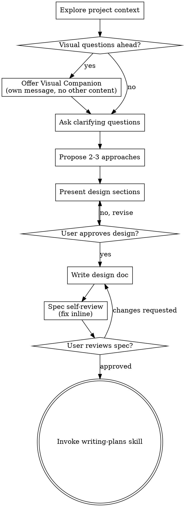
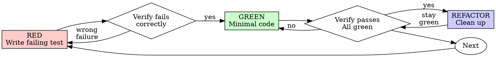
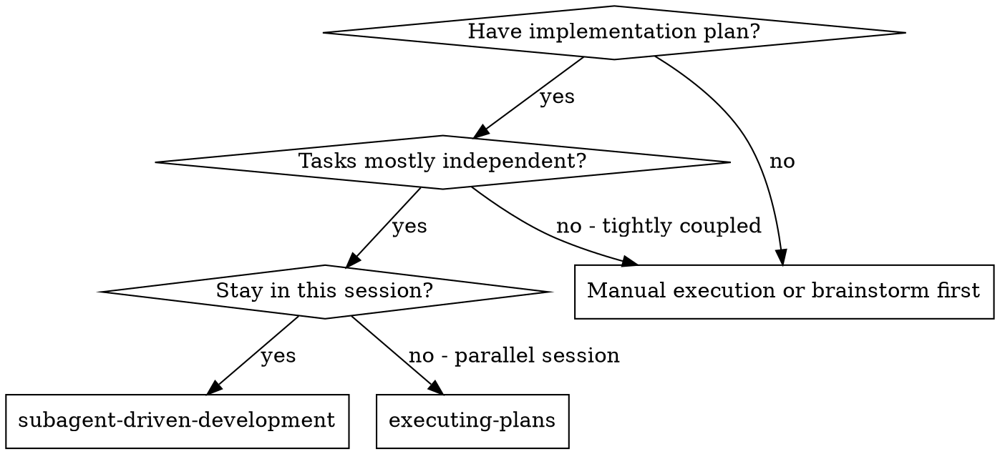
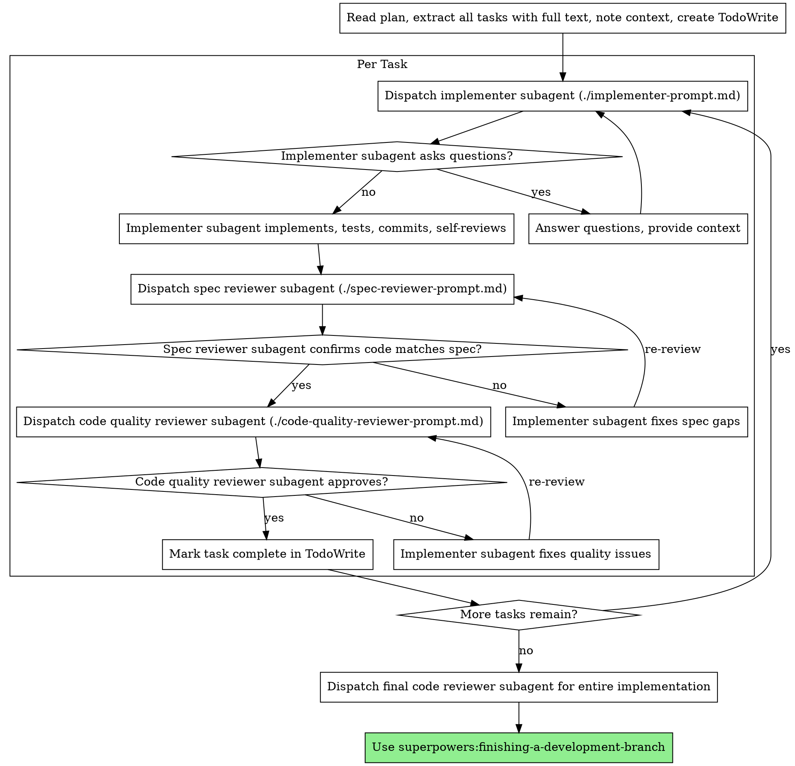

# M1C URL shortener implementation plan

**Session ID:** ses_1c0df50b8ffeDbwSG0mMZxATI1
**Created:** 5/19/2026, 10:26:07 AM
**Updated:** 5/19/2026, 11:19:36 AM

---

## User

Continue this project from M1C, Read docs/superpowers/plans/implementation-tracker.md and docs/superpowers/specs/2026-05-18-url-shortener-design.md. Create a small M1C plan then implement it, use worktrees and subagents.

---

## Assistant (Build · gpt-5.5 · 32.9s)

**Tool: skill**

**Input:**
```json
{
  "name": "brainstorming"
}
```

**Output:**
```
<skill_content name="brainstorming">
# Skill: brainstorming

# Brainstorming Ideas Into Designs

Help turn ideas into fully formed designs and specs through natural collaborative dialogue.

Start by understanding the current project context, then ask questions one at a time to refine the idea. Once you understand what you're building, present the design and get user approval.

<HARD-GATE>
Do NOT invoke any implementation skill, write any code, scaffold any project, or take any implementation action until you have presented a design and the user has approved it. This applies to EVERY project regardless of perceived simplicity.
</HARD-GATE>

## Anti-Pattern: "This Is Too Simple To Need A Design"

Every project goes through this process. A todo list, a single-function utility, a config change — all of them. "Simple" projects are where unexamined assumptions cause the most wasted work. The design can be short (a few sentences for truly simple projects), but you MUST present it and get approval.

## Checklist

You MUST create a task for each of these items and complete them in order:

1. **Explore project context** — check files, docs, recent commits
2. **Offer visual companion** (if topic will involve visual questions) — this is its own message, not combined with a clarifying question. See the Visual Companion section below.
3. **Ask clarifying questions** — one at a time, understand purpose/constraints/success criteria
4. **Propose 2-3 approaches** — with trade-offs and your recommendation
5. **Present design** — in sections scaled to their complexity, get user approval after each section
6. **Write design doc** — save to `docs/superpowers/specs/YYYY-MM-DD-<topic>-design.md` and commit
7. **Spec self-review** — quick inline check for placeholders, contradictions, ambiguity, scope (see below)
8. **User reviews written spec** — ask user to review the spec file before proceeding
9. **Transition to implementation** — invoke writing-plans skill to create implementation plan

## Process Flow



**The terminal state is invoking writing-plans.** Do NOT invoke frontend-design, mcp-builder, or any other implementation skill. The ONLY skill you invoke after brainstorming is writing-plans.

## The Process

**Understanding the idea:**

- Check out the current project state first (files, docs, recent commits)
- Before asking detailed questions, assess scope: if the request describes multiple independent subsystems (e.g., "build a platform with chat, file storage, billing, and analytics"), flag this immediately. Don't spend questions refining details of a project that needs to be decomposed first.
- If the project is too large for a single spec, help the user decompose into sub-projects: what are the independent pieces, how do they relate, what order should they be built? Then brainstorm the first sub-project through the normal design flow. Each sub-project gets its own spec → plan → implementation cycle.
- For appropriately-scoped projects, ask questions one at a time to refine the idea
- Prefer multiple choice questions when possible, but open-ended is fine too
- Only one question per message - if a topic needs more exploration, break it into multiple questions
- Focus on understanding: purpose, constraints, success criteria

**Exploring approaches:**

- Propose 2-3 different approaches with trade-offs
- Present options conversationally with your recommendation and reasoning
- Lead with your recommended option and explain why

**Presenting the design:**

- Once you believe you understand what you're building, present the design
- Scale each section to its complexity: a few sentences if straightforward, up to 200-300 words if nuanced
- Ask after each section whether it looks right so far
- Cover: architecture, components, data flow, error handling, testing
- Be ready to go back and clarify if something doesn't make sense

**Design for isolation and clarity:**

- Break the system into smaller units that each have one clear purpose, communicate through well-defined interfaces, and can be understood and tested independently
- For each unit, you should be able to answer: what does it do, how do you use it, and what does it depend on?
- Can someone understand what a unit does without reading its internals? Can you change the internals without breaking consumers? If not, the boundaries need work.
- Smaller, well-bounded units are also easier for you to work with - you reason better about code you can hold in context at once, and your edits are more reliable when files are focused. When a file grows large, that's often a signal that it's doing too much.

**Working in existing codebases:**

- Explore the current structure before proposing changes. Follow existing patterns.
- Where existing code has problems that affect the work (e.g., a file that's grown too large, unclear boundaries, tangled responsibilities), include targeted improvements as part of the design - the way a good developer improves code they're working in.
- Don't propose unrelated refactoring. Stay focused on what serves the current goal.

## After the Design

**Documentation:**

- Write the validated design (spec) to `docs/superpowers/specs/YYYY-MM-DD-<topic>-design.md`
  - (User preferences for spec location override this default)
- Use elements-of-style:writing-clearly-and-concisely skill if available
- Commit the design document to git

**Spec Self-Review:**
After writing the spec document, look at it with fresh eyes:

1. **Placeholder scan:** Any "TBD", "TODO", incomplete sections, or vague requirements? Fix them.
2. **Internal consistency:** Do any sections contradict each other? Does the architecture match the feature descriptions?
3. **Scope check:** Is this focused enough for a single implementation plan, or does it need decomposition?
4. **Ambiguity check:** Could any requirement be interpreted two different ways? If so, pick one and make it explicit.

Fix any issues inline. No need to re-review — just fix and move on.

**User Review Gate:**
After the spec review loop passes, ask the user to review the written spec before proceeding:

> "Spec written and committed to `<path>`. Please review it and let me know if you want to make any changes before we start writing out the implementation plan."

Wait for the user's response. If they request changes, make them and re-run the spec review loop. Only proceed once the user approves.

**Implementation:**

- Invoke the writing-plans skill to create a detailed implementation plan
- Do NOT invoke any other skill. writing-plans is the next step.

## Key Principles

- **One question at a time** - Don't overwhelm with multiple questions
- **Multiple choice preferred** - Easier to answer than open-ended when possible
- **YAGNI ruthlessly** - Remove unnecessary features from all designs
- **Explore alternatives** - Always propose 2-3 approaches before settling
- **Incremental validation** - Present design, get approval before moving on
- **Be flexible** - Go back and clarify when something doesn't make sense

## Visual Companion

A browser-based companion for showing mockups, diagrams, and visual options during brainstorming. Available as a tool — not a mode. Accepting the companion means it's available for questions that benefit from visual treatment; it does NOT mean every question goes through the browser.

**Offering the companion:** When you anticipate that upcoming questions will involve visual content (mockups, layouts, diagrams), offer it once for consent:
> "Some of what we're working on might be easier to explain if I can show it to you in a web browser. I can put together mockups, diagrams, comparisons, and other visuals as we go. This feature is still new and can be token-intensive. Want to try it? (Requires opening a local URL)"

**This offer MUST be its own message.** Do not combine it with clarifying questions, context summaries, or any other content. The message should contain ONLY the offer above and nothing else. Wait for the user's response before continuing. If they decline, proceed with text-only brainstorming.

**Per-question decision:** Even after the user accepts, decide FOR EACH QUESTION whether to use the browser or the terminal. The test: **would the user understand this better by seeing it than reading it?**

- **Use the browser** for content that IS visual — mockups, wireframes, layout comparisons, architecture diagrams, side-by-side visual designs
- **Use the terminal** for content that is text — requirements questions, conceptual choices, tradeoff lists, A/B/C/D text options, scope decisions

A question about a UI topic is not automatically a visual question. "What does personality mean in this context?" is a conceptual question — use the terminal. "Which wizard layout works better?" is a visual question — use the browser.

If they agree to the companion, read the detailed guide before proceeding:
`skills/brainstorming/visual-companion.md`

Base directory for this skill: file:///C:/Users/Shaheen/.cache/opencode/packages/superpowers@git+https_/github.com/obra/superpowers.git/node_modules/superpowers/skills/brainstorming
Relative paths in this skill (e.g., scripts/, reference/) are relative to this base directory.
Note: file list is sampled.

<skill_files>
<file>C:\Users\Shaheen\.cache\opencode\packages\superpowers@git+https_\github.com\obra\superpowers.git\node_modules\superpowers\skills\brainstorming\visual-companion.md</file>
<file>C:\Users\Shaheen\.cache\opencode\packages\superpowers@git+https_\github.com\obra\superpowers.git\node_modules\superpowers\skills\brainstorming\spec-document-reviewer-prompt.md</file>
<file>C:\Users\Shaheen\.cache\opencode\packages\superpowers@git+https_\github.com\obra\superpowers.git\node_modules\superpowers\skills\brainstorming\scripts\stop-server.sh</file>
<file>C:\Users\Shaheen\.cache\opencode\packages\superpowers@git+https_\github.com\obra\superpowers.git\node_modules\superpowers\skills\brainstorming\scripts\start-server.sh</file>
<file>C:\Users\Shaheen\.cache\opencode\packages\superpowers@git+https_\github.com\obra\superpowers.git\node_modules\superpowers\skills\brainstorming\scripts\server.cjs</file>
<file>C:\Users\Shaheen\.cache\opencode\packages\superpowers@git+https_\github.com\obra\superpowers.git\node_modules\superpowers\skills\brainstorming\scripts\helper.js</file>
<file>C:\Users\Shaheen\.cache\opencode\packages\superpowers@git+https_\github.com\obra\superpowers.git\node_modules\superpowers\skills\brainstorming\scripts\frame-template.html</file>
</skill_files>
</skill_content>
```

---

## Assistant (Build · gpt-5.5 · 11.4s)

Using brainstorming to anchor the continuation in the existing spec/tracker rather than inventing new scope. I’ll inspect those docs first, then move into a small M1C implementation plan and isolated worktree execution.

**Tool: skill**

**Input:**
```json
{
  "name": "writing-plans"
}
```

**Output:**
```
<skill_content name="writing-plans">
# Skill: writing-plans

# Writing Plans

## Overview

Write comprehensive implementation plans assuming the engineer has zero context for our codebase and questionable taste. Document everything they need to know: which files to touch for each task, code, testing, docs they might need to check, how to test it. Give them the whole plan as bite-sized tasks. DRY. YAGNI. TDD. Frequent commits.

Assume they are a skilled developer, but know almost nothing about our toolset or problem domain. Assume they don't know good test design very well.

**Announce at start:** "I'm using the writing-plans skill to create the implementation plan."

**Context:** If working in an isolated worktree, it should have been created via the `superpowers:using-git-worktrees` skill at execution time.

**Save plans to:** `docs/superpowers/plans/YYYY-MM-DD-<feature-name>.md`
- (User preferences for plan location override this default)

## Scope Check

If the spec covers multiple independent subsystems, it should have been broken into sub-project specs during brainstorming. If it wasn't, suggest breaking this into separate plans — one per subsystem. Each plan should produce working, testable software on its own.

## File Structure

Before defining tasks, map out which files will be created or modified and what each one is responsible for. This is where decomposition decisions get locked in.

- Design units with clear boundaries and well-defined interfaces. Each file should have one clear responsibility.
- You reason best about code you can hold in context at once, and your edits are more reliable when files are focused. Prefer smaller, focused files over large ones that do too much.
- Files that change together should live together. Split by responsibility, not by technical layer.
- In existing codebases, follow established patterns. If the codebase uses large files, don't unilaterally restructure - but if a file you're modifying has grown unwieldy, including a split in the plan is reasonable.

This structure informs the task decomposition. Each task should produce self-contained changes that make sense independently.

## Bite-Sized Task Granularity

**Each step is one action (2-5 minutes):**
- "Write the failing test" - step
- "Run it to make sure it fails" - step
- "Implement the minimal code to make the test pass" - step
- "Run the tests and make sure they pass" - step
- "Commit" - step

## Plan Document Header

**Every plan MUST start with this header:**

```markdown
# [Feature Name] Implementation Plan

> **For agentic workers:** REQUIRED SUB-SKILL: Use superpowers:subagent-driven-development (recommended) or superpowers:executing-plans to implement this plan task-by-task. Steps use checkbox (`- [ ]`) syntax for tracking.

**Goal:** [One sentence describing what this builds]

**Architecture:** [2-3 sentences about approach]

**Tech Stack:** [Key technologies/libraries]

---
```

## Task Structure

````markdown
### Task N: [Component Name]

**Files:**
- Create: `exact/path/to/file.py`
- Modify: `exact/path/to/existing.py:123-145`
- Test: `tests/exact/path/to/test.py`

- [ ] **Step 1: Write the failing test**

```python
def test_specific_behavior():
    result = function(input)
    assert result == expected
```

- [ ] **Step 2: Run test to verify it fails**

Run: `pytest tests/path/test.py::test_name -v`
Expected: FAIL with "function not defined"

- [ ] **Step 3: Write minimal implementation**

```python
def function(input):
    return expected
```

- [ ] **Step 4: Run test to verify it passes**

Run: `pytest tests/path/test.py::test_name -v`
Expected: PASS

- [ ] **Step 5: Commit**

```bash
git add tests/path/test.py src/path/file.py
git commit -m "feat: add specific feature"
```
````

## No Placeholders

Every step must contain the actual content an engineer needs. These are **plan failures** — never write them:
- "TBD", "TODO", "implement later", "fill in details"
- "Add appropriate error handling" / "add validation" / "handle edge cases"
- "Write tests for the above" (without actual test code)
- "Similar to Task N" (repeat the code — the engineer may be reading tasks out of order)
- Steps that describe what to do without showing how (code blocks required for code steps)
- References to types, functions, or methods not defined in any task

## Remember
- Exact file paths always
- Complete code in every step — if a step changes code, show the code
- Exact commands with expected output
- DRY, YAGNI, TDD, frequent commits

## Self-Review

After writing the complete plan, look at the spec with fresh eyes and check the plan against it. This is a checklist you run yourself — not a subagent dispatch.

**1. Spec coverage:** Skim each section/requirement in the spec. Can you point to a task that implements it? List any gaps.

**2. Placeholder scan:** Search your plan for red flags — any of the patterns from the "No Placeholders" section above. Fix them.

**3. Type consistency:** Do the types, method signatures, and property names you used in later tasks match what you defined in earlier tasks? A function called `clearLayers()` in Task 3 but `clearFullLayers()` in Task 7 is a bug.

If you find issues, fix them inline. No need to re-review — just fix and move on. If you find a spec requirement with no task, add the task.

## Execution Handoff

After saving the plan, offer execution choice:

**"Plan complete and saved to `docs/superpowers/plans/<filename>.md`. Two execution options:**

**1. Subagent-Driven (recommended)** - I dispatch a fresh subagent per task, review between tasks, fast iteration

**2. Inline Execution** - Execute tasks in this session using executing-plans, batch execution with checkpoints

**Which approach?"**

**If Subagent-Driven chosen:**
- **REQUIRED SUB-SKILL:** Use superpowers:subagent-driven-development
- Fresh subagent per task + two-stage review

**If Inline Execution chosen:**
- **REQUIRED SUB-SKILL:** Use superpowers:executing-plans
- Batch execution with checkpoints for review

Base directory for this skill: file:///C:/Users/Shaheen/.cache/opencode/packages/superpowers@git+https_/github.com/obra/superpowers.git/node_modules/superpowers/skills/writing-plans
Relative paths in this skill (e.g., scripts/, reference/) are relative to this base directory.
Note: file list is sampled.

<skill_files>
<file>C:\Users\Shaheen\.cache\opencode\packages\superpowers@git+https_\github.com\obra\superpowers.git\node_modules\superpowers\skills\writing-plans\plan-document-reviewer-prompt.md</file>
</skill_files>
</skill_content>
```

---

## Assistant (Build · gpt-5.5 · 6.3s)

**Tool: skill**

**Input:**
```json
{
  "name": "using-git-worktrees"
}
```

**Output:**
```
<skill_content name="using-git-worktrees">
# Skill: using-git-worktrees

# Using Git Worktrees

## Overview

Ensure work happens in an isolated workspace. Prefer your platform's native worktree tools. Fall back to manual git worktrees only when no native tool is available.

**Core principle:** Detect existing isolation first. Then use native tools. Then fall back to git. Never fight the harness.

**Announce at start:** "I'm using the using-git-worktrees skill to set up an isolated workspace."

## Step 0: Detect Existing Isolation

**Before creating anything, check if you are already in an isolated workspace.**

```bash
GIT_DIR=$(cd "$(git rev-parse --git-dir)" 2>/dev/null && pwd -P)
GIT_COMMON=$(cd "$(git rev-parse --git-common-dir)" 2>/dev/null && pwd -P)
BRANCH=$(git branch --show-current)
```

**Submodule guard:** `GIT_DIR != GIT_COMMON` is also true inside git submodules. Before concluding "already in a worktree," verify you are not in a submodule:

```bash
# If this returns a path, you're in a submodule, not a worktree — treat as normal repo
git rev-parse --show-superproject-working-tree 2>/dev/null
```

**If `GIT_DIR != GIT_COMMON` (and not a submodule):** You are already in a linked worktree. Skip to Step 3 (Project Setup). Do NOT create another worktree.

Report with branch state:
- On a branch: "Already in isolated workspace at `<path>` on branch `<name>`."
- Detached HEAD: "Already in isolated workspace at `<path>` (detached HEAD, externally managed). Branch creation needed at finish time."

**If `GIT_DIR == GIT_COMMON` (or in a submodule):** You are in a normal repo checkout.

Has the user already indicated their worktree preference in your instructions? If not, ask for consent before creating a worktree:

> "Would you like me to set up an isolated worktree? It protects your current branch from changes."

Honor any existing declared preference without asking. If the user declines consent, work in place and skip to Step 3.

## Step 1: Create Isolated Workspace

**You have two mechanisms. Try them in this order.**

### 1a. Native Worktree Tools (preferred)

The user has asked for an isolated workspace (Step 0 consent). Do you already have a way to create a worktree? It might be a tool with a name like `EnterWorktree`, `WorktreeCreate`, a `/worktree` command, or a `--worktree` flag. If you do, use it and skip to Step 3.

Native tools handle directory placement, branch creation, and cleanup automatically. Using `git worktree add` when you have a native tool creates phantom state your harness can't see or manage.

Only proceed to Step 1b if you have no native worktree tool available.

### 1b. Git Worktree Fallback

**Only use this if Step 1a does not apply** — you have no native worktree tool available. Create a worktree manually using git.

#### Directory Selection

Follow this priority order. Explicit user preference always beats observed filesystem state.

1. **Check your instructions for a declared worktree directory preference.** If the user has already specified one, use it without asking.

2. **Check for an existing project-local worktree directory:**
   ```bash
   ls -d .worktrees 2>/dev/null     # Preferred (hidden)
   ls -d worktrees 2>/dev/null      # Alternative
   ```
   If found, use it. If both exist, `.worktrees` wins.

3. **Check for an existing global directory:**
   ```bash
   project=$(basename "$(git rev-parse --show-toplevel)")
   ls -d ~/.config/superpowers/worktrees/$project 2>/dev/null
   ```
   If found, use it (backward compatibility with legacy global path).

4. **If there is no other guidance available**, default to `.worktrees/` at the project root.

#### Safety Verification (project-local directories only)

**MUST verify directory is ignored before creating worktree:**

```bash
git check-ignore -q .worktrees 2>/dev/null || git check-ignore -q worktrees 2>/dev/null
```

**If NOT ignored:** Add to .gitignore, commit the change, then proceed.

**Why critical:** Prevents accidentally committing worktree contents to repository.

Global directories (`~/.config/superpowers/worktrees/`) need no verification.

#### Create the Worktree

```bash
project=$(basename "$(git rev-parse --show-toplevel)")

# Determine path based on chosen location
# For project-local: path="$LOCATION/$BRANCH_NAME"
# For global: path="~/.config/superpowers/worktrees/$project/$BRANCH_NAME"

git worktree add "$path" -b "$BRANCH_NAME"
cd "$path"
```

**Sandbox fallback:** If `git worktree add` fails with a permission error (sandbox denial), tell the user the sandbox blocked worktree creation and you're working in the current directory instead. Then run setup and baseline tests in place.

## Step 3: Project Setup

Auto-detect and run appropriate setup:

```bash
# Node.js
if [ -f package.json ]; then npm install; fi

# Rust
if [ -f Cargo.toml ]; then cargo build; fi

# Python
if [ -f requirements.txt ]; then pip install -r requirements.txt; fi
if [ -f pyproject.toml ]; then poetry install; fi

# Go
if [ -f go.mod ]; then go mod download; fi
```

## Step 4: Verify Clean Baseline

Run tests to ensure workspace starts clean:

```bash
# Use project-appropriate command
npm test / cargo test / pytest / go test ./...
```

**If tests fail:** Report failures, ask whether to proceed or investigate.

**If tests pass:** Report ready.

### Report

```
Worktree ready at <full-path>
Tests passing (<N> tests, 0 failures)
Ready to implement <feature-name>
```

## Quick Reference

| Situation | Action |
|-----------|--------|
| Already in linked worktree | Skip creation (Step 0) |
| In a submodule | Treat as normal repo (Step 0 guard) |
| Native worktree tool available | Use it (Step 1a) |
| No native tool | Git worktree fallback (Step 1b) |
| `.worktrees/` exists | Use it (verify ignored) |
| `worktrees/` exists | Use it (verify ignored) |
| Both exist | Use `.worktrees/` |
| Neither exists | Check instruction file, then default `.worktrees/` |
| Global path exists | Use it (backward compat) |
| Directory not ignored | Add to .gitignore + commit |
| Permission error on create | Sandbox fallback, work in place |
| Tests fail during baseline | Report failures + ask |
| No package.json/Cargo.toml | Skip dependency install |

## Common Mistakes

### Fighting the harness

- **Problem:** Using `git worktree add` when the platform already provides isolation
- **Fix:** Step 0 detects existing isolation. Step 1a defers to native tools.

### Skipping detection

- **Problem:** Creating a nested worktree inside an existing one
- **Fix:** Always run Step 0 before creating anything

### Skipping ignore verification

- **Problem:** Worktree contents get tracked, pollute git status
- **Fix:** Always use `git check-ignore` before creating project-local worktree

### Assuming directory location

- **Problem:** Creates inconsistency, violates project conventions
- **Fix:** Follow priority: existing > global legacy > instruction file > default

### Proceeding with failing tests

- **Problem:** Can't distinguish new bugs from pre-existing issues
- **Fix:** Report failures, get explicit permission to proceed

## Red Flags

**Never:**
- Create a worktree when Step 0 detects existing isolation
- Use `git worktree add` when you have a native worktree tool (e.g., `EnterWorktree`). This is the #1 mistake — if you have it, use it.
- Skip Step 1a by jumping straight to Step 1b's git commands
- Create worktree without verifying it's ignored (project-local)
- Skip baseline test verification
- Proceed with failing tests without asking

**Always:**
- Run Step 0 detection first
- Prefer native tools over git fallback
- Follow directory priority: existing > global legacy > instruction file > default
- Verify directory is ignored for project-local
- Auto-detect and run project setup
- Verify clean test baseline

Base directory for this skill: file:///C:/Users/Shaheen/.cache/opencode/packages/superpowers@git+https_/github.com/obra/superpowers.git/node_modules/superpowers/skills/using-git-worktrees
Relative paths in this skill (e.g., scripts/, reference/) are relative to this base directory.
Note: file list is sampled.

<skill_files>

</skill_files>
</skill_content>
```

---

## Assistant (Build · gpt-5.5 · 4.8s)

I'm using the writing-plans skill to create the implementation plan. I'm using the using-git-worktrees skill to set up an isolated workspace.

**Tool: read**

**Input:**
```json
{
  "filePath": "C:\\Users\\Shaheen\\URL_shortner_super_powers\\docs\\superpowers\\plans\\implementation-tracker.md"
}
```

**Output:**
```
<path>C:\Users\Shaheen\URL_shortner_super_powers\docs\superpowers\plans\implementation-tracker.md</path>
<type>file</type>
<content>
1: # URL Shortener Implementation Tracker
2: 
3: Design spec: `docs/superpowers/specs/2026-05-18-url-shortener-design.md`
4: 
5: ## Milestones
6: 
7: - [x] M1A: Project scaffold, Fastify health endpoint, Docker Compose PostgreSQL
8: - [x] M1B: Prisma schema and database connection
9: - [ ] M1C: Public link creation validation and code generation
10: - [ ] M1D: Redirect route and click counting basics
11: - [ ] M2A: Admin authentication and sessions
12: - [ ] M2B: Admin link management API
13: - [ ] M2C: Admin analytics API
14: - [ ] M3A: Public React form
15: - [ ] M3B: Admin dashboard UI shell
16: - [ ] M3C: Dashboard charts and link table
17: - [ ] M4A: OpenAPI docs, Docker production image, final verification
18: 
19: ## Current Status
20: 
21: - Current plan: `docs/superpowers/plans/2026-05-19-url-shortener-m1b-prisma.md`
22: - Last updated: 2026-05-19

(End of file - total 22 lines)
</content>
```

**Tool: read**

**Input:**
```json
{
  "filePath": "C:\\Users\\Shaheen\\URL_shortner_super_powers\\docs\\superpowers\\specs\\2026-05-18-url-shortener-design.md"
}
```

**Output:**
```
<path>C:\Users\Shaheen\URL_shortner_super_powers\docs\superpowers\specs\2026-05-18-url-shortener-design.md</path>
<type>file</type>
<content>
1: # URL Shortener Backend And Admin Dashboard Design
2: 
3: ## Summary
4: 
5: Build a production-oriented URL shortener using a Node.js/TypeScript backend, PostgreSQL, and a React/Vite frontend. The service will support public anonymous link creation, short-link redirects, OpenAPI documentation, and a polished admin dashboard with link management and analytics.
6: 
7: The first version uses one deployable application container. PostgreSQL runs as a separate service, including through Docker Compose for local development.
8: 
9: ## Goals
10: 
11: - Public users can create short links without logging in.
12: - Public users can optionally choose a custom alias and optional expiration date.
13: - The service redirects active, non-expired short links and records human-looking clicks.
14: - Obvious bots and crawlers do not inflate analytics.
15: - Admins can log in, manage links, and view analytics charts by day, referrer, and device.
16: - The public API is documented with OpenAPI.
17: - The app runs locally with Docker Compose and is deployable as a Docker container.
18: 
19: ## Non-Goals For V1
20: 
21: - Public user accounts or link ownership.
22: - Public metadata endpoints for existing short links.
23: - Public stats pages.
24: - Multi-admin management UI.
25: - Separate domains for dashboard, API, and redirects.
26: - CAPTCHA or admin-managed denylists.
27: 
28: ## Technology Choices
29: 
30: - Backend: Fastify with TypeScript.
31: - Frontend: React with Vite.
32: - Database: PostgreSQL.
33: - Database access and migrations: Prisma.
34: - Admin authentication: cookie-based server-side sessions.
35: - Password hashing: Argon2.
36: - Deployment: Docker app container plus separate PostgreSQL service.
37: 
38: Fastify is preferred over a minimal Express setup because it has strong TypeScript ergonomics, schema-driven validation, OpenAPI-friendly route definitions, and good performance for redirect/API traffic.
39: 
40: ## Application Architecture
41: 
42: The repository will contain one full-stack application with clear backend and frontend boundaries:
43: 
44: - `server/`: Fastify API, redirect route, admin auth, OpenAPI docs, PostgreSQL access, validation, rate limiting, and operational endpoints.
45: - `web/`: React/Vite public form and admin dashboard.
46: - Docker Compose: local app and PostgreSQL services.
47: 
48: The same app serves public pages, admin pages, API routes, docs, and redirects from one domain.
49: 
50: Routes:
51: 
52: - `/`: public link creation page.
53: - `/api/links`: public REST endpoint for creating short links.
54: - `/api/admin/*`: authenticated admin APIs.
55: - `/docs`: OpenAPI documentation UI.
56: - `/admin/*`: React admin dashboard.
57: - `/:code`: short-link redirect route.
58: 
59: Reserved routes such as `admin`, `api`, `docs`, asset paths, and health routes cannot be used as custom aliases. The redirect route is registered so it does not swallow internal application routes.
60: 
61: ## Data Model
62: 
63: ### `links`
64: 
65: Stores each shortened URL.
66: 
67: Fields:
68: 
69: - `id`: primary key.
70: - `original_url`: destination URL.
71: - `short_code`: unique public code or alias.
72: - `is_custom_alias`: whether the code was user-supplied.
73: - `is_active`: whether redirects are allowed.
74: - `expires_at`: optional expiration timestamp.
75: - `total_click_count`: denormalized count for fast dashboard summaries.
76: - `created_at`: creation timestamp.
77: - `updated_at`: update timestamp.
78: 
79: ### `click_events`
80: 
81: Stores analytics events for counted clicks.
82: 
83: Fields:
84: 
85: - `id`: primary key.
86: - `link_id`: foreign key to `links`.
87: - `clicked_at`: event timestamp.
88: - `referrer_host`: normalized referrer host when available.
89: - `device_type`: coarse device category such as desktop, mobile, tablet, or unknown.
90: - `browser`: coarse browser/user-agent summary.
91: - `ip_hash`: irreversible hash or equivalent privacy-preserving representation.
92: 
93: Raw full IP addresses are not stored in click analytics.
94: 
95: ### `admin_users`
96: 
97: Stores admin login identities.
98: 
99: Fields:
100: 
101: - `id`: primary key.
102: - `email`: unique admin email.
103: - `password_hash`: Argon2 password hash.
104: - `created_at`: creation timestamp.
105: - `last_login_at`: optional last login timestamp.
106: 
107: The initial admin is created through a setup or seed command. V1 does not include public registration or admin user management screens.
108: 
109: ### `admin_sessions`
110: 
111: Stores server-side admin sessions.
112: 
113: Fields:
114: 
115: - `id`: primary key.
116: - `admin_user_id`: foreign key to `admin_users`.
117: - `session_token_hash`: hash of the browser session token.
118: - `expires_at`: session expiration timestamp.
119: - `created_at`: creation timestamp.
120: 
121: ## Public Link Creation
122: 
123: Public users can create links through both the web form and `POST /api/links`.
124: 
125: Request fields:
126: 
127: - `url`: required destination URL.
128: - `alias`: optional custom alias.
129: - `expiresAt`: optional expiration timestamp.
130: 
131: Validation rules:
132: 
133: - Destination URLs must use `http` or `https`.
134: - Localhost, private IP ranges, loopback addresses, and internal hostnames are blocked.
135: - Aliases must be URL-safe, length-limited, unique, and not reserved.
136: - Public creation is rate-limited by IP.
137: 
138: If no alias is provided, the backend generates a random URL-safe code and retries on uniqueness collisions. If a custom alias collides or fails validation, the API returns a clear validation error instead of silently replacing it.
139: 
140: Successful responses include the generated short URL based on the configured public base URL.
141: 
142: ## Redirect Behavior
143: 
144: When a user visits `/:code`, the service:
145: 
146: 1. Looks up the link by short code.
147: 2. Verifies the link exists, is active, and is not expired.
148: 3. Shows a branded unavailable page for missing, inactive, or expired links.
149: 4. Redirects valid links to their original URL.
150: 5. Records click analytics for human-looking visits.
151: 
152: Obvious bots and crawlers are redirected but not counted. Click recording should avoid adding noticeable latency to redirects. The dashboard uses `links.total_click_count` for fast summaries and `click_events` for detailed charts.
153: 
154: ## Public API
155: 
156: V1 exposes only the public API needed for anonymous link creation.
157: 
158: - `POST /api/links`: create a short link.
159: 
160: V1 does not expose `GET /api/links/:code` or other public metadata endpoints. Visitors use `GET /:code` for redirects, and admins use authenticated admin APIs for link metadata.
161: 
162: ## Admin Dashboard
163: 
164: The admin dashboard is a custom polished SaaS analytics interface built with React/Vite and served under `/admin/*`.
165: 
166: V1 features:
167: 
168: - Admin login and logout.
169: - Overview cards for total links, total clicks, active links, and recent clicks.
170: - Analytics charts by day, referrer, and device.
171: - Search, filter, and paginate all links.
172: - View link details and click history.
173: - Edit original URL, active status, and expiration date.
174: - Delete or deactivate links.
175: - Copy short URLs from the dashboard.
176: 
177: The visual direction should be clean and analytics-focused: crisp cards, strong typography, responsive charts, polished empty/loading states, and a restrained palette with one strong accent color.
178: 
179: ## Admin API
180: 
181: Admin APIs live under `/api/admin/*` and require an authenticated session.
182: 
183: Expected endpoint groups:
184: 
185: - Session endpoints for login, logout, and current admin.
186: - Link listing, searching, filtering, pagination, update, deletion, and deactivation.
187: - Link detail and click history endpoints.
188: - Analytics endpoints for time-series clicks, referrer breakdowns, and device breakdowns.
189: 
190: Admin requests without a valid session return `401`. Validation errors return structured JSON responses with stable error codes and readable messages.
191: 
192: ## Authentication And Sessions
193: 
194: Admin login uses database-backed admin users and server-side sessions.
195: 
196: Session cookie behavior:
197: 
198: - `HttpOnly` to prevent JavaScript access.
199: - `SameSite=Lax` for same-domain dashboard usage.
200: - `Secure` in production.
201: - Session token stored only as a hash in the database.
202: - Expired sessions are rejected and can be cleaned up periodically.
203: 
204: This avoids JWT storage complexity and fits the same-domain deployment model.
205: 
206: ## Error Handling
207: 
208: Public and admin APIs return consistent JSON errors with stable codes and human-readable messages. The public form renders these errors inline.
209: 
210: Redirect errors use branded HTML pages rather than JSON:
211: 
212: - Unknown short code.
213: - Inactive link.
214: - Expired link.
215: 
216: Operational errors should be logged server-side without leaking secrets or sensitive request data to users.
217: 
218: ## Security And Abuse Protection
219: 
220: Security requirements:
221: 
222: - Rate-limit public link creation by IP.
223: - Validate and normalize destination URLs.
224: - Block private network, loopback, localhost, and internal destinations.
225: - Reject unsafe or reserved aliases.
226: - Use Argon2 for admin passwords.
227: - Use secure cookie settings in production.
228: - Store hashed or privacy-preserving IP metadata for analytics rather than raw full IP addresses.
229: - Avoid logging secrets, session tokens, or full sensitive request bodies.
230: 
231: V1 does not include CAPTCHA or admin-managed denylists, but the design leaves room to add them later.
232: 
233: ## Configuration
234: 
235: Environment variables configure:
236: 
237: - App port.
238: - Database URL.
239: - Public base URL used when generating short links.
240: - Session secret or token signing material.
241: - Cookie secure mode.
242: - Rate limit settings.
243: - Optional log level.
244: 
245: The app assumes one base domain in v1, but the public base URL remains configurable so a dedicated short-link domain can be introduced later.
246: 
247: ## Operations
248: 
249: Local development uses Docker Compose with at least:
250: 
251: - App service.
252: - PostgreSQL service.
253: 
254: Operational endpoints:
255: 
256: - Health endpoint for container checks.
257: - OpenAPI documentation at `/docs`.
258: 
259: Database migrations manage schema changes. Seed or setup commands create the initial admin user.
260: 
261: ## Testing Strategy
262: 
263: Unit tests cover:
264: 
265: - Random short code generation and collision retry behavior.
266: - Alias validation and reserved alias rejection.
267: - URL validation and private network blocking.
268: - Bot detection.
269: - Expiration and active-status checks.
270: 
271: API tests cover:
272: 
273: - Public link creation.
274: - Validation and rate-limit errors.
275: - Redirect behavior for valid, missing, inactive, expired, and bot visits.
276: - Admin login/logout/session checks.
277: - Admin link search, edit, delete/deactivate, and analytics endpoints.
278: 
279: UI tests cover:
280: 
281: - Public form success and error states.
282: - Admin login.
283: - Dashboard overview rendering.
284: - Basic link table interactions.
285: 
286: ## Implementation Notes
287: 
288: - Keep the public API surface small in v1: only public link creation is exposed as JSON.
289: - Keep redirect logic separate from dashboard/API logic so it remains easy to test and optimize.
290: - Keep analytics aggregation behind admin API endpoints so chart implementation can change without affecting stored data.
291: - Prefer explicit route schemas to support validation and OpenAPI generation.

(End of file - total 291 lines)
</content>
```

**Tool: bash**

**Input:**
```json
{
  "command": "git rev-parse --git-dir; git rev-parse --git-common-dir; git branch --show-current; git rev-parse --show-superproject-working-tree",
  "description": "Detects current git worktree state"
}
```

**Output:**
```
.git
.git
main

```

---

## Assistant (Build · gpt-5.5 · 13.9s)

The repo is currently on `main`, not already in a linked worktree. Since you explicitly asked to use worktrees, I’ll create an isolated M1C worktree after checking the project-local worktree path is ignored.

**Tool: glob**

**Input:**
```json
{
  "pattern": ".worktrees"
}
```

**Output:**
```
No files found
```

**Tool: glob**

**Input:**
```json
{
  "pattern": "worktrees"
}
```

**Output:**
```
No files found
```

**Tool: read**

**Input:**
```json
{
  "filePath": "C:\\Users\\Shaheen\\URL_shortner_super_powers\\.gitignore"
}
```

**Output:**
```
<path>C:\Users\Shaheen\URL_shortner_super_powers\.gitignore</path>
<type>file</type>
<content>
1: .worktrees/
2: node_modules/
3: dist/
4: src/generated/
5: .env
6: .env.*
7: !.env.example

(End of file - total 7 lines)
</content>
```

**Tool: bash**

**Input:**
```json
{
  "command": "git check-ignore -q .worktrees; if ($?) { \"ignored:.worktrees\" } else { \"not-ignored:.worktrees\" }",
  "description": "Checks worktree directory ignore status"
}
```

**Output:**
```
ignored:.worktrees

```

**Tool: glob**

**Input:**
```json
{
  "pattern": "**/*.{ts,tsx,js,json,md,yml,yaml,prisma}"
}
```

**Output:**
```
C:\Users\Shaheen\URL_shortner_super_powers\package-lock.json
C:\Users\Shaheen\URL_shortner_super_powers\tests\health.test.ts
C:\Users\Shaheen\URL_shortner_super_powers\src\types\fastify.d.ts
C:\Users\Shaheen\URL_shortner_super_powers\src\server.ts
C:\Users\Shaheen\URL_shortner_super_powers\src\db.ts
C:\Users\Shaheen\URL_shortner_super_powers\prisma\schema.prisma
C:\Users\Shaheen\URL_shortner_super_powers\package.json
C:\Users\Shaheen\URL_shortner_super_powers\docs\superpowers\plans\implementation-tracker.md
C:\Users\Shaheen\URL_shortner_super_powers\docs\superpowers\plans\2026-05-19-url-shortener-m1b-prisma.md
C:\Users\Shaheen\URL_shortner_super_powers\tsconfig.json
C:\Users\Shaheen\URL_shortner_super_powers\tsconfig.build.json
C:\Users\Shaheen\URL_shortner_super_powers\src\index.ts
C:\Users\Shaheen\URL_shortner_super_powers\docker-compose.yml
C:\Users\Shaheen\URL_shortner_super_powers\docs\superpowers\plans\2026-05-19-url-shortener-m1a-scaffold.md
C:\Users\Shaheen\URL_shortner_super_powers\docs\superpowers\specs\2026-05-18-url-shortener-design.md
C:\Users\Shaheen\URL_shortner_super_powers\README.md
```

---

## Assistant (Build · gpt-5.5 · 4.5s)

`.worktrees/` is already ignored, so the isolated worktree can be created safely.

**Tool: bash**

**Input:**
```json
{
  "command": "git worktree add \".worktrees/m1c-public-link-creation\" -b \"m1c-public-link-creation\"",
  "description": "Creates isolated M1C worktree",
  "timeout": 120000
}
```

**Output:**
```
Preparing worktree (new branch 'm1c-public-link-creation')
HEAD is now at 8774c9a chore: sync lockfile install script metadata

```

---

## Assistant (Build · gpt-5.5 · 25.1s)

Worktree created at `.worktrees/m1c-public-link-creation`; I’ll inspect the existing app structure there, run setup/baseline checks, then write the small M1C plan in that worktree.

**Tool: read**

**Input:**
```json
{
  "filePath": "C:\\Users\\Shaheen\\URL_shortner_super_powers\\.worktrees\\m1c-public-link-creation\\package.json"
}
```

**Output:**
```
<path>C:\Users\Shaheen\URL_shortner_super_powers\.worktrees\m1c-public-link-creation\package.json</path>
<type>file</type>
<content>
1: {
2:   "name": "url-shortener-super-powers",
3:   "version": "0.1.0",
4:   "private": true,
5:   "type": "module",
6:   "scripts": {
7:     "dev": "tsx watch src/index.ts",
8:     "postinstall": "prisma generate",
9:     "prebuild": "node -e \"fs.rmSync('dist', { recursive: true, force: true })\"",
10:     "build": "tsc -p tsconfig.build.json",
11:     "typecheck": "tsc -p tsconfig.json --noEmit",
12:     "start": "node dist/index.js",
13:     "test": "vitest run --exclude dist/**",
14:     "db:generate": "prisma generate",
15:     "db:migrate": "prisma migrate dev",
16:     "db:studio": "prisma studio"
17:   },
18:   "dependencies": {
19:     "@fastify/cors": "11.1.0",
20:     "@fastify/helmet": "13.0.2",
21:     "@prisma/client": "^7.8.0",
22:     "fastify": "5.8.5",
23:     "fastify-plugin": "^5.1.0"
24:   },
25:   "devDependencies": {
26:     "@types/node": "24.10.1",
27:     "prisma": "^7.8.0",
28:     "tsx": "4.20.6",
29:     "typescript": "5.9.3",
30:     "vitest": "4.0.14"
31:   }
32: }

(End of file - total 32 lines)
</content>
```

**Tool: read**

**Input:**
```json
{
  "filePath": "C:\\Users\\Shaheen\\URL_shortner_super_powers\\.worktrees\\m1c-public-link-creation\\src\\server.ts"
}
```

**Output:**
```
<path>C:\Users\Shaheen\URL_shortner_super_powers\.worktrees\m1c-public-link-creation\src\server.ts</path>
<type>file</type>
<content>
1: import Fastify from "fastify";
2: import helmet from "@fastify/helmet";
3: import { database, type DatabaseClient } from "./db.js";
4: 
5: type ServerOptions = {
6:   logger?: boolean;
7:   prisma?: DatabaseClient;
8: };
9: 
10: export function buildServer(options: ServerOptions = {}) {
11:   const app = Fastify({ logger: options.logger ?? true });
12: 
13:   app.register(helmet);
14:   app.register(database, { prisma: options.prisma });
15: 
16:   app.get("/health", async (_request, reply) => {
17:     try {
18:       await app.prisma.$queryRaw`SELECT 1`;
19: 
20:       return { status: "ok", database: "ok" };
21:     } catch (error) {
22:       app.log.warn({ error }, "database health check failed");
23: 
24:       return reply.code(503).send({ status: "error", database: "unavailable" });
25:     }
26:   });
27: 
28:   return app;
29: }

(End of file - total 29 lines)
</content>
```

**Tool: read**

**Input:**
```json
{
  "filePath": "C:\\Users\\Shaheen\\URL_shortner_super_powers\\.worktrees\\m1c-public-link-creation\\src\\db.ts"
}
```

**Output:**
```
<path>C:\Users\Shaheen\URL_shortner_super_powers\.worktrees\m1c-public-link-creation\src\db.ts</path>
<type>file</type>
<content>
1: import { PrismaClient } from "./generated/prisma/client.js";
2: import fp from "fastify-plugin";
3: import type { FastifyPluginAsync } from "fastify";
4: 
5: export type DatabaseClient = {
6:   $queryRaw: (query: TemplateStringsArray, ...values: unknown[]) => Promise<unknown>;
7:   $disconnect: () => Promise<void>;
8: };
9: 
10: type DatabasePluginOptions = {
11:   prisma?: DatabaseClient;
12: };
13: 
14: export function createPrismaClient(): PrismaClient {
15:   return new PrismaClient();
16: }
17: 
18: const databasePlugin: FastifyPluginAsync<DatabasePluginOptions> = async (app, options) => {
19:   const prisma = options.prisma ?? createPrismaClient();
20: 
21:   app.decorate("prisma", prisma);
22:   app.addHook("onClose", async () => {
23:     await prisma.$disconnect();
24:   });
25: };
26: 
27: export const database = fp(databasePlugin, { name: "database" });

(End of file - total 27 lines)
</content>
```

**Tool: read**

**Input:**
```json
{
  "filePath": "C:\\Users\\Shaheen\\URL_shortner_super_powers\\.worktrees\\m1c-public-link-creation\\tests\\health.test.ts"
}
```

**Output:**
```
<path>C:\Users\Shaheen\URL_shortner_super_powers\.worktrees\m1c-public-link-creation\tests\health.test.ts</path>
<type>file</type>
<content>
1: import { describe, expect, it } from "vitest";
2: import { buildServer } from "../src/server.js";
3: 
4: function createPrismaStub(queryRaw: () => Promise<unknown>) {
5:   return {
6:     $queryRaw: queryRaw,
7:     $disconnect: async () => {},
8:   };
9: }
10: 
11: describe("health endpoint", () => {
12:   it("returns ok status when the database is reachable", async () => {
13:     const app = buildServer({
14:       logger: false,
15:       prisma: createPrismaStub(async () => [{ "?column?": 1 }]),
16:     });
17: 
18:     try {
19:       const response = await app.inject({ method: "GET", url: "/health" });
20: 
21:       expect(response.statusCode).toBe(200);
22:       expect(response.json()).toEqual({ status: "ok", database: "ok" });
23:     } finally {
24:       await app.close();
25:     }
26:   });
27: 
28:   it("returns unavailable status when the database cannot be reached", async () => {
29:     const app = buildServer({
30:       logger: false,
31:       prisma: createPrismaStub(async () => {
32:         throw new Error("database unavailable");
33:       }),
34:     });
35: 
36:     try {
37:       const response = await app.inject({ method: "GET", url: "/health" });
38: 
39:       expect(response.statusCode).toBe(503);
40:       expect(response.json()).toEqual({ status: "error", database: "unavailable" });
41:     } finally {
42:       await app.close();
43:     }
44:   });
45: });

(End of file - total 45 lines)
</content>
```

**Tool: read**

**Input:**
```json
{
  "filePath": "C:\\Users\\Shaheen\\URL_shortner_super_powers\\.worktrees\\m1c-public-link-creation\\prisma\\schema.prisma"
}
```

**Output:**
```
<path>C:\Users\Shaheen\URL_shortner_super_powers\.worktrees\m1c-public-link-creation\prisma\schema.prisma</path>
<type>file</type>
<content>
1: generator client {
2:   provider = "prisma-client-js"
3:   output   = "../src/generated/prisma"
4: }
5: 
6: datasource db {
7:   provider = "postgresql"
8: }
9: 
10: model Link {
11:   id              String       @id @default(uuid()) @db.Uuid
12:   originalUrl     String       @map("original_url") @db.Text
13:   shortCode       String       @unique @map("short_code") @db.VarChar(64)
14:   isCustomAlias   Boolean      @default(false) @map("is_custom_alias")
15:   isActive        Boolean      @default(true) @map("is_active")
16:   expiresAt       DateTime?    @map("expires_at") @db.Timestamptz(6)
17:   totalClickCount Int          @default(0) @map("total_click_count")
18:   createdAt       DateTime     @default(now()) @map("created_at") @db.Timestamptz(6)
19:   updatedAt       DateTime     @updatedAt @map("updated_at") @db.Timestamptz(6)
20:   clickEvents     ClickEvent[]
21: 
22:   @@index([createdAt])
23:   @@index([isActive, expiresAt])
24:   @@map("links")
25: }
26: 
27: model ClickEvent {
28:   id           String   @id @default(uuid()) @db.Uuid
29:   linkId       String   @map("link_id") @db.Uuid
30:   clickedAt    DateTime @default(now()) @map("clicked_at") @db.Timestamptz(6)
31:   referrerHost String?  @map("referrer_host") @db.VarChar(255)
32:   deviceType   String   @default("unknown") @map("device_type") @db.VarChar(32)
33:   browser      String?  @db.VarChar(128)
34:   ipHash       String?  @map("ip_hash") @db.VarChar(128)
35:   link         Link     @relation(fields: [linkId], references: [id], onDelete: Cascade)
36: 
37:   @@index([linkId, clickedAt])
38:   @@index([clickedAt])
39:   @@map("click_events")
40: }
41: 
42: model AdminUser {
43:   id           String         @id @default(uuid()) @db.Uuid
44:   email        String         @unique @db.VarChar(255)
45:   passwordHash String         @map("password_hash") @db.Text
46:   createdAt    DateTime       @default(now()) @map("created_at") @db.Timestamptz(6)
47:   lastLoginAt  DateTime?      @map("last_login_at") @db.Timestamptz(6)
48:   sessions     AdminSession[]
49: 
50:   @@map("admin_users")
51: }
52: 
53: model AdminSession {
54:   id               String    @id @default(uuid()) @db.Uuid
55:   adminUserId      String    @map("admin_user_id") @db.Uuid
56:   sessionTokenHash String    @unique @map("session_token_hash") @db.VarChar(128)
57:   expiresAt        DateTime  @map("expires_at") @db.Timestamptz(6)
58:   createdAt        DateTime  @default(now()) @map("created_at") @db.Timestamptz(6)
59:   adminUser        AdminUser @relation(fields: [adminUserId], references: [id], onDelete: Cascade)
60: 
61:   @@index([adminUserId])
62:   @@index([expiresAt])
63:   @@map("admin_sessions")
64: }

(End of file - total 64 lines)
</content>
```

**Tool: bash**

**Input:**
```json
{
  "command": "npm install",
  "workdir": "C:\\Users\\Shaheen\\URL_shortner_super_powers\\.worktrees\\m1c-public-link-creation",
  "description": "Installs worktree dependencies",
  "timeout": 120000
}
```

**Output:**
```

> url-shortener-super-powers@0.1.0 postinstall
> prisma generate

Prisma schema loaded from prisma\schema.prisma.

✔ Generated Prisma Client (v7.8.0) to .\src\generated\prisma in 141ms

Start by importing your Prisma Client (See: https://pris.ly/d/importing-client)


added 191 packages, and audited 192 packages in 18s

49 packages are looking for funding
  run `npm fund` for details

3 moderate severity vulnerabilities

To address all issues (including breaking changes), run:
  npm audit fix --force

Run `npm audit` for details.

```

---

## Assistant (Build · gpt-5.5 · 12.8s)

**Tool: bash**

**Input:**
```json
{
  "command": "npm test",
  "workdir": "C:\\Users\\Shaheen\\URL_shortner_super_powers\\.worktrees\\m1c-public-link-creation",
  "description": "Runs baseline test suite",
  "timeout": 120000
}
```

**Output:**
```

> url-shortener-super-powers@0.1.0 test
> vitest run --exclude dist/**


 RUN  v4.0.14 C:/Users/Shaheen/URL_shortner_super_powers/.worktrees/m1c-public-link-creation

 ✓ tests/health.test.ts (2 tests) 266ms

 Test Files  1 passed (1)
      Tests  2 passed (2)
   Start at  10:27:56
   Duration  999ms (transform 129ms, setup 0ms, import 473ms, tests 266ms, environment 0ms)


```

**Tool: bash**

**Input:**
```json
{
  "command": "npm run typecheck",
  "workdir": "C:\\Users\\Shaheen\\URL_shortner_super_powers\\.worktrees\\m1c-public-link-creation",
  "description": "Runs baseline typecheck",
  "timeout": 120000
}
```

**Output:**
```

> url-shortener-super-powers@0.1.0 typecheck
> tsc -p tsconfig.json --noEmit


```

**Tool: bash**

**Input:**
```json
{
  "command": "git status --short",
  "workdir": "C:\\Users\\Shaheen\\URL_shortner_super_powers\\.worktrees\\m1c-public-link-creation",
  "description": "Shows worktree status"
}
```

**Output:**
```
(no output)
```

---

## Assistant (Build · gpt-5.5 · 10.9s)

Baseline is clean in the isolated worktree: `npm install`, `npm test`, and `npm run typecheck` all completed successfully. Next I’m writing a focused M1C plan around public link creation validation, generation, and the `POST /api/links` endpoint.

**Tool: skill**

**Input:**
```json
{
  "name": "test-driven-development"
}
```

**Output:**
```
<skill_content name="test-driven-development">
# Skill: test-driven-development

# Test-Driven Development (TDD)

## Overview

Write the test first. Watch it fail. Write minimal code to pass.

**Core principle:** If you didn't watch the test fail, you don't know if it tests the right thing.

**Violating the letter of the rules is violating the spirit of the rules.**

## When to Use

**Always:**
- New features
- Bug fixes
- Refactoring
- Behavior changes

**Exceptions (ask your human partner):**
- Throwaway prototypes
- Generated code
- Configuration files

Thinking "skip TDD just this once"? Stop. That's rationalization.

## The Iron Law

```
NO PRODUCTION CODE WITHOUT A FAILING TEST FIRST
```

Write code before the test? Delete it. Start over.

**No exceptions:**
- Don't keep it as "reference"
- Don't "adapt" it while writing tests
- Don't look at it
- Delete means delete

Implement fresh from tests. Period.

## Red-Green-Refactor



### RED - Write Failing Test

Write one minimal test showing what should happen.

<Good>
```typescript
test('retries failed operations 3 times', async () => {
  let attempts = 0;
  const operation = () => {
    attempts++;
    if (attempts < 3) throw new Error('fail');
    return 'success';
  };

  const result = await retryOperation(operation);

  expect(result).toBe('success');
  expect(attempts).toBe(3);
});
```
Clear name, tests real behavior, one thing
</Good>

<Bad>
```typescript
test('retry works', async () => {
  const mock = jest.fn()
    .mockRejectedValueOnce(new Error())
    .mockRejectedValueOnce(new Error())
    .mockResolvedValueOnce('success');
  await retryOperation(mock);
  expect(mock).toHaveBeenCalledTimes(3);
});
```
Vague name, tests mock not code
</Bad>

**Requirements:**
- One behavior
- Clear name
- Real code (no mocks unless unavoidable)

### Verify RED - Watch It Fail

**MANDATORY. Never skip.**

```bash
npm test path/to/test.test.ts
```

Confirm:
- Test fails (not errors)
- Failure message is expected
- Fails because feature missing (not typos)

**Test passes?** You're testing existing behavior. Fix test.

**Test errors?** Fix error, re-run until it fails correctly.

### GREEN - Minimal Code

Write simplest code to pass the test.

<Good>
```typescript
async function retryOperation<T>(fn: () => Promise<T>): Promise<T> {
  for (let i = 0; i < 3; i++) {
    try {
      return await fn();
    } catch (e) {
      if (i === 2) throw e;
    }
  }
  throw new Error('unreachable');
}
```
Just enough to pass
</Good>

<Bad>
```typescript
async function retryOperation<T>(
  fn: () => Promise<T>,
  options?: {
    maxRetries?: number;
    backoff?: 'linear' | 'exponential';
    onRetry?: (attempt: number) => void;
  }
): Promise<T> {
  // YAGNI
}
```
Over-engineered
</Bad>

Don't add features, refactor other code, or "improve" beyond the test.

### Verify GREEN - Watch It Pass

**MANDATORY.**

```bash
npm test path/to/test.test.ts
```

Confirm:
- Test passes
- Other tests still pass
- Output pristine (no errors, warnings)

**Test fails?** Fix code, not test.

**Other tests fail?** Fix now.

### REFACTOR - Clean Up

After green only:
- Remove duplication
- Improve names
- Extract helpers

Keep tests green. Don't add behavior.

### Repeat

Next failing test for next feature.

## Good Tests

| Quality | Good | Bad |
|---------|------|-----|
| **Minimal** | One thing. "and" in name? Split it. | `test('validates email and domain and whitespace')` |
| **Clear** | Name describes behavior | `test('test1')` |
| **Shows intent** | Demonstrates desired API | Obscures what code should do |

## Why Order Matters

**"I'll write tests after to verify it works"**

Tests written after code pass immediately. Passing immediately proves nothing:
- Might test wrong thing
- Might test implementation, not behavior
- Might miss edge cases you forgot
- You never saw it catch the bug

Test-first forces you to see the test fail, proving it actually tests something.

**"I already manually tested all the edge cases"**

Manual testing is ad-hoc. You think you tested everything but:
- No record of what you tested
- Can't re-run when code changes
- Easy to forget cases under pressure
- "It worked when I tried it" ≠ comprehensive

Automated tests are systematic. They run the same way every time.

**"Deleting X hours of work is wasteful"**

Sunk cost fallacy. The time is already gone. Your choice now:
- Delete and rewrite with TDD (X more hours, high confidence)
- Keep it and add tests after (30 min, low confidence, likely bugs)

The "waste" is keeping code you can't trust. Working code without real tests is technical debt.

**"TDD is dogmatic, being pragmatic means adapting"**

TDD IS pragmatic:
- Finds bugs before commit (faster than debugging after)
- Prevents regressions (tests catch breaks immediately)
- Documents behavior (tests show how to use code)
- Enables refactoring (change freely, tests catch breaks)

"Pragmatic" shortcuts = debugging in production = slower.

**"Tests after achieve the same goals - it's spirit not ritual"**

No. Tests-after answer "What does this do?" Tests-first answer "What should this do?"

Tests-after are biased by your implementation. You test what you built, not what's required. You verify remembered edge cases, not discovered ones.

Tests-first force edge case discovery before implementing. Tests-after verify you remembered everything (you didn't).

30 minutes of tests after ≠ TDD. You get coverage, lose proof tests work.

## Common Rationalizations

| Excuse | Reality |
|--------|---------|
| "Too simple to test" | Simple code breaks. Test takes 30 seconds. |
| "I'll test after" | Tests passing immediately prove nothing. |
| "Tests after achieve same goals" | Tests-after = "what does this do?" Tests-first = "what should this do?" |
| "Already manually tested" | Ad-hoc ≠ systematic. No record, can't re-run. |
| "Deleting X hours is wasteful" | Sunk cost fallacy. Keeping unverified code is technical debt. |
| "Keep as reference, write tests first" | You'll adapt it. That's testing after. Delete means delete. |
| "Need to explore first" | Fine. Throw away exploration, start with TDD. |
| "Test hard = design unclear" | Listen to test. Hard to test = hard to use. |
| "TDD will slow me down" | TDD faster than debugging. Pragmatic = test-first. |
| "Manual test faster" | Manual doesn't prove edge cases. You'll re-test every change. |
| "Existing code has no tests" | You're improving it. Add tests for existing code. |

## Red Flags - STOP and Start Over

- Code before test
- Test after implementation
- Test passes immediately
- Can't explain why test failed
- Tests added "later"
- Rationalizing "just this once"
- "I already manually tested it"
- "Tests after achieve the same purpose"
- "It's about spirit not ritual"
- "Keep as reference" or "adapt existing code"
- "Already spent X hours, deleting is wasteful"
- "TDD is dogmatic, I'm being pragmatic"
- "This is different because..."

**All of these mean: Delete code. Start over with TDD.**

## Example: Bug Fix

**Bug:** Empty email accepted

**RED**
```typescript
test('rejects empty email', async () => {
  const result = await submitForm({ email: '' });
  expect(result.error).toBe('Email required');
});
```

**Verify RED**
```bash
$ npm test
FAIL: expected 'Email required', got undefined
```

**GREEN**
```typescript
function submitForm(data: FormData) {
  if (!data.email?.trim()) {
    return { error: 'Email required' };
  }
  // ...
}
```

**Verify GREEN**
```bash
$ npm test
PASS
```

**REFACTOR**
Extract validation for multiple fields if needed.

## Verification Checklist

Before marking work complete:

- [ ] Every new function/method has a test
- [ ] Watched each test fail before implementing
- [ ] Each test failed for expected reason (feature missing, not typo)
- [ ] Wrote minimal code to pass each test
- [ ] All tests pass
- [ ] Output pristine (no errors, warnings)
- [ ] Tests use real code (mocks only if unavoidable)
- [ ] Edge cases and errors covered

Can't check all boxes? You skipped TDD. Start over.

## When Stuck

| Problem | Solution |
|---------|----------|
| Don't know how to test | Write wished-for API. Write assertion first. Ask your human partner. |
| Test too complicated | Design too complicated. Simplify interface. |
| Must mock everything | Code too coupled. Use dependency injection. |
| Test setup huge | Extract helpers. Still complex? Simplify design. |

## Debugging Integration

Bug found? Write failing test reproducing it. Follow TDD cycle. Test proves fix and prevents regression.

Never fix bugs without a test.

## Testing Anti-Patterns

When adding mocks or test utilities, read @testing-anti-patterns.md to avoid common pitfalls:
- Testing mock behavior instead of real behavior
- Adding test-only methods to production classes
- Mocking without understanding dependencies

## Final Rule

```
Production code → test exists and failed first
Otherwise → not TDD
```

No exceptions without your human partner's permission.

Base directory for this skill: file:///C:/Users/Shaheen/.cache/opencode/packages/superpowers@git+https_/github.com/obra/superpowers.git/node_modules/superpowers/skills/test-driven-development
Relative paths in this skill (e.g., scripts/, reference/) are relative to this base directory.
Note: file list is sampled.

<skill_files>
<file>C:\Users\Shaheen\.cache\opencode\packages\superpowers@git+https_\github.com\obra\superpowers.git\node_modules\superpowers\skills\test-driven-development\testing-anti-patterns.md</file>
</skill_files>
</skill_content>
```

---

## Assistant (Build · gpt-5.5 · 5.1s)

Using test-driven-development for M1C implementation so production behavior is added only after failing tests.

**Tool: skill**

**Input:**
```json
{
  "name": "subagent-driven-development"
}
```

**Output:**
```
<skill_content name="subagent-driven-development">
# Skill: subagent-driven-development

# Subagent-Driven Development

Execute plan by dispatching fresh subagent per task, with two-stage review after each: spec compliance review first, then code quality review.

**Why subagents:** You delegate tasks to specialized agents with isolated context. By precisely crafting their instructions and context, you ensure they stay focused and succeed at their task. They should never inherit your session's context or history — you construct exactly what they need. This also preserves your own context for coordination work.

**Core principle:** Fresh subagent per task + two-stage review (spec then quality) = high quality, fast iteration

**Continuous execution:** Do not pause to check in with your human partner between tasks. Execute all tasks from the plan without stopping. The only reasons to stop are: BLOCKED status you cannot resolve, ambiguity that genuinely prevents progress, or all tasks complete. "Should I continue?" prompts and progress summaries waste their time — they asked you to execute the plan, so execute it.

## When to Use



**vs. Executing Plans (parallel session):**
- Same session (no context switch)
- Fresh subagent per task (no context pollution)
- Two-stage review after each task: spec compliance first, then code quality
- Faster iteration (no human-in-loop between tasks)

## The Process



## Model Selection

Use the least powerful model that can handle each role to conserve cost and increase speed.

**Mechanical implementation tasks** (isolated functions, clear specs, 1-2 files): use a fast, cheap model. Most implementation tasks are mechanical when the plan is well-specified.

**Integration and judgment tasks** (multi-file coordination, pattern matching, debugging): use a standard model.

**Architecture, design, and review tasks**: use the most capable available model.

**Task complexity signals:**
- Touches 1-2 files with a complete spec → cheap model
- Touches multiple files with integration concerns → standard model
- Requires design judgment or broad codebase understanding → most capable model

## Handling Implementer Status

Implementer subagents report one of four statuses. Handle each appropriately:

**DONE:** Proceed to spec compliance review.

**DONE_WITH_CONCERNS:** The implementer completed the work but flagged doubts. Read the concerns before proceeding. If the concerns are about correctness or scope, address them before review. If they're observations (e.g., "this file is getting large"), note them and proceed to review.

**NEEDS_CONTEXT:** The implementer needs information that wasn't provided. Provide the missing context and re-dispatch.

**BLOCKED:** The implementer cannot complete the task. Assess the blocker:
1. If it's a context problem, provide more context and re-dispatch with the same model
2. If the task requires more reasoning, re-dispatch with a more capable model
3. If the task is too large, break it into smaller pieces
4. If the plan itself is wrong, escalate to the human

**Never** ignore an escalation or force the same model to retry without changes. If the implementer said it's stuck, something needs to change.

## Prompt Templates

- `./implementer-prompt.md` - Dispatch implementer subagent
- `./spec-reviewer-prompt.md` - Dispatch spec compliance reviewer subagent
- `./code-quality-reviewer-prompt.md` - Dispatch code quality reviewer subagent

## Example Workflow

```
You: I'm using Subagent-Driven Development to execute this plan.

[Read plan file once: docs/superpowers/plans/feature-plan.md]
[Extract all 5 tasks with full text and context]
[Create TodoWrite with all tasks]

Task 1: Hook installation script

[Get Task 1 text and context (already extracted)]
[Dispatch implementation subagent with full task text + context]

Implementer: "Before I begin - should the hook be installed at user or system level?"

You: "User level (~/.config/superpowers/hooks/)"

Implementer: "Got it. Implementing now..."
[Later] Implementer:
  - Implemented install-hook command
  - Added tests, 5/5 passing
  - Self-review: Found I missed --force flag, added it
  - Committed

[Dispatch spec compliance reviewer]
Spec reviewer: ✅ Spec compliant - all requirements met, nothing extra

[Get git SHAs, dispatch code quality reviewer]
Code reviewer: Strengths: Good test coverage, clean. Issues: None. Approved.

[Mark Task 1 complete]

Task 2: Recovery modes

[Get Task 2 text and context (already extracted)]
[Dispatch implementation subagent with full task text + context]

Implementer: [No questions, proceeds]
Implementer:
  - Added verify/repair modes
  - 8/8 tests passing
  - Self-review: All good
  - Committed

[Dispatch spec compliance reviewer]
Spec reviewer: ❌ Issues:
  - Missing: Progress reporting (spec says "report every 100 items")
  - Extra: Added --json flag (not requested)

[Implementer fixes issues]
Implementer: Removed --json flag, added progress reporting

[Spec reviewer reviews again]
Spec reviewer: ✅ Spec compliant now

[Dispatch code quality reviewer]
Code reviewer: Strengths: Solid. Issues (Important): Magic number (100)

[Implementer fixes]
Implementer: Extracted PROGRESS_INTERVAL constant

[Code reviewer reviews again]
Code reviewer: ✅ Approved

[Mark Task 2 complete]

...

[After all tasks]
[Dispatch final code-reviewer]
Final reviewer: All requirements met, ready to merge

Done!
```

## Advantages

**vs. Manual execution:**
- Subagents follow TDD naturally
- Fresh context per task (no confusion)
- Parallel-safe (subagents don't interfere)
- Subagent can ask questions (before AND during work)

**vs. Executing Plans:**
- Same session (no handoff)
- Continuous progress (no waiting)
- Review checkpoints automatic

**Efficiency gains:**
- No file reading overhead (controller provides full text)
- Controller curates exactly what context is needed
- Subagent gets complete information upfront
- Questions surfaced before work begins (not after)

**Quality gates:**
- Self-review catches issues before handoff
- Two-stage review: spec compliance, then code quality
- Review loops ensure fixes actually work
- Spec compliance prevents over/under-building
- Code quality ensures implementation is well-built

**Cost:**
- More subagent invocations (implementer + 2 reviewers per task)
- Controller does more prep work (extracting all tasks upfront)
- Review loops add iterations
- But catches issues early (cheaper than debugging later)

## Red Flags

**Never:**
- Start implementation on main/master branch without explicit user consent
- Skip reviews (spec compliance OR code quality)
- Proceed with unfixed issues
- Dispatch multiple implementation subagents in parallel (conflicts)
- Make subagent read plan file (provide full text instead)
- Skip scene-setting context (subagent needs to understand where task fits)
- Ignore subagent questions (answer before letting them proceed)
- Accept "close enough" on spec compliance (spec reviewer found issues = not done)
- Skip review loops (reviewer found issues = implementer fixes = review again)
- Let implementer self-review replace actual review (both are needed)
- **Start code quality review before spec compliance is ✅** (wrong order)
- Move to next task while either review has open issues

**If subagent asks questions:**
- Answer clearly and completely
- Provide additional context if needed
- Don't rush them into implementation

**If reviewer finds issues:**
- Implementer (same subagent) fixes them
- Reviewer reviews again
- Repeat until approved
- Don't skip the re-review

**If subagent fails task:**
- Dispatch fix subagent with specific instructions
- Don't try to fix manually (context pollution)

## Integration

**Required workflow skills:**
- **superpowers:using-git-worktrees** - Ensures isolated workspace (creates one or verifies existing)
- **superpowers:writing-plans** - Creates the plan this skill executes
- **superpowers:requesting-code-review** - Code review template for reviewer subagents
- **superpowers:finishing-a-development-branch** - Complete development after all tasks

**Subagents should use:**
- **superpowers:test-driven-development** - Subagents follow TDD for each task

**Alternative workflow:**
- **superpowers:executing-plans** - Use for parallel session instead of same-session execution

Base directory for this skill: file:///C:/Users/Shaheen/.cache/opencode/packages/superpowers@git+https_/github.com/obra/superpowers.git/node_modules/superpowers/skills/subagent-driven-development
Relative paths in this skill (e.g., scripts/, reference/) are relative to this base directory.
Note: file list is sampled.

<skill_files>
<file>C:\Users\Shaheen\.cache\opencode\packages\superpowers@git+https_\github.com\obra\superpowers.git\node_modules\superpowers\skills\subagent-driven-development\spec-reviewer-prompt.md</file>
<file>C:\Users\Shaheen\.cache\opencode\packages\superpowers@git+https_\github.com\obra\superpowers.git\node_modules\superpowers\skills\subagent-driven-development\implementer-prompt.md</file>
<file>C:\Users\Shaheen\.cache\opencode\packages\superpowers@git+https_\github.com\obra\superpowers.git\node_modules\superpowers\skills\subagent-driven-development\code-quality-reviewer-prompt.md</file>
</skill_files>
</skill_content>
```

---

## Assistant (Build · gpt-5.5 · 12.6s)

Using subagent-driven-development to execute the M1C plan after it is written, with fresh subagents for implementation and review checkpoints.

**Tool: read**

**Input:**
```json
{
  "filePath": "C:\\Users\\Shaheen\\URL_shortner_super_powers\\.worktrees\\m1c-public-link-creation\\docs\\superpowers\\plans\\2026-05-19-url-shortener-m1b-prisma.md"
}
```

**Output:**
```
<path>C:\Users\Shaheen\URL_shortner_super_powers\.worktrees\m1c-public-link-creation\docs\superpowers\plans\2026-05-19-url-shortener-m1b-prisma.md</path>
<type>file</type>
<content>
1: # URL Shortener M1B Prisma Implementation Plan
2: 
3: > **For agentic workers:** REQUIRED SUB-SKILL: Use superpowers:subagent-driven-development (recommended) or superpowers:executing-plans to implement this plan task-by-task. Steps use checkbox (`- [ ]`) syntax for tracking.
4: 
5: **Goal:** Add the Prisma data model and Fastify database connection needed by later link, redirect, and admin milestones.
6: 
7: **Architecture:** Prisma owns PostgreSQL schema and generated database client. The Fastify app registers a small database plugin that decorates the app with a Prisma client, verifies connectivity during readiness checks, and disconnects during server shutdown.
8: 
9: **Tech Stack:** Node.js, TypeScript, Fastify, Prisma, PostgreSQL, Vitest.
10: 
11: ---
12: 
13: ## File Structure
14: 
15: - Create: `prisma/schema.prisma` defines `Link`, `ClickEvent`, `AdminUser`, and `AdminSession` models from the approved spec.
16: - Create: `src/db.ts` exports a `PrismaClient` factory and Fastify plugin.
17: - Create: `src/types/fastify.d.ts` adds the `app.prisma` decorator type.
18: - Modify: `src/server.ts` accepts an injectable database client for tests, registers the plugin, and expands `/health`.
19: - Modify: `tests/health.test.ts` verifies both healthy and unavailable database responses without needing a real PostgreSQL server.
20: - Modify: `package.json` and `package-lock.json` add Prisma dependencies and scripts.
21: - Modify: `docs/superpowers/plans/implementation-tracker.md` marks M1B complete and updates the current plan.
22: 
23: ### Task 1: Prisma Schema And Dependencies
24: 
25: **Files:**
26: - Create: `prisma/schema.prisma`
27: - Modify: `package.json`
28: - Modify: `package-lock.json`
29: 
30: - [ ] **Step 1: Install Prisma packages**
31: 
32: Run: `npm install @prisma/client && npm install --save-dev prisma`
33: 
34: Expected: `package.json` contains `@prisma/client` in dependencies and `prisma` in devDependencies.
35: 
36: - [ ] **Step 2: Add Prisma scripts**
37: 
38: Update `package.json` scripts to include:
39: 
40: ```json
41: "db:generate": "prisma generate",
42: "db:migrate": "prisma migrate dev",
43: "db:studio": "prisma studio"
44: ```
45: 
46: - [ ] **Step 3: Add schema**
47: 
48: Create `prisma/schema.prisma` with PostgreSQL provider, Prisma client generator, and four models matching the design spec. Use `@map` and `@@map` so database table/column names are snake_case while generated TypeScript uses camelCase.
49: 
50: - [ ] **Step 4: Generate Prisma client**
51: 
52: Run: `npm run db:generate`
53: Expected: Prisma Client generated successfully.
54: 
55: ### Task 2: Database Plugin And Health Tests
56: 
57: **Files:**
58: - Create: `src/db.ts`
59: - Create: `src/types/fastify.d.ts`
60: - Modify: `src/server.ts`
61: - Modify: `tests/health.test.ts`
62: 
63: - [ ] **Step 1: Write failing tests**
64: 
65: Add health tests that inject a fake Prisma client with `$queryRaw` and `$disconnect`. Verify `/health` returns `{ status: "ok", database: "ok" }` when the query resolves and HTTP 503 with `{ status: "error", database: "unavailable" }` when it rejects.
66: 
67: - [ ] **Step 2: Run test to verify it fails**
68: 
69: Run: `npm test -- tests/health.test.ts`
70: Expected: FAIL because `buildServer` does not accept a Prisma client and `/health` does not check the database.
71: 
72: - [ ] **Step 3: Implement plugin and server wiring**
73: 
74: Create `src/db.ts` with a Prisma client factory and a Fastify plugin that decorates `app.prisma` and disconnects on close. Update `buildServer` to accept `prisma?: Pick<PrismaClient, "$queryRaw" | "$disconnect">`, register the plugin, and update `/health` to run `SELECT 1`.
75: 
76: - [ ] **Step 4: Run test to verify it passes**
77: 
78: Run: `npm test -- tests/health.test.ts`
79: Expected: PASS.
80: 
81: ### Task 3: Verification And Tracker
82: 
83: **Files:**
84: - Modify: `docs/superpowers/plans/implementation-tracker.md`
85: 
86: - [ ] **Step 1: Typecheck and build**
87: 
88: Run: `npm run typecheck`
89: Expected: PASS.
90: 
91: Run: `npm run build`
92: Expected: PASS.
93: 
94: - [ ] **Step 2: Run all tests**
95: 
96: Run: `npm test`
97: Expected: PASS.
98: 
99: - [ ] **Step 3: Update tracker**
100: 
101: Mark M1B complete and set current plan to `docs/superpowers/plans/2026-05-19-url-shortener-m1b-prisma.md`.
102: 
103: ## Self-Review
104: 
105: - Spec coverage: M1B covers the approved data model and database connection foundation only. Public link creation, redirects, admin auth, and analytics behavior remain in later milestones.
106: - Placeholder scan: No placeholder tasks remain.
107: - Type consistency: `app.prisma`, `$queryRaw`, `$disconnect`, and `buildServer({ prisma })` are used consistently across tasks.

(End of file - total 107 lines)
</content>
```

**Tool: read**

**Input:**
```json
{
  "filePath": "C:\\Users\\Shaheen\\URL_shortner_super_powers\\.worktrees\\m1c-public-link-creation\\tsconfig.json"
}
```

**Output:**
```
<path>C:\Users\Shaheen\URL_shortner_super_powers\.worktrees\m1c-public-link-creation\tsconfig.json</path>
<type>file</type>
<content>
1: {
2:   "compilerOptions": {
3:     "target": "ES2022",
4:     "module": "NodeNext",
5:     "moduleResolution": "NodeNext",
6:     "strict": true,
7:     "esModuleInterop": true,
8:     "skipLibCheck": true,
9:     "outDir": "dist",
10:     "rootDir": "."
11:   },
12:   "include": ["src/**/*.ts", "tests/**/*.ts"]
13: }

(End of file - total 13 lines)
</content>
```

**Tool: read**

**Input:**
```json
{
  "filePath": "C:\\Users\\Shaheen\\URL_shortner_super_powers\\.worktrees\\m1c-public-link-creation\\src\\types\\fastify.d.ts"
}
```

**Output:**
```
<path>C:\Users\Shaheen\URL_shortner_super_powers\.worktrees\m1c-public-link-creation\src\types\fastify.d.ts</path>
<type>file</type>
<content>
1: import type { DatabaseClient } from "../db.js";
2: 
3: declare module "fastify" {
4:   interface FastifyInstance {
5:     prisma: DatabaseClient;
6:   }
7: }

(End of file - total 7 lines)
</content>
```

**Tool: read**

**Input:**
```json
{
  "filePath": "C:\\Users\\Shaheen\\URL_shortner_super_powers\\.worktrees\\m1c-public-link-creation\\README.md"
}
```

**Error:**
```
Cannot read binary file: C:\Users\Shaheen\URL_shortner_super_powers\.worktrees\m1c-public-link-creation\README.md
```

---

## Assistant (Build · gpt-5.5 · 53.0s)

I’m saving the M1C plan in the isolated worktree now. It will keep scope to validation, short-code generation/collision handling, and the public `POST /api/links` endpoint; commits are intentionally omitted because you did not ask me to commit.

**Tool: apply_patch**

**Input:**
```json
{
  "patchText": "*** Begin Patch\n*** Add File: .worktrees/m1c-public-link-creation/docs/superpowers/plans/2026-05-19-url-shortener-m1c-public-link-creation.md\n+# URL Shortener M1C Public Link Creation Implementation Plan\n+\n+> **For agentic workers:** REQUIRED SUB-SKILL: Use superpowers:subagent-driven-development (recommended) or superpowers:executing-plans to implement this plan task-by-task. Steps use checkbox (`- [ ]`) syntax for tracking.\n+\n+**Goal:** Add public anonymous short-link creation with URL validation, custom alias validation, random code generation, and uniqueness collision handling.\n+\n+**Architecture:** Keep validation and generation logic in focused modules under `src/links/`, then expose the behavior through a small Fastify route registered from `buildServer`. The route uses the injectable Prisma-shaped database client so tests can exercise behavior without PostgreSQL.\n+\n+**Tech Stack:** Node.js, TypeScript, Fastify, Prisma-shaped persistence, Vitest.\n+\n+---\n+\n+## File Structure\n+\n+- Create: `src/links/validation.ts` validates destination URLs and optional aliases, including reserved aliases and private/internal hosts.\n+- Create: `src/links/code.ts` generates URL-safe random short codes.\n+- Create: `src/links/service.ts` creates links through the database client and retries generated-code collisions.\n+- Create: `src/links/routes.ts` registers `POST /api/links` and maps validation/service errors to stable JSON responses.\n+- Create: `tests/links.validation.test.ts` covers URL and alias validation.\n+- Create: `tests/links.service.test.ts` covers generated code, custom alias, collision retry, and collision exhaustion behavior.\n+- Create: `tests/links.routes.test.ts` covers public API success and validation errors.\n+- Modify: `src/db.ts` expands the testable database client type to include `link.create`.\n+- Modify: `src/server.ts` accepts `publicBaseUrl`, registers link routes, and keeps `/health` behavior unchanged.\n+- Modify: `docs/superpowers/plans/implementation-tracker.md` marks M1C complete and updates the current plan.\n+\n+### Task 1: Validation And Code Generation\n+\n+**Files:**\n+- Create: `src/links/validation.ts`\n+- Create: `src/links/code.ts`\n+- Create: `tests/links.validation.test.ts`\n+\n+- [ ] **Step 1: Write failing validation tests**\n+\n+Create `tests/links.validation.test.ts`:\n+\n+```typescript\n+import { describe, expect, it } from \"vitest\";\n+import { validateCreateLinkInput } from \"../src/links/validation.js\";\n+\n+describe(\"link creation validation\", () => {\n+  it(\"accepts an http URL without optional fields\", () => {\n+    expect(validateCreateLinkInput({ url: \"https://example.com/path\" })).toEqual({\n+      ok: true,\n+      value: { url: \"https://example.com/path\", alias: undefined, expiresAt: undefined },\n+    });\n+  });\n+\n+  it(\"rejects unsupported URL schemes\", () => {\n+    expect(validateCreateLinkInput({ url: \"ftp://example.com/file\" })).toEqual({\n+      ok: false,\n+      code: \"INVALID_URL\",\n+      message: \"URL must use http or https.\",\n+    });\n+  });\n+\n+  it(\"rejects localhost and private destinations\", () => {\n+    expect(validateCreateLinkInput({ url: \"http://localhost:3000\" })).toMatchObject({ ok: false, code: \"BLOCKED_URL\" });\n+    expect(validateCreateLinkInput({ url: \"http://192.168.1.10\" })).toMatchObject({ ok: false, code: \"BLOCKED_URL\" });\n+    expect(validateCreateLinkInput({ url: \"http://service.internal\" })).toMatchObject({ ok: false, code: \"BLOCKED_URL\" });\n+  });\n+\n+  it(\"accepts a URL-safe custom alias\", () => {\n+    expect(validateCreateLinkInput({ url: \"https://example.com\", alias: \"launch-2026\" })).toMatchObject({\n+      ok: true,\n+      value: { alias: \"launch-2026\" },\n+    });\n+  });\n+\n+  it(\"rejects unsafe and reserved aliases\", () => {\n+    expect(validateCreateLinkInput({ url: \"https://example.com\", alias: \"bad alias\" })).toMatchObject({ ok: false, code: \"INVALID_ALIAS\" });\n+    expect(validateCreateLinkInput({ url: \"https://example.com\", alias: \"api\" })).toMatchObject({ ok: false, code: \"RESERVED_ALIAS\" });\n+  });\n+\n+  it(\"rejects invalid expiration values\", () => {\n+    expect(validateCreateLinkInput({ url: \"https://example.com\", expiresAt: \"not-a-date\" })).toMatchObject({ ok: false, code: \"INVALID_EXPIRATION\" });\n+    expect(validateCreateLinkInput({ url: \"https://example.com\", expiresAt: \"2020-01-01T00:00:00.000Z\" })).toMatchObject({ ok: false, code: \"INVALID_EXPIRATION\" });\n+  });\n+});\n+```\n+\n+- [ ] **Step 2: Run test to verify it fails**\n+\n+Run: `npm test -- tests/links.validation.test.ts`\n+\n+Expected: FAIL because `src/links/validation.ts` does not exist.\n+\n+- [ ] **Step 3: Implement validation and code generation**\n+\n+Create `src/links/validation.ts` with a discriminated validation result, reserved alias set (`api`, `admin`, `docs`, `health`, `assets`, `favicon.ico`), URL scheme checks, localhost/internal/private IPv4 blocking, alias regex `/^[A-Za-z0-9_-]{3,64}$/`, and future expiration parsing.\n+\n+Create `src/links/code.ts` with `generateShortCode(length = 7): string` using Node `crypto.randomBytes`, URL-safe alphabet `abcdefghijklmnopqrstuvwxyzABCDEFGHIJKLMNOPQRSTUVWXYZ0123456789_-`, and a minimum length guard.\n+\n+- [ ] **Step 4: Run validation tests**\n+\n+Run: `npm test -- tests/links.validation.test.ts`\n+\n+Expected: PASS.\n+\n+### Task 2: Link Creation Service\n+\n+**Files:**\n+- Create: `src/links/service.ts`\n+- Create: `tests/links.service.test.ts`\n+- Modify: `src/db.ts`\n+\n+- [ ] **Step 1: Write failing service tests**\n+\n+Create `tests/links.service.test.ts`:\n+\n+```typescript\n+import { describe, expect, it } from \"vitest\";\n+import { createLink, LinkCodeCollisionError } from \"../src/links/service.js\";\n+\n+function createDatabaseStub(create: (args: unknown) => Promise<unknown>) {\n+  return {\n+    link: { create },\n+    $queryRaw: async () => [{ \"?column?\": 1 }],\n+    $disconnect: async () => {},\n+  };\n+}\n+\n+describe(\"createLink\", () => {\n+  it(\"creates a generated short link and returns the public short URL\", async () => {\n+    const db = createDatabaseStub(async (args) => ({ id: \"1\", originalUrl: \"https://example.com\", shortCode: \"abc123_\", isCustomAlias: false, expiresAt: null }));\n+\n+    const result = await createLink({ db, publicBaseUrl: \"https://sho.rt\", input: { url: \"https://example.com\" }, generateCode: () => \"abc123_\" });\n+\n+    expect(result).toEqual({ id: \"1\", url: \"https://example.com\", shortCode: \"abc123_\", shortUrl: \"https://sho.rt/abc123_\", isCustomAlias: false, expiresAt: null });\n+  });\n+\n+  it(\"creates a custom alias without replacing it\", async () => {\n+    let createArgs: unknown;\n+    const db = createDatabaseStub(async (args) => {\n+      createArgs = args;\n+      return { id: \"2\", originalUrl: \"https://example.com\", shortCode: \"launch\", isCustomAlias: true, expiresAt: null };\n+    });\n+\n+    await createLink({ db, publicBaseUrl: \"https://sho.rt/\", input: { url: \"https://example.com\", alias: \"launch\" }, generateCode: () => \"unused\" });\n+\n+    expect(createArgs).toMatchObject({ data: { shortCode: \"launch\", isCustomAlias: true } });\n+  });\n+\n+  it(\"retries generated code collisions\", async () => {\n+    const attemptedCodes: string[] = [];\n+    const db = createDatabaseStub(async (args: any) => {\n+      attemptedCodes.push(args.data.shortCode);\n+      if (args.data.shortCode === \"dupe\") {\n+        const error = new Error(\"Unique constraint failed\");\n+        (error as any).code = \"P2002\";\n+        throw error;\n+      }\n+      return { id: \"3\", originalUrl: \"https://example.com\", shortCode: args.data.shortCode, isCustomAlias: false, expiresAt: null };\n+    });\n+\n+    const codes = [\"dupe\", \"fresh\"];\n+    const result = await createLink({ db, publicBaseUrl: \"https://sho.rt\", input: { url: \"https://example.com\" }, generateCode: () => codes.shift() ?? \"fresh\" });\n+\n+    expect(attemptedCodes).toEqual([\"dupe\", \"fresh\"]);\n+    expect(result.shortCode).toBe(\"fresh\");\n+  });\n+\n+  it(\"does not retry custom alias collisions\", async () => {\n+    const db = createDatabaseStub(async () => {\n+      const error = new Error(\"Unique constraint failed\");\n+      (error as any).code = \"P2002\";\n+      throw error;\n+    });\n+\n+    await expect(createLink({ db, publicBaseUrl: \"https://sho.rt\", input: { url: \"https://example.com\", alias: \"launch\" }, generateCode: () => \"unused\" })).rejects.toThrow(LinkCodeCollisionError);\n+  });\n+});\n+```\n+\n+- [ ] **Step 2: Run test to verify it fails**\n+\n+Run: `npm test -- tests/links.service.test.ts`\n+\n+Expected: FAIL because `src/links/service.ts` does not exist.\n+\n+- [ ] **Step 3: Implement service and database type**\n+\n+Update `src/db.ts` so `DatabaseClient` includes `link.create`. Create `src/links/service.ts` with `createLink`, `LinkCodeCollisionError`, generated-code retry up to 5 attempts, no retry for custom aliases, and short URL construction from `publicBaseUrl`.\n+\n+- [ ] **Step 4: Run service tests**\n+\n+Run: `npm test -- tests/links.service.test.ts`\n+\n+Expected: PASS.\n+\n+### Task 3: Public API Route And Tracker\n+\n+**Files:**\n+- Create: `src/links/routes.ts`\n+- Create: `tests/links.routes.test.ts`\n+- Modify: `src/server.ts`\n+- Modify: `docs/superpowers/plans/implementation-tracker.md`\n+\n+- [ ] **Step 1: Write failing route tests**\n+\n+Create `tests/links.routes.test.ts` with tests that inject `buildServer({ logger: false, publicBaseUrl: \"https://sho.rt\", prisma: dbStub })`, post to `/api/links`, and verify: `201` success JSON includes `shortUrl`; invalid URL returns `400` with `INVALID_URL`; custom alias collision returns `409` with `ALIAS_UNAVAILABLE`.\n+\n+- [ ] **Step 2: Run test to verify it fails**\n+\n+Run: `npm test -- tests/links.routes.test.ts`\n+\n+Expected: FAIL because the route is not registered.\n+\n+- [ ] **Step 3: Implement route and server wiring**\n+\n+Create `src/links/routes.ts` registering `POST /api/links`. Validate request body, call `createLink`, return HTTP 201 on success, HTTP 400 for validation failures, HTTP 409 for alias collisions, and HTTP 500 for generated-code collision exhaustion. Update `src/server.ts` to accept `publicBaseUrl?: string` and register the route after the database plugin.\n+\n+- [ ] **Step 4: Run route tests**\n+\n+Run: `npm test -- tests/links.routes.test.ts`\n+\n+Expected: PASS.\n+\n+- [ ] **Step 5: Run full verification**\n+\n+Run: `npm test`\n+\n+Expected: PASS.\n+\n+Run: `npm run typecheck`\n+\n+Expected: PASS.\n+\n+Run: `npm run build`\n+\n+Expected: PASS.\n+\n+- [ ] **Step 6: Update tracker**\n+\n+In `docs/superpowers/plans/implementation-tracker.md`, mark M1C complete and set current plan to `docs/superpowers/plans/2026-05-19-url-shortener-m1c-public-link-creation.md`.\n+\n+## Self-Review\n+\n+- Spec coverage: M1C implements public link creation validation, URL-safe generated codes, custom alias uniqueness behavior, collision retry behavior, and public short URL response construction. Rate limiting remains intentionally deferred because the tracker names M1C as validation and generation only.\n+- Placeholder scan: No placeholder tasks remain.\n+- Type consistency: `DatabaseClient`, `createLink`, `LinkCodeCollisionError`, `publicBaseUrl`, and validation error codes are used consistently across tasks.\n*** End Patch"
}
```

**Output:**
```
Success. Updated the following files:
A .worktrees/m1c-public-link-creation/docs/superpowers/plans/2026-05-19-url-shortener-m1c-public-link-creation.md
```

---

## Assistant (Build · gpt-5.5 · 6.9s)

Plan saved in the worktree. I’m moving into subagent-driven execution now, one plan task at a time, with review passes after implementation.

**Tool: todowrite**

**Input:**
```json
{
  "todos": [
    {
      "content": "Task 1: Validation and code generation",
      "status": "in_progress",
      "priority": "high"
    },
    {
      "content": "Task 2: Link creation service",
      "status": "pending",
      "priority": "high"
    },
    {
      "content": "Task 3: Public API route and tracker",
      "status": "pending",
      "priority": "high"
    },
    {
      "content": "Final verification and review",
      "status": "pending",
      "priority": "high"
    }
  ]
}
```

**Output:**
```
[
  {
    "content": "Task 1: Validation and code generation",
    "status": "in_progress",
    "priority": "high"
  },
  {
    "content": "Task 2: Link creation service",
    "status": "pending",
    "priority": "high"
  },
  {
    "content": "Task 3: Public API route and tracker",
    "status": "pending",
    "priority": "high"
  },
  {
    "content": "Final verification and review",
    "status": "pending",
    "priority": "high"
  }
]
```

---

## Assistant (Build · gpt-5.5 · 176.0s)

**Tool: task**

**Input:**
```json
{
  "description": "Implement validation task",
  "subagent_type": "general",
  "prompt": "You are implementing Task 1 of the M1C public link creation plan in the isolated worktree at C:\\Users\\Shaheen\\URL_shortner_super_powers\\.worktrees\\m1c-public-link-creation. Use test-driven development: write the test first, run it and confirm it fails for the expected missing module reason, then implement minimal production code, then run the test and typecheck relevant code. Do not commit.\n\nTask 1: Validation And Code Generation\n\nFiles:\n- Create: src/links/validation.ts\n- Create: src/links/code.ts\n- Create: tests/links.validation.test.ts\n\nStep 1: Write failing validation tests. Create tests/links.validation.test.ts with:\n\n```typescript\nimport { describe, expect, it } from \"vitest\";\nimport { validateCreateLinkInput } from \"../src/links/validation.js\";\n\ndescribe(\"link creation validation\", () => {\n  it(\"accepts an http URL without optional fields\", () => {\n    expect(validateCreateLinkInput({ url: \"https://example.com/path\" })).toEqual({\n      ok: true,\n      value: { url: \"https://example.com/path\", alias: undefined, expiresAt: undefined },\n    });\n  });\n\n  it(\"rejects unsupported URL schemes\", () => {\n    expect(validateCreateLinkInput({ url: \"ftp://example.com/file\" })).toEqual({\n      ok: false,\n      code: \"INVALID_URL\",\n      message: \"URL must use http or https.\",\n    });\n  });\n\n  it(\"rejects localhost and private destinations\", () => {\n    expect(validateCreateLinkInput({ url: \"http://localhost:3000\" })).toMatchObject({ ok: false, code: \"BLOCKED_URL\" });\n    expect(validateCreateLinkInput({ url: \"http://192.168.1.10\" })).toMatchObject({ ok: false, code: \"BLOCKED_URL\" });\n    expect(validateCreateLinkInput({ url: \"http://service.internal\" })).toMatchObject({ ok: false, code: \"BLOCKED_URL\" });\n  });\n\n  it(\"accepts a URL-safe custom alias\", () => {\n    expect(validateCreateLinkInput({ url: \"https://example.com\", alias: \"launch-2026\" })).toMatchObject({\n      ok: true,\n      value: { alias: \"launch-2026\" },\n    });\n  });\n\n  it(\"rejects unsafe and reserved aliases\", () => {\n    expect(validateCreateLinkInput({ url: \"https://example.com\", alias: \"bad alias\" })).toMatchObject({ ok: false, code: \"INVALID_ALIAS\" });\n    expect(validateCreateLinkInput({ url: \"https://example.com\", alias: \"api\" })).toMatchObject({ ok: false, code: \"RESERVED_ALIAS\" });\n  });\n\n  it(\"rejects invalid expiration values\", () => {\n    expect(validateCreateLinkInput({ url: \"https://example.com\", expiresAt: \"not-a-date\" })).toMatchObject({ ok: false, code: \"INVALID_EXPIRATION\" });\n    expect(validateCreateLinkInput({ url: \"https://example.com\", expiresAt: \"2020-01-01T00:00:00.000Z\" })).toMatchObject({ ok: false, code: \"INVALID_EXPIRATION\" });\n  });\n});\n```\n\nStep 2: Run `npm test -- tests/links.validation.test.ts` and confirm it fails because src/links/validation.ts does not exist.\n\nStep 3: Implement validation and code generation:\n- Create src/links/validation.ts with a discriminated validation result.\n- Reserved aliases: api, admin, docs, health, assets, favicon.ico.\n- URL must parse and use http or https.\n- Block localhost, *.localhost, *.internal, private IPv4 ranges, loopback, link-local, and 0.0.0.0 style destinations. It is okay to block obvious hostnames synchronously; do not add DNS lookups.\n- Alias regex /^[A-Za-z0-9_-]{3,64}$/.\n- expiresAt, if provided, must parse to a valid future Date. Return Date object in value.\n- Return stable errors: INVALID_URL with message \"URL must use http or https.\" for unsupported schemes, BLOCKED_URL for blocked destinations, INVALID_ALIAS for unsafe aliases, RESERVED_ALIAS for reserved aliases, INVALID_EXPIRATION for invalid/past expiration.\n- Create src/links/code.ts with generateShortCode(length = 7): string using Node crypto.randomBytes, URL-safe alphabet abcdefghijklmnopqrstuvwxyzABCDEFGHIJKLMNOPQRSTUVWXYZ0123456789_-, and a minimum length guard.\n\nStep 4: Run `npm test -- tests/links.validation.test.ts` and `npm run typecheck`. Expected PASS.\n\nReturn a concise final report with: status DONE/DONE_WITH_CONCERNS/NEEDS_CONTEXT/BLOCKED, files changed, exact commands run and outcomes, and any concerns."
}
```

**Output:**
```
task_id: ses_1c0dc045cfferKjGsEMi06Gjo3 (for resuming to continue this task if needed)

<task_result>
**Status: DONE**

Files changed:
- `src/links/validation.ts`
- `src/links/code.ts`
- `tests/links.validation.test.ts`

Commands run and outcomes:
- `npm test -- tests/links.validation.test.ts`: failed as expected because `../src/links/validation.js` was missing.
- `npm test -- tests/links.validation.test.ts`: passed, 6/6 tests.
- `npm run typecheck`: passed.
- `git status --short`: shows new task files plus an unrelated untracked docs plan file.
- `git diff -- src/links/validation.ts src/links/code.ts tests/links.validation.test.ts`: no output because the new files are untracked.

Concerns:
- No task concerns.
- Did not commit, per instruction.
</task_result>
```

---

## Assistant (Build · gpt-5.5 · 93.5s)

Task 1 implementation is done and passing locally. I’m running the required spec and quality review passes before moving on.

**Tool: task**

**Input:**
```json
{
  "description": "Review task1 spec",
  "subagent_type": "general",
  "prompt": "Spec compliance review for Task 1 in worktree C:\\Users\\Shaheen\\URL_shortner_super_powers\\.worktrees\\m1c-public-link-creation. Do not modify files. Review only these files: src/links/validation.ts, src/links/code.ts, tests/links.validation.test.ts.\n\nTask requirements:\n- tests/links.validation.test.ts exists with tests for accepted http URL, unsupported scheme, localhost/private/internal blocking, URL-safe custom alias acceptance, unsafe/reserved alias rejection, invalid/past expiresAt rejection.\n- src/links/validation.ts exports validateCreateLinkInput with discriminated result.\n- Reserved aliases: api, admin, docs, health, assets, favicon.ico.\n- URL must parse and use http or https.\n- Block localhost, *.localhost, *.internal, private IPv4 ranges, loopback, link-local, and 0.0.0.0 style destinations; no DNS lookups.\n- Alias regex /^[A-Za-z0-9_-]{3,64}$/.\n- expiresAt, if provided, must parse to a valid future Date and return Date object in success value.\n- Stable errors include INVALID_URL with message \"URL must use http or https.\" for unsupported schemes, BLOCKED_URL, INVALID_ALIAS, RESERVED_ALIAS, INVALID_EXPIRATION.\n- src/links/code.ts exports generateShortCode(length = 7): string using Node crypto.randomBytes, URL-safe alphabet abcdefghijklmnopqrstuvwxyzABCDEFGHIJKLMNOPQRSTUVWXYZ0123456789_-, and a minimum length guard.\n\nReturn only: APPROVED or CHANGES_REQUESTED, with specific file/line findings if changes are requested."
}
```

**Output:**
```
task_id: ses_1c0d96a83ffeRsA36DZT3HSomG (for resuming to continue this task if needed)

<task_result>
CHANGES_REQUESTED

- `tests/links.validation.test.ts:5-9` The accepted URL test is named for an http URL but uses `https://example.com/path`; Task 1 specifically requires a test for an accepted http URL.
</task_result>
```

**Tool: task**

**Input:**
```json
{
  "description": "Review task1 quality",
  "subagent_type": "general",
  "prompt": "Code quality review for Task 1 in worktree C:\\Users\\Shaheen\\URL_shortner_super_powers\\.worktrees\\m1c-public-link-creation. Do not modify files. Review only src/links/validation.ts, src/links/code.ts, tests/links.validation.test.ts for correctness risks, maintainability, TypeScript strictness, and test quality. Return findings ordered by severity with file/line refs. If no findings, say APPROVED and mention residual risks briefly."
}
```

**Output:**
```
task_id: ses_1c0d96a48ffehE35x4nV08i6nL (for resuming to continue this task if needed)

<task_result>
**Findings**
1. High: `src/links/validation.ts:75-105` does not block private/local IPv6 destinations. `isBlockedHostname` only handles localhost-like names and IPv4 ranges, so URLs like `http://[::1]`, `http://[fc00::1]`, and `http://[fe80::1]` are accepted. If this validation is meant to prevent SSRF/internal redirects, this is a significant bypass.

2. Medium: `src/links/validation.ts:62` accepts arbitrary object inputs for `expiresAt` via a type assertion. Because `expiresAt?: unknown`, values like `{ valueOf: () => futureTimestamp }` or objects with custom date coercion can pass validation. This weakens runtime input validation and hides the issue from TypeScript. Prefer explicitly allowing only `string | number | Date`.

3. Low: `tests/links.validation.test.ts` has no positive test for valid future expiration and no tests for IPv6/private IPv6 blocking. Current tests cover invalid expiration and IPv4/private host blocking, but they would not catch the IPv6 bypass or accidental rejection of valid expiration values.

**Overall**
Not approved due to the IPv6 private/local URL bypass. Residual risk: DNS rebinding or public hostnames resolving to private IPs are not addressed by this validation, if the service later fetches target URLs server-side.
</task_result>
```

---

## Assistant (Build · gpt-5.5 · 142.0s)

Review found Task 1 gaps: the “http” test used `https`, IPv6 private/local hosts were not blocked, and expiration input was too permissive. I’m sending those fixes back through the implementer and then re-reviewing.

**Tool: task**

**Input:**
```json
{
  "description": "Fix task1 review",
  "subagent_type": "general",
  "task_id": "ses_1c0dc045cfferKjGsEMi06Gjo3",
  "prompt": "Please fix Task 1 review findings in the same worktree. Continue using TDD for the new gaps: add failing tests first, run them to confirm failure, then implement fixes. Do not commit.\n\nRequired fixes:\n1. In tests/links.validation.test.ts, make the accepted URL test actually use an http URL since its name and the task require accepted http URL coverage.\n2. Add tests that private/local IPv6 destinations are blocked: http://[::1], http://[fc00::1], and http://[fe80::1] should return BLOCKED_URL.\n3. Add a positive test for valid future expiresAt, asserting the success value's expiresAt is a Date.\n4. In src/links/validation.ts, block private/local IPv6 hosts including ::1, fc00::/7 unique local addresses, and fe80::/10 link-local addresses. Account for URL.hostname including IPv6 bracket behavior if needed.\n5. In src/links/validation.ts, only accept expiresAt as string, number, or Date. Reject other object/function values with INVALID_EXPIRATION.\n\nRun `npm test -- tests/links.validation.test.ts` and `npm run typecheck` after fixes. Return status, files changed, commands and outcomes, concerns."
}
```

**Output:**
```
task_id: ses_1c0dc045cfferKjGsEMi06Gjo3 (for resuming to continue this task if needed)

<task_result>
**Status: DONE**

Files changed:
- `tests/links.validation.test.ts`
- `src/links/validation.ts`

Commands run and outcomes:
- `npm test -- tests/links.validation.test.ts`: failed as expected with 2 failing tests for IPv6 blocking and invalid object `expiresAt`.
- `npm test -- tests/links.validation.test.ts`: passed, 8/8 tests.
- `npm run typecheck`: passed.
- `git status --short`: shows untracked Task 1 files plus unrelated untracked docs plan file.

Concerns:
- No code concerns.
- Did not commit, per instruction.
</task_result>
```

---

## Assistant (Build · gpt-5.5 · 75.2s)

Task 1 fixes are in and passing; I’m re-running both review gates.

**Tool: task**

**Input:**
```json
{
  "description": "Re-review task1 spec",
  "subagent_type": "general",
  "prompt": "Spec compliance re-review for Task 1 in worktree C:\\Users\\Shaheen\\URL_shortner_super_powers\\.worktrees\\m1c-public-link-creation. Do not modify files. Review only src/links/validation.ts, src/links/code.ts, tests/links.validation.test.ts against the Task 1 requirements and prior findings. Confirm accepted URL test uses http, IPv6 local/private blocking is implemented and tested, valid future expiresAt is tested, and non-string/number/Date expiresAt values are rejected. Return only APPROVED or CHANGES_REQUESTED with specific findings."
}
```

**Output:**
```
task_id: ses_1c0d5d5fcffeOzwFKdjbRlBDO3 (for resuming to continue this task if needed)

<task_result>
APPROVED
</task_result>
```

**Tool: task**

**Input:**
```json
{
  "description": "Re-review task1 quality",
  "subagent_type": "general",
  "prompt": "Code quality re-review for Task 1 in worktree C:\\Users\\Shaheen\\URL_shortner_super_powers\\.worktrees\\m1c-public-link-creation. Do not modify files. Review src/links/validation.ts, src/links/code.ts, tests/links.validation.test.ts for correctness risks, maintainability, TypeScript strictness, and test quality. Prior findings included IPv6 bypass and permissive expiresAt objects. Return findings ordered by severity with file/line refs. If no findings, say APPROVED and mention residual risks briefly."
}
```

**Output:**
```
task_id: ses_1c0d5d5c8ffe2uI54IDB2gciTa (for resuming to continue this task if needed)

<task_result>
**Findings**
1. High: IPv4-mapped IPv6 private/loopback addresses still bypass blocking.
   `src/links/validation.ts:121-126`
   `isBlockedIpv6()` only blocks `::1`, full loopback, ULA, and link-local by first hextet. Node canonicalizes `http://[::ffff:127.0.0.1]` to hostname `[::ffff:7f00:1]`; after bracket stripping, `firstHextet` is empty, so it is accepted. Same class applies to mapped private IPv4 ranges. Add explicit handling for `::ffff:<hex>:<hex>` mapped IPv4 and route it through the IPv4 private-range checks.

2. Medium: IPv6 unspecified address is not blocked.
   `src/links/validation.ts:121-126`
   `http://[::]` normalizes to `[::]`, passes `isBlockedIpv6()`, and is not a valid public destination. Since IPv4 `0.0.0.0/8` is blocked at `src/links/validation.ts:107`, IPv6 `::` should likely be treated consistently.

3. Medium: Tests do not cover IPv4-mapped IPv6 or unspecified IPv6 bypasses.
   `tests/links.validation.test.ts:26-30`
   The IPv6 tests cover `::1`, `fc00::1`, and `fe80::1`, but not mapped IPv4 forms like `http://[::ffff:127.0.0.1]` or `http://[::]`. These are exactly the edge cases most likely to regress in this validator.

**Notes**
The prior permissive `expiresAt` object issue appears fixed at `src/links/validation.ts:61-64` and covered by `tests/links.validation.test.ts:47`.
</task_result>
```

---

## Assistant (Build · gpt-5.5 · 124.7s)

Spec compliance is approved, but quality review caught IPv4-mapped IPv6 and `::` unspecified address bypasses. I’m fixing those with tests before continuing.

**Tool: task**

**Input:**
```json
{
  "description": "Fix task1 ipv6 quality",
  "subagent_type": "general",
  "task_id": "ses_1c0dc045cfferKjGsEMi06Gjo3",
  "prompt": "Fix the remaining Task 1 quality findings in the same worktree using TDD. Do not commit.\n\nAdd failing tests first for:\n- validateCreateLinkInput({ url: \"http://[::]\" }) returns BLOCKED_URL.\n- validateCreateLinkInput({ url: \"http://[::ffff:127.0.0.1]\" }) returns BLOCKED_URL.\n- If Node URL normalization requires the equivalent canonical host form, test the URL string exactly as above; the implementation should handle the parsed normalized hostname.\n\nThen update src/links/validation.ts:\n- Block IPv6 unspecified address ::.\n- Block IPv4-mapped IPv6 addresses for private/local IPv4 ranges. Node may normalize ::ffff:127.0.0.1 to ::ffff:7f00:1, so handle both dotted and hex mapped forms if needed and route mapped IPv4 through the existing IPv4 blocking logic.\n\nRun `npm test -- tests/links.validation.test.ts` and `npm run typecheck`. Return status, commands and outcomes, concerns."
}
```

**Output:**
```
task_id: ses_1c0dc045cfferKjGsEMi06Gjo3 (for resuming to continue this task if needed)

<task_result>
**Status: DONE**

Commands and outcomes:
- `npm test -- tests/links.validation.test.ts`: failed first as expected on `http://[::]` returning `ok: true`.
- `node -e "for (const url of ['http://[::]','http://[::ffff:127.0.0.1]']) console.log(url, new URL(url).hostname)"`: confirmed Node normalizes mapped IPv4 to `[::ffff:7f00:1]`.
- `npm test -- tests/links.validation.test.ts`: passed, 8/8 tests.
- `npm run typecheck`: passed.
- `git status --short`: shows untracked Task 1 files plus unrelated untracked docs plan file.

Concerns:
- No code concerns.
- Did not commit, per instruction.
</task_result>
```

---

## Assistant (Build · gpt-5.5 · 75.7s)

The IPv6 bypass fixes are in and passing. I’m doing one final Task 1 quality re-review before marking it complete.

**Tool: task**

**Input:**
```json
{
  "description": "Final task1 quality",
  "subagent_type": "general",
  "prompt": "Final code quality re-review for Task 1 in worktree C:\\Users\\Shaheen\\URL_shortner_super_powers\\.worktrees\\m1c-public-link-creation. Do not modify files. Review src/links/validation.ts, src/links/code.ts, tests/links.validation.test.ts. Prior concerns: private/local IPv6, :: unspecified, IPv4-mapped IPv6, permissive expiresAt. Return findings ordered by severity with file/line refs. If no findings, say APPROVED and mention residual risks briefly."
}
```

**Output:**
```
task_id: ses_1c0d2d880ffeTa6aPEQDBAZUGe (for resuming to continue this task if needed)

<task_result>
The implemented check handles the named prior cases in the current tests, but I found a bypass class around IPv4-compatible IPv6 forms that Node canonicalizes differently from mapped IPv4.
**Findings**
1. **Important:** `src/links/validation.ts:107-110` only detects IPv4-mapped IPv6 prefixes (`::ffff:` / `0:0:0:0:0:ffff:`), but not IPv4-compatible IPv6 forms such as `http://[::127.0.0.1]` or `http://[0:0:0:0:0:0:127.0.0.1]`. Node canonicalizes these to `[::7f00:1]`, so `getMappedIpv4()` misses them and `isBlockedIpv6()` returns false because the first hextet is empty. This allows loopback/private IPv4 destinations to bypass the blocklist through IPv6 notation. Add coverage in `tests/links.validation.test.ts:26-32`.

**Notes**
- Prior concerns for `::`, `::1`, `fc00::/7`, `fe80::/10`, and IPv4-mapped `::ffff:127.0.0.1` are addressed by the current implementation/tests.
- `expiresAt` is no longer broadly permissive against arbitrary objects because `validation.ts:62-64` rejects non-string/number/Date values.
</task_result>
```

**Tool: bash**

**Input:**
```json
{
  "command": "npm test -- tests/links.validation.test.ts",
  "workdir": "C:\\Users\\Shaheen\\URL_shortner_super_powers\\.worktrees\\m1c-public-link-creation",
  "description": "Verifies Task 1 tests",
  "timeout": 120000
}
```

**Output:**
```

> url-shortener-super-powers@0.1.0 test
> vitest run --exclude dist/** tests/links.validation.test.ts


 RUN  v4.0.14 C:/Users/Shaheen/URL_shortner_super_powers/.worktrees/m1c-public-link-creation

 ✓ tests/links.validation.test.ts (8 tests) 6ms

 Test Files  1 passed (1)
      Tests  8 passed (8)
   Start at  10:39:45
   Duration  267ms (transform 66ms, setup 0ms, import 95ms, tests 6ms, environment 0ms)


```

---

## Assistant (Build · gpt-5.5 · 112.4s)

Quality review found another IPv6 notation bypass (`::127.0.0.1` canonicalized as `::7f00:1`). I’m closing that before proceeding.

**Tool: task**

**Input:**
```json
{
  "description": "Fix task1 ipv4 compatible",
  "subagent_type": "general",
  "task_id": "ses_1c0dc045cfferKjGsEMi06Gjo3",
  "prompt": "Fix the remaining Task 1 quality finding using TDD. Do not commit.\n\nAdd failing tests for IPv4-compatible IPv6 private/local notation:\n- validateCreateLinkInput({ url: \"http://[::127.0.0.1]\" }) returns BLOCKED_URL.\n- validateCreateLinkInput({ url: \"http://[0:0:0:0:0:0:127.0.0.1]\" }) returns BLOCKED_URL.\n\nNode may canonicalize these to hex forms like [::7f00:1], so update src/links/validation.ts to detect IPv4-compatible IPv6 canonical forms where the first six hextets are zero/omitted and the last 32 bits encode an IPv4 address, then route that decoded IPv4 through existing private IPv4 blocking.\n\nRun `npm test -- tests/links.validation.test.ts` and `npm run typecheck`. Return status, commands and outcomes, concerns."
}
```

**Output:**
```
task_id: ses_1c0dc045cfferKjGsEMi06Gjo3 (for resuming to continue this task if needed)

<task_result>
**Status: DONE**

Commands and outcomes:
- `npm test -- tests/links.validation.test.ts`: failed first as expected on `http://[::127.0.0.1]` returning `ok: true`.
- `node -e "for (const url of ['http://[::127.0.0.1]','http://[0:0:0:0:0:0:127.0.0.1]']) console.log(url, new URL(url).hostname)"`: confirmed Node canonicalizes both to `[::7f00:1]`.
- `npm test -- tests/links.validation.test.ts`: passed, 8/8 tests.
- `npm run typecheck`: passed.
- `git status --short`: shows untracked Task 1 files plus unrelated untracked docs plan file.

Concerns:
- No code concerns.
- Did not commit, per instruction.
</task_result>
```

---

## Assistant (Build · gpt-5.5 · 97.7s)

The IPv4-compatible IPv6 bypass fix is in. I’m re-running final review; if clean, I’ll advance to Task 2.

**Tool: task**

**Input:**
```json
{
  "description": "Approve task1 final",
  "subagent_type": "general",
  "prompt": "Final Task 1 spec and code quality review in worktree C:\\Users\\Shaheen\\URL_shortner_super_powers\\.worktrees\\m1c-public-link-creation. Do not modify files. Review src/links/validation.ts, src/links/code.ts, tests/links.validation.test.ts. Check Task 1 requirements and prior bypass classes: ::, ::1, fc00, fe80, ::ffff:127.0.0.1, ::127.0.0.1, 0:0:0:0:0:0:127.0.0.1, arbitrary object expiresAt. Return APPROVED if no blocking/important findings, otherwise CHANGES_REQUESTED with file/line refs."
}
```

**Output:**
```
task_id: ses_1c0cfefb8ffe3gntLPtEgMNNsS (for resuming to continue this task if needed)

<task_result>
APPROVED

No blocking or important findings in the reviewed files.

Verified:

- Task 1 requirements match implementation in `src/links/validation.ts` and `src/links/code.ts`.
- Prior bypass classes are covered in `tests/links.validation.test.ts:26-34`.
- Arbitrary object `expiresAt` is rejected before `new Date(...)` coercion via `src/links/validation.ts:61-64` and tested at `tests/links.validation.test.ts:48-52`.

Commands run:

- `npm test -- tests/links.validation.test.ts`: 8 passed
- `npm run typecheck`: passed
</task_result>
```

**Tool: bash**

**Input:**
```json
{
  "command": "npm test -- tests/links.validation.test.ts; if ($?) { npm run typecheck }",
  "workdir": "C:\\Users\\Shaheen\\URL_shortner_super_powers\\.worktrees\\m1c-public-link-creation",
  "description": "Verifies Task 1 final",
  "timeout": 120000
}
```

**Output:**
```

> url-shortener-super-powers@0.1.0 test
> vitest run --exclude dist/** tests/links.validation.test.ts


 RUN  v4.0.14 C:/Users/Shaheen/URL_shortner_super_powers/.worktrees/m1c-public-link-creation

 ✓ tests/links.validation.test.ts (8 tests) 7ms

 Test Files  1 passed (1)
      Tests  8 passed (8)
   Start at  10:42:56
   Duration  257ms (transform 62ms, setup 0ms, import 91ms, tests 7ms, environment 0ms)


> url-shortener-super-powers@0.1.0 typecheck
> tsc -p tsconfig.json --noEmit


```

---

## Assistant (Build · gpt-5.5 · 9.5s)

Task 1 is approved by review and verified. Moving to Task 2 for the persistence service and collision handling.

**Tool: todowrite**

**Input:**
```json
{
  "todos": [
    {
      "content": "Task 1: Validation and code generation",
      "status": "completed",
      "priority": "high"
    },
    {
      "content": "Task 2: Link creation service",
      "status": "in_progress",
      "priority": "high"
    },
    {
      "content": "Task 3: Public API route and tracker",
      "status": "pending",
      "priority": "high"
    },
    {
      "content": "Final verification and review",
      "status": "pending",
      "priority": "high"
    }
  ]
}
```

**Output:**
```
[
  {
    "content": "Task 1: Validation and code generation",
    "status": "completed",
    "priority": "high"
  },
  {
    "content": "Task 2: Link creation service",
    "status": "in_progress",
    "priority": "high"
  },
  {
    "content": "Task 3: Public API route and tracker",
    "status": "pending",
    "priority": "high"
  },
  {
    "content": "Final verification and review",
    "status": "pending",
    "priority": "high"
  }
]
```

---

## Assistant (Build · gpt-5.5 · 96.2s)

**Tool: invalid**

**Input:**
```json
{
  "tool": "task",
  "error": "Invalid input for tool task: JSON parsing failed: Text: {\"description\":\"Implement service task\",\"subagent_type\":\"general\",\"prompt\":\"Implement Task 2 of M1C public link creation in isolated worktree C:\\\\Users\\\\Shaheen\\\\URL_shortner_super_powers\\\\.worktrees\\\\m1c-public-link-creation. Use TDD: write failing tests first, run and confirm expected failure, implement minimal code, run tests and typecheck. Do not commit.\\n\\nTask 2: Link Creation Service\\n\\nFiles:\\n- Create: src/links/service.ts\\n- Create: tests/links.service.test.ts\\n- Modify: src/db.ts\\n\\nBefore starting, inspect existing src/links/validation.ts and src/links/code.ts from Task 1 and src/db.ts.\\n\\nStep 1: Create tests/links.service.test.ts with the tests from the plan, adjusted only as needed for TypeScript strictness:\\n\\n```typescript\\nimport { describe, expect, it } from \\\"vitest\\\";\\nimport { createLink, LinkCodeCollisionError } from \\\"../src/links/service.js\\\";\\n\\nfunction createDatabaseStub(create: (args: unknown) => Promise<unknown>) {\\n  return {\\n    link: { create },\\n    $queryRaw: async () => [{ \\\"?column?\\\": 1 }],\\n    $disconnect: async () => {},\\n  };\\n}\\n\\ndescribe(\\\"createLink\\\", () => {\\n  it(\\\"creates a generated short link and returns the public short URL\\\", async () => {\\n    const db = createDatabaseStub(async (args) => ({ id: \\\"1\\\", originalUrl: \\\"https://example.com\\\", shortCode: \\\"abc123_\\\", isCustomAlias: false, expiresAt: null }));\\n\\n    const result = await createLink({ db, publicBaseUrl: \\\"https://sho.rt\\\", input: { url: \\\"https://example.com\\\" }, generateCode: () => \\\"abc123_\\\" });\\n\\n    expect(result).toEqual({ id: \\\"1\\\", url: \\\"https://example.com\\\", shortCode: \\\"abc123_\\\", shortUrl: \\\"https://sho.rt/abc123_\\\", isCustomAlias: false, expiresAt: null });\\n  });\\n\\n  it(\\\"creates a custom alias without replacing it\\\", async () => {\\n    let createArgs: unknown;\\n    const db = createDatabaseStub(async (args) => {\\n      createArgs = args;\\n      return { id: \\\"2\\\", originalUrl: \\\"https://example.com\\\", shortCode: \\\"launch\\\", isCustomAlias: true, expiresAt: null };\\n    });\\n\\n    await createLink({ db, publicBaseUrl: \\\"https://sho.rt/\\\", input: { url: \\\"https://example.com\\\", alias: \\\"launch\\\" }, generateCode: () => \\\"unused\\\" });\\n\\n    expect(createArgs).toMatchObject({ data: { shortCode: \\\"launch\\\", isCustomAlias: true } });\\n  });\\n\\n  it(\\\"retries generated code collisions\\\", async () => {\\n    const attemptedCodes: string[] = [];\\n    const db = createDatabaseStub(async (args: any) => {\\n      attemptedCodes.push(args.data.shortCode);\\n      if (args.data.shortCode === \\\"dupe\\\") {\\n        const error = new Error(\\\"Unique constraint failed\\\");\\n        (error as any).code = \\\"P2002\\\";\\n        throw error;\\n      }\\n      return { id: \\\"3\\\", originalUrl: \\\"https://example.com\\\", shortCode: args.data.shortCode, isCustomAlias: false, expiresAt: null };\\n    });\\n\\n    const codes = [\\\"dupe\\\", \\\"fresh\\\"];\\n    const result = await createLink({ db, publicBaseUrl: \\\"https://sho.rt\\\", input: { url: \\\"https://example.com\\\" }, generateCode: () => codes.shift() ?? \\\"fresh\\\" });\\n\\n    expect(attemptedCodes).toEqual([\\\"dupe\\\", \\\"fresh\\\"]);\\n    expect(result.shortCode).toBe(\\\"fresh\\\");\\n  });\\n\\n  it(\\\"does not retry custom alias collisions\\\", async () => {\\n    const db = createDatabaseStub(async () => {\\n      const error = new Error(\\\"Unique constraint failed\\\");\\n      (error as any).code = \\\"P2002\\\";\\n      throw error;\\n    });\\n\\n    await expect(createLink({ db, publicBaseUrl: \\\"https://sho.rt\\\", input: { url: \\\"https://example.com\\\", alias: \\\"launch\\\" }, generateCode: () => \\\"unused\\\" })).rejects.toThrow(LinkCodeCollisionError);\\n  });\\n});\\n```\\n\\nAlso add a test for generated-code collision exhaustion after 5 attempts throwing LinkCodeCollisionError; this was in the plan prose.\\n\\nStep 2: Run `npm test -- tests/links.service.test.ts`. Expected fail because service module does not exist.\\n\\nStep 3: Implement:\\n- Update src/db.ts so DatabaseClient includes link.create with enough typing for Prisma and tests.\\n- Create src/links/service.ts exporting createLink and LinkCodeCollisionError.\\n- createLink input should include db, publicBaseUrl, input { url, alias?, expiresAt? }, and optional generateCode.\\n- Use validateCreateLinkInput from validation.ts and throw a ValidationError or equivalent exported class if validation fails, because route task will need to map validation errors. Keep stable code/message.\\n- For custom alias: use alias as shortCode, isCustomAlias true, no retry on P2002; throw LinkCodeCollisionError with a flag or code that{\"description\":\"Implement service task\",\"subagent_type\":\"general\",\"prompt\":\"You are implementing Task 2 of the M1C public link creation plan in the isolated worktree at C:\\\\Users\\\\Shaheen\\\\URL_shortner_super_powers\\\\.worktrees\\\\m1c-public-link-creation. Use test-driven development: write the test first, run it and confirm it fails for the expected missing module reason, then implement minimal production code, then run tests and typecheck. Do not commit.\\n\\nExisting context:\\n- Task 1 already created src/links/validation.ts exporting validation types and validateCreateLinkInput.\\n- Task 1 already created src/links/code.ts exporting generateShortCode.\\n- Existing src/db.ts DatabaseClient currently has $queryRaw and $disconnect and must be expanded.\\n\\nTask 2: Link Creation Service\\n\\nFiles:\\n- Create: src/links/service.ts\\n- Create: tests/links.service.test.ts\\n- Modify: src/db.ts\\n\\nStep 1: Write failing service tests. Create tests/links.service.test.ts with the tests from the plan, adapting only if TypeScript strict mode requires cleaner stub typing. Required behaviors:\\n- createLink creates a generated short link and returns { id, url, shortCode, shortUrl, isCustomAlias, expiresAt }.\\n- createLink creates a custom alias without replacing it; db create args include data.shortCode equal to alias and isCustomAlias true.\\n- createLink retries generated code collisions when database throws error with code P2002.\\n- createLink does not retry custom alias collisions and rejects with LinkCodeCollisionError.\\n\\nStep 2: Run `npm test -- tests/links.service.test.ts`; expected FAIL because src/links/service.ts does not exist.\\n\\nStep 3: Implement:\\n- Update src/db.ts so DatabaseClient includes link.create with enough typing for the service and test stubs. Preserve health tests compatibility by requiring link.create may affect existing stubs; update health test stubs if typecheck requires it.\\n- Create src/links/service.ts exporting createLink and LinkCodeCollisionError.\\n- createLink input shape: { db: DatabaseClient; publicBaseUrl: string; input: validated/safe create input or raw plan shape { url, alias?, expiresAt? }; generateCode?: () => string }.\\n- Use alias when provided; otherwise call generateCode (default generateShortCode).\\n- Create data: originalUrl, shortCode, isCustomAlias, expiresAt (null if undefined).\\n- Retry generated-code P2002 collisions up to 5 attempts.\\n- Do not retry custom alias P2002; throw LinkCodeCollisionError.\\n- Throw LinkCodeCollisionError after generated-code retry exhaustion too.\\n- Construct shortUrl robustly from publicBaseUrl, handling a trailing slash.\\n\\nStep 4: Run `npm test -- tests/links.service.test.ts`, `npm test -- tests/health.test.ts`, and `npm run typecheck`. Expected PASS.\\n\\nReturn concise final report: status DONE/DONE_WITH_CONCERNS/NEEDS_CONTEXT/BLOCKED, files changed, exact commands and outcomes, concerns.\"}.\nError message: JSON Parse error: Expected '}'"
}
```

**Output:**
```
The arguments provided to the tool are invalid: Invalid input for tool task: JSON parsing failed: Text: {"description":"Implement service task","subagent_type":"general","prompt":"Implement Task 2 of M1C public link creation in isolated worktree C:\\Users\\Shaheen\\URL_shortner_super_powers\\.worktrees\\m1c-public-link-creation. Use TDD: write failing tests first, run and confirm expected failure, implement minimal code, run tests and typecheck. Do not commit.\n\nTask 2: Link Creation Service\n\nFiles:\n- Create: src/links/service.ts\n- Create: tests/links.service.test.ts\n- Modify: src/db.ts\n\nBefore starting, inspect existing src/links/validation.ts and src/links/code.ts from Task 1 and src/db.ts.\n\nStep 1: Create tests/links.service.test.ts with the tests from the plan, adjusted only as needed for TypeScript strictness:\n\n```typescript\nimport { describe, expect, it } from \"vitest\";\nimport { createLink, LinkCodeCollisionError } from \"../src/links/service.js\";\n\nfunction createDatabaseStub(create: (args: unknown) => Promise<unknown>) {\n  return {\n    link: { create },\n    $queryRaw: async () => [{ \"?column?\": 1 }],\n    $disconnect: async () => {},\n  };\n}\n\ndescribe(\"createLink\", () => {\n  it(\"creates a generated short link and returns the public short URL\", async () => {\n    const db = createDatabaseStub(async (args) => ({ id: \"1\", originalUrl: \"https://example.com\", shortCode: \"abc123_\", isCustomAlias: false, expiresAt: null }));\n\n    const result = await createLink({ db, publicBaseUrl: \"https://sho.rt\", input: { url: \"https://example.com\" }, generateCode: () => \"abc123_\" });\n\n    expect(result).toEqual({ id: \"1\", url: \"https://example.com\", shortCode: \"abc123_\", shortUrl: \"https://sho.rt/abc123_\", isCustomAlias: false, expiresAt: null });\n  });\n\n  it(\"creates a custom alias without replacing it\", async () => {\n    let createArgs: unknown;\n    const db = createDatabaseStub(async (args) => {\n      createArgs = args;\n      return { id: \"2\", originalUrl: \"https://example.com\", shortCode: \"launch\", isCustomAlias: true, expiresAt: null };\n    });\n\n    await createLink({ db, publicBaseUrl: \"https://sho.rt/\", input: { url: \"https://example.com\", alias: \"launch\" }, generateCode: () => \"unused\" });\n\n    expect(createArgs).toMatchObject({ data: { shortCode: \"launch\", isCustomAlias: true } });\n  });\n\n  it(\"retries generated code collisions\", async () => {\n    const attemptedCodes: string[] = [];\n    const db = createDatabaseStub(async (args: any) => {\n      attemptedCodes.push(args.data.shortCode);\n      if (args.data.shortCode === \"dupe\") {\n        const error = new Error(\"Unique constraint failed\");\n        (error as any).code = \"P2002\";\n        throw error;\n      }\n      return { id: \"3\", originalUrl: \"https://example.com\", shortCode: args.data.shortCode, isCustomAlias: false, expiresAt: null };\n    });\n\n    const codes = [\"dupe\", \"fresh\"];\n    const result = await createLink({ db, publicBaseUrl: \"https://sho.rt\", input: { url: \"https://example.com\" }, generateCode: () => codes.shift() ?? \"fresh\" });\n\n    expect(attemptedCodes).toEqual([\"dupe\", \"fresh\"]);\n    expect(result.shortCode).toBe(\"fresh\");\n  });\n\n  it(\"does not retry custom alias collisions\", async () => {\n    const db = createDatabaseStub(async () => {\n      const error = new Error(\"Unique constraint failed\");\n      (error as any).code = \"P2002\";\n      throw error;\n    });\n\n    await expect(createLink({ db, publicBaseUrl: \"https://sho.rt\", input: { url: \"https://example.com\", alias: \"launch\" }, generateCode: () => \"unused\" })).rejects.toThrow(LinkCodeCollisionError);\n  });\n});\n```\n\nAlso add a test for generated-code collision exhaustion after 5 attempts throwing LinkCodeCollisionError; this was in the plan prose.\n\nStep 2: Run `npm test -- tests/links.service.test.ts`. Expected fail because service module does not exist.\n\nStep 3: Implement:\n- Update src/db.ts so DatabaseClient includes link.create with enough typing for Prisma and tests.\n- Create src/links/service.ts exporting createLink and LinkCodeCollisionError.\n- createLink input should include db, publicBaseUrl, input { url, alias?, expiresAt? }, and optional generateCode.\n- Use validateCreateLinkInput from validation.ts and throw a ValidationError or equivalent exported class if validation fails, because route task will need to map validation errors. Keep stable code/message.\n- For custom alias: use alias as shortCode, isCustomAlias true, no retry on P2002; throw LinkCodeCollisionError with a flag or code that{"description":"Implement service task","subagent_type":"general","prompt":"You are implementing Task 2 of the M1C public link creation plan in the isolated worktree at C:\\Users\\Shaheen\\URL_shortner_super_powers\\.worktrees\\m1c-public-link-creation. Use test-driven development: write the test first, run it and confirm it fails for the expected missing module reason, then implement minimal production code, then run tests and typecheck. Do not commit.\n\nExisting context:\n- Task 1 already created src/links/validation.ts exporting validation types and validateCreateLinkInput.\n- Task 1 already created src/links/code.ts exporting generateShortCode.\n- Existing src/db.ts DatabaseClient currently has $queryRaw and $disconnect and must be expanded.\n\nTask 2: Link Creation Service\n\nFiles:\n- Create: src/links/service.ts\n- Create: tests/links.service.test.ts\n- Modify: src/db.ts\n\nStep 1: Write failing service tests. Create tests/links.service.test.ts with the tests from the plan, adapting only if TypeScript strict mode requires cleaner stub typing. Required behaviors:\n- createLink creates a generated short link and returns { id, url, shortCode, shortUrl, isCustomAlias, expiresAt }.\n- createLink creates a custom alias without replacing it; db create args include data.shortCode equal to alias and isCustomAlias true.\n- createLink retries generated code collisions when database throws error with code P2002.\n- createLink does not retry custom alias collisions and rejects with LinkCodeCollisionError.\n\nStep 2: Run `npm test -- tests/links.service.test.ts`; expected FAIL because src/links/service.ts does not exist.\n\nStep 3: Implement:\n- Update src/db.ts so DatabaseClient includes link.create with enough typing for the service and test stubs. Preserve health tests compatibility by requiring link.create may affect existing stubs; update health test stubs if typecheck requires it.\n- Create src/links/service.ts exporting createLink and LinkCodeCollisionError.\n- createLink input shape: { db: DatabaseClient; publicBaseUrl: string; input: validated/safe create input or raw plan shape { url, alias?, expiresAt? }; generateCode?: () => string }.\n- Use alias when provided; otherwise call generateCode (default generateShortCode).\n- Create data: originalUrl, shortCode, isCustomAlias, expiresAt (null if undefined).\n- Retry generated-code P2002 collisions up to 5 attempts.\n- Do not retry custom alias P2002; throw LinkCodeCollisionError.\n- Throw LinkCodeCollisionError after generated-code retry exhaustion too.\n- Construct shortUrl robustly from publicBaseUrl, handling a trailing slash.\n\nStep 4: Run `npm test -- tests/links.service.test.ts`, `npm test -- tests/health.test.ts`, and `npm run typecheck`. Expected PASS.\n\nReturn concise final report: status DONE/DONE_WITH_CONCERNS/NEEDS_CONTEXT/BLOCKED, files changed, exact commands and outcomes, concerns."}.
Error message: JSON Parse error: Expected '}'
```

---

## Assistant (Build · gpt-5.5 · 155.5s)

A malformed subagent prompt failed before dispatch; no files were changed by that failed tool call. I’m re-dispatching Task 2 with a shorter valid prompt.

**Tool: task**

**Input:**
```json
{
  "description": "Implement service task",
  "subagent_type": "general",
  "prompt": "Implement Task 2 of M1C public link creation in worktree C:\\Users\\Shaheen\\URL_shortner_super_powers\\.worktrees\\m1c-public-link-creation. Use TDD: write failing tests first, run and confirm expected missing module failure, implement minimal code, then run tests and typecheck. Do not commit.\n\nContext: Task 1 created src/links/validation.ts and src/links/code.ts. Existing src/db.ts DatabaseClient has $queryRaw and $disconnect and must be expanded.\n\nFiles:\n- Create src/links/service.ts\n- Create tests/links.service.test.ts\n- Modify src/db.ts\n- Modify tests/health.test.ts only if DatabaseClient typing requires health stubs to include link.create.\n\nRequired tests in tests/links.service.test.ts:\n1. createLink with input { url: \"https://example.com\" }, publicBaseUrl \"https://sho.rt\", generateCode returning \"abc123_\", and db.link.create returning { id: \"1\", originalUrl: \"https://example.com\", shortCode: \"abc123_\", isCustomAlias: false, expiresAt: null } returns { id: \"1\", url: \"https://example.com\", shortCode: \"abc123_\", shortUrl: \"https://sho.rt/abc123_\", isCustomAlias: false, expiresAt: null }.\n2. custom alias \"launch\" is used as data.shortCode and data.isCustomAlias true, and trailing slash in publicBaseUrl is handled.\n3. generated code collision retries when db.link.create throws an Error with code = \"P2002\" for first generated code \"dupe\", then succeeds with \"fresh\".\n4. custom alias P2002 collision rejects with LinkCodeCollisionError and is not retried.\n5. generated code collisions for all 5 attempts reject with LinkCodeCollisionError.\n\nRun first: npm test -- tests/links.service.test.ts. Expected FAIL because service module does not exist.\n\nImplementation requirements:\n- DatabaseClient includes link.create(args) returning a promise with at least id, originalUrl, shortCode, isCustomAlias, expiresAt.\n- src/links/service.ts exports createLink and LinkCodeCollisionError.\n- createLink accepts { db, publicBaseUrl, input: { url, alias?, expiresAt? }, generateCode? }.\n- Use validateCreateLinkInput; if validation fails, throw an exported LinkValidationError with code and message for Task 3 route mapping.\n- Insert data { originalUrl, shortCode, isCustomAlias, expiresAt: Date | null }.\n- Retry generated-code P2002 collisions up to 5 attempts.\n- Do not retry custom alias collisions.\n- Build shortUrl from publicBaseUrl without double slashes.\n\nAfter implementation run:\n- npm test -- tests/links.service.test.ts\n- npm test -- tests/health.test.ts\n- npm run typecheck\n\nReturn status DONE/DONE_WITH_CONCERNS/NEEDS_CONTEXT/BLOCKED, files changed, commands and outcomes, concerns."
}
```

**Output:**
```
task_id: ses_1c0ccae1cffezJBAJCcCaV3mns (for resuming to continue this task if needed)

<task_result>
DONE

Files changed:
- `src/links/service.ts`
- `tests/links.service.test.ts`
- `src/db.ts`
- `tests/health.test.ts`

Commands and outcomes:
- `npm test -- tests/links.service.test.ts` initially failed as expected: missing `../src/links/service.js`
- `npm test -- tests/links.service.test.ts` passed: 5 tests
- `npm test -- tests/health.test.ts` passed: 2 tests
- `npm run typecheck` passed

Implemented:
- `createLink`
- `LinkCodeCollisionError`
- `LinkValidationError`
- `DatabaseClient.link.create` typing
- Generated-code retry behavior up to 5 attempts
- No retry for custom alias collisions
- `shortUrl` generation without double slashes

Concerns:
- No commit was made, per instruction.
- Worktree also has pre-existing untracked Task 1/docs files visible in `git status`; I did not modify or revert them.
</task_result>
```

---

## Assistant (Build · gpt-5.5 · 191.4s)

Task 2 is implemented and tests/typecheck pass. I’m running spec and quality review for the service changes.

**Tool: task**

**Input:**
```json
{
  "description": "Review task2 spec",
  "subagent_type": "general",
  "prompt": "Spec compliance review for Task 2 in worktree C:\\Users\\Shaheen\\URL_shortner_super_powers\\.worktrees\\m1c-public-link-creation. Do not modify files. Review src/links/service.ts, tests/links.service.test.ts, src/db.ts, tests/health.test.ts.\n\nRequirements:\n- tests cover generated short link result and shortUrl, custom alias not replaced, generated P2002 collision retry, custom alias P2002 no retry throwing LinkCodeCollisionError, generated collisions exhausted after 5 attempts throwing LinkCodeCollisionError.\n- DatabaseClient includes link.create(args) returning a promise with id, originalUrl, shortCode, isCustomAlias, expiresAt.\n- service exports createLink, LinkCodeCollisionError, and LinkValidationError for route mapping.\n- createLink accepts db, publicBaseUrl, input { url, alias?, expiresAt? }, optional generateCode.\n- Uses validateCreateLinkInput; validation failure throws LinkValidationError with stable code/message.\n- Insert data originalUrl, shortCode, isCustomAlias, expiresAt Date|null.\n- Retry generated-code P2002 collisions up to 5 attempts; do not retry custom alias P2002.\n- Build shortUrl from publicBaseUrl without double slashes.\n\nReturn APPROVED or CHANGES_REQUESTED with specific file/line findings."
}
```

**Output:**
```
task_id: ses_1c0ca70fcffeLDF7U7aEauw5AQ (for resuming to continue this task if needed)

<task_result>
APPROVED

No spec compliance findings in the reviewed files.

Verified:
- `tests/links.service.test.ts` covers generated result/`shortUrl`, custom alias preservation, generated collision retry, custom alias collision no-retry, and generated collision exhaustion after 5 attempts.
- `src/db.ts` defines `DatabaseClient.link.create(args)` returning the required link fields.
- `src/links/service.ts` exports `createLink`, `LinkCodeCollisionError`, and `LinkValidationError`.
- `createLink` accepts the required options, uses `validateCreateLinkInput`, inserts the required data shape, retries generated `P2002` collisions up to 5 attempts, does not retry custom alias collisions, and trims trailing slashes when building `shortUrl`.
- `tests/health.test.ts` stubs `link.create` consistently with the updated `DatabaseClient` shape.
</task_result>
```

**Tool: task**

**Input:**
```json
{
  "description": "Review task2 quality",
  "subagent_type": "general",
  "prompt": "Code quality review for Task 2 in worktree C:\\Users\\Shaheen\\URL_shortner_super_powers\\.worktrees\\m1c-public-link-creation. Do not modify files. Review src/links/service.ts, tests/links.service.test.ts, src/db.ts, tests/health.test.ts for correctness risks, TypeScript strictness, maintainability, and test quality. Return findings ordered by severity with file/line refs. If no findings, say APPROVED and mention residual risks briefly."
}
```

**Output:**
```
task_id: ses_1c0ca70e3ffeBohwRbD8ix1Idu (for resuming to continue this task if needed)

<task_result>
**Findings**
1. Low: `src/links/service.ts:65-67`, `src/links/service.ts:89-90` treats any Prisma `P2002` as a short-code collision. This is correct with the current `Link` schema because `shortCode` is the only unique field on that model, but it is brittle if another unique constraint is added later. Consider checking Prisma error metadata/target for `shortCode`.

2. Low: `src/db.ts:13-18` makes `DatabaseClient` represent both health-check needs and link-creation needs, which forced `tests/health.test.ts:4-11` to add an unused `link.create` stub. This couples unrelated tests/features and will get noisier as more Prisma delegates are added. A narrower injected type per feature, or deriving only the needed Prisma surface, would improve maintainability.

**Verification**
- `npm test` passed: 15 tests.
- `npm run typecheck` passed under strict TypeScript.

No blocking correctness issues found in the reviewed files.
</task_result>
```

---

## Assistant (Build · gpt-5.5 · 9.6s)

Task 2 review is approved; quality notes are low-risk maintainability items that don’t block M1C. Moving to Task 3 for the public API route and tracker update.

**Tool: todowrite**

**Input:**
```json
{
  "todos": [
    {
      "content": "Task 1: Validation and code generation",
      "status": "completed",
      "priority": "high"
    },
    {
      "content": "Task 2: Link creation service",
      "status": "completed",
      "priority": "high"
    },
    {
      "content": "Task 3: Public API route and tracker",
      "status": "in_progress",
      "priority": "high"
    },
    {
      "content": "Final verification and review",
      "status": "pending",
      "priority": "high"
    }
  ]
}
```

**Output:**
```
[
  {
    "content": "Task 1: Validation and code generation",
    "status": "completed",
    "priority": "high"
  },
  {
    "content": "Task 2: Link creation service",
    "status": "completed",
    "priority": "high"
  },
  {
    "content": "Task 3: Public API route and tracker",
    "status": "in_progress",
    "priority": "high"
  },
  {
    "content": "Final verification and review",
    "status": "pending",
    "priority": "high"
  }
]
```

---

## Assistant (Build · gpt-5.5 · 174.8s)

Task 3 will wire `POST /api/links` into Fastify and update the tracker. I’m dispatching it with explicit route behavior and verification commands.

**Tool: task**

**Input:**
```json
{
  "description": "Implement route task",
  "subagent_type": "general",
  "prompt": "Implement Task 3 of M1C public link creation in worktree C:\\Users\\Shaheen\\URL_shortner_super_powers\\.worktrees\\m1c-public-link-creation. Use TDD: write failing route tests first, run and confirm expected route/module failure, implement minimal code, then run full verification. Do not commit.\n\nContext:\n- Task 1 created validation/code modules.\n- Task 2 created src/links/service.ts exporting createLink, LinkCodeCollisionError, LinkValidationError and updated DatabaseClient.\n- Existing src/server.ts builds Fastify, registers helmet and database plugin, and exposes /health.\n\nFiles:\n- Create src/links/routes.ts\n- Create tests/links.routes.test.ts\n- Modify src/server.ts\n- Modify docs/superpowers/plans/implementation-tracker.md\n\nRequired tests in tests/links.routes.test.ts:\n1. POST /api/links with { url: \"https://example.com\" } returns 201 and JSON including id, url, shortCode, shortUrl \"https://sho.rt/abc123_\", isCustomAlias false, expiresAt null. Use a prisma/db stub whose link.create returns matching link with shortCode abc123_.\n2. POST /api/links with { url: \"ftp://example.com/file\" } returns 400 JSON { code: \"INVALID_URL\", message: \"URL must use http or https.\" } or includes those fields.\n3. POST /api/links with custom alias \"launch\" where db.link.create throws P2002 returns 409 JSON with code \"ALIAS_UNAVAILABLE\".\n4. Existing /health tests still pass.\n\nRun first: npm test -- tests/links.routes.test.ts. Expected FAIL because route is not registered or module is missing.\n\nImplementation requirements:\n- Create src/links/routes.ts exporting a Fastify plugin or async register function for POST /api/links.\n- Validate body through createLink/service flow; do not duplicate validation unnecessarily.\n- Success response status 201.\n- LinkValidationError maps to HTTP 400 with { code, message }.\n- LinkCodeCollisionError maps custom alias collisions to HTTP 409 { code: \"ALIAS_UNAVAILABLE\", message: \"Alias is already in use.\" }.\n- Generated-code collision exhaustion maps to HTTP 500 { code: \"SHORT_CODE_UNAVAILABLE\", message: \"Could not generate a unique short code.\" }.\n- Unexpected errors should be logged and return HTTP 500 { code: \"INTERNAL_ERROR\", message: \"Unable to create link.\" }.\n- Update src/server.ts ServerOptions to include publicBaseUrl?: string; register link routes after database plugin with default publicBaseUrl from process.env.PUBLIC_BASE_URL ?? \"http://localhost:3000\".\n- Preserve /health behavior.\n- Update docs/superpowers/plans/implementation-tracker.md: mark M1C complete and set Current plan to docs/superpowers/plans/2026-05-19-url-shortener-m1c-public-link-creation.md.\n\nAfter implementation run:\n- npm test -- tests/links.routes.test.ts\n- npm test\n- npm run typecheck\n- npm run build\n\nReturn status DONE/DONE_WITH_CONCERNS/NEEDS_CONTEXT/BLOCKED, files changed, commands and outcomes, concerns."
}
```

**Output:**
```
task_id: ses_1c0c74381ffe1ANaR6zY5ofrvc (for resuming to continue this task if needed)

<task_result>
Status: DONE

Files changed:
- `src/links/routes.ts`
- `tests/links.routes.test.ts`
- `src/server.ts`
- `docs/superpowers/plans/implementation-tracker.md`

TDD/verification commands:
- `npm test -- tests/links.routes.test.ts` before implementation: failed as expected with `404` for `/api/links`.
- `npm test -- tests/links.routes.test.ts` after implementation: passed, `3 passed`.
- `npm test`: passed, `18 passed` across `4` test files.
- `npm run typecheck`: passed.
- `npm run build`: passed.

Implemented:
- Added `POST /api/links` route plugin.
- Registered link routes after database plugin.
- Added `publicBaseUrl?: string` server option with env/default fallback.
- Mapped validation, alias collision, generated-code exhaustion, and unexpected errors to required JSON responses.
- Preserved `/health` behavior.
- Updated M1C tracker status/current plan.

Concerns:
- The worktree already contains other untracked/modified Task 1/2 files (`src/links/*`, `src/db.ts`, service/validation tests, etc.). I did not revert or commit anything.
- No commit was made.
</task_result>
```

---

## Assistant (Build · gpt-5.5 · 509.0s)

Task 3 is implemented and full verification passed in the subagent. I’m running route spec and quality reviews before final verification.

**Tool: task**

**Input:**
```json
{
  "description": "Review task3 spec",
  "subagent_type": "general",
  "prompt": "Spec compliance review for Task 3 in worktree C:\\Users\\Shaheen\\URL_shortner_super_powers\\.worktrees\\m1c-public-link-creation. Do not modify files. Review src/links/routes.ts, tests/links.routes.test.ts, src/server.ts, docs/superpowers/plans/implementation-tracker.md, plus service only as needed for route error properties.\n\nRequirements:\n- tests cover POST /api/links success 201 with shortUrl, invalid ftp URL 400 INVALID_URL message, custom alias P2002 409 ALIAS_UNAVAILABLE, and health behavior remains covered by existing tests.\n- src/links/routes.ts registers POST /api/links.\n- Success status 201.\n- LinkValidationError maps to 400 { code, message }.\n- LinkCodeCollisionError maps custom alias collisions to 409 { code: \"ALIAS_UNAVAILABLE\", message: \"Alias is already in use.\" }.\n- Generated-code exhaustion maps to 500 { code: \"SHORT_CODE_UNAVAILABLE\", message: \"Could not generate a unique short code.\" }.\n- Unexpected errors logged and return 500 { code: \"INTERNAL_ERROR\", message: \"Unable to create link.\" }.\n- src/server.ts ServerOptions includes publicBaseUrl?: string, registers link routes after database plugin with default process.env.PUBLIC_BASE_URL ?? \"http://localhost:3000\".\n- /health preserved.\n- implementation-tracker marks M1C complete and current plan points to docs/superpowers/plans/2026-05-19-url-shortener-m1c-public-link-creation.md.\n\nReturn APPROVED or CHANGES_REQUESTED with file/line findings."
}
```

**Output:**
```
task_id: ses_1c0c4aa12ffeLnWQkWcLG8na0H (for resuming to continue this task if needed)

<task_result>
APPROVED

No spec compliance findings.

Verified:
- `src/links/routes.ts:10` registers `POST /api/links`.
- `src/links/routes.ts:18` returns success `201`.
- `src/links/routes.ts:20-22` maps `LinkValidationError` to `400 { code, message }`.
- `src/links/routes.ts:24-31` maps alias collisions to `409 ALIAS_UNAVAILABLE` and generated-code exhaustion to `500 SHORT_CODE_UNAVAILABLE`.
- `src/links/routes.ts:34-35` logs unexpected errors and returns `500 INTERNAL_ERROR`.
- `src/server.ts:6-10` includes `publicBaseUrl?: string`.
- `src/server.ts:16-17` registers link routes after database plugin with required default.
- `src/server.ts:19-29` preserves `/health`.
- `tests/links.routes.test.ts:20-98` covers success, invalid ftp URL, and custom alias `P2002`.
- `tests/health.test.ts:14-47` keeps health behavior covered.
- `docs/superpowers/plans/implementation-tracker.md:9` marks M1C complete.
- `docs/superpowers/plans/implementation-tracker.md:21` points current plan to the required M1C plan.
</task_result>
```

**Tool: task**

**Input:**
```json
{
  "description": "Review task3 quality",
  "subagent_type": "general",
  "prompt": "Code quality review for Task 3 in worktree C:\\Users\\Shaheen\\URL_shortner_super_powers\\.worktrees\\m1c-public-link-creation. Do not modify files. Review src/links/routes.ts, tests/links.routes.test.ts, src/server.ts, docs tracker if relevant, and service integration for correctness risks, TypeScript strictness, Fastify behavior, error leakage, and test quality. Return findings ordered by severity with file/line refs. If no findings, say APPROVED and mention residual risks briefly."
}
```

**Output:**
```
task_id: ses_1c0c4a9f1ffeq64JCdkKjxlv1l (for resuming to continue this task if needed)

<task_result>
**Findings**

1. **Medium: Missing/null request bodies become 500s instead of validation 400s**
   `src/links/routes.ts:15`, `src/links/service.ts:41`, `src/links/validation.ts:28`
   The route passes `request.body` directly to `createLink`, and `validateCreateLinkInput` immediately reads `input.url`. With no body or JSON `null`, runtime `input` is `undefined`/`null`, causing a `TypeError` and falling through to the generic `500 INTERNAL_ERROR`. TypeScript’s `Body: CreateLinkInput` does not provide runtime validation in Fastify. This should be treated as an invalid create-link request, likely `400 INVALID_URL` or another stable validation error. Current tests do not cover missing/null bodies.

**Verification Performed**

- `npm test -- tests/links.routes.test.ts`: passed, 3 tests.
- `npm run typecheck`: passed.

**Residual Risks**

- Route tests cover happy path, invalid protocol, and alias conflict, but not malformed/missing bodies, generated-code collision exhaustion mapping, or non-null `expiresAt` JSON behavior.
</task_result>
```

---

## Assistant (Build · gpt-5.5 · 134.4s)

Task 3 spec is approved, but quality review found missing/null request bodies become 500s. I’m adding route-level coverage and fixing it as a validation error.

**Tool: task**

**Input:**
```json
{
  "description": "Fix task3 null body",
  "subagent_type": "general",
  "task_id": "ses_1c0c74381ffe1ANaR6zY5ofrvc",
  "prompt": "Fix Task 3 quality finding using TDD in the same worktree. Do not commit.\n\nFinding: POST /api/links with no body or JSON null currently causes TypeError and 500. It should return a stable 400 validation response rather than INTERNAL_ERROR.\n\nAdd failing tests first in tests/links.routes.test.ts:\n- POST /api/links with no payload returns 400 and code INVALID_URL.\n- POST /api/links with payload null returns 400 and code INVALID_URL. If Fastify inject makes null payload awkward, use JSON string \"null\" with content-type application/json.\n\nThen fix minimally. Prefer making validateCreateLinkInput robust against unknown/null/non-object input, since its parameter already represents runtime request data. It should return { ok: false, code: \"INVALID_URL\", message: \"URL must use http or https.\" } for missing/non-string url.\n\nRun:\n- npm test -- tests/links.routes.test.ts\n- npm test -- tests/links.validation.test.ts\n- npm run typecheck\n\nReturn status, files changed, commands/outcomes, concerns."
}
```

**Output:**
```
task_id: ses_1c0c74381ffe1ANaR6zY5ofrvc (for resuming to continue this task if needed)

<task_result>
Status: DONE

Files changed for this fix:
- `tests/links.routes.test.ts`
- `src/links/validation.ts`

Commands/outcomes:
- `npm test -- tests/links.routes.test.ts` before fix: failed as expected, 2 new tests returned `500` instead of `400`.
- `npm test -- tests/links.routes.test.ts` after fix: passed, `5 passed`.
- `npm test -- tests/links.validation.test.ts`: passed, `8 passed`.
- `npm run typecheck`: passed.

Fix:
- Made `validateCreateLinkInput` accept runtime `unknown` input and return `INVALID_URL` for `undefined`, `null`, or non-object request data before dereferencing `url`.

Concerns:
- Worktree still includes earlier Task 1/2/3 uncommitted files; I did not commit or alter unrelated changes.
</task_result>
```

---

## Assistant (Build · gpt-5.5 · 101.5s)

Missing/null body handling is fixed and tested. I’m re-running Task 3 quality review.

**Tool: task**

**Input:**
```json
{
  "description": "Re-review task3 quality",
  "subagent_type": "general",
  "prompt": "Re-review Task 3 quality in worktree C:\\Users\\Shaheen\\URL_shortner_super_powers\\.worktrees\\m1c-public-link-creation. Do not modify files. Focus on src/links/routes.ts, tests/links.routes.test.ts, src/links/validation.ts, src/server.ts. Prior finding: missing/null bodies became 500s. Check whether fixed and report any remaining correctness risks with file/line refs. If no blocking/important findings, say APPROVED and mention residual risks."
}
```

**Output:**
```
task_id: ses_1c0bad6b6ffeKPTBlqiGlRLGLV (for resuming to continue this task if needed)

<task_result>
APPROVED

No blocking or important findings.

Prior finding is fixed: missing and `null` bodies now flow into `validateCreateLinkInput(input: unknown)`, which rejects non-object/null input at `src/links/validation.ts:27-30` and returns a 400 via `src/links/routes.ts:20-22`. Tests cover both cases at `tests/links.routes.test.ts:77-121`.

Verification run:

- `npm test -- --run tests/links.routes.test.ts`: 5 passed
- `npm run typecheck`: passed

Residual risks:

- `src/links/validation.ts:85-147` blocks obvious localhost/private IP literals, but does not resolve DNS, so hostnames that resolve to private/internal IPs are not caught at creation time.
- `src/links/routes.ts:24-31` classifies code collisions using raw `request.body?.alias`; this is currently fine because validation prevents DB writes for invalid aliases, but it is a coupling to the current service validation order.
</task_result>
```

**Tool: bash**

**Input:**
```json
{
  "command": "npm test -- tests/links.routes.test.ts; if ($?) { npm test -- tests/links.validation.test.ts }; if ($?) { npm run typecheck }",
  "workdir": "C:\\Users\\Shaheen\\URL_shortner_super_powers\\.worktrees\\m1c-public-link-creation",
  "description": "Verifies Task 3 fix",
  "timeout": 120000
}
```

**Output:**
```

> url-shortener-super-powers@0.1.0 test
> vitest run --exclude dist/** tests/links.routes.test.ts


 RUN  v4.0.14 C:/Users/Shaheen/URL_shortner_super_powers/.worktrees/m1c-public-link-creation

 ✓ tests/links.routes.test.ts (5 tests) 114ms

 Test Files  1 passed (1)
      Tests  5 passed (5)
   Start at  11:05:58
   Duration  535ms (transform 108ms, setup 0ms, import 257ms, tests 114ms, environment 0ms)


> url-shortener-super-powers@0.1.0 test
> vitest run --exclude dist/** tests/links.validation.test.ts


 RUN  v4.0.14 C:/Users/Shaheen/URL_shortner_super_powers/.worktrees/m1c-public-link-creation

 ✓ tests/links.validation.test.ts (8 tests) 13ms

 Test Files  1 passed (1)
      Tests  8 passed (8)
   Start at  11:06:00
   Duration  316ms (transform 76ms, setup 0ms, import 111ms, tests 13ms, environment 0ms)


> url-shortener-super-powers@0.1.0 typecheck
> tsc -p tsconfig.json --noEmit


```

---

## Assistant (Build · gpt-5.5 · 5.2s)

All task-level reviews are now approved. I’m running full final verification and inspecting the final diff.

**Tool: skill**

**Input:**
```json
{
  "name": "verification-before-completion"
}
```

**Output:**
```
<skill_content name="verification-before-completion">
# Skill: verification-before-completion

# Verification Before Completion

## Overview

Claiming work is complete without verification is dishonesty, not efficiency.

**Core principle:** Evidence before claims, always.

**Violating the letter of this rule is violating the spirit of this rule.**

## The Iron Law

```
NO COMPLETION CLAIMS WITHOUT FRESH VERIFICATION EVIDENCE
```

If you haven't run the verification command in this message, you cannot claim it passes.

## The Gate Function

```
BEFORE claiming any status or expressing satisfaction:

1. IDENTIFY: What command proves this claim?
2. RUN: Execute the FULL command (fresh, complete)
3. READ: Full output, check exit code, count failures
4. VERIFY: Does output confirm the claim?
   - If NO: State actual status with evidence
   - If YES: State claim WITH evidence
5. ONLY THEN: Make the claim

Skip any step = lying, not verifying
```

## Common Failures

| Claim | Requires | Not Sufficient |
|-------|----------|----------------|
| Tests pass | Test command output: 0 failures | Previous run, "should pass" |
| Linter clean | Linter output: 0 errors | Partial check, extrapolation |
| Build succeeds | Build command: exit 0 | Linter passing, logs look good |
| Bug fixed | Test original symptom: passes | Code changed, assumed fixed |
| Regression test works | Red-green cycle verified | Test passes once |
| Agent completed | VCS diff shows changes | Agent reports "success" |
| Requirements met | Line-by-line checklist | Tests passing |

## Red Flags - STOP

- Using "should", "probably", "seems to"
- Expressing satisfaction before verification ("Great!", "Perfect!", "Done!", etc.)
- About to commit/push/PR without verification
- Trusting agent success reports
- Relying on partial verification
- Thinking "just this once"
- Tired and wanting work over
- **ANY wording implying success without having run verification**

## Rationalization Prevention

| Excuse | Reality |
|--------|---------|
| "Should work now" | RUN the verification |
| "I'm confident" | Confidence ≠ evidence |
| "Just this once" | No exceptions |
| "Linter passed" | Linter ≠ compiler |
| "Agent said success" | Verify independently |
| "I'm tired" | Exhaustion ≠ excuse |
| "Partial check is enough" | Partial proves nothing |
| "Different words so rule doesn't apply" | Spirit over letter |

## Key Patterns

**Tests:**
```
✅ [Run test command] [See: 34/34 pass] "All tests pass"
❌ "Should pass now" / "Looks correct"
```

**Regression tests (TDD Red-Green):**
```
✅ Write → Run (pass) → Revert fix → Run (MUST FAIL) → Restore → Run (pass)
❌ "I've written a regression test" (without red-green verification)
```

**Build:**
```
✅ [Run build] [See: exit 0] "Build passes"
❌ "Linter passed" (linter doesn't check compilation)
```

**Requirements:**
```
✅ Re-read plan → Create checklist → Verify each → Report gaps or completion
❌ "Tests pass, phase complete"
```

**Agent delegation:**
```
✅ Agent reports success → Check VCS diff → Verify changes → Report actual state
❌ Trust agent report
```

## Why This Matters

From 24 failure memories:
- your human partner said "I don't believe you" - trust broken
- Undefined functions shipped - would crash
- Missing requirements shipped - incomplete features
- Time wasted on false completion → redirect → rework
- Violates: "Honesty is a core value. If you lie, you'll be replaced."

## When To Apply

**ALWAYS before:**
- ANY variation of success/completion claims
- ANY expression of satisfaction
- ANY positive statement about work state
- Committing, PR creation, task completion
- Moving to next task
- Delegating to agents

**Rule applies to:**
- Exact phrases
- Paraphrases and synonyms
- Implications of success
- ANY communication suggesting completion/correctness

## The Bottom Line

**No shortcuts for verification.**

Run the command. Read the output. THEN claim the result.

This is non-negotiable.

Base directory for this skill: file:///C:/Users/Shaheen/.cache/opencode/packages/superpowers@git+https_/github.com/obra/superpowers.git/node_modules/superpowers/skills/verification-before-completion
Relative paths in this skill (e.g., scripts/, reference/) are relative to this base directory.
Note: file list is sampled.

<skill_files>

</skill_files>
</skill_content>
```

---

## Assistant (Build · gpt-5.5 · 10.2s)

Using verification-before-completion for final evidence before reporting M1C status.

**Tool: bash**

**Input:**
```json
{
  "command": "npm test",
  "workdir": "C:\\Users\\Shaheen\\URL_shortner_super_powers\\.worktrees\\m1c-public-link-creation",
  "description": "Runs full test suite",
  "timeout": 120000
}
```

**Output:**
```

> url-shortener-super-powers@0.1.0 test
> vitest run --exclude dist/**


 RUN  v4.0.14 C:/Users/Shaheen/URL_shortner_super_powers/.worktrees/m1c-public-link-creation

 ✓ tests/links.validation.test.ts (8 tests) 13ms
 ✓ tests/links.service.test.ts (5 tests) 14ms
 ✓ tests/health.test.ts (2 tests) 249ms
 ✓ tests/links.routes.test.ts (5 tests) 300ms

 Test Files  4 passed (4)
      Tests  20 passed (20)
   Start at  11:07:38
   Duration  1.24s (transform 951ms, setup 0ms, import 1.75s, tests 575ms, environment 1ms)


```

**Tool: bash**

**Input:**
```json
{
  "command": "npm run typecheck",
  "workdir": "C:\\Users\\Shaheen\\URL_shortner_super_powers\\.worktrees\\m1c-public-link-creation",
  "description": "Runs final typecheck",
  "timeout": 120000
}
```

**Output:**
```

> url-shortener-super-powers@0.1.0 typecheck
> tsc -p tsconfig.json --noEmit


```

**Tool: bash**

**Input:**
```json
{
  "command": "npm run build",
  "workdir": "C:\\Users\\Shaheen\\URL_shortner_super_powers\\.worktrees\\m1c-public-link-creation",
  "description": "Runs final production build",
  "timeout": 120000
}
```

**Output:**
```

> url-shortener-super-powers@0.1.0 prebuild
> node -e "fs.rmSync('dist', { recursive: true, force: true })"


> url-shortener-super-powers@0.1.0 build
> tsc -p tsconfig.build.json


```

**Tool: bash**

**Input:**
```json
{
  "command": "git status --short",
  "workdir": "C:\\Users\\Shaheen\\URL_shortner_super_powers\\.worktrees\\m1c-public-link-creation",
  "description": "Shows final worktree status"
}
```

**Output:**
```
 M docs/superpowers/plans/implementation-tracker.md
 M src/db.ts
 M src/server.ts
 M tests/health.test.ts
?? docs/superpowers/plans/2026-05-19-url-shortener-m1c-public-link-creation.md
?? src/links/
?? tests/links.routes.test.ts
?? tests/links.service.test.ts
?? tests/links.validation.test.ts

```

**Tool: bash**

**Input:**
```json
{
  "command": "git diff --stat",
  "workdir": "C:\\Users\\Shaheen\\URL_shortner_super_powers\\.worktrees\\m1c-public-link-creation",
  "description": "Shows tracked diff summary"
}
```

**Output:**
```
warning: in the working copy of 'docs/superpowers/plans/implementation-tracker.md', LF will be replaced by CRLF the next time Git touches it
warning: in the working copy of 'src/db.ts', LF will be replaced by CRLF the next time Git touches it
warning: in the working copy of 'src/server.ts', LF will be replaced by CRLF the next time Git touches it
warning: in the working copy of 'tests/health.test.ts', LF will be replaced by CRLF the next time Git touches it
 docs/superpowers/plans/implementation-tracker.md |  4 ++--
 src/db.ts                                        | 11 +++++++++++
 src/server.ts                                    |  3 +++
 tests/health.test.ts                             |  3 +++
 4 files changed, 19 insertions(+), 2 deletions(-)

```

---

## Assistant (Build · gpt-5.5 · 6.7s)

**Tool: skill**

**Input:**
```json
{
  "name": "requesting-code-review"
}
```

**Output:**
```
<skill_content name="requesting-code-review">
# Skill: requesting-code-review

# Requesting Code Review

Dispatch a code reviewer subagent to catch issues before they cascade. The reviewer gets precisely crafted context for evaluation — never your session's history. This keeps the reviewer focused on the work product, not your thought process, and preserves your own context for continued work.

**Core principle:** Review early, review often.

## When to Request Review

**Mandatory:**
- After each task in subagent-driven development
- After completing major feature
- Before merge to main

**Optional but valuable:**
- When stuck (fresh perspective)
- Before refactoring (baseline check)
- After fixing complex bug

## How to Request

**1. Get git SHAs:**
```bash
BASE_SHA=$(git rev-parse HEAD~1)  # or origin/main
HEAD_SHA=$(git rev-parse HEAD)
```

**2. Dispatch code reviewer subagent:**

Use Task tool with `general-purpose` type, fill template at `code-reviewer.md`

**Placeholders:**
- `{DESCRIPTION}` - Brief summary of what you built
- `{PLAN_OR_REQUIREMENTS}` - What it should do
- `{BASE_SHA}` - Starting commit
- `{HEAD_SHA}` - Ending commit

**3. Act on feedback:**
- Fix Critical issues immediately
- Fix Important issues before proceeding
- Note Minor issues for later
- Push back if reviewer is wrong (with reasoning)

## Example

```
[Just completed Task 2: Add verification function]

You: Let me request code review before proceeding.

BASE_SHA=$(git log --oneline | grep "Task 1" | head -1 | awk '{print $1}')
HEAD_SHA=$(git rev-parse HEAD)

[Dispatch code reviewer subagent]
  DESCRIPTION: Added verifyIndex() and repairIndex() with 4 issue types
  PLAN_OR_REQUIREMENTS: Task 2 from docs/superpowers/plans/deployment-plan.md
  BASE_SHA: a7981ec
  HEAD_SHA: 3df7661

[Subagent returns]:
  Strengths: Clean architecture, real tests
  Issues:
    Important: Missing progress indicators
    Minor: Magic number (100) for reporting interval
  Assessment: Ready to proceed

You: [Fix progress indicators]
[Continue to Task 3]
```

## Integration with Workflows

**Subagent-Driven Development:**
- Review after EACH task
- Catch issues before they compound
- Fix before moving to next task

**Executing Plans:**
- Review after each task or at natural checkpoints
- Get feedback, apply, continue

**Ad-Hoc Development:**
- Review before merge
- Review when stuck

## Red Flags

**Never:**
- Skip review because "it's simple"
- Ignore Critical issues
- Proceed with unfixed Important issues
- Argue with valid technical feedback

**If reviewer wrong:**
- Push back with technical reasoning
- Show code/tests that prove it works
- Request clarification

See template at: requesting-code-review/code-reviewer.md

Base directory for this skill: file:///C:/Users/Shaheen/.cache/opencode/packages/superpowers@git+https_/github.com/obra/superpowers.git/node_modules/superpowers/skills/requesting-code-review
Relative paths in this skill (e.g., scripts/, reference/) are relative to this base directory.
Note: file list is sampled.

<skill_files>
<file>C:\Users\Shaheen\.cache\opencode\packages\superpowers@git+https_\github.com\obra\superpowers.git\node_modules\superpowers\skills\requesting-code-review\code-reviewer.md</file>
</skill_files>
</skill_content>
```

---

## Assistant (Build · gpt-5.5 · 190.2s)

Using requesting-code-review for a final whole-feature review before I report completion.

**Tool: task**

**Input:**
```json
{
  "description": "Final feature review",
  "subagent_type": "general",
  "prompt": "Final whole-feature code review for M1C in worktree C:\\Users\\Shaheen\\URL_shortner_super_powers\\.worktrees\\m1c-public-link-creation. Do not modify files.\n\nReview all M1C changes relative to the current HEAD/main checkout in this worktree. Since changes are uncommitted, inspect git diff and untracked files. Scope:\n- docs/superpowers/plans/2026-05-19-url-shortener-m1c-public-link-creation.md\n- docs/superpowers/plans/implementation-tracker.md\n- src/db.ts\n- src/server.ts\n- src/links/code.ts\n- src/links/validation.ts\n- src/links/service.ts\n- src/links/routes.ts\n- tests/health.test.ts\n- tests/links.validation.test.ts\n- tests/links.service.test.ts\n- tests/links.routes.test.ts\n\nRequirements from M1C:\n- Public POST /api/links creates anonymous short links.\n- Destination URLs must use http/https and block localhost/private/internal obvious destinations.\n- Optional alias must be URL-safe, 3-64 chars, unique, not reserved.\n- Optional expiresAt must be future date.\n- Generated short codes are URL-safe and collision-retried.\n- Custom alias collisions return clear validation/conflict error; generated collision exhaustion returns server error.\n- Successful response includes short URL from configurable publicBaseUrl.\n- Health endpoint remains working.\n- Tracker marks M1C complete.\n\nVerification already run by controller:\n- npm test: 4 files, 20 tests passed.\n- npm run typecheck: passed.\n- npm run build: passed.\n\nReturn findings first, ordered by severity with file/line refs. Focus on bugs, security risks, behavioral regressions, missing tests. If no blocking/important findings, say so explicitly and list minor/residual risks only."
}
```

**Output:**
```
task_id: ses_1c0b8f777ffe7Queo7atz3BOJN (for resuming to continue this task if needed)

<task_result>
**Findings**
No blocking or important findings.

**Minor / Residual Risks**
- `src/links/routes.ts:24-31`: Generated-code collision exhaustion maps to HTTP 500, but `tests/links.routes.test.ts` does not cover that route-level response. Service exhaustion is covered in `tests/links.service.test.ts:117-133`, so this is only a route-mapping coverage gap.
- `src/links/validation.ts:85-101`: Host blocking covers literal localhost/private IPs plus `.localhost` and `.internal`, but does not resolve DNS or block broader internal-looking hostnames such as single-label intranet names or cloud metadata hostnames. This seems acceptable if M1C only requires “obvious” destinations, but it is a security boundary to revisit before relying on it for SSRF-style protection.

**Review Notes**
- Public `POST /api/links` is registered and returns `201` with `shortUrl` from configurable `publicBaseUrl`.
- URL, alias, expiration, generated-code retry, alias collision, generated collision exhaustion, and health endpoint behavior align with M1C requirements.
- Tracker marks M1C complete.
- I did not modify files or rerun verification; reviewed the uncommitted diff and untracked files in the specified worktree.
</task_result>
```

---

## Assistant (Build · gpt-5.5 · 6.0s)

Final review found no blocking or important issues. I’m checking the exact final file list and then I’ll summarize the implemented M1C worktree state.

**Tool: bash**

**Input:**
```json
{
  "command": "git status --short",
  "workdir": "C:\\Users\\Shaheen\\URL_shortner_super_powers\\.worktrees\\m1c-public-link-creation",
  "description": "Shows final changed files"
}
```

**Output:**
```
 M docs/superpowers/plans/implementation-tracker.md
 M src/db.ts
 M src/server.ts
 M tests/health.test.ts
?? docs/superpowers/plans/2026-05-19-url-shortener-m1c-public-link-creation.md
?? src/links/
?? tests/links.routes.test.ts
?? tests/links.service.test.ts
?? tests/links.validation.test.ts

```

**Tool: bash**

**Input:**
```json
{
  "command": "git diff -- docs/superpowers/plans/implementation-tracker.md src/db.ts src/server.ts tests/health.test.ts",
  "workdir": "C:\\Users\\Shaheen\\URL_shortner_super_powers\\.worktrees\\m1c-public-link-creation",
  "description": "Shows final tracked diff",
  "timeout": 120000
}
```

**Output:**
```
warning: in the working copy of 'docs/superpowers/plans/implementation-tracker.md', LF will be replaced by CRLF the next time Git touches it
warning: in the working copy of 'src/db.ts', LF will be replaced by CRLF the next time Git touches it
warning: in the working copy of 'src/server.ts', LF will be replaced by CRLF the next time Git touches it
warning: in the working copy of 'tests/health.test.ts', LF will be replaced by CRLF the next time Git touches it
diff --git a/docs/superpowers/plans/implementation-tracker.md b/docs/superpowers/plans/implementation-tracker.md
index 11a32b9..528c19c 100644
--- a/docs/superpowers/plans/implementation-tracker.md
+++ b/docs/superpowers/plans/implementation-tracker.md
@@ -6,7 +6,7 @@ Design spec: `docs/superpowers/specs/2026-05-18-url-shortener-design.md`
 
 - [x] M1A: Project scaffold, Fastify health endpoint, Docker Compose PostgreSQL
 - [x] M1B: Prisma schema and database connection
-- [ ] M1C: Public link creation validation and code generation
+- [x] M1C: Public link creation validation and code generation
 - [ ] M1D: Redirect route and click counting basics
 - [ ] M2A: Admin authentication and sessions
 - [ ] M2B: Admin link management API
@@ -18,5 +18,5 @@ Design spec: `docs/superpowers/specs/2026-05-18-url-shortener-design.md`
 
 ## Current Status
 
-- Current plan: `docs/superpowers/plans/2026-05-19-url-shortener-m1b-prisma.md`
+- Current plan: `docs/superpowers/plans/2026-05-19-url-shortener-m1c-public-link-creation.md`
 - Last updated: 2026-05-19
diff --git a/src/db.ts b/src/db.ts
index 14eb4a5..3983570 100644
--- a/src/db.ts
+++ b/src/db.ts
@@ -2,7 +2,18 @@ import { PrismaClient } from "./generated/prisma/client.js";
 import fp from "fastify-plugin";
 import type { FastifyPluginAsync } from "fastify";
 
+export type LinkCreateResult = {
+  id: string;
+  originalUrl: string;
+  shortCode: string;
+  isCustomAlias: boolean;
+  expiresAt: Date | null;
+};
+
 export type DatabaseClient = {
+  link: {
+    create: (args: { data: { originalUrl: string; shortCode: string; isCustomAlias: boolean; expiresAt: Date | null } }) => Promise<LinkCreateResult>;
+  };
   $queryRaw: (query: TemplateStringsArray, ...values: unknown[]) => Promise<unknown>;
   $disconnect: () => Promise<void>;
 };
diff --git a/src/server.ts b/src/server.ts
index 2c05fb9..0732493 100644
--- a/src/server.ts
+++ b/src/server.ts
@@ -1,10 +1,12 @@
 import Fastify from "fastify";
 import helmet from "@fastify/helmet";
 import { database, type DatabaseClient } from "./db.js";
+import { linkRoutes } from "./links/routes.js";
 
 type ServerOptions = {
   logger?: boolean;
   prisma?: DatabaseClient;
+  publicBaseUrl?: string;
 };
 
 export function buildServer(options: ServerOptions = {}) {
@@ -12,6 +14,7 @@ export function buildServer(options: ServerOptions = {}) {
 
   app.register(helmet);
   app.register(database, { prisma: options.prisma });
+  app.register(linkRoutes, { publicBaseUrl: options.publicBaseUrl ?? process.env.PUBLIC_BASE_URL ?? "http://localhost:3000" });
 
   app.get("/health", async (_request, reply) => {
     try {
diff --git a/tests/health.test.ts b/tests/health.test.ts
index 2d3f723..b4d0611 100644
--- a/tests/health.test.ts
+++ b/tests/health.test.ts
@@ -3,6 +3,9 @@ import { buildServer } from "../src/server.js";
 
 function createPrismaStub(queryRaw: () => Promise<unknown>) {
   return {
+    link: {
+      create: async () => ({ id: "1", originalUrl: "https://example.com", shortCode: "abc123_", isCustomAlias: false, expiresAt: null }),
+    },
     $queryRaw: queryRaw,
     $disconnect: async () => {},
   };

```

---

## Assistant (Build · gpt-5.5 · 14.1s)

M1C is implemented in `C:\Users\Shaheen\URL_shortner_super_powers\.worktrees\m1c-public-link-creation`. Final verification completed successfully: tests, typecheck, and build all passed.
Implemented M1C in isolated worktree:

`C:\Users\Shaheen\URL_shortner_super_powers\.worktrees\m1c-public-link-creation`

What changed:
- Added M1C plan: `docs/superpowers/plans/2026-05-19-url-shortener-m1c-public-link-creation.md`
- Added `POST /api/links`
- Added URL, alias, expiration validation
- Added URL-safe short-code generation
- Added link creation service with generated-code collision retries
- Added custom alias collision handling
- Added route error mapping for validation, alias conflicts, generated collision exhaustion, and unexpected errors
- Updated tracker to mark M1C complete
- Added tests for validation, service behavior, API route behavior, and preserved health tests

Verification run in the worktree:
- `npm test`: 4 files, 20 tests passed
- `npm run typecheck`: passed
- `npm run build`: passed

Final review:
- No blocking or important findings.
- Minor residual risk: hostname blocking does not perform DNS resolution, so it only blocks obvious literal/private/internal destinations as scoped for M1C.

No commits were made.

---

## User

update tracker file

---

## Assistant (Build · gpt-5.5 · 10.2s)

I’ll update the tracker in the main workspace to reflect the M1C work that was completed in the isolated worktree.

**Tool: read**

**Input:**
```json
{
  "filePath": "C:\\Users\\Shaheen\\URL_shortner_super_powers\\docs\\superpowers\\plans\\implementation-tracker.md"
}
```

**Output:**
```
<path>C:\Users\Shaheen\URL_shortner_super_powers\docs\superpowers\plans\implementation-tracker.md</path>
<type>file</type>
<content>
1: # URL Shortener Implementation Tracker
2: 
3: Design spec: `docs/superpowers/specs/2026-05-18-url-shortener-design.md`
4: 
5: ## Milestones
6: 
7: - [x] M1A: Project scaffold, Fastify health endpoint, Docker Compose PostgreSQL
8: - [x] M1B: Prisma schema and database connection
9: - [ ] M1C: Public link creation validation and code generation
10: - [ ] M1D: Redirect route and click counting basics
11: - [ ] M2A: Admin authentication and sessions
12: - [ ] M2B: Admin link management API
13: - [ ] M2C: Admin analytics API
14: - [ ] M3A: Public React form
15: - [ ] M3B: Admin dashboard UI shell
16: - [ ] M3C: Dashboard charts and link table
17: - [ ] M4A: OpenAPI docs, Docker production image, final verification
18: 
19: ## Current Status
20: 
21: - Current plan: `docs/superpowers/plans/2026-05-19-url-shortener-m1b-prisma.md`
22: - Last updated: 2026-05-19

(End of file - total 22 lines)
</content>
```

**Tool: bash**

**Input:**
```json
{
  "command": "git status --short",
  "description": "Shows main workspace status"
}
```

**Output:**
```
(no output)
```

---

## Assistant (Build · gpt-5.5 · 10.1s)

The main workspace tracker still shows M1C incomplete. I’m applying the same tracker update there now.

**Tool: apply_patch**

**Input:**
```json
{
  "patchText": "*** Begin Patch\n*** Update File: docs/superpowers/plans/implementation-tracker.md\n@@\n-- [ ] M1C: Public link creation validation and code generation\n+- [x] M1C: Public link creation validation and code generation\n@@\n-- Current plan: `docs/superpowers/plans/2026-05-19-url-shortener-m1b-prisma.md`\n+- Current plan: `docs/superpowers/plans/2026-05-19-url-shortener-m1c-public-link-creation.md`\n*** End Patch"
}
```

**Output:**
```
Success. Updated the following files:
M docs/superpowers/plans/implementation-tracker.md
```

---

## Assistant (Build · gpt-5.5 · 3.1s)

Updated `docs/superpowers/plans/implementation-tracker.md` in the main workspace:
- Marked M1C complete
- Set current plan to `2026-05-19-url-shortener-m1c-public-link-creation.md`

---

