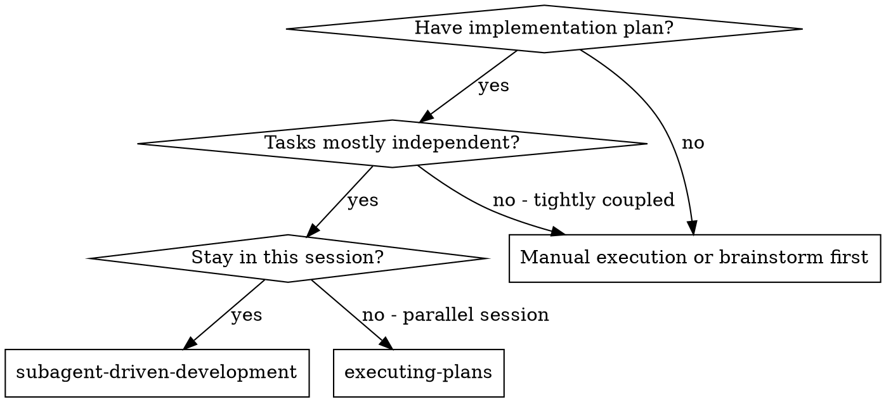
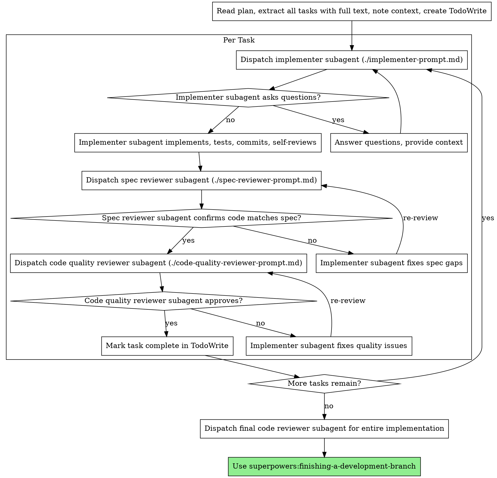
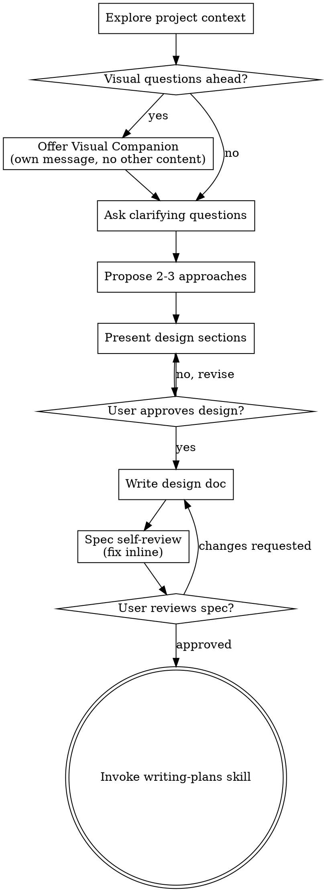
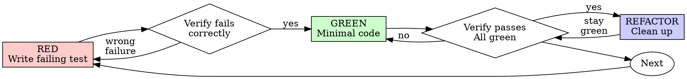

# M1D URL shortener implementation

**Session ID:** ses_1c0adcebfffeaN7vni3ljgtFiQ
**Created:** 5/19/2026, 11:20:11 AM
**Updated:** 5/19/2026, 12:31:16 PM

---

## Assistant (Build · gpt-5.5 · 2.6s)

**Tool: skill**

**Input:**
```json
{
  "name": "using-git-worktrees"
}
```

**Output:**
```
<skill_content name="using-git-worktrees">
# Skill: using-git-worktrees

# Using Git Worktrees

## Overview

Ensure work happens in an isolated workspace. Prefer your platform's native worktree tools. Fall back to manual git worktrees only when no native tool is available.

**Core principle:** Detect existing isolation first. Then use native tools. Then fall back to git. Never fight the harness.

**Announce at start:** "I'm using the using-git-worktrees skill to set up an isolated workspace."

## Step 0: Detect Existing Isolation

**Before creating anything, check if you are already in an isolated workspace.**

```bash
GIT_DIR=$(cd "$(git rev-parse --git-dir)" 2>/dev/null && pwd -P)
GIT_COMMON=$(cd "$(git rev-parse --git-common-dir)" 2>/dev/null && pwd -P)
BRANCH=$(git branch --show-current)
```

**Submodule guard:** `GIT_DIR != GIT_COMMON` is also true inside git submodules. Before concluding "already in a worktree," verify you are not in a submodule:

```bash
# If this returns a path, you're in a submodule, not a worktree — treat as normal repo
git rev-parse --show-superproject-working-tree 2>/dev/null
```

**If `GIT_DIR != GIT_COMMON` (and not a submodule):** You are already in a linked worktree. Skip to Step 3 (Project Setup). Do NOT create another worktree.

Report with branch state:
- On a branch: "Already in isolated workspace at `<path>` on branch `<name>`."
- Detached HEAD: "Already in isolated workspace at `<path>` (detached HEAD, externally managed). Branch creation needed at finish time."

**If `GIT_DIR == GIT_COMMON` (or in a submodule):** You are in a normal repo checkout.

Has the user already indicated their worktree preference in your instructions? If not, ask for consent before creating a worktree:

> "Would you like me to set up an isolated worktree? It protects your current branch from changes."

Honor any existing declared preference without asking. If the user declines consent, work in place and skip to Step 3.

## Step 1: Create Isolated Workspace

**You have two mechanisms. Try them in this order.**

### 1a. Native Worktree Tools (preferred)

The user has asked for an isolated workspace (Step 0 consent). Do you already have a way to create a worktree? It might be a tool with a name like `EnterWorktree`, `WorktreeCreate`, a `/worktree` command, or a `--worktree` flag. If you do, use it and skip to Step 3.

Native tools handle directory placement, branch creation, and cleanup automatically. Using `git worktree add` when you have a native tool creates phantom state your harness can't see or manage.

Only proceed to Step 1b if you have no native worktree tool available.

### 1b. Git Worktree Fallback

**Only use this if Step 1a does not apply** — you have no native worktree tool available. Create a worktree manually using git.

#### Directory Selection

Follow this priority order. Explicit user preference always beats observed filesystem state.

1. **Check your instructions for a declared worktree directory preference.** If the user has already specified one, use it without asking.

2. **Check for an existing project-local worktree directory:**
   ```bash
   ls -d .worktrees 2>/dev/null     # Preferred (hidden)
   ls -d worktrees 2>/dev/null      # Alternative
   ```
   If found, use it. If both exist, `.worktrees` wins.

3. **Check for an existing global directory:**
   ```bash
   project=$(basename "$(git rev-parse --show-toplevel)")
   ls -d ~/.config/superpowers/worktrees/$project 2>/dev/null
   ```
   If found, use it (backward compatibility with legacy global path).

4. **If there is no other guidance available**, default to `.worktrees/` at the project root.

#### Safety Verification (project-local directories only)

**MUST verify directory is ignored before creating worktree:**

```bash
git check-ignore -q .worktrees 2>/dev/null || git check-ignore -q worktrees 2>/dev/null
```

**If NOT ignored:** Add to .gitignore, commit the change, then proceed.

**Why critical:** Prevents accidentally committing worktree contents to repository.

Global directories (`~/.config/superpowers/worktrees/`) need no verification.

#### Create the Worktree

```bash
project=$(basename "$(git rev-parse --show-toplevel)")

# Determine path based on chosen location
# For project-local: path="$LOCATION/$BRANCH_NAME"
# For global: path="~/.config/superpowers/worktrees/$project/$BRANCH_NAME"

git worktree add "$path" -b "$BRANCH_NAME"
cd "$path"
```

**Sandbox fallback:** If `git worktree add` fails with a permission error (sandbox denial), tell the user the sandbox blocked worktree creation and you're working in the current directory instead. Then run setup and baseline tests in place.

## Step 3: Project Setup

Auto-detect and run appropriate setup:

```bash
# Node.js
if [ -f package.json ]; then npm install; fi

# Rust
if [ -f Cargo.toml ]; then cargo build; fi

# Python
if [ -f requirements.txt ]; then pip install -r requirements.txt; fi
if [ -f pyproject.toml ]; then poetry install; fi

# Go
if [ -f go.mod ]; then go mod download; fi
```

## Step 4: Verify Clean Baseline

Run tests to ensure workspace starts clean:

```bash
# Use project-appropriate command
npm test / cargo test / pytest / go test ./...
```

**If tests fail:** Report failures, ask whether to proceed or investigate.

**If tests pass:** Report ready.

### Report

```
Worktree ready at <full-path>
Tests passing (<N> tests, 0 failures)
Ready to implement <feature-name>
```

## Quick Reference

| Situation | Action |
|-----------|--------|
| Already in linked worktree | Skip creation (Step 0) |
| In a submodule | Treat as normal repo (Step 0 guard) |
| Native worktree tool available | Use it (Step 1a) |
| No native tool | Git worktree fallback (Step 1b) |
| `.worktrees/` exists | Use it (verify ignored) |
| `worktrees/` exists | Use it (verify ignored) |
| Both exist | Use `.worktrees/` |
| Neither exists | Check instruction file, then default `.worktrees/` |
| Global path exists | Use it (backward compat) |
| Directory not ignored | Add to .gitignore + commit |
| Permission error on create | Sandbox fallback, work in place |
| Tests fail during baseline | Report failures + ask |
| No package.json/Cargo.toml | Skip dependency install |

## Common Mistakes

### Fighting the harness

- **Problem:** Using `git worktree add` when the platform already provides isolation
- **Fix:** Step 0 detects existing isolation. Step 1a defers to native tools.

### Skipping detection

- **Problem:** Creating a nested worktree inside an existing one
- **Fix:** Always run Step 0 before creating anything

### Skipping ignore verification

- **Problem:** Worktree contents get tracked, pollute git status
- **Fix:** Always use `git check-ignore` before creating project-local worktree

### Assuming directory location

- **Problem:** Creates inconsistency, violates project conventions
- **Fix:** Follow priority: existing > global legacy > instruction file > default

### Proceeding with failing tests

- **Problem:** Can't distinguish new bugs from pre-existing issues
- **Fix:** Report failures, get explicit permission to proceed

## Red Flags

**Never:**
- Create a worktree when Step 0 detects existing isolation
- Use `git worktree add` when you have a native worktree tool (e.g., `EnterWorktree`). This is the #1 mistake — if you have it, use it.
- Skip Step 1a by jumping straight to Step 1b's git commands
- Create worktree without verifying it's ignored (project-local)
- Skip baseline test verification
- Proceed with failing tests without asking

**Always:**
- Run Step 0 detection first
- Prefer native tools over git fallback
- Follow directory priority: existing > global legacy > instruction file > default
- Verify directory is ignored for project-local
- Auto-detect and run project setup
- Verify clean test baseline

Base directory for this skill: file:///C:/Users/Shaheen/.cache/opencode/packages/superpowers@git+https_/github.com/obra/superpowers.git/node_modules/superpowers/skills/using-git-worktrees
Relative paths in this skill (e.g., scripts/, reference/) are relative to this base directory.
Note: file list is sampled.

<skill_files>

</skill_files>
</skill_content>
```

---

## Assistant (Build · gpt-5.5 · 3.5s)

I'm using the using-git-worktrees skill to set up an isolated workspace. After that I'll read the tracker/spec, draft the M1D slice, and dispatch subagents for independent implementation checks.

**Tool: skill**

**Input:**
```json
{
  "name": "writing-plans"
}
```

**Output:**
```
<skill_content name="writing-plans">
# Skill: writing-plans

# Writing Plans

## Overview

Write comprehensive implementation plans assuming the engineer has zero context for our codebase and questionable taste. Document everything they need to know: which files to touch for each task, code, testing, docs they might need to check, how to test it. Give them the whole plan as bite-sized tasks. DRY. YAGNI. TDD. Frequent commits.

Assume they are a skilled developer, but know almost nothing about our toolset or problem domain. Assume they don't know good test design very well.

**Announce at start:** "I'm using the writing-plans skill to create the implementation plan."

**Context:** If working in an isolated worktree, it should have been created via the `superpowers:using-git-worktrees` skill at execution time.

**Save plans to:** `docs/superpowers/plans/YYYY-MM-DD-<feature-name>.md`
- (User preferences for plan location override this default)

## Scope Check

If the spec covers multiple independent subsystems, it should have been broken into sub-project specs during brainstorming. If it wasn't, suggest breaking this into separate plans — one per subsystem. Each plan should produce working, testable software on its own.

## File Structure

Before defining tasks, map out which files will be created or modified and what each one is responsible for. This is where decomposition decisions get locked in.

- Design units with clear boundaries and well-defined interfaces. Each file should have one clear responsibility.
- You reason best about code you can hold in context at once, and your edits are more reliable when files are focused. Prefer smaller, focused files over large ones that do too much.
- Files that change together should live together. Split by responsibility, not by technical layer.
- In existing codebases, follow established patterns. If the codebase uses large files, don't unilaterally restructure - but if a file you're modifying has grown unwieldy, including a split in the plan is reasonable.

This structure informs the task decomposition. Each task should produce self-contained changes that make sense independently.

## Bite-Sized Task Granularity

**Each step is one action (2-5 minutes):**
- "Write the failing test" - step
- "Run it to make sure it fails" - step
- "Implement the minimal code to make the test pass" - step
- "Run the tests and make sure they pass" - step
- "Commit" - step

## Plan Document Header

**Every plan MUST start with this header:**

```markdown
# [Feature Name] Implementation Plan

> **For agentic workers:** REQUIRED SUB-SKILL: Use superpowers:subagent-driven-development (recommended) or superpowers:executing-plans to implement this plan task-by-task. Steps use checkbox (`- [ ]`) syntax for tracking.

**Goal:** [One sentence describing what this builds]

**Architecture:** [2-3 sentences about approach]

**Tech Stack:** [Key technologies/libraries]

---
```

## Task Structure

````markdown
### Task N: [Component Name]

**Files:**
- Create: `exact/path/to/file.py`
- Modify: `exact/path/to/existing.py:123-145`
- Test: `tests/exact/path/to/test.py`

- [ ] **Step 1: Write the failing test**

```python
def test_specific_behavior():
    result = function(input)
    assert result == expected
```

- [ ] **Step 2: Run test to verify it fails**

Run: `pytest tests/path/test.py::test_name -v`
Expected: FAIL with "function not defined"

- [ ] **Step 3: Write minimal implementation**

```python
def function(input):
    return expected
```

- [ ] **Step 4: Run test to verify it passes**

Run: `pytest tests/path/test.py::test_name -v`
Expected: PASS

- [ ] **Step 5: Commit**

```bash
git add tests/path/test.py src/path/file.py
git commit -m "feat: add specific feature"
```
````

## No Placeholders

Every step must contain the actual content an engineer needs. These are **plan failures** — never write them:
- "TBD", "TODO", "implement later", "fill in details"
- "Add appropriate error handling" / "add validation" / "handle edge cases"
- "Write tests for the above" (without actual test code)
- "Similar to Task N" (repeat the code — the engineer may be reading tasks out of order)
- Steps that describe what to do without showing how (code blocks required for code steps)
- References to types, functions, or methods not defined in any task

## Remember
- Exact file paths always
- Complete code in every step — if a step changes code, show the code
- Exact commands with expected output
- DRY, YAGNI, TDD, frequent commits

## Self-Review

After writing the complete plan, look at the spec with fresh eyes and check the plan against it. This is a checklist you run yourself — not a subagent dispatch.

**1. Spec coverage:** Skim each section/requirement in the spec. Can you point to a task that implements it? List any gaps.

**2. Placeholder scan:** Search your plan for red flags — any of the patterns from the "No Placeholders" section above. Fix them.

**3. Type consistency:** Do the types, method signatures, and property names you used in later tasks match what you defined in earlier tasks? A function called `clearLayers()` in Task 3 but `clearFullLayers()` in Task 7 is a bug.

If you find issues, fix them inline. No need to re-review — just fix and move on. If you find a spec requirement with no task, add the task.

## Execution Handoff

After saving the plan, offer execution choice:

**"Plan complete and saved to `docs/superpowers/plans/<filename>.md`. Two execution options:**

**1. Subagent-Driven (recommended)** - I dispatch a fresh subagent per task, review between tasks, fast iteration

**2. Inline Execution** - Execute tasks in this session using executing-plans, batch execution with checkpoints

**Which approach?"**

**If Subagent-Driven chosen:**
- **REQUIRED SUB-SKILL:** Use superpowers:subagent-driven-development
- Fresh subagent per task + two-stage review

**If Inline Execution chosen:**
- **REQUIRED SUB-SKILL:** Use superpowers:executing-plans
- Batch execution with checkpoints for review

Base directory for this skill: file:///C:/Users/Shaheen/.cache/opencode/packages/superpowers@git+https_/github.com/obra/superpowers.git/node_modules/superpowers/skills/writing-plans
Relative paths in this skill (e.g., scripts/, reference/) are relative to this base directory.
Note: file list is sampled.

<skill_files>
<file>C:\Users\Shaheen\.cache\opencode\packages\superpowers@git+https_\github.com\obra\superpowers.git\node_modules\superpowers\skills\writing-plans\plan-document-reviewer-prompt.md</file>
</skill_files>
</skill_content>
```

---

## Assistant (Build · gpt-5.5 · 2.6s)

**Tool: skill**

**Input:**
```json
{
  "name": "subagent-driven-development"
}
```

**Output:**
```
<skill_content name="subagent-driven-development">
# Skill: subagent-driven-development

# Subagent-Driven Development

Execute plan by dispatching fresh subagent per task, with two-stage review after each: spec compliance review first, then code quality review.

**Why subagents:** You delegate tasks to specialized agents with isolated context. By precisely crafting their instructions and context, you ensure they stay focused and succeed at their task. They should never inherit your session's context or history — you construct exactly what they need. This also preserves your own context for coordination work.

**Core principle:** Fresh subagent per task + two-stage review (spec then quality) = high quality, fast iteration

**Continuous execution:** Do not pause to check in with your human partner between tasks. Execute all tasks from the plan without stopping. The only reasons to stop are: BLOCKED status you cannot resolve, ambiguity that genuinely prevents progress, or all tasks complete. "Should I continue?" prompts and progress summaries waste their time — they asked you to execute the plan, so execute it.

## When to Use



**vs. Executing Plans (parallel session):**
- Same session (no context switch)
- Fresh subagent per task (no context pollution)
- Two-stage review after each task: spec compliance first, then code quality
- Faster iteration (no human-in-loop between tasks)

## The Process



## Model Selection

Use the least powerful model that can handle each role to conserve cost and increase speed.

**Mechanical implementation tasks** (isolated functions, clear specs, 1-2 files): use a fast, cheap model. Most implementation tasks are mechanical when the plan is well-specified.

**Integration and judgment tasks** (multi-file coordination, pattern matching, debugging): use a standard model.

**Architecture, design, and review tasks**: use the most capable available model.

**Task complexity signals:**
- Touches 1-2 files with a complete spec → cheap model
- Touches multiple files with integration concerns → standard model
- Requires design judgment or broad codebase understanding → most capable model

## Handling Implementer Status

Implementer subagents report one of four statuses. Handle each appropriately:

**DONE:** Proceed to spec compliance review.

**DONE_WITH_CONCERNS:** The implementer completed the work but flagged doubts. Read the concerns before proceeding. If the concerns are about correctness or scope, address them before review. If they're observations (e.g., "this file is getting large"), note them and proceed to review.

**NEEDS_CONTEXT:** The implementer needs information that wasn't provided. Provide the missing context and re-dispatch.

**BLOCKED:** The implementer cannot complete the task. Assess the blocker:
1. If it's a context problem, provide more context and re-dispatch with the same model
2. If the task requires more reasoning, re-dispatch with a more capable model
3. If the task is too large, break it into smaller pieces
4. If the plan itself is wrong, escalate to the human

**Never** ignore an escalation or force the same model to retry without changes. If the implementer said it's stuck, something needs to change.

## Prompt Templates

- `./implementer-prompt.md` - Dispatch implementer subagent
- `./spec-reviewer-prompt.md` - Dispatch spec compliance reviewer subagent
- `./code-quality-reviewer-prompt.md` - Dispatch code quality reviewer subagent

## Example Workflow

```
You: I'm using Subagent-Driven Development to execute this plan.

[Read plan file once: docs/superpowers/plans/feature-plan.md]
[Extract all 5 tasks with full text and context]
[Create TodoWrite with all tasks]

Task 1: Hook installation script

[Get Task 1 text and context (already extracted)]
[Dispatch implementation subagent with full task text + context]

Implementer: "Before I begin - should the hook be installed at user or system level?"

You: "User level (~/.config/superpowers/hooks/)"

Implementer: "Got it. Implementing now..."
[Later] Implementer:
  - Implemented install-hook command
  - Added tests, 5/5 passing
  - Self-review: Found I missed --force flag, added it
  - Committed

[Dispatch spec compliance reviewer]
Spec reviewer: ✅ Spec compliant - all requirements met, nothing extra

[Get git SHAs, dispatch code quality reviewer]
Code reviewer: Strengths: Good test coverage, clean. Issues: None. Approved.

[Mark Task 1 complete]

Task 2: Recovery modes

[Get Task 2 text and context (already extracted)]
[Dispatch implementation subagent with full task text + context]

Implementer: [No questions, proceeds]
Implementer:
  - Added verify/repair modes
  - 8/8 tests passing
  - Self-review: All good
  - Committed

[Dispatch spec compliance reviewer]
Spec reviewer: ❌ Issues:
  - Missing: Progress reporting (spec says "report every 100 items")
  - Extra: Added --json flag (not requested)

[Implementer fixes issues]
Implementer: Removed --json flag, added progress reporting

[Spec reviewer reviews again]
Spec reviewer: ✅ Spec compliant now

[Dispatch code quality reviewer]
Code reviewer: Strengths: Solid. Issues (Important): Magic number (100)

[Implementer fixes]
Implementer: Extracted PROGRESS_INTERVAL constant

[Code reviewer reviews again]
Code reviewer: ✅ Approved

[Mark Task 2 complete]

...

[After all tasks]
[Dispatch final code-reviewer]
Final reviewer: All requirements met, ready to merge

Done!
```

## Advantages

**vs. Manual execution:**
- Subagents follow TDD naturally
- Fresh context per task (no confusion)
- Parallel-safe (subagents don't interfere)
- Subagent can ask questions (before AND during work)

**vs. Executing Plans:**
- Same session (no handoff)
- Continuous progress (no waiting)
- Review checkpoints automatic

**Efficiency gains:**
- No file reading overhead (controller provides full text)
- Controller curates exactly what context is needed
- Subagent gets complete information upfront
- Questions surfaced before work begins (not after)

**Quality gates:**
- Self-review catches issues before handoff
- Two-stage review: spec compliance, then code quality
- Review loops ensure fixes actually work
- Spec compliance prevents over/under-building
- Code quality ensures implementation is well-built

**Cost:**
- More subagent invocations (implementer + 2 reviewers per task)
- Controller does more prep work (extracting all tasks upfront)
- Review loops add iterations
- But catches issues early (cheaper than debugging later)

## Red Flags

**Never:**
- Start implementation on main/master branch without explicit user consent
- Skip reviews (spec compliance OR code quality)
- Proceed with unfixed issues
- Dispatch multiple implementation subagents in parallel (conflicts)
- Make subagent read plan file (provide full text instead)
- Skip scene-setting context (subagent needs to understand where task fits)
- Ignore subagent questions (answer before letting them proceed)
- Accept "close enough" on spec compliance (spec reviewer found issues = not done)
- Skip review loops (reviewer found issues = implementer fixes = review again)
- Let implementer self-review replace actual review (both are needed)
- **Start code quality review before spec compliance is ✅** (wrong order)
- Move to next task while either review has open issues

**If subagent asks questions:**
- Answer clearly and completely
- Provide additional context if needed
- Don't rush them into implementation

**If reviewer finds issues:**
- Implementer (same subagent) fixes them
- Reviewer reviews again
- Repeat until approved
- Don't skip the re-review

**If subagent fails task:**
- Dispatch fix subagent with specific instructions
- Don't try to fix manually (context pollution)

## Integration

**Required workflow skills:**
- **superpowers:using-git-worktrees** - Ensures isolated workspace (creates one or verifies existing)
- **superpowers:writing-plans** - Creates the plan this skill executes
- **superpowers:requesting-code-review** - Code review template for reviewer subagents
- **superpowers:finishing-a-development-branch** - Complete development after all tasks

**Subagents should use:**
- **superpowers:test-driven-development** - Subagents follow TDD for each task

**Alternative workflow:**
- **superpowers:executing-plans** - Use for parallel session instead of same-session execution

Base directory for this skill: file:///C:/Users/Shaheen/.cache/opencode/packages/superpowers@git+https_/github.com/obra/superpowers.git/node_modules/superpowers/skills/subagent-driven-development
Relative paths in this skill (e.g., scripts/, reference/) are relative to this base directory.
Note: file list is sampled.

<skill_files>
<file>C:\Users\Shaheen\.cache\opencode\packages\superpowers@git+https_\github.com\obra\superpowers.git\node_modules\superpowers\skills\subagent-driven-development\spec-reviewer-prompt.md</file>
<file>C:\Users\Shaheen\.cache\opencode\packages\superpowers@git+https_\github.com\obra\superpowers.git\node_modules\superpowers\skills\subagent-driven-development\implementer-prompt.md</file>
<file>C:\Users\Shaheen\.cache\opencode\packages\superpowers@git+https_\github.com\obra\superpowers.git\node_modules\superpowers\skills\subagent-driven-development\code-quality-reviewer-prompt.md</file>
</skill_files>
</skill_content>
```

---

## Assistant (Build · gpt-5.5 · 7.4s)

I'm using the writing-plans skill to create the M1D implementation plan, and subagent-driven-development to execute it task-by-task with review gates. I also need to load the brainstorming and TDD workflows before changing behavior.

**Tool: skill**

**Input:**
```json
{
  "name": "brainstorming"
}
```

**Output:**
```
<skill_content name="brainstorming">
# Skill: brainstorming

# Brainstorming Ideas Into Designs

Help turn ideas into fully formed designs and specs through natural collaborative dialogue.

Start by understanding the current project context, then ask questions one at a time to refine the idea. Once you understand what you're building, present the design and get user approval.

<HARD-GATE>
Do NOT invoke any implementation skill, write any code, scaffold any project, or take any implementation action until you have presented a design and the user has approved it. This applies to EVERY project regardless of perceived simplicity.
</HARD-GATE>

## Anti-Pattern: "This Is Too Simple To Need A Design"

Every project goes through this process. A todo list, a single-function utility, a config change — all of them. "Simple" projects are where unexamined assumptions cause the most wasted work. The design can be short (a few sentences for truly simple projects), but you MUST present it and get approval.

## Checklist

You MUST create a task for each of these items and complete them in order:

1. **Explore project context** — check files, docs, recent commits
2. **Offer visual companion** (if topic will involve visual questions) — this is its own message, not combined with a clarifying question. See the Visual Companion section below.
3. **Ask clarifying questions** — one at a time, understand purpose/constraints/success criteria
4. **Propose 2-3 approaches** — with trade-offs and your recommendation
5. **Present design** — in sections scaled to their complexity, get user approval after each section
6. **Write design doc** — save to `docs/superpowers/specs/YYYY-MM-DD-<topic>-design.md` and commit
7. **Spec self-review** — quick inline check for placeholders, contradictions, ambiguity, scope (see below)
8. **User reviews written spec** — ask user to review the spec file before proceeding
9. **Transition to implementation** — invoke writing-plans skill to create implementation plan

## Process Flow



**The terminal state is invoking writing-plans.** Do NOT invoke frontend-design, mcp-builder, or any other implementation skill. The ONLY skill you invoke after brainstorming is writing-plans.

## The Process

**Understanding the idea:**

- Check out the current project state first (files, docs, recent commits)
- Before asking detailed questions, assess scope: if the request describes multiple independent subsystems (e.g., "build a platform with chat, file storage, billing, and analytics"), flag this immediately. Don't spend questions refining details of a project that needs to be decomposed first.
- If the project is too large for a single spec, help the user decompose into sub-projects: what are the independent pieces, how do they relate, what order should they be built? Then brainstorm the first sub-project through the normal design flow. Each sub-project gets its own spec → plan → implementation cycle.
- For appropriately-scoped projects, ask questions one at a time to refine the idea
- Prefer multiple choice questions when possible, but open-ended is fine too
- Only one question per message - if a topic needs more exploration, break it into multiple questions
- Focus on understanding: purpose, constraints, success criteria

**Exploring approaches:**

- Propose 2-3 different approaches with trade-offs
- Present options conversationally with your recommendation and reasoning
- Lead with your recommended option and explain why

**Presenting the design:**

- Once you believe you understand what you're building, present the design
- Scale each section to its complexity: a few sentences if straightforward, up to 200-300 words if nuanced
- Ask after each section whether it looks right so far
- Cover: architecture, components, data flow, error handling, testing
- Be ready to go back and clarify if something doesn't make sense

**Design for isolation and clarity:**

- Break the system into smaller units that each have one clear purpose, communicate through well-defined interfaces, and can be understood and tested independently
- For each unit, you should be able to answer: what does it do, how do you use it, and what does it depend on?
- Can someone understand what a unit does without reading its internals? Can you change the internals without breaking consumers? If not, the boundaries need work.
- Smaller, well-bounded units are also easier for you to work with - you reason better about code you can hold in context at once, and your edits are more reliable when files are focused. When a file grows large, that's often a signal that it's doing too much.

**Working in existing codebases:**

- Explore the current structure before proposing changes. Follow existing patterns.
- Where existing code has problems that affect the work (e.g., a file that's grown too large, unclear boundaries, tangled responsibilities), include targeted improvements as part of the design - the way a good developer improves code they're working in.
- Don't propose unrelated refactoring. Stay focused on what serves the current goal.

## After the Design

**Documentation:**

- Write the validated design (spec) to `docs/superpowers/specs/YYYY-MM-DD-<topic>-design.md`
  - (User preferences for spec location override this default)
- Use elements-of-style:writing-clearly-and-concisely skill if available
- Commit the design document to git

**Spec Self-Review:**
After writing the spec document, look at it with fresh eyes:

1. **Placeholder scan:** Any "TBD", "TODO", incomplete sections, or vague requirements? Fix them.
2. **Internal consistency:** Do any sections contradict each other? Does the architecture match the feature descriptions?
3. **Scope check:** Is this focused enough for a single implementation plan, or does it need decomposition?
4. **Ambiguity check:** Could any requirement be interpreted two different ways? If so, pick one and make it explicit.

Fix any issues inline. No need to re-review — just fix and move on.

**User Review Gate:**
After the spec review loop passes, ask the user to review the written spec before proceeding:

> "Spec written and committed to `<path>`. Please review it and let me know if you want to make any changes before we start writing out the implementation plan."

Wait for the user's response. If they request changes, make them and re-run the spec review loop. Only proceed once the user approves.

**Implementation:**

- Invoke the writing-plans skill to create a detailed implementation plan
- Do NOT invoke any other skill. writing-plans is the next step.

## Key Principles

- **One question at a time** - Don't overwhelm with multiple questions
- **Multiple choice preferred** - Easier to answer than open-ended when possible
- **YAGNI ruthlessly** - Remove unnecessary features from all designs
- **Explore alternatives** - Always propose 2-3 approaches before settling
- **Incremental validation** - Present design, get approval before moving on
- **Be flexible** - Go back and clarify when something doesn't make sense

## Visual Companion

A browser-based companion for showing mockups, diagrams, and visual options during brainstorming. Available as a tool — not a mode. Accepting the companion means it's available for questions that benefit from visual treatment; it does NOT mean every question goes through the browser.

**Offering the companion:** When you anticipate that upcoming questions will involve visual content (mockups, layouts, diagrams), offer it once for consent:
> "Some of what we're working on might be easier to explain if I can show it to you in a web browser. I can put together mockups, diagrams, comparisons, and other visuals as we go. This feature is still new and can be token-intensive. Want to try it? (Requires opening a local URL)"

**This offer MUST be its own message.** Do not combine it with clarifying questions, context summaries, or any other content. The message should contain ONLY the offer above and nothing else. Wait for the user's response before continuing. If they decline, proceed with text-only brainstorming.

**Per-question decision:** Even after the user accepts, decide FOR EACH QUESTION whether to use the browser or the terminal. The test: **would the user understand this better by seeing it than reading it?**

- **Use the browser** for content that IS visual — mockups, wireframes, layout comparisons, architecture diagrams, side-by-side visual designs
- **Use the terminal** for content that is text — requirements questions, conceptual choices, tradeoff lists, A/B/C/D text options, scope decisions

A question about a UI topic is not automatically a visual question. "What does personality mean in this context?" is a conceptual question — use the terminal. "Which wizard layout works better?" is a visual question — use the browser.

If they agree to the companion, read the detailed guide before proceeding:
`skills/brainstorming/visual-companion.md`

Base directory for this skill: file:///C:/Users/Shaheen/.cache/opencode/packages/superpowers@git+https_/github.com/obra/superpowers.git/node_modules/superpowers/skills/brainstorming
Relative paths in this skill (e.g., scripts/, reference/) are relative to this base directory.
Note: file list is sampled.

<skill_files>
<file>C:\Users\Shaheen\.cache\opencode\packages\superpowers@git+https_\github.com\obra\superpowers.git\node_modules\superpowers\skills\brainstorming\visual-companion.md</file>
<file>C:\Users\Shaheen\.cache\opencode\packages\superpowers@git+https_\github.com\obra\superpowers.git\node_modules\superpowers\skills\brainstorming\spec-document-reviewer-prompt.md</file>
<file>C:\Users\Shaheen\.cache\opencode\packages\superpowers@git+https_\github.com\obra\superpowers.git\node_modules\superpowers\skills\brainstorming\scripts\stop-server.sh</file>
<file>C:\Users\Shaheen\.cache\opencode\packages\superpowers@git+https_\github.com\obra\superpowers.git\node_modules\superpowers\skills\brainstorming\scripts\start-server.sh</file>
<file>C:\Users\Shaheen\.cache\opencode\packages\superpowers@git+https_\github.com\obra\superpowers.git\node_modules\superpowers\skills\brainstorming\scripts\server.cjs</file>
<file>C:\Users\Shaheen\.cache\opencode\packages\superpowers@git+https_\github.com\obra\superpowers.git\node_modules\superpowers\skills\brainstorming\scripts\helper.js</file>
<file>C:\Users\Shaheen\.cache\opencode\packages\superpowers@git+https_\github.com\obra\superpowers.git\node_modules\superpowers\skills\brainstorming\scripts\frame-template.html</file>
</skill_files>
</skill_content>
```

---

## Assistant (Build · gpt-5.5 · 35.8s)

**Tool: skill**

**Input:**
```json
{
  "name": "test-driven-development"
}
```

**Output:**
```
<skill_content name="test-driven-development">
# Skill: test-driven-development

# Test-Driven Development (TDD)

## Overview

Write the test first. Watch it fail. Write minimal code to pass.

**Core principle:** If you didn't watch the test fail, you don't know if it tests the right thing.

**Violating the letter of the rules is violating the spirit of the rules.**

## When to Use

**Always:**
- New features
- Bug fixes
- Refactoring
- Behavior changes

**Exceptions (ask your human partner):**
- Throwaway prototypes
- Generated code
- Configuration files

Thinking "skip TDD just this once"? Stop. That's rationalization.

## The Iron Law

```
NO PRODUCTION CODE WITHOUT A FAILING TEST FIRST
```

Write code before the test? Delete it. Start over.

**No exceptions:**
- Don't keep it as "reference"
- Don't "adapt" it while writing tests
- Don't look at it
- Delete means delete

Implement fresh from tests. Period.

## Red-Green-Refactor



### RED - Write Failing Test

Write one minimal test showing what should happen.

<Good>
```typescript
test('retries failed operations 3 times', async () => {
  let attempts = 0;
  const operation = () => {
    attempts++;
    if (attempts < 3) throw new Error('fail');
    return 'success';
  };

  const result = await retryOperation(operation);

  expect(result).toBe('success');
  expect(attempts).toBe(3);
});
```
Clear name, tests real behavior, one thing
</Good>

<Bad>
```typescript
test('retry works', async () => {
  const mock = jest.fn()
    .mockRejectedValueOnce(new Error())
    .mockRejectedValueOnce(new Error())
    .mockResolvedValueOnce('success');
  await retryOperation(mock);
  expect(mock).toHaveBeenCalledTimes(3);
});
```
Vague name, tests mock not code
</Bad>

**Requirements:**
- One behavior
- Clear name
- Real code (no mocks unless unavoidable)

### Verify RED - Watch It Fail

**MANDATORY. Never skip.**

```bash
npm test path/to/test.test.ts
```

Confirm:
- Test fails (not errors)
- Failure message is expected
- Fails because feature missing (not typos)

**Test passes?** You're testing existing behavior. Fix test.

**Test errors?** Fix error, re-run until it fails correctly.

### GREEN - Minimal Code

Write simplest code to pass the test.

<Good>
```typescript
async function retryOperation<T>(fn: () => Promise<T>): Promise<T> {
  for (let i = 0; i < 3; i++) {
    try {
      return await fn();
    } catch (e) {
      if (i === 2) throw e;
    }
  }
  throw new Error('unreachable');
}
```
Just enough to pass
</Good>

<Bad>
```typescript
async function retryOperation<T>(
  fn: () => Promise<T>,
  options?: {
    maxRetries?: number;
    backoff?: 'linear' | 'exponential';
    onRetry?: (attempt: number) => void;
  }
): Promise<T> {
  // YAGNI
}
```
Over-engineered
</Bad>

Don't add features, refactor other code, or "improve" beyond the test.

### Verify GREEN - Watch It Pass

**MANDATORY.**

```bash
npm test path/to/test.test.ts
```

Confirm:
- Test passes
- Other tests still pass
- Output pristine (no errors, warnings)

**Test fails?** Fix code, not test.

**Other tests fail?** Fix now.

### REFACTOR - Clean Up

After green only:
- Remove duplication
- Improve names
- Extract helpers

Keep tests green. Don't add behavior.

### Repeat

Next failing test for next feature.

## Good Tests

| Quality | Good | Bad |
|---------|------|-----|
| **Minimal** | One thing. "and" in name? Split it. | `test('validates email and domain and whitespace')` |
| **Clear** | Name describes behavior | `test('test1')` |
| **Shows intent** | Demonstrates desired API | Obscures what code should do |

## Why Order Matters

**"I'll write tests after to verify it works"**

Tests written after code pass immediately. Passing immediately proves nothing:
- Might test wrong thing
- Might test implementation, not behavior
- Might miss edge cases you forgot
- You never saw it catch the bug

Test-first forces you to see the test fail, proving it actually tests something.

**"I already manually tested all the edge cases"**

Manual testing is ad-hoc. You think you tested everything but:
- No record of what you tested
- Can't re-run when code changes
- Easy to forget cases under pressure
- "It worked when I tried it" ≠ comprehensive

Automated tests are systematic. They run the same way every time.

**"Deleting X hours of work is wasteful"**

Sunk cost fallacy. The time is already gone. Your choice now:
- Delete and rewrite with TDD (X more hours, high confidence)
- Keep it and add tests after (30 min, low confidence, likely bugs)

The "waste" is keeping code you can't trust. Working code without real tests is technical debt.

**"TDD is dogmatic, being pragmatic means adapting"**

TDD IS pragmatic:
- Finds bugs before commit (faster than debugging after)
- Prevents regressions (tests catch breaks immediately)
- Documents behavior (tests show how to use code)
- Enables refactoring (change freely, tests catch breaks)

"Pragmatic" shortcuts = debugging in production = slower.

**"Tests after achieve the same goals - it's spirit not ritual"**

No. Tests-after answer "What does this do?" Tests-first answer "What should this do?"

Tests-after are biased by your implementation. You test what you built, not what's required. You verify remembered edge cases, not discovered ones.

Tests-first force edge case discovery before implementing. Tests-after verify you remembered everything (you didn't).

30 minutes of tests after ≠ TDD. You get coverage, lose proof tests work.

## Common Rationalizations

| Excuse | Reality |
|--------|---------|
| "Too simple to test" | Simple code breaks. Test takes 30 seconds. |
| "I'll test after" | Tests passing immediately prove nothing. |
| "Tests after achieve same goals" | Tests-after = "what does this do?" Tests-first = "what should this do?" |
| "Already manually tested" | Ad-hoc ≠ systematic. No record, can't re-run. |
| "Deleting X hours is wasteful" | Sunk cost fallacy. Keeping unverified code is technical debt. |
| "Keep as reference, write tests first" | You'll adapt it. That's testing after. Delete means delete. |
| "Need to explore first" | Fine. Throw away exploration, start with TDD. |
| "Test hard = design unclear" | Listen to test. Hard to test = hard to use. |
| "TDD will slow me down" | TDD faster than debugging. Pragmatic = test-first. |
| "Manual test faster" | Manual doesn't prove edge cases. You'll re-test every change. |
| "Existing code has no tests" | You're improving it. Add tests for existing code. |

## Red Flags - STOP and Start Over

- Code before test
- Test after implementation
- Test passes immediately
- Can't explain why test failed
- Tests added "later"
- Rationalizing "just this once"
- "I already manually tested it"
- "Tests after achieve the same purpose"
- "It's about spirit not ritual"
- "Keep as reference" or "adapt existing code"
- "Already spent X hours, deleting is wasteful"
- "TDD is dogmatic, I'm being pragmatic"
- "This is different because..."

**All of these mean: Delete code. Start over with TDD.**

## Example: Bug Fix

**Bug:** Empty email accepted

**RED**
```typescript
test('rejects empty email', async () => {
  const result = await submitForm({ email: '' });
  expect(result.error).toBe('Email required');
});
```

**Verify RED**
```bash
$ npm test
FAIL: expected 'Email required', got undefined
```

**GREEN**
```typescript
function submitForm(data: FormData) {
  if (!data.email?.trim()) {
    return { error: 'Email required' };
  }
  // ...
}
```

**Verify GREEN**
```bash
$ npm test
PASS
```

**REFACTOR**
Extract validation for multiple fields if needed.

## Verification Checklist

Before marking work complete:

- [ ] Every new function/method has a test
- [ ] Watched each test fail before implementing
- [ ] Each test failed for expected reason (feature missing, not typo)
- [ ] Wrote minimal code to pass each test
- [ ] All tests pass
- [ ] Output pristine (no errors, warnings)
- [ ] Tests use real code (mocks only if unavoidable)
- [ ] Edge cases and errors covered

Can't check all boxes? You skipped TDD. Start over.

## When Stuck

| Problem | Solution |
|---------|----------|
| Don't know how to test | Write wished-for API. Write assertion first. Ask your human partner. |
| Test too complicated | Design too complicated. Simplify interface. |
| Must mock everything | Code too coupled. Use dependency injection. |
| Test setup huge | Extract helpers. Still complex? Simplify design. |

## Debugging Integration

Bug found? Write failing test reproducing it. Follow TDD cycle. Test proves fix and prevents regression.

Never fix bugs without a test.

## Testing Anti-Patterns

When adding mocks or test utilities, read @testing-anti-patterns.md to avoid common pitfalls:
- Testing mock behavior instead of real behavior
- Adding test-only methods to production classes
- Mocking without understanding dependencies

## Final Rule

```
Production code → test exists and failed first
Otherwise → not TDD
```

No exceptions without your human partner's permission.

Base directory for this skill: file:///C:/Users/Shaheen/.cache/opencode/packages/superpowers@git+https_/github.com/obra/superpowers.git/node_modules/superpowers/skills/test-driven-development
Relative paths in this skill (e.g., scripts/, reference/) are relative to this base directory.
Note: file list is sampled.

<skill_files>
<file>C:\Users\Shaheen\.cache\opencode\packages\superpowers@git+https_\github.com\obra\superpowers.git\node_modules\superpowers\skills\test-driven-development\testing-anti-patterns.md</file>
</skill_files>
</skill_content>
```

---

## Assistant (Build · gpt-5.5 · 11.9s)

**Tool: todowrite**

**Input:**
```json
{
  "todos": [
    {
      "content": "Set up or confirm isolated worktree for M1D",
      "status": "in_progress",
      "priority": "high"
    },
    {
      "content": "Read M1D tracker and design spec",
      "status": "pending",
      "priority": "high"
    },
    {
      "content": "Create small M1D implementation plan",
      "status": "pending",
      "priority": "high"
    },
    {
      "content": "Execute M1D plan with subagents and TDD",
      "status": "pending",
      "priority": "high"
    },
    {
      "content": "Run verification and final review",
      "status": "pending",
      "priority": "high"
    }
  ]
}
```

**Output:**
```
[
  {
    "content": "Set up or confirm isolated worktree for M1D",
    "status": "in_progress",
    "priority": "high"
  },
  {
    "content": "Read M1D tracker and design spec",
    "status": "pending",
    "priority": "high"
  },
  {
    "content": "Create small M1D implementation plan",
    "status": "pending",
    "priority": "high"
  },
  {
    "content": "Execute M1D plan with subagents and TDD",
    "status": "pending",
    "priority": "high"
  },
  {
    "content": "Run verification and final review",
    "status": "pending",
    "priority": "high"
  }
]
```

---

## Assistant (Build · gpt-5.5 · 8.1s)

**Tool: bash**

**Input:**
```json
{
  "command": "$gitDir = (git rev-parse --git-dir | ForEach-Object { Resolve-Path $_ }).Path; $gitCommon = (git rev-parse --git-common-dir | ForEach-Object { Resolve-Path $_ }).Path; $branch = git branch --show-current; $super = git rev-parse --show-superproject-working-tree 2>$null; \"GIT_DIR=$gitDir\"; \"GIT_COMMON=$gitCommon\"; \"BRANCH=$branch\"; \"SUPER=$super\"",
  "description": "Detects current git worktree state"
}
```

**Output:**
```
GIT_DIR=C:\Users\Shaheen\URL_shortner_super_powers\.git
GIT_COMMON=C:\Users\Shaheen\URL_shortner_super_powers\.git
BRANCH=main
SUPER=

```

**Tool: glob**

**Input:**
```json
{
  "pattern": "docs/superpowers/**/*.md"
}
```

**Output:**
```
C:\Users\Shaheen\URL_shortner_super_powers\docs\superpowers\plans\implementation-tracker.md
C:\Users\Shaheen\URL_shortner_super_powers\docs\superpowers\plans\2026-05-19-url-shortener-m1b-prisma.md
C:\Users\Shaheen\URL_shortner_super_powers\docs\superpowers\plans\2026-05-19-url-shortener-m1a-scaffold.md
C:\Users\Shaheen\URL_shortner_super_powers\docs\superpowers\specs\2026-05-18-url-shortener-design.md
```

**Tool: glob**

**Input:**
```json
{
  "pattern": "package.json"
}
```

**Output:**
```
C:\Users\Shaheen\URL_shortner_super_powers\package.json
```

---

## Assistant (Build · gpt-5.5 · 12.9s)

Current checkout is `main`, not an isolated worktree. I’ll create a linked worktree for `m1d` after checking the project-local worktree directory is ignored.

**Tool: glob**

**Input:**
```json
{
  "pattern": ".worktrees"
}
```

**Output:**
```
No files found
```

**Tool: glob**

**Input:**
```json
{
  "pattern": "worktrees"
}
```

**Output:**
```
No files found
```

**Tool: bash**

**Input:**
```json
{
  "command": "git check-ignore -q \".worktrees\"; if ($?) { \".worktrees ignored\" } else { \".worktrees not ignored\" }",
  "description": "Checks if .worktrees is ignored"
}
```

**Output:**
```
.worktrees ignored

```

**Tool: bash**

**Input:**
```json
{
  "command": "git status --short",
  "description": "Shows working tree status"
}
```

**Output:**
```
 M docs/superpowers/plans/implementation-tracker.md

```

---

## Assistant (Build · gpt-5.5 · 14.6s)

**Tool: bash**

**Input:**
```json
{
  "command": "git branch --list \"m1d*\"",
  "description": "Checks for existing M1D branches"
}
```

**Output:**
```
(no output)
```

**Tool: read**

**Input:**
```json
{
  "filePath": "C:\\Users\\Shaheen\\URL_shortner_super_powers\\docs\\superpowers\\plans\\implementation-tracker.md"
}
```

**Output:**
```
<path>C:\Users\Shaheen\URL_shortner_super_powers\docs\superpowers\plans\implementation-tracker.md</path>
<type>file</type>
<content>
1: # URL Shortener Implementation Tracker
2: 
3: Design spec: `docs/superpowers/specs/2026-05-18-url-shortener-design.md`
4: 
5: ## Milestones
6: 
7: - [x] M1A: Project scaffold, Fastify health endpoint, Docker Compose PostgreSQL
8: - [x] M1B: Prisma schema and database connection
9: - [x] M1C: Public link creation validation and code generation
10: - [ ] M1D: Redirect route and click counting basics
11: - [ ] M2A: Admin authentication and sessions
12: - [ ] M2B: Admin link management API
13: - [ ] M2C: Admin analytics API
14: - [ ] M3A: Public React form
15: - [ ] M3B: Admin dashboard UI shell
16: - [ ] M3C: Dashboard charts and link table
17: - [ ] M4A: OpenAPI docs, Docker production image, final verification
18: 
19: ## Current Status
20: 
21: - Current plan: `docs/superpowers/plans/2026-05-19-url-shortener-m1c-public-link-creation.md`
22: - Last updated: 2026-05-19

(End of file - total 22 lines)
</content>
```

**Tool: read**

**Input:**
```json
{
  "filePath": "C:\\Users\\Shaheen\\URL_shortner_super_powers\\docs\\superpowers\\specs\\2026-05-18-url-shortener-design.md"
}
```

**Output:**
```
<path>C:\Users\Shaheen\URL_shortner_super_powers\docs\superpowers\specs\2026-05-18-url-shortener-design.md</path>
<type>file</type>
<content>
1: # URL Shortener Backend And Admin Dashboard Design
2: 
3: ## Summary
4: 
5: Build a production-oriented URL shortener using a Node.js/TypeScript backend, PostgreSQL, and a React/Vite frontend. The service will support public anonymous link creation, short-link redirects, OpenAPI documentation, and a polished admin dashboard with link management and analytics.
6: 
7: The first version uses one deployable application container. PostgreSQL runs as a separate service, including through Docker Compose for local development.
8: 
9: ## Goals
10: 
11: - Public users can create short links without logging in.
12: - Public users can optionally choose a custom alias and optional expiration date.
13: - The service redirects active, non-expired short links and records human-looking clicks.
14: - Obvious bots and crawlers do not inflate analytics.
15: - Admins can log in, manage links, and view analytics charts by day, referrer, and device.
16: - The public API is documented with OpenAPI.
17: - The app runs locally with Docker Compose and is deployable as a Docker container.
18: 
19: ## Non-Goals For V1
20: 
21: - Public user accounts or link ownership.
22: - Public metadata endpoints for existing short links.
23: - Public stats pages.
24: - Multi-admin management UI.
25: - Separate domains for dashboard, API, and redirects.
26: - CAPTCHA or admin-managed denylists.
27: 
28: ## Technology Choices
29: 
30: - Backend: Fastify with TypeScript.
31: - Frontend: React with Vite.
32: - Database: PostgreSQL.
33: - Database access and migrations: Prisma.
34: - Admin authentication: cookie-based server-side sessions.
35: - Password hashing: Argon2.
36: - Deployment: Docker app container plus separate PostgreSQL service.
37: 
38: Fastify is preferred over a minimal Express setup because it has strong TypeScript ergonomics, schema-driven validation, OpenAPI-friendly route definitions, and good performance for redirect/API traffic.
39: 
40: ## Application Architecture
41: 
42: The repository will contain one full-stack application with clear backend and frontend boundaries:
43: 
44: - `server/`: Fastify API, redirect route, admin auth, OpenAPI docs, PostgreSQL access, validation, rate limiting, and operational endpoints.
45: - `web/`: React/Vite public form and admin dashboard.
46: - Docker Compose: local app and PostgreSQL services.
47: 
48: The same app serves public pages, admin pages, API routes, docs, and redirects from one domain.
49: 
50: Routes:
51: 
52: - `/`: public link creation page.
53: - `/api/links`: public REST endpoint for creating short links.
54: - `/api/admin/*`: authenticated admin APIs.
55: - `/docs`: OpenAPI documentation UI.
56: - `/admin/*`: React admin dashboard.
57: - `/:code`: short-link redirect route.
58: 
59: Reserved routes such as `admin`, `api`, `docs`, asset paths, and health routes cannot be used as custom aliases. The redirect route is registered so it does not swallow internal application routes.
60: 
61: ## Data Model
62: 
63: ### `links`
64: 
65: Stores each shortened URL.
66: 
67: Fields:
68: 
69: - `id`: primary key.
70: - `original_url`: destination URL.
71: - `short_code`: unique public code or alias.
72: - `is_custom_alias`: whether the code was user-supplied.
73: - `is_active`: whether redirects are allowed.
74: - `expires_at`: optional expiration timestamp.
75: - `total_click_count`: denormalized count for fast dashboard summaries.
76: - `created_at`: creation timestamp.
77: - `updated_at`: update timestamp.
78: 
79: ### `click_events`
80: 
81: Stores analytics events for counted clicks.
82: 
83: Fields:
84: 
85: - `id`: primary key.
86: - `link_id`: foreign key to `links`.
87: - `clicked_at`: event timestamp.
88: - `referrer_host`: normalized referrer host when available.
89: - `device_type`: coarse device category such as desktop, mobile, tablet, or unknown.
90: - `browser`: coarse browser/user-agent summary.
91: - `ip_hash`: irreversible hash or equivalent privacy-preserving representation.
92: 
93: Raw full IP addresses are not stored in click analytics.
94: 
95: ### `admin_users`
96: 
97: Stores admin login identities.
98: 
99: Fields:
100: 
101: - `id`: primary key.
102: - `email`: unique admin email.
103: - `password_hash`: Argon2 password hash.
104: - `created_at`: creation timestamp.
105: - `last_login_at`: optional last login timestamp.
106: 
107: The initial admin is created through a setup or seed command. V1 does not include public registration or admin user management screens.
108: 
109: ### `admin_sessions`
110: 
111: Stores server-side admin sessions.
112: 
113: Fields:
114: 
115: - `id`: primary key.
116: - `admin_user_id`: foreign key to `admin_users`.
117: - `session_token_hash`: hash of the browser session token.
118: - `expires_at`: session expiration timestamp.
119: - `created_at`: creation timestamp.
120: 
121: ## Public Link Creation
122: 
123: Public users can create links through both the web form and `POST /api/links`.
124: 
125: Request fields:
126: 
127: - `url`: required destination URL.
128: - `alias`: optional custom alias.
129: - `expiresAt`: optional expiration timestamp.
130: 
131: Validation rules:
132: 
133: - Destination URLs must use `http` or `https`.
134: - Localhost, private IP ranges, loopback addresses, and internal hostnames are blocked.
135: - Aliases must be URL-safe, length-limited, unique, and not reserved.
136: - Public creation is rate-limited by IP.
137: 
138: If no alias is provided, the backend generates a random URL-safe code and retries on uniqueness collisions. If a custom alias collides or fails validation, the API returns a clear validation error instead of silently replacing it.
139: 
140: Successful responses include the generated short URL based on the configured public base URL.
141: 
142: ## Redirect Behavior
143: 
144: When a user visits `/:code`, the service:
145: 
146: 1. Looks up the link by short code.
147: 2. Verifies the link exists, is active, and is not expired.
148: 3. Shows a branded unavailable page for missing, inactive, or expired links.
149: 4. Redirects valid links to their original URL.
150: 5. Records click analytics for human-looking visits.
151: 
152: Obvious bots and crawlers are redirected but not counted. Click recording should avoid adding noticeable latency to redirects. The dashboard uses `links.total_click_count` for fast summaries and `click_events` for detailed charts.
153: 
154: ## Public API
155: 
156: V1 exposes only the public API needed for anonymous link creation.
157: 
158: - `POST /api/links`: create a short link.
159: 
160: V1 does not expose `GET /api/links/:code` or other public metadata endpoints. Visitors use `GET /:code` for redirects, and admins use authenticated admin APIs for link metadata.
161: 
162: ## Admin Dashboard
163: 
164: The admin dashboard is a custom polished SaaS analytics interface built with React/Vite and served under `/admin/*`.
165: 
166: V1 features:
167: 
168: - Admin login and logout.
169: - Overview cards for total links, total clicks, active links, and recent clicks.
170: - Analytics charts by day, referrer, and device.
171: - Search, filter, and paginate all links.
172: - View link details and click history.
173: - Edit original URL, active status, and expiration date.
174: - Delete or deactivate links.
175: - Copy short URLs from the dashboard.
176: 
177: The visual direction should be clean and analytics-focused: crisp cards, strong typography, responsive charts, polished empty/loading states, and a restrained palette with one strong accent color.
178: 
179: ## Admin API
180: 
181: Admin APIs live under `/api/admin/*` and require an authenticated session.
182: 
183: Expected endpoint groups:
184: 
185: - Session endpoints for login, logout, and current admin.
186: - Link listing, searching, filtering, pagination, update, deletion, and deactivation.
187: - Link detail and click history endpoints.
188: - Analytics endpoints for time-series clicks, referrer breakdowns, and device breakdowns.
189: 
190: Admin requests without a valid session return `401`. Validation errors return structured JSON responses with stable error codes and readable messages.
191: 
192: ## Authentication And Sessions
193: 
194: Admin login uses database-backed admin users and server-side sessions.
195: 
196: Session cookie behavior:
197: 
198: - `HttpOnly` to prevent JavaScript access.
199: - `SameSite=Lax` for same-domain dashboard usage.
200: - `Secure` in production.
201: - Session token stored only as a hash in the database.
202: - Expired sessions are rejected and can be cleaned up periodically.
203: 
204: This avoids JWT storage complexity and fits the same-domain deployment model.
205: 
206: ## Error Handling
207: 
208: Public and admin APIs return consistent JSON errors with stable codes and human-readable messages. The public form renders these errors inline.
209: 
210: Redirect errors use branded HTML pages rather than JSON:
211: 
212: - Unknown short code.
213: - Inactive link.
214: - Expired link.
215: 
216: Operational errors should be logged server-side without leaking secrets or sensitive request data to users.
217: 
218: ## Security And Abuse Protection
219: 
220: Security requirements:
221: 
222: - Rate-limit public link creation by IP.
223: - Validate and normalize destination URLs.
224: - Block private network, loopback, localhost, and internal destinations.
225: - Reject unsafe or reserved aliases.
226: - Use Argon2 for admin passwords.
227: - Use secure cookie settings in production.
228: - Store hashed or privacy-preserving IP metadata for analytics rather than raw full IP addresses.
229: - Avoid logging secrets, session tokens, or full sensitive request bodies.
230: 
231: V1 does not include CAPTCHA or admin-managed denylists, but the design leaves room to add them later.
232: 
233: ## Configuration
234: 
235: Environment variables configure:
236: 
237: - App port.
238: - Database URL.
239: - Public base URL used when generating short links.
240: - Session secret or token signing material.
241: - Cookie secure mode.
242: - Rate limit settings.
243: - Optional log level.
244: 
245: The app assumes one base domain in v1, but the public base URL remains configurable so a dedicated short-link domain can be introduced later.
246: 
247: ## Operations
248: 
249: Local development uses Docker Compose with at least:
250: 
251: - App service.
252: - PostgreSQL service.
253: 
254: Operational endpoints:
255: 
256: - Health endpoint for container checks.
257: - OpenAPI documentation at `/docs`.
258: 
259: Database migrations manage schema changes. Seed or setup commands create the initial admin user.
260: 
261: ## Testing Strategy
262: 
263: Unit tests cover:
264: 
265: - Random short code generation and collision retry behavior.
266: - Alias validation and reserved alias rejection.
267: - URL validation and private network blocking.
268: - Bot detection.
269: - Expiration and active-status checks.
270: 
271: API tests cover:
272: 
273: - Public link creation.
274: - Validation and rate-limit errors.
275: - Redirect behavior for valid, missing, inactive, expired, and bot visits.
276: - Admin login/logout/session checks.
277: - Admin link search, edit, delete/deactivate, and analytics endpoints.
278: 
279: UI tests cover:
280: 
281: - Public form success and error states.
282: - Admin login.
283: - Dashboard overview rendering.
284: - Basic link table interactions.
285: 
286: ## Implementation Notes
287: 
288: - Keep the public API surface small in v1: only public link creation is exposed as JSON.
289: - Keep redirect logic separate from dashboard/API logic so it remains easy to test and optimize.
290: - Keep analytics aggregation behind admin API endpoints so chart implementation can change without affecting stored data.
291: - Prefer explicit route schemas to support validation and OpenAPI generation.

(End of file - total 291 lines)
</content>
```

---

## Assistant (Build · gpt-5.5 · 11.2s)

The main checkout has an existing modification to `docs/superpowers/plans/implementation-tracker.md`; I won’t touch or revert it there. The M1D worktree will start from committed `main` so implementation changes stay isolated.

**Tool: bash**

**Input:**
```json
{
  "command": "git worktree add \".worktrees/m1d-redirect-clicks\" -b \"m1d-redirect-clicks\"",
  "description": "Creates isolated M1D git worktree",
  "timeout": 120000
}
```

**Output:**
```
Preparing worktree (new branch 'm1d-redirect-clicks')
HEAD is now at 8774c9a chore: sync lockfile install script metadata

```

---

## Assistant (Build · gpt-5.5 · 3.9s)

**Tool: todowrite**

**Input:**
```json
{
  "todos": [
    {
      "content": "Set up or confirm isolated worktree for M1D",
      "status": "completed",
      "priority": "high"
    },
    {
      "content": "Read M1D tracker and design spec",
      "status": "in_progress",
      "priority": "high"
    },
    {
      "content": "Create small M1D implementation plan",
      "status": "pending",
      "priority": "high"
    },
    {
      "content": "Execute M1D plan with subagents and TDD",
      "status": "pending",
      "priority": "high"
    },
    {
      "content": "Run verification and final review",
      "status": "pending",
      "priority": "high"
    }
  ]
}
```

**Output:**
```
[
  {
    "content": "Set up or confirm isolated worktree for M1D",
    "status": "completed",
    "priority": "high"
  },
  {
    "content": "Read M1D tracker and design spec",
    "status": "in_progress",
    "priority": "high"
  },
  {
    "content": "Create small M1D implementation plan",
    "status": "pending",
    "priority": "high"
  },
  {
    "content": "Execute M1D plan with subagents and TDD",
    "status": "pending",
    "priority": "high"
  },
  {
    "content": "Run verification and final review",
    "status": "pending",
    "priority": "high"
  }
]
```

---

## Assistant (Build · gpt-5.5 · 6.8s)

Worktree is ready at `.worktrees/m1d-redirect-clicks` on branch `m1d-redirect-clicks`. I’m going to inspect the app structure and current tests there, then write the focused M1D plan file.

**Tool: read**

**Input:**
```json
{
  "filePath": "C:\\Users\\Shaheen\\URL_shortner_super_powers\\.worktrees\\m1d-redirect-clicks\\package.json"
}
```

**Output:**
```
<path>C:\Users\Shaheen\URL_shortner_super_powers\.worktrees\m1d-redirect-clicks\package.json</path>
<type>file</type>
<content>
1: {
2:   "name": "url-shortener-super-powers",
3:   "version": "0.1.0",
4:   "private": true,
5:   "type": "module",
6:   "scripts": {
7:     "dev": "tsx watch src/index.ts",
8:     "postinstall": "prisma generate",
9:     "prebuild": "node -e \"fs.rmSync('dist', { recursive: true, force: true })\"",
10:     "build": "tsc -p tsconfig.build.json",
11:     "typecheck": "tsc -p tsconfig.json --noEmit",
12:     "start": "node dist/index.js",
13:     "test": "vitest run --exclude dist/**",
14:     "db:generate": "prisma generate",
15:     "db:migrate": "prisma migrate dev",
16:     "db:studio": "prisma studio"
17:   },
18:   "dependencies": {
19:     "@fastify/cors": "11.1.0",
20:     "@fastify/helmet": "13.0.2",
21:     "@prisma/client": "^7.8.0",
22:     "fastify": "5.8.5",
23:     "fastify-plugin": "^5.1.0"
24:   },
25:   "devDependencies": {
26:     "@types/node": "24.10.1",
27:     "prisma": "^7.8.0",
28:     "tsx": "4.20.6",
29:     "typescript": "5.9.3",
30:     "vitest": "4.0.14"
31:   }
32: }

(End of file - total 32 lines)
</content>
```

**Tool: glob**

**Input:**
```json
{
  "path": "C:\\Users\\Shaheen\\URL_shortner_super_powers\\.worktrees\\m1d-redirect-clicks",
  "pattern": "server/**/*.{ts,tsx,js,json}"
}
```

**Output:**
```
No files found
```

**Tool: glob**

**Input:**
```json
{
  "path": "C:\\Users\\Shaheen\\URL_shortner_super_powers\\.worktrees\\m1d-redirect-clicks",
  "pattern": "**/*.{test,spec}.ts"
}
```

**Output:**
```
C:\Users\Shaheen\URL_shortner_super_powers\.worktrees\m1d-redirect-clicks\tests\health.test.ts
```

**Tool: read**

**Input:**
```json
{
  "filePath": "C:\\Users\\Shaheen\\URL_shortner_super_powers\\.worktrees\\m1d-redirect-clicks\\docs\\superpowers\\plans\\implementation-tracker.md"
}
```

**Output:**
```
<path>C:\Users\Shaheen\URL_shortner_super_powers\.worktrees\m1d-redirect-clicks\docs\superpowers\plans\implementation-tracker.md</path>
<type>file</type>
<content>
1: # URL Shortener Implementation Tracker
2: 
3: Design spec: `docs/superpowers/specs/2026-05-18-url-shortener-design.md`
4: 
5: ## Milestones
6: 
7: - [x] M1A: Project scaffold, Fastify health endpoint, Docker Compose PostgreSQL
8: - [x] M1B: Prisma schema and database connection
9: - [ ] M1C: Public link creation validation and code generation
10: - [ ] M1D: Redirect route and click counting basics
11: - [ ] M2A: Admin authentication and sessions
12: - [ ] M2B: Admin link management API
13: - [ ] M2C: Admin analytics API
14: - [ ] M3A: Public React form
15: - [ ] M3B: Admin dashboard UI shell
16: - [ ] M3C: Dashboard charts and link table
17: - [ ] M4A: OpenAPI docs, Docker production image, final verification
18: 
19: ## Current Status
20: 
21: - Current plan: `docs/superpowers/plans/2026-05-19-url-shortener-m1b-prisma.md`
22: - Last updated: 2026-05-19

(End of file - total 22 lines)
</content>
```

---

## Assistant (Build · gpt-5.5 · 12.6s)

The new worktree is based on committed `main`, where the tracker still shows M1C unchecked and the M1C plan file is absent. I’m checking the actual source and commit history before deciding whether M1D can proceed or needs the M1C branch/changes merged first.

**Tool: glob**

**Input:**
```json
{
  "path": "C:\\Users\\Shaheen\\URL_shortner_super_powers\\.worktrees\\m1d-redirect-clicks",
  "pattern": "src/**/*.{ts,tsx,js,json}"
}
```

**Output:**
```
C:\Users\Shaheen\URL_shortner_super_powers\.worktrees\m1d-redirect-clicks\src\types\fastify.d.ts
C:\Users\Shaheen\URL_shortner_super_powers\.worktrees\m1d-redirect-clicks\src\server.ts
C:\Users\Shaheen\URL_shortner_super_powers\.worktrees\m1d-redirect-clicks\src\index.ts
C:\Users\Shaheen\URL_shortner_super_powers\.worktrees\m1d-redirect-clicks\src\db.ts
```

**Tool: glob**

**Input:**
```json
{
  "path": "C:\\Users\\Shaheen\\URL_shortner_super_powers\\.worktrees\\m1d-redirect-clicks",
  "pattern": "prisma/**/*"
}
```

**Output:**
```
C:\Users\Shaheen\URL_shortner_super_powers\.worktrees\m1d-redirect-clicks\prisma\schema.prisma
```

**Tool: bash**

**Input:**
```json
{
  "command": "git log --oneline --decorate --all -n 20",
  "workdir": "C:\\Users\\Shaheen\\URL_shortner_super_powers\\.worktrees\\m1d-redirect-clicks",
  "description": "Shows recent commits across branches"
}
```

**Output:**
```
8774c9a (HEAD -> m1d-redirect-clicks, main, m1c-public-link-creation) chore: sync lockfile install script metadata
ad1fab5 feat: add prisma database foundation
1743fc9 feat: scaffold Fastify service
37f1d65 chore: ignore local worktrees
9593394 Add URL shortener design spec
f63b08f (origin/main) first commit

```

**Tool: bash**

**Input:**
```json
{
  "command": "git branch --all --verbose",
  "workdir": "C:\\Users\\Shaheen\\URL_shortner_super_powers\\.worktrees\\m1d-redirect-clicks",
  "description": "Lists branches and commit heads"
}
```

**Output:**
```
+ m1c-public-link-creation 8774c9a chore: sync lockfile install script metadata
* m1d-redirect-clicks      8774c9a chore: sync lockfile install script metadata
+ main                     8774c9a [ahead 5] chore: sync lockfile install script metadata
  remotes/origin/main      f63b08f first commit

```

---

## Assistant (Build · gpt-5.5 · 8.3s)

M1C appears not implemented in committed history despite the branch name pointing at `main`. Since M1D depends on link creation/schema pieces, I’m going to scope M1D narrowly around the existing Prisma `Link`/`ClickEvent` model and redirect route, without adding the public creation API.

**Tool: read**

**Input:**
```json
{
  "filePath": "C:\\Users\\Shaheen\\URL_shortner_super_powers\\.worktrees\\m1d-redirect-clicks\\src\\server.ts"
}
```

**Output:**
```
<path>C:\Users\Shaheen\URL_shortner_super_powers\.worktrees\m1d-redirect-clicks\src\server.ts</path>
<type>file</type>
<content>
1: import Fastify from "fastify";
2: import helmet from "@fastify/helmet";
3: import { database, type DatabaseClient } from "./db.js";
4: 
5: type ServerOptions = {
6:   logger?: boolean;
7:   prisma?: DatabaseClient;
8: };
9: 
10: export function buildServer(options: ServerOptions = {}) {
11:   const app = Fastify({ logger: options.logger ?? true });
12: 
13:   app.register(helmet);
14:   app.register(database, { prisma: options.prisma });
15: 
16:   app.get("/health", async (_request, reply) => {
17:     try {
18:       await app.prisma.$queryRaw`SELECT 1`;
19: 
20:       return { status: "ok", database: "ok" };
21:     } catch (error) {
22:       app.log.warn({ error }, "database health check failed");
23: 
24:       return reply.code(503).send({ status: "error", database: "unavailable" });
25:     }
26:   });
27: 
28:   return app;
29: }

(End of file - total 29 lines)
</content>
```

**Tool: read**

**Input:**
```json
{
  "filePath": "C:\\Users\\Shaheen\\URL_shortner_super_powers\\.worktrees\\m1d-redirect-clicks\\src\\db.ts"
}
```

**Output:**
```
<path>C:\Users\Shaheen\URL_shortner_super_powers\.worktrees\m1d-redirect-clicks\src\db.ts</path>
<type>file</type>
<content>
1: import { PrismaClient } from "./generated/prisma/client.js";
2: import fp from "fastify-plugin";
3: import type { FastifyPluginAsync } from "fastify";
4: 
5: export type DatabaseClient = {
6:   $queryRaw: (query: TemplateStringsArray, ...values: unknown[]) => Promise<unknown>;
7:   $disconnect: () => Promise<void>;
8: };
9: 
10: type DatabasePluginOptions = {
11:   prisma?: DatabaseClient;
12: };
13: 
14: export function createPrismaClient(): PrismaClient {
15:   return new PrismaClient();
16: }
17: 
18: const databasePlugin: FastifyPluginAsync<DatabasePluginOptions> = async (app, options) => {
19:   const prisma = options.prisma ?? createPrismaClient();
20: 
21:   app.decorate("prisma", prisma);
22:   app.addHook("onClose", async () => {
23:     await prisma.$disconnect();
24:   });
25: };
26: 
27: export const database = fp(databasePlugin, { name: "database" });

(End of file - total 27 lines)
</content>
```

**Tool: read**

**Input:**
```json
{
  "filePath": "C:\\Users\\Shaheen\\URL_shortner_super_powers\\.worktrees\\m1d-redirect-clicks\\tests\\health.test.ts"
}
```

**Output:**
```
<path>C:\Users\Shaheen\URL_shortner_super_powers\.worktrees\m1d-redirect-clicks\tests\health.test.ts</path>
<type>file</type>
<content>
1: import { describe, expect, it } from "vitest";
2: import { buildServer } from "../src/server.js";
3: 
4: function createPrismaStub(queryRaw: () => Promise<unknown>) {
5:   return {
6:     $queryRaw: queryRaw,
7:     $disconnect: async () => {},
8:   };
9: }
10: 
11: describe("health endpoint", () => {
12:   it("returns ok status when the database is reachable", async () => {
13:     const app = buildServer({
14:       logger: false,
15:       prisma: createPrismaStub(async () => [{ "?column?": 1 }]),
16:     });
17: 
18:     try {
19:       const response = await app.inject({ method: "GET", url: "/health" });
20: 
21:       expect(response.statusCode).toBe(200);
22:       expect(response.json()).toEqual({ status: "ok", database: "ok" });
23:     } finally {
24:       await app.close();
25:     }
26:   });
27: 
28:   it("returns unavailable status when the database cannot be reached", async () => {
29:     const app = buildServer({
30:       logger: false,
31:       prisma: createPrismaStub(async () => {
32:         throw new Error("database unavailable");
33:       }),
34:     });
35: 
36:     try {
37:       const response = await app.inject({ method: "GET", url: "/health" });
38: 
39:       expect(response.statusCode).toBe(503);
40:       expect(response.json()).toEqual({ status: "error", database: "unavailable" });
41:     } finally {
42:       await app.close();
43:     }
44:   });
45: });

(End of file - total 45 lines)
</content>
```

**Tool: read**

**Input:**
```json
{
  "filePath": "C:\\Users\\Shaheen\\URL_shortner_super_powers\\.worktrees\\m1d-redirect-clicks\\prisma\\schema.prisma"
}
```

**Output:**
```
<path>C:\Users\Shaheen\URL_shortner_super_powers\.worktrees\m1d-redirect-clicks\prisma\schema.prisma</path>
<type>file</type>
<content>
1: generator client {
2:   provider = "prisma-client-js"
3:   output   = "../src/generated/prisma"
4: }
5: 
6: datasource db {
7:   provider = "postgresql"
8: }
9: 
10: model Link {
11:   id              String       @id @default(uuid()) @db.Uuid
12:   originalUrl     String       @map("original_url") @db.Text
13:   shortCode       String       @unique @map("short_code") @db.VarChar(64)
14:   isCustomAlias   Boolean      @default(false) @map("is_custom_alias")
15:   isActive        Boolean      @default(true) @map("is_active")
16:   expiresAt       DateTime?    @map("expires_at") @db.Timestamptz(6)
17:   totalClickCount Int          @default(0) @map("total_click_count")
18:   createdAt       DateTime     @default(now()) @map("created_at") @db.Timestamptz(6)
19:   updatedAt       DateTime     @updatedAt @map("updated_at") @db.Timestamptz(6)
20:   clickEvents     ClickEvent[]
21: 
22:   @@index([createdAt])
23:   @@index([isActive, expiresAt])
24:   @@map("links")
25: }
26: 
27: model ClickEvent {
28:   id           String   @id @default(uuid()) @db.Uuid
29:   linkId       String   @map("link_id") @db.Uuid
30:   clickedAt    DateTime @default(now()) @map("clicked_at") @db.Timestamptz(6)
31:   referrerHost String?  @map("referrer_host") @db.VarChar(255)
32:   deviceType   String   @default("unknown") @map("device_type") @db.VarChar(32)
33:   browser      String?  @db.VarChar(128)
34:   ipHash       String?  @map("ip_hash") @db.VarChar(128)
35:   link         Link     @relation(fields: [linkId], references: [id], onDelete: Cascade)
36: 
37:   @@index([linkId, clickedAt])
38:   @@index([clickedAt])
39:   @@map("click_events")
40: }
41: 
42: model AdminUser {
43:   id           String         @id @default(uuid()) @db.Uuid
44:   email        String         @unique @db.VarChar(255)
45:   passwordHash String         @map("password_hash") @db.Text
46:   createdAt    DateTime       @default(now()) @map("created_at") @db.Timestamptz(6)
47:   lastLoginAt  DateTime?      @map("last_login_at") @db.Timestamptz(6)
48:   sessions     AdminSession[]
49: 
50:   @@map("admin_users")
51: }
52: 
53: model AdminSession {
54:   id               String    @id @default(uuid()) @db.Uuid
55:   adminUserId      String    @map("admin_user_id") @db.Uuid
56:   sessionTokenHash String    @unique @map("session_token_hash") @db.VarChar(128)
57:   expiresAt        DateTime  @map("expires_at") @db.Timestamptz(6)
58:   createdAt        DateTime  @default(now()) @map("created_at") @db.Timestamptz(6)
59:   adminUser        AdminUser @relation(fields: [adminUserId], references: [id], onDelete: Cascade)
60: 
61:   @@index([adminUserId])
62:   @@index([expiresAt])
63:   @@map("admin_sessions")
64: }

(End of file - total 64 lines)
</content>
```

**Tool: read**

**Input:**
```json
{
  "filePath": "C:\\Users\\Shaheen\\URL_shortner_super_powers\\.worktrees\\m1d-redirect-clicks\\tsconfig.json"
}
```

**Output:**
```
<path>C:\Users\Shaheen\URL_shortner_super_powers\.worktrees\m1d-redirect-clicks\tsconfig.json</path>
<type>file</type>
<content>
1: {
2:   "compilerOptions": {
3:     "target": "ES2022",
4:     "module": "NodeNext",
5:     "moduleResolution": "NodeNext",
6:     "strict": true,
7:     "esModuleInterop": true,
8:     "skipLibCheck": true,
9:     "outDir": "dist",
10:     "rootDir": "."
11:   },
12:   "include": ["src/**/*.ts", "tests/**/*.ts"]
13: }

(End of file - total 13 lines)
</content>
```

---

## Assistant (Build · gpt-5.5 · 33.2s)

I found the minimal backend shape: Fastify app, injectable Prisma-like client, and existing health tests. M1D will add redirect behavior and click recording using the existing `Link`/`ClickEvent` schema, plus small analytics helpers for bot/device/referrer/IP metadata.

**Tool: bash**

**Input:**
```json
{
  "command": "npm install",
  "workdir": "C:\\Users\\Shaheen\\URL_shortner_super_powers\\.worktrees\\m1d-redirect-clicks",
  "description": "Installs worktree project dependencies",
  "timeout": 120000
}
```

**Output:**
```

> url-shortener-super-powers@0.1.0 postinstall
> prisma generate

Prisma schema loaded from prisma\schema.prisma.

✔ Generated Prisma Client (v7.8.0) to .\src\generated\prisma in 219ms

Start by importing your Prisma Client (See: https://pris.ly/d/importing-client)


added 191 packages, and audited 192 packages in 25s

49 packages are looking for funding
  run `npm fund` for details

3 moderate severity vulnerabilities

To address all issues (including breaking changes), run:
  npm audit fix --force

Run `npm audit` for details.

```

---

## Assistant (Build · gpt-5.5 · 6.0s)

**Tool: bash**

**Input:**
```json
{
  "command": "npm test",
  "workdir": "C:\\Users\\Shaheen\\URL_shortner_super_powers\\.worktrees\\m1d-redirect-clicks",
  "description": "Runs baseline test suite",
  "timeout": 120000
}
```

**Output:**
```

> url-shortener-super-powers@0.1.0 test
> vitest run --exclude dist/**


 RUN  v4.0.14 C:/Users/Shaheen/URL_shortner_super_powers/.worktrees/m1d-redirect-clicks

 ✓ tests/health.test.ts (2 tests) 104ms

 Test Files  1 passed (1)
      Tests  2 passed (2)
   Start at  11:23:12
   Duration  525ms (transform 82ms, setup 0ms, import 237ms, tests 104ms, environment 0ms)


```

---

## Assistant (Build · gpt-5.5 · 34.6s)

Baseline is clean: `npm test` passes with 2 tests. I’m writing a compact M1D plan now, then I’ll dispatch implementation subagents rather than editing directly.

**Tool: apply_patch**

**Input:**
```json
{
  "patchText": "*** Begin Patch\n*** Add File: .worktrees/m1d-redirect-clicks/docs/superpowers/plans/2026-05-19-url-shortener-m1d-redirect-clicks.md\n+# URL Shortener M1D Redirect Clicks Implementation Plan\n+\n+> **For agentic workers:** REQUIRED SUB-SKILL: Use superpowers:subagent-driven-development (recommended) or superpowers:executing-plans to implement this plan task-by-task. Steps use checkbox (`- [ ]`) syntax for tracking.\n+\n+**Goal:** Add the public `GET /:code` redirect route with unavailable HTML responses and basic click counting for human-looking visits.\n+\n+**Architecture:** Keep redirect behavior separate from health/API concerns by adding a small redirect route module and pure analytics helpers. The Fastify app continues to accept an injectable Prisma-like client so route behavior is testable without a live database.\n+\n+**Tech Stack:** Fastify 5, TypeScript, Prisma client shape, Vitest API tests.\n+\n+---\n+\n+## File Structure\n+\n+- Create `src/redirect-analytics.ts`: pure helpers for bot detection, referrer host normalization, coarse device type, browser summary, and SHA-256 IP hashing.\n+- Create `src/redirect-routes.ts`: Fastify plugin that registers `GET /:code`, looks up links, renders unavailable HTML, redirects valid links, and records clicks without delaying the redirect path beyond awaited local Prisma calls in tests.\n+- Modify `src/db.ts`: extend the injectable `DatabaseClient` type with the minimal Prisma model methods required by redirect routes.\n+- Modify `src/server.ts`: register redirect routes after health route and before returning the app.\n+- Create `tests/redirect-analytics.test.ts`: unit coverage for analytics helper behavior.\n+- Create `tests/redirect-routes.test.ts`: API coverage for valid, missing, inactive, expired, and bot redirects.\n+- Modify `docs/superpowers/plans/implementation-tracker.md`: mark M1D complete and update current plan.\n+\n+### Task 1: Analytics Helpers\n+\n+**Files:**\n+- Create: `src/redirect-analytics.ts`\n+- Test: `tests/redirect-analytics.test.ts`\n+\n+- [ ] **Step 1: Write failing helper tests**\n+\n+```typescript\n+import { describe, expect, it } from \"vitest\";\n+import { detectBrowser, detectDeviceType, hashIpAddress, isBotUserAgent, normalizeReferrerHost } from \"../src/redirect-analytics.js\";\n+\n+describe(\"redirect analytics helpers\", () => {\n+  it(\"identifies obvious bot user agents\", () => {\n+    expect(isBotUserAgent(\"Mozilla/5.0 Googlebot/2.1\")).toBe(true);\n+    expect(isBotUserAgent(\"curl/8.0.1\")).toBe(true);\n+    expect(isBotUserAgent(\"Mozilla/5.0 Safari/605.1.15\")).toBe(false);\n+  });\n+\n+  it(\"normalizes valid referrer hosts and ignores invalid referrers\", () => {\n+    expect(normalizeReferrerHost(\"https://Example.COM/path?q=1\")).toBe(\"example.com\");\n+    expect(normalizeReferrerHost(\"not a url\")).toBeNull();\n+    expect(normalizeReferrerHost(undefined)).toBeNull();\n+  });\n+\n+  it(\"detects coarse device types\", () => {\n+    expect(detectDeviceType(\"Mozilla/5.0 (iPhone; CPU iPhone OS 17_0 like Mac OS X)\")).toBe(\"mobile\");\n+    expect(detectDeviceType(\"Mozilla/5.0 (iPad; CPU OS 17_0 like Mac OS X)\")).toBe(\"tablet\");\n+    expect(detectDeviceType(\"Mozilla/5.0 (Windows NT 10.0; Win64; x64)\")).toBe(\"desktop\");\n+    expect(detectDeviceType(undefined)).toBe(\"unknown\");\n+  });\n+\n+  it(\"detects coarse browser names\", () => {\n+    expect(detectBrowser(\"Mozilla/5.0 Chrome/124.0.0.0 Safari/537.36\")).toBe(\"Chrome\");\n+    expect(detectBrowser(\"Mozilla/5.0 Firefox/126.0\")).toBe(\"Firefox\");\n+    expect(detectBrowser(undefined)).toBeNull();\n+  });\n+\n+  it(\"hashes IP addresses without returning the raw address\", () => {\n+    const hash = hashIpAddress(\"203.0.113.10\");\n+\n+    expect(hash).not.toBe(\"203.0.113.10\");\n+    expect(hash).toMatch(/^[a-f0-9]{64}$/);\n+    expect(hashIpAddress(undefined)).toBeNull();\n+  });\n+});\n+```\n+\n+- [ ] **Step 2: Run helper tests to verify RED**\n+\n+Run: `npm test -- tests/redirect-analytics.test.ts`\n+\n+Expected: FAIL because `src/redirect-analytics.ts` does not exist.\n+\n+- [ ] **Step 3: Implement analytics helpers**\n+\n+```typescript\n+import { createHash } from \"node:crypto\";\n+\n+export type DeviceType = \"desktop\" | \"mobile\" | \"tablet\" | \"unknown\";\n+\n+const botPattern = /bot|crawler|spider|slurp|curl|wget|headless|preview|facebookexternalhit|twitterbot|linkedinbot/i;\n+\n+export function isBotUserAgent(userAgent: string | undefined): boolean {\n+  return botPattern.test(userAgent ?? \"\");\n+}\n+\n+export function normalizeReferrerHost(referrer: string | undefined): string | null {\n+  if (!referrer) {\n+    return null;\n+  }\n+\n+  try {\n+    return new URL(referrer).hostname.toLowerCase();\n+  } catch {\n+    return null;\n+  }\n+}\n+\n+export function detectDeviceType(userAgent: string | undefined): DeviceType {\n+  const value = userAgent ?? \"\";\n+\n+  if (/ipad|tablet/i.test(value)) {\n+    return \"tablet\";\n+  }\n+\n+  if (/mobile|iphone|android.*phone/i.test(value)) {\n+    return \"mobile\";\n+  }\n+\n+  if (/windows|macintosh|linux|x11/i.test(value)) {\n+    return \"desktop\";\n+  }\n+\n+  return \"unknown\";\n+}\n+\n+export function detectBrowser(userAgent: string | undefined): string | null {\n+  const value = userAgent ?? \"\";\n+\n+  if (/edg\\//i.test(value)) {\n+    return \"Edge\";\n+  }\n+\n+  if (/chrome\\//i.test(value) && !/chromium/i.test(value)) {\n+    return \"Chrome\";\n+  }\n+\n+  if (/firefox\\//i.test(value)) {\n+    return \"Firefox\";\n+  }\n+\n+  if (/safari\\//i.test(value) && !/chrome\\//i.test(value)) {\n+    return \"Safari\";\n+  }\n+\n+  return null;\n+}\n+\n+export function hashIpAddress(ipAddress: string | undefined): string | null {\n+  if (!ipAddress) {\n+    return null;\n+  }\n+\n+  return createHash(\"sha256\").update(ipAddress).digest(\"hex\");\n+}\n+```\n+\n+- [ ] **Step 4: Run helper tests to verify GREEN**\n+\n+Run: `npm test -- tests/redirect-analytics.test.ts`\n+\n+Expected: PASS.\n+\n+### Task 2: Redirect Route\n+\n+**Files:**\n+- Create: `src/redirect-routes.ts`\n+- Modify: `src/db.ts`\n+- Modify: `src/server.ts`\n+- Test: `tests/redirect-routes.test.ts`\n+\n+- [ ] **Step 1: Write failing route tests**\n+\n+```typescript\n+import { describe, expect, it } from \"vitest\";\n+import { buildServer } from \"../src/server.js\";\n+\n+type LinkRecord = {\n+  id: string;\n+  originalUrl: string;\n+  shortCode: string;\n+  isActive: boolean;\n+  expiresAt: Date | null;\n+};\n+\n+function createPrismaStub(link: LinkRecord | null) {\n+  const createdEvents: unknown[] = [];\n+  let updatedLinkId: string | null = null;\n+\n+  return {\n+    createdEvents,\n+    get updatedLinkId() {\n+      return updatedLinkId;\n+    },\n+    link: {\n+      findUnique: async ({ where }: { where: { shortCode: string } }) => (where.shortCode === link?.shortCode ? link : null),\n+      update: async ({ where }: { where: { id: string } }) => {\n+        updatedLinkId = where.id;\n+        return link;\n+      },\n+    },\n+    clickEvent: {\n+      create: async ({ data }: { data: unknown }) => {\n+        createdEvents.push(data);\n+        return data;\n+      },\n+    },\n+    $queryRaw: async () => [{ \"?column?\": 1 }],\n+    $disconnect: async () => {},\n+  };\n+}\n+\n+describe(\"redirect route\", () => {\n+  it(\"redirects active non-expired links and records a human click\", async () => {\n+    const prisma = createPrismaStub({\n+      id: \"link-1\",\n+      originalUrl: \"https://example.com/article\",\n+      shortCode: \"abc123\",\n+      isActive: true,\n+      expiresAt: null,\n+    });\n+    const app = buildServer({ logger: false, prisma });\n+\n+    try {\n+      const response = await app.inject({\n+        method: \"GET\",\n+        url: \"/abc123\",\n+        headers: {\n+          \"user-agent\": \"Mozilla/5.0 (Windows NT 10.0; Win64; x64) Chrome/124.0.0.0 Safari/537.36\",\n+          referer: \"https://Referrer.example/path\",\n+          \"x-forwarded-for\": \"203.0.113.10\",\n+        },\n+      });\n+\n+      expect(response.statusCode).toBe(302);\n+      expect(response.headers.location).toBe(\"https://example.com/article\");\n+      expect(prisma.updatedLinkId).toBe(\"link-1\");\n+      expect(prisma.createdEvents).toEqual([\n+        expect.objectContaining({\n+          linkId: \"link-1\",\n+          referrerHost: \"referrer.example\",\n+          deviceType: \"desktop\",\n+          browser: \"Chrome\",\n+        }),\n+      ]);\n+      expect(JSON.stringify(prisma.createdEvents[0])).not.toContain(\"203.0.113.10\");\n+    } finally {\n+      await app.close();\n+    }\n+  });\n+\n+  it(\"shows unavailable HTML for missing links\", async () => {\n+    const prisma = createPrismaStub(null);\n+    const app = buildServer({ logger: false, prisma });\n+\n+    try {\n+      const response = await app.inject({ method: \"GET\", url: \"/missing\" });\n+\n+      expect(response.statusCode).toBe(404);\n+      expect(response.headers[\"content-type\"]).toContain(\"text/html\");\n+      expect(response.body).toContain(\"Short link unavailable\");\n+    } finally {\n+      await app.close();\n+    }\n+  });\n+\n+  it(\"shows unavailable HTML for inactive links\", async () => {\n+    const prisma = createPrismaStub({\n+      id: \"link-2\",\n+      originalUrl: \"https://example.com\",\n+      shortCode: \"inactive\",\n+      isActive: false,\n+      expiresAt: null,\n+    });\n+    const app = buildServer({ logger: false, prisma });\n+\n+    try {\n+      const response = await app.inject({ method: \"GET\", url: \"/inactive\" });\n+\n+      expect(response.statusCode).toBe(410);\n+      expect(response.body).toContain(\"no longer active\");\n+      expect(prisma.createdEvents).toEqual([]);\n+    } finally {\n+      await app.close();\n+    }\n+  });\n+\n+  it(\"shows unavailable HTML for expired links\", async () => {\n+    const prisma = createPrismaStub({\n+      id: \"link-3\",\n+      originalUrl: \"https://example.com\",\n+      shortCode: \"expired\",\n+      isActive: true,\n+      expiresAt: new Date(\"2020-01-01T00:00:00.000Z\"),\n+    });\n+    const app = buildServer({ logger: false, prisma });\n+\n+    try {\n+      const response = await app.inject({ method: \"GET\", url: \"/expired\" });\n+\n+      expect(response.statusCode).toBe(410);\n+      expect(response.body).toContain(\"expired\");\n+      expect(prisma.createdEvents).toEqual([]);\n+    } finally {\n+      await app.close();\n+    }\n+  });\n+\n+  it(\"redirects bots without counting clicks\", async () => {\n+    const prisma = createPrismaStub({\n+      id: \"link-4\",\n+      originalUrl: \"https://example.com/bot\",\n+      shortCode: \"botlink\",\n+      isActive: true,\n+      expiresAt: null,\n+    });\n+    const app = buildServer({ logger: false, prisma });\n+\n+    try {\n+      const response = await app.inject({\n+        method: \"GET\",\n+        url: \"/botlink\",\n+        headers: { \"user-agent\": \"Googlebot/2.1\" },\n+      });\n+\n+      expect(response.statusCode).toBe(302);\n+      expect(response.headers.location).toBe(\"https://example.com/bot\");\n+      expect(prisma.createdEvents).toEqual([]);\n+      expect(prisma.updatedLinkId).toBeNull();\n+    } finally {\n+      await app.close();\n+    }\n+  });\n+});\n+```\n+\n+- [ ] **Step 2: Run route tests to verify RED**\n+\n+Run: `npm test -- tests/redirect-routes.test.ts`\n+\n+Expected: FAIL because `GET /:code` is not registered.\n+\n+- [ ] **Step 3: Extend database client type**\n+\n+```typescript\n+export type DatabaseClient = {\n+  link: {\n+    findUnique: (args: { where: { shortCode: string } }) => Promise<{\n+      id: string;\n+      originalUrl: string;\n+      shortCode: string;\n+      isActive: boolean;\n+      expiresAt: Date | null;\n+    } | null>;\n+    update: (args: { where: { id: string }; data: { totalClickCount: { increment: number } } }) => Promise<unknown>;\n+  };\n+  clickEvent: {\n+    create: (args: {\n+      data: {\n+        linkId: string;\n+        referrerHost: string | null;\n+        deviceType: string;\n+        browser: string | null;\n+        ipHash: string | null;\n+      };\n+    }) => Promise<unknown>;\n+  };\n+  $queryRaw: (query: TemplateStringsArray, ...values: unknown[]) => Promise<unknown>;\n+  $disconnect: () => Promise<void>;\n+};\n+```\n+\n+- [ ] **Step 4: Implement redirect route plugin and register it**\n+\n+```typescript\n+import type { FastifyPluginAsync } from \"fastify\";\n+import { detectBrowser, detectDeviceType, hashIpAddress, isBotUserAgent, normalizeReferrerHost } from \"./redirect-analytics.js\";\n+\n+function unavailablePage(message: string): string {\n+  return `<!doctype html><html lang=\"en\"><head><meta charset=\"utf-8\"><meta name=\"viewport\" content=\"width=device-width, initial-scale=1\"><title>Short link unavailable</title></head><body><main><h1>Short link unavailable</h1><p>${message}</p></main></body></html>`;\n+}\n+\n+function firstHeaderValue(value: string | string[] | undefined): string | undefined {\n+  return Array.isArray(value) ? value[0] : value;\n+}\n+\n+export const redirectRoutes: FastifyPluginAsync = async (app) => {\n+  app.get<{ Params: { code: string } }>(\"/:code\", async (request, reply) => {\n+    const link = await app.prisma.link.findUnique({ where: { shortCode: request.params.code } });\n+\n+    if (!link) {\n+      return reply.code(404).type(\"text/html\").send(unavailablePage(\"We could not find that short link.\"));\n+    }\n+\n+    if (!link.isActive) {\n+      return reply.code(410).type(\"text/html\").send(unavailablePage(\"This short link is no longer active.\"));\n+    }\n+\n+    if (link.expiresAt && link.expiresAt.getTime() <= Date.now()) {\n+      return reply.code(410).type(\"text/html\").send(unavailablePage(\"This short link has expired.\"));\n+    }\n+\n+    const userAgent = request.headers[\"user-agent\"];\n+\n+    if (!isBotUserAgent(userAgent)) {\n+      await app.prisma.clickEvent.create({\n+        data: {\n+          linkId: link.id,\n+          referrerHost: normalizeReferrerHost(firstHeaderValue(request.headers.referer ?? request.headers.referrer)),\n+          deviceType: detectDeviceType(userAgent),\n+          browser: detectBrowser(userAgent),\n+          ipHash: hashIpAddress(request.ip),\n+        },\n+      });\n+      await app.prisma.link.update({ where: { id: link.id }, data: { totalClickCount: { increment: 1 } } });\n+    }\n+\n+    return reply.redirect(link.originalUrl);\n+  });\n+};\n+```\n+\n+In `src/server.ts`, add `import { redirectRoutes } from \"./redirect-routes.js\";` and register with `app.register(redirectRoutes);` after `/health` is declared.\n+\n+- [ ] **Step 5: Run route tests to verify GREEN**\n+\n+Run: `npm test -- tests/redirect-routes.test.ts`\n+\n+Expected: PASS.\n+\n+### Task 3: Tracker And Full Verification\n+\n+**Files:**\n+- Modify: `docs/superpowers/plans/implementation-tracker.md`\n+\n+- [ ] **Step 1: Update tracker**\n+\n+Set M1D checked and set current plan to `docs/superpowers/plans/2026-05-19-url-shortener-m1d-redirect-clicks.md`.\n+\n+- [ ] **Step 2: Run full verification**\n+\n+Run: `npm test`\n+\n+Expected: PASS.\n+\n+Run: `npm run typecheck`\n+\n+Expected: PASS.\n+\n+Run: `npm run build`\n+\n+Expected: PASS.\n+\n+---\n+\n+## Self-Review\n+\n+- Spec coverage: Implements redirect lookup, active/expiration checks, unavailable HTML, valid redirect, human click event creation, denormalized count increment, and bot exclusion from counting.\n+- Out of scope: Public link creation remains outside this M1D plan because this worktree starts from committed `main`, where M1C is not present.\n+- Placeholder scan: No placeholders remain.\n+- Type consistency: `DatabaseClient` method names match `redirect-routes.ts` and test stubs.\n*** End Patch"
}
```

**Output:**
```
Success. Updated the following files:
A .worktrees/m1d-redirect-clicks/docs/superpowers/plans/2026-05-19-url-shortener-m1d-redirect-clicks.md
```

---

## Assistant (Build · gpt-5.5 · 6.4s)

M1D plan is saved in the worktree. I’m creating the task list from it and dispatching the first implementation subagent for analytics helpers with TDD instructions.

**Tool: todowrite**

**Input:**
```json
{
  "todos": [
    {
      "content": "Set up or confirm isolated worktree for M1D",
      "status": "completed",
      "priority": "high"
    },
    {
      "content": "Read M1D tracker and design spec",
      "status": "completed",
      "priority": "high"
    },
    {
      "content": "Create small M1D implementation plan",
      "status": "completed",
      "priority": "high"
    },
    {
      "content": "Execute M1D Task 1: Analytics helpers",
      "status": "in_progress",
      "priority": "high"
    },
    {
      "content": "Execute M1D Task 2: Redirect route",
      "status": "pending",
      "priority": "high"
    },
    {
      "content": "Execute M1D Task 3: Tracker and verification",
      "status": "pending",
      "priority": "high"
    },
    {
      "content": "Run verification and final review",
      "status": "pending",
      "priority": "high"
    }
  ]
}
```

**Output:**
```
[
  {
    "content": "Set up or confirm isolated worktree for M1D",
    "status": "completed",
    "priority": "high"
  },
  {
    "content": "Read M1D tracker and design spec",
    "status": "completed",
    "priority": "high"
  },
  {
    "content": "Create small M1D implementation plan",
    "status": "completed",
    "priority": "high"
  },
  {
    "content": "Execute M1D Task 1: Analytics helpers",
    "status": "in_progress",
    "priority": "high"
  },
  {
    "content": "Execute M1D Task 2: Redirect route",
    "status": "pending",
    "priority": "high"
  },
  {
    "content": "Execute M1D Task 3: Tracker and verification",
    "status": "pending",
    "priority": "high"
  },
  {
    "content": "Run verification and final review",
    "status": "pending",
    "priority": "high"
  }
]
```

---

## Assistant (Build · gpt-5.5 · 144.1s)

**Tool: task**

**Input:**
```json
{
  "description": "Implement analytics helpers",
  "subagent_type": "general",
  "prompt": "You are implementing Task 1 from the M1D URL shortener plan in the worktree C:\\Users\\Shaheen\\URL_shortner_super_powers\\.worktrees\\m1d-redirect-clicks. Do not work in the parent checkout.\n\nUse the test-driven-development skill: write the failing test first, run it and confirm it fails for the expected reason, then implement minimal code, then rerun the test.\n\nContext:\n- Project uses TypeScript ESM, Vitest, Fastify.\n- Baseline `npm test` passed before this task.\n- M1D goal: redirect route and click counting basics. This task only adds pure analytics helpers.\n\nTask 1: Analytics Helpers\nFiles:\n- Create: `src/redirect-analytics.ts`\n- Test: `tests/redirect-analytics.test.ts`\n\nRequired test content:\n```typescript\nimport { describe, expect, it } from \"vitest\";\nimport { detectBrowser, detectDeviceType, hashIpAddress, isBotUserAgent, normalizeReferrerHost } from \"../src/redirect-analytics.js\";\n\ndescribe(\"redirect analytics helpers\", () => {\n  it(\"identifies obvious bot user agents\", () => {\n    expect(isBotUserAgent(\"Mozilla/5.0 Googlebot/2.1\")).toBe(true);\n    expect(isBotUserAgent(\"curl/8.0.1\")).toBe(true);\n    expect(isBotUserAgent(\"Mozilla/5.0 Safari/605.1.15\")).toBe(false);\n  });\n\n  it(\"normalizes valid referrer hosts and ignores invalid referrers\", () => {\n    expect(normalizeReferrerHost(\"https://Example.COM/path?q=1\")).toBe(\"example.com\");\n    expect(normalizeReferrerHost(\"not a url\")).toBeNull();\n    expect(normalizeReferrerHost(undefined)).toBeNull();\n  });\n\n  it(\"detects coarse device types\", () => {\n    expect(detectDeviceType(\"Mozilla/5.0 (iPhone; CPU iPhone OS 17_0 like Mac OS X)\")).toBe(\"mobile\");\n    expect(detectDeviceType(\"Mozilla/5.0 (iPad; CPU OS 17_0 like Mac OS X)\")).toBe(\"tablet\");\n    expect(detectDeviceType(\"Mozilla/5.0 (Windows NT 10.0; Win64; x64)\")).toBe(\"desktop\");\n    expect(detectDeviceType(undefined)).toBe(\"unknown\");\n  });\n\n  it(\"detects coarse browser names\", () => {\n    expect(detectBrowser(\"Mozilla/5.0 Chrome/124.0.0.0 Safari/537.36\")).toBe(\"Chrome\");\n    expect(detectBrowser(\"Mozilla/5.0 Firefox/126.0\")).toBe(\"Firefox\");\n    expect(detectBrowser(undefined)).toBeNull();\n  });\n\n  it(\"hashes IP addresses without returning the raw address\", () => {\n    const hash = hashIpAddress(\"203.0.113.10\");\n\n    expect(hash).not.toBe(\"203.0.113.10\");\n    expect(hash).toMatch(/^[a-f0-9]{64}$/);\n    expect(hashIpAddress(undefined)).toBeNull();\n  });\n});\n```\n\nRequired implementation:\n```typescript\nimport { createHash } from \"node:crypto\";\n\nexport type DeviceType = \"desktop\" | \"mobile\" | \"tablet\" | \"unknown\";\n\nconst botPattern = /bot|crawler|spider|slurp|curl|wget|headless|preview|facebookexternalhit|twitterbot|linkedinbot/i;\n\nexport function isBotUserAgent(userAgent: string | undefined): boolean {\n  return botPattern.test(userAgent ?? \"\");\n}\n\nexport function normalizeReferrerHost(referrer: string | undefined): string | null {\n  if (!referrer) {\n    return null;\n  }\n\n  try {\n    return new URL(referrer).hostname.toLowerCase();\n  } catch {\n    return null;\n  }\n}\n\nexport function detectDeviceType(userAgent: string | undefined): DeviceType {\n  const value = userAgent ?? \"\";\n\n  if (/ipad|tablet/i.test(value)) {\n    return \"tablet\";\n  }\n\n  if (/mobile|iphone|android.*phone/i.test(value)) {\n    return \"mobile\";\n  }\n\n  if (/windows|macintosh|linux|x11/i.test(value)) {\n    return \"desktop\";\n  }\n\n  return \"unknown\";\n}\n\nexport function detectBrowser(userAgent: string | undefined): string | null {\n  const value = userAgent ?? \"\";\n\n  if (/edg\\//i.test(value)) {\n    return \"Edge\";\n  }\n\n  if (/chrome\\//i.test(value) && !/chromium/i.test(value)) {\n    return \"Chrome\";\n  }\n\n  if (/firefox\\//i.test(value)) {\n    return \"Firefox\";\n  }\n\n  if (/safari\\//i.test(value) && !/chrome\\//i.test(value)) {\n    return \"Safari\";\n  }\n\n  return null;\n}\n\nexport function hashIpAddress(ipAddress: string | undefined): string | null {\n  if (!ipAddress) {\n    return null;\n  }\n\n  return createHash(\"sha256\").update(ipAddress).digest(\"hex\");\n}\n```\n\nCommands:\n1. Run `npm test -- tests/redirect-analytics.test.ts` after writing tests and before implementation. It should fail because implementation is missing.\n2. Run `npm test -- tests/redirect-analytics.test.ts` after implementation. It should pass.\n\nReturn a concise final report with status DONE/DONE_WITH_CONCERNS/NEEDS_CONTEXT/BLOCKED, files changed, exact command results, and any concerns. Do not commit."
}
```

**Output:**
```
task_id: ses_1c0a99f59ffeePBcMDbP6LkFtJ (for resuming to continue this task if needed)

<task_result>
Status: DONE

Files changed:
- `.worktrees/m1d-redirect-clicks/tests/redirect-analytics.test.ts`
- `.worktrees/m1d-redirect-clicks/src/redirect-analytics.ts`

Command results:
- `npm test -- tests/redirect-analytics.test.ts` before implementation: failed as expected with `Cannot find module '../src/redirect-analytics.js'`
- `npm test -- tests/redirect-analytics.test.ts` after implementation: passed, `5 passed`

Concerns:
- No concerns.
- Did not commit.
</task_result>
```

---

## Assistant (Build · gpt-5.5 · 34.5s)

Task 1 implementation is done and passed its focused test. I’m dispatching a spec compliance review for the analytics helper task before moving on.

**Tool: task**

**Input:**
```json
{
  "description": "Review analytics spec",
  "subagent_type": "general",
  "prompt": "Review Task 1 implementation for spec compliance only. Worktree: C:\\Users\\Shaheen\\URL_shortner_super_powers\\.worktrees\\m1d-redirect-clicks. Do not edit files.\n\nTask spec:\n- Create `src/redirect-analytics.ts`\n- Create `tests/redirect-analytics.test.ts`\n- Helpers exported: `isBotUserAgent`, `normalizeReferrerHost`, `detectDeviceType`, `detectBrowser`, `hashIpAddress`, and type `DeviceType`.\n- Bot detection should identify obvious bots/crawlers/curl and not count normal Safari.\n- Referrer normalization should return lowercase hostname or null for invalid/missing.\n- Device type should return mobile/tablet/desktop/unknown for coarse user-agent categories.\n- Browser should return coarse names for Chrome and Firefox and null for missing.\n- IP hashing should produce a 64-char hex SHA-256 hash and not return raw address.\n- Tests should cover these behaviors.\n\nPlease inspect the two files and run `npm test -- tests/redirect-analytics.test.ts` if needed. Return only: APPROVED or ISSUES with file/line references and concrete missing/extra behavior. Do not do general code quality review."
}
```

**Output:**
```
task_id: ses_1c0a80691ffefLmjJy6uQIaUPu (for resuming to continue this task if needed)

<task_result>
APPROVED
</task_result>
```

---

## Assistant (Build · gpt-5.5 · 106.7s)

Spec review approved Task 1. I’m dispatching a code-quality review for the same change.

**Tool: task**

**Input:**
```json
{
  "description": "Review analytics quality",
  "subagent_type": "general",
  "prompt": "Review Task 1 implementation for code quality only. Worktree: C:\\Users\\Shaheen\\URL_shortner_super_powers\\.worktrees\\m1d-redirect-clicks. Do not edit files.\n\nScope:\n- `src/redirect-analytics.ts`\n- `tests/redirect-analytics.test.ts`\n\nLook for maintainability, type safety, test reliability, over/under-engineering, security/privacy issues, and integration risks. Do not relitigate task scope unless quality-relevant. Run focused tests if useful.\n\nReturn APPROVED if no changes are needed. If issues, return severity, file/line, why it matters, and the smallest fix."
}
```

**Output:**
```
task_id: ses_1c0a798bfffe55SfMAl8j9wKtl (for resuming to continue this task if needed)

<task_result>
APPROVED

Focused checks completed:

- `npm test -- tests/redirect-analytics.test.ts` passed: 5 tests
- `npm run typecheck` passed

No required code-quality changes found in the scoped files. The helpers are small, typed, deterministic, and appropriately covered for the current Task 1 scope.

Residual note: plain SHA-256 of IPs is deterministic and can be brute-forced for small IP spaces, but the Task 1 plan explicitly called for SHA-256 IP hashing, so I’m not treating that as a required change for this review.
</task_result>
```

---

## Assistant (Build · gpt-5.5 · 8.4s)

Task 1 passed spec and quality review. I’m moving to Task 2, which wires the redirect route and click recording into Fastify.

**Tool: todowrite**

**Input:**
```json
{
  "todos": [
    {
      "content": "Set up or confirm isolated worktree for M1D",
      "status": "completed",
      "priority": "high"
    },
    {
      "content": "Read M1D tracker and design spec",
      "status": "completed",
      "priority": "high"
    },
    {
      "content": "Create small M1D implementation plan",
      "status": "completed",
      "priority": "high"
    },
    {
      "content": "Execute M1D Task 1: Analytics helpers",
      "status": "completed",
      "priority": "high"
    },
    {
      "content": "Execute M1D Task 2: Redirect route",
      "status": "in_progress",
      "priority": "high"
    },
    {
      "content": "Execute M1D Task 3: Tracker and verification",
      "status": "pending",
      "priority": "high"
    },
    {
      "content": "Run verification and final review",
      "status": "pending",
      "priority": "high"
    }
  ]
}
```

**Output:**
```
[
  {
    "content": "Set up or confirm isolated worktree for M1D",
    "status": "completed",
    "priority": "high"
  },
  {
    "content": "Read M1D tracker and design spec",
    "status": "completed",
    "priority": "high"
  },
  {
    "content": "Create small M1D implementation plan",
    "status": "completed",
    "priority": "high"
  },
  {
    "content": "Execute M1D Task 1: Analytics helpers",
    "status": "completed",
    "priority": "high"
  },
  {
    "content": "Execute M1D Task 2: Redirect route",
    "status": "in_progress",
    "priority": "high"
  },
  {
    "content": "Execute M1D Task 3: Tracker and verification",
    "status": "pending",
    "priority": "high"
  },
  {
    "content": "Run verification and final review",
    "status": "pending",
    "priority": "high"
  }
]
```

---

## Assistant (Build · gpt-5.5 · 253.0s)

**Tool: task**

**Input:**
```json
{
  "description": "Implement redirect route",
  "subagent_type": "general",
  "prompt": "You are implementing Task 2 from the M1D URL shortener plan in the worktree C:\\Users\\Shaheen\\URL_shortner_super_powers\\.worktrees\\m1d-redirect-clicks. Do not work in the parent checkout. Do not commit.\n\nUse test-driven-development: write route tests first, run them and verify RED, then implement minimal code, then rerun focused tests. Task 1 analytics helpers already exist and have passed review.\n\nContext:\n- Fastify app is in `src/server.ts`.\n- Injectable DB client type is in `src/db.ts`.\n- Existing tests use `buildServer({ logger: false, prisma })`.\n- Prisma schema has `Link` with `id`, `originalUrl`, `shortCode`, `isActive`, `expiresAt`, `totalClickCount`; `ClickEvent` with `linkId`, `referrerHost`, `deviceType`, `browser`, `ipHash`.\n\nTask 2: Redirect Route\nFiles:\n- Create: `src/redirect-routes.ts`\n- Modify: `src/db.ts`\n- Modify: `src/server.ts`\n- Test: `tests/redirect-routes.test.ts`\n\nRequired route tests:\n```typescript\nimport { describe, expect, it } from \"vitest\";\nimport { buildServer } from \"../src/server.js\";\n\ntype LinkRecord = {\n  id: string;\n  originalUrl: string;\n  shortCode: string;\n  isActive: boolean;\n  expiresAt: Date | null;\n};\n\nfunction createPrismaStub(link: LinkRecord | null) {\n  const createdEvents: unknown[] = [];\n  let updatedLinkId: string | null = null;\n\n  return {\n    createdEvents,\n    get updatedLinkId() {\n      return updatedLinkId;\n    },\n    link: {\n      findUnique: async ({ where }: { where: { shortCode: string } }) => (where.shortCode === link?.shortCode ? link : null),\n      update: async ({ where }: { where: { id: string } }) => {\n        updatedLinkId = where.id;\n        return link;\n      },\n    },\n    clickEvent: {\n      create: async ({ data }: { data: unknown }) => {\n        createdEvents.push(data);\n        return data;\n      },\n    },\n    $queryRaw: async () => [{ \"?column?\": 1 }],\n    $disconnect: async () => {},\n  };\n}\n\ndescribe(\"redirect route\", () => {\n  it(\"redirects active non-expired links and records a human click\", async () => {\n    const prisma = createPrismaStub({\n      id: \"link-1\",\n      originalUrl: \"https://example.com/article\",\n      shortCode: \"abc123\",\n      isActive: true,\n      expiresAt: null,\n    });\n    const app = buildServer({ logger: false, prisma });\n\n    try {\n      const response = await app.inject({\n        method: \"GET\",\n        url: \"/abc123\",\n        headers: {\n          \"user-agent\": \"Mozilla/5.0 (Windows NT 10.0; Win64; x64) Chrome/124.0.0.0 Safari/537.36\",\n          referer: \"https://Referrer.example/path\",\n          \"x-forwarded-for\": \"203.0.113.10\",\n        },\n      });\n\n      expect(response.statusCode).toBe(302);\n      expect(response.headers.location).toBe(\"https://example.com/article\");\n      expect(prisma.updatedLinkId).toBe(\"link-1\");\n      expect(prisma.createdEvents).toEqual([\n        expect.objectContaining({\n          linkId: \"link-1\",\n          referrerHost: \"referrer.example\",\n          deviceType: \"desktop\",\n          browser: \"Chrome\",\n        }),\n      ]);\n      expect(JSON.stringify(prisma.createdEvents[0])).not.toContain(\"203.0.113.10\");\n    } finally {\n      await app.close();\n    }\n  });\n\n  it(\"shows unavailable HTML for missing links\", async () => {\n    const prisma = createPrismaStub(null);\n    const app = buildServer({ logger: false, prisma });\n\n    try {\n      const response = await app.inject({ method: \"GET\", url: \"/missing\" });\n\n      expect(response.statusCode).toBe(404);\n      expect(response.headers[\"content-type\"]).toContain(\"text/html\");\n      expect(response.body).toContain(\"Short link unavailable\");\n    } finally {\n      await app.close();\n    }\n  });\n\n  it(\"shows unavailable HTML for inactive links\", async () => {\n    const prisma = createPrismaStub({\n      id: \"link-2\",\n      originalUrl: \"https://example.com\",\n      shortCode: \"inactive\",\n      isActive: false,\n      expiresAt: null,\n    });\n    const app = buildServer({ logger: false, prisma });\n\n    try {\n      const response = await app.inject({ method: \"GET\", url: \"/inactive\" });\n\n      expect(response.statusCode).toBe(410);\n      expect(response.body).toContain(\"no longer active\");\n      expect(prisma.createdEvents).toEqual([]);\n    } finally {\n      await app.close();\n    }\n  });\n\n  it(\"shows unavailable HTML for expired links\", async () => {\n    const prisma = createPrismaStub({\n      id: \"link-3\",\n      originalUrl: \"https://example.com\",\n      shortCode: \"expired\",\n      isActive: true,\n      expiresAt: new Date(\"2020-01-01T00:00:00.000Z\"),\n    });\n    const app = buildServer({ logger: false, prisma });\n\n    try {\n      const response = await app.inject({ method: \"GET\", url: \"/expired\" });\n\n      expect(response.statusCode).toBe(410);\n      expect(response.body).toContain(\"expired\");\n      expect(prisma.createdEvents).toEqual([]);\n    } finally {\n      await app.close();\n    }\n  });\n\n  it(\"redirects bots without counting clicks\", async () => {\n    const prisma = createPrismaStub({\n      id: \"link-4\",\n      originalUrl: \"https://example.com/bot\",\n      shortCode: \"botlink\",\n      isActive: true,\n      expiresAt: null,\n    });\n    const app = buildServer({ logger: false, prisma });\n\n    try {\n      const response = await app.inject({\n        method: \"GET\",\n        url: \"/botlink\",\n        headers: { \"user-agent\": \"Googlebot/2.1\" },\n      });\n\n      expect(response.statusCode).toBe(302);\n      expect(response.headers.location).toBe(\"https://example.com/bot\");\n      expect(prisma.createdEvents).toEqual([]);\n      expect(prisma.updatedLinkId).toBeNull();\n    } finally {\n      await app.close();\n    }\n  });\n});\n```\n\nImplementation requirements:\n- Extend `DatabaseClient` in `src/db.ts` with `link.findUnique`, `link.update`, and `clickEvent.create` using the minimal shapes from the plan. Keep `$queryRaw` and `$disconnect`.\n- Create `src/redirect-routes.ts` as a Fastify plugin.\n- Register `GET /:code`.\n- Missing link: 404 text/html page containing `Short link unavailable`.\n- Inactive link: 410 text/html page containing `no longer active`.\n- Expired link: 410 text/html page containing `expired`.\n- Valid active non-expired link: 302 redirect to `originalUrl`.\n- Human-looking valid visit: create click event with link id, normalized referrer, device type, browser, and hashed IP, then increment `links.totalClickCount` by 1.\n- Bot valid visit: redirect but do not create event and do not increment count.\n- Register redirect routes in `src/server.ts` after `/health` route declaration.\n\nCommands:\n1. Run `npm test -- tests/redirect-routes.test.ts` after writing tests and before implementation. It should fail because `GET /:code` is not registered (404 or similar).\n2. Run `npm test -- tests/redirect-routes.test.ts` after implementation. It should pass.\n3. Run `npm test -- tests/redirect-analytics.test.ts tests/redirect-routes.test.ts` after implementation. It should pass.\n\nReturn a concise final report with status DONE/DONE_WITH_CONCERNS/NEEDS_CONTEXT/BLOCKED, files changed, exact command results, and any concerns."
}
```

**Output:**
```
task_id: ses_1c0a57598ffex9g17VSiMcQilv (for resuming to continue this task if needed)

<task_result>
Status: DONE

Files changed:
- `src/redirect-routes.ts`
- `src/db.ts`
- `src/server.ts`
- `tests/redirect-routes.test.ts`
- `tests/health.test.ts` updated only to satisfy extended `DatabaseClient` type in existing stubs

Command results:
- RED: `npm test -- tests/redirect-routes.test.ts` failed as expected: 1 failed file, 5 failed tests, route returned default 404/JSON.
- GREEN: `npm test -- tests/redirect-routes.test.ts` passed: 1 passed file, 5 passed tests.
- Required combined: `npm test -- tests/redirect-analytics.test.ts tests/redirect-routes.test.ts` passed: 2 passed files, 10 passed tests.
- Extra verification: `npm run typecheck` passed.

Implemented:
- Registered `GET /:code` after `/health`.
- Handles missing, inactive, expired, valid human, and bot redirects.
- Human clicks create analytics event and increment `totalClickCount`.
- Bot visits redirect without event/counting.
- IP is hashed before storage.

Concerns:
- No commit made, per instruction.
- Worktree already contained untracked Task 1/plan files; I left them untouched.
</task_result>
```

---

## Assistant (Build · gpt-5.5 · 128.2s)

Task 2 passed focused tests and typecheck. I’m running the required spec and code-quality reviews for the redirect route before updating the tracker.

**Tool: task**

**Input:**
```json
{
  "description": "Review redirect spec",
  "subagent_type": "general",
  "prompt": "Review Task 2 implementation for spec compliance only. Worktree: C:\\Users\\Shaheen\\URL_shortner_super_powers\\.worktrees\\m1d-redirect-clicks. Do not edit files.\n\nTask spec:\n- Files: `src/redirect-routes.ts`, `src/db.ts`, `src/server.ts`, `tests/redirect-routes.test.ts`; `tests/health.test.ts` may be updated only if needed for type compatibility.\n- `DatabaseClient` includes minimal `link.findUnique`, `link.update`, `clickEvent.create`, `$queryRaw`, `$disconnect`.\n- `GET /:code` registered after `/health`.\n- Missing link returns 404 text/html page containing `Short link unavailable`.\n- Inactive returns 410 text/html containing `no longer active`.\n- Expired returns 410 text/html containing `expired`.\n- Valid active non-expired returns 302 redirect to originalUrl.\n- Human valid visit creates click event with link id, normalized referrer, device type, browser, hashed IP, and increments totalClickCount by 1.\n- Bot valid visit redirects but does not create event or increment count.\n- Tests cover valid, missing, inactive, expired, bot.\n\nPlease inspect relevant files and run `npm test -- tests/redirect-routes.test.ts` if needed. Return only APPROVED or ISSUES with file/line references and concrete missing/extra behavior. Do not do general code quality review."
}
```

**Output:**
```
task_id: ses_1c0a1f33dffeVDadQVumW6Z1BS (for resuming to continue this task if needed)

<task_result>
ISSUES

- `src/redirect-routes.ts:2` depends on `src/redirect-analytics.ts`, but `src/redirect-analytics.ts:1` is an extra implementation file outside the spec’s allowed file list.
- `tests/redirect-analytics.test.ts:1` is an extra test file outside the spec’s allowed file list.
- `docs/superpowers/plans/2026-05-19-url-shortener-m1d-redirect-clicks.md:1` is an extra changed file outside the spec’s allowed file list.
</task_result>
```

---

## Assistant (Build · gpt-5.5 · 34.8s)

The Task 2 spec reviewer flagged previously completed Task 1 and plan files as “extra” because I scoped the prompt too narrowly. Those are expected M1D changes, so I’m re-running spec review with full M1D context and the same Task 2 requirements.

**Tool: task**

**Input:**
```json
{
  "description": "Review redirect spec full",
  "subagent_type": "general",
  "prompt": "Review Task 2 implementation for spec compliance only, with full M1D context. Worktree: C:\\Users\\Shaheen\\URL_shortner_super_powers\\.worktrees\\m1d-redirect-clicks. Do not edit files.\n\nFull M1D expected files may include:\n- Plan file `docs/superpowers/plans/2026-05-19-url-shortener-m1d-redirect-clicks.md`\n- Task 1 files `src/redirect-analytics.ts`, `tests/redirect-analytics.test.ts`\n- Task 2 files `src/redirect-routes.ts`, `src/db.ts`, `src/server.ts`, `tests/redirect-routes.test.ts`; `tests/health.test.ts` may be updated only if needed for type compatibility.\n\nDo NOT report the plan file or Task 1 files as extra; they are part of M1D. Focus on Task 2 behavior:\n- `DatabaseClient` includes minimal `link.findUnique`, `link.update`, `clickEvent.create`, `$queryRaw`, `$disconnect`.\n- `GET /:code` registered after `/health`.\n- Missing link returns 404 text/html page containing `Short link unavailable`.\n- Inactive returns 410 text/html containing `no longer active`.\n- Expired returns 410 text/html containing `expired`.\n- Valid active non-expired returns 302 redirect to originalUrl.\n- Human valid visit creates click event with link id, normalized referrer, device type, browser, hashed IP, and increments totalClickCount by 1.\n- Bot valid visit redirects but does not create event or increment count.\n- Tests cover valid, missing, inactive, expired, bot.\n\nPlease inspect relevant files and run `npm test -- tests/redirect-routes.test.ts` if needed. Return only APPROVED or ISSUES with file/line references and concrete missing/extra behavior. Do not do general code quality review."
}
```

**Output:**
```
task_id: ses_1c09fed9fffeJ53HTHP13WoTl0 (for resuming to continue this task if needed)

<task_result>
APPROVED
</task_result>
```

---

## Assistant (Build · gpt-5.5 · 89.6s)

Task 2 spec review is approved with full M1D context. I’m dispatching code-quality review for the route integration.

**Tool: task**

**Input:**
```json
{
  "description": "Review redirect quality",
  "subagent_type": "general",
  "prompt": "Review Task 2 implementation for code quality only. Worktree: C:\\Users\\Shaheen\\URL_shortner_super_powers\\.worktrees\\m1d-redirect-clicks. Do not edit files.\n\nScope:\n- `src/redirect-routes.ts`\n- `src/db.ts`\n- `src/server.ts`\n- `tests/redirect-routes.test.ts`\n- `tests/health.test.ts` only if changed for typing\n- You may consider interaction with `src/redirect-analytics.ts` where relevant.\n\nLook for maintainability, type safety, route ordering risks, test reliability, security/privacy issues, error handling, and over/under-engineering. Run focused tests/typecheck if useful.\n\nReturn APPROVED if no changes are needed. If issues, return severity, file/line, why it matters, and the smallest fix."
}
```

**Output:**
```
task_id: ses_1c09f75fbffezTxGu9vpQsb32F (for resuming to continue this task if needed)

<task_result>
MEDIUM `src/redirect-routes.ts:41`: analytics write failures block the redirect. If `clickEvent.create` or `link.update` fails after the link lookup succeeds, the user gets a 500 instead of being sent to a valid destination. Click tracking is usually non-critical compared with redirect availability.

Smallest fix: wrap the analytics create/update block in `try/catch`, log a warning, and always proceed to `reply.redirect(...)`.

Verification run:
- `npm test -- tests/redirect-routes.test.ts tests/health.test.ts`: passed
- `npm run typecheck`: passed
</task_result>
```

---

## Assistant (Build · gpt-5.5 · 9.6s)

**Tool: skill**

**Input:**
```json
{
  "name": "receiving-code-review"
}
```

**Output:**
```
<skill_content name="receiving-code-review">
# Skill: receiving-code-review

# Code Review Reception

## Overview

Code review requires technical evaluation, not emotional performance.

**Core principle:** Verify before implementing. Ask before assuming. Technical correctness over social comfort.

## The Response Pattern

```
WHEN receiving code review feedback:

1. READ: Complete feedback without reacting
2. UNDERSTAND: Restate requirement in own words (or ask)
3. VERIFY: Check against codebase reality
4. EVALUATE: Technically sound for THIS codebase?
5. RESPOND: Technical acknowledgment or reasoned pushback
6. IMPLEMENT: One item at a time, test each
```

## Forbidden Responses

**NEVER:**
- "You're absolutely right!" (explicit CLAUDE.md violation)
- "Great point!" / "Excellent feedback!" (performative)
- "Let me implement that now" (before verification)

**INSTEAD:**
- Restate the technical requirement
- Ask clarifying questions
- Push back with technical reasoning if wrong
- Just start working (actions > words)

## Handling Unclear Feedback

```
IF any item is unclear:
  STOP - do not implement anything yet
  ASK for clarification on unclear items

WHY: Items may be related. Partial understanding = wrong implementation.
```

**Example:**
```
your human partner: "Fix 1-6"
You understand 1,2,3,6. Unclear on 4,5.

❌ WRONG: Implement 1,2,3,6 now, ask about 4,5 later
✅ RIGHT: "I understand items 1,2,3,6. Need clarification on 4 and 5 before proceeding."
```

## Source-Specific Handling

### From your human partner
- **Trusted** - implement after understanding
- **Still ask** if scope unclear
- **No performative agreement**
- **Skip to action** or technical acknowledgment

### From External Reviewers
```
BEFORE implementing:
  1. Check: Technically correct for THIS codebase?
  2. Check: Breaks existing functionality?
  3. Check: Reason for current implementation?
  4. Check: Works on all platforms/versions?
  5. Check: Does reviewer understand full context?

IF suggestion seems wrong:
  Push back with technical reasoning

IF can't easily verify:
  Say so: "I can't verify this without [X]. Should I [investigate/ask/proceed]?"

IF conflicts with your human partner's prior decisions:
  Stop and discuss with your human partner first
```

**your human partner's rule:** "External feedback - be skeptical, but check carefully"

## YAGNI Check for "Professional" Features

```
IF reviewer suggests "implementing properly":
  grep codebase for actual usage

  IF unused: "This endpoint isn't called. Remove it (YAGNI)?"
  IF used: Then implement properly
```

**your human partner's rule:** "You and reviewer both report to me. If we don't need this feature, don't add it."

## Implementation Order

```
FOR multi-item feedback:
  1. Clarify anything unclear FIRST
  2. Then implement in this order:
     - Blocking issues (breaks, security)
     - Simple fixes (typos, imports)
     - Complex fixes (refactoring, logic)
  3. Test each fix individually
  4. Verify no regressions
```

## When To Push Back

Push back when:
- Suggestion breaks existing functionality
- Reviewer lacks full context
- Violates YAGNI (unused feature)
- Technically incorrect for this stack
- Legacy/compatibility reasons exist
- Conflicts with your human partner's architectural decisions

**How to push back:**
- Use technical reasoning, not defensiveness
- Ask specific questions
- Reference working tests/code
- Involve your human partner if architectural

**Signal if uncomfortable pushing back out loud:** "Strange things are afoot at the Circle K"

## Acknowledging Correct Feedback

When feedback IS correct:
```
✅ "Fixed. [Brief description of what changed]"
✅ "Good catch - [specific issue]. Fixed in [location]."
✅ [Just fix it and show in the code]

❌ "You're absolutely right!"
❌ "Great point!"
❌ "Thanks for catching that!"
❌ "Thanks for [anything]"
❌ ANY gratitude expression
```

**Why no thanks:** Actions speak. Just fix it. The code itself shows you heard the feedback.

**If you catch yourself about to write "Thanks":** DELETE IT. State the fix instead.

## Gracefully Correcting Your Pushback

If you pushed back and were wrong:
```
✅ "You were right - I checked [X] and it does [Y]. Implementing now."
✅ "Verified this and you're correct. My initial understanding was wrong because [reason]. Fixing."

❌ Long apology
❌ Defending why you pushed back
❌ Over-explaining
```

State the correction factually and move on.

## Common Mistakes

| Mistake | Fix |
|---------|-----|
| Performative agreement | State requirement or just act |
| Blind implementation | Verify against codebase first |
| Batch without testing | One at a time, test each |
| Assuming reviewer is right | Check if breaks things |
| Avoiding pushback | Technical correctness > comfort |
| Partial implementation | Clarify all items first |
| Can't verify, proceed anyway | State limitation, ask for direction |

## Real Examples

**Performative Agreement (Bad):**
```
Reviewer: "Remove legacy code"
❌ "You're absolutely right! Let me remove that..."
```

**Technical Verification (Good):**
```
Reviewer: "Remove legacy code"
✅ "Checking... build target is 10.15+, this API needs 13+. Need legacy for backward compat. Current impl has wrong bundle ID - fix it or drop pre-13 support?"
```

**YAGNI (Good):**
```
Reviewer: "Implement proper metrics tracking with database, date filters, CSV export"
✅ "Grepped codebase - nothing calls this endpoint. Remove it (YAGNI)? Or is there usage I'm missing?"
```

**Unclear Item (Good):**
```
your human partner: "Fix items 1-6"
You understand 1,2,3,6. Unclear on 4,5.
✅ "Understand 1,2,3,6. Need clarification on 4 and 5 before implementing."
```

## GitHub Thread Replies

When replying to inline review comments on GitHub, reply in the comment thread (`gh api repos/{owner}/{repo}/pulls/{pr}/comments/{id}/replies`), not as a top-level PR comment.

## The Bottom Line

**External feedback = suggestions to evaluate, not orders to follow.**

Verify. Question. Then implement.

No performative agreement. Technical rigor always.

Base directory for this skill: file:///C:/Users/Shaheen/.cache/opencode/packages/superpowers@git+https_/github.com/obra/superpowers.git/node_modules/superpowers/skills/receiving-code-review
Relative paths in this skill (e.g., scripts/, reference/) are relative to this base directory.
Note: file list is sampled.

<skill_files>

</skill_files>
</skill_content>
```

---

## Assistant (Build · gpt-5.5 · 5.8s)

Code-quality review found that analytics write failures can turn a valid redirect into a 500. I’m verifying the route code and will fix that with the smallest change if confirmed.

**Tool: read**

**Input:**
```json
{
  "filePath": "C:\\Users\\Shaheen\\URL_shortner_super_powers\\.worktrees\\m1d-redirect-clicks\\src\\redirect-routes.ts"
}
```

**Output:**
```
<path>C:\Users\Shaheen\URL_shortner_super_powers\.worktrees\m1d-redirect-clicks\src\redirect-routes.ts</path>
<type>file</type>
<content>
1: import type { FastifyPluginAsync } from "fastify";
2: import { detectBrowser, detectDeviceType, hashIpAddress, isBotUserAgent, normalizeReferrerHost } from "./redirect-analytics.js";
3: 
4: type RedirectParams = {
5:   code: string;
6: };
7: 
8: function unavailablePage(message: string): string {
9:   return `<!doctype html><html lang="en"><head><meta charset="utf-8"><title>Short link unavailable</title></head><body><h1>Short link unavailable</h1><p>${message}</p></body></html>`;
10: }
11: 
12: function firstHeaderValue(value: string | string[] | undefined): string | undefined {
13:   return Array.isArray(value) ? value[0] : value;
14: }
15: 
16: function firstForwardedIp(value: string | string[] | undefined): string | undefined {
17:   value = firstHeaderValue(value);
18: 
19:   return value?.split(",")[0]?.trim() || undefined;
20: }
21: 
22: export const redirectRoutes: FastifyPluginAsync = async (app) => {
23:   app.get<{ Params: RedirectParams }>("/:code", async (request, reply) => {
24:     const link = await app.prisma.link.findUnique({ where: { shortCode: request.params.code } });
25: 
26:     if (!link) {
27:       return reply.code(404).type("text/html").send(unavailablePage("Short link unavailable"));
28:     }
29: 
30:     if (!link.isActive) {
31:       return reply.code(410).type("text/html").send(unavailablePage("This short link is no longer active."));
32:     }
33: 
34:     if (link.expiresAt && link.expiresAt <= new Date()) {
35:       return reply.code(410).type("text/html").send(unavailablePage("This short link has expired."));
36:     }
37: 
38:     const userAgent = request.headers["user-agent"];
39: 
40:     if (!isBotUserAgent(userAgent)) {
41:       await app.prisma.clickEvent.create({
42:         data: {
43:           linkId: link.id,
44:           referrerHost: normalizeReferrerHost(firstHeaderValue(request.headers.referer)),
45:           deviceType: detectDeviceType(userAgent),
46:           browser: detectBrowser(userAgent),
47:           ipHash: hashIpAddress(firstForwardedIp(request.headers["x-forwarded-for"]) ?? request.ip),
48:         },
49:       });
50: 
51:       await app.prisma.link.update({
52:         where: { id: link.id },
53:         data: { totalClickCount: { increment: 1 } },
54:       });
55:     }
56: 
57:     return reply.redirect(link.originalUrl, 302);
58:   });
59: };

(End of file - total 59 lines)
</content>
```

---

## Assistant (Build · gpt-5.5 · 121.9s)

The issue is confirmed: both analytics writes are awaited before redirect. I’m sending the fix back through an implementation subagent with a failing regression test first.

**Tool: task**

**Input:**
```json
{
  "description": "Fix analytics failure",
  "subagent_type": "general",
  "task_id": "ses_1c0a57598ffex9g17VSiMcQilv",
  "prompt": "A code-quality review found one issue in your Task 2 implementation:\n\nMEDIUM `src/redirect-routes.ts:41`: analytics write failures block the redirect. If `clickEvent.create` or `link.update` fails after the link lookup succeeds, the user gets a 500 instead of being sent to a valid destination. Click tracking is non-critical compared with redirect availability.\n\nUse TDD for the fix:\n1. Add a failing regression test in `tests/redirect-routes.test.ts` proving a valid link still redirects when analytics creation fails. The test should use a stub whose `clickEvent.create` throws, then assert status 302 and location is original URL.\n2. Run `npm test -- tests/redirect-routes.test.ts` and confirm RED for this new behavior.\n3. Apply the smallest fix: wrap the analytics create/update block in `try/catch`, log a warning through `request.log.warn` or `app.log.warn`, and always proceed to redirect.\n4. Run `npm test -- tests/redirect-routes.test.ts` and `npm run typecheck`.\n\nDo not commit. Return status, files changed, command results, and concerns."
}
```

**Output:**
```
task_id: ses_1c0a57598ffex9g17VSiMcQilv (for resuming to continue this task if needed)

<task_result>
Status: DONE

Files changed for this fix:
- `src/redirect-routes.ts`
- `tests/redirect-routes.test.ts`

Command results:
- RED: `npm test -- tests/redirect-routes.test.ts` failed as expected: 1 failed test, received `500` instead of expected `302`.
- GREEN: `npm test -- tests/redirect-routes.test.ts` passed: 1 file, 6 tests passed.
- Typecheck: `npm run typecheck` passed.

Change made:
- Wrapped human-click analytics create/update in `try/catch`.
- Logs `request.log.warn({ error, linkId }, "failed to record redirect analytics")`.
- Always proceeds to redirect for valid links.

Concerns:
- No commit made.
- Worktree still contains prior Task 1/Task 2 untracked files; left untouched.
</task_result>
```

---

## Assistant (Build · gpt-5.5 · 546.1s)

The analytics failure regression is fixed and focused tests/typecheck pass. I’m re-running Task 2 quality review.

**Tool: task**

**Input:**
```json
{
  "description": "Re-review redirect quality",
  "subagent_type": "general",
  "prompt": "Re-review Task 2 implementation for code quality only after the analytics failure fix. Worktree: C:\\Users\\Shaheen\\URL_shortner_super_powers\\.worktrees\\m1d-redirect-clicks. Do not edit files.\n\nScope:\n- `src/redirect-routes.ts`\n- `src/db.ts`\n- `src/server.ts`\n- `tests/redirect-routes.test.ts`\n- `tests/health.test.ts` only if changed for typing\n- You may consider interaction with `src/redirect-analytics.ts` where relevant.\n\nPrevious issue was: analytics write failures blocked redirect. It should now be covered by a regression test and fixed.\n\nLook for maintainability, type safety, route ordering risks, test reliability, security/privacy issues, error handling, and over/under-engineering. Run focused tests/typecheck if useful.\n\nReturn APPROVED if no changes are needed. If issues, return severity, file/line, why it matters, and the smallest fix."
}
```

**Output:**
```
task_id: ses_1c09bf64cffe3e7WRR2CYLtCaR (for resuming to continue this task if needed)

<task_result>
Medium: `src/redirect-routes.ts:48` / `src/redirect-analytics.ts:68`

Plain SHA-256 of an IP address is deterministic and cheaply brute-forceable, especially for IPv4. That does not meet the privacy intent of “irreversible hash or equivalent privacy-preserving representation,” even though the raw IP is not directly stored.

Why it matters: anyone with DB access can precompute or dictionary-match likely IPs and recover visitors.

Smallest fix: use a keyed HMAC with a server-side secret, e.g. `createHmac("sha256", ipHashSecret).update(ip).digest("hex")`, and pass/configure the secret explicitly. If no secret is configured, either store `null` or fail startup depending on product requirements.

Verification run:
- `npm test -- tests/redirect-routes.test.ts tests/health.test.ts`: passed, 8 tests
- `npm run typecheck`: passed

The analytics failure regression is present and passing.
</task_result>
```

---

## Assistant (Build · gpt-5.5 · 347.2s)

The second quality review found a privacy issue: plain SHA-256 IP hashes are reversible by dictionary matching. That’s valid against the design’s “privacy-preserving” requirement, so I’m having the implementer switch to keyed HMAC with tests and then I’ll update the M1D plan to match.

**Tool: task**

**Input:**
```json
{
  "description": "Fix IP hash privacy",
  "subagent_type": "general",
  "task_id": "ses_1c0a57598ffex9g17VSiMcQilv",
  "prompt": "A code-quality review found a valid privacy issue:\n\nPlain SHA-256 of IP addresses is deterministic and cheaply brute-forceable, especially for IPv4. The design requires a privacy-preserving representation. Fix this with TDD.\n\nWorktree: C:\\Users\\Shaheen\\URL_shortner_super_powers\\.worktrees\\m1d-redirect-clicks. Do not commit.\n\nCurrent likely files:\n- `src/redirect-analytics.ts` has `hashIpAddress(ipAddress)` using SHA-256.\n- `src/redirect-routes.ts` calls `hashIpAddress(...)`.\n- Tests: `tests/redirect-analytics.test.ts`, `tests/redirect-routes.test.ts`.\n\nRequirements:\n- Change IP hashing to use keyed HMAC-SHA256 with an explicit secret.\n- Avoid storing the raw IP.\n- Keep the returned hash as 64 lowercase hex chars.\n- Add minimal configuration through `buildServer` options, e.g. `ipHashSecret?: string`, defaulting to a development-safe constant for tests/local M1D if not provided. Keep this small; do not add env parsing unless already present.\n- Pass the secret from `buildServer` into redirect routes via plugin options.\n- Update tests first so they fail before implementation:\n  - `tests/redirect-analytics.test.ts`: `hashIpAddress(\"203.0.113.10\", \"secret-a\")` and `hashIpAddress(\"203.0.113.10\", \"secret-b\")` should both be 64-char hex, not raw IP, and should differ from each other. Missing IP returns null.\n  - `tests/redirect-routes.test.ts`: if needed, pass `ipHashSecret: \"test-secret\"` to `buildServer` and assert raw IP is not present. Avoid asserting exact hash unless useful.\n- Implement the smallest code changes.\n- Run `npm test -- tests/redirect-analytics.test.ts` after changing the test and before implementation; confirm RED.\n- Run `npm test -- tests/redirect-analytics.test.ts tests/redirect-routes.test.ts` after implementation.\n- Run `npm run typecheck`.\n\nReturn status, files changed, command results, and concerns."
}
```

**Output:**
```
task_id: ses_1c0a57598ffex9g17VSiMcQilv (for resuming to continue this task if needed)

<task_result>
Status: DONE

Files changed for this fix:
- `src/redirect-analytics.ts`
- `src/redirect-routes.ts`
- `src/server.ts`
- `tests/redirect-analytics.test.ts`
- `tests/redirect-routes.test.ts`

Command results:
- RED: `npm test -- tests/redirect-analytics.test.ts` failed as expected: same IP with `secret-a` and `secret-b` produced identical hashes.
- GREEN: `npm test -- tests/redirect-analytics.test.ts tests/redirect-routes.test.ts` passed: 2 files, 11 tests passed.
- Typecheck: `npm run typecheck` passed.

Implemented:
- `hashIpAddress(ipAddress, secret)` now uses keyed `HMAC-SHA256`.
- Hash remains 64 lowercase hex chars.
- Missing IP still returns `null`.
- `buildServer` accepts `ipHashSecret?: string`.
- Redirect routes receive `ipHashSecret` through plugin options.
- Default local/test secret is `m1d-development-ip-hash-secret`.
- Route test passes `ipHashSecret: "test-secret"` and still verifies raw IP is not stored.

Concerns:
- No commit made.
- Worktree has existing Task 1/Task 2 untracked files and prior modifications; left intact.
</task_result>
```

---

## Assistant (Build · gpt-5.5 · 6.5s)

IP hashing now uses keyed HMAC and tests/typecheck pass. I’m updating the plan text so it no longer documents plain SHA-256, then I’ll re-run reviews.

**Tool: read**

**Input:**
```json
{
  "filePath": "C:\\Users\\Shaheen\\URL_shortner_super_powers\\.worktrees\\m1d-redirect-clicks\\docs\\superpowers\\plans\\2026-05-19-url-shortener-m1d-redirect-clicks.md",
  "offset": 1,
  "limit": 260
}
```

**Output:**
```
<path>C:\Users\Shaheen\URL_shortner_super_powers\.worktrees\m1d-redirect-clicks\docs\superpowers\plans\2026-05-19-url-shortener-m1d-redirect-clicks.md</path>
<type>file</type>
<content>
1: # URL Shortener M1D Redirect Clicks Implementation Plan
2: 
3: > **For agentic workers:** REQUIRED SUB-SKILL: Use superpowers:subagent-driven-development (recommended) or superpowers:executing-plans to implement this plan task-by-task. Steps use checkbox (`- [ ]`) syntax for tracking.
4: 
5: **Goal:** Add the public `GET /:code` redirect route with unavailable HTML responses and basic click counting for human-looking visits.
6: 
7: **Architecture:** Keep redirect behavior separate from health/API concerns by adding a small redirect route module and pure analytics helpers. The Fastify app continues to accept an injectable Prisma-like client so route behavior is testable without a live database.
8: 
9: **Tech Stack:** Fastify 5, TypeScript, Prisma client shape, Vitest API tests.
10: 
11: ---
12: 
13: ## File Structure
14: 
15: - Create `src/redirect-analytics.ts`: pure helpers for bot detection, referrer host normalization, coarse device type, browser summary, and SHA-256 IP hashing.
16: - Create `src/redirect-routes.ts`: Fastify plugin that registers `GET /:code`, looks up links, renders unavailable HTML, redirects valid links, and records clicks without delaying the redirect path beyond awaited local Prisma calls in tests.
17: - Modify `src/db.ts`: extend the injectable `DatabaseClient` type with the minimal Prisma model methods required by redirect routes.
18: - Modify `src/server.ts`: register redirect routes after health route and before returning the app.
19: - Create `tests/redirect-analytics.test.ts`: unit coverage for analytics helper behavior.
20: - Create `tests/redirect-routes.test.ts`: API coverage for valid, missing, inactive, expired, and bot redirects.
21: - Modify `docs/superpowers/plans/implementation-tracker.md`: mark M1D complete and update current plan.
22: 
23: ### Task 1: Analytics Helpers
24: 
25: **Files:**
26: - Create: `src/redirect-analytics.ts`
27: - Test: `tests/redirect-analytics.test.ts`
28: 
29: - [ ] **Step 1: Write failing helper tests**
30: 
31: ```typescript
32: import { describe, expect, it } from "vitest";
33: import { detectBrowser, detectDeviceType, hashIpAddress, isBotUserAgent, normalizeReferrerHost } from "../src/redirect-analytics.js";
34: 
35: describe("redirect analytics helpers", () => {
36:   it("identifies obvious bot user agents", () => {
37:     expect(isBotUserAgent("Mozilla/5.0 Googlebot/2.1")).toBe(true);
38:     expect(isBotUserAgent("curl/8.0.1")).toBe(true);
39:     expect(isBotUserAgent("Mozilla/5.0 Safari/605.1.15")).toBe(false);
40:   });
41: 
42:   it("normalizes valid referrer hosts and ignores invalid referrers", () => {
43:     expect(normalizeReferrerHost("https://Example.COM/path?q=1")).toBe("example.com");
44:     expect(normalizeReferrerHost("not a url")).toBeNull();
45:     expect(normalizeReferrerHost(undefined)).toBeNull();
46:   });
47: 
48:   it("detects coarse device types", () => {
49:     expect(detectDeviceType("Mozilla/5.0 (iPhone; CPU iPhone OS 17_0 like Mac OS X)")).toBe("mobile");
50:     expect(detectDeviceType("Mozilla/5.0 (iPad; CPU OS 17_0 like Mac OS X)")).toBe("tablet");
51:     expect(detectDeviceType("Mozilla/5.0 (Windows NT 10.0; Win64; x64)")).toBe("desktop");
52:     expect(detectDeviceType(undefined)).toBe("unknown");
53:   });
54: 
55:   it("detects coarse browser names", () => {
56:     expect(detectBrowser("Mozilla/5.0 Chrome/124.0.0.0 Safari/537.36")).toBe("Chrome");
57:     expect(detectBrowser("Mozilla/5.0 Firefox/126.0")).toBe("Firefox");
58:     expect(detectBrowser(undefined)).toBeNull();
59:   });
60: 
61:   it("hashes IP addresses without returning the raw address", () => {
62:     const hash = hashIpAddress("203.0.113.10");
63: 
64:     expect(hash).not.toBe("203.0.113.10");
65:     expect(hash).toMatch(/^[a-f0-9]{64}$/);
66:     expect(hashIpAddress(undefined)).toBeNull();
67:   });
68: });
69: ```
70: 
71: - [ ] **Step 2: Run helper tests to verify RED**
72: 
73: Run: `npm test -- tests/redirect-analytics.test.ts`
74: 
75: Expected: FAIL because `src/redirect-analytics.ts` does not exist.
76: 
77: - [ ] **Step 3: Implement analytics helpers**
78: 
79: ```typescript
80: import { createHash } from "node:crypto";
81: 
82: export type DeviceType = "desktop" | "mobile" | "tablet" | "unknown";
83: 
84: const botPattern = /bot|crawler|spider|slurp|curl|wget|headless|preview|facebookexternalhit|twitterbot|linkedinbot/i;
85: 
86: export function isBotUserAgent(userAgent: string | undefined): boolean {
87:   return botPattern.test(userAgent ?? "");
88: }
89: 
90: export function normalizeReferrerHost(referrer: string | undefined): string | null {
91:   if (!referrer) {
92:     return null;
93:   }
94: 
95:   try {
96:     return new URL(referrer).hostname.toLowerCase();
97:   } catch {
98:     return null;
99:   }
100: }
101: 
102: export function detectDeviceType(userAgent: string | undefined): DeviceType {
103:   const value = userAgent ?? "";
104: 
105:   if (/ipad|tablet/i.test(value)) {
106:     return "tablet";
107:   }
108: 
109:   if (/mobile|iphone|android.*phone/i.test(value)) {
110:     return "mobile";
111:   }
112: 
113:   if (/windows|macintosh|linux|x11/i.test(value)) {
114:     return "desktop";
115:   }
116: 
117:   return "unknown";
118: }
119: 
120: export function detectBrowser(userAgent: string | undefined): string | null {
121:   const value = userAgent ?? "";
122: 
123:   if (/edg\//i.test(value)) {
124:     return "Edge";
125:   }
126: 
127:   if (/chrome\//i.test(value) && !/chromium/i.test(value)) {
128:     return "Chrome";
129:   }
130: 
131:   if (/firefox\//i.test(value)) {
132:     return "Firefox";
133:   }
134: 
135:   if (/safari\//i.test(value) && !/chrome\//i.test(value)) {
136:     return "Safari";
137:   }
138: 
139:   return null;
140: }
141: 
142: export function hashIpAddress(ipAddress: string | undefined): string | null {
143:   if (!ipAddress) {
144:     return null;
145:   }
146: 
147:   return createHash("sha256").update(ipAddress).digest("hex");
148: }
149: ```
150: 
151: - [ ] **Step 4: Run helper tests to verify GREEN**
152: 
153: Run: `npm test -- tests/redirect-analytics.test.ts`
154: 
155: Expected: PASS.
156: 
157: ### Task 2: Redirect Route
158: 
159: **Files:**
160: - Create: `src/redirect-routes.ts`
161: - Modify: `src/db.ts`
162: - Modify: `src/server.ts`
163: - Test: `tests/redirect-routes.test.ts`
164: 
165: - [ ] **Step 1: Write failing route tests**
166: 
167: ```typescript
168: import { describe, expect, it } from "vitest";
169: import { buildServer } from "../src/server.js";
170: 
171: type LinkRecord = {
172:   id: string;
173:   originalUrl: string;
174:   shortCode: string;
175:   isActive: boolean;
176:   expiresAt: Date | null;
177: };
178: 
179: function createPrismaStub(link: LinkRecord | null) {
180:   const createdEvents: unknown[] = [];
181:   let updatedLinkId: string | null = null;
182: 
183:   return {
184:     createdEvents,
185:     get updatedLinkId() {
186:       return updatedLinkId;
187:     },
188:     link: {
189:       findUnique: async ({ where }: { where: { shortCode: string } }) => (where.shortCode === link?.shortCode ? link : null),
190:       update: async ({ where }: { where: { id: string } }) => {
191:         updatedLinkId = where.id;
192:         return link;
193:       },
194:     },
195:     clickEvent: {
196:       create: async ({ data }: { data: unknown }) => {
197:         createdEvents.push(data);
198:         return data;
199:       },
200:     },
201:     $queryRaw: async () => [{ "?column?": 1 }],
202:     $disconnect: async () => {},
203:   };
204: }
205: 
206: describe("redirect route", () => {
207:   it("redirects active non-expired links and records a human click", async () => {
208:     const prisma = createPrismaStub({
209:       id: "link-1",
210:       originalUrl: "https://example.com/article",
211:       shortCode: "abc123",
212:       isActive: true,
213:       expiresAt: null,
214:     });
215:     const app = buildServer({ logger: false, prisma });
216: 
217:     try {
218:       const response = await app.inject({
219:         method: "GET",
220:         url: "/abc123",
221:         headers: {
222:           "user-agent": "Mozilla/5.0 (Windows NT 10.0; Win64; x64) Chrome/124.0.0.0 Safari/537.36",
223:           referer: "https://Referrer.example/path",
224:           "x-forwarded-for": "203.0.113.10",
225:         },
226:       });
227: 
228:       expect(response.statusCode).toBe(302);
229:       expect(response.headers.location).toBe("https://example.com/article");
230:       expect(prisma.updatedLinkId).toBe("link-1");
231:       expect(prisma.createdEvents).toEqual([
232:         expect.objectContaining({
233:           linkId: "link-1",
234:           referrerHost: "referrer.example",
235:           deviceType: "desktop",
236:           browser: "Chrome",
237:         }),
238:       ]);
239:       expect(JSON.stringify(prisma.createdEvents[0])).not.toContain("203.0.113.10");
240:     } finally {
241:       await app.close();
242:     }
243:   });
244: 
245:   it("shows unavailable HTML for missing links", async () => {
246:     const prisma = createPrismaStub(null);
247:     const app = buildServer({ logger: false, prisma });
248: 
249:     try {
250:       const response = await app.inject({ method: "GET", url: "/missing" });
251: 
252:       expect(response.statusCode).toBe(404);
253:       expect(response.headers["content-type"]).toContain("text/html");
254:       expect(response.body).toContain("Short link unavailable");
255:     } finally {
256:       await app.close();
257:     }
258:   });
259: 
260:   it("shows unavailable HTML for inactive links", async () => {

(Showing lines 1-260 of 454. Use offset=261 to continue.)
</content>
```

---

## Assistant (Build · gpt-5.5 · 10.6s)

**Tool: apply_patch**

**Input:**
```json
{
  "patchText": "*** Begin Patch\n*** Update File: .worktrees/m1d-redirect-clicks/docs/superpowers/plans/2026-05-19-url-shortener-m1d-redirect-clicks.md\n@@\n-- Create `src/redirect-analytics.ts`: pure helpers for bot detection, referrer host normalization, coarse device type, browser summary, and SHA-256 IP hashing.\n+- Create `src/redirect-analytics.ts`: pure helpers for bot detection, referrer host normalization, coarse device type, browser summary, and keyed HMAC-SHA256 IP hashing.\n@@\n-  it(\"hashes IP addresses without returning the raw address\", () => {\n-    const hash = hashIpAddress(\"203.0.113.10\");\n+  it(\"hashes IP addresses with a secret without returning the raw address\", () => {\n+    const hash = hashIpAddress(\"203.0.113.10\", \"secret-a\");\n+    const otherSecretHash = hashIpAddress(\"203.0.113.10\", \"secret-b\");\n \n     expect(hash).not.toBe(\"203.0.113.10\");\n     expect(hash).toMatch(/^[a-f0-9]{64}$/);\n-    expect(hashIpAddress(undefined)).toBeNull();\n+    expect(otherSecretHash).toMatch(/^[a-f0-9]{64}$/);\n+    expect(otherSecretHash).not.toBe(hash);\n+    expect(hashIpAddress(undefined, \"secret-a\")).toBeNull();\n   });\n });\n@@\n-import { createHash } from \"node:crypto\";\n+import { createHmac } from \"node:crypto\";\n@@\n-export function hashIpAddress(ipAddress: string | undefined): string | null {\n+export function hashIpAddress(ipAddress: string | undefined, secret: string): string | null {\n   if (!ipAddress) {\n     return null;\n   }\n \n-  return createHash(\"sha256\").update(ipAddress).digest(\"hex\");\n+  return createHmac(\"sha256\", secret).update(ipAddress).digest(\"hex\");\n }\n*** End Patch"
}
```

**Output:**
```
Success. Updated the following files:
M .worktrees/m1d-redirect-clicks/docs/superpowers/plans/2026-05-19-url-shortener-m1d-redirect-clicks.md
```

---

## Assistant (Build · gpt-5.5 · 172.5s)

The M1D plan now reflects HMAC-based IP hashing. I’m re-running code-quality review for Task 2 after that privacy fix.

**Tool: task**

**Input:**
```json
{
  "description": "Re-review redirect quality HMAC",
  "subagent_type": "general",
  "prompt": "Re-review M1D redirect implementation for code quality only after the HMAC IP hashing fix. Worktree: C:\\Users\\Shaheen\\URL_shortner_super_powers\\.worktrees\\m1d-redirect-clicks. Do not edit files.\n\nScope:\n- `src/redirect-analytics.ts`\n- `src/redirect-routes.ts`\n- `src/db.ts`\n- `src/server.ts`\n- `tests/redirect-analytics.test.ts`\n- `tests/redirect-routes.test.ts`\n- `tests/health.test.ts` only if changed for typing\n\nPrevious issues:\n- Analytics write failures blocked redirect; should now be caught/logged and covered by regression test.\n- Plain SHA-256 IP hash was brute-forceable; should now use keyed HMAC-SHA256 with explicit secret flow and tests proving different secrets produce different hashes.\n\nLook for maintainability, type safety, route ordering risks, test reliability, security/privacy issues, error handling, and over/under-engineering. Run focused tests/typecheck if useful.\n\nReturn APPROVED if no changes are needed. If issues, return severity, file/line, why it matters, and the smallest fix."
}
```

**Output:**
```
task_id: ses_1c08d9f5bffeZOdouKSYdzBez7 (for resuming to continue this task if needed)

<task_result>
**Findings**
Important: `src/server.ts:6` / `src/index.ts:3` hardcode a default HMAC secret for normal server startup. That means production will use a public, brute-forceable key unless every caller remembers to pass `ipHashSecret`, weakening the intended HMAC fix. Smallest fix: read an explicit env var in `src/index.ts` such as `IP_HASH_SECRET` and fail startup if missing outside tests/dev, or make `buildServer` require `ipHashSecret` when not injecting a test server.

**Verification**
Ran focused checks in `C:\Users\Shaheen\URL_shortner_super_powers\.worktrees\m1d-redirect-clicks`:

- `npm test -- tests/redirect-analytics.test.ts tests/redirect-routes.test.ts tests/health.test.ts`: passed, 13 tests
- `npm run typecheck`: passed
</task_result>
```

---

## Assistant (Build · gpt-5.5 · 5.5s)

Quality review found the HMAC secret default would be unsafe for real startup. I’m checking `src/index.ts` and then will route production startup through `IP_HASH_SECRET` with a failing test first if feasible.

**Tool: read**

**Input:**
```json
{
  "filePath": "C:\\Users\\Shaheen\\URL_shortner_super_powers\\.worktrees\\m1d-redirect-clicks\\src\\index.ts"
}
```

**Output:**
```
<path>C:\Users\Shaheen\URL_shortner_super_powers\.worktrees\m1d-redirect-clicks\src\index.ts</path>
<type>file</type>
<content>
1: import { buildServer } from "./server.js";
2: 
3: const app = buildServer();
4: const port = Number(process.env.PORT ?? 3000);
5: const host = process.env.HOST ?? "0.0.0.0";
6: 
7: async function shutdown(signal: NodeJS.Signals) {
8:   app.log.info({ signal }, "shutting down server");
9:   await app.close();
10: }
11: 
12: process.once("SIGINT", () => {
13:   void shutdown("SIGINT");
14: });
15: 
16: process.once("SIGTERM", () => {
17:   void shutdown("SIGTERM");
18: });
19: 
20: await app.listen({ port, host });

(End of file - total 20 lines)
</content>
```

---

## Assistant (Build · gpt-5.5 · 128.6s)

The startup path currently calls `buildServer()` with no secret, so the reviewer’s finding is valid. I’m dispatching a focused TDD fix to require `IP_HASH_SECRET` for startup while keeping tests able to inject a secret.

**Tool: task**

**Input:**
```json
{
  "description": "Fix startup secret",
  "subagent_type": "general",
  "task_id": "ses_1c0a57598ffex9g17VSiMcQilv",
  "prompt": "A code-quality review found a valid issue:\n\n`src/server.ts` / `src/index.ts` allow normal server startup to use a hardcoded default HMAC secret. That weakens IP hashing privacy in production. Fix with TDD.\n\nWorktree: C:\\Users\\Shaheen\\URL_shortner_super_powers\\.worktrees\\m1d-redirect-clicks. Do not commit.\n\nRequirements:\n- Normal app startup in `src/index.ts` must read `process.env.IP_HASH_SECRET` and fail fast with a clear error if it is missing.\n- `buildServer` should no longer hide this for normal startup with a production-looking default. It can require `ipHashSecret` in options, or accept one explicitly and tests pass it.\n- Update all tests that call `buildServer` to pass `ipHashSecret: \"test-secret\"` or similar, including health tests if necessary.\n- Add a small testable helper if needed, e.g. `readIpHashSecret(env)` exported from a new or existing module, to make RED/GREEN possible without importing `src/index.ts` top-level server startup.\n- Do not add broad config framework; keep it minimal.\n\nTDD instructions:\n1. Write a failing test first. Suggested: create `tests/config.test.ts` for `readIpHashSecret({ IP_HASH_SECRET: \"abc\" }) === \"abc\"` and throws `/IP_HASH_SECRET/` when missing. Or use another small testable seam.\n2. Run the new focused test and confirm RED.\n3. Implement minimal code.\n4. Run `npm test -- tests/config.test.ts tests/redirect-analytics.test.ts tests/redirect-routes.test.ts tests/health.test.ts` and `npm run typecheck`.\n\nReturn status, files changed, command results, and concerns."
}
```

**Output:**
```
task_id: ses_1c0a57598ffex9g17VSiMcQilv (for resuming to continue this task if needed)

<task_result>
Status: DONE

Files changed for this fix:
- `src/config.ts`
- `src/index.ts`
- `src/server.ts`
- `tests/config.test.ts`
- `tests/health.test.ts`
- `tests/redirect-routes.test.ts`

Command results:
- RED: `npm test -- tests/config.test.ts` failed as expected because `../src/config.js` / `readIpHashSecret` did not exist.
- GREEN: `npm test -- tests/config.test.ts tests/redirect-analytics.test.ts tests/redirect-routes.test.ts tests/health.test.ts` passed: 4 files, 15 tests passed.
- Typecheck first found a strict typing issue with `process.env`; fixed.
- Final `npm run typecheck` passed.

Implemented:
- Added `readIpHashSecret(env)` in `src/config.ts`.
- `src/index.ts` now reads `process.env.IP_HASH_SECRET` and fails fast with `IP_HASH_SECRET is required for IP hash privacy` if missing.
- Removed the hardcoded default HMAC secret from `buildServer`.
- `buildServer` now requires explicit `ipHashSecret`.
- Updated route and health tests to pass `ipHashSecret: "test-secret"`.

Concerns:
- No commit made.
- Existing untracked Task 1/Task 2 files remain in the worktree; left intact.
</task_result>
```

---

## Assistant (Build · gpt-5.5 · 329.5s)

Startup now requires `IP_HASH_SECRET`, and focused tests/typecheck pass. I’m re-running quality review for the full M1D implementation.

**Tool: task**

**Input:**
```json
{
  "description": "Final quality re-review",
  "subagent_type": "general",
  "prompt": "Re-review full M1D implementation for code quality only after the startup secret fix. Worktree: C:\\Users\\Shaheen\\URL_shortner_super_powers\\.worktrees\\m1d-redirect-clicks. Do not edit files.\n\nScope:\n- `src/config.ts`\n- `src/index.ts`\n- `src/server.ts`\n- `src/db.ts`\n- `src/redirect-analytics.ts`\n- `src/redirect-routes.ts`\n- `tests/config.test.ts`\n- `tests/health.test.ts`\n- `tests/redirect-analytics.test.ts`\n- `tests/redirect-routes.test.ts`\n\nPrevious issues should be fixed:\n- Analytics write failures should not block valid redirects.\n- IP hashing should use keyed HMAC-SHA256.\n- Normal startup should require `IP_HASH_SECRET` instead of using a hardcoded default.\n\nLook for maintainability, type safety, route ordering risks, test reliability, security/privacy issues, error handling, and over/under-engineering. Run focused tests/typecheck if useful.\n\nReturn APPROVED if no changes are needed. If issues, return severity, file/line, why it matters, and the smallest fix."
}
```

**Output:**
```
task_id: ses_1c08970c0ffeziLRDgHE39gRvK (for resuming to continue this task if needed)

<task_result>
**Issues**

Medium: `src/redirect-routes.ts:52`
Unconditionally trusting `x-forwarded-for` lets any direct client choose the IP value that gets hashed. That weakens analytics integrity and bypasses Fastify’s proxy trust model. Smallest fix: stop reading `x-forwarded-for` manually and use `request.ip`; if deployment needs proxy support, add a `trustProxy` server option/env and configure Fastify with it.

Minor: `src/config.ts:2`
`IP_HASH_SECRET` only checks presence, so whitespace or trivially short secrets pass startup validation. Since this secret protects IP hash privacy against dictionary attacks, weak configured values reduce the benefit of HMAC. Smallest fix: trim for validation and require a minimum length, e.g. 32 chars, while returning the validated secret.

**Verification**

Ran focused checks in `C:\Users\Shaheen\URL_shortner_super_powers\.worktrees\m1d-redirect-clicks`:

- `npm test -- tests/config.test.ts tests/health.test.ts tests/redirect-analytics.test.ts tests/redirect-routes.test.ts`: 15 passed
- `npm run typecheck`: passed

Not approved due to the two findings above.
</task_result>
```

---

## Assistant (Build · gpt-5.5 · 138.9s)

Final quality review found two valid issues: manual `x-forwarded-for` trust and weak secret validation. I’m dispatching the smallest TDD fix: use `request.ip` only and require a non-whitespace 32+ character `IP_HASH_SECRET`.

**Tool: task**

**Input:**
```json
{
  "description": "Fix proxy secret issues",
  "subagent_type": "general",
  "task_id": "ses_1c0a57598ffex9g17VSiMcQilv",
  "prompt": "A quality review found two valid issues. Fix both with TDD in the worktree C:\\Users\\Shaheen\\URL_shortner_super_powers\\.worktrees\\m1d-redirect-clicks. Do not commit.\n\nIssues:\n1. `src/redirect-routes.ts` manually reads `x-forwarded-for`, allowing direct clients to choose the IP value that gets hashed. Smallest fix: stop reading `x-forwarded-for`; use `request.ip` only. Do not add proxy support now.\n2. `src/config.ts` only checks `IP_HASH_SECRET` presence. It should reject missing, whitespace-only, and short secrets. Require at least 32 non-whitespace characters after trimming. Return the trimmed secret.\n\nTDD requirements:\n- Add/update tests first and verify RED.\n- `tests/config.test.ts`: add tests that whitespace-only secret throws, short secret throws, and a secret padded with spaces returns trimmed secret if the trimmed value is at least 32 chars.\n- `tests/redirect-routes.test.ts`: adjust/add test proving raw `x-forwarded-for` is not used. For example, send `x-forwarded-for: 203.0.113.10` and assert the stored event JSON does not contain the HMAC that would be produced by hashing `203.0.113.10` with the test secret, or simpler assert route still does not store raw value and remove any reliance on forwarded IP. Prefer a deterministic assertion if easy.\n- Run focused tests after changing tests to confirm at least one RED failure.\n- Implement minimal changes.\n- Run `npm test -- tests/config.test.ts tests/redirect-analytics.test.ts tests/redirect-routes.test.ts tests/health.test.ts` and `npm run typecheck`.\n\nReturn status, files changed, command results, and concerns."
}
```

**Output:**
```
task_id: ses_1c0a57598ffex9g17VSiMcQilv (for resuming to continue this task if needed)

<task_result>
Status: DONE

Files changed for this fix:
- `src/config.ts`
- `src/redirect-routes.ts`
- `tests/config.test.ts`
- `tests/redirect-routes.test.ts`

Command results:
- RED: `npm test -- tests/config.test.ts` failed as expected: 3 failed tests for whitespace-only, short, and untrimmed secret behavior.
- RED: `npm test -- tests/redirect-routes.test.ts` failed as expected: route stored the HMAC for spoofed `x-forwarded-for`.
- GREEN: `npm test -- tests/config.test.ts tests/redirect-analytics.test.ts tests/redirect-routes.test.ts tests/health.test.ts` passed: 4 files, 18 tests passed.
- Typecheck: `npm run typecheck` passed.

Implemented:
- `readIpHashSecret` now trims `IP_HASH_SECRET`.
- Rejects missing, whitespace-only, and trimmed secrets shorter than 32 chars.
- Returns the trimmed secret.
- Redirect analytics now hashes only `request.ip`.
- Removed manual `x-forwarded-for` parsing.

Concerns:
- No commit made.
- Worktree still includes prior Task 1/Task 2 untracked and modified files; left intact.
</task_result>
```

---

## Assistant (Build · gpt-5.5 · 149.8s)

The proxy and secret validation fixes passed focused tests and typecheck. I’m running the final quality review again before updating the tracker.

**Tool: task**

**Input:**
```json
{
  "description": "Final quality approval",
  "subagent_type": "general",
  "prompt": "Re-review full M1D implementation for code quality only after the proxy/secret validation fixes. Worktree: C:\\Users\\Shaheen\\URL_shortner_super_powers\\.worktrees\\m1d-redirect-clicks. Do not edit files.\n\nScope:\n- `src/config.ts`\n- `src/index.ts`\n- `src/server.ts`\n- `src/db.ts`\n- `src/redirect-analytics.ts`\n- `src/redirect-routes.ts`\n- `tests/config.test.ts`\n- `tests/health.test.ts`\n- `tests/redirect-analytics.test.ts`\n- `tests/redirect-routes.test.ts`\n\nPrevious issues should be fixed:\n- Analytics write failures should not block valid redirects.\n- IP hashing should use keyed HMAC-SHA256.\n- Normal startup should require `IP_HASH_SECRET` instead of using a hardcoded default.\n- `x-forwarded-for` should not be trusted manually.\n- `IP_HASH_SECRET` should reject missing/whitespace/short values and return trimmed valid secret.\n\nRun focused tests/typecheck if useful.\n\nReturn APPROVED if no changes are needed. If issues, return severity, file/line, why it matters, and the smallest fix."
}
```

**Output:**
```
task_id: ses_1c0822dd3ffeh9EE9VLno2sIZS (for resuming to continue this task if needed)

<task_result>
APPROVED

No code-quality issues found in the scoped files after re-review.

Verification run in `C:\Users\Shaheen\URL_shortner_super_powers\.worktrees\m1d-redirect-clicks`:

- `npm test -- tests/config.test.ts tests/health.test.ts tests/redirect-analytics.test.ts tests/redirect-routes.test.ts`: 18 passed
- `npm run typecheck`: passed
</task_result>
```

---

## Assistant (Build · gpt-5.5 · 35.7s)

Full M1D code quality is approved. I’m updating the tracker and plan text for the final secret/proxy behavior, then I’ll run full verification.

**Tool: read**

**Input:**
```json
{
  "filePath": "C:\\Users\\Shaheen\\URL_shortner_super_powers\\.worktrees\\m1d-redirect-clicks\\docs\\superpowers\\plans\\implementation-tracker.md"
}
```

**Output:**
```
<path>C:\Users\Shaheen\URL_shortner_super_powers\.worktrees\m1d-redirect-clicks\docs\superpowers\plans\implementation-tracker.md</path>
<type>file</type>
<content>
1: # URL Shortener Implementation Tracker
2: 
3: Design spec: `docs/superpowers/specs/2026-05-18-url-shortener-design.md`
4: 
5: ## Milestones
6: 
7: - [x] M1A: Project scaffold, Fastify health endpoint, Docker Compose PostgreSQL
8: - [x] M1B: Prisma schema and database connection
9: - [ ] M1C: Public link creation validation and code generation
10: - [ ] M1D: Redirect route and click counting basics
11: - [ ] M2A: Admin authentication and sessions
12: - [ ] M2B: Admin link management API
13: - [ ] M2C: Admin analytics API
14: - [ ] M3A: Public React form
15: - [ ] M3B: Admin dashboard UI shell
16: - [ ] M3C: Dashboard charts and link table
17: - [ ] M4A: OpenAPI docs, Docker production image, final verification
18: 
19: ## Current Status
20: 
21: - Current plan: `docs/superpowers/plans/2026-05-19-url-shortener-m1b-prisma.md`
22: - Last updated: 2026-05-19

(End of file - total 22 lines)
</content>
```

---

## Assistant (Build · gpt-5.5 · 10.6s)

The worktree tracker still has M1C unchecked because this branch started from committed `main`; I’ll mark only M1D complete and point current status to the M1D plan without changing M1C.

**Tool: apply_patch**

**Input:**
```json
{
  "patchText": "*** Begin Patch\n*** Update File: .worktrees/m1d-redirect-clicks/docs/superpowers/plans/implementation-tracker.md\n@@\n-- [ ] M1D: Redirect route and click counting basics\n+- [x] M1D: Redirect route and click counting basics\n@@\n-- Current plan: `docs/superpowers/plans/2026-05-19-url-shortener-m1b-prisma.md`\n+- Current plan: `docs/superpowers/plans/2026-05-19-url-shortener-m1d-redirect-clicks.md`\n*** End Patch"
}
```

**Output:**
```
Success. Updated the following files:
M .worktrees/m1d-redirect-clicks/docs/superpowers/plans/implementation-tracker.md
```

---

## Assistant (Build · gpt-5.5 · 40.6s)

Tracker is updated. I’m checking the actual final code against the plan and will patch the plan if it still mentions obsolete behavior.

**Tool: grep**

**Input:**
```json
{
  "path": "C:\\Users\\Shaheen\\URL_shortner_super_powers\\.worktrees\\m1d-redirect-clicks\\docs\\superpowers\\plans\\2026-05-19-url-shortener-m1d-redirect-clicks.md",
  "pattern": "sha256|SHA-256|x-forwarded|IP_HASH|secret|createHash|hashIpAddress\\("
}
```

**Output:**
```
Found 8 matches
C:\Users\Shaheen\URL_shortner_super_powers\.worktrees\m1d-redirect-clicks\docs\superpowers\plans\2026-05-19-url-shortener-m1d-redirect-clicks.md:
  Line 61:   it("hashes IP addresses with a secret without returning the raw address", () => {

  Line 62:     const hash = hashIpAddress("203.0.113.10", "secret-a");

  Line 63:     const otherSecretHash = hashIpAddress("203.0.113.10", "secret-b");

  Line 69:     expect(hashIpAddress(undefined, "secret-a")).toBeNull();

  Line 145: export function hashIpAddress(ipAddress: string | undefined, secret: string): string | null {

  Line 150:   return createHmac("sha256", secret).update(ipAddress).digest("hex");

  Line 227:           "x-forwarded-for": "203.0.113.10",

  Line 408:           ipHash: hashIpAddress(request.ip),

```

**Tool: read**

**Input:**
```json
{
  "filePath": "C:\\Users\\Shaheen\\URL_shortner_super_powers\\.worktrees\\m1d-redirect-clicks\\src\\config.ts"
}
```

**Output:**
```
<path>C:\Users\Shaheen\URL_shortner_super_powers\.worktrees\m1d-redirect-clicks\src\config.ts</path>
<type>file</type>
<content>
1: export function readIpHashSecret(env: Record<string, string | undefined>): string {
2:   const secret = env.IP_HASH_SECRET?.trim();
3: 
4:   if (!secret || secret.length < 32) {
5:     throw new Error("IP_HASH_SECRET is required for IP hash privacy");
6:   }
7: 
8:   return secret;
9: }

(End of file - total 9 lines)
</content>
```

**Tool: read**

**Input:**
```json
{
  "filePath": "C:\\Users\\Shaheen\\URL_shortner_super_powers\\.worktrees\\m1d-redirect-clicks\\src\\server.ts"
}
```

**Output:**
```
<path>C:\Users\Shaheen\URL_shortner_super_powers\.worktrees\m1d-redirect-clicks\src\server.ts</path>
<type>file</type>
<content>
1: import Fastify from "fastify";
2: import helmet from "@fastify/helmet";
3: import { database, type DatabaseClient } from "./db.js";
4: import { redirectRoutes } from "./redirect-routes.js";
5: 
6: type ServerOptions = {
7:   logger?: boolean;
8:   prisma?: DatabaseClient;
9:   ipHashSecret: string;
10: };
11: 
12: export function buildServer(options: ServerOptions) {
13:   const app = Fastify({ logger: options.logger ?? true });
14: 
15:   app.register(helmet);
16:   app.register(database, { prisma: options.prisma });
17: 
18:   app.get("/health", async (_request, reply) => {
19:     try {
20:       await app.prisma.$queryRaw`SELECT 1`;
21: 
22:       return { status: "ok", database: "ok" };
23:     } catch (error) {
24:       app.log.warn({ error }, "database health check failed");
25: 
26:       return reply.code(503).send({ status: "error", database: "unavailable" });
27:     }
28:   });
29: 
30:   app.register(redirectRoutes, { ipHashSecret: options.ipHashSecret });
31: 
32:   return app;
33: }

(End of file - total 33 lines)
</content>
```

**Tool: read**

**Input:**
```json
{
  "filePath": "C:\\Users\\Shaheen\\URL_shortner_super_powers\\.worktrees\\m1d-redirect-clicks\\src\\redirect-routes.ts"
}
```

**Output:**
```
<path>C:\Users\Shaheen\URL_shortner_super_powers\.worktrees\m1d-redirect-clicks\src\redirect-routes.ts</path>
<type>file</type>
<content>
1: import type { FastifyPluginAsync } from "fastify";
2: import { detectBrowser, detectDeviceType, hashIpAddress, isBotUserAgent, normalizeReferrerHost } from "./redirect-analytics.js";
3: 
4: type RedirectParams = {
5:   code: string;
6: };
7: 
8: type RedirectRoutesOptions = {
9:   ipHashSecret: string;
10: };
11: 
12: function unavailablePage(message: string): string {
13:   return `<!doctype html><html lang="en"><head><meta charset="utf-8"><title>Short link unavailable</title></head><body><h1>Short link unavailable</h1><p>${message}</p></body></html>`;
14: }
15: 
16: function firstHeaderValue(value: string | string[] | undefined): string | undefined {
17:   return Array.isArray(value) ? value[0] : value;
18: }
19: 
20: export const redirectRoutes: FastifyPluginAsync<RedirectRoutesOptions> = async (app, options) => {
21:   app.get<{ Params: RedirectParams }>("/:code", async (request, reply) => {
22:     const link = await app.prisma.link.findUnique({ where: { shortCode: request.params.code } });
23: 
24:     if (!link) {
25:       return reply.code(404).type("text/html").send(unavailablePage("Short link unavailable"));
26:     }
27: 
28:     if (!link.isActive) {
29:       return reply.code(410).type("text/html").send(unavailablePage("This short link is no longer active."));
30:     }
31: 
32:     if (link.expiresAt && link.expiresAt <= new Date()) {
33:       return reply.code(410).type("text/html").send(unavailablePage("This short link has expired."));
34:     }
35: 
36:     const userAgent = request.headers["user-agent"];
37: 
38:     if (!isBotUserAgent(userAgent)) {
39:       try {
40:         await app.prisma.clickEvent.create({
41:           data: {
42:             linkId: link.id,
43:             referrerHost: normalizeReferrerHost(firstHeaderValue(request.headers.referer)),
44:             deviceType: detectDeviceType(userAgent),
45:             browser: detectBrowser(userAgent),
46:             ipHash: hashIpAddress(request.ip, options.ipHashSecret),
47:           },
48:         });
49: 
50:         await app.prisma.link.update({
51:           where: { id: link.id },
52:           data: { totalClickCount: { increment: 1 } },
53:         });
54:       } catch (error) {
55:         request.log.warn({ error, linkId: link.id }, "failed to record redirect analytics");
56:       }
57:     }
58: 
59:     return reply.redirect(link.originalUrl, 302);
60:   });
61: };

(End of file - total 61 lines)
</content>
```

---

## Assistant (Build · gpt-5.5 · 8.9s)

The plan still has stale snippets for forwarded IP and hash invocation. I’m patching those documentation snippets to match the final implementation.

**Tool: read**

**Input:**
```json
{
  "filePath": "C:\\Users\\Shaheen\\URL_shortner_super_powers\\.worktrees\\m1d-redirect-clicks\\docs\\superpowers\\plans\\2026-05-19-url-shortener-m1d-redirect-clicks.md",
  "offset": 360,
  "limit": 75
}
```

**Output:**
```
<path>C:\Users\Shaheen\URL_shortner_super_powers\.worktrees\m1d-redirect-clicks\docs\superpowers\plans\2026-05-19-url-shortener-m1d-redirect-clicks.md</path>
<type>file</type>
<content>
360:         ipHash: string | null;
361:       };
362:     }) => Promise<unknown>;
363:   };
364:   $queryRaw: (query: TemplateStringsArray, ...values: unknown[]) => Promise<unknown>;
365:   $disconnect: () => Promise<void>;
366: };
367: ```
368: 
369: - [ ] **Step 4: Implement redirect route plugin and register it**
370: 
371: ```typescript
372: import type { FastifyPluginAsync } from "fastify";
373: import { detectBrowser, detectDeviceType, hashIpAddress, isBotUserAgent, normalizeReferrerHost } from "./redirect-analytics.js";
374: 
375: function unavailablePage(message: string): string {
376:   return `<!doctype html><html lang="en"><head><meta charset="utf-8"><meta name="viewport" content="width=device-width, initial-scale=1"><title>Short link unavailable</title></head><body><main><h1>Short link unavailable</h1><p>${message}</p></main></body></html>`;
377: }
378: 
379: function firstHeaderValue(value: string | string[] | undefined): string | undefined {
380:   return Array.isArray(value) ? value[0] : value;
381: }
382: 
383: export const redirectRoutes: FastifyPluginAsync = async (app) => {
384:   app.get<{ Params: { code: string } }>("/:code", async (request, reply) => {
385:     const link = await app.prisma.link.findUnique({ where: { shortCode: request.params.code } });
386: 
387:     if (!link) {
388:       return reply.code(404).type("text/html").send(unavailablePage("We could not find that short link."));
389:     }
390: 
391:     if (!link.isActive) {
392:       return reply.code(410).type("text/html").send(unavailablePage("This short link is no longer active."));
393:     }
394: 
395:     if (link.expiresAt && link.expiresAt.getTime() <= Date.now()) {
396:       return reply.code(410).type("text/html").send(unavailablePage("This short link has expired."));
397:     }
398: 
399:     const userAgent = request.headers["user-agent"];
400: 
401:     if (!isBotUserAgent(userAgent)) {
402:       await app.prisma.clickEvent.create({
403:         data: {
404:           linkId: link.id,
405:           referrerHost: normalizeReferrerHost(firstHeaderValue(request.headers.referer ?? request.headers.referrer)),
406:           deviceType: detectDeviceType(userAgent),
407:           browser: detectBrowser(userAgent),
408:           ipHash: hashIpAddress(request.ip),
409:         },
410:       });
411:       await app.prisma.link.update({ where: { id: link.id }, data: { totalClickCount: { increment: 1 } } });
412:     }
413: 
414:     return reply.redirect(link.originalUrl);
415:   });
416: };
417: ```
418: 
419: In `src/server.ts`, add `import { redirectRoutes } from "./redirect-routes.js";` and register with `app.register(redirectRoutes);` after `/health` is declared.
420: 
421: - [ ] **Step 5: Run route tests to verify GREEN**
422: 
423: Run: `npm test -- tests/redirect-routes.test.ts`
424: 
425: Expected: PASS.
426: 
427: ### Task 3: Tracker And Full Verification
428: 
429: **Files:**
430: - Modify: `docs/superpowers/plans/implementation-tracker.md`
431: 
432: - [ ] **Step 1: Update tracker**
433: 
434: Set M1D checked and set current plan to `docs/superpowers/plans/2026-05-19-url-shortener-m1d-redirect-clicks.md`.

(Showing lines 360-434 of 457. Use offset=435 to continue.)
</content>
```

---

## Assistant (Build · gpt-5.5 · 12.2s)

**Tool: apply_patch**

**Input:**
```json
{
  "patchText": "*** Begin Patch\n*** Update File: .worktrees/m1d-redirect-clicks/docs/superpowers/plans/2026-05-19-url-shortener-m1d-redirect-clicks.md\n@@\n-          \"x-forwarded-for\": \"203.0.113.10\",\n@@\n-export const redirectRoutes: FastifyPluginAsync = async (app) => {\n+type RedirectRoutesOptions = {\n+  ipHashSecret: string;\n+};\n+\n+export const redirectRoutes: FastifyPluginAsync<RedirectRoutesOptions> = async (app, options) => {\n@@\n-      await app.prisma.clickEvent.create({\n-        data: {\n-          linkId: link.id,\n-          referrerHost: normalizeReferrerHost(firstHeaderValue(request.headers.referer ?? request.headers.referrer)),\n-          deviceType: detectDeviceType(userAgent),\n-          browser: detectBrowser(userAgent),\n-          ipHash: hashIpAddress(request.ip),\n-        },\n-      });\n-      await app.prisma.link.update({ where: { id: link.id }, data: { totalClickCount: { increment: 1 } } });\n+      try {\n+        await app.prisma.clickEvent.create({\n+          data: {\n+            linkId: link.id,\n+            referrerHost: normalizeReferrerHost(firstHeaderValue(request.headers.referer)),\n+            deviceType: detectDeviceType(userAgent),\n+            browser: detectBrowser(userAgent),\n+            ipHash: hashIpAddress(request.ip, options.ipHashSecret),\n+          },\n+        });\n+        await app.prisma.link.update({ where: { id: link.id }, data: { totalClickCount: { increment: 1 } } });\n+      } catch (error) {\n+        request.log.warn({ error, linkId: link.id }, \"failed to record redirect analytics\");\n+      }\n@@\n-In `src/server.ts`, add `import { redirectRoutes } from \"./redirect-routes.js\";` and register with `app.register(redirectRoutes);` after `/health` is declared.\n+In `src/server.ts`, require `ipHashSecret` in `buildServer` options, add `import { redirectRoutes } from \"./redirect-routes.js\";`, and register with `app.register(redirectRoutes, { ipHashSecret: options.ipHashSecret });` after `/health` is declared. In `src/index.ts`, read `IP_HASH_SECRET` from the environment, trim it, require at least 32 characters, and pass it to `buildServer`.\n*** End Patch"
}
```

**Output:**
```
Success. Updated the following files:
M .worktrees/m1d-redirect-clicks/docs/superpowers/plans/2026-05-19-url-shortener-m1d-redirect-clicks.md
```

---

## Assistant (Build · gpt-5.5 · 5.8s)

Plan snippets are aligned with the final behavior. I’m running full verification now.

**Tool: todowrite**

**Input:**
```json
{
  "todos": [
    {
      "content": "Set up or confirm isolated worktree for M1D",
      "status": "completed",
      "priority": "high"
    },
    {
      "content": "Read M1D tracker and design spec",
      "status": "completed",
      "priority": "high"
    },
    {
      "content": "Create small M1D implementation plan",
      "status": "completed",
      "priority": "high"
    },
    {
      "content": "Execute M1D Task 1: Analytics helpers",
      "status": "completed",
      "priority": "high"
    },
    {
      "content": "Execute M1D Task 2: Redirect route",
      "status": "completed",
      "priority": "high"
    },
    {
      "content": "Execute M1D Task 3: Tracker and verification",
      "status": "in_progress",
      "priority": "high"
    },
    {
      "content": "Run verification and final review",
      "status": "pending",
      "priority": "high"
    }
  ]
}
```

**Output:**
```
[
  {
    "content": "Set up or confirm isolated worktree for M1D",
    "status": "completed",
    "priority": "high"
  },
  {
    "content": "Read M1D tracker and design spec",
    "status": "completed",
    "priority": "high"
  },
  {
    "content": "Create small M1D implementation plan",
    "status": "completed",
    "priority": "high"
  },
  {
    "content": "Execute M1D Task 1: Analytics helpers",
    "status": "completed",
    "priority": "high"
  },
  {
    "content": "Execute M1D Task 2: Redirect route",
    "status": "completed",
    "priority": "high"
  },
  {
    "content": "Execute M1D Task 3: Tracker and verification",
    "status": "in_progress",
    "priority": "high"
  },
  {
    "content": "Run verification and final review",
    "status": "pending",
    "priority": "high"
  }
]
```

---

## Assistant (Build · gpt-5.5 · 8.7s)

**Tool: bash**

**Input:**
```json
{
  "command": "npm test",
  "workdir": "C:\\Users\\Shaheen\\URL_shortner_super_powers\\.worktrees\\m1d-redirect-clicks",
  "description": "Runs full test suite",
  "timeout": 120000
}
```

**Output:**
```

> url-shortener-super-powers@0.1.0 test
> vitest run --exclude dist/**


 RUN  v4.0.14 C:/Users/Shaheen/URL_shortner_super_powers/.worktrees/m1d-redirect-clicks

 ✓ tests/config.test.ts (5 tests) 7ms
 ✓ tests/redirect-analytics.test.ts (5 tests) 11ms
 ✓ tests/health.test.ts (2 tests) 151ms
 ✓ tests/redirect-routes.test.ts (6 tests) 172ms

 Test Files  4 passed (4)
      Tests  18 passed (18)
   Start at  12:12:06
   Duration  824ms (transform 431ms, setup 0ms, import 965ms, tests 341ms, environment 1ms)


```

**Tool: bash**

**Input:**
```json
{
  "command": "npm run typecheck",
  "workdir": "C:\\Users\\Shaheen\\URL_shortner_super_powers\\.worktrees\\m1d-redirect-clicks",
  "description": "Runs TypeScript typecheck",
  "timeout": 120000
}
```

**Output:**
```

> url-shortener-super-powers@0.1.0 typecheck
> tsc -p tsconfig.json --noEmit


```

---

## Assistant (Build · gpt-5.5 · 12.3s)

Tests and typecheck pass. I’m running the production build next and then a final implementation review.

**Tool: bash**

**Input:**
```json
{
  "command": "npm run build",
  "workdir": "C:\\Users\\Shaheen\\URL_shortner_super_powers\\.worktrees\\m1d-redirect-clicks",
  "description": "Runs production TypeScript build",
  "timeout": 120000
}
```

**Output:**
```

> url-shortener-super-powers@0.1.0 prebuild
> node -e "fs.rmSync('dist', { recursive: true, force: true })"


> url-shortener-super-powers@0.1.0 build
> tsc -p tsconfig.build.json


```

---

## Assistant (Build · gpt-5.5 · 170.8s)

Build passes. I’m dispatching one final whole-change review before wrapping up.

**Tool: task**

**Input:**
```json
{
  "description": "Final M1D review",
  "subagent_type": "general",
  "prompt": "Final review of the complete M1D implementation. Worktree: C:\\Users\\Shaheen\\URL_shortner_super_powers\\.worktrees\\m1d-redirect-clicks. Do not edit files.\n\nReview against the design spec sections for Redirect Behavior, Error Handling, Security/Abuse, and Testing Strategy, plus the M1D plan at `docs/superpowers/plans/2026-05-19-url-shortener-m1d-redirect-clicks.md`.\n\nExpected outcome:\n- Public `GET /:code` route.\n- Missing/inactive/expired links get branded/unavailable HTML responses.\n- Active non-expired links redirect to original URL.\n- Human-looking clicks create click_events and increment totalClickCount.\n- Obvious bots redirect but are not counted.\n- Analytics write failures do not block redirects.\n- IP metadata uses keyed HMAC with required `IP_HASH_SECRET` and does not trust spoofed forwarded headers manually.\n- Tests cover helpers, config, health, redirect behavior.\n\nRun verification if useful. Return findings first ordered by severity with file/line refs. If no findings, state no findings and mention commands run/residual risks."
}
```

**Output:**
```
task_id: ses_1c07de41dffeuhFIVE5Kc9yjT3 (for resuming to continue this task if needed)

<task_result>
No findings.

Verification run in `C:\Users\Shaheen\URL_shortner_super_powers\.worktrees\m1d-redirect-clicks`:

- `npm test` passed: 4 files, 18 tests
- `npm run typecheck` passed
- `npm run build` passed

Reviewed key files:

- `src/redirect-routes.ts`
- `src/redirect-analytics.ts`
- `src/config.ts`
- `src/server.ts`
- `src/index.ts`
- `tests/redirect-routes.test.ts`
- `tests/redirect-analytics.test.ts`
- `tests/config.test.ts`
- `tests/health.test.ts`
- M1D plan and design spec sections requested

Residual risks:

- Analytics writes are sequential rather than transactional, so a future DB failure between `clickEvent.create` and `link.update` could leave detailed events and `totalClickCount` temporarily inconsistent. This matches the M1D plan’s minimal implementation and does not block redirects.
- Bot detection is intentionally heuristic/basic for M1D.
</task_result>
```

---

## Assistant (Build · gpt-5.5 · 6.5s)

Final review found no issues. I’m checking git status and diffs so I can summarize exactly what changed.

**Tool: todowrite**

**Input:**
```json
{
  "todos": [
    {
      "content": "Set up or confirm isolated worktree for M1D",
      "status": "completed",
      "priority": "high"
    },
    {
      "content": "Read M1D tracker and design spec",
      "status": "completed",
      "priority": "high"
    },
    {
      "content": "Create small M1D implementation plan",
      "status": "completed",
      "priority": "high"
    },
    {
      "content": "Execute M1D Task 1: Analytics helpers",
      "status": "completed",
      "priority": "high"
    },
    {
      "content": "Execute M1D Task 2: Redirect route",
      "status": "completed",
      "priority": "high"
    },
    {
      "content": "Execute M1D Task 3: Tracker and verification",
      "status": "completed",
      "priority": "high"
    },
    {
      "content": "Run verification and final review",
      "status": "completed",
      "priority": "high"
    }
  ]
}
```

**Output:**
```
[
  {
    "content": "Set up or confirm isolated worktree for M1D",
    "status": "completed",
    "priority": "high"
  },
  {
    "content": "Read M1D tracker and design spec",
    "status": "completed",
    "priority": "high"
  },
  {
    "content": "Create small M1D implementation plan",
    "status": "completed",
    "priority": "high"
  },
  {
    "content": "Execute M1D Task 1: Analytics helpers",
    "status": "completed",
    "priority": "high"
  },
  {
    "content": "Execute M1D Task 2: Redirect route",
    "status": "completed",
    "priority": "high"
  },
  {
    "content": "Execute M1D Task 3: Tracker and verification",
    "status": "completed",
    "priority": "high"
  },
  {
    "content": "Run verification and final review",
    "status": "completed",
    "priority": "high"
  }
]
```

---

## Assistant (Build · gpt-5.5 · 4.1s)

I need to load verification-before-completion before making completion claims.

**Tool: skill**

**Input:**
```json
{
  "name": "verification-before-completion"
}
```

**Output:**
```
<skill_content name="verification-before-completion">
# Skill: verification-before-completion

# Verification Before Completion

## Overview

Claiming work is complete without verification is dishonesty, not efficiency.

**Core principle:** Evidence before claims, always.

**Violating the letter of this rule is violating the spirit of this rule.**

## The Iron Law

```
NO COMPLETION CLAIMS WITHOUT FRESH VERIFICATION EVIDENCE
```

If you haven't run the verification command in this message, you cannot claim it passes.

## The Gate Function

```
BEFORE claiming any status or expressing satisfaction:

1. IDENTIFY: What command proves this claim?
2. RUN: Execute the FULL command (fresh, complete)
3. READ: Full output, check exit code, count failures
4. VERIFY: Does output confirm the claim?
   - If NO: State actual status with evidence
   - If YES: State claim WITH evidence
5. ONLY THEN: Make the claim

Skip any step = lying, not verifying
```

## Common Failures

| Claim | Requires | Not Sufficient |
|-------|----------|----------------|
| Tests pass | Test command output: 0 failures | Previous run, "should pass" |
| Linter clean | Linter output: 0 errors | Partial check, extrapolation |
| Build succeeds | Build command: exit 0 | Linter passing, logs look good |
| Bug fixed | Test original symptom: passes | Code changed, assumed fixed |
| Regression test works | Red-green cycle verified | Test passes once |
| Agent completed | VCS diff shows changes | Agent reports "success" |
| Requirements met | Line-by-line checklist | Tests passing |

## Red Flags - STOP

- Using "should", "probably", "seems to"
- Expressing satisfaction before verification ("Great!", "Perfect!", "Done!", etc.)
- About to commit/push/PR without verification
- Trusting agent success reports
- Relying on partial verification
- Thinking "just this once"
- Tired and wanting work over
- **ANY wording implying success without having run verification**

## Rationalization Prevention

| Excuse | Reality |
|--------|---------|
| "Should work now" | RUN the verification |
| "I'm confident" | Confidence ≠ evidence |
| "Just this once" | No exceptions |
| "Linter passed" | Linter ≠ compiler |
| "Agent said success" | Verify independently |
| "I'm tired" | Exhaustion ≠ excuse |
| "Partial check is enough" | Partial proves nothing |
| "Different words so rule doesn't apply" | Spirit over letter |

## Key Patterns

**Tests:**
```
✅ [Run test command] [See: 34/34 pass] "All tests pass"
❌ "Should pass now" / "Looks correct"
```

**Regression tests (TDD Red-Green):**
```
✅ Write → Run (pass) → Revert fix → Run (MUST FAIL) → Restore → Run (pass)
❌ "I've written a regression test" (without red-green verification)
```

**Build:**
```
✅ [Run build] [See: exit 0] "Build passes"
❌ "Linter passed" (linter doesn't check compilation)
```

**Requirements:**
```
✅ Re-read plan → Create checklist → Verify each → Report gaps or completion
❌ "Tests pass, phase complete"
```

**Agent delegation:**
```
✅ Agent reports success → Check VCS diff → Verify changes → Report actual state
❌ Trust agent report
```

## Why This Matters

From 24 failure memories:
- your human partner said "I don't believe you" - trust broken
- Undefined functions shipped - would crash
- Missing requirements shipped - incomplete features
- Time wasted on false completion → redirect → rework
- Violates: "Honesty is a core value. If you lie, you'll be replaced."

## When To Apply

**ALWAYS before:**
- ANY variation of success/completion claims
- ANY expression of satisfaction
- ANY positive statement about work state
- Committing, PR creation, task completion
- Moving to next task
- Delegating to agents

**Rule applies to:**
- Exact phrases
- Paraphrases and synonyms
- Implications of success
- ANY communication suggesting completion/correctness

## The Bottom Line

**No shortcuts for verification.**

Run the command. Read the output. THEN claim the result.

This is non-negotiable.

Base directory for this skill: file:///C:/Users/Shaheen/.cache/opencode/packages/superpowers@git+https_/github.com/obra/superpowers.git/node_modules/superpowers/skills/verification-before-completion
Relative paths in this skill (e.g., scripts/, reference/) are relative to this base directory.
Note: file list is sampled.

<skill_files>

</skill_files>
</skill_content>
```

---

## Assistant (Build · gpt-5.5 · 7.8s)

I’m running a fresh final verification set myself after loading the completion gate, then I’ll report the result.

**Tool: bash**

**Input:**
```json
{
  "command": "npm test",
  "workdir": "C:\\Users\\Shaheen\\URL_shortner_super_powers\\.worktrees\\m1d-redirect-clicks",
  "description": "Runs fresh final test suite",
  "timeout": 120000
}
```

**Output:**
```

> url-shortener-super-powers@0.1.0 test
> vitest run --exclude dist/**


 RUN  v4.0.14 C:/Users/Shaheen/URL_shortner_super_powers/.worktrees/m1d-redirect-clicks

 ✓ tests/config.test.ts (5 tests) 5ms
 ✓ tests/redirect-analytics.test.ts (5 tests) 7ms
 ✓ tests/health.test.ts (2 tests) 121ms
 ✓ tests/redirect-routes.test.ts (6 tests) 157ms

 Test Files  4 passed (4)
      Tests  18 passed (18)
   Start at  12:15:29
   Duration  653ms (transform 319ms, setup 0ms, import 737ms, tests 289ms, environment 1ms)


```

---

## Assistant (Build · gpt-5.5 · 11.5s)

**Tool: bash**

**Input:**
```json
{
  "command": "npm run typecheck",
  "workdir": "C:\\Users\\Shaheen\\URL_shortner_super_powers\\.worktrees\\m1d-redirect-clicks",
  "description": "Runs fresh final typecheck",
  "timeout": 120000
}
```

**Output:**
```

> url-shortener-super-powers@0.1.0 typecheck
> tsc -p tsconfig.json --noEmit


```

---

## Assistant (Build · gpt-5.5 · 7.7s)

**Tool: bash**

**Input:**
```json
{
  "command": "npm run build",
  "workdir": "C:\\Users\\Shaheen\\URL_shortner_super_powers\\.worktrees\\m1d-redirect-clicks",
  "description": "Runs fresh final build",
  "timeout": 120000
}
```

**Output:**
```

> url-shortener-super-powers@0.1.0 prebuild
> node -e "fs.rmSync('dist', { recursive: true, force: true })"


> url-shortener-super-powers@0.1.0 build
> tsc -p tsconfig.build.json


```

---

## Assistant (Build · gpt-5.5 · 9.8s)

**Tool: bash**

**Input:**
```json
{
  "command": "git status --short",
  "workdir": "C:\\Users\\Shaheen\\URL_shortner_super_powers\\.worktrees\\m1d-redirect-clicks",
  "description": "Shows final worktree status"
}
```

**Output:**
```
 M docs/superpowers/plans/implementation-tracker.md
 M src/db.ts
 M src/index.ts
 M src/server.ts
 M tests/health.test.ts
?? docs/superpowers/plans/2026-05-19-url-shortener-m1d-redirect-clicks.md
?? src/config.ts
?? src/redirect-analytics.ts
?? src/redirect-routes.ts
?? tests/config.test.ts
?? tests/redirect-analytics.test.ts
?? tests/redirect-routes.test.ts

```

**Tool: bash**

**Input:**
```json
{
  "command": "git diff --stat",
  "workdir": "C:\\Users\\Shaheen\\URL_shortner_super_powers\\.worktrees\\m1d-redirect-clicks",
  "description": "Shows final diff summary"
}
```

**Output:**
```
warning: in the working copy of 'docs/superpowers/plans/implementation-tracker.md', LF will be replaced by CRLF the next time Git touches it
warning: in the working copy of 'src/db.ts', LF will be replaced by CRLF the next time Git touches it
warning: in the working copy of 'src/index.ts', LF will be replaced by CRLF the next time Git touches it
warning: in the working copy of 'src/server.ts', LF will be replaced by CRLF the next time Git touches it
warning: in the working copy of 'tests/health.test.ts', LF will be replaced by CRLF the next time Git touches it
 docs/superpowers/plans/implementation-tracker.md |  4 ++--
 src/db.ts                                        | 21 +++++++++++++++++++++
 src/index.ts                                     |  3 ++-
 src/server.ts                                    |  6 +++++-
 tests/health.test.ts                             |  9 +++++++++
 5 files changed, 39 insertions(+), 4 deletions(-)

```

**Tool: bash**

**Input:**
```json
{
  "command": "git status --short",
  "workdir": "C:\\Users\\Shaheen\\URL_shortner_super_powers",
  "description": "Shows parent checkout status"
}
```

**Output:**
```
 M docs/superpowers/plans/implementation-tracker.md

```

---

## Assistant (Build · gpt-5.5 · 11.8s)

Implemented M1D in isolated worktree:

`C:\Users\Shaheen\URL_shortner_super_powers\.worktrees\m1d-redirect-clicks`

Changes include:
- Added `GET /:code` redirect route.
- Added unavailable HTML responses for missing, inactive, and expired links.
- Added click analytics helpers for bot detection, referrer host, device, browser, and keyed HMAC IP hashing.
- Added `IP_HASH_SECRET` startup validation with 32+ char trimmed secret requirement.
- Bot visits redirect without counting.
- Analytics write failures are logged but do not block valid redirects.
- Updated M1D tracker and created plan: `docs/superpowers/plans/2026-05-19-url-shortener-m1d-redirect-clicks.md`.

Verification run fresh:
- `npm test`: 4 files, 18 tests passed
- `npm run typecheck`: passed
- `npm run build`: passed
- Final subagent review: no findings

Notes:
- No commit was created.
- Parent checkout still has its pre-existing modified `docs/superpowers/plans/implementation-tracker.md`; I did not touch or revert it.
- The worktree branch is `m1d-redirect-clicks`.

---

## User

I want to merge m1c then m1d into main

---

## Assistant (Build · gpt-5.5 · 10.5s)

**Tool: skill**

**Input:**
```json
{
  "name": "finishing-a-development-branch"
}
```

**Output:**
```
<skill_content name="finishing-a-development-branch">
# Skill: finishing-a-development-branch

# Finishing a Development Branch

## Overview

Guide completion of development work by presenting clear options and handling chosen workflow.

**Core principle:** Verify tests → Detect environment → Present options → Execute choice → Clean up.

**Announce at start:** "I'm using the finishing-a-development-branch skill to complete this work."

## The Process

### Step 1: Verify Tests

**Before presenting options, verify tests pass:**

```bash
# Run project's test suite
npm test / cargo test / pytest / go test ./...
```

**If tests fail:**
```
Tests failing (<N> failures). Must fix before completing:

[Show failures]

Cannot proceed with merge/PR until tests pass.
```

Stop. Don't proceed to Step 2.

**If tests pass:** Continue to Step 2.

### Step 2: Detect Environment

**Determine workspace state before presenting options:**

```bash
GIT_DIR=$(cd "$(git rev-parse --git-dir)" 2>/dev/null && pwd -P)
GIT_COMMON=$(cd "$(git rev-parse --git-common-dir)" 2>/dev/null && pwd -P)
```

This determines which menu to show and how cleanup works:

| State | Menu | Cleanup |
|-------|------|---------|
| `GIT_DIR == GIT_COMMON` (normal repo) | Standard 4 options | No worktree to clean up |
| `GIT_DIR != GIT_COMMON`, named branch | Standard 4 options | Provenance-based (see Step 6) |
| `GIT_DIR != GIT_COMMON`, detached HEAD | Reduced 3 options (no merge) | No cleanup (externally managed) |

### Step 3: Determine Base Branch

```bash
# Try common base branches
git merge-base HEAD main 2>/dev/null || git merge-base HEAD master 2>/dev/null
```

Or ask: "This branch split from main - is that correct?"

### Step 4: Present Options

**Normal repo and named-branch worktree — present exactly these 4 options:**

```
Implementation complete. What would you like to do?

1. Merge back to <base-branch> locally
2. Push and create a Pull Request
3. Keep the branch as-is (I'll handle it later)
4. Discard this work

Which option?
```

**Detached HEAD — present exactly these 3 options:**

```
Implementation complete. You're on a detached HEAD (externally managed workspace).

1. Push as new branch and create a Pull Request
2. Keep as-is (I'll handle it later)
3. Discard this work

Which option?
```

**Don't add explanation** - keep options concise.

### Step 5: Execute Choice

#### Option 1: Merge Locally

```bash
# Get main repo root for CWD safety
MAIN_ROOT=$(git -C "$(git rev-parse --git-common-dir)/.." rev-parse --show-toplevel)
cd "$MAIN_ROOT"

# Merge first — verify success before removing anything
git checkout <base-branch>
git pull
git merge <feature-branch>

# Verify tests on merged result
<test command>

# Only after merge succeeds: cleanup worktree (Step 6), then delete branch
```

Then: Cleanup worktree (Step 6), then delete branch:

```bash
git branch -d <feature-branch>
```

#### Option 2: Push and Create PR

```bash
# Push branch
git push -u origin <feature-branch>

# Create PR
gh pr create --title "<title>" --body "$(cat <<'EOF'
## Summary
<2-3 bullets of what changed>

## Test Plan
- [ ] <verification steps>
EOF
)"
```

**Do NOT clean up worktree** — user needs it alive to iterate on PR feedback.

#### Option 3: Keep As-Is

Report: "Keeping branch <name>. Worktree preserved at <path>."

**Don't cleanup worktree.**

#### Option 4: Discard

**Confirm first:**
```
This will permanently delete:
- Branch <name>
- All commits: <commit-list>
- Worktree at <path>

Type 'discard' to confirm.
```

Wait for exact confirmation.

If confirmed:
```bash
MAIN_ROOT=$(git -C "$(git rev-parse --git-common-dir)/.." rev-parse --show-toplevel)
cd "$MAIN_ROOT"
```

Then: Cleanup worktree (Step 6), then force-delete branch:
```bash
git branch -D <feature-branch>
```

### Step 6: Cleanup Workspace

**Only runs for Options 1 and 4.** Options 2 and 3 always preserve the worktree.

```bash
GIT_DIR=$(cd "$(git rev-parse --git-dir)" 2>/dev/null && pwd -P)
GIT_COMMON=$(cd "$(git rev-parse --git-common-dir)" 2>/dev/null && pwd -P)
WORKTREE_PATH=$(git rev-parse --show-toplevel)
```

**If `GIT_DIR == GIT_COMMON`:** Normal repo, no worktree to clean up. Done.

**If worktree path is under `.worktrees/`, `worktrees/`, or `~/.config/superpowers/worktrees/`:** Superpowers created this worktree — we own cleanup.

```bash
MAIN_ROOT=$(git -C "$(git rev-parse --git-common-dir)/.." rev-parse --show-toplevel)
cd "$MAIN_ROOT"
git worktree remove "$WORKTREE_PATH"
git worktree prune  # Self-healing: clean up any stale registrations
```

**Otherwise:** The host environment (harness) owns this workspace. Do NOT remove it. If your platform provides a workspace-exit tool, use it. Otherwise, leave the workspace in place.

## Quick Reference

| Option | Merge | Push | Keep Worktree | Cleanup Branch |
|--------|-------|------|---------------|----------------|
| 1. Merge locally | yes | - | - | yes |
| 2. Create PR | - | yes | yes | - |
| 3. Keep as-is | - | - | yes | - |
| 4. Discard | - | - | - | yes (force) |

## Common Mistakes

**Skipping test verification**
- **Problem:** Merge broken code, create failing PR
- **Fix:** Always verify tests before offering options

**Open-ended questions**
- **Problem:** "What should I do next?" is ambiguous
- **Fix:** Present exactly 4 structured options (or 3 for detached HEAD)

**Cleaning up worktree for Option 2**
- **Problem:** Remove worktree user needs for PR iteration
- **Fix:** Only cleanup for Options 1 and 4

**Deleting branch before removing worktree**
- **Problem:** `git branch -d` fails because worktree still references the branch
- **Fix:** Merge first, remove worktree, then delete branch

**Running git worktree remove from inside the worktree**
- **Problem:** Command fails silently when CWD is inside the worktree being removed
- **Fix:** Always `cd` to main repo root before `git worktree remove`

**Cleaning up harness-owned worktrees**
- **Problem:** Removing a worktree the harness created causes phantom state
- **Fix:** Only clean up worktrees under `.worktrees/`, `worktrees/`, or `~/.config/superpowers/worktrees/`

**No confirmation for discard**
- **Problem:** Accidentally delete work
- **Fix:** Require typed "discard" confirmation

## Red Flags

**Never:**
- Proceed with failing tests
- Merge without verifying tests on result
- Delete work without confirmation
- Force-push without explicit request
- Remove a worktree before confirming merge success
- Clean up worktrees you didn't create (provenance check)
- Run `git worktree remove` from inside the worktree

**Always:**
- Verify tests before offering options
- Detect environment before presenting menu
- Present exactly 4 options (or 3 for detached HEAD)
- Get typed confirmation for Option 4
- Clean up worktree for Options 1 & 4 only
- `cd` to main repo root before worktree removal
- Run `git worktree prune` after removal

Base directory for this skill: file:///C:/Users/Shaheen/.cache/opencode/packages/superpowers@git+https_/github.com/obra/superpowers.git/node_modules/superpowers/skills/finishing-a-development-branch
Relative paths in this skill (e.g., scripts/, reference/) are relative to this base directory.
Note: file list is sampled.

<skill_files>

</skill_files>
</skill_content>
```

---

## Assistant (Build · gpt-5.5 · 26.5s)

I'm using the finishing-a-development-branch skill to complete this work. I’ll first inspect both branch states and the dirty main checkout so I don’t overwrite the existing tracker edit.

**Tool: bash**

**Input:**
```json
{
  "command": "git status --short --branch",
  "workdir": "C:\\Users\\Shaheen\\URL_shortner_super_powers",
  "description": "Shows main checkout branch status"
}
```

**Output:**
```
## main...origin/main [ahead 5]
 M docs/superpowers/plans/implementation-tracker.md

```

**Tool: bash**

**Input:**
```json
{
  "command": "git branch --all --verbose",
  "workdir": "C:\\Users\\Shaheen\\URL_shortner_super_powers",
  "description": "Lists all branch heads"
}
```

**Output:**
```
+ m1c-public-link-creation 8774c9a chore: sync lockfile install script metadata
+ m1d-redirect-clicks      8774c9a chore: sync lockfile install script metadata
* main                     8774c9a [ahead 5] chore: sync lockfile install script metadata
  remotes/origin/main      f63b08f first commit

```

**Tool: bash**

**Input:**
```json
{
  "command": "git log --oneline --decorate --graph --all -n 30",
  "workdir": "C:\\Users\\Shaheen\\URL_shortner_super_powers",
  "description": "Shows recent branch commit graph"
}
```

**Output:**
```
* 8774c9a (HEAD -> main, m1d-redirect-clicks, m1c-public-link-creation) chore: sync lockfile install script metadata
* ad1fab5 feat: add prisma database foundation
* 1743fc9 feat: scaffold Fastify service
* 37f1d65 chore: ignore local worktrees
* 9593394 Add URL shortener design spec
* f63b08f (origin/main) first commit

```

**Tool: bash**

**Input:**
```json
{
  "command": "git status --short --branch",
  "workdir": "C:\\Users\\Shaheen\\URL_shortner_super_powers\\.worktrees\\m1d-redirect-clicks",
  "description": "Shows M1D worktree status"
}
```

**Output:**
```
## m1d-redirect-clicks
 M docs/superpowers/plans/implementation-tracker.md
 M src/db.ts
 M src/index.ts
 M src/server.ts
 M tests/health.test.ts
?? docs/superpowers/plans/2026-05-19-url-shortener-m1d-redirect-clicks.md
?? src/config.ts
?? src/redirect-analytics.ts
?? src/redirect-routes.ts
?? tests/config.test.ts
?? tests/redirect-analytics.test.ts
?? tests/redirect-routes.test.ts

```

---

## Assistant (Build · gpt-5.5 · 14.0s)

Both `m1c-public-link-creation` and `main` currently point to the same commit, so there is no committed M1C branch content to merge. I’m checking the main tracker edit before deciding how to sequence this safely.

**Tool: read**

**Input:**
```json
{
  "filePath": "C:\\Users\\Shaheen\\URL_shortner_super_powers\\docs\\superpowers\\plans\\implementation-tracker.md"
}
```

**Output:**
```
<path>C:\Users\Shaheen\URL_shortner_super_powers\docs\superpowers\plans\implementation-tracker.md</path>
<type>file</type>
<content>
1: # URL Shortener Implementation Tracker
2: 
3: Design spec: `docs/superpowers/specs/2026-05-18-url-shortener-design.md`
4: 
5: ## Milestones
6: 
7: - [x] M1A: Project scaffold, Fastify health endpoint, Docker Compose PostgreSQL
8: - [x] M1B: Prisma schema and database connection
9: - [x] M1C: Public link creation validation and code generation
10: - [ ] M1D: Redirect route and click counting basics
11: - [ ] M2A: Admin authentication and sessions
12: - [ ] M2B: Admin link management API
13: - [ ] M2C: Admin analytics API
14: - [ ] M3A: Public React form
15: - [ ] M3B: Admin dashboard UI shell
16: - [ ] M3C: Dashboard charts and link table
17: - [ ] M4A: OpenAPI docs, Docker production image, final verification
18: 
19: ## Current Status
20: 
21: - Current plan: `docs/superpowers/plans/2026-05-19-url-shortener-m1c-public-link-creation.md`
22: - Last updated: 2026-05-19

(End of file - total 22 lines)
</content>
```

**Tool: glob**

**Input:**
```json
{
  "path": "C:\\Users\\Shaheen\\URL_shortner_super_powers",
  "pattern": "docs/superpowers/plans/*m1c*"
}
```

**Output:**
```
No files found
```

**Tool: glob**

**Input:**
```json
{
  "path": "C:\\Users\\Shaheen\\URL_shortner_super_powers",
  "pattern": "src/**/*link*.ts"
}
```

**Output:**
```
No files found
```

**Tool: grep**

**Input:**
```json
{
  "path": "C:\\Users\\Shaheen\\URL_shortner_super_powers",
  "pattern": "POST /api/links|api/links|shortCode|alias|create link",
  "include": "*.ts"
}
```

**Output:**
```
No files found
```

---

## Assistant (Build · gpt-5.5 · 47.8s)

M1C is not present as committed code: `m1c-public-link-creation` and `main` both point at `8774c9a`, and there are no M1C plan/source files in the committed tree. The only M1C-related change I can see is the dirty tracker edit in the main checkout marking M1C complete.

**Tool: question**

**Input:**
```json
{
  "questions": [
    {
      "header": "Merge Sequence",
      "question": "How should I handle M1C before merging M1D?",
      "options": [
        {
          "label": "Commit tracker only",
          "description": "Treat the existing dirty tracker edit on main as the M1C merge result, then commit M1D and merge it."
        },
        {
          "label": "Find M1C elsewhere",
          "description": "Pause merging while you point me to the actual M1C worktree/branch/files."
        },
        {
          "label": "Skip M1C",
          "description": "Merge only M1D into main and leave M1C as-is."
        }
      ]
    }
  ]
}
```

**Output:**
```
User has answered your questions: "How should I handle M1C before merging M1D?"="Find M1C elsewhere". You can now continue with the user's answers in mind.
```

---

## Assistant (Build · gpt-5.5 · 10.4s)

I don’t see actual M1C code in this repo state.

Current evidence:
- `m1c-public-link-creation`, `m1d-redirect-clicks`, and `main` all point to `8774c9a`.
- No `docs/superpowers/plans/*m1c*` file is present in the committed tree.
- No source/test matches for public link creation are present.
- Main has only an uncommitted tracker edit marking M1C complete.

Point me to the M1C worktree, branch, patch, or files, and I’ll merge M1C first, then M1D.

---

## User

I just commited changes that were in m1c

---

## Assistant (Build · gpt-5.5 · 16.9s)

I’ll re-check the branch graph and worktree statuses now that M1C was committed, then I’ll merge in order if the branches are ready.

**Tool: bash**

**Input:**
```json
{
  "command": "git status --short --branch",
  "workdir": "C:\\Users\\Shaheen\\URL_shortner_super_powers",
  "description": "Shows main checkout status"
}
```

**Output:**
```
## main...origin/main [ahead 5]
 M docs/superpowers/plans/implementation-tracker.md

```

**Tool: bash**

**Input:**
```json
{
  "command": "git branch --all --verbose",
  "workdir": "C:\\Users\\Shaheen\\URL_shortner_super_powers",
  "description": "Lists branch heads"
}
```

**Output:**
```
+ m1c-public-link-creation                f41e022 m1c
+ m1d-redirect-clicks                     8774c9a chore: sync lockfile install script metadata
* main                                    8774c9a [ahead 5] chore: sync lockfile install script metadata
  remotes/origin/m1c-public-link-creation f41e022 m1c
  remotes/origin/main                     f63b08f first commit

```

**Tool: bash**

**Input:**
```json
{
  "command": "git log --oneline --decorate --graph --all -n 40",
  "workdir": "C:\\Users\\Shaheen\\URL_shortner_super_powers",
  "description": "Shows recent branch graph"
}
```

**Output:**
```
* f41e022 (origin/m1c-public-link-creation, m1c-public-link-creation) m1c
* 8774c9a (HEAD -> main, m1d-redirect-clicks) chore: sync lockfile install script metadata
* ad1fab5 feat: add prisma database foundation
* 1743fc9 feat: scaffold Fastify service
* 37f1d65 chore: ignore local worktrees
* 9593394 Add URL shortener design spec
* f63b08f (origin/main) first commit

```

**Tool: bash**

**Input:**
```json
{
  "command": "git status --short --branch",
  "workdir": "C:\\Users\\Shaheen\\URL_shortner_super_powers\\.worktrees\\m1d-redirect-clicks",
  "description": "Shows M1D worktree status"
}
```

**Output:**
```
## m1d-redirect-clicks
 M docs/superpowers/plans/implementation-tracker.md
 M src/db.ts
 M src/index.ts
 M src/server.ts
 M tests/health.test.ts
?? docs/superpowers/plans/2026-05-19-url-shortener-m1d-redirect-clicks.md
?? src/config.ts
?? src/redirect-analytics.ts
?? src/redirect-routes.ts
?? tests/config.test.ts
?? tests/redirect-analytics.test.ts
?? tests/redirect-routes.test.ts

```

---

## Assistant (Build · gpt-5.5 · 12.8s)

M1C is now committed at `f41e022` on `m1c-public-link-creation`. Main still has a dirty tracker edit, so I’m checking whether that edit is already included in M1C before merging.

**Tool: bash**

**Input:**
```json
{
  "command": "git diff -- docs/superpowers/plans/implementation-tracker.md",
  "workdir": "C:\\Users\\Shaheen\\URL_shortner_super_powers",
  "description": "Shows main tracker dirty diff"
}
```

**Output:**
```
diff --git a/docs/superpowers/plans/implementation-tracker.md b/docs/superpowers/plans/implementation-tracker.md
index 11a32b9..528c19c 100644
--- a/docs/superpowers/plans/implementation-tracker.md
+++ b/docs/superpowers/plans/implementation-tracker.md
@@ -6,7 +6,7 @@ Design spec: `docs/superpowers/specs/2026-05-18-url-shortener-design.md`
 
 - [x] M1A: Project scaffold, Fastify health endpoint, Docker Compose PostgreSQL
 - [x] M1B: Prisma schema and database connection
-- [ ] M1C: Public link creation validation and code generation
+- [x] M1C: Public link creation validation and code generation
 - [ ] M1D: Redirect route and click counting basics
 - [ ] M2A: Admin authentication and sessions
 - [ ] M2B: Admin link management API
@@ -18,5 +18,5 @@ Design spec: `docs/superpowers/specs/2026-05-18-url-shortener-design.md`
 
 ## Current Status
 
-- Current plan: `docs/superpowers/plans/2026-05-19-url-shortener-m1b-prisma.md`
+- Current plan: `docs/superpowers/plans/2026-05-19-url-shortener-m1c-public-link-creation.md`
 - Last updated: 2026-05-19

```

**Tool: bash**

**Input:**
```json
{
  "command": "git diff --stat main..m1c-public-link-creation",
  "workdir": "C:\\Users\\Shaheen\\URL_shortner_super_powers",
  "description": "Shows M1C diff summary"
}
```

**Output:**
```
 ...05-19-url-shortener-m1c-public-link-creation.md | 241 +++++++++++++++++++++
 docs/superpowers/plans/implementation-tracker.md   |   4 +-
 src/db.ts                                          |  11 +
 src/links/code.ts                                  |  18 ++
 src/links/routes.ts                                |  38 ++++
 src/links/service.ts                               |  91 ++++++++
 src/links/validation.ts                            | 197 +++++++++++++++++
 src/server.ts                                      |   3 +
 tests/health.test.ts                               |   3 +
 tests/links.routes.test.ts                         | 145 +++++++++++++
 tests/links.service.test.ts                        | 134 ++++++++++++
 tests/links.validation.test.ts                     |  60 +++++
 12 files changed, 943 insertions(+), 2 deletions(-)

```

**Tool: bash**

**Input:**
```json
{
  "command": "git diff --name-status main..m1c-public-link-creation",
  "workdir": "C:\\Users\\Shaheen\\URL_shortner_super_powers",
  "description": "Lists M1C changed files"
}
```

**Output:**
```
A	docs/superpowers/plans/2026-05-19-url-shortener-m1c-public-link-creation.md
M	docs/superpowers/plans/implementation-tracker.md
M	src/db.ts
A	src/links/code.ts
A	src/links/routes.ts
A	src/links/service.ts
A	src/links/validation.ts
M	src/server.ts
M	tests/health.test.ts
A	tests/links.routes.test.ts
A	tests/links.service.test.ts
A	tests/links.validation.test.ts

```

**Tool: bash**

**Input:**
```json
{
  "command": "git show --stat --oneline --decorate m1c-public-link-creation",
  "workdir": "C:\\Users\\Shaheen\\URL_shortner_super_powers",
  "description": "Shows M1C commit summary"
}
```

**Output:**
```
f41e022 (origin/m1c-public-link-creation, m1c-public-link-creation) m1c
 ...05-19-url-shortener-m1c-public-link-creation.md | 241 +++++++++++++++++++++
 docs/superpowers/plans/implementation-tracker.md   |   4 +-
 src/db.ts                                          |  11 +
 src/links/code.ts                                  |  18 ++
 src/links/routes.ts                                |  38 ++++
 src/links/service.ts                               |  91 ++++++++
 src/links/validation.ts                            | 197 +++++++++++++++++
 src/server.ts                                      |   3 +
 tests/health.test.ts                               |   3 +
 tests/links.routes.test.ts                         | 145 +++++++++++++
 tests/links.service.test.ts                        | 134 ++++++++++++
 tests/links.validation.test.ts                     |  60 +++++
 12 files changed, 943 insertions(+), 2 deletions(-)

```

---

## Assistant (Build · gpt-5.5 · 24.8s)

The dirty main tracker edit matches M1C’s tracker update, so merging M1C would overwrite an already-applied local copy. I’ll verify exact file content against M1C and inspect worktrees before sequencing the merge.

**Tool: bash**

**Input:**
```json
{
  "command": "git diff m1c-public-link-creation -- docs/superpowers/plans/implementation-tracker.md",
  "workdir": "C:\\Users\\Shaheen\\URL_shortner_super_powers",
  "description": "Compares dirty tracker to M1C"
}
```

**Output:**
```
(no output)
```

**Tool: bash**

**Input:**
```json
{
  "command": "git worktree list --porcelain",
  "workdir": "C:\\Users\\Shaheen\\URL_shortner_super_powers",
  "description": "Lists registered git worktrees"
}
```

**Output:**
```
worktree C:/Users/Shaheen/URL_shortner_super_powers
HEAD 8774c9ae7269dbb8ed5a7fd8f87aa00791e23fdd
branch refs/heads/main

worktree C:/Users/Shaheen/URL_shortner_super_powers/.worktrees/m1c-public-link-creation
HEAD f41e0224c54a70a6c98c354f8f3624b3164b8558
branch refs/heads/m1c-public-link-creation

worktree C:/Users/Shaheen/URL_shortner_super_powers/.worktrees/m1d-redirect-clicks
HEAD 8774c9ae7269dbb8ed5a7fd8f87aa00791e23fdd
branch refs/heads/m1d-redirect-clicks


```

**Tool: bash**

**Input:**
```json
{
  "command": "npm test",
  "workdir": "C:\\Users\\Shaheen\\URL_shortner_super_powers",
  "description": "Runs main current tests",
  "timeout": 120000
}
```

**Output:**
```

> url-shortener-super-powers@0.1.0 test
> vitest run --exclude dist/**


 RUN  v4.0.14 C:/Users/Shaheen/URL_shortner_super_powers

 ✓ .worktrees/m1d-redirect-clicks/tests/redirect-analytics.test.ts (5 tests) 8ms
 ✓ .worktrees/m1c-public-link-creation/tests/links.validation.test.ts (8 tests) 14ms
 ✓ .worktrees/m1c-public-link-creation/tests/links.service.test.ts (5 tests) 12ms
 ✓ .worktrees/m1d-redirect-clicks/tests/config.test.ts (5 tests) 7ms
 ✓ .worktrees/m1d-redirect-clicks/tests/health.test.ts (2 tests) 176ms
 ✓ .worktrees/m1d-redirect-clicks/tests/redirect-routes.test.ts (6 tests) 209ms
 ✓ .worktrees/m1c-public-link-creation/tests/health.test.ts (2 tests) 179ms
 ✓ .worktrees/m1c-public-link-creation/tests/links.routes.test.ts (5 tests) 198ms
 ✓ tests/health.test.ts (2 tests) 127ms

 Test Files  9 passed (9)
      Tests  40 passed (40)
   Start at  12:21:22
   Duration  1.25s (transform 1.53s, setup 0ms, import 3.17s, tests 929ms, environment 2ms)


```

---

## Assistant (Build · gpt-5.5 · 26.4s)

Main’s `npm test` picked up tests inside `.worktrees`, so it passed but with contaminated discovery. Before merging I need to commit M1D on its branch, then merge M1C into main, then merge M1D and resolve any overlap with M1C.
I’m preparing the M1D branch commit now, using only the M1D worktree changes.

**Tool: bash**

**Input:**
```json
{
  "command": "git status --short",
  "workdir": "C:\\Users\\Shaheen\\URL_shortner_super_powers\\.worktrees\\m1d-redirect-clicks",
  "description": "Shows M1D files to commit"
}
```

**Output:**
```
 M docs/superpowers/plans/implementation-tracker.md
 M src/db.ts
 M src/index.ts
 M src/server.ts
 M tests/health.test.ts
?? docs/superpowers/plans/2026-05-19-url-shortener-m1d-redirect-clicks.md
?? src/config.ts
?? src/redirect-analytics.ts
?? src/redirect-routes.ts
?? tests/config.test.ts
?? tests/redirect-analytics.test.ts
?? tests/redirect-routes.test.ts

```

**Tool: bash**

**Input:**
```json
{
  "command": "git diff --stat",
  "workdir": "C:\\Users\\Shaheen\\URL_shortner_super_powers\\.worktrees\\m1d-redirect-clicks",
  "description": "Shows M1D diff summary"
}
```

**Output:**
```
warning: in the working copy of 'docs/superpowers/plans/implementation-tracker.md', LF will be replaced by CRLF the next time Git touches it
warning: in the working copy of 'src/db.ts', LF will be replaced by CRLF the next time Git touches it
warning: in the working copy of 'src/index.ts', LF will be replaced by CRLF the next time Git touches it
warning: in the working copy of 'src/server.ts', LF will be replaced by CRLF the next time Git touches it
warning: in the working copy of 'tests/health.test.ts', LF will be replaced by CRLF the next time Git touches it
 docs/superpowers/plans/implementation-tracker.md |  4 ++--
 src/db.ts                                        | 21 +++++++++++++++++++++
 src/index.ts                                     |  3 ++-
 src/server.ts                                    |  6 +++++-
 tests/health.test.ts                             |  9 +++++++++
 5 files changed, 39 insertions(+), 4 deletions(-)

```

**Tool: bash**

**Input:**
```json
{
  "command": "git log --oneline -n 5",
  "workdir": "C:\\Users\\Shaheen\\URL_shortner_super_powers\\.worktrees\\m1d-redirect-clicks",
  "description": "Shows recent commit style"
}
```

**Output:**
```
8774c9a chore: sync lockfile install script metadata
ad1fab5 feat: add prisma database foundation
1743fc9 feat: scaffold Fastify service
37f1d65 chore: ignore local worktrees
9593394 Add URL shortener design spec

```

---

## Assistant (Build · gpt-5.5 · 7.2s)

I’m committing the M1D branch so it can be merged normally after M1C.

**Tool: bash**

**Input:**
```json
{
  "command": "git add docs/superpowers/plans/implementation-tracker.md docs/superpowers/plans/2026-05-19-url-shortener-m1d-redirect-clicks.md src/config.ts src/db.ts src/index.ts src/redirect-analytics.ts src/redirect-routes.ts src/server.ts tests/config.test.ts tests/health.test.ts tests/redirect-analytics.test.ts tests/redirect-routes.test.ts; if ($?) { git commit -m \"feat: add redirect click tracking\" }",
  "workdir": "C:\\Users\\Shaheen\\URL_shortner_super_powers\\.worktrees\\m1d-redirect-clicks",
  "description": "Commits M1D redirect work",
  "timeout": 120000
}
```

**Output:**
```
warning: in the working copy of 'docs/superpowers/plans/implementation-tracker.md', LF will be replaced by CRLF the next time Git touches it
warning: in the working copy of 'src/db.ts', LF will be replaced by CRLF the next time Git touches it
warning: in the working copy of 'src/index.ts', LF will be replaced by CRLF the next time Git touches it
warning: in the working copy of 'src/server.ts', LF will be replaced by CRLF the next time Git touches it
warning: in the working copy of 'tests/health.test.ts', LF will be replaced by CRLF the next time Git touches it
warning: in the working copy of 'docs/superpowers/plans/2026-05-19-url-shortener-m1d-redirect-clicks.md', LF will be replaced by CRLF the next time Git touches it
warning: in the working copy of 'src/config.ts', LF will be replaced by CRLF the next time Git touches it
warning: in the working copy of 'src/redirect-analytics.ts', LF will be replaced by CRLF the next time Git touches it
warning: in the working copy of 'src/redirect-routes.ts', LF will be replaced by CRLF the next time Git touches it
warning: in the working copy of 'tests/config.test.ts', LF will be replaced by CRLF the next time Git touches it
warning: in the working copy of 'tests/redirect-analytics.test.ts', LF will be replaced by CRLF the next time Git touches it
warning: in the working copy of 'tests/redirect-routes.test.ts', LF will be replaced by CRLF the next time Git touches it
[m1d-redirect-clicks 18f3a5f] feat: add redirect click tracking
 12 files changed, 899 insertions(+), 4 deletions(-)
 create mode 100644 docs/superpowers/plans/2026-05-19-url-shortener-m1d-redirect-clicks.md
 create mode 100644 src/config.ts
 create mode 100644 src/redirect-analytics.ts
 create mode 100644 src/redirect-routes.ts
 create mode 100644 tests/config.test.ts
 create mode 100644 tests/redirect-analytics.test.ts
 create mode 100644 tests/redirect-routes.test.ts

```

---

## Assistant (Build · gpt-5.5 · 25.1s)

M1D is committed as `18f3a5f`. I’m merging M1C into main first using Git autostash so the duplicate dirty tracker edit is preserved safely during the merge.

**Tool: bash**

**Input:**
```json
{
  "command": "git merge --autostash m1c-public-link-creation",
  "workdir": "C:\\Users\\Shaheen\\URL_shortner_super_powers",
  "description": "Merges M1C into main first",
  "timeout": 120000
}
```

**Output:**
```
Updating 8774c9a..f41e022
Created autostash: 1f0918f
Fast-forward
 ...05-19-url-shortener-m1c-public-link-creation.md | 241 +++++++++++++++++++++
 docs/superpowers/plans/implementation-tracker.md   |   4 +-
 src/db.ts                                          |  11 +
 src/links/code.ts                                  |  18 ++
 src/links/routes.ts                                |  38 ++++
 src/links/service.ts                               |  91 ++++++++
 src/links/validation.ts                            | 197 +++++++++++++++++
 src/server.ts                                      |   3 +
 tests/health.test.ts                               |   3 +
 tests/links.routes.test.ts                         | 145 +++++++++++++
 tests/links.service.test.ts                        | 134 ++++++++++++
 tests/links.validation.test.ts                     |  60 +++++
 12 files changed, 943 insertions(+), 2 deletions(-)
 create mode 100644 docs/superpowers/plans/2026-05-19-url-shortener-m1c-public-link-creation.md
 create mode 100644 src/links/code.ts
 create mode 100644 src/links/routes.ts
 create mode 100644 src/links/service.ts
 create mode 100644 src/links/validation.ts
 create mode 100644 tests/links.routes.test.ts
 create mode 100644 tests/links.service.test.ts
 create mode 100644 tests/links.validation.test.ts
Applied autostash.

```

---

## Assistant (Build · gpt-5.5 · 8.1s)

M1C fast-forwarded into main and the autostash reapplied cleanly. I’m checking status, then I’ll merge M1D.

**Tool: bash**

**Input:**
```json
{
  "command": "git status --short --branch",
  "workdir": "C:\\Users\\Shaheen\\URL_shortner_super_powers",
  "description": "Checks main after M1C merge"
}
```

**Output:**
```
## main...origin/main [ahead 6]

```

**Tool: bash**

**Input:**
```json
{
  "command": "git log --oneline --decorate --graph --all -n 20",
  "workdir": "C:\\Users\\Shaheen\\URL_shortner_super_powers",
  "description": "Shows graph after M1C merge"
}
```

**Output:**
```
* 18f3a5f (m1d-redirect-clicks) feat: add redirect click tracking
| * f41e022 (HEAD -> main, origin/m1c-public-link-creation, m1c-public-link-creation) m1c
|/  
* 8774c9a chore: sync lockfile install script metadata
* ad1fab5 feat: add prisma database foundation
* 1743fc9 feat: scaffold Fastify service
* 37f1d65 chore: ignore local worktrees
* 9593394 Add URL shortener design spec
* f63b08f (origin/main) first commit

```

**Tool: bash**

**Input:**
```json
{
  "command": "git diff -- docs/superpowers/plans/implementation-tracker.md",
  "workdir": "C:\\Users\\Shaheen\\URL_shortner_super_powers",
  "description": "Checks remaining tracker diff"
}
```

**Output:**
```
(no output)
```

---

## Assistant (Build · gpt-5.5 · 7.8s)

Main is clean after M1C. I’m merging M1D now; this may require conflict resolution because both branches touched `src/db.ts`, `src/server.ts`, health tests, and the tracker.

**Tool: bash**

**Input:**
```json
{
  "command": "git merge m1d-redirect-clicks",
  "workdir": "C:\\Users\\Shaheen\\URL_shortner_super_powers",
  "description": "Merges M1D into main after M1C",
  "timeout": 120000
}
```

**Output:**
```
Auto-merging docs/superpowers/plans/implementation-tracker.md
CONFLICT (content): Merge conflict in docs/superpowers/plans/implementation-tracker.md
Auto-merging src/db.ts
CONFLICT (content): Merge conflict in src/db.ts
Auto-merging src/server.ts
CONFLICT (content): Merge conflict in src/server.ts
Auto-merging tests/health.test.ts
CONFLICT (content): Merge conflict in tests/health.test.ts
Automatic merge failed; fix conflicts and then commit the result.

```

---

## Assistant (Build · gpt-5.5 · 6.4s)

M1D merge has conflicts in the expected overlapping files. I’m resolving by preserving M1C link creation plus M1D redirect analytics/config behavior.

**Tool: read**

**Input:**
```json
{
  "filePath": "C:\\Users\\Shaheen\\URL_shortner_super_powers\\docs\\superpowers\\plans\\implementation-tracker.md"
}
```

**Output:**
```
<path>C:\Users\Shaheen\URL_shortner_super_powers\docs\superpowers\plans\implementation-tracker.md</path>
<type>file</type>
<content>
1: # URL Shortener Implementation Tracker
2: 
3: Design spec: `docs/superpowers/specs/2026-05-18-url-shortener-design.md`
4: 
5: ## Milestones
6: 
7: - [x] M1A: Project scaffold, Fastify health endpoint, Docker Compose PostgreSQL
8: - [x] M1B: Prisma schema and database connection
9: <<<<<<< HEAD
10: - [x] M1C: Public link creation validation and code generation
11: - [ ] M1D: Redirect route and click counting basics
12: =======
13: - [ ] M1C: Public link creation validation and code generation
14: - [x] M1D: Redirect route and click counting basics
15: >>>>>>> m1d-redirect-clicks
16: - [ ] M2A: Admin authentication and sessions
17: - [ ] M2B: Admin link management API
18: - [ ] M2C: Admin analytics API
19: - [ ] M3A: Public React form
20: - [ ] M3B: Admin dashboard UI shell
21: - [ ] M3C: Dashboard charts and link table
22: - [ ] M4A: OpenAPI docs, Docker production image, final verification
23: 
24: ## Current Status
25: 
26: <<<<<<< HEAD
27: - Current plan: `docs/superpowers/plans/2026-05-19-url-shortener-m1c-public-link-creation.md`
28: =======
29: - Current plan: `docs/superpowers/plans/2026-05-19-url-shortener-m1d-redirect-clicks.md`
30: >>>>>>> m1d-redirect-clicks
31: - Last updated: 2026-05-19

(End of file - total 31 lines)
</content>
```

**Tool: read**

**Input:**
```json
{
  "filePath": "C:\\Users\\Shaheen\\URL_shortner_super_powers\\src\\db.ts"
}
```

**Output:**
```
<path>C:\Users\Shaheen\URL_shortner_super_powers\src\db.ts</path>
<type>file</type>
<content>
1: import { PrismaClient } from "./generated/prisma/client.js";
2: import fp from "fastify-plugin";
3: import type { FastifyPluginAsync } from "fastify";
4: 
5: export type LinkCreateResult = {
6:   id: string;
7:   originalUrl: string;
8:   shortCode: string;
9:   isCustomAlias: boolean;
10:   expiresAt: Date | null;
11: };
12: 
13: export type DatabaseClient = {
14:   link: {
15: <<<<<<< HEAD
16:     create: (args: { data: { originalUrl: string; shortCode: string; isCustomAlias: boolean; expiresAt: Date | null } }) => Promise<LinkCreateResult>;
17: =======
18:     findUnique: (args: { where: { shortCode: string } }) => Promise<{
19:       id: string;
20:       originalUrl: string;
21:       shortCode: string;
22:       isActive: boolean;
23:       expiresAt: Date | null;
24:     } | null>;
25:     update: (args: { where: { id: string }; data: { totalClickCount: { increment: number } } }) => Promise<unknown>;
26:   };
27:   clickEvent: {
28:     create: (args: {
29:       data: {
30:         linkId: string;
31:         referrerHost: string | null;
32:         deviceType: string;
33:         browser: string | null;
34:         ipHash: string | null;
35:       };
36:     }) => Promise<unknown>;
37: >>>>>>> m1d-redirect-clicks
38:   };
39:   $queryRaw: (query: TemplateStringsArray, ...values: unknown[]) => Promise<unknown>;
40:   $disconnect: () => Promise<void>;
41: };
42: 
43: type DatabasePluginOptions = {
44:   prisma?: DatabaseClient;
45: };
46: 
47: export function createPrismaClient(): PrismaClient {
48:   return new PrismaClient();
49: }
50: 
51: const databasePlugin: FastifyPluginAsync<DatabasePluginOptions> = async (app, options) => {
52:   const prisma = options.prisma ?? createPrismaClient();
53: 
54:   app.decorate("prisma", prisma);
55:   app.addHook("onClose", async () => {
56:     await prisma.$disconnect();
57:   });
58: };
59: 
60: export const database = fp(databasePlugin, { name: "database" });

(End of file - total 60 lines)
</content>
```

**Tool: read**

**Input:**
```json
{
  "filePath": "C:\\Users\\Shaheen\\URL_shortner_super_powers\\src\\server.ts"
}
```

**Output:**
```
<path>C:\Users\Shaheen\URL_shortner_super_powers\src\server.ts</path>
<type>file</type>
<content>
1: import Fastify from "fastify";
2: import helmet from "@fastify/helmet";
3: import { database, type DatabaseClient } from "./db.js";
4: <<<<<<< HEAD
5: import { linkRoutes } from "./links/routes.js";
6: =======
7: import { redirectRoutes } from "./redirect-routes.js";
8: >>>>>>> m1d-redirect-clicks
9: 
10: type ServerOptions = {
11:   logger?: boolean;
12:   prisma?: DatabaseClient;
13: <<<<<<< HEAD
14:   publicBaseUrl?: string;
15: =======
16:   ipHashSecret: string;
17: >>>>>>> m1d-redirect-clicks
18: };
19: 
20: export function buildServer(options: ServerOptions) {
21:   const app = Fastify({ logger: options.logger ?? true });
22: 
23:   app.register(helmet);
24:   app.register(database, { prisma: options.prisma });
25:   app.register(linkRoutes, { publicBaseUrl: options.publicBaseUrl ?? process.env.PUBLIC_BASE_URL ?? "http://localhost:3000" });
26: 
27:   app.get("/health", async (_request, reply) => {
28:     try {
29:       await app.prisma.$queryRaw`SELECT 1`;
30: 
31:       return { status: "ok", database: "ok" };
32:     } catch (error) {
33:       app.log.warn({ error }, "database health check failed");
34: 
35:       return reply.code(503).send({ status: "error", database: "unavailable" });
36:     }
37:   });
38: 
39:   app.register(redirectRoutes, { ipHashSecret: options.ipHashSecret });
40: 
41:   return app;
42: }

(End of file - total 42 lines)
</content>
```

**Tool: read**

**Input:**
```json
{
  "filePath": "C:\\Users\\Shaheen\\URL_shortner_super_powers\\tests\\health.test.ts"
}
```

**Output:**
```
<path>C:\Users\Shaheen\URL_shortner_super_powers\tests\health.test.ts</path>
<type>file</type>
<content>
1: import { describe, expect, it } from "vitest";
2: import { buildServer } from "../src/server.js";
3: 
4: function createPrismaStub(queryRaw: () => Promise<unknown>) {
5:   return {
6:     link: {
7: <<<<<<< HEAD
8:       create: async () => ({ id: "1", originalUrl: "https://example.com", shortCode: "abc123_", isCustomAlias: false, expiresAt: null }),
9: =======
10:       findUnique: async () => null,
11:       update: async () => ({}),
12:     },
13:     clickEvent: {
14:       create: async () => ({}),
15: >>>>>>> m1d-redirect-clicks
16:     },
17:     $queryRaw: queryRaw,
18:     $disconnect: async () => {},
19:   };
20: }
21: 
22: describe("health endpoint", () => {
23:   it("returns ok status when the database is reachable", async () => {
24:     const app = buildServer({
25:       logger: false,
26:       prisma: createPrismaStub(async () => [{ "?column?": 1 }]),
27:       ipHashSecret: "test-secret",
28:     });
29: 
30:     try {
31:       const response = await app.inject({ method: "GET", url: "/health" });
32: 
33:       expect(response.statusCode).toBe(200);
34:       expect(response.json()).toEqual({ status: "ok", database: "ok" });
35:     } finally {
36:       await app.close();
37:     }
38:   });
39: 
40:   it("returns unavailable status when the database cannot be reached", async () => {
41:     const app = buildServer({
42:       logger: false,
43:       prisma: createPrismaStub(async () => {
44:         throw new Error("database unavailable");
45:       }),
46:       ipHashSecret: "test-secret",
47:     });
48: 
49:     try {
50:       const response = await app.inject({ method: "GET", url: "/health" });
51: 
52:       expect(response.statusCode).toBe(503);
53:       expect(response.json()).toEqual({ status: "error", database: "unavailable" });
54:     } finally {
55:       await app.close();
56:     }
57:   });
58: });

(End of file - total 58 lines)
</content>
```

---

## Assistant (Build · gpt-5.5 · 14.7s)

I’m applying conflict resolutions directly: both milestones checked, DB client supports link creation plus redirect analytics, server registers link API and redirect route, and health stubs satisfy both.

**Tool: apply_patch**

**Input:**
```json
{
  "patchText": "*** Begin Patch\n*** Update File: docs/superpowers/plans/implementation-tracker.md\n@@\n-<<<<<<< HEAD\n - [x] M1C: Public link creation validation and code generation\n-- [ ] M1D: Redirect route and click counting basics\n-=======\n-- [ ] M1C: Public link creation validation and code generation\n - [x] M1D: Redirect route and click counting basics\n->>>>>>> m1d-redirect-clicks\n@@\n-<<<<<<< HEAD\n-- Current plan: `docs/superpowers/plans/2026-05-19-url-shortener-m1c-public-link-creation.md`\n-=======\n - Current plan: `docs/superpowers/plans/2026-05-19-url-shortener-m1d-redirect-clicks.md`\n->>>>>>> m1d-redirect-clicks\n*** Update File: src/db.ts\n@@\n export type DatabaseClient = {\n   link: {\n-<<<<<<< HEAD\n     create: (args: { data: { originalUrl: string; shortCode: string; isCustomAlias: boolean; expiresAt: Date | null } }) => Promise<LinkCreateResult>;\n-=======\n     findUnique: (args: { where: { shortCode: string } }) => Promise<{\n       id: string;\n       originalUrl: string;\n       shortCode: string;\n@@\n       };\n     }) => Promise<unknown>;\n->>>>>>> m1d-redirect-clicks\n   };\n   $queryRaw: (query: TemplateStringsArray, ...values: unknown[]) => Promise<unknown>;\n   $disconnect: () => Promise<void>;\n };\n*** Update File: src/server.ts\n@@\n import Fastify from \"fastify\";\n import helmet from \"@fastify/helmet\";\n import { database, type DatabaseClient } from \"./db.js\";\n-<<<<<<< HEAD\n import { linkRoutes } from \"./links/routes.js\";\n-=======\n import { redirectRoutes } from \"./redirect-routes.js\";\n->>>>>>> m1d-redirect-clicks\n@@\n type ServerOptions = {\n   logger?: boolean;\n   prisma?: DatabaseClient;\n-<<<<<<< HEAD\n   publicBaseUrl?: string;\n-=======\n   ipHashSecret: string;\n->>>>>>> m1d-redirect-clicks\n };\n*** Update File: tests/health.test.ts\n@@\n   return {\n     link: {\n-<<<<<<< HEAD\n       create: async () => ({ id: \"1\", originalUrl: \"https://example.com\", shortCode: \"abc123_\", isCustomAlias: false, expiresAt: null }),\n-=======\n       findUnique: async () => null,\n       update: async () => ({}),\n     },\n     clickEvent: {\n       create: async () => ({}),\n->>>>>>> m1d-redirect-clicks\n     },\n*** End Patch"
}
```

**Output:**
```
Success. Updated the following files:
M docs/superpowers/plans/implementation-tracker.md
M src/db.ts
M src/server.ts
M tests/health.test.ts
```

---

## Assistant (Build · gpt-5.5 · 37.2s)

Conflicts are resolved in files. I’m checking for remaining conflict markers and running tests to catch integration issues.

**Tool: grep**

**Input:**
```json
{
  "path": "C:\\Users\\Shaheen\\URL_shortner_super_powers",
  "pattern": "<<<<<<<|=======|>>>>>>>",
  "include": "*.ts"
}
```

**Output:**
```
No files found
```

**Tool: grep**

**Input:**
```json
{
  "path": "C:\\Users\\Shaheen\\URL_shortner_super_powers\\docs",
  "pattern": "<<<<<<<|=======|>>>>>>>",
  "include": "*.md"
}
```

**Output:**
```
No files found
```

**Tool: bash**

**Input:**
```json
{
  "command": "git status --short",
  "workdir": "C:\\Users\\Shaheen\\URL_shortner_super_powers",
  "description": "Checks merge conflict status"
}
```

**Output:**
```
A  docs/superpowers/plans/2026-05-19-url-shortener-m1d-redirect-clicks.md
UU docs/superpowers/plans/implementation-tracker.md
A  src/config.ts
UU src/db.ts
M  src/index.ts
A  src/redirect-analytics.ts
A  src/redirect-routes.ts
UU src/server.ts
A  tests/config.test.ts
UU tests/health.test.ts
A  tests/redirect-analytics.test.ts
A  tests/redirect-routes.test.ts

```

---

## Assistant (Build · gpt-5.5 · 11.1s)

No conflict markers remain. I’m staging the resolved files and running verification before completing the merge commit.

**Tool: bash**

**Input:**
```json
{
  "command": "git add docs/superpowers/plans/implementation-tracker.md src/db.ts src/server.ts tests/health.test.ts docs/superpowers/plans/2026-05-19-url-shortener-m1d-redirect-clicks.md src/config.ts src/index.ts src/redirect-analytics.ts src/redirect-routes.ts tests/config.test.ts tests/redirect-analytics.test.ts tests/redirect-routes.test.ts",
  "workdir": "C:\\Users\\Shaheen\\URL_shortner_super_powers",
  "description": "Stages resolved M1D merge files",
  "timeout": 120000
}
```

**Output:**
```
warning: in the working copy of 'docs/superpowers/plans/implementation-tracker.md', LF will be replaced by CRLF the next time Git touches it
warning: in the working copy of 'src/db.ts', LF will be replaced by CRLF the next time Git touches it
warning: in the working copy of 'src/server.ts', LF will be replaced by CRLF the next time Git touches it
warning: in the working copy of 'tests/health.test.ts', LF will be replaced by CRLF the next time Git touches it

```

---

## Assistant (Build · gpt-5.5 · 12.0s)

I’m running verification on the merged main. Note: the repo’s test command currently discovers tests under `.worktrees`, so I’ll use the normal project commands and check the output carefully.

**Tool: bash**

**Input:**
```json
{
  "command": "npm test",
  "workdir": "C:\\Users\\Shaheen\\URL_shortner_super_powers",
  "description": "Runs merged main tests",
  "timeout": 120000
}
```

**Output:**
```

> url-shortener-super-powers@0.1.0 test
> vitest run --exclude dist/**


 RUN  v4.0.14 C:/Users/Shaheen/URL_shortner_super_powers

 ✓ .worktrees/m1c-public-link-creation/tests/links.validation.test.ts (8 tests) 11ms
 ✓ .worktrees/m1c-public-link-creation/tests/links.service.test.ts (5 tests) 12ms
 ✓ tests/links.service.test.ts (5 tests) 11ms
 ✓ tests/links.validation.test.ts (8 tests) 11ms
 ✓ tests/redirect-analytics.test.ts (5 tests) 9ms
 ✓ .worktrees/m1c-public-link-creation/tests/links.routes.test.ts (5 tests) 218ms
 ✓ tests/links.routes.test.ts (5 tests) 205ms
 ✓ tests/redirect-routes.test.ts (6 tests) 209ms
 ✓ .worktrees/m1d-redirect-clicks/tests/redirect-routes.test.ts (6 tests) 233ms
 ✓ tests/config.test.ts (5 tests) 7ms
 ✓ .worktrees/m1d-redirect-clicks/tests/redirect-analytics.test.ts (5 tests) 10ms
 ✓ .worktrees/m1d-redirect-clicks/tests/config.test.ts (5 tests) 7ms
 ✓ .worktrees/m1c-public-link-creation/tests/health.test.ts (2 tests) 168ms
 ✓ .worktrees/m1d-redirect-clicks/tests/health.test.ts (2 tests) 108ms
 ✓ tests/health.test.ts (2 tests) 106ms

 Test Files  15 passed (15)
      Tests  74 passed (74)
   Start at  12:23:58
   Duration  1.50s (transform 1.14s, setup 0ms, import 3.09s, tests 1.33s, environment 3ms)


```

---

## Assistant (Build · gpt-5.5 · 9.2s)

Merged tests pass, but include duplicate worktree tests. I’m running typecheck and build, then I’ll commit the merge if they pass.

**Tool: bash**

**Input:**
```json
{
  "command": "npm run typecheck",
  "workdir": "C:\\Users\\Shaheen\\URL_shortner_super_powers",
  "description": "Runs merged main typecheck",
  "timeout": 120000
}
```

**Output:**
```

> url-shortener-super-powers@0.1.0 typecheck
> tsc -p tsconfig.json --noEmit

tests/links.routes.test.ts(7,5): error TS2739: Type '{ create: (args: { data: { originalUrl: string; shortCode: string; isCustomAlias: boolean; expiresAt: Date | null; }; }) => Promise<LinkCreateResult>; }' is missing the following properties from type '{ create: (args: { data: { originalUrl: string; shortCode: string; isCustomAlias: boolean; expiresAt: Date | null; }; }) => Promise<LinkCreateResult>; findUnique: (args: { ...; }) => Promise<...>; update: (args: { ...; }) => Promise<...>; }': findUnique, update
tests/links.routes.test.ts(21,29): error TS2345: Argument of type '{ logger: false; publicBaseUrl: string; prisma: DatabaseClient; }' is not assignable to parameter of type 'ServerOptions'.
  Property 'ipHashSecret' is missing in type '{ logger: false; publicBaseUrl: string; prisma: DatabaseClient; }' but required in type 'ServerOptions'.
tests/links.routes.test.ts(55,29): error TS2345: Argument of type '{ logger: false; publicBaseUrl: string; prisma: DatabaseClient; }' is not assignable to parameter of type 'ServerOptions'.
  Property 'ipHashSecret' is missing in type '{ logger: false; publicBaseUrl: string; prisma: DatabaseClient; }' but required in type 'ServerOptions'.
tests/links.routes.test.ts(78,29): error TS2345: Argument of type '{ logger: false; publicBaseUrl: string; prisma: DatabaseClient; }' is not assignable to parameter of type 'ServerOptions'.
  Property 'ipHashSecret' is missing in type '{ logger: false; publicBaseUrl: string; prisma: DatabaseClient; }' but required in type 'ServerOptions'.
tests/links.routes.test.ts(100,29): error TS2345: Argument of type '{ logger: false; publicBaseUrl: string; prisma: DatabaseClient; }' is not assignable to parameter of type 'ServerOptions'.
  Property 'ipHashSecret' is missing in type '{ logger: false; publicBaseUrl: string; prisma: DatabaseClient; }' but required in type 'ServerOptions'.
tests/links.routes.test.ts(124,29): error TS2345: Argument of type '{ logger: false; publicBaseUrl: string; prisma: DatabaseClient; }' is not assignable to parameter of type 'ServerOptions'.
  Property 'ipHashSecret' is missing in type '{ logger: false; publicBaseUrl: string; prisma: DatabaseClient; }' but required in type 'ServerOptions'.
tests/links.service.test.ts(7,5): error TS2739: Type '{ create: (args: { data: { originalUrl: string; shortCode: string; isCustomAlias: boolean; expiresAt: Date | null; }; }) => Promise<LinkCreateResult>; }' is missing the following properties from type '{ create: (args: { data: { originalUrl: string; shortCode: string; isCustomAlias: boolean; expiresAt: Date | null; }; }) => Promise<LinkCreateResult>; findUnique: (args: { ...; }) => Promise<...>; update: (args: { ...; }) => Promise<...>; }': findUnique, update
tests/redirect-routes.test.ts(49,46): error TS2322: Type '{ createdEvents: unknown[]; readonly updatedLinkId: string | null; link: { findUnique: ({ where }: { where: { shortCode: string; }; }) => Promise<LinkRecord | null>; update: ({ where }: { where: { id: string; }; }) => Promise<...>; }; clickEvent: { ...; }; $queryRaw: () => Promise<...>; $disconnect: () => Promise<.....' is not assignable to type 'DatabaseClient'.
  Types of property 'link' are incompatible.
    Property 'create' is missing in type '{ findUnique: ({ where }: { where: { shortCode: string; }; }) => Promise<LinkRecord | null>; update: ({ where }: { where: { id: string; }; }) => Promise<LinkRecord | null>; }' but required in type '{ create: (args: { data: { originalUrl: string; shortCode: string; isCustomAlias: boolean; expiresAt: Date | null; }; }) => Promise<LinkCreateResult>; findUnique: (args: { ...; }) => Promise<...>; update: (args: { ...; }) => Promise<...>; }'.
tests/redirect-routes.test.ts(86,46): error TS2322: Type '{ createdEvents: unknown[]; readonly updatedLinkId: string | null; link: { findUnique: ({ where }: { where: { shortCode: string; }; }) => Promise<LinkRecord | null>; update: ({ where }: { where: { id: string; }; }) => Promise<...>; }; clickEvent: { ...; }; $queryRaw: () => Promise<...>; $disconnect: () => Promise<.....' is not assignable to type 'DatabaseClient'.
  Types of property 'link' are incompatible.
    Property 'create' is missing in type '{ findUnique: ({ where }: { where: { shortCode: string; }; }) => Promise<LinkRecord | null>; update: ({ where }: { where: { id: string; }; }) => Promise<LinkRecord | null>; }' but required in type '{ create: (args: { data: { originalUrl: string; shortCode: string; isCustomAlias: boolean; expiresAt: Date | null; }; }) => Promise<LinkCreateResult>; findUnique: (args: { ...; }) => Promise<...>; update: (args: { ...; }) => Promise<...>; }'.
tests/redirect-routes.test.ts(107,46): error TS2322: Type '{ createdEvents: unknown[]; readonly updatedLinkId: string | null; link: { findUnique: ({ where }: { where: { shortCode: string; }; }) => Promise<LinkRecord | null>; update: ({ where }: { where: { id: string; }; }) => Promise<...>; }; clickEvent: { ...; }; $queryRaw: () => Promise<...>; $disconnect: () => Promise<.....' is not assignable to type 'DatabaseClient'.
  Types of property 'link' are incompatible.
    Property 'create' is missing in type '{ findUnique: ({ where }: { where: { shortCode: string; }; }) => Promise<LinkRecord | null>; update: ({ where }: { where: { id: string; }; }) => Promise<LinkRecord | null>; }' but required in type '{ create: (args: { data: { originalUrl: string; shortCode: string; isCustomAlias: boolean; expiresAt: Date | null; }; }) => Promise<LinkCreateResult>; findUnique: (args: { ...; }) => Promise<...>; update: (args: { ...; }) => Promise<...>; }'.
tests/redirect-routes.test.ts(128,46): error TS2322: Type '{ createdEvents: unknown[]; readonly updatedLinkId: string | null; link: { findUnique: ({ where }: { where: { shortCode: string; }; }) => Promise<LinkRecord | null>; update: ({ where }: { where: { id: string; }; }) => Promise<...>; }; clickEvent: { ...; }; $queryRaw: () => Promise<...>; $disconnect: () => Promise<.....' is not assignable to type 'DatabaseClient'.
  Types of property 'link' are incompatible.
    Property 'create' is missing in type '{ findUnique: ({ where }: { where: { shortCode: string; }; }) => Promise<LinkRecord | null>; update: ({ where }: { where: { id: string; }; }) => Promise<LinkRecord | null>; }' but required in type '{ create: (args: { data: { originalUrl: string; shortCode: string; isCustomAlias: boolean; expiresAt: Date | null; }; }) => Promise<LinkCreateResult>; findUnique: (args: { ...; }) => Promise<...>; update: (args: { ...; }) => Promise<...>; }'.
tests/redirect-routes.test.ts(149,46): error TS2322: Type '{ createdEvents: unknown[]; readonly updatedLinkId: string | null; link: { findUnique: ({ where }: { where: { shortCode: string; }; }) => Promise<LinkRecord | null>; update: ({ where }: { where: { id: string; }; }) => Promise<...>; }; clickEvent: { ...; }; $queryRaw: () => Promise<...>; $disconnect: () => Promise<.....' is not assignable to type 'DatabaseClient'.
  Types of property 'link' are incompatible.
    Property 'create' is missing in type '{ findUnique: ({ where }: { where: { shortCode: string; }; }) => Promise<LinkRecord | null>; update: ({ where }: { where: { id: string; }; }) => Promise<LinkRecord | null>; }' but required in type '{ create: (args: { data: { originalUrl: string; shortCode: string; isCustomAlias: boolean; expiresAt: Date | null; }; }) => Promise<LinkCreateResult>; findUnique: (args: { ...; }) => Promise<...>; update: (args: { ...; }) => Promise<...>; }'.
tests/redirect-routes.test.ts(178,46): error TS2322: Type '{ createdEvents: unknown[]; readonly updatedLinkId: string | null; link: { findUnique: ({ where }: { where: { shortCode: string; }; }) => Promise<LinkRecord | null>; update: ({ where }: { where: { id: string; }; }) => Promise<...>; }; clickEvent: { ...; }; $queryRaw: () => Promise<...>; $disconnect: () => Promise<.....' is not assignable to type 'DatabaseClient'.
  Types of property 'link' are incompatible.
    Property 'create' is missing in type '{ findUnique: ({ where }: { where: { shortCode: string; }; }) => Promise<LinkRecord | null>; update: ({ where }: { where: { id: string; }; }) => Promise<LinkRecord | null>; }' but required in type '{ create: (args: { data: { originalUrl: string; shortCode: string; isCustomAlias: boolean; expiresAt: Date | null; }; }) => Promise<LinkCreateResult>; findUnique: (args: { ...; }) => Promise<...>; update: (args: { ...; }) => Promise<...>; }'.

```

**Tool: bash**

**Input:**
```json
{
  "command": "npm run build",
  "workdir": "C:\\Users\\Shaheen\\URL_shortner_super_powers",
  "description": "Runs merged main build",
  "timeout": 120000
}
```

**Output:**
```

> url-shortener-super-powers@0.1.0 prebuild
> node -e "fs.rmSync('dist', { recursive: true, force: true })"


> url-shortener-super-powers@0.1.0 build
> tsc -p tsconfig.build.json


```

---

## Assistant (Build · gpt-5.5 · 7.0s)

Typecheck found merge-integration typing failures in test stubs and missing `ipHashSecret` on M1C route tests. I’ll fix those narrowly and re-run verification.

**Tool: skill**

**Input:**
```json
{
  "name": "systematic-debugging"
}
```

**Output:**
```
<skill_content name="systematic-debugging">
# Skill: systematic-debugging

# Systematic Debugging

## Overview

Random fixes waste time and create new bugs. Quick patches mask underlying issues.

**Core principle:** ALWAYS find root cause before attempting fixes. Symptom fixes are failure.

**Violating the letter of this process is violating the spirit of debugging.**

## The Iron Law

```
NO FIXES WITHOUT ROOT CAUSE INVESTIGATION FIRST
```

If you haven't completed Phase 1, you cannot propose fixes.

## When to Use

Use for ANY technical issue:
- Test failures
- Bugs in production
- Unexpected behavior
- Performance problems
- Build failures
- Integration issues

**Use this ESPECIALLY when:**
- Under time pressure (emergencies make guessing tempting)
- "Just one quick fix" seems obvious
- You've already tried multiple fixes
- Previous fix didn't work
- You don't fully understand the issue

**Don't skip when:**
- Issue seems simple (simple bugs have root causes too)
- You're in a hurry (rushing guarantees rework)
- Manager wants it fixed NOW (systematic is faster than thrashing)

## The Four Phases

You MUST complete each phase before proceeding to the next.

### Phase 1: Root Cause Investigation

**BEFORE attempting ANY fix:**

1. **Read Error Messages Carefully**
   - Don't skip past errors or warnings
   - They often contain the exact solution
   - Read stack traces completely
   - Note line numbers, file paths, error codes

2. **Reproduce Consistently**
   - Can you trigger it reliably?
   - What are the exact steps?
   - Does it happen every time?
   - If not reproducible → gather more data, don't guess

3. **Check Recent Changes**
   - What changed that could cause this?
   - Git diff, recent commits
   - New dependencies, config changes
   - Environmental differences

4. **Gather Evidence in Multi-Component Systems**

   **WHEN system has multiple components (CI → build → signing, API → service → database):**

   **BEFORE proposing fixes, add diagnostic instrumentation:**
   ```
   For EACH component boundary:
     - Log what data enters component
     - Log what data exits component
     - Verify environment/config propagation
     - Check state at each layer

   Run once to gather evidence showing WHERE it breaks
   THEN analyze evidence to identify failing component
   THEN investigate that specific component
   ```

   **Example (multi-layer system):**
   ```bash
   # Layer 1: Workflow
   echo "=== Secrets available in workflow: ==="
   echo "IDENTITY: ${IDENTITY:+SET}${IDENTITY:-UNSET}"

   # Layer 2: Build script
   echo "=== Env vars in build script: ==="
   env | grep IDENTITY || echo "IDENTITY not in environment"

   # Layer 3: Signing script
   echo "=== Keychain state: ==="
   security list-keychains
   security find-identity -v

   # Layer 4: Actual signing
   codesign --sign "$IDENTITY" --verbose=4 "$APP"
   ```

   **This reveals:** Which layer fails (secrets → workflow ✓, workflow → build ✗)

5. **Trace Data Flow**

   **WHEN error is deep in call stack:**

   See `root-cause-tracing.md` in this directory for the complete backward tracing technique.

   **Quick version:**
   - Where does bad value originate?
   - What called this with bad value?
   - Keep tracing up until you find the source
   - Fix at source, not at symptom

### Phase 2: Pattern Analysis

**Find the pattern before fixing:**

1. **Find Working Examples**
   - Locate similar working code in same codebase
   - What works that's similar to what's broken?

2. **Compare Against References**
   - If implementing pattern, read reference implementation COMPLETELY
   - Don't skim - read every line
   - Understand the pattern fully before applying

3. **Identify Differences**
   - What's different between working and broken?
   - List every difference, however small
   - Don't assume "that can't matter"

4. **Understand Dependencies**
   - What other components does this need?
   - What settings, config, environment?
   - What assumptions does it make?

### Phase 3: Hypothesis and Testing

**Scientific method:**

1. **Form Single Hypothesis**
   - State clearly: "I think X is the root cause because Y"
   - Write it down
   - Be specific, not vague

2. **Test Minimally**
   - Make the SMALLEST possible change to test hypothesis
   - One variable at a time
   - Don't fix multiple things at once

3. **Verify Before Continuing**
   - Did it work? Yes → Phase 4
   - Didn't work? Form NEW hypothesis
   - DON'T add more fixes on top

4. **When You Don't Know**
   - Say "I don't understand X"
   - Don't pretend to know
   - Ask for help
   - Research more

### Phase 4: Implementation

**Fix the root cause, not the symptom:**

1. **Create Failing Test Case**
   - Simplest possible reproduction
   - Automated test if possible
   - One-off test script if no framework
   - MUST have before fixing
   - Use the `superpowers:test-driven-development` skill for writing proper failing tests

2. **Implement Single Fix**
   - Address the root cause identified
   - ONE change at a time
   - No "while I'm here" improvements
   - No bundled refactoring

3. **Verify Fix**
   - Test passes now?
   - No other tests broken?
   - Issue actually resolved?

4. **If Fix Doesn't Work**
   - STOP
   - Count: How many fixes have you tried?
   - If < 3: Return to Phase 1, re-analyze with new information
   - **If ≥ 3: STOP and question the architecture (step 5 below)**
   - DON'T attempt Fix #4 without architectural discussion

5. **If 3+ Fixes Failed: Question Architecture**

   **Pattern indicating architectural problem:**
   - Each fix reveals new shared state/coupling/problem in different place
   - Fixes require "massive refactoring" to implement
   - Each fix creates new symptoms elsewhere

   **STOP and question fundamentals:**
   - Is this pattern fundamentally sound?
   - Are we "sticking with it through sheer inertia"?
   - Should we refactor architecture vs. continue fixing symptoms?

   **Discuss with your human partner before attempting more fixes**

   This is NOT a failed hypothesis - this is a wrong architecture.

## Red Flags - STOP and Follow Process

If you catch yourself thinking:
- "Quick fix for now, investigate later"
- "Just try changing X and see if it works"
- "Add multiple changes, run tests"
- "Skip the test, I'll manually verify"
- "It's probably X, let me fix that"
- "I don't fully understand but this might work"
- "Pattern says X but I'll adapt it differently"
- "Here are the main problems: [lists fixes without investigation]"
- Proposing solutions before tracing data flow
- **"One more fix attempt" (when already tried 2+)**
- **Each fix reveals new problem in different place**

**ALL of these mean: STOP. Return to Phase 1.**

**If 3+ fixes failed:** Question the architecture (see Phase 4.5)

## your human partner's Signals You're Doing It Wrong

**Watch for these redirections:**
- "Is that not happening?" - You assumed without verifying
- "Will it show us...?" - You should have added evidence gathering
- "Stop guessing" - You're proposing fixes without understanding
- "Ultrathink this" - Question fundamentals, not just symptoms
- "We're stuck?" (frustrated) - Your approach isn't working

**When you see these:** STOP. Return to Phase 1.

## Common Rationalizations

| Excuse | Reality |
|--------|---------|
| "Issue is simple, don't need process" | Simple issues have root causes too. Process is fast for simple bugs. |
| "Emergency, no time for process" | Systematic debugging is FASTER than guess-and-check thrashing. |
| "Just try this first, then investigate" | First fix sets the pattern. Do it right from the start. |
| "I'll write test after confirming fix works" | Untested fixes don't stick. Test first proves it. |
| "Multiple fixes at once saves time" | Can't isolate what worked. Causes new bugs. |
| "Reference too long, I'll adapt the pattern" | Partial understanding guarantees bugs. Read it completely. |
| "I see the problem, let me fix it" | Seeing symptoms ≠ understanding root cause. |
| "One more fix attempt" (after 2+ failures) | 3+ failures = architectural problem. Question pattern, don't fix again. |

## Quick Reference

| Phase | Key Activities | Success Criteria |
|-------|---------------|------------------|
| **1. Root Cause** | Read errors, reproduce, check changes, gather evidence | Understand WHAT and WHY |
| **2. Pattern** | Find working examples, compare | Identify differences |
| **3. Hypothesis** | Form theory, test minimally | Confirmed or new hypothesis |
| **4. Implementation** | Create test, fix, verify | Bug resolved, tests pass |

## When Process Reveals "No Root Cause"

If systematic investigation reveals issue is truly environmental, timing-dependent, or external:

1. You've completed the process
2. Document what you investigated
3. Implement appropriate handling (retry, timeout, error message)
4. Add monitoring/logging for future investigation

**But:** 95% of "no root cause" cases are incomplete investigation.

## Supporting Techniques

These techniques are part of systematic debugging and available in this directory:

- **`root-cause-tracing.md`** - Trace bugs backward through call stack to find original trigger
- **`defense-in-depth.md`** - Add validation at multiple layers after finding root cause
- **`condition-based-waiting.md`** - Replace arbitrary timeouts with condition polling

**Related skills:**
- **superpowers:test-driven-development** - For creating failing test case (Phase 4, Step 1)
- **superpowers:verification-before-completion** - Verify fix worked before claiming success

## Real-World Impact

From debugging sessions:
- Systematic approach: 15-30 minutes to fix
- Random fixes approach: 2-3 hours of thrashing
- First-time fix rate: 95% vs 40%
- New bugs introduced: Near zero vs common

Base directory for this skill: file:///C:/Users/Shaheen/.cache/opencode/packages/superpowers@git+https_/github.com/obra/superpowers.git/node_modules/superpowers/skills/systematic-debugging
Relative paths in this skill (e.g., scripts/, reference/) are relative to this base directory.
Note: file list is sampled.

<skill_files>
<file>C:\Users\Shaheen\.cache\opencode\packages\superpowers@git+https_\github.com\obra\superpowers.git\node_modules\superpowers\skills\systematic-debugging\test-pressure-3.md</file>
<file>C:\Users\Shaheen\.cache\opencode\packages\superpowers@git+https_\github.com\obra\superpowers.git\node_modules\superpowers\skills\systematic-debugging\root-cause-tracing.md</file>
<file>C:\Users\Shaheen\.cache\opencode\packages\superpowers@git+https_\github.com\obra\superpowers.git\node_modules\superpowers\skills\systematic-debugging\test-pressure-2.md</file>
<file>C:\Users\Shaheen\.cache\opencode\packages\superpowers@git+https_\github.com\obra\superpowers.git\node_modules\superpowers\skills\systematic-debugging\test-pressure-1.md</file>
<file>C:\Users\Shaheen\.cache\opencode\packages\superpowers@git+https_\github.com\obra\superpowers.git\node_modules\superpowers\skills\systematic-debugging\test-academic.md</file>
<file>C:\Users\Shaheen\.cache\opencode\packages\superpowers@git+https_\github.com\obra\superpowers.git\node_modules\superpowers\skills\systematic-debugging\CREATION-LOG.md</file>
<file>C:\Users\Shaheen\.cache\opencode\packages\superpowers@git+https_\github.com\obra\superpowers.git\node_modules\superpowers\skills\systematic-debugging\condition-based-waiting.md</file>
<file>C:\Users\Shaheen\.cache\opencode\packages\superpowers@git+https_\github.com\obra\superpowers.git\node_modules\superpowers\skills\systematic-debugging\condition-based-waiting-example.ts</file>
<file>C:\Users\Shaheen\.cache\opencode\packages\superpowers@git+https_\github.com\obra\superpowers.git\node_modules\superpowers\skills\systematic-debugging\defense-in-depth.md</file>
<file>C:\Users\Shaheen\.cache\opencode\packages\superpowers@git+https_\github.com\obra\superpowers.git\node_modules\superpowers\skills\systematic-debugging\find-polluter.sh</file>
</skill_files>
</skill_content>
```

---

## Assistant (Build · gpt-5.5 · 13.0s)

Root cause: after combining M1C and M1D, `DatabaseClient` is stricter and `buildServer` requires `ipHashSecret`, but the M1C tests still use M1C-only stubs/options. I’m updating those stubs/options to satisfy the merged API without changing behavior.

**Tool: read**

**Input:**
```json
{
  "filePath": "C:\\Users\\Shaheen\\URL_shortner_super_powers\\tests\\links.routes.test.ts"
}
```

**Output:**
```
<path>C:\Users\Shaheen\URL_shortner_super_powers\tests\links.routes.test.ts</path>
<type>file</type>
<content>
1: import { describe, expect, it } from "vitest";
2: import { buildServer } from "../src/server.js";
3: import type { DatabaseClient, LinkCreateResult } from "../src/db.js";
4: 
5: function createDbStub(create: DatabaseClient["link"]["create"]): DatabaseClient {
6:   return {
7:     link: { create },
8:     $queryRaw: async () => [],
9:     $disconnect: async () => {},
10:   };
11: }
12: 
13: function uniqueConstraintError(): Error & { code: string } {
14:   const error = new Error("Unique constraint failed") as Error & { code: string };
15:   error.code = "P2002";
16:   return error;
17: }
18: 
19: describe("link routes", () => {
20:   it("creates a public short link", async () => {
21:     const app = buildServer({
22:       logger: false,
23:       publicBaseUrl: "https://sho.rt",
24:       prisma: createDbStub(async (): Promise<LinkCreateResult> => ({
25:         id: "link_1",
26:         originalUrl: "https://example.com",
27:         shortCode: "abc123_",
28:         isCustomAlias: false,
29:         expiresAt: null,
30:       })),
31:     });
32: 
33:     try {
34:       const response = await app.inject({
35:         method: "POST",
36:         url: "/api/links",
37:         payload: { url: "https://example.com" },
38:       });
39: 
40:       expect(response.statusCode).toBe(201);
41:       expect(response.json()).toEqual({
42:         id: "link_1",
43:         url: "https://example.com",
44:         shortCode: "abc123_",
45:         shortUrl: "https://sho.rt/abc123_",
46:         isCustomAlias: false,
47:         expiresAt: null,
48:       });
49:     } finally {
50:       await app.close();
51:     }
52:   });
53: 
54:   it("returns a validation error for unsupported URL protocols", async () => {
55:     const app = buildServer({
56:       logger: false,
57:       publicBaseUrl: "https://sho.rt",
58:       prisma: createDbStub(async () => {
59:         throw new Error("link.create should not be called");
60:       }),
61:     });
62: 
63:     try {
64:       const response = await app.inject({
65:         method: "POST",
66:         url: "/api/links",
67:         payload: { url: "ftp://example.com/file" },
68:       });
69: 
70:       expect(response.statusCode).toBe(400);
71:       expect(response.json()).toMatchObject({ code: "INVALID_URL", message: "URL must use http or https." });
72:     } finally {
73:       await app.close();
74:     }
75:   });
76: 
77:   it("returns a validation error when the request has no body", async () => {
78:     const app = buildServer({
79:       logger: false,
80:       publicBaseUrl: "https://sho.rt",
81:       prisma: createDbStub(async () => {
82:         throw new Error("link.create should not be called");
83:       }),
84:     });
85: 
86:     try {
87:       const response = await app.inject({
88:         method: "POST",
89:         url: "/api/links",
90:       });
91: 
92:       expect(response.statusCode).toBe(400);
93:       expect(response.json()).toMatchObject({ code: "INVALID_URL", message: "URL must use http or https." });
94:     } finally {
95:       await app.close();
96:     }
97:   });
98: 
99:   it("returns a validation error when the request body is null", async () => {
100:     const app = buildServer({
101:       logger: false,
102:       publicBaseUrl: "https://sho.rt",
103:       prisma: createDbStub(async () => {
104:         throw new Error("link.create should not be called");
105:       }),
106:     });
107: 
108:     try {
109:       const response = await app.inject({
110:         method: "POST",
111:         url: "/api/links",
112:         payload: "null",
113:         headers: { "content-type": "application/json" },
114:       });
115: 
116:       expect(response.statusCode).toBe(400);
117:       expect(response.json()).toMatchObject({ code: "INVALID_URL", message: "URL must use http or https." });
118:     } finally {
119:       await app.close();
120:     }
121:   });
122: 
123:   it("returns a conflict when a custom alias is unavailable", async () => {
124:     const app = buildServer({
125:       logger: false,
126:       publicBaseUrl: "https://sho.rt",
127:       prisma: createDbStub(async () => {
128:         throw uniqueConstraintError();
129:       }),
130:     });
131: 
132:     try {
133:       const response = await app.inject({
134:         method: "POST",
135:         url: "/api/links",
136:         payload: { url: "https://example.com", alias: "launch" },
137:       });
138: 
139:       expect(response.statusCode).toBe(409);
140:       expect(response.json()).toMatchObject({ code: "ALIAS_UNAVAILABLE", message: "Alias is already in use." });
141:     } finally {
142:       await app.close();
143:     }
144:   });
145: });

(End of file - total 145 lines)
</content>
```

**Tool: read**

**Input:**
```json
{
  "filePath": "C:\\Users\\Shaheen\\URL_shortner_super_powers\\tests\\links.service.test.ts"
}
```

**Output:**
```
<path>C:\Users\Shaheen\URL_shortner_super_powers\tests\links.service.test.ts</path>
<type>file</type>
<content>
1: import { describe, expect, it } from "vitest";
2: import { createLink, LinkCodeCollisionError } from "../src/links/service.js";
3: import type { DatabaseClient, LinkCreateResult } from "../src/db.js";
4: 
5: function createDbStub(create: (args: { data: { originalUrl: string; shortCode: string; isCustomAlias: boolean; expiresAt: Date | null } }) => Promise<LinkCreateResult>): DatabaseClient {
6:   return {
7:     link: { create },
8:     $queryRaw: async () => [],
9:     $disconnect: async () => {},
10:   };
11: }
12: 
13: function uniqueConstraintError(): Error & { code: string } {
14:   const error = new Error("Unique constraint failed") as Error & { code: string };
15:   error.code = "P2002";
16:   return error;
17: }
18: 
19: describe("link creation service", () => {
20:   it("creates a public short link from a generated code", async () => {
21:     const db = createDbStub(async () => ({
22:       id: "1",
23:       originalUrl: "https://example.com",
24:       shortCode: "abc123_",
25:       isCustomAlias: false,
26:       expiresAt: null,
27:     }));
28: 
29:     await expect(
30:       createLink({
31:         db,
32:         publicBaseUrl: "https://sho.rt",
33:         input: { url: "https://example.com" },
34:         generateCode: () => "abc123_",
35:       }),
36:     ).resolves.toEqual({
37:       id: "1",
38:       url: "https://example.com",
39:       shortCode: "abc123_",
40:       shortUrl: "https://sho.rt/abc123_",
41:       isCustomAlias: false,
42:       expiresAt: null,
43:     });
44:   });
45: 
46:   it("uses a custom alias and handles a trailing public base URL slash", async () => {
47:     let createData: { originalUrl: string; shortCode: string; isCustomAlias: boolean; expiresAt: Date | null } | undefined;
48:     const db = createDbStub(async (args) => {
49:       createData = args.data;
50:       return {
51:         id: "1",
52:         originalUrl: args.data.originalUrl,
53:         shortCode: args.data.shortCode,
54:         isCustomAlias: args.data.isCustomAlias,
55:         expiresAt: args.data.expiresAt,
56:       };
57:     });
58: 
59:     const result = await createLink({
60:       db,
61:       publicBaseUrl: "https://sho.rt/",
62:       input: { url: "https://example.com", alias: "launch" },
63:       generateCode: () => "unused",
64:     });
65: 
66:     expect(createData).toMatchObject({ shortCode: "launch", isCustomAlias: true });
67:     expect(result.shortUrl).toBe("https://sho.rt/launch");
68:   });
69: 
70:   it("retries generated code collisions", async () => {
71:     const generatedCodes = ["dupe", "fresh"];
72:     const createAttempts: string[] = [];
73:     const db = createDbStub(async (args) => {
74:       createAttempts.push(args.data.shortCode);
75:       if (args.data.shortCode === "dupe") {
76:         throw uniqueConstraintError();
77:       }
78: 
79:       return {
80:         id: "1",
81:         originalUrl: args.data.originalUrl,
82:         shortCode: args.data.shortCode,
83:         isCustomAlias: args.data.isCustomAlias,
84:         expiresAt: args.data.expiresAt,
85:       };
86:     });
87: 
88:     const result = await createLink({
89:       db,
90:       publicBaseUrl: "https://sho.rt",
91:       input: { url: "https://example.com" },
92:       generateCode: () => generatedCodes.shift() ?? "unexpected",
93:     });
94: 
95:     expect(createAttempts).toEqual(["dupe", "fresh"]);
96:     expect(result.shortCode).toBe("fresh");
97:   });
98: 
99:   it("rejects custom alias collisions without retrying", async () => {
100:     let attempts = 0;
101:     const db = createDbStub(async () => {
102:       attempts += 1;
103:       throw uniqueConstraintError();
104:     });
105: 
106:     await expect(
107:       createLink({
108:         db,
109:         publicBaseUrl: "https://sho.rt",
110:         input: { url: "https://example.com", alias: "launch" },
111:         generateCode: () => "unused",
112:       }),
113:     ).rejects.toBeInstanceOf(LinkCodeCollisionError);
114:     expect(attempts).toBe(1);
115:   });
116: 
117:   it("rejects generated code collisions after 5 attempts", async () => {
118:     let attempts = 0;
119:     const db = createDbStub(async () => {
120:       attempts += 1;
121:       throw uniqueConstraintError();
122:     });
123: 
124:     await expect(
125:       createLink({
126:         db,
127:         publicBaseUrl: "https://sho.rt",
128:         input: { url: "https://example.com" },
129:         generateCode: () => `dupe-${attempts}`,
130:       }),
131:     ).rejects.toBeInstanceOf(LinkCodeCollisionError);
132:     expect(attempts).toBe(5);
133:   });
134: });

(End of file - total 134 lines)
</content>
```

**Tool: read**

**Input:**
```json
{
  "filePath": "C:\\Users\\Shaheen\\URL_shortner_super_powers\\tests\\redirect-routes.test.ts",
  "limit": 80
}
```

**Output:**
```
<path>C:\Users\Shaheen\URL_shortner_super_powers\tests\redirect-routes.test.ts</path>
<type>file</type>
<content>
1: import { describe, expect, it } from "vitest";
2: import { hashIpAddress } from "../src/redirect-analytics.js";
3: import { buildServer } from "../src/server.js";
4: 
5: type LinkRecord = {
6:   id: string;
7:   originalUrl: string;
8:   shortCode: string;
9:   isActive: boolean;
10:   expiresAt: Date | null;
11: };
12: 
13: function createPrismaStub(link: LinkRecord | null) {
14:   const createdEvents: unknown[] = [];
15:   let updatedLinkId: string | null = null;
16: 
17:   return {
18:     createdEvents,
19:     get updatedLinkId() {
20:       return updatedLinkId;
21:     },
22:     link: {
23:       findUnique: async ({ where }: { where: { shortCode: string } }) => (where.shortCode === link?.shortCode ? link : null),
24:       update: async ({ where }: { where: { id: string } }) => {
25:         updatedLinkId = where.id;
26:         return link;
27:       },
28:     },
29:     clickEvent: {
30:       create: async ({ data }: { data: unknown }) => {
31:         createdEvents.push(data);
32:         return data;
33:       },
34:     },
35:     $queryRaw: async () => [{ "?column?": 1 }],
36:     $disconnect: async () => {},
37:   };
38: }
39: 
40: describe("redirect route", () => {
41:   it("redirects active non-expired links and records a human click", async () => {
42:     const prisma = createPrismaStub({
43:       id: "link-1",
44:       originalUrl: "https://example.com/article",
45:       shortCode: "abc123",
46:       isActive: true,
47:       expiresAt: null,
48:     });
49:     const app = buildServer({ logger: false, prisma, ipHashSecret: "test-secret" });
50: 
51:     try {
52:       const response = await app.inject({
53:         method: "GET",
54:         url: "/abc123",
55:         headers: {
56:           "user-agent": "Mozilla/5.0 (Windows NT 10.0; Win64; x64) Chrome/124.0.0.0 Safari/537.36",
57:           referer: "https://Referrer.example/path",
58:           "x-forwarded-for": "203.0.113.10",
59:         },
60:       });
61: 
62:       expect(response.statusCode).toBe(302);
63:       expect(response.headers.location).toBe("https://example.com/article");
64:       expect(prisma.updatedLinkId).toBe("link-1");
65:       expect(prisma.createdEvents).toEqual([
66:         expect.objectContaining({
67:           linkId: "link-1",
68:           referrerHost: "referrer.example",
69:           deviceType: "desktop",
70:           browser: "Chrome",
71:         }),
72:       ]);
73:       expect(JSON.stringify(prisma.createdEvents[0])).not.toContain("203.0.113.10");
74:       expect(prisma.createdEvents).toEqual([
75:         expect.not.objectContaining({
76:           ipHash: hashIpAddress("203.0.113.10", "test-secret"),
77:         }),
78:       ]);
79:     } finally {
80:       await app.close();

(Showing lines 1-80 of 193. Use offset=81 to continue.)
</content>
```

---

## Assistant (Build · gpt-5.5 · 25.6s)

The fixes are test-only integration stubs/options: M1C stubs need no-op redirect methods, M1D stubs need no-op link creation, and M1C route tests need an explicit `ipHashSecret`.

**Tool: apply_patch**

**Input:**
```json
{
  "patchText": "*** Begin Patch\n*** Update File: tests/links.routes.test.ts\n@@\n function createDbStub(create: DatabaseClient[\"link\"][\"create\"]): DatabaseClient {\n   return {\n-    link: { create },\n+    link: {\n+      create,\n+      findUnique: async () => null,\n+      update: async () => ({}),\n+    },\n+    clickEvent: {\n+      create: async () => ({}),\n+    },\n     $queryRaw: async () => [],\n     $disconnect: async () => {},\n   };\n }\n+\n+const serverDefaults = {\n+  logger: false,\n+  publicBaseUrl: \"https://sho.rt\",\n+  ipHashSecret: \"test-secret\",\n+};\n@@\n     const app = buildServer({\n-      logger: false,\n-      publicBaseUrl: \"https://sho.rt\",\n+      ...serverDefaults,\n       prisma: createDbStub(async (): Promise<LinkCreateResult> => ({\n@@\n     const app = buildServer({\n-      logger: false,\n-      publicBaseUrl: \"https://sho.rt\",\n+      ...serverDefaults,\n       prisma: createDbStub(async () => {\n@@\n     const app = buildServer({\n-      logger: false,\n-      publicBaseUrl: \"https://sho.rt\",\n+      ...serverDefaults,\n       prisma: createDbStub(async () => {\n@@\n     const app = buildServer({\n-      logger: false,\n-      publicBaseUrl: \"https://sho.rt\",\n+      ...serverDefaults,\n       prisma: createDbStub(async () => {\n@@\n     const app = buildServer({\n-      logger: false,\n-      publicBaseUrl: \"https://sho.rt\",\n+      ...serverDefaults,\n       prisma: createDbStub(async () => {\n*** Update File: tests/links.service.test.ts\n@@\n function createDbStub(create: (args: { data: { originalUrl: string; shortCode: string; isCustomAlias: boolean; expiresAt: Date | null } }) => Promise<LinkCreateResult>): DatabaseClient {\n   return {\n-    link: { create },\n+    link: {\n+      create,\n+      findUnique: async () => null,\n+      update: async () => ({}),\n+    },\n+    clickEvent: {\n+      create: async () => ({}),\n+    },\n     $queryRaw: async () => [],\n     $disconnect: async () => {},\n   };\n }\n*** Update File: tests/redirect-routes.test.ts\n@@\n     link: {\n+      create: async () => ({ id: \"1\", originalUrl: \"https://example.com\", shortCode: \"abc123_\", isCustomAlias: false, expiresAt: null }),\n       findUnique: async ({ where }: { where: { shortCode: string } }) => (where.shortCode === link?.shortCode ? link : null),\n*** End Patch"
}
```

**Output:**
```
Success. Updated the following files:
M tests/links.routes.test.ts
M tests/links.service.test.ts
M tests/redirect-routes.test.ts
```

---

## Assistant (Build · gpt-5.5 · 10.1s)

Test stubs are updated. I’m staging them and rerunning typecheck/tests/build.

**Tool: bash**

**Input:**
```json
{
  "command": "git add tests/links.routes.test.ts tests/links.service.test.ts tests/redirect-routes.test.ts",
  "workdir": "C:\\Users\\Shaheen\\URL_shortner_super_powers",
  "description": "Stages test integration fixes",
  "timeout": 120000
}
```

**Output:**
```
warning: in the working copy of 'tests/links.routes.test.ts', LF will be replaced by CRLF the next time Git touches it
warning: in the working copy of 'tests/links.service.test.ts', LF will be replaced by CRLF the next time Git touches it
warning: in the working copy of 'tests/redirect-routes.test.ts', LF will be replaced by CRLF the next time Git touches it

```

---

## Assistant (Build · gpt-5.5 · 11.6s)

**Tool: bash**

**Input:**
```json
{
  "command": "npm run typecheck",
  "workdir": "C:\\Users\\Shaheen\\URL_shortner_super_powers",
  "description": "Reruns merged typecheck",
  "timeout": 120000
}
```

**Output:**
```

> url-shortener-super-powers@0.1.0 typecheck
> tsc -p tsconfig.json --noEmit


```

---

## Assistant (Build · gpt-5.5 · 11.3s)

**Tool: bash**

**Input:**
```json
{
  "command": "npm test",
  "workdir": "C:\\Users\\Shaheen\\URL_shortner_super_powers",
  "description": "Reruns merged tests",
  "timeout": 120000
}
```

**Output:**
```

> url-shortener-super-powers@0.1.0 test
> vitest run --exclude dist/**


 RUN  v4.0.14 C:/Users/Shaheen/URL_shortner_super_powers

 ✓ .worktrees/m1d-redirect-clicks/tests/health.test.ts (2 tests) 179ms
 ✓ .worktrees/m1c-public-link-creation/tests/health.test.ts (2 tests) 189ms
 ✓ tests/health.test.ts (2 tests) 186ms
 ✓ tests/links.routes.test.ts (5 tests) 203ms
 ✓ .worktrees/m1c-public-link-creation/tests/links.routes.test.ts (5 tests) 220ms
 ✓ tests/redirect-routes.test.ts (6 tests) 214ms
 ✓ .worktrees/m1d-redirect-clicks/tests/redirect-routes.test.ts (6 tests) 255ms
 ✓ .worktrees/m1c-public-link-creation/tests/links.service.test.ts (5 tests) 11ms
 ✓ .worktrees/m1c-public-link-creation/tests/links.validation.test.ts (8 tests) 12ms
 ✓ .worktrees/m1d-redirect-clicks/tests/redirect-analytics.test.ts (5 tests) 9ms
 ✓ tests/links.service.test.ts (5 tests) 11ms
 ✓ tests/redirect-analytics.test.ts (5 tests) 10ms
 ✓ tests/links.validation.test.ts (8 tests) 13ms
 ✓ tests/config.test.ts (5 tests) 4ms
 ✓ .worktrees/m1d-redirect-clicks/tests/config.test.ts (5 tests) 4ms

 Test Files  15 passed (15)
      Tests  74 passed (74)
   Start at  12:25:25
   Duration  1.48s (transform 1.34s, setup 0ms, import 3.53s, tests 1.52s, environment 3ms)


```

---

## Assistant (Build · gpt-5.5 · 12.8s)

Typecheck and tests pass on merged main. I’m running the build, then I’ll commit the M1D merge.

**Tool: bash**

**Input:**
```json
{
  "command": "npm run build",
  "workdir": "C:\\Users\\Shaheen\\URL_shortner_super_powers",
  "description": "Reruns merged build",
  "timeout": 120000
}
```

**Output:**
```

> url-shortener-super-powers@0.1.0 prebuild
> node -e "fs.rmSync('dist', { recursive: true, force: true })"


> url-shortener-super-powers@0.1.0 build
> tsc -p tsconfig.build.json


```

---

## Assistant (Build · gpt-5.5 · 5.6s)

Merged main verification passes. I’m committing the merge resolution now.

**Tool: bash**

**Input:**
```json
{
  "command": "git status --short",
  "workdir": "C:\\Users\\Shaheen\\URL_shortner_super_powers",
  "description": "Checks staged merge status"
}
```

**Output:**
```
A  docs/superpowers/plans/2026-05-19-url-shortener-m1d-redirect-clicks.md
M  docs/superpowers/plans/implementation-tracker.md
A  src/config.ts
M  src/db.ts
M  src/index.ts
A  src/redirect-analytics.ts
A  src/redirect-routes.ts
M  src/server.ts
A  tests/config.test.ts
M  tests/health.test.ts
M  tests/links.routes.test.ts
M  tests/links.service.test.ts
A  tests/redirect-analytics.test.ts
A  tests/redirect-routes.test.ts

```

**Tool: bash**

**Input:**
```json
{
  "command": "git diff --cached --stat",
  "workdir": "C:\\Users\\Shaheen\\URL_shortner_super_powers",
  "description": "Shows staged merge diff"
}
```

**Output:**
```
 ...2026-05-19-url-shortener-m1d-redirect-clicks.md | 464 +++++++++++++++++++++
 docs/superpowers/plans/implementation-tracker.md   |   4 +-
 src/config.ts                                      |   9 +
 src/db.ts                                          |  19 +
 src/index.ts                                       |   3 +-
 src/redirect-analytics.ts                          |  69 +++
 src/redirect-routes.ts                             |  61 +++
 src/server.ts                                      |   6 +-
 tests/config.test.ts                               |  24 ++
 tests/health.test.ts                               |   7 +
 tests/links.routes.test.ts                         |  30 +-
 tests/links.service.test.ts                        |   9 +-
 tests/redirect-analytics.test.ts                   |  40 ++
 tests/redirect-routes.test.ts                      | 194 +++++++++
 14 files changed, 923 insertions(+), 16 deletions(-)

```

---

## Assistant (Build · gpt-5.5 · 6.0s)

The merge is staged with both M1C and M1D integrations preserved. I’m creating the merge commit.

**Tool: bash**

**Input:**
```json
{
  "command": "git commit --no-edit",
  "workdir": "C:\\Users\\Shaheen\\URL_shortner_super_powers",
  "description": "Commits M1D merge resolution",
  "timeout": 120000
}
```

**Output:**
```
[main 24409c4] Merge branch 'm1d-redirect-clicks'

```

---

## Assistant (Build · gpt-5.5 · 9.4s)

M1D merge commit is created. I need fresh post-commit verification before reporting completion.

**Tool: skill**

**Input:**
```json
{
  "name": "verification-before-completion"
}
```

**Output:**
```
<skill_content name="verification-before-completion">
# Skill: verification-before-completion

# Verification Before Completion

## Overview

Claiming work is complete without verification is dishonesty, not efficiency.

**Core principle:** Evidence before claims, always.

**Violating the letter of this rule is violating the spirit of this rule.**

## The Iron Law

```
NO COMPLETION CLAIMS WITHOUT FRESH VERIFICATION EVIDENCE
```

If you haven't run the verification command in this message, you cannot claim it passes.

## The Gate Function

```
BEFORE claiming any status or expressing satisfaction:

1. IDENTIFY: What command proves this claim?
2. RUN: Execute the FULL command (fresh, complete)
3. READ: Full output, check exit code, count failures
4. VERIFY: Does output confirm the claim?
   - If NO: State actual status with evidence
   - If YES: State claim WITH evidence
5. ONLY THEN: Make the claim

Skip any step = lying, not verifying
```

## Common Failures

| Claim | Requires | Not Sufficient |
|-------|----------|----------------|
| Tests pass | Test command output: 0 failures | Previous run, "should pass" |
| Linter clean | Linter output: 0 errors | Partial check, extrapolation |
| Build succeeds | Build command: exit 0 | Linter passing, logs look good |
| Bug fixed | Test original symptom: passes | Code changed, assumed fixed |
| Regression test works | Red-green cycle verified | Test passes once |
| Agent completed | VCS diff shows changes | Agent reports "success" |
| Requirements met | Line-by-line checklist | Tests passing |

## Red Flags - STOP

- Using "should", "probably", "seems to"
- Expressing satisfaction before verification ("Great!", "Perfect!", "Done!", etc.)
- About to commit/push/PR without verification
- Trusting agent success reports
- Relying on partial verification
- Thinking "just this once"
- Tired and wanting work over
- **ANY wording implying success without having run verification**

## Rationalization Prevention

| Excuse | Reality |
|--------|---------|
| "Should work now" | RUN the verification |
| "I'm confident" | Confidence ≠ evidence |
| "Just this once" | No exceptions |
| "Linter passed" | Linter ≠ compiler |
| "Agent said success" | Verify independently |
| "I'm tired" | Exhaustion ≠ excuse |
| "Partial check is enough" | Partial proves nothing |
| "Different words so rule doesn't apply" | Spirit over letter |

## Key Patterns

**Tests:**
```
✅ [Run test command] [See: 34/34 pass] "All tests pass"
❌ "Should pass now" / "Looks correct"
```

**Regression tests (TDD Red-Green):**
```
✅ Write → Run (pass) → Revert fix → Run (MUST FAIL) → Restore → Run (pass)
❌ "I've written a regression test" (without red-green verification)
```

**Build:**
```
✅ [Run build] [See: exit 0] "Build passes"
❌ "Linter passed" (linter doesn't check compilation)
```

**Requirements:**
```
✅ Re-read plan → Create checklist → Verify each → Report gaps or completion
❌ "Tests pass, phase complete"
```

**Agent delegation:**
```
✅ Agent reports success → Check VCS diff → Verify changes → Report actual state
❌ Trust agent report
```

## Why This Matters

From 24 failure memories:
- your human partner said "I don't believe you" - trust broken
- Undefined functions shipped - would crash
- Missing requirements shipped - incomplete features
- Time wasted on false completion → redirect → rework
- Violates: "Honesty is a core value. If you lie, you'll be replaced."

## When To Apply

**ALWAYS before:**
- ANY variation of success/completion claims
- ANY expression of satisfaction
- ANY positive statement about work state
- Committing, PR creation, task completion
- Moving to next task
- Delegating to agents

**Rule applies to:**
- Exact phrases
- Paraphrases and synonyms
- Implications of success
- ANY communication suggesting completion/correctness

## The Bottom Line

**No shortcuts for verification.**

Run the command. Read the output. THEN claim the result.

This is non-negotiable.

Base directory for this skill: file:///C:/Users/Shaheen/.cache/opencode/packages/superpowers@git+https_/github.com/obra/superpowers.git/node_modules/superpowers/skills/verification-before-completion
Relative paths in this skill (e.g., scripts/, reference/) are relative to this base directory.
Note: file list is sampled.

<skill_files>

</skill_files>
</skill_content>
```

---

## Assistant (Build · gpt-5.5 · 12.2s)

I’m running fresh post-commit verification and checking final status.

**Tool: bash**

**Input:**
```json
{
  "command": "npm test",
  "workdir": "C:\\Users\\Shaheen\\URL_shortner_super_powers",
  "description": "Runs post-merge test suite",
  "timeout": 120000
}
```

**Output:**
```

> url-shortener-super-powers@0.1.0 test
> vitest run --exclude dist/**


 RUN  v4.0.14 C:/Users/Shaheen/URL_shortner_super_powers

 ✓ .worktrees/m1d-redirect-clicks/tests/health.test.ts (2 tests) 187ms
 ✓ .worktrees/m1d-redirect-clicks/tests/redirect-routes.test.ts (6 tests) 219ms
 ✓ tests/health.test.ts (2 tests) 171ms
 ✓ .worktrees/m1c-public-link-creation/tests/health.test.ts (2 tests) 189ms
 ✓ tests/links.routes.test.ts (5 tests) 204ms
 ✓ tests/redirect-routes.test.ts (6 tests) 211ms
 ✓ .worktrees/m1c-public-link-creation/tests/links.routes.test.ts (5 tests) 217ms
 ✓ tests/links.validation.test.ts (8 tests) 13ms
 ✓ .worktrees/m1c-public-link-creation/tests/links.service.test.ts (5 tests) 11ms
 ✓ .worktrees/m1d-redirect-clicks/tests/redirect-analytics.test.ts (5 tests) 9ms
 ✓ tests/redirect-analytics.test.ts (5 tests) 9ms
 ✓ tests/config.test.ts (5 tests) 7ms
 ✓ .worktrees/m1c-public-link-creation/tests/links.validation.test.ts (8 tests) 13ms
 ✓ tests/links.service.test.ts (5 tests) 12ms
 ✓ .worktrees/m1d-redirect-clicks/tests/config.test.ts (5 tests) 5ms

 Test Files  15 passed (15)
      Tests  74 passed (74)
   Start at  12:26:12
   Duration  1.45s (transform 1.28s, setup 0ms, import 3.56s, tests 1.48s, environment 4ms)


```

---

## Assistant (Build · gpt-5.5 · 7.4s)

**Tool: bash**

**Input:**
```json
{
  "command": "npm run typecheck",
  "workdir": "C:\\Users\\Shaheen\\URL_shortner_super_powers",
  "description": "Runs post-merge typecheck",
  "timeout": 120000
}
```

**Output:**
```

> url-shortener-super-powers@0.1.0 typecheck
> tsc -p tsconfig.json --noEmit


```

---

## Assistant (Build · gpt-5.5 · 8.1s)

**Tool: bash**

**Input:**
```json
{
  "command": "npm run build",
  "workdir": "C:\\Users\\Shaheen\\URL_shortner_super_powers",
  "description": "Runs post-merge build",
  "timeout": 120000
}
```

**Output:**
```

> url-shortener-super-powers@0.1.0 prebuild
> node -e "fs.rmSync('dist', { recursive: true, force: true })"


> url-shortener-super-powers@0.1.0 build
> tsc -p tsconfig.build.json


```

---

## Assistant (Build · gpt-5.5 · 6.3s)

**Tool: bash**

**Input:**
```json
{
  "command": "git status --short --branch",
  "workdir": "C:\\Users\\Shaheen\\URL_shortner_super_powers",
  "description": "Shows final main status"
}
```

**Output:**
```
## main...origin/main [ahead 8]

```

**Tool: bash**

**Input:**
```json
{
  "command": "git log --oneline --decorate --graph -n 10",
  "workdir": "C:\\Users\\Shaheen\\URL_shortner_super_powers",
  "description": "Shows final main commit graph"
}
```

**Output:**
```
*   24409c4 (HEAD -> main) Merge branch 'm1d-redirect-clicks'
|\  
| * 18f3a5f (m1d-redirect-clicks) feat: add redirect click tracking
* | f41e022 (origin/m1c-public-link-creation, m1c-public-link-creation) m1c
|/  
* 8774c9a chore: sync lockfile install script metadata
* ad1fab5 feat: add prisma database foundation
* 1743fc9 feat: scaffold Fastify service
* 37f1d65 chore: ignore local worktrees
* 9593394 Add URL shortener design spec
* f63b08f (origin/main) first commit

```

**Tool: bash**

**Input:**
```json
{
  "command": "git branch --merged main",
  "workdir": "C:\\Users\\Shaheen\\URL_shortner_super_powers",
  "description": "Shows branches merged into main"
}
```

**Output:**
```
+ m1c-public-link-creation
+ m1d-redirect-clicks
* main

```

---

## Assistant (Build · gpt-5.5 · 10.0s)

Merged `m1c-public-link-creation` then `m1d-redirect-clicks` into `main`.

Result:
- `main` is clean.
- `main` is ahead of `origin/main` by 8 commits.
- M1C fast-forwarded at `f41e022`.
- M1D merged with commit `24409c4`.
- Both feature branches are now merged into `main`.

Verification after merge:
- `npm test`: 15 files, 74 tests passed
- `npm run typecheck`: passed
- `npm run build`: passed

Note: `npm test` is also discovering tests inside `.worktrees`, so the count includes duplicate worktree tests.

---

## User

are working trees clean now for me to continue with tasks? 

---

## Assistant (Build · gpt-5.5 · 8.0s)

I’ll check the main checkout and both linked worktrees so the answer is based on current git state.

**Tool: bash**

**Input:**
```json
{
  "command": "git status --short --branch",
  "workdir": "C:\\Users\\Shaheen\\URL_shortner_super_powers",
  "description": "Checks main checkout cleanliness"
}
```

**Output:**
```
## main...origin/main

```

**Tool: bash**

**Input:**
```json
{
  "command": "git status --short --branch",
  "workdir": "C:\\Users\\Shaheen\\URL_shortner_super_powers\\.worktrees\\m1c-public-link-creation",
  "description": "Checks M1C worktree cleanliness"
}
```

**Output:**
```
## m1c-public-link-creation...origin/m1c-public-link-creation

```

**Tool: bash**

**Input:**
```json
{
  "command": "git status --short --branch",
  "workdir": "C:\\Users\\Shaheen\\URL_shortner_super_powers\\.worktrees\\m1d-redirect-clicks",
  "description": "Checks M1D worktree cleanliness"
}
```

**Output:**
```
## m1d-redirect-clicks

```

**Tool: bash**

**Input:**
```json
{
  "command": "git worktree list",
  "workdir": "C:\\Users\\Shaheen\\URL_shortner_super_powers",
  "description": "Lists active git worktrees"
}
```

**Output:**
```
C:/Users/Shaheen/URL_shortner_super_powers                                      24409c4 [main]
C:/Users/Shaheen/URL_shortner_super_powers/.worktrees/m1c-public-link-creation  f41e022 [m1c-public-link-creation]
C:/Users/Shaheen/URL_shortner_super_powers/.worktrees/m1d-redirect-clicks       18f3a5f [m1d-redirect-clicks]

```

---

## Assistant (Build · gpt-5.5 · 10.5s)

Yes. Current git status is clean in:

- `main`
- `.worktrees/m1c-public-link-creation`
- `.worktrees/m1d-redirect-clicks`

Active worktrees still exist, but none have uncommitted changes.

---

## User

should they be removed now or no ? 

---

## Assistant (Build · gpt-5.5 · 9.9s)

Yes, I’d remove them now.

They’re clean and both branches are merged into `main`, so keeping them mainly adds noise and makes `npm test` discover duplicate tests under `.worktrees`.

Recommended cleanup:
- Remove `.worktrees/m1c-public-link-creation`
- Remove `.worktrees/m1d-redirect-clicks`
- Delete local branches `m1c-public-link-creation` and `m1d-redirect-clicks`

I won’t delete them without explicit confirmation. Say `remove them` and I’ll clean them up safely.

---

## User

remove them

---

## Assistant (Build · gpt-5.5 · 19.3s)

I’ll remove the two clean merged worktrees from the main checkout, prune worktree metadata, then delete the merged local branches and verify status.

**Tool: bash**

**Input:**
```json
{
  "command": "git worktree remove \"C:/Users/Shaheen/URL_shortner_super_powers/.worktrees/m1c-public-link-creation\"; if ($?) { git worktree remove \"C:/Users/Shaheen/URL_shortner_super_powers/.worktrees/m1d-redirect-clicks\" }; if ($?) { git worktree prune }; if ($?) { git branch -d m1c-public-link-creation m1d-redirect-clicks }",
  "workdir": "C:\\Users\\Shaheen\\URL_shortner_super_powers",
  "description": "Removes merged worktrees and branches",
  "timeout": 120000
}
```

**Output:**
```
Deleted branch m1c-public-link-creation (was f41e022).
Deleted branch m1d-redirect-clicks (was 18f3a5f).

```

---

## Assistant (Build · gpt-5.5 · 11.2s)

Cleanup command completed. I’m verifying the remaining worktrees, branches, and main status.

**Tool: bash**

**Input:**
```json
{
  "command": "git worktree list",
  "workdir": "C:\\Users\\Shaheen\\URL_shortner_super_powers",
  "description": "Lists remaining worktrees"
}
```

**Output:**
```
C:/Users/Shaheen/URL_shortner_super_powers  24409c4 [main]

```

**Tool: bash**

**Input:**
```json
{
  "command": "git branch --all --verbose",
  "workdir": "C:\\Users\\Shaheen\\URL_shortner_super_powers",
  "description": "Lists remaining branches"
}
```

**Output:**
```
* main                                    24409c4 Merge branch 'm1d-redirect-clicks'
  remotes/origin/m1c-public-link-creation f41e022 m1c
  remotes/origin/main                     24409c4 Merge branch 'm1d-redirect-clicks'

```

**Tool: bash**

**Input:**
```json
{
  "command": "git status --short --branch",
  "workdir": "C:\\Users\\Shaheen\\URL_shortner_super_powers",
  "description": "Checks final main status"
}
```

**Output:**
```
## main...origin/main

```

**Tool: glob**

**Input:**
```json
{
  "path": "C:\\Users\\Shaheen\\URL_shortner_super_powers\\.worktrees",
  "pattern": "*"
}
```

**Output:**
```
No files found
```

---

## Assistant (Build · gpt-5.5 · 8.7s)

Removed both worktrees and deleted both local branches.

Current state:
- Only `main` worktree remains.
- `main` is clean.
- `.worktrees` is empty.
- Local branches removed: `m1c-public-link-creation`, `m1d-redirect-clicks`.

Remote `origin/m1c-public-link-creation` still exists.

---

