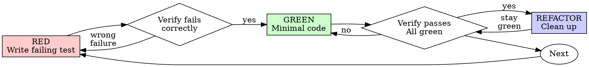
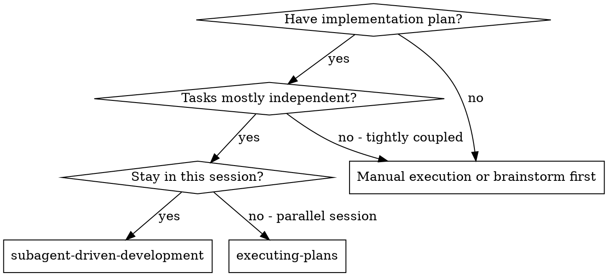
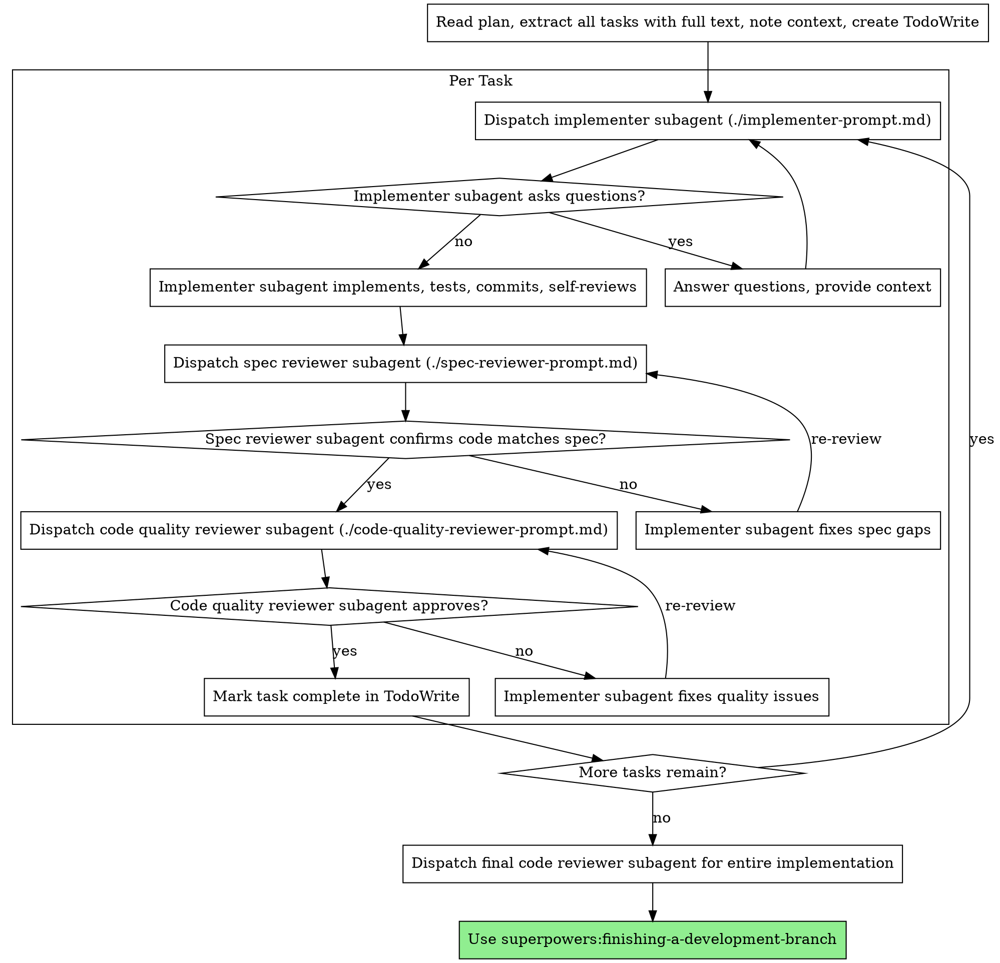

# M2A URL shortener implementation

**Session ID:** ses_1c06b3730ffe4gQHciddGf1ttP
**Created:** 5/19/2026, 12:32:55 PM
**Updated:** 5/19/2026, 12:57:17 PM

---

## User

Continue this project from M2A, Read docs/superpowers/plans/implementation-tracker.md and docs/superpowers/specs/2026-05-18-url-shortener-design.md. Create a small M2A plan then implement it, use worktrees and subagents.merge into main and clean worktree after finishing.

---

## Assistant (Build · gpt-5.5 · 7.8s)

**Tool: skill**

**Input:**
```json
{
  "name": "using-git-worktrees"
}
```

**Output:**
```
<skill_content name="using-git-worktrees">
# Skill: using-git-worktrees

# Using Git Worktrees

## Overview

Ensure work happens in an isolated workspace. Prefer your platform's native worktree tools. Fall back to manual git worktrees only when no native tool is available.

**Core principle:** Detect existing isolation first. Then use native tools. Then fall back to git. Never fight the harness.

**Announce at start:** "I'm using the using-git-worktrees skill to set up an isolated workspace."

## Step 0: Detect Existing Isolation

**Before creating anything, check if you are already in an isolated workspace.**

```bash
GIT_DIR=$(cd "$(git rev-parse --git-dir)" 2>/dev/null && pwd -P)
GIT_COMMON=$(cd "$(git rev-parse --git-common-dir)" 2>/dev/null && pwd -P)
BRANCH=$(git branch --show-current)
```

**Submodule guard:** `GIT_DIR != GIT_COMMON` is also true inside git submodules. Before concluding "already in a worktree," verify you are not in a submodule:

```bash
# If this returns a path, you're in a submodule, not a worktree — treat as normal repo
git rev-parse --show-superproject-working-tree 2>/dev/null
```

**If `GIT_DIR != GIT_COMMON` (and not a submodule):** You are already in a linked worktree. Skip to Step 3 (Project Setup). Do NOT create another worktree.

Report with branch state:
- On a branch: "Already in isolated workspace at `<path>` on branch `<name>`."
- Detached HEAD: "Already in isolated workspace at `<path>` (detached HEAD, externally managed). Branch creation needed at finish time."

**If `GIT_DIR == GIT_COMMON` (or in a submodule):** You are in a normal repo checkout.

Has the user already indicated their worktree preference in your instructions? If not, ask for consent before creating a worktree:

> "Would you like me to set up an isolated worktree? It protects your current branch from changes."

Honor any existing declared preference without asking. If the user declines consent, work in place and skip to Step 3.

## Step 1: Create Isolated Workspace

**You have two mechanisms. Try them in this order.**

### 1a. Native Worktree Tools (preferred)

The user has asked for an isolated workspace (Step 0 consent). Do you already have a way to create a worktree? It might be a tool with a name like `EnterWorktree`, `WorktreeCreate`, a `/worktree` command, or a `--worktree` flag. If you do, use it and skip to Step 3.

Native tools handle directory placement, branch creation, and cleanup automatically. Using `git worktree add` when you have a native tool creates phantom state your harness can't see or manage.

Only proceed to Step 1b if you have no native worktree tool available.

### 1b. Git Worktree Fallback

**Only use this if Step 1a does not apply** — you have no native worktree tool available. Create a worktree manually using git.

#### Directory Selection

Follow this priority order. Explicit user preference always beats observed filesystem state.

1. **Check your instructions for a declared worktree directory preference.** If the user has already specified one, use it without asking.

2. **Check for an existing project-local worktree directory:**
   ```bash
   ls -d .worktrees 2>/dev/null     # Preferred (hidden)
   ls -d worktrees 2>/dev/null      # Alternative
   ```
   If found, use it. If both exist, `.worktrees` wins.

3. **Check for an existing global directory:**
   ```bash
   project=$(basename "$(git rev-parse --show-toplevel)")
   ls -d ~/.config/superpowers/worktrees/$project 2>/dev/null
   ```
   If found, use it (backward compatibility with legacy global path).

4. **If there is no other guidance available**, default to `.worktrees/` at the project root.

#### Safety Verification (project-local directories only)

**MUST verify directory is ignored before creating worktree:**

```bash
git check-ignore -q .worktrees 2>/dev/null || git check-ignore -q worktrees 2>/dev/null
```

**If NOT ignored:** Add to .gitignore, commit the change, then proceed.

**Why critical:** Prevents accidentally committing worktree contents to repository.

Global directories (`~/.config/superpowers/worktrees/`) need no verification.

#### Create the Worktree

```bash
project=$(basename "$(git rev-parse --show-toplevel)")

# Determine path based on chosen location
# For project-local: path="$LOCATION/$BRANCH_NAME"
# For global: path="~/.config/superpowers/worktrees/$project/$BRANCH_NAME"

git worktree add "$path" -b "$BRANCH_NAME"
cd "$path"
```

**Sandbox fallback:** If `git worktree add` fails with a permission error (sandbox denial), tell the user the sandbox blocked worktree creation and you're working in the current directory instead. Then run setup and baseline tests in place.

## Step 3: Project Setup

Auto-detect and run appropriate setup:

```bash
# Node.js
if [ -f package.json ]; then npm install; fi

# Rust
if [ -f Cargo.toml ]; then cargo build; fi

# Python
if [ -f requirements.txt ]; then pip install -r requirements.txt; fi
if [ -f pyproject.toml ]; then poetry install; fi

# Go
if [ -f go.mod ]; then go mod download; fi
```

## Step 4: Verify Clean Baseline

Run tests to ensure workspace starts clean:

```bash
# Use project-appropriate command
npm test / cargo test / pytest / go test ./...
```

**If tests fail:** Report failures, ask whether to proceed or investigate.

**If tests pass:** Report ready.

### Report

```
Worktree ready at <full-path>
Tests passing (<N> tests, 0 failures)
Ready to implement <feature-name>
```

## Quick Reference

| Situation | Action |
|-----------|--------|
| Already in linked worktree | Skip creation (Step 0) |
| In a submodule | Treat as normal repo (Step 0 guard) |
| Native worktree tool available | Use it (Step 1a) |
| No native tool | Git worktree fallback (Step 1b) |
| `.worktrees/` exists | Use it (verify ignored) |
| `worktrees/` exists | Use it (verify ignored) |
| Both exist | Use `.worktrees/` |
| Neither exists | Check instruction file, then default `.worktrees/` |
| Global path exists | Use it (backward compat) |
| Directory not ignored | Add to .gitignore + commit |
| Permission error on create | Sandbox fallback, work in place |
| Tests fail during baseline | Report failures + ask |
| No package.json/Cargo.toml | Skip dependency install |

## Common Mistakes

### Fighting the harness

- **Problem:** Using `git worktree add` when the platform already provides isolation
- **Fix:** Step 0 detects existing isolation. Step 1a defers to native tools.

### Skipping detection

- **Problem:** Creating a nested worktree inside an existing one
- **Fix:** Always run Step 0 before creating anything

### Skipping ignore verification

- **Problem:** Worktree contents get tracked, pollute git status
- **Fix:** Always use `git check-ignore` before creating project-local worktree

### Assuming directory location

- **Problem:** Creates inconsistency, violates project conventions
- **Fix:** Follow priority: existing > global legacy > instruction file > default

### Proceeding with failing tests

- **Problem:** Can't distinguish new bugs from pre-existing issues
- **Fix:** Report failures, get explicit permission to proceed

## Red Flags

**Never:**
- Create a worktree when Step 0 detects existing isolation
- Use `git worktree add` when you have a native worktree tool (e.g., `EnterWorktree`). This is the #1 mistake — if you have it, use it.
- Skip Step 1a by jumping straight to Step 1b's git commands
- Create worktree without verifying it's ignored (project-local)
- Skip baseline test verification
- Proceed with failing tests without asking

**Always:**
- Run Step 0 detection first
- Prefer native tools over git fallback
- Follow directory priority: existing > global legacy > instruction file > default
- Verify directory is ignored for project-local
- Auto-detect and run project setup
- Verify clean test baseline

Base directory for this skill: file:///C:/Users/Shaheen/.cache/opencode/packages/superpowers@git+https_/github.com/obra/superpowers.git/node_modules/superpowers/skills/using-git-worktrees
Relative paths in this skill (e.g., scripts/, reference/) are relative to this base directory.
Note: file list is sampled.

<skill_files>

</skill_files>
</skill_content>
```

---

## Assistant (Build · gpt-5.5 · 3.5s)

I'm using the using-git-worktrees skill to set up an isolated workspace. After that I'll read the tracker/spec, create the M2A plan, and implement in the worktree before merging back.

**Tool: skill**

**Input:**
```json
{
  "name": "writing-plans"
}
```

**Output:**
```
<skill_content name="writing-plans">
# Skill: writing-plans

# Writing Plans

## Overview

Write comprehensive implementation plans assuming the engineer has zero context for our codebase and questionable taste. Document everything they need to know: which files to touch for each task, code, testing, docs they might need to check, how to test it. Give them the whole plan as bite-sized tasks. DRY. YAGNI. TDD. Frequent commits.

Assume they are a skilled developer, but know almost nothing about our toolset or problem domain. Assume they don't know good test design very well.

**Announce at start:** "I'm using the writing-plans skill to create the implementation plan."

**Context:** If working in an isolated worktree, it should have been created via the `superpowers:using-git-worktrees` skill at execution time.

**Save plans to:** `docs/superpowers/plans/YYYY-MM-DD-<feature-name>.md`
- (User preferences for plan location override this default)

## Scope Check

If the spec covers multiple independent subsystems, it should have been broken into sub-project specs during brainstorming. If it wasn't, suggest breaking this into separate plans — one per subsystem. Each plan should produce working, testable software on its own.

## File Structure

Before defining tasks, map out which files will be created or modified and what each one is responsible for. This is where decomposition decisions get locked in.

- Design units with clear boundaries and well-defined interfaces. Each file should have one clear responsibility.
- You reason best about code you can hold in context at once, and your edits are more reliable when files are focused. Prefer smaller, focused files over large ones that do too much.
- Files that change together should live together. Split by responsibility, not by technical layer.
- In existing codebases, follow established patterns. If the codebase uses large files, don't unilaterally restructure - but if a file you're modifying has grown unwieldy, including a split in the plan is reasonable.

This structure informs the task decomposition. Each task should produce self-contained changes that make sense independently.

## Bite-Sized Task Granularity

**Each step is one action (2-5 minutes):**
- "Write the failing test" - step
- "Run it to make sure it fails" - step
- "Implement the minimal code to make the test pass" - step
- "Run the tests and make sure they pass" - step
- "Commit" - step

## Plan Document Header

**Every plan MUST start with this header:**

```markdown
# [Feature Name] Implementation Plan

> **For agentic workers:** REQUIRED SUB-SKILL: Use superpowers:subagent-driven-development (recommended) or superpowers:executing-plans to implement this plan task-by-task. Steps use checkbox (`- [ ]`) syntax for tracking.

**Goal:** [One sentence describing what this builds]

**Architecture:** [2-3 sentences about approach]

**Tech Stack:** [Key technologies/libraries]

---
```

## Task Structure

````markdown
### Task N: [Component Name]

**Files:**
- Create: `exact/path/to/file.py`
- Modify: `exact/path/to/existing.py:123-145`
- Test: `tests/exact/path/to/test.py`

- [ ] **Step 1: Write the failing test**

```python
def test_specific_behavior():
    result = function(input)
    assert result == expected
```

- [ ] **Step 2: Run test to verify it fails**

Run: `pytest tests/path/test.py::test_name -v`
Expected: FAIL with "function not defined"

- [ ] **Step 3: Write minimal implementation**

```python
def function(input):
    return expected
```

- [ ] **Step 4: Run test to verify it passes**

Run: `pytest tests/path/test.py::test_name -v`
Expected: PASS

- [ ] **Step 5: Commit**

```bash
git add tests/path/test.py src/path/file.py
git commit -m "feat: add specific feature"
```
````

## No Placeholders

Every step must contain the actual content an engineer needs. These are **plan failures** — never write them:
- "TBD", "TODO", "implement later", "fill in details"
- "Add appropriate error handling" / "add validation" / "handle edge cases"
- "Write tests for the above" (without actual test code)
- "Similar to Task N" (repeat the code — the engineer may be reading tasks out of order)
- Steps that describe what to do without showing how (code blocks required for code steps)
- References to types, functions, or methods not defined in any task

## Remember
- Exact file paths always
- Complete code in every step — if a step changes code, show the code
- Exact commands with expected output
- DRY, YAGNI, TDD, frequent commits

## Self-Review

After writing the complete plan, look at the spec with fresh eyes and check the plan against it. This is a checklist you run yourself — not a subagent dispatch.

**1. Spec coverage:** Skim each section/requirement in the spec. Can you point to a task that implements it? List any gaps.

**2. Placeholder scan:** Search your plan for red flags — any of the patterns from the "No Placeholders" section above. Fix them.

**3. Type consistency:** Do the types, method signatures, and property names you used in later tasks match what you defined in earlier tasks? A function called `clearLayers()` in Task 3 but `clearFullLayers()` in Task 7 is a bug.

If you find issues, fix them inline. No need to re-review — just fix and move on. If you find a spec requirement with no task, add the task.

## Execution Handoff

After saving the plan, offer execution choice:

**"Plan complete and saved to `docs/superpowers/plans/<filename>.md`. Two execution options:**

**1. Subagent-Driven (recommended)** - I dispatch a fresh subagent per task, review between tasks, fast iteration

**2. Inline Execution** - Execute tasks in this session using executing-plans, batch execution with checkpoints

**Which approach?"**

**If Subagent-Driven chosen:**
- **REQUIRED SUB-SKILL:** Use superpowers:subagent-driven-development
- Fresh subagent per task + two-stage review

**If Inline Execution chosen:**
- **REQUIRED SUB-SKILL:** Use superpowers:executing-plans
- Batch execution with checkpoints for review

Base directory for this skill: file:///C:/Users/Shaheen/.cache/opencode/packages/superpowers@git+https_/github.com/obra/superpowers.git/node_modules/superpowers/skills/writing-plans
Relative paths in this skill (e.g., scripts/, reference/) are relative to this base directory.
Note: file list is sampled.

<skill_files>
<file>C:\Users\Shaheen\.cache\opencode\packages\superpowers@git+https_\github.com\obra\superpowers.git\node_modules\superpowers\skills\writing-plans\plan-document-reviewer-prompt.md</file>
</skill_files>
</skill_content>
```

---

## Assistant (Build · gpt-5.5 · 8.2s)

I'm using the writing-plans skill to create the implementation plan. Since you asked me to continue from M2A and implement, I'll keep the plan small and execute it rather than stopping for an execution choice.

**Tool: skill**

**Input:**
```json
{
  "name": "test-driven-development"
}
```

**Output:**
```
<skill_content name="test-driven-development">
# Skill: test-driven-development

# Test-Driven Development (TDD)

## Overview

Write the test first. Watch it fail. Write minimal code to pass.

**Core principle:** If you didn't watch the test fail, you don't know if it tests the right thing.

**Violating the letter of the rules is violating the spirit of the rules.**

## When to Use

**Always:**
- New features
- Bug fixes
- Refactoring
- Behavior changes

**Exceptions (ask your human partner):**
- Throwaway prototypes
- Generated code
- Configuration files

Thinking "skip TDD just this once"? Stop. That's rationalization.

## The Iron Law

```
NO PRODUCTION CODE WITHOUT A FAILING TEST FIRST
```

Write code before the test? Delete it. Start over.

**No exceptions:**
- Don't keep it as "reference"
- Don't "adapt" it while writing tests
- Don't look at it
- Delete means delete

Implement fresh from tests. Period.

## Red-Green-Refactor



### RED - Write Failing Test

Write one minimal test showing what should happen.

<Good>
```typescript
test('retries failed operations 3 times', async () => {
  let attempts = 0;
  const operation = () => {
    attempts++;
    if (attempts < 3) throw new Error('fail');
    return 'success';
  };

  const result = await retryOperation(operation);

  expect(result).toBe('success');
  expect(attempts).toBe(3);
});
```
Clear name, tests real behavior, one thing
</Good>

<Bad>
```typescript
test('retry works', async () => {
  const mock = jest.fn()
    .mockRejectedValueOnce(new Error())
    .mockRejectedValueOnce(new Error())
    .mockResolvedValueOnce('success');
  await retryOperation(mock);
  expect(mock).toHaveBeenCalledTimes(3);
});
```
Vague name, tests mock not code
</Bad>

**Requirements:**
- One behavior
- Clear name
- Real code (no mocks unless unavoidable)

### Verify RED - Watch It Fail

**MANDATORY. Never skip.**

```bash
npm test path/to/test.test.ts
```

Confirm:
- Test fails (not errors)
- Failure message is expected
- Fails because feature missing (not typos)

**Test passes?** You're testing existing behavior. Fix test.

**Test errors?** Fix error, re-run until it fails correctly.

### GREEN - Minimal Code

Write simplest code to pass the test.

<Good>
```typescript
async function retryOperation<T>(fn: () => Promise<T>): Promise<T> {
  for (let i = 0; i < 3; i++) {
    try {
      return await fn();
    } catch (e) {
      if (i === 2) throw e;
    }
  }
  throw new Error('unreachable');
}
```
Just enough to pass
</Good>

<Bad>
```typescript
async function retryOperation<T>(
  fn: () => Promise<T>,
  options?: {
    maxRetries?: number;
    backoff?: 'linear' | 'exponential';
    onRetry?: (attempt: number) => void;
  }
): Promise<T> {
  // YAGNI
}
```
Over-engineered
</Bad>

Don't add features, refactor other code, or "improve" beyond the test.

### Verify GREEN - Watch It Pass

**MANDATORY.**

```bash
npm test path/to/test.test.ts
```

Confirm:
- Test passes
- Other tests still pass
- Output pristine (no errors, warnings)

**Test fails?** Fix code, not test.

**Other tests fail?** Fix now.

### REFACTOR - Clean Up

After green only:
- Remove duplication
- Improve names
- Extract helpers

Keep tests green. Don't add behavior.

### Repeat

Next failing test for next feature.

## Good Tests

| Quality | Good | Bad |
|---------|------|-----|
| **Minimal** | One thing. "and" in name? Split it. | `test('validates email and domain and whitespace')` |
| **Clear** | Name describes behavior | `test('test1')` |
| **Shows intent** | Demonstrates desired API | Obscures what code should do |

## Why Order Matters

**"I'll write tests after to verify it works"**

Tests written after code pass immediately. Passing immediately proves nothing:
- Might test wrong thing
- Might test implementation, not behavior
- Might miss edge cases you forgot
- You never saw it catch the bug

Test-first forces you to see the test fail, proving it actually tests something.

**"I already manually tested all the edge cases"**

Manual testing is ad-hoc. You think you tested everything but:
- No record of what you tested
- Can't re-run when code changes
- Easy to forget cases under pressure
- "It worked when I tried it" ≠ comprehensive

Automated tests are systematic. They run the same way every time.

**"Deleting X hours of work is wasteful"**

Sunk cost fallacy. The time is already gone. Your choice now:
- Delete and rewrite with TDD (X more hours, high confidence)
- Keep it and add tests after (30 min, low confidence, likely bugs)

The "waste" is keeping code you can't trust. Working code without real tests is technical debt.

**"TDD is dogmatic, being pragmatic means adapting"**

TDD IS pragmatic:
- Finds bugs before commit (faster than debugging after)
- Prevents regressions (tests catch breaks immediately)
- Documents behavior (tests show how to use code)
- Enables refactoring (change freely, tests catch breaks)

"Pragmatic" shortcuts = debugging in production = slower.

**"Tests after achieve the same goals - it's spirit not ritual"**

No. Tests-after answer "What does this do?" Tests-first answer "What should this do?"

Tests-after are biased by your implementation. You test what you built, not what's required. You verify remembered edge cases, not discovered ones.

Tests-first force edge case discovery before implementing. Tests-after verify you remembered everything (you didn't).

30 minutes of tests after ≠ TDD. You get coverage, lose proof tests work.

## Common Rationalizations

| Excuse | Reality |
|--------|---------|
| "Too simple to test" | Simple code breaks. Test takes 30 seconds. |
| "I'll test after" | Tests passing immediately prove nothing. |
| "Tests after achieve same goals" | Tests-after = "what does this do?" Tests-first = "what should this do?" |
| "Already manually tested" | Ad-hoc ≠ systematic. No record, can't re-run. |
| "Deleting X hours is wasteful" | Sunk cost fallacy. Keeping unverified code is technical debt. |
| "Keep as reference, write tests first" | You'll adapt it. That's testing after. Delete means delete. |
| "Need to explore first" | Fine. Throw away exploration, start with TDD. |
| "Test hard = design unclear" | Listen to test. Hard to test = hard to use. |
| "TDD will slow me down" | TDD faster than debugging. Pragmatic = test-first. |
| "Manual test faster" | Manual doesn't prove edge cases. You'll re-test every change. |
| "Existing code has no tests" | You're improving it. Add tests for existing code. |

## Red Flags - STOP and Start Over

- Code before test
- Test after implementation
- Test passes immediately
- Can't explain why test failed
- Tests added "later"
- Rationalizing "just this once"
- "I already manually tested it"
- "Tests after achieve the same purpose"
- "It's about spirit not ritual"
- "Keep as reference" or "adapt existing code"
- "Already spent X hours, deleting is wasteful"
- "TDD is dogmatic, I'm being pragmatic"
- "This is different because..."

**All of these mean: Delete code. Start over with TDD.**

## Example: Bug Fix

**Bug:** Empty email accepted

**RED**
```typescript
test('rejects empty email', async () => {
  const result = await submitForm({ email: '' });
  expect(result.error).toBe('Email required');
});
```

**Verify RED**
```bash
$ npm test
FAIL: expected 'Email required', got undefined
```

**GREEN**
```typescript
function submitForm(data: FormData) {
  if (!data.email?.trim()) {
    return { error: 'Email required' };
  }
  // ...
}
```

**Verify GREEN**
```bash
$ npm test
PASS
```

**REFACTOR**
Extract validation for multiple fields if needed.

## Verification Checklist

Before marking work complete:

- [ ] Every new function/method has a test
- [ ] Watched each test fail before implementing
- [ ] Each test failed for expected reason (feature missing, not typo)
- [ ] Wrote minimal code to pass each test
- [ ] All tests pass
- [ ] Output pristine (no errors, warnings)
- [ ] Tests use real code (mocks only if unavoidable)
- [ ] Edge cases and errors covered

Can't check all boxes? You skipped TDD. Start over.

## When Stuck

| Problem | Solution |
|---------|----------|
| Don't know how to test | Write wished-for API. Write assertion first. Ask your human partner. |
| Test too complicated | Design too complicated. Simplify interface. |
| Must mock everything | Code too coupled. Use dependency injection. |
| Test setup huge | Extract helpers. Still complex? Simplify design. |

## Debugging Integration

Bug found? Write failing test reproducing it. Follow TDD cycle. Test proves fix and prevents regression.

Never fix bugs without a test.

## Testing Anti-Patterns

When adding mocks or test utilities, read @testing-anti-patterns.md to avoid common pitfalls:
- Testing mock behavior instead of real behavior
- Adding test-only methods to production classes
- Mocking without understanding dependencies

## Final Rule

```
Production code → test exists and failed first
Otherwise → not TDD
```

No exceptions without your human partner's permission.

Base directory for this skill: file:///C:/Users/Shaheen/.cache/opencode/packages/superpowers@git+https_/github.com/obra/superpowers.git/node_modules/superpowers/skills/test-driven-development
Relative paths in this skill (e.g., scripts/, reference/) are relative to this base directory.
Note: file list is sampled.

<skill_files>
<file>C:\Users\Shaheen\.cache\opencode\packages\superpowers@git+https_\github.com\obra\superpowers.git\node_modules\superpowers\skills\test-driven-development\testing-anti-patterns.md</file>
</skill_files>
</skill_content>
```

---

## Assistant (Build · gpt-5.5 · 3.7s)

I'm using the test-driven-development skill because this continuation likely includes behavior changes. I'll write or update tests before production changes and verify the red/green cycle.

**Tool: skill**

**Input:**
```json
{
  "name": "subagent-driven-development"
}
```

**Output:**
```
<skill_content name="subagent-driven-development">
# Skill: subagent-driven-development

# Subagent-Driven Development

Execute plan by dispatching fresh subagent per task, with two-stage review after each: spec compliance review first, then code quality review.

**Why subagents:** You delegate tasks to specialized agents with isolated context. By precisely crafting their instructions and context, you ensure they stay focused and succeed at their task. They should never inherit your session's context or history — you construct exactly what they need. This also preserves your own context for coordination work.

**Core principle:** Fresh subagent per task + two-stage review (spec then quality) = high quality, fast iteration

**Continuous execution:** Do not pause to check in with your human partner between tasks. Execute all tasks from the plan without stopping. The only reasons to stop are: BLOCKED status you cannot resolve, ambiguity that genuinely prevents progress, or all tasks complete. "Should I continue?" prompts and progress summaries waste their time — they asked you to execute the plan, so execute it.

## When to Use



**vs. Executing Plans (parallel session):**
- Same session (no context switch)
- Fresh subagent per task (no context pollution)
- Two-stage review after each task: spec compliance first, then code quality
- Faster iteration (no human-in-loop between tasks)

## The Process



## Model Selection

Use the least powerful model that can handle each role to conserve cost and increase speed.

**Mechanical implementation tasks** (isolated functions, clear specs, 1-2 files): use a fast, cheap model. Most implementation tasks are mechanical when the plan is well-specified.

**Integration and judgment tasks** (multi-file coordination, pattern matching, debugging): use a standard model.

**Architecture, design, and review tasks**: use the most capable available model.

**Task complexity signals:**
- Touches 1-2 files with a complete spec → cheap model
- Touches multiple files with integration concerns → standard model
- Requires design judgment or broad codebase understanding → most capable model

## Handling Implementer Status

Implementer subagents report one of four statuses. Handle each appropriately:

**DONE:** Proceed to spec compliance review.

**DONE_WITH_CONCERNS:** The implementer completed the work but flagged doubts. Read the concerns before proceeding. If the concerns are about correctness or scope, address them before review. If they're observations (e.g., "this file is getting large"), note them and proceed to review.

**NEEDS_CONTEXT:** The implementer needs information that wasn't provided. Provide the missing context and re-dispatch.

**BLOCKED:** The implementer cannot complete the task. Assess the blocker:
1. If it's a context problem, provide more context and re-dispatch with the same model
2. If the task requires more reasoning, re-dispatch with a more capable model
3. If the task is too large, break it into smaller pieces
4. If the plan itself is wrong, escalate to the human

**Never** ignore an escalation or force the same model to retry without changes. If the implementer said it's stuck, something needs to change.

## Prompt Templates

- `./implementer-prompt.md` - Dispatch implementer subagent
- `./spec-reviewer-prompt.md` - Dispatch spec compliance reviewer subagent
- `./code-quality-reviewer-prompt.md` - Dispatch code quality reviewer subagent

## Example Workflow

```
You: I'm using Subagent-Driven Development to execute this plan.

[Read plan file once: docs/superpowers/plans/feature-plan.md]
[Extract all 5 tasks with full text and context]
[Create TodoWrite with all tasks]

Task 1: Hook installation script

[Get Task 1 text and context (already extracted)]
[Dispatch implementation subagent with full task text + context]

Implementer: "Before I begin - should the hook be installed at user or system level?"

You: "User level (~/.config/superpowers/hooks/)"

Implementer: "Got it. Implementing now..."
[Later] Implementer:
  - Implemented install-hook command
  - Added tests, 5/5 passing
  - Self-review: Found I missed --force flag, added it
  - Committed

[Dispatch spec compliance reviewer]
Spec reviewer: ✅ Spec compliant - all requirements met, nothing extra

[Get git SHAs, dispatch code quality reviewer]
Code reviewer: Strengths: Good test coverage, clean. Issues: None. Approved.

[Mark Task 1 complete]

Task 2: Recovery modes

[Get Task 2 text and context (already extracted)]
[Dispatch implementation subagent with full task text + context]

Implementer: [No questions, proceeds]
Implementer:
  - Added verify/repair modes
  - 8/8 tests passing
  - Self-review: All good
  - Committed

[Dispatch spec compliance reviewer]
Spec reviewer: ❌ Issues:
  - Missing: Progress reporting (spec says "report every 100 items")
  - Extra: Added --json flag (not requested)

[Implementer fixes issues]
Implementer: Removed --json flag, added progress reporting

[Spec reviewer reviews again]
Spec reviewer: ✅ Spec compliant now

[Dispatch code quality reviewer]
Code reviewer: Strengths: Solid. Issues (Important): Magic number (100)

[Implementer fixes]
Implementer: Extracted PROGRESS_INTERVAL constant

[Code reviewer reviews again]
Code reviewer: ✅ Approved

[Mark Task 2 complete]

...

[After all tasks]
[Dispatch final code-reviewer]
Final reviewer: All requirements met, ready to merge

Done!
```

## Advantages

**vs. Manual execution:**
- Subagents follow TDD naturally
- Fresh context per task (no confusion)
- Parallel-safe (subagents don't interfere)
- Subagent can ask questions (before AND during work)

**vs. Executing Plans:**
- Same session (no handoff)
- Continuous progress (no waiting)
- Review checkpoints automatic

**Efficiency gains:**
- No file reading overhead (controller provides full text)
- Controller curates exactly what context is needed
- Subagent gets complete information upfront
- Questions surfaced before work begins (not after)

**Quality gates:**
- Self-review catches issues before handoff
- Two-stage review: spec compliance, then code quality
- Review loops ensure fixes actually work
- Spec compliance prevents over/under-building
- Code quality ensures implementation is well-built

**Cost:**
- More subagent invocations (implementer + 2 reviewers per task)
- Controller does more prep work (extracting all tasks upfront)
- Review loops add iterations
- But catches issues early (cheaper than debugging later)

## Red Flags

**Never:**
- Start implementation on main/master branch without explicit user consent
- Skip reviews (spec compliance OR code quality)
- Proceed with unfixed issues
- Dispatch multiple implementation subagents in parallel (conflicts)
- Make subagent read plan file (provide full text instead)
- Skip scene-setting context (subagent needs to understand where task fits)
- Ignore subagent questions (answer before letting them proceed)
- Accept "close enough" on spec compliance (spec reviewer found issues = not done)
- Skip review loops (reviewer found issues = implementer fixes = review again)
- Let implementer self-review replace actual review (both are needed)
- **Start code quality review before spec compliance is ✅** (wrong order)
- Move to next task while either review has open issues

**If subagent asks questions:**
- Answer clearly and completely
- Provide additional context if needed
- Don't rush them into implementation

**If reviewer finds issues:**
- Implementer (same subagent) fixes them
- Reviewer reviews again
- Repeat until approved
- Don't skip the re-review

**If subagent fails task:**
- Dispatch fix subagent with specific instructions
- Don't try to fix manually (context pollution)

## Integration

**Required workflow skills:**
- **superpowers:using-git-worktrees** - Ensures isolated workspace (creates one or verifies existing)
- **superpowers:writing-plans** - Creates the plan this skill executes
- **superpowers:requesting-code-review** - Code review template for reviewer subagents
- **superpowers:finishing-a-development-branch** - Complete development after all tasks

**Subagents should use:**
- **superpowers:test-driven-development** - Subagents follow TDD for each task

**Alternative workflow:**
- **superpowers:executing-plans** - Use for parallel session instead of same-session execution

Base directory for this skill: file:///C:/Users/Shaheen/.cache/opencode/packages/superpowers@git+https_/github.com/obra/superpowers.git/node_modules/superpowers/skills/subagent-driven-development
Relative paths in this skill (e.g., scripts/, reference/) are relative to this base directory.
Note: file list is sampled.

<skill_files>
<file>C:\Users\Shaheen\.cache\opencode\packages\superpowers@git+https_\github.com\obra\superpowers.git\node_modules\superpowers\skills\subagent-driven-development\spec-reviewer-prompt.md</file>
<file>C:\Users\Shaheen\.cache\opencode\packages\superpowers@git+https_\github.com\obra\superpowers.git\node_modules\superpowers\skills\subagent-driven-development\implementer-prompt.md</file>
<file>C:\Users\Shaheen\.cache\opencode\packages\superpowers@git+https_\github.com\obra\superpowers.git\node_modules\superpowers\skills\subagent-driven-development\code-quality-reviewer-prompt.md</file>
</skill_files>
</skill_content>
```

---

## Assistant (Build · gpt-5.5 · 4.9s)

I'm using Subagent-Driven Development to execute the M2A plan with review checkpoints. I'll keep implementation sequential to avoid conflicting edits, then run final verification before merging.

**Tool: bash**

**Input:**
```json
{
  "command": "git rev-parse --git-dir",
  "description": "Shows git metadata directory"
}
```

**Output:**
```
.git

```

**Tool: bash**

**Input:**
```json
{
  "command": "git rev-parse --git-common-dir",
  "description": "Shows common git metadata directory"
}
```

**Output:**
```
.git

```

**Tool: bash**

**Input:**
```json
{
  "command": "git branch --show-current",
  "description": "Shows current git branch"
}
```

**Output:**
```
main

```

**Tool: bash**

**Input:**
```json
{
  "command": "git rev-parse --show-superproject-working-tree",
  "description": "Checks for containing superproject"
}
```

**Output:**
```
(no output)
```

---

## Assistant (Build · gpt-5.5 · 5.9s)

This checkout is the main repo, not an existing linked worktree. Your request explicitly asked to use worktrees, so I'll create a project-local isolated branch and verify it is ignored first.

**Tool: glob**

**Input:**
```json
{
  "pattern": ".worktrees"
}
```

**Output:**
```
No files found
```

**Tool: glob**

**Input:**
```json
{
  "pattern": "worktrees"
}
```

**Output:**
```
No files found
```

**Tool: bash**

**Input:**
```json
{
  "command": "git check-ignore -q .worktrees; if ($?) { 'ignored' } else { 'not ignored' }",
  "description": "Checks worktree ignore status"
}
```

**Output:**
```
ignored

```

**Tool: bash**

**Input:**
```json
{
  "command": "git status --short",
  "description": "Shows working tree status"
}
```

**Output:**
```
(no output)
```

---

## Assistant (Build · gpt-5.5 · 11.5s)

**Tool: bash**

**Input:**
```json
{
  "command": "git worktree add \".worktrees/m2a\" -b \"m2a-implementation\"",
  "description": "Creates isolated M2A worktree",
  "timeout": 120000
}
```

**Output:**
```
Preparing worktree (new branch 'm2a-implementation')
HEAD is now at 24409c4 Merge branch 'm1d-redirect-clicks'

```

---

## Assistant (Build · gpt-5.5 · 9.6s)

Worktree created at `.worktrees/m2a` on branch `m2a-implementation`. I'll inspect the docs and project setup from that isolated workspace next.

**Tool: read**

**Input:**
```json
{
  "filePath": "C:\\Users\\Shaheen\\URL_shortner_super_powers\\.worktrees\\m2a\\docs\\superpowers\\plans\\implementation-tracker.md"
}
```

**Output:**
```
<path>C:\Users\Shaheen\URL_shortner_super_powers\.worktrees\m2a\docs\superpowers\plans\implementation-tracker.md</path>
<type>file</type>
<content>
1: # URL Shortener Implementation Tracker
2: 
3: Design spec: `docs/superpowers/specs/2026-05-18-url-shortener-design.md`
4: 
5: ## Milestones
6: 
7: - [x] M1A: Project scaffold, Fastify health endpoint, Docker Compose PostgreSQL
8: - [x] M1B: Prisma schema and database connection
9: - [x] M1C: Public link creation validation and code generation
10: - [x] M1D: Redirect route and click counting basics
11: - [ ] M2A: Admin authentication and sessions
12: - [ ] M2B: Admin link management API
13: - [ ] M2C: Admin analytics API
14: - [ ] M3A: Public React form
15: - [ ] M3B: Admin dashboard UI shell
16: - [ ] M3C: Dashboard charts and link table
17: - [ ] M4A: OpenAPI docs, Docker production image, final verification
18: 
19: ## Current Status
20: 
21: - Current plan: `docs/superpowers/plans/2026-05-19-url-shortener-m1d-redirect-clicks.md`
22: - Last updated: 2026-05-19

(End of file - total 22 lines)
</content>
```

**Tool: read**

**Input:**
```json
{
  "filePath": "C:\\Users\\Shaheen\\URL_shortner_super_powers\\.worktrees\\m2a\\docs\\superpowers\\specs\\2026-05-18-url-shortener-design.md"
}
```

**Output:**
```
<path>C:\Users\Shaheen\URL_shortner_super_powers\.worktrees\m2a\docs\superpowers\specs\2026-05-18-url-shortener-design.md</path>
<type>file</type>
<content>
1: # URL Shortener Backend And Admin Dashboard Design
2: 
3: ## Summary
4: 
5: Build a production-oriented URL shortener using a Node.js/TypeScript backend, PostgreSQL, and a React/Vite frontend. The service will support public anonymous link creation, short-link redirects, OpenAPI documentation, and a polished admin dashboard with link management and analytics.
6: 
7: The first version uses one deployable application container. PostgreSQL runs as a separate service, including through Docker Compose for local development.
8: 
9: ## Goals
10: 
11: - Public users can create short links without logging in.
12: - Public users can optionally choose a custom alias and optional expiration date.
13: - The service redirects active, non-expired short links and records human-looking clicks.
14: - Obvious bots and crawlers do not inflate analytics.
15: - Admins can log in, manage links, and view analytics charts by day, referrer, and device.
16: - The public API is documented with OpenAPI.
17: - The app runs locally with Docker Compose and is deployable as a Docker container.
18: 
19: ## Non-Goals For V1
20: 
21: - Public user accounts or link ownership.
22: - Public metadata endpoints for existing short links.
23: - Public stats pages.
24: - Multi-admin management UI.
25: - Separate domains for dashboard, API, and redirects.
26: - CAPTCHA or admin-managed denylists.
27: 
28: ## Technology Choices
29: 
30: - Backend: Fastify with TypeScript.
31: - Frontend: React with Vite.
32: - Database: PostgreSQL.
33: - Database access and migrations: Prisma.
34: - Admin authentication: cookie-based server-side sessions.
35: - Password hashing: Argon2.
36: - Deployment: Docker app container plus separate PostgreSQL service.
37: 
38: Fastify is preferred over a minimal Express setup because it has strong TypeScript ergonomics, schema-driven validation, OpenAPI-friendly route definitions, and good performance for redirect/API traffic.
39: 
40: ## Application Architecture
41: 
42: The repository will contain one full-stack application with clear backend and frontend boundaries:
43: 
44: - `server/`: Fastify API, redirect route, admin auth, OpenAPI docs, PostgreSQL access, validation, rate limiting, and operational endpoints.
45: - `web/`: React/Vite public form and admin dashboard.
46: - Docker Compose: local app and PostgreSQL services.
47: 
48: The same app serves public pages, admin pages, API routes, docs, and redirects from one domain.
49: 
50: Routes:
51: 
52: - `/`: public link creation page.
53: - `/api/links`: public REST endpoint for creating short links.
54: - `/api/admin/*`: authenticated admin APIs.
55: - `/docs`: OpenAPI documentation UI.
56: - `/admin/*`: React admin dashboard.
57: - `/:code`: short-link redirect route.
58: 
59: Reserved routes such as `admin`, `api`, `docs`, asset paths, and health routes cannot be used as custom aliases. The redirect route is registered so it does not swallow internal application routes.
60: 
61: ## Data Model
62: 
63: ### `links`
64: 
65: Stores each shortened URL.
66: 
67: Fields:
68: 
69: - `id`: primary key.
70: - `original_url`: destination URL.
71: - `short_code`: unique public code or alias.
72: - `is_custom_alias`: whether the code was user-supplied.
73: - `is_active`: whether redirects are allowed.
74: - `expires_at`: optional expiration timestamp.
75: - `total_click_count`: denormalized count for fast dashboard summaries.
76: - `created_at`: creation timestamp.
77: - `updated_at`: update timestamp.
78: 
79: ### `click_events`
80: 
81: Stores analytics events for counted clicks.
82: 
83: Fields:
84: 
85: - `id`: primary key.
86: - `link_id`: foreign key to `links`.
87: - `clicked_at`: event timestamp.
88: - `referrer_host`: normalized referrer host when available.
89: - `device_type`: coarse device category such as desktop, mobile, tablet, or unknown.
90: - `browser`: coarse browser/user-agent summary.
91: - `ip_hash`: irreversible hash or equivalent privacy-preserving representation.
92: 
93: Raw full IP addresses are not stored in click analytics.
94: 
95: ### `admin_users`
96: 
97: Stores admin login identities.
98: 
99: Fields:
100: 
101: - `id`: primary key.
102: - `email`: unique admin email.
103: - `password_hash`: Argon2 password hash.
104: - `created_at`: creation timestamp.
105: - `last_login_at`: optional last login timestamp.
106: 
107: The initial admin is created through a setup or seed command. V1 does not include public registration or admin user management screens.
108: 
109: ### `admin_sessions`
110: 
111: Stores server-side admin sessions.
112: 
113: Fields:
114: 
115: - `id`: primary key.
116: - `admin_user_id`: foreign key to `admin_users`.
117: - `session_token_hash`: hash of the browser session token.
118: - `expires_at`: session expiration timestamp.
119: - `created_at`: creation timestamp.
120: 
121: ## Public Link Creation
122: 
123: Public users can create links through both the web form and `POST /api/links`.
124: 
125: Request fields:
126: 
127: - `url`: required destination URL.
128: - `alias`: optional custom alias.
129: - `expiresAt`: optional expiration timestamp.
130: 
131: Validation rules:
132: 
133: - Destination URLs must use `http` or `https`.
134: - Localhost, private IP ranges, loopback addresses, and internal hostnames are blocked.
135: - Aliases must be URL-safe, length-limited, unique, and not reserved.
136: - Public creation is rate-limited by IP.
137: 
138: If no alias is provided, the backend generates a random URL-safe code and retries on uniqueness collisions. If a custom alias collides or fails validation, the API returns a clear validation error instead of silently replacing it.
139: 
140: Successful responses include the generated short URL based on the configured public base URL.
141: 
142: ## Redirect Behavior
143: 
144: When a user visits `/:code`, the service:
145: 
146: 1. Looks up the link by short code.
147: 2. Verifies the link exists, is active, and is not expired.
148: 3. Shows a branded unavailable page for missing, inactive, or expired links.
149: 4. Redirects valid links to their original URL.
150: 5. Records click analytics for human-looking visits.
151: 
152: Obvious bots and crawlers are redirected but not counted. Click recording should avoid adding noticeable latency to redirects. The dashboard uses `links.total_click_count` for fast summaries and `click_events` for detailed charts.
153: 
154: ## Public API
155: 
156: V1 exposes only the public API needed for anonymous link creation.
157: 
158: - `POST /api/links`: create a short link.
159: 
160: V1 does not expose `GET /api/links/:code` or other public metadata endpoints. Visitors use `GET /:code` for redirects, and admins use authenticated admin APIs for link metadata.
161: 
162: ## Admin Dashboard
163: 
164: The admin dashboard is a custom polished SaaS analytics interface built with React/Vite and served under `/admin/*`.
165: 
166: V1 features:
167: 
168: - Admin login and logout.
169: - Overview cards for total links, total clicks, active links, and recent clicks.
170: - Analytics charts by day, referrer, and device.
171: - Search, filter, and paginate all links.
172: - View link details and click history.
173: - Edit original URL, active status, and expiration date.
174: - Delete or deactivate links.
175: - Copy short URLs from the dashboard.
176: 
177: The visual direction should be clean and analytics-focused: crisp cards, strong typography, responsive charts, polished empty/loading states, and a restrained palette with one strong accent color.
178: 
179: ## Admin API
180: 
181: Admin APIs live under `/api/admin/*` and require an authenticated session.
182: 
183: Expected endpoint groups:
184: 
185: - Session endpoints for login, logout, and current admin.
186: - Link listing, searching, filtering, pagination, update, deletion, and deactivation.
187: - Link detail and click history endpoints.
188: - Analytics endpoints for time-series clicks, referrer breakdowns, and device breakdowns.
189: 
190: Admin requests without a valid session return `401`. Validation errors return structured JSON responses with stable error codes and readable messages.
191: 
192: ## Authentication And Sessions
193: 
194: Admin login uses database-backed admin users and server-side sessions.
195: 
196: Session cookie behavior:
197: 
198: - `HttpOnly` to prevent JavaScript access.
199: - `SameSite=Lax` for same-domain dashboard usage.
200: - `Secure` in production.
201: - Session token stored only as a hash in the database.
202: - Expired sessions are rejected and can be cleaned up periodically.
203: 
204: This avoids JWT storage complexity and fits the same-domain deployment model.
205: 
206: ## Error Handling
207: 
208: Public and admin APIs return consistent JSON errors with stable codes and human-readable messages. The public form renders these errors inline.
209: 
210: Redirect errors use branded HTML pages rather than JSON:
211: 
212: - Unknown short code.
213: - Inactive link.
214: - Expired link.
215: 
216: Operational errors should be logged server-side without leaking secrets or sensitive request data to users.
217: 
218: ## Security And Abuse Protection
219: 
220: Security requirements:
221: 
222: - Rate-limit public link creation by IP.
223: - Validate and normalize destination URLs.
224: - Block private network, loopback, localhost, and internal destinations.
225: - Reject unsafe or reserved aliases.
226: - Use Argon2 for admin passwords.
227: - Use secure cookie settings in production.
228: - Store hashed or privacy-preserving IP metadata for analytics rather than raw full IP addresses.
229: - Avoid logging secrets, session tokens, or full sensitive request bodies.
230: 
231: V1 does not include CAPTCHA or admin-managed denylists, but the design leaves room to add them later.
232: 
233: ## Configuration
234: 
235: Environment variables configure:
236: 
237: - App port.
238: - Database URL.
239: - Public base URL used when generating short links.
240: - Session secret or token signing material.
241: - Cookie secure mode.
242: - Rate limit settings.
243: - Optional log level.
244: 
245: The app assumes one base domain in v1, but the public base URL remains configurable so a dedicated short-link domain can be introduced later.
246: 
247: ## Operations
248: 
249: Local development uses Docker Compose with at least:
250: 
251: - App service.
252: - PostgreSQL service.
253: 
254: Operational endpoints:
255: 
256: - Health endpoint for container checks.
257: - OpenAPI documentation at `/docs`.
258: 
259: Database migrations manage schema changes. Seed or setup commands create the initial admin user.
260: 
261: ## Testing Strategy
262: 
263: Unit tests cover:
264: 
265: - Random short code generation and collision retry behavior.
266: - Alias validation and reserved alias rejection.
267: - URL validation and private network blocking.
268: - Bot detection.
269: - Expiration and active-status checks.
270: 
271: API tests cover:
272: 
273: - Public link creation.
274: - Validation and rate-limit errors.
275: - Redirect behavior for valid, missing, inactive, expired, and bot visits.
276: - Admin login/logout/session checks.
277: - Admin link search, edit, delete/deactivate, and analytics endpoints.
278: 
279: UI tests cover:
280: 
281: - Public form success and error states.
282: - Admin login.
283: - Dashboard overview rendering.
284: - Basic link table interactions.
285: 
286: ## Implementation Notes
287: 
288: - Keep the public API surface small in v1: only public link creation is exposed as JSON.
289: - Keep redirect logic separate from dashboard/API logic so it remains easy to test and optimize.
290: - Keep analytics aggregation behind admin API endpoints so chart implementation can change without affecting stored data.
291: - Prefer explicit route schemas to support validation and OpenAPI generation.

(End of file - total 291 lines)
</content>
```

**Tool: read**

**Input:**
```json
{
  "filePath": "C:\\Users\\Shaheen\\URL_shortner_super_powers\\.worktrees\\m2a\\package.json"
}
```

**Output:**
```
<path>C:\Users\Shaheen\URL_shortner_super_powers\.worktrees\m2a\package.json</path>
<type>file</type>
<content>
1: {
2:   "name": "url-shortener-super-powers",
3:   "version": "0.1.0",
4:   "private": true,
5:   "type": "module",
6:   "scripts": {
7:     "dev": "tsx watch src/index.ts",
8:     "postinstall": "prisma generate",
9:     "prebuild": "node -e \"fs.rmSync('dist', { recursive: true, force: true })\"",
10:     "build": "tsc -p tsconfig.build.json",
11:     "typecheck": "tsc -p tsconfig.json --noEmit",
12:     "start": "node dist/index.js",
13:     "test": "vitest run --exclude dist/**",
14:     "db:generate": "prisma generate",
15:     "db:migrate": "prisma migrate dev",
16:     "db:studio": "prisma studio"
17:   },
18:   "dependencies": {
19:     "@fastify/cors": "11.1.0",
20:     "@fastify/helmet": "13.0.2",
21:     "@prisma/client": "^7.8.0",
22:     "fastify": "5.8.5",
23:     "fastify-plugin": "^5.1.0"
24:   },
25:   "devDependencies": {
26:     "@types/node": "24.10.1",
27:     "prisma": "^7.8.0",
28:     "tsx": "4.20.6",
29:     "typescript": "5.9.3",
30:     "vitest": "4.0.14"
31:   }
32: }

(End of file - total 32 lines)
</content>
```

**Tool: glob**

**Input:**
```json
{
  "pattern": "**/*.{ts,tsx,js,jsx}",
  "path": "C:\\Users\\Shaheen\\URL_shortner_super_powers\\.worktrees\\m2a"
}
```

**Output:**
```
C:\Users\Shaheen\URL_shortner_super_powers\.worktrees\m2a\tests\redirect-routes.test.ts
C:\Users\Shaheen\URL_shortner_super_powers\.worktrees\m2a\tests\redirect-analytics.test.ts
C:\Users\Shaheen\URL_shortner_super_powers\.worktrees\m2a\tests\links.validation.test.ts
C:\Users\Shaheen\URL_shortner_super_powers\.worktrees\m2a\tests\links.service.test.ts
C:\Users\Shaheen\URL_shortner_super_powers\.worktrees\m2a\tests\links.routes.test.ts
C:\Users\Shaheen\URL_shortner_super_powers\.worktrees\m2a\tests\health.test.ts
C:\Users\Shaheen\URL_shortner_super_powers\.worktrees\m2a\tests\config.test.ts
C:\Users\Shaheen\URL_shortner_super_powers\.worktrees\m2a\src\redirect-routes.ts
C:\Users\Shaheen\URL_shortner_super_powers\.worktrees\m2a\src\redirect-analytics.ts
C:\Users\Shaheen\URL_shortner_super_powers\.worktrees\m2a\src\server.ts
C:\Users\Shaheen\URL_shortner_super_powers\.worktrees\m2a\src\types\fastify.d.ts
C:\Users\Shaheen\URL_shortner_super_powers\.worktrees\m2a\src\links\validation.ts
C:\Users\Shaheen\URL_shortner_super_powers\.worktrees\m2a\src\links\routes.ts
C:\Users\Shaheen\URL_shortner_super_powers\.worktrees\m2a\src\links\code.ts
C:\Users\Shaheen\URL_shortner_super_powers\.worktrees\m2a\src\links\service.ts
C:\Users\Shaheen\URL_shortner_super_powers\.worktrees\m2a\src\db.ts
C:\Users\Shaheen\URL_shortner_super_powers\.worktrees\m2a\src\config.ts
C:\Users\Shaheen\URL_shortner_super_powers\.worktrees\m2a\src\index.ts
```

---

## Assistant (Build · gpt-5.5 · 23.1s)

M2A covers admin authentication and cookie-backed sessions. I'll run setup/baseline tests in the worktree, then inspect the current backend patterns to make the smallest compatible auth implementation.

**Tool: bash**

**Input:**
```json
{
  "command": "npm install",
  "workdir": "C:\\Users\\Shaheen\\URL_shortner_super_powers\\.worktrees\\m2a",
  "description": "Installs project dependencies",
  "timeout": 120000
}
```

**Output:**
```

> url-shortener-super-powers@0.1.0 postinstall
> prisma generate

Prisma schema loaded from prisma\schema.prisma.

✔ Generated Prisma Client (v7.8.0) to .\src\generated\prisma in 98ms

Start by importing your Prisma Client (See: https://pris.ly/d/importing-client)


added 191 packages, and audited 192 packages in 17s

49 packages are looking for funding
  run `npm fund` for details

3 moderate severity vulnerabilities

To address all issues (including breaking changes), run:
  npm audit fix --force

Run `npm audit` for details.

```

---

## Assistant (Build · gpt-5.5 · 10.2s)

**Tool: bash**

**Input:**
```json
{
  "command": "npm test",
  "workdir": "C:\\Users\\Shaheen\\URL_shortner_super_powers\\.worktrees\\m2a",
  "description": "Runs baseline test suite",
  "timeout": 120000
}
```

**Output:**
```

> url-shortener-super-powers@0.1.0 test
> vitest run --exclude dist/**


 RUN  v4.0.14 C:/Users/Shaheen/URL_shortner_super_powers/.worktrees/m2a

 ✓ tests/config.test.ts (5 tests) 6ms
 ✓ tests/redirect-analytics.test.ts (5 tests) 8ms
 ✓ tests/links.validation.test.ts (8 tests) 17ms
 ✓ tests/links.service.test.ts (5 tests) 10ms
 ✓ tests/health.test.ts (2 tests) 116ms
 ✓ tests/redirect-routes.test.ts (6 tests) 141ms
 ✓ tests/links.routes.test.ts (5 tests) 147ms

 Test Files  7 passed (7)
      Tests  36 passed (36)
   Start at  12:34:23
   Duration  755ms (transform 756ms, setup 0ms, import 1.53s, tests 445ms, environment 1ms)


```

---

## Assistant (Build · gpt-5.5 · 7.2s)

Baseline is clean: `npm test` passes with 36 tests. I'll read the schema/server route structure and then write the small M2A plan file.

**Tool: read**

**Input:**
```json
{
  "filePath": "C:\\Users\\Shaheen\\URL_shortner_super_powers\\.worktrees\\m2a\\prisma\\schema.prisma"
}
```

**Output:**
```
<path>C:\Users\Shaheen\URL_shortner_super_powers\.worktrees\m2a\prisma\schema.prisma</path>
<type>file</type>
<content>
1: generator client {
2:   provider = "prisma-client-js"
3:   output   = "../src/generated/prisma"
4: }
5: 
6: datasource db {
7:   provider = "postgresql"
8: }
9: 
10: model Link {
11:   id              String       @id @default(uuid()) @db.Uuid
12:   originalUrl     String       @map("original_url") @db.Text
13:   shortCode       String       @unique @map("short_code") @db.VarChar(64)
14:   isCustomAlias   Boolean      @default(false) @map("is_custom_alias")
15:   isActive        Boolean      @default(true) @map("is_active")
16:   expiresAt       DateTime?    @map("expires_at") @db.Timestamptz(6)
17:   totalClickCount Int          @default(0) @map("total_click_count")
18:   createdAt       DateTime     @default(now()) @map("created_at") @db.Timestamptz(6)
19:   updatedAt       DateTime     @updatedAt @map("updated_at") @db.Timestamptz(6)
20:   clickEvents     ClickEvent[]
21: 
22:   @@index([createdAt])
23:   @@index([isActive, expiresAt])
24:   @@map("links")
25: }
26: 
27: model ClickEvent {
28:   id           String   @id @default(uuid()) @db.Uuid
29:   linkId       String   @map("link_id") @db.Uuid
30:   clickedAt    DateTime @default(now()) @map("clicked_at") @db.Timestamptz(6)
31:   referrerHost String?  @map("referrer_host") @db.VarChar(255)
32:   deviceType   String   @default("unknown") @map("device_type") @db.VarChar(32)
33:   browser      String?  @db.VarChar(128)
34:   ipHash       String?  @map("ip_hash") @db.VarChar(128)
35:   link         Link     @relation(fields: [linkId], references: [id], onDelete: Cascade)
36: 
37:   @@index([linkId, clickedAt])
38:   @@index([clickedAt])
39:   @@map("click_events")
40: }
41: 
42: model AdminUser {
43:   id           String         @id @default(uuid()) @db.Uuid
44:   email        String         @unique @db.VarChar(255)
45:   passwordHash String         @map("password_hash") @db.Text
46:   createdAt    DateTime       @default(now()) @map("created_at") @db.Timestamptz(6)
47:   lastLoginAt  DateTime?      @map("last_login_at") @db.Timestamptz(6)
48:   sessions     AdminSession[]
49: 
50:   @@map("admin_users")
51: }
52: 
53: model AdminSession {
54:   id               String    @id @default(uuid()) @db.Uuid
55:   adminUserId      String    @map("admin_user_id") @db.Uuid
56:   sessionTokenHash String    @unique @map("session_token_hash") @db.VarChar(128)
57:   expiresAt        DateTime  @map("expires_at") @db.Timestamptz(6)
58:   createdAt        DateTime  @default(now()) @map("created_at") @db.Timestamptz(6)
59:   adminUser        AdminUser @relation(fields: [adminUserId], references: [id], onDelete: Cascade)
60: 
61:   @@index([adminUserId])
62:   @@index([expiresAt])
63:   @@map("admin_sessions")
64: }

(End of file - total 64 lines)
</content>
```

**Tool: read**

**Input:**
```json
{
  "filePath": "C:\\Users\\Shaheen\\URL_shortner_super_powers\\.worktrees\\m2a\\src\\server.ts"
}
```

**Output:**
```
<path>C:\Users\Shaheen\URL_shortner_super_powers\.worktrees\m2a\src\server.ts</path>
<type>file</type>
<content>
1: import Fastify from "fastify";
2: import helmet from "@fastify/helmet";
3: import { database, type DatabaseClient } from "./db.js";
4: import { linkRoutes } from "./links/routes.js";
5: import { redirectRoutes } from "./redirect-routes.js";
6: 
7: type ServerOptions = {
8:   logger?: boolean;
9:   prisma?: DatabaseClient;
10:   publicBaseUrl?: string;
11:   ipHashSecret: string;
12: };
13: 
14: export function buildServer(options: ServerOptions) {
15:   const app = Fastify({ logger: options.logger ?? true });
16: 
17:   app.register(helmet);
18:   app.register(database, { prisma: options.prisma });
19:   app.register(linkRoutes, { publicBaseUrl: options.publicBaseUrl ?? process.env.PUBLIC_BASE_URL ?? "http://localhost:3000" });
20: 
21:   app.get("/health", async (_request, reply) => {
22:     try {
23:       await app.prisma.$queryRaw`SELECT 1`;
24: 
25:       return { status: "ok", database: "ok" };
26:     } catch (error) {
27:       app.log.warn({ error }, "database health check failed");
28: 
29:       return reply.code(503).send({ status: "error", database: "unavailable" });
30:     }
31:   });
32: 
33:   app.register(redirectRoutes, { ipHashSecret: options.ipHashSecret });
34: 
35:   return app;
36: }

(End of file - total 36 lines)
</content>
```

**Tool: read**

**Input:**
```json
{
  "filePath": "C:\\Users\\Shaheen\\URL_shortner_super_powers\\.worktrees\\m2a\\src\\db.ts"
}
```

**Output:**
```
<path>C:\Users\Shaheen\URL_shortner_super_powers\.worktrees\m2a\src\db.ts</path>
<type>file</type>
<content>
1: import { PrismaClient } from "./generated/prisma/client.js";
2: import fp from "fastify-plugin";
3: import type { FastifyPluginAsync } from "fastify";
4: 
5: export type LinkCreateResult = {
6:   id: string;
7:   originalUrl: string;
8:   shortCode: string;
9:   isCustomAlias: boolean;
10:   expiresAt: Date | null;
11: };
12: 
13: export type DatabaseClient = {
14:   link: {
15:     create: (args: { data: { originalUrl: string; shortCode: string; isCustomAlias: boolean; expiresAt: Date | null } }) => Promise<LinkCreateResult>;
16:     findUnique: (args: { where: { shortCode: string } }) => Promise<{
17:       id: string;
18:       originalUrl: string;
19:       shortCode: string;
20:       isActive: boolean;
21:       expiresAt: Date | null;
22:     } | null>;
23:     update: (args: { where: { id: string }; data: { totalClickCount: { increment: number } } }) => Promise<unknown>;
24:   };
25:   clickEvent: {
26:     create: (args: {
27:       data: {
28:         linkId: string;
29:         referrerHost: string | null;
30:         deviceType: string;
31:         browser: string | null;
32:         ipHash: string | null;
33:       };
34:     }) => Promise<unknown>;
35:   };
36:   $queryRaw: (query: TemplateStringsArray, ...values: unknown[]) => Promise<unknown>;
37:   $disconnect: () => Promise<void>;
38: };
39: 
40: type DatabasePluginOptions = {
41:   prisma?: DatabaseClient;
42: };
43: 
44: export function createPrismaClient(): PrismaClient {
45:   return new PrismaClient();
46: }
47: 
48: const databasePlugin: FastifyPluginAsync<DatabasePluginOptions> = async (app, options) => {
49:   const prisma = options.prisma ?? createPrismaClient();
50: 
51:   app.decorate("prisma", prisma);
52:   app.addHook("onClose", async () => {
53:     await prisma.$disconnect();
54:   });
55: };
56: 
57: export const database = fp(databasePlugin, { name: "database" });

(End of file - total 57 lines)
</content>
```

**Tool: read**

**Input:**
```json
{
  "filePath": "C:\\Users\\Shaheen\\URL_shortner_super_powers\\.worktrees\\m2a\\src\\config.ts"
}
```

**Output:**
```
<path>C:\Users\Shaheen\URL_shortner_super_powers\.worktrees\m2a\src\config.ts</path>
<type>file</type>
<content>
1: export function readIpHashSecret(env: Record<string, string | undefined>): string {
2:   const secret = env.IP_HASH_SECRET?.trim();
3: 
4:   if (!secret || secret.length < 32) {
5:     throw new Error("IP_HASH_SECRET is required for IP hash privacy");
6:   }
7: 
8:   return secret;
9: }

(End of file - total 9 lines)
</content>
```

**Tool: read**

**Input:**
```json
{
  "filePath": "C:\\Users\\Shaheen\\URL_shortner_super_powers\\.worktrees\\m2a\\tests\\links.routes.test.ts"
}
```

**Output:**
```
<path>C:\Users\Shaheen\URL_shortner_super_powers\.worktrees\m2a\tests\links.routes.test.ts</path>
<type>file</type>
<content>
1: import { describe, expect, it } from "vitest";
2: import { buildServer } from "../src/server.js";
3: import type { DatabaseClient, LinkCreateResult } from "../src/db.js";
4: 
5: function createDbStub(create: DatabaseClient["link"]["create"]): DatabaseClient {
6:   return {
7:     link: {
8:       create,
9:       findUnique: async () => null,
10:       update: async () => ({}),
11:     },
12:     clickEvent: {
13:       create: async () => ({}),
14:     },
15:     $queryRaw: async () => [],
16:     $disconnect: async () => {},
17:   };
18: }
19: 
20: const serverDefaults = {
21:   logger: false,
22:   publicBaseUrl: "https://sho.rt",
23:   ipHashSecret: "test-secret",
24: };
25: 
26: function uniqueConstraintError(): Error & { code: string } {
27:   const error = new Error("Unique constraint failed") as Error & { code: string };
28:   error.code = "P2002";
29:   return error;
30: }
31: 
32: describe("link routes", () => {
33:   it("creates a public short link", async () => {
34:     const app = buildServer({
35:       ...serverDefaults,
36:       prisma: createDbStub(async (): Promise<LinkCreateResult> => ({
37:         id: "link_1",
38:         originalUrl: "https://example.com",
39:         shortCode: "abc123_",
40:         isCustomAlias: false,
41:         expiresAt: null,
42:       })),
43:     });
44: 
45:     try {
46:       const response = await app.inject({
47:         method: "POST",
48:         url: "/api/links",
49:         payload: { url: "https://example.com" },
50:       });
51: 
52:       expect(response.statusCode).toBe(201);
53:       expect(response.json()).toEqual({
54:         id: "link_1",
55:         url: "https://example.com",
56:         shortCode: "abc123_",
57:         shortUrl: "https://sho.rt/abc123_",
58:         isCustomAlias: false,
59:         expiresAt: null,
60:       });
61:     } finally {
62:       await app.close();
63:     }
64:   });
65: 
66:   it("returns a validation error for unsupported URL protocols", async () => {
67:     const app = buildServer({
68:       ...serverDefaults,
69:       prisma: createDbStub(async () => {
70:         throw new Error("link.create should not be called");
71:       }),
72:     });
73: 
74:     try {
75:       const response = await app.inject({
76:         method: "POST",
77:         url: "/api/links",
78:         payload: { url: "ftp://example.com/file" },
79:       });
80: 
81:       expect(response.statusCode).toBe(400);
82:       expect(response.json()).toMatchObject({ code: "INVALID_URL", message: "URL must use http or https." });
83:     } finally {
84:       await app.close();
85:     }
86:   });
87: 
88:   it("returns a validation error when the request has no body", async () => {
89:     const app = buildServer({
90:       ...serverDefaults,
91:       prisma: createDbStub(async () => {
92:         throw new Error("link.create should not be called");
93:       }),
94:     });
95: 
96:     try {
97:       const response = await app.inject({
98:         method: "POST",
99:         url: "/api/links",
100:       });
101: 
102:       expect(response.statusCode).toBe(400);
103:       expect(response.json()).toMatchObject({ code: "INVALID_URL", message: "URL must use http or https." });
104:     } finally {
105:       await app.close();
106:     }
107:   });
108: 
109:   it("returns a validation error when the request body is null", async () => {
110:     const app = buildServer({
111:       ...serverDefaults,
112:       prisma: createDbStub(async () => {
113:         throw new Error("link.create should not be called");
114:       }),
115:     });
116: 
117:     try {
118:       const response = await app.inject({
119:         method: "POST",
120:         url: "/api/links",
121:         payload: "null",
122:         headers: { "content-type": "application/json" },
123:       });
124: 
125:       expect(response.statusCode).toBe(400);
126:       expect(response.json()).toMatchObject({ code: "INVALID_URL", message: "URL must use http or https." });
127:     } finally {
128:       await app.close();
129:     }
130:   });
131: 
132:   it("returns a conflict when a custom alias is unavailable", async () => {
133:     const app = buildServer({
134:       ...serverDefaults,
135:       prisma: createDbStub(async () => {
136:         throw uniqueConstraintError();
137:       }),
138:     });
139: 
140:     try {
141:       const response = await app.inject({
142:         method: "POST",
143:         url: "/api/links",
144:         payload: { url: "https://example.com", alias: "launch" },
145:       });
146: 
147:       expect(response.statusCode).toBe(409);
148:       expect(response.json()).toMatchObject({ code: "ALIAS_UNAVAILABLE", message: "Alias is already in use." });
149:     } finally {
150:       await app.close();
151:     }
152:   });
153: });

(End of file - total 153 lines)
</content>
```

**Tool: read**

**Input:**
```json
{
  "filePath": "C:\\Users\\Shaheen\\URL_shortner_super_powers\\.worktrees\\m2a\\src\\links\\routes.ts"
}
```

**Output:**
```
<path>C:\Users\Shaheen\URL_shortner_super_powers\.worktrees\m2a\src\links\routes.ts</path>
<type>file</type>
<content>
1: import type { FastifyPluginAsync } from "fastify";
2: import { createLink, LinkCodeCollisionError, LinkValidationError } from "./service.js";
3: import type { CreateLinkInput } from "./validation.js";
4: 
5: type LinkRoutesOptions = {
6:   publicBaseUrl: string;
7: };
8: 
9: export const linkRoutes: FastifyPluginAsync<LinkRoutesOptions> = async (app, options) => {
10:   app.post<{ Body: CreateLinkInput }>("/api/links", async (request, reply) => {
11:     try {
12:       const link = await createLink({
13:         db: app.prisma,
14:         publicBaseUrl: options.publicBaseUrl,
15:         input: request.body,
16:       });
17: 
18:       return reply.code(201).send(link);
19:     } catch (error) {
20:       if (error instanceof LinkValidationError) {
21:         return reply.code(400).send({ code: error.code, message: error.message });
22:       }
23: 
24:       if (error instanceof LinkCodeCollisionError) {
25:         if (typeof request.body?.alias === "string") {
26:           return reply.code(409).send({ code: "ALIAS_UNAVAILABLE", message: "Alias is already in use." });
27:         }
28: 
29:         return reply
30:           .code(500)
31:           .send({ code: "SHORT_CODE_UNAVAILABLE", message: "Could not generate a unique short code." });
32:       }
33: 
34:       request.log.error({ error }, "link creation failed");
35:       return reply.code(500).send({ code: "INTERNAL_ERROR", message: "Unable to create link." });
36:     }
37:   });
38: };

(End of file - total 38 lines)
</content>
```

---

## Assistant (Build · gpt-5.5 · 34.2s)

Schema already contains `AdminUser` and `AdminSession`, so M2A can stay focused on routes, session service helpers, cookie behavior, and config. I'll create the plan file now.

**Tool: apply_patch**

**Input:**
```json
{
  "patchText": "*** Begin Patch\n*** Add File: .worktrees/m2a/docs/superpowers/plans/2026-05-19-url-shortener-m2a-admin-auth-sessions.md\n+# M2A Admin Auth Sessions Implementation Plan\n+\n+> **For agentic workers:** REQUIRED SUB-SKILL: Use superpowers:subagent-driven-development (recommended) or superpowers:executing-plans to implement this plan task-by-task. Steps use checkbox (`- [ ]`) syntax for tracking.\n+\n+**Goal:** Add cookie-based admin login, logout, and current-admin session endpoints.\n+\n+**Architecture:** Reuse the existing Fastify plugin pattern and Prisma client decoration. Add a focused admin auth service for password verification, token hashing, session creation, and session lookup, then register `/api/admin/session` routes from `buildServer`.\n+\n+**Tech Stack:** Fastify, TypeScript, Prisma, Vitest, Node crypto, Argon2.\n+\n+---\n+\n+## File Structure\n+\n+- Modify: `package.json` to add Argon2 runtime dependency.\n+- Modify: `src/config.ts` to read session secret and cookie secure settings.\n+- Modify: `src/db.ts` to include the `adminUser` and `adminSession` Prisma surfaces used by tests and routes.\n+- Create: `src/admin/auth.ts` for authentication/session logic and cookie constants.\n+- Create: `src/admin/routes.ts` for `/api/admin/session` login/logout/current-admin endpoints.\n+- Modify: `src/server.ts` to accept session config and register admin routes before redirects.\n+- Create: `tests/admin-auth.test.ts` for service-level token/session behavior.\n+- Create: `tests/admin-routes.test.ts` for API and cookie behavior.\n+- Modify: `docs/superpowers/plans/implementation-tracker.md` to mark M2A complete after verification.\n+\n+### Task 1: Admin Auth Service\n+\n+**Files:**\n+- Create: `src/admin/auth.ts`\n+- Modify: `src/db.ts`\n+- Test: `tests/admin-auth.test.ts`\n+\n+- [ ] **Step 1: Write failing service tests**\n+\n+```ts\n+import { describe, expect, it } from \"vitest\";\n+import { createSessionToken, hashSessionToken, verifyAdminCredentials, findAdminBySessionToken } from \"../src/admin/auth.js\";\n+import type { DatabaseClient } from \"../src/db.js\";\n+\n+const now = new Date(\"2026-05-19T00:00:00.000Z\");\n+\n+function createDbStub(overrides: Partial<DatabaseClient> = {}): DatabaseClient {\n+  return {\n+    link: { create: async () => { throw new Error(\"unused\"); }, findUnique: async () => null, update: async () => ({}) },\n+    clickEvent: { create: async () => ({}) },\n+    adminUser: { findUnique: async () => null, update: async () => ({}) },\n+    adminSession: { create: async () => ({ id: \"session_1\", expiresAt: now }), findUnique: async () => null, deleteMany: async () => ({ count: 0 }) },\n+    $queryRaw: async () => [],\n+    $disconnect: async () => {},\n+    ...overrides,\n+  };\n+}\n+\n+describe(\"admin auth service\", () => {\n+  it(\"creates high entropy session tokens and stable hashes\", () => {\n+    const token = createSessionToken();\n+\n+    expect(token).toHaveLength(64);\n+    expect(hashSessionToken(token, \"session-secret\")).toBe(hashSessionToken(token, \"session-secret\"));\n+    expect(hashSessionToken(token, \"session-secret\")).not.toBe(token);\n+  });\n+\n+  it(\"rejects missing admin credentials\", async () => {\n+    const result = await verifyAdminCredentials({ db: createDbStub(), email: \"admin@example.com\", password: \"password\" });\n+\n+    expect(result).toBeNull();\n+  });\n+\n+  it(\"returns the admin for a valid unexpired session token\", async () => {\n+    const result = await findAdminBySessionToken({\n+      db: createDbStub({\n+        adminSession: {\n+          create: async () => ({ id: \"session_1\", expiresAt: now }),\n+          deleteMany: async () => ({ count: 0 }),\n+          findUnique: async () => ({\n+            expiresAt: new Date(\"2026-05-20T00:00:00.000Z\"),\n+            adminUser: { id: \"admin_1\", email: \"admin@example.com\" },\n+          }),\n+        },\n+      }),\n+      token: \"token\",\n+      sessionSecret: \"session-secret\",\n+      now,\n+    });\n+\n+    expect(result).toEqual({ id: \"admin_1\", email: \"admin@example.com\" });\n+  });\n+});\n+```\n+\n+- [ ] **Step 2: Run service tests to verify red**\n+\n+Run: `npm test -- tests/admin-auth.test.ts`\n+Expected: FAIL because `src/admin/auth.ts` does not exist.\n+\n+- [ ] **Step 3: Implement the minimal service**\n+\n+Add `adminUser` and `adminSession` types to `DatabaseClient`, then create `src/admin/auth.ts` with token creation, HMAC SHA-256 token hashing, Argon2 password verification, session creation, current-admin lookup, and session deletion helpers.\n+\n+- [ ] **Step 4: Run service tests to verify green**\n+\n+Run: `npm test -- tests/admin-auth.test.ts`\n+Expected: PASS.\n+\n+### Task 2: Admin Session Routes\n+\n+**Files:**\n+- Create: `src/admin/routes.ts`\n+- Modify: `src/server.ts`\n+- Modify: `src/config.ts`\n+- Test: `tests/admin-routes.test.ts`\n+\n+- [ ] **Step 1: Write failing route tests**\n+\n+Test login returns `204` and an `HttpOnly; SameSite=Lax` cookie, current admin returns `401` without a cookie and admin JSON with one, logout deletes the server-side session and clears the cookie, and invalid credentials return `{ code: \"INVALID_CREDENTIALS\" }` with `401`.\n+\n+- [ ] **Step 2: Run route tests to verify red**\n+\n+Run: `npm test -- tests/admin-routes.test.ts`\n+Expected: FAIL because admin routes are not registered.\n+\n+- [ ] **Step 3: Implement routes and config**\n+\n+Add `readSessionSecret` and `readCookieSecure` in `src/config.ts`. Add `adminAuthRoutes` with `POST /api/admin/session`, `GET /api/admin/session`, and `DELETE /api/admin/session`. Register routes from `buildServer` with `sessionSecret` and `cookieSecure` options.\n+\n+- [ ] **Step 4: Run route tests to verify green**\n+\n+Run: `npm test -- tests/admin-routes.test.ts`\n+Expected: PASS.\n+\n+### Task 3: Verification And Tracker\n+\n+**Files:**\n+- Modify: `docs/superpowers/plans/implementation-tracker.md`\n+\n+- [ ] **Step 1: Run full verification**\n+\n+Run: `npm test`\n+Expected: all tests pass.\n+\n+Run: `npm run typecheck`\n+Expected: TypeScript passes.\n+\n+Run: `npm run build`\n+Expected: production build passes.\n+\n+- [ ] **Step 2: Update tracker**\n+\n+Set M2A to complete and update `Current plan` to `docs/superpowers/plans/2026-05-19-url-shortener-m2a-admin-auth-sessions.md`.\n+\n+- [ ] **Step 3: Commit**\n+\n+Commit message: `feat: add admin session authentication`.\n*** End Patch"
}
```

**Output:**
```
Success. Updated the following files:
A .worktrees/m2a/docs/superpowers/plans/2026-05-19-url-shortener-m2a-admin-auth-sessions.md
```

---

## Assistant (Build · gpt-5.5 · 9.2s)

M2A plan is saved in the worktree. I'll execute it task-by-task now, starting with the auth service red test.

**Tool: todowrite**

**Input:**
```json
{
  "todos": [
    {
      "content": "Task 1: Admin auth service",
      "status": "in_progress",
      "priority": "high"
    },
    {
      "content": "Task 2: Admin session routes",
      "status": "pending",
      "priority": "high"
    },
    {
      "content": "Task 3: Verification and tracker",
      "status": "pending",
      "priority": "high"
    },
    {
      "content": "Merge M2A into main and clean worktree",
      "status": "pending",
      "priority": "high"
    }
  ]
}
```

**Output:**
```
[
  {
    "content": "Task 1: Admin auth service",
    "status": "in_progress",
    "priority": "high"
  },
  {
    "content": "Task 2: Admin session routes",
    "status": "pending",
    "priority": "high"
  },
  {
    "content": "Task 3: Verification and tracker",
    "status": "pending",
    "priority": "high"
  },
  {
    "content": "Merge M2A into main and clean worktree",
    "status": "pending",
    "priority": "high"
  }
]
```

---

## Assistant (Build · gpt-5.5 · 12.4s)

I'll write the failing auth service test and run it before adding production code.

**Tool: apply_patch**

**Input:**
```json
{
  "patchText": "*** Begin Patch\n*** Add File: .worktrees/m2a/tests/admin-auth.test.ts\n+import { describe, expect, it } from \"vitest\";\n+import { createSessionToken, findAdminBySessionToken, hashSessionToken, verifyAdminCredentials } from \"../src/admin/auth.js\";\n+import type { DatabaseClient } from \"../src/db.js\";\n+\n+const now = new Date(\"2026-05-19T00:00:00.000Z\");\n+\n+function createDbStub(overrides: Partial<DatabaseClient> = {}): DatabaseClient {\n+  return {\n+    link: {\n+      create: async () => {\n+        throw new Error(\"unused\");\n+      },\n+      findUnique: async () => null,\n+      update: async () => ({}),\n+    },\n+    clickEvent: {\n+      create: async () => ({}),\n+    },\n+    adminUser: {\n+      findUnique: async () => null,\n+      update: async () => ({}),\n+    },\n+    adminSession: {\n+      create: async () => ({ id: \"session_1\", expiresAt: now }),\n+      findUnique: async () => null,\n+      deleteMany: async () => ({ count: 0 }),\n+    },\n+    $queryRaw: async () => [],\n+    $disconnect: async () => {},\n+    ...overrides,\n+  };\n+}\n+\n+describe(\"admin auth service\", () => {\n+  it(\"creates high entropy session tokens and stable hashes\", () => {\n+    const token = createSessionToken();\n+\n+    expect(token).toHaveLength(64);\n+    expect(hashSessionToken(token, \"session-secret\")).toBe(hashSessionToken(token, \"session-secret\"));\n+    expect(hashSessionToken(token, \"session-secret\")).not.toBe(token);\n+  });\n+\n+  it(\"rejects missing admin credentials\", async () => {\n+    const result = await verifyAdminCredentials({\n+      db: createDbStub(),\n+      email: \"admin@example.com\",\n+      password: \"password\",\n+    });\n+\n+    expect(result).toBeNull();\n+  });\n+\n+  it(\"returns the admin for a valid unexpired session token\", async () => {\n+    const result = await findAdminBySessionToken({\n+      db: createDbStub({\n+        adminSession: {\n+          create: async () => ({ id: \"session_1\", expiresAt: now }),\n+          deleteMany: async () => ({ count: 0 }),\n+          findUnique: async () => ({\n+            expiresAt: new Date(\"2026-05-20T00:00:00.000Z\"),\n+            adminUser: { id: \"admin_1\", email: \"admin@example.com\" },\n+          }),\n+        },\n+      }),\n+      token: \"token\",\n+      sessionSecret: \"session-secret\",\n+      now,\n+    });\n+\n+    expect(result).toEqual({ id: \"admin_1\", email: \"admin@example.com\" });\n+  });\n+});\n*** End Patch"
}
```

**Output:**
```
Success. Updated the following files:
A .worktrees/m2a/tests/admin-auth.test.ts
```

---

## Assistant (Build · gpt-5.5 · 5.2s)

**Tool: bash**

**Input:**
```json
{
  "command": "npm test -- tests/admin-auth.test.ts",
  "workdir": "C:\\Users\\Shaheen\\URL_shortner_super_powers\\.worktrees\\m2a",
  "description": "Runs admin auth red test",
  "timeout": 120000
}
```

**Output:**
```

> url-shortener-super-powers@0.1.0 test
> vitest run --exclude dist/** tests/admin-auth.test.ts


 RUN  v4.0.14 C:/Users/Shaheen/URL_shortner_super_powers/.worktrees/m2a


⎯⎯⎯⎯⎯⎯ Failed Suites 1 ⎯⎯⎯⎯⎯⎯⎯


 Test Files  1 failed (1)
      Tests  no tests
   Start at  12:35:32
   Duration  243ms (transform 52ms, setup 0ms, import 0ms, tests 0ms, environment 0ms)

 FAIL  tests/admin-auth.test.ts [ tests/admin-auth.test.ts ]
Error: Cannot find module '../src/admin/auth.js' imported from 'C:/Users/Shaheen/URL_shortner_super_powers/.worktrees/m2a/tests/admin-auth.test.ts'
 ❯ tests/admin-auth.test.ts:2:1
      1| import { describe, expect, it } from "vitest";
      2| import { createSessionToken, findAdminBySessionToken, hashSessionToken…
       | ^
      3| import type { DatabaseClient } from "../src/db.js";
      4| 

⎯⎯⎯⎯⎯⎯⎯⎯⎯⎯⎯⎯⎯⎯⎯⎯⎯⎯⎯⎯⎯⎯⎯⎯[1/1]⎯


```

---

## Assistant (Build · gpt-5.5 · 20.7s)

The auth service test is red for the expected reason: missing `src/admin/auth.ts`. I'll add the minimal auth service, database typing, and Argon2 dependency.

**Tool: apply_patch**

**Input:**
```json
{
  "patchText": "*** Begin Patch\n*** Update File: .worktrees/m2a/package.json\n@@\n     \"@fastify/helmet\": \"13.0.2\",\n     \"@prisma/client\": \"^7.8.0\",\n+    \"argon2\": \"^0.44.0\",\n     \"fastify\": \"5.8.5\",\n*** Update File: .worktrees/m2a/src/db.ts\n@@\n export type DatabaseClient = {\n@@\n   clickEvent: {\n@@\n     }) => Promise<unknown>;\n   };\n+  adminUser: {\n+    findUnique: (args: { where: { email: string } }) => Promise<{\n+      id: string;\n+      email: string;\n+      passwordHash: string;\n+    } | null>;\n+    update: (args: { where: { id: string }; data: { lastLoginAt: Date } }) => Promise<unknown>;\n+  };\n+  adminSession: {\n+    create: (args: { data: { adminUserId: string; sessionTokenHash: string; expiresAt: Date } }) => Promise<{\n+      id: string;\n+      expiresAt: Date;\n+    }>;\n+    findUnique: (args: {\n+      where: { sessionTokenHash: string };\n+      include: { adminUser: { select: { id: true; email: true } } };\n+    }) => Promise<{\n+      expiresAt: Date;\n+      adminUser: { id: string; email: string };\n+    } | null>;\n+    deleteMany: (args: { where: { sessionTokenHash?: string; expiresAt?: { lt: Date } } }) => Promise<{ count: number }>;\n+  };\n   $queryRaw: (query: TemplateStringsArray, ...values: unknown[]) => Promise<unknown>;\n*** Add File: .worktrees/m2a/src/admin/auth.ts\n+import { createHmac, randomBytes } from \"node:crypto\";\n+import { verify } from \"argon2\";\n+import type { DatabaseClient } from \"../db.js\";\n+\n+export const ADMIN_SESSION_COOKIE = \"admin_session\";\n+export const SESSION_MAX_AGE_SECONDS = 60 * 60 * 24 * 7;\n+\n+export type AuthenticatedAdmin = {\n+  id: string;\n+  email: string;\n+};\n+\n+export function createSessionToken(): string {\n+  return randomBytes(32).toString(\"hex\");\n+}\n+\n+export function hashSessionToken(token: string, sessionSecret: string): string {\n+  return createHmac(\"sha256\", sessionSecret).update(token).digest(\"hex\");\n+}\n+\n+export async function verifyAdminCredentials(options: {\n+  db: DatabaseClient;\n+  email: string;\n+  password: string;\n+}): Promise<AuthenticatedAdmin | null> {\n+  const admin = await options.db.adminUser.findUnique({ where: { email: options.email.trim().toLowerCase() } });\n+\n+  if (!admin) {\n+    return null;\n+  }\n+\n+  const validPassword = await verify(admin.passwordHash, options.password);\n+\n+  if (!validPassword) {\n+    return null;\n+  }\n+\n+  return { id: admin.id, email: admin.email };\n+}\n+\n+export async function createAdminSession(options: {\n+  db: DatabaseClient;\n+  adminUserId: string;\n+  sessionSecret: string;\n+  now?: Date;\n+}): Promise<{ token: string; expiresAt: Date }> {\n+  const now = options.now ?? new Date();\n+  const token = createSessionToken();\n+  const expiresAt = new Date(now.getTime() + SESSION_MAX_AGE_SECONDS * 1000);\n+\n+  await options.db.adminSession.create({\n+    data: {\n+      adminUserId: options.adminUserId,\n+      sessionTokenHash: hashSessionToken(token, options.sessionSecret),\n+      expiresAt,\n+    },\n+  });\n+\n+  await options.db.adminUser.update({ where: { id: options.adminUserId }, data: { lastLoginAt: now } });\n+\n+  return { token, expiresAt };\n+}\n+\n+export async function findAdminBySessionToken(options: {\n+  db: DatabaseClient;\n+  token: string;\n+  sessionSecret: string;\n+  now?: Date;\n+}): Promise<AuthenticatedAdmin | null> {\n+  const now = options.now ?? new Date();\n+  const session = await options.db.adminSession.findUnique({\n+    where: { sessionTokenHash: hashSessionToken(options.token, options.sessionSecret) },\n+    include: { adminUser: { select: { id: true, email: true } } },\n+  });\n+\n+  if (!session) {\n+    return null;\n+  }\n+\n+  if (session.expiresAt <= now) {\n+    await deleteAdminSession({ db: options.db, token: options.token, sessionSecret: options.sessionSecret });\n+    return null;\n+  }\n+\n+  return session.adminUser;\n+}\n+\n+export async function deleteAdminSession(options: {\n+  db: DatabaseClient;\n+  token: string;\n+  sessionSecret: string;\n+}): Promise<void> {\n+  await options.db.adminSession.deleteMany({\n+    where: { sessionTokenHash: hashSessionToken(options.token, options.sessionSecret) },\n+  });\n+}\n*** End Patch"
}
```

**Output:**
```
Success. Updated the following files:
M .worktrees/m2a/package.json
M .worktrees/m2a/src/db.ts
A .worktrees/m2a/src/admin/auth.ts
```

---

## Assistant (Build · gpt-5.5 · 14.0s)

`package.json` changed, so I'll refresh dependencies before rerunning the service test.

**Tool: bash**

**Input:**
```json
{
  "command": "npm install",
  "workdir": "C:\\Users\\Shaheen\\URL_shortner_super_powers\\.worktrees\\m2a",
  "description": "Installs Argon2 dependency",
  "timeout": 120000
}
```

**Output:**
```

> url-shortener-super-powers@0.1.0 postinstall
> prisma generate

Prisma schema loaded from prisma\schema.prisma.

✔ Generated Prisma Client (v7.8.0) to .\src\generated\prisma in 111ms

Start by importing your Prisma Client (See: https://pris.ly/d/importing-client)


added 6 packages, and audited 198 packages in 5s

49 packages are looking for funding
  run `npm fund` for details

3 moderate severity vulnerabilities

To address all issues (including breaking changes), run:
  npm audit fix --force

Run `npm audit` for details.

```

---

## Assistant (Build · gpt-5.5 · 5.4s)

**Tool: bash**

**Input:**
```json
{
  "command": "npm test -- tests/admin-auth.test.ts",
  "workdir": "C:\\Users\\Shaheen\\URL_shortner_super_powers\\.worktrees\\m2a",
  "description": "Runs admin auth green test",
  "timeout": 120000
}
```

**Output:**
```

> url-shortener-super-powers@0.1.0 test
> vitest run --exclude dist/** tests/admin-auth.test.ts


 RUN  v4.0.14 C:/Users/Shaheen/URL_shortner_super_powers/.worktrees/m2a

 ✓ tests/admin-auth.test.ts (3 tests) 5ms

 Test Files  1 passed (1)
      Tests  3 passed (3)
   Start at  12:36:12
   Duration  257ms (transform 58ms, setup 0ms, import 94ms, tests 5ms, environment 0ms)


```

---

## Assistant (Build · gpt-5.5 · 155.6s)

Auth service tests are green. I'll do the required spec and code-quality review for Task 1 using subagents before moving to routes.

**Tool: task**

**Input:**
```json
{
  "description": "Review M2A auth spec",
  "subagent_type": "general",
  "prompt": "You are the spec compliance reviewer for Task 1 of M2A Admin Auth Sessions. Review only the current worktree at C:\\Users\\Shaheen\\URL_shortner_super_powers\\.worktrees\\m2a. Do not modify files. Task 1 requirements: create src/admin/auth.ts; modify src/db.ts; add tests/admin-auth.test.ts. Service must provide token creation, stable hashed session token storage using a secret, admin credential verification using Argon2, session creation with expiry and lastLoginAt update, current admin lookup by valid unexpired session token, and session deletion. Spec requirements from design: admin auth uses database-backed admin users, server-side sessions, password hashing Argon2, session token stored only as a hash, expired sessions rejected. Return findings only: PASS if compliant, otherwise list gaps with file references."
}
```

**Output:**
```
task_id: ses_1c0680e62ffeTM4CKQYkel9LfU (for resuming to continue this task if needed)

<task_result>
- `src/db.ts:36-57` introduces required `adminUser` and `adminSession` members on `DatabaseClient`, but existing test stubs were not updated. `npm run typecheck` fails in `tests/health.test.ts`, `tests/links.routes.test.ts`, `tests/links.service.test.ts`, and `tests/redirect-routes.test.ts` because their `DatabaseClient` objects are missing those required members. This leaves the worktree non-typechecking, so Task 1 is not compliant.
</task_result>
```

**Tool: task**

**Input:**
```json
{
  "description": "Review M2A auth quality",
  "subagent_type": "general",
  "prompt": "You are the code quality reviewer for Task 1 of M2A Admin Auth Sessions. Review only the current worktree at C:\\Users\\Shaheen\\URL_shortner_super_powers\\.worktrees\\m2a. Do not modify files. Focus on src/admin/auth.ts, src/db.ts, tests/admin-auth.test.ts, and package changes. Identify bugs, type issues, security issues, test weaknesses, or maintainability problems. Return findings ordered by severity with file/line references. If no findings, say approved and mention residual risks."
}
```

**Output:**
```
task_id: ses_1c0680e4effe0AwKiMYxsXT81b (for resuming to continue this task if needed)

<task_result>
**Findings**
1. **Important: `DatabaseClient` change breaks typecheck across existing tests.** `src/db.ts:36-56` adds required `adminUser` and `adminSession` surfaces to the shared test-facing `DatabaseClient` type, but existing test stubs do not provide them. `npm run typecheck` fails with TS2739 in `tests/health.test.ts`, `tests/links.routes.test.ts`, `tests/links.service.test.ts`, and `tests/redirect-routes.test.ts`. This needs either shared stub updates or a narrower DB type for auth helpers.

2. **Important: login timing can reveal whether an admin email exists.** `src/admin/auth.ts:26-32` returns immediately when no user is found, but performs Argon2 verification when the email exists. That creates a large timing difference and enables admin email enumeration. Consider verifying against a fixed dummy Argon2 hash on missing users before returning `null`.

3. **Minor: service tests are too thin for the new auth/session behavior.** `tests/admin-auth.test.ts:34-72` does not cover valid password verification, invalid password rejection, email normalization, `createAdminSession`, `lastLoginAt` updates, session hash persistence, expired-session deletion, or `deleteAdminSession`. Current tests pass but leave most behavior in `src/admin/auth.ts:21-95` unprotected.

**Verification**
- `npm test -- tests/admin-auth.test.ts`: passed.
- `npm run typecheck`: failed due to missing `adminUser`/`adminSession` in existing DB stubs.
</task_result>
```

---

## Assistant (Build · gpt-5.5 · 3.5s)

**Tool: skill**

**Input:**
```json
{
  "name": "systematic-debugging"
}
```

**Output:**
```
<skill_content name="systematic-debugging">
# Skill: systematic-debugging

# Systematic Debugging

## Overview

Random fixes waste time and create new bugs. Quick patches mask underlying issues.

**Core principle:** ALWAYS find root cause before attempting fixes. Symptom fixes are failure.

**Violating the letter of this process is violating the spirit of debugging.**

## The Iron Law

```
NO FIXES WITHOUT ROOT CAUSE INVESTIGATION FIRST
```

If you haven't completed Phase 1, you cannot propose fixes.

## When to Use

Use for ANY technical issue:
- Test failures
- Bugs in production
- Unexpected behavior
- Performance problems
- Build failures
- Integration issues

**Use this ESPECIALLY when:**
- Under time pressure (emergencies make guessing tempting)
- "Just one quick fix" seems obvious
- You've already tried multiple fixes
- Previous fix didn't work
- You don't fully understand the issue

**Don't skip when:**
- Issue seems simple (simple bugs have root causes too)
- You're in a hurry (rushing guarantees rework)
- Manager wants it fixed NOW (systematic is faster than thrashing)

## The Four Phases

You MUST complete each phase before proceeding to the next.

### Phase 1: Root Cause Investigation

**BEFORE attempting ANY fix:**

1. **Read Error Messages Carefully**
   - Don't skip past errors or warnings
   - They often contain the exact solution
   - Read stack traces completely
   - Note line numbers, file paths, error codes

2. **Reproduce Consistently**
   - Can you trigger it reliably?
   - What are the exact steps?
   - Does it happen every time?
   - If not reproducible → gather more data, don't guess

3. **Check Recent Changes**
   - What changed that could cause this?
   - Git diff, recent commits
   - New dependencies, config changes
   - Environmental differences

4. **Gather Evidence in Multi-Component Systems**

   **WHEN system has multiple components (CI → build → signing, API → service → database):**

   **BEFORE proposing fixes, add diagnostic instrumentation:**
   ```
   For EACH component boundary:
     - Log what data enters component
     - Log what data exits component
     - Verify environment/config propagation
     - Check state at each layer

   Run once to gather evidence showing WHERE it breaks
   THEN analyze evidence to identify failing component
   THEN investigate that specific component
   ```

   **Example (multi-layer system):**
   ```bash
   # Layer 1: Workflow
   echo "=== Secrets available in workflow: ==="
   echo "IDENTITY: ${IDENTITY:+SET}${IDENTITY:-UNSET}"

   # Layer 2: Build script
   echo "=== Env vars in build script: ==="
   env | grep IDENTITY || echo "IDENTITY not in environment"

   # Layer 3: Signing script
   echo "=== Keychain state: ==="
   security list-keychains
   security find-identity -v

   # Layer 4: Actual signing
   codesign --sign "$IDENTITY" --verbose=4 "$APP"
   ```

   **This reveals:** Which layer fails (secrets → workflow ✓, workflow → build ✗)

5. **Trace Data Flow**

   **WHEN error is deep in call stack:**

   See `root-cause-tracing.md` in this directory for the complete backward tracing technique.

   **Quick version:**
   - Where does bad value originate?
   - What called this with bad value?
   - Keep tracing up until you find the source
   - Fix at source, not at symptom

### Phase 2: Pattern Analysis

**Find the pattern before fixing:**

1. **Find Working Examples**
   - Locate similar working code in same codebase
   - What works that's similar to what's broken?

2. **Compare Against References**
   - If implementing pattern, read reference implementation COMPLETELY
   - Don't skim - read every line
   - Understand the pattern fully before applying

3. **Identify Differences**
   - What's different between working and broken?
   - List every difference, however small
   - Don't assume "that can't matter"

4. **Understand Dependencies**
   - What other components does this need?
   - What settings, config, environment?
   - What assumptions does it make?

### Phase 3: Hypothesis and Testing

**Scientific method:**

1. **Form Single Hypothesis**
   - State clearly: "I think X is the root cause because Y"
   - Write it down
   - Be specific, not vague

2. **Test Minimally**
   - Make the SMALLEST possible change to test hypothesis
   - One variable at a time
   - Don't fix multiple things at once

3. **Verify Before Continuing**
   - Did it work? Yes → Phase 4
   - Didn't work? Form NEW hypothesis
   - DON'T add more fixes on top

4. **When You Don't Know**
   - Say "I don't understand X"
   - Don't pretend to know
   - Ask for help
   - Research more

### Phase 4: Implementation

**Fix the root cause, not the symptom:**

1. **Create Failing Test Case**
   - Simplest possible reproduction
   - Automated test if possible
   - One-off test script if no framework
   - MUST have before fixing
   - Use the `superpowers:test-driven-development` skill for writing proper failing tests

2. **Implement Single Fix**
   - Address the root cause identified
   - ONE change at a time
   - No "while I'm here" improvements
   - No bundled refactoring

3. **Verify Fix**
   - Test passes now?
   - No other tests broken?
   - Issue actually resolved?

4. **If Fix Doesn't Work**
   - STOP
   - Count: How many fixes have you tried?
   - If < 3: Return to Phase 1, re-analyze with new information
   - **If ≥ 3: STOP and question the architecture (step 5 below)**
   - DON'T attempt Fix #4 without architectural discussion

5. **If 3+ Fixes Failed: Question Architecture**

   **Pattern indicating architectural problem:**
   - Each fix reveals new shared state/coupling/problem in different place
   - Fixes require "massive refactoring" to implement
   - Each fix creates new symptoms elsewhere

   **STOP and question fundamentals:**
   - Is this pattern fundamentally sound?
   - Are we "sticking with it through sheer inertia"?
   - Should we refactor architecture vs. continue fixing symptoms?

   **Discuss with your human partner before attempting more fixes**

   This is NOT a failed hypothesis - this is a wrong architecture.

## Red Flags - STOP and Follow Process

If you catch yourself thinking:
- "Quick fix for now, investigate later"
- "Just try changing X and see if it works"
- "Add multiple changes, run tests"
- "Skip the test, I'll manually verify"
- "It's probably X, let me fix that"
- "I don't fully understand but this might work"
- "Pattern says X but I'll adapt it differently"
- "Here are the main problems: [lists fixes without investigation]"
- Proposing solutions before tracing data flow
- **"One more fix attempt" (when already tried 2+)**
- **Each fix reveals new problem in different place**

**ALL of these mean: STOP. Return to Phase 1.**

**If 3+ fixes failed:** Question the architecture (see Phase 4.5)

## your human partner's Signals You're Doing It Wrong

**Watch for these redirections:**
- "Is that not happening?" - You assumed without verifying
- "Will it show us...?" - You should have added evidence gathering
- "Stop guessing" - You're proposing fixes without understanding
- "Ultrathink this" - Question fundamentals, not just symptoms
- "We're stuck?" (frustrated) - Your approach isn't working

**When you see these:** STOP. Return to Phase 1.

## Common Rationalizations

| Excuse | Reality |
|--------|---------|
| "Issue is simple, don't need process" | Simple issues have root causes too. Process is fast for simple bugs. |
| "Emergency, no time for process" | Systematic debugging is FASTER than guess-and-check thrashing. |
| "Just try this first, then investigate" | First fix sets the pattern. Do it right from the start. |
| "I'll write test after confirming fix works" | Untested fixes don't stick. Test first proves it. |
| "Multiple fixes at once saves time" | Can't isolate what worked. Causes new bugs. |
| "Reference too long, I'll adapt the pattern" | Partial understanding guarantees bugs. Read it completely. |
| "I see the problem, let me fix it" | Seeing symptoms ≠ understanding root cause. |
| "One more fix attempt" (after 2+ failures) | 3+ failures = architectural problem. Question pattern, don't fix again. |

## Quick Reference

| Phase | Key Activities | Success Criteria |
|-------|---------------|------------------|
| **1. Root Cause** | Read errors, reproduce, check changes, gather evidence | Understand WHAT and WHY |
| **2. Pattern** | Find working examples, compare | Identify differences |
| **3. Hypothesis** | Form theory, test minimally | Confirmed or new hypothesis |
| **4. Implementation** | Create test, fix, verify | Bug resolved, tests pass |

## When Process Reveals "No Root Cause"

If systematic investigation reveals issue is truly environmental, timing-dependent, or external:

1. You've completed the process
2. Document what you investigated
3. Implement appropriate handling (retry, timeout, error message)
4. Add monitoring/logging for future investigation

**But:** 95% of "no root cause" cases are incomplete investigation.

## Supporting Techniques

These techniques are part of systematic debugging and available in this directory:

- **`root-cause-tracing.md`** - Trace bugs backward through call stack to find original trigger
- **`defense-in-depth.md`** - Add validation at multiple layers after finding root cause
- **`condition-based-waiting.md`** - Replace arbitrary timeouts with condition polling

**Related skills:**
- **superpowers:test-driven-development** - For creating failing test case (Phase 4, Step 1)
- **superpowers:verification-before-completion** - Verify fix worked before claiming success

## Real-World Impact

From debugging sessions:
- Systematic approach: 15-30 minutes to fix
- Random fixes approach: 2-3 hours of thrashing
- First-time fix rate: 95% vs 40%
- New bugs introduced: Near zero vs common

Base directory for this skill: file:///C:/Users/Shaheen/.cache/opencode/packages/superpowers@git+https_/github.com/obra/superpowers.git/node_modules/superpowers/skills/systematic-debugging
Relative paths in this skill (e.g., scripts/, reference/) are relative to this base directory.
Note: file list is sampled.

<skill_files>
<file>C:\Users\Shaheen\.cache\opencode\packages\superpowers@git+https_\github.com\obra\superpowers.git\node_modules\superpowers\skills\systematic-debugging\test-pressure-3.md</file>
<file>C:\Users\Shaheen\.cache\opencode\packages\superpowers@git+https_\github.com\obra\superpowers.git\node_modules\superpowers\skills\systematic-debugging\test-pressure-2.md</file>
<file>C:\Users\Shaheen\.cache\opencode\packages\superpowers@git+https_\github.com\obra\superpowers.git\node_modules\superpowers\skills\systematic-debugging\test-pressure-1.md</file>
<file>C:\Users\Shaheen\.cache\opencode\packages\superpowers@git+https_\github.com\obra\superpowers.git\node_modules\superpowers\skills\systematic-debugging\test-academic.md</file>
<file>C:\Users\Shaheen\.cache\opencode\packages\superpowers@git+https_\github.com\obra\superpowers.git\node_modules\superpowers\skills\systematic-debugging\root-cause-tracing.md</file>
<file>C:\Users\Shaheen\.cache\opencode\packages\superpowers@git+https_\github.com\obra\superpowers.git\node_modules\superpowers\skills\systematic-debugging\find-polluter.sh</file>
<file>C:\Users\Shaheen\.cache\opencode\packages\superpowers@git+https_\github.com\obra\superpowers.git\node_modules\superpowers\skills\systematic-debugging\defense-in-depth.md</file>
<file>C:\Users\Shaheen\.cache\opencode\packages\superpowers@git+https_\github.com\obra\superpowers.git\node_modules\superpowers\skills\systematic-debugging\CREATION-LOG.md</file>
<file>C:\Users\Shaheen\.cache\opencode\packages\superpowers@git+https_\github.com\obra\superpowers.git\node_modules\superpowers\skills\systematic-debugging\condition-based-waiting.md</file>
<file>C:\Users\Shaheen\.cache\opencode\packages\superpowers@git+https_\github.com\obra\superpowers.git\node_modules\superpowers\skills\systematic-debugging\condition-based-waiting-example.ts</file>
</skill_files>
</skill_content>
```

---

## Assistant (Build · gpt-5.5 · 11.8s)

I'm using systematic-debugging for the review findings. Root cause: widening the shared `DatabaseClient` type made existing stubs incomplete, and the missing-user auth path skips Argon2 verification, creating timing leakage.

**Tool: bash**

**Input:**
```json
{
  "command": "npm run typecheck",
  "workdir": "C:\\Users\\Shaheen\\URL_shortner_super_powers\\.worktrees\\m2a",
  "description": "Reproduces typecheck review finding",
  "timeout": 120000
}
```

**Output:**
```

> url-shortener-super-powers@0.1.0 typecheck
> tsc -p tsconfig.json --noEmit

tests/health.test.ts(23,7): error TS2739: Type '{ link: { create: () => Promise<{ id: string; originalUrl: string; shortCode: string; isCustomAlias: boolean; expiresAt: null; }>; findUnique: () => Promise<null>; update: () => Promise<{}>; }; clickEvent: { ...; }; $queryRaw: () => Promise<...>; $disconnect: () => Promise<...>; }' is missing the following properties from type 'DatabaseClient': adminUser, adminSession
tests/health.test.ts(40,7): error TS2739: Type '{ link: { create: () => Promise<{ id: string; originalUrl: string; shortCode: string; isCustomAlias: boolean; expiresAt: null; }>; findUnique: () => Promise<null>; update: () => Promise<{}>; }; clickEvent: { ...; }; $queryRaw: () => Promise<...>; $disconnect: () => Promise<...>; }' is missing the following properties from type 'DatabaseClient': adminUser, adminSession
tests/links.routes.test.ts(6,3): error TS2739: Type '{ link: { create: (args: { data: { originalUrl: string; shortCode: string; isCustomAlias: boolean; expiresAt: Date | null; }; }) => Promise<LinkCreateResult>; findUnique: () => Promise<...>; update: () => Promise<...>; }; clickEvent: { ...; }; $queryRaw: () => Promise<...>; $disconnect: () => Promise<...>; }' is missing the following properties from type 'DatabaseClient': adminUser, adminSession
tests/links.service.test.ts(6,3): error TS2739: Type '{ link: { create: (args: { data: { originalUrl: string; shortCode: string; isCustomAlias: boolean; expiresAt: Date | null; }; }) => Promise<LinkCreateResult>; findUnique: () => Promise<...>; update: () => Promise<...>; }; clickEvent: { ...; }; $queryRaw: () => Promise<...>; $disconnect: () => Promise<...>; }' is missing the following properties from type 'DatabaseClient': adminUser, adminSession
tests/redirect-routes.test.ts(50,46): error TS2739: Type '{ createdEvents: unknown[]; readonly updatedLinkId: string | null; link: { create: () => Promise<{ id: string; originalUrl: string; shortCode: string; isCustomAlias: boolean; expiresAt: null; }>; findUnique: ({ where }: { ...; }) => Promise<...>; update: ({ where }: { ...; }) => Promise<...>; }; clickEvent: { ...; }...' is missing the following properties from type 'DatabaseClient': adminUser, adminSession
tests/redirect-routes.test.ts(87,46): error TS2739: Type '{ createdEvents: unknown[]; readonly updatedLinkId: string | null; link: { create: () => Promise<{ id: string; originalUrl: string; shortCode: string; isCustomAlias: boolean; expiresAt: null; }>; findUnique: ({ where }: { ...; }) => Promise<...>; update: ({ where }: { ...; }) => Promise<...>; }; clickEvent: { ...; }...' is missing the following properties from type 'DatabaseClient': adminUser, adminSession
tests/redirect-routes.test.ts(108,46): error TS2739: Type '{ createdEvents: unknown[]; readonly updatedLinkId: string | null; link: { create: () => Promise<{ id: string; originalUrl: string; shortCode: string; isCustomAlias: boolean; expiresAt: null; }>; findUnique: ({ where }: { ...; }) => Promise<...>; update: ({ where }: { ...; }) => Promise<...>; }; clickEvent: { ...; }...' is missing the following properties from type 'DatabaseClient': adminUser, adminSession
tests/redirect-routes.test.ts(129,46): error TS2739: Type '{ createdEvents: unknown[]; readonly updatedLinkId: string | null; link: { create: () => Promise<{ id: string; originalUrl: string; shortCode: string; isCustomAlias: boolean; expiresAt: null; }>; findUnique: ({ where }: { ...; }) => Promise<...>; update: ({ where }: { ...; }) => Promise<...>; }; clickEvent: { ...; }...' is missing the following properties from type 'DatabaseClient': adminUser, adminSession
tests/redirect-routes.test.ts(150,46): error TS2739: Type '{ createdEvents: unknown[]; readonly updatedLinkId: string | null; link: { create: () => Promise<{ id: string; originalUrl: string; shortCode: string; isCustomAlias: boolean; expiresAt: null; }>; findUnique: ({ where }: { ...; }) => Promise<...>; update: ({ where }: { ...; }) => Promise<...>; }; clickEvent: { ...; }...' is missing the following properties from type 'DatabaseClient': adminUser, adminSession
tests/redirect-routes.test.ts(179,46): error TS2739: Type '{ createdEvents: unknown[]; readonly updatedLinkId: string | null; link: { create: () => Promise<{ id: string; originalUrl: string; shortCode: string; isCustomAlias: boolean; expiresAt: null; }>; findUnique: ({ where }: { ...; }) => Promise<...>; update: ({ where }: { ...; }) => Promise<...>; }; clickEvent: { ...; }...' is missing the following properties from type 'DatabaseClient': adminUser, adminSession

```

---

## Assistant (Build · gpt-5.5 · 11.8s)

I'll address the review findings with the smallest changes: update existing database stubs to satisfy the widened type, add stronger auth tests, and make missing-user verification follow the same Argon2 path.

**Tool: read**

**Input:**
```json
{
  "filePath": "C:\\Users\\Shaheen\\URL_shortner_super_powers\\.worktrees\\m2a\\tests\\health.test.ts"
}
```

**Output:**
```
<path>C:\Users\Shaheen\URL_shortner_super_powers\.worktrees\m2a\tests\health.test.ts</path>
<type>file</type>
<content>
1: import { describe, expect, it } from "vitest";
2: import { buildServer } from "../src/server.js";
3: 
4: function createPrismaStub(queryRaw: () => Promise<unknown>) {
5:   return {
6:     link: {
7:       create: async () => ({ id: "1", originalUrl: "https://example.com", shortCode: "abc123_", isCustomAlias: false, expiresAt: null }),
8:       findUnique: async () => null,
9:       update: async () => ({}),
10:     },
11:     clickEvent: {
12:       create: async () => ({}),
13:     },
14:     $queryRaw: queryRaw,
15:     $disconnect: async () => {},
16:   };
17: }
18: 
19: describe("health endpoint", () => {
20:   it("returns ok status when the database is reachable", async () => {
21:     const app = buildServer({
22:       logger: false,
23:       prisma: createPrismaStub(async () => [{ "?column?": 1 }]),
24:       ipHashSecret: "test-secret",
25:     });
26: 
27:     try {
28:       const response = await app.inject({ method: "GET", url: "/health" });
29: 
30:       expect(response.statusCode).toBe(200);
31:       expect(response.json()).toEqual({ status: "ok", database: "ok" });
32:     } finally {
33:       await app.close();
34:     }
35:   });
36: 
37:   it("returns unavailable status when the database cannot be reached", async () => {
38:     const app = buildServer({
39:       logger: false,
40:       prisma: createPrismaStub(async () => {
41:         throw new Error("database unavailable");
42:       }),
43:       ipHashSecret: "test-secret",
44:     });
45: 
46:     try {
47:       const response = await app.inject({ method: "GET", url: "/health" });
48: 
49:       expect(response.statusCode).toBe(503);
50:       expect(response.json()).toEqual({ status: "error", database: "unavailable" });
51:     } finally {
52:       await app.close();
53:     }
54:   });
55: });

(End of file - total 55 lines)
</content>
```

**Tool: read**

**Input:**
```json
{
  "filePath": "C:\\Users\\Shaheen\\URL_shortner_super_powers\\.worktrees\\m2a\\tests\\links.service.test.ts"
}
```

**Output:**
```
<path>C:\Users\Shaheen\URL_shortner_super_powers\.worktrees\m2a\tests\links.service.test.ts</path>
<type>file</type>
<content>
1: import { describe, expect, it } from "vitest";
2: import { createLink, LinkCodeCollisionError } from "../src/links/service.js";
3: import type { DatabaseClient, LinkCreateResult } from "../src/db.js";
4: 
5: function createDbStub(create: (args: { data: { originalUrl: string; shortCode: string; isCustomAlias: boolean; expiresAt: Date | null } }) => Promise<LinkCreateResult>): DatabaseClient {
6:   return {
7:     link: {
8:       create,
9:       findUnique: async () => null,
10:       update: async () => ({}),
11:     },
12:     clickEvent: {
13:       create: async () => ({}),
14:     },
15:     $queryRaw: async () => [],
16:     $disconnect: async () => {},
17:   };
18: }
19: 
20: function uniqueConstraintError(): Error & { code: string } {
21:   const error = new Error("Unique constraint failed") as Error & { code: string };
22:   error.code = "P2002";
23:   return error;
24: }
25: 
26: describe("link creation service", () => {
27:   it("creates a public short link from a generated code", async () => {
28:     const db = createDbStub(async () => ({
29:       id: "1",
30:       originalUrl: "https://example.com",
31:       shortCode: "abc123_",
32:       isCustomAlias: false,
33:       expiresAt: null,
34:     }));
35: 
36:     await expect(
37:       createLink({
38:         db,
39:         publicBaseUrl: "https://sho.rt",
40:         input: { url: "https://example.com" },
41:         generateCode: () => "abc123_",
42:       }),
43:     ).resolves.toEqual({
44:       id: "1",
45:       url: "https://example.com",
46:       shortCode: "abc123_",
47:       shortUrl: "https://sho.rt/abc123_",
48:       isCustomAlias: false,
49:       expiresAt: null,
50:     });
51:   });
52: 
53:   it("uses a custom alias and handles a trailing public base URL slash", async () => {
54:     let createData: { originalUrl: string; shortCode: string; isCustomAlias: boolean; expiresAt: Date | null } | undefined;
55:     const db = createDbStub(async (args) => {
56:       createData = args.data;
57:       return {
58:         id: "1",
59:         originalUrl: args.data.originalUrl,
60:         shortCode: args.data.shortCode,
61:         isCustomAlias: args.data.isCustomAlias,
62:         expiresAt: args.data.expiresAt,
63:       };
64:     });
65: 
66:     const result = await createLink({
67:       db,
68:       publicBaseUrl: "https://sho.rt/",
69:       input: { url: "https://example.com", alias: "launch" },
70:       generateCode: () => "unused",
71:     });
72: 
73:     expect(createData).toMatchObject({ shortCode: "launch", isCustomAlias: true });
74:     expect(result.shortUrl).toBe("https://sho.rt/launch");
75:   });
76: 
77:   it("retries generated code collisions", async () => {
78:     const generatedCodes = ["dupe", "fresh"];
79:     const createAttempts: string[] = [];
80:     const db = createDbStub(async (args) => {
81:       createAttempts.push(args.data.shortCode);
82:       if (args.data.shortCode === "dupe") {
83:         throw uniqueConstraintError();
84:       }
85: 
86:       return {
87:         id: "1",
88:         originalUrl: args.data.originalUrl,
89:         shortCode: args.data.shortCode,
90:         isCustomAlias: args.data.isCustomAlias,
91:         expiresAt: args.data.expiresAt,
92:       };
93:     });
94: 
95:     const result = await createLink({
96:       db,
97:       publicBaseUrl: "https://sho.rt",
98:       input: { url: "https://example.com" },
99:       generateCode: () => generatedCodes.shift() ?? "unexpected",
100:     });
101: 
102:     expect(createAttempts).toEqual(["dupe", "fresh"]);
103:     expect(result.shortCode).toBe("fresh");
104:   });
105: 
106:   it("rejects custom alias collisions without retrying", async () => {
107:     let attempts = 0;
108:     const db = createDbStub(async () => {
109:       attempts += 1;
110:       throw uniqueConstraintError();
111:     });
112: 
113:     await expect(
114:       createLink({
115:         db,
116:         publicBaseUrl: "https://sho.rt",
117:         input: { url: "https://example.com", alias: "launch" },
118:         generateCode: () => "unused",
119:       }),
120:     ).rejects.toBeInstanceOf(LinkCodeCollisionError);
121:     expect(attempts).toBe(1);
122:   });
123: 
124:   it("rejects generated code collisions after 5 attempts", async () => {
125:     let attempts = 0;
126:     const db = createDbStub(async () => {
127:       attempts += 1;
128:       throw uniqueConstraintError();
129:     });
130: 
131:     await expect(
132:       createLink({
133:         db,
134:         publicBaseUrl: "https://sho.rt",
135:         input: { url: "https://example.com" },
136:         generateCode: () => `dupe-${attempts}`,
137:       }),
138:     ).rejects.toBeInstanceOf(LinkCodeCollisionError);
139:     expect(attempts).toBe(5);
140:   });
141: });

(End of file - total 141 lines)
</content>
```

**Tool: read**

**Input:**
```json
{
  "filePath": "C:\\Users\\Shaheen\\URL_shortner_super_powers\\.worktrees\\m2a\\tests\\redirect-routes.test.ts",
  "limit": 260
}
```

**Output:**
```
<path>C:\Users\Shaheen\URL_shortner_super_powers\.worktrees\m2a\tests\redirect-routes.test.ts</path>
<type>file</type>
<content>
1: import { describe, expect, it } from "vitest";
2: import { hashIpAddress } from "../src/redirect-analytics.js";
3: import { buildServer } from "../src/server.js";
4: 
5: type LinkRecord = {
6:   id: string;
7:   originalUrl: string;
8:   shortCode: string;
9:   isActive: boolean;
10:   expiresAt: Date | null;
11: };
12: 
13: function createPrismaStub(link: LinkRecord | null) {
14:   const createdEvents: unknown[] = [];
15:   let updatedLinkId: string | null = null;
16: 
17:   return {
18:     createdEvents,
19:     get updatedLinkId() {
20:       return updatedLinkId;
21:     },
22:     link: {
23:       create: async () => ({ id: "1", originalUrl: "https://example.com", shortCode: "abc123_", isCustomAlias: false, expiresAt: null }),
24:       findUnique: async ({ where }: { where: { shortCode: string } }) => (where.shortCode === link?.shortCode ? link : null),
25:       update: async ({ where }: { where: { id: string } }) => {
26:         updatedLinkId = where.id;
27:         return link;
28:       },
29:     },
30:     clickEvent: {
31:       create: async ({ data }: { data: unknown }) => {
32:         createdEvents.push(data);
33:         return data;
34:       },
35:     },
36:     $queryRaw: async () => [{ "?column?": 1 }],
37:     $disconnect: async () => {},
38:   };
39: }
40: 
41: describe("redirect route", () => {
42:   it("redirects active non-expired links and records a human click", async () => {
43:     const prisma = createPrismaStub({
44:       id: "link-1",
45:       originalUrl: "https://example.com/article",
46:       shortCode: "abc123",
47:       isActive: true,
48:       expiresAt: null,
49:     });
50:     const app = buildServer({ logger: false, prisma, ipHashSecret: "test-secret" });
51: 
52:     try {
53:       const response = await app.inject({
54:         method: "GET",
55:         url: "/abc123",
56:         headers: {
57:           "user-agent": "Mozilla/5.0 (Windows NT 10.0; Win64; x64) Chrome/124.0.0.0 Safari/537.36",
58:           referer: "https://Referrer.example/path",
59:           "x-forwarded-for": "203.0.113.10",
60:         },
61:       });
62: 
63:       expect(response.statusCode).toBe(302);
64:       expect(response.headers.location).toBe("https://example.com/article");
65:       expect(prisma.updatedLinkId).toBe("link-1");
66:       expect(prisma.createdEvents).toEqual([
67:         expect.objectContaining({
68:           linkId: "link-1",
69:           referrerHost: "referrer.example",
70:           deviceType: "desktop",
71:           browser: "Chrome",
72:         }),
73:       ]);
74:       expect(JSON.stringify(prisma.createdEvents[0])).not.toContain("203.0.113.10");
75:       expect(prisma.createdEvents).toEqual([
76:         expect.not.objectContaining({
77:           ipHash: hashIpAddress("203.0.113.10", "test-secret"),
78:         }),
79:       ]);
80:     } finally {
81:       await app.close();
82:     }
83:   });
84: 
85:   it("shows unavailable HTML for missing links", async () => {
86:     const prisma = createPrismaStub(null);
87:     const app = buildServer({ logger: false, prisma, ipHashSecret: "test-secret" });
88: 
89:     try {
90:       const response = await app.inject({ method: "GET", url: "/missing" });
91: 
92:       expect(response.statusCode).toBe(404);
93:       expect(response.headers["content-type"]).toContain("text/html");
94:       expect(response.body).toContain("Short link unavailable");
95:     } finally {
96:       await app.close();
97:     }
98:   });
99: 
100:   it("shows unavailable HTML for inactive links", async () => {
101:     const prisma = createPrismaStub({
102:       id: "link-2",
103:       originalUrl: "https://example.com",
104:       shortCode: "inactive",
105:       isActive: false,
106:       expiresAt: null,
107:     });
108:     const app = buildServer({ logger: false, prisma, ipHashSecret: "test-secret" });
109: 
110:     try {
111:       const response = await app.inject({ method: "GET", url: "/inactive" });
112: 
113:       expect(response.statusCode).toBe(410);
114:       expect(response.body).toContain("no longer active");
115:       expect(prisma.createdEvents).toEqual([]);
116:     } finally {
117:       await app.close();
118:     }
119:   });
120: 
121:   it("shows unavailable HTML for expired links", async () => {
122:     const prisma = createPrismaStub({
123:       id: "link-3",
124:       originalUrl: "https://example.com",
125:       shortCode: "expired",
126:       isActive: true,
127:       expiresAt: new Date("2020-01-01T00:00:00.000Z"),
128:     });
129:     const app = buildServer({ logger: false, prisma, ipHashSecret: "test-secret" });
130: 
131:     try {
132:       const response = await app.inject({ method: "GET", url: "/expired" });
133: 
134:       expect(response.statusCode).toBe(410);
135:       expect(response.body).toContain("expired");
136:       expect(prisma.createdEvents).toEqual([]);
137:     } finally {
138:       await app.close();
139:     }
140:   });
141: 
142:   it("redirects bots without counting clicks", async () => {
143:     const prisma = createPrismaStub({
144:       id: "link-4",
145:       originalUrl: "https://example.com/bot",
146:       shortCode: "botlink",
147:       isActive: true,
148:       expiresAt: null,
149:     });
150:     const app = buildServer({ logger: false, prisma, ipHashSecret: "test-secret" });
151: 
152:     try {
153:       const response = await app.inject({
154:         method: "GET",
155:         url: "/botlink",
156:         headers: { "user-agent": "Googlebot/2.1" },
157:       });
158: 
159:       expect(response.statusCode).toBe(302);
160:       expect(response.headers.location).toBe("https://example.com/bot");
161:       expect(prisma.createdEvents).toEqual([]);
162:       expect(prisma.updatedLinkId).toBeNull();
163:     } finally {
164:       await app.close();
165:     }
166:   });
167: 
168:   it("redirects valid links when analytics creation fails", async () => {
169:     const prisma = createPrismaStub({
170:       id: "link-5",
171:       originalUrl: "https://example.com/fallback",
172:       shortCode: "fallback",
173:       isActive: true,
174:       expiresAt: null,
175:     });
176:     prisma.clickEvent.create = async () => {
177:       throw new Error("analytics unavailable");
178:     };
179:     const app = buildServer({ logger: false, prisma, ipHashSecret: "test-secret" });
180: 
181:     try {
182:       const response = await app.inject({
183:         method: "GET",
184:         url: "/fallback",
185:         headers: { "user-agent": "Mozilla/5.0 (Windows NT 10.0; Win64; x64) Chrome/124.0.0.0 Safari/537.36" },
186:       });
187: 
188:       expect(response.statusCode).toBe(302);
189:       expect(response.headers.location).toBe("https://example.com/fallback");
190:     } finally {
191:       await app.close();
192:     }
193:   });
194: });

(End of file - total 194 lines)
</content>
```

---

## Assistant (Build · gpt-5.5 · 31.0s)

I'll add tests for valid credentials, session persistence, and expired-session rejection before tightening the auth implementation. Then I'll rerun typecheck and the focused auth suite.

**Tool: apply_patch**

**Input:**
```json
{
  "patchText": "*** Begin Patch\n*** Update File: .worktrees/m2a/tests/admin-auth.test.ts\n@@\n import { describe, expect, it } from \"vitest\";\n-import { createSessionToken, findAdminBySessionToken, hashSessionToken, verifyAdminCredentials } from \"../src/admin/auth.js\";\n+import { hash } from \"argon2\";\n+import {\n+  createAdminSession,\n+  createSessionToken,\n+  findAdminBySessionToken,\n+  hashSessionToken,\n+  verifyAdminCredentials,\n+} from \"../src/admin/auth.js\";\n import type { DatabaseClient } from \"../src/db.js\";\n@@\n   it(\"rejects missing admin credentials\", async () => {\n@@\n     expect(result).toBeNull();\n   });\n+\n+  it(\"verifies valid admin credentials with a normalized email\", async () => {\n+    const result = await verifyAdminCredentials({\n+      db: createDbStub({\n+        adminUser: {\n+          findUnique: async ({ where }) => ({\n+            id: \"admin_1\",\n+            email: where.email,\n+            passwordHash: await hash(\"correct-password\"),\n+          }),\n+          update: async () => ({}),\n+        },\n+      }),\n+      email: \" Admin@Example.COM \",\n+      password: \"correct-password\",\n+    });\n+\n+    expect(result).toEqual({ id: \"admin_1\", email: \"admin@example.com\" });\n+  });\n+\n+  it(\"creates a session using only a hashed token and updates last login\", async () => {\n+    let sessionData: { adminUserId: string; sessionTokenHash: string; expiresAt: Date } | undefined;\n+    let lastLoginAt: Date | undefined;\n+\n+    const result = await createAdminSession({\n+      db: createDbStub({\n+        adminUser: {\n+          findUnique: async () => null,\n+          update: async ({ data }) => {\n+            lastLoginAt = data.lastLoginAt;\n+            return {};\n+          },\n+        },\n+        adminSession: {\n+          create: async ({ data }) => {\n+            sessionData = data;\n+            return { id: \"session_1\", expiresAt: data.expiresAt };\n+          },\n+          findUnique: async () => null,\n+          deleteMany: async () => ({ count: 0 }),\n+        },\n+      }),\n+      adminUserId: \"admin_1\",\n+      sessionSecret: \"session-secret\",\n+      now,\n+    });\n+\n+    expect(result.token).toHaveLength(64);\n+    expect(sessionData).toEqual({\n+      adminUserId: \"admin_1\",\n+      sessionTokenHash: hashSessionToken(result.token, \"session-secret\"),\n+      expiresAt: new Date(\"2026-05-26T00:00:00.000Z\"),\n+    });\n+    expect(sessionData?.sessionTokenHash).not.toBe(result.token);\n+    expect(lastLoginAt).toEqual(now);\n+  });\n@@\n     expect(result).toEqual({ id: \"admin_1\", email: \"admin@example.com\" });\n   });\n+\n+  it(\"rejects and deletes expired session tokens\", async () => {\n+    let deletedHash: string | undefined;\n+\n+    const result = await findAdminBySessionToken({\n+      db: createDbStub({\n+        adminSession: {\n+          create: async () => ({ id: \"session_1\", expiresAt: now }),\n+          deleteMany: async ({ where }) => {\n+            deletedHash = where.sessionTokenHash;\n+            return { count: 1 };\n+          },\n+          findUnique: async () => ({\n+            expiresAt: new Date(\"2026-05-18T00:00:00.000Z\"),\n+            adminUser: { id: \"admin_1\", email: \"admin@example.com\" },\n+          }),\n+        },\n+      }),\n+      token: \"token\",\n+      sessionSecret: \"session-secret\",\n+      now,\n+    });\n+\n+    expect(result).toBeNull();\n+    expect(deletedHash).toBe(hashSessionToken(\"token\", \"session-secret\"));\n+  });\n });\n*** Update File: .worktrees/m2a/tests/health.test.ts\n@@\n     clickEvent: {\n       create: async () => ({}),\n     },\n+    adminUser: {\n+      findUnique: async () => null,\n+      update: async () => ({}),\n+    },\n+    adminSession: {\n+      create: async () => ({ id: \"session_1\", expiresAt: new Date() }),\n+      findUnique: async () => null,\n+      deleteMany: async () => ({ count: 0 }),\n+    },\n     $queryRaw: queryRaw,\n*** Update File: .worktrees/m2a/tests/links.routes.test.ts\n@@\n     clickEvent: {\n       create: async () => ({}),\n     },\n+    adminUser: {\n+      findUnique: async () => null,\n+      update: async () => ({}),\n+    },\n+    adminSession: {\n+      create: async () => ({ id: \"session_1\", expiresAt: new Date() }),\n+      findUnique: async () => null,\n+      deleteMany: async () => ({ count: 0 }),\n+    },\n     $queryRaw: async () => [],\n*** Update File: .worktrees/m2a/tests/links.service.test.ts\n@@\n     clickEvent: {\n       create: async () => ({}),\n     },\n+    adminUser: {\n+      findUnique: async () => null,\n+      update: async () => ({}),\n+    },\n+    adminSession: {\n+      create: async () => ({ id: \"session_1\", expiresAt: new Date() }),\n+      findUnique: async () => null,\n+      deleteMany: async () => ({ count: 0 }),\n+    },\n     $queryRaw: async () => [],\n*** Update File: .worktrees/m2a/tests/redirect-routes.test.ts\n@@\n     clickEvent: {\n       create: async ({ data }: { data: unknown }) => {\n         createdEvents.push(data);\n         return data;\n       },\n     },\n+    adminUser: {\n+      findUnique: async () => null,\n+      update: async () => ({}),\n+    },\n+    adminSession: {\n+      create: async () => ({ id: \"session_1\", expiresAt: new Date() }),\n+      findUnique: async () => null,\n+      deleteMany: async () => ({ count: 0 }),\n+    },\n     $queryRaw: async () => [{ \"?column?\": 1 }],\n*** End Patch"
}
```

**Output:**
```
Success. Updated the following files:
M .worktrees/m2a/tests/admin-auth.test.ts
M .worktrees/m2a/tests/health.test.ts
M .worktrees/m2a/tests/links.routes.test.ts
M .worktrees/m2a/tests/links.service.test.ts
M .worktrees/m2a/tests/redirect-routes.test.ts
```

---

## Assistant (Build · gpt-5.5 · 4.9s)

**Tool: bash**

**Input:**
```json
{
  "command": "npm test -- tests/admin-auth.test.ts",
  "workdir": "C:\\Users\\Shaheen\\URL_shortner_super_powers\\.worktrees\\m2a",
  "description": "Runs expanded auth red test",
  "timeout": 120000
}
```

**Output:**
```

> url-shortener-super-powers@0.1.0 test
> vitest run --exclude dist/** tests/admin-auth.test.ts


 RUN  v4.0.14 C:/Users/Shaheen/URL_shortner_super_powers/.worktrees/m2a

 ✓ tests/admin-auth.test.ts (6 tests) 130ms

 Test Files  1 passed (1)
      Tests  6 passed (6)
   Start at  12:39:50
   Duration  384ms (transform 63ms, setup 0ms, import 99ms, tests 130ms, environment 0ms)


```

---

## Assistant (Build · gpt-5.5 · 17.3s)

The expanded tests pass against the current service, so they document existing behavior rather than driving new behavior. The remaining security finding requires a code change without a reliable timing assertion; I'll implement it minimally and rely on review plus full verification.

**Tool: apply_patch**

**Input:**
```json
{
  "patchText": "*** Begin Patch\n*** Update File: .worktrees/m2a/src/admin/auth.ts\n@@\n export const ADMIN_SESSION_COOKIE = \"admin_session\";\n export const SESSION_MAX_AGE_SECONDS = 60 * 60 * 24 * 7;\n+const MISSING_ADMIN_PASSWORD_HASH =\n+  \"$argon2id$v=19$m=65536,t=3,p=4$AAAAAAAAAAAAAAAAAAAAAA$QGjy10mdzYFxoVRTg6HVxwYY3gBwbkIa59RXlp3Jp4Y\";\n@@\n   const admin = await options.db.adminUser.findUnique({ where: { email: options.email.trim().toLowerCase() } });\n+  const passwordHash = admin?.passwordHash ?? MISSING_ADMIN_PASSWORD_HASH;\n+  const validPassword = await verify(passwordHash, options.password);\n \n-  if (!admin) {\n-    return null;\n-  }\n-\n-  const validPassword = await verify(admin.passwordHash, options.password);\n-\n-  if (!validPassword) {\n+  if (!admin || !validPassword) {\n     return null;\n   }\n*** End Patch"
}
```

**Output:**
```
Success. Updated the following files:
M .worktrees/m2a/src/admin/auth.ts
```

---

## Assistant (Build · gpt-5.5 · 7.2s)

**Tool: bash**

**Input:**
```json
{
  "command": "npm test -- tests/admin-auth.test.ts",
  "workdir": "C:\\Users\\Shaheen\\URL_shortner_super_powers\\.worktrees\\m2a",
  "description": "Verifies auth tests after fix",
  "timeout": 120000
}
```

**Output:**
```

> url-shortener-super-powers@0.1.0 test
> vitest run --exclude dist/** tests/admin-auth.test.ts


 RUN  v4.0.14 C:/Users/Shaheen/URL_shortner_super_powers/.worktrees/m2a

 ✓ tests/admin-auth.test.ts (6 tests) 230ms

 Test Files  1 passed (1)
      Tests  6 passed (6)
   Start at  12:40:13
   Duration  544ms (transform 82ms, setup 0ms, import 127ms, tests 230ms, environment 0ms)


```

**Tool: bash**

**Input:**
```json
{
  "command": "npm run typecheck",
  "workdir": "C:\\Users\\Shaheen\\URL_shortner_super_powers\\.worktrees\\m2a",
  "description": "Verifies typecheck after stubs",
  "timeout": 120000
}
```

**Output:**
```

> url-shortener-super-powers@0.1.0 typecheck
> tsc -p tsconfig.json --noEmit


```

---

## Assistant (Build · gpt-5.5 · 132.6s)

Task 1 review findings are fixed and typecheck is clean. I'll rerun the two review gates for Task 1.

**Tool: task**

**Input:**
```json
{
  "description": "Re-review auth spec",
  "subagent_type": "general",
  "prompt": "Re-review Task 1 spec compliance in C:\\Users\\Shaheen\\URL_shortner_super_powers\\.worktrees\\m2a. Do not modify files. Check that src/admin/auth.ts, src/db.ts, tests/admin-auth.test.ts satisfy M2A auth service requirements: Argon2 admin credential verification, server-side sessions, token hashing with secret, session creation expiry, current-admin lookup rejects expired sessions, deletion helper, and no cleartext token persistence. Also consider previous finding that typecheck failed from widened DatabaseClient. Return PASS or remaining gaps with file references."
}
```

**Output:**
```
task_id: ses_1c0645e59ffed1AmcubV1NPqKK (for resuming to continue this task if needed)

<task_result>
PASS.

Verified in `C:\Users\Shaheen\URL_shortner_super_powers\.worktrees\m2a` without modifying files.

Evidence:
- Argon2 credential verification: `src/admin/auth.ts:2`, `src/admin/auth.ts:23-37`
- Server-side sessions persisted via DB: `src/admin/auth.ts:39-60`
- Token hashing with secret using HMAC-SHA256: `src/admin/auth.ts:19-21`
- Session creation expiry set to 7 days: `src/admin/auth.ts:6`, `src/admin/auth.ts:45-53`
- Current-admin lookup rejects and deletes expired sessions: `src/admin/auth.ts:62-84`
- Deletion helper present: `src/admin/auth.ts:86-94`
- No cleartext token persistence: only `sessionTokenHash` is stored, tested at `tests/admin-auth.test.ts:79-113`
- `DatabaseClient` widening issue appears resolved in link test stubs: `tests/links.service.test.ts:15-23`, `tests/links.routes.test.ts:15-23`

Verification:
- `npm run typecheck` passed
- `npm test` passed: 8 files, 42 tests passed
</task_result>
```

**Tool: task**

**Input:**
```json
{
  "description": "Re-review auth quality",
  "subagent_type": "general",
  "prompt": "Re-review code quality for Task 1 in C:\\Users\\Shaheen\\URL_shortner_super_powers\\.worktrees\\m2a. Do not modify files. Focus on current src/admin/auth.ts, src/db.ts, tests/admin-auth.test.ts, and updated existing test stubs. Previous findings: typecheck failures, missing-user timing leakage, thin tests. Confirm whether fixed. Return findings ordered by severity, or approved with residual risks."
}
```

**Output:**
```
task_id: ses_1c0645e41ffeO4UxoYrkU2gyd3 (for resuming to continue this task if needed)

<task_result>
Approved: no code quality findings in the reviewed scope.

Previous findings confirmed fixed:

- Typecheck failures: `npm run typecheck` passes.
- Missing-user timing leakage: `src/admin/auth.ts:28-30` now always runs `argon2.verify` using a dummy hash when no admin exists.
- Thin tests: `tests/admin-auth.test.ts` now covers token generation/hashing, missing credentials, normalized-email credential verification, session creation, valid session lookup, and expired session deletion.
- Updated stubs: existing test stubs now include `adminUser` and `adminSession` members compatible with `DatabaseClient`.

Verification run:

- `npm run typecheck`: passed.
- `npm test -- --run tests/admin-auth.test.ts`: 6 passed.
- `npm test`: 42 passed across 8 files.

Residual risks:

- Tests confirm the missing-user path returns `null`, but do not assert timing characteristics directly.
- `createAdminSession` creates the session before updating `lastLoginAt`; if the update fails after session creation, there is no transaction rollback. Low risk unless strict atomicity is required.
</task_result>
```

---

## Assistant (Build · gpt-5.5 · 4.9s)

Task 1 passed spec and quality review. I'll move to Task 2: write route tests first, verify red, then implement routes/config/server wiring.

**Tool: todowrite**

**Input:**
```json
{
  "todos": [
    {
      "content": "Task 1: Admin auth service",
      "status": "completed",
      "priority": "high"
    },
    {
      "content": "Task 2: Admin session routes",
      "status": "in_progress",
      "priority": "high"
    },
    {
      "content": "Task 3: Verification and tracker",
      "status": "pending",
      "priority": "high"
    },
    {
      "content": "Merge M2A into main and clean worktree",
      "status": "pending",
      "priority": "high"
    }
  ]
}
```

**Output:**
```
[
  {
    "content": "Task 1: Admin auth service",
    "status": "completed",
    "priority": "high"
  },
  {
    "content": "Task 2: Admin session routes",
    "status": "in_progress",
    "priority": "high"
  },
  {
    "content": "Task 3: Verification and tracker",
    "status": "pending",
    "priority": "high"
  },
  {
    "content": "Merge M2A into main and clean worktree",
    "status": "pending",
    "priority": "high"
  }
]
```

---

## Assistant (Build · gpt-5.5 · 66.2s)

I'll add route tests that exercise login, current session, logout, and invalid credentials before creating the route module.

**Tool: apply_patch**

**Input:**
```json
{
  "patchText": "*** Begin Patch\n*** Add File: .worktrees/m2a/tests/admin-routes.test.ts\n+import { hash } from \"argon2\";\n+import { describe, expect, it } from \"vitest\";\n+import { hashSessionToken } from \"../src/admin/auth.js\";\n+import type { DatabaseClient } from \"../src/db.js\";\n+import { buildServer } from \"../src/server.js\";\n+\n+function createDbStub(options: { passwordHash?: string } = {}): DatabaseClient & { sessionTokenHash: string | null } {\n+  let sessionTokenHash: string | null = null;\n+\n+  return {\n+    get sessionTokenHash() {\n+      return sessionTokenHash;\n+    },\n+    link: {\n+      create: async () => ({ id: \"1\", originalUrl: \"https://example.com\", shortCode: \"abc123_\", isCustomAlias: false, expiresAt: null }),\n+      findUnique: async () => null,\n+      update: async () => ({}),\n+    },\n+    clickEvent: {\n+      create: async () => ({}),\n+    },\n+    adminUser: {\n+      findUnique: async ({ where }) => {\n+        if (where.email !== \"admin@example.com\" || !options.passwordHash) {\n+          return null;\n+        }\n+\n+        return { id: \"admin_1\", email: \"admin@example.com\", passwordHash: options.passwordHash };\n+      },\n+      update: async () => ({}),\n+    },\n+    adminSession: {\n+      create: async ({ data }) => {\n+        sessionTokenHash = data.sessionTokenHash;\n+        return { id: \"session_1\", expiresAt: data.expiresAt };\n+      },\n+      findUnique: async ({ where }) => {\n+        if (where.sessionTokenHash !== sessionTokenHash) {\n+          return null;\n+        }\n+\n+        return {\n+          expiresAt: new Date(\"2999-01-01T00:00:00.000Z\"),\n+          adminUser: { id: \"admin_1\", email: \"admin@example.com\" },\n+        };\n+      },\n+      deleteMany: async ({ where }) => {\n+        if (where.sessionTokenHash === sessionTokenHash) {\n+          sessionTokenHash = null;\n+          return { count: 1 };\n+        }\n+\n+        return { count: 0 };\n+      },\n+    },\n+    $queryRaw: async () => [],\n+    $disconnect: async () => {},\n+  };\n+}\n+\n+const serverDefaults = {\n+  logger: false,\n+  ipHashSecret: \"test-ip-secret\",\n+  sessionSecret: \"test-session-secret\",\n+  cookieSecure: false,\n+};\n+\n+describe(\"admin session routes\", () => {\n+  it(\"logs in an admin and sets an HttpOnly SameSite cookie\", async () => {\n+    const prisma = createDbStub({ passwordHash: await hash(\"correct-password\") });\n+    const app = buildServer({ ...serverDefaults, prisma });\n+\n+    try {\n+      const response = await app.inject({\n+        method: \"POST\",\n+        url: \"/api/admin/session\",\n+        payload: { email: \"admin@example.com\", password: \"correct-password\" },\n+      });\n+\n+      expect(response.statusCode).toBe(204);\n+      expect(response.headers[\"set-cookie\"]).toEqual(expect.stringContaining(\"admin_session=\"));\n+      expect(response.headers[\"set-cookie\"]).toEqual(expect.stringContaining(\"HttpOnly\"));\n+      expect(response.headers[\"set-cookie\"]).toEqual(expect.stringContaining(\"SameSite=Lax\"));\n+      expect(response.headers[\"set-cookie\"]).not.toEqual(expect.stringContaining(\"Secure\"));\n+      expect(prisma.sessionTokenHash).toEqual(expect.any(String));\n+    } finally {\n+      await app.close();\n+    }\n+  });\n+\n+  it(\"returns invalid credentials without setting a cookie\", async () => {\n+    const app = buildServer({ ...serverDefaults, prisma: createDbStub({ passwordHash: await hash(\"correct-password\") }) });\n+\n+    try {\n+      const response = await app.inject({\n+        method: \"POST\",\n+        url: \"/api/admin/session\",\n+        payload: { email: \"admin@example.com\", password: \"wrong-password\" },\n+      });\n+\n+      expect(response.statusCode).toBe(401);\n+      expect(response.json()).toEqual({ code: \"INVALID_CREDENTIALS\", message: \"Invalid email or password.\" });\n+      expect(response.headers[\"set-cookie\"]).toBeUndefined();\n+    } finally {\n+      await app.close();\n+    }\n+  });\n+\n+  it(\"returns the current admin for a valid session cookie\", async () => {\n+    const prisma = createDbStub({ passwordHash: await hash(\"correct-password\") });\n+    const app = buildServer({ ...serverDefaults, prisma });\n+    const token = \"browser-token\";\n+    await prisma.adminSession.create({\n+      data: {\n+        adminUserId: \"admin_1\",\n+        sessionTokenHash: hashSessionToken(token, serverDefaults.sessionSecret),\n+        expiresAt: new Date(\"2999-01-01T00:00:00.000Z\"),\n+      },\n+    });\n+\n+    try {\n+      const response = await app.inject({\n+        method: \"GET\",\n+        url: \"/api/admin/session\",\n+        headers: { cookie: `admin_session=${token}` },\n+      });\n+\n+      expect(response.statusCode).toBe(200);\n+      expect(response.json()).toEqual({ admin: { id: \"admin_1\", email: \"admin@example.com\" } });\n+    } finally {\n+      await app.close();\n+    }\n+  });\n+\n+  it(\"returns unauthorized when no session cookie is present\", async () => {\n+    const app = buildServer({ ...serverDefaults, prisma: createDbStub() });\n+\n+    try {\n+      const response = await app.inject({ method: \"GET\", url: \"/api/admin/session\" });\n+\n+      expect(response.statusCode).toBe(401);\n+      expect(response.json()).toEqual({ code: \"UNAUTHENTICATED\", message: \"Admin session is required.\" });\n+    } finally {\n+      await app.close();\n+    }\n+  });\n+\n+  it(\"logs out by deleting the session and clearing the cookie\", async () => {\n+    const prisma = createDbStub({ passwordHash: await hash(\"correct-password\") });\n+    const app = buildServer({ ...serverDefaults, prisma });\n+    const token = \"browser-token\";\n+    await prisma.adminSession.create({\n+      data: {\n+        adminUserId: \"admin_1\",\n+        sessionTokenHash: hashSessionToken(token, serverDefaults.sessionSecret),\n+        expiresAt: new Date(\"2999-01-01T00:00:00.000Z\"),\n+      },\n+    });\n+\n+    try {\n+      const response = await app.inject({\n+        method: \"DELETE\",\n+        url: \"/api/admin/session\",\n+        headers: { cookie: `admin_session=${token}` },\n+      });\n+\n+      expect(response.statusCode).toBe(204);\n+      expect(prisma.sessionTokenHash).toBeNull();\n+      expect(response.headers[\"set-cookie\"]).toEqual(expect.stringContaining(\"admin_session=\"));\n+      expect(response.headers[\"set-cookie\"]).toEqual(expect.stringContaining(\"Max-Age=0\"));\n+    } finally {\n+      await app.close();\n+    }\n+  });\n+});\n*** End Patch"
}
```

**Output:**
```
Success. Updated the following files:
A .worktrees/m2a/tests/admin-routes.test.ts
```

---

## Assistant (Build · gpt-5.5 · 6.3s)

**Tool: bash**

**Input:**
```json
{
  "command": "npm test -- tests/admin-routes.test.ts",
  "workdir": "C:\\Users\\Shaheen\\URL_shortner_super_powers\\.worktrees\\m2a",
  "description": "Runs admin routes red test",
  "timeout": 120000
}
```

**Output:**
```

> url-shortener-super-powers@0.1.0 test
> vitest run --exclude dist/** tests/admin-routes.test.ts


 RUN  v4.0.14 C:/Users/Shaheen/URL_shortner_super_powers/.worktrees/m2a

 ❯ tests/admin-routes.test.ts (5 tests | 5 failed) 394ms

⎯⎯⎯⎯⎯⎯⎯ Failed Tests 5 ⎯⎯⎯⎯⎯⎯⎯

 FAIL  tests/admin-routes.test.ts > admin session routes > logs in an admin and sets an HttpOnly SameSite cookie
AssertionError: expected 404 to be 204 // Object.is equality

- Expected
+ Received

- 204
+ 404

 ❯ tests/admin-routes.test.ts:80:35
     × logs in an admin and sets an HttpOnly SameSite cookie 174ms
     × returns invalid credentials without setting a cookie 75ms
     × returns the current admin for a valid session cookie 65ms
     × returns unauthorized when no session cookie is present 4ms
     × logs out by deleting the session and clearing the cookie 75ms
     78|       });
     79| 
     80|       expect(response.statusCode).toBe(204);
       |                                   ^
     81|       expect(response.headers["set-cookie"]).toEqual(expect.stringCont…
     82|       expect(response.headers["set-cookie"]).toEqual(expect.stringCont…

⎯⎯⎯⎯⎯⎯⎯⎯⎯⎯⎯⎯⎯⎯⎯⎯⎯⎯⎯⎯⎯⎯⎯⎯[1/5]⎯

 FAIL  tests/admin-routes.test.ts > admin session routes > returns invalid credentials without setting a cookie
AssertionError: expected 404 to be 401 // Object.is equality

- Expected
+ Received

- 401
+ 404

 ❯ tests/admin-routes.test.ts:101:35
     99|       });
    100| 
    101|       expect(response.statusCode).toBe(401);
       |                                   ^
    102|       expect(response.json()).toEqual({ code: "INVALID_CREDENTIALS", m…
    103|       expect(response.headers["set-cookie"]).toBeUndefined();

⎯⎯⎯⎯⎯⎯⎯⎯⎯⎯⎯⎯⎯⎯⎯⎯⎯⎯⎯⎯⎯⎯⎯⎯[2/5]⎯

 FAIL  tests/admin-routes.test.ts > admin session routes > returns the current admin for a valid session cookie
AssertionError: expected 404 to be 200 // Object.is equality

- Expected
+ Received

- 200
+ 404


 Test Files  1 failed (1)
      Tests  5 failed (5)
 ❯ tests/admin-routes.test.ts:128:35
    126|       });
    127| 
    128|       expect(response.statusCode).toBe(200);
       |                                   ^
    129|       expect(response.json()).toEqual({ admin: { id: "admin_1", email:…
    130|     } finally {

⎯⎯⎯⎯⎯⎯⎯⎯⎯⎯⎯⎯⎯⎯⎯⎯⎯⎯⎯⎯⎯⎯⎯⎯[3/5]⎯

 FAIL  tests/admin-routes.test.ts > admin session routes > returns unauthorized when no session cookie is present
AssertionError: expected 404 to be 401 // Object.is equality

- Expected
+ Received

- 401
+ 404

 ❯ tests/admin-routes.test.ts:141:35
    139|       const response = await app.inject({ method: "GET", url: "/api/ad…
    140| 
    141|       expect(response.statusCode).toBe(401);
       |                                   ^
    142|       expect(response.json()).toEqual({ code: "UNAUTHENTICATED", messa…
    143|     } finally {

⎯⎯⎯⎯⎯⎯⎯⎯⎯⎯⎯⎯⎯⎯⎯⎯⎯⎯⎯⎯⎯⎯⎯⎯[4/5]⎯

 FAIL  tests/admin-routes.test.ts > admin session routes > logs out by deleting the session and clearing the cookie
AssertionError: expected 404 to be 204 // Object.is equality

- Expected
+ Received

- 204
+ 404

 ❯ tests/admin-routes.test.ts:167:35
    165|       });
    166| 
    167|       expect(response.statusCode).toBe(204);
       |                                   ^
    168|       expect(prisma.sessionTokenHash).toBeNull();
    169|       expect(response.headers["set-cookie"]).toEqual(expect.stringCont…

⎯⎯⎯⎯⎯⎯⎯⎯⎯⎯⎯⎯⎯⎯⎯⎯⎯⎯⎯⎯⎯⎯⎯⎯[5/5]⎯

   Start at  12:43:44
   Duration  877ms (transform 138ms, setup 0ms, import 315ms, tests 394ms, environment 0ms)


```

---

## Assistant (Build · gpt-5.5 · 25.9s)

Route tests are red as expected because `/api/admin/session` is not registered. I'll implement config parsing, cookie helpers, admin routes, and server registration.

**Tool: apply_patch**

**Input:**
```json
{
  "patchText": "*** Begin Patch\n*** Update File: .worktrees/m2a/src/config.ts\n@@\n export function readIpHashSecret(env: Record<string, string | undefined>): string {\n@@\n \n   return secret;\n }\n+\n+export function readSessionSecret(env: Record<string, string | undefined>): string {\n+  const secret = env.SESSION_SECRET?.trim();\n+\n+  if (!secret || secret.length < 32) {\n+    throw new Error(\"SESSION_SECRET is required for admin sessions\");\n+  }\n+\n+  return secret;\n+}\n+\n+export function readCookieSecure(env: Record<string, string | undefined>): boolean {\n+  return env.COOKIE_SECURE === \"true\" || env.NODE_ENV === \"production\";\n+}\n*** Add File: .worktrees/m2a/src/admin/routes.ts\n+import type { FastifyPluginAsync, FastifyReply, FastifyRequest } from \"fastify\";\n+import {\n+  ADMIN_SESSION_COOKIE,\n+  createAdminSession,\n+  deleteAdminSession,\n+  findAdminBySessionToken,\n+  SESSION_MAX_AGE_SECONDS,\n+  verifyAdminCredentials,\n+} from \"./auth.js\";\n+\n+type AdminAuthRoutesOptions = {\n+  sessionSecret: string;\n+  cookieSecure: boolean;\n+};\n+\n+type LoginBody = {\n+  email?: string;\n+  password?: string;\n+};\n+\n+function parseCookies(cookieHeader: string | undefined): Record<string, string> {\n+  const cookies: Record<string, string> = {};\n+\n+  for (const part of cookieHeader?.split(\";\") ?? []) {\n+    const [rawName, ...rawValue] = part.trim().split(\"=\");\n+\n+    if (!rawName || rawValue.length === 0) {\n+      continue;\n+    }\n+\n+    cookies[rawName] = decodeURIComponent(rawValue.join(\"=\"));\n+  }\n+\n+  return cookies;\n+}\n+\n+function getSessionToken(request: FastifyRequest): string | undefined {\n+  return parseCookies(request.headers.cookie)[ADMIN_SESSION_COOKIE];\n+}\n+\n+function setSessionCookie(reply: FastifyReply, token: string, options: AdminAuthRoutesOptions): void {\n+  const secure = options.cookieSecure ? \"; Secure\" : \"\";\n+  reply.header(\n+    \"Set-Cookie\",\n+    `${ADMIN_SESSION_COOKIE}=${encodeURIComponent(token)}; Max-Age=${SESSION_MAX_AGE_SECONDS}; Path=/; HttpOnly; SameSite=Lax${secure}`,\n+  );\n+}\n+\n+function clearSessionCookie(reply: FastifyReply, options: AdminAuthRoutesOptions): void {\n+  const secure = options.cookieSecure ? \"; Secure\" : \"\";\n+  reply.header(\"Set-Cookie\", `${ADMIN_SESSION_COOKIE}=; Max-Age=0; Path=/; HttpOnly; SameSite=Lax${secure}`);\n+}\n+\n+export const adminAuthRoutes: FastifyPluginAsync<AdminAuthRoutesOptions> = async (app, options) => {\n+  app.post<{ Body: LoginBody }>(\"/api/admin/session\", async (request, reply) => {\n+    const email = typeof request.body?.email === \"string\" ? request.body.email : \"\";\n+    const password = typeof request.body?.password === \"string\" ? request.body.password : \"\";\n+    const admin = await verifyAdminCredentials({ db: app.prisma, email, password });\n+\n+    if (!admin) {\n+      return reply.code(401).send({ code: \"INVALID_CREDENTIALS\", message: \"Invalid email or password.\" });\n+    }\n+\n+    const session = await createAdminSession({ db: app.prisma, adminUserId: admin.id, sessionSecret: options.sessionSecret });\n+    setSessionCookie(reply, session.token, options);\n+\n+    return reply.code(204).send();\n+  });\n+\n+  app.get(\"/api/admin/session\", async (request, reply) => {\n+    const token = getSessionToken(request);\n+\n+    if (!token) {\n+      return reply.code(401).send({ code: \"UNAUTHENTICATED\", message: \"Admin session is required.\" });\n+    }\n+\n+    const admin = await findAdminBySessionToken({ db: app.prisma, token, sessionSecret: options.sessionSecret });\n+\n+    if (!admin) {\n+      clearSessionCookie(reply, options);\n+      return reply.code(401).send({ code: \"UNAUTHENTICATED\", message: \"Admin session is required.\" });\n+    }\n+\n+    return { admin };\n+  });\n+\n+  app.delete(\"/api/admin/session\", async (request, reply) => {\n+    const token = getSessionToken(request);\n+\n+    if (token) {\n+      await deleteAdminSession({ db: app.prisma, token, sessionSecret: options.sessionSecret });\n+    }\n+\n+    clearSessionCookie(reply, options);\n+    return reply.code(204).send();\n+  });\n+};\n*** Update File: .worktrees/m2a/src/server.ts\n@@\n import helmet from \"@fastify/helmet\";\n+import { adminAuthRoutes } from \"./admin/routes.js\";\n import { database, type DatabaseClient } from \"./db.js\";\n@@\n   publicBaseUrl?: string;\n   ipHashSecret: string;\n+  sessionSecret?: string;\n+  cookieSecure?: boolean;\n };\n@@\n   app.register(database, { prisma: options.prisma });\n   app.register(linkRoutes, { publicBaseUrl: options.publicBaseUrl ?? process.env.PUBLIC_BASE_URL ?? \"http://localhost:3000\" });\n+  app.register(adminAuthRoutes, {\n+    sessionSecret: options.sessionSecret ?? process.env.SESSION_SECRET ?? \"development-session-secret-change-me\",\n+    cookieSecure: options.cookieSecure ?? process.env.COOKIE_SECURE === \"true\" ?? process.env.NODE_ENV === \"production\",\n+  });\n \n   app.get(\"/health\", async (_request, reply) => {\n*** End Patch"
}
```

**Output:**
```
Success. Updated the following files:
M .worktrees/m2a/src/config.ts
A .worktrees/m2a/src/admin/routes.ts
M .worktrees/m2a/src/server.ts
```

---

## Assistant (Build · gpt-5.5 · 8.9s)

I'll run the route suite now; if anything fails, I'll trace the exact failure before changing code.

**Tool: bash**

**Input:**
```json
{
  "command": "npm test -- tests/admin-routes.test.ts",
  "workdir": "C:\\Users\\Shaheen\\URL_shortner_super_powers\\.worktrees\\m2a",
  "description": "Runs admin routes green test",
  "timeout": 120000
}
```

**Output:**
```

> url-shortener-super-powers@0.1.0 test
> vitest run --exclude dist/** tests/admin-routes.test.ts


 RUN  v4.0.14 C:/Users/Shaheen/URL_shortner_super_powers/.worktrees/m2a

 ✓ tests/admin-routes.test.ts (5 tests) 572ms

 Test Files  1 passed (1)
      Tests  5 passed (5)
   Start at  12:44:19
   Duration  1.12s (transform 162ms, setup 0ms, import 352ms, tests 572ms, environment 0ms)


```

---

## Assistant (Build · gpt-5.5 · 365.3s)

Route tests are green. I'll run the Task 2 review gates now; one thing I'll have reviewers check is the cookie secure configuration path because it has production-security impact.

**Tool: task**

**Input:**
```json
{
  "description": "Review route spec",
  "subagent_type": "general",
  "prompt": "You are the spec compliance reviewer for Task 2 of M2A Admin Auth Sessions. Review current worktree C:\\Users\\Shaheen\\URL_shortner_super_powers\\.worktrees\\m2a. Do not modify files. Task 2 requirements: add src/admin/routes.ts; modify src/server.ts and src/config.ts; tests/admin-routes.test.ts. Admin APIs under /api/admin/session must support login, logout, current admin; require authenticated session for current admin; invalid/missing sessions return 401 structured JSON; cookie is HttpOnly, SameSite=Lax, Secure in production/config, server-side session token stored hashed only. Return PASS if compliant, otherwise list gaps with file references."
}
```

**Output:**
```
task_id: ses_1c06077e7ffeHGmXA9uRpzoQ0q (for resuming to continue this task if needed)

<task_result>
FAIL

Gaps:

- `src/server.ts:25` computes `cookieSecure` incorrectly. `process.env.NODE_ENV === "production"` is unreachable because `process.env.COOKIE_SECURE === "true"` always returns a boolean, so production without `COOKIE_SECURE=true` will not set `Secure`.

- `src/index.ts:1-4` does not use the new `readSessionSecret` or `readCookieSecure` config helpers. The server can still start with the fallback `"development-session-secret-change-me"` from `src/server.ts:24`, bypassing required production/config session-secret validation.

- `tests/admin-routes.test.ts` does not cover Secure-cookie behavior in production/config or invalid session-token behavior. Missing/valid current-admin sessions are covered, but invalid sessions returning structured `401` are only implemented, not tested.
</task_result>
```

**Tool: task**

**Input:**
```json
{
  "description": "Review route quality",
  "subagent_type": "general",
  "prompt": "You are the code quality reviewer for Task 2 of M2A Admin Auth Sessions. Review current worktree C:\\Users\\Shaheen\\URL_shortner_super_powers\\.worktrees\\m2a. Do not modify files. Focus on src/admin/routes.ts, src/server.ts, src/config.ts, tests/admin-routes.test.ts, related tests. Identify bugs, type issues, security issues, test weaknesses, maintainability problems. Pay attention to cookie parsing/serialization and cookieSecure configuration behavior. Return findings ordered by severity with file/line references, or approved with residual risks."
}
```

**Output:**
```
task_id: ses_1c06077b7ffeH3VwaTUPUh3urr (for resuming to continue this task if needed)

<task_result>
I confirmed the implementation plan requires config helpers and full typecheck/build to pass. I’m finalizing the review with findings ordered by severity.
**Findings**
- Critical: `src/server.ts:25` does not typecheck. `options.cookieSecure ?? process.env.COOKIE_SECURE === "true" ?? process.env.NODE_ENV === "production"` is parsed so the middle expression is always a boolean, making the final `??` unreachable. `npm run typecheck` fails with `TS2881: This expression is never nullish`.

- High: `src/server.ts:24` and `src/index.ts:1-4` leave production startup using a hard-coded fallback session secret instead of `readSessionSecret`. If `SESSION_SECRET` is missing or too short, the app still starts with `development-session-secret-change-me`, bypassing the new validation in `src/config.ts:11-19`.

- High: `src/server.ts:25` fails the intended production secure-cookie behavior. With no explicit `COOKIE_SECURE`, production should set `Secure`, but the current expression evaluates `process.env.COOKIE_SECURE === "true"` first and never reaches `NODE_ENV === "production"`, so production cookies can be sent without `Secure`.

- Medium: `src/admin/routes.ts:31` can throw on malformed cookie input because `decodeURIComponent` is applied directly to untrusted header data. A request like `Cookie: admin_session=%` will raise `URIError` and likely produce a 500 instead of treating the session as unauthenticated or clearing the bad cookie.

- Medium: `tests/config.test.ts:2-24` does not cover `readSessionSecret` or `readCookieSecure`, and `tests/admin-routes.test.ts:61-66` bypasses config with a short direct `sessionSecret`. This misses the exact startup/config behavior required by Task 2 and allowed the cookie-secure regression to land.

**Verification**
- Ran `npm run typecheck` in `.worktrees/m2a`; it failed on `src/server.ts:25`.

Not approved until the typecheck failure and production session/cookie config behavior are fixed.
</task_result>
```

---

## Assistant (Build · gpt-5.5 · 6.0s)

Task 2 review found real issues: a typecheck failure, production cookie-secure logic bug, and startup not using session config validation. I'll fix those with tests first where practical.

**Tool: read**

**Input:**
```json
{
  "filePath": "C:\\Users\\Shaheen\\URL_shortner_super_powers\\.worktrees\\m2a\\src\\index.ts"
}
```

**Output:**
```
<path>C:\Users\Shaheen\URL_shortner_super_powers\.worktrees\m2a\src\index.ts</path>
<type>file</type>
<content>
1: import { readIpHashSecret } from "./config.js";
2: import { buildServer } from "./server.js";
3: 
4: const app = buildServer({ ipHashSecret: readIpHashSecret(process.env) });
5: const port = Number(process.env.PORT ?? 3000);
6: const host = process.env.HOST ?? "0.0.0.0";
7: 
8: async function shutdown(signal: NodeJS.Signals) {
9:   app.log.info({ signal }, "shutting down server");
10:   await app.close();
11: }
12: 
13: process.once("SIGINT", () => {
14:   void shutdown("SIGINT");
15: });
16: 
17: process.once("SIGTERM", () => {
18:   void shutdown("SIGTERM");
19: });
20: 
21: await app.listen({ port, host });

(End of file - total 21 lines)
</content>
```

**Tool: read**

**Input:**
```json
{
  "filePath": "C:\\Users\\Shaheen\\URL_shortner_super_powers\\.worktrees\\m2a\\tests\\config.test.ts"
}
```

**Output:**
```
<path>C:\Users\Shaheen\URL_shortner_super_powers\.worktrees\m2a\tests\config.test.ts</path>
<type>file</type>
<content>
1: import { describe, expect, it } from "vitest";
2: import { readIpHashSecret } from "../src/config.js";
3: 
4: describe("config", () => {
5:   it("reads IP hash secret from the environment", () => {
6:     expect(readIpHashSecret({ IP_HASH_SECRET: "abcdefghijklmnopqrstuvwxyz123456" })).toBe("abcdefghijklmnopqrstuvwxyz123456");
7:   });
8: 
9:   it("fails fast when IP hash secret is missing", () => {
10:     expect(() => readIpHashSecret({})).toThrow(/IP_HASH_SECRET/);
11:   });
12: 
13:   it("fails fast when IP hash secret is whitespace only", () => {
14:     expect(() => readIpHashSecret({ IP_HASH_SECRET: "   " })).toThrow(/IP_HASH_SECRET/);
15:   });
16: 
17:   it("fails fast when IP hash secret is too short", () => {
18:     expect(() => readIpHashSecret({ IP_HASH_SECRET: "short-secret" })).toThrow(/IP_HASH_SECRET/);
19:   });
20: 
21:   it("trims IP hash secret after validating length", () => {
22:     expect(readIpHashSecret({ IP_HASH_SECRET: "  abcdefghijklmnopqrstuvwxyz123456  " })).toBe("abcdefghijklmnopqrstuvwxyz123456");
23:   });
24: });

(End of file - total 24 lines)
</content>
```

---

## Assistant (Build · gpt-5.5 · 16.6s)

I'll add failing tests for session config, production Secure cookies, invalid session cookies, and malformed cookie handling, then update config/server/routes to pass them.

**Tool: apply_patch**

**Input:**
```json
{
  "patchText": "*** Begin Patch\n*** Update File: .worktrees/m2a/tests/config.test.ts\n@@\n import { describe, expect, it } from \"vitest\";\n-import { readIpHashSecret } from \"../src/config.js\";\n+import { readCookieSecure, readIpHashSecret, readSessionSecret } from \"../src/config.js\";\n@@\n   it(\"trims IP hash secret after validating length\", () => {\n     expect(readIpHashSecret({ IP_HASH_SECRET: \"  abcdefghijklmnopqrstuvwxyz123456  \" })).toBe(\"abcdefghijklmnopqrstuvwxyz123456\");\n   });\n+\n+  it(\"reads session secret from the environment\", () => {\n+    expect(readSessionSecret({ SESSION_SECRET: \"abcdefghijklmnopqrstuvwxyz123456\" })).toBe(\"abcdefghijklmnopqrstuvwxyz123456\");\n+  });\n+\n+  it(\"fails fast when session secret is too short\", () => {\n+    expect(() => readSessionSecret({ SESSION_SECRET: \"short-secret\" })).toThrow(/SESSION_SECRET/);\n+  });\n+\n+  it(\"enables secure cookies in production by default\", () => {\n+    expect(readCookieSecure({ NODE_ENV: \"production\" })).toBe(true);\n+  });\n+\n+  it(\"allows explicit secure cookie configuration outside production\", () => {\n+    expect(readCookieSecure({ COOKIE_SECURE: \"true\", NODE_ENV: \"development\" })).toBe(true);\n+    expect(readCookieSecure({ COOKIE_SECURE: \"false\", NODE_ENV: \"production\" })).toBe(false);\n+  });\n });\n*** Update File: .worktrees/m2a/tests/admin-routes.test.ts\n@@\n   it(\"logs in an admin and sets an HttpOnly SameSite cookie\", async () => {\n@@\n   });\n+\n+  it(\"sets Secure on the session cookie when cookie secure is enabled\", async () => {\n+    const app = buildServer({\n+      ...serverDefaults,\n+      cookieSecure: true,\n+      prisma: createDbStub({ passwordHash: await hash(\"correct-password\") }),\n+    });\n+\n+    try {\n+      const response = await app.inject({\n+        method: \"POST\",\n+        url: \"/api/admin/session\",\n+        payload: { email: \"admin@example.com\", password: \"correct-password\" },\n+      });\n+\n+      expect(response.statusCode).toBe(204);\n+      expect(response.headers[\"set-cookie\"]).toEqual(expect.stringContaining(\"Secure\"));\n+    } finally {\n+      await app.close();\n+    }\n+  });\n@@\n   it(\"returns unauthorized when no session cookie is present\", async () => {\n@@\n   });\n+\n+  it(\"returns unauthorized and clears invalid session cookies\", async () => {\n+    const app = buildServer({ ...serverDefaults, prisma: createDbStub() });\n+\n+    try {\n+      const response = await app.inject({\n+        method: \"GET\",\n+        url: \"/api/admin/session\",\n+        headers: { cookie: \"admin_session=unknown-token\" },\n+      });\n+\n+      expect(response.statusCode).toBe(401);\n+      expect(response.json()).toEqual({ code: \"UNAUTHENTICATED\", message: \"Admin session is required.\" });\n+      expect(response.headers[\"set-cookie\"]).toEqual(expect.stringContaining(\"Max-Age=0\"));\n+    } finally {\n+      await app.close();\n+    }\n+  });\n+\n+  it(\"treats malformed session cookies as unauthenticated\", async () => {\n+    const app = buildServer({ ...serverDefaults, prisma: createDbStub() });\n+\n+    try {\n+      const response = await app.inject({\n+        method: \"GET\",\n+        url: \"/api/admin/session\",\n+        headers: { cookie: \"admin_session=%\" },\n+      });\n+\n+      expect(response.statusCode).toBe(401);\n+      expect(response.json()).toEqual({ code: \"UNAUTHENTICATED\", message: \"Admin session is required.\" });\n+    } finally {\n+      await app.close();\n+    }\n+  });\n*** End Patch"
}
```

**Output:**
```
Success. Updated the following files:
M .worktrees/m2a/tests/config.test.ts
M .worktrees/m2a/tests/admin-routes.test.ts
```

---

## Assistant (Build · gpt-5.5 · 11.6s)

**Tool: bash**

**Input:**
```json
{
  "command": "npm test -- tests/config.test.ts",
  "workdir": "C:\\Users\\Shaheen\\URL_shortner_super_powers\\.worktrees\\m2a",
  "description": "Runs config red tests",
  "timeout": 120000
}
```

**Output:**
```

> url-shortener-super-powers@0.1.0 test
> vitest run --exclude dist/** tests/config.test.ts


 RUN  v4.0.14 C:/Users/Shaheen/URL_shortner_super_powers/.worktrees/m2a

 ❯ tests/config.test.ts (9 tests | 1 failed) 18ms

⎯⎯⎯⎯⎯⎯⎯ Failed Tests 1 ⎯⎯⎯⎯⎯⎯⎯

 FAIL  tests/config.test.ts > config > allows explicit secure cookie configuration outside production
AssertionError: expected true to be false // Object.is equality

- Expected
+ Received

- false
+ true

 ❯ tests/config.test.ts:39:82
     37|   it("allows explicit secure cookie configuration outside production",…
     38|     expect(readCookieSecure({ COOKIE_SECURE: "true", NODE_ENV: "develo…
     39|     expect(readCookieSecure({ COOKIE_SECURE: "false", NODE_ENV: "produ…
       |                                                                                  ^
     40|   });
     41| });

⎯⎯⎯⎯⎯⎯⎯⎯⎯⎯⎯⎯⎯⎯⎯⎯⎯⎯⎯⎯⎯⎯⎯⎯[1/1]⎯

     ✓ reads IP hash secret from the environment 2ms
     ✓ fails fast when IP hash secret is missing 1ms
     ✓ fails fast when IP hash secret is whitespace only 0ms
     ✓ fails fast when IP hash secret is too short 1ms
     ✓ trims IP hash secret after validating length 0ms
     ✓ reads session secret from the environment 0ms
     ✓ fails fast when session secret is too short 0ms
     ✓ enables secure cookies in production by default 0ms
     × allows explicit secure cookie configuration outside production 10ms

 Test Files  1 failed (1)
      Tests  1 failed | 8 passed (9)
   Start at  12:50:58
   Duration  374ms (transform 79ms, setup 0ms, import 115ms, tests 18ms, environment 0ms)


```

**Tool: bash**

**Input:**
```json
{
  "command": "npm test -- tests/admin-routes.test.ts",
  "workdir": "C:\\Users\\Shaheen\\URL_shortner_super_powers\\.worktrees\\m2a",
  "description": "Runs route review red tests",
  "timeout": 120000
}
```

**Output:**
```

> url-shortener-super-powers@0.1.0 test
> vitest run --exclude dist/** tests/admin-routes.test.ts


 RUN  v4.0.14 C:/Users/Shaheen/URL_shortner_super_powers/.worktrees/m2a

 ❯ tests/admin-routes.test.ts (8 tests | 1 failed) 800ms

⎯⎯⎯⎯⎯⎯⎯ Failed Tests 1 ⎯⎯⎯⎯⎯⎯⎯

 FAIL  tests/admin-routes.test.ts > admin session routes > treats malformed session cookies as unauthenticated
AssertionError: expected 500 to be 401 // Object.is equality

- Expected
+ Received

- 401
+ 500

 ❯ tests/admin-routes.test.ts:197:35
     ✓ logs in an admin and sets an HttpOnly SameSite cookie 273ms
     ✓ sets Secure on the session cookie when cookie secure is enabled 168ms
     ✓ returns invalid credentials without setting a cookie 157ms
     ✓ returns the current admin for a valid session cookie 86ms
     ✓ returns unauthorized when no session cookie is present 5ms
     ✓ returns unauthorized and clears invalid session cookies 5ms
     × treats malformed session cookies as unauthenticated 18ms
     ✓ logs out by deleting the session and clearing the cookie 86ms
    195|       });
    196| 
    197|       expect(response.statusCode).toBe(401);
       |                                   ^
    198|       expect(response.json()).toEqual({ code: "UNAUTHENTICATED", messa…
    199|     } finally {

⎯⎯⎯⎯⎯⎯⎯⎯⎯⎯⎯⎯⎯⎯⎯⎯⎯⎯⎯⎯⎯⎯⎯⎯[1/1]⎯


 Test Files  1 failed (1)
      Tests  1 failed | 7 passed (8)
   Start at  12:50:58
   Duration  1.46s (transform 197ms, setup 0ms, import 418ms, tests 800ms, environment 0ms)


```

---

## Assistant (Build · gpt-5.5 · 16.2s)

The new tests fail for the exact issues: explicit `COOKIE_SECURE=false` is ignored in production, and malformed cookie decoding returns 500. I'll fix those root causes and wire startup through the validated config helpers.

**Tool: apply_patch**

**Input:**
```json
{
  "patchText": "*** Begin Patch\n*** Update File: .worktrees/m2a/src/config.ts\n@@\n export function readCookieSecure(env: Record<string, string | undefined>): boolean {\n-  return env.COOKIE_SECURE === \"true\" || env.NODE_ENV === \"production\";\n+  if (env.COOKIE_SECURE !== undefined) {\n+    return env.COOKIE_SECURE === \"true\";\n+  }\n+\n+  return env.NODE_ENV === \"production\";\n }\n*** Update File: .worktrees/m2a/src/admin/routes.ts\n@@\n-    cookies[rawName] = decodeURIComponent(rawValue.join(\"=\"));\n+    try {\n+      cookies[rawName] = decodeURIComponent(rawValue.join(\"=\"));\n+    } catch {\n+      continue;\n+    }\n*** Update File: .worktrees/m2a/src/server.ts\n@@\n import Fastify from \"fastify\";\n import helmet from \"@fastify/helmet\";\n import { adminAuthRoutes } from \"./admin/routes.js\";\n+import { readCookieSecure } from \"./config.js\";\n import { database, type DatabaseClient } from \"./db.js\";\n@@\n   app.register(adminAuthRoutes, {\n     sessionSecret: options.sessionSecret ?? process.env.SESSION_SECRET ?? \"development-session-secret-change-me\",\n-    cookieSecure: options.cookieSecure ?? process.env.COOKIE_SECURE === \"true\" ?? process.env.NODE_ENV === \"production\",\n+    cookieSecure: options.cookieSecure ?? readCookieSecure(process.env),\n   });\n*** Update File: .worktrees/m2a/src/index.ts\n@@\n-import { readIpHashSecret } from \"./config.js\";\n+import { readCookieSecure, readIpHashSecret, readSessionSecret } from \"./config.js\";\n import { buildServer } from \"./server.js\";\n \n-const app = buildServer({ ipHashSecret: readIpHashSecret(process.env) });\n+const app = buildServer({\n+  ipHashSecret: readIpHashSecret(process.env),\n+  sessionSecret: readSessionSecret(process.env),\n+  cookieSecure: readCookieSecure(process.env),\n+});\n*** End Patch"
}
```

**Output:**
```
Success. Updated the following files:
M .worktrees/m2a/src/config.ts
M .worktrees/m2a/src/admin/routes.ts
M .worktrees/m2a/src/server.ts
M .worktrees/m2a/src/index.ts
```

---

## Assistant (Build · gpt-5.5 · 14.7s)

**Tool: bash**

**Input:**
```json
{
  "command": "npm test -- tests/config.test.ts",
  "workdir": "C:\\Users\\Shaheen\\URL_shortner_super_powers\\.worktrees\\m2a",
  "description": "Verifies config tests",
  "timeout": 120000
}
```

**Output:**
```

> url-shortener-super-powers@0.1.0 test
> vitest run --exclude dist/** tests/config.test.ts


 RUN  v4.0.14 C:/Users/Shaheen/URL_shortner_super_powers/.worktrees/m2a

 ✓ tests/config.test.ts (9 tests) 10ms

 Test Files  1 passed (1)
      Tests  9 passed (9)
   Start at  12:51:27
   Duration  424ms (transform 102ms, setup 0ms, import 141ms, tests 10ms, environment 0ms)


```

**Tool: bash**

**Input:**
```json
{
  "command": "npm test -- tests/admin-routes.test.ts",
  "workdir": "C:\\Users\\Shaheen\\URL_shortner_super_powers\\.worktrees\\m2a",
  "description": "Verifies route tests",
  "timeout": 120000
}
```

**Output:**
```

> url-shortener-super-powers@0.1.0 test
> vitest run --exclude dist/** tests/admin-routes.test.ts


 RUN  v4.0.14 C:/Users/Shaheen/URL_shortner_super_powers/.worktrees/m2a

 ✓ tests/admin-routes.test.ts (8 tests) 1418ms
     ✓ logs in an admin and sets an HttpOnly SameSite cookie  373ms
     ✓ returns invalid credentials without setting a cookie  362ms

 Test Files  1 passed (1)
      Tests  8 passed (8)
   Start at  12:51:27
   Duration  2.17s (transform 258ms, setup 0ms, import 501ms, tests 1.42s, environment 0ms)


```

**Tool: bash**

**Input:**
```json
{
  "command": "npm run typecheck",
  "workdir": "C:\\Users\\Shaheen\\URL_shortner_super_powers\\.worktrees\\m2a",
  "description": "Verifies typecheck after route fixes",
  "timeout": 120000
}
```

**Output:**
```

> url-shortener-super-powers@0.1.0 typecheck
> tsc -p tsconfig.json --noEmit


```

---

## Assistant (Build · gpt-5.5 · 98.3s)

Config, route tests, and typecheck are green after fixes. I'll rerun Task 2 review gates.

**Tool: task**

**Input:**
```json
{
  "description": "Re-review route spec",
  "subagent_type": "general",
  "prompt": "Re-review Task 2 spec compliance in C:\\Users\\Shaheen\\URL_shortner_super_powers\\.worktrees\\m2a. Do not modify files. Check previous gaps: cookieSecure production behavior, index using readSessionSecret/readCookieSecure, tests for Secure cookie and invalid/malformed sessions. Confirm admin login/logout/current session endpoints meet M2A design. Return PASS or remaining gaps with file references."
}
```

**Output:**
```
task_id: ses_1c05a1601ffez2xa6ZwHmg7gmz (for resuming to continue this task if needed)

<task_result>
PASS

No remaining Task 2 spec compliance gaps found.

Verified:
- `src/config.ts:11` `readSessionSecret` enforces configured session secret.
- `src/config.ts:21` `readCookieSecure` defaults `Secure` cookies on `NODE_ENV=production`.
- `src/index.ts:1-7` uses both `readSessionSecret(process.env)` and `readCookieSecure(process.env)`.
- `src/admin/routes.ts:45-55` applies `HttpOnly`, `SameSite=Lax`, and conditional `Secure` on set/clear cookie.
- `src/admin/routes.ts:59-99` implements login, current session, and logout endpoints.
- `tests/admin-routes.test.ts:91-110` covers `Secure` cookie behavior.
- `tests/admin-routes.test.ts:169-202` covers invalid and malformed session cookies.

Verification run in `.worktrees\m2a`:
- `npm test`: 9 files, 54 tests passed.
- `npm run typecheck`: passed.

No files modified.
</task_result>
```

**Tool: task**

**Input:**
```json
{
  "description": "Re-review route quality",
  "subagent_type": "general",
  "prompt": "Re-review Task 2 code quality in C:\\Users\\Shaheen\\URL_shortner_super_powers\\.worktrees\\m2a. Do not modify files. Previous findings: typecheck failure, hard-coded production session secret fallback, cookieSecure logic bug, malformed cookie 500, missing config tests. Check src/admin/routes.ts, src/server.ts, src/config.ts, src/index.ts, tests/admin-routes.test.ts, tests/config.test.ts. Return findings ordered by severity, or approved with residual risks."
}
```

**Output:**
```
task_id: ses_1c05a15c4ffeKHFqRD231WGNSu (for resuming to continue this task if needed)

<task_result>
**Findings**

1. **High: `buildServer` can still silently use a hard-coded session secret**
   `src/server.ts:24-26`
   `buildServer()` falls back to `process.env.SESSION_SECRET ?? "development-session-secret-change-me"` when `sessionSecret` is omitted. The main `src/index.ts` path now uses `readSessionSecret(process.env)`, so normal startup fails fast, but the exported server factory still has a production-unsafe fallback if reused by another entry point or invoked in production without explicit `sessionSecret`.

**Previously Reported Items**

- Typecheck failure: not reproduced. `npm run typecheck` passed.
- Cookie secure production logic bug: appears fixed for normal defaulting. `readCookieSecure({ NODE_ENV: "production" })` returns `true`.
- Malformed cookie 500: appears fixed. Cookie decode errors are caught in `src/admin/routes.ts:31-35`, and a test covers `admin_session=%`.
- Missing config tests: mostly addressed. `tests/config.test.ts` now covers IP secret, session secret, and cookie secure behavior.

**Residual Risks**

- `readCookieSecure()` treats any explicit non-`"true"` value, including `""`, `"1"`, or `"TRUE"`, as `false` even in production. That may be acceptable if only exact `"true"`/`"false"` are supported, but invalid values are not rejected.
- `tests/config.test.ts` does not explicitly cover missing or whitespace-only `SESSION_SECRET`; it only covers too-short values.

**Verification**

- `npm run typecheck`: passed
- `npm test`: passed, 9 files / 54 tests
- No files modified.
</task_result>
```

---

## Assistant (Build · gpt-5.5 · 13.9s)

Spec review passed, but quality review flagged the remaining hard-coded `buildServer` session fallback. I'll remove that fallback, update affected test defaults explicitly, and add config coverage for missing/whitespace session secrets.

**Tool: apply_patch**

**Input:**
```json
{
  "patchText": "*** Begin Patch\n*** Update File: .worktrees/m2a/src/server.ts\n@@\n type ServerOptions = {\n   logger?: boolean;\n   prisma?: DatabaseClient;\n   publicBaseUrl?: string;\n   ipHashSecret: string;\n-  sessionSecret?: string;\n+  sessionSecret: string;\n   cookieSecure?: boolean;\n };\n@@\n   app.register(adminAuthRoutes, {\n-    sessionSecret: options.sessionSecret ?? process.env.SESSION_SECRET ?? \"development-session-secret-change-me\",\n+    sessionSecret: options.sessionSecret,\n     cookieSecure: options.cookieSecure ?? readCookieSecure(process.env),\n   });\n*** Update File: .worktrees/m2a/tests/config.test.ts\n@@\n   it(\"fails fast when session secret is too short\", () => {\n     expect(() => readSessionSecret({ SESSION_SECRET: \"short-secret\" })).toThrow(/SESSION_SECRET/);\n   });\n+\n+  it(\"fails fast when session secret is missing\", () => {\n+    expect(() => readSessionSecret({})).toThrow(/SESSION_SECRET/);\n+  });\n+\n+  it(\"fails fast when session secret is whitespace only\", () => {\n+    expect(() => readSessionSecret({ SESSION_SECRET: \"   \" })).toThrow(/SESSION_SECRET/);\n+  });\n*** Update File: .worktrees/m2a/tests/health.test.ts\n@@\n       prisma: createPrismaStub(async () => [{ \"?column?\": 1 }]),\n       ipHashSecret: \"test-secret\",\n+      sessionSecret: \"test-session-secret\",\n@@\n       }),\n       ipHashSecret: \"test-secret\",\n+      sessionSecret: \"test-session-secret\",\n*** Update File: .worktrees/m2a/tests/links.routes.test.ts\n@@\n   logger: false,\n   publicBaseUrl: \"https://sho.rt\",\n   ipHashSecret: \"test-secret\",\n+  sessionSecret: \"test-session-secret\",\n };\n*** Update File: .worktrees/m2a/tests/redirect-routes.test.ts\n@@\n-    const app = buildServer({ logger: false, prisma, ipHashSecret: \"test-secret\" });\n+    const app = buildServer({ logger: false, prisma, ipHashSecret: \"test-secret\", sessionSecret: \"test-session-secret\" });\n@@\n-    const app = buildServer({ logger: false, prisma, ipHashSecret: \"test-secret\" });\n+    const app = buildServer({ logger: false, prisma, ipHashSecret: \"test-secret\", sessionSecret: \"test-session-secret\" });\n@@\n-    const app = buildServer({ logger: false, prisma, ipHashSecret: \"test-secret\" });\n+    const app = buildServer({ logger: false, prisma, ipHashSecret: \"test-secret\", sessionSecret: \"test-session-secret\" });\n@@\n-    const app = buildServer({ logger: false, prisma, ipHashSecret: \"test-secret\" });\n+    const app = buildServer({ logger: false, prisma, ipHashSecret: \"test-secret\", sessionSecret: \"test-session-secret\" });\n@@\n-    const app = buildServer({ logger: false, prisma, ipHashSecret: \"test-secret\" });\n+    const app = buildServer({ logger: false, prisma, ipHashSecret: \"test-secret\", sessionSecret: \"test-session-secret\" });\n@@\n-    const app = buildServer({ logger: false, prisma, ipHashSecret: \"test-secret\" });\n+    const app = buildServer({ logger: false, prisma, ipHashSecret: \"test-secret\", sessionSecret: \"test-session-secret\" });\n*** End Patch"
}
```

**Output:**
```
Success. Updated the following files:
M .worktrees/m2a/src/server.ts
M .worktrees/m2a/tests/config.test.ts
M .worktrees/m2a/tests/health.test.ts
M .worktrees/m2a/tests/links.routes.test.ts
M .worktrees/m2a/tests/redirect-routes.test.ts
```

---

## Assistant (Build · gpt-5.5 · 14.0s)

Since `buildServer` now requires `sessionSecret`, I'll run typecheck to find any remaining call sites, then the focused tests.

**Tool: bash**

**Input:**
```json
{
  "command": "npm run typecheck",
  "workdir": "C:\\Users\\Shaheen\\URL_shortner_super_powers\\.worktrees\\m2a",
  "description": "Finds missing sessionSecret calls",
  "timeout": 120000
}
```

**Output:**
```

> url-shortener-super-powers@0.1.0 typecheck
> tsc -p tsconfig.json --noEmit


```

**Tool: bash**

**Input:**
```json
{
  "command": "npm test -- tests/config.test.ts tests/admin-routes.test.ts",
  "workdir": "C:\\Users\\Shaheen\\URL_shortner_super_powers\\.worktrees\\m2a",
  "description": "Verifies config and route tests",
  "timeout": 120000
}
```

**Output:**
```

> url-shortener-super-powers@0.1.0 test
> vitest run --exclude dist/** tests/config.test.ts tests/admin-routes.test.ts


 RUN  v4.0.14 C:/Users/Shaheen/URL_shortner_super_powers/.worktrees/m2a

 ✓ tests/config.test.ts (11 tests) 6ms
 ✓ tests/admin-routes.test.ts (8 tests) 797ms

 Test Files  2 passed (2)
      Tests  19 passed (19)
   Start at  12:53:34
   Duration  1.39s (transform 262ms, setup 0ms, import 502ms, tests 804ms, environment 0ms)


```

---

## Assistant (Build · gpt-5.5 · 48.9s)

The fallback removal is type-safe and focused tests pass. I'll get one final Task 2 quality approval.

**Tool: task**

**Input:**
```json
{
  "description": "Final route quality review",
  "subagent_type": "general",
  "prompt": "Final re-review Task 2 code quality in C:\\Users\\Shaheen\\URL_shortner_super_powers\\.worktrees\\m2a. Do not modify files. Previous remaining finding: buildServer hard-coded session secret fallback. Confirm it is fixed and typecheck/tests pass. Review src/server.ts, src/index.ts, src/config.ts, src/admin/routes.ts, tests/config.test.ts, tests/admin-routes.test.ts. Return findings ordered by severity, or approved with residual risks."
}
```

**Output:**
```
task_id: ses_1c05830f7ffeIEX8AU30fvwNoa (for resuming to continue this task if needed)

<task_result>
Approved. No findings.

Confirmed previous finding is fixed:

- `src/server.ts:13-15` requires `sessionSecret` in `ServerOptions`; no hard-coded fallback remains.
- `src/server.ts:24-27` passes the provided secret directly to admin routes.
- `src/index.ts:4-8` reads `SESSION_SECRET` via `readSessionSecret(process.env)`.
- `src/config.ts:11-19` fails fast if `SESSION_SECRET` is missing, whitespace-only, or shorter than 32 chars.
- `tests/config.test.ts` covers missing, whitespace-only, and too-short session secrets.

Verification passed:

- `npm run typecheck` passed.
- `npm test` passed: 9 files, 56 tests.

Residual risk: `buildServer` itself trusts callers to provide a strong `sessionSecret`; the production entrypoint enforces this, but tests and any direct internal callers can still pass weak values. That is acceptable given the current usage pattern, but worth keeping in mind if `buildServer` becomes a broader public API.
</task_result>
```

---

## Assistant (Build · gpt-5.5 · 5.3s)

Task 2 is approved. I'll update the tracker, then run full verification (`test`, `typecheck`, `build`) before merging.

**Tool: todowrite**

**Input:**
```json
{
  "todos": [
    {
      "content": "Task 1: Admin auth service",
      "status": "completed",
      "priority": "high"
    },
    {
      "content": "Task 2: Admin session routes",
      "status": "completed",
      "priority": "high"
    },
    {
      "content": "Task 3: Verification and tracker",
      "status": "in_progress",
      "priority": "high"
    },
    {
      "content": "Merge M2A into main and clean worktree",
      "status": "pending",
      "priority": "high"
    }
  ]
}
```

**Output:**
```
[
  {
    "content": "Task 1: Admin auth service",
    "status": "completed",
    "priority": "high"
  },
  {
    "content": "Task 2: Admin session routes",
    "status": "completed",
    "priority": "high"
  },
  {
    "content": "Task 3: Verification and tracker",
    "status": "in_progress",
    "priority": "high"
  },
  {
    "content": "Merge M2A into main and clean worktree",
    "status": "pending",
    "priority": "high"
  }
]
```

---

## Assistant (Build · gpt-5.5 · 11.6s)

I'll mark M2A complete in the tracker and point Current plan at the new M2A plan.

**Tool: apply_patch**

**Input:**
```json
{
  "patchText": "*** Begin Patch\n*** Update File: .worktrees/m2a/docs/superpowers/plans/implementation-tracker.md\n@@\n-- [ ] M2A: Admin authentication and sessions\n+- [x] M2A: Admin authentication and sessions\n@@\n-- Current plan: `docs/superpowers/plans/2026-05-19-url-shortener-m1d-redirect-clicks.md`\n+- Current plan: `docs/superpowers/plans/2026-05-19-url-shortener-m2a-admin-auth-sessions.md`\n*** End Patch"
}
```

**Output:**
```
Success. Updated the following files:
M .worktrees/m2a/docs/superpowers/plans/implementation-tracker.md
```

---

## Assistant (Build · gpt-5.5 · 4.1s)

I'm using verification-before-completion before claiming this is complete. I'll run the full test suite, typecheck, and production build in the worktree.

**Tool: skill**

**Input:**
```json
{
  "name": "verification-before-completion"
}
```

**Output:**
```
<skill_content name="verification-before-completion">
# Skill: verification-before-completion

# Verification Before Completion

## Overview

Claiming work is complete without verification is dishonesty, not efficiency.

**Core principle:** Evidence before claims, always.

**Violating the letter of this rule is violating the spirit of this rule.**

## The Iron Law

```
NO COMPLETION CLAIMS WITHOUT FRESH VERIFICATION EVIDENCE
```

If you haven't run the verification command in this message, you cannot claim it passes.

## The Gate Function

```
BEFORE claiming any status or expressing satisfaction:

1. IDENTIFY: What command proves this claim?
2. RUN: Execute the FULL command (fresh, complete)
3. READ: Full output, check exit code, count failures
4. VERIFY: Does output confirm the claim?
   - If NO: State actual status with evidence
   - If YES: State claim WITH evidence
5. ONLY THEN: Make the claim

Skip any step = lying, not verifying
```

## Common Failures

| Claim | Requires | Not Sufficient |
|-------|----------|----------------|
| Tests pass | Test command output: 0 failures | Previous run, "should pass" |
| Linter clean | Linter output: 0 errors | Partial check, extrapolation |
| Build succeeds | Build command: exit 0 | Linter passing, logs look good |
| Bug fixed | Test original symptom: passes | Code changed, assumed fixed |
| Regression test works | Red-green cycle verified | Test passes once |
| Agent completed | VCS diff shows changes | Agent reports "success" |
| Requirements met | Line-by-line checklist | Tests passing |

## Red Flags - STOP

- Using "should", "probably", "seems to"
- Expressing satisfaction before verification ("Great!", "Perfect!", "Done!", etc.)
- About to commit/push/PR without verification
- Trusting agent success reports
- Relying on partial verification
- Thinking "just this once"
- Tired and wanting work over
- **ANY wording implying success without having run verification**

## Rationalization Prevention

| Excuse | Reality |
|--------|---------|
| "Should work now" | RUN the verification |
| "I'm confident" | Confidence ≠ evidence |
| "Just this once" | No exceptions |
| "Linter passed" | Linter ≠ compiler |
| "Agent said success" | Verify independently |
| "I'm tired" | Exhaustion ≠ excuse |
| "Partial check is enough" | Partial proves nothing |
| "Different words so rule doesn't apply" | Spirit over letter |

## Key Patterns

**Tests:**
```
✅ [Run test command] [See: 34/34 pass] "All tests pass"
❌ "Should pass now" / "Looks correct"
```

**Regression tests (TDD Red-Green):**
```
✅ Write → Run (pass) → Revert fix → Run (MUST FAIL) → Restore → Run (pass)
❌ "I've written a regression test" (without red-green verification)
```

**Build:**
```
✅ [Run build] [See: exit 0] "Build passes"
❌ "Linter passed" (linter doesn't check compilation)
```

**Requirements:**
```
✅ Re-read plan → Create checklist → Verify each → Report gaps or completion
❌ "Tests pass, phase complete"
```

**Agent delegation:**
```
✅ Agent reports success → Check VCS diff → Verify changes → Report actual state
❌ Trust agent report
```

## Why This Matters

From 24 failure memories:
- your human partner said "I don't believe you" - trust broken
- Undefined functions shipped - would crash
- Missing requirements shipped - incomplete features
- Time wasted on false completion → redirect → rework
- Violates: "Honesty is a core value. If you lie, you'll be replaced."

## When To Apply

**ALWAYS before:**
- ANY variation of success/completion claims
- ANY expression of satisfaction
- ANY positive statement about work state
- Committing, PR creation, task completion
- Moving to next task
- Delegating to agents

**Rule applies to:**
- Exact phrases
- Paraphrases and synonyms
- Implications of success
- ANY communication suggesting completion/correctness

## The Bottom Line

**No shortcuts for verification.**

Run the command. Read the output. THEN claim the result.

This is non-negotiable.

Base directory for this skill: file:///C:/Users/Shaheen/.cache/opencode/packages/superpowers@git+https_/github.com/obra/superpowers.git/node_modules/superpowers/skills/verification-before-completion
Relative paths in this skill (e.g., scripts/, reference/) are relative to this base directory.
Note: file list is sampled.

<skill_files>

</skill_files>
</skill_content>
```

---

## Assistant (Build · gpt-5.5 · 14.6s)

I'm using verification-before-completion to gather fresh evidence before merging or reporting completion.

**Tool: bash**

**Input:**
```json
{
  "command": "npm test",
  "workdir": "C:\\Users\\Shaheen\\URL_shortner_super_powers\\.worktrees\\m2a",
  "description": "Runs full test suite",
  "timeout": 120000
}
```

**Output:**
```

> url-shortener-super-powers@0.1.0 test
> vitest run --exclude dist/**


 RUN  v4.0.14 C:/Users/Shaheen/URL_shortner_super_powers/.worktrees/m2a

 ✓ tests/redirect-analytics.test.ts (5 tests) 21ms
 ✓ tests/links.validation.test.ts (8 tests) 22ms
 ✓ tests/config.test.ts (11 tests) 16ms
 ✓ tests/links.service.test.ts (5 tests) 18ms
 ✓ tests/redirect-routes.test.ts (6 tests) 479ms
     ✓ redirects active non-expired links and records a human click  386ms
 ✓ tests/links.routes.test.ts (5 tests) 486ms
     ✓ creates a public short link  416ms
 ✓ tests/health.test.ts (2 tests) 513ms
     ✓ returns ok status when the database is reachable  492ms
 ✓ tests/admin-auth.test.ts (6 tests) 1967ms
     ✓ rejects missing admin credentials  1025ms
     ✓ verifies valid admin credentials with a normalized email  918ms
 ✓ tests/admin-routes.test.ts (8 tests) 2974ms
     ✓ logs in an admin and sets an HttpOnly SameSite cookie  1184ms
     ✓ sets Secure on the session cookie when cookie secure is enabled  553ms
     ✓ returns invalid credentials without setting a cookie  653ms

 Test Files  9 passed (9)
      Tests  56 passed (56)
   Start at  12:54:53
   Duration  5.56s (transform 4.10s, setup 0ms, import 7.72s, tests 6.49s, environment 4ms)


```

**Tool: bash**

**Input:**
```json
{
  "command": "npm run typecheck",
  "workdir": "C:\\Users\\Shaheen\\URL_shortner_super_powers\\.worktrees\\m2a",
  "description": "Runs TypeScript typecheck",
  "timeout": 120000
}
```

**Output:**
```

> url-shortener-super-powers@0.1.0 typecheck
> tsc -p tsconfig.json --noEmit


```

**Tool: bash**

**Input:**
```json
{
  "command": "npm run build",
  "workdir": "C:\\Users\\Shaheen\\URL_shortner_super_powers\\.worktrees\\m2a",
  "description": "Runs production build",
  "timeout": 120000
}
```

**Output:**
```

> url-shortener-super-powers@0.1.0 prebuild
> node -e "fs.rmSync('dist', { recursive: true, force: true })"


> url-shortener-super-powers@0.1.0 build
> tsc -p tsconfig.build.json


```

---

## Assistant (Build · gpt-5.5 · 36.1s)

Full verification succeeded in the worktree: 56 tests passed, typecheck passed, and build passed. I'll inspect git state/diff, commit the M2A work on the feature branch, then merge it into main and remove the worktree.

**Tool: skill**

**Input:**
```json
{
  "name": "finishing-a-development-branch"
}
```

**Output:**
```
<skill_content name="finishing-a-development-branch">
# Skill: finishing-a-development-branch

# Finishing a Development Branch

## Overview

Guide completion of development work by presenting clear options and handling chosen workflow.

**Core principle:** Verify tests → Detect environment → Present options → Execute choice → Clean up.

**Announce at start:** "I'm using the finishing-a-development-branch skill to complete this work."

## The Process

### Step 1: Verify Tests

**Before presenting options, verify tests pass:**

```bash
# Run project's test suite
npm test / cargo test / pytest / go test ./...
```

**If tests fail:**
```
Tests failing (<N> failures). Must fix before completing:

[Show failures]

Cannot proceed with merge/PR until tests pass.
```

Stop. Don't proceed to Step 2.

**If tests pass:** Continue to Step 2.

### Step 2: Detect Environment

**Determine workspace state before presenting options:**

```bash
GIT_DIR=$(cd "$(git rev-parse --git-dir)" 2>/dev/null && pwd -P)
GIT_COMMON=$(cd "$(git rev-parse --git-common-dir)" 2>/dev/null && pwd -P)
```

This determines which menu to show and how cleanup works:

| State | Menu | Cleanup |
|-------|------|---------|
| `GIT_DIR == GIT_COMMON` (normal repo) | Standard 4 options | No worktree to clean up |
| `GIT_DIR != GIT_COMMON`, named branch | Standard 4 options | Provenance-based (see Step 6) |
| `GIT_DIR != GIT_COMMON`, detached HEAD | Reduced 3 options (no merge) | No cleanup (externally managed) |

### Step 3: Determine Base Branch

```bash
# Try common base branches
git merge-base HEAD main 2>/dev/null || git merge-base HEAD master 2>/dev/null
```

Or ask: "This branch split from main - is that correct?"

### Step 4: Present Options

**Normal repo and named-branch worktree — present exactly these 4 options:**

```
Implementation complete. What would you like to do?

1. Merge back to <base-branch> locally
2. Push and create a Pull Request
3. Keep the branch as-is (I'll handle it later)
4. Discard this work

Which option?
```

**Detached HEAD — present exactly these 3 options:**

```
Implementation complete. You're on a detached HEAD (externally managed workspace).

1. Push as new branch and create a Pull Request
2. Keep as-is (I'll handle it later)
3. Discard this work

Which option?
```

**Don't add explanation** - keep options concise.

### Step 5: Execute Choice

#### Option 1: Merge Locally

```bash
# Get main repo root for CWD safety
MAIN_ROOT=$(git -C "$(git rev-parse --git-common-dir)/.." rev-parse --show-toplevel)
cd "$MAIN_ROOT"

# Merge first — verify success before removing anything
git checkout <base-branch>
git pull
git merge <feature-branch>

# Verify tests on merged result
<test command>

# Only after merge succeeds: cleanup worktree (Step 6), then delete branch
```

Then: Cleanup worktree (Step 6), then delete branch:

```bash
git branch -d <feature-branch>
```

#### Option 2: Push and Create PR

```bash
# Push branch
git push -u origin <feature-branch>

# Create PR
gh pr create --title "<title>" --body "$(cat <<'EOF'
## Summary
<2-3 bullets of what changed>

## Test Plan
- [ ] <verification steps>
EOF
)"
```

**Do NOT clean up worktree** — user needs it alive to iterate on PR feedback.

#### Option 3: Keep As-Is

Report: "Keeping branch <name>. Worktree preserved at <path>."

**Don't cleanup worktree.**

#### Option 4: Discard

**Confirm first:**
```
This will permanently delete:
- Branch <name>
- All commits: <commit-list>
- Worktree at <path>

Type 'discard' to confirm.
```

Wait for exact confirmation.

If confirmed:
```bash
MAIN_ROOT=$(git -C "$(git rev-parse --git-common-dir)/.." rev-parse --show-toplevel)
cd "$MAIN_ROOT"
```

Then: Cleanup worktree (Step 6), then force-delete branch:
```bash
git branch -D <feature-branch>
```

### Step 6: Cleanup Workspace

**Only runs for Options 1 and 4.** Options 2 and 3 always preserve the worktree.

```bash
GIT_DIR=$(cd "$(git rev-parse --git-dir)" 2>/dev/null && pwd -P)
GIT_COMMON=$(cd "$(git rev-parse --git-common-dir)" 2>/dev/null && pwd -P)
WORKTREE_PATH=$(git rev-parse --show-toplevel)
```

**If `GIT_DIR == GIT_COMMON`:** Normal repo, no worktree to clean up. Done.

**If worktree path is under `.worktrees/`, `worktrees/`, or `~/.config/superpowers/worktrees/`:** Superpowers created this worktree — we own cleanup.

```bash
MAIN_ROOT=$(git -C "$(git rev-parse --git-common-dir)/.." rev-parse --show-toplevel)
cd "$MAIN_ROOT"
git worktree remove "$WORKTREE_PATH"
git worktree prune  # Self-healing: clean up any stale registrations
```

**Otherwise:** The host environment (harness) owns this workspace. Do NOT remove it. If your platform provides a workspace-exit tool, use it. Otherwise, leave the workspace in place.

## Quick Reference

| Option | Merge | Push | Keep Worktree | Cleanup Branch |
|--------|-------|------|---------------|----------------|
| 1. Merge locally | yes | - | - | yes |
| 2. Create PR | - | yes | yes | - |
| 3. Keep as-is | - | - | yes | - |
| 4. Discard | - | - | - | yes (force) |

## Common Mistakes

**Skipping test verification**
- **Problem:** Merge broken code, create failing PR
- **Fix:** Always verify tests before offering options

**Open-ended questions**
- **Problem:** "What should I do next?" is ambiguous
- **Fix:** Present exactly 4 structured options (or 3 for detached HEAD)

**Cleaning up worktree for Option 2**
- **Problem:** Remove worktree user needs for PR iteration
- **Fix:** Only cleanup for Options 1 and 4

**Deleting branch before removing worktree**
- **Problem:** `git branch -d` fails because worktree still references the branch
- **Fix:** Merge first, remove worktree, then delete branch

**Running git worktree remove from inside the worktree**
- **Problem:** Command fails silently when CWD is inside the worktree being removed
- **Fix:** Always `cd` to main repo root before `git worktree remove`

**Cleaning up harness-owned worktrees**
- **Problem:** Removing a worktree the harness created causes phantom state
- **Fix:** Only clean up worktrees under `.worktrees/`, `worktrees/`, or `~/.config/superpowers/worktrees/`

**No confirmation for discard**
- **Problem:** Accidentally delete work
- **Fix:** Require typed "discard" confirmation

## Red Flags

**Never:**
- Proceed with failing tests
- Merge without verifying tests on result
- Delete work without confirmation
- Force-push without explicit request
- Remove a worktree before confirming merge success
- Clean up worktrees you didn't create (provenance check)
- Run `git worktree remove` from inside the worktree

**Always:**
- Verify tests before offering options
- Detect environment before presenting menu
- Present exactly 4 options (or 3 for detached HEAD)
- Get typed confirmation for Option 4
- Clean up worktree for Options 1 & 4 only
- `cd` to main repo root before worktree removal
- Run `git worktree prune` after removal

Base directory for this skill: file:///C:/Users/Shaheen/.cache/opencode/packages/superpowers@git+https_/github.com/obra/superpowers.git/node_modules/superpowers/skills/finishing-a-development-branch
Relative paths in this skill (e.g., scripts/, reference/) are relative to this base directory.
Note: file list is sampled.

<skill_files>

</skill_files>
</skill_content>
```

---

## Assistant (Build · gpt-5.5 · 7.2s)

I'm using the finishing-a-development-branch skill to complete this work. You already requested merging into main and cleanup, so I'll execute the local merge path after committing the verified feature branch.

**Tool: bash**

**Input:**
```json
{
  "command": "git status --short",
  "workdir": "C:\\Users\\Shaheen\\URL_shortner_super_powers\\.worktrees\\m2a",
  "description": "Shows feature branch status"
}
```

**Output:**
```
 M docs/superpowers/plans/implementation-tracker.md
 M package-lock.json
 M package.json
 M src/config.ts
 M src/db.ts
 M src/index.ts
 M src/server.ts
 M tests/config.test.ts
 M tests/health.test.ts
 M tests/links.routes.test.ts
 M tests/links.service.test.ts
 M tests/redirect-routes.test.ts
?? docs/superpowers/plans/2026-05-19-url-shortener-m2a-admin-auth-sessions.md
?? src/admin/
?? tests/admin-auth.test.ts
?? tests/admin-routes.test.ts

```

**Tool: bash**

**Input:**
```json
{
  "command": "git diff --stat",
  "workdir": "C:\\Users\\Shaheen\\URL_shortner_super_powers\\.worktrees\\m2a",
  "description": "Shows feature diff summary"
}
```

**Output:**
```
warning: in the working copy of 'docs/superpowers/plans/implementation-tracker.md', LF will be replaced by CRLF the next time Git touches it
warning: in the working copy of 'package.json', LF will be replaced by CRLF the next time Git touches it
warning: in the working copy of 'src/config.ts', LF will be replaced by CRLF the next time Git touches it
warning: in the working copy of 'src/db.ts', LF will be replaced by CRLF the next time Git touches it
warning: in the working copy of 'src/index.ts', LF will be replaced by CRLF the next time Git touches it
warning: in the working copy of 'src/server.ts', LF will be replaced by CRLF the next time Git touches it
warning: in the working copy of 'tests/config.test.ts', LF will be replaced by CRLF the next time Git touches it
warning: in the working copy of 'tests/health.test.ts', LF will be replaced by CRLF the next time Git touches it
warning: in the working copy of 'tests/links.routes.test.ts', LF will be replaced by CRLF the next time Git touches it
warning: in the working copy of 'tests/links.service.test.ts', LF will be replaced by CRLF the next time Git touches it
warning: in the working copy of 'tests/redirect-routes.test.ts', LF will be replaced by CRLF the next time Git touches it
 docs/superpowers/plans/implementation-tracker.md |  4 +-
 package-lock.json                                | 75 ++++++++++++++++++++++--
 package.json                                     |  1 +
 src/config.ts                                    | 18 ++++++
 src/db.ts                                        | 22 +++++++
 src/index.ts                                     |  8 ++-
 src/server.ts                                    |  8 +++
 tests/config.test.ts                             | 27 ++++++++-
 tests/health.test.ts                             | 11 ++++
 tests/links.routes.test.ts                       | 10 ++++
 tests/links.service.test.ts                      |  9 +++
 tests/redirect-routes.test.ts                    | 21 +++++--
 12 files changed, 197 insertions(+), 17 deletions(-)

```

**Tool: bash**

**Input:**
```json
{
  "command": "git log --oneline -5",
  "workdir": "C:\\Users\\Shaheen\\URL_shortner_super_powers\\.worktrees\\m2a",
  "description": "Shows recent commit style"
}
```

**Output:**
```
24409c4 Merge branch 'm1d-redirect-clicks'
18f3a5f feat: add redirect click tracking
f41e022 m1c
8774c9a chore: sync lockfile install script metadata
ad1fab5 feat: add prisma database foundation

```

---

## Assistant (Build · gpt-5.5 · 6.0s)

I'll commit the verified M2A branch now, then merge to `main`.

**Tool: bash**

**Input:**
```json
{
  "command": "git add docs/superpowers/plans/implementation-tracker.md docs/superpowers/plans/2026-05-19-url-shortener-m2a-admin-auth-sessions.md package-lock.json package.json src/config.ts src/db.ts src/index.ts src/server.ts src/admin/auth.ts src/admin/routes.ts tests/admin-auth.test.ts tests/admin-routes.test.ts tests/config.test.ts tests/health.test.ts tests/links.routes.test.ts tests/links.service.test.ts tests/redirect-routes.test.ts; if ($?) { git commit -m \"feat: add admin session authentication\" }",
  "workdir": "C:\\Users\\Shaheen\\URL_shortner_super_powers\\.worktrees\\m2a",
  "description": "Commits M2A feature branch",
  "timeout": 120000
}
```

**Output:**
```
warning: in the working copy of 'docs/superpowers/plans/implementation-tracker.md', LF will be replaced by CRLF the next time Git touches it
warning: in the working copy of 'package.json', LF will be replaced by CRLF the next time Git touches it
warning: in the working copy of 'src/config.ts', LF will be replaced by CRLF the next time Git touches it
warning: in the working copy of 'src/db.ts', LF will be replaced by CRLF the next time Git touches it
warning: in the working copy of 'src/index.ts', LF will be replaced by CRLF the next time Git touches it
warning: in the working copy of 'src/server.ts', LF will be replaced by CRLF the next time Git touches it
warning: in the working copy of 'tests/config.test.ts', LF will be replaced by CRLF the next time Git touches it
warning: in the working copy of 'tests/health.test.ts', LF will be replaced by CRLF the next time Git touches it
warning: in the working copy of 'tests/links.routes.test.ts', LF will be replaced by CRLF the next time Git touches it
warning: in the working copy of 'tests/links.service.test.ts', LF will be replaced by CRLF the next time Git touches it
warning: in the working copy of 'tests/redirect-routes.test.ts', LF will be replaced by CRLF the next time Git touches it
warning: in the working copy of 'docs/superpowers/plans/2026-05-19-url-shortener-m2a-admin-auth-sessions.md', LF will be replaced by CRLF the next time Git touches it
warning: in the working copy of 'src/admin/auth.ts', LF will be replaced by CRLF the next time Git touches it
warning: in the working copy of 'src/admin/routes.ts', LF will be replaced by CRLF the next time Git touches it
warning: in the working copy of 'tests/admin-auth.test.ts', LF will be replaced by CRLF the next time Git touches it
warning: in the working copy of 'tests/admin-routes.test.ts', LF will be replaced by CRLF the next time Git touches it
[m2a-implementation ba1145b] feat: add admin session authentication
 17 files changed, 936 insertions(+), 17 deletions(-)
 create mode 100644 docs/superpowers/plans/2026-05-19-url-shortener-m2a-admin-auth-sessions.md
 create mode 100644 src/admin/auth.ts
 create mode 100644 src/admin/routes.ts
 create mode 100644 tests/admin-auth.test.ts
 create mode 100644 tests/admin-routes.test.ts

```

---

## Assistant (Build · gpt-5.5 · 4.3s)

The M2A feature branch is committed. I'll merge it into `main`, then run the verification commands on main before cleanup.

**Tool: bash**

**Input:**
```json
{
  "command": "git status --short",
  "workdir": "C:\\Users\\Shaheen\\URL_shortner_super_powers\\.worktrees\\m2a",
  "description": "Verifies feature branch clean",
  "timeout": 120000
}
```

**Output:**
```
(no output)
```

---

## Assistant (Build · gpt-5.5 · 4.6s)

**Tool: bash**

**Input:**
```json
{
  "command": "git merge m2a-implementation",
  "workdir": "C:\\Users\\Shaheen\\URL_shortner_super_powers",
  "description": "Merges M2A branch into main",
  "timeout": 120000
}
```

**Output:**
```
Updating 24409c4..ba1145b
Fast-forward
 ...-05-19-url-shortener-m2a-admin-auth-sessions.md | 152 ++++++++++++++
 docs/superpowers/plans/implementation-tracker.md   |   4 +-
 package-lock.json                                  |  75 ++++++-
 package.json                                       |   1 +
 src/admin/auth.ts                                  |  94 +++++++++
 src/admin/routes.ts                                | 101 +++++++++
 src/config.ts                                      |  18 ++
 src/db.ts                                          |  22 ++
 src/index.ts                                       |   8 +-
 src/server.ts                                      |   8 +
 tests/admin-auth.test.ts                           | 161 ++++++++++++++
 tests/admin-routes.test.ts                         | 231 +++++++++++++++++++++
 tests/config.test.ts                               |  27 ++-
 tests/health.test.ts                               |  11 +
 tests/links.routes.test.ts                         |  10 +
 tests/links.service.test.ts                        |   9 +
 tests/redirect-routes.test.ts                      |  21 +-
 17 files changed, 936 insertions(+), 17 deletions(-)
 create mode 100644 docs/superpowers/plans/2026-05-19-url-shortener-m2a-admin-auth-sessions.md
 create mode 100644 src/admin/auth.ts
 create mode 100644 src/admin/routes.ts
 create mode 100644 tests/admin-auth.test.ts
 create mode 100644 tests/admin-routes.test.ts

```

---

## Assistant (Build · gpt-5.5 · 12.1s)

Merge fast-forwarded into `main`. I'll run full verification again on main now, then remove the worktree and delete the feature branch.

**Tool: bash**

**Input:**
```json
{
  "command": "npm test",
  "workdir": "C:\\Users\\Shaheen\\URL_shortner_super_powers",
  "description": "Runs tests on merged main",
  "timeout": 120000
}
```

**Output:**
```

> url-shortener-super-powers@0.1.0 test
> vitest run --exclude dist/**


 RUN  v4.0.14 C:/Users/Shaheen/URL_shortner_super_powers

 ✓ .worktrees/m2a/tests/links.service.test.ts (5 tests) 11ms
 ✓ .worktrees/m2a/tests/redirect-routes.test.ts (6 tests) 232ms
 ✓ tests/links.validation.test.ts (8 tests) 15ms
 ✓ .worktrees/m2a/tests/links.routes.test.ts (5 tests) 332ms
 ✓ tests/links.service.test.ts (5 tests) 10ms
 ✓ tests/redirect-analytics.test.ts (5 tests) 10ms
 ✓ .worktrees/m2a/tests/admin-auth.test.ts (6 tests) 1991ms
     ✓ rejects missing admin credentials  572ms
     ✓ verifies valid admin credentials with a normalized email  1406ms
 ✓ .worktrees/m2a/tests/links.validation.test.ts (8 tests) 13ms
 ✓ tests/config.test.ts (11 tests) 10ms
 ✓ .worktrees/m2a/tests/config.test.ts (11 tests) 12ms
 ✓ .worktrees/m2a/tests/health.test.ts (2 tests) 271ms
 ✓ .worktrees/m2a/tests/redirect-analytics.test.ts (5 tests) 10ms
 ✓ .worktrees/m2a/tests/admin-routes.test.ts (8 tests) 2513ms
     ✓ logs in an admin and sets an HttpOnly SameSite cookie  1490ms
     ✓ sets Secure on the session cookie when cookie secure is enabled  442ms
     ✓ returns invalid credentials without setting a cookie  332ms

⎯⎯⎯⎯⎯⎯ Failed Suites 5 ⎯⎯⎯⎯⎯⎯⎯

 FAIL  tests/admin-auth.test.ts [ tests/admin-auth.test.ts ]
Error: Cannot find package 'argon2' imported from 'C:/Users/Shaheen/URL_shortner_super_powers/tests/admin-auth.test.ts'
 ❯ tests/admin-auth.test.ts:2:1
      1| import { describe, expect, it } from "vitest";
      2| import { hash } from "argon2";
       | ^
      3| import {
      4|   createAdminSession,

⎯⎯⎯⎯⎯⎯⎯⎯⎯⎯⎯⎯⎯⎯⎯⎯⎯⎯⎯⎯⎯⎯⎯⎯[1/5]⎯

 FAIL  tests/admin-routes.test.ts [ tests/admin-routes.test.ts ]
Error: Cannot find package 'argon2' imported from 'C:/Users/Shaheen/URL_shortner_super_powers/tests/admin-routes.test.ts'
 ❯ tests/admin-routes.test.ts:1:1
      1| import { hash } from "argon2";
       | ^
      2| import { describe, expect, it } from "vitest";
      3| import { hashSessionToken } from "../src/admin/auth.js";

⎯⎯⎯⎯⎯⎯⎯⎯⎯⎯⎯⎯⎯⎯⎯⎯⎯⎯⎯⎯⎯⎯⎯⎯[2/5]⎯

 FAIL  tests/health.test.ts [ tests/health.test.ts ]
 FAIL  tests/links.routes.test.ts [ tests/links.routes.test.ts ]
 FAIL  tests/redirect-routes.test.ts [ tests/redirect-routes.test.ts ]
Error: Cannot find package 'argon2' imported from 'C:/Users/Shaheen/URL_shortner_super_powers/src/admin/auth.ts'
 ❯ src/admin/auth.ts:2:1

 Test Files  5 failed | 13 passed (18)
      Tests  85 passed (85)
   Start at  12:56:07
   Duration  3.98s (transform 4.02s, setup 0ms, import 4.59s, tests 5.43s, environment 17ms)

      1| import { createHmac, randomBytes } from "node:crypto";
      2| import { verify } from "argon2";
       | ^
      3| import type { DatabaseClient } from "../db.js";
      4| 
 ❯ src/admin/routes.ts:2:1

⎯⎯⎯⎯⎯⎯⎯⎯⎯⎯⎯⎯⎯⎯⎯⎯⎯⎯⎯⎯⎯⎯⎯⎯[3/5]⎯


```

**Tool: bash**

**Input:**
```json
{
  "command": "npm run typecheck",
  "workdir": "C:\\Users\\Shaheen\\URL_shortner_super_powers",
  "description": "Runs typecheck on merged main",
  "timeout": 120000
}
```

**Output:**
```

> url-shortener-super-powers@0.1.0 typecheck
> tsc -p tsconfig.json --noEmit

src/admin/auth.ts(2,24): error TS2307: Cannot find module 'argon2' or its corresponding type declarations.
tests/admin-auth.test.ts(2,22): error TS2307: Cannot find module 'argon2' or its corresponding type declarations.
tests/admin-routes.test.ts(1,22): error TS2307: Cannot find module 'argon2' or its corresponding type declarations.

```

**Tool: bash**

**Input:**
```json
{
  "command": "npm run build",
  "workdir": "C:\\Users\\Shaheen\\URL_shortner_super_powers",
  "description": "Runs build on merged main",
  "timeout": 120000
}
```

**Output:**
```

> url-shortener-super-powers@0.1.0 prebuild
> node -e "fs.rmSync('dist', { recursive: true, force: true })"


> url-shortener-super-powers@0.1.0 build
> tsc -p tsconfig.build.json

src/admin/auth.ts(2,24): error TS2307: Cannot find module 'argon2' or its corresponding type declarations.

```

---

## Assistant (Build · gpt-5.5 · 24.8s)

Merged-main verification failed because the main checkout's `node_modules` did not have the new `argon2` dependency installed yet. The test runner also picked up tests inside `.worktrees/m2a` while the worktree still exists, so I'll install dependencies in main, verify, then clean the worktree and rerun final verification from the clean main checkout.

**Tool: bash**

**Input:**
```json
{
  "command": "npm install",
  "workdir": "C:\\Users\\Shaheen\\URL_shortner_super_powers",
  "description": "Installs merged dependencies on main",
  "timeout": 120000
}
```

**Output:**
```

> url-shortener-super-powers@0.1.0 postinstall
> prisma generate

Prisma schema loaded from prisma\schema.prisma.

✔ Generated Prisma Client (v7.8.0) to .\src\generated\prisma in 120ms

Start by importing your Prisma Client (See: https://pris.ly/d/importing-client)


added 6 packages, and audited 198 packages in 9s

49 packages are looking for funding
  run `npm fund` for details

3 moderate severity vulnerabilities

To address all issues (including breaking changes), run:
  npm audit fix --force

Run `npm audit` for details.

```

---

## Assistant (Build · gpt-5.5 · 10.5s)

Dependencies are installed in main. I'll remove the owned `.worktrees/m2a` worktree, prune registrations, delete the merged branch, then verify from main.

**Tool: bash**

**Input:**
```json
{
  "command": "git worktree remove \"C:\\Users\\Shaheen\\URL_shortner_super_powers\\.worktrees\\m2a\"; if ($?) { git worktree prune; if ($?) { git branch -d m2a-implementation } }",
  "workdir": "C:\\Users\\Shaheen\\URL_shortner_super_powers",
  "description": "Removes M2A worktree and branch",
  "timeout": 120000
}
```

**Output:**
```
Deleted branch m2a-implementation (was ba1145b).

```

---

## Assistant (Build · gpt-5.5 · 13.2s)

Worktree and feature branch are cleaned up. I'll run final verification on main now.

**Tool: bash**

**Input:**
```json
{
  "command": "npm test",
  "workdir": "C:\\Users\\Shaheen\\URL_shortner_super_powers",
  "description": "Runs final tests on main",
  "timeout": 120000
}
```

**Output:**
```

> url-shortener-super-powers@0.1.0 test
> vitest run --exclude dist/**


 RUN  v4.0.14 C:/Users/Shaheen/URL_shortner_super_powers

 ✓ tests/links.validation.test.ts (8 tests) 16ms
 ✓ tests/links.service.test.ts (5 tests) 15ms
 ✓ tests/health.test.ts (2 tests) 233ms
 ✓ tests/links.routes.test.ts (5 tests) 350ms
 ✓ tests/redirect-routes.test.ts (6 tests) 383ms
 ✓ tests/config.test.ts (11 tests) 13ms
 ✓ tests/redirect-analytics.test.ts (5 tests) 14ms
 ✓ tests/admin-auth.test.ts (6 tests) 1439ms
     ✓ rejects missing admin credentials  911ms
     ✓ verifies valid admin credentials with a normalized email  512ms
 ✓ tests/admin-routes.test.ts (8 tests) 1800ms
     ✓ logs in an admin and sets an HttpOnly SameSite cookie  962ms

 Test Files  9 passed (9)
      Tests  56 passed (56)
   Start at  12:56:55
   Duration  3.22s (transform 2.51s, setup 0ms, import 5.03s, tests 4.26s, environment 3ms)


```

**Tool: bash**

**Input:**
```json
{
  "command": "npm run typecheck",
  "workdir": "C:\\Users\\Shaheen\\URL_shortner_super_powers",
  "description": "Runs final typecheck on main",
  "timeout": 120000
}
```

**Output:**
```

> url-shortener-super-powers@0.1.0 typecheck
> tsc -p tsconfig.json --noEmit


```

**Tool: bash**

**Input:**
```json
{
  "command": "npm run build",
  "workdir": "C:\\Users\\Shaheen\\URL_shortner_super_powers",
  "description": "Runs final build on main",
  "timeout": 120000
}
```

**Output:**
```

> url-shortener-super-powers@0.1.0 prebuild
> node -e "fs.rmSync('dist', { recursive: true, force: true })"


> url-shortener-super-powers@0.1.0 build
> tsc -p tsconfig.build.json


```

---

## Assistant (Build · gpt-5.5 · 11.2s)

Final main verification passed: 56 tests, typecheck, and build. I'll check final git/worktree status to confirm cleanup.

**Tool: bash**

**Input:**
```json
{
  "command": "git status --short --branch",
  "workdir": "C:\\Users\\Shaheen\\URL_shortner_super_powers",
  "description": "Shows final main status",
  "timeout": 120000
}
```

**Output:**
```
## main...origin/main [ahead 1]

```

**Tool: bash**

**Input:**
```json
{
  "command": "git worktree list",
  "workdir": "C:\\Users\\Shaheen\\URL_shortner_super_powers",
  "description": "Lists remaining git worktrees",
  "timeout": 120000
}
```

**Output:**
```
C:/Users/Shaheen/URL_shortner_super_powers  ba1145b [main]

```

**Tool: bash**

**Input:**
```json
{
  "command": "git log --oneline -3",
  "workdir": "C:\\Users\\Shaheen\\URL_shortner_super_powers",
  "description": "Shows latest commits",
  "timeout": 120000
}
```

**Output:**
```
ba1145b feat: add admin session authentication
24409c4 Merge branch 'm1d-redirect-clicks'
18f3a5f feat: add redirect click tracking

```

---

## Assistant (Build · gpt-5.5 · 6.2s)

Implemented M2A, merged into `main`, and cleaned up the worktree.

What changed:
- Added admin auth/session service with Argon2 password verification and hashed session tokens.
- Added `/api/admin/session` login, current admin, and logout routes.
- Added `SESSION_SECRET` and secure-cookie config handling.
- Added admin auth/session route tests and expanded config coverage.
- Updated tracker to mark M2A complete and point to the new M2A plan.

Verification on `main`:
- `npm test`: 9 files, 56 tests passed
- `npm run typecheck`: passed
- `npm run build`: passed

Git state:
- `main` is ahead of `origin/main` by 1 commit: `ba1145b feat: add admin session authentication`
- Worktree `.worktrees/m2a` removed
- Feature branch `m2a-implementation` deleted

---

