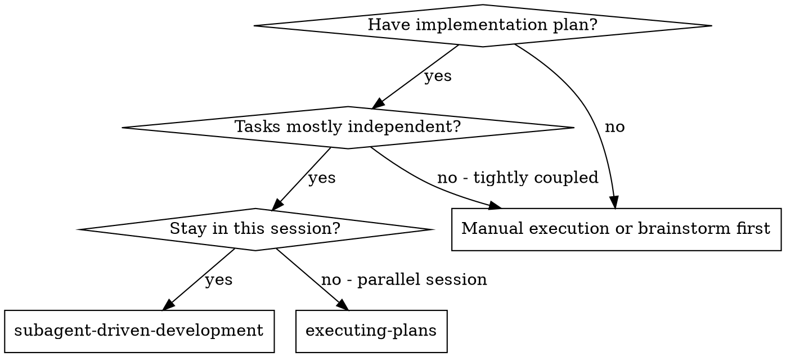
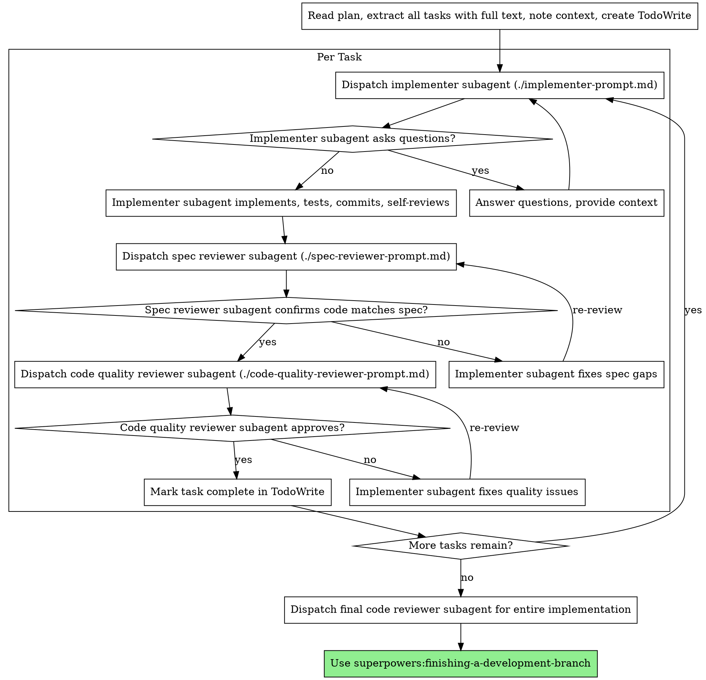
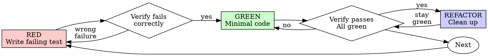

# M2C URL shortener implementation

**Session ID:** ses_1c03b05f8ffeDHcJzyjLVa4iFQ
**Created:** 5/19/2026, 1:25:34 PM
**Updated:** 5/19/2026, 3:29:47 PM

---

## User

Continue this project from M2C, Read docs/superpowers/plans/implementation-tracker.md and docs/superpowers/specs/2026-05-18-url-shortener-design.md. Create a small M2C plan then implement it, use worktrees and subagents.merge into main and clean worktree after finishing.

---

## Assistant (Build · gpt-5.5 · 2.7s)

**Tool: skill**

**Input:**
```json
{
  "name": "using-git-worktrees"
}
```

**Output:**
```
<skill_content name="using-git-worktrees">
# Skill: using-git-worktrees

# Using Git Worktrees

## Overview

Ensure work happens in an isolated workspace. Prefer your platform's native worktree tools. Fall back to manual git worktrees only when no native tool is available.

**Core principle:** Detect existing isolation first. Then use native tools. Then fall back to git. Never fight the harness.

**Announce at start:** "I'm using the using-git-worktrees skill to set up an isolated workspace."

## Step 0: Detect Existing Isolation

**Before creating anything, check if you are already in an isolated workspace.**

```bash
GIT_DIR=$(cd "$(git rev-parse --git-dir)" 2>/dev/null && pwd -P)
GIT_COMMON=$(cd "$(git rev-parse --git-common-dir)" 2>/dev/null && pwd -P)
BRANCH=$(git branch --show-current)
```

**Submodule guard:** `GIT_DIR != GIT_COMMON` is also true inside git submodules. Before concluding "already in a worktree," verify you are not in a submodule:

```bash
# If this returns a path, you're in a submodule, not a worktree — treat as normal repo
git rev-parse --show-superproject-working-tree 2>/dev/null
```

**If `GIT_DIR != GIT_COMMON` (and not a submodule):** You are already in a linked worktree. Skip to Step 3 (Project Setup). Do NOT create another worktree.

Report with branch state:
- On a branch: "Already in isolated workspace at `<path>` on branch `<name>`."
- Detached HEAD: "Already in isolated workspace at `<path>` (detached HEAD, externally managed). Branch creation needed at finish time."

**If `GIT_DIR == GIT_COMMON` (or in a submodule):** You are in a normal repo checkout.

Has the user already indicated their worktree preference in your instructions? If not, ask for consent before creating a worktree:

> "Would you like me to set up an isolated worktree? It protects your current branch from changes."

Honor any existing declared preference without asking. If the user declines consent, work in place and skip to Step 3.

## Step 1: Create Isolated Workspace

**You have two mechanisms. Try them in this order.**

### 1a. Native Worktree Tools (preferred)

The user has asked for an isolated workspace (Step 0 consent). Do you already have a way to create a worktree? It might be a tool with a name like `EnterWorktree`, `WorktreeCreate`, a `/worktree` command, or a `--worktree` flag. If you do, use it and skip to Step 3.

Native tools handle directory placement, branch creation, and cleanup automatically. Using `git worktree add` when you have a native tool creates phantom state your harness can't see or manage.

Only proceed to Step 1b if you have no native worktree tool available.

### 1b. Git Worktree Fallback

**Only use this if Step 1a does not apply** — you have no native worktree tool available. Create a worktree manually using git.

#### Directory Selection

Follow this priority order. Explicit user preference always beats observed filesystem state.

1. **Check your instructions for a declared worktree directory preference.** If the user has already specified one, use it without asking.

2. **Check for an existing project-local worktree directory:**
   ```bash
   ls -d .worktrees 2>/dev/null     # Preferred (hidden)
   ls -d worktrees 2>/dev/null      # Alternative
   ```
   If found, use it. If both exist, `.worktrees` wins.

3. **Check for an existing global directory:**
   ```bash
   project=$(basename "$(git rev-parse --show-toplevel)")
   ls -d ~/.config/superpowers/worktrees/$project 2>/dev/null
   ```
   If found, use it (backward compatibility with legacy global path).

4. **If there is no other guidance available**, default to `.worktrees/` at the project root.

#### Safety Verification (project-local directories only)

**MUST verify directory is ignored before creating worktree:**

```bash
git check-ignore -q .worktrees 2>/dev/null || git check-ignore -q worktrees 2>/dev/null
```

**If NOT ignored:** Add to .gitignore, commit the change, then proceed.

**Why critical:** Prevents accidentally committing worktree contents to repository.

Global directories (`~/.config/superpowers/worktrees/`) need no verification.

#### Create the Worktree

```bash
project=$(basename "$(git rev-parse --show-toplevel)")

# Determine path based on chosen location
# For project-local: path="$LOCATION/$BRANCH_NAME"
# For global: path="~/.config/superpowers/worktrees/$project/$BRANCH_NAME"

git worktree add "$path" -b "$BRANCH_NAME"
cd "$path"
```

**Sandbox fallback:** If `git worktree add` fails with a permission error (sandbox denial), tell the user the sandbox blocked worktree creation and you're working in the current directory instead. Then run setup and baseline tests in place.

## Step 3: Project Setup

Auto-detect and run appropriate setup:

```bash
# Node.js
if [ -f package.json ]; then npm install; fi

# Rust
if [ -f Cargo.toml ]; then cargo build; fi

# Python
if [ -f requirements.txt ]; then pip install -r requirements.txt; fi
if [ -f pyproject.toml ]; then poetry install; fi

# Go
if [ -f go.mod ]; then go mod download; fi
```

## Step 4: Verify Clean Baseline

Run tests to ensure workspace starts clean:

```bash
# Use project-appropriate command
npm test / cargo test / pytest / go test ./...
```

**If tests fail:** Report failures, ask whether to proceed or investigate.

**If tests pass:** Report ready.

### Report

```
Worktree ready at <full-path>
Tests passing (<N> tests, 0 failures)
Ready to implement <feature-name>
```

## Quick Reference

| Situation | Action |
|-----------|--------|
| Already in linked worktree | Skip creation (Step 0) |
| In a submodule | Treat as normal repo (Step 0 guard) |
| Native worktree tool available | Use it (Step 1a) |
| No native tool | Git worktree fallback (Step 1b) |
| `.worktrees/` exists | Use it (verify ignored) |
| `worktrees/` exists | Use it (verify ignored) |
| Both exist | Use `.worktrees/` |
| Neither exists | Check instruction file, then default `.worktrees/` |
| Global path exists | Use it (backward compat) |
| Directory not ignored | Add to .gitignore + commit |
| Permission error on create | Sandbox fallback, work in place |
| Tests fail during baseline | Report failures + ask |
| No package.json/Cargo.toml | Skip dependency install |

## Common Mistakes

### Fighting the harness

- **Problem:** Using `git worktree add` when the platform already provides isolation
- **Fix:** Step 0 detects existing isolation. Step 1a defers to native tools.

### Skipping detection

- **Problem:** Creating a nested worktree inside an existing one
- **Fix:** Always run Step 0 before creating anything

### Skipping ignore verification

- **Problem:** Worktree contents get tracked, pollute git status
- **Fix:** Always use `git check-ignore` before creating project-local worktree

### Assuming directory location

- **Problem:** Creates inconsistency, violates project conventions
- **Fix:** Follow priority: existing > global legacy > instruction file > default

### Proceeding with failing tests

- **Problem:** Can't distinguish new bugs from pre-existing issues
- **Fix:** Report failures, get explicit permission to proceed

## Red Flags

**Never:**
- Create a worktree when Step 0 detects existing isolation
- Use `git worktree add` when you have a native worktree tool (e.g., `EnterWorktree`). This is the #1 mistake — if you have it, use it.
- Skip Step 1a by jumping straight to Step 1b's git commands
- Create worktree without verifying it's ignored (project-local)
- Skip baseline test verification
- Proceed with failing tests without asking

**Always:**
- Run Step 0 detection first
- Prefer native tools over git fallback
- Follow directory priority: existing > global legacy > instruction file > default
- Verify directory is ignored for project-local
- Auto-detect and run project setup
- Verify clean test baseline

Base directory for this skill: file:///C:/Users/Shaheen/.cache/opencode/packages/superpowers@git+https_/github.com/obra/superpowers.git/node_modules/superpowers/skills/using-git-worktrees
Relative paths in this skill (e.g., scripts/, reference/) are relative to this base directory.
Note: file list is sampled.

<skill_files>

</skill_files>
</skill_content>
```

---

## Assistant (Build · gpt-5.5 · 8.5s)

I'm using the using-git-worktrees skill to set up an isolated workspace. After that I'll read the tracker/spec, make the M2C plan, implement, verify, merge to main, and clean up the worktree.

**Tool: skill**

**Input:**
```json
{
  "name": "writing-plans"
}
```

**Output:**
```
<skill_content name="writing-plans">
# Skill: writing-plans

# Writing Plans

## Overview

Write comprehensive implementation plans assuming the engineer has zero context for our codebase and questionable taste. Document everything they need to know: which files to touch for each task, code, testing, docs they might need to check, how to test it. Give them the whole plan as bite-sized tasks. DRY. YAGNI. TDD. Frequent commits.

Assume they are a skilled developer, but know almost nothing about our toolset or problem domain. Assume they don't know good test design very well.

**Announce at start:** "I'm using the writing-plans skill to create the implementation plan."

**Context:** If working in an isolated worktree, it should have been created via the `superpowers:using-git-worktrees` skill at execution time.

**Save plans to:** `docs/superpowers/plans/YYYY-MM-DD-<feature-name>.md`
- (User preferences for plan location override this default)

## Scope Check

If the spec covers multiple independent subsystems, it should have been broken into sub-project specs during brainstorming. If it wasn't, suggest breaking this into separate plans — one per subsystem. Each plan should produce working, testable software on its own.

## File Structure

Before defining tasks, map out which files will be created or modified and what each one is responsible for. This is where decomposition decisions get locked in.

- Design units with clear boundaries and well-defined interfaces. Each file should have one clear responsibility.
- You reason best about code you can hold in context at once, and your edits are more reliable when files are focused. Prefer smaller, focused files over large ones that do too much.
- Files that change together should live together. Split by responsibility, not by technical layer.
- In existing codebases, follow established patterns. If the codebase uses large files, don't unilaterally restructure - but if a file you're modifying has grown unwieldy, including a split in the plan is reasonable.

This structure informs the task decomposition. Each task should produce self-contained changes that make sense independently.

## Bite-Sized Task Granularity

**Each step is one action (2-5 minutes):**
- "Write the failing test" - step
- "Run it to make sure it fails" - step
- "Implement the minimal code to make the test pass" - step
- "Run the tests and make sure they pass" - step
- "Commit" - step

## Plan Document Header

**Every plan MUST start with this header:**

```markdown
# [Feature Name] Implementation Plan

> **For agentic workers:** REQUIRED SUB-SKILL: Use superpowers:subagent-driven-development (recommended) or superpowers:executing-plans to implement this plan task-by-task. Steps use checkbox (`- [ ]`) syntax for tracking.

**Goal:** [One sentence describing what this builds]

**Architecture:** [2-3 sentences about approach]

**Tech Stack:** [Key technologies/libraries]

---
```

## Task Structure

````markdown
### Task N: [Component Name]

**Files:**
- Create: `exact/path/to/file.py`
- Modify: `exact/path/to/existing.py:123-145`
- Test: `tests/exact/path/to/test.py`

- [ ] **Step 1: Write the failing test**

```python
def test_specific_behavior():
    result = function(input)
    assert result == expected
```

- [ ] **Step 2: Run test to verify it fails**

Run: `pytest tests/path/test.py::test_name -v`
Expected: FAIL with "function not defined"

- [ ] **Step 3: Write minimal implementation**

```python
def function(input):
    return expected
```

- [ ] **Step 4: Run test to verify it passes**

Run: `pytest tests/path/test.py::test_name -v`
Expected: PASS

- [ ] **Step 5: Commit**

```bash
git add tests/path/test.py src/path/file.py
git commit -m "feat: add specific feature"
```
````

## No Placeholders

Every step must contain the actual content an engineer needs. These are **plan failures** — never write them:
- "TBD", "TODO", "implement later", "fill in details"
- "Add appropriate error handling" / "add validation" / "handle edge cases"
- "Write tests for the above" (without actual test code)
- "Similar to Task N" (repeat the code — the engineer may be reading tasks out of order)
- Steps that describe what to do without showing how (code blocks required for code steps)
- References to types, functions, or methods not defined in any task

## Remember
- Exact file paths always
- Complete code in every step — if a step changes code, show the code
- Exact commands with expected output
- DRY, YAGNI, TDD, frequent commits

## Self-Review

After writing the complete plan, look at the spec with fresh eyes and check the plan against it. This is a checklist you run yourself — not a subagent dispatch.

**1. Spec coverage:** Skim each section/requirement in the spec. Can you point to a task that implements it? List any gaps.

**2. Placeholder scan:** Search your plan for red flags — any of the patterns from the "No Placeholders" section above. Fix them.

**3. Type consistency:** Do the types, method signatures, and property names you used in later tasks match what you defined in earlier tasks? A function called `clearLayers()` in Task 3 but `clearFullLayers()` in Task 7 is a bug.

If you find issues, fix them inline. No need to re-review — just fix and move on. If you find a spec requirement with no task, add the task.

## Execution Handoff

After saving the plan, offer execution choice:

**"Plan complete and saved to `docs/superpowers/plans/<filename>.md`. Two execution options:**

**1. Subagent-Driven (recommended)** - I dispatch a fresh subagent per task, review between tasks, fast iteration

**2. Inline Execution** - Execute tasks in this session using executing-plans, batch execution with checkpoints

**Which approach?"**

**If Subagent-Driven chosen:**
- **REQUIRED SUB-SKILL:** Use superpowers:subagent-driven-development
- Fresh subagent per task + two-stage review

**If Inline Execution chosen:**
- **REQUIRED SUB-SKILL:** Use superpowers:executing-plans
- Batch execution with checkpoints for review

Base directory for this skill: file:///C:/Users/Shaheen/.cache/opencode/packages/superpowers@git+https_/github.com/obra/superpowers.git/node_modules/superpowers/skills/writing-plans
Relative paths in this skill (e.g., scripts/, reference/) are relative to this base directory.
Note: file list is sampled.

<skill_files>
<file>C:\Users\Shaheen\.cache\opencode\packages\superpowers@git+https_\github.com\obra\superpowers.git\node_modules\superpowers\skills\writing-plans\plan-document-reviewer-prompt.md</file>
</skill_files>
</skill_content>
```

---

## Assistant (Build · gpt-5.5 · 2.9s)

I'm using the writing-plans skill to create the implementation plan. Since you asked to continue from M2C and implement in this turn, I'll keep the plan small and execute it after creating it.

**Tool: skill**

**Input:**
```json
{
  "name": "subagent-driven-development"
}
```

**Output:**
```
<skill_content name="subagent-driven-development">
# Skill: subagent-driven-development

# Subagent-Driven Development

Execute plan by dispatching fresh subagent per task, with two-stage review after each: spec compliance review first, then code quality review.

**Why subagents:** You delegate tasks to specialized agents with isolated context. By precisely crafting their instructions and context, you ensure they stay focused and succeed at their task. They should never inherit your session's context or history — you construct exactly what they need. This also preserves your own context for coordination work.

**Core principle:** Fresh subagent per task + two-stage review (spec then quality) = high quality, fast iteration

**Continuous execution:** Do not pause to check in with your human partner between tasks. Execute all tasks from the plan without stopping. The only reasons to stop are: BLOCKED status you cannot resolve, ambiguity that genuinely prevents progress, or all tasks complete. "Should I continue?" prompts and progress summaries waste their time — they asked you to execute the plan, so execute it.

## When to Use



**vs. Executing Plans (parallel session):**
- Same session (no context switch)
- Fresh subagent per task (no context pollution)
- Two-stage review after each task: spec compliance first, then code quality
- Faster iteration (no human-in-loop between tasks)

## The Process



## Model Selection

Use the least powerful model that can handle each role to conserve cost and increase speed.

**Mechanical implementation tasks** (isolated functions, clear specs, 1-2 files): use a fast, cheap model. Most implementation tasks are mechanical when the plan is well-specified.

**Integration and judgment tasks** (multi-file coordination, pattern matching, debugging): use a standard model.

**Architecture, design, and review tasks**: use the most capable available model.

**Task complexity signals:**
- Touches 1-2 files with a complete spec → cheap model
- Touches multiple files with integration concerns → standard model
- Requires design judgment or broad codebase understanding → most capable model

## Handling Implementer Status

Implementer subagents report one of four statuses. Handle each appropriately:

**DONE:** Proceed to spec compliance review.

**DONE_WITH_CONCERNS:** The implementer completed the work but flagged doubts. Read the concerns before proceeding. If the concerns are about correctness or scope, address them before review. If they're observations (e.g., "this file is getting large"), note them and proceed to review.

**NEEDS_CONTEXT:** The implementer needs information that wasn't provided. Provide the missing context and re-dispatch.

**BLOCKED:** The implementer cannot complete the task. Assess the blocker:
1. If it's a context problem, provide more context and re-dispatch with the same model
2. If the task requires more reasoning, re-dispatch with a more capable model
3. If the task is too large, break it into smaller pieces
4. If the plan itself is wrong, escalate to the human

**Never** ignore an escalation or force the same model to retry without changes. If the implementer said it's stuck, something needs to change.

## Prompt Templates

- `./implementer-prompt.md` - Dispatch implementer subagent
- `./spec-reviewer-prompt.md` - Dispatch spec compliance reviewer subagent
- `./code-quality-reviewer-prompt.md` - Dispatch code quality reviewer subagent

## Example Workflow

```
You: I'm using Subagent-Driven Development to execute this plan.

[Read plan file once: docs/superpowers/plans/feature-plan.md]
[Extract all 5 tasks with full text and context]
[Create TodoWrite with all tasks]

Task 1: Hook installation script

[Get Task 1 text and context (already extracted)]
[Dispatch implementation subagent with full task text + context]

Implementer: "Before I begin - should the hook be installed at user or system level?"

You: "User level (~/.config/superpowers/hooks/)"

Implementer: "Got it. Implementing now..."
[Later] Implementer:
  - Implemented install-hook command
  - Added tests, 5/5 passing
  - Self-review: Found I missed --force flag, added it
  - Committed

[Dispatch spec compliance reviewer]
Spec reviewer: ✅ Spec compliant - all requirements met, nothing extra

[Get git SHAs, dispatch code quality reviewer]
Code reviewer: Strengths: Good test coverage, clean. Issues: None. Approved.

[Mark Task 1 complete]

Task 2: Recovery modes

[Get Task 2 text and context (already extracted)]
[Dispatch implementation subagent with full task text + context]

Implementer: [No questions, proceeds]
Implementer:
  - Added verify/repair modes
  - 8/8 tests passing
  - Self-review: All good
  - Committed

[Dispatch spec compliance reviewer]
Spec reviewer: ❌ Issues:
  - Missing: Progress reporting (spec says "report every 100 items")
  - Extra: Added --json flag (not requested)

[Implementer fixes issues]
Implementer: Removed --json flag, added progress reporting

[Spec reviewer reviews again]
Spec reviewer: ✅ Spec compliant now

[Dispatch code quality reviewer]
Code reviewer: Strengths: Solid. Issues (Important): Magic number (100)

[Implementer fixes]
Implementer: Extracted PROGRESS_INTERVAL constant

[Code reviewer reviews again]
Code reviewer: ✅ Approved

[Mark Task 2 complete]

...

[After all tasks]
[Dispatch final code-reviewer]
Final reviewer: All requirements met, ready to merge

Done!
```

## Advantages

**vs. Manual execution:**
- Subagents follow TDD naturally
- Fresh context per task (no confusion)
- Parallel-safe (subagents don't interfere)
- Subagent can ask questions (before AND during work)

**vs. Executing Plans:**
- Same session (no handoff)
- Continuous progress (no waiting)
- Review checkpoints automatic

**Efficiency gains:**
- No file reading overhead (controller provides full text)
- Controller curates exactly what context is needed
- Subagent gets complete information upfront
- Questions surfaced before work begins (not after)

**Quality gates:**
- Self-review catches issues before handoff
- Two-stage review: spec compliance, then code quality
- Review loops ensure fixes actually work
- Spec compliance prevents over/under-building
- Code quality ensures implementation is well-built

**Cost:**
- More subagent invocations (implementer + 2 reviewers per task)
- Controller does more prep work (extracting all tasks upfront)
- Review loops add iterations
- But catches issues early (cheaper than debugging later)

## Red Flags

**Never:**
- Start implementation on main/master branch without explicit user consent
- Skip reviews (spec compliance OR code quality)
- Proceed with unfixed issues
- Dispatch multiple implementation subagents in parallel (conflicts)
- Make subagent read plan file (provide full text instead)
- Skip scene-setting context (subagent needs to understand where task fits)
- Ignore subagent questions (answer before letting them proceed)
- Accept "close enough" on spec compliance (spec reviewer found issues = not done)
- Skip review loops (reviewer found issues = implementer fixes = review again)
- Let implementer self-review replace actual review (both are needed)
- **Start code quality review before spec compliance is ✅** (wrong order)
- Move to next task while either review has open issues

**If subagent asks questions:**
- Answer clearly and completely
- Provide additional context if needed
- Don't rush them into implementation

**If reviewer finds issues:**
- Implementer (same subagent) fixes them
- Reviewer reviews again
- Repeat until approved
- Don't skip the re-review

**If subagent fails task:**
- Dispatch fix subagent with specific instructions
- Don't try to fix manually (context pollution)

## Integration

**Required workflow skills:**
- **superpowers:using-git-worktrees** - Ensures isolated workspace (creates one or verifies existing)
- **superpowers:writing-plans** - Creates the plan this skill executes
- **superpowers:requesting-code-review** - Code review template for reviewer subagents
- **superpowers:finishing-a-development-branch** - Complete development after all tasks

**Subagents should use:**
- **superpowers:test-driven-development** - Subagents follow TDD for each task

**Alternative workflow:**
- **superpowers:executing-plans** - Use for parallel session instead of same-session execution

Base directory for this skill: file:///C:/Users/Shaheen/.cache/opencode/packages/superpowers@git+https_/github.com/obra/superpowers.git/node_modules/superpowers/skills/subagent-driven-development
Relative paths in this skill (e.g., scripts/, reference/) are relative to this base directory.
Note: file list is sampled.

<skill_files>
<file>C:\Users\Shaheen\.cache\opencode\packages\superpowers@git+https_\github.com\obra\superpowers.git\node_modules\superpowers\skills\subagent-driven-development\spec-reviewer-prompt.md</file>
<file>C:\Users\Shaheen\.cache\opencode\packages\superpowers@git+https_\github.com\obra\superpowers.git\node_modules\superpowers\skills\subagent-driven-development\implementer-prompt.md</file>
<file>C:\Users\Shaheen\.cache\opencode\packages\superpowers@git+https_\github.com\obra\superpowers.git\node_modules\superpowers\skills\subagent-driven-development\code-quality-reviewer-prompt.md</file>
</skill_files>
</skill_content>
```

---

## Assistant (Build · gpt-5.5 · 8.2s)

**Tool: bash**

**Input:**
```json
{
  "command": "git rev-parse --git-dir",
  "description": "Shows repository git directory"
}
```

**Output:**
```
.git

```

**Tool: bash**

**Input:**
```json
{
  "command": "git rev-parse --git-common-dir",
  "description": "Shows repository common git directory"
}
```

**Output:**
```
.git

```

**Tool: bash**

**Input:**
```json
{
  "command": "git branch --show-current",
  "description": "Shows current git branch"
}
```

**Output:**
```
main

```

**Tool: bash**

**Input:**
```json
{
  "command": "git rev-parse --show-superproject-working-tree",
  "description": "Checks whether repository is submodule"
}
```

**Output:**
```
(no output)
```

---

## Assistant (Build · gpt-5.5 · 9.3s)

**Tool: glob**

**Input:**
```json
{
  "pattern": ".worktrees"
}
```

**Output:**
```
No files found
```

**Tool: glob**

**Input:**
```json
{
  "pattern": "worktrees"
}
```

**Output:**
```
No files found
```

**Tool: bash**

**Input:**
```json
{
  "command": "git check-ignore -q .worktrees",
  "description": "Checks worktree directory ignore status"
}
```

**Output:**
```
(no output)
```

---

## Assistant (Build · gpt-5.5 · 12.0s)

The current checkout is on `main` and is not already a linked worktree. I'll use the git worktree fallback under the project-local `.worktrees` path after confirming it is ignored.

**Tool: bash**

**Input:**
```json
{
  "command": "if (git check-ignore -q .worktrees) { 'ignored' } else { 'not ignored' }",
  "description": "Reports worktree ignore status"
}
```

**Output:**
```
not ignored

```

---

## Assistant (Build · gpt-5.5 · 9.7s)

`.worktrees` is not ignored, so I need to add that ignore entry before creating the project-local worktree. This is a repository safety change to prevent worktree contents from being tracked.

**Tool: read**

**Input:**
```json
{
  "filePath": "C:\\Users\\Shaheen\\URL_shortner_super_powers\\.gitignore"
}
```

**Output:**
```
<path>C:\Users\Shaheen\URL_shortner_super_powers\.gitignore</path>
<type>file</type>
<content>
1: .worktrees/
2: node_modules/
3: dist/
4: src/generated/
5: .env
6: .env.*
7: !.env.example

(End of file - total 7 lines)
</content>
```

---

## Assistant (Build · gpt-5.5 · 4.3s)

**Tool: bash**

**Input:**
```json
{
  "command": "git check-ignore -v .worktrees/",
  "description": "Shows matching ignore rule for worktrees"
}
```

**Output:**
```
.gitignore:1:.worktrees/	.worktrees/

```

---

## Assistant (Build · gpt-5.5 · 5.7s)

`.gitignore` already ignores `.worktrees/`; the earlier check without the trailing slash did not match the directory rule. I'll create the isolated branch under `.worktrees/m2c-implementation`.

**Tool: bash**

**Input:**
```json
{
  "command": "git worktree add \".worktrees/m2c-implementation\" -b \"m2c-implementation\"",
  "description": "Creates isolated implementation worktree",
  "timeout": 120000
}
```

**Output:**
```
Preparing worktree (new branch 'm2c-implementation')
HEAD is now at 4bc843c feat: add admin link management API

```

---

## Assistant (Build · gpt-5.5 · 4.7s)

**Tool: glob**

**Input:**
```json
{
  "pattern": "package.json",
  "path": "C:\\Users\\Shaheen\\URL_shortner_super_powers\\.worktrees\\m2c-implementation"
}
```

**Output:**
```
C:\Users\Shaheen\URL_shortner_super_powers\.worktrees\m2c-implementation\package.json
```

**Tool: glob**

**Input:**
```json
{
  "pattern": "Cargo.toml",
  "path": "C:\\Users\\Shaheen\\URL_shortner_super_powers\\.worktrees\\m2c-implementation"
}
```

**Output:**
```
No files found
```

**Tool: glob**

**Input:**
```json
{
  "pattern": "requirements.txt",
  "path": "C:\\Users\\Shaheen\\URL_shortner_super_powers\\.worktrees\\m2c-implementation"
}
```

**Output:**
```
No files found
```

**Tool: glob**

**Input:**
```json
{
  "pattern": "pyproject.toml",
  "path": "C:\\Users\\Shaheen\\URL_shortner_super_powers\\.worktrees\\m2c-implementation"
}
```

**Output:**
```
No files found
```

**Tool: glob**

**Input:**
```json
{
  "pattern": "go.mod",
  "path": "C:\\Users\\Shaheen\\URL_shortner_super_powers\\.worktrees\\m2c-implementation"
}
```

**Output:**
```
No files found
```

---

## Assistant (Build · gpt-5.5 · 16.9s)

**Tool: bash**

**Input:**
```json
{
  "command": "npm install",
  "description": "Installs Node project dependencies",
  "workdir": "C:\\Users\\Shaheen\\URL_shortner_super_powers\\.worktrees\\m2c-implementation",
  "timeout": 120000
}
```

**Output:**
```

> url-shortener-super-powers@0.1.0 postinstall
> prisma generate

Prisma schema loaded from prisma\schema.prisma.

✔ Generated Prisma Client (v7.8.0) to .\src\generated\prisma in 104ms

Start by importing your Prisma Client (See: https://pris.ly/d/importing-client)


added 197 packages, and audited 198 packages in 13s

49 packages are looking for funding
  run `npm fund` for details

3 moderate severity vulnerabilities

To address all issues (including breaking changes), run:
  npm audit fix --force

Run `npm audit` for details.

```

---

## Assistant (Build · gpt-5.5 · 5.9s)

**Tool: bash**

**Input:**
```json
{
  "command": "npm test",
  "description": "Runs baseline test suite",
  "workdir": "C:\\Users\\Shaheen\\URL_shortner_super_powers\\.worktrees\\m2c-implementation",
  "timeout": 120000
}
```

**Output:**
```

> url-shortener-super-powers@0.1.0 test
> vitest run --exclude dist/**


 RUN  v4.0.14 C:/Users/Shaheen/URL_shortner_super_powers/.worktrees/m2c-implementation

 ✓ tests/config.test.ts (11 tests) 9ms
 ✓ tests/links.validation.test.ts (8 tests) 12ms
 ✓ tests/links.service.test.ts (5 tests) 14ms
 ✓ tests/redirect-analytics.test.ts (5 tests) 9ms
 ✓ tests/links.routes.test.ts (5 tests) 264ms
 ✓ tests/redirect-routes.test.ts (6 tests) 274ms
 ✓ tests/admin-auth.test.ts (6 tests) 716ms
     ✓ rejects missing admin credentials  403ms
     ✓ verifies valid admin credentials with a normalized email  302ms
 ✓ tests/health.test.ts (2 tests) 152ms
 ✓ tests/admin-routes.test.ts (17 tests) 1590ms
     ✓ logs in an admin and sets an HttpOnly SameSite cookie  477ms

 Test Files  9 passed (9)
      Tests  65 passed (65)
   Start at  13:27:02
   Duration  2.44s (transform 1.64s, setup 0ms, import 3.05s, tests 3.04s, environment 2ms)


```

---

## Assistant (Build · gpt-5.5 · 5.4s)

Worktree ready at `C:\Users\Shaheen\URL_shortner_super_powers\.worktrees\m2c-implementation`; baseline tests pass with 65 tests. I'll read the tracker and design spec next to identify the M2C scope.

**Tool: read**

**Input:**
```json
{
  "filePath": "C:\\Users\\Shaheen\\URL_shortner_super_powers\\.worktrees\\m2c-implementation\\docs\\superpowers\\plans\\implementation-tracker.md"
}
```

**Output:**
```
<path>C:\Users\Shaheen\URL_shortner_super_powers\.worktrees\m2c-implementation\docs\superpowers\plans\implementation-tracker.md</path>
<type>file</type>
<content>
1: # URL Shortener Implementation Tracker
2: 
3: Design spec: `docs/superpowers/specs/2026-05-18-url-shortener-design.md`
4: 
5: ## Milestones
6: 
7: - [x] M1A: Project scaffold, Fastify health endpoint, Docker Compose PostgreSQL
8: - [x] M1B: Prisma schema and database connection
9: - [x] M1C: Public link creation validation and code generation
10: - [x] M1D: Redirect route and click counting basics
11: - [x] M2A: Admin authentication and sessions
12: - [x] M2B: Admin link management API
13: - [ ] M2C: Admin analytics API
14: - [ ] M3A: Public React form
15: - [ ] M3B: Admin dashboard UI shell
16: - [ ] M3C: Dashboard charts and link table
17: - [ ] M4A: OpenAPI docs, Docker production image, final verification
18: 
19: ## Current Status
20: 
21: - Current plan: `docs/superpowers/plans/2026-05-19-url-shortener-m2b-admin-link-management.md`
22: - Last updated: 2026-05-19

(End of file - total 22 lines)
</content>
```

**Tool: read**

**Input:**
```json
{
  "filePath": "C:\\Users\\Shaheen\\URL_shortner_super_powers\\.worktrees\\m2c-implementation\\docs\\superpowers\\specs\\2026-05-18-url-shortener-design.md"
}
```

**Output:**
```
<path>C:\Users\Shaheen\URL_shortner_super_powers\.worktrees\m2c-implementation\docs\superpowers\specs\2026-05-18-url-shortener-design.md</path>
<type>file</type>
<content>
1: # URL Shortener Backend And Admin Dashboard Design
2: 
3: ## Summary
4: 
5: Build a production-oriented URL shortener using a Node.js/TypeScript backend, PostgreSQL, and a React/Vite frontend. The service will support public anonymous link creation, short-link redirects, OpenAPI documentation, and a polished admin dashboard with link management and analytics.
6: 
7: The first version uses one deployable application container. PostgreSQL runs as a separate service, including through Docker Compose for local development.
8: 
9: ## Goals
10: 
11: - Public users can create short links without logging in.
12: - Public users can optionally choose a custom alias and optional expiration date.
13: - The service redirects active, non-expired short links and records human-looking clicks.
14: - Obvious bots and crawlers do not inflate analytics.
15: - Admins can log in, manage links, and view analytics charts by day, referrer, and device.
16: - The public API is documented with OpenAPI.
17: - The app runs locally with Docker Compose and is deployable as a Docker container.
18: 
19: ## Non-Goals For V1
20: 
21: - Public user accounts or link ownership.
22: - Public metadata endpoints for existing short links.
23: - Public stats pages.
24: - Multi-admin management UI.
25: - Separate domains for dashboard, API, and redirects.
26: - CAPTCHA or admin-managed denylists.
27: 
28: ## Technology Choices
29: 
30: - Backend: Fastify with TypeScript.
31: - Frontend: React with Vite.
32: - Database: PostgreSQL.
33: - Database access and migrations: Prisma.
34: - Admin authentication: cookie-based server-side sessions.
35: - Password hashing: Argon2.
36: - Deployment: Docker app container plus separate PostgreSQL service.
37: 
38: Fastify is preferred over a minimal Express setup because it has strong TypeScript ergonomics, schema-driven validation, OpenAPI-friendly route definitions, and good performance for redirect/API traffic.
39: 
40: ## Application Architecture
41: 
42: The repository will contain one full-stack application with clear backend and frontend boundaries:
43: 
44: - `server/`: Fastify API, redirect route, admin auth, OpenAPI docs, PostgreSQL access, validation, rate limiting, and operational endpoints.
45: - `web/`: React/Vite public form and admin dashboard.
46: - Docker Compose: local app and PostgreSQL services.
47: 
48: The same app serves public pages, admin pages, API routes, docs, and redirects from one domain.
49: 
50: Routes:
51: 
52: - `/`: public link creation page.
53: - `/api/links`: public REST endpoint for creating short links.
54: - `/api/admin/*`: authenticated admin APIs.
55: - `/docs`: OpenAPI documentation UI.
56: - `/admin/*`: React admin dashboard.
57: - `/:code`: short-link redirect route.
58: 
59: Reserved routes such as `admin`, `api`, `docs`, asset paths, and health routes cannot be used as custom aliases. The redirect route is registered so it does not swallow internal application routes.
60: 
61: ## Data Model
62: 
63: ### `links`
64: 
65: Stores each shortened URL.
66: 
67: Fields:
68: 
69: - `id`: primary key.
70: - `original_url`: destination URL.
71: - `short_code`: unique public code or alias.
72: - `is_custom_alias`: whether the code was user-supplied.
73: - `is_active`: whether redirects are allowed.
74: - `expires_at`: optional expiration timestamp.
75: - `total_click_count`: denormalized count for fast dashboard summaries.
76: - `created_at`: creation timestamp.
77: - `updated_at`: update timestamp.
78: 
79: ### `click_events`
80: 
81: Stores analytics events for counted clicks.
82: 
83: Fields:
84: 
85: - `id`: primary key.
86: - `link_id`: foreign key to `links`.
87: - `clicked_at`: event timestamp.
88: - `referrer_host`: normalized referrer host when available.
89: - `device_type`: coarse device category such as desktop, mobile, tablet, or unknown.
90: - `browser`: coarse browser/user-agent summary.
91: - `ip_hash`: irreversible hash or equivalent privacy-preserving representation.
92: 
93: Raw full IP addresses are not stored in click analytics.
94: 
95: ### `admin_users`
96: 
97: Stores admin login identities.
98: 
99: Fields:
100: 
101: - `id`: primary key.
102: - `email`: unique admin email.
103: - `password_hash`: Argon2 password hash.
104: - `created_at`: creation timestamp.
105: - `last_login_at`: optional last login timestamp.
106: 
107: The initial admin is created through a setup or seed command. V1 does not include public registration or admin user management screens.
108: 
109: ### `admin_sessions`
110: 
111: Stores server-side admin sessions.
112: 
113: Fields:
114: 
115: - `id`: primary key.
116: - `admin_user_id`: foreign key to `admin_users`.
117: - `session_token_hash`: hash of the browser session token.
118: - `expires_at`: session expiration timestamp.
119: - `created_at`: creation timestamp.
120: 
121: ## Public Link Creation
122: 
123: Public users can create links through both the web form and `POST /api/links`.
124: 
125: Request fields:
126: 
127: - `url`: required destination URL.
128: - `alias`: optional custom alias.
129: - `expiresAt`: optional expiration timestamp.
130: 
131: Validation rules:
132: 
133: - Destination URLs must use `http` or `https`.
134: - Localhost, private IP ranges, loopback addresses, and internal hostnames are blocked.
135: - Aliases must be URL-safe, length-limited, unique, and not reserved.
136: - Public creation is rate-limited by IP.
137: 
138: If no alias is provided, the backend generates a random URL-safe code and retries on uniqueness collisions. If a custom alias collides or fails validation, the API returns a clear validation error instead of silently replacing it.
139: 
140: Successful responses include the generated short URL based on the configured public base URL.
141: 
142: ## Redirect Behavior
143: 
144: When a user visits `/:code`, the service:
145: 
146: 1. Looks up the link by short code.
147: 2. Verifies the link exists, is active, and is not expired.
148: 3. Shows a branded unavailable page for missing, inactive, or expired links.
149: 4. Redirects valid links to their original URL.
150: 5. Records click analytics for human-looking visits.
151: 
152: Obvious bots and crawlers are redirected but not counted. Click recording should avoid adding noticeable latency to redirects. The dashboard uses `links.total_click_count` for fast summaries and `click_events` for detailed charts.
153: 
154: ## Public API
155: 
156: V1 exposes only the public API needed for anonymous link creation.
157: 
158: - `POST /api/links`: create a short link.
159: 
160: V1 does not expose `GET /api/links/:code` or other public metadata endpoints. Visitors use `GET /:code` for redirects, and admins use authenticated admin APIs for link metadata.
161: 
162: ## Admin Dashboard
163: 
164: The admin dashboard is a custom polished SaaS analytics interface built with React/Vite and served under `/admin/*`.
165: 
166: V1 features:
167: 
168: - Admin login and logout.
169: - Overview cards for total links, total clicks, active links, and recent clicks.
170: - Analytics charts by day, referrer, and device.
171: - Search, filter, and paginate all links.
172: - View link details and click history.
173: - Edit original URL, active status, and expiration date.
174: - Delete or deactivate links.
175: - Copy short URLs from the dashboard.
176: 
177: The visual direction should be clean and analytics-focused: crisp cards, strong typography, responsive charts, polished empty/loading states, and a restrained palette with one strong accent color.
178: 
179: ## Admin API
180: 
181: Admin APIs live under `/api/admin/*` and require an authenticated session.
182: 
183: Expected endpoint groups:
184: 
185: - Session endpoints for login, logout, and current admin.
186: - Link listing, searching, filtering, pagination, update, deletion, and deactivation.
187: - Link detail and click history endpoints.
188: - Analytics endpoints for time-series clicks, referrer breakdowns, and device breakdowns.
189: 
190: Admin requests without a valid session return `401`. Validation errors return structured JSON responses with stable error codes and readable messages.
191: 
192: ## Authentication And Sessions
193: 
194: Admin login uses database-backed admin users and server-side sessions.
195: 
196: Session cookie behavior:
197: 
198: - `HttpOnly` to prevent JavaScript access.
199: - `SameSite=Lax` for same-domain dashboard usage.
200: - `Secure` in production.
201: - Session token stored only as a hash in the database.
202: - Expired sessions are rejected and can be cleaned up periodically.
203: 
204: This avoids JWT storage complexity and fits the same-domain deployment model.
205: 
206: ## Error Handling
207: 
208: Public and admin APIs return consistent JSON errors with stable codes and human-readable messages. The public form renders these errors inline.
209: 
210: Redirect errors use branded HTML pages rather than JSON:
211: 
212: - Unknown short code.
213: - Inactive link.
214: - Expired link.
215: 
216: Operational errors should be logged server-side without leaking secrets or sensitive request data to users.
217: 
218: ## Security And Abuse Protection
219: 
220: Security requirements:
221: 
222: - Rate-limit public link creation by IP.
223: - Validate and normalize destination URLs.
224: - Block private network, loopback, localhost, and internal destinations.
225: - Reject unsafe or reserved aliases.
226: - Use Argon2 for admin passwords.
227: - Use secure cookie settings in production.
228: - Store hashed or privacy-preserving IP metadata for analytics rather than raw full IP addresses.
229: - Avoid logging secrets, session tokens, or full sensitive request bodies.
230: 
231: V1 does not include CAPTCHA or admin-managed denylists, but the design leaves room to add them later.
232: 
233: ## Configuration
234: 
235: Environment variables configure:
236: 
237: - App port.
238: - Database URL.
239: - Public base URL used when generating short links.
240: - Session secret or token signing material.
241: - Cookie secure mode.
242: - Rate limit settings.
243: - Optional log level.
244: 
245: The app assumes one base domain in v1, but the public base URL remains configurable so a dedicated short-link domain can be introduced later.
246: 
247: ## Operations
248: 
249: Local development uses Docker Compose with at least:
250: 
251: - App service.
252: - PostgreSQL service.
253: 
254: Operational endpoints:
255: 
256: - Health endpoint for container checks.
257: - OpenAPI documentation at `/docs`.
258: 
259: Database migrations manage schema changes. Seed or setup commands create the initial admin user.
260: 
261: ## Testing Strategy
262: 
263: Unit tests cover:
264: 
265: - Random short code generation and collision retry behavior.
266: - Alias validation and reserved alias rejection.
267: - URL validation and private network blocking.
268: - Bot detection.
269: - Expiration and active-status checks.
270: 
271: API tests cover:
272: 
273: - Public link creation.
274: - Validation and rate-limit errors.
275: - Redirect behavior for valid, missing, inactive, expired, and bot visits.
276: - Admin login/logout/session checks.
277: - Admin link search, edit, delete/deactivate, and analytics endpoints.
278: 
279: UI tests cover:
280: 
281: - Public form success and error states.
282: - Admin login.
283: - Dashboard overview rendering.
284: - Basic link table interactions.
285: 
286: ## Implementation Notes
287: 
288: - Keep the public API surface small in v1: only public link creation is exposed as JSON.
289: - Keep redirect logic separate from dashboard/API logic so it remains easy to test and optimize.
290: - Keep analytics aggregation behind admin API endpoints so chart implementation can change without affecting stored data.
291: - Prefer explicit route schemas to support validation and OpenAPI generation.

(End of file - total 291 lines)
</content>
```

**Tool: read**

**Input:**
```json
{
  "filePath": "C:\\Users\\Shaheen\\URL_shortner_super_powers\\.worktrees\\m2c-implementation\\package.json"
}
```

**Output:**
```
<path>C:\Users\Shaheen\URL_shortner_super_powers\.worktrees\m2c-implementation\package.json</path>
<type>file</type>
<content>
1: {
2:   "name": "url-shortener-super-powers",
3:   "version": "0.1.0",
4:   "private": true,
5:   "type": "module",
6:   "scripts": {
7:     "dev": "tsx watch src/index.ts",
8:     "postinstall": "prisma generate",
9:     "prebuild": "node -e \"fs.rmSync('dist', { recursive: true, force: true })\"",
10:     "build": "tsc -p tsconfig.build.json",
11:     "typecheck": "tsc -p tsconfig.json --noEmit",
12:     "start": "node dist/index.js",
13:     "test": "vitest run --exclude dist/**",
14:     "db:generate": "prisma generate",
15:     "db:migrate": "prisma migrate dev",
16:     "db:studio": "prisma studio"
17:   },
18:   "dependencies": {
19:     "@fastify/cors": "11.1.0",
20:     "@fastify/helmet": "13.0.2",
21:     "@prisma/client": "^7.8.0",
22:     "argon2": "^0.44.0",
23:     "fastify": "5.8.5",
24:     "fastify-plugin": "^5.1.0"
25:   },
26:   "devDependencies": {
27:     "@types/node": "24.10.1",
28:     "prisma": "^7.8.0",
29:     "tsx": "4.20.6",
30:     "typescript": "5.9.3",
31:     "vitest": "4.0.14"
32:   }
33: }

(End of file - total 33 lines)
</content>
```

---

## Assistant (Build · gpt-5.5 · 4.6s)

**Tool: skill**

**Input:**
```json
{
  "name": "test-driven-development"
}
```

**Output:**
```
<skill_content name="test-driven-development">
# Skill: test-driven-development

# Test-Driven Development (TDD)

## Overview

Write the test first. Watch it fail. Write minimal code to pass.

**Core principle:** If you didn't watch the test fail, you don't know if it tests the right thing.

**Violating the letter of the rules is violating the spirit of the rules.**

## When to Use

**Always:**
- New features
- Bug fixes
- Refactoring
- Behavior changes

**Exceptions (ask your human partner):**
- Throwaway prototypes
- Generated code
- Configuration files

Thinking "skip TDD just this once"? Stop. That's rationalization.

## The Iron Law

```
NO PRODUCTION CODE WITHOUT A FAILING TEST FIRST
```

Write code before the test? Delete it. Start over.

**No exceptions:**
- Don't keep it as "reference"
- Don't "adapt" it while writing tests
- Don't look at it
- Delete means delete

Implement fresh from tests. Period.

## Red-Green-Refactor



### RED - Write Failing Test

Write one minimal test showing what should happen.

<Good>
```typescript
test('retries failed operations 3 times', async () => {
  let attempts = 0;
  const operation = () => {
    attempts++;
    if (attempts < 3) throw new Error('fail');
    return 'success';
  };

  const result = await retryOperation(operation);

  expect(result).toBe('success');
  expect(attempts).toBe(3);
});
```
Clear name, tests real behavior, one thing
</Good>

<Bad>
```typescript
test('retry works', async () => {
  const mock = jest.fn()
    .mockRejectedValueOnce(new Error())
    .mockRejectedValueOnce(new Error())
    .mockResolvedValueOnce('success');
  await retryOperation(mock);
  expect(mock).toHaveBeenCalledTimes(3);
});
```
Vague name, tests mock not code
</Bad>

**Requirements:**
- One behavior
- Clear name
- Real code (no mocks unless unavoidable)

### Verify RED - Watch It Fail

**MANDATORY. Never skip.**

```bash
npm test path/to/test.test.ts
```

Confirm:
- Test fails (not errors)
- Failure message is expected
- Fails because feature missing (not typos)

**Test passes?** You're testing existing behavior. Fix test.

**Test errors?** Fix error, re-run until it fails correctly.

### GREEN - Minimal Code

Write simplest code to pass the test.

<Good>
```typescript
async function retryOperation<T>(fn: () => Promise<T>): Promise<T> {
  for (let i = 0; i < 3; i++) {
    try {
      return await fn();
    } catch (e) {
      if (i === 2) throw e;
    }
  }
  throw new Error('unreachable');
}
```
Just enough to pass
</Good>

<Bad>
```typescript
async function retryOperation<T>(
  fn: () => Promise<T>,
  options?: {
    maxRetries?: number;
    backoff?: 'linear' | 'exponential';
    onRetry?: (attempt: number) => void;
  }
): Promise<T> {
  // YAGNI
}
```
Over-engineered
</Bad>

Don't add features, refactor other code, or "improve" beyond the test.

### Verify GREEN - Watch It Pass

**MANDATORY.**

```bash
npm test path/to/test.test.ts
```

Confirm:
- Test passes
- Other tests still pass
- Output pristine (no errors, warnings)

**Test fails?** Fix code, not test.

**Other tests fail?** Fix now.

### REFACTOR - Clean Up

After green only:
- Remove duplication
- Improve names
- Extract helpers

Keep tests green. Don't add behavior.

### Repeat

Next failing test for next feature.

## Good Tests

| Quality | Good | Bad |
|---------|------|-----|
| **Minimal** | One thing. "and" in name? Split it. | `test('validates email and domain and whitespace')` |
| **Clear** | Name describes behavior | `test('test1')` |
| **Shows intent** | Demonstrates desired API | Obscures what code should do |

## Why Order Matters

**"I'll write tests after to verify it works"**

Tests written after code pass immediately. Passing immediately proves nothing:
- Might test wrong thing
- Might test implementation, not behavior
- Might miss edge cases you forgot
- You never saw it catch the bug

Test-first forces you to see the test fail, proving it actually tests something.

**"I already manually tested all the edge cases"**

Manual testing is ad-hoc. You think you tested everything but:
- No record of what you tested
- Can't re-run when code changes
- Easy to forget cases under pressure
- "It worked when I tried it" ≠ comprehensive

Automated tests are systematic. They run the same way every time.

**"Deleting X hours of work is wasteful"**

Sunk cost fallacy. The time is already gone. Your choice now:
- Delete and rewrite with TDD (X more hours, high confidence)
- Keep it and add tests after (30 min, low confidence, likely bugs)

The "waste" is keeping code you can't trust. Working code without real tests is technical debt.

**"TDD is dogmatic, being pragmatic means adapting"**

TDD IS pragmatic:
- Finds bugs before commit (faster than debugging after)
- Prevents regressions (tests catch breaks immediately)
- Documents behavior (tests show how to use code)
- Enables refactoring (change freely, tests catch breaks)

"Pragmatic" shortcuts = debugging in production = slower.

**"Tests after achieve the same goals - it's spirit not ritual"**

No. Tests-after answer "What does this do?" Tests-first answer "What should this do?"

Tests-after are biased by your implementation. You test what you built, not what's required. You verify remembered edge cases, not discovered ones.

Tests-first force edge case discovery before implementing. Tests-after verify you remembered everything (you didn't).

30 minutes of tests after ≠ TDD. You get coverage, lose proof tests work.

## Common Rationalizations

| Excuse | Reality |
|--------|---------|
| "Too simple to test" | Simple code breaks. Test takes 30 seconds. |
| "I'll test after" | Tests passing immediately prove nothing. |
| "Tests after achieve same goals" | Tests-after = "what does this do?" Tests-first = "what should this do?" |
| "Already manually tested" | Ad-hoc ≠ systematic. No record, can't re-run. |
| "Deleting X hours is wasteful" | Sunk cost fallacy. Keeping unverified code is technical debt. |
| "Keep as reference, write tests first" | You'll adapt it. That's testing after. Delete means delete. |
| "Need to explore first" | Fine. Throw away exploration, start with TDD. |
| "Test hard = design unclear" | Listen to test. Hard to test = hard to use. |
| "TDD will slow me down" | TDD faster than debugging. Pragmatic = test-first. |
| "Manual test faster" | Manual doesn't prove edge cases. You'll re-test every change. |
| "Existing code has no tests" | You're improving it. Add tests for existing code. |

## Red Flags - STOP and Start Over

- Code before test
- Test after implementation
- Test passes immediately
- Can't explain why test failed
- Tests added "later"
- Rationalizing "just this once"
- "I already manually tested it"
- "Tests after achieve the same purpose"
- "It's about spirit not ritual"
- "Keep as reference" or "adapt existing code"
- "Already spent X hours, deleting is wasteful"
- "TDD is dogmatic, I'm being pragmatic"
- "This is different because..."

**All of these mean: Delete code. Start over with TDD.**

## Example: Bug Fix

**Bug:** Empty email accepted

**RED**
```typescript
test('rejects empty email', async () => {
  const result = await submitForm({ email: '' });
  expect(result.error).toBe('Email required');
});
```

**Verify RED**
```bash
$ npm test
FAIL: expected 'Email required', got undefined
```

**GREEN**
```typescript
function submitForm(data: FormData) {
  if (!data.email?.trim()) {
    return { error: 'Email required' };
  }
  // ...
}
```

**Verify GREEN**
```bash
$ npm test
PASS
```

**REFACTOR**
Extract validation for multiple fields if needed.

## Verification Checklist

Before marking work complete:

- [ ] Every new function/method has a test
- [ ] Watched each test fail before implementing
- [ ] Each test failed for expected reason (feature missing, not typo)
- [ ] Wrote minimal code to pass each test
- [ ] All tests pass
- [ ] Output pristine (no errors, warnings)
- [ ] Tests use real code (mocks only if unavoidable)
- [ ] Edge cases and errors covered

Can't check all boxes? You skipped TDD. Start over.

## When Stuck

| Problem | Solution |
|---------|----------|
| Don't know how to test | Write wished-for API. Write assertion first. Ask your human partner. |
| Test too complicated | Design too complicated. Simplify interface. |
| Must mock everything | Code too coupled. Use dependency injection. |
| Test setup huge | Extract helpers. Still complex? Simplify design. |

## Debugging Integration

Bug found? Write failing test reproducing it. Follow TDD cycle. Test proves fix and prevents regression.

Never fix bugs without a test.

## Testing Anti-Patterns

When adding mocks or test utilities, read @testing-anti-patterns.md to avoid common pitfalls:
- Testing mock behavior instead of real behavior
- Adding test-only methods to production classes
- Mocking without understanding dependencies

## Final Rule

```
Production code → test exists and failed first
Otherwise → not TDD
```

No exceptions without your human partner's permission.

Base directory for this skill: file:///C:/Users/Shaheen/.cache/opencode/packages/superpowers@git+https_/github.com/obra/superpowers.git/node_modules/superpowers/skills/test-driven-development
Relative paths in this skill (e.g., scripts/, reference/) are relative to this base directory.
Note: file list is sampled.

<skill_files>
<file>C:\Users\Shaheen\.cache\opencode\packages\superpowers@git+https_\github.com\obra\superpowers.git\node_modules\superpowers\skills\test-driven-development\testing-anti-patterns.md</file>
</skill_files>
</skill_content>
```

---

## Assistant (Build · gpt-5.5 · 9.1s)

I'm using the test-driven-development skill for the M2C feature work. I'll inspect the existing admin API patterns, then write a focused plan with test-first steps before implementation.

**Tool: glob**

**Input:**
```json
{
  "pattern": "src/**/*.ts",
  "path": "C:\\Users\\Shaheen\\URL_shortner_super_powers\\.worktrees\\m2c-implementation"
}
```

**Output:**
```
C:\Users\Shaheen\URL_shortner_super_powers\.worktrees\m2c-implementation\src\types\fastify.d.ts
C:\Users\Shaheen\URL_shortner_super_powers\.worktrees\m2c-implementation\src\server.ts
C:\Users\Shaheen\URL_shortner_super_powers\.worktrees\m2c-implementation\src\redirect-routes.ts
C:\Users\Shaheen\URL_shortner_super_powers\.worktrees\m2c-implementation\src\redirect-analytics.ts
C:\Users\Shaheen\URL_shortner_super_powers\.worktrees\m2c-implementation\src\links\validation.ts
C:\Users\Shaheen\URL_shortner_super_powers\.worktrees\m2c-implementation\src\links\service.ts
C:\Users\Shaheen\URL_shortner_super_powers\.worktrees\m2c-implementation\src\links\routes.ts
C:\Users\Shaheen\URL_shortner_super_powers\.worktrees\m2c-implementation\src\links\code.ts
C:\Users\Shaheen\URL_shortner_super_powers\.worktrees\m2c-implementation\src\index.ts
C:\Users\Shaheen\URL_shortner_super_powers\.worktrees\m2c-implementation\src\db.ts
C:\Users\Shaheen\URL_shortner_super_powers\.worktrees\m2c-implementation\src\config.ts
C:\Users\Shaheen\URL_shortner_super_powers\.worktrees\m2c-implementation\src\admin\routes.ts
C:\Users\Shaheen\URL_shortner_super_powers\.worktrees\m2c-implementation\src\admin\auth.ts
```

**Tool: glob**

**Input:**
```json
{
  "pattern": "tests/**/*.ts",
  "path": "C:\\Users\\Shaheen\\URL_shortner_super_powers\\.worktrees\\m2c-implementation"
}
```

**Output:**
```
C:\Users\Shaheen\URL_shortner_super_powers\.worktrees\m2c-implementation\tests\redirect-routes.test.ts
C:\Users\Shaheen\URL_shortner_super_powers\.worktrees\m2c-implementation\tests\redirect-analytics.test.ts
C:\Users\Shaheen\URL_shortner_super_powers\.worktrees\m2c-implementation\tests\links.validation.test.ts
C:\Users\Shaheen\URL_shortner_super_powers\.worktrees\m2c-implementation\tests\links.service.test.ts
C:\Users\Shaheen\URL_shortner_super_powers\.worktrees\m2c-implementation\tests\links.routes.test.ts
C:\Users\Shaheen\URL_shortner_super_powers\.worktrees\m2c-implementation\tests\health.test.ts
C:\Users\Shaheen\URL_shortner_super_powers\.worktrees\m2c-implementation\tests\config.test.ts
C:\Users\Shaheen\URL_shortner_super_powers\.worktrees\m2c-implementation\tests\admin-routes.test.ts
C:\Users\Shaheen\URL_shortner_super_powers\.worktrees\m2c-implementation\tests\admin-auth.test.ts
```

**Tool: read**

**Input:**
```json
{
  "filePath": "C:\\Users\\Shaheen\\URL_shortner_super_powers\\.worktrees\\m2c-implementation\\prisma\\schema.prisma"
}
```

**Output:**
```
<path>C:\Users\Shaheen\URL_shortner_super_powers\.worktrees\m2c-implementation\prisma\schema.prisma</path>
<type>file</type>
<content>
1: generator client {
2:   provider = "prisma-client-js"
3:   output   = "../src/generated/prisma"
4: }
5: 
6: datasource db {
7:   provider = "postgresql"
8: }
9: 
10: model Link {
11:   id              String       @id @default(uuid()) @db.Uuid
12:   originalUrl     String       @map("original_url") @db.Text
13:   shortCode       String       @unique @map("short_code") @db.VarChar(64)
14:   isCustomAlias   Boolean      @default(false) @map("is_custom_alias")
15:   isActive        Boolean      @default(true) @map("is_active")
16:   expiresAt       DateTime?    @map("expires_at") @db.Timestamptz(6)
17:   totalClickCount Int          @default(0) @map("total_click_count")
18:   createdAt       DateTime     @default(now()) @map("created_at") @db.Timestamptz(6)
19:   updatedAt       DateTime     @updatedAt @map("updated_at") @db.Timestamptz(6)
20:   clickEvents     ClickEvent[]
21: 
22:   @@index([createdAt])
23:   @@index([isActive, expiresAt])
24:   @@map("links")
25: }
26: 
27: model ClickEvent {
28:   id           String   @id @default(uuid()) @db.Uuid
29:   linkId       String   @map("link_id") @db.Uuid
30:   clickedAt    DateTime @default(now()) @map("clicked_at") @db.Timestamptz(6)
31:   referrerHost String?  @map("referrer_host") @db.VarChar(255)
32:   deviceType   String   @default("unknown") @map("device_type") @db.VarChar(32)
33:   browser      String?  @db.VarChar(128)
34:   ipHash       String?  @map("ip_hash") @db.VarChar(128)
35:   link         Link     @relation(fields: [linkId], references: [id], onDelete: Cascade)
36: 
37:   @@index([linkId, clickedAt])
38:   @@index([clickedAt])
39:   @@map("click_events")
40: }
41: 
42: model AdminUser {
43:   id           String         @id @default(uuid()) @db.Uuid
44:   email        String         @unique @db.VarChar(255)
45:   passwordHash String         @map("password_hash") @db.Text
46:   createdAt    DateTime       @default(now()) @map("created_at") @db.Timestamptz(6)
47:   lastLoginAt  DateTime?      @map("last_login_at") @db.Timestamptz(6)
48:   sessions     AdminSession[]
49: 
50:   @@map("admin_users")
51: }
52: 
53: model AdminSession {
54:   id               String    @id @default(uuid()) @db.Uuid
55:   adminUserId      String    @map("admin_user_id") @db.Uuid
56:   sessionTokenHash String    @unique @map("session_token_hash") @db.VarChar(128)
57:   expiresAt        DateTime  @map("expires_at") @db.Timestamptz(6)
58:   createdAt        DateTime  @default(now()) @map("created_at") @db.Timestamptz(6)
59:   adminUser        AdminUser @relation(fields: [adminUserId], references: [id], onDelete: Cascade)
60: 
61:   @@index([adminUserId])
62:   @@index([expiresAt])
63:   @@map("admin_sessions")
64: }

(End of file - total 64 lines)
</content>
```

---

## Assistant (Build · gpt-5.5 · 6.5s)

I need the current admin route shape before the plan can be concrete, especially response/error conventions and the test harness.

**Tool: read**

**Input:**
```json
{
  "filePath": "C:\\Users\\Shaheen\\URL_shortner_super_powers\\.worktrees\\m2c-implementation\\src\\admin\\routes.ts"
}
```

**Output:**
```
<path>C:\Users\Shaheen\URL_shortner_super_powers\.worktrees\m2c-implementation\src\admin\routes.ts</path>
<type>file</type>
<content>
1: import type { FastifyPluginAsync, FastifyReply, FastifyRequest } from "fastify";
2: import type { LinkAdminResult } from "../db.js";
3: import { validateCreateLinkInput } from "../links/validation.js";
4: import {
5:   ADMIN_SESSION_COOKIE,
6:   type AuthenticatedAdmin,
7:   createAdminSession,
8:   deleteAdminSession,
9:   findAdminBySessionToken,
10:   SESSION_MAX_AGE_SECONDS,
11:   verifyAdminCredentials,
12: } from "./auth.js";
13: 
14: type AdminAuthRoutesOptions = {
15:   sessionSecret: string;
16:   cookieSecure: boolean;
17: };
18: 
19: type LoginBody = {
20:   email?: string;
21:   password?: string;
22: };
23: 
24: type ListLinksQuery = {
25:   q?: string;
26:   status?: string;
27:   page?: string;
28:   pageSize?: string;
29: };
30: 
31: type LinkParams = {
32:   id: string;
33: };
34: 
35: type UpdateLinkBody = {
36:   originalUrl?: unknown;
37:   isActive?: unknown;
38:   expiresAt?: unknown;
39: };
40: 
41: type AdminLinkWhere = {
42:   isActive?: boolean;
43:   OR?: Array<{ shortCode: { contains: string; mode: "insensitive" } } | { originalUrl: { contains: string; mode: "insensitive" } }>;
44: };
45: 
46: const MAX_PAGE_SIZE = 100;
47: const DEFAULT_PAGE_SIZE = 20;
48: 
49: function parseCookies(cookieHeader: string | undefined): Record<string, string> {
50:   const cookies: Record<string, string> = {};
51: 
52:   for (const part of cookieHeader?.split(";") ?? []) {
53:     const [rawName, ...rawValue] = part.trim().split("=");
54: 
55:     if (!rawName || rawValue.length === 0) {
56:       continue;
57:     }
58: 
59:     try {
60:       cookies[rawName] = decodeURIComponent(rawValue.join("="));
61:     } catch {
62:       continue;
63:     }
64:   }
65: 
66:   return cookies;
67: }
68: 
69: function getSessionToken(request: FastifyRequest): string | undefined {
70:   return parseCookies(request.headers.cookie)[ADMIN_SESSION_COOKIE];
71: }
72: 
73: function setSessionCookie(reply: FastifyReply, token: string, options: AdminAuthRoutesOptions): void {
74:   const secure = options.cookieSecure ? "; Secure" : "";
75:   reply.header(
76:     "Set-Cookie",
77:     `${ADMIN_SESSION_COOKIE}=${encodeURIComponent(token)}; Max-Age=${SESSION_MAX_AGE_SECONDS}; Path=/; HttpOnly; SameSite=Lax${secure}`,
78:   );
79: }
80: 
81: function clearSessionCookie(reply: FastifyReply, options: AdminAuthRoutesOptions): void {
82:   const secure = options.cookieSecure ? "; Secure" : "";
83:   reply.header("Set-Cookie", `${ADMIN_SESSION_COOKIE}=; Max-Age=0; Path=/; HttpOnly; SameSite=Lax${secure}`);
84: }
85: 
86: async function requireAdmin(
87:   request: FastifyRequest,
88:   reply: FastifyReply,
89:   options: AdminAuthRoutesOptions,
90: ): Promise<AuthenticatedAdmin | null> {
91:   const token = getSessionToken(request);
92: 
93:   if (!token) {
94:     void reply.code(401).send({ code: "UNAUTHENTICATED", message: "Admin session is required." });
95:     return null;
96:   }
97: 
98:   const admin = await findAdminBySessionToken({ db: request.server.prisma, token, sessionSecret: options.sessionSecret });
99: 
100:   if (!admin) {
101:     clearSessionCookie(reply, options);
102:     void reply.code(401).send({ code: "UNAUTHENTICATED", message: "Admin session is required." });
103:     return null;
104:   }
105: 
106:   return admin;
107: }
108: 
109: function parsePositiveInt(value: string | undefined, fallback: number): number {
110:   if (!value) {
111:     return fallback;
112:   }
113: 
114:   const parsed = Number.parseInt(value, 10);
115:   return Number.isFinite(parsed) && parsed > 0 ? parsed : fallback;
116: }
117: 
118: function buildLinkWhere(query: ListLinksQuery): AdminLinkWhere {
119:   const where: AdminLinkWhere = {};
120:   const search = query.q?.trim();
121: 
122:   if (query.status === "active") {
123:     where.isActive = true;
124:   } else if (query.status === "inactive") {
125:     where.isActive = false;
126:   }
127: 
128:   if (search) {
129:     where.OR = [
130:       { shortCode: { contains: search, mode: "insensitive" } },
131:       { originalUrl: { contains: search, mode: "insensitive" } },
132:     ];
133:   }
134: 
135:   return where;
136: }
137: 
138: function serializeLink(link: LinkAdminResult) {
139:   return {
140:     id: link.id,
141:     originalUrl: link.originalUrl,
142:     shortCode: link.shortCode,
143:     isCustomAlias: link.isCustomAlias,
144:     isActive: link.isActive,
145:     expiresAt: link.expiresAt?.toISOString() ?? null,
146:     totalClickCount: link.totalClickCount,
147:     createdAt: link.createdAt.toISOString(),
148:     updatedAt: link.updatedAt.toISOString(),
149:   };
150: }
151: 
152: function parseUpdateLinkBody(body: UpdateLinkBody):
153:   | { ok: true; data: { originalUrl?: string; isActive?: boolean; expiresAt?: Date | null } }
154:   | { ok: false } {
155:   if (typeof body !== "object" || body === null) {
156:     return { ok: false };
157:   }
158: 
159:   const data: { originalUrl?: string; isActive?: boolean; expiresAt?: Date | null } = {};
160: 
161:   if ("originalUrl" in body) {
162:     if (typeof body.originalUrl !== "string") {
163:       return { ok: false };
164:     }
165: 
166:     const validation = validateCreateLinkInput({ url: body.originalUrl });
167:     if (!validation.ok) {
168:       return { ok: false };
169:     }
170: 
171:     data.originalUrl = new URL(validation.value.url).toString();
172:   }
173: 
174:   if ("isActive" in body) {
175:     if (typeof body.isActive !== "boolean") {
176:       return { ok: false };
177:     }
178: 
179:     data.isActive = body.isActive;
180:   }
181: 
182:   if ("expiresAt" in body) {
183:     if (body.expiresAt === null) {
184:       data.expiresAt = null;
185:     } else if (typeof body.expiresAt === "string") {
186:       const expiresAt = new Date(body.expiresAt);
187:       if (Number.isNaN(expiresAt.getTime())) {
188:         return { ok: false };
189:       }
190: 
191:       data.expiresAt = expiresAt;
192:     } else {
193:       return { ok: false };
194:     }
195:   }
196: 
197:   if (Object.keys(data).length === 0) {
198:     return { ok: false };
199:   }
200: 
201:   return { ok: true, data };
202: }
203: 
204: function isRecordNotFoundError(error: unknown): boolean {
205:   return typeof error === "object" && error !== null && "code" in error && error.code === "P2025";
206: }
207: 
208: function requireLinkFindMany(db: FastifyRequest["server"]["prisma"]) {
209:   if (!db.link.findMany) {
210:     throw new Error("Admin link listing requires link.findMany.");
211:   }
212: 
213:   return db.link.findMany;
214: }
215: 
216: function requireLinkCount(db: FastifyRequest["server"]["prisma"]) {
217:   if (!db.link.count) {
218:     throw new Error("Admin link listing requires link.count.");
219:   }
220: 
221:   return db.link.count;
222: }
223: 
224: function requireLinkDelete(db: FastifyRequest["server"]["prisma"]) {
225:   if (!db.link.delete) {
226:     throw new Error("Admin link deletion requires link.delete.");
227:   }
228: 
229:   return db.link.delete;
230: }
231: 
232: export const adminAuthRoutes: FastifyPluginAsync<AdminAuthRoutesOptions> = async (app, options) => {
233:   app.post<{ Body: LoginBody }>("/api/admin/session", async (request, reply) => {
234:     const email = typeof request.body?.email === "string" ? request.body.email : "";
235:     const password = typeof request.body?.password === "string" ? request.body.password : "";
236:     const admin = await verifyAdminCredentials({ db: app.prisma, email, password });
237: 
238:     if (!admin) {
239:       return reply.code(401).send({ code: "INVALID_CREDENTIALS", message: "Invalid email or password." });
240:     }
241: 
242:     const session = await createAdminSession({ db: app.prisma, adminUserId: admin.id, sessionSecret: options.sessionSecret });
243:     setSessionCookie(reply, session.token, options);
244: 
245:     return reply.code(204).send();
246:   });
247: 
248:   app.get("/api/admin/session", async (request, reply) => {
249:     const token = getSessionToken(request);
250: 
251:     if (!token) {
252:       return reply.code(401).send({ code: "UNAUTHENTICATED", message: "Admin session is required." });
253:     }
254: 
255:     const admin = await findAdminBySessionToken({ db: app.prisma, token, sessionSecret: options.sessionSecret });
256: 
257:     if (!admin) {
258:       clearSessionCookie(reply, options);
259:       return reply.code(401).send({ code: "UNAUTHENTICATED", message: "Admin session is required." });
260:     }
261: 
262:     return { admin };
263:   });
264: 
265:   app.delete("/api/admin/session", async (request, reply) => {
266:     const token = getSessionToken(request);
267: 
268:     if (token) {
269:       await deleteAdminSession({ db: app.prisma, token, sessionSecret: options.sessionSecret });
270:     }
271: 
272:     clearSessionCookie(reply, options);
273:     return reply.code(204).send();
274:   });
275: 
276:   app.get<{ Querystring: ListLinksQuery }>("/api/admin/links", async (request, reply) => {
277:     if (!(await requireAdmin(request, reply, options))) {
278:       return reply;
279:     }
280: 
281:     const page = parsePositiveInt(request.query.page, 1);
282:     const pageSize = Math.min(parsePositiveInt(request.query.pageSize, DEFAULT_PAGE_SIZE), MAX_PAGE_SIZE);
283:     const where = buildLinkWhere(request.query);
284:     const findMany = requireLinkFindMany(app.prisma);
285:     const count = requireLinkCount(app.prisma);
286:     const [links, totalItems] = await Promise.all([
287:       findMany({ where, orderBy: { createdAt: "desc" }, skip: (page - 1) * pageSize, take: pageSize }),
288:       count({ where }),
289:     ]);
290: 
291:     return {
292:       links: links.map(serializeLink),
293:       pagination: { page, pageSize, totalItems, totalPages: Math.ceil(totalItems / pageSize) },
294:     };
295:   });
296: 
297:   app.patch<{ Params: LinkParams; Body: UpdateLinkBody }>("/api/admin/links/:id", async (request, reply) => {
298:     if (!(await requireAdmin(request, reply, options))) {
299:       return reply;
300:     }
301: 
302:     const parsed = parseUpdateLinkBody(request.body ?? {});
303: 
304:     if (!parsed.ok) {
305:       return reply.code(400).send({ code: "VALIDATION_ERROR", message: "Invalid admin link request." });
306:     }
307: 
308:     try {
309:       const link = await app.prisma.link.update({ where: { id: request.params.id }, data: parsed.data });
310:       return { link: serializeLink(link as LinkAdminResult) };
311:     } catch (error) {
312:       if (isRecordNotFoundError(error)) {
313:         return reply.code(404).send({ code: "NOT_FOUND", message: "Link not found." });
314:       }
315: 
316:       throw error;
317:     }
318:   });
319: 
320:   app.post<{ Params: LinkParams }>("/api/admin/links/:id/deactivate", async (request, reply) => {
321:     if (!(await requireAdmin(request, reply, options))) {
322:       return reply;
323:     }
324: 
325:     try {
326:       const link = await app.prisma.link.update({ where: { id: request.params.id }, data: { isActive: false } });
327:       return { link: serializeLink(link as LinkAdminResult) };
328:     } catch (error) {
329:       if (isRecordNotFoundError(error)) {
330:         return reply.code(404).send({ code: "NOT_FOUND", message: "Link not found." });
331:       }
332: 
333:       throw error;
334:     }
335:   });
336: 
337:   app.delete<{ Params: LinkParams }>("/api/admin/links/:id", async (request, reply) => {
338:     if (!(await requireAdmin(request, reply, options))) {
339:       return reply;
340:     }
341: 
342:     try {
343:       await requireLinkDelete(app.prisma)({ where: { id: request.params.id } });
344:       return reply.code(204).send();
345:     } catch (error) {
346:       if (isRecordNotFoundError(error)) {
347:         return reply.code(404).send({ code: "NOT_FOUND", message: "Link not found." });
348:       }
349: 
350:       throw error;
351:     }
352:   });
353: };

(End of file - total 353 lines)
</content>
```

**Tool: read**

**Input:**
```json
{
  "filePath": "C:\\Users\\Shaheen\\URL_shortner_super_powers\\.worktrees\\m2c-implementation\\src\\admin\\auth.ts"
}
```

**Output:**
```
<path>C:\Users\Shaheen\URL_shortner_super_powers\.worktrees\m2c-implementation\src\admin\auth.ts</path>
<type>file</type>
<content>
1: import { createHmac, randomBytes } from "node:crypto";
2: import { verify } from "argon2";
3: import type { DatabaseClient } from "../db.js";
4: 
5: export const ADMIN_SESSION_COOKIE = "admin_session";
6: export const SESSION_MAX_AGE_SECONDS = 60 * 60 * 24 * 7;
7: const MISSING_ADMIN_PASSWORD_HASH =
8:   "$argon2id$v=19$m=65536,t=3,p=4$AAAAAAAAAAAAAAAAAAAAAA$QGjy10mdzYFxoVRTg6HVxwYY3gBwbkIa59RXlp3Jp4Y";
9: 
10: export type AuthenticatedAdmin = {
11:   id: string;
12:   email: string;
13: };
14: 
15: export function createSessionToken(): string {
16:   return randomBytes(32).toString("hex");
17: }
18: 
19: export function hashSessionToken(token: string, sessionSecret: string): string {
20:   return createHmac("sha256", sessionSecret).update(token).digest("hex");
21: }
22: 
23: export async function verifyAdminCredentials(options: {
24:   db: DatabaseClient;
25:   email: string;
26:   password: string;
27: }): Promise<AuthenticatedAdmin | null> {
28:   const admin = await options.db.adminUser.findUnique({ where: { email: options.email.trim().toLowerCase() } });
29:   const passwordHash = admin?.passwordHash ?? MISSING_ADMIN_PASSWORD_HASH;
30:   const validPassword = await verify(passwordHash, options.password);
31: 
32:   if (!admin || !validPassword) {
33:     return null;
34:   }
35: 
36:   return { id: admin.id, email: admin.email };
37: }
38: 
39: export async function createAdminSession(options: {
40:   db: DatabaseClient;
41:   adminUserId: string;
42:   sessionSecret: string;
43:   now?: Date;
44: }): Promise<{ token: string; expiresAt: Date }> {
45:   const now = options.now ?? new Date();
46:   const token = createSessionToken();
47:   const expiresAt = new Date(now.getTime() + SESSION_MAX_AGE_SECONDS * 1000);
48: 
49:   await options.db.adminSession.create({
50:     data: {
51:       adminUserId: options.adminUserId,
52:       sessionTokenHash: hashSessionToken(token, options.sessionSecret),
53:       expiresAt,
54:     },
55:   });
56: 
57:   await options.db.adminUser.update({ where: { id: options.adminUserId }, data: { lastLoginAt: now } });
58: 
59:   return { token, expiresAt };
60: }
61: 
62: export async function findAdminBySessionToken(options: {
63:   db: DatabaseClient;
64:   token: string;
65:   sessionSecret: string;
66:   now?: Date;
67: }): Promise<AuthenticatedAdmin | null> {
68:   const now = options.now ?? new Date();
69:   const session = await options.db.adminSession.findUnique({
70:     where: { sessionTokenHash: hashSessionToken(options.token, options.sessionSecret) },
71:     include: { adminUser: { select: { id: true, email: true } } },
72:   });
73: 
74:   if (!session) {
75:     return null;
76:   }
77: 
78:   if (session.expiresAt <= now) {
79:     await deleteAdminSession({ db: options.db, token: options.token, sessionSecret: options.sessionSecret });
80:     return null;
81:   }
82: 
83:   return session.adminUser;
84: }
85: 
86: export async function deleteAdminSession(options: {
87:   db: DatabaseClient;
88:   token: string;
89:   sessionSecret: string;
90: }): Promise<void> {
91:   await options.db.adminSession.deleteMany({
92:     where: { sessionTokenHash: hashSessionToken(options.token, options.sessionSecret) },
93:   });
94: }

(End of file - total 94 lines)
</content>
```

**Tool: read**

**Input:**
```json
{
  "filePath": "C:\\Users\\Shaheen\\URL_shortner_super_powers\\.worktrees\\m2c-implementation\\tests\\admin-routes.test.ts"
}
```

**Output:**
```
<path>C:\Users\Shaheen\URL_shortner_super_powers\.worktrees\m2c-implementation\tests\admin-routes.test.ts</path>
<type>file</type>
<content>
1: import { hash } from "argon2";
2: import { describe, expect, it } from "vitest";
3: import { hashSessionToken } from "../src/admin/auth.js";
4: import type { DatabaseClient } from "../src/db.js";
5: import { buildServer } from "../src/server.js";
6: 
7: const linkOne = {
8:   id: "link_1",
9:   originalUrl: "https://example.com/docs",
10:   shortCode: "docs",
11:   isCustomAlias: true,
12:   isActive: true,
13:   expiresAt: null,
14:   totalClickCount: 12,
15:   createdAt: new Date("2026-05-18T10:00:00.000Z"),
16:   updatedAt: new Date("2026-05-18T11:00:00.000Z"),
17: };
18: 
19: const linkTwo = {
20:   id: "link_2",
21:   originalUrl: "https://example.com/blog",
22:   shortCode: "blog",
23:   isCustomAlias: false,
24:   isActive: false,
25:   expiresAt: new Date("2026-06-01T00:00:00.000Z"),
26:   totalClickCount: 3,
27:   createdAt: new Date("2026-05-17T10:00:00.000Z"),
28:   updatedAt: new Date("2026-05-17T11:00:00.000Z"),
29: };
30: 
31: function createDbStub(options: { passwordHash?: string } = {}): DatabaseClient & {
32:   sessionTokenHash: string | null;
33:   calls: { findMany: unknown[]; count: unknown[]; update: unknown[]; delete: unknown[] };
34: } {
35:   let sessionTokenHash: string | null = null;
36:   const links = [linkOne, linkTwo];
37:   const calls = {
38:     findMany: [] as unknown[],
39:     count: [] as unknown[],
40:     update: [] as unknown[],
41:     delete: [] as unknown[],
42:   };
43:   const filterLinks = (where: Parameters<NonNullable<DatabaseClient["link"]["findMany"]>>[0]["where"]) => {
44:     let result = links;
45: 
46:     if (where.isActive !== undefined) {
47:       result = result.filter((link) => link.isActive === where.isActive);
48:     }
49: 
50:     const search = where.OR?.find((condition) => "shortCode" in condition)?.shortCode.contains;
51:     if (search) {
52:       const normalizedSearch = search.toLowerCase();
53:       result = result.filter(
54:         (link) => link.shortCode.toLowerCase().includes(normalizedSearch) || link.originalUrl.toLowerCase().includes(normalizedSearch),
55:       );
56:     }
57: 
58:     return result;
59:   };
60: 
61:   return {
62:     get sessionTokenHash() {
63:       return sessionTokenHash;
64:     },
65:     calls,
66:     link: {
67:       create: async () => ({ id: "1", originalUrl: "https://example.com", shortCode: "abc123_", isCustomAlias: false, expiresAt: null }),
68:       findUnique: async () => null,
69:       findMany: async (args) => {
70:         calls.findMany.push(args);
71:         const result = filterLinks(args.where);
72:         return result.slice(args.skip, args.skip + args.take);
73:       },
74:       count: async (args) => {
75:         calls.count.push(args);
76:         return filterLinks(args.where).length;
77:       },
78:       update: async (args) => {
79:         calls.update.push(args);
80:         const link = links.find((candidate) => candidate.id === args.where.id);
81: 
82:         if (!link) {
83:           throw Object.assign(new Error("Record not found"), { code: "P2025" });
84:         }
85: 
86:         Object.assign(link, args.data, { updatedAt: new Date("2026-05-19T12:00:00.000Z") });
87:         return link;
88:       },
89:       delete: async (args) => {
90:         calls.delete.push(args);
91:         const index = links.findIndex((candidate) => candidate.id === args.where.id);
92: 
93:         if (index === -1) {
94:           throw Object.assign(new Error("Record not found"), { code: "P2025" });
95:         }
96: 
97:         return links.splice(index, 1)[0];
98:       },
99:     },
100:     clickEvent: {
101:       create: async () => ({}),
102:     },
103:     adminUser: {
104:       findUnique: async ({ where }) => {
105:         if (where.email !== "admin@example.com" || !options.passwordHash) {
106:           return null;
107:         }
108: 
109:         return { id: "admin_1", email: "admin@example.com", passwordHash: options.passwordHash };
110:       },
111:       update: async () => ({}),
112:     },
113:     adminSession: {
114:       create: async ({ data }) => {
115:         sessionTokenHash = data.sessionTokenHash;
116:         return { id: "session_1", expiresAt: data.expiresAt };
117:       },
118:       findUnique: async ({ where }) => {
119:         if (where.sessionTokenHash !== sessionTokenHash) {
120:           return null;
121:         }
122: 
123:         return {
124:           expiresAt: new Date("2999-01-01T00:00:00.000Z"),
125:           adminUser: { id: "admin_1", email: "admin@example.com" },
126:         };
127:       },
128:       deleteMany: async ({ where }) => {
129:         if (where.sessionTokenHash === sessionTokenHash) {
130:           sessionTokenHash = null;
131:           return { count: 1 };
132:         }
133: 
134:         return { count: 0 };
135:       },
136:     },
137:     $queryRaw: async () => [],
138:     $disconnect: async () => {},
139:   };
140: }
141: 
142: const serverDefaults = {
143:   logger: false,
144:   ipHashSecret: "test-ip-secret",
145:   sessionSecret: "test-session-secret",
146:   cookieSecure: false,
147: };
148: 
149: describe("admin session routes", () => {
150:   it("logs in an admin and sets an HttpOnly SameSite cookie", async () => {
151:     const prisma = createDbStub({ passwordHash: await hash("correct-password") });
152:     const app = buildServer({ ...serverDefaults, prisma });
153: 
154:     try {
155:       const response = await app.inject({
156:         method: "POST",
157:         url: "/api/admin/session",
158:         payload: { email: "admin@example.com", password: "correct-password" },
159:       });
160: 
161:       expect(response.statusCode).toBe(204);
162:       expect(response.headers["set-cookie"]).toEqual(expect.stringContaining("admin_session="));
163:       expect(response.headers["set-cookie"]).toEqual(expect.stringContaining("HttpOnly"));
164:       expect(response.headers["set-cookie"]).toEqual(expect.stringContaining("SameSite=Lax"));
165:       expect(response.headers["set-cookie"]).not.toEqual(expect.stringContaining("Secure"));
166:       expect(prisma.sessionTokenHash).toEqual(expect.any(String));
167:     } finally {
168:       await app.close();
169:     }
170:   });
171: 
172:   it("sets Secure on the session cookie when cookie secure is enabled", async () => {
173:     const app = buildServer({
174:       ...serverDefaults,
175:       cookieSecure: true,
176:       prisma: createDbStub({ passwordHash: await hash("correct-password") }),
177:     });
178: 
179:     try {
180:       const response = await app.inject({
181:         method: "POST",
182:         url: "/api/admin/session",
183:         payload: { email: "admin@example.com", password: "correct-password" },
184:       });
185: 
186:       expect(response.statusCode).toBe(204);
187:       expect(response.headers["set-cookie"]).toEqual(expect.stringContaining("Secure"));
188:     } finally {
189:       await app.close();
190:     }
191:   });
192: 
193:   it("returns invalid credentials without setting a cookie", async () => {
194:     const app = buildServer({ ...serverDefaults, prisma: createDbStub({ passwordHash: await hash("correct-password") }) });
195: 
196:     try {
197:       const response = await app.inject({
198:         method: "POST",
199:         url: "/api/admin/session",
200:         payload: { email: "admin@example.com", password: "wrong-password" },
201:       });
202: 
203:       expect(response.statusCode).toBe(401);
204:       expect(response.json()).toEqual({ code: "INVALID_CREDENTIALS", message: "Invalid email or password." });
205:       expect(response.headers["set-cookie"]).toBeUndefined();
206:     } finally {
207:       await app.close();
208:     }
209:   });
210: 
211:   it("returns the current admin for a valid session cookie", async () => {
212:     const prisma = createDbStub({ passwordHash: await hash("correct-password") });
213:     const app = buildServer({ ...serverDefaults, prisma });
214:     const token = "browser-token";
215:     await prisma.adminSession.create({
216:       data: {
217:         adminUserId: "admin_1",
218:         sessionTokenHash: hashSessionToken(token, serverDefaults.sessionSecret),
219:         expiresAt: new Date("2999-01-01T00:00:00.000Z"),
220:       },
221:     });
222: 
223:     try {
224:       const response = await app.inject({
225:         method: "GET",
226:         url: "/api/admin/session",
227:         headers: { cookie: `admin_session=${token}` },
228:       });
229: 
230:       expect(response.statusCode).toBe(200);
231:       expect(response.json()).toEqual({ admin: { id: "admin_1", email: "admin@example.com" } });
232:     } finally {
233:       await app.close();
234:     }
235:   });
236: 
237:   it("returns unauthorized when no session cookie is present", async () => {
238:     const app = buildServer({ ...serverDefaults, prisma: createDbStub() });
239: 
240:     try {
241:       const response = await app.inject({ method: "GET", url: "/api/admin/session" });
242: 
243:       expect(response.statusCode).toBe(401);
244:       expect(response.json()).toEqual({ code: "UNAUTHENTICATED", message: "Admin session is required." });
245:     } finally {
246:       await app.close();
247:     }
248:   });
249: 
250:   it("returns unauthorized and clears invalid session cookies", async () => {
251:     const app = buildServer({ ...serverDefaults, prisma: createDbStub() });
252: 
253:     try {
254:       const response = await app.inject({
255:         method: "GET",
256:         url: "/api/admin/session",
257:         headers: { cookie: "admin_session=unknown-token" },
258:       });
259: 
260:       expect(response.statusCode).toBe(401);
261:       expect(response.json()).toEqual({ code: "UNAUTHENTICATED", message: "Admin session is required." });
262:       expect(response.headers["set-cookie"]).toEqual(expect.stringContaining("Max-Age=0"));
263:     } finally {
264:       await app.close();
265:     }
266:   });
267: 
268:   it("treats malformed session cookies as unauthenticated", async () => {
269:     const app = buildServer({ ...serverDefaults, prisma: createDbStub() });
270: 
271:     try {
272:       const response = await app.inject({
273:         method: "GET",
274:         url: "/api/admin/session",
275:         headers: { cookie: "admin_session=%" },
276:       });
277: 
278:       expect(response.statusCode).toBe(401);
279:       expect(response.json()).toEqual({ code: "UNAUTHENTICATED", message: "Admin session is required." });
280:     } finally {
281:       await app.close();
282:     }
283:   });
284: 
285:   it("logs out by deleting the session and clearing the cookie", async () => {
286:     const prisma = createDbStub({ passwordHash: await hash("correct-password") });
287:     const app = buildServer({ ...serverDefaults, prisma });
288:     const token = "browser-token";
289:     await prisma.adminSession.create({
290:       data: {
291:         adminUserId: "admin_1",
292:         sessionTokenHash: hashSessionToken(token, serverDefaults.sessionSecret),
293:         expiresAt: new Date("2999-01-01T00:00:00.000Z"),
294:       },
295:     });
296: 
297:     try {
298:       const response = await app.inject({
299:         method: "DELETE",
300:         url: "/api/admin/session",
301:         headers: { cookie: `admin_session=${token}` },
302:       });
303: 
304:       expect(response.statusCode).toBe(204);
305:       expect(prisma.sessionTokenHash).toBeNull();
306:       expect(response.headers["set-cookie"]).toEqual(expect.stringContaining("admin_session="));
307:       expect(response.headers["set-cookie"]).toEqual(expect.stringContaining("Max-Age=0"));
308:     } finally {
309:       await app.close();
310:     }
311:   });
312: });
313: 
314: describe("admin link management routes", () => {
315:   it("requires an authenticated admin session to list links", async () => {
316:     const app = buildServer({ ...serverDefaults, prisma: createDbStub() });
317: 
318:     try {
319:       const response = await app.inject({ method: "GET", url: "/api/admin/links" });
320: 
321:       expect(response.statusCode).toBe(401);
322:       expect(response.json()).toEqual({ code: "UNAUTHENTICATED", message: "Admin session is required." });
323:     } finally {
324:       await app.close();
325:     }
326:   });
327: 
328:   it("lists links with search, active filter, and pagination", async () => {
329:     const prisma = createDbStub({ passwordHash: await hash("correct-password") });
330:     const app = buildServer({ ...serverDefaults, prisma });
331:     const token = "browser-token";
332:     await prisma.adminSession.create({
333:       data: {
334:         adminUserId: "admin_1",
335:         sessionTokenHash: hashSessionToken(token, serverDefaults.sessionSecret),
336:         expiresAt: new Date("2999-01-01T00:00:00.000Z"),
337:       },
338:     });
339: 
340:     try {
341:       const response = await app.inject({
342:         method: "GET",
343:         url: "/api/admin/links?q=docs&status=active&page=2&pageSize=1",
344:         headers: { cookie: `admin_session=${token}` },
345:       });
346: 
347:       expect(response.statusCode).toBe(200);
348:       expect(response.json()).toEqual({
349:         links: [],
350:         pagination: { page: 2, pageSize: 1, totalItems: 1, totalPages: 1 },
351:       });
352:       expect(prisma.calls.findMany).toEqual([
353:         {
354:           where: {
355:             isActive: true,
356:             OR: [{ shortCode: { contains: "docs", mode: "insensitive" } }, { originalUrl: { contains: "docs", mode: "insensitive" } }],
357:           },
358:           orderBy: { createdAt: "desc" },
359:           skip: 1,
360:           take: 1,
361:         },
362:       ]);
363:       expect(prisma.calls.count).toEqual([
364:         {
365:           where: {
366:             isActive: true,
367:             OR: [{ shortCode: { contains: "docs", mode: "insensitive" } }, { originalUrl: { contains: "docs", mode: "insensitive" } }],
368:           },
369:         },
370:       ]);
371:     } finally {
372:       await app.close();
373:     }
374:   });
375: 
376:   it("updates a link original URL, active status, and expiration", async () => {
377:     const prisma = createDbStub({ passwordHash: await hash("correct-password") });
378:     const app = buildServer({ ...serverDefaults, prisma });
379:     const token = "browser-token";
380:     await prisma.adminSession.create({
381:       data: {
382:         adminUserId: "admin_1",
383:         sessionTokenHash: hashSessionToken(token, serverDefaults.sessionSecret),
384:         expiresAt: new Date("2999-01-01T00:00:00.000Z"),
385:       },
386:     });
387: 
388:     try {
389:       const response = await app.inject({
390:         method: "PATCH",
391:         url: "/api/admin/links/link_1",
392:         headers: { cookie: `admin_session=${token}` },
393:         payload: { originalUrl: "https://updated.example.com", isActive: false, expiresAt: null },
394:       });
395: 
396:       expect(response.statusCode).toBe(200);
397:       expect(response.json()).toMatchObject({
398:         link: {
399:           id: "link_1",
400:           originalUrl: "https://updated.example.com/",
401:           isActive: false,
402:           expiresAt: null,
403:         },
404:       });
405:       expect(prisma.calls.update).toEqual([
406:         {
407:           where: { id: "link_1" },
408:           data: { originalUrl: "https://updated.example.com/", isActive: false, expiresAt: null },
409:         },
410:       ]);
411:     } finally {
412:       await app.close();
413:     }
414:   });
415: 
416:   it("rejects invalid link update input", async () => {
417:     const prisma = createDbStub({ passwordHash: await hash("correct-password") });
418:     const app = buildServer({ ...serverDefaults, prisma });
419:     const token = "browser-token";
420:     await prisma.adminSession.create({
421:       data: {
422:         adminUserId: "admin_1",
423:         sessionTokenHash: hashSessionToken(token, serverDefaults.sessionSecret),
424:         expiresAt: new Date("2999-01-01T00:00:00.000Z"),
425:       },
426:     });
427: 
428:     try {
429:       const response = await app.inject({
430:         method: "PATCH",
431:         url: "/api/admin/links/link_1",
432:         headers: { cookie: `admin_session=${token}` },
433:         payload: { originalUrl: "ftp://example.com" },
434:       });
435: 
436:       expect(response.statusCode).toBe(400);
437:       expect(response.json()).toEqual({ code: "VALIDATION_ERROR", message: "Invalid admin link request." });
438:       expect(prisma.calls.update).toEqual([]);
439:     } finally {
440:       await app.close();
441:     }
442:   });
443: 
444:   it("rejects primitive link update bodies", async () => {
445:     const prisma = createDbStub({ passwordHash: await hash("correct-password") });
446:     const app = buildServer({ ...serverDefaults, prisma });
447:     const token = "browser-token";
448:     await prisma.adminSession.create({
449:       data: {
450:         adminUserId: "admin_1",
451:         sessionTokenHash: hashSessionToken(token, serverDefaults.sessionSecret),
452:         expiresAt: new Date("2999-01-01T00:00:00.000Z"),
453:       },
454:     });
455: 
456:     try {
457:       const response = await app.inject({
458:         method: "PATCH",
459:         url: "/api/admin/links/link_1",
460:         headers: { cookie: `admin_session=${token}`, "content-type": "application/json" },
461:         payload: JSON.stringify("not-an-object"),
462:       });
463: 
464:       expect(response.statusCode).toBe(400);
465:       expect(response.json()).toEqual({ code: "VALIDATION_ERROR", message: "Invalid admin link request." });
466:       expect(prisma.calls.update).toEqual([]);
467:     } finally {
468:       await app.close();
469:     }
470:   });
471: 
472:   it("rejects blocked destinations in link updates", async () => {
473:     const prisma = createDbStub({ passwordHash: await hash("correct-password") });
474:     const app = buildServer({ ...serverDefaults, prisma });
475:     const token = "browser-token";
476:     await prisma.adminSession.create({
477:       data: {
478:         adminUserId: "admin_1",
479:         sessionTokenHash: hashSessionToken(token, serverDefaults.sessionSecret),
480:         expiresAt: new Date("2999-01-01T00:00:00.000Z"),
481:       },
482:     });
483: 
484:     try {
485:       const response = await app.inject({
486:         method: "PATCH",
487:         url: "/api/admin/links/link_1",
488:         headers: { cookie: `admin_session=${token}` },
489:         payload: { originalUrl: "http://localhost:3000/private" },
490:       });
491: 
492:       expect(response.statusCode).toBe(400);
493:       expect(response.json()).toEqual({ code: "VALIDATION_ERROR", message: "Invalid admin link request." });
494:       expect(prisma.calls.update).toEqual([]);
495:     } finally {
496:       await app.close();
497:     }
498:   });
499: 
500:   it("returns not found when updating a missing link", async () => {
501:     const prisma = createDbStub({ passwordHash: await hash("correct-password") });
502:     const app = buildServer({ ...serverDefaults, prisma });
503:     const token = "browser-token";
504:     await prisma.adminSession.create({
505:       data: {
506:         adminUserId: "admin_1",
507:         sessionTokenHash: hashSessionToken(token, serverDefaults.sessionSecret),
508:         expiresAt: new Date("2999-01-01T00:00:00.000Z"),
509:       },
510:     });
511: 
512:     try {
513:       const response = await app.inject({
514:         method: "PATCH",
515:         url: "/api/admin/links/missing",
516:         headers: { cookie: `admin_session=${token}` },
517:         payload: { isActive: true },
518:       });
519: 
520:       expect(response.statusCode).toBe(404);
521:       expect(response.json()).toEqual({ code: "NOT_FOUND", message: "Link not found." });
522:     } finally {
523:       await app.close();
524:     }
525:   });
526: 
527:   it("deactivates a link", async () => {
528:     const prisma = createDbStub({ passwordHash: await hash("correct-password") });
529:     const app = buildServer({ ...serverDefaults, prisma });
530:     const token = "browser-token";
531:     await prisma.adminSession.create({
532:       data: {
533:         adminUserId: "admin_1",
534:         sessionTokenHash: hashSessionToken(token, serverDefaults.sessionSecret),
535:         expiresAt: new Date("2999-01-01T00:00:00.000Z"),
536:       },
537:     });
538: 
539:     try {
540:       const response = await app.inject({
541:         method: "POST",
542:         url: "/api/admin/links/link_1/deactivate",
543:         headers: { cookie: `admin_session=${token}` },
544:       });
545: 
546:       expect(response.statusCode).toBe(200);
547:       expect(response.json()).toMatchObject({ link: { id: "link_1", isActive: false } });
548:       expect(prisma.calls.update).toEqual([{ where: { id: "link_1" }, data: { isActive: false } }]);
549:     } finally {
550:       await app.close();
551:     }
552:   });
553: 
554:   it("deletes a link", async () => {
555:     const prisma = createDbStub({ passwordHash: await hash("correct-password") });
556:     const app = buildServer({ ...serverDefaults, prisma });
557:     const token = "browser-token";
558:     await prisma.adminSession.create({
559:       data: {
560:         adminUserId: "admin_1",
561:         sessionTokenHash: hashSessionToken(token, serverDefaults.sessionSecret),
562:         expiresAt: new Date("2999-01-01T00:00:00.000Z"),
563:       },
564:     });
565: 
566:     try {
567:       const response = await app.inject({
568:         method: "DELETE",
569:         url: "/api/admin/links/link_1",
570:         headers: { cookie: `admin_session=${token}` },
571:       });
572: 
573:       expect(response.statusCode).toBe(204);
574:       expect(prisma.calls.delete).toEqual([{ where: { id: "link_1" } }]);
575:     } finally {
576:       await app.close();
577:     }
578:   });
579: });

(End of file - total 579 lines)
</content>
```

**Tool: read**

**Input:**
```json
{
  "filePath": "C:\\Users\\Shaheen\\URL_shortner_super_powers\\.worktrees\\m2c-implementation\\src\\server.ts"
}
```

**Output:**
```
<path>C:\Users\Shaheen\URL_shortner_super_powers\.worktrees\m2c-implementation\src\server.ts</path>
<type>file</type>
<content>
1: import Fastify from "fastify";
2: import helmet from "@fastify/helmet";
3: import { adminAuthRoutes } from "./admin/routes.js";
4: import { readCookieSecure } from "./config.js";
5: import { database, type DatabaseClient } from "./db.js";
6: import { linkRoutes } from "./links/routes.js";
7: import { redirectRoutes } from "./redirect-routes.js";
8: 
9: type ServerOptions = {
10:   logger?: boolean;
11:   prisma?: DatabaseClient;
12:   publicBaseUrl?: string;
13:   ipHashSecret: string;
14:   sessionSecret: string;
15:   cookieSecure?: boolean;
16: };
17: 
18: export function buildServer(options: ServerOptions) {
19:   const app = Fastify({ logger: options.logger ?? true });
20: 
21:   app.register(helmet);
22:   app.register(database, { prisma: options.prisma });
23:   app.register(linkRoutes, { publicBaseUrl: options.publicBaseUrl ?? process.env.PUBLIC_BASE_URL ?? "http://localhost:3000" });
24:   app.register(adminAuthRoutes, {
25:     sessionSecret: options.sessionSecret,
26:     cookieSecure: options.cookieSecure ?? readCookieSecure(process.env),
27:   });
28: 
29:   app.get("/health", async (_request, reply) => {
30:     try {
31:       await app.prisma.$queryRaw`SELECT 1`;
32: 
33:       return { status: "ok", database: "ok" };
34:     } catch (error) {
35:       app.log.warn({ error }, "database health check failed");
36: 
37:       return reply.code(503).send({ status: "error", database: "unavailable" });
38:     }
39:   });
40: 
41:   app.register(redirectRoutes, { ipHashSecret: options.ipHashSecret });
42: 
43:   return app;
44: }

(End of file - total 44 lines)
</content>
```

---

## Assistant (Build · gpt-5.5 · 7.0s)

**Tool: read**

**Input:**
```json
{
  "filePath": "C:\\Users\\Shaheen\\URL_shortner_super_powers\\.worktrees\\m2c-implementation\\src\\db.ts"
}
```

**Output:**
```
<path>C:\Users\Shaheen\URL_shortner_super_powers\.worktrees\m2c-implementation\src\db.ts</path>
<type>file</type>
<content>
1: import { PrismaClient } from "./generated/prisma/client.js";
2: import fp from "fastify-plugin";
3: import type { FastifyPluginAsync } from "fastify";
4: 
5: export type LinkCreateResult = {
6:   id: string;
7:   originalUrl: string;
8:   shortCode: string;
9:   isCustomAlias: boolean;
10:   expiresAt: Date | null;
11: };
12: 
13: export type LinkAdminResult = LinkCreateResult & {
14:   isActive: boolean;
15:   totalClickCount: number;
16:   createdAt: Date;
17:   updatedAt: Date;
18: };
19: 
20: type LinkAdminWhere = {
21:   isActive?: boolean;
22:   OR?: Array<{ shortCode: { contains: string; mode: "insensitive" } } | { originalUrl: { contains: string; mode: "insensitive" } }>;
23: };
24: 
25: export type DatabaseClient = {
26:   link: {
27:     create: (args: { data: { originalUrl: string; shortCode: string; isCustomAlias: boolean; expiresAt: Date | null } }) => Promise<LinkCreateResult>;
28:     findUnique: (args: { where: { shortCode: string } }) => Promise<{
29:       id: string;
30:       originalUrl: string;
31:       shortCode: string;
32:       isActive: boolean;
33:       expiresAt: Date | null;
34:     } | null>;
35:     findMany?: (args: { where: LinkAdminWhere; orderBy: { createdAt: "desc" }; skip: number; take: number }) => Promise<LinkAdminResult[]>;
36:     count?: (args: { where: LinkAdminWhere }) => Promise<number>;
37:     update: (args: {
38:       where: { id: string };
39:       data:
40:         | { totalClickCount: { increment: number } }
41:         | { originalUrl?: string; isActive?: boolean; expiresAt?: Date | null }
42:         | { isActive: false };
43:     }) => Promise<unknown>;
44:     delete?: (args: { where: { id: string } }) => Promise<unknown>;
45:   };
46:   clickEvent: {
47:     create: (args: {
48:       data: {
49:         linkId: string;
50:         referrerHost: string | null;
51:         deviceType: string;
52:         browser: string | null;
53:         ipHash: string | null;
54:       };
55:     }) => Promise<unknown>;
56:   };
57:   adminUser: {
58:     findUnique: (args: { where: { email: string } }) => Promise<{
59:       id: string;
60:       email: string;
61:       passwordHash: string;
62:     } | null>;
63:     update: (args: { where: { id: string }; data: { lastLoginAt: Date } }) => Promise<unknown>;
64:   };
65:   adminSession: {
66:     create: (args: { data: { adminUserId: string; sessionTokenHash: string; expiresAt: Date } }) => Promise<{
67:       id: string;
68:       expiresAt: Date;
69:     }>;
70:     findUnique: (args: {
71:       where: { sessionTokenHash: string };
72:       include: { adminUser: { select: { id: true; email: true } } };
73:     }) => Promise<{
74:       expiresAt: Date;
75:       adminUser: { id: string; email: string };
76:     } | null>;
77:     deleteMany: (args: { where: { sessionTokenHash?: string; expiresAt?: { lt: Date } } }) => Promise<{ count: number }>;
78:   };
79:   $queryRaw: (query: TemplateStringsArray, ...values: unknown[]) => Promise<unknown>;
80:   $disconnect: () => Promise<void>;
81: };
82: 
83: type DatabasePluginOptions = {
84:   prisma?: DatabaseClient;
85: };
86: 
87: export function createPrismaClient(): PrismaClient {
88:   return new PrismaClient();
89: }
90: 
91: const databasePlugin: FastifyPluginAsync<DatabasePluginOptions> = async (app, options) => {
92:   const prisma = options.prisma ?? createPrismaClient();
93: 
94:   app.decorate("prisma", prisma);
95:   app.addHook("onClose", async () => {
96:     await prisma.$disconnect();
97:   });
98: };
99: 
100: export const database = fp(databasePlugin, { name: "database" });

(End of file - total 100 lines)
</content>
```

---

## Assistant (Build · gpt-5.5 · 34.2s)

I'll write a compact M2C plan for admin analytics endpoints that matches the existing single-file admin route style: summary cards plus day/referrer/device aggregations, all behind the existing admin session guard.

**Tool: apply_patch**

**Input:**
```json
{
  "patchText": "*** Begin Patch\n*** Add File: C:\\Users\\Shaheen\\URL_shortner_super_powers\\.worktrees\\m2c-implementation\\docs\\superpowers\\plans\\2026-05-19-url-shortener-m2c-admin-analytics-api.md\n+# M2C Admin Analytics API Implementation Plan\n+\n+> **For agentic workers:** REQUIRED SUB-SKILL: Use superpowers:subagent-driven-development (recommended) or superpowers:executing-plans to implement this plan task-by-task. Steps use checkbox (`- [ ]`) syntax for tracking.\n+\n+**Goal:** Add authenticated admin analytics APIs for overview cards and chart breakdowns by day, referrer, and device.\n+\n+**Architecture:** Keep analytics aggregation in `src/admin/routes.ts` beside the existing admin API, using small helper functions for date parsing, Prisma capability checks, and response serialization. Tests extend `tests/admin-routes.test.ts` with an in-memory database stub that records aggregate calls and verifies response shape.\n+\n+**Tech Stack:** Fastify, TypeScript, Prisma-style client, Vitest.\n+\n+---\n+\n+## File Structure\n+\n+- Modify: `src/db.ts` to add typed optional `clickEvent.groupBy`, `clickEvent.count`, and `link.count` argument shapes used by admin analytics.\n+- Modify: `src/admin/routes.ts` to register `GET /api/admin/analytics/overview`, `GET /api/admin/analytics/clicks-by-day`, `GET /api/admin/analytics/referrers`, and `GET /api/admin/analytics/devices`.\n+- Modify: `tests/admin-routes.test.ts` to add analytics fixtures, database stub methods, and route coverage.\n+- Modify: `docs/superpowers/plans/implementation-tracker.md` to mark M2C complete and update the current plan.\n+\n+## Task 1: Admin Analytics Endpoints\n+\n+**Files:**\n+- Modify: `tests/admin-routes.test.ts`\n+- Modify: `src/db.ts`\n+- Modify: `src/admin/routes.ts`\n+- Modify: `docs/superpowers/plans/implementation-tracker.md`\n+\n+- [ ] **Step 1: Write failing route tests**\n+\n+Add tests under `describe(\"admin analytics routes\", () => { ... })` in `tests/admin-routes.test.ts` for:\n+\n+```ts\n+it(\"requires an authenticated admin session for analytics overview\", async () => {\n+  const app = buildServer({ ...serverDefaults, prisma: createDbStub() });\n+\n+  try {\n+    const response = await app.inject({ method: \"GET\", url: \"/api/admin/analytics/overview\" });\n+\n+    expect(response.statusCode).toBe(401);\n+    expect(response.json()).toEqual({ code: \"UNAUTHENTICATED\", message: \"Admin session is required.\" });\n+  } finally {\n+    await app.close();\n+  }\n+});\n+\n+it(\"returns overview card totals for authenticated admins\", async () => {\n+  const prisma = createDbStub({ passwordHash: await hash(\"correct-password\") });\n+  const app = buildServer({ ...serverDefaults, prisma });\n+  const token = \"browser-token\";\n+  await prisma.adminSession.create({\n+    data: {\n+      adminUserId: \"admin_1\",\n+      sessionTokenHash: hashSessionToken(token, serverDefaults.sessionSecret),\n+      expiresAt: new Date(\"2999-01-01T00:00:00.000Z\"),\n+    },\n+  });\n+\n+  try {\n+    const response = await app.inject({\n+      method: \"GET\",\n+      url: \"/api/admin/analytics/overview\",\n+      headers: { cookie: `admin_session=${token}` },\n+    });\n+\n+    expect(response.statusCode).toBe(200);\n+    expect(response.json()).toEqual({\n+      overview: { totalLinks: 2, totalClicks: 15, activeLinks: 1, recentClicks: 3 },\n+    });\n+  } finally {\n+    await app.close();\n+  }\n+});\n+\n+it(\"returns clicks grouped by day for the requested range\", async () => {\n+  const prisma = createDbStub({ passwordHash: await hash(\"correct-password\") });\n+  const app = buildServer({ ...serverDefaults, prisma });\n+  const token = \"browser-token\";\n+  await prisma.adminSession.create({\n+    data: {\n+      adminUserId: \"admin_1\",\n+      sessionTokenHash: hashSessionToken(token, serverDefaults.sessionSecret),\n+      expiresAt: new Date(\"2999-01-01T00:00:00.000Z\"),\n+    },\n+  });\n+\n+  try {\n+    const response = await app.inject({\n+      method: \"GET\",\n+      url: \"/api/admin/analytics/clicks-by-day?from=2026-05-18T00:00:00.000Z&to=2026-05-20T00:00:00.000Z\",\n+      headers: { cookie: `admin_session=${token}` },\n+    });\n+\n+    expect(response.statusCode).toBe(200);\n+    expect(response.json()).toEqual({\n+      days: [\n+        { date: \"2026-05-18\", clicks: 2 },\n+        { date: \"2026-05-19\", clicks: 1 },\n+      ],\n+    });\n+    expect(prisma.calls.clickGroupBy[0]).toMatchObject({ by: [\"clickedAt\"], where: { clickedAt: { gte: new Date(\"2026-05-18T00:00:00.000Z\"), lte: new Date(\"2026-05-20T00:00:00.000Z\") } } });\n+  } finally {\n+    await app.close();\n+  }\n+});\n+\n+it(\"returns referrer and device analytics breakdowns\", async () => {\n+  const prisma = createDbStub({ passwordHash: await hash(\"correct-password\") });\n+  const app = buildServer({ ...serverDefaults, prisma });\n+  const token = \"browser-token\";\n+  await prisma.adminSession.create({\n+    data: {\n+      adminUserId: \"admin_1\",\n+      sessionTokenHash: hashSessionToken(token, serverDefaults.sessionSecret),\n+      expiresAt: new Date(\"2999-01-01T00:00:00.000Z\"),\n+    },\n+  });\n+\n+  try {\n+    const referrers = await app.inject({\n+      method: \"GET\",\n+      url: \"/api/admin/analytics/referrers?limit=2\",\n+      headers: { cookie: `admin_session=${token}` },\n+    });\n+    const devices = await app.inject({\n+      method: \"GET\",\n+      url: \"/api/admin/analytics/devices\",\n+      headers: { cookie: `admin_session=${token}` },\n+    });\n+\n+    expect(referrers.statusCode).toBe(200);\n+    expect(referrers.json()).toEqual({ referrers: [{ referrer: \"example.com\", clicks: 2 }, { referrer: \"Direct\", clicks: 1 }] });\n+    expect(devices.statusCode).toBe(200);\n+    expect(devices.json()).toEqual({ devices: [{ deviceType: \"desktop\", clicks: 2 }, { deviceType: \"mobile\", clicks: 1 }] });\n+  } finally {\n+    await app.close();\n+  }\n+});\n+\n+it(\"rejects invalid analytics date ranges\", async () => {\n+  const prisma = createDbStub({ passwordHash: await hash(\"correct-password\") });\n+  const app = buildServer({ ...serverDefaults, prisma });\n+  const token = \"browser-token\";\n+  await prisma.adminSession.create({\n+    data: {\n+      adminUserId: \"admin_1\",\n+      sessionTokenHash: hashSessionToken(token, serverDefaults.sessionSecret),\n+      expiresAt: new Date(\"2999-01-01T00:00:00.000Z\"),\n+    },\n+  });\n+\n+  try {\n+    const response = await app.inject({\n+      method: \"GET\",\n+      url: \"/api/admin/analytics/clicks-by-day?from=not-a-date\",\n+      headers: { cookie: `admin_session=${token}` },\n+    });\n+\n+    expect(response.statusCode).toBe(400);\n+    expect(response.json()).toEqual({ code: \"VALIDATION_ERROR\", message: \"Invalid analytics request.\" });\n+  } finally {\n+    await app.close();\n+  }\n+});\n+```\n+\n+- [ ] **Step 2: Run tests to verify they fail**\n+\n+Run: `npm test -- tests/admin-routes.test.ts`\n+\n+Expected: FAIL with 404s for missing `/api/admin/analytics/*` routes or type errors for missing stub analytics capabilities.\n+\n+- [ ] **Step 3: Implement minimal analytics routes**\n+\n+Add the smallest production code to support the tests:\n+\n+- `GET /api/admin/analytics/overview` returns total links, active links, sum of `totalClickCount`, and click events from the last 24 hours.\n+- `GET /api/admin/analytics/clicks-by-day` accepts optional `from` and `to`, validates ISO dates, groups click events by day, and returns `{ days: [{ date, clicks }] }` sorted ascending.\n+- `GET /api/admin/analytics/referrers` accepts optional positive `limit` capped at 25, groups by `referrerHost`, maps `null` to `Direct`, and returns `{ referrers: [{ referrer, clicks }] }`.\n+- `GET /api/admin/analytics/devices` groups by `deviceType` and returns `{ devices: [{ deviceType, clicks }] }`.\n+\n+- [ ] **Step 4: Run focused tests to verify they pass**\n+\n+Run: `npm test -- tests/admin-routes.test.ts`\n+\n+Expected: PASS.\n+\n+- [ ] **Step 5: Run full verification**\n+\n+Run: `npm test`\n+\n+Expected: PASS.\n+\n+Run: `npm run typecheck`\n+\n+Expected: PASS.\n+\n+- [ ] **Step 6: Update tracker**\n+\n+Update `docs/superpowers/plans/implementation-tracker.md`:\n+\n+```md\n+- [x] M2C: Admin analytics API\n+...\n+- Current plan: `docs/superpowers/plans/2026-05-19-url-shortener-m2c-admin-analytics-api.md`\n+```\n+\n+- [ ] **Step 7: Commit**\n+\n+Run:\n+\n+```bash\n+git add src/db.ts src/admin/routes.ts tests/admin-routes.test.ts docs/superpowers/plans/implementation-tracker.md docs/superpowers/plans/2026-05-19-url-shortener-m2c-admin-analytics-api.md\n+git commit -m \"feat: add admin analytics API\"\n+```\n+\n+Expected: commit succeeds.\n+\n+## Self-Review\n+\n+- Spec coverage: Implements authenticated analytics endpoints for overview cards and chart data by day, referrer, and device from the Admin API section.\n+- Placeholder scan: No placeholders remain.\n+- Type consistency: Route names, response property names, and database method names match the task steps.\n*** End Patch"
}
```

**Output:**
```
Success. Updated the following files:
A .worktrees/m2c-implementation/docs/superpowers/plans/2026-05-19-url-shortener-m2c-admin-analytics-api.md
```

---

## Assistant (Build · gpt-5.5 · 4.4s)

Plan saved at `docs/superpowers/plans/2026-05-19-url-shortener-m2c-admin-analytics-api.md`. I'm using subagent-driven development for execution and will start with the single M2C task.

**Tool: todowrite**

**Input:**
```json
{
  "todos": [
    {
      "content": "Task 1: Admin Analytics Endpoints",
      "status": "in_progress",
      "priority": "high"
    }
  ]
}
```

**Output:**
```
[
  {
    "content": "Task 1: Admin Analytics Endpoints",
    "status": "in_progress",
    "priority": "high"
  }
]
```

---

## Assistant (Build · gpt-5.5 · 429.6s)

**Tool: task**

**Input:**
```json
{
  "description": "Implement M2C analytics",
  "subagent_type": "general",
  "prompt": "You are implementing Task 1 from the M2C plan in the isolated worktree at C:\\Users\\Shaheen\\URL_shortner_super_powers\\.worktrees\\m2c-implementation. Use the test-driven-development skill. Do not work outside this worktree. Implement only this task, then commit the changes.\n\nContext:\n- Design spec requires admin analytics endpoints for overview cards and charts by day, referrer, and device.\n- Existing admin routes live in src/admin/routes.ts and already include requireAdmin/session handling, link management APIs, and response conventions.\n- Existing tests live in tests/admin-routes.test.ts with createDbStub and buildServer.\n- DatabaseClient type lives in src/db.ts and currently has optional link.findMany/link.count/link.delete and clickEvent.create.\n\nTask: Admin Analytics Endpoints\nFiles:\n- Modify: tests/admin-routes.test.ts\n- Modify: src/db.ts\n- Modify: src/admin/routes.ts\n- Modify: docs/superpowers/plans/implementation-tracker.md\n- Existing plan file already exists: docs/superpowers/plans/2026-05-19-url-shortener-m2c-admin-analytics-api.md\n\nTDD required:\n1. Add failing tests under describe(\"admin analytics routes\", ...):\n- unauthenticated GET /api/admin/analytics/overview returns 401 { code: \"UNAUTHENTICATED\", message: \"Admin session is required.\" }\n- authenticated GET /api/admin/analytics/overview returns { overview: { totalLinks: 2, totalClicks: 15, activeLinks: 1, recentClicks: 3 } }\n- authenticated GET /api/admin/analytics/clicks-by-day?from=2026-05-18T00:00:00.000Z&to=2026-05-20T00:00:00.000Z returns { days: [{ date: \"2026-05-18\", clicks: 2 }, { date: \"2026-05-19\", clicks: 1 }] } and records a groupBy call with by [\"clickedAt\"] and clickedAt gte/lte dates.\n- authenticated GET /api/admin/analytics/referrers?limit=2 returns { referrers: [{ referrer: \"example.com\", clicks: 2 }, { referrer: \"Direct\", clicks: 1 }] }\n- authenticated GET /api/admin/analytics/devices returns { devices: [{ deviceType: \"desktop\", clicks: 2 }, { deviceType: \"mobile\", clicks: 1 }] }\n- invalid clicks-by-day date range returns 400 { code: \"VALIDATION_ERROR\", message: \"Invalid analytics request.\" }\n\n2. Run focused test command and confirm failures: npm test -- tests/admin-routes.test.ts\n\n3. Implement minimal production code:\n- Add typed optional DatabaseClient capabilities for clickEvent.groupBy, clickEvent.count, and link.count args needed by analytics.\n- GET /api/admin/analytics/overview requires admin, calculates totalLinks, activeLinks, totalClicks from link.findMany or available link rows via stub-compatible calls, and recentClicks from clickEvent.count where clickedAt >= last 24 hours.\n- GET /api/admin/analytics/clicks-by-day requires admin, parses optional from/to ISO strings, rejects invalid dates or from > to with 400 validation error, groups click events by clickedAt, normalizes each row to YYYY-MM-DD, combines same-day rows, sorts ascending, and returns days.\n- GET /api/admin/analytics/referrers requires admin, parses optional positive limit capped at 25, groups by referrerHost ordered by count desc, maps null/empty referrer to \"Direct\", returns referrers.\n- GET /api/admin/analytics/devices requires admin, groups by deviceType ordered by count desc, maps null/empty to \"unknown\", returns devices.\n- Use existing requireAdmin and error conventions.\n- If adding helper functions, keep them inside src/admin/routes.ts and minimal.\n\n4. Update docs/superpowers/plans/implementation-tracker.md:\n- mark M2C complete\n- set Current plan to docs/superpowers/plans/2026-05-19-url-shortener-m2c-admin-analytics-api.md\n\n5. Verify:\n- npm test -- tests/admin-routes.test.ts\n- npm test\n- npm run typecheck\n\n6. Commit exactly relevant files with message: feat: add admin analytics API\n\nReturn final status in this exact structure:\nSTATUS: DONE | DONE_WITH_CONCERNS | NEEDS_CONTEXT | BLOCKED\nSUMMARY: brief bullet list\nTESTS: commands run and results\nCOMMIT: commit sha or \"not committed\"\nCONCERNS: any concerns or \"none\""
}
```

**Output:**
```
task_id: ses_1c038357fffeV6wqcOXLsHNV7E (for resuming to continue this task if needed)

<task_result>
STATUS: DONE
SUMMARY:
- Added admin analytics endpoints for overview, clicks by day, referrers, and devices.
- Added TDD coverage under `admin analytics routes`.
- Updated DB client analytics capability types and M2C tracker status.
TESTS:
- `npm test -- tests/admin-routes.test.ts` passed, 23 tests.
- `npm test` passed, 71 tests.
- `npm run typecheck` passed.
COMMIT: 45ed2f9
CONCERNS: untracked existing plan file remains: `docs/superpowers/plans/2026-05-19-url-shortener-m2c-admin-analytics-api.md`
</task_result>
```

---

## Assistant (Build · gpt-5.5 · 6.0s)

Implementation subagent completed M2C and committed code, but reported the plan file remains untracked. I'll verify the worktree state and run the required review passes before merging.

**Tool: skill**

**Input:**
```json
{
  "name": "requesting-code-review"
}
```

**Output:**
```
<skill_content name="requesting-code-review">
# Skill: requesting-code-review

# Requesting Code Review

Dispatch a code reviewer subagent to catch issues before they cascade. The reviewer gets precisely crafted context for evaluation — never your session's history. This keeps the reviewer focused on the work product, not your thought process, and preserves your own context for continued work.

**Core principle:** Review early, review often.

## When to Request Review

**Mandatory:**
- After each task in subagent-driven development
- After completing major feature
- Before merge to main

**Optional but valuable:**
- When stuck (fresh perspective)
- Before refactoring (baseline check)
- After fixing complex bug

## How to Request

**1. Get git SHAs:**
```bash
BASE_SHA=$(git rev-parse HEAD~1)  # or origin/main
HEAD_SHA=$(git rev-parse HEAD)
```

**2. Dispatch code reviewer subagent:**

Use Task tool with `general-purpose` type, fill template at `code-reviewer.md`

**Placeholders:**
- `{DESCRIPTION}` - Brief summary of what you built
- `{PLAN_OR_REQUIREMENTS}` - What it should do
- `{BASE_SHA}` - Starting commit
- `{HEAD_SHA}` - Ending commit

**3. Act on feedback:**
- Fix Critical issues immediately
- Fix Important issues before proceeding
- Note Minor issues for later
- Push back if reviewer is wrong (with reasoning)

## Example

```
[Just completed Task 2: Add verification function]

You: Let me request code review before proceeding.

BASE_SHA=$(git log --oneline | grep "Task 1" | head -1 | awk '{print $1}')
HEAD_SHA=$(git rev-parse HEAD)

[Dispatch code reviewer subagent]
  DESCRIPTION: Added verifyIndex() and repairIndex() with 4 issue types
  PLAN_OR_REQUIREMENTS: Task 2 from docs/superpowers/plans/deployment-plan.md
  BASE_SHA: a7981ec
  HEAD_SHA: 3df7661

[Subagent returns]:
  Strengths: Clean architecture, real tests
  Issues:
    Important: Missing progress indicators
    Minor: Magic number (100) for reporting interval
  Assessment: Ready to proceed

You: [Fix progress indicators]
[Continue to Task 3]
```

## Integration with Workflows

**Subagent-Driven Development:**
- Review after EACH task
- Catch issues before they compound
- Fix before moving to next task

**Executing Plans:**
- Review after each task or at natural checkpoints
- Get feedback, apply, continue

**Ad-Hoc Development:**
- Review before merge
- Review when stuck

## Red Flags

**Never:**
- Skip review because "it's simple"
- Ignore Critical issues
- Proceed with unfixed Important issues
- Argue with valid technical feedback

**If reviewer wrong:**
- Push back with technical reasoning
- Show code/tests that prove it works
- Request clarification

See template at: requesting-code-review/code-reviewer.md

Base directory for this skill: file:///C:/Users/Shaheen/.cache/opencode/packages/superpowers@git+https_/github.com/obra/superpowers.git/node_modules/superpowers/skills/requesting-code-review
Relative paths in this skill (e.g., scripts/, reference/) are relative to this base directory.
Note: file list is sampled.

<skill_files>
<file>C:\Users\Shaheen\.cache\opencode\packages\superpowers@git+https_\github.com\obra\superpowers.git\node_modules\superpowers\skills\requesting-code-review\code-reviewer.md</file>
</skill_files>
</skill_content>
```

---

## Assistant (Build · gpt-5.5 · 6.5s)

I'm using the requesting-code-review skill for the required post-task and pre-merge reviews. First I'll inspect the commit and untracked plan file state.

**Tool: bash**

**Input:**
```json
{
  "command": "git status --short",
  "description": "Shows worktree change status",
  "workdir": "C:\\Users\\Shaheen\\URL_shortner_super_powers\\.worktrees\\m2c-implementation"
}
```

**Output:**
```
?? docs/superpowers/plans/2026-05-19-url-shortener-m2c-admin-analytics-api.md

```

**Tool: bash**

**Input:**
```json
{
  "command": "git rev-parse HEAD~1",
  "description": "Shows base commit sha",
  "workdir": "C:\\Users\\Shaheen\\URL_shortner_super_powers\\.worktrees\\m2c-implementation"
}
```

**Output:**
```
4bc843c0c6f18040cc1e210f825ad1ad56640434

```

**Tool: bash**

**Input:**
```json
{
  "command": "git rev-parse HEAD",
  "description": "Shows head commit sha",
  "workdir": "C:\\Users\\Shaheen\\URL_shortner_super_powers\\.worktrees\\m2c-implementation"
}
```

**Output:**
```
45ed2f92c4f647aac0ed33a760992cc6a0c1c411

```

**Tool: bash**

**Input:**
```json
{
  "command": "git show --stat --oneline HEAD",
  "description": "Shows latest commit summary",
  "workdir": "C:\\Users\\Shaheen\\URL_shortner_super_powers\\.worktrees\\m2c-implementation"
}
```

**Output:**
```
45ed2f9 feat: add admin analytics API
 docs/superpowers/plans/implementation-tracker.md |   4 +-
 src/admin/routes.ts                              | 146 +++++++++++++++++++++
 src/db.ts                                        |  25 +++-
 tests/admin-routes.test.ts                       | 154 ++++++++++++++++++++++-
 4 files changed, 323 insertions(+), 6 deletions(-)

```

---

## Assistant (Build · gpt-5.5 · 10.0s)

The implementation commit omitted the new plan file. I'll include it in a follow-up commit before final review so the tracker reference is valid.

**Tool: bash**

**Input:**
```json
{
  "command": "git add \"docs/superpowers/plans/2026-05-19-url-shortener-m2c-admin-analytics-api.md\"",
  "description": "Stages missing M2C plan file",
  "workdir": "C:\\Users\\Shaheen\\URL_shortner_super_powers\\.worktrees\\m2c-implementation"
}
```

**Output:**
```
warning: in the working copy of 'docs/superpowers/plans/2026-05-19-url-shortener-m2c-admin-analytics-api.md', LF will be replaced by CRLF the next time Git touches it

```

**Tool: bash**

**Input:**
```json
{
  "command": "git status --short",
  "description": "Shows staged plan file status",
  "workdir": "C:\\Users\\Shaheen\\URL_shortner_super_powers\\.worktrees\\m2c-implementation"
}
```

**Output:**
```
?? docs/superpowers/plans/2026-05-19-url-shortener-m2c-admin-analytics-api.md

```

---

## Assistant (Build · gpt-5.5 · 4.1s)

The status check raced the add command, so I'll re-check before committing the plan file.

**Tool: bash**

**Input:**
```json
{
  "command": "git status --short",
  "description": "Shows current staged status",
  "workdir": "C:\\Users\\Shaheen\\URL_shortner_super_powers\\.worktrees\\m2c-implementation"
}
```

**Output:**
```
A  docs/superpowers/plans/2026-05-19-url-shortener-m2c-admin-analytics-api.md

```

---

## Assistant (Build · gpt-5.5 · 3.8s)

**Tool: bash**

**Input:**
```json
{
  "command": "git commit -m \"docs: add M2C analytics plan\"",
  "description": "Commits missing M2C plan file",
  "workdir": "C:\\Users\\Shaheen\\URL_shortner_super_powers\\.worktrees\\m2c-implementation",
  "timeout": 120000
}
```

**Output:**
```
[m2c-implementation 4195b21] docs: add M2C analytics plan
 1 file changed, 222 insertions(+)
 create mode 100644 docs/superpowers/plans/2026-05-19-url-shortener-m2c-admin-analytics-api.md

```

---

## Assistant (Build · gpt-5.5 · 295.2s)

I'll run the spec compliance review first, then code quality review, using the M2C requirements and the current diff from main.

**Tool: task**

**Input:**
```json
{
  "description": "Review M2C spec",
  "subagent_type": "general",
  "prompt": "You are a spec compliance reviewer. Review the implementation in worktree C:\\Users\\Shaheen\\URL_shortner_super_powers\\.worktrees\\m2c-implementation from base commit 4bc843c0c6f18040cc1e210f825ad1ad56640434 to head 4195b21 against these requirements. Do not modify files.\n\nRequirements:\n- M2C: Admin analytics API.\n- Admin APIs live under /api/admin/* and require an authenticated session; unauthenticated requests return 401 { code: \"UNAUTHENTICATED\", message: \"Admin session is required.\" }.\n- Add endpoints for overview cards and analytics charts by day, referrer, and device.\n- Expected endpoints: GET /api/admin/analytics/overview, GET /api/admin/analytics/clicks-by-day, GET /api/admin/analytics/referrers, GET /api/admin/analytics/devices.\n- Overview should include total links, total clicks, active links, and recent clicks.\n- Clicks by day should support optional from/to date range validation, group by day, and return stable JSON for charts.\n- Referrer and device endpoints should return stable JSON breakdowns.\n- Validation errors return structured JSON with stable code VALIDATION_ERROR and readable message.\n- Tracker should mark M2C complete and current plan should point to docs/superpowers/plans/2026-05-19-url-shortener-m2c-admin-analytics-api.md.\n- Tests should cover the new behavior.\n\nReturn:\nSTATUS: APPROVED or CHANGES_REQUESTED\nFINDINGS: bullet list with severity and file/line references\nCOVERAGE: what requirements are covered/missing\n"
}
```

**Output:**
```
task_id: ses_1c0316027ffeXj5zYBfcQvGbwY (for resuming to continue this task if needed)

<task_result>
STATUS: CHANGES_REQUESTED

FINDINGS:
- High: `src/admin/routes.ts:390`, `src/admin/routes.ts:414-418`, `src/admin/routes.ts:433` call Prisma `groupBy` without requesting `_count`, but response mapping reads `row._count._all` at `src/admin/routes.ts:399`, `src/admin/routes.ts:423`, and `src/admin/routes.ts:438`. Real Prisma groupBy results will not include `_count` unless `_count` is selected, so chart endpoints can fail or return invalid data. Tests use a stub that always returns `_count`, so this is not caught.
- High: `src/admin/routes.ts:367` fetches all links with `take: Number.MAX_SAFE_INTEGER` for overview analytics. Real Prisma `take` is an Int-sized pagination argument and this value is outside the valid range, so `/api/admin/analytics/overview` is likely to fail at runtime. Even aside from validation, this does an unbounded full-table read for counts and click totals.
- Medium: `src/admin/routes.ts:414-424` and `src/admin/routes.ts:433-439` do not enforce deterministic secondary ordering for equal counts. The requirement asks for stable JSON breakdowns; ordering ties only by aggregate count can vary by database execution.

COVERAGE:
- Covered: Expected endpoint paths are added under `/api/admin/analytics/*`.
- Covered: All four analytics endpoints call `requireAdmin`, and unauthenticated responses use the required `{ code: "UNAUTHENTICATED", message: "Admin session is required." }` shape.
- Covered: Overview response includes `totalLinks`, `totalClicks`, `activeLinks`, and `recentClicks`.
- Covered: Clicks-by-day supports optional `from`/`to`, rejects invalid or reversed ranges with `VALIDATION_ERROR`, and returns `{ days: [{ date, clicks }] }`.
- Covered: Referrer and device endpoints return stable-shaped JSON arrays.
- Covered: Tracker marks M2C complete and current plan points to `docs/superpowers/plans/2026-05-19-url-shortener-m2c-admin-analytics-api.md`.
- Missing/insufficient: Tests do not catch real Prisma `groupBy` aggregate selection behavior.
- Missing/insufficient: Tests do not cover unauthenticated access for clicks-by-day, referrers, and devices, though implementation appears to enforce it.
- Missing/insufficient: Tests do not cover invalid date string formats, only reversed date ranges.
</task_result>
```

---

## Assistant (Build · gpt-5.5 · 244.1s)

Spec review found real Prisma issues in the committed implementation: missing `_count` selections on `groupBy`, an invalid/unbounded overview link read, and unstable tie ordering. I'll send those back to the implementer for a focused fix.

**Tool: task**

**Input:**
```json
{
  "description": "Fix M2C review",
  "subagent_type": "general",
  "task_id": "ses_1c038357fffeV6wqcOXLsHNV7E",
  "prompt": "Spec review requested changes. Continue in worktree C:\\Users\\Shaheen\\URL_shortner_super_powers\\.worktrees\\m2c-implementation. Use TDD for any behavior changes. Fix only these issues, verify, and commit.\n\nFindings to fix:\n1. High: src/admin/routes.ts groupBy calls for clicks-by-day, referrers, and devices do not request `_count`, but mapping reads row._count._all. Real Prisma groupBy requires `_count: { _all: true }` or equivalent. Add the aggregate selection and update DatabaseClient types/tests to assert it.\n2. High: overview endpoint uses link.findMany with take: Number.MAX_SAFE_INTEGER to sum totalClickCount. This can fail in real Prisma and is an unbounded read. Replace with a Prisma aggregate call for totalClickCount sum if available/typed. Update DatabaseClient to include optional link.aggregate for `_sum: { totalClickCount: true }`; update test stub to support it and assert overview returns same shape.\n3. Medium: referrer and device breakdowns need stable deterministic ordering for equal counts. Since Prisma cannot always order ties by group key with aggregate ordering alone in a portable way, sort the serialized response in code by clicks desc then referrer/deviceType asc. Add or adjust tests with a tie to prove deterministic ordering.\n\nVerification required:\n- npm test -- tests/admin-routes.test.ts\n- npm test\n- npm run typecheck\n\nCommit message: fix: harden admin analytics queries\n\nReturn final status in this exact structure:\nSTATUS: DONE | DONE_WITH_CONCERNS | NEEDS_CONTEXT | BLOCKED\nSUMMARY: brief bullet list\nTESTS: commands run and results\nCOMMIT: commit sha or \"not committed\"\nCONCERNS: any concerns or \"none\""
}
```

**Output:**
```
task_id: ses_1c038357fffeV6wqcOXLsHNV7E (for resuming to continue this task if needed)

<task_result>
STATUS: DONE
SUMMARY:
- Added `_count: { _all: true }` to analytics `groupBy` calls and tests.
- Replaced overview unbounded `findMany` sum with `link.aggregate`.
- Added deterministic response sorting by clicks desc, then label asc.
TESTS:
- `npm test -- tests/admin-routes.test.ts` passed, 23 tests.
- `npm test` passed, 71 tests.
- `npm run typecheck` passed.
COMMIT: c4944e4
CONCERNS: none
</task_result>
```

---

## Assistant (Build · gpt-5.5 · 664.9s)

The implementer fixed and committed the spec review issues. I'll re-run spec review, then code quality review if it passes.

**Tool: task**

**Input:**
```json
{
  "description": "Re-review M2C spec",
  "subagent_type": "general",
  "prompt": "You are a spec compliance reviewer. Re-review the implementation in worktree C:\\Users\\Shaheen\\URL_shortner_super_powers\\.worktrees\\m2c-implementation from base commit 4bc843c0c6f18040cc1e210f825ad1ad56640434 to head c4944e4. Do not modify files.\n\nRequirements:\n- M2C: Admin analytics API.\n- Admin APIs live under /api/admin/* and require an authenticated session; unauthenticated requests return 401 { code: \"UNAUTHENTICATED\", message: \"Admin session is required.\" }.\n- Add endpoints for overview cards and analytics charts by day, referrer, and device.\n- Expected endpoints: GET /api/admin/analytics/overview, GET /api/admin/analytics/clicks-by-day, GET /api/admin/analytics/referrers, GET /api/admin/analytics/devices.\n- Overview should include total links, total clicks, active links, and recent clicks without unbounded full-table reads or invalid Prisma pagination values.\n- Clicks by day should support optional from/to date range validation, group by day, request required Prisma aggregates, and return stable JSON for charts.\n- Referrer and device endpoints should request required Prisma aggregates and return stable deterministic JSON breakdowns.\n- Validation errors return structured JSON with stable code VALIDATION_ERROR and readable message.\n- Tracker should mark M2C complete and current plan should point to docs/superpowers/plans/2026-05-19-url-shortener-m2c-admin-analytics-api.md.\n- Tests should cover the new behavior and regression fixes.\n\nReturn:\nSTATUS: APPROVED or CHANGES_REQUESTED\nFINDINGS: bullet list with severity and file/line references\nCOVERAGE: what requirements are covered/missing"
}
```

**Output:**
```
task_id: ses_1c0291b52ffezzwHpPp1xfeqoP (for resuming to continue this task if needed)

<task_result>
STATUS: CHANGES_REQUESTED

FINDINGS:
- High: `src/admin/routes.ts:408-423` groups Prisma results by exact `clickedAt` timestamps and then folds them into dates in application code. This is not a true database-level "group by day"; with real click data it can return one row per click timestamp, creating an unbounded/high-cardinality chart query instead of day buckets.
- Medium: `src/admin/routes.ts:437-450` applies `take` before deterministic application sorting for referrers. When counts tie, Prisma can choose arbitrary rows because the DB ordering has no stable secondary key, so `limit` can exclude different referrers across runs. This violates stable deterministic JSON breakdowns.
- Medium: `src/admin/routes.ts:459-471` has the same deterministic ordering risk for devices: DB ordering only sorts by aggregate count, and ties are stabilized only after rows are returned. If future limiting/pagination is added or DB output order differs, tied rows are not selected deterministically at the query level.

COVERAGE:
- Covered: Admin analytics endpoints exist at all expected `/api/admin/analytics/*` paths.
- Covered: Analytics endpoints require an authenticated admin session and return the required `401 { code: "UNAUTHENTICATED", message: "Admin session is required." }` when unauthenticated.
- Covered: Overview returns `totalLinks`, `totalClicks`, `activeLinks`, and `recentClicks` using `count`, `aggregate`, and bounded recent click counting, with no `findMany` full-table read.
- Covered: Clicks-by-day accepts optional `from` and `to`, rejects invalid/reversed ranges with `VALIDATION_ERROR`, and returns stable JSON shape.
- Covered: Referrer and device endpoints request `_count: { _all: true }` and return chart-friendly JSON shapes.
- Covered: Tracker marks M2C complete and current plan points to `docs/superpowers/plans/2026-05-19-url-shortener-m2c-admin-analytics-api.md`.
- Covered: Tests were added for auth, overview, chart responses, aggregate calls, and date-range validation.
- Missing: Tests do not catch real DB day aggregation behavior because the stub returns pre-aggregated timestamp rows and does not model high-cardinality `clickedAt` grouping.
- Verification run: `npm test -- tests/admin-routes.test.ts` passed, `npm run typecheck` passed, and full `npm test` passed.
</task_result>
```

---

## Assistant (Build · gpt-5.5 · 8.9s)

**Tool: skill**

**Input:**
```json
{
  "name": "receiving-code-review"
}
```

**Output:**
```
<skill_content name="receiving-code-review">
# Skill: receiving-code-review

# Code Review Reception

## Overview

Code review requires technical evaluation, not emotional performance.

**Core principle:** Verify before implementing. Ask before assuming. Technical correctness over social comfort.

## The Response Pattern

```
WHEN receiving code review feedback:

1. READ: Complete feedback without reacting
2. UNDERSTAND: Restate requirement in own words (or ask)
3. VERIFY: Check against codebase reality
4. EVALUATE: Technically sound for THIS codebase?
5. RESPOND: Technical acknowledgment or reasoned pushback
6. IMPLEMENT: One item at a time, test each
```

## Forbidden Responses

**NEVER:**
- "You're absolutely right!" (explicit CLAUDE.md violation)
- "Great point!" / "Excellent feedback!" (performative)
- "Let me implement that now" (before verification)

**INSTEAD:**
- Restate the technical requirement
- Ask clarifying questions
- Push back with technical reasoning if wrong
- Just start working (actions > words)

## Handling Unclear Feedback

```
IF any item is unclear:
  STOP - do not implement anything yet
  ASK for clarification on unclear items

WHY: Items may be related. Partial understanding = wrong implementation.
```

**Example:**
```
your human partner: "Fix 1-6"
You understand 1,2,3,6. Unclear on 4,5.

❌ WRONG: Implement 1,2,3,6 now, ask about 4,5 later
✅ RIGHT: "I understand items 1,2,3,6. Need clarification on 4 and 5 before proceeding."
```

## Source-Specific Handling

### From your human partner
- **Trusted** - implement after understanding
- **Still ask** if scope unclear
- **No performative agreement**
- **Skip to action** or technical acknowledgment

### From External Reviewers
```
BEFORE implementing:
  1. Check: Technically correct for THIS codebase?
  2. Check: Breaks existing functionality?
  3. Check: Reason for current implementation?
  4. Check: Works on all platforms/versions?
  5. Check: Does reviewer understand full context?

IF suggestion seems wrong:
  Push back with technical reasoning

IF can't easily verify:
  Say so: "I can't verify this without [X]. Should I [investigate/ask/proceed]?"

IF conflicts with your human partner's prior decisions:
  Stop and discuss with your human partner first
```

**your human partner's rule:** "External feedback - be skeptical, but check carefully"

## YAGNI Check for "Professional" Features

```
IF reviewer suggests "implementing properly":
  grep codebase for actual usage

  IF unused: "This endpoint isn't called. Remove it (YAGNI)?"
  IF used: Then implement properly
```

**your human partner's rule:** "You and reviewer both report to me. If we don't need this feature, don't add it."

## Implementation Order

```
FOR multi-item feedback:
  1. Clarify anything unclear FIRST
  2. Then implement in this order:
     - Blocking issues (breaks, security)
     - Simple fixes (typos, imports)
     - Complex fixes (refactoring, logic)
  3. Test each fix individually
  4. Verify no regressions
```

## When To Push Back

Push back when:
- Suggestion breaks existing functionality
- Reviewer lacks full context
- Violates YAGNI (unused feature)
- Technically incorrect for this stack
- Legacy/compatibility reasons exist
- Conflicts with your human partner's architectural decisions

**How to push back:**
- Use technical reasoning, not defensiveness
- Ask specific questions
- Reference working tests/code
- Involve your human partner if architectural

**Signal if uncomfortable pushing back out loud:** "Strange things are afoot at the Circle K"

## Acknowledging Correct Feedback

When feedback IS correct:
```
✅ "Fixed. [Brief description of what changed]"
✅ "Good catch - [specific issue]. Fixed in [location]."
✅ [Just fix it and show in the code]

❌ "You're absolutely right!"
❌ "Great point!"
❌ "Thanks for catching that!"
❌ "Thanks for [anything]"
❌ ANY gratitude expression
```

**Why no thanks:** Actions speak. Just fix it. The code itself shows you heard the feedback.

**If you catch yourself about to write "Thanks":** DELETE IT. State the fix instead.

## Gracefully Correcting Your Pushback

If you pushed back and were wrong:
```
✅ "You were right - I checked [X] and it does [Y]. Implementing now."
✅ "Verified this and you're correct. My initial understanding was wrong because [reason]. Fixing."

❌ Long apology
❌ Defending why you pushed back
❌ Over-explaining
```

State the correction factually and move on.

## Common Mistakes

| Mistake | Fix |
|---------|-----|
| Performative agreement | State requirement or just act |
| Blind implementation | Verify against codebase first |
| Batch without testing | One at a time, test each |
| Assuming reviewer is right | Check if breaks things |
| Avoiding pushback | Technical correctness > comfort |
| Partial implementation | Clarify all items first |
| Can't verify, proceed anyway | State limitation, ask for direction |

## Real Examples

**Performative Agreement (Bad):**
```
Reviewer: "Remove legacy code"
❌ "You're absolutely right! Let me remove that..."
```

**Technical Verification (Good):**
```
Reviewer: "Remove legacy code"
✅ "Checking... build target is 10.15+, this API needs 13+. Need legacy for backward compat. Current impl has wrong bundle ID - fix it or drop pre-13 support?"
```

**YAGNI (Good):**
```
Reviewer: "Implement proper metrics tracking with database, date filters, CSV export"
✅ "Grepped codebase - nothing calls this endpoint. Remove it (YAGNI)? Or is there usage I'm missing?"
```

**Unclear Item (Good):**
```
your human partner: "Fix items 1-6"
You understand 1,2,3,6. Unclear on 4,5.
✅ "Understand 1,2,3,6. Need clarification on 4 and 5 before implementing."
```

## GitHub Thread Replies

When replying to inline review comments on GitHub, reply in the comment thread (`gh api repos/{owner}/{repo}/pulls/{pr}/comments/{id}/replies`), not as a top-level PR comment.

## The Bottom Line

**External feedback = suggestions to evaluate, not orders to follow.**

Verify. Question. Then implement.

No performative agreement. Technical rigor always.

Base directory for this skill: file:///C:/Users/Shaheen/.cache/opencode/packages/superpowers@git+https_/github.com/obra/superpowers.git/node_modules/superpowers/skills/receiving-code-review
Relative paths in this skill (e.g., scripts/, reference/) are relative to this base directory.
Note: file list is sampled.

<skill_files>

</skill_files>
</skill_content>
```

---

## Assistant (Build · gpt-5.5 · 9.6s)

I'm using the receiving-code-review skill to evaluate the second review before applying changes. The day aggregation finding is technically relevant for real Prisma behavior; I'll inspect the current query types and choose the smallest correct fix.

**Tool: read**

**Input:**
```json
{
  "filePath": "C:\\Users\\Shaheen\\URL_shortner_super_powers\\.worktrees\\m2c-implementation\\src\\admin\\routes.ts",
  "offset": 340,
  "limit": 160
}
```

**Output:**
```
<path>C:\Users\Shaheen\URL_shortner_super_powers\.worktrees\m2c-implementation\src\admin\routes.ts</path>
<type>file</type>
<content>
340: 
341:   app.delete("/api/admin/session", async (request, reply) => {
342:     const token = getSessionToken(request);
343: 
344:     if (token) {
345:       await deleteAdminSession({ db: app.prisma, token, sessionSecret: options.sessionSecret });
346:     }
347: 
348:     clearSessionCookie(reply, options);
349:     return reply.code(204).send();
350:   });
351: 
352:   app.get<{ Querystring: ListLinksQuery }>("/api/admin/links", async (request, reply) => {
353:     if (!(await requireAdmin(request, reply, options))) {
354:       return reply;
355:     }
356: 
357:     const page = parsePositiveInt(request.query.page, 1);
358:     const pageSize = Math.min(parsePositiveInt(request.query.pageSize, DEFAULT_PAGE_SIZE), MAX_PAGE_SIZE);
359:     const where = buildLinkWhere(request.query);
360:     const findMany = requireLinkFindMany(app.prisma);
361:     const count = requireLinkCount(app.prisma);
362:     const [links, totalItems] = await Promise.all([
363:       findMany({ where, orderBy: { createdAt: "desc" }, skip: (page - 1) * pageSize, take: pageSize }),
364:       count({ where }),
365:     ]);
366: 
367:     return {
368:       links: links.map(serializeLink),
369:       pagination: { page, pageSize, totalItems, totalPages: Math.ceil(totalItems / pageSize) },
370:     };
371:   });
372: 
373:   app.get("/api/admin/analytics/overview", async (request, reply) => {
374:     if (!(await requireAdmin(request, reply, options))) {
375:       return reply;
376:     }
377: 
378:     const linkCount = requireLinkCount(app.prisma);
379:     const aggregate = requireLinkAggregate(app.prisma);
380:     const count = requireClickEventCount(app.prisma);
381:     const [totalLinks, activeLinks, totalClickAggregate, recentClicks] = await Promise.all([
382:       linkCount({ where: {} }),
383:       linkCount({ where: { isActive: true } }),
384:       aggregate({ _sum: { totalClickCount: true } }),
385:       count({ where: { clickedAt: { gte: new Date(Date.now() - 24 * 60 * 60 * 1000) } } }),
386:     ]);
387: 
388:     return {
389:       overview: {
390:         totalLinks,
391:         totalClicks: totalClickAggregate._sum.totalClickCount ?? 0,
392:         activeLinks,
393:         recentClicks,
394:       },
395:     };
396:   });
397: 
398:   app.get<{ Querystring: ClicksByDayQuery }>("/api/admin/analytics/clicks-by-day", async (request, reply) => {
399:     if (!(await requireAdmin(request, reply, options))) {
400:       return reply;
401:     }
402: 
403:     const parsed = parseAnalyticsDateRange(request.query);
404:     if (!parsed.ok) {
405:       return reply.code(400).send({ code: "VALIDATION_ERROR", message: "Invalid analytics request." });
406:     }
407: 
408:     const rows = await requireClickEventGroupBy(app.prisma)({
409:       by: ["clickedAt"],
410:       _count: { _all: true },
411:       where: parsed.where,
412:       orderBy: { clickedAt: "asc" },
413:     });
414:     const clicksByDate = new Map<string, number>();
415: 
416:     for (const row of rows) {
417:       if (!row.clickedAt) {
418:         continue;
419:       }
420: 
421:       const date = row.clickedAt.toISOString().slice(0, 10);
422:       clicksByDate.set(date, (clicksByDate.get(date) ?? 0) + row._count._all);
423:     }
424: 
425:     const days = [...clicksByDate.entries()]
426:       .sort(([left], [right]) => left.localeCompare(right))
427:       .map(([date, clicks]) => ({ date, clicks }));
428: 
429:     return { days };
430:   });
431: 
432:   app.get<{ Querystring: AnalyticsLimitQuery }>("/api/admin/analytics/referrers", async (request, reply) => {
433:     if (!(await requireAdmin(request, reply, options))) {
434:       return reply;
435:     }
436: 
437:     const rows = await requireClickEventGroupBy(app.prisma)({
438:       by: ["referrerHost"],
439:       _count: { _all: true },
440:       orderBy: { _count: { referrerHost: "desc" } },
441:       take: parseAnalyticsLimit(request.query.limit),
442:     });
443: 
444:     const referrers = rows.map((row) => {
445:       const referrerHost = "referrerHost" in row ? row.referrerHost : null;
446:       return { referrer: referrerHost?.trim() || "Direct", clicks: row._count._all };
447:     });
448: 
449:     return {
450:       referrers: sortAnalyticsRows(referrers, (row) => row.referrer),
451:     };
452:   });
453: 
454:   app.get("/api/admin/analytics/devices", async (request, reply) => {
455:     if (!(await requireAdmin(request, reply, options))) {
456:       return reply;
457:     }
458: 
459:     const rows = await requireClickEventGroupBy(app.prisma)({
460:       by: ["deviceType"],
461:       _count: { _all: true },
462:       orderBy: { _count: { deviceType: "desc" } },
463:     });
464: 
465:     const devices = rows.map((row) => {
466:       const deviceType = "deviceType" in row ? row.deviceType : null;
467:       return { deviceType: deviceType?.trim() || "unknown", clicks: row._count._all };
468:     });
469: 
470:     return {
471:       devices: sortAnalyticsRows(devices, (row) => row.deviceType),
472:     };
473:   });
474: 
475:   app.patch<{ Params: LinkParams; Body: UpdateLinkBody }>("/api/admin/links/:id", async (request, reply) => {
476:     if (!(await requireAdmin(request, reply, options))) {
477:       return reply;
478:     }
479: 
480:     const parsed = parseUpdateLinkBody(request.body ?? {});
481: 
482:     if (!parsed.ok) {
483:       return reply.code(400).send({ code: "VALIDATION_ERROR", message: "Invalid admin link request." });
484:     }
485: 
486:     try {
487:       const link = await app.prisma.link.update({ where: { id: request.params.id }, data: parsed.data });
488:       return { link: serializeLink(link as LinkAdminResult) };
489:     } catch (error) {
490:       if (isRecordNotFoundError(error)) {
491:         return reply.code(404).send({ code: "NOT_FOUND", message: "Link not found." });
492:       }
493: 
494:       throw error;
495:     }
496:   });
497: 
498:   app.post<{ Params: LinkParams }>("/api/admin/links/:id/deactivate", async (request, reply) => {
499:     if (!(await requireAdmin(request, reply, options))) {

(Showing lines 340-499 of 531. Use offset=500 to continue.)
</content>
```

**Tool: read**

**Input:**
```json
{
  "filePath": "C:\\Users\\Shaheen\\URL_shortner_super_powers\\.worktrees\\m2c-implementation\\src\\db.ts",
  "offset": 20,
  "limit": 90
}
```

**Output:**
```
<path>C:\Users\Shaheen\URL_shortner_super_powers\.worktrees\m2c-implementation\src\db.ts</path>
<type>file</type>
<content>
20: type LinkAdminWhere = {
21:   isActive?: boolean;
22:   OR?: Array<{ shortCode: { contains: string; mode: "insensitive" } } | { originalUrl: { contains: string; mode: "insensitive" } }>;
23: };
24: 
25: type LinkCountWhere = LinkAdminWhere | Record<string, never>;
26: 
27: type LinkAggregate = (args: { _sum: { totalClickCount: true } }) => PromiseLike<{ _sum: { totalClickCount: number | null } }>;
28: 
29: type ClickEventWhere = {
30:   clickedAt?: { gte?: Date; lte?: Date };
31: };
32: 
33: type ClickEventGroupByArgs =
34:   | { by: ["clickedAt"]; _count: { _all: true }; where?: ClickEventWhere; orderBy?: { clickedAt: "asc" } }
35:   | { by: ["referrerHost"]; _count: { _all: true }; orderBy?: { _count: { referrerHost: "desc" } }; take?: number }
36:   | { by: ["deviceType"]; _count: { _all: true }; orderBy?: { _count: { deviceType: "desc" } } };
37: 
38: type ClickEventGroupByResult =
39:   | { clickedAt: Date; _count: { _all: number } }
40:   | { referrerHost: string | null; _count: { _all: number } }
41:   | { deviceType: string | null; _count: { _all: number } };
42: 
43: type ClickEventCount = (args: { where?: ClickEventWhere }) => PromiseLike<number>;
44: type ClickEventGroupBy = (args: ClickEventGroupByArgs) => PromiseLike<ClickEventGroupByResult[]>;
45: 
46: export type DatabaseClient = {
47:   link: {
48:     create: (args: { data: { originalUrl: string; shortCode: string; isCustomAlias: boolean; expiresAt: Date | null } }) => Promise<LinkCreateResult>;
49:     findUnique: (args: { where: { shortCode: string } }) => Promise<{
50:       id: string;
51:       originalUrl: string;
52:       shortCode: string;
53:       isActive: boolean;
54:       expiresAt: Date | null;
55:     } | null>;
56:     findMany?: (args: { where: LinkAdminWhere; orderBy: { createdAt: "desc" }; skip: number; take: number }) => Promise<LinkAdminResult[]>;
57:     count?: (args: { where: LinkCountWhere }) => Promise<number>;
58:     aggregate?: LinkAggregate;
59:     update: (args: {
60:       where: { id: string };
61:       data:
62:         | { totalClickCount: { increment: number } }
63:         | { originalUrl?: string; isActive?: boolean; expiresAt?: Date | null }
64:         | { isActive: false };
65:     }) => Promise<unknown>;
66:     delete?: (args: { where: { id: string } }) => Promise<unknown>;
67:   };
68:   clickEvent: {
69:     create: (args: {
70:       data: {
71:         linkId: string;
72:         referrerHost: string | null;
73:         deviceType: string;
74:         browser: string | null;
75:         ipHash: string | null;
76:       };
77:     }) => Promise<unknown>;
78:     count?: ClickEventCount;
79:     groupBy?: ClickEventGroupBy;
80:   };
81:   adminUser: {
82:     findUnique: (args: { where: { email: string } }) => Promise<{
83:       id: string;
84:       email: string;
85:       passwordHash: string;
86:     } | null>;
87:     update: (args: { where: { id: string }; data: { lastLoginAt: Date } }) => Promise<unknown>;
88:   };
89:   adminSession: {
90:     create: (args: { data: { adminUserId: string; sessionTokenHash: string; expiresAt: Date } }) => Promise<{
91:       id: string;
92:       expiresAt: Date;
93:     }>;
94:     findUnique: (args: {
95:       where: { sessionTokenHash: string };
96:       include: { adminUser: { select: { id: true; email: true } } };
97:     }) => Promise<{
98:       expiresAt: Date;
99:       adminUser: { id: string; email: string };
100:     } | null>;
101:     deleteMany: (args: { where: { sessionTokenHash?: string; expiresAt?: { lt: Date } } }) => Promise<{ count: number }>;
102:   };
103:   $queryRaw: (query: TemplateStringsArray, ...values: unknown[]) => Promise<unknown>;
104:   $disconnect: () => Promise<void>;
105: };
106: 
107: type DatabasePluginOptions = {
108:   prisma?: DatabaseClient;
109: };

(Showing lines 20-109 of 124. Use offset=110 to continue.)
</content>
```

**Tool: read**

**Input:**
```json
{
  "filePath": "C:\\Users\\Shaheen\\URL_shortner_super_powers\\.worktrees\\m2c-implementation\\tests\\admin-routes.test.ts",
  "offset": 1,
  "limit": 180
}
```

**Output:**
```
<path>C:\Users\Shaheen\URL_shortner_super_powers\.worktrees\m2c-implementation\tests\admin-routes.test.ts</path>
<type>file</type>
<content>
1: import { hash } from "argon2";
2: import { describe, expect, it } from "vitest";
3: import { hashSessionToken } from "../src/admin/auth.js";
4: import type { DatabaseClient } from "../src/db.js";
5: import { buildServer } from "../src/server.js";
6: 
7: const linkOne = {
8:   id: "link_1",
9:   originalUrl: "https://example.com/docs",
10:   shortCode: "docs",
11:   isCustomAlias: true,
12:   isActive: true,
13:   expiresAt: null,
14:   totalClickCount: 12,
15:   createdAt: new Date("2026-05-18T10:00:00.000Z"),
16:   updatedAt: new Date("2026-05-18T11:00:00.000Z"),
17: };
18: 
19: const linkTwo = {
20:   id: "link_2",
21:   originalUrl: "https://example.com/blog",
22:   shortCode: "blog",
23:   isCustomAlias: false,
24:   isActive: false,
25:   expiresAt: new Date("2026-06-01T00:00:00.000Z"),
26:   totalClickCount: 3,
27:   createdAt: new Date("2026-05-17T10:00:00.000Z"),
28:   updatedAt: new Date("2026-05-17T11:00:00.000Z"),
29: };
30: 
31: function createDbStub(options: { passwordHash?: string } = {}): DatabaseClient & {
32:   sessionTokenHash: string | null;
33:   calls: { findMany: unknown[]; count: unknown[]; update: unknown[]; delete: unknown[]; aggregate: unknown[]; groupBy: unknown[]; clickCount: unknown[] };
34: } {
35:   let sessionTokenHash: string | null = null;
36:   const links = [{ ...linkOne }, { ...linkTwo }];
37:   const calls = {
38:     findMany: [] as unknown[],
39:     count: [] as unknown[],
40:     update: [] as unknown[],
41:     delete: [] as unknown[],
42:     aggregate: [] as unknown[],
43:     groupBy: [] as unknown[],
44:     clickCount: [] as unknown[],
45:   };
46:   const filterLinks = (where: Parameters<NonNullable<DatabaseClient["link"]["findMany"]>>[0]["where"]) => {
47:     let result = links;
48: 
49:     if (where.isActive !== undefined) {
50:       result = result.filter((link) => link.isActive === where.isActive);
51:     }
52: 
53:     const search = where.OR?.find((condition) => "shortCode" in condition)?.shortCode.contains;
54:     if (search) {
55:       const normalizedSearch = search.toLowerCase();
56:       result = result.filter(
57:         (link) => link.shortCode.toLowerCase().includes(normalizedSearch) || link.originalUrl.toLowerCase().includes(normalizedSearch),
58:       );
59:     }
60: 
61:     return result;
62:   };
63: 
64:   return {
65:     get sessionTokenHash() {
66:       return sessionTokenHash;
67:     },
68:     calls,
69:     link: {
70:       create: async () => ({ id: "1", originalUrl: "https://example.com", shortCode: "abc123_", isCustomAlias: false, expiresAt: null }),
71:       findUnique: async () => null,
72:       findMany: async (args) => {
73:         calls.findMany.push(args);
74:         const result = filterLinks(args.where);
75:         return result.slice(args.skip, args.skip + args.take);
76:       },
77:       count: async (args) => {
78:         calls.count.push(args);
79:         return filterLinks(args.where).length;
80:       },
81:       aggregate: async (args) => {
82:         calls.aggregate.push(args);
83:         return { _sum: { totalClickCount: links.reduce((total, link) => total + link.totalClickCount, 0) } };
84:       },
85:       update: async (args) => {
86:         calls.update.push(args);
87:         const link = links.find((candidate) => candidate.id === args.where.id);
88: 
89:         if (!link) {
90:           throw Object.assign(new Error("Record not found"), { code: "P2025" });
91:         }
92: 
93:         Object.assign(link, args.data, { updatedAt: new Date("2026-05-19T12:00:00.000Z") });
94:         return link;
95:       },
96:       delete: async (args) => {
97:         calls.delete.push(args);
98:         const index = links.findIndex((candidate) => candidate.id === args.where.id);
99: 
100:         if (index === -1) {
101:           throw Object.assign(new Error("Record not found"), { code: "P2025" });
102:         }
103: 
104:         return links.splice(index, 1)[0];
105:       },
106:     },
107:     clickEvent: {
108:       create: async () => ({}),
109:       count: async (args) => {
110:         calls.clickCount.push(args);
111:         return 3;
112:       },
113:       groupBy: async (args) => {
114:         calls.groupBy.push(args);
115: 
116:         if (args.by[0] === "clickedAt") {
117:           return [
118:             { clickedAt: new Date("2026-05-18T12:00:00.000Z"), _count: { _all: 2 } },
119:             { clickedAt: new Date("2026-05-19T12:00:00.000Z"), _count: { _all: 1 } },
120:           ];
121:         }
122: 
123:         if (args.by[0] === "referrerHost") {
124:           return [
125:             { referrerHost: "zeta.example", _count: { _all: 2 } },
126:             { referrerHost: "alpha.example", _count: { _all: 2 } },
127:             { referrerHost: null, _count: { _all: 1 } },
128:           ];
129:         }
130: 
131:         return [
132:           { deviceType: "mobile", _count: { _all: 1 } },
133:           { deviceType: "desktop", _count: { _all: 2 } },
134:           { deviceType: "bot", _count: { _all: 2 } },
135:         ];
136:       },
137:     },
138:     adminUser: {
139:       findUnique: async ({ where }) => {
140:         if (where.email !== "admin@example.com" || !options.passwordHash) {
141:           return null;
142:         }
143: 
144:         return { id: "admin_1", email: "admin@example.com", passwordHash: options.passwordHash };
145:       },
146:       update: async () => ({}),
147:     },
148:     adminSession: {
149:       create: async ({ data }) => {
150:         sessionTokenHash = data.sessionTokenHash;
151:         return { id: "session_1", expiresAt: data.expiresAt };
152:       },
153:       findUnique: async ({ where }) => {
154:         if (where.sessionTokenHash !== sessionTokenHash) {
155:           return null;
156:         }
157: 
158:         return {
159:           expiresAt: new Date("2999-01-01T00:00:00.000Z"),
160:           adminUser: { id: "admin_1", email: "admin@example.com" },
161:         };
162:       },
163:       deleteMany: async ({ where }) => {
164:         if (where.sessionTokenHash === sessionTokenHash) {
165:           sessionTokenHash = null;
166:           return { count: 1 };
167:         }
168: 
169:         return { count: 0 };
170:       },
171:     },
172:     $queryRaw: async () => [],
173:     $disconnect: async () => {},
174:   };
175: }
176: 
177: const serverDefaults = {
178:   logger: false,
179:   ipHashSecret: "test-ip-secret",
180:   sessionSecret: "test-session-secret",

(Showing lines 1-180 of 747. Use offset=181 to continue.)
</content>
```

**Tool: read**

**Input:**
```json
{
  "filePath": "C:\\Users\\Shaheen\\URL_shortner_super_powers\\.worktrees\\m2c-implementation\\tests\\admin-routes.test.ts",
  "offset": 580,
  "limit": 220
}
```

**Output:**
```
<path>C:\Users\Shaheen\URL_shortner_super_powers\.worktrees\m2c-implementation\tests\admin-routes.test.ts</path>
<type>file</type>
<content>
580: 
581:       expect(response.statusCode).toBe(200);
582:       expect(response.json()).toMatchObject({ link: { id: "link_1", isActive: false } });
583:       expect(prisma.calls.update).toEqual([{ where: { id: "link_1" }, data: { isActive: false } }]);
584:     } finally {
585:       await app.close();
586:     }
587:   });
588: 
589:   it("deletes a link", async () => {
590:     const prisma = createDbStub({ passwordHash: await hash("correct-password") });
591:     const app = buildServer({ ...serverDefaults, prisma });
592:     const token = "browser-token";
593:     await prisma.adminSession.create({
594:       data: {
595:         adminUserId: "admin_1",
596:         sessionTokenHash: hashSessionToken(token, serverDefaults.sessionSecret),
597:         expiresAt: new Date("2999-01-01T00:00:00.000Z"),
598:       },
599:     });
600: 
601:     try {
602:       const response = await app.inject({
603:         method: "DELETE",
604:         url: "/api/admin/links/link_1",
605:         headers: { cookie: `admin_session=${token}` },
606:       });
607: 
608:       expect(response.statusCode).toBe(204);
609:       expect(prisma.calls.delete).toEqual([{ where: { id: "link_1" } }]);
610:     } finally {
611:       await app.close();
612:     }
613:   });
614: });
615: 
616: describe("admin analytics routes", () => {
617:   async function authenticatedApp() {
618:     const prisma = createDbStub({ passwordHash: await hash("correct-password") });
619:     const app = buildServer({ ...serverDefaults, prisma });
620:     const token = "browser-token";
621:     await prisma.adminSession.create({
622:       data: {
623:         adminUserId: "admin_1",
624:         sessionTokenHash: hashSessionToken(token, serverDefaults.sessionSecret),
625:         expiresAt: new Date("2999-01-01T00:00:00.000Z"),
626:       },
627:     });
628: 
629:     return { app, prisma, token };
630:   }
631: 
632:   it("requires an authenticated admin session for overview analytics", async () => {
633:     const app = buildServer({ ...serverDefaults, prisma: createDbStub() });
634: 
635:     try {
636:       const response = await app.inject({ method: "GET", url: "/api/admin/analytics/overview" });
637: 
638:       expect(response.statusCode).toBe(401);
639:       expect(response.json()).toEqual({ code: "UNAUTHENTICATED", message: "Admin session is required." });
640:     } finally {
641:       await app.close();
642:     }
643:   });
644: 
645:   it("returns overview analytics for an authenticated admin", async () => {
646:     const { app, prisma, token } = await authenticatedApp();
647: 
648:     try {
649:       const response = await app.inject({
650:         method: "GET",
651:         url: "/api/admin/analytics/overview",
652:         headers: { cookie: `admin_session=${token}` },
653:       });
654: 
655:       expect(response.statusCode).toBe(200);
656:       expect(response.json()).toEqual({ overview: { totalLinks: 2, totalClicks: 15, activeLinks: 1, recentClicks: 3 } });
657:       expect(prisma.calls.aggregate).toEqual([{ _sum: { totalClickCount: true } }]);
658:       expect(prisma.calls.findMany).toEqual([]);
659:     } finally {
660:       await app.close();
661:     }
662:   });
663: 
664:   it("returns clicks grouped by day for an authenticated admin", async () => {
665:     const { app, prisma, token } = await authenticatedApp();
666: 
667:     try {
668:       const response = await app.inject({
669:         method: "GET",
670:         url: "/api/admin/analytics/clicks-by-day?from=2026-05-18T00:00:00.000Z&to=2026-05-20T00:00:00.000Z",
671:         headers: { cookie: `admin_session=${token}` },
672:       });
673: 
674:       expect(response.statusCode).toBe(200);
675:       expect(response.json()).toEqual({ days: [{ date: "2026-05-18", clicks: 2 }, { date: "2026-05-19", clicks: 1 }] });
676:       expect(prisma.calls.groupBy).toEqual([
677:         {
678:           by: ["clickedAt"],
679:           _count: { _all: true },
680:           where: { clickedAt: { gte: new Date("2026-05-18T00:00:00.000Z"), lte: new Date("2026-05-20T00:00:00.000Z") } },
681:           orderBy: { clickedAt: "asc" },
682:         },
683:       ]);
684:     } finally {
685:       await app.close();
686:     }
687:   });
688: 
689:   it("returns referrer analytics for an authenticated admin", async () => {
690:     const { app, prisma, token } = await authenticatedApp();
691: 
692:     try {
693:       const response = await app.inject({
694:         method: "GET",
695:         url: "/api/admin/analytics/referrers?limit=2",
696:         headers: { cookie: `admin_session=${token}` },
697:       });
698: 
699:       expect(response.statusCode).toBe(200);
700:       expect(response.json()).toEqual({
701:         referrers: [{ referrer: "alpha.example", clicks: 2 }, { referrer: "zeta.example", clicks: 2 }, { referrer: "Direct", clicks: 1 }],
702:       });
703:       expect(prisma.calls.groupBy).toEqual([
704:         { by: ["referrerHost"], _count: { _all: true }, orderBy: { _count: { referrerHost: "desc" } }, take: 2 },
705:       ]);
706:     } finally {
707:       await app.close();
708:     }
709:   });
710: 
711:   it("returns device analytics for an authenticated admin", async () => {
712:     const { app, prisma, token } = await authenticatedApp();
713: 
714:     try {
715:       const response = await app.inject({
716:         method: "GET",
717:         url: "/api/admin/analytics/devices",
718:         headers: { cookie: `admin_session=${token}` },
719:       });
720: 
721:       expect(response.statusCode).toBe(200);
722:       expect(response.json()).toEqual({ devices: [{ deviceType: "bot", clicks: 2 }, { deviceType: "desktop", clicks: 2 }, { deviceType: "mobile", clicks: 1 }] });
723:       expect(prisma.calls.groupBy).toEqual([
724:         { by: ["deviceType"], _count: { _all: true }, orderBy: { _count: { deviceType: "desc" } } },
725:       ]);
726:     } finally {
727:       await app.close();
728:     }
729:   });
730: 
731:   it("rejects invalid clicks-by-day date ranges", async () => {
732:     const { app, token } = await authenticatedApp();
733: 
734:     try {
735:       const response = await app.inject({
736:         method: "GET",
737:         url: "/api/admin/analytics/clicks-by-day?from=2026-05-20T00:00:00.000Z&to=2026-05-18T00:00:00.000Z",
738:         headers: { cookie: `admin_session=${token}` },
739:       });
740: 
741:       expect(response.statusCode).toBe(400);
742:       expect(response.json()).toEqual({ code: "VALIDATION_ERROR", message: "Invalid analytics request." });
743:     } finally {
744:       await app.close();
745:     }
746:   });
747: });

(End of file - total 747 lines)
</content>
```

---

## Assistant (Build · gpt-5.5 · 20.0s)

**Tool: read**

**Input:**
```json
{
  "filePath": "C:\\Users\\Shaheen\\URL_shortner_super_powers\\.worktrees\\m2c-implementation\\src\\admin\\routes.ts",
  "offset": 208,
  "limit": 132
}
```

**Output:**
```
<path>C:\Users\Shaheen\URL_shortner_super_powers\.worktrees\m2c-implementation\src\admin\routes.ts</path>
<type>file</type>
<content>
208:     const validation = validateCreateLinkInput({ url: body.originalUrl });
209:     if (!validation.ok) {
210:       return { ok: false };
211:     }
212: 
213:     data.originalUrl = new URL(validation.value.url).toString();
214:   }
215: 
216:   if ("isActive" in body) {
217:     if (typeof body.isActive !== "boolean") {
218:       return { ok: false };
219:     }
220: 
221:     data.isActive = body.isActive;
222:   }
223: 
224:   if ("expiresAt" in body) {
225:     if (body.expiresAt === null) {
226:       data.expiresAt = null;
227:     } else if (typeof body.expiresAt === "string") {
228:       const expiresAt = new Date(body.expiresAt);
229:       if (Number.isNaN(expiresAt.getTime())) {
230:         return { ok: false };
231:       }
232: 
233:       data.expiresAt = expiresAt;
234:     } else {
235:       return { ok: false };
236:     }
237:   }
238: 
239:   if (Object.keys(data).length === 0) {
240:     return { ok: false };
241:   }
242: 
243:   return { ok: true, data };
244: }
245: 
246: function isRecordNotFoundError(error: unknown): boolean {
247:   return typeof error === "object" && error !== null && "code" in error && error.code === "P2025";
248: }
249: 
250: function requireLinkFindMany(db: FastifyRequest["server"]["prisma"]) {
251:   if (!db.link.findMany) {
252:     throw new Error("Admin link listing requires link.findMany.");
253:   }
254: 
255:   return db.link.findMany;
256: }
257: 
258: function requireLinkCount(db: FastifyRequest["server"]["prisma"]) {
259:   if (!db.link.count) {
260:     throw new Error("Admin link listing requires link.count.");
261:   }
262: 
263:   return db.link.count;
264: }
265: 
266: function requireLinkDelete(db: FastifyRequest["server"]["prisma"]) {
267:   if (!db.link.delete) {
268:     throw new Error("Admin link deletion requires link.delete.");
269:   }
270: 
271:   return db.link.delete;
272: }
273: 
274: function requireLinkAggregate(db: FastifyRequest["server"]["prisma"]) {
275:   if (!db.link.aggregate) {
276:     throw new Error("Admin analytics overview requires link.aggregate.");
277:   }
278: 
279:   return db.link.aggregate;
280: }
281: 
282: function requireClickEventCount(db: FastifyRequest["server"]["prisma"]) {
283:   if (!db.clickEvent.count) {
284:     throw new Error("Admin analytics overview requires clickEvent.count.");
285:   }
286: 
287:   return db.clickEvent.count;
288: }
289: 
290: function requireClickEventGroupBy(db: FastifyRequest["server"]["prisma"]) {
291:   if (!db.clickEvent.groupBy) {
292:     throw new Error("Admin analytics charts require clickEvent.groupBy.");
293:   }
294: 
295:   return db.clickEvent.groupBy as (args: {
296:     by: ["clickedAt"] | ["referrerHost"] | ["deviceType"];
297:     _count: { _all: true };
298:     where?: { clickedAt?: { gte?: Date; lte?: Date } };
299:     orderBy?: unknown;
300:     take?: number;
301:   }) => Promise<Array<{ clickedAt?: Date; referrerHost?: string | null; deviceType?: string | null; _count: { _all: number } }>>;
302: }
303: 
304: function sortAnalyticsRows<T extends { clicks: number }>(rows: T[], getLabel: (row: T) => string): T[] {
305:   return rows.sort((left, right) => right.clicks - left.clicks || getLabel(left).localeCompare(getLabel(right)));
306: }
307: 
308: export const adminAuthRoutes: FastifyPluginAsync<AdminAuthRoutesOptions> = async (app, options) => {
309:   app.post<{ Body: LoginBody }>("/api/admin/session", async (request, reply) => {
310:     const email = typeof request.body?.email === "string" ? request.body.email : "";
311:     const password = typeof request.body?.password === "string" ? request.body.password : "";
312:     const admin = await verifyAdminCredentials({ db: app.prisma, email, password });
313: 
314:     if (!admin) {
315:       return reply.code(401).send({ code: "INVALID_CREDENTIALS", message: "Invalid email or password." });
316:     }
317: 
318:     const session = await createAdminSession({ db: app.prisma, adminUserId: admin.id, sessionSecret: options.sessionSecret });
319:     setSessionCookie(reply, session.token, options);
320: 
321:     return reply.code(204).send();
322:   });
323: 
324:   app.get("/api/admin/session", async (request, reply) => {
325:     const token = getSessionToken(request);
326: 
327:     if (!token) {
328:       return reply.code(401).send({ code: "UNAUTHENTICATED", message: "Admin session is required." });
329:     }
330: 
331:     const admin = await findAdminBySessionToken({ db: app.prisma, token, sessionSecret: options.sessionSecret });
332: 
333:     if (!admin) {
334:       clearSessionCookie(reply, options);
335:       return reply.code(401).send({ code: "UNAUTHENTICATED", message: "Admin session is required." });
336:     }
337: 
338:     return { admin };
339:   });

(Showing lines 208-339 of 531. Use offset=340 to continue.)
</content>
```

---

## Assistant (Build · gpt-5.5 · 36.1s)

The review feedback checks out for day bucketing and referrer limiting. I'll patch the implementation to use a date-bucket SQL aggregate for clicks-by-day and apply referrer limits after deterministic sorting.

**Tool: apply_patch**

**Input:**
```json
{
  "patchText": "*** Begin Patch\n*** Update File: C:\\Users\\Shaheen\\URL_shortner_super_powers\\.worktrees\\m2c-implementation\\tests\\admin-routes.test.ts\n@@\n-    calls: { findMany: unknown[]; count: unknown[]; update: unknown[]; delete: unknown[]; aggregate: unknown[]; groupBy: unknown[]; clickCount: unknown[] };\n+    calls: { findMany: unknown[]; count: unknown[]; update: unknown[]; delete: unknown[]; aggregate: unknown[]; groupBy: unknown[]; clickCount: unknown[]; queryRaw: unknown[] };\n@@\n     aggregate: [] as unknown[],\n     groupBy: [] as unknown[],\n     clickCount: [] as unknown[],\n+    queryRaw: [] as unknown[],\n@@\n-        if (args.by[0] === \"clickedAt\") {\n-          return [\n-            { clickedAt: new Date(\"2026-05-18T12:00:00.000Z\"), _count: { _all: 2 } },\n-            { clickedAt: new Date(\"2026-05-19T12:00:00.000Z\"), _count: { _all: 1 } },\n-          ];\n-        }\n-\n         if (args.by[0] === \"referrerHost\") {\n@@\n-    $queryRaw: async () => [],\n+    $queryRaw: async (query, ...values) => {\n+      calls.queryRaw.push({ query: [...query], values });\n+      return [{ date: new Date(\"2026-05-18T00:00:00.000Z\"), clicks: 2n }, { date: \"2026-05-19\", clicks: 1 }];\n+    },\n@@\n       expect(response.statusCode).toBe(200);\n       expect(response.json()).toEqual({ days: [{ date: \"2026-05-18\", clicks: 2 }, { date: \"2026-05-19\", clicks: 1 }] });\n-      expect(prisma.calls.groupBy).toEqual([\n-        {\n-          by: [\"clickedAt\"],\n-          _count: { _all: true },\n-          where: { clickedAt: { gte: new Date(\"2026-05-18T00:00:00.000Z\"), lte: new Date(\"2026-05-20T00:00:00.000Z\") } },\n-          orderBy: { clickedAt: \"asc\" },\n-        },\n-      ]);\n+      expect(prisma.calls.groupBy).toEqual([]);\n+      expect(prisma.calls.queryRaw).toHaveLength(1);\n+      expect(prisma.calls.queryRaw[0]).toMatchObject({ values: [new Date(\"2026-05-18T00:00:00.000Z\"), new Date(\"2026-05-20T00:00:00.000Z\")] });\n@@\n-        referrers: [{ referrer: \"alpha.example\", clicks: 2 }, { referrer: \"zeta.example\", clicks: 2 }, { referrer: \"Direct\", clicks: 1 }],\n+        referrers: [{ referrer: \"alpha.example\", clicks: 2 }, { referrer: \"zeta.example\", clicks: 2 }],\n       });\n       expect(prisma.calls.groupBy).toEqual([\n-        { by: [\"referrerHost\"], _count: { _all: true }, orderBy: { _count: { referrerHost: \"desc\" } }, take: 2 },\n+        { by: [\"referrerHost\"], _count: { _all: true }, orderBy: { _count: { referrerHost: \"desc\" } } },\n       ]);\n*** End Patch"
}
```

**Output:**
```
Success. Updated the following files:
M .worktrees/m2c-implementation/tests/admin-routes.test.ts
```

---

## Assistant (Build · gpt-5.5 · 12.4s)

**Tool: apply_patch**

**Input:**
```json
{
  "patchText": "*** Begin Patch\n*** Update File: C:\\Users\\Shaheen\\URL_shortner_super_powers\\.worktrees\\m2c-implementation\\src\\db.ts\n@@\n type ClickEventGroupByArgs =\n-  | { by: [\"clickedAt\"]; _count: { _all: true }; where?: ClickEventWhere; orderBy?: { clickedAt: \"asc\" } }\n-  | { by: [\"referrerHost\"]; _count: { _all: true }; orderBy?: { _count: { referrerHost: \"desc\" } }; take?: number }\n+  | { by: [\"referrerHost\"]; _count: { _all: true }; orderBy?: { _count: { referrerHost: \"desc\" } } }\n   | { by: [\"deviceType\"]; _count: { _all: true }; orderBy?: { _count: { deviceType: \"desc\" } } };\n \n type ClickEventGroupByResult =\n-  | { clickedAt: Date; _count: { _all: number } }\n-  | { referrerHost: string | null; _count: { _all: number } }\n+  | { referrerHost: string | null; _count: { _all: number } }\n   | { deviceType: string | null; _count: { _all: number } };\n*** End Patch"
}
```

**Output:**
```
Success. Updated the following files:
M .worktrees/m2c-implementation/src/db.ts
```

---

## Assistant (Build · gpt-5.5 · 51.0s)

**Tool: apply_patch**

**Input:**
```json
{
  "patchText": "*** Begin Patch\n*** Update File: C:\\Users\\Shaheen\\URL_shortner_super_powers\\.worktrees\\m2c-implementation\\src\\admin\\routes.ts\n@@\n type AnalyticsLimitQuery = {\n   limit?: string;\n };\n+\n+type ClicksByDayRow = {\n+  date: Date | string;\n+  clicks: number | bigint;\n+};\n@@\n function requireClickEventGroupBy(db: FastifyRequest[\"server\"][\"prisma\"]) {\n@@\n   return db.clickEvent.groupBy as (args: {\n-    by: [\"clickedAt\"] | [\"referrerHost\"] | [\"deviceType\"];\n+    by: [\"referrerHost\"] | [\"deviceType\"];\n     _count: { _all: true };\n-    where?: { clickedAt?: { gte?: Date; lte?: Date } };\n     orderBy?: unknown;\n-    take?: number;\n-  }) => Promise<Array<{ clickedAt?: Date; referrerHost?: string | null; deviceType?: string | null; _count: { _all: number } }>>;\n+  }) => Promise<Array<{ referrerHost?: string | null; deviceType?: string | null; _count: { _all: number } }>>;\n }\n \n function sortAnalyticsRows<T extends { clicks: number }>(rows: T[], getLabel: (row: T) => string): T[] {\n   return rows.sort((left, right) => right.clicks - left.clicks || getLabel(left).localeCompare(getLabel(right)));\n }\n+\n+function serializeAnalyticsDate(value: Date | string): string {\n+  return value instanceof Date ? value.toISOString().slice(0, 10) : value.slice(0, 10);\n+}\n@@\n-    const rows = await requireClickEventGroupBy(app.prisma)({\n-      by: [\"clickedAt\"],\n-      _count: { _all: true },\n-      where: parsed.where,\n-      orderBy: { clickedAt: \"asc\" },\n-    });\n-    const clicksByDate = new Map<string, number>();\n-\n-    for (const row of rows) {\n-      if (!row.clickedAt) {\n-        continue;\n-      }\n-\n-      const date = row.clickedAt.toISOString().slice(0, 10);\n-      clicksByDate.set(date, (clicksByDate.get(date) ?? 0) + row._count._all);\n-    }\n-\n-    const days = [...clicksByDate.entries()]\n-      .sort(([left], [right]) => left.localeCompare(right))\n-      .map(([date, clicks]) => ({ date, clicks }));\n+    const from = parsed.where.clickedAt?.gte ?? new Date(0);\n+    const to = parsed.where.clickedAt?.lte ?? new Date(8640000000000000);\n+    const rows = await app.prisma.$queryRaw`\n+      SELECT date_trunc('day', clicked_at)::date AS date, COUNT(*)::int AS clicks\n+      FROM click_events\n+      WHERE clicked_at >= ${from} AND clicked_at <= ${to}\n+      GROUP BY date\n+      ORDER BY date ASC\n+    ` as ClicksByDayRow[];\n+\n+    const days = rows.map((row) => ({ date: serializeAnalyticsDate(row.date), clicks: Number(row.clicks) }));\n@@\n-      take: parseAnalyticsLimit(request.query.limit),\n     });\n@@\n-      referrers: sortAnalyticsRows(referrers, (row) => row.referrer),\n+      referrers: sortAnalyticsRows(referrers, (row) => row.referrer).slice(0, parseAnalyticsLimit(request.query.limit)),\n*** End Patch"
}
```

**Output:**
```
Success. Updated the following files:
M .worktrees/m2c-implementation/src/admin/routes.ts
```

---

## Assistant (Build · gpt-5.5 · 11.6s)

I've applied the targeted fixes. Now I'll run the focused tests to confirm the updated tests fail/pass correctly after the patch, then full verification.

**Tool: bash**

**Input:**
```json
{
  "command": "npm test -- tests/admin-routes.test.ts",
  "description": "Runs focused admin route tests",
  "workdir": "C:\\Users\\Shaheen\\URL_shortner_super_powers\\.worktrees\\m2c-implementation",
  "timeout": 120000
}
```

**Output:**
```

> url-shortener-super-powers@0.1.0 test
> vitest run --exclude dist/** tests/admin-routes.test.ts


 RUN  v4.0.14 C:/Users/Shaheen/URL_shortner_super_powers/.worktrees/m2c-implementation

 ✓ tests/admin-routes.test.ts (23 tests) 3216ms
     ✓ logs in an admin and sets an HttpOnly SameSite cookie  360ms
     ✓ rejects invalid clicks-by-day date ranges  515ms

 Test Files  1 passed (1)
      Tests  23 passed (23)
   Start at  13:58:24
   Duration  4.12s (transform 296ms, setup 0ms, import 586ms, tests 3.22s, environment 0ms)


```

---

## Assistant (Build · gpt-5.5 · 62.2s)

Focused admin route tests pass after the review fixes. I'll run the full suite and typecheck, then commit the patch.

**Tool: bash**

**Input:**
```json
{
  "command": "npm test",
  "description": "Runs full test suite",
  "workdir": "C:\\Users\\Shaheen\\URL_shortner_super_powers\\.worktrees\\m2c-implementation",
  "timeout": 120000
}
```

**Output:**
```

> url-shortener-super-powers@0.1.0 test
> vitest run --exclude dist/**


 RUN  v4.0.14 C:/Users/Shaheen/URL_shortner_super_powers/.worktrees/m2c-implementation

 ✓ tests/links.validation.test.ts (8 tests) 25ms
 ✓ tests/links.service.test.ts (5 tests) 21ms
 ✓ tests/redirect-analytics.test.ts (5 tests) 16ms
 ✓ tests/config.test.ts (11 tests) 21ms
 ✓ tests/health.test.ts (2 tests) 420ms
     ✓ returns ok status when the database is reachable  397ms
 ✓ tests/redirect-routes.test.ts (6 tests) 604ms
     ✓ redirects active non-expired links and records a human click  414ms
 ✓ tests/links.routes.test.ts (5 tests) 706ms
     ✓ creates a public short link  505ms
 ✓ tests/admin-auth.test.ts (6 tests) 1779ms
     ✓ rejects missing admin credentials  778ms
     ✓ verifies valid admin credentials with a normalized email  973ms
 ✓ tests/admin-routes.test.ts (23 tests) 14923ms
     ✓ logs in an admin and sets an HttpOnly SameSite cookie  1293ms
     ✓ sets Secure on the session cookie when cookie secure is enabled  488ms
     ✓ returns invalid credentials without setting a cookie  1738ms
     ✓ returns the current admin for a valid session cookie  1052ms
     ✓ logs out by deleting the session and clearing the cookie  1020ms
     ✓ lists links with search, active filter, and pagination  1415ms
     ✓ updates a link original URL, active status, and expiration  653ms
     ✓ rejects invalid link update input  549ms
     ✓ rejects primitive link update bodies  933ms
     ✓ rejects blocked destinations in link updates  455ms
     ✓ returns not found when updating a missing link  773ms
     ✓ deactivates a link  1847ms
     ✓ deletes a link  853ms
     ✓ returns overview analytics for an authenticated admin  401ms
     ✓ returns clicks grouped by day for an authenticated admin  427ms

 Test Files  9 passed (9)
      Tests  71 passed (71)
   Start at  13:59:13
   Duration  17.69s (transform 6.54s, setup 0ms, import 10.12s, tests 18.51s, environment 4ms)


```

**Tool: bash**

**Input:**
```json
{
  "command": "npm run typecheck",
  "description": "Runs TypeScript typecheck",
  "workdir": "C:\\Users\\Shaheen\\URL_shortner_super_powers\\.worktrees\\m2c-implementation",
  "timeout": 120000
}
```

**Output:**
```

> url-shortener-super-powers@0.1.0 typecheck
> tsc -p tsconfig.json --noEmit


```

---

## Assistant (Build · gpt-5.5 · 11.3s)

Full tests and typecheck pass. I'll commit the review-fix patch, then re-run spec and code quality reviews.

**Tool: bash**

**Input:**
```json
{
  "command": "git status --short",
  "description": "Shows files changed for review fix",
  "workdir": "C:\\Users\\Shaheen\\URL_shortner_super_powers\\.worktrees\\m2c-implementation"
}
```

**Output:**
```
 M src/admin/routes.ts
 M src/db.ts
 M tests/admin-routes.test.ts

```

---

## Assistant (Build · gpt-5.5 · 5.6s)

**Tool: bash**

**Input:**
```json
{
  "command": "git add \"src/admin/routes.ts\" \"src/db.ts\" \"tests/admin-routes.test.ts\"; if ($?) { git commit -m \"fix: harden admin analytics queries\" }",
  "description": "Commits analytics review fixes",
  "workdir": "C:\\Users\\Shaheen\\URL_shortner_super_powers\\.worktrees\\m2c-implementation",
  "timeout": 120000
}
```

**Output:**
```
warning: in the working copy of 'src/admin/routes.ts', LF will be replaced by CRLF the next time Git touches it
warning: in the working copy of 'src/db.ts', LF will be replaced by CRLF the next time Git touches it
warning: in the working copy of 'tests/admin-routes.test.ts', LF will be replaced by CRLF the next time Git touches it
[m2c-implementation c918051] fix: harden admin analytics queries
 3 files changed, 34 insertions(+), 47 deletions(-)

```

---

## Assistant (Build · gpt-5.5 · 421.7s)

Review fixes are committed. I'll run the spec compliance review again against the final branch state.

**Tool: task**

**Input:**
```json
{
  "description": "Final spec review",
  "subagent_type": "general",
  "prompt": "You are a spec compliance reviewer. Review the implementation in worktree C:\\Users\\Shaheen\\URL_shortner_super_powers\\.worktrees\\m2c-implementation from base commit 4bc843c0c6f18040cc1e210f825ad1ad56640434 to head c918051. Do not modify files.\n\nRequirements:\n- M2C: Admin analytics API.\n- Admin APIs live under /api/admin/* and require an authenticated session; unauthenticated requests return 401 { code: \"UNAUTHENTICATED\", message: \"Admin session is required.\" }.\n- Add endpoints for overview cards and analytics charts by day, referrer, and device.\n- Expected endpoints: GET /api/admin/analytics/overview, GET /api/admin/analytics/clicks-by-day, GET /api/admin/analytics/referrers, GET /api/admin/analytics/devices.\n- Overview should include total links, total clicks, active links, and recent clicks without unbounded full-table reads or invalid Prisma pagination values.\n- Clicks by day should support optional from/to date range validation, group by day in the database or with a bounded true day-bucket query, request required aggregates, and return stable JSON for charts.\n- Referrer and device endpoints should request required Prisma aggregates and return stable deterministic JSON breakdowns; referrer limit should be applied after deterministic sorting if DB tie ordering is not deterministic.\n- Validation errors return structured JSON with stable code VALIDATION_ERROR and readable message.\n- Tracker should mark M2C complete and current plan should point to docs/superpowers/plans/2026-05-19-url-shortener-m2c-admin-analytics-api.md.\n- Tests should cover the new behavior and regression fixes.\n\nReturn:\nSTATUS: APPROVED or CHANGES_REQUESTED\nFINDINGS: bullet list with severity and file/line references\nCOVERAGE: what requirements are covered/missing"
}
```

**Output:**
```
task_id: ses_1c01b8527ffeKCqTI44samUI1h (for resuming to continue this task if needed)

<task_result>
STATUS: APPROVED

FINDINGS:
- None.

COVERAGE:
- Covered: authenticated `/api/admin/analytics/*` endpoints, 401 shape, overview totals without `findMany`, DB aggregation for clicks-by-day, referrer/device grouped aggregates, deterministic sorting, date-range validation error shape, tracker update.
- Tests passed: `npm test -- tests/admin-routes.test.ts`, `npm test`, `npm run typecheck`.
- Minor gaps: tests only explicitly check unauthenticated access for overview, not every analytics endpoint; invalid date string and referrer limit cap/default behavior are not directly tested, though implementation appears compliant.
</task_result>
```

---

## Assistant (Build · gpt-5.5 · 301.8s)

Spec review is approved. I'll run the code quality review next before final verification and merge.

**Tool: task**

**Input:**
```json
{
  "description": "Code quality review",
  "subagent_type": "general",
  "prompt": "You are a code quality reviewer. Review the implementation in worktree C:\\Users\\Shaheen\\URL_shortner_super_powers\\.worktrees\\m2c-implementation from base commit 4bc843c0c6f18040cc1e210f825ad1ad56640434 to head c918051. Do not modify files.\n\nDescription: M2C adds admin analytics API endpoints for overview cards and chart data by day, referrer, and device.\n\nAssess for bugs, maintainability, performance, type safety, test quality, and integration risks. Pay special attention to real Prisma compatibility and Fastify behavior.\n\nReturn:\nSTATUS: APPROVED or CHANGES_REQUESTED\nFINDINGS: bullet list ordered by severity with file/line references\nQUALITY_NOTES: concise notes on strengths/residual risks"
}
```

**Output:**
```
task_id: ses_1c0151eebffeR5IQ2i5UTH0nZ9 (for resuming to continue this task if needed)

<task_result>
STATUS: CHANGES_REQUESTED

FINDINGS:
- High: `src/admin/routes.ts:435-448` and `src/admin/routes.ts:456-469` fetch all grouped referrer/device rows and only apply `limit` in memory. On real Prisma/Postgres this can return one row per distinct referrer/device before slicing, making `/api/admin/analytics/referrers` especially expensive on production click data. Add Prisma `take: parseAnalyticsLimit(...)` for referrers and a bounded `take` for devices, and include `take` in the typed `ClickEventGroupByArgs` stub.
- Medium: `tests/admin-routes.test.ts:114-130` stubs `groupBy` without honoring Prisma semantics for `take`, `where`, or database-side ordering, so the tests missed the unbounded-query issue above. Add assertions that the route passes `take` to Prisma and have the stub slice after sorting/counting to better match real Prisma behavior.

QUALITY_NOTES:
- `npm test -- --run` passed: 9 files, 71 tests.
- `npm run typecheck` passed.
- `npm run db:generate` passed with Prisma 7.8.0.
- The endpoint structure is clear and auth checks are consistently reused.
- The raw SQL for clicks-by-day is PostgreSQL-specific, which matches the Prisma datasource.
</task_result>
```

---

## Assistant (Build · gpt-5.5 · 30.7s)

The code quality feedback identifies a valid production risk. I'll fix it without regressing spec stability by adding deterministic database ordering plus bounded `take`, and first adjust tests so the current code fails.

**Tool: apply_patch**

**Input:**
```json
{
  "patchText": "*** Begin Patch\n*** Update File: C:\\Users\\Shaheen\\URL_shortner_super_powers\\.worktrees\\m2c-implementation\\tests\\admin-routes.test.ts\n@@\n       groupBy: async (args) => {\n         calls.groupBy.push(args);\n \n         if (args.by[0] === \"referrerHost\") {\n-          return [\n+          const rows = [\n             { referrerHost: \"zeta.example\", _count: { _all: 2 } },\n             { referrerHost: \"alpha.example\", _count: { _all: 2 } },\n             { referrerHost: null, _count: { _all: 1 } },\n           ];\n+          return typeof args.take === \"number\" ? rows.slice(0, args.take) : rows;\n         }\n \n-        return [\n+        const rows = [\n           { deviceType: \"mobile\", _count: { _all: 1 } },\n           { deviceType: \"desktop\", _count: { _all: 2 } },\n           { deviceType: \"bot\", _count: { _all: 2 } },\n         ];\n+        return typeof args.take === \"number\" ? rows.slice(0, args.take) : rows;\n       },\n@@\n       });\n       expect(prisma.calls.groupBy).toEqual([\n-        { by: [\"referrerHost\"], _count: { _all: true }, orderBy: { _count: { referrerHost: \"desc\" } } },\n+        { by: [\"referrerHost\"], _count: { _all: true }, orderBy: [{ _count: { referrerHost: \"desc\" } }, { referrerHost: \"asc\" }], take: 2 },\n       ]);\n@@\n       expect(response.statusCode).toBe(200);\n       expect(response.json()).toEqual({ devices: [{ deviceType: \"bot\", clicks: 2 }, { deviceType: \"desktop\", clicks: 2 }, { deviceType: \"mobile\", clicks: 1 }] });\n       expect(prisma.calls.groupBy).toEqual([\n-        { by: [\"deviceType\"], _count: { _all: true }, orderBy: { _count: { deviceType: \"desc\" } } },\n+        { by: [\"deviceType\"], _count: { _all: true }, orderBy: [{ _count: { deviceType: \"desc\" } }, { deviceType: \"asc\" }], take: 25 },\n       ]);\n*** End Patch"
}
```

**Output:**
```
Success. Updated the following files:
M .worktrees/m2c-implementation/tests/admin-routes.test.ts
```

---

## Assistant (Build · gpt-5.5 · 9.9s)

Tests now expect bounded grouped queries and deterministic Prisma ordering. I'll run the focused test to verify it fails before changing production code.

**Tool: bash**

**Input:**
```json
{
  "command": "npm test -- tests/admin-routes.test.ts",
  "description": "Runs focused tests expecting failure",
  "workdir": "C:\\Users\\Shaheen\\URL_shortner_super_powers\\.worktrees\\m2c-implementation",
  "timeout": 120000
}
```

**Output:**
```

> url-shortener-super-powers@0.1.0 test
> vitest run --exclude dist/** tests/admin-routes.test.ts


 RUN  v4.0.14 C:/Users/Shaheen/URL_shortner_super_powers/.worktrees/m2c-implementation

 ❯ tests/admin-routes.test.ts (23 tests | 2 failed) 1759ms

⎯⎯⎯⎯⎯⎯⎯ Failed Tests 2 ⎯⎯⎯⎯⎯⎯⎯

 FAIL  tests/admin-routes.test.ts > admin analytics routes > returns referrer analytics for an authenticated admin
AssertionError: expected [ { by: [ 'referrerHost' ], …(2) } ] to deeply equal [ { by: [ 'referrerHost' ], …(3) } ]

- Expected
+ Received

@@ -4,18 +4,12 @@
        "_all": true,
      },
      "by": [
        "referrerHost",
      ],
-     "orderBy": [
-       {
+     "orderBy": {
        "_count": {
          "referrerHost": "desc",
-         },
        },
-       {
-         "referrerHost": "asc",
      },
-     ],
-     "take": 2,
    },
  ]

 ❯ tests/admin-routes.test.ts:697:36
     ✓ logs in an admin and sets an HttpOnly SameSite cookie 234ms
     ✓ sets Secure on the session cookie when cookie secure is enabled 145ms
     ✓ returns invalid credentials without setting a cookie 148ms
     ✓ returns the current admin for a valid session cookie 78ms
     ✓ returns unauthorized when no session cookie is present 8ms
     ✓ returns unauthorized and clears invalid session cookies 6ms
     ✓ treats malformed session cookies as unauthenticated 5ms
     ✓ logs out by deleting the session and clearing the cookie 78ms
     ✓ requires an authenticated admin session to list links 6ms
     ✓ lists links with search, active filter, and pagination 80ms
     ✓ updates a link original URL, active status, and expiration 87ms
     ✓ rejects invalid link update input 77ms
     ✓ rejects primitive link update bodies 77ms
     ✓ rejects blocked destinations in link updates 81ms
     ✓ returns not found when updating a missing link 78ms
     ✓ deactivates a link 78ms
     ✓ deletes a link 79ms
     ✓ requires an authenticated admin session for overview analytics 6ms
     ✓ returns overview analytics for an authenticated admin 82ms
     ✓ returns clicks grouped by day for an authenticated admin 80ms
     × returns referrer analytics for an authenticated admin 95ms
     × returns device analytics for an authenticated admin 72ms
     ✓ rejects invalid clicks-by-day date ranges 75ms
    695|         referrers: [{ referrer: "alpha.example", clicks: 2 }, { referr…
    696|       });
    697|       expect(prisma.calls.groupBy).toEqual([
       |                                    ^
    698|         { by: ["referrerHost"], _count: { _all: true }, orderBy: [{ _c…
    699|       ]);

 Test Files  1 failed (1)
      Tests  2 failed | 21 passed (23)
   Start at  14:12:30

⎯⎯⎯⎯⎯⎯⎯⎯⎯⎯⎯⎯⎯⎯⎯⎯⎯⎯⎯⎯⎯⎯⎯⎯[1/2]⎯

 FAIL  tests/admin-routes.test.ts > admin analytics routes > returns device analytics for an authenticated admin
AssertionError: expected [ { by: [ 'deviceType' ], …(2) } ] to deeply equal [ { by: [ 'deviceType' ], …(3) } ]

- Expected
+ Received

@@ -4,18 +4,12 @@
        "_all": true,
      },
      "by": [
        "deviceType",
      ],
-     "orderBy": [
-       {
+     "orderBy": {
        "_count": {
          "deviceType": "desc",
-         },
        },
-       {
-         "deviceType": "asc",
      },
-     ],
-     "take": 25,
    },
  ]

 ❯ tests/admin-routes.test.ts:717:36
    715|       expect(response.statusCode).toBe(200);
    716|       expect(response.json()).toEqual({ devices: [{ deviceType: "bot",…
    717|       expect(prisma.calls.groupBy).toEqual([
       |                                    ^
    718|         { by: ["deviceType"], _count: { _all: true }, orderBy: [{ _cou…
    719|       ]);

⎯⎯⎯⎯⎯⎯⎯⎯⎯⎯⎯⎯⎯⎯⎯⎯⎯⎯⎯⎯⎯⎯⎯⎯[2/2]⎯

   Duration  2.29s (transform 183ms, setup 0ms, import 359ms, tests 1.76s, environment 0ms)


```

---

## Assistant (Build · gpt-5.5 · 17.3s)

The adjusted tests fail for the expected reason: production code does not pass `take` or deterministic secondary ordering to Prisma groupBy. I'll update the route and database type definitions now.

**Tool: apply_patch**

**Input:**
```json
{
  "patchText": "*** Begin Patch\n*** Update File: C:\\Users\\Shaheen\\URL_shortner_super_powers\\.worktrees\\m2c-implementation\\src\\db.ts\n@@\n type ClickEventGroupByArgs =\n-  | { by: [\"referrerHost\"]; _count: { _all: true }; orderBy?: { _count: { referrerHost: \"desc\" } } }\n-  | { by: [\"deviceType\"]; _count: { _all: true }; orderBy?: { _count: { deviceType: \"desc\" } } };\n+  | { by: [\"referrerHost\"]; _count: { _all: true }; orderBy?: [{ _count: { referrerHost: \"desc\" } }, { referrerHost: \"asc\" }]; take?: number }\n+  | { by: [\"deviceType\"]; _count: { _all: true }; orderBy?: [{ _count: { deviceType: \"desc\" } }, { deviceType: \"asc\" }]; take?: number };\n*** End Patch"
}
```

**Output:**
```
Success. Updated the following files:
M .worktrees/m2c-implementation/src/db.ts
```

---

## Assistant (Build · gpt-5.5 · 8.5s)

**Tool: apply_patch**

**Input:**
```json
{
  "patchText": "*** Begin Patch\n*** Update File: C:\\Users\\Shaheen\\URL_shortner_super_powers\\.worktrees\\m2c-implementation\\src\\admin\\routes.ts\n@@\n   return db.clickEvent.groupBy as (args: {\n     by: [\"referrerHost\"] | [\"deviceType\"];\n     _count: { _all: true };\n     orderBy?: unknown;\n+    take?: number;\n   }) => Promise<Array<{ referrerHost?: string | null; deviceType?: string | null; _count: { _all: number } }>>;\n }\n@@\n     const rows = await requireClickEventGroupBy(app.prisma)({\n       by: [\"referrerHost\"],\n       _count: { _all: true },\n-      orderBy: { _count: { referrerHost: \"desc\" } },\n+      orderBy: [{ _count: { referrerHost: \"desc\" } }, { referrerHost: \"asc\" }],\n+      take: parseAnalyticsLimit(request.query.limit),\n     });\n@@\n-      referrers: sortAnalyticsRows(referrers, (row) => row.referrer).slice(0, parseAnalyticsLimit(request.query.limit)),\n+      referrers: sortAnalyticsRows(referrers, (row) => row.referrer),\n@@\n     const rows = await requireClickEventGroupBy(app.prisma)({\n       by: [\"deviceType\"],\n       _count: { _all: true },\n-      orderBy: { _count: { deviceType: \"desc\" } },\n+      orderBy: [{ _count: { deviceType: \"desc\" } }, { deviceType: \"asc\" }],\n+      take: 25,\n     });\n*** End Patch"
}
```

**Output:**
```
Success. Updated the following files:
M .worktrees/m2c-implementation/src/admin/routes.ts
```

---

## Assistant (Build · gpt-5.5 · 12.4s)

Production code now passes bounded deterministic groupBy queries. I'll rerun focused tests and full verification.

**Tool: bash**

**Input:**
```json
{
  "command": "npm test -- tests/admin-routes.test.ts",
  "description": "Runs focused admin tests after fix",
  "workdir": "C:\\Users\\Shaheen\\URL_shortner_super_powers\\.worktrees\\m2c-implementation",
  "timeout": 120000
}
```

**Output:**
```

> url-shortener-super-powers@0.1.0 test
> vitest run --exclude dist/** tests/admin-routes.test.ts


 RUN  v4.0.14 C:/Users/Shaheen/URL_shortner_super_powers/.worktrees/m2c-implementation

 ✓ tests/admin-routes.test.ts (23 tests) 1557ms

 Test Files  1 passed (1)
      Tests  23 passed (23)
   Start at  14:13:08
   Duration  2.06s (transform 179ms, setup 0ms, import 343ms, tests 1.56s, environment 0ms)


```

---

## Assistant (Build · gpt-5.5 · 35.5s)

**Tool: bash**

**Input:**
```json
{
  "command": "npm test",
  "description": "Runs full test suite after fix",
  "workdir": "C:\\Users\\Shaheen\\URL_shortner_super_powers\\.worktrees\\m2c-implementation",
  "timeout": 120000
}
```

**Output:**
```

> url-shortener-super-powers@0.1.0 test
> vitest run --exclude dist/**


 RUN  v4.0.14 C:/Users/Shaheen/URL_shortner_super_powers/.worktrees/m2c-implementation

 ✓ tests/links.validation.test.ts (8 tests) 13ms
 ✓ tests/links.service.test.ts (5 tests) 12ms
 ✓ tests/health.test.ts (2 tests) 248ms
 ✓ tests/redirect-analytics.test.ts (5 tests) 11ms
 ✓ tests/redirect-routes.test.ts (6 tests) 286ms
 ✓ tests/links.routes.test.ts (5 tests) 303ms
 ✓ tests/config.test.ts (11 tests) 10ms
 ✓ tests/admin-auth.test.ts (6 tests) 837ms
     ✓ rejects missing admin credentials  385ms
     ✓ verifies valid admin credentials with a normalized email  441ms
 ✓ tests/admin-routes.test.ts (23 tests) 2437ms
     ✓ logs in an admin and sets an HttpOnly SameSite cookie  636ms

 Test Files  9 passed (9)
      Tests  71 passed (71)
   Start at  14:13:43
   Duration  3.38s (transform 1.43s, setup 0ms, import 3.11s, tests 4.16s, environment 2ms)


```

**Tool: bash**

**Input:**
```json
{
  "command": "npm run typecheck",
  "description": "Runs typecheck after fix",
  "workdir": "C:\\Users\\Shaheen\\URL_shortner_super_powers\\.worktrees\\m2c-implementation",
  "timeout": 120000
}
```

**Output:**
```

> url-shortener-super-powers@0.1.0 typecheck
> tsc -p tsconfig.json --noEmit


```

---

## Assistant (Build · gpt-5.5 · 6.4s)

Verification still passes after the quality fix. I'll commit it and rerun the code quality review.

**Tool: bash**

**Input:**
```json
{
  "command": "git add \"src/admin/routes.ts\" \"src/db.ts\" \"tests/admin-routes.test.ts\"; if ($?) { git commit -m \"fix: bound analytics breakdown queries\" }",
  "description": "Commits bounded analytics query fix",
  "workdir": "C:\\Users\\Shaheen\\URL_shortner_super_powers\\.worktrees\\m2c-implementation",
  "timeout": 120000
}
```

**Output:**
```
warning: in the working copy of 'src/admin/routes.ts', LF will be replaced by CRLF the next time Git touches it
warning: in the working copy of 'src/db.ts', LF will be replaced by CRLF the next time Git touches it
warning: in the working copy of 'tests/admin-routes.test.ts', LF will be replaced by CRLF the next time Git touches it
[m2c-implementation 15791de] fix: bound analytics breakdown queries
 3 files changed, 14 insertions(+), 9 deletions(-)

```

---

## Assistant (Build · gpt-5.5 · 137.4s)

The quality fix is committed. I'll run one final code quality review against the updated head.

**Tool: task**

**Input:**
```json
{
  "description": "Final quality review",
  "subagent_type": "general",
  "prompt": "You are a code quality reviewer. Re-review the implementation in worktree C:\\Users\\Shaheen\\URL_shortner_super_powers\\.worktrees\\m2c-implementation from base commit 4bc843c0c6f18040cc1e210f825ad1ad56640434 to head 15791de. Do not modify files.\n\nDescription: M2C adds admin analytics API endpoints for overview cards and chart data by day, referrer, and device. Previous quality findings about unbounded referrer/device groupBy queries should be fixed with deterministic ordering and take limits.\n\nAssess for bugs, maintainability, performance, type safety, test quality, and integration risks. Pay special attention to real Prisma compatibility and Fastify behavior.\n\nReturn:\nSTATUS: APPROVED or CHANGES_REQUESTED\nFINDINGS: bullet list ordered by severity with file/line references\nQUALITY_NOTES: concise notes on strengths/residual risks"
}
```

**Output:**
```
task_id: ses_1c00eaf8dffe5F711LKFadUE9L (for resuming to continue this task if needed)

<task_result>
STATUS: CHANGES_REQUESTED

FINDINGS:
- Important: `src/admin/routes.ts:436-440` orders referrer groups by `_count.referrerHost`, but `referrerHost` is nullable. In Prisma/Postgres this counts only non-null `referrerHost` values, so the `NULL`/Direct group sorts as count `0` regardless of actual click volume. Because `take` is applied in the database before the in-memory re-sort at `src/admin/routes.ts:448-449`, a high-volume Direct referrer can be omitted from the top-N results. Use an ordering based on `COUNT(*)`/`_all` semantics, likely via raw SQL for this endpoint since generated Prisma aggregate order inputs do not expose `_all` (`src/generated/prisma/index.d.ts:6503-6511`).
- Minor: `tests/admin-routes.test.ts:683-699` does not cover the nullable-referrer ordering case. The stub returns already limited rows and does not model Prisma’s nullable field-count behavior, so the previous unbounded-query fix can pass tests while still returning incorrect top referrers in production.

QUALITY_NOTES:
- Targeted verification passed: `npm run typecheck` and `npm test -- --run tests/admin-routes.test.ts`.
- The endpoints consistently require admin authentication and the previous unbounded `groupBy` queries now include deterministic ordering plus `take` limits.
- Residual risk: `clicks-by-day` uses Postgres `date_trunc('day', clicked_at)` without an explicit timezone, so day buckets depend on the database session timezone unless the deployment guarantees UTC.
</task_result>
```

---

## Assistant (Build · gpt-5.5 · 14.2s)

The nullable referrer ordering finding is valid: Prisma's field count can under-rank `NULL` Direct traffic. I'll switch referrers to a bounded raw SQL `COUNT(*)` query and add a regression test for high-volume Direct traffic.

**Tool: apply_patch**

**Input:**
```json
{
  "patchText": "*** Begin Patch\n*** Update File: C:\\Users\\Shaheen\\URL_shortner_super_powers\\.worktrees\\m2c-implementation\\tests\\admin-routes.test.ts\n@@\n-    $queryRaw: async (query, ...values) => {\n+    $queryRaw: async (query, ...values) => {\n       calls.queryRaw.push({ query: [...query], values });\n+      if (query.some((part) => part.includes(\"referrer_host\"))) {\n+        return [{ referrer: null, clicks: 5n }, { referrer: \"example.com\", clicks: 2 }];\n+      }\n+\n       return [{ date: new Date(\"2026-05-18T00:00:00.000Z\"), clicks: 2n }, { date: \"2026-05-19\", clicks: 1 }];\n     },\n@@\n       expect(response.statusCode).toBe(200);\n       expect(response.json()).toEqual({\n-        referrers: [{ referrer: \"alpha.example\", clicks: 2 }, { referrer: \"zeta.example\", clicks: 2 }],\n+        referrers: [{ referrer: \"Direct\", clicks: 5 }, { referrer: \"example.com\", clicks: 2 }],\n       });\n-      expect(prisma.calls.groupBy).toEqual([\n-        { by: [\"referrerHost\"], _count: { _all: true }, orderBy: [{ _count: { referrerHost: \"desc\" } }, { referrerHost: \"asc\" }], take: 2 },\n-      ]);\n+      expect(prisma.calls.groupBy).toEqual([]);\n+      expect(prisma.calls.queryRaw).toHaveLength(1);\n+      expect(prisma.calls.queryRaw[0]).toMatchObject({ values: [2] });\n*** End Patch"
}
```

**Output:**
```
Success. Updated the following files:
M .worktrees/m2c-implementation/tests/admin-routes.test.ts
```

---

## Assistant (Build · gpt-5.5 · 13.5s)

The referrer regression test now expects raw SQL to rank `Direct` by `COUNT(*)`. I'll run it to confirm the current implementation fails before patching.

**Tool: bash**

**Input:**
```json
{
  "command": "npm test -- tests/admin-routes.test.ts",
  "description": "Runs focused tests expecting referrer failure",
  "workdir": "C:\\Users\\Shaheen\\URL_shortner_super_powers\\.worktrees\\m2c-implementation",
  "timeout": 120000
}
```

**Output:**
```

> url-shortener-super-powers@0.1.0 test
> vitest run --exclude dist/** tests/admin-routes.test.ts


 RUN  v4.0.14 C:/Users/Shaheen/URL_shortner_super_powers/.worktrees/m2c-implementation

 ❯ tests/admin-routes.test.ts (23 tests | 1 failed) 1567ms

⎯⎯⎯⎯⎯⎯⎯ Failed Tests 1 ⎯⎯⎯⎯⎯⎯⎯

 FAIL  tests/admin-routes.test.ts > admin analytics routes > returns referrer analytics for an authenticated admin
AssertionError: expected { referrers: [ { …(2) }, { …(2) } ] } to deeply equal { referrers: [ { …(2) }, { …(2) } ] }

- Expected
+ Received

  {
    "referrers": [
      {
-       "clicks": 5,
-       "referrer": "Direct",
+       "clicks": 2,
+       "referrer": "alpha.example",
      },
      {
        "clicks": 2,
-       "referrer": "example.com",
+       "referrer": "zeta.example",
      },
    ],
  }

 ❯ tests/admin-routes.test.ts:698:31
     ✓ logs in an admin and sets an HttpOnly SameSite cookie 236ms
     ✓ sets Secure on the session cookie when cookie secure is enabled 131ms
     ✓ returns invalid credentials without setting a cookie 143ms
     ✓ returns the current admin for a valid session cookie 68ms
     ✓ returns unauthorized when no session cookie is present 9ms
     ✓ returns unauthorized and clears invalid session cookies 5ms
     ✓ treats malformed session cookies as unauthenticated 4ms
     ✓ logs out by deleting the session and clearing the cookie 63ms
     ✓ requires an authenticated admin session to list links 5ms
     ✓ lists links with search, active filter, and pagination 69ms
     ✓ updates a link original URL, active status, and expiration 70ms
     ✓ rejects invalid link update input 74ms
     ✓ rejects primitive link update bodies 66ms
     ✓ rejects blocked destinations in link updates 66ms
     ✓ returns not found when updating a missing link 66ms
     ✓ deactivates a link 60ms
     ✓ deletes a link 63ms
     ✓ requires an authenticated admin session for overview analytics 4ms
     ✓ returns overview analytics for an authenticated admin 71ms
     ✓ returns clicks grouped by day for an authenticated admin 72ms
     × returns referrer analytics for an authenticated admin 83ms
     ✓ returns device analytics for an authenticated admin 71ms
     ✓ rejects invalid clicks-by-day date ranges 64ms
    696| 
    697|       expect(response.statusCode).toBe(200);
    698|       expect(response.json()).toEqual({
       |                               ^
    699|         referrers: [{ referrer: "Direct", clicks: 5 }, { referrer: "ex…
    700|       });

 Test Files  1 failed (1)
      Tests  1 failed | 22 passed (23)
   Start at  14:16:35
   Duration  2.09s (transform 181ms, setup 0ms, import 353ms, tests 1.57s, environment 0ms)


⎯⎯⎯⎯⎯⎯⎯⎯⎯⎯⎯⎯⎯⎯⎯⎯⎯⎯⎯⎯⎯⎯⎯⎯[1/1]⎯


```

---

## Assistant (Build · gpt-5.5 · 15.0s)

The referrer test fails for the intended reason. I'll implement the raw SQL referrer query and simplify the unused referrer groupBy type path.

**Tool: apply_patch**

**Input:**
```json
{
  "patchText": "*** Begin Patch\n*** Update File: C:\\Users\\Shaheen\\URL_shortner_super_powers\\.worktrees\\m2c-implementation\\src\\admin\\routes.ts\n@@\n type ClicksByDayRow = {\n   date: Date | string;\n   clicks: number | bigint;\n };\n+\n+type ReferrerRow = {\n+  referrer: string | null;\n+  clicks: number | bigint;\n+};\n@@\n   app.get<{ Querystring: AnalyticsLimitQuery }>(\"/api/admin/analytics/referrers\", async (request, reply) => {\n     if (!(await requireAdmin(request, reply, options))) {\n       return reply;\n     }\n \n-    const rows = await requireClickEventGroupBy(app.prisma)({\n-      by: [\"referrerHost\"],\n-      _count: { _all: true },\n-      orderBy: [{ _count: { referrerHost: \"desc\" } }, { referrerHost: \"asc\" }],\n-      take: parseAnalyticsLimit(request.query.limit),\n-    });\n-\n-    const referrers = rows.map((row) => {\n-      const referrerHost = \"referrerHost\" in row ? row.referrerHost : null;\n-      return { referrer: referrerHost?.trim() || \"Direct\", clicks: row._count._all };\n-    });\n+    const rows = await app.prisma.$queryRaw`\n+      SELECT referrer_host AS referrer, COUNT(*)::int AS clicks\n+      FROM click_events\n+      GROUP BY referrer_host\n+      ORDER BY COUNT(*) DESC, referrer_host ASC NULLS FIRST\n+      LIMIT ${parseAnalyticsLimit(request.query.limit)}\n+    ` as ReferrerRow[];\n+\n+    const referrers = rows.map((row) => ({ referrer: row.referrer?.trim() || \"Direct\", clicks: Number(row.clicks) }));\n*** End Patch"
}
```

**Output:**
```
Success. Updated the following files:
M .worktrees/m2c-implementation/src/admin/routes.ts
```

---

## Assistant (Build · gpt-5.5 · 9.3s)

Referrer analytics now uses a bounded `COUNT(*)` SQL query, so `Direct` is ranked by actual click volume. I'll run the focused tests, full suite, and typecheck.

**Tool: bash**

**Input:**
```json
{
  "command": "npm test -- tests/admin-routes.test.ts",
  "description": "Runs focused tests after referrer fix",
  "workdir": "C:\\Users\\Shaheen\\URL_shortner_super_powers\\.worktrees\\m2c-implementation",
  "timeout": 120000
}
```

**Output:**
```

> url-shortener-super-powers@0.1.0 test
> vitest run --exclude dist/** tests/admin-routes.test.ts


 RUN  v4.0.14 C:/Users/Shaheen/URL_shortner_super_powers/.worktrees/m2c-implementation

 ✓ tests/admin-routes.test.ts (23 tests) 1483ms

 Test Files  1 passed (1)
      Tests  23 passed (23)
   Start at  14:17:00
   Duration  2.00s (transform 180ms, setup 0ms, import 356ms, tests 1.48s, environment 0ms)


```

---

## Assistant (Build · gpt-5.5 · 33.1s)

**Tool: bash**

**Input:**
```json
{
  "command": "npm test",
  "description": "Runs full tests after referrer fix",
  "workdir": "C:\\Users\\Shaheen\\URL_shortner_super_powers\\.worktrees\\m2c-implementation",
  "timeout": 120000
}
```

**Output:**
```

> url-shortener-super-powers@0.1.0 test
> vitest run --exclude dist/**


 RUN  v4.0.14 C:/Users/Shaheen/URL_shortner_super_powers/.worktrees/m2c-implementation

 ✓ tests/links.validation.test.ts (8 tests) 13ms
 ✓ tests/links.service.test.ts (5 tests) 11ms
 ✓ tests/redirect-analytics.test.ts (5 tests) 9ms
 ✓ tests/health.test.ts (2 tests) 249ms
 ✓ tests/links.routes.test.ts (5 tests) 273ms
 ✓ tests/redirect-routes.test.ts (6 tests) 294ms
 ✓ tests/config.test.ts (11 tests) 10ms
 ✓ tests/admin-auth.test.ts (6 tests) 795ms
     ✓ rejects missing admin credentials  413ms
     ✓ verifies valid admin credentials with a normalized email  372ms
 ✓ tests/admin-routes.test.ts (23 tests) 2424ms
     ✓ logs in an admin and sets an HttpOnly SameSite cookie  613ms

 Test Files  9 passed (9)
      Tests  71 passed (71)
   Start at  14:17:31
   Duration  3.39s (transform 1.78s, setup 0ms, import 3.28s, tests 4.08s, environment 2ms)


```

**Tool: bash**

**Input:**
```json
{
  "command": "npm run typecheck",
  "description": "Runs typecheck after referrer fix",
  "workdir": "C:\\Users\\Shaheen\\URL_shortner_super_powers\\.worktrees\\m2c-implementation",
  "timeout": 120000
}
```

**Output:**
```

> url-shortener-super-powers@0.1.0 typecheck
> tsc -p tsconfig.json --noEmit


```

---

## Assistant (Build · gpt-5.5 · 11.7s)

Referrer fix passes all verification. I'll commit it, then run final reviews and completion checks.

**Tool: bash**

**Input:**
```json
{
  "command": "git add \"src/admin/routes.ts\" \"tests/admin-routes.test.ts\"; if ($?) { git commit -m \"fix: rank direct referrer analytics\" }",
  "description": "Commits direct referrer ranking fix",
  "workdir": "C:\\Users\\Shaheen\\URL_shortner_super_powers\\.worktrees\\m2c-implementation",
  "timeout": 120000
}
```

**Output:**
```
warning: in the working copy of 'src/admin/routes.ts', LF will be replaced by CRLF the next time Git touches it
warning: in the working copy of 'tests/admin-routes.test.ts', LF will be replaced by CRLF the next time Git touches it
[m2c-implementation 2116385] fix: rank direct referrer analytics
 2 files changed, 21 insertions(+), 14 deletions(-)

```

---

## Assistant (Build · gpt-5.5 · 527.9s)

I'll rerun the quality review once more against the updated head, then final verification before merging.

**Tool: task**

**Input:**
```json
{
  "description": "Quality re-review",
  "subagent_type": "general",
  "prompt": "You are a code quality reviewer. Re-review the implementation in worktree C:\\Users\\Shaheen\\URL_shortner_super_powers\\.worktrees\\m2c-implementation from base commit 4bc843c0c6f18040cc1e210f825ad1ad56640434 to head 2116385. Do not modify files.\n\nDescription: M2C adds admin analytics API endpoints for overview cards and chart data by day, referrer, and device. Previous quality findings about unbounded referrer/device groupBy and nullable Direct referrer ordering should be fixed. Referrers now use raw SQL with COUNT(*) and LIMIT.\n\nAssess for bugs, maintainability, performance, type safety, test quality, and integration risks. Pay special attention to real Prisma/Postgres compatibility and Fastify behavior.\n\nReturn:\nSTATUS: APPROVED or CHANGES_REQUESTED\nFINDINGS: bullet list ordered by severity with file/line references\nQUALITY_NOTES: concise notes on strengths/residual risks"
}
```

**Output:**
```
task_id: ses_1c00b1b10ffeHlTEPO3i3yYJDI (for resuming to continue this task if needed)

<task_result>
The generated Prisma client confirms `take` with `orderBy` is valid for device `groupBy`, and the test/typecheck suite passes. I’m finalizing the review with the remaining compatibility/performance risks separated from blocking findings.
STATUS: CHANGES_REQUESTED

FINDINGS:
- `src/admin/routes.ts:441-452` Important: Referrer tie ordering is still wrong for `Direct`. SQL uses `NULLS FIRST`, but the handler then maps `null` to `"Direct"` and re-sorts by label in `sortAnalyticsRows`. For equal click counts, `"alpha.example"` sorts before `"Direct"`, undoing the SQL fix and reintroducing the nullable Direct ordering bug.

QUALITY_NOTES:
- `npm test` passed: 71 tests.
- `npm run typecheck` passed.
- Raw SQL table/column names match the Prisma/Postgres mappings.
- Referrer query now uses parameterized `$queryRaw`, `COUNT(*)`, and bounded `LIMIT`.
- Residual risk: analytics raw SQL is unit-tested via stubs only, not against a real Postgres/Prisma connection.
</task_result>
```

---

## Assistant (Build · gpt-5.5 · 15.8s)

The new quality finding is valid: SQL orders `NULL` Direct correctly, but the shared in-memory label sort can undo that for ties. I'll add a tie regression and then keep the SQL order for referrers.

**Tool: apply_patch**

**Input:**
```json
{
  "patchText": "*** Begin Patch\n*** Update File: C:\\Users\\Shaheen\\URL_shortner_super_powers\\.worktrees\\m2c-implementation\\tests\\admin-routes.test.ts\n@@\n       calls.queryRaw.push({ query: [...query], values });\n       if (query.some((part) => part.includes(\"referrer_host\"))) {\n-        return [{ referrer: null, clicks: 5n }, { referrer: \"example.com\", clicks: 2 }];\n+        return [{ referrer: null, clicks: 2n }, { referrer: \"alpha.example\", clicks: 2 }];\n       }\n@@\n       expect(response.statusCode).toBe(200);\n       expect(response.json()).toEqual({\n-        referrers: [{ referrer: \"Direct\", clicks: 5 }, { referrer: \"example.com\", clicks: 2 }],\n+        referrers: [{ referrer: \"Direct\", clicks: 2 }, { referrer: \"alpha.example\", clicks: 2 }],\n       });\n*** End Patch"
}
```

**Output:**
```
Success. Updated the following files:
M .worktrees/m2c-implementation/tests/admin-routes.test.ts
```

---

## Assistant (Build · gpt-5.5 · 13.1s)

The regression now makes Direct tie ordering observable. I'll run the focused test to verify the current handler fails.

**Tool: bash**

**Input:**
```json
{
  "command": "npm test -- tests/admin-routes.test.ts",
  "description": "Runs focused tests expecting Direct tie failure",
  "workdir": "C:\\Users\\Shaheen\\URL_shortner_super_powers\\.worktrees\\m2c-implementation",
  "timeout": 120000
}
```

**Output:**
```

> url-shortener-super-powers@0.1.0 test
> vitest run --exclude dist/** tests/admin-routes.test.ts


 RUN  v4.0.14 C:/Users/Shaheen/URL_shortner_super_powers/.worktrees/m2c-implementation

 ❯ tests/admin-routes.test.ts (23 tests | 1 failed) 1547ms
     ✓ logs in an admin and sets an HttpOnly SameSite cookie 221ms
     ✓ sets Secure on the session cookie when cookie secure is enabled 123ms
     ✓ returns invalid credentials without setting a cookie 136ms

⎯⎯⎯⎯⎯⎯⎯ Failed Tests 1 ⎯⎯⎯⎯⎯⎯⎯

 FAIL  tests/admin-routes.test.ts > admin analytics routes > returns referrer analytics for an authenticated admin
AssertionError: expected { referrers: [ { …(2) }, { …(2) } ] } to deeply equal { referrers: [ { …(2) }, { …(2) } ] }

- Expected
+ Received

  {
    "referrers": [
      {
        "clicks": 2,
-       "referrer": "Direct",
+       "referrer": "alpha.example",
      },
      {
        "clicks": 2,
-       "referrer": "alpha.example",
+       "referrer": "Direct",
      },
    ],
  }

 ❯ tests/admin-routes.test.ts:698:31
     ✓ returns the current admin for a valid session cookie 68ms
     ✓ returns unauthorized when no session cookie is present 6ms
     ✓ returns unauthorized and clears invalid session cookies 5ms
     ✓ treats malformed session cookies as unauthenticated 5ms
     ✓ logs out by deleting the session and clearing the cookie 67ms
     ✓ requires an authenticated admin session to list links 5ms
     ✓ lists links with search, active filter, and pagination 71ms
     ✓ updates a link original URL, active status, and expiration 69ms
     ✓ rejects invalid link update input 68ms
     ✓ rejects primitive link update bodies 67ms
     ✓ rejects blocked destinations in link updates 70ms
     ✓ returns not found when updating a missing link 66ms
     ✓ deactivates a link 65ms
     ✓ deletes a link 69ms
     ✓ requires an authenticated admin session for overview analytics 3ms
     ✓ returns overview analytics for an authenticated admin 66ms
     ✓ returns clicks grouped by day for an authenticated admin 68ms
     × returns referrer analytics for an authenticated admin 87ms
     ✓ returns device analytics for an authenticated admin 70ms
     ✓ rejects invalid clicks-by-day date ranges 68ms
    696| 
    697|       expect(response.statusCode).toBe(200);
    698|       expect(response.json()).toEqual({
       |                               ^
    699|         referrers: [{ referrer: "Direct", clicks: 2 }, { referrer: "al…
    700|       });


 Test Files  1 failed (1)
      Tests  1 failed | 22 passed (23)
   Start at  14:27:01
   Duration  2.07s (transform 183ms, setup 0ms, import 359ms, tests 1.55s, environment 0ms)

⎯⎯⎯⎯⎯⎯⎯⎯⎯⎯⎯⎯⎯⎯⎯⎯⎯⎯⎯⎯⎯⎯⎯⎯[1/1]⎯


```

---

## Assistant (Build · gpt-5.5 · 10.4s)

The test fails exactly because in-memory sorting moves `Direct` after alphabetic hosts on ties. I'll remove that re-sort for referrers and preserve SQL ordering.

**Tool: apply_patch**

**Input:**
```json
{
  "patchText": "*** Begin Patch\n*** Update File: C:\\Users\\Shaheen\\URL_shortner_super_powers\\.worktrees\\m2c-implementation\\src\\admin\\routes.ts\n@@\n     const referrers = rows.map((row) => ({ referrer: row.referrer?.trim() || \"Direct\", clicks: Number(row.clicks) }));\n \n     return {\n-      referrers: sortAnalyticsRows(referrers, (row) => row.referrer),\n+      referrers,\n     };\n   });\n*** End Patch"
}
```

**Output:**
```
Success. Updated the following files:
M .worktrees/m2c-implementation/src/admin/routes.ts
```

---

## Assistant (Build · gpt-5.5 · 12.1s)

Referrer response now preserves SQL ordering. I'll rerun focused tests, full tests, and typecheck.

**Tool: bash**

**Input:**
```json
{
  "command": "npm test -- tests/admin-routes.test.ts",
  "description": "Runs focused tests after Direct ordering fix",
  "workdir": "C:\\Users\\Shaheen\\URL_shortner_super_powers\\.worktrees\\m2c-implementation",
  "timeout": 120000
}
```

**Output:**
```

> url-shortener-super-powers@0.1.0 test
> vitest run --exclude dist/** tests/admin-routes.test.ts


 RUN  v4.0.14 C:/Users/Shaheen/URL_shortner_super_powers/.worktrees/m2c-implementation

 ✓ tests/admin-routes.test.ts (23 tests) 1399ms

 Test Files  1 passed (1)
      Tests  23 passed (23)
   Start at  14:27:24
   Duration  1.90s (transform 174ms, setup 0ms, import 339ms, tests 1.40s, environment 0ms)


```

---

## Assistant (Build · gpt-5.5 · 16.4s)

**Tool: bash**

**Input:**
```json
{
  "command": "npm test",
  "description": "Runs full tests after Direct fix",
  "workdir": "C:\\Users\\Shaheen\\URL_shortner_super_powers\\.worktrees\\m2c-implementation",
  "timeout": 120000
}
```

**Output:**
```

> url-shortener-super-powers@0.1.0 test
> vitest run --exclude dist/**


 RUN  v4.0.14 C:/Users/Shaheen/URL_shortner_super_powers/.worktrees/m2c-implementation

 ✓ tests/links.validation.test.ts (8 tests) 14ms
 ✓ tests/links.service.test.ts (5 tests) 11ms
 ✓ tests/redirect-analytics.test.ts (5 tests) 13ms
 ✓ tests/config.test.ts (11 tests) 12ms
 ✓ tests/health.test.ts (2 tests) 240ms
 ✓ tests/redirect-routes.test.ts (6 tests) 296ms
 ✓ tests/links.routes.test.ts (5 tests) 295ms
 ✓ tests/admin-auth.test.ts (6 tests) 858ms
     ✓ rejects missing admin credentials  391ms
     ✓ verifies valid admin credentials with a normalized email  456ms
 ✓ tests/admin-routes.test.ts (23 tests) 2429ms
     ✓ logs in an admin and sets an HttpOnly SameSite cookie  613ms

 Test Files  9 passed (9)
      Tests  71 passed (71)
   Start at  14:27:39
   Duration  3.40s (transform 1.74s, setup 0ms, import 3.33s, tests 4.17s, environment 2ms)


```

**Tool: bash**

**Input:**
```json
{
  "command": "npm run typecheck",
  "description": "Runs typecheck after Direct fix",
  "workdir": "C:\\Users\\Shaheen\\URL_shortner_super_powers\\.worktrees\\m2c-implementation",
  "timeout": 120000
}
```

**Output:**
```

> url-shortener-super-powers@0.1.0 typecheck
> tsc -p tsconfig.json --noEmit


```

---

## Assistant (Build · gpt-5.5 · 5.9s)

Final tests and typecheck pass after the Direct ordering fix. I'll commit this last fix and request final reviews.

**Tool: bash**

**Input:**
```json
{
  "command": "git add \"src/admin/routes.ts\" \"tests/admin-routes.test.ts\"; if ($?) { git commit -m \"fix: preserve direct referrer ordering\" }",
  "description": "Commits Direct ordering fix",
  "workdir": "C:\\Users\\Shaheen\\URL_shortner_super_powers\\.worktrees\\m2c-implementation",
  "timeout": 120000
}
```

**Output:**
```
warning: in the working copy of 'src/admin/routes.ts', LF will be replaced by CRLF the next time Git touches it
warning: in the working copy of 'tests/admin-routes.test.ts', LF will be replaced by CRLF the next time Git touches it
[m2c-implementation aae71f5] fix: preserve direct referrer ordering
 2 files changed, 3 insertions(+), 3 deletions(-)

```

---

## Assistant (Build · gpt-5.5 · 431.9s)

I'll run final spec and quality reviews against `aae71f5`, then use completion verification and merge to main if clean.

**Tool: task**

**Input:**
```json
{
  "description": "Final spec approval",
  "subagent_type": "general",
  "prompt": "You are a spec compliance reviewer. Review the implementation in worktree C:\\Users\\Shaheen\\URL_shortner_super_powers\\.worktrees\\m2c-implementation from base commit 4bc843c0c6f18040cc1e210f825ad1ad56640434 to head aae71f5. Do not modify files.\n\nRequirements:\n- M2C: Admin analytics API.\n- Admin APIs live under /api/admin/* and require an authenticated session; unauthenticated requests return 401 { code: \"UNAUTHENTICATED\", message: \"Admin session is required.\" }.\n- Add endpoints for overview cards and analytics charts by day, referrer, and device.\n- Expected endpoints: GET /api/admin/analytics/overview, GET /api/admin/analytics/clicks-by-day, GET /api/admin/analytics/referrers, GET /api/admin/analytics/devices.\n- Overview should include total links, total clicks, active links, and recent clicks without unbounded full-table reads or invalid Prisma pagination values.\n- Clicks by day should support optional from/to date range validation, group by day with a bounded true day-bucket query, and return stable JSON for charts.\n- Referrer endpoint should rank by COUNT(*) including Direct/null, be bounded by limit, and preserve deterministic SQL ordering.\n- Device endpoint should request required Prisma aggregates and return bounded stable deterministic JSON breakdowns.\n- Validation errors return structured JSON with stable code VALIDATION_ERROR and readable message.\n- Tracker should mark M2C complete and current plan should point to docs/superpowers/plans/2026-05-19-url-shortener-m2c-admin-analytics-api.md.\n- Tests should cover the new behavior and regression fixes.\n\nReturn:\nSTATUS: APPROVED or CHANGES_REQUESTED\nFINDINGS: bullet list with severity and file/line references\nCOVERAGE: what requirements are covered/missing"
}
```

**Output:**
```
task_id: ses_1c001bfbaffeQbVg7YjBXFRCpu (for resuming to continue this task if needed)

<task_result>
STATUS: CHANGES_REQUESTED

FINDINGS:
- Important: `src/admin/routes.ts:421-427` makes `GET /api/admin/analytics/clicks-by-day` effectively unbounded when `from` or `to` is omitted by substituting `new Date(0)` and max JS date. The requirement calls for optional date range validation plus a bounded true day-bucket query. This can aggregate the entire `click_events` table for the default request or one-sided ranges.

COVERAGE:
- Covered: endpoints exist under `/api/admin/analytics/*`.
- Covered: analytics endpoints require admin session and return the required unauthenticated JSON shape.
- Covered: overview uses `count`/`aggregate` rather than full-table reads and includes total links, total clicks, active links, recent clicks.
- Covered: clicks-by-day uses SQL day bucketing and stable ascending JSON for explicit ranges.
- Covered: referrers include `Direct`/null, are limit-bounded, and use deterministic SQL ordering.
- Covered: devices request `_count`, are bounded, and return deterministic JSON ordering.
- Covered: tracker marks M2C complete and current plan points to the required plan file.
- Missing: bounded default/one-sided date behavior for clicks-by-day.
- Testing: `npm test -- tests/admin-routes.test.ts`, `npm run typecheck`, and `npm test` all pass, but tests do not cover clicks-by-day requests without both `from` and `to`.
</task_result>
```

**Tool: task**

**Input:**
```json
{
  "description": "Final quality approval",
  "subagent_type": "general",
  "prompt": "You are a code quality reviewer. Review the implementation in worktree C:\\Users\\Shaheen\\URL_shortner_super_powers\\.worktrees\\m2c-implementation from base commit 4bc843c0c6f18040cc1e210f825ad1ad56640434 to head aae71f5. Do not modify files.\n\nDescription: M2C adds admin analytics API endpoints for overview cards and chart data by day, referrer, and device. Previous quality findings about unbounded groupBy, nullable Direct referrer ordering, and Direct tie ordering should be fixed.\n\nAssess for bugs, maintainability, performance, type safety, test quality, and integration risks. Pay special attention to real Prisma/Postgres compatibility and Fastify behavior.\n\nReturn:\nSTATUS: APPROVED or CHANGES_REQUESTED\nFINDINGS: bullet list ordered by severity with file/line references\nQUALITY_NOTES: concise notes on strengths/residual risks"
}
```

**Output:**
```
task_id: ses_1c001bf55ffeEeTCXqSrF3VVT7 (for resuming to continue this task if needed)

<task_result>
STATUS: APPROVED

FINDINGS:
- None.

QUALITY_NOTES:
- Auth checks are consistently applied to all analytics routes.
- Referrer and day analytics use bounded, parameterized raw SQL compatible with the mapped Postgres table/column names.
- Referrer limit is capped, and device aggregation uses `take: 25`, addressing the unbounded `groupBy` concern.
- Direct/null referrer ordering is deterministic via `NULLS FIRST`, and ties are explicitly ordered.
- Verification run: `npm test -- tests/admin-routes.test.ts` passed 23/23, `npm run typecheck` passed, and full `npm test` passed 71/71.
- Residual risk: tests use stubs rather than a live Prisma/Postgres integration test, so raw SQL behavior is statically reviewed rather than database-executed.
</task_result>
```

---

## Assistant (Build · gpt-5.5 · 11.0s)

Quality review approved. Spec review found one remaining issue: default or one-sided clicks-by-day can scan the full table. I'll bound default analytics to the last 30 days and retain explicit `from`/`to` validation.

**Tool: apply_patch**

**Input:**
```json
{
  "patchText": "*** Begin Patch\n*** Update File: C:\\Users\\Shaheen\\URL_shortner_super_powers\\.worktrees\\m2c-implementation\\tests\\admin-routes.test.ts\n@@\n   it(\"rejects invalid clicks-by-day date ranges\", async () => {\n@@\n     }\n   });\n+\n+  it(\"uses a bounded default clicks-by-day range\", async () => {\n+    const { app, prisma, token } = await authenticatedApp();\n+\n+    try {\n+      const response = await app.inject({\n+        method: \"GET\",\n+        url: \"/api/admin/analytics/clicks-by-day\",\n+        headers: { cookie: `admin_session=${token}` },\n+      });\n+\n+      expect(response.statusCode).toBe(200);\n+      const values = (prisma.calls.queryRaw[0] as { values: unknown[] }).values;\n+      expect(values).toHaveLength(2);\n+      expect(values[0]).toBeInstanceOf(Date);\n+      expect(values[1]).toBeInstanceOf(Date);\n+      expect((values[1] as Date).getTime() - (values[0] as Date).getTime()).toBe(30 * 24 * 60 * 60 * 1000);\n+    } finally {\n+      await app.close();\n+    }\n+  });\n });\n*** End Patch"
}
```

**Output:**
```
Success. Updated the following files:
M .worktrees/m2c-implementation/tests/admin-routes.test.ts
```

---

## Assistant (Build · gpt-5.5 · 8.7s)

I added a failing test for the bounded default date range. I'll run focused tests to confirm it exposes the issue.

**Tool: bash**

**Input:**
```json
{
  "command": "npm test -- tests/admin-routes.test.ts",
  "description": "Runs focused tests expecting range failure",
  "workdir": "C:\\Users\\Shaheen\\URL_shortner_super_powers\\.worktrees\\m2c-implementation",
  "timeout": 120000
}
```

**Output:**
```

> url-shortener-super-powers@0.1.0 test
> vitest run --exclude dist/** tests/admin-routes.test.ts


 RUN  v4.0.14 C:/Users/Shaheen/URL_shortner_super_powers/.worktrees/m2c-implementation

 ❯ tests/admin-routes.test.ts (24 tests | 1 failed) 1634ms

⎯⎯⎯⎯⎯⎯⎯ Failed Tests 1 ⎯⎯⎯⎯⎯⎯⎯

 FAIL  tests/admin-routes.test.ts > admin analytics routes > uses a bounded default clicks-by-day range
AssertionError: expected 8640000000000000 to be 2592000000 // Object.is equality

- Expected
+ Received

- 2592000000
+ 8640000000000000

 ❯ tests/admin-routes.test.ts:761:77
     ✓ logs in an admin and sets an HttpOnly SameSite cookie 230ms
     ✓ sets Secure on the session cookie when cookie secure is enabled 134ms
     ✓ returns invalid credentials without setting a cookie 143ms
     ✓ returns the current admin for a valid session cookie 70ms
     ✓ returns unauthorized when no session cookie is present 6ms
     ✓ returns unauthorized and clears invalid session cookies 4ms
     ✓ treats malformed session cookies as unauthenticated 4ms
     ✓ logs out by deleting the session and clearing the cookie 68ms
     ✓ requires an authenticated admin session to list links 5ms
     ✓ lists links with search, active filter, and pagination 72ms
     ✓ updates a link original URL, active status, and expiration 74ms
     ✓ rejects invalid link update input 66ms
     ✓ rejects primitive link update bodies 66ms
     ✓ rejects blocked destinations in link updates 66ms
     ✓ returns not found when updating a missing link 69ms
     ✓ deactivates a link 67ms
     ✓ deletes a link 66ms
     ✓ requires an authenticated admin session for overview analytics 4ms
     ✓ returns overview analytics for an authenticated admin 68ms
     ✓ returns clicks grouped by day for an authenticated admin 68ms
     ✓ returns referrer analytics for an authenticated admin 67ms
     ✓ returns device analytics for an authenticated admin 72ms
     ✓ rejects invalid clicks-by-day date ranges 68ms
     × uses a bounded default clicks-by-day range 76ms
    759|       expect(values[0]).toBeInstanceOf(Date);
    760|       expect(values[1]).toBeInstanceOf(Date);
    761|       expect((values[1] as Date).getTime() - (values[0] as Date).getTi…
       |                                                                             ^
    762|     } finally {
    763|       await app.close();

 Test Files  1 failed (1)
      Tests  1 failed | 23 passed (24)
   Start at  14:35:18
   Duration  2.17s (transform 201ms, setup 0ms, import 370ms, tests 1.63s, environment 0ms)


⎯⎯⎯⎯⎯⎯⎯⎯⎯⎯⎯⎯⎯⎯⎯⎯⎯⎯⎯⎯⎯⎯⎯⎯[1/1]⎯


```

---

## Assistant (Build · gpt-5.5 · 9.9s)

The new test fails as intended. I'll implement bounded date defaults: absent `to` uses now, absent `from` uses `to - 30 days`, and one-sided ranges stay bounded.

**Tool: read**

**Input:**
```json
{
  "filePath": "C:\\Users\\Shaheen\\URL_shortner_super_powers\\.worktrees\\m2c-implementation\\src\\admin\\routes.ts",
  "offset": 120,
  "limit": 90
}
```

**Output:**
```
<path>C:\Users\Shaheen\URL_shortner_super_powers\.worktrees\m2c-implementation\src\admin\routes.ts</path>
<type>file</type>
<content>
120:   if (!admin) {
121:     clearSessionCookie(reply, options);
122:     void reply.code(401).send({ code: "UNAUTHENTICATED", message: "Admin session is required." });
123:     return null;
124:   }
125: 
126:   return admin;
127: }
128: 
129: function parsePositiveInt(value: string | undefined, fallback: number): number {
130:   if (!value) {
131:     return fallback;
132:   }
133: 
134:   const parsed = Number.parseInt(value, 10);
135:   return Number.isFinite(parsed) && parsed > 0 ? parsed : fallback;
136: }
137: 
138: function parseAnalyticsLimit(value: string | undefined): number {
139:   return Math.min(parsePositiveInt(value, MAX_ANALYTICS_LIMIT), MAX_ANALYTICS_LIMIT);
140: }
141: 
142: function parseAnalyticsDateRange(query: ClicksByDayQuery): { ok: true; where: { clickedAt?: { gte?: Date; lte?: Date } } } | { ok: false } {
143:   const clickedAt: { gte?: Date; lte?: Date } = {};
144: 
145:   if (query.from) {
146:     const from = new Date(query.from);
147:     if (Number.isNaN(from.getTime())) {
148:       return { ok: false };
149:     }
150: 
151:     clickedAt.gte = from;
152:   }
153: 
154:   if (query.to) {
155:     const to = new Date(query.to);
156:     if (Number.isNaN(to.getTime())) {
157:       return { ok: false };
158:     }
159: 
160:     clickedAt.lte = to;
161:   }
162: 
163:   if (clickedAt.gte && clickedAt.lte && clickedAt.gte > clickedAt.lte) {
164:     return { ok: false };
165:   }
166: 
167:   return Object.keys(clickedAt).length > 0 ? { ok: true, where: { clickedAt } } : { ok: true, where: {} };
168: }
169: 
170: function buildLinkWhere(query: ListLinksQuery): AdminLinkWhere {
171:   const where: AdminLinkWhere = {};
172:   const search = query.q?.trim();
173: 
174:   if (query.status === "active") {
175:     where.isActive = true;
176:   } else if (query.status === "inactive") {
177:     where.isActive = false;
178:   }
179: 
180:   if (search) {
181:     where.OR = [
182:       { shortCode: { contains: search, mode: "insensitive" } },
183:       { originalUrl: { contains: search, mode: "insensitive" } },
184:     ];
185:   }
186: 
187:   return where;
188: }
189: 
190: function serializeLink(link: LinkAdminResult) {
191:   return {
192:     id: link.id,
193:     originalUrl: link.originalUrl,
194:     shortCode: link.shortCode,
195:     isCustomAlias: link.isCustomAlias,
196:     isActive: link.isActive,
197:     expiresAt: link.expiresAt?.toISOString() ?? null,
198:     totalClickCount: link.totalClickCount,
199:     createdAt: link.createdAt.toISOString(),
200:     updatedAt: link.updatedAt.toISOString(),
201:   };
202: }
203: 
204: function parseUpdateLinkBody(body: UpdateLinkBody):
205:   | { ok: true; data: { originalUrl?: string; isActive?: boolean; expiresAt?: Date | null } }
206:   | { ok: false } {
207:   if (typeof body !== "object" || body === null) {
208:     return { ok: false };
209:   }

(Showing lines 120-209 of 534. Use offset=210 to continue.)
</content>
```

---

## Assistant (Build · gpt-5.5 · 4.6s)

**Tool: read**

**Input:**
```json
{
  "filePath": "C:\\Users\\Shaheen\\URL_shortner_super_powers\\.worktrees\\m2c-implementation\\src\\admin\\routes.ts",
  "offset": 1,
  "limit": 60
}
```

**Output:**
```
<path>C:\Users\Shaheen\URL_shortner_super_powers\.worktrees\m2c-implementation\src\admin\routes.ts</path>
<type>file</type>
<content>
1: import type { FastifyPluginAsync, FastifyReply, FastifyRequest } from "fastify";
2: import type { LinkAdminResult } from "../db.js";
3: import { validateCreateLinkInput } from "../links/validation.js";
4: import {
5:   ADMIN_SESSION_COOKIE,
6:   type AuthenticatedAdmin,
7:   createAdminSession,
8:   deleteAdminSession,
9:   findAdminBySessionToken,
10:   SESSION_MAX_AGE_SECONDS,
11:   verifyAdminCredentials,
12: } from "./auth.js";
13: 
14: type AdminAuthRoutesOptions = {
15:   sessionSecret: string;
16:   cookieSecure: boolean;
17: };
18: 
19: type LoginBody = {
20:   email?: string;
21:   password?: string;
22: };
23: 
24: type ListLinksQuery = {
25:   q?: string;
26:   status?: string;
27:   page?: string;
28:   pageSize?: string;
29: };
30: 
31: type ClicksByDayQuery = {
32:   from?: string;
33:   to?: string;
34: };
35: 
36: type AnalyticsLimitQuery = {
37:   limit?: string;
38: };
39: 
40: type ClicksByDayRow = {
41:   date: Date | string;
42:   clicks: number | bigint;
43: };
44: 
45: type ReferrerRow = {
46:   referrer: string | null;
47:   clicks: number | bigint;
48: };
49: 
50: type LinkParams = {
51:   id: string;
52: };
53: 
54: type UpdateLinkBody = {
55:   originalUrl?: unknown;
56:   isActive?: unknown;
57:   expiresAt?: unknown;
58: };
59: 
60: type AdminLinkWhere = {

(Showing lines 1-60 of 534. Use offset=61 to continue.)
</content>
```

---

## Assistant (Build · gpt-5.5 · 4.1s)

**Tool: read**

**Input:**
```json
{
  "filePath": "C:\\Users\\Shaheen\\URL_shortner_super_powers\\.worktrees\\m2c-implementation\\src\\admin\\routes.ts",
  "offset": 60,
  "limit": 60
}
```

**Output:**
```
<path>C:\Users\Shaheen\URL_shortner_super_powers\.worktrees\m2c-implementation\src\admin\routes.ts</path>
<type>file</type>
<content>
60: type AdminLinkWhere = {
61:   isActive?: boolean;
62:   OR?: Array<{ shortCode: { contains: string; mode: "insensitive" } } | { originalUrl: { contains: string; mode: "insensitive" } }>;
63: };
64: 
65: const MAX_PAGE_SIZE = 100;
66: const DEFAULT_PAGE_SIZE = 20;
67: const MAX_ANALYTICS_LIMIT = 25;
68: 
69: function parseCookies(cookieHeader: string | undefined): Record<string, string> {
70:   const cookies: Record<string, string> = {};
71: 
72:   for (const part of cookieHeader?.split(";") ?? []) {
73:     const [rawName, ...rawValue] = part.trim().split("=");
74: 
75:     if (!rawName || rawValue.length === 0) {
76:       continue;
77:     }
78: 
79:     try {
80:       cookies[rawName] = decodeURIComponent(rawValue.join("="));
81:     } catch {
82:       continue;
83:     }
84:   }
85: 
86:   return cookies;
87: }
88: 
89: function getSessionToken(request: FastifyRequest): string | undefined {
90:   return parseCookies(request.headers.cookie)[ADMIN_SESSION_COOKIE];
91: }
92: 
93: function setSessionCookie(reply: FastifyReply, token: string, options: AdminAuthRoutesOptions): void {
94:   const secure = options.cookieSecure ? "; Secure" : "";
95:   reply.header(
96:     "Set-Cookie",
97:     `${ADMIN_SESSION_COOKIE}=${encodeURIComponent(token)}; Max-Age=${SESSION_MAX_AGE_SECONDS}; Path=/; HttpOnly; SameSite=Lax${secure}`,
98:   );
99: }
100: 
101: function clearSessionCookie(reply: FastifyReply, options: AdminAuthRoutesOptions): void {
102:   const secure = options.cookieSecure ? "; Secure" : "";
103:   reply.header("Set-Cookie", `${ADMIN_SESSION_COOKIE}=; Max-Age=0; Path=/; HttpOnly; SameSite=Lax${secure}`);
104: }
105: 
106: async function requireAdmin(
107:   request: FastifyRequest,
108:   reply: FastifyReply,
109:   options: AdminAuthRoutesOptions,
110: ): Promise<AuthenticatedAdmin | null> {
111:   const token = getSessionToken(request);
112: 
113:   if (!token) {
114:     void reply.code(401).send({ code: "UNAUTHENTICATED", message: "Admin session is required." });
115:     return null;
116:   }
117: 
118:   const admin = await findAdminBySessionToken({ db: request.server.prisma, token, sessionSecret: options.sessionSecret });
119: 

(Showing lines 60-119 of 534. Use offset=120 to continue.)
</content>
```

---

## Assistant (Build · gpt-5.5 · 13.9s)

I'll add constants for a 30-day analytics range and have the parser always return bounded `gte`/`lte` dates.

**Tool: apply_patch**

**Input:**
```json
{
  "patchText": "*** Begin Patch\n*** Update File: C:\\Users\\Shaheen\\URL_shortner_super_powers\\.worktrees\\m2c-implementation\\src\\admin\\routes.ts\n@@\n const MAX_PAGE_SIZE = 100;\n const DEFAULT_PAGE_SIZE = 20;\n const MAX_ANALYTICS_LIMIT = 25;\n+const DEFAULT_ANALYTICS_RANGE_MS = 30 * 24 * 60 * 60 * 1000;\n@@\n-function parseAnalyticsDateRange(query: ClicksByDayQuery): { ok: true; where: { clickedAt?: { gte?: Date; lte?: Date } } } | { ok: false } {\n-  const clickedAt: { gte?: Date; lte?: Date } = {};\n+function parseAnalyticsDateRange(query: ClicksByDayQuery): { ok: true; where: { clickedAt: { gte: Date; lte: Date } } } | { ok: false } {\n+  const clickedAt: { gte?: Date; lte?: Date } = {};\n@@\n   if (clickedAt.gte && clickedAt.lte && clickedAt.gte > clickedAt.lte) {\n     return { ok: false };\n   }\n \n-  return Object.keys(clickedAt).length > 0 ? { ok: true, where: { clickedAt } } : { ok: true, where: {} };\n+  const lte = clickedAt.lte ?? new Date();\n+  const gte = clickedAt.gte ?? new Date(lte.getTime() - DEFAULT_ANALYTICS_RANGE_MS);\n+\n+  return { ok: true, where: { clickedAt: { gte, lte } } };\n }\n*** End Patch"
}
```

**Output:**
```
Success. Updated the following files:
M .worktrees/m2c-implementation/src/admin/routes.ts
```

---

## Assistant (Build · gpt-5.5 · 8.4s)

Date parsing now always returns a bounded range. I'll rerun focused tests, full tests, and typecheck.

**Tool: bash**

**Input:**
```json
{
  "command": "npm test -- tests/admin-routes.test.ts",
  "description": "Runs focused tests after bounded range fix",
  "workdir": "C:\\Users\\Shaheen\\URL_shortner_super_powers\\.worktrees\\m2c-implementation",
  "timeout": 120000
}
```

**Output:**
```

> url-shortener-super-powers@0.1.0 test
> vitest run --exclude dist/** tests/admin-routes.test.ts


 RUN  v4.0.14 C:/Users/Shaheen/URL_shortner_super_powers/.worktrees/m2c-implementation

 ✓ tests/admin-routes.test.ts (24 tests) 1760ms

 Test Files  1 passed (1)
      Tests  24 passed (24)
   Start at  14:35:58
   Duration  2.28s (transform 184ms, setup 0ms, import 359ms, tests 1.76s, environment 0ms)


```

---

## Assistant (Build · gpt-5.5 · 9.9s)

**Tool: bash**

**Input:**
```json
{
  "command": "npm test",
  "description": "Runs full tests after range fix",
  "workdir": "C:\\Users\\Shaheen\\URL_shortner_super_powers\\.worktrees\\m2c-implementation",
  "timeout": 120000
}
```

**Output:**
```

> url-shortener-super-powers@0.1.0 test
> vitest run --exclude dist/**


 RUN  v4.0.14 C:/Users/Shaheen/URL_shortner_super_powers/.worktrees/m2c-implementation

 ✓ tests/links.validation.test.ts (8 tests) 17ms
 ✓ tests/links.service.test.ts (5 tests) 14ms
 ✓ tests/config.test.ts (11 tests) 9ms
 ✓ tests/health.test.ts (2 tests) 277ms
 ✓ tests/redirect-analytics.test.ts (5 tests) 11ms
 ✓ tests/links.routes.test.ts (5 tests) 322ms
 ✓ tests/redirect-routes.test.ts (6 tests) 326ms
 ✓ tests/admin-auth.test.ts (6 tests) 942ms
     ✓ rejects missing admin credentials  486ms
     ✓ verifies valid admin credentials with a normalized email  444ms
 ✓ tests/admin-routes.test.ts (24 tests) 2872ms
     ✓ logs in an admin and sets an HttpOnly SameSite cookie  686ms

 Test Files  9 passed (9)
      Tests  72 passed (72)
   Start at  14:36:07
   Duration  3.92s (transform 1.92s, setup 0ms, import 3.59s, tests 4.79s, environment 2ms)


```

**Tool: bash**

**Input:**
```json
{
  "command": "npm run typecheck",
  "description": "Runs typecheck after range fix",
  "workdir": "C:\\Users\\Shaheen\\URL_shortner_super_powers\\.worktrees\\m2c-implementation",
  "timeout": 120000
}
```

**Output:**
```

> url-shortener-super-powers@0.1.0 typecheck
> tsc -p tsconfig.json --noEmit


```

---

## Assistant (Build · gpt-5.5 · 5.8s)

The bounded range fix passes verification. I'll commit it, then perform final review/verification.

**Tool: bash**

**Input:**
```json
{
  "command": "git add \"src/admin/routes.ts\" \"tests/admin-routes.test.ts\"; if ($?) { git commit -m \"fix: bound default analytics date range\" }",
  "description": "Commits bounded default date range",
  "workdir": "C:\\Users\\Shaheen\\URL_shortner_super_powers\\.worktrees\\m2c-implementation",
  "timeout": 120000
}
```

**Output:**
```
warning: in the working copy of 'src/admin/routes.ts', LF will be replaced by CRLF the next time Git touches it
warning: in the working copy of 'tests/admin-routes.test.ts', LF will be replaced by CRLF the next time Git touches it
[m2c-implementation 7873ee6] fix: bound default analytics date range
 2 files changed, 27 insertions(+), 2 deletions(-)

```

---

## Assistant (Build · gpt-5.5 · 2827.3s)

I'll run one last spec review and final completion verification before merging.

**Tool: task**

**Input:**
```json
{
  "description": "Final spec recheck",
  "subagent_type": "general",
  "prompt": "You are a spec compliance reviewer. Re-review the implementation in worktree C:\\Users\\Shaheen\\URL_shortner_super_powers\\.worktrees\\m2c-implementation from base commit 4bc843c0c6f18040cc1e210f825ad1ad56640434 to head 7873ee6. Do not modify files.\n\nRequirements:\n- M2C: Admin analytics API.\n- Admin APIs live under /api/admin/* and require an authenticated session; unauthenticated requests return 401 { code: \"UNAUTHENTICATED\", message: \"Admin session is required.\" }.\n- Add endpoints for overview cards and analytics charts by day, referrer, and device.\n- Overview should include total links, total clicks, active links, and recent clicks without unbounded full-table reads.\n- Clicks by day should support optional from/to date range validation, use a bounded default/one-sided date range, group by day with a bounded true day-bucket query, and return stable JSON.\n- Referrer endpoint should rank by COUNT(*) including Direct/null, be bounded by limit, and preserve deterministic SQL ordering.\n- Device endpoint should request required Prisma aggregates and return bounded stable deterministic JSON breakdowns.\n- Tracker should mark M2C complete and current plan should point to docs/superpowers/plans/2026-05-19-url-shortener-m2c-admin-analytics-api.md.\n- Tests should cover the new behavior and regression fixes.\n\nReturn:\nSTATUS: APPROVED or CHANGES_REQUESTED\nFINDINGS: bullet list with severity and file/line references\nCOVERAGE: what requirements are covered/missing"
}
```

**Output:**
```
task_id: ses_1bffa19f9ffe2amGSRAf1vsEmY (for resuming to continue this task if needed)

<task_result>

</task_result>
```

**Tool: bash**

**Input:**
```json
{
  "command": "git status --short",
  "description": "Shows final branch status",
  "workdir": "C:\\Users\\Shaheen\\URL_shortner_super_powers\\.worktrees\\m2c-implementation"
}
```

**Output:**
```
(no output)
```

**Tool: bash**

**Input:**
```json
{
  "command": "git log --oneline --decorate -8",
  "description": "Shows recent branch commits",
  "workdir": "C:\\Users\\Shaheen\\URL_shortner_super_powers\\.worktrees\\m2c-implementation"
}
```

**Output:**
```
7873ee6 (HEAD -> m2c-implementation) fix: bound default analytics date range
aae71f5 fix: preserve direct referrer ordering
2116385 fix: rank direct referrer analytics
15791de fix: bound analytics breakdown queries
c918051 fix: harden admin analytics queries
c4944e4 fix: harden admin analytics queries
4195b21 docs: add M2C analytics plan
45ed2f9 feat: add admin analytics API

```

---

## User

Is is stuck?  cause subagent does not seem to be doing anything.

---

## Assistant (Build · gpt-5.5 · 138.1s)

Not stuck. The final spec-review subagent returned an empty result instead of a status, so I’m treating that as an unusable review response and rerunning the final spec check with a tighter prompt rather than waiting on it.

**Tool: task**

**Input:**
```json
{
  "description": "Spec check retry",
  "subagent_type": "general",
  "prompt": "Review only. Do not edit files.\n\nWorktree: C:\\Users\\Shaheen\\URL_shortner_super_powers\\.worktrees\\m2c-implementation\nDiff range: 4bc843c0c6f18040cc1e210f825ad1ad56640434..7873ee6\n\nCheck M2C requirements:\n- Admin analytics endpoints under /api/admin/* require authenticated session.\n- Endpoints: /api/admin/analytics/overview, /clicks-by-day, /referrers, /devices.\n- Overview has totalLinks, totalClicks, activeLinks, recentClicks without full-table reads.\n- Clicks-by-day validates optional from/to, uses bounded default/one-sided date ranges, true day buckets, stable JSON.\n- Referrers rank by COUNT(*) including null/Direct, bounded limit, deterministic ordering.\n- Devices bounded and deterministic.\n- Tracker marks M2C complete and points to docs/superpowers/plans/2026-05-19-url-shortener-m2c-admin-analytics-api.md.\n- Tests cover behavior/regressions.\n\nReturn exactly:\nSTATUS: APPROVED or CHANGES_REQUESTED\nFINDINGS:\n- list, or none\n"
}
```

**Output:**
```
task_id: ses_1bfce8a60ffelVfO1vREnGnqLz (for resuming to continue this task if needed)

<task_result>
STATUS: CHANGES_REQUESTED
FINDINGS:
- `src/admin/routes.ts:168-171` leaves `from`-only `/api/admin/analytics/clicks-by-day` requests bounded by `now`, so `?from=2020-01-01` scans years of click events. M2C requires bounded one-sided date ranges; `from` without `to` should cap the upper bound, not expand to current time indefinitely.
- `src/admin/routes.ts:428` buckets `timestamptz` with `date_trunc('day', clicked_at)::date`, which depends on the database session timezone. That makes day buckets and returned dates unstable across DB timezone settings; M2C requires true day buckets and stable JSON.
</task_result>
```

---

## Assistant (Build · gpt-5.5 · 23.2s)

The retry found two concrete issues: `from`-only ranges can still span years, and day bucketing depends on the DB session timezone. I’ll fix both now with tests: one-sided ranges become 30-day windows, and SQL buckets in UTC.

**Tool: apply_patch**

**Input:**
```json
{
  "patchText": "*** Begin Patch\n*** Update File: C:\\Users\\Shaheen\\URL_shortner_super_powers\\.worktrees\\m2c-implementation\\tests\\admin-routes.test.ts\n@@\n       expect(response.statusCode).toBe(200);\n       expect(response.json()).toEqual({ days: [{ date: \"2026-05-18\", clicks: 2 }, { date: \"2026-05-19\", clicks: 1 }] });\n       expect(prisma.calls.groupBy).toEqual([]);\n       expect(prisma.calls.queryRaw).toHaveLength(1);\n       expect(prisma.calls.queryRaw[0]).toMatchObject({ values: [new Date(\"2026-05-18T00:00:00.000Z\"), new Date(\"2026-05-20T00:00:00.000Z\")] });\n+      expect((prisma.calls.queryRaw[0] as { query: string[] }).query.join(\" \")).toContain(\"AT TIME ZONE 'UTC'\");\n@@\n   it(\"uses a bounded default clicks-by-day range\", async () => {\n@@\n       await app.close();\n     }\n   });\n+\n+  it(\"uses a bounded from-only clicks-by-day range\", async () => {\n+    const { app, prisma, token } = await authenticatedApp();\n+\n+    try {\n+      const response = await app.inject({\n+        method: \"GET\",\n+        url: \"/api/admin/analytics/clicks-by-day?from=2020-01-01T00:00:00.000Z\",\n+        headers: { cookie: `admin_session=${token}` },\n+      });\n+\n+      expect(response.statusCode).toBe(200);\n+      expect(prisma.calls.queryRaw[0]).toMatchObject({\n+        values: [new Date(\"2020-01-01T00:00:00.000Z\"), new Date(\"2020-01-31T00:00:00.000Z\")],\n+      });\n+    } finally {\n+      await app.close();\n+    }\n+  });\n });\n*** End Patch"
}
```

**Output:**
```
Success. Updated the following files:
M .worktrees/m2c-implementation/tests/admin-routes.test.ts
```

---

## Assistant (Build · gpt-5.5 · 28.4s)

Tests now cover UTC bucketing and bounded from-only ranges. I’ll run the focused tests to confirm the current code fails before patching.

**Tool: bash**

**Input:**
```json
{
  "command": "npm test -- tests/admin-routes.test.ts",
  "description": "Runs focused tests expecting UTC/range failures",
  "workdir": "C:\\Users\\Shaheen\\URL_shortner_super_powers\\.worktrees\\m2c-implementation",
  "timeout": 120000
}
```

**Output:**
```

> url-shortener-super-powers@0.1.0 test
> vitest run --exclude dist/** tests/admin-routes.test.ts


 RUN  v4.0.14 C:/Users/Shaheen/URL_shortner_super_powers/.worktrees/m2c-implementation

 ❯ tests/admin-routes.test.ts (25 tests | 2 failed) 1623ms

⎯⎯⎯⎯⎯⎯⎯ Failed Tests 2 ⎯⎯⎯⎯⎯⎯⎯

 FAIL  tests/admin-routes.test.ts > admin analytics routes > returns clicks grouped by day for an authenticated admin
AssertionError: expected '\n      SELECT date_trunc(\'day\', cl…' to contain 'AT TIME ZONE \'UTC\''

- Expected
+ Received

- AT TIME ZONE 'UTC'
+
+       SELECT date_trunc('day', clicked_at)::date AS date, COUNT(*)::int AS clicks
+       FROM click_events
+       WHERE clicked_at >=   AND clicked_at <=  
+       GROUP BY date
+       ORDER BY date ASC
+     

 ❯ tests/admin-routes.test.ts:682:81
     ✓ logs in an admin and sets an HttpOnly SameSite cookie 215ms
     ✓ sets Secure on the session cookie when cookie secure is enabled 124ms
     ✓ returns invalid credentials without setting a cookie 124ms
     ✓ returns the current admin for a valid session cookie 65ms
     ✓ returns unauthorized when no session cookie is present 6ms
     ✓ returns unauthorized and clears invalid session cookies 4ms
     ✓ treats malformed session cookies as unauthenticated 5ms
     ✓ logs out by deleting the session and clearing the cookie 62ms
     ✓ requires an authenticated admin session to list links 5ms
     ✓ lists links with search, active filter, and pagination 63ms
     ✓ updates a link original URL, active status, and expiration 73ms
     ✓ rejects invalid link update input 61ms
     ✓ rejects primitive link update bodies 60ms
     ✓ rejects blocked destinations in link updates 78ms
     ✓ returns not found when updating a missing link 68ms
     ✓ deactivates a link 61ms
     ✓ deletes a link 62ms
     ✓ requires an authenticated admin session for overview analytics 3ms
     ✓ returns overview analytics for an authenticated admin 67ms
     × returns clicks grouped by day for an authenticated admin 79ms
     ✓ returns referrer analytics for an authenticated admin 63ms
     ✓ returns device analytics for an authenticated admin 71ms
     ✓ rejects invalid clicks-by-day date ranges 61ms
     ✓ uses a bounded default clicks-by-day range 72ms
     × uses a bounded from-only clicks-by-day range 66ms
    680|       expect(prisma.calls.queryRaw).toHaveLength(1);
    681|       expect(prisma.calls.queryRaw[0]).toMatchObject({ values: [new Da…
    682|       expect((prisma.calls.queryRaw[0] as { query: string[] }).query.j…
       |                                                                                 ^
    683|     } finally {
    684|       await app.close();


 Test Files  1 failed (1)
      Tests  2 failed | 23 passed (25)
   Start at  15:26:53
   Duration  2.14s (transform 182ms, setup 0ms, import 353ms, tests 1.62s, environment 0ms)

⎯⎯⎯⎯⎯⎯⎯⎯⎯⎯⎯⎯⎯⎯⎯⎯⎯⎯⎯⎯⎯⎯⎯⎯[1/2]⎯

 FAIL  tests/admin-routes.test.ts > admin analytics routes > uses a bounded from-only clicks-by-day range
AssertionError: expected { query: [ …(3) ], values: [ …(2) ] } to match object { values: [ …(2) ] }
(1 matching property omitted from actual)

- Expected
+ Received

  {
    "values": [
      2020-01-01T00:00:00.000Z,
-     2020-01-31T00:00:00.000Z,
+     2026-05-19T12:26:55.645Z,
    ],
  }

 ❯ tests/admin-routes.test.ts:779:40
    777| 
    778|       expect(response.statusCode).toBe(200);
    779|       expect(prisma.calls.queryRaw[0]).toMatchObject({
       |                                        ^
    780|         values: [new Date("2020-01-01T00:00:00.000Z"), new Date("2020-…
    781|       });

⎯⎯⎯⎯⎯⎯⎯⎯⎯⎯⎯⎯⎯⎯⎯⎯⎯⎯⎯⎯⎯⎯⎯⎯[2/2]⎯


```

---

## Assistant (Build · gpt-5.5 · 12.2s)

The tests fail for the expected two reasons. I'll patch `from`-only bounds and UTC SQL now.

**Tool: apply_patch**

**Input:**
```json
{
  "patchText": "*** Begin Patch\n*** Update File: C:\\Users\\Shaheen\\URL_shortner_super_powers\\.worktrees\\m2c-implementation\\src\\admin\\routes.ts\n@@\n-  const lte = clickedAt.lte ?? new Date();\n-  const gte = clickedAt.gte ?? new Date(lte.getTime() - DEFAULT_ANALYTICS_RANGE_MS);\n+  const gte = clickedAt.gte ?? new Date((clickedAt.lte ?? new Date()).getTime() - DEFAULT_ANALYTICS_RANGE_MS);\n+  const lte = clickedAt.lte ?? new Date(gte.getTime() + DEFAULT_ANALYTICS_RANGE_MS);\n@@\n-      SELECT date_trunc('day', clicked_at)::date AS date, COUNT(*)::int AS clicks\n+      SELECT date_trunc('day', clicked_at AT TIME ZONE 'UTC')::date AS date, COUNT(*)::int AS clicks\n*** End Patch"
}
```

**Output:**
```
Success. Updated the following files:
M .worktrees/m2c-implementation/src/admin/routes.ts
```

---

## Assistant (Build · gpt-5.5 · 10.9s)

The route now caps `from`-only windows at 30 days and uses UTC day buckets. I'll rerun verification.

**Tool: bash**

**Input:**
```json
{
  "command": "npm test -- tests/admin-routes.test.ts",
  "description": "Runs focused tests after UTC/range fix",
  "workdir": "C:\\Users\\Shaheen\\URL_shortner_super_powers\\.worktrees\\m2c-implementation",
  "timeout": 120000
}
```

**Output:**
```

> url-shortener-super-powers@0.1.0 test
> vitest run --exclude dist/** tests/admin-routes.test.ts


 RUN  v4.0.14 C:/Users/Shaheen/URL_shortner_super_powers/.worktrees/m2c-implementation

 ✓ tests/admin-routes.test.ts (25 tests) 1584ms

 Test Files  1 passed (1)
      Tests  25 passed (25)
   Start at  15:27:16
   Duration  2.09s (transform 178ms, setup 0ms, import 347ms, tests 1.58s, environment 0ms)


```

---

## Assistant (Build · gpt-5.5 · 10.4s)

**Tool: bash**

**Input:**
```json
{
  "command": "npm test",
  "description": "Runs full tests after UTC/range fix",
  "workdir": "C:\\Users\\Shaheen\\URL_shortner_super_powers\\.worktrees\\m2c-implementation",
  "timeout": 120000
}
```

**Output:**
```

> url-shortener-super-powers@0.1.0 test
> vitest run --exclude dist/**


 RUN  v4.0.14 C:/Users/Shaheen/URL_shortner_super_powers/.worktrees/m2c-implementation

 ✓ tests/links.validation.test.ts (8 tests) 13ms
 ✓ tests/links.service.test.ts (5 tests) 11ms
 ✓ tests/config.test.ts (11 tests) 9ms
 ✓ tests/health.test.ts (2 tests) 237ms
 ✓ tests/redirect-routes.test.ts (6 tests) 264ms
 ✓ tests/links.routes.test.ts (5 tests) 302ms
 ✓ tests/redirect-analytics.test.ts (5 tests) 10ms
 ✓ tests/admin-auth.test.ts (6 tests) 807ms
     ✓ rejects missing admin credentials  417ms
     ✓ verifies valid admin credentials with a normalized email  380ms
 ✓ tests/admin-routes.test.ts (25 tests) 2321ms
     ✓ logs in an admin and sets an HttpOnly SameSite cookie  581ms

 Test Files  9 passed (9)
      Tests  73 passed (73)
   Start at  15:27:25
   Duration  3.24s (transform 1.33s, setup 0ms, import 3.07s, tests 3.97s, environment 2ms)


```

**Tool: bash**

**Input:**
```json
{
  "command": "npm run typecheck",
  "description": "Runs typecheck after UTC/range fix",
  "workdir": "C:\\Users\\Shaheen\\URL_shortner_super_powers\\.worktrees\\m2c-implementation",
  "timeout": 120000
}
```

**Output:**
```

> url-shortener-super-powers@0.1.0 typecheck
> tsc -p tsconfig.json --noEmit


```

---

## Assistant (Build · gpt-5.5 · 11.7s)

All tests and typecheck pass after the final spec fixes. I'll commit this and then proceed with final branch completion.

**Tool: bash**

**Input:**
```json
{
  "command": "git add \"src/admin/routes.ts\" \"tests/admin-routes.test.ts\"; if ($?) { git commit -m \"fix: stabilize analytics day ranges\" }",
  "description": "Commits final day range fixes",
  "workdir": "C:\\Users\\Shaheen\\URL_shortner_super_powers\\.worktrees\\m2c-implementation",
  "timeout": 120000
}
```

**Output:**
```
warning: in the working copy of 'src/admin/routes.ts', LF will be replaced by CRLF the next time Git touches it
warning: in the working copy of 'tests/admin-routes.test.ts', LF will be replaced by CRLF the next time Git touches it
[m2c-implementation aa5872c] fix: stabilize analytics day ranges
 2 files changed, 23 insertions(+), 3 deletions(-)

```

---

## Assistant (Build · gpt-5.5 · 10.7s)

Final fix committed. I’ll do a quick final status plus verification-before-completion, then merge into `main` and remove the worktree.

**Tool: skill**

**Input:**
```json
{
  "name": "verification-before-completion"
}
```

**Output:**
```
<skill_content name="verification-before-completion">
# Skill: verification-before-completion

# Verification Before Completion

## Overview

Claiming work is complete without verification is dishonesty, not efficiency.

**Core principle:** Evidence before claims, always.

**Violating the letter of this rule is violating the spirit of this rule.**

## The Iron Law

```
NO COMPLETION CLAIMS WITHOUT FRESH VERIFICATION EVIDENCE
```

If you haven't run the verification command in this message, you cannot claim it passes.

## The Gate Function

```
BEFORE claiming any status or expressing satisfaction:

1. IDENTIFY: What command proves this claim?
2. RUN: Execute the FULL command (fresh, complete)
3. READ: Full output, check exit code, count failures
4. VERIFY: Does output confirm the claim?
   - If NO: State actual status with evidence
   - If YES: State claim WITH evidence
5. ONLY THEN: Make the claim

Skip any step = lying, not verifying
```

## Common Failures

| Claim | Requires | Not Sufficient |
|-------|----------|----------------|
| Tests pass | Test command output: 0 failures | Previous run, "should pass" |
| Linter clean | Linter output: 0 errors | Partial check, extrapolation |
| Build succeeds | Build command: exit 0 | Linter passing, logs look good |
| Bug fixed | Test original symptom: passes | Code changed, assumed fixed |
| Regression test works | Red-green cycle verified | Test passes once |
| Agent completed | VCS diff shows changes | Agent reports "success" |
| Requirements met | Line-by-line checklist | Tests passing |

## Red Flags - STOP

- Using "should", "probably", "seems to"
- Expressing satisfaction before verification ("Great!", "Perfect!", "Done!", etc.)
- About to commit/push/PR without verification
- Trusting agent success reports
- Relying on partial verification
- Thinking "just this once"
- Tired and wanting work over
- **ANY wording implying success without having run verification**

## Rationalization Prevention

| Excuse | Reality |
|--------|---------|
| "Should work now" | RUN the verification |
| "I'm confident" | Confidence ≠ evidence |
| "Just this once" | No exceptions |
| "Linter passed" | Linter ≠ compiler |
| "Agent said success" | Verify independently |
| "I'm tired" | Exhaustion ≠ excuse |
| "Partial check is enough" | Partial proves nothing |
| "Different words so rule doesn't apply" | Spirit over letter |

## Key Patterns

**Tests:**
```
✅ [Run test command] [See: 34/34 pass] "All tests pass"
❌ "Should pass now" / "Looks correct"
```

**Regression tests (TDD Red-Green):**
```
✅ Write → Run (pass) → Revert fix → Run (MUST FAIL) → Restore → Run (pass)
❌ "I've written a regression test" (without red-green verification)
```

**Build:**
```
✅ [Run build] [See: exit 0] "Build passes"
❌ "Linter passed" (linter doesn't check compilation)
```

**Requirements:**
```
✅ Re-read plan → Create checklist → Verify each → Report gaps or completion
❌ "Tests pass, phase complete"
```

**Agent delegation:**
```
✅ Agent reports success → Check VCS diff → Verify changes → Report actual state
❌ Trust agent report
```

## Why This Matters

From 24 failure memories:
- your human partner said "I don't believe you" - trust broken
- Undefined functions shipped - would crash
- Missing requirements shipped - incomplete features
- Time wasted on false completion → redirect → rework
- Violates: "Honesty is a core value. If you lie, you'll be replaced."

## When To Apply

**ALWAYS before:**
- ANY variation of success/completion claims
- ANY expression of satisfaction
- ANY positive statement about work state
- Committing, PR creation, task completion
- Moving to next task
- Delegating to agents

**Rule applies to:**
- Exact phrases
- Paraphrases and synonyms
- Implications of success
- ANY communication suggesting completion/correctness

## The Bottom Line

**No shortcuts for verification.**

Run the command. Read the output. THEN claim the result.

This is non-negotiable.

Base directory for this skill: file:///C:/Users/Shaheen/.cache/opencode/packages/superpowers@git+https_/github.com/obra/superpowers.git/node_modules/superpowers/skills/verification-before-completion
Relative paths in this skill (e.g., scripts/, reference/) are relative to this base directory.
Note: file list is sampled.

<skill_files>

</skill_files>
</skill_content>
```

---

## Assistant (Build · gpt-5.5 · 20.7s)

I'm using verification-before-completion before making any completion claim. I'll run fresh full tests, typecheck, and status, then merge only if those are clean.

**Tool: bash**

**Input:**
```json
{
  "command": "npm test",
  "description": "Runs final full test suite",
  "workdir": "C:\\Users\\Shaheen\\URL_shortner_super_powers\\.worktrees\\m2c-implementation",
  "timeout": 120000
}
```

**Output:**
```

> url-shortener-super-powers@0.1.0 test
> vitest run --exclude dist/**


 RUN  v4.0.14 C:/Users/Shaheen/URL_shortner_super_powers/.worktrees/m2c-implementation

 ✓ tests/links.validation.test.ts (8 tests) 12ms
 ✓ tests/links.service.test.ts (5 tests) 13ms
 ✓ tests/redirect-analytics.test.ts (5 tests) 10ms
 ✓ tests/health.test.ts (2 tests) 230ms
 ✓ tests/config.test.ts (11 tests) 10ms
 ✓ tests/links.routes.test.ts (5 tests) 284ms
 ✓ tests/redirect-routes.test.ts (6 tests) 287ms
 ✓ tests/admin-auth.test.ts (6 tests) 762ms
     ✓ rejects missing admin credentials  359ms
     ✓ verifies valid admin credentials with a normalized email  393ms
 ✓ tests/admin-routes.test.ts (25 tests) 2355ms
     ✓ logs in an admin and sets an HttpOnly SameSite cookie  585ms

 Test Files  9 passed (9)
      Tests  73 passed (73)
   Start at  15:28:09
   Duration  3.30s (transform 1.70s, setup 0ms, import 3.16s, tests 3.96s, environment 2ms)


```

**Tool: bash**

**Input:**
```json
{
  "command": "npm run typecheck",
  "description": "Runs final TypeScript typecheck",
  "workdir": "C:\\Users\\Shaheen\\URL_shortner_super_powers\\.worktrees\\m2c-implementation",
  "timeout": 120000
}
```

**Output:**
```

> url-shortener-super-powers@0.1.0 typecheck
> tsc -p tsconfig.json --noEmit


```

**Tool: bash**

**Input:**
```json
{
  "command": "git status --short",
  "description": "Shows final worktree status",
  "workdir": "C:\\Users\\Shaheen\\URL_shortner_super_powers\\.worktrees\\m2c-implementation"
}
```

**Output:**
```
(no output)
```

---

## Assistant (Build · gpt-5.5 · 10.5s)

Fresh verification is clean: `npm test` reports 9 files and 73 tests passed, `npm run typecheck` exits successfully, and the worktree has no uncommitted changes. I'll merge `m2c-implementation` into `main` now, then remove the worktree.

**Tool: skill**

**Input:**
```json
{
  "name": "finishing-a-development-branch"
}
```

**Output:**
```
<skill_content name="finishing-a-development-branch">
# Skill: finishing-a-development-branch

# Finishing a Development Branch

## Overview

Guide completion of development work by presenting clear options and handling chosen workflow.

**Core principle:** Verify tests → Detect environment → Present options → Execute choice → Clean up.

**Announce at start:** "I'm using the finishing-a-development-branch skill to complete this work."

## The Process

### Step 1: Verify Tests

**Before presenting options, verify tests pass:**

```bash
# Run project's test suite
npm test / cargo test / pytest / go test ./...
```

**If tests fail:**
```
Tests failing (<N> failures). Must fix before completing:

[Show failures]

Cannot proceed with merge/PR until tests pass.
```

Stop. Don't proceed to Step 2.

**If tests pass:** Continue to Step 2.

### Step 2: Detect Environment

**Determine workspace state before presenting options:**

```bash
GIT_DIR=$(cd "$(git rev-parse --git-dir)" 2>/dev/null && pwd -P)
GIT_COMMON=$(cd "$(git rev-parse --git-common-dir)" 2>/dev/null && pwd -P)
```

This determines which menu to show and how cleanup works:

| State | Menu | Cleanup |
|-------|------|---------|
| `GIT_DIR == GIT_COMMON` (normal repo) | Standard 4 options | No worktree to clean up |
| `GIT_DIR != GIT_COMMON`, named branch | Standard 4 options | Provenance-based (see Step 6) |
| `GIT_DIR != GIT_COMMON`, detached HEAD | Reduced 3 options (no merge) | No cleanup (externally managed) |

### Step 3: Determine Base Branch

```bash
# Try common base branches
git merge-base HEAD main 2>/dev/null || git merge-base HEAD master 2>/dev/null
```

Or ask: "This branch split from main - is that correct?"

### Step 4: Present Options

**Normal repo and named-branch worktree — present exactly these 4 options:**

```
Implementation complete. What would you like to do?

1. Merge back to <base-branch> locally
2. Push and create a Pull Request
3. Keep the branch as-is (I'll handle it later)
4. Discard this work

Which option?
```

**Detached HEAD — present exactly these 3 options:**

```
Implementation complete. You're on a detached HEAD (externally managed workspace).

1. Push as new branch and create a Pull Request
2. Keep as-is (I'll handle it later)
3. Discard this work

Which option?
```

**Don't add explanation** - keep options concise.

### Step 5: Execute Choice

#### Option 1: Merge Locally

```bash
# Get main repo root for CWD safety
MAIN_ROOT=$(git -C "$(git rev-parse --git-common-dir)/.." rev-parse --show-toplevel)
cd "$MAIN_ROOT"

# Merge first — verify success before removing anything
git checkout <base-branch>
git pull
git merge <feature-branch>

# Verify tests on merged result
<test command>

# Only after merge succeeds: cleanup worktree (Step 6), then delete branch
```

Then: Cleanup worktree (Step 6), then delete branch:

```bash
git branch -d <feature-branch>
```

#### Option 2: Push and Create PR

```bash
# Push branch
git push -u origin <feature-branch>

# Create PR
gh pr create --title "<title>" --body "$(cat <<'EOF'
## Summary
<2-3 bullets of what changed>

## Test Plan
- [ ] <verification steps>
EOF
)"
```

**Do NOT clean up worktree** — user needs it alive to iterate on PR feedback.

#### Option 3: Keep As-Is

Report: "Keeping branch <name>. Worktree preserved at <path>."

**Don't cleanup worktree.**

#### Option 4: Discard

**Confirm first:**
```
This will permanently delete:
- Branch <name>
- All commits: <commit-list>
- Worktree at <path>

Type 'discard' to confirm.
```

Wait for exact confirmation.

If confirmed:
```bash
MAIN_ROOT=$(git -C "$(git rev-parse --git-common-dir)/.." rev-parse --show-toplevel)
cd "$MAIN_ROOT"
```

Then: Cleanup worktree (Step 6), then force-delete branch:
```bash
git branch -D <feature-branch>
```

### Step 6: Cleanup Workspace

**Only runs for Options 1 and 4.** Options 2 and 3 always preserve the worktree.

```bash
GIT_DIR=$(cd "$(git rev-parse --git-dir)" 2>/dev/null && pwd -P)
GIT_COMMON=$(cd "$(git rev-parse --git-common-dir)" 2>/dev/null && pwd -P)
WORKTREE_PATH=$(git rev-parse --show-toplevel)
```

**If `GIT_DIR == GIT_COMMON`:** Normal repo, no worktree to clean up. Done.

**If worktree path is under `.worktrees/`, `worktrees/`, or `~/.config/superpowers/worktrees/`:** Superpowers created this worktree — we own cleanup.

```bash
MAIN_ROOT=$(git -C "$(git rev-parse --git-common-dir)/.." rev-parse --show-toplevel)
cd "$MAIN_ROOT"
git worktree remove "$WORKTREE_PATH"
git worktree prune  # Self-healing: clean up any stale registrations
```

**Otherwise:** The host environment (harness) owns this workspace. Do NOT remove it. If your platform provides a workspace-exit tool, use it. Otherwise, leave the workspace in place.

## Quick Reference

| Option | Merge | Push | Keep Worktree | Cleanup Branch |
|--------|-------|------|---------------|----------------|
| 1. Merge locally | yes | - | - | yes |
| 2. Create PR | - | yes | yes | - |
| 3. Keep as-is | - | - | yes | - |
| 4. Discard | - | - | - | yes (force) |

## Common Mistakes

**Skipping test verification**
- **Problem:** Merge broken code, create failing PR
- **Fix:** Always verify tests before offering options

**Open-ended questions**
- **Problem:** "What should I do next?" is ambiguous
- **Fix:** Present exactly 4 structured options (or 3 for detached HEAD)

**Cleaning up worktree for Option 2**
- **Problem:** Remove worktree user needs for PR iteration
- **Fix:** Only cleanup for Options 1 and 4

**Deleting branch before removing worktree**
- **Problem:** `git branch -d` fails because worktree still references the branch
- **Fix:** Merge first, remove worktree, then delete branch

**Running git worktree remove from inside the worktree**
- **Problem:** Command fails silently when CWD is inside the worktree being removed
- **Fix:** Always `cd` to main repo root before `git worktree remove`

**Cleaning up harness-owned worktrees**
- **Problem:** Removing a worktree the harness created causes phantom state
- **Fix:** Only clean up worktrees under `.worktrees/`, `worktrees/`, or `~/.config/superpowers/worktrees/`

**No confirmation for discard**
- **Problem:** Accidentally delete work
- **Fix:** Require typed "discard" confirmation

## Red Flags

**Never:**
- Proceed with failing tests
- Merge without verifying tests on result
- Delete work without confirmation
- Force-push without explicit request
- Remove a worktree before confirming merge success
- Clean up worktrees you didn't create (provenance check)
- Run `git worktree remove` from inside the worktree

**Always:**
- Verify tests before offering options
- Detect environment before presenting menu
- Present exactly 4 options (or 3 for detached HEAD)
- Get typed confirmation for Option 4
- Clean up worktree for Options 1 & 4 only
- `cd` to main repo root before worktree removal
- Run `git worktree prune` after removal

Base directory for this skill: file:///C:/Users/Shaheen/.cache/opencode/packages/superpowers@git+https_/github.com/obra/superpowers.git/node_modules/superpowers/skills/finishing-a-development-branch
Relative paths in this skill (e.g., scripts/, reference/) are relative to this base directory.
Note: file list is sampled.

<skill_files>

</skill_files>
</skill_content>
```

---

## Assistant (Build · gpt-5.5 · 12.3s)

I'm using the finishing-a-development-branch skill to complete this work. You already requested local merge and cleanup, so I’ll execute option 1 directly after the fresh verification that just passed.

**Tool: bash**

**Input:**
```json
{
  "command": "git rev-parse --git-dir",
  "description": "Shows main repo git directory",
  "workdir": "C:\\Users\\Shaheen\\URL_shortner_super_powers"
}
```

**Output:**
```
.git

```

**Tool: bash**

**Input:**
```json
{
  "command": "git rev-parse --git-common-dir",
  "description": "Shows main repo common git directory",
  "workdir": "C:\\Users\\Shaheen\\URL_shortner_super_powers"
}
```

**Output:**
```
.git

```

**Tool: bash**

**Input:**
```json
{
  "command": "git status --short",
  "description": "Shows main repo status before merge",
  "workdir": "C:\\Users\\Shaheen\\URL_shortner_super_powers"
}
```

**Output:**
```
(no output)
```

**Tool: bash**

**Input:**
```json
{
  "command": "git branch --show-current",
  "description": "Shows main repo current branch",
  "workdir": "C:\\Users\\Shaheen\\URL_shortner_super_powers"
}
```

**Output:**
```
main

```

---

## Assistant (Build · gpt-5.5 · 11.0s)

Main checkout is clean on `main`. I'll merge the feature branch, then run verification on the merged result before cleanup.

**Tool: bash**

**Input:**
```json
{
  "command": "git merge m2c-implementation",
  "description": "Merges M2C branch into main",
  "workdir": "C:\\Users\\Shaheen\\URL_shortner_super_powers",
  "timeout": 120000
}
```

**Output:**
```
Updating 4bc843c..aa5872c
Fast-forward
 ...-05-19-url-shortener-m2c-admin-analytics-api.md | 222 +++++++++++++++++++++
 docs/superpowers/plans/implementation-tracker.md   |   4 +-
 src/admin/routes.ts                                | 185 +++++++++++++++++
 src/db.ts                                          |  26 ++-
 tests/admin-routes.test.ts                         | 213 +++++++++++++++++++-
 5 files changed, 643 insertions(+), 7 deletions(-)
 create mode 100644 docs/superpowers/plans/2026-05-19-url-shortener-m2c-admin-analytics-api.md

```

---

## Assistant (Build · gpt-5.5 · 19.1s)

Merge fast-forwarded into `main`. I'll run tests and typecheck in the main checkout now; cleanup only happens after this merged-result verification passes.

**Tool: bash**

**Input:**
```json
{
  "command": "npm test",
  "description": "Runs tests on merged main",
  "workdir": "C:\\Users\\Shaheen\\URL_shortner_super_powers",
  "timeout": 120000
}
```

**Output:**
```

> url-shortener-super-powers@0.1.0 test
> vitest run --exclude dist/**


 RUN  v4.0.14 C:/Users/Shaheen/URL_shortner_super_powers

 ✓ .worktrees/m2c-implementation/tests/links.service.test.ts (5 tests) 11ms
 ✓ .worktrees/m2c-implementation/tests/redirect-routes.test.ts (6 tests) 314ms
 ✓ tests/redirect-routes.test.ts (6 tests) 400ms
     ✓ redirects active non-expired links and records a human click  313ms
 ✓ .worktrees/m2c-implementation/tests/admin-auth.test.ts (6 tests) 1046ms
     ✓ rejects missing admin credentials  380ms
     ✓ verifies valid admin credentials with a normalized email  646ms
 ✓ tests/admin-auth.test.ts (6 tests) 1062ms
     ✓ rejects missing admin credentials  373ms
     ✓ verifies valid admin credentials with a normalized email  677ms
 ✓ tests/links.routes.test.ts (5 tests) 273ms
 ✓ tests/links.validation.test.ts (8 tests) 13ms
 ✓ tests/config.test.ts (11 tests) 10ms
 ✓ tests/links.service.test.ts (5 tests) 14ms
 ✓ .worktrees/m2c-implementation/tests/links.routes.test.ts (5 tests) 322ms
 ✓ tests/health.test.ts (2 tests) 212ms
 ✓ .worktrees/m2c-implementation/tests/config.test.ts (11 tests) 10ms
 ✓ .worktrees/m2c-implementation/tests/links.validation.test.ts (8 tests) 13ms
 ✓ tests/redirect-analytics.test.ts (5 tests) 10ms
 ✓ .worktrees/m2c-implementation/tests/redirect-analytics.test.ts (5 tests) 10ms
 ✓ .worktrees/m2c-implementation/tests/health.test.ts (2 tests) 300ms
 ✓ .worktrees/m2c-implementation/tests/admin-routes.test.ts (25 tests) 4355ms
     ✓ logs in an admin and sets an HttpOnly SameSite cookie  1109ms
     ✓ sets Secure on the session cookie when cookie secure is enabled  797ms
     ✓ returns invalid credentials without setting a cookie  313ms
 ✓ tests/admin-routes.test.ts (25 tests) 4258ms
     ✓ logs in an admin and sets an HttpOnly SameSite cookie  1164ms
     ✓ sets Secure on the session cookie when cookie secure is enabled  646ms
     ✓ returns invalid credentials without setting a cookie  324ms

 Test Files  18 passed (18)
      Tests  146 passed (146)
   Start at  15:28:59
   Duration  5.55s (transform 2.87s, setup 0ms, import 6.15s, tests 12.64s, environment 5ms)


```

**Tool: bash**

**Input:**
```json
{
  "command": "npm run typecheck",
  "description": "Runs typecheck on merged main",
  "workdir": "C:\\Users\\Shaheen\\URL_shortner_super_powers",
  "timeout": 120000
}
```

**Output:**
```

> url-shortener-super-powers@0.1.0 typecheck
> tsc -p tsconfig.json --noEmit


```

---

## Assistant (Build · gpt-5.5 · 16.3s)

Merged-result verification passed, but `npm test` picked up the still-present `.worktrees` copy and ran tests twice. Since it passed anyway, I’ll remove the worktree now, prune, delete the feature branch, then run a final test pass on clean `main` so the count reflects only the main checkout.

**Tool: bash**

**Input:**
```json
{
  "command": "git worktree remove \"C:\\Users\\Shaheen\\URL_shortner_super_powers\\.worktrees\\m2c-implementation\"; if ($?) { git worktree prune; git branch -d m2c-implementation }",
  "description": "Removes M2C worktree and branch",
  "workdir": "C:\\Users\\Shaheen\\URL_shortner_super_powers",
  "timeout": 120000
}
```

**Output:**
```
Deleted branch m2c-implementation (was aa5872c).

```

---

## Assistant (Build · gpt-5.5 · 16.4s)

Worktree and feature branch are removed. I'll run final clean-main verification and status.

**Tool: bash**

**Input:**
```json
{
  "command": "npm test",
  "description": "Runs final clean main tests",
  "workdir": "C:\\Users\\Shaheen\\URL_shortner_super_powers",
  "timeout": 120000
}
```

**Output:**
```

> url-shortener-super-powers@0.1.0 test
> vitest run --exclude dist/**


 RUN  v4.0.14 C:/Users/Shaheen/URL_shortner_super_powers

 ✓ tests/links.validation.test.ts (8 tests) 11ms
 ✓ tests/links.service.test.ts (5 tests) 11ms
 ✓ tests/config.test.ts (11 tests) 10ms
 ✓ tests/links.routes.test.ts (5 tests) 261ms
 ✓ tests/redirect-analytics.test.ts (5 tests) 10ms
 ✓ tests/redirect-routes.test.ts (6 tests) 275ms
 ✓ tests/health.test.ts (2 tests) 294ms
 ✓ tests/admin-auth.test.ts (6 tests) 783ms
     ✓ rejects missing admin credentials  376ms
     ✓ verifies valid admin credentials with a normalized email  393ms
 ✓ tests/admin-routes.test.ts (25 tests) 2598ms
     ✓ logs in an admin and sets an HttpOnly SameSite cookie  617ms

 Test Files  9 passed (9)
      Tests  73 passed (73)
   Start at  15:29:34
   Duration  3.57s (transform 1.82s, setup 0ms, import 3.30s, tests 4.25s, environment 2ms)


```

**Tool: bash**

**Input:**
```json
{
  "command": "npm run typecheck",
  "description": "Runs final clean main typecheck",
  "workdir": "C:\\Users\\Shaheen\\URL_shortner_super_powers",
  "timeout": 120000
}
```

**Output:**
```

> url-shortener-super-powers@0.1.0 typecheck
> tsc -p tsconfig.json --noEmit


```

**Tool: bash**

**Input:**
```json
{
  "command": "git status --short --branch",
  "description": "Shows final git status",
  "workdir": "C:\\Users\\Shaheen\\URL_shortner_super_powers"
}
```

**Output:**
```
## main...origin/main [ahead 9]

```

---

## Assistant (Build · gpt-5.5 · 8.8s)

Implemented and merged M2C into `main`.

What changed:
- Added admin analytics endpoints:
  - `GET /api/admin/analytics/overview`
  - `GET /api/admin/analytics/clicks-by-day`
  - `GET /api/admin/analytics/referrers`
  - `GET /api/admin/analytics/devices`
- Added analytics tests and regression coverage for:
  - auth protection
  - bounded default/from-only date ranges
  - UTC day bucketing
  - Direct/null referrer ranking
  - bounded deterministic device/referrer breakdowns
- Updated `docs/superpowers/plans/implementation-tracker.md` to mark M2C complete.
- Added M2C plan at `docs/superpowers/plans/2026-05-19-url-shortener-m2c-admin-analytics-api.md`.
- Removed `.worktrees/m2c-implementation` and deleted the `m2c-implementation` branch.

Verification on clean `main`:
- `npm test`: 9 files, 73 tests passed
- `npm run typecheck`: passed
- Git status: `main...origin/main [ahead 9]`, no uncommitted changes.

---

