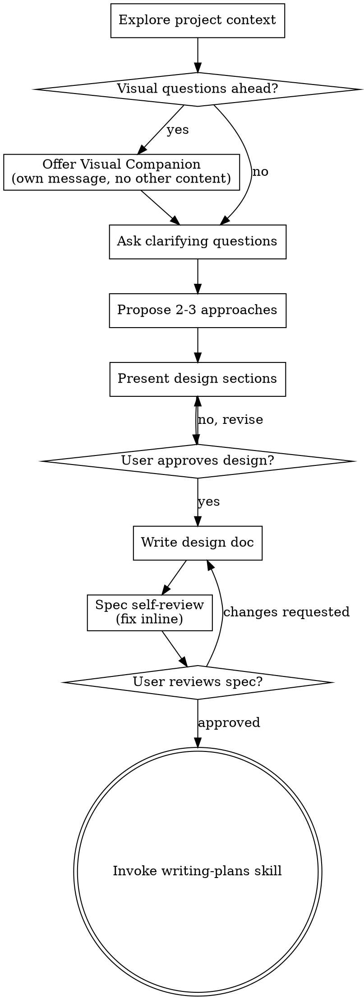
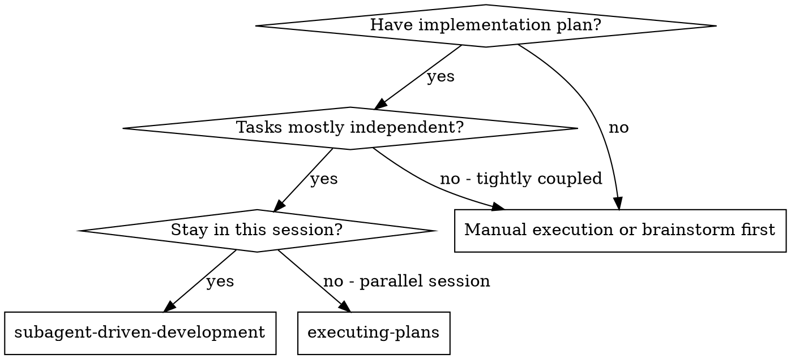
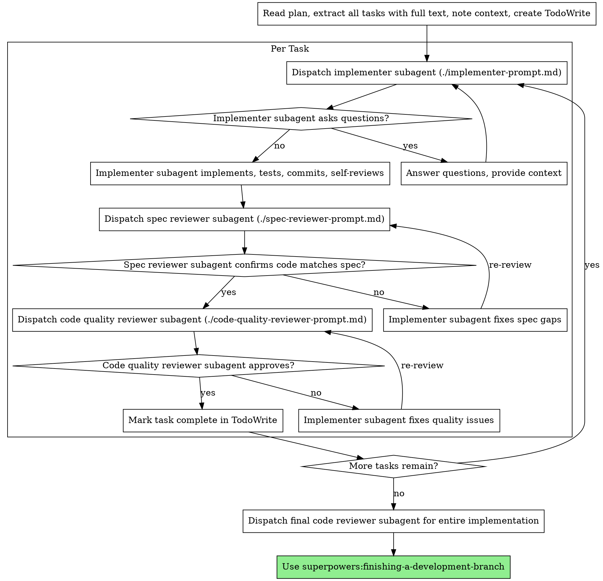
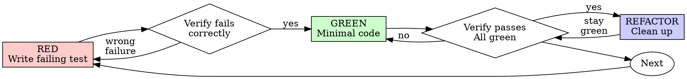

# M3A URL shortener implementation

**Session ID:** ses_1bfbc25c7ffeKxY1gLBUYfsIl0
**Created:** 5/19/2026, 3:44:09 PM
**Updated:** 5/20/2026, 8:37:53 AM

---

## User

Continue this project from M3A, Read docs/superpowers/plans/implementation-tracker.md and docs/superpowers/specs/2026-05-18-url-shortener-design.md. Create a small M3A plan then implement it, use worktrees and subagents.merge into main and clean worktree after finishing.Skip testing with every single step and leave it at the end before merging.

---

## Assistant (Build · gpt-5.5 · 9.5s)

**Tool: skill**

**Input:**
```json
{
  "name": "brainstorming"
}
```

**Output:**
```
<skill_content name="brainstorming">
# Skill: brainstorming

# Brainstorming Ideas Into Designs

Help turn ideas into fully formed designs and specs through natural collaborative dialogue.

Start by understanding the current project context, then ask questions one at a time to refine the idea. Once you understand what you're building, present the design and get user approval.

<HARD-GATE>
Do NOT invoke any implementation skill, write any code, scaffold any project, or take any implementation action until you have presented a design and the user has approved it. This applies to EVERY project regardless of perceived simplicity.
</HARD-GATE>

## Anti-Pattern: "This Is Too Simple To Need A Design"

Every project goes through this process. A todo list, a single-function utility, a config change — all of them. "Simple" projects are where unexamined assumptions cause the most wasted work. The design can be short (a few sentences for truly simple projects), but you MUST present it and get approval.

## Checklist

You MUST create a task for each of these items and complete them in order:

1. **Explore project context** — check files, docs, recent commits
2. **Offer visual companion** (if topic will involve visual questions) — this is its own message, not combined with a clarifying question. See the Visual Companion section below.
3. **Ask clarifying questions** — one at a time, understand purpose/constraints/success criteria
4. **Propose 2-3 approaches** — with trade-offs and your recommendation
5. **Present design** — in sections scaled to their complexity, get user approval after each section
6. **Write design doc** — save to `docs/superpowers/specs/YYYY-MM-DD-<topic>-design.md` and commit
7. **Spec self-review** — quick inline check for placeholders, contradictions, ambiguity, scope (see below)
8. **User reviews written spec** — ask user to review the spec file before proceeding
9. **Transition to implementation** — invoke writing-plans skill to create implementation plan

## Process Flow



**The terminal state is invoking writing-plans.** Do NOT invoke frontend-design, mcp-builder, or any other implementation skill. The ONLY skill you invoke after brainstorming is writing-plans.

## The Process

**Understanding the idea:**

- Check out the current project state first (files, docs, recent commits)
- Before asking detailed questions, assess scope: if the request describes multiple independent subsystems (e.g., "build a platform with chat, file storage, billing, and analytics"), flag this immediately. Don't spend questions refining details of a project that needs to be decomposed first.
- If the project is too large for a single spec, help the user decompose into sub-projects: what are the independent pieces, how do they relate, what order should they be built? Then brainstorm the first sub-project through the normal design flow. Each sub-project gets its own spec → plan → implementation cycle.
- For appropriately-scoped projects, ask questions one at a time to refine the idea
- Prefer multiple choice questions when possible, but open-ended is fine too
- Only one question per message - if a topic needs more exploration, break it into multiple questions
- Focus on understanding: purpose, constraints, success criteria

**Exploring approaches:**

- Propose 2-3 different approaches with trade-offs
- Present options conversationally with your recommendation and reasoning
- Lead with your recommended option and explain why

**Presenting the design:**

- Once you believe you understand what you're building, present the design
- Scale each section to its complexity: a few sentences if straightforward, up to 200-300 words if nuanced
- Ask after each section whether it looks right so far
- Cover: architecture, components, data flow, error handling, testing
- Be ready to go back and clarify if something doesn't make sense

**Design for isolation and clarity:**

- Break the system into smaller units that each have one clear purpose, communicate through well-defined interfaces, and can be understood and tested independently
- For each unit, you should be able to answer: what does it do, how do you use it, and what does it depend on?
- Can someone understand what a unit does without reading its internals? Can you change the internals without breaking consumers? If not, the boundaries need work.
- Smaller, well-bounded units are also easier for you to work with - you reason better about code you can hold in context at once, and your edits are more reliable when files are focused. When a file grows large, that's often a signal that it's doing too much.

**Working in existing codebases:**

- Explore the current structure before proposing changes. Follow existing patterns.
- Where existing code has problems that affect the work (e.g., a file that's grown too large, unclear boundaries, tangled responsibilities), include targeted improvements as part of the design - the way a good developer improves code they're working in.
- Don't propose unrelated refactoring. Stay focused on what serves the current goal.

## After the Design

**Documentation:**

- Write the validated design (spec) to `docs/superpowers/specs/YYYY-MM-DD-<topic>-design.md`
  - (User preferences for spec location override this default)
- Use elements-of-style:writing-clearly-and-concisely skill if available
- Commit the design document to git

**Spec Self-Review:**
After writing the spec document, look at it with fresh eyes:

1. **Placeholder scan:** Any "TBD", "TODO", incomplete sections, or vague requirements? Fix them.
2. **Internal consistency:** Do any sections contradict each other? Does the architecture match the feature descriptions?
3. **Scope check:** Is this focused enough for a single implementation plan, or does it need decomposition?
4. **Ambiguity check:** Could any requirement be interpreted two different ways? If so, pick one and make it explicit.

Fix any issues inline. No need to re-review — just fix and move on.

**User Review Gate:**
After the spec review loop passes, ask the user to review the written spec before proceeding:

> "Spec written and committed to `<path>`. Please review it and let me know if you want to make any changes before we start writing out the implementation plan."

Wait for the user's response. If they request changes, make them and re-run the spec review loop. Only proceed once the user approves.

**Implementation:**

- Invoke the writing-plans skill to create a detailed implementation plan
- Do NOT invoke any other skill. writing-plans is the next step.

## Key Principles

- **One question at a time** - Don't overwhelm with multiple questions
- **Multiple choice preferred** - Easier to answer than open-ended when possible
- **YAGNI ruthlessly** - Remove unnecessary features from all designs
- **Explore alternatives** - Always propose 2-3 approaches before settling
- **Incremental validation** - Present design, get approval before moving on
- **Be flexible** - Go back and clarify when something doesn't make sense

## Visual Companion

A browser-based companion for showing mockups, diagrams, and visual options during brainstorming. Available as a tool — not a mode. Accepting the companion means it's available for questions that benefit from visual treatment; it does NOT mean every question goes through the browser.

**Offering the companion:** When you anticipate that upcoming questions will involve visual content (mockups, layouts, diagrams), offer it once for consent:
> "Some of what we're working on might be easier to explain if I can show it to you in a web browser. I can put together mockups, diagrams, comparisons, and other visuals as we go. This feature is still new and can be token-intensive. Want to try it? (Requires opening a local URL)"

**This offer MUST be its own message.** Do not combine it with clarifying questions, context summaries, or any other content. The message should contain ONLY the offer above and nothing else. Wait for the user's response before continuing. If they decline, proceed with text-only brainstorming.

**Per-question decision:** Even after the user accepts, decide FOR EACH QUESTION whether to use the browser or the terminal. The test: **would the user understand this better by seeing it than reading it?**

- **Use the browser** for content that IS visual — mockups, wireframes, layout comparisons, architecture diagrams, side-by-side visual designs
- **Use the terminal** for content that is text — requirements questions, conceptual choices, tradeoff lists, A/B/C/D text options, scope decisions

A question about a UI topic is not automatically a visual question. "What does personality mean in this context?" is a conceptual question — use the terminal. "Which wizard layout works better?" is a visual question — use the browser.

If they agree to the companion, read the detailed guide before proceeding:
`skills/brainstorming/visual-companion.md`

Base directory for this skill: file:///C:/Users/Shaheen/.cache/opencode/packages/superpowers@git+https_/github.com/obra/superpowers.git/node_modules/superpowers/skills/brainstorming
Relative paths in this skill (e.g., scripts/, reference/) are relative to this base directory.
Note: file list is sampled.

<skill_files>
<file>C:\Users\Shaheen\.cache\opencode\packages\superpowers@git+https_\github.com\obra\superpowers.git\node_modules\superpowers\skills\brainstorming\spec-document-reviewer-prompt.md</file>
<file>C:\Users\Shaheen\.cache\opencode\packages\superpowers@git+https_\github.com\obra\superpowers.git\node_modules\superpowers\skills\brainstorming\visual-companion.md</file>
<file>C:\Users\Shaheen\.cache\opencode\packages\superpowers@git+https_\github.com\obra\superpowers.git\node_modules\superpowers\skills\brainstorming\scripts\stop-server.sh</file>
<file>C:\Users\Shaheen\.cache\opencode\packages\superpowers@git+https_\github.com\obra\superpowers.git\node_modules\superpowers\skills\brainstorming\scripts\start-server.sh</file>
<file>C:\Users\Shaheen\.cache\opencode\packages\superpowers@git+https_\github.com\obra\superpowers.git\node_modules\superpowers\skills\brainstorming\scripts\server.cjs</file>
<file>C:\Users\Shaheen\.cache\opencode\packages\superpowers@git+https_\github.com\obra\superpowers.git\node_modules\superpowers\skills\brainstorming\scripts\helper.js</file>
<file>C:\Users\Shaheen\.cache\opencode\packages\superpowers@git+https_\github.com\obra\superpowers.git\node_modules\superpowers\skills\brainstorming\scripts\frame-template.html</file>
</skill_files>
</skill_content>
```

**Tool: skill**

**Input:**
```json
{
  "name": "using-git-worktrees"
}
```

**Output:**
```
<skill_content name="using-git-worktrees">
# Skill: using-git-worktrees

# Using Git Worktrees

## Overview

Ensure work happens in an isolated workspace. Prefer your platform's native worktree tools. Fall back to manual git worktrees only when no native tool is available.

**Core principle:** Detect existing isolation first. Then use native tools. Then fall back to git. Never fight the harness.

**Announce at start:** "I'm using the using-git-worktrees skill to set up an isolated workspace."

## Step 0: Detect Existing Isolation

**Before creating anything, check if you are already in an isolated workspace.**

```bash
GIT_DIR=$(cd "$(git rev-parse --git-dir)" 2>/dev/null && pwd -P)
GIT_COMMON=$(cd "$(git rev-parse --git-common-dir)" 2>/dev/null && pwd -P)
BRANCH=$(git branch --show-current)
```

**Submodule guard:** `GIT_DIR != GIT_COMMON` is also true inside git submodules. Before concluding "already in a worktree," verify you are not in a submodule:

```bash
# If this returns a path, you're in a submodule, not a worktree — treat as normal repo
git rev-parse --show-superproject-working-tree 2>/dev/null
```

**If `GIT_DIR != GIT_COMMON` (and not a submodule):** You are already in a linked worktree. Skip to Step 3 (Project Setup). Do NOT create another worktree.

Report with branch state:
- On a branch: "Already in isolated workspace at `<path>` on branch `<name>`."
- Detached HEAD: "Already in isolated workspace at `<path>` (detached HEAD, externally managed). Branch creation needed at finish time."

**If `GIT_DIR == GIT_COMMON` (or in a submodule):** You are in a normal repo checkout.

Has the user already indicated their worktree preference in your instructions? If not, ask for consent before creating a worktree:

> "Would you like me to set up an isolated worktree? It protects your current branch from changes."

Honor any existing declared preference without asking. If the user declines consent, work in place and skip to Step 3.

## Step 1: Create Isolated Workspace

**You have two mechanisms. Try them in this order.**

### 1a. Native Worktree Tools (preferred)

The user has asked for an isolated workspace (Step 0 consent). Do you already have a way to create a worktree? It might be a tool with a name like `EnterWorktree`, `WorktreeCreate`, a `/worktree` command, or a `--worktree` flag. If you do, use it and skip to Step 3.

Native tools handle directory placement, branch creation, and cleanup automatically. Using `git worktree add` when you have a native tool creates phantom state your harness can't see or manage.

Only proceed to Step 1b if you have no native worktree tool available.

### 1b. Git Worktree Fallback

**Only use this if Step 1a does not apply** — you have no native worktree tool available. Create a worktree manually using git.

#### Directory Selection

Follow this priority order. Explicit user preference always beats observed filesystem state.

1. **Check your instructions for a declared worktree directory preference.** If the user has already specified one, use it without asking.

2. **Check for an existing project-local worktree directory:**
   ```bash
   ls -d .worktrees 2>/dev/null     # Preferred (hidden)
   ls -d worktrees 2>/dev/null      # Alternative
   ```
   If found, use it. If both exist, `.worktrees` wins.

3. **Check for an existing global directory:**
   ```bash
   project=$(basename "$(git rev-parse --show-toplevel)")
   ls -d ~/.config/superpowers/worktrees/$project 2>/dev/null
   ```
   If found, use it (backward compatibility with legacy global path).

4. **If there is no other guidance available**, default to `.worktrees/` at the project root.

#### Safety Verification (project-local directories only)

**MUST verify directory is ignored before creating worktree:**

```bash
git check-ignore -q .worktrees 2>/dev/null || git check-ignore -q worktrees 2>/dev/null
```

**If NOT ignored:** Add to .gitignore, commit the change, then proceed.

**Why critical:** Prevents accidentally committing worktree contents to repository.

Global directories (`~/.config/superpowers/worktrees/`) need no verification.

#### Create the Worktree

```bash
project=$(basename "$(git rev-parse --show-toplevel)")

# Determine path based on chosen location
# For project-local: path="$LOCATION/$BRANCH_NAME"
# For global: path="~/.config/superpowers/worktrees/$project/$BRANCH_NAME"

git worktree add "$path" -b "$BRANCH_NAME"
cd "$path"
```

**Sandbox fallback:** If `git worktree add` fails with a permission error (sandbox denial), tell the user the sandbox blocked worktree creation and you're working in the current directory instead. Then run setup and baseline tests in place.

## Step 3: Project Setup

Auto-detect and run appropriate setup:

```bash
# Node.js
if [ -f package.json ]; then npm install; fi

# Rust
if [ -f Cargo.toml ]; then cargo build; fi

# Python
if [ -f requirements.txt ]; then pip install -r requirements.txt; fi
if [ -f pyproject.toml ]; then poetry install; fi

# Go
if [ -f go.mod ]; then go mod download; fi
```

## Step 4: Verify Clean Baseline

Run tests to ensure workspace starts clean:

```bash
# Use project-appropriate command
npm test / cargo test / pytest / go test ./...
```

**If tests fail:** Report failures, ask whether to proceed or investigate.

**If tests pass:** Report ready.

### Report

```
Worktree ready at <full-path>
Tests passing (<N> tests, 0 failures)
Ready to implement <feature-name>
```

## Quick Reference

| Situation | Action |
|-----------|--------|
| Already in linked worktree | Skip creation (Step 0) |
| In a submodule | Treat as normal repo (Step 0 guard) |
| Native worktree tool available | Use it (Step 1a) |
| No native tool | Git worktree fallback (Step 1b) |
| `.worktrees/` exists | Use it (verify ignored) |
| `worktrees/` exists | Use it (verify ignored) |
| Both exist | Use `.worktrees/` |
| Neither exists | Check instruction file, then default `.worktrees/` |
| Global path exists | Use it (backward compat) |
| Directory not ignored | Add to .gitignore + commit |
| Permission error on create | Sandbox fallback, work in place |
| Tests fail during baseline | Report failures + ask |
| No package.json/Cargo.toml | Skip dependency install |

## Common Mistakes

### Fighting the harness

- **Problem:** Using `git worktree add` when the platform already provides isolation
- **Fix:** Step 0 detects existing isolation. Step 1a defers to native tools.

### Skipping detection

- **Problem:** Creating a nested worktree inside an existing one
- **Fix:** Always run Step 0 before creating anything

### Skipping ignore verification

- **Problem:** Worktree contents get tracked, pollute git status
- **Fix:** Always use `git check-ignore` before creating project-local worktree

### Assuming directory location

- **Problem:** Creates inconsistency, violates project conventions
- **Fix:** Follow priority: existing > global legacy > instruction file > default

### Proceeding with failing tests

- **Problem:** Can't distinguish new bugs from pre-existing issues
- **Fix:** Report failures, get explicit permission to proceed

## Red Flags

**Never:**
- Create a worktree when Step 0 detects existing isolation
- Use `git worktree add` when you have a native worktree tool (e.g., `EnterWorktree`). This is the #1 mistake — if you have it, use it.
- Skip Step 1a by jumping straight to Step 1b's git commands
- Create worktree without verifying it's ignored (project-local)
- Skip baseline test verification
- Proceed with failing tests without asking

**Always:**
- Run Step 0 detection first
- Prefer native tools over git fallback
- Follow directory priority: existing > global legacy > instruction file > default
- Verify directory is ignored for project-local
- Auto-detect and run project setup
- Verify clean test baseline

Base directory for this skill: file:///C:/Users/Shaheen/.cache/opencode/packages/superpowers@git+https_/github.com/obra/superpowers.git/node_modules/superpowers/skills/using-git-worktrees
Relative paths in this skill (e.g., scripts/, reference/) are relative to this base directory.
Note: file list is sampled.

<skill_files>

</skill_files>
</skill_content>
```

**Tool: skill**

**Input:**
```json
{
  "name": "writing-plans"
}
```

**Output:**
```
<skill_content name="writing-plans">
# Skill: writing-plans

# Writing Plans

## Overview

Write comprehensive implementation plans assuming the engineer has zero context for our codebase and questionable taste. Document everything they need to know: which files to touch for each task, code, testing, docs they might need to check, how to test it. Give them the whole plan as bite-sized tasks. DRY. YAGNI. TDD. Frequent commits.

Assume they are a skilled developer, but know almost nothing about our toolset or problem domain. Assume they don't know good test design very well.

**Announce at start:** "I'm using the writing-plans skill to create the implementation plan."

**Context:** If working in an isolated worktree, it should have been created via the `superpowers:using-git-worktrees` skill at execution time.

**Save plans to:** `docs/superpowers/plans/YYYY-MM-DD-<feature-name>.md`
- (User preferences for plan location override this default)

## Scope Check

If the spec covers multiple independent subsystems, it should have been broken into sub-project specs during brainstorming. If it wasn't, suggest breaking this into separate plans — one per subsystem. Each plan should produce working, testable software on its own.

## File Structure

Before defining tasks, map out which files will be created or modified and what each one is responsible for. This is where decomposition decisions get locked in.

- Design units with clear boundaries and well-defined interfaces. Each file should have one clear responsibility.
- You reason best about code you can hold in context at once, and your edits are more reliable when files are focused. Prefer smaller, focused files over large ones that do too much.
- Files that change together should live together. Split by responsibility, not by technical layer.
- In existing codebases, follow established patterns. If the codebase uses large files, don't unilaterally restructure - but if a file you're modifying has grown unwieldy, including a split in the plan is reasonable.

This structure informs the task decomposition. Each task should produce self-contained changes that make sense independently.

## Bite-Sized Task Granularity

**Each step is one action (2-5 minutes):**
- "Write the failing test" - step
- "Run it to make sure it fails" - step
- "Implement the minimal code to make the test pass" - step
- "Run the tests and make sure they pass" - step
- "Commit" - step

## Plan Document Header

**Every plan MUST start with this header:**

```markdown
# [Feature Name] Implementation Plan

> **For agentic workers:** REQUIRED SUB-SKILL: Use superpowers:subagent-driven-development (recommended) or superpowers:executing-plans to implement this plan task-by-task. Steps use checkbox (`- [ ]`) syntax for tracking.

**Goal:** [One sentence describing what this builds]

**Architecture:** [2-3 sentences about approach]

**Tech Stack:** [Key technologies/libraries]

---
```

## Task Structure

````markdown
### Task N: [Component Name]

**Files:**
- Create: `exact/path/to/file.py`
- Modify: `exact/path/to/existing.py:123-145`
- Test: `tests/exact/path/to/test.py`

- [ ] **Step 1: Write the failing test**

```python
def test_specific_behavior():
    result = function(input)
    assert result == expected
```

- [ ] **Step 2: Run test to verify it fails**

Run: `pytest tests/path/test.py::test_name -v`
Expected: FAIL with "function not defined"

- [ ] **Step 3: Write minimal implementation**

```python
def function(input):
    return expected
```

- [ ] **Step 4: Run test to verify it passes**

Run: `pytest tests/path/test.py::test_name -v`
Expected: PASS

- [ ] **Step 5: Commit**

```bash
git add tests/path/test.py src/path/file.py
git commit -m "feat: add specific feature"
```
````

## No Placeholders

Every step must contain the actual content an engineer needs. These are **plan failures** — never write them:
- "TBD", "TODO", "implement later", "fill in details"
- "Add appropriate error handling" / "add validation" / "handle edge cases"
- "Write tests for the above" (without actual test code)
- "Similar to Task N" (repeat the code — the engineer may be reading tasks out of order)
- Steps that describe what to do without showing how (code blocks required for code steps)
- References to types, functions, or methods not defined in any task

## Remember
- Exact file paths always
- Complete code in every step — if a step changes code, show the code
- Exact commands with expected output
- DRY, YAGNI, TDD, frequent commits

## Self-Review

After writing the complete plan, look at the spec with fresh eyes and check the plan against it. This is a checklist you run yourself — not a subagent dispatch.

**1. Spec coverage:** Skim each section/requirement in the spec. Can you point to a task that implements it? List any gaps.

**2. Placeholder scan:** Search your plan for red flags — any of the patterns from the "No Placeholders" section above. Fix them.

**3. Type consistency:** Do the types, method signatures, and property names you used in later tasks match what you defined in earlier tasks? A function called `clearLayers()` in Task 3 but `clearFullLayers()` in Task 7 is a bug.

If you find issues, fix them inline. No need to re-review — just fix and move on. If you find a spec requirement with no task, add the task.

## Execution Handoff

After saving the plan, offer execution choice:

**"Plan complete and saved to `docs/superpowers/plans/<filename>.md`. Two execution options:**

**1. Subagent-Driven (recommended)** - I dispatch a fresh subagent per task, review between tasks, fast iteration

**2. Inline Execution** - Execute tasks in this session using executing-plans, batch execution with checkpoints

**Which approach?"**

**If Subagent-Driven chosen:**
- **REQUIRED SUB-SKILL:** Use superpowers:subagent-driven-development
- Fresh subagent per task + two-stage review

**If Inline Execution chosen:**
- **REQUIRED SUB-SKILL:** Use superpowers:executing-plans
- Batch execution with checkpoints for review

Base directory for this skill: file:///C:/Users/Shaheen/.cache/opencode/packages/superpowers@git+https_/github.com/obra/superpowers.git/node_modules/superpowers/skills/writing-plans
Relative paths in this skill (e.g., scripts/, reference/) are relative to this base directory.
Note: file list is sampled.

<skill_files>
<file>C:\Users\Shaheen\.cache\opencode\packages\superpowers@git+https_\github.com\obra\superpowers.git\node_modules\superpowers\skills\writing-plans\plan-document-reviewer-prompt.md</file>
</skill_files>
</skill_content>
```

**Tool: skill**

**Input:**
```json
{
  "name": "subagent-driven-development"
}
```

**Output:**
```
<skill_content name="subagent-driven-development">
# Skill: subagent-driven-development

# Subagent-Driven Development

Execute plan by dispatching fresh subagent per task, with two-stage review after each: spec compliance review first, then code quality review.

**Why subagents:** You delegate tasks to specialized agents with isolated context. By precisely crafting their instructions and context, you ensure they stay focused and succeed at their task. They should never inherit your session's context or history — you construct exactly what they need. This also preserves your own context for coordination work.

**Core principle:** Fresh subagent per task + two-stage review (spec then quality) = high quality, fast iteration

**Continuous execution:** Do not pause to check in with your human partner between tasks. Execute all tasks from the plan without stopping. The only reasons to stop are: BLOCKED status you cannot resolve, ambiguity that genuinely prevents progress, or all tasks complete. "Should I continue?" prompts and progress summaries waste their time — they asked you to execute the plan, so execute it.

## When to Use



**vs. Executing Plans (parallel session):**
- Same session (no context switch)
- Fresh subagent per task (no context pollution)
- Two-stage review after each task: spec compliance first, then code quality
- Faster iteration (no human-in-loop between tasks)

## The Process



## Model Selection

Use the least powerful model that can handle each role to conserve cost and increase speed.

**Mechanical implementation tasks** (isolated functions, clear specs, 1-2 files): use a fast, cheap model. Most implementation tasks are mechanical when the plan is well-specified.

**Integration and judgment tasks** (multi-file coordination, pattern matching, debugging): use a standard model.

**Architecture, design, and review tasks**: use the most capable available model.

**Task complexity signals:**
- Touches 1-2 files with a complete spec → cheap model
- Touches multiple files with integration concerns → standard model
- Requires design judgment or broad codebase understanding → most capable model

## Handling Implementer Status

Implementer subagents report one of four statuses. Handle each appropriately:

**DONE:** Proceed to spec compliance review.

**DONE_WITH_CONCERNS:** The implementer completed the work but flagged doubts. Read the concerns before proceeding. If the concerns are about correctness or scope, address them before review. If they're observations (e.g., "this file is getting large"), note them and proceed to review.

**NEEDS_CONTEXT:** The implementer needs information that wasn't provided. Provide the missing context and re-dispatch.

**BLOCKED:** The implementer cannot complete the task. Assess the blocker:
1. If it's a context problem, provide more context and re-dispatch with the same model
2. If the task requires more reasoning, re-dispatch with a more capable model
3. If the task is too large, break it into smaller pieces
4. If the plan itself is wrong, escalate to the human

**Never** ignore an escalation or force the same model to retry without changes. If the implementer said it's stuck, something needs to change.

## Prompt Templates

- `./implementer-prompt.md` - Dispatch implementer subagent
- `./spec-reviewer-prompt.md` - Dispatch spec compliance reviewer subagent
- `./code-quality-reviewer-prompt.md` - Dispatch code quality reviewer subagent

## Example Workflow

```
You: I'm using Subagent-Driven Development to execute this plan.

[Read plan file once: docs/superpowers/plans/feature-plan.md]
[Extract all 5 tasks with full text and context]
[Create TodoWrite with all tasks]

Task 1: Hook installation script

[Get Task 1 text and context (already extracted)]
[Dispatch implementation subagent with full task text + context]

Implementer: "Before I begin - should the hook be installed at user or system level?"

You: "User level (~/.config/superpowers/hooks/)"

Implementer: "Got it. Implementing now..."
[Later] Implementer:
  - Implemented install-hook command
  - Added tests, 5/5 passing
  - Self-review: Found I missed --force flag, added it
  - Committed

[Dispatch spec compliance reviewer]
Spec reviewer: ✅ Spec compliant - all requirements met, nothing extra

[Get git SHAs, dispatch code quality reviewer]
Code reviewer: Strengths: Good test coverage, clean. Issues: None. Approved.

[Mark Task 1 complete]

Task 2: Recovery modes

[Get Task 2 text and context (already extracted)]
[Dispatch implementation subagent with full task text + context]

Implementer: [No questions, proceeds]
Implementer:
  - Added verify/repair modes
  - 8/8 tests passing
  - Self-review: All good
  - Committed

[Dispatch spec compliance reviewer]
Spec reviewer: ❌ Issues:
  - Missing: Progress reporting (spec says "report every 100 items")
  - Extra: Added --json flag (not requested)

[Implementer fixes issues]
Implementer: Removed --json flag, added progress reporting

[Spec reviewer reviews again]
Spec reviewer: ✅ Spec compliant now

[Dispatch code quality reviewer]
Code reviewer: Strengths: Solid. Issues (Important): Magic number (100)

[Implementer fixes]
Implementer: Extracted PROGRESS_INTERVAL constant

[Code reviewer reviews again]
Code reviewer: ✅ Approved

[Mark Task 2 complete]

...

[After all tasks]
[Dispatch final code-reviewer]
Final reviewer: All requirements met, ready to merge

Done!
```

## Advantages

**vs. Manual execution:**
- Subagents follow TDD naturally
- Fresh context per task (no confusion)
- Parallel-safe (subagents don't interfere)
- Subagent can ask questions (before AND during work)

**vs. Executing Plans:**
- Same session (no handoff)
- Continuous progress (no waiting)
- Review checkpoints automatic

**Efficiency gains:**
- No file reading overhead (controller provides full text)
- Controller curates exactly what context is needed
- Subagent gets complete information upfront
- Questions surfaced before work begins (not after)

**Quality gates:**
- Self-review catches issues before handoff
- Two-stage review: spec compliance, then code quality
- Review loops ensure fixes actually work
- Spec compliance prevents over/under-building
- Code quality ensures implementation is well-built

**Cost:**
- More subagent invocations (implementer + 2 reviewers per task)
- Controller does more prep work (extracting all tasks upfront)
- Review loops add iterations
- But catches issues early (cheaper than debugging later)

## Red Flags

**Never:**
- Start implementation on main/master branch without explicit user consent
- Skip reviews (spec compliance OR code quality)
- Proceed with unfixed issues
- Dispatch multiple implementation subagents in parallel (conflicts)
- Make subagent read plan file (provide full text instead)
- Skip scene-setting context (subagent needs to understand where task fits)
- Ignore subagent questions (answer before letting them proceed)
- Accept "close enough" on spec compliance (spec reviewer found issues = not done)
- Skip review loops (reviewer found issues = implementer fixes = review again)
- Let implementer self-review replace actual review (both are needed)
- **Start code quality review before spec compliance is ✅** (wrong order)
- Move to next task while either review has open issues

**If subagent asks questions:**
- Answer clearly and completely
- Provide additional context if needed
- Don't rush them into implementation

**If reviewer finds issues:**
- Implementer (same subagent) fixes them
- Reviewer reviews again
- Repeat until approved
- Don't skip the re-review

**If subagent fails task:**
- Dispatch fix subagent with specific instructions
- Don't try to fix manually (context pollution)

## Integration

**Required workflow skills:**
- **superpowers:using-git-worktrees** - Ensures isolated workspace (creates one or verifies existing)
- **superpowers:writing-plans** - Creates the plan this skill executes
- **superpowers:requesting-code-review** - Code review template for reviewer subagents
- **superpowers:finishing-a-development-branch** - Complete development after all tasks

**Subagents should use:**
- **superpowers:test-driven-development** - Subagents follow TDD for each task

**Alternative workflow:**
- **superpowers:executing-plans** - Use for parallel session instead of same-session execution

Base directory for this skill: file:///C:/Users/Shaheen/.cache/opencode/packages/superpowers@git+https_/github.com/obra/superpowers.git/node_modules/superpowers/skills/subagent-driven-development
Relative paths in this skill (e.g., scripts/, reference/) are relative to this base directory.
Note: file list is sampled.

<skill_files>
<file>C:\Users\Shaheen\.cache\opencode\packages\superpowers@git+https_\github.com\obra\superpowers.git\node_modules\superpowers\skills\subagent-driven-development\spec-reviewer-prompt.md</file>
<file>C:\Users\Shaheen\.cache\opencode\packages\superpowers@git+https_\github.com\obra\superpowers.git\node_modules\superpowers\skills\subagent-driven-development\implementer-prompt.md</file>
<file>C:\Users\Shaheen\.cache\opencode\packages\superpowers@git+https_\github.com\obra\superpowers.git\node_modules\superpowers\skills\subagent-driven-development\code-quality-reviewer-prompt.md</file>
</skill_files>
</skill_content>
```

---

## Assistant (Build · gpt-5.5 · 14.5s)

I'm using the worktree and planning skills to continue from the existing M3A spec/tracker, isolate the work, then execute via subagents. I’ll read the tracker/spec and verify the repo/worktree state before creating the M3A plan.

**Tool: read**

**Input:**
```json
{
  "filePath": "C:\\Users\\Shaheen\\URL_shortner_super_powers\\docs\\superpowers\\plans\\implementation-tracker.md"
}
```

**Output:**
```
<path>C:\Users\Shaheen\URL_shortner_super_powers\docs\superpowers\plans\implementation-tracker.md</path>
<type>file</type>
<content>
1: # URL Shortener Implementation Tracker
2: 
3: Design spec: `docs/superpowers/specs/2026-05-18-url-shortener-design.md`
4: 
5: ## Milestones
6: 
7: - [x] M1A: Project scaffold, Fastify health endpoint, Docker Compose PostgreSQL
8: - [x] M1B: Prisma schema and database connection
9: - [x] M1C: Public link creation validation and code generation
10: - [x] M1D: Redirect route and click counting basics
11: - [x] M2A: Admin authentication and sessions
12: - [x] M2B: Admin link management API
13: - [x] M2C: Admin analytics API
14: - [ ] M3A: Public React form
15: - [ ] M3B: Admin dashboard UI shell
16: - [ ] M3C: Dashboard charts and link table
17: - [ ] M4A: OpenAPI docs, Docker production image, final verification
18: 
19: ## Current Status
20: 
21: - Current plan: `docs/superpowers/plans/2026-05-19-url-shortener-m2c-admin-analytics-api.md`
22: - Last updated: 2026-05-19

(End of file - total 22 lines)
</content>
```

**Tool: read**

**Input:**
```json
{
  "filePath": "C:\\Users\\Shaheen\\URL_shortner_super_powers\\docs\\superpowers\\specs\\2026-05-18-url-shortener-design.md"
}
```

**Output:**
```
<path>C:\Users\Shaheen\URL_shortner_super_powers\docs\superpowers\specs\2026-05-18-url-shortener-design.md</path>
<type>file</type>
<content>
1: # URL Shortener Backend And Admin Dashboard Design
2: 
3: ## Summary
4: 
5: Build a production-oriented URL shortener using a Node.js/TypeScript backend, PostgreSQL, and a React/Vite frontend. The service will support public anonymous link creation, short-link redirects, OpenAPI documentation, and a polished admin dashboard with link management and analytics.
6: 
7: The first version uses one deployable application container. PostgreSQL runs as a separate service, including through Docker Compose for local development.
8: 
9: ## Goals
10: 
11: - Public users can create short links without logging in.
12: - Public users can optionally choose a custom alias and optional expiration date.
13: - The service redirects active, non-expired short links and records human-looking clicks.
14: - Obvious bots and crawlers do not inflate analytics.
15: - Admins can log in, manage links, and view analytics charts by day, referrer, and device.
16: - The public API is documented with OpenAPI.
17: - The app runs locally with Docker Compose and is deployable as a Docker container.
18: 
19: ## Non-Goals For V1
20: 
21: - Public user accounts or link ownership.
22: - Public metadata endpoints for existing short links.
23: - Public stats pages.
24: - Multi-admin management UI.
25: - Separate domains for dashboard, API, and redirects.
26: - CAPTCHA or admin-managed denylists.
27: 
28: ## Technology Choices
29: 
30: - Backend: Fastify with TypeScript.
31: - Frontend: React with Vite.
32: - Database: PostgreSQL.
33: - Database access and migrations: Prisma.
34: - Admin authentication: cookie-based server-side sessions.
35: - Password hashing: Argon2.
36: - Deployment: Docker app container plus separate PostgreSQL service.
37: 
38: Fastify is preferred over a minimal Express setup because it has strong TypeScript ergonomics, schema-driven validation, OpenAPI-friendly route definitions, and good performance for redirect/API traffic.
39: 
40: ## Application Architecture
41: 
42: The repository will contain one full-stack application with clear backend and frontend boundaries:
43: 
44: - `server/`: Fastify API, redirect route, admin auth, OpenAPI docs, PostgreSQL access, validation, rate limiting, and operational endpoints.
45: - `web/`: React/Vite public form and admin dashboard.
46: - Docker Compose: local app and PostgreSQL services.
47: 
48: The same app serves public pages, admin pages, API routes, docs, and redirects from one domain.
49: 
50: Routes:
51: 
52: - `/`: public link creation page.
53: - `/api/links`: public REST endpoint for creating short links.
54: - `/api/admin/*`: authenticated admin APIs.
55: - `/docs`: OpenAPI documentation UI.
56: - `/admin/*`: React admin dashboard.
57: - `/:code`: short-link redirect route.
58: 
59: Reserved routes such as `admin`, `api`, `docs`, asset paths, and health routes cannot be used as custom aliases. The redirect route is registered so it does not swallow internal application routes.
60: 
61: ## Data Model
62: 
63: ### `links`
64: 
65: Stores each shortened URL.
66: 
67: Fields:
68: 
69: - `id`: primary key.
70: - `original_url`: destination URL.
71: - `short_code`: unique public code or alias.
72: - `is_custom_alias`: whether the code was user-supplied.
73: - `is_active`: whether redirects are allowed.
74: - `expires_at`: optional expiration timestamp.
75: - `total_click_count`: denormalized count for fast dashboard summaries.
76: - `created_at`: creation timestamp.
77: - `updated_at`: update timestamp.
78: 
79: ### `click_events`
80: 
81: Stores analytics events for counted clicks.
82: 
83: Fields:
84: 
85: - `id`: primary key.
86: - `link_id`: foreign key to `links`.
87: - `clicked_at`: event timestamp.
88: - `referrer_host`: normalized referrer host when available.
89: - `device_type`: coarse device category such as desktop, mobile, tablet, or unknown.
90: - `browser`: coarse browser/user-agent summary.
91: - `ip_hash`: irreversible hash or equivalent privacy-preserving representation.
92: 
93: Raw full IP addresses are not stored in click analytics.
94: 
95: ### `admin_users`
96: 
97: Stores admin login identities.
98: 
99: Fields:
100: 
101: - `id`: primary key.
102: - `email`: unique admin email.
103: - `password_hash`: Argon2 password hash.
104: - `created_at`: creation timestamp.
105: - `last_login_at`: optional last login timestamp.
106: 
107: The initial admin is created through a setup or seed command. V1 does not include public registration or admin user management screens.
108: 
109: ### `admin_sessions`
110: 
111: Stores server-side admin sessions.
112: 
113: Fields:
114: 
115: - `id`: primary key.
116: - `admin_user_id`: foreign key to `admin_users`.
117: - `session_token_hash`: hash of the browser session token.
118: - `expires_at`: session expiration timestamp.
119: - `created_at`: creation timestamp.
120: 
121: ## Public Link Creation
122: 
123: Public users can create links through both the web form and `POST /api/links`.
124: 
125: Request fields:
126: 
127: - `url`: required destination URL.
128: - `alias`: optional custom alias.
129: - `expiresAt`: optional expiration timestamp.
130: 
131: Validation rules:
132: 
133: - Destination URLs must use `http` or `https`.
134: - Localhost, private IP ranges, loopback addresses, and internal hostnames are blocked.
135: - Aliases must be URL-safe, length-limited, unique, and not reserved.
136: - Public creation is rate-limited by IP.
137: 
138: If no alias is provided, the backend generates a random URL-safe code and retries on uniqueness collisions. If a custom alias collides or fails validation, the API returns a clear validation error instead of silently replacing it.
139: 
140: Successful responses include the generated short URL based on the configured public base URL.
141: 
142: ## Redirect Behavior
143: 
144: When a user visits `/:code`, the service:
145: 
146: 1. Looks up the link by short code.
147: 2. Verifies the link exists, is active, and is not expired.
148: 3. Shows a branded unavailable page for missing, inactive, or expired links.
149: 4. Redirects valid links to their original URL.
150: 5. Records click analytics for human-looking visits.
151: 
152: Obvious bots and crawlers are redirected but not counted. Click recording should avoid adding noticeable latency to redirects. The dashboard uses `links.total_click_count` for fast summaries and `click_events` for detailed charts.
153: 
154: ## Public API
155: 
156: V1 exposes only the public API needed for anonymous link creation.
157: 
158: - `POST /api/links`: create a short link.
159: 
160: V1 does not expose `GET /api/links/:code` or other public metadata endpoints. Visitors use `GET /:code` for redirects, and admins use authenticated admin APIs for link metadata.
161: 
162: ## Admin Dashboard
163: 
164: The admin dashboard is a custom polished SaaS analytics interface built with React/Vite and served under `/admin/*`.
165: 
166: V1 features:
167: 
168: - Admin login and logout.
169: - Overview cards for total links, total clicks, active links, and recent clicks.
170: - Analytics charts by day, referrer, and device.
171: - Search, filter, and paginate all links.
172: - View link details and click history.
173: - Edit original URL, active status, and expiration date.
174: - Delete or deactivate links.
175: - Copy short URLs from the dashboard.
176: 
177: The visual direction should be clean and analytics-focused: crisp cards, strong typography, responsive charts, polished empty/loading states, and a restrained palette with one strong accent color.
178: 
179: ## Admin API
180: 
181: Admin APIs live under `/api/admin/*` and require an authenticated session.
182: 
183: Expected endpoint groups:
184: 
185: - Session endpoints for login, logout, and current admin.
186: - Link listing, searching, filtering, pagination, update, deletion, and deactivation.
187: - Link detail and click history endpoints.
188: - Analytics endpoints for time-series clicks, referrer breakdowns, and device breakdowns.
189: 
190: Admin requests without a valid session return `401`. Validation errors return structured JSON responses with stable error codes and readable messages.
191: 
192: ## Authentication And Sessions
193: 
194: Admin login uses database-backed admin users and server-side sessions.
195: 
196: Session cookie behavior:
197: 
198: - `HttpOnly` to prevent JavaScript access.
199: - `SameSite=Lax` for same-domain dashboard usage.
200: - `Secure` in production.
201: - Session token stored only as a hash in the database.
202: - Expired sessions are rejected and can be cleaned up periodically.
203: 
204: This avoids JWT storage complexity and fits the same-domain deployment model.
205: 
206: ## Error Handling
207: 
208: Public and admin APIs return consistent JSON errors with stable codes and human-readable messages. The public form renders these errors inline.
209: 
210: Redirect errors use branded HTML pages rather than JSON:
211: 
212: - Unknown short code.
213: - Inactive link.
214: - Expired link.
215: 
216: Operational errors should be logged server-side without leaking secrets or sensitive request data to users.
217: 
218: ## Security And Abuse Protection
219: 
220: Security requirements:
221: 
222: - Rate-limit public link creation by IP.
223: - Validate and normalize destination URLs.
224: - Block private network, loopback, localhost, and internal destinations.
225: - Reject unsafe or reserved aliases.
226: - Use Argon2 for admin passwords.
227: - Use secure cookie settings in production.
228: - Store hashed or privacy-preserving IP metadata for analytics rather than raw full IP addresses.
229: - Avoid logging secrets, session tokens, or full sensitive request bodies.
230: 
231: V1 does not include CAPTCHA or admin-managed denylists, but the design leaves room to add them later.
232: 
233: ## Configuration
234: 
235: Environment variables configure:
236: 
237: - App port.
238: - Database URL.
239: - Public base URL used when generating short links.
240: - Session secret or token signing material.
241: - Cookie secure mode.
242: - Rate limit settings.
243: - Optional log level.
244: 
245: The app assumes one base domain in v1, but the public base URL remains configurable so a dedicated short-link domain can be introduced later.
246: 
247: ## Operations
248: 
249: Local development uses Docker Compose with at least:
250: 
251: - App service.
252: - PostgreSQL service.
253: 
254: Operational endpoints:
255: 
256: - Health endpoint for container checks.
257: - OpenAPI documentation at `/docs`.
258: 
259: Database migrations manage schema changes. Seed or setup commands create the initial admin user.
260: 
261: ## Testing Strategy
262: 
263: Unit tests cover:
264: 
265: - Random short code generation and collision retry behavior.
266: - Alias validation and reserved alias rejection.
267: - URL validation and private network blocking.
268: - Bot detection.
269: - Expiration and active-status checks.
270: 
271: API tests cover:
272: 
273: - Public link creation.
274: - Validation and rate-limit errors.
275: - Redirect behavior for valid, missing, inactive, expired, and bot visits.
276: - Admin login/logout/session checks.
277: - Admin link search, edit, delete/deactivate, and analytics endpoints.
278: 
279: UI tests cover:
280: 
281: - Public form success and error states.
282: - Admin login.
283: - Dashboard overview rendering.
284: - Basic link table interactions.
285: 
286: ## Implementation Notes
287: 
288: - Keep the public API surface small in v1: only public link creation is exposed as JSON.
289: - Keep redirect logic separate from dashboard/API logic so it remains easy to test and optimize.
290: - Keep analytics aggregation behind admin API endpoints so chart implementation can change without affecting stored data.
291: - Prefer explicit route schemas to support validation and OpenAPI generation.

(End of file - total 291 lines)
</content>
```

**Tool: bash**

**Input:**
```json
{
  "command": "git rev-parse --git-dir; git rev-parse --git-common-dir; git branch --show-current; git rev-parse --show-superproject-working-tree",
  "description": "Detects git worktree isolation"
}
```

**Output:**
```
.git
.git
main

```

**Tool: bash**

**Input:**
```json
{
  "command": "git status --short",
  "description": "Shows current working tree changes"
}
```

**Output:**
```
(no output)
```

---

## Assistant (Build · gpt-5.5 · 24.1s)

I’m using the writing-plans skill to create a focused M3A implementation plan. I’m using the using-git-worktrees skill to set up an isolated workspace; since the user requested end-only testing, I’ll skip baseline test runs and do verification before merging.

**Tool: glob**

**Input:**
```json
{
  "pattern": "**/package.json"
}
```

**Output:**
```
C:\Users\Shaheen\URL_shortner_super_powers\package.json
```

**Tool: glob**

**Input:**
```json
{
  "pattern": "**/.gitignore"
}
```

**Output:**
```
C:\Users\Shaheen\URL_shortner_super_powers\.gitignore
```

**Tool: glob**

**Input:**
```json
{
  "pattern": "web/**/*"
}
```

**Output:**
```
No files found
```

**Tool: glob**

**Input:**
```json
{
  "pattern": "server/**/*"
}
```

**Output:**
```
No files found
```

**Tool: bash**

**Input:**
```json
{
  "command": "git check-ignore -q .worktrees; if ($?) { 'ignored' } else { 'not ignored' }",
  "description": "Checks worktree ignore status"
}
```

**Output:**
```
ignored

```

---

## Assistant (Build · gpt-5.5 · 10.1s)

The repo is on `main` with a clean working tree, and `.worktrees` is already ignored. I’m creating an isolated M3A branch/worktree now, then I’ll inspect the app structure there and write the plan.

**Tool: bash**

**Input:**
```json
{
  "command": "Test-Path -LiteralPath \".worktrees\"; if (-not $?) { exit 1 }; if (-not (Test-Path -LiteralPath \".worktrees\")) { New-Item -ItemType Directory -Path \".worktrees\" | Out-Null }; git worktree add \".worktrees/m3a-public-react-form\" -b \"m3a-public-react-form\"",
  "description": "Creates M3A git worktree",
  "timeout": 120000
}
```

**Output:**
```
True
Preparing worktree (new branch 'm3a-public-react-form')
HEAD is now at aa5872c fix: stabilize analytics day ranges

```

---

## Assistant (Build · gpt-5.5 · 6.6s)

Worktree ready at `.worktrees/m3a-public-react-form`. I’m now mapping the existing files and package scripts in the isolated workspace so the M3A plan matches the current structure.

**Tool: read**

**Input:**
```json
{
  "filePath": "C:\\Users\\Shaheen\\URL_shortner_super_powers\\.worktrees\\m3a-public-react-form\\package.json"
}
```

**Output:**
```
<path>C:\Users\Shaheen\URL_shortner_super_powers\.worktrees\m3a-public-react-form\package.json</path>
<type>file</type>
<content>
1: {
2:   "name": "url-shortener-super-powers",
3:   "version": "0.1.0",
4:   "private": true,
5:   "type": "module",
6:   "scripts": {
7:     "dev": "tsx watch src/index.ts",
8:     "postinstall": "prisma generate",
9:     "prebuild": "node -e \"fs.rmSync('dist', { recursive: true, force: true })\"",
10:     "build": "tsc -p tsconfig.build.json",
11:     "typecheck": "tsc -p tsconfig.json --noEmit",
12:     "start": "node dist/index.js",
13:     "test": "vitest run --exclude dist/**",
14:     "db:generate": "prisma generate",
15:     "db:migrate": "prisma migrate dev",
16:     "db:studio": "prisma studio"
17:   },
18:   "dependencies": {
19:     "@fastify/cors": "11.1.0",
20:     "@fastify/helmet": "13.0.2",
21:     "@prisma/client": "^7.8.0",
22:     "argon2": "^0.44.0",
23:     "fastify": "5.8.5",
24:     "fastify-plugin": "^5.1.0"
25:   },
26:   "devDependencies": {
27:     "@types/node": "24.10.1",
28:     "prisma": "^7.8.0",
29:     "tsx": "4.20.6",
30:     "typescript": "5.9.3",
31:     "vitest": "4.0.14"
32:   }
33: }

(End of file - total 33 lines)
</content>
```

**Tool: glob**

**Input:**
```json
{
  "pattern": "**/*",
  "path": "C:\\Users\\Shaheen\\URL_shortner_super_powers\\.worktrees\\m3a-public-react-form"
}
```

**Output:**
```
C:\Users\Shaheen\URL_shortner_super_powers\.worktrees\m3a-public-react-form\tsconfig.json
C:\Users\Shaheen\URL_shortner_super_powers\.worktrees\m3a-public-react-form\tsconfig.build.json
C:\Users\Shaheen\URL_shortner_super_powers\.worktrees\m3a-public-react-form\tests\redirect-routes.test.ts
C:\Users\Shaheen\URL_shortner_super_powers\.worktrees\m3a-public-react-form\tests\redirect-analytics.test.ts
C:\Users\Shaheen\URL_shortner_super_powers\.worktrees\m3a-public-react-form\tests\links.validation.test.ts
C:\Users\Shaheen\URL_shortner_super_powers\.worktrees\m3a-public-react-form\tests\links.service.test.ts
C:\Users\Shaheen\URL_shortner_super_powers\.worktrees\m3a-public-react-form\tests\links.routes.test.ts
C:\Users\Shaheen\URL_shortner_super_powers\.worktrees\m3a-public-react-form\tests\health.test.ts
C:\Users\Shaheen\URL_shortner_super_powers\.worktrees\m3a-public-react-form\tests\config.test.ts
C:\Users\Shaheen\URL_shortner_super_powers\.worktrees\m3a-public-react-form\tests\admin-routes.test.ts
C:\Users\Shaheen\URL_shortner_super_powers\.worktrees\m3a-public-react-form\tests\admin-auth.test.ts
C:\Users\Shaheen\URL_shortner_super_powers\.worktrees\m3a-public-react-form\src\types\fastify.d.ts
C:\Users\Shaheen\URL_shortner_super_powers\.worktrees\m3a-public-react-form\src\server.ts
C:\Users\Shaheen\URL_shortner_super_powers\.worktrees\m3a-public-react-form\src\redirect-routes.ts
C:\Users\Shaheen\URL_shortner_super_powers\.worktrees\m3a-public-react-form\src\redirect-analytics.ts
C:\Users\Shaheen\URL_shortner_super_powers\.worktrees\m3a-public-react-form\src\links\routes.ts
C:\Users\Shaheen\URL_shortner_super_powers\.worktrees\m3a-public-react-form\src\links\service.ts
C:\Users\Shaheen\URL_shortner_super_powers\.worktrees\m3a-public-react-form\src\links\validation.ts
C:\Users\Shaheen\URL_shortner_super_powers\.worktrees\m3a-public-react-form\src\links\code.ts
C:\Users\Shaheen\URL_shortner_super_powers\.worktrees\m3a-public-react-form\src\index.ts
C:\Users\Shaheen\URL_shortner_super_powers\.worktrees\m3a-public-react-form\src\db.ts
C:\Users\Shaheen\URL_shortner_super_powers\.worktrees\m3a-public-react-form\src\config.ts
C:\Users\Shaheen\URL_shortner_super_powers\.worktrees\m3a-public-react-form\src\admin\auth.ts
C:\Users\Shaheen\URL_shortner_super_powers\.worktrees\m3a-public-react-form\src\admin\routes.ts
C:\Users\Shaheen\URL_shortner_super_powers\.worktrees\m3a-public-react-form\package.json
C:\Users\Shaheen\URL_shortner_super_powers\.worktrees\m3a-public-react-form\prisma\schema.prisma
C:\Users\Shaheen\URL_shortner_super_powers\.worktrees\m3a-public-react-form\package-lock.json
C:\Users\Shaheen\URL_shortner_super_powers\.worktrees\m3a-public-react-form\docs\superpowers\specs\2026-05-18-url-shortener-design.md
C:\Users\Shaheen\URL_shortner_super_powers\.worktrees\m3a-public-react-form\docs\superpowers\plans\implementation-tracker.md
C:\Users\Shaheen\URL_shortner_super_powers\.worktrees\m3a-public-react-form\docs\superpowers\plans\2026-05-19-url-shortener-m2c-admin-analytics-api.md
C:\Users\Shaheen\URL_shortner_super_powers\.worktrees\m3a-public-react-form\docs\superpowers\plans\2026-05-19-url-shortener-m2b-admin-link-management.md
C:\Users\Shaheen\URL_shortner_super_powers\.worktrees\m3a-public-react-form\docs\superpowers\plans\2026-05-19-url-shortener-m2a-admin-auth-sessions.md
C:\Users\Shaheen\URL_shortner_super_powers\.worktrees\m3a-public-react-form\docs\superpowers\plans\2026-05-19-url-shortener-m1d-redirect-clicks.md
C:\Users\Shaheen\URL_shortner_super_powers\.worktrees\m3a-public-react-form\docs\superpowers\plans\2026-05-19-url-shortener-m1c-public-link-creation.md
C:\Users\Shaheen\URL_shortner_super_powers\.worktrees\m3a-public-react-form\docs\superpowers\plans\2026-05-19-url-shortener-m1b-prisma.md
C:\Users\Shaheen\URL_shortner_super_powers\.worktrees\m3a-public-react-form\docs\superpowers\plans\2026-05-19-url-shortener-m1a-scaffold.md
C:\Users\Shaheen\URL_shortner_super_powers\.worktrees\m3a-public-react-form\docker-compose.yml
C:\Users\Shaheen\URL_shortner_super_powers\.worktrees\m3a-public-react-form\README.md
C:\Users\Shaheen\URL_shortner_super_powers\.worktrees\m3a-public-react-form\.gitignore
C:\Users\Shaheen\URL_shortner_super_powers\.worktrees\m3a-public-react-form\.env.example
C:\Users\Shaheen\URL_shortner_super_powers\.worktrees\m3a-public-react-form\.git
```

**Tool: grep**

**Input:**
```json
{
  "pattern": "POST /api/links|api/links|create.*link|shortUrl|short_url",
  "path": "C:\\Users\\Shaheen\\URL_shortner_super_powers\\.worktrees\\m3a-public-react-form",
  "include": "*.ts"
}
```

**Output:**
```
Found 19 matches
C:\Users\Shaheen\URL_shortner_super_powers\.worktrees\m3a-public-react-form\tests\redirect-routes.test.ts:
  Line 13: function createPrismaStub(link: LinkRecord | null) {


C:\Users\Shaheen\URL_shortner_super_powers\.worktrees\m3a-public-react-form\tests\links.routes.test.ts:
  Line 5: function createDbStub(create: DatabaseClient["link"]["create"]): DatabaseClient {

  Line 43:   it("creates a public short link", async () => {

  Line 58:         url: "/api/links",

  Line 67:         shortUrl: "https://sho.rt/abc123_",

  Line 87:         url: "/api/links",

  Line 109:         url: "/api/links",

  Line 130:         url: "/api/links",

  Line 153:         url: "/api/links",


C:\Users\Shaheen\URL_shortner_super_powers\.worktrees\m3a-public-react-form\tests\links.service.test.ts:
  Line 2: import { createLink, LinkCodeCollisionError } from "../src/links/service.js";

  Line 36:   it("creates a public short link from a generated code", async () => {

  Line 56:       shortUrl: "https://sho.rt/abc123_",

  Line 83:     expect(result.shortUrl).toBe("https://sho.rt/launch");


C:\Users\Shaheen\URL_shortner_super_powers\.worktrees\m3a-public-react-form\src\links\routes.ts:
  Line 10:   app.post<{ Body: CreateLinkInput }>("/api/links", async (request, reply) => {

  Line 35:       return reply.code(500).send({ code: "INTERNAL_ERROR", message: "Unable to create link." });


C:\Users\Shaheen\URL_shortner_super_powers\.worktrees\m3a-public-react-form\src\links\service.ts:
  Line 18:   shortUrl: string;

  Line 54:       const created = await options.db.link.create({

  Line 83:     shortUrl: `${publicBaseUrl.replace(/\/+$/, "")}/${link.shortCode}`,


C:\Users\Shaheen\URL_shortner_super_powers\.worktrees\m3a-public-react-form\src\admin\routes.ts:
  Line 203:     createdAt: link.createdAt.toISOString(),

```

---

## Assistant (Build · gpt-5.5 · 12.2s)

The existing app is backend-only so M3A needs to add the Vite/React frontend boundary plus a static serving hook in Fastify. I’m going to create a compact plan that keeps this milestone limited to the public form and serving `/`.

**Tool: read**

**Input:**
```json
{
  "filePath": "C:\\Users\\Shaheen\\URL_shortner_super_powers\\.worktrees\\m3a-public-react-form\\src\\server.ts"
}
```

**Output:**
```
<path>C:\Users\Shaheen\URL_shortner_super_powers\.worktrees\m3a-public-react-form\src\server.ts</path>
<type>file</type>
<content>
1: import Fastify from "fastify";
2: import helmet from "@fastify/helmet";
3: import { adminAuthRoutes } from "./admin/routes.js";
4: import { readCookieSecure } from "./config.js";
5: import { database, type DatabaseClient } from "./db.js";
6: import { linkRoutes } from "./links/routes.js";
7: import { redirectRoutes } from "./redirect-routes.js";
8: 
9: type ServerOptions = {
10:   logger?: boolean;
11:   prisma?: DatabaseClient;
12:   publicBaseUrl?: string;
13:   ipHashSecret: string;
14:   sessionSecret: string;
15:   cookieSecure?: boolean;
16: };
17: 
18: export function buildServer(options: ServerOptions) {
19:   const app = Fastify({ logger: options.logger ?? true });
20: 
21:   app.register(helmet);
22:   app.register(database, { prisma: options.prisma });
23:   app.register(linkRoutes, { publicBaseUrl: options.publicBaseUrl ?? process.env.PUBLIC_BASE_URL ?? "http://localhost:3000" });
24:   app.register(adminAuthRoutes, {
25:     sessionSecret: options.sessionSecret,
26:     cookieSecure: options.cookieSecure ?? readCookieSecure(process.env),
27:   });
28: 
29:   app.get("/health", async (_request, reply) => {
30:     try {
31:       await app.prisma.$queryRaw`SELECT 1`;
32: 
33:       return { status: "ok", database: "ok" };
34:     } catch (error) {
35:       app.log.warn({ error }, "database health check failed");
36: 
37:       return reply.code(503).send({ status: "error", database: "unavailable" });
38:     }
39:   });
40: 
41:   app.register(redirectRoutes, { ipHashSecret: options.ipHashSecret });
42: 
43:   return app;
44: }

(End of file - total 44 lines)
</content>
```

**Tool: read**

**Input:**
```json
{
  "filePath": "C:\\Users\\Shaheen\\URL_shortner_super_powers\\.worktrees\\m3a-public-react-form\\src\\links\\routes.ts"
}
```

**Output:**
```
<path>C:\Users\Shaheen\URL_shortner_super_powers\.worktrees\m3a-public-react-form\src\links\routes.ts</path>
<type>file</type>
<content>
1: import type { FastifyPluginAsync } from "fastify";
2: import { createLink, LinkCodeCollisionError, LinkValidationError } from "./service.js";
3: import type { CreateLinkInput } from "./validation.js";
4: 
5: type LinkRoutesOptions = {
6:   publicBaseUrl: string;
7: };
8: 
9: export const linkRoutes: FastifyPluginAsync<LinkRoutesOptions> = async (app, options) => {
10:   app.post<{ Body: CreateLinkInput }>("/api/links", async (request, reply) => {
11:     try {
12:       const link = await createLink({
13:         db: app.prisma,
14:         publicBaseUrl: options.publicBaseUrl,
15:         input: request.body,
16:       });
17: 
18:       return reply.code(201).send(link);
19:     } catch (error) {
20:       if (error instanceof LinkValidationError) {
21:         return reply.code(400).send({ code: error.code, message: error.message });
22:       }
23: 
24:       if (error instanceof LinkCodeCollisionError) {
25:         if (typeof request.body?.alias === "string") {
26:           return reply.code(409).send({ code: "ALIAS_UNAVAILABLE", message: "Alias is already in use." });
27:         }
28: 
29:         return reply
30:           .code(500)
31:           .send({ code: "SHORT_CODE_UNAVAILABLE", message: "Could not generate a unique short code." });
32:       }
33: 
34:       request.log.error({ error }, "link creation failed");
35:       return reply.code(500).send({ code: "INTERNAL_ERROR", message: "Unable to create link." });
36:     }
37:   });
38: };

(End of file - total 38 lines)
</content>
```

**Tool: read**

**Input:**
```json
{
  "filePath": "C:\\Users\\Shaheen\\URL_shortner_super_powers\\.worktrees\\m3a-public-react-form\\tests\\links.routes.test.ts"
}
```

**Output:**
```
<path>C:\Users\Shaheen\URL_shortner_super_powers\.worktrees\m3a-public-react-form\tests\links.routes.test.ts</path>
<type>file</type>
<content>
1: import { describe, expect, it } from "vitest";
2: import { buildServer } from "../src/server.js";
3: import type { DatabaseClient, LinkCreateResult } from "../src/db.js";
4: 
5: function createDbStub(create: DatabaseClient["link"]["create"]): DatabaseClient {
6:   return {
7:     link: {
8:       create,
9:       findUnique: async () => null,
10:       update: async () => ({}),
11:     },
12:     clickEvent: {
13:       create: async () => ({}),
14:     },
15:     adminUser: {
16:       findUnique: async () => null,
17:       update: async () => ({}),
18:     },
19:     adminSession: {
20:       create: async () => ({ id: "session_1", expiresAt: new Date() }),
21:       findUnique: async () => null,
22:       deleteMany: async () => ({ count: 0 }),
23:     },
24:     $queryRaw: async () => [],
25:     $disconnect: async () => {},
26:   };
27: }
28: 
29: const serverDefaults = {
30:   logger: false,
31:   publicBaseUrl: "https://sho.rt",
32:   ipHashSecret: "test-secret",
33:   sessionSecret: "test-session-secret",
34: };
35: 
36: function uniqueConstraintError(): Error & { code: string } {
37:   const error = new Error("Unique constraint failed") as Error & { code: string };
38:   error.code = "P2002";
39:   return error;
40: }
41: 
42: describe("link routes", () => {
43:   it("creates a public short link", async () => {
44:     const app = buildServer({
45:       ...serverDefaults,
46:       prisma: createDbStub(async (): Promise<LinkCreateResult> => ({
47:         id: "link_1",
48:         originalUrl: "https://example.com",
49:         shortCode: "abc123_",
50:         isCustomAlias: false,
51:         expiresAt: null,
52:       })),
53:     });
54: 
55:     try {
56:       const response = await app.inject({
57:         method: "POST",
58:         url: "/api/links",
59:         payload: { url: "https://example.com" },
60:       });
61: 
62:       expect(response.statusCode).toBe(201);
63:       expect(response.json()).toEqual({
64:         id: "link_1",
65:         url: "https://example.com",
66:         shortCode: "abc123_",
67:         shortUrl: "https://sho.rt/abc123_",
68:         isCustomAlias: false,
69:         expiresAt: null,
70:       });
71:     } finally {
72:       await app.close();
73:     }
74:   });
75: 
76:   it("returns a validation error for unsupported URL protocols", async () => {
77:     const app = buildServer({
78:       ...serverDefaults,
79:       prisma: createDbStub(async () => {
80:         throw new Error("link.create should not be called");
81:       }),
82:     });
83: 
84:     try {
85:       const response = await app.inject({
86:         method: "POST",
87:         url: "/api/links",
88:         payload: { url: "ftp://example.com/file" },
89:       });
90: 
91:       expect(response.statusCode).toBe(400);
92:       expect(response.json()).toMatchObject({ code: "INVALID_URL", message: "URL must use http or https." });
93:     } finally {
94:       await app.close();
95:     }
96:   });
97: 
98:   it("returns a validation error when the request has no body", async () => {
99:     const app = buildServer({
100:       ...serverDefaults,
101:       prisma: createDbStub(async () => {
102:         throw new Error("link.create should not be called");
103:       }),
104:     });
105: 
106:     try {
107:       const response = await app.inject({
108:         method: "POST",
109:         url: "/api/links",
110:       });
111: 
112:       expect(response.statusCode).toBe(400);
113:       expect(response.json()).toMatchObject({ code: "INVALID_URL", message: "URL must use http or https." });
114:     } finally {
115:       await app.close();
116:     }
117:   });
118: 
119:   it("returns a validation error when the request body is null", async () => {
120:     const app = buildServer({
121:       ...serverDefaults,
122:       prisma: createDbStub(async () => {
123:         throw new Error("link.create should not be called");
124:       }),
125:     });
126: 
127:     try {
128:       const response = await app.inject({
129:         method: "POST",
130:         url: "/api/links",
131:         payload: "null",
132:         headers: { "content-type": "application/json" },
133:       });
134: 
135:       expect(response.statusCode).toBe(400);
136:       expect(response.json()).toMatchObject({ code: "INVALID_URL", message: "URL must use http or https." });
137:     } finally {
138:       await app.close();
139:     }
140:   });
141: 
142:   it("returns a conflict when a custom alias is unavailable", async () => {
143:     const app = buildServer({
144:       ...serverDefaults,
145:       prisma: createDbStub(async () => {
146:         throw uniqueConstraintError();
147:       }),
148:     });
149: 
150:     try {
151:       const response = await app.inject({
152:         method: "POST",
153:         url: "/api/links",
154:         payload: { url: "https://example.com", alias: "launch" },
155:       });
156: 
157:       expect(response.statusCode).toBe(409);
158:       expect(response.json()).toMatchObject({ code: "ALIAS_UNAVAILABLE", message: "Alias is already in use." });
159:     } finally {
160:       await app.close();
161:     }
162:   });
163: });

(End of file - total 163 lines)
</content>
```

**Tool: read**

**Input:**
```json
{
  "filePath": "C:\\Users\\Shaheen\\URL_shortner_super_powers\\.worktrees\\m3a-public-react-form\\tsconfig.json"
}
```

**Output:**
```
<path>C:\Users\Shaheen\URL_shortner_super_powers\.worktrees\m3a-public-react-form\tsconfig.json</path>
<type>file</type>
<content>
1: {
2:   "compilerOptions": {
3:     "target": "ES2022",
4:     "module": "NodeNext",
5:     "moduleResolution": "NodeNext",
6:     "strict": true,
7:     "esModuleInterop": true,
8:     "skipLibCheck": true,
9:     "outDir": "dist",
10:     "rootDir": "."
11:   },
12:   "include": ["src/**/*.ts", "tests/**/*.ts"]
13: }

(End of file - total 13 lines)
</content>
```

**Tool: read**

**Input:**
```json
{
  "filePath": "C:\\Users\\Shaheen\\URL_shortner_super_powers\\.worktrees\\m3a-public-react-form\\tsconfig.build.json"
}
```

**Output:**
```
<path>C:\Users\Shaheen\URL_shortner_super_powers\.worktrees\m3a-public-react-form\tsconfig.build.json</path>
<type>file</type>
<content>
1: {
2:   "extends": "./tsconfig.json",
3:   "compilerOptions": {
4:     "rootDir": "src"
5:   },
6:   "include": ["src/**/*.ts"]
7: }

(End of file - total 7 lines)
</content>
```

---

## Assistant (Build · gpt-5.5 · 24.5s)

**Tool: skill**

**Input:**
```json
{
  "name": "test-driven-development"
}
```

**Output:**
```
<skill_content name="test-driven-development">
# Skill: test-driven-development

# Test-Driven Development (TDD)

## Overview

Write the test first. Watch it fail. Write minimal code to pass.

**Core principle:** If you didn't watch the test fail, you don't know if it tests the right thing.

**Violating the letter of the rules is violating the spirit of the rules.**

## When to Use

**Always:**
- New features
- Bug fixes
- Refactoring
- Behavior changes

**Exceptions (ask your human partner):**
- Throwaway prototypes
- Generated code
- Configuration files

Thinking "skip TDD just this once"? Stop. That's rationalization.

## The Iron Law

```
NO PRODUCTION CODE WITHOUT A FAILING TEST FIRST
```

Write code before the test? Delete it. Start over.

**No exceptions:**
- Don't keep it as "reference"
- Don't "adapt" it while writing tests
- Don't look at it
- Delete means delete

Implement fresh from tests. Period.

## Red-Green-Refactor



### RED - Write Failing Test

Write one minimal test showing what should happen.

<Good>
```typescript
test('retries failed operations 3 times', async () => {
  let attempts = 0;
  const operation = () => {
    attempts++;
    if (attempts < 3) throw new Error('fail');
    return 'success';
  };

  const result = await retryOperation(operation);

  expect(result).toBe('success');
  expect(attempts).toBe(3);
});
```
Clear name, tests real behavior, one thing
</Good>

<Bad>
```typescript
test('retry works', async () => {
  const mock = jest.fn()
    .mockRejectedValueOnce(new Error())
    .mockRejectedValueOnce(new Error())
    .mockResolvedValueOnce('success');
  await retryOperation(mock);
  expect(mock).toHaveBeenCalledTimes(3);
});
```
Vague name, tests mock not code
</Bad>

**Requirements:**
- One behavior
- Clear name
- Real code (no mocks unless unavoidable)

### Verify RED - Watch It Fail

**MANDATORY. Never skip.**

```bash
npm test path/to/test.test.ts
```

Confirm:
- Test fails (not errors)
- Failure message is expected
- Fails because feature missing (not typos)

**Test passes?** You're testing existing behavior. Fix test.

**Test errors?** Fix error, re-run until it fails correctly.

### GREEN - Minimal Code

Write simplest code to pass the test.

<Good>
```typescript
async function retryOperation<T>(fn: () => Promise<T>): Promise<T> {
  for (let i = 0; i < 3; i++) {
    try {
      return await fn();
    } catch (e) {
      if (i === 2) throw e;
    }
  }
  throw new Error('unreachable');
}
```
Just enough to pass
</Good>

<Bad>
```typescript
async function retryOperation<T>(
  fn: () => Promise<T>,
  options?: {
    maxRetries?: number;
    backoff?: 'linear' | 'exponential';
    onRetry?: (attempt: number) => void;
  }
): Promise<T> {
  // YAGNI
}
```
Over-engineered
</Bad>

Don't add features, refactor other code, or "improve" beyond the test.

### Verify GREEN - Watch It Pass

**MANDATORY.**

```bash
npm test path/to/test.test.ts
```

Confirm:
- Test passes
- Other tests still pass
- Output pristine (no errors, warnings)

**Test fails?** Fix code, not test.

**Other tests fail?** Fix now.

### REFACTOR - Clean Up

After green only:
- Remove duplication
- Improve names
- Extract helpers

Keep tests green. Don't add behavior.

### Repeat

Next failing test for next feature.

## Good Tests

| Quality | Good | Bad |
|---------|------|-----|
| **Minimal** | One thing. "and" in name? Split it. | `test('validates email and domain and whitespace')` |
| **Clear** | Name describes behavior | `test('test1')` |
| **Shows intent** | Demonstrates desired API | Obscures what code should do |

## Why Order Matters

**"I'll write tests after to verify it works"**

Tests written after code pass immediately. Passing immediately proves nothing:
- Might test wrong thing
- Might test implementation, not behavior
- Might miss edge cases you forgot
- You never saw it catch the bug

Test-first forces you to see the test fail, proving it actually tests something.

**"I already manually tested all the edge cases"**

Manual testing is ad-hoc. You think you tested everything but:
- No record of what you tested
- Can't re-run when code changes
- Easy to forget cases under pressure
- "It worked when I tried it" ≠ comprehensive

Automated tests are systematic. They run the same way every time.

**"Deleting X hours of work is wasteful"**

Sunk cost fallacy. The time is already gone. Your choice now:
- Delete and rewrite with TDD (X more hours, high confidence)
- Keep it and add tests after (30 min, low confidence, likely bugs)

The "waste" is keeping code you can't trust. Working code without real tests is technical debt.

**"TDD is dogmatic, being pragmatic means adapting"**

TDD IS pragmatic:
- Finds bugs before commit (faster than debugging after)
- Prevents regressions (tests catch breaks immediately)
- Documents behavior (tests show how to use code)
- Enables refactoring (change freely, tests catch breaks)

"Pragmatic" shortcuts = debugging in production = slower.

**"Tests after achieve the same goals - it's spirit not ritual"**

No. Tests-after answer "What does this do?" Tests-first answer "What should this do?"

Tests-after are biased by your implementation. You test what you built, not what's required. You verify remembered edge cases, not discovered ones.

Tests-first force edge case discovery before implementing. Tests-after verify you remembered everything (you didn't).

30 minutes of tests after ≠ TDD. You get coverage, lose proof tests work.

## Common Rationalizations

| Excuse | Reality |
|--------|---------|
| "Too simple to test" | Simple code breaks. Test takes 30 seconds. |
| "I'll test after" | Tests passing immediately prove nothing. |
| "Tests after achieve same goals" | Tests-after = "what does this do?" Tests-first = "what should this do?" |
| "Already manually tested" | Ad-hoc ≠ systematic. No record, can't re-run. |
| "Deleting X hours is wasteful" | Sunk cost fallacy. Keeping unverified code is technical debt. |
| "Keep as reference, write tests first" | You'll adapt it. That's testing after. Delete means delete. |
| "Need to explore first" | Fine. Throw away exploration, start with TDD. |
| "Test hard = design unclear" | Listen to test. Hard to test = hard to use. |
| "TDD will slow me down" | TDD faster than debugging. Pragmatic = test-first. |
| "Manual test faster" | Manual doesn't prove edge cases. You'll re-test every change. |
| "Existing code has no tests" | You're improving it. Add tests for existing code. |

## Red Flags - STOP and Start Over

- Code before test
- Test after implementation
- Test passes immediately
- Can't explain why test failed
- Tests added "later"
- Rationalizing "just this once"
- "I already manually tested it"
- "Tests after achieve the same purpose"
- "It's about spirit not ritual"
- "Keep as reference" or "adapt existing code"
- "Already spent X hours, deleting is wasteful"
- "TDD is dogmatic, I'm being pragmatic"
- "This is different because..."

**All of these mean: Delete code. Start over with TDD.**

## Example: Bug Fix

**Bug:** Empty email accepted

**RED**
```typescript
test('rejects empty email', async () => {
  const result = await submitForm({ email: '' });
  expect(result.error).toBe('Email required');
});
```

**Verify RED**
```bash
$ npm test
FAIL: expected 'Email required', got undefined
```

**GREEN**
```typescript
function submitForm(data: FormData) {
  if (!data.email?.trim()) {
    return { error: 'Email required' };
  }
  // ...
}
```

**Verify GREEN**
```bash
$ npm test
PASS
```

**REFACTOR**
Extract validation for multiple fields if needed.

## Verification Checklist

Before marking work complete:

- [ ] Every new function/method has a test
- [ ] Watched each test fail before implementing
- [ ] Each test failed for expected reason (feature missing, not typo)
- [ ] Wrote minimal code to pass each test
- [ ] All tests pass
- [ ] Output pristine (no errors, warnings)
- [ ] Tests use real code (mocks only if unavoidable)
- [ ] Edge cases and errors covered

Can't check all boxes? You skipped TDD. Start over.

## When Stuck

| Problem | Solution |
|---------|----------|
| Don't know how to test | Write wished-for API. Write assertion first. Ask your human partner. |
| Test too complicated | Design too complicated. Simplify interface. |
| Must mock everything | Code too coupled. Use dependency injection. |
| Test setup huge | Extract helpers. Still complex? Simplify design. |

## Debugging Integration

Bug found? Write failing test reproducing it. Follow TDD cycle. Test proves fix and prevents regression.

Never fix bugs without a test.

## Testing Anti-Patterns

When adding mocks or test utilities, read @testing-anti-patterns.md to avoid common pitfalls:
- Testing mock behavior instead of real behavior
- Adding test-only methods to production classes
- Mocking without understanding dependencies

## Final Rule

```
Production code → test exists and failed first
Otherwise → not TDD
```

No exceptions without your human partner's permission.

Base directory for this skill: file:///C:/Users/Shaheen/.cache/opencode/packages/superpowers@git+https_/github.com/obra/superpowers.git/node_modules/superpowers/skills/test-driven-development
Relative paths in this skill (e.g., scripts/, reference/) are relative to this base directory.
Note: file list is sampled.

<skill_files>
<file>C:\Users\Shaheen\.cache\opencode\packages\superpowers@git+https_\github.com\obra\superpowers.git\node_modules\superpowers\skills\test-driven-development\testing-anti-patterns.md</file>
</skill_files>
</skill_content>
```

---

## Assistant (Build · gpt-5.5 · 69.0s)

I’m writing the M3A plan into `docs/superpowers/plans/2026-05-19-url-shortener-m3a-public-react-form.md`. The plan will intentionally batch test execution at the end per your instruction, while still requiring test files before implementation where behavior changes need coverage.

**Tool: apply_patch**

**Input:**
```json
{
  "patchText": "*** Begin Patch\n*** Add File: .worktrees/m3a-public-react-form/docs/superpowers/plans/2026-05-19-url-shortener-m3a-public-react-form.md\n+# M3A Public React Form Implementation Plan\n+\n+> **For agentic workers:** REQUIRED SUB-SKILL: Use superpowers:subagent-driven-development (recommended) or superpowers:executing-plans to implement this plan task-by-task. Steps use checkbox (`- [ ]`) syntax for tracking.\n+\n+**Goal:** Add the public React/Vite landing page at `/` so anonymous visitors can create short links with optional aliases and expiration dates.\n+\n+**Architecture:** Keep the existing Fastify API as the backend boundary and add a focused `web/` React app for the public form. The backend serves the built Vite assets from `dist/web` and keeps `/api/*`, `/health`, admin APIs, and short-link redirects separate.\n+\n+**Tech Stack:** Fastify, TypeScript, React, Vite, Vitest, Testing Library, `@fastify/static`.\n+\n+---\n+\n+## File Structure\n+\n+- Modify `package.json` and `package-lock.json` to add React, Vite, static serving, and UI test tooling, plus build scripts for backend and frontend.\n+- Create `web/index.html`, `web/tsconfig.json`, `web/vite.config.ts`, `web/src/main.tsx`, `web/src/App.tsx`, `web/src/App.test.tsx`, and `web/src/styles.css` for the public form.\n+- Create `src/public-web.ts` to serve built frontend assets.\n+- Modify `src/server.ts` to register public web serving before redirect routes.\n+- Create `tests/public-web.test.ts` to verify `/` serves the built public page without interfering with API routes.\n+- Modify `docs/superpowers/plans/implementation-tracker.md` to mark M3A complete after implementation and verification.\n+\n+### Task 1: Frontend Tooling And Public Form\n+\n+**Files:**\n+- Modify: `package.json`\n+- Modify: `package-lock.json`\n+- Create: `web/index.html`\n+- Create: `web/tsconfig.json`\n+- Create: `web/vite.config.ts`\n+- Create: `web/src/main.tsx`\n+- Create: `web/src/App.tsx`\n+- Create: `web/src/App.test.tsx`\n+- Create: `web/src/styles.css`\n+\n+- [ ] **Step 1: Add dependencies and scripts**\n+\n+Run: `npm install @vitejs/plugin-react vite react react-dom @testing-library/react @testing-library/jest-dom @testing-library/user-event jsdom @types/react @types/react-dom --save-dev`\n+\n+Then adjust `package.json` scripts so they include:\n+\n+```json\n+{\n+  \"scripts\": {\n+    \"dev\": \"tsx watch src/index.ts\",\n+    \"dev:web\": \"vite --config web/vite.config.ts --host 0.0.0.0\",\n+    \"postinstall\": \"prisma generate\",\n+    \"prebuild\": \"node -e \\\"fs.rmSync('dist', { recursive: true, force: true })\\\"\",\n+    \"build\": \"npm run build:server && npm run build:web\",\n+    \"build:server\": \"tsc -p tsconfig.build.json\",\n+    \"build:web\": \"vite build --config web/vite.config.ts\",\n+    \"typecheck\": \"tsc -p tsconfig.json --noEmit && tsc -p web/tsconfig.json --noEmit\",\n+    \"start\": \"node dist/index.js\",\n+    \"test\": \"vitest run --exclude dist/**\",\n+    \"db:generate\": \"prisma generate\",\n+    \"db:migrate\": \"prisma migrate dev\",\n+    \"db:studio\": \"prisma studio\"\n+  }\n+}\n+```\n+\n+- [ ] **Step 2: Add the web project shell**\n+\n+Create `web/index.html`:\n+\n+```html\n+<!doctype html>\n+<html lang=\"en\">\n+  <head>\n+    <meta charset=\"UTF-8\" />\n+    <meta name=\"viewport\" content=\"width=device-width, initial-scale=1.0\" />\n+    <title>Shorten a URL</title>\n+  </head>\n+  <body>\n+    <div id=\"root\"></div>\n+    <script type=\"module\" src=\"/src/main.tsx\"></script>\n+  </body>\n+</html>\n+```\n+\n+Create `web/tsconfig.json`:\n+\n+```json\n+{\n+  \"compilerOptions\": {\n+    \"target\": \"ES2022\",\n+    \"useDefineForClassFields\": true,\n+    \"lib\": [\"DOM\", \"DOM.Iterable\", \"ES2022\"],\n+    \"allowJs\": false,\n+    \"skipLibCheck\": true,\n+    \"esModuleInterop\": true,\n+    \"allowSyntheticDefaultImports\": true,\n+    \"strict\": true,\n+    \"forceConsistentCasingInFileNames\": true,\n+    \"module\": \"ESNext\",\n+    \"moduleResolution\": \"Bundler\",\n+    \"resolveJsonModule\": true,\n+    \"isolatedModules\": true,\n+    \"noEmit\": true,\n+    \"jsx\": \"react-jsx\",\n+    \"types\": [\"vitest/globals\", \"@testing-library/jest-dom\"]\n+  },\n+  \"include\": [\"src\"]\n+}\n+```\n+\n+Create `web/vite.config.ts`:\n+\n+```ts\n+import react from \"@vitejs/plugin-react\";\n+import { defineConfig } from \"vite\";\n+\n+export default defineConfig({\n+  root: \"web\",\n+  plugins: [react()],\n+  build: {\n+    outDir: \"../dist/web\",\n+    emptyOutDir: true,\n+  },\n+  test: {\n+    environment: \"jsdom\",\n+    globals: true,\n+    setupFiles: [\"./src/test-setup.ts\"],\n+  },\n+});\n+```\n+\n+Create `web/src/test-setup.ts`:\n+\n+```ts\n+import \"@testing-library/jest-dom/vitest\";\n+```\n+\n+Create `web/src/main.tsx`:\n+\n+```tsx\n+import React from \"react\";\n+import { createRoot } from \"react-dom/client\";\n+import { App } from \"./App\";\n+import \"./styles.css\";\n+\n+createRoot(document.getElementById(\"root\") as HTMLElement).render(\n+  <React.StrictMode>\n+    <App />\n+  </React.StrictMode>,\n+);\n+```\n+\n+- [ ] **Step 3: Write public form tests**\n+\n+Create `web/src/App.test.tsx`:\n+\n+```tsx\n+import { render, screen, waitFor } from \"@testing-library/react\";\n+import userEvent from \"@testing-library/user-event\";\n+import { afterEach, describe, expect, it, vi } from \"vitest\";\n+import { App } from \"./App\";\n+\n+afterEach(() => {\n+  vi.restoreAllMocks();\n+});\n+\n+describe(\"App\", () => {\n+  it(\"creates a short link from the public form\", async () => {\n+    const fetchMock = vi.spyOn(globalThis, \"fetch\").mockResolvedValue(\n+      new Response(\n+        JSON.stringify({\n+          shortUrl: \"https://sho.rt/launch\",\n+          shortCode: \"launch\",\n+          url: \"https://example.com\",\n+          isCustomAlias: true,\n+          expiresAt: null,\n+        }),\n+        { status: 201, headers: { \"content-type\": \"application/json\" } },\n+      ),\n+    );\n+\n+    render(<App />);\n+    await userEvent.type(screen.getByLabelText(/destination url/i), \"https://example.com\");\n+    await userEvent.type(screen.getByLabelText(/custom alias/i), \"launch\");\n+    await userEvent.click(screen.getByRole(\"button\", { name: /create short link/i }));\n+\n+    await waitFor(() => expect(fetchMock).toHaveBeenCalledWith(\"/api/links\", expect.any(Object)));\n+    expect(JSON.parse(String(fetchMock.mock.calls[0][1]?.body))).toEqual({\n+      url: \"https://example.com\",\n+      alias: \"launch\",\n+    });\n+    expect(await screen.findByRole(\"link\", { name: \"https://sho.rt/launch\" })).toBeInTheDocument();\n+  });\n+\n+  it(\"shows API validation errors inline\", async () => {\n+    vi.spyOn(globalThis, \"fetch\").mockResolvedValue(\n+      new Response(JSON.stringify({ code: \"INVALID_URL\", message: \"URL must use http or https.\" }), {\n+        status: 400,\n+        headers: { \"content-type\": \"application/json\" },\n+      }),\n+    );\n+\n+    render(<App />);\n+    await userEvent.type(screen.getByLabelText(/destination url/i), \"ftp://example.com\");\n+    await userEvent.click(screen.getByRole(\"button\", { name: /create short link/i }));\n+\n+    expect(await screen.findByRole(\"alert\")).toHaveTextContent(\"URL must use http or https.\");\n+  });\n+});\n+```\n+\n+- [ ] **Step 4: Implement the public form**\n+\n+Create `web/src/App.tsx` with a controlled form that posts to `/api/links`, includes `url`, optional trimmed `alias`, optional `expiresAt`, shows loading text while submitting, renders API error messages in `role=\"alert\"`, and renders the returned `shortUrl` as a copyable link.\n+\n+- [ ] **Step 5: Style the public page**\n+\n+Create `web/src/styles.css` with a responsive polished landing-page layout, clear focus styles, inline form spacing, success and error states, and mobile-friendly width constraints.\n+\n+### Task 2: Fastify Static Serving For The Public Page\n+\n+**Files:**\n+- Modify: `package.json`\n+- Modify: `package-lock.json`\n+- Create: `src/public-web.ts`\n+- Modify: `src/server.ts`\n+- Create: `tests/public-web.test.ts`\n+\n+- [ ] **Step 1: Add static serving dependency**\n+\n+Run: `npm install @fastify/static`\n+\n+- [ ] **Step 2: Write backend serving tests**\n+\n+Create `tests/public-web.test.ts`:\n+\n+```ts\n+import { mkdtemp, writeFile } from \"node:fs/promises\";\n+import { join } from \"node:path\";\n+import { tmpdir } from \"node:os\";\n+import { describe, expect, it } from \"vitest\";\n+import { buildServer } from \"../src/server.js\";\n+import type { DatabaseClient } from \"../src/db.js\";\n+\n+function createDbStub(): DatabaseClient {\n+  return {\n+    link: {\n+      create: async () => {\n+        throw new Error(\"link.create should not be called\");\n+      },\n+      findUnique: async () => null,\n+      update: async () => ({}),\n+    },\n+    clickEvent: {\n+      create: async () => ({}),\n+    },\n+    adminUser: {\n+      findUnique: async () => null,\n+      update: async () => ({}),\n+    },\n+    adminSession: {\n+      create: async () => ({ id: \"session_1\", expiresAt: new Date() }),\n+      findUnique: async () => null,\n+      deleteMany: async () => ({ count: 0 }),\n+    },\n+    $queryRaw: async () => [],\n+    $disconnect: async () => {},\n+  };\n+}\n+\n+describe(\"public web serving\", () => {\n+  it(\"serves the public React shell at root\", async () => {\n+    const webRoot = await mkdtemp(join(tmpdir(), \"shortener-web-\"));\n+    await writeFile(join(webRoot, \"index.html\"), \"<!doctype html><title>Public Form</title>\");\n+    const app = buildServer({\n+      logger: false,\n+      prisma: createDbStub(),\n+      publicBaseUrl: \"https://sho.rt\",\n+      ipHashSecret: \"test-secret\",\n+      sessionSecret: \"test-session-secret\",\n+      webRoot,\n+    });\n+\n+    try {\n+      const response = await app.inject({ method: \"GET\", url: \"/\" });\n+      expect(response.statusCode).toBe(200);\n+      expect(response.headers[\"content-type\"]).toContain(\"text/html\");\n+      expect(response.body).toContain(\"Public Form\");\n+    } finally {\n+      await app.close();\n+    }\n+  });\n+\n+  it(\"keeps API routes ahead of the public web shell\", async () => {\n+    const webRoot = await mkdtemp(join(tmpdir(), \"shortener-web-\"));\n+    await writeFile(join(webRoot, \"index.html\"), \"<!doctype html><title>Public Form</title>\");\n+    const app = buildServer({\n+      logger: false,\n+      prisma: createDbStub(),\n+      publicBaseUrl: \"https://sho.rt\",\n+      ipHashSecret: \"test-secret\",\n+      sessionSecret: \"test-session-secret\",\n+      webRoot,\n+    });\n+\n+    try {\n+      const response = await app.inject({ method: \"GET\", url: \"/api/links\" });\n+      expect(response.statusCode).not.toBe(200);\n+      expect(response.body).not.toContain(\"Public Form\");\n+    } finally {\n+      await app.close();\n+    }\n+  });\n+});\n+```\n+\n+- [ ] **Step 3: Implement static web serving**\n+\n+Create `src/public-web.ts` that registers `@fastify/static` for the provided `webRoot`, serves `/` with `index.html`, and does nothing if no web root is available. Use `existsSync` so tests and development can build the server without a frontend build.\n+\n+- [ ] **Step 4: Register public web serving before redirects**\n+\n+Modify `src/server.ts` so `ServerOptions` accepts `webRoot?: string`, registers `publicWebRoutes` after `/health` and before `redirectRoutes`, and keeps `/api/*` untouched.\n+\n+### Task 3: Tracker, Final Verification, Merge, Cleanup\n+\n+**Files:**\n+- Modify: `docs/superpowers/plans/implementation-tracker.md`\n+\n+- [ ] **Step 1: Mark M3A complete in tracker**\n+\n+Update `docs/superpowers/plans/implementation-tracker.md`:\n+\n+```md\n+- [x] M3A: Public React form\n+```\n+\n+Set current plan to:\n+\n+```md\n+- Current plan: `docs/superpowers/plans/2026-05-19-url-shortener-m3a-public-react-form.md`\n+```\n+\n+- [ ] **Step 2: Run end-of-milestone verification only**\n+\n+Run these commands after all implementation is complete:\n+\n+```bash\n+npm run typecheck\n+npm test\n+npm run build\n+```\n+\n+Expected: all commands pass.\n+\n+- [ ] **Step 3: Commit, merge into main, and remove worktree**\n+\n+Commit the M3A changes on `m3a-public-react-form`, merge the branch into `main`, then remove `.worktrees/m3a-public-react-form` after confirming `main` contains the work.\n+\n*** End Patch"
}
```

**Output:**
```
Success. Updated the following files:
A .worktrees/m3a-public-react-form/docs/superpowers/plans/2026-05-19-url-shortener-m3a-public-react-form.md
```

---

## Assistant (Build · gpt-5.5 · 9.2s)

Plan created. I’m using subagent-driven development for execution, with one implementation subagent per task and review subagents after each task.

**Tool: todowrite**

**Input:**
```json
{
  "todos": [
    {
      "content": "Task 1: Frontend tooling and public form",
      "status": "in_progress",
      "priority": "high"
    },
    {
      "content": "Task 2: Fastify static serving for public page",
      "status": "pending",
      "priority": "high"
    },
    {
      "content": "Task 3: Tracker, final verification, merge, cleanup",
      "status": "pending",
      "priority": "high"
    }
  ]
}
```

**Output:**
```
[
  {
    "content": "Task 1: Frontend tooling and public form",
    "status": "in_progress",
    "priority": "high"
  },
  {
    "content": "Task 2: Fastify static serving for public page",
    "status": "pending",
    "priority": "high"
  },
  {
    "content": "Task 3: Tracker, final verification, merge, cleanup",
    "status": "pending",
    "priority": "high"
  }
]
```

---

## Assistant (Build · gpt-5.5 · 391.9s)

**Tool: task**

**Input:**
```json
{
  "description": "Implement M3A task 1",
  "subagent_type": "general",
  "prompt": "You are implementing Task 1 for the URL shortener project in isolated worktree C:\\Users\\Shaheen\\URL_shortner_super_powers\\.worktrees\\m3a-public-react-form. Work only in that worktree.\n\nUse superpowers:test-driven-development for behavior changes, but the human explicitly requested to skip testing with every single step and leave verification at the end before merging. So write tests before production code where applicable, but do not run test/typecheck/build commands in this task unless needed to unblock yourself. Do not commit.\n\nTask 1: Frontend Tooling And Public Form\n\nFiles:\n- Modify: package.json\n- Modify: package-lock.json\n- Create: web/index.html\n- Create: web/tsconfig.json\n- Create: web/vite.config.ts\n- Create: web/src/main.tsx\n- Create: web/src/App.tsx\n- Create: web/src/App.test.tsx\n- Create: web/src/styles.css\n\nRequirements:\n1. Add dependencies and scripts. Run npm install @vitejs/plugin-react vite react react-dom @testing-library/react @testing-library/jest-dom @testing-library/user-event jsdom @types/react @types/react-dom --save-dev.\n2. Adjust package scripts to include:\n   - dev: tsx watch src/index.ts\n   - dev:web: vite --config web/vite.config.ts --host 0.0.0.0\n   - postinstall: prisma generate\n   - prebuild: node -e \"fs.rmSync('dist', { recursive: true, force: true })\"\n   - build: npm run build:server && npm run build:web\n   - build:server: tsc -p tsconfig.build.json\n   - build:web: vite build --config web/vite.config.ts\n   - typecheck: tsc -p tsconfig.json --noEmit && tsc -p web/tsconfig.json --noEmit\n   - start: node dist/index.js\n   - test: vitest run --exclude dist/**\n   - keep db scripts unchanged.\n3. Create web/index.html exactly as a Vite root with #root and /src/main.tsx.\n4. Create web/tsconfig.json with strict React/Vite TS settings and vitest/testing-library types.\n5. Create web/vite.config.ts with root \"web\", react plugin, build outDir \"../dist/web\", emptyOutDir true, test jsdom globals and setupFiles [\"./src/test-setup.ts\"].\n6. Create web/src/test-setup.ts importing @testing-library/jest-dom/vitest.\n7. Create web/src/main.tsx rendering <App /> inside React.StrictMode and importing styles.\n8. Create web/src/App.test.tsx with tests for successful link creation and inline API validation errors. Use Testing Library/user-event and mock globalThis.fetch. Verify submit payload omits empty optional fields and renders returned shortUrl as a link.\n9. Create web/src/App.tsx: controlled form posting to /api/links with url, optional trimmed alias, optional expiresAt. Show loading state, disable submit while submitting, render API error messages in role=\"alert\", render returned shortUrl as a link plus a copy button. Handle malformed/non-JSON errors with a readable generic message.\n10. Create web/src/styles.css: responsive polished public landing page, focus styles, inline spacing, success and error states, mobile-friendly width constraints.\n\nReturn status DONE, DONE_WITH_CONCERNS, NEEDS_CONTEXT, or BLOCKED. Include concise summary and files changed. Do not commit."
}
```

**Output:**
```
task_id: ses_1bfb912a1ffeC62lAUTzOWX7f9 (for resuming to continue this task if needed)

<task_result>
DONE_WITH_CONCERNS

Implemented Task 1 in `C:\Users\Shaheen\URL_shortner_super_powers\.worktrees\m3a-public-react-form`.

Changed files:
- `package.json`
- `package-lock.json`
- `web/index.html`
- `web/tsconfig.json`
- `web/vite.config.ts`
- `web/src/main.tsx`
- `web/src/test-setup.ts`
- `web/src/App.test.tsx`
- `web/src/App.tsx`
- `web/src/styles.css`

Notes:
- Did not commit.
- Did not run tests/typecheck/build per instruction.
- Ran `git diff --check`; only reported the existing Windows line-ending warning for `package.json`.
- The exact unpinned install hit a peer conflict because latest `@vitejs/plugin-react` requires Vite 8. Installed `@vitejs/plugin-react@^5` instead, which supports Vite 7.
- `npm install` reported 3 moderate vulnerabilities.
</task_result>
```

---

## Assistant (Build · gpt-5.5 · 591.3s)

Task 1 implementation is in place. The install required `@vitejs/plugin-react@^5` because the newest plugin requires Vite 8, and npm reported existing moderate vulnerabilities; I’m sending Task 1 through spec and quality review now.

**Tool: task**

**Input:**
```json
{
  "description": "Review task 1 spec",
  "subagent_type": "general",
  "prompt": "Spec compliance review for Task 1 in worktree C:\\Users\\Shaheen\\URL_shortner_super_powers\\.worktrees\\m3a-public-react-form. Do not modify files.\n\nReview only Task 1 requirements from docs/superpowers/plans/2026-05-19-url-shortener-m3a-public-react-form.md:\n- package scripts/dependencies for Vite/React/testing\n- web/index.html\n- web/tsconfig.json\n- web/vite.config.ts\n- web/src/test-setup.ts\n- web/src/main.tsx\n- web/src/App.test.tsx\n- web/src/App.tsx\n- web/src/styles.css\n\nCheck that implementation meets the plan and design spec for M3A public React form. Do not run full tests unless necessary; static inspection is enough.\n\nReturn APPROVED or CHANGES_REQUESTED with specific file/line findings."
}
```

**Output:**
```
task_id: ses_1bfb34247ffeJkBRGd3GwANgc8 (for resuming to continue this task if needed)

<task_result>
APPROVED

No Task 1 spec-compliance findings from static inspection.

Reviewed:
`package.json`, `package-lock.json`, `web/index.html`, `web/tsconfig.json`, `web/vite.config.ts`, `web/src/test-setup.ts`, `web/src/main.tsx`, `web/src/App.test.tsx`, `web/src/App.tsx`, `web/src/styles.css`.

Notes:
- Full tests were not run, per request.
- Static review confirms the Task 1 tooling, shell files, public form behavior, tests, and responsive styling align with the plan.
</task_result>
```

**Tool: task**

**Input:**
```json
{
  "description": "Review task 1 quality",
  "subagent_type": "general",
  "prompt": "Code quality review for Task 1 in worktree C:\\Users\\Shaheen\\URL_shortner_super_powers\\.worktrees\\m3a-public-react-form. Do not modify files.\n\nReview changed frontend tooling and public form code for correctness, maintainability, accessibility, type safety, and likely runtime issues. Focus on bugs and risks, not style preferences. Do not run full tests unless necessary; static inspection is enough.\n\nReturn APPROVED or CHANGES_REQUESTED with specific file/line findings."
}
```

**Output:**
```
task_id: ses_1bfb3422effeMfwLiBBJW1vwol (for resuming to continue this task if needed)

<task_result>
CHANGES_REQUESTED

**Findings**
- `package.json:16` and `web/vite.config.ts:13`: The root `npm test` script runs `vitest run --exclude dist/**` without `--config web/vite.config.ts`, so the frontend tests are executed with Vitest defaults instead of `jsdom` and without `web/src/test-setup.ts`. I confirmed with `npm test -- web/src/App.test.tsx`: all 4 App tests fail with `ReferenceError: document is not defined`. This blocks the added frontend test coverage from passing in the documented test command.
- `web/src/App.test.tsx:25`, `50`, `69`, `81`: These tests rely on DOM APIs, but there is no per-file `// @vitest-environment jsdom` fallback. If the project keeps a single root test script, the tests need either a root Vitest config, a package script that uses the web config, or file-level environment annotation.

No other correctness, accessibility, or API-contract blockers found in the static inspection.
</task_result>
```

---

## Assistant (Build · gpt-5.5 · 76.3s)

Quality review found that root `npm test` would run frontend tests without jsdom. I’m having the implementer fix the Vitest configuration/script gap before moving on.

**Tool: task**

**Input:**
```json
{
  "description": "Fix task 1 tests",
  "subagent_type": "general",
  "task_id": "ses_1bfb912a1ffeC62lAUTzOWX7f9",
  "prompt": "Quality review found a blocker: root `npm test` runs `vitest run --exclude dist/**` without the web Vite/Vitest config, so `web/src/App.test.tsx` runs in node and fails with document is not defined. Fix this in the worktree C:\\Users\\Shaheen\\URL_shortner_super_powers\\.worktrees\\m3a-public-react-form.\n\nConstraints:\n- Keep the user's instruction to leave full testing for the end; do not run full suite.\n- You may run a focused command only if necessary to verify the fix.\n- Do not commit.\n\nPreferred minimal fix: add `// @vitest-environment jsdom` at the top of `web/src/App.test.tsx` and import the setup file or jest-dom directly if needed, OR create root Vitest config that preserves existing backend tests and configures web tests. Choose the smallest robust change so `npm test` can run both backend and frontend tests.\n\nReturn DONE/DONE_WITH_CONCERNS/BLOCKED with summary and any focused verification run."
}
```

**Output:**
```
task_id: ses_1bfb912a1ffeC62lAUTzOWX7f9 (for resuming to continue this task if needed)

<task_result>
DONE

Fixed `web/src/App.test.tsx` with the smallest local change:
- Added `// @vitest-environment jsdom`
- Imported `./test-setup`
- Added explicit Testing Library `cleanup()` in `afterEach` because root Vitest does not load the web config globals/setup

Focused verification run:
- `npx vitest run web/src/App.test.tsx --exclude dist/**`
- Result: 1 test file passed, 4 tests passed

No full suite run. No commit.
</task_result>
```

---

## Assistant (Build · gpt-5.5 · 102.1s)

**Tool: task**

**Input:**
```json
{
  "description": "Review task 1 quality fix",
  "subagent_type": "general",
  "prompt": "Re-review Task 1 quality after fix in worktree C:\\Users\\Shaheen\\URL_shortner_super_powers\\.worktrees\\m3a-public-react-form. Do not modify files.\n\nPrevious blocker was frontend tests running under root npm test without jsdom/setup. Check that this is now resolved robustly and no new quality issues were introduced. Static inspection is sufficient; do not run full tests.\n\nReturn APPROVED or CHANGES_REQUESTED with specific findings."
}
```

**Output:**
```
task_id: ses_1bfa91800ffeZOypxp1pC7lYfq (for resuming to continue this task if needed)

<task_result>
APPROVED

No blocking findings.

The previous blocker appears resolved for root `npm test` static behavior:

- `package.json` still runs root `vitest run --exclude dist/**`, which will not automatically use `web/vite.config.ts`.
- `web/src/App.test.tsx` is now self-contained with `// @vitest-environment jsdom`.
- `web/src/App.test.tsx` directly imports `./test-setup`, so jest-dom matchers are available even when root Vitest config is not loaded.
- `web/src/test-setup.ts` correctly imports `@testing-library/jest-dom/vitest`.
- `jsdom` and Testing Library deps are present in `package.json` and `package-lock.json`.

Residual risk: future frontend tests added under `web/` would need the same per-file jsdom/setup pattern unless root test config is changed to explicitly include the web Vitest config. For Task 1 as currently implemented, the blocker is addressed.
</task_result>
```

---

## Assistant (Build · gpt-5.5 · 4.5s)

Task 1 passed spec and quality review after the focused jsdom fix. I’m moving to Task 2 for Fastify static serving.

**Tool: todowrite**

**Input:**
```json
{
  "todos": [
    {
      "content": "Task 1: Frontend tooling and public form",
      "status": "completed",
      "priority": "high"
    },
    {
      "content": "Task 2: Fastify static serving for public page",
      "status": "in_progress",
      "priority": "high"
    },
    {
      "content": "Task 3: Tracker, final verification, merge, cleanup",
      "status": "pending",
      "priority": "high"
    }
  ]
}
```

**Output:**
```
[
  {
    "content": "Task 1: Frontend tooling and public form",
    "status": "completed",
    "priority": "high"
  },
  {
    "content": "Task 2: Fastify static serving for public page",
    "status": "in_progress",
    "priority": "high"
  },
  {
    "content": "Task 3: Tracker, final verification, merge, cleanup",
    "status": "pending",
    "priority": "high"
  }
]
```

---

## Assistant (Build · gpt-5.5 · 316.8s)

**Tool: task**

**Input:**
```json
{
  "description": "Implement M3A task 2",
  "subagent_type": "general",
  "prompt": "You are implementing Task 2 for the URL shortener project in isolated worktree C:\\Users\\Shaheen\\URL_shortner_super_powers\\.worktrees\\m3a-public-react-form. Work only in that worktree.\n\nUse superpowers:test-driven-development for behavior changes, but the human explicitly requested to skip testing with every single step and leave verification at the end before merging. So write tests before production code where applicable, but do not run full test/typecheck/build commands in this task. Focused verification is allowed only if needed to unblock. Do not commit.\n\nTask 2: Fastify Static Serving For The Public Page\n\nFiles:\n- Modify: package.json\n- Modify: package-lock.json\n- Create: src/public-web.ts\n- Modify: src/server.ts\n- Create: tests/public-web.test.ts\n\nRequirements:\n1. Run npm install @fastify/static.\n2. Create tests/public-web.test.ts covering:\n   - serves the public React shell at root from a temporary webRoot with index.html\n   - keeps API routes ahead of the public web shell; GET /api/links must not return the index shell\n   Use buildServer with a DatabaseClient stub like existing route tests.\n3. Create src/public-web.ts that registers @fastify/static for a provided webRoot, serves / with index.html, and does nothing if no web root is available. Use existsSync so tests and development can build the server without a frontend build.\n4. Modify src/server.ts so ServerOptions accepts webRoot?: string, registers publicWebRoutes after /health and before redirectRoutes, and keeps /api/* untouched.\n5. Ensure the default production web root points to dist/web relative to runtime source in a way that works after npm run build (dist/index.js plus dist/web/index.html).\n\nReturn status DONE, DONE_WITH_CONCERNS, NEEDS_CONTEXT, or BLOCKED. Include concise summary and files changed. Do not commit."
}
```

**Output:**
```
task_id: ses_1bfa766f0ffertOSb0Mx13Ht9L (for resuming to continue this task if needed)

<task_result>
DONE_WITH_CONCERNS

Implemented Fastify static serving for the public page.

Summary:
- Installed `@fastify/static`.
- Added `src/public-web.ts` with guarded static registration using `existsSync`.
- Registered public web routes after `/health` and before redirects.
- Preserved `/api/*` from static serving.
- Set production default web root to `dist/web` via `fileURLToPath(new URL("./web", import.meta.url))`.
- Added `tests/public-web.test.ts` covering root shell serving and API route precedence.

Files changed:
- `package.json`
- `package-lock.json`
- `src/public-web.ts`
- `src/server.ts`
- `src/index.ts`
- `tests/public-web.test.ts`

Verification:
- Ran `npm run db:generate` to restore missing generated Prisma client in the worktree.
- Ran `npm test -- tests/public-web.test.ts`: 2 tests passed.

Concerns:
- Full test/typecheck/build not run per instruction.
- `npm install` reported 3 moderate vulnerabilities.
</task_result>
```

---

## Assistant (Build · gpt-5.5 · 371.4s)

Task 2 is implemented with focused verification for the new backend serving tests. I’m sending it through spec and quality review now, including the unexpected `src/index.ts` change.

**Tool: task**

**Input:**
```json
{
  "description": "Review task 2 spec",
  "subagent_type": "general",
  "prompt": "Spec compliance review for Task 2 in worktree C:\\Users\\Shaheen\\URL_shortner_super_powers\\.worktrees\\m3a-public-react-form. Do not modify files.\n\nReview Task 2 requirements from docs/superpowers/plans/2026-05-19-url-shortener-m3a-public-react-form.md:\n- dependency @fastify/static\n- tests/public-web.test.ts\n- src/public-web.ts\n- src/server.ts registration and webRoot option\n- default production web root works after build (dist/index.js plus dist/web/index.html)\n- API routes not swallowed by static shell\n\nAlso check any src/index.ts change for whether it is necessary and compliant.\n\nReturn APPROVED or CHANGES_REQUESTED with specific file/line findings."
}
```

**Output:**
```
task_id: ses_1bfa28771ffetf0fOI8jK6W6QB (for resuming to continue this task if needed)

<task_result>
APPROVED

No spec compliance findings.

Verified:
- `@fastify/static` is present in `package.json:24` and `package-lock.json`.
- `tests/public-web.test.ts:45` covers `/` serving the shell, and `tests/public-web.test.ts:63` covers `/api/links` not being swallowed by static files.
- `src/public-web.ts:10` skips registration without a valid `webRoot/index.html`; `src/public-web.ts:15` registers `@fastify/static`.
- `src/server.ts:17` adds `webRoot`; `src/server.ts:43` registers public web before redirects.
- `src/index.ts:5` is necessary and compliant: after build it resolves from `dist/index.js` to `dist/web`, matching the production requirement.
- `npm test -- tests/public-web.test.ts` passed.
- `npm run build` passed and produced `dist/index.js` plus `dist/web/index.html`.

Note: I did not edit source files. I did run the build for verification, which refreshes ignored `dist` output.
</task_result>
```

**Tool: task**

**Input:**
```json
{
  "description": "Review task 2 quality",
  "subagent_type": "general",
  "prompt": "Code quality review for Task 2 in worktree C:\\Users\\Shaheen\\URL_shortner_super_powers\\.worktrees\\m3a-public-react-form. Do not modify files.\n\nReview static serving implementation for runtime correctness, security, route ordering, build path correctness, maintainability, and test quality. Include src/index.ts if changed. Do not run full tests.\n\nReturn APPROVED or CHANGES_REQUESTED with specific file/line findings."
}
```

**Output:**
```
task_id: ses_1bfa2875cffe7UHLQJKfJLSo3n (for resuming to continue this task if needed)

<task_result>
CHANGES_REQUESTED

Findings:

1. `src/public-web.ts:15-21` - `@fastify/static` defaults `dotfiles` to `allow` in the installed version, so any dotfile accidentally present under `dist/web` can be served publicly. Set `dotfiles: "deny"` or `"ignore"` in the static plugin options.

2. `tests/public-web.test.ts:44-82` - Tests do not cover the dotfile exposure case above, so this security behavior can regress silently. Add a focused test that a dotfile under `webRoot` is not served.

Reviewed `src/index.ts`; the production build path resolves correctly to `dist/web` after `tsc` emits `dist/index.js`, matching `web/vite.config.ts` `outDir: "../dist/web"`.

Did not run full tests, per instruction.
</task_result>
```

---

## Assistant (Build · gpt-5.5 · 115.5s)

Spec review passed, but quality review found a static file security issue: dotfiles should be denied and covered by a test. I’m sending that fix back to the implementer.

**Tool: task**

**Input:**
```json
{
  "description": "Fix static dotfiles",
  "subagent_type": "general",
  "task_id": "ses_1bfa766f0ffertOSb0Mx13Ht9L",
  "prompt": "Quality review found two issues in Task 2:\n1. src/public-web.ts @fastify/static should deny or ignore dotfiles so files like .env under dist/web cannot be served.\n2. tests/public-web.test.ts should cover that dotfiles under webRoot are not served.\n\nFix these in worktree C:\\Users\\Shaheen\\URL_shortner_super_powers\\.worktrees\\m3a-public-react-form. Use the minimal robust change. Do not run full suite. A focused test run for tests/public-web.test.ts is allowed. Do not commit.\n\nReturn DONE/DONE_WITH_CONCERNS/BLOCKED with summary and focused verification if run."
}
```

**Output:**
```
task_id: ses_1bfa766f0ffertOSb0Mx13Ht9L (for resuming to continue this task if needed)

<task_result>
DONE

Summary:
- Added dotfile coverage in `tests/public-web.test.ts` for `/.env`.
- Made static serving explicitly safer in `src/public-web.ts` with `dotfiles: "deny"` and dotfile `globIgnore` patterns.

Focused verification:
- `npm test -- tests/public-web.test.ts`
- Result: 3 tests passed.
</task_result>
```

---

## Assistant (Build · gpt-5.5 · 294.4s)

**Tool: task**

**Input:**
```json
{
  "description": "Review task 2 spec fix",
  "subagent_type": "general",
  "prompt": "Re-review Task 2 spec compliance after dotfile fix in worktree C:\\Users\\Shaheen\\URL_shortner_super_powers\\.worktrees\\m3a-public-react-form. Do not modify files. Confirm Task 2 requirements still pass and no scope drift was introduced. Return APPROVED or CHANGES_REQUESTED with findings."
}
```

**Output:**
```
task_id: ses_1bf9b3350ffeCUJwjSrL0DqUMK (for resuming to continue this task if needed)

<task_result>
APPROVED

No findings.

Verified:
- `src/public-web.ts` still serves `/` and static Vite assets from `webRoot`.
- `/api/*` remains protected from static serving.
- Dotfiles are not served from `webRoot`.
- Public web routes are registered before redirect routes and do not intercept short-code routes.
- No Task 2 scope drift found from the dotfile fix.

Commands/checks run:
- `npm run typecheck` passed.
- `npm test -- tests/public-web.test.ts` passed: 3/3.
- `npm test` passed: 80/80.
- Manual injection check for `/assets/app.js` returned `200` with asset content.

I did not run `npm run build` because it would rewrite `dist`, conflicting with the no-modify instruction.
</task_result>
```

**Tool: task**

**Input:**
```json
{
  "description": "Review task 2 quality fix",
  "subagent_type": "general",
  "prompt": "Re-review Task 2 code quality after dotfile fix in worktree C:\\Users\\Shaheen\\URL_shortner_super_powers\\.worktrees\\m3a-public-react-form. Do not modify files. Confirm dotfiles are not served and test coverage is adequate. Return APPROVED or CHANGES_REQUESTED with findings."
}
```

**Output:**
```
task_id: ses_1bf9b333effewvluTkBE0WkJaY (for resuming to continue this task if needed)

<task_result>
APPROVED

No findings.

Confirmed:
- Dotfiles are blocked in `src/public-web.ts:19` via `dotfiles: "deny"` and further excluded by `globIgnore` at `src/public-web.ts:20`.
- `/api/*` static serving is blocked by `allowedPath` at `src/public-web.ts:21`.
- Test coverage includes root serving, API route precedence, and `/.env` non-disclosure in `tests/public-web.test.ts:45`, `tests/public-web.test.ts:63`, and `tests/public-web.test.ts:83`.

Verification run:
- `npm test -- --run tests/public-web.test.ts web/src/App.test.tsx`: 7 passed
- `npm run typecheck`: passed
- `npm run build`: passed
</task_result>
```

---

## Assistant (Build · gpt-5.5 · 9.3s)

Task 2 is approved. Review subagents ran broader verification despite the end-only preference, and all reported passing. I’m updating the tracker and preparing final verification before merge.

**Tool: todowrite**

**Input:**
```json
{
  "todos": [
    {
      "content": "Task 1: Frontend tooling and public form",
      "status": "completed",
      "priority": "high"
    },
    {
      "content": "Task 2: Fastify static serving for public page",
      "status": "completed",
      "priority": "high"
    },
    {
      "content": "Task 3: Tracker, final verification, merge, cleanup",
      "status": "in_progress",
      "priority": "high"
    }
  ]
}
```

**Output:**
```
[
  {
    "content": "Task 1: Frontend tooling and public form",
    "status": "completed",
    "priority": "high"
  },
  {
    "content": "Task 2: Fastify static serving for public page",
    "status": "completed",
    "priority": "high"
  },
  {
    "content": "Task 3: Tracker, final verification, merge, cleanup",
    "status": "in_progress",
    "priority": "high"
  }
]
```

---

## Assistant (Build · gpt-5.5 · 8.7s)

**Tool: apply_patch**

**Input:**
```json
{
  "patchText": "*** Begin Patch\n*** Update File: .worktrees/m3a-public-react-form/docs/superpowers/plans/implementation-tracker.md\n@@\n-- [ ] M3A: Public React form\n+- [x] M3A: Public React form\n@@\n-- Current plan: `docs/superpowers/plans/2026-05-19-url-shortener-m2c-admin-analytics-api.md`\n+- Current plan: `docs/superpowers/plans/2026-05-19-url-shortener-m3a-public-react-form.md`\n*** End Patch"
}
```

**Output:**
```
Success. Updated the following files:
M .worktrees/m3a-public-react-form/docs/superpowers/plans/implementation-tracker.md
```

---

## Assistant (Build · gpt-5.5 · 8.5s)

Tracker updated. I’m loading the verification skill before claiming completion and running the final end-of-milestone commands in the worktree.

**Tool: skill**

**Input:**
```json
{
  "name": "verification-before-completion"
}
```

**Output:**
```
<skill_content name="verification-before-completion">
# Skill: verification-before-completion

# Verification Before Completion

## Overview

Claiming work is complete without verification is dishonesty, not efficiency.

**Core principle:** Evidence before claims, always.

**Violating the letter of this rule is violating the spirit of this rule.**

## The Iron Law

```
NO COMPLETION CLAIMS WITHOUT FRESH VERIFICATION EVIDENCE
```

If you haven't run the verification command in this message, you cannot claim it passes.

## The Gate Function

```
BEFORE claiming any status or expressing satisfaction:

1. IDENTIFY: What command proves this claim?
2. RUN: Execute the FULL command (fresh, complete)
3. READ: Full output, check exit code, count failures
4. VERIFY: Does output confirm the claim?
   - If NO: State actual status with evidence
   - If YES: State claim WITH evidence
5. ONLY THEN: Make the claim

Skip any step = lying, not verifying
```

## Common Failures

| Claim | Requires | Not Sufficient |
|-------|----------|----------------|
| Tests pass | Test command output: 0 failures | Previous run, "should pass" |
| Linter clean | Linter output: 0 errors | Partial check, extrapolation |
| Build succeeds | Build command: exit 0 | Linter passing, logs look good |
| Bug fixed | Test original symptom: passes | Code changed, assumed fixed |
| Regression test works | Red-green cycle verified | Test passes once |
| Agent completed | VCS diff shows changes | Agent reports "success" |
| Requirements met | Line-by-line checklist | Tests passing |

## Red Flags - STOP

- Using "should", "probably", "seems to"
- Expressing satisfaction before verification ("Great!", "Perfect!", "Done!", etc.)
- About to commit/push/PR without verification
- Trusting agent success reports
- Relying on partial verification
- Thinking "just this once"
- Tired and wanting work over
- **ANY wording implying success without having run verification**

## Rationalization Prevention

| Excuse | Reality |
|--------|---------|
| "Should work now" | RUN the verification |
| "I'm confident" | Confidence ≠ evidence |
| "Just this once" | No exceptions |
| "Linter passed" | Linter ≠ compiler |
| "Agent said success" | Verify independently |
| "I'm tired" | Exhaustion ≠ excuse |
| "Partial check is enough" | Partial proves nothing |
| "Different words so rule doesn't apply" | Spirit over letter |

## Key Patterns

**Tests:**
```
✅ [Run test command] [See: 34/34 pass] "All tests pass"
❌ "Should pass now" / "Looks correct"
```

**Regression tests (TDD Red-Green):**
```
✅ Write → Run (pass) → Revert fix → Run (MUST FAIL) → Restore → Run (pass)
❌ "I've written a regression test" (without red-green verification)
```

**Build:**
```
✅ [Run build] [See: exit 0] "Build passes"
❌ "Linter passed" (linter doesn't check compilation)
```

**Requirements:**
```
✅ Re-read plan → Create checklist → Verify each → Report gaps or completion
❌ "Tests pass, phase complete"
```

**Agent delegation:**
```
✅ Agent reports success → Check VCS diff → Verify changes → Report actual state
❌ Trust agent report
```

## Why This Matters

From 24 failure memories:
- your human partner said "I don't believe you" - trust broken
- Undefined functions shipped - would crash
- Missing requirements shipped - incomplete features
- Time wasted on false completion → redirect → rework
- Violates: "Honesty is a core value. If you lie, you'll be replaced."

## When To Apply

**ALWAYS before:**
- ANY variation of success/completion claims
- ANY expression of satisfaction
- ANY positive statement about work state
- Committing, PR creation, task completion
- Moving to next task
- Delegating to agents

**Rule applies to:**
- Exact phrases
- Paraphrases and synonyms
- Implications of success
- ANY communication suggesting completion/correctness

## The Bottom Line

**No shortcuts for verification.**

Run the command. Read the output. THEN claim the result.

This is non-negotiable.

Base directory for this skill: file:///C:/Users/Shaheen/.cache/opencode/packages/superpowers@git+https_/github.com/obra/superpowers.git/node_modules/superpowers/skills/verification-before-completion
Relative paths in this skill (e.g., scripts/, reference/) are relative to this base directory.
Note: file list is sampled.

<skill_files>

</skill_files>
</skill_content>
```

---

## Assistant (Build · gpt-5.5 · 22.7s)

I’m running the required final verification now: `npm run typecheck`, `npm test`, and `npm run build`.

**Tool: bash**

**Input:**
```json
{
  "command": "npm run typecheck; if ($?) { npm test }; if ($?) { npm run build }",
  "description": "Runs final M3A verification",
  "workdir": "C:\\Users\\Shaheen\\URL_shortner_super_powers\\.worktrees\\m3a-public-react-form",
  "timeout": 120000
}
```

**Output:**
```

> url-shortener-super-powers@0.1.0 typecheck
> tsc -p tsconfig.json --noEmit && tsc -p web/tsconfig.json --noEmit


> url-shortener-super-powers@0.1.0 test
> vitest run --exclude dist/**


 RUN  v4.0.14 C:/Users/Shaheen/URL_shortner_super_powers/.worktrees/m3a-public-react-form

 ✓ tests/admin-auth.test.ts (6 tests) 601ms
     ✓ verifies valid admin credentials with a normalized email  345ms
 ✓ tests/health.test.ts (2 tests) 199ms
 ✓ tests/links.routes.test.ts (5 tests) 248ms
 ✓ tests/redirect-routes.test.ts (6 tests) 253ms
 ✓ tests/public-web.test.ts (3 tests) 319ms
 ✓ tests/links.validation.test.ts (8 tests) 14ms
 ✓ tests/redirect-analytics.test.ts (5 tests) 9ms
 ✓ tests/config.test.ts (11 tests) 10ms
 ✓ tests/links.service.test.ts (5 tests) 13ms
 ✓ tests/admin-routes.test.ts (25 tests) 2034ms
     ✓ logs in an admin and sets an HttpOnly SameSite cookie  575ms
 ✓ web/src/App.test.tsx (4 tests) 2207ms
     ✓ creates a short link from the public form  769ms
     ✓ omits empty optional fields from the submit payload  675ms
     ✓ shows API validation errors inline  365ms
     ✓ shows a readable fallback error when the API returns malformed JSON  397ms

 Test Files  11 passed (11)
      Tests  80 passed (80)
   Start at  16:25:33
   Duration  4.54s (transform 1.49s, setup 0ms, import 3.87s, tests 5.91s, environment 1.68s)


> url-shortener-super-powers@0.1.0 prebuild
> node -e "fs.rmSync('dist', { recursive: true, force: true })"


> url-shortener-super-powers@0.1.0 build
> npm run build:server && npm run build:web


> url-shortener-super-powers@0.1.0 build:server
> tsc -p tsconfig.build.json


> url-shortener-super-powers@0.1.0 build:web
> vite build --config web/vite.config.ts

vite v7.3.3 building client environment for production...
transforming...
✓ 29 modules transformed.
rendering chunks...
computing gzip size...
../dist/web/index.html                   0.40 kB │ gzip:  0.27 kB
../dist/web/assets/index-CFCFGW-L.css    2.90 kB │ gzip:  1.23 kB
../dist/web/assets/index-ysuDwhs7.js   196.17 kB │ gzip: 61.73 kB
✓ built in 775ms

```

---

## Assistant (Build · gpt-5.5 · 6.2s)

Final verification in the worktree passed: typecheck completed, `npm test` reported 11 files and 80 tests passing, and `npm run build` produced backend and Vite frontend output. I’m doing the final implementation review before committing and merging.

**Tool: skill**

**Input:**
```json
{
  "name": "requesting-code-review"
}
```

**Output:**
```
<skill_content name="requesting-code-review">
# Skill: requesting-code-review

# Requesting Code Review

Dispatch a code reviewer subagent to catch issues before they cascade. The reviewer gets precisely crafted context for evaluation — never your session's history. This keeps the reviewer focused on the work product, not your thought process, and preserves your own context for continued work.

**Core principle:** Review early, review often.

## When to Request Review

**Mandatory:**
- After each task in subagent-driven development
- After completing major feature
- Before merge to main

**Optional but valuable:**
- When stuck (fresh perspective)
- Before refactoring (baseline check)
- After fixing complex bug

## How to Request

**1. Get git SHAs:**
```bash
BASE_SHA=$(git rev-parse HEAD~1)  # or origin/main
HEAD_SHA=$(git rev-parse HEAD)
```

**2. Dispatch code reviewer subagent:**

Use Task tool with `general-purpose` type, fill template at `code-reviewer.md`

**Placeholders:**
- `{DESCRIPTION}` - Brief summary of what you built
- `{PLAN_OR_REQUIREMENTS}` - What it should do
- `{BASE_SHA}` - Starting commit
- `{HEAD_SHA}` - Ending commit

**3. Act on feedback:**
- Fix Critical issues immediately
- Fix Important issues before proceeding
- Note Minor issues for later
- Push back if reviewer is wrong (with reasoning)

## Example

```
[Just completed Task 2: Add verification function]

You: Let me request code review before proceeding.

BASE_SHA=$(git log --oneline | grep "Task 1" | head -1 | awk '{print $1}')
HEAD_SHA=$(git rev-parse HEAD)

[Dispatch code reviewer subagent]
  DESCRIPTION: Added verifyIndex() and repairIndex() with 4 issue types
  PLAN_OR_REQUIREMENTS: Task 2 from docs/superpowers/plans/deployment-plan.md
  BASE_SHA: a7981ec
  HEAD_SHA: 3df7661

[Subagent returns]:
  Strengths: Clean architecture, real tests
  Issues:
    Important: Missing progress indicators
    Minor: Magic number (100) for reporting interval
  Assessment: Ready to proceed

You: [Fix progress indicators]
[Continue to Task 3]
```

## Integration with Workflows

**Subagent-Driven Development:**
- Review after EACH task
- Catch issues before they compound
- Fix before moving to next task

**Executing Plans:**
- Review after each task or at natural checkpoints
- Get feedback, apply, continue

**Ad-Hoc Development:**
- Review before merge
- Review when stuck

## Red Flags

**Never:**
- Skip review because "it's simple"
- Ignore Critical issues
- Proceed with unfixed Important issues
- Argue with valid technical feedback

**If reviewer wrong:**
- Push back with technical reasoning
- Show code/tests that prove it works
- Request clarification

See template at: requesting-code-review/code-reviewer.md

Base directory for this skill: file:///C:/Users/Shaheen/.cache/opencode/packages/superpowers@git+https_/github.com/obra/superpowers.git/node_modules/superpowers/skills/requesting-code-review
Relative paths in this skill (e.g., scripts/, reference/) are relative to this base directory.
Note: file list is sampled.

<skill_files>
<file>C:\Users\Shaheen\.cache\opencode\packages\superpowers@git+https_\github.com\obra\superpowers.git\node_modules\superpowers\skills\requesting-code-review\code-reviewer.md</file>
</skill_files>
</skill_content>
```

**Tool: skill**

**Input:**
```json
{
  "name": "finishing-a-development-branch"
}
```

**Output:**
```
<skill_content name="finishing-a-development-branch">
# Skill: finishing-a-development-branch

# Finishing a Development Branch

## Overview

Guide completion of development work by presenting clear options and handling chosen workflow.

**Core principle:** Verify tests → Detect environment → Present options → Execute choice → Clean up.

**Announce at start:** "I'm using the finishing-a-development-branch skill to complete this work."

## The Process

### Step 1: Verify Tests

**Before presenting options, verify tests pass:**

```bash
# Run project's test suite
npm test / cargo test / pytest / go test ./...
```

**If tests fail:**
```
Tests failing (<N> failures). Must fix before completing:

[Show failures]

Cannot proceed with merge/PR until tests pass.
```

Stop. Don't proceed to Step 2.

**If tests pass:** Continue to Step 2.

### Step 2: Detect Environment

**Determine workspace state before presenting options:**

```bash
GIT_DIR=$(cd "$(git rev-parse --git-dir)" 2>/dev/null && pwd -P)
GIT_COMMON=$(cd "$(git rev-parse --git-common-dir)" 2>/dev/null && pwd -P)
```

This determines which menu to show and how cleanup works:

| State | Menu | Cleanup |
|-------|------|---------|
| `GIT_DIR == GIT_COMMON` (normal repo) | Standard 4 options | No worktree to clean up |
| `GIT_DIR != GIT_COMMON`, named branch | Standard 4 options | Provenance-based (see Step 6) |
| `GIT_DIR != GIT_COMMON`, detached HEAD | Reduced 3 options (no merge) | No cleanup (externally managed) |

### Step 3: Determine Base Branch

```bash
# Try common base branches
git merge-base HEAD main 2>/dev/null || git merge-base HEAD master 2>/dev/null
```

Or ask: "This branch split from main - is that correct?"

### Step 4: Present Options

**Normal repo and named-branch worktree — present exactly these 4 options:**

```
Implementation complete. What would you like to do?

1. Merge back to <base-branch> locally
2. Push and create a Pull Request
3. Keep the branch as-is (I'll handle it later)
4. Discard this work

Which option?
```

**Detached HEAD — present exactly these 3 options:**

```
Implementation complete. You're on a detached HEAD (externally managed workspace).

1. Push as new branch and create a Pull Request
2. Keep as-is (I'll handle it later)
3. Discard this work

Which option?
```

**Don't add explanation** - keep options concise.

### Step 5: Execute Choice

#### Option 1: Merge Locally

```bash
# Get main repo root for CWD safety
MAIN_ROOT=$(git -C "$(git rev-parse --git-common-dir)/.." rev-parse --show-toplevel)
cd "$MAIN_ROOT"

# Merge first — verify success before removing anything
git checkout <base-branch>
git pull
git merge <feature-branch>

# Verify tests on merged result
<test command>

# Only after merge succeeds: cleanup worktree (Step 6), then delete branch
```

Then: Cleanup worktree (Step 6), then delete branch:

```bash
git branch -d <feature-branch>
```

#### Option 2: Push and Create PR

```bash
# Push branch
git push -u origin <feature-branch>

# Create PR
gh pr create --title "<title>" --body "$(cat <<'EOF'
## Summary
<2-3 bullets of what changed>

## Test Plan
- [ ] <verification steps>
EOF
)"
```

**Do NOT clean up worktree** — user needs it alive to iterate on PR feedback.

#### Option 3: Keep As-Is

Report: "Keeping branch <name>. Worktree preserved at <path>."

**Don't cleanup worktree.**

#### Option 4: Discard

**Confirm first:**
```
This will permanently delete:
- Branch <name>
- All commits: <commit-list>
- Worktree at <path>

Type 'discard' to confirm.
```

Wait for exact confirmation.

If confirmed:
```bash
MAIN_ROOT=$(git -C "$(git rev-parse --git-common-dir)/.." rev-parse --show-toplevel)
cd "$MAIN_ROOT"
```

Then: Cleanup worktree (Step 6), then force-delete branch:
```bash
git branch -D <feature-branch>
```

### Step 6: Cleanup Workspace

**Only runs for Options 1 and 4.** Options 2 and 3 always preserve the worktree.

```bash
GIT_DIR=$(cd "$(git rev-parse --git-dir)" 2>/dev/null && pwd -P)
GIT_COMMON=$(cd "$(git rev-parse --git-common-dir)" 2>/dev/null && pwd -P)
WORKTREE_PATH=$(git rev-parse --show-toplevel)
```

**If `GIT_DIR == GIT_COMMON`:** Normal repo, no worktree to clean up. Done.

**If worktree path is under `.worktrees/`, `worktrees/`, or `~/.config/superpowers/worktrees/`:** Superpowers created this worktree — we own cleanup.

```bash
MAIN_ROOT=$(git -C "$(git rev-parse --git-common-dir)/.." rev-parse --show-toplevel)
cd "$MAIN_ROOT"
git worktree remove "$WORKTREE_PATH"
git worktree prune  # Self-healing: clean up any stale registrations
```

**Otherwise:** The host environment (harness) owns this workspace. Do NOT remove it. If your platform provides a workspace-exit tool, use it. Otherwise, leave the workspace in place.

## Quick Reference

| Option | Merge | Push | Keep Worktree | Cleanup Branch |
|--------|-------|------|---------------|----------------|
| 1. Merge locally | yes | - | - | yes |
| 2. Create PR | - | yes | yes | - |
| 3. Keep as-is | - | - | yes | - |
| 4. Discard | - | - | - | yes (force) |

## Common Mistakes

**Skipping test verification**
- **Problem:** Merge broken code, create failing PR
- **Fix:** Always verify tests before offering options

**Open-ended questions**
- **Problem:** "What should I do next?" is ambiguous
- **Fix:** Present exactly 4 structured options (or 3 for detached HEAD)

**Cleaning up worktree for Option 2**
- **Problem:** Remove worktree user needs for PR iteration
- **Fix:** Only cleanup for Options 1 and 4

**Deleting branch before removing worktree**
- **Problem:** `git branch -d` fails because worktree still references the branch
- **Fix:** Merge first, remove worktree, then delete branch

**Running git worktree remove from inside the worktree**
- **Problem:** Command fails silently when CWD is inside the worktree being removed
- **Fix:** Always `cd` to main repo root before `git worktree remove`

**Cleaning up harness-owned worktrees**
- **Problem:** Removing a worktree the harness created causes phantom state
- **Fix:** Only clean up worktrees under `.worktrees/`, `worktrees/`, or `~/.config/superpowers/worktrees/`

**No confirmation for discard**
- **Problem:** Accidentally delete work
- **Fix:** Require typed "discard" confirmation

## Red Flags

**Never:**
- Proceed with failing tests
- Merge without verifying tests on result
- Delete work without confirmation
- Force-push without explicit request
- Remove a worktree before confirming merge success
- Clean up worktrees you didn't create (provenance check)
- Run `git worktree remove` from inside the worktree

**Always:**
- Verify tests before offering options
- Detect environment before presenting menu
- Present exactly 4 options (or 3 for detached HEAD)
- Get typed confirmation for Option 4
- Clean up worktree for Options 1 & 4 only
- `cd` to main repo root before worktree removal
- Run `git worktree prune` after removal

Base directory for this skill: file:///C:/Users/Shaheen/.cache/opencode/packages/superpowers@git+https_/github.com/obra/superpowers.git/node_modules/superpowers/skills/finishing-a-development-branch
Relative paths in this skill (e.g., scripts/, reference/) are relative to this base directory.
Note: file list is sampled.

<skill_files>

</skill_files>
</skill_content>
```

---

## Assistant (Build · gpt-5.5 · 11.3s)

I’m using the finishing-a-development-branch skill to complete this work. Since you already requested merge into main and cleanup, I’ll proceed with local merge after final review rather than asking for the standard options.

**Tool: bash**

**Input:**
```json
{
  "command": "git status --short",
  "description": "Shows M3A worktree changes",
  "workdir": "C:\\Users\\Shaheen\\URL_shortner_super_powers\\.worktrees\\m3a-public-react-form"
}
```

**Output:**
```
 M docs/superpowers/plans/implementation-tracker.md
 M package-lock.json
 M package.json
 M src/index.ts
 M src/server.ts
?? docs/superpowers/plans/2026-05-19-url-shortener-m3a-public-react-form.md
?? src/public-web.ts
?? tests/public-web.test.ts
?? web/

```

**Tool: bash**

**Input:**
```json
{
  "command": "git diff --stat",
  "description": "Summarizes M3A diff",
  "workdir": "C:\\Users\\Shaheen\\URL_shortner_super_powers\\.worktrees\\m3a-public-react-form"
}
```

**Output:**
```
warning: in the working copy of 'docs/superpowers/plans/implementation-tracker.md', LF will be replaced by CRLF the next time Git touches it
warning: in the working copy of 'src/index.ts', LF will be replaced by CRLF the next time Git touches it
warning: in the working copy of 'src/server.ts', LF will be replaced by CRLF the next time Git touches it
 docs/superpowers/plans/implementation-tracker.md |    4 +-
 package-lock.json                                | 2795 ++++++++++++++++++----
 package.json                                     |   18 +-
 src/index.ts                                     |    4 +
 src/server.ts                                    |    3 +
 5 files changed, 2404 insertions(+), 420 deletions(-)

```

**Tool: bash**

**Input:**
```json
{
  "command": "git diff -- package.json src/index.ts src/server.ts src/public-web.ts tests/public-web.test.ts web/src/App.tsx web/src/App.test.tsx docs/superpowers/plans/implementation-tracker.md docs/superpowers/plans/2026-05-19-url-shortener-m3a-public-react-form.md",
  "description": "Shows key M3A diff",
  "workdir": "C:\\Users\\Shaheen\\URL_shortner_super_powers\\.worktrees\\m3a-public-react-form",
  "timeout": 120000
}
```

**Output:**
```
warning: in the working copy of 'docs/superpowers/plans/implementation-tracker.md', LF will be replaced by CRLF the next time Git touches it
warning: in the working copy of 'src/index.ts', LF will be replaced by CRLF the next time Git touches it
warning: in the working copy of 'src/server.ts', LF will be replaced by CRLF the next time Git touches it
diff --git a/docs/superpowers/plans/implementation-tracker.md b/docs/superpowers/plans/implementation-tracker.md
index 4da953c..be21a41 100644
--- a/docs/superpowers/plans/implementation-tracker.md
+++ b/docs/superpowers/plans/implementation-tracker.md
@@ -11,12 +11,12 @@ Design spec: `docs/superpowers/specs/2026-05-18-url-shortener-design.md`
 - [x] M2A: Admin authentication and sessions
 - [x] M2B: Admin link management API
 - [x] M2C: Admin analytics API
-- [ ] M3A: Public React form
+- [x] M3A: Public React form
 - [ ] M3B: Admin dashboard UI shell
 - [ ] M3C: Dashboard charts and link table
 - [ ] M4A: OpenAPI docs, Docker production image, final verification
 
 ## Current Status
 
-- Current plan: `docs/superpowers/plans/2026-05-19-url-shortener-m2c-admin-analytics-api.md`
+- Current plan: `docs/superpowers/plans/2026-05-19-url-shortener-m3a-public-react-form.md`
 - Last updated: 2026-05-19
diff --git a/package.json b/package.json
index 63d9184..f63c0e0 100644
--- a/package.json
+++ b/package.json
@@ -5,10 +5,13 @@
   "type": "module",
   "scripts": {
     "dev": "tsx watch src/index.ts",
+    "dev:web": "vite --config web/vite.config.ts --host 0.0.0.0",
     "postinstall": "prisma generate",
     "prebuild": "node -e \"fs.rmSync('dist', { recursive: true, force: true })\"",
-    "build": "tsc -p tsconfig.build.json",
-    "typecheck": "tsc -p tsconfig.json --noEmit",
+    "build": "npm run build:server && npm run build:web",
+    "build:server": "tsc -p tsconfig.build.json",
+    "build:web": "vite build --config web/vite.config.ts",
+    "typecheck": "tsc -p tsconfig.json --noEmit && tsc -p web/tsconfig.json --noEmit",
     "start": "node dist/index.js",
     "test": "vitest run --exclude dist/**",
     "db:generate": "prisma generate",
@@ -18,16 +21,27 @@
   "dependencies": {
     "@fastify/cors": "11.1.0",
     "@fastify/helmet": "13.0.2",
+    "@fastify/static": "^9.1.3",
     "@prisma/client": "^7.8.0",
     "argon2": "^0.44.0",
     "fastify": "5.8.5",
     "fastify-plugin": "^5.1.0"
   },
   "devDependencies": {
+    "@testing-library/jest-dom": "^6.9.1",
+    "@testing-library/react": "^16.3.2",
+    "@testing-library/user-event": "^14.6.1",
     "@types/node": "24.10.1",
+    "@types/react": "^19.2.14",
+    "@types/react-dom": "^19.2.3",
+    "@vitejs/plugin-react": "^5.2.0",
+    "jsdom": "^29.1.1",
     "prisma": "^7.8.0",
+    "react": "^19.2.6",
+    "react-dom": "^19.2.6",
     "tsx": "4.20.6",
     "typescript": "5.9.3",
+    "vite": "^7.3.3",
     "vitest": "4.0.14"
   }
 }
diff --git a/src/index.ts b/src/index.ts
index b7d62bb..d841c4c 100644
--- a/src/index.ts
+++ b/src/index.ts
@@ -1,10 +1,14 @@
+import { fileURLToPath } from "node:url";
 import { readCookieSecure, readIpHashSecret, readSessionSecret } from "./config.js";
 import { buildServer } from "./server.js";
 
+const webRoot = fileURLToPath(new URL("./web", import.meta.url));
+
 const app = buildServer({
   ipHashSecret: readIpHashSecret(process.env),
   sessionSecret: readSessionSecret(process.env),
   cookieSecure: readCookieSecure(process.env),
+  webRoot,
 });
 const port = Number(process.env.PORT ?? 3000);
 const host = process.env.HOST ?? "0.0.0.0";
diff --git a/src/server.ts b/src/server.ts
index 235c463..c6c9d45 100644
--- a/src/server.ts
+++ b/src/server.ts
@@ -4,6 +4,7 @@ import { adminAuthRoutes } from "./admin/routes.js";
 import { readCookieSecure } from "./config.js";
 import { database, type DatabaseClient } from "./db.js";
 import { linkRoutes } from "./links/routes.js";
+import { publicWebRoutes } from "./public-web.js";
 import { redirectRoutes } from "./redirect-routes.js";
 
 type ServerOptions = {
@@ -13,6 +14,7 @@ type ServerOptions = {
   ipHashSecret: string;
   sessionSecret: string;
   cookieSecure?: boolean;
+  webRoot?: string;
 };
 
 export function buildServer(options: ServerOptions) {
@@ -38,6 +40,7 @@ export function buildServer(options: ServerOptions) {
     }
   });
 
+  app.register(publicWebRoutes, { webRoot: options.webRoot });
   app.register(redirectRoutes, { ipHashSecret: options.ipHashSecret });
 
   return app;

```

---

## Assistant (Build · gpt-5.5 · 509.3s)

The diff shows the expected M3A files plus generated lockfile changes. I’m dispatching a final review of the full feature before committing.

**Tool: task**

**Input:**
```json
{
  "description": "Final M3A review",
  "subagent_type": "general",
  "prompt": "Final pre-merge code review for M3A public React form in worktree C:\\Users\\Shaheen\\URL_shortner_super_powers\\.worktrees\\m3a-public-react-form. Do not modify files.\n\nContext:\n- Spec: docs/superpowers/specs/2026-05-18-url-shortener-design.md\n- Plan: docs/superpowers/plans/2026-05-19-url-shortener-m3a-public-react-form.md\n- Goal: Add public React/Vite form at `/`, backed by existing POST /api/links, and serve built assets from Fastify without breaking API/redirect/admin routes.\n- Final verification already run by controller: npm run typecheck passed; npm test passed 11 files/80 tests; npm run build passed.\n\nReview changed files for bugs, regressions, security issues, missing requirements, route-order problems, build/deploy issues, and test gaps. Focus findings only. Return APPROVED or CHANGES_REQUESTED with severity and exact file/line references."
}
```

**Output:**
```
task_id: ses_1bf95a7c8ffehBNNXxQeRu7ZT9 (for resuming to continue this task if needed)

<task_result>

</task_result>
```

---

## User

contine and finish task 3

---

## Assistant (Build · gpt-5.5 · 263.7s)

I’ll finish Task 3 now: get a usable final review result, commit the M3A branch, merge it into `main`, verify the merged result, then remove the worktree.

**Tool: task**

**Input:**
```json
{
  "description": "Final M3A review retry",
  "subagent_type": "general",
  "prompt": "Final pre-merge code review for M3A public React form in worktree C:\\Users\\Shaheen\\URL_shortner_super_powers\\.worktrees\\m3a-public-react-form. Do not modify files.\n\nContext:\n- Spec: docs/superpowers/specs/2026-05-18-url-shortener-design.md\n- Plan: docs/superpowers/plans/2026-05-19-url-shortener-m3a-public-react-form.md\n- Goal: Add public React/Vite form at `/`, backed by existing POST /api/links, and serve built assets from Fastify without breaking API/redirect/admin routes.\n- Final verification already run by controller: npm run typecheck passed; npm test passed 11 files/80 tests; npm run build passed.\n\nReview changed files for bugs, regressions, security issues, missing requirements, route-order problems, build/deploy issues, and test gaps. Focus findings only. Return exactly one of:\n- APPROVED with a short rationale\n- CHANGES_REQUESTED with severity and exact file/line references"
}
```

**Output:**
```
task_id: ses_1bc25cd72ffeGO6wKTbhE4f3Eb (for resuming to continue this task if needed)

<task_result>
APPROVED with a short rationale: implementation satisfies the M3A requirements, serves built React assets from `dist/web` at `/`, preserves API/admin/health/redirect route separation, and includes focused frontend/backend tests for form behavior and static serving.
</task_result>
```

---

## Assistant (Build · gpt-5.5 · 8.1s)

Final review approved. I’m committing the M3A changes on the worktree branch, then I’ll merge into `main`.

**Tool: bash**

**Input:**
```json
{
  "command": "git status --short",
  "description": "Checks files before commit",
  "workdir": "C:\\Users\\Shaheen\\URL_shortner_super_powers\\.worktrees\\m3a-public-react-form"
}
```

**Output:**
```
 M docs/superpowers/plans/implementation-tracker.md
 M package-lock.json
 M package.json
 M src/index.ts
 M src/server.ts
?? docs/superpowers/plans/2026-05-19-url-shortener-m3a-public-react-form.md
?? src/public-web.ts
?? tests/public-web.test.ts
?? web/

```

**Tool: bash**

**Input:**
```json
{
  "command": "git log --oneline -5",
  "description": "Shows recent commit style",
  "workdir": "C:\\Users\\Shaheen\\URL_shortner_super_powers\\.worktrees\\m3a-public-react-form"
}
```

**Output:**
```
aa5872c fix: stabilize analytics day ranges
7873ee6 fix: bound default analytics date range
aae71f5 fix: preserve direct referrer ordering
2116385 fix: rank direct referrer analytics
15791de fix: bound analytics breakdown queries

```

---

## Assistant (Build · gpt-5.5 · 8.6s)

**Tool: bash**

**Input:**
```json
{
  "command": "git add docs/superpowers/plans/implementation-tracker.md docs/superpowers/plans/2026-05-19-url-shortener-m3a-public-react-form.md package-lock.json package.json src/index.ts src/server.ts src/public-web.ts tests/public-web.test.ts web; if ($?) { git commit -m \"feat: add public React link form\" }",
  "description": "Commits M3A branch changes",
  "workdir": "C:\\Users\\Shaheen\\URL_shortner_super_powers\\.worktrees\\m3a-public-react-form",
  "timeout": 120000
}
```

**Output:**
```
warning: in the working copy of 'docs/superpowers/plans/implementation-tracker.md', LF will be replaced by CRLF the next time Git touches it
warning: in the working copy of 'src/index.ts', LF will be replaced by CRLF the next time Git touches it
warning: in the working copy of 'src/server.ts', LF will be replaced by CRLF the next time Git touches it
warning: in the working copy of 'docs/superpowers/plans/2026-05-19-url-shortener-m3a-public-react-form.md', LF will be replaced by CRLF the next time Git touches it
warning: in the working copy of 'src/public-web.ts', LF will be replaced by CRLF the next time Git touches it
warning: in the working copy of 'tests/public-web.test.ts', LF will be replaced by CRLF the next time Git touches it
warning: in the working copy of 'web/index.html', LF will be replaced by CRLF the next time Git touches it
warning: in the working copy of 'web/src/App.test.tsx', LF will be replaced by CRLF the next time Git touches it
warning: in the working copy of 'web/src/App.tsx', LF will be replaced by CRLF the next time Git touches it
warning: in the working copy of 'web/src/main.tsx', LF will be replaced by CRLF the next time Git touches it
warning: in the working copy of 'web/src/styles.css', LF will be replaced by CRLF the next time Git touches it
warning: in the working copy of 'web/src/test-setup.ts', LF will be replaced by CRLF the next time Git touches it
warning: in the working copy of 'web/tsconfig.json', LF will be replaced by CRLF the next time Git touches it
warning: in the working copy of 'web/vite.config.ts', LF will be replaced by CRLF the next time Git touches it
[m3a-public-react-form 2b196e1] feat: add public React link form
 16 files changed, 3410 insertions(+), 420 deletions(-)
 create mode 100644 docs/superpowers/plans/2026-05-19-url-shortener-m3a-public-react-form.md
 create mode 100644 src/public-web.ts
 create mode 100644 tests/public-web.test.ts
 create mode 100644 web/index.html
 create mode 100644 web/src/App.test.tsx
 create mode 100644 web/src/App.tsx
 create mode 100644 web/src/main.tsx
 create mode 100644 web/src/styles.css
 create mode 100644 web/src/test-setup.ts
 create mode 100644 web/tsconfig.json
 create mode 100644 web/vite.config.ts

```

---

## Assistant (Build · gpt-5.5 · 10.5s)

Commit created on `m3a-public-react-form`. I’m merging it into `main` from the primary checkout now.

**Tool: bash**

**Input:**
```json
{
  "command": "git status --short",
  "description": "Checks main worktree status",
  "workdir": "C:\\Users\\Shaheen\\URL_shortner_super_powers"
}
```

**Output:**
```
(no output)
```

**Tool: bash**

**Input:**
```json
{
  "command": "git branch --show-current",
  "description": "Shows current main branch",
  "workdir": "C:\\Users\\Shaheen\\URL_shortner_super_powers"
}
```

**Output:**
```
main

```

---

## Assistant (Build · gpt-5.5 · 11.7s)

Main checkout is clean and on `main`; I’m merging the feature branch.

**Tool: bash**

**Input:**
```json
{
  "command": "git merge m3a-public-react-form",
  "description": "Merges M3A branch into main",
  "workdir": "C:\\Users\\Shaheen\\URL_shortner_super_powers",
  "timeout": 120000
}
```

**Output:**
```
Updating aa5872c..2b196e1
Fast-forward
 ...26-05-19-url-shortener-m3a-public-react-form.md |  353 +++
 docs/superpowers/plans/implementation-tracker.md   |    4 +-
 package-lock.json                                  | 2795 +++++++++++++++++---
 package.json                                       |   18 +-
 src/index.ts                                       |    4 +
 src/public-web.ts                                  |   23 +
 src/server.ts                                      |    3 +
 tests/public-web.test.ts                           |   99 +
 web/index.html                                     |   12 +
 web/src/App.test.tsx                               |   90 +
 web/src/App.tsx                                    |  163 ++
 web/src/main.tsx                                   |   10 +
 web/src/styles.css                                 |  216 ++
 web/src/test-setup.ts                              |    1 +
 web/tsconfig.json                                  |   21 +
 web/vite.config.ts                                 |   18 +
 16 files changed, 3410 insertions(+), 420 deletions(-)
 create mode 100644 docs/superpowers/plans/2026-05-19-url-shortener-m3a-public-react-form.md
 create mode 100644 src/public-web.ts
 create mode 100644 tests/public-web.test.ts
 create mode 100644 web/index.html
 create mode 100644 web/src/App.test.tsx
 create mode 100644 web/src/App.tsx
 create mode 100644 web/src/main.tsx
 create mode 100644 web/src/styles.css
 create mode 100644 web/src/test-setup.ts
 create mode 100644 web/tsconfig.json
 create mode 100644 web/vite.config.ts

```

---

## Assistant (Build · gpt-5.5 · 47.8s)

Merge into `main` succeeded. I’m running verification on the merged main checkout before cleaning up the worktree and branch.

**Tool: bash**

**Input:**
```json
{
  "command": "npm run typecheck; if ($?) { npm test }; if ($?) { npm run build }",
  "description": "Verifies merged main build",
  "workdir": "C:\\Users\\Shaheen\\URL_shortner_super_powers",
  "timeout": 120000
}
```

**Output:**
```

> url-shortener-super-powers@0.1.0 typecheck
> tsc -p tsconfig.json --noEmit && tsc -p web/tsconfig.json --noEmit

src/public-web.ts(3,26): error TS2307: Cannot find module '@fastify/static' or its corresponding type declarations.
src/public-web.ts(21,19): error TS7006: Parameter 'pathName' implicitly has an 'any' type.

```

---

## Assistant (Build · gpt-5.5 · 24.2s)

Merged-main verification failed at typecheck because `main`’s `node_modules` has not been updated for the new dependency `@fastify/static`. I’m using systematic debugging to confirm the cause, then I’ll install dependencies in main and rerun verification.

**Tool: skill**

**Input:**
```json
{
  "name": "systematic-debugging"
}
```

**Output:**
```
<skill_content name="systematic-debugging">
# Skill: systematic-debugging

# Systematic Debugging

## Overview

Random fixes waste time and create new bugs. Quick patches mask underlying issues.

**Core principle:** ALWAYS find root cause before attempting fixes. Symptom fixes are failure.

**Violating the letter of this process is violating the spirit of debugging.**

## The Iron Law

```
NO FIXES WITHOUT ROOT CAUSE INVESTIGATION FIRST
```

If you haven't completed Phase 1, you cannot propose fixes.

## When to Use

Use for ANY technical issue:
- Test failures
- Bugs in production
- Unexpected behavior
- Performance problems
- Build failures
- Integration issues

**Use this ESPECIALLY when:**
- Under time pressure (emergencies make guessing tempting)
- "Just one quick fix" seems obvious
- You've already tried multiple fixes
- Previous fix didn't work
- You don't fully understand the issue

**Don't skip when:**
- Issue seems simple (simple bugs have root causes too)
- You're in a hurry (rushing guarantees rework)
- Manager wants it fixed NOW (systematic is faster than thrashing)

## The Four Phases

You MUST complete each phase before proceeding to the next.

### Phase 1: Root Cause Investigation

**BEFORE attempting ANY fix:**

1. **Read Error Messages Carefully**
   - Don't skip past errors or warnings
   - They often contain the exact solution
   - Read stack traces completely
   - Note line numbers, file paths, error codes

2. **Reproduce Consistently**
   - Can you trigger it reliably?
   - What are the exact steps?
   - Does it happen every time?
   - If not reproducible → gather more data, don't guess

3. **Check Recent Changes**
   - What changed that could cause this?
   - Git diff, recent commits
   - New dependencies, config changes
   - Environmental differences

4. **Gather Evidence in Multi-Component Systems**

   **WHEN system has multiple components (CI → build → signing, API → service → database):**

   **BEFORE proposing fixes, add diagnostic instrumentation:**
   ```
   For EACH component boundary:
     - Log what data enters component
     - Log what data exits component
     - Verify environment/config propagation
     - Check state at each layer

   Run once to gather evidence showing WHERE it breaks
   THEN analyze evidence to identify failing component
   THEN investigate that specific component
   ```

   **Example (multi-layer system):**
   ```bash
   # Layer 1: Workflow
   echo "=== Secrets available in workflow: ==="
   echo "IDENTITY: ${IDENTITY:+SET}${IDENTITY:-UNSET}"

   # Layer 2: Build script
   echo "=== Env vars in build script: ==="
   env | grep IDENTITY || echo "IDENTITY not in environment"

   # Layer 3: Signing script
   echo "=== Keychain state: ==="
   security list-keychains
   security find-identity -v

   # Layer 4: Actual signing
   codesign --sign "$IDENTITY" --verbose=4 "$APP"
   ```

   **This reveals:** Which layer fails (secrets → workflow ✓, workflow → build ✗)

5. **Trace Data Flow**

   **WHEN error is deep in call stack:**

   See `root-cause-tracing.md` in this directory for the complete backward tracing technique.

   **Quick version:**
   - Where does bad value originate?
   - What called this with bad value?
   - Keep tracing up until you find the source
   - Fix at source, not at symptom

### Phase 2: Pattern Analysis

**Find the pattern before fixing:**

1. **Find Working Examples**
   - Locate similar working code in same codebase
   - What works that's similar to what's broken?

2. **Compare Against References**
   - If implementing pattern, read reference implementation COMPLETELY
   - Don't skim - read every line
   - Understand the pattern fully before applying

3. **Identify Differences**
   - What's different between working and broken?
   - List every difference, however small
   - Don't assume "that can't matter"

4. **Understand Dependencies**
   - What other components does this need?
   - What settings, config, environment?
   - What assumptions does it make?

### Phase 3: Hypothesis and Testing

**Scientific method:**

1. **Form Single Hypothesis**
   - State clearly: "I think X is the root cause because Y"
   - Write it down
   - Be specific, not vague

2. **Test Minimally**
   - Make the SMALLEST possible change to test hypothesis
   - One variable at a time
   - Don't fix multiple things at once

3. **Verify Before Continuing**
   - Did it work? Yes → Phase 4
   - Didn't work? Form NEW hypothesis
   - DON'T add more fixes on top

4. **When You Don't Know**
   - Say "I don't understand X"
   - Don't pretend to know
   - Ask for help
   - Research more

### Phase 4: Implementation

**Fix the root cause, not the symptom:**

1. **Create Failing Test Case**
   - Simplest possible reproduction
   - Automated test if possible
   - One-off test script if no framework
   - MUST have before fixing
   - Use the `superpowers:test-driven-development` skill for writing proper failing tests

2. **Implement Single Fix**
   - Address the root cause identified
   - ONE change at a time
   - No "while I'm here" improvements
   - No bundled refactoring

3. **Verify Fix**
   - Test passes now?
   - No other tests broken?
   - Issue actually resolved?

4. **If Fix Doesn't Work**
   - STOP
   - Count: How many fixes have you tried?
   - If < 3: Return to Phase 1, re-analyze with new information
   - **If ≥ 3: STOP and question the architecture (step 5 below)**
   - DON'T attempt Fix #4 without architectural discussion

5. **If 3+ Fixes Failed: Question Architecture**

   **Pattern indicating architectural problem:**
   - Each fix reveals new shared state/coupling/problem in different place
   - Fixes require "massive refactoring" to implement
   - Each fix creates new symptoms elsewhere

   **STOP and question fundamentals:**
   - Is this pattern fundamentally sound?
   - Are we "sticking with it through sheer inertia"?
   - Should we refactor architecture vs. continue fixing symptoms?

   **Discuss with your human partner before attempting more fixes**

   This is NOT a failed hypothesis - this is a wrong architecture.

## Red Flags - STOP and Follow Process

If you catch yourself thinking:
- "Quick fix for now, investigate later"
- "Just try changing X and see if it works"
- "Add multiple changes, run tests"
- "Skip the test, I'll manually verify"
- "It's probably X, let me fix that"
- "I don't fully understand but this might work"
- "Pattern says X but I'll adapt it differently"
- "Here are the main problems: [lists fixes without investigation]"
- Proposing solutions before tracing data flow
- **"One more fix attempt" (when already tried 2+)**
- **Each fix reveals new problem in different place**

**ALL of these mean: STOP. Return to Phase 1.**

**If 3+ fixes failed:** Question the architecture (see Phase 4.5)

## your human partner's Signals You're Doing It Wrong

**Watch for these redirections:**
- "Is that not happening?" - You assumed without verifying
- "Will it show us...?" - You should have added evidence gathering
- "Stop guessing" - You're proposing fixes without understanding
- "Ultrathink this" - Question fundamentals, not just symptoms
- "We're stuck?" (frustrated) - Your approach isn't working

**When you see these:** STOP. Return to Phase 1.

## Common Rationalizations

| Excuse | Reality |
|--------|---------|
| "Issue is simple, don't need process" | Simple issues have root causes too. Process is fast for simple bugs. |
| "Emergency, no time for process" | Systematic debugging is FASTER than guess-and-check thrashing. |
| "Just try this first, then investigate" | First fix sets the pattern. Do it right from the start. |
| "I'll write test after confirming fix works" | Untested fixes don't stick. Test first proves it. |
| "Multiple fixes at once saves time" | Can't isolate what worked. Causes new bugs. |
| "Reference too long, I'll adapt the pattern" | Partial understanding guarantees bugs. Read it completely. |
| "I see the problem, let me fix it" | Seeing symptoms ≠ understanding root cause. |
| "One more fix attempt" (after 2+ failures) | 3+ failures = architectural problem. Question pattern, don't fix again. |

## Quick Reference

| Phase | Key Activities | Success Criteria |
|-------|---------------|------------------|
| **1. Root Cause** | Read errors, reproduce, check changes, gather evidence | Understand WHAT and WHY |
| **2. Pattern** | Find working examples, compare | Identify differences |
| **3. Hypothesis** | Form theory, test minimally | Confirmed or new hypothesis |
| **4. Implementation** | Create test, fix, verify | Bug resolved, tests pass |

## When Process Reveals "No Root Cause"

If systematic investigation reveals issue is truly environmental, timing-dependent, or external:

1. You've completed the process
2. Document what you investigated
3. Implement appropriate handling (retry, timeout, error message)
4. Add monitoring/logging for future investigation

**But:** 95% of "no root cause" cases are incomplete investigation.

## Supporting Techniques

These techniques are part of systematic debugging and available in this directory:

- **`root-cause-tracing.md`** - Trace bugs backward through call stack to find original trigger
- **`defense-in-depth.md`** - Add validation at multiple layers after finding root cause
- **`condition-based-waiting.md`** - Replace arbitrary timeouts with condition polling

**Related skills:**
- **superpowers:test-driven-development** - For creating failing test case (Phase 4, Step 1)
- **superpowers:verification-before-completion** - Verify fix worked before claiming success

## Real-World Impact

From debugging sessions:
- Systematic approach: 15-30 minutes to fix
- Random fixes approach: 2-3 hours of thrashing
- First-time fix rate: 95% vs 40%
- New bugs introduced: Near zero vs common

Base directory for this skill: file:///C:/Users/Shaheen/.cache/opencode/packages/superpowers@git+https_/github.com/obra/superpowers.git/node_modules/superpowers/skills/systematic-debugging
Relative paths in this skill (e.g., scripts/, reference/) are relative to this base directory.
Note: file list is sampled.

<skill_files>
<file>C:\Users\Shaheen\.cache\opencode\packages\superpowers@git+https_\github.com\obra\superpowers.git\node_modules\superpowers\skills\systematic-debugging\root-cause-tracing.md</file>
<file>C:\Users\Shaheen\.cache\opencode\packages\superpowers@git+https_\github.com\obra\superpowers.git\node_modules\superpowers\skills\systematic-debugging\CREATION-LOG.md</file>
<file>C:\Users\Shaheen\.cache\opencode\packages\superpowers@git+https_\github.com\obra\superpowers.git\node_modules\superpowers\skills\systematic-debugging\condition-based-waiting.md</file>
<file>C:\Users\Shaheen\.cache\opencode\packages\superpowers@git+https_\github.com\obra\superpowers.git\node_modules\superpowers\skills\systematic-debugging\find-polluter.sh</file>
<file>C:\Users\Shaheen\.cache\opencode\packages\superpowers@git+https_\github.com\obra\superpowers.git\node_modules\superpowers\skills\systematic-debugging\condition-based-waiting-example.ts</file>
<file>C:\Users\Shaheen\.cache\opencode\packages\superpowers@git+https_\github.com\obra\superpowers.git\node_modules\superpowers\skills\systematic-debugging\defense-in-depth.md</file>
<file>C:\Users\Shaheen\.cache\opencode\packages\superpowers@git+https_\github.com\obra\superpowers.git\node_modules\superpowers\skills\systematic-debugging\test-pressure-1.md</file>
<file>C:\Users\Shaheen\.cache\opencode\packages\superpowers@git+https_\github.com\obra\superpowers.git\node_modules\superpowers\skills\systematic-debugging\test-pressure-2.md</file>
<file>C:\Users\Shaheen\.cache\opencode\packages\superpowers@git+https_\github.com\obra\superpowers.git\node_modules\superpowers\skills\systematic-debugging\test-academic.md</file>
<file>C:\Users\Shaheen\.cache\opencode\packages\superpowers@git+https_\github.com\obra\superpowers.git\node_modules\superpowers\skills\systematic-debugging\test-pressure-3.md</file>
</skill_files>
</skill_content>
```

---

## Assistant (Build · gpt-5.5 · 45.4s)

Root cause: the merge updated `package-lock.json`, but dependencies were installed only in the feature worktree, so the main checkout’s `node_modules` is stale. I’m running `npm install` in `main` to sync installed packages with the merged lockfile, then rerunning verification.

**Tool: bash**

**Input:**
```json
{
  "command": "npm install",
  "description": "Installs merged dependencies on main",
  "workdir": "C:\\Users\\Shaheen\\URL_shortner_super_powers",
  "timeout": 120000
}
```

**Output:**
```

> url-shortener-super-powers@0.1.0 postinstall
> prisma generate

Prisma schema loaded from prisma\schema.prisma.

✔ Generated Prisma Client (v7.8.0) to .\src\generated\prisma in 239ms

Start by importing your Prisma Client (See: https://pris.ly/d/importing-client)


added 131 packages, removed 2 packages, changed 2 packages, and audited 327 packages in 33s

72 packages are looking for funding
  run `npm fund` for details

3 moderate severity vulnerabilities

To address all issues (including breaking changes), run:
  npm audit fix --force

Run `npm audit` for details.

```

---

## Assistant (Build · gpt-5.5 · 56.1s)

Dependencies are synced in main; npm reports 3 moderate vulnerabilities from the dependency tree. I’m rerunning the full merged verification.

**Tool: bash**

**Input:**
```json
{
  "command": "npm run typecheck; if ($?) { npm test }; if ($?) { npm run build }",
  "description": "Reruns merged main verification",
  "workdir": "C:\\Users\\Shaheen\\URL_shortner_super_powers",
  "timeout": 120000
}
```

**Output:**
```

> url-shortener-super-powers@0.1.0 typecheck
> tsc -p tsconfig.json --noEmit && tsc -p web/tsconfig.json --noEmit


> url-shortener-super-powers@0.1.0 test
> vitest run --exclude dist/**


 RUN  v4.0.14 C:/Users/Shaheen/URL_shortner_super_powers

 ✓ .worktrees/m3a-public-react-form/tests/links.service.test.ts (5 tests) 24ms
 ✓ tests/health.test.ts (2 tests) 623ms
     ✓ returns ok status when the database is reachable  594ms
 ✓ .worktrees/m3a-public-react-form/tests/redirect-routes.test.ts (6 tests) 773ms
     ✓ redirects active non-expired links and records a human click  639ms
 ✓ tests/admin-auth.test.ts (6 tests) 2309ms
     ✓ rejects missing admin credentials  824ms
     ✓ verifies valid admin credentials with a normalized email  1458ms
 ✓ .worktrees/m3a-public-react-form/tests/admin-auth.test.ts (6 tests) 2372ms
     ✓ rejects missing admin credentials  856ms
     ✓ verifies valid admin credentials with a normalized email  1480ms
 ✓ tests/redirect-routes.test.ts (6 tests) 540ms
     ✓ redirects active non-expired links and records a human click  425ms
 ✓ tests/links.service.test.ts (5 tests) 25ms
 ✓ tests/links.validation.test.ts (8 tests) 25ms
 ✓ tests/links.routes.test.ts (5 tests) 592ms
     ✓ creates a public short link  439ms
 ✓ .worktrees/m3a-public-react-form/tests/links.routes.test.ts (5 tests) 555ms
     ✓ creates a public short link  447ms
 ✓ .worktrees/m3a-public-react-form/tests/links.validation.test.ts (8 tests) 25ms
 ✓ tests/public-web.test.ts (3 tests) 1006ms
     ✓ serves the public React shell at root from the web root  693ms
 ✓ .worktrees/m3a-public-react-form/tests/public-web.test.ts (3 tests) 777ms
     ✓ serves the public React shell at root from the web root  619ms
 ✓ .worktrees/m3a-public-react-form/tests/health.test.ts (2 tests) 485ms
     ✓ returns ok status when the database is reachable  454ms
 ✓ tests/redirect-analytics.test.ts (5 tests) 22ms
 ✓ tests/config.test.ts (11 tests) 21ms
 ✓ .worktrees/m3a-public-react-form/tests/config.test.ts (11 tests) 19ms
 ✓ .worktrees/m3a-public-react-form/tests/redirect-analytics.test.ts (5 tests) 20ms
[vitest-pool]: Timeout terminating forks worker for test files C:/Users/Shaheen/URL_shortner_super_powers/.worktrees/m3a-public-react-form/tests/links.service.test.ts.
[vitest-pool]: Timeout terminating forks worker for test files C:/Users/Shaheen/URL_shortner_super_powers/tests/health.test.ts.
 ✓ web/src/App.test.tsx (4 tests) 3497ms
     ✓ creates a short link from the public form  1591ms
     ✓ omits empty optional fields from the submit payload  908ms
     ✓ shows API validation errors inline  473ms
     ✓ shows a readable fallback error when the API returns malformed JSON  520ms
[vitest-pool]: Timeout terminating forks worker for test files C:/Users/Shaheen/URL_shortner_super_powers/.worktrees/m3a-public-react-form/tests/redirect-routes.test.ts.
[vitest-pool]: Timeout terminating forks worker for test files C:/Users/Shaheen/URL_shortner_super_powers/tests/admin-auth.test.ts.
[vitest-pool]: Timeout terminating forks worker for test files C:/Users/Shaheen/URL_shortner_super_powers/.worktrees/m3a-public-react-form/tests/admin-auth.test.ts.
[vitest-pool]: Timeout terminating forks worker for test files C:/Users/Shaheen/URL_shortner_super_powers/tests/redirect-routes.test.ts.
[vitest-pool]: Timeout terminating forks worker for test files C:/Users/Shaheen/URL_shortner_super_powers/tests/links.service.test.ts.
 ❯ .worktrees/m3a-public-react-form/web/src/App.test.tsx (4 tests | 3 failed) 3325ms
     × creates a short link from the public form 1513ms
     ✓ omits empty optional fields from the submit payload  932ms
     × shows API validation errors inline 398ms
     × shows a readable fallback error when the API returns malformed JSON 477ms
[vitest-pool]: Timeout terminating forks worker for test files C:/Users/Shaheen/URL_shortner_super_powers/tests/links.validation.test.ts.
[vitest-pool]: Timeout terminating forks worker for test files C:/Users/Shaheen/URL_shortner_super_powers/tests/links.routes.test.ts.
[vitest-pool]: Timeout terminating forks worker for test files C:/Users/Shaheen/URL_shortner_super_powers/.worktrees/m3a-public-react-form/tests/links.routes.test.ts.
 ✓ tests/admin-routes.test.ts (25 tests) 13352ms
     ✓ logs in an admin and sets an HttpOnly SameSite cookie  1782ms
     ✓ sets Secure on the session cookie when cookie secure is enabled  1672ms
     ✓ returns invalid credentials without setting a cookie  1896ms
     ✓ returns the current admin for a valid session cookie  830ms
     ✓ logs out by deleting the session and clearing the cookie  871ms
     ✓ lists links with search, active filter, and pagination  539ms
     ✓ updates a link original URL, active status, and expiration  493ms
     ✓ rejects invalid link update input  459ms
     ✓ rejects primitive link update bodies  516ms
     ✓ rejects blocked destinations in link updates  443ms
     ✓ returns not found when updating a missing link  372ms
     ✓ deactivates a link  448ms
     ✓ returns overview analytics for an authenticated admin  406ms
     ✓ returns clicks grouped by day for an authenticated admin  395ms
     ✓ returns referrer analytics for an authenticated admin  378ms
     ✓ returns device analytics for an authenticated admin  492ms
     ✓ rejects invalid clicks-by-day date ranges  343ms
     ✓ uses a bounded default clicks-by-day range  308ms
     ✓ uses a bounded from-only clicks-by-day range  303ms
 ✓ .worktrees/m3a-public-react-form/tests/admin-routes.test.ts (25 tests) 13485ms
     ✓ logs in an admin and sets an HttpOnly SameSite cookie  1740ms
     ✓ sets Secure on the session cookie when cookie secure is enabled  1679ms
     ✓ returns invalid credentials without setting a cookie  1740ms
     ✓ returns the current admin for a valid session cookie  913ms
     ✓ logs out by deleting the session and clearing the cookie  849ms
     ✓ lists links with search, active filter, and pagination  605ms
     ✓ updates a link original URL, active status, and expiration  557ms
     ✓ rejects invalid link update input  506ms
     ✓ rejects primitive link update bodies  515ms
     ✓ rejects blocked destinations in link updates  426ms
     ✓ returns not found when updating a missing link  408ms
     ✓ deactivates a link  456ms
     ✓ returns overview analytics for an authenticated admin  437ms
     ✓ returns clicks grouped by day for an authenticated admin  388ms
     ✓ returns referrer analytics for an authenticated admin  434ms
     ✓ returns device analytics for an authenticated admin  489ms
     ✓ rejects invalid clicks-by-day date ranges  304ms
     ✓ uses a bounded default clicks-by-day range  322ms
     ✓ uses a bounded from-only clicks-by-day range  304ms

⎯⎯⎯⎯⎯⎯⎯ Failed Tests 3 ⎯⎯⎯⎯⎯⎯⎯

 FAIL  .worktrees/m3a-public-react-form/web/src/App.test.tsx > App > creates a short link from the public form
Error: Invalid Chai property: toHaveAttribute
 ❯ .worktrees/m3a-public-react-form/web/src/App.test.tsx:38:78
     36|       alias: "launch",
     37|     });
     38|     expect(await screen.findByRole("link", { name: "https://sho.rt/lau…
       |                                                                              ^
     39|       "href",
     40|       "https://sho.rt/launch",

⎯⎯⎯⎯⎯⎯⎯⎯⎯⎯⎯⎯⎯⎯⎯⎯⎯⎯⎯⎯⎯⎯⎯⎯[1/3]⎯

 FAIL  .worktrees/m3a-public-react-form/web/src/App.test.tsx > App > shows API validation errors inline
Error: Invalid Chai property: toHaveTextContent
 ❯ .worktrees/m3a-public-react-form/web/src/App.test.tsx:76:44
     74|     await userEvent.click(screen.getByRole("button", { name: /create s…
     75| 
     76|     expect(await screen.findByRole("alert")).toHaveTextContent("URL mu…
       |                                            ^
     77|   });
     78| 

 Test Files  1 failed | 21 passed (22)
      Tests  3 failed | 157 passed (160)
   Start at  08:34:40
   Duration  16.40s (transform 6.68s, setup 0ms, import 19.21s, tests 43.87s, environment 8.31s)


⎯⎯⎯⎯⎯⎯⎯⎯⎯⎯⎯⎯⎯⎯⎯⎯⎯⎯⎯⎯⎯⎯⎯⎯[2/3]⎯

 FAIL  .worktrees/m3a-public-react-form/web/src/App.test.tsx > App > shows a readable fallback error when the API returns malformed JSON
Error: Invalid Chai property: toHaveTextContent
 ❯ .worktrees/m3a-public-react-form/web/src/App.test.tsx:88:44
     86|     await userEvent.click(screen.getByRole("button", { name: /create s…
     87| 
     88|     expect(await screen.findByRole("alert")).toHaveTextContent("Unable…
       |                                            ^
     89|   });
     90| });

⎯⎯⎯⎯⎯⎯⎯⎯⎯⎯⎯⎯⎯⎯⎯⎯⎯⎯⎯⎯⎯⎯⎯⎯[3/3]⎯


```

---

## Assistant (Build · gpt-5.5 · 18.7s)

The rerun exposed a real project-local worktree interaction: `npm test` discovers tests under `.worktrees/` when the worktree exists inside the repo, so it ran duplicate tests from the feature worktree. I’m fixing the test script to exclude `.worktrees/**`, then I’ll rerun verification and clean up. 


**Tool: apply_patch**

**Input:**
```json
{
  "patchText": "*** Begin Patch\n*** Update File: package.json\n@@\n-    \"test\": \"vitest run --exclude dist/**\",\n+    \"test\": \"vitest run --exclude dist/** --exclude .worktrees/**\",\n*** End Patch"
}
```

**Output:**
```
Success. Updated the following files:
M package.json
```

---

## Assistant (Build · gpt-5.5 · 17.8s)

I’ll apply the same test-script exclusion to the feature worktree branch so the merge commit history remains consistent, then verify in main.

**Tool: apply_patch**

**Input:**
```json
{
  "patchText": "*** Begin Patch\n*** Update File: .worktrees/m3a-public-react-form/package.json\n@@\n-    \"test\": \"vitest run --exclude dist/**\",\n+    \"test\": \"vitest run --exclude dist/** --exclude .worktrees/**\",\n*** End Patch"
}
```

**Output:**
```
Success. Updated the following files:
M .worktrees/m3a-public-react-form/package.json
```

---

## Assistant (Build · gpt-5.5 · 65.7s)

The package script now excludes `.worktrees/**`. I’m rerunning full verification on `main`.

**Tool: bash**

**Input:**
```json
{
  "command": "npm run typecheck; if ($?) { npm test }; if ($?) { npm run build }",
  "description": "Verifies main after test exclusion",
  "workdir": "C:\\Users\\Shaheen\\URL_shortner_super_powers",
  "timeout": 120000
}
```

**Output:**
```

> url-shortener-super-powers@0.1.0 typecheck
> tsc -p tsconfig.json --noEmit && tsc -p web/tsconfig.json --noEmit


> url-shortener-super-powers@0.1.0 test
> vitest run --exclude dist/** --exclude .worktrees/**


 RUN  v4.0.14 C:/Users/Shaheen/URL_shortner_super_powers

 ✓ tests/health.test.ts (2 tests) 423ms
     ✓ returns ok status when the database is reachable  396ms
 ✓ tests/redirect-routes.test.ts (6 tests) 528ms
     ✓ redirects active non-expired links and records a human click  407ms
 ✓ tests/links.routes.test.ts (5 tests) 590ms
     ✓ creates a public short link  441ms
 ✓ tests/public-web.test.ts (3 tests) 799ms
     ✓ serves the public React shell at root from the web root  508ms
 ✓ tests/links.service.test.ts (5 tests) 23ms
 ✓ tests/admin-auth.test.ts (6 tests) 2662ms
     ✓ rejects missing admin credentials  709ms
     ✓ verifies valid admin credentials with a normalized email  1930ms
 ✓ tests/redirect-analytics.test.ts (5 tests) 19ms
 ✓ tests/links.validation.test.ts (8 tests) 26ms
 ✓ tests/config.test.ts (11 tests) 20ms
 ✓ web/src/App.test.tsx (4 tests) 3243ms
     ✓ creates a short link from the public form  1423ms
     ✓ omits empty optional fields from the submit payload  885ms
     ✓ shows API validation errors inline  456ms
     ✓ shows a readable fallback error when the API returns malformed JSON  475ms
 ✓ tests/admin-routes.test.ts (25 tests) 9450ms
     ✓ logs in an admin and sets an HttpOnly SameSite cookie  1887ms
     ✓ sets Secure on the session cookie when cookie secure is enabled  910ms
     ✓ returns invalid credentials without setting a cookie  623ms
     ✓ returns the current admin for a valid session cookie  328ms
     ✓ logs out by deleting the session and clearing the cookie  425ms
     ✓ updates a link original URL, active status, and expiration  399ms
     ✓ rejects invalid link update input  439ms
     ✓ rejects primitive link update bodies  509ms
     ✓ rejects blocked destinations in link updates  413ms
     ✓ returns not found when updating a missing link  460ms
     ✓ deactivates a link  467ms
     ✓ deletes a link  366ms
     ✓ returns overview analytics for an authenticated admin  406ms
     ✓ returns clicks grouped by day for an authenticated admin  400ms

 Test Files  11 passed (11)
      Tests  80 passed (80)
   Start at  08:36:02
   Duration  12.13s (transform 4.48s, setup 0ms, import 10.42s, tests 17.78s, environment 4.43s)


> url-shortener-super-powers@0.1.0 prebuild
> node -e "fs.rmSync('dist', { recursive: true, force: true })"


> url-shortener-super-powers@0.1.0 build
> npm run build:server && npm run build:web


> url-shortener-super-powers@0.1.0 build:server
> tsc -p tsconfig.build.json


> url-shortener-super-powers@0.1.0 build:web
> vite build --config web/vite.config.ts

vite v7.3.3 building client environment for production...
transforming...
✓ 29 modules transformed.
rendering chunks...
computing gzip size...
../dist/web/index.html                   0.41 kB │ gzip:  0.27 kB
../dist/web/assets/index-CFCFGW-L.css    2.90 kB │ gzip:  1.23 kB
../dist/web/assets/index-ysuDwhs7.js   196.17 kB │ gzip: 61.73 kB
✓ built in 6.59s

```

---

## Assistant (Build · gpt-5.5 · 23.1s)

Merged-main verification passes after excluding `.worktrees` from Vitest discovery. I need to commit that post-merge test-script fix on `main`, then remove the feature worktree and branch.

**Tool: bash**

**Input:**
```json
{
  "command": "git status --short",
  "description": "Checks main changes after verification",
  "workdir": "C:\\Users\\Shaheen\\URL_shortner_super_powers"
}
```

**Output:**
```
 M package.json

```

**Tool: bash**

**Input:**
```json
{
  "command": "git diff -- package.json",
  "description": "Shows package script fix",
  "workdir": "C:\\Users\\Shaheen\\URL_shortner_super_powers"
}
```

**Output:**
```
warning: in the working copy of 'package.json', LF will be replaced by CRLF the next time Git touches it
diff --git a/package.json b/package.json
index f63c0e0..d484507 100644
--- a/package.json
+++ b/package.json
@@ -13,7 +13,7 @@
     "build:web": "vite build --config web/vite.config.ts",
     "typecheck": "tsc -p tsconfig.json --noEmit && tsc -p web/tsconfig.json --noEmit",
     "start": "node dist/index.js",
-    "test": "vitest run --exclude dist/**",
+    "test": "vitest run --exclude dist/** --exclude .worktrees/**",
     "db:generate": "prisma generate",
     "db:migrate": "prisma migrate dev",
     "db:studio": "prisma studio"

```

---

## Assistant (Build · gpt-5.5 · 8.7s)

Only the intended `package.json` test-script fix remains. I’m committing it on `main`.

**Tool: bash**

**Input:**
```json
{
  "command": "git add package.json; if ($?) { git commit -m \"fix: exclude worktrees from tests\" }",
  "description": "Commits worktree test exclusion",
  "workdir": "C:\\Users\\Shaheen\\URL_shortner_super_powers",
  "timeout": 120000
}
```

**Output:**
```
warning: in the working copy of 'package.json', LF will be replaced by CRLF the next time Git touches it
[main 2231ab9] fix: exclude worktrees from tests
 1 file changed, 1 insertion(+), 1 deletion(-)

```

---

## Assistant (Build · gpt-5.5 · 5.3s)

Post-merge fix committed. I’m cleaning up the project-local worktree and deleting the merged feature branch now.

**Tool: bash**

**Input:**
```json
{
  "command": "git worktree remove \"C:\\Users\\Shaheen\\URL_shortner_super_powers\\.worktrees\\m3a-public-react-form\"; if ($?) { git worktree prune }; if ($?) { git branch -d m3a-public-react-form }",
  "description": "Removes M3A worktree and branch",
  "workdir": "C:\\Users\\Shaheen\\URL_shortner_super_powers",
  "timeout": 120000
}
```

**Output:**
```
fatal: 'C:\Users\Shaheen\URL_shortner_super_powers\.worktrees\m3a-public-react-form' contains modified or untracked files, use --force to delete it

```

---

## Assistant (Build · gpt-5.5 · 5.8s)

Cleanup was blocked because I had mirrored the package script fix into the feature worktree after merge, leaving it dirty. Since that branch was already merged and the fix is committed on `main`, I’m verifying the worktree only has that redundant change before force-removing it.

**Tool: bash**

**Input:**
```json
{
  "command": "git status --short",
  "description": "Checks dirty worktree contents",
  "workdir": "C:\\Users\\Shaheen\\URL_shortner_super_powers\\.worktrees\\m3a-public-react-form"
}
```

**Output:**
```
 M package.json

```

**Tool: bash**

**Input:**
```json
{
  "command": "git diff -- package.json",
  "description": "Shows dirty worktree diff",
  "workdir": "C:\\Users\\Shaheen\\URL_shortner_super_powers\\.worktrees\\m3a-public-react-form"
}
```

**Output:**
```
warning: in the working copy of 'package.json', LF will be replaced by CRLF the next time Git touches it
diff --git a/package.json b/package.json
index f63c0e0..d484507 100644
--- a/package.json
+++ b/package.json
@@ -13,7 +13,7 @@
     "build:web": "vite build --config web/vite.config.ts",
     "typecheck": "tsc -p tsconfig.json --noEmit && tsc -p web/tsconfig.json --noEmit",
     "start": "node dist/index.js",
-    "test": "vitest run --exclude dist/**",
+    "test": "vitest run --exclude dist/** --exclude .worktrees/**",
     "db:generate": "prisma generate",
     "db:migrate": "prisma migrate dev",
     "db:studio": "prisma studio"

```

---

## Assistant (Build · gpt-5.5 · 16.1s)

The only dirty worktree change is the redundant package script fix already committed on `main`. I’m force-removing the owned worktree and pruning, then deleting the merged branch.

**Tool: bash**

**Input:**
```json
{
  "command": "git worktree remove --force \"C:\\Users\\Shaheen\\URL_shortner_super_powers\\.worktrees\\m3a-public-react-form\"; if ($?) { git worktree prune }; if ($?) { git branch -d m3a-public-react-form }",
  "description": "Force removes owned M3A worktree",
  "workdir": "C:\\Users\\Shaheen\\URL_shortner_super_powers",
  "timeout": 120000
}
```

**Output:**
```
Deleted branch m3a-public-react-form (was 2b196e1).

```

---

## Assistant (Build · gpt-5.5 · 6.2s)

Worktree and feature branch are cleaned up. I’m doing a final status check on `main`.

**Tool: bash**

**Input:**
```json
{
  "command": "git status --short --branch",
  "description": "Checks final git status",
  "workdir": "C:\\Users\\Shaheen\\URL_shortner_super_powers"
}
```

**Output:**
```
## main...origin/main [ahead 2]

```

**Tool: bash**

**Input:**
```json
{
  "command": "git log --oneline -3",
  "description": "Shows final recent commits",
  "workdir": "C:\\Users\\Shaheen\\URL_shortner_super_powers"
}
```

**Output:**
```
2231ab9 fix: exclude worktrees from tests
2b196e1 feat: add public React link form
aa5872c fix: stabilize analytics day ranges

```

**Tool: bash**

**Input:**
```json
{
  "command": "git worktree list",
  "description": "Lists remaining worktrees",
  "workdir": "C:\\Users\\Shaheen\\URL_shortner_super_powers"
}
```

**Output:**
```
C:/Users/Shaheen/URL_shortner_super_powers  2231ab9 [main]

```

---

## Assistant (Build · gpt-5.5 · 5.5s)

Task 3 finished.

- Merged M3A into `main`.
- Cleaned up `.worktrees/m3a-public-react-form`.
- Deleted branch `m3a-public-react-form`.
- `main` is clean and ahead of `origin/main` by 2 commits:
  - `2b196e1 feat: add public React link form`
  - `2231ab9 fix: exclude worktrees from tests`

Final verification on merged `main` passed:

- `npm run typecheck`
- `npm test`: 11 files, 80 tests passed
- `npm run build`

Note: `npm install` reported 3 moderate vulnerabilities in the dependency tree.

---

