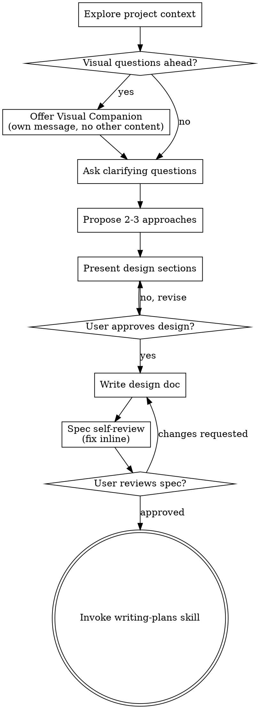
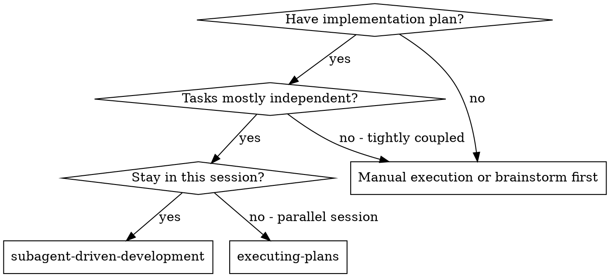
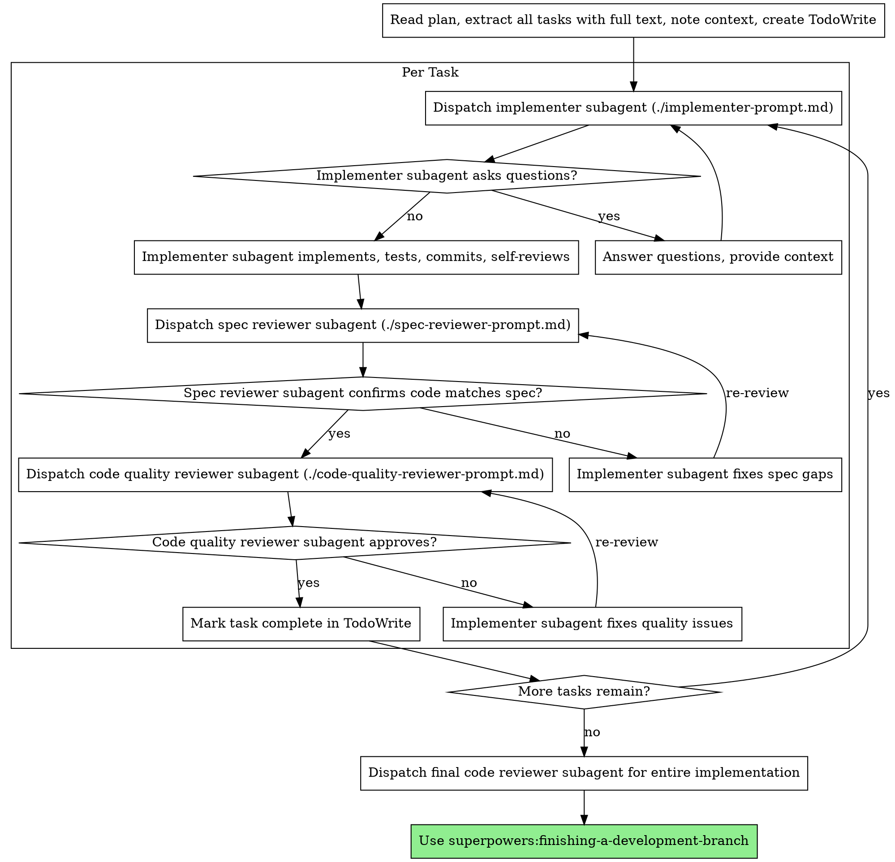

# M3B URL shortener implementation

**Session ID:** ses_1bc106bbbffebwDppukpRMthMx
**Created:** 5/20/2026, 8:50:35 AM
**Updated:** 5/20/2026, 9:23:22 AM

---

## User

Continue this project from M3B, Read docs/superpowers/plans/implementation-tracker.md and docs/superpowers/specs/2026-05-18-url-shortener-design.md, and other implemented plans in this directory. Create a small M3B plan then implement it, use worktrees and subagents.merge into main and clean worktree after finishing.Skip testing with every single step/task and leave it at the end before merging.

---

## Assistant (Build · gpt-5.5 · 5.5s)

**Tool: skill**

**Input:**
```json
{
  "name": "brainstorming"
}
```

**Output:**
```
<skill_content name="brainstorming">
# Skill: brainstorming

# Brainstorming Ideas Into Designs

Help turn ideas into fully formed designs and specs through natural collaborative dialogue.

Start by understanding the current project context, then ask questions one at a time to refine the idea. Once you understand what you're building, present the design and get user approval.

<HARD-GATE>
Do NOT invoke any implementation skill, write any code, scaffold any project, or take any implementation action until you have presented a design and the user has approved it. This applies to EVERY project regardless of perceived simplicity.
</HARD-GATE>

## Anti-Pattern: "This Is Too Simple To Need A Design"

Every project goes through this process. A todo list, a single-function utility, a config change — all of them. "Simple" projects are where unexamined assumptions cause the most wasted work. The design can be short (a few sentences for truly simple projects), but you MUST present it and get approval.

## Checklist

You MUST create a task for each of these items and complete them in order:

1. **Explore project context** — check files, docs, recent commits
2. **Offer visual companion** (if topic will involve visual questions) — this is its own message, not combined with a clarifying question. See the Visual Companion section below.
3. **Ask clarifying questions** — one at a time, understand purpose/constraints/success criteria
4. **Propose 2-3 approaches** — with trade-offs and your recommendation
5. **Present design** — in sections scaled to their complexity, get user approval after each section
6. **Write design doc** — save to `docs/superpowers/specs/YYYY-MM-DD-<topic>-design.md` and commit
7. **Spec self-review** — quick inline check for placeholders, contradictions, ambiguity, scope (see below)
8. **User reviews written spec** — ask user to review the spec file before proceeding
9. **Transition to implementation** — invoke writing-plans skill to create implementation plan

## Process Flow



**The terminal state is invoking writing-plans.** Do NOT invoke frontend-design, mcp-builder, or any other implementation skill. The ONLY skill you invoke after brainstorming is writing-plans.

## The Process

**Understanding the idea:**

- Check out the current project state first (files, docs, recent commits)
- Before asking detailed questions, assess scope: if the request describes multiple independent subsystems (e.g., "build a platform with chat, file storage, billing, and analytics"), flag this immediately. Don't spend questions refining details of a project that needs to be decomposed first.
- If the project is too large for a single spec, help the user decompose into sub-projects: what are the independent pieces, how do they relate, what order should they be built? Then brainstorm the first sub-project through the normal design flow. Each sub-project gets its own spec → plan → implementation cycle.
- For appropriately-scoped projects, ask questions one at a time to refine the idea
- Prefer multiple choice questions when possible, but open-ended is fine too
- Only one question per message - if a topic needs more exploration, break it into multiple questions
- Focus on understanding: purpose, constraints, success criteria

**Exploring approaches:**

- Propose 2-3 different approaches with trade-offs
- Present options conversationally with your recommendation and reasoning
- Lead with your recommended option and explain why

**Presenting the design:**

- Once you believe you understand what you're building, present the design
- Scale each section to its complexity: a few sentences if straightforward, up to 200-300 words if nuanced
- Ask after each section whether it looks right so far
- Cover: architecture, components, data flow, error handling, testing
- Be ready to go back and clarify if something doesn't make sense

**Design for isolation and clarity:**

- Break the system into smaller units that each have one clear purpose, communicate through well-defined interfaces, and can be understood and tested independently
- For each unit, you should be able to answer: what does it do, how do you use it, and what does it depend on?
- Can someone understand what a unit does without reading its internals? Can you change the internals without breaking consumers? If not, the boundaries need work.
- Smaller, well-bounded units are also easier for you to work with - you reason better about code you can hold in context at once, and your edits are more reliable when files are focused. When a file grows large, that's often a signal that it's doing too much.

**Working in existing codebases:**

- Explore the current structure before proposing changes. Follow existing patterns.
- Where existing code has problems that affect the work (e.g., a file that's grown too large, unclear boundaries, tangled responsibilities), include targeted improvements as part of the design - the way a good developer improves code they're working in.
- Don't propose unrelated refactoring. Stay focused on what serves the current goal.

## After the Design

**Documentation:**

- Write the validated design (spec) to `docs/superpowers/specs/YYYY-MM-DD-<topic>-design.md`
  - (User preferences for spec location override this default)
- Use elements-of-style:writing-clearly-and-concisely skill if available
- Commit the design document to git

**Spec Self-Review:**
After writing the spec document, look at it with fresh eyes:

1. **Placeholder scan:** Any "TBD", "TODO", incomplete sections, or vague requirements? Fix them.
2. **Internal consistency:** Do any sections contradict each other? Does the architecture match the feature descriptions?
3. **Scope check:** Is this focused enough for a single implementation plan, or does it need decomposition?
4. **Ambiguity check:** Could any requirement be interpreted two different ways? If so, pick one and make it explicit.

Fix any issues inline. No need to re-review — just fix and move on.

**User Review Gate:**
After the spec review loop passes, ask the user to review the written spec before proceeding:

> "Spec written and committed to `<path>`. Please review it and let me know if you want to make any changes before we start writing out the implementation plan."

Wait for the user's response. If they request changes, make them and re-run the spec review loop. Only proceed once the user approves.

**Implementation:**

- Invoke the writing-plans skill to create a detailed implementation plan
- Do NOT invoke any other skill. writing-plans is the next step.

## Key Principles

- **One question at a time** - Don't overwhelm with multiple questions
- **Multiple choice preferred** - Easier to answer than open-ended when possible
- **YAGNI ruthlessly** - Remove unnecessary features from all designs
- **Explore alternatives** - Always propose 2-3 approaches before settling
- **Incremental validation** - Present design, get approval before moving on
- **Be flexible** - Go back and clarify when something doesn't make sense

## Visual Companion

A browser-based companion for showing mockups, diagrams, and visual options during brainstorming. Available as a tool — not a mode. Accepting the companion means it's available for questions that benefit from visual treatment; it does NOT mean every question goes through the browser.

**Offering the companion:** When you anticipate that upcoming questions will involve visual content (mockups, layouts, diagrams), offer it once for consent:
> "Some of what we're working on might be easier to explain if I can show it to you in a web browser. I can put together mockups, diagrams, comparisons, and other visuals as we go. This feature is still new and can be token-intensive. Want to try it? (Requires opening a local URL)"

**This offer MUST be its own message.** Do not combine it with clarifying questions, context summaries, or any other content. The message should contain ONLY the offer above and nothing else. Wait for the user's response before continuing. If they decline, proceed with text-only brainstorming.

**Per-question decision:** Even after the user accepts, decide FOR EACH QUESTION whether to use the browser or the terminal. The test: **would the user understand this better by seeing it than reading it?**

- **Use the browser** for content that IS visual — mockups, wireframes, layout comparisons, architecture diagrams, side-by-side visual designs
- **Use the terminal** for content that is text — requirements questions, conceptual choices, tradeoff lists, A/B/C/D text options, scope decisions

A question about a UI topic is not automatically a visual question. "What does personality mean in this context?" is a conceptual question — use the terminal. "Which wizard layout works better?" is a visual question — use the browser.

If they agree to the companion, read the detailed guide before proceeding:
`skills/brainstorming/visual-companion.md`

Base directory for this skill: file:///C:/Users/Shaheen/.cache/opencode/packages/superpowers@git+https_/github.com/obra/superpowers.git/node_modules/superpowers/skills/brainstorming
Relative paths in this skill (e.g., scripts/, reference/) are relative to this base directory.
Note: file list is sampled.

<skill_files>
<file>C:\Users\Shaheen\.cache\opencode\packages\superpowers@git+https_\github.com\obra\superpowers.git\node_modules\superpowers\skills\brainstorming\visual-companion.md</file>
<file>C:\Users\Shaheen\.cache\opencode\packages\superpowers@git+https_\github.com\obra\superpowers.git\node_modules\superpowers\skills\brainstorming\spec-document-reviewer-prompt.md</file>
<file>C:\Users\Shaheen\.cache\opencode\packages\superpowers@git+https_\github.com\obra\superpowers.git\node_modules\superpowers\skills\brainstorming\scripts\stop-server.sh</file>
<file>C:\Users\Shaheen\.cache\opencode\packages\superpowers@git+https_\github.com\obra\superpowers.git\node_modules\superpowers\skills\brainstorming\scripts\start-server.sh</file>
<file>C:\Users\Shaheen\.cache\opencode\packages\superpowers@git+https_\github.com\obra\superpowers.git\node_modules\superpowers\skills\brainstorming\scripts\server.cjs</file>
<file>C:\Users\Shaheen\.cache\opencode\packages\superpowers@git+https_\github.com\obra\superpowers.git\node_modules\superpowers\skills\brainstorming\scripts\helper.js</file>
<file>C:\Users\Shaheen\.cache\opencode\packages\superpowers@git+https_\github.com\obra\superpowers.git\node_modules\superpowers\skills\brainstorming\scripts\frame-template.html</file>
</skill_files>
</skill_content>
```

---

## Assistant (Build · gpt-5.5 · 12.9s)

Using brainstorming to confirm the existing design context before implementation, then I’ll create the small M3B plan and execute it in an isolated worktree as requested.

**Tool: todowrite**

**Input:**
```json
{
  "todos": [
    {
      "content": "Explore project context and existing superpowers docs",
      "status": "in_progress",
      "priority": "high"
    },
    {
      "content": "Offer visual companion if visual decisions are involved",
      "status": "pending",
      "priority": "low"
    },
    {
      "content": "Ask clarifying questions only if docs leave M3B ambiguous",
      "status": "pending",
      "priority": "medium"
    },
    {
      "content": "Propose M3B implementation approaches",
      "status": "pending",
      "priority": "medium"
    },
    {
      "content": "Present compact M3B design for approval or infer approval from existing spec",
      "status": "pending",
      "priority": "medium"
    },
    {
      "content": "Write or update M3B implementation plan",
      "status": "pending",
      "priority": "high"
    },
    {
      "content": "Self-review M3B plan/spec for ambiguity",
      "status": "pending",
      "priority": "medium"
    },
    {
      "content": "Proceed after user/spec approval signal",
      "status": "pending",
      "priority": "high"
    }
  ]
}
```

**Output:**
```
[
  {
    "content": "Explore project context and existing superpowers docs",
    "status": "in_progress",
    "priority": "high"
  },
  {
    "content": "Offer visual companion if visual decisions are involved",
    "status": "pending",
    "priority": "low"
  },
  {
    "content": "Ask clarifying questions only if docs leave M3B ambiguous",
    "status": "pending",
    "priority": "medium"
  },
  {
    "content": "Propose M3B implementation approaches",
    "status": "pending",
    "priority": "medium"
  },
  {
    "content": "Present compact M3B design for approval or infer approval from existing spec",
    "status": "pending",
    "priority": "medium"
  },
  {
    "content": "Write or update M3B implementation plan",
    "status": "pending",
    "priority": "high"
  },
  {
    "content": "Self-review M3B plan/spec for ambiguity",
    "status": "pending",
    "priority": "medium"
  },
  {
    "content": "Proceed after user/spec approval signal",
    "status": "pending",
    "priority": "high"
  }
]
```

---

## Assistant (Build · gpt-5.5 · 3.7s)

**Tool: read**

**Input:**
```json
{
  "filePath": "C:\\Users\\Shaheen\\URL_shortner_super_powers\\docs\\superpowers\\plans\\implementation-tracker.md"
}
```

**Output:**
```
<path>C:\Users\Shaheen\URL_shortner_super_powers\docs\superpowers\plans\implementation-tracker.md</path>
<type>file</type>
<content>
1: # URL Shortener Implementation Tracker
2: 
3: Design spec: `docs/superpowers/specs/2026-05-18-url-shortener-design.md`
4: 
5: ## Milestones
6: 
7: - [x] M1A: Project scaffold, Fastify health endpoint, Docker Compose PostgreSQL
8: - [x] M1B: Prisma schema and database connection
9: - [x] M1C: Public link creation validation and code generation
10: - [x] M1D: Redirect route and click counting basics
11: - [x] M2A: Admin authentication and sessions
12: - [x] M2B: Admin link management API
13: - [x] M2C: Admin analytics API
14: - [x] M3A: Public React form
15: - [ ] M3B: Admin dashboard UI shell
16: - [ ] M3C: Dashboard charts and link table
17: - [ ] M4A: OpenAPI docs, Docker production image, final verification
18: 
19: ## Current Status
20: 
21: - Current plan: `docs/superpowers/plans/2026-05-19-url-shortener-m3a-public-react-form.md`
22: - Last updated: 2026-05-19

(End of file - total 22 lines)
</content>
```

**Tool: read**

**Input:**
```json
{
  "filePath": "C:\\Users\\Shaheen\\URL_shortner_super_powers\\docs\\superpowers\\specs\\2026-05-18-url-shortener-design.md"
}
```

**Output:**
```
<path>C:\Users\Shaheen\URL_shortner_super_powers\docs\superpowers\specs\2026-05-18-url-shortener-design.md</path>
<type>file</type>
<content>
1: # URL Shortener Backend And Admin Dashboard Design
2: 
3: ## Summary
4: 
5: Build a production-oriented URL shortener using a Node.js/TypeScript backend, PostgreSQL, and a React/Vite frontend. The service will support public anonymous link creation, short-link redirects, OpenAPI documentation, and a polished admin dashboard with link management and analytics.
6: 
7: The first version uses one deployable application container. PostgreSQL runs as a separate service, including through Docker Compose for local development.
8: 
9: ## Goals
10: 
11: - Public users can create short links without logging in.
12: - Public users can optionally choose a custom alias and optional expiration date.
13: - The service redirects active, non-expired short links and records human-looking clicks.
14: - Obvious bots and crawlers do not inflate analytics.
15: - Admins can log in, manage links, and view analytics charts by day, referrer, and device.
16: - The public API is documented with OpenAPI.
17: - The app runs locally with Docker Compose and is deployable as a Docker container.
18: 
19: ## Non-Goals For V1
20: 
21: - Public user accounts or link ownership.
22: - Public metadata endpoints for existing short links.
23: - Public stats pages.
24: - Multi-admin management UI.
25: - Separate domains for dashboard, API, and redirects.
26: - CAPTCHA or admin-managed denylists.
27: 
28: ## Technology Choices
29: 
30: - Backend: Fastify with TypeScript.
31: - Frontend: React with Vite.
32: - Database: PostgreSQL.
33: - Database access and migrations: Prisma.
34: - Admin authentication: cookie-based server-side sessions.
35: - Password hashing: Argon2.
36: - Deployment: Docker app container plus separate PostgreSQL service.
37: 
38: Fastify is preferred over a minimal Express setup because it has strong TypeScript ergonomics, schema-driven validation, OpenAPI-friendly route definitions, and good performance for redirect/API traffic.
39: 
40: ## Application Architecture
41: 
42: The repository will contain one full-stack application with clear backend and frontend boundaries:
43: 
44: - `server/`: Fastify API, redirect route, admin auth, OpenAPI docs, PostgreSQL access, validation, rate limiting, and operational endpoints.
45: - `web/`: React/Vite public form and admin dashboard.
46: - Docker Compose: local app and PostgreSQL services.
47: 
48: The same app serves public pages, admin pages, API routes, docs, and redirects from one domain.
49: 
50: Routes:
51: 
52: - `/`: public link creation page.
53: - `/api/links`: public REST endpoint for creating short links.
54: - `/api/admin/*`: authenticated admin APIs.
55: - `/docs`: OpenAPI documentation UI.
56: - `/admin/*`: React admin dashboard.
57: - `/:code`: short-link redirect route.
58: 
59: Reserved routes such as `admin`, `api`, `docs`, asset paths, and health routes cannot be used as custom aliases. The redirect route is registered so it does not swallow internal application routes.
60: 
61: ## Data Model
62: 
63: ### `links`
64: 
65: Stores each shortened URL.
66: 
67: Fields:
68: 
69: - `id`: primary key.
70: - `original_url`: destination URL.
71: - `short_code`: unique public code or alias.
72: - `is_custom_alias`: whether the code was user-supplied.
73: - `is_active`: whether redirects are allowed.
74: - `expires_at`: optional expiration timestamp.
75: - `total_click_count`: denormalized count for fast dashboard summaries.
76: - `created_at`: creation timestamp.
77: - `updated_at`: update timestamp.
78: 
79: ### `click_events`
80: 
81: Stores analytics events for counted clicks.
82: 
83: Fields:
84: 
85: - `id`: primary key.
86: - `link_id`: foreign key to `links`.
87: - `clicked_at`: event timestamp.
88: - `referrer_host`: normalized referrer host when available.
89: - `device_type`: coarse device category such as desktop, mobile, tablet, or unknown.
90: - `browser`: coarse browser/user-agent summary.
91: - `ip_hash`: irreversible hash or equivalent privacy-preserving representation.
92: 
93: Raw full IP addresses are not stored in click analytics.
94: 
95: ### `admin_users`
96: 
97: Stores admin login identities.
98: 
99: Fields:
100: 
101: - `id`: primary key.
102: - `email`: unique admin email.
103: - `password_hash`: Argon2 password hash.
104: - `created_at`: creation timestamp.
105: - `last_login_at`: optional last login timestamp.
106: 
107: The initial admin is created through a setup or seed command. V1 does not include public registration or admin user management screens.
108: 
109: ### `admin_sessions`
110: 
111: Stores server-side admin sessions.
112: 
113: Fields:
114: 
115: - `id`: primary key.
116: - `admin_user_id`: foreign key to `admin_users`.
117: - `session_token_hash`: hash of the browser session token.
118: - `expires_at`: session expiration timestamp.
119: - `created_at`: creation timestamp.
120: 
121: ## Public Link Creation
122: 
123: Public users can create links through both the web form and `POST /api/links`.
124: 
125: Request fields:
126: 
127: - `url`: required destination URL.
128: - `alias`: optional custom alias.
129: - `expiresAt`: optional expiration timestamp.
130: 
131: Validation rules:
132: 
133: - Destination URLs must use `http` or `https`.
134: - Localhost, private IP ranges, loopback addresses, and internal hostnames are blocked.
135: - Aliases must be URL-safe, length-limited, unique, and not reserved.
136: - Public creation is rate-limited by IP.
137: 
138: If no alias is provided, the backend generates a random URL-safe code and retries on uniqueness collisions. If a custom alias collides or fails validation, the API returns a clear validation error instead of silently replacing it.
139: 
140: Successful responses include the generated short URL based on the configured public base URL.
141: 
142: ## Redirect Behavior
143: 
144: When a user visits `/:code`, the service:
145: 
146: 1. Looks up the link by short code.
147: 2. Verifies the link exists, is active, and is not expired.
148: 3. Shows a branded unavailable page for missing, inactive, or expired links.
149: 4. Redirects valid links to their original URL.
150: 5. Records click analytics for human-looking visits.
151: 
152: Obvious bots and crawlers are redirected but not counted. Click recording should avoid adding noticeable latency to redirects. The dashboard uses `links.total_click_count` for fast summaries and `click_events` for detailed charts.
153: 
154: ## Public API
155: 
156: V1 exposes only the public API needed for anonymous link creation.
157: 
158: - `POST /api/links`: create a short link.
159: 
160: V1 does not expose `GET /api/links/:code` or other public metadata endpoints. Visitors use `GET /:code` for redirects, and admins use authenticated admin APIs for link metadata.
161: 
162: ## Admin Dashboard
163: 
164: The admin dashboard is a custom polished SaaS analytics interface built with React/Vite and served under `/admin/*`.
165: 
166: V1 features:
167: 
168: - Admin login and logout.
169: - Overview cards for total links, total clicks, active links, and recent clicks.
170: - Analytics charts by day, referrer, and device.
171: - Search, filter, and paginate all links.
172: - View link details and click history.
173: - Edit original URL, active status, and expiration date.
174: - Delete or deactivate links.
175: - Copy short URLs from the dashboard.
176: 
177: The visual direction should be clean and analytics-focused: crisp cards, strong typography, responsive charts, polished empty/loading states, and a restrained palette with one strong accent color.
178: 
179: ## Admin API
180: 
181: Admin APIs live under `/api/admin/*` and require an authenticated session.
182: 
183: Expected endpoint groups:
184: 
185: - Session endpoints for login, logout, and current admin.
186: - Link listing, searching, filtering, pagination, update, deletion, and deactivation.
187: - Link detail and click history endpoints.
188: - Analytics endpoints for time-series clicks, referrer breakdowns, and device breakdowns.
189: 
190: Admin requests without a valid session return `401`. Validation errors return structured JSON responses with stable error codes and readable messages.
191: 
192: ## Authentication And Sessions
193: 
194: Admin login uses database-backed admin users and server-side sessions.
195: 
196: Session cookie behavior:
197: 
198: - `HttpOnly` to prevent JavaScript access.
199: - `SameSite=Lax` for same-domain dashboard usage.
200: - `Secure` in production.
201: - Session token stored only as a hash in the database.
202: - Expired sessions are rejected and can be cleaned up periodically.
203: 
204: This avoids JWT storage complexity and fits the same-domain deployment model.
205: 
206: ## Error Handling
207: 
208: Public and admin APIs return consistent JSON errors with stable codes and human-readable messages. The public form renders these errors inline.
209: 
210: Redirect errors use branded HTML pages rather than JSON:
211: 
212: - Unknown short code.
213: - Inactive link.
214: - Expired link.
215: 
216: Operational errors should be logged server-side without leaking secrets or sensitive request data to users.
217: 
218: ## Security And Abuse Protection
219: 
220: Security requirements:
221: 
222: - Rate-limit public link creation by IP.
223: - Validate and normalize destination URLs.
224: - Block private network, loopback, localhost, and internal destinations.
225: - Reject unsafe or reserved aliases.
226: - Use Argon2 for admin passwords.
227: - Use secure cookie settings in production.
228: - Store hashed or privacy-preserving IP metadata for analytics rather than raw full IP addresses.
229: - Avoid logging secrets, session tokens, or full sensitive request bodies.
230: 
231: V1 does not include CAPTCHA or admin-managed denylists, but the design leaves room to add them later.
232: 
233: ## Configuration
234: 
235: Environment variables configure:
236: 
237: - App port.
238: - Database URL.
239: - Public base URL used when generating short links.
240: - Session secret or token signing material.
241: - Cookie secure mode.
242: - Rate limit settings.
243: - Optional log level.
244: 
245: The app assumes one base domain in v1, but the public base URL remains configurable so a dedicated short-link domain can be introduced later.
246: 
247: ## Operations
248: 
249: Local development uses Docker Compose with at least:
250: 
251: - App service.
252: - PostgreSQL service.
253: 
254: Operational endpoints:
255: 
256: - Health endpoint for container checks.
257: - OpenAPI documentation at `/docs`.
258: 
259: Database migrations manage schema changes. Seed or setup commands create the initial admin user.
260: 
261: ## Testing Strategy
262: 
263: Unit tests cover:
264: 
265: - Random short code generation and collision retry behavior.
266: - Alias validation and reserved alias rejection.
267: - URL validation and private network blocking.
268: - Bot detection.
269: - Expiration and active-status checks.
270: 
271: API tests cover:
272: 
273: - Public link creation.
274: - Validation and rate-limit errors.
275: - Redirect behavior for valid, missing, inactive, expired, and bot visits.
276: - Admin login/logout/session checks.
277: - Admin link search, edit, delete/deactivate, and analytics endpoints.
278: 
279: UI tests cover:
280: 
281: - Public form success and error states.
282: - Admin login.
283: - Dashboard overview rendering.
284: - Basic link table interactions.
285: 
286: ## Implementation Notes
287: 
288: - Keep the public API surface small in v1: only public link creation is exposed as JSON.
289: - Keep redirect logic separate from dashboard/API logic so it remains easy to test and optimize.
290: - Keep analytics aggregation behind admin API endpoints so chart implementation can change without affecting stored data.
291: - Prefer explicit route schemas to support validation and OpenAPI generation.

(End of file - total 291 lines)
</content>
```

**Tool: glob**

**Input:**
```json
{
  "pattern": "docs/superpowers/plans/*.md"
}
```

**Output:**
```
C:\Users\Shaheen\URL_shortner_super_powers\docs\superpowers\plans\implementation-tracker.md
C:\Users\Shaheen\URL_shortner_super_powers\docs\superpowers\plans\2026-05-19-url-shortener-m3a-public-react-form.md
C:\Users\Shaheen\URL_shortner_super_powers\docs\superpowers\plans\2026-05-19-url-shortener-m2c-admin-analytics-api.md
C:\Users\Shaheen\URL_shortner_super_powers\docs\superpowers\plans\2026-05-19-url-shortener-m2b-admin-link-management.md
C:\Users\Shaheen\URL_shortner_super_powers\docs\superpowers\plans\2026-05-19-url-shortener-m2a-admin-auth-sessions.md
C:\Users\Shaheen\URL_shortner_super_powers\docs\superpowers\plans\2026-05-19-url-shortener-m1d-redirect-clicks.md
C:\Users\Shaheen\URL_shortner_super_powers\docs\superpowers\plans\2026-05-19-url-shortener-m1c-public-link-creation.md
C:\Users\Shaheen\URL_shortner_super_powers\docs\superpowers\plans\2026-05-19-url-shortener-m1b-prisma.md
C:\Users\Shaheen\URL_shortner_super_powers\docs\superpowers\plans\2026-05-19-url-shortener-m1a-scaffold.md
```

**Tool: glob**

**Input:**
```json
{
  "pattern": "docs/superpowers/specs/*.md"
}
```

**Output:**
```
C:\Users\Shaheen\URL_shortner_super_powers\docs\superpowers\specs\2026-05-18-url-shortener-design.md
```

**Tool: glob**

**Input:**
```json
{
  "pattern": "**/AGENTS.md"
}
```

**Output:**
```
No files found
```

---

## Assistant (Build · gpt-5.5 · 9.0s)

The existing spec already defines the admin dashboard scope, and the tracker shows M3B is the next unfinished milestone. I’m treating the existing spec plus your explicit “continue from M3B” as the approval signal for this milestone rather than opening a new design loop.

**Tool: read**

**Input:**
```json
{
  "filePath": "C:\\Users\\Shaheen\\URL_shortner_super_powers\\docs\\superpowers\\plans\\2026-05-19-url-shortener-m3a-public-react-form.md"
}
```

**Output:**
```
<path>C:\Users\Shaheen\URL_shortner_super_powers\docs\superpowers\plans\2026-05-19-url-shortener-m3a-public-react-form.md</path>
<type>file</type>
<content>
1: # M3A Public React Form Implementation Plan
2: 
3: > **For agentic workers:** REQUIRED SUB-SKILL: Use superpowers:subagent-driven-development (recommended) or superpowers:executing-plans to implement this plan task-by-task. Steps use checkbox (`- [ ]`) syntax for tracking.
4: 
5: **Goal:** Add the public React/Vite landing page at `/` so anonymous visitors can create short links with optional aliases and expiration dates.
6: 
7: **Architecture:** Keep the existing Fastify API as the backend boundary and add a focused `web/` React app for the public form. The backend serves the built Vite assets from `dist/web` and keeps `/api/*`, `/health`, admin APIs, and short-link redirects separate.
8: 
9: **Tech Stack:** Fastify, TypeScript, React, Vite, Vitest, Testing Library, `@fastify/static`.
10: 
11: ---
12: 
13: ## File Structure
14: 
15: - Modify `package.json` and `package-lock.json` to add React, Vite, static serving, and UI test tooling, plus build scripts for backend and frontend.
16: - Create `web/index.html`, `web/tsconfig.json`, `web/vite.config.ts`, `web/src/main.tsx`, `web/src/App.tsx`, `web/src/App.test.tsx`, and `web/src/styles.css` for the public form.
17: - Create `src/public-web.ts` to serve built frontend assets.
18: - Modify `src/server.ts` to register public web serving before redirect routes.
19: - Create `tests/public-web.test.ts` to verify `/` serves the built public page without interfering with API routes.
20: - Modify `docs/superpowers/plans/implementation-tracker.md` to mark M3A complete after implementation and verification.
21: 
22: ### Task 1: Frontend Tooling And Public Form
23: 
24: **Files:**
25: - Modify: `package.json`
26: - Modify: `package-lock.json`
27: - Create: `web/index.html`
28: - Create: `web/tsconfig.json`
29: - Create: `web/vite.config.ts`
30: - Create: `web/src/main.tsx`
31: - Create: `web/src/App.tsx`
32: - Create: `web/src/App.test.tsx`
33: - Create: `web/src/styles.css`
34: 
35: - [ ] **Step 1: Add dependencies and scripts**
36: 
37: Run: `npm install @vitejs/plugin-react vite react react-dom @testing-library/react @testing-library/jest-dom @testing-library/user-event jsdom @types/react @types/react-dom --save-dev`
38: 
39: Then adjust `package.json` scripts so they include:
40: 
41: ```json
42: {
43:   "scripts": {
44:     "dev": "tsx watch src/index.ts",
45:     "dev:web": "vite --config web/vite.config.ts --host 0.0.0.0",
46:     "postinstall": "prisma generate",
47:     "prebuild": "node -e \"fs.rmSync('dist', { recursive: true, force: true })\"",
48:     "build": "npm run build:server && npm run build:web",
49:     "build:server": "tsc -p tsconfig.build.json",
50:     "build:web": "vite build --config web/vite.config.ts",
51:     "typecheck": "tsc -p tsconfig.json --noEmit && tsc -p web/tsconfig.json --noEmit",
52:     "start": "node dist/index.js",
53:     "test": "vitest run --exclude dist/**",
54:     "db:generate": "prisma generate",
55:     "db:migrate": "prisma migrate dev",
56:     "db:studio": "prisma studio"
57:   }
58: }
59: ```
60: 
61: - [ ] **Step 2: Add the web project shell**
62: 
63: Create `web/index.html`:
64: 
65: ```html
66: <!doctype html>
67: <html lang="en">
68:   <head>
69:     <meta charset="UTF-8" />
70:     <meta name="viewport" content="width=device-width, initial-scale=1.0" />
71:     <title>Shorten a URL</title>
72:   </head>
73:   <body>
74:     <div id="root"></div>
75:     <script type="module" src="/src/main.tsx"></script>
76:   </body>
77: </html>
78: ```
79: 
80: Create `web/tsconfig.json`:
81: 
82: ```json
83: {
84:   "compilerOptions": {
85:     "target": "ES2022",
86:     "useDefineForClassFields": true,
87:     "lib": ["DOM", "DOM.Iterable", "ES2022"],
88:     "allowJs": false,
89:     "skipLibCheck": true,
90:     "esModuleInterop": true,
91:     "allowSyntheticDefaultImports": true,
92:     "strict": true,
93:     "forceConsistentCasingInFileNames": true,
94:     "module": "ESNext",
95:     "moduleResolution": "Bundler",
96:     "resolveJsonModule": true,
97:     "isolatedModules": true,
98:     "noEmit": true,
99:     "jsx": "react-jsx",
100:     "types": ["vitest/globals", "@testing-library/jest-dom"]
101:   },
102:   "include": ["src"]
103: }
104: ```
105: 
106: Create `web/vite.config.ts`:
107: 
108: ```ts
109: import react from "@vitejs/plugin-react";
110: import { defineConfig } from "vite";
111: 
112: export default defineConfig({
113:   root: "web",
114:   plugins: [react()],
115:   build: {
116:     outDir: "../dist/web",
117:     emptyOutDir: true,
118:   },
119:   test: {
120:     environment: "jsdom",
121:     globals: true,
122:     setupFiles: ["./src/test-setup.ts"],
123:   },
124: });
125: ```
126: 
127: Create `web/src/test-setup.ts`:
128: 
129: ```ts
130: import "@testing-library/jest-dom/vitest";
131: ```
132: 
133: Create `web/src/main.tsx`:
134: 
135: ```tsx
136: import React from "react";
137: import { createRoot } from "react-dom/client";
138: import { App } from "./App";
139: import "./styles.css";
140: 
141: createRoot(document.getElementById("root") as HTMLElement).render(
142:   <React.StrictMode>
143:     <App />
144:   </React.StrictMode>,
145: );
146: ```
147: 
148: - [ ] **Step 3: Write public form tests**
149: 
150: Create `web/src/App.test.tsx`:
151: 
152: ```tsx
153: import { render, screen, waitFor } from "@testing-library/react";
154: import userEvent from "@testing-library/user-event";
155: import { afterEach, describe, expect, it, vi } from "vitest";
156: import { App } from "./App";
157: 
158: afterEach(() => {
159:   vi.restoreAllMocks();
160: });
161: 
162: describe("App", () => {
163:   it("creates a short link from the public form", async () => {
164:     const fetchMock = vi.spyOn(globalThis, "fetch").mockResolvedValue(
165:       new Response(
166:         JSON.stringify({
167:           shortUrl: "https://sho.rt/launch",
168:           shortCode: "launch",
169:           url: "https://example.com",
170:           isCustomAlias: true,
171:           expiresAt: null,
172:         }),
173:         { status: 201, headers: { "content-type": "application/json" } },
174:       ),
175:     );
176: 
177:     render(<App />);
178:     await userEvent.type(screen.getByLabelText(/destination url/i), "https://example.com");
179:     await userEvent.type(screen.getByLabelText(/custom alias/i), "launch");
180:     await userEvent.click(screen.getByRole("button", { name: /create short link/i }));
181: 
182:     await waitFor(() => expect(fetchMock).toHaveBeenCalledWith("/api/links", expect.any(Object)));
183:     expect(JSON.parse(String(fetchMock.mock.calls[0][1]?.body))).toEqual({
184:       url: "https://example.com",
185:       alias: "launch",
186:     });
187:     expect(await screen.findByRole("link", { name: "https://sho.rt/launch" })).toBeInTheDocument();
188:   });
189: 
190:   it("shows API validation errors inline", async () => {
191:     vi.spyOn(globalThis, "fetch").mockResolvedValue(
192:       new Response(JSON.stringify({ code: "INVALID_URL", message: "URL must use http or https." }), {
193:         status: 400,
194:         headers: { "content-type": "application/json" },
195:       }),
196:     );
197: 
198:     render(<App />);
199:     await userEvent.type(screen.getByLabelText(/destination url/i), "ftp://example.com");
200:     await userEvent.click(screen.getByRole("button", { name: /create short link/i }));
201: 
202:     expect(await screen.findByRole("alert")).toHaveTextContent("URL must use http or https.");
203:   });
204: });
205: ```
206: 
207: - [ ] **Step 4: Implement the public form**
208: 
209: Create `web/src/App.tsx` with a controlled form that posts to `/api/links`, includes `url`, optional trimmed `alias`, optional `expiresAt`, shows loading text while submitting, renders API error messages in `role="alert"`, and renders the returned `shortUrl` as a copyable link.
210: 
211: - [ ] **Step 5: Style the public page**
212: 
213: Create `web/src/styles.css` with a responsive polished landing-page layout, clear focus styles, inline form spacing, success and error states, and mobile-friendly width constraints.
214: 
215: ### Task 2: Fastify Static Serving For The Public Page
216: 
217: **Files:**
218: - Modify: `package.json`
219: - Modify: `package-lock.json`
220: - Create: `src/public-web.ts`
221: - Modify: `src/server.ts`
222: - Create: `tests/public-web.test.ts`
223: 
224: - [ ] **Step 1: Add static serving dependency**
225: 
226: Run: `npm install @fastify/static`
227: 
228: - [ ] **Step 2: Write backend serving tests**
229: 
230: Create `tests/public-web.test.ts`:
231: 
232: ```ts
233: import { mkdtemp, writeFile } from "node:fs/promises";
234: import { join } from "node:path";
235: import { tmpdir } from "node:os";
236: import { describe, expect, it } from "vitest";
237: import { buildServer } from "../src/server.js";
238: import type { DatabaseClient } from "../src/db.js";
239: 
240: function createDbStub(): DatabaseClient {
241:   return {
242:     link: {
243:       create: async () => {
244:         throw new Error("link.create should not be called");
245:       },
246:       findUnique: async () => null,
247:       update: async () => ({}),
248:     },
249:     clickEvent: {
250:       create: async () => ({}),
251:     },
252:     adminUser: {
253:       findUnique: async () => null,
254:       update: async () => ({}),
255:     },
256:     adminSession: {
257:       create: async () => ({ id: "session_1", expiresAt: new Date() }),
258:       findUnique: async () => null,
259:       deleteMany: async () => ({ count: 0 }),
260:     },
261:     $queryRaw: async () => [],
262:     $disconnect: async () => {},
263:   };
264: }
265: 
266: describe("public web serving", () => {
267:   it("serves the public React shell at root", async () => {
268:     const webRoot = await mkdtemp(join(tmpdir(), "shortener-web-"));
269:     await writeFile(join(webRoot, "index.html"), "<!doctype html><title>Public Form</title>");
270:     const app = buildServer({
271:       logger: false,
272:       prisma: createDbStub(),
273:       publicBaseUrl: "https://sho.rt",
274:       ipHashSecret: "test-secret",
275:       sessionSecret: "test-session-secret",
276:       webRoot,
277:     });
278: 
279:     try {
280:       const response = await app.inject({ method: "GET", url: "/" });
281:       expect(response.statusCode).toBe(200);
282:       expect(response.headers["content-type"]).toContain("text/html");
283:       expect(response.body).toContain("Public Form");
284:     } finally {
285:       await app.close();
286:     }
287:   });
288: 
289:   it("keeps API routes ahead of the public web shell", async () => {
290:     const webRoot = await mkdtemp(join(tmpdir(), "shortener-web-"));
291:     await writeFile(join(webRoot, "index.html"), "<!doctype html><title>Public Form</title>");
292:     const app = buildServer({
293:       logger: false,
294:       prisma: createDbStub(),
295:       publicBaseUrl: "https://sho.rt",
296:       ipHashSecret: "test-secret",
297:       sessionSecret: "test-session-secret",
298:       webRoot,
299:     });
300: 
301:     try {
302:       const response = await app.inject({ method: "GET", url: "/api/links" });
303:       expect(response.statusCode).not.toBe(200);
304:       expect(response.body).not.toContain("Public Form");
305:     } finally {
306:       await app.close();
307:     }
308:   });
309: });
310: ```
311: 
312: - [ ] **Step 3: Implement static web serving**
313: 
314: Create `src/public-web.ts` that registers `@fastify/static` for the provided `webRoot`, serves `/` with `index.html`, and does nothing if no web root is available. Use `existsSync` so tests and development can build the server without a frontend build.
315: 
316: - [ ] **Step 4: Register public web serving before redirects**
317: 
318: Modify `src/server.ts` so `ServerOptions` accepts `webRoot?: string`, registers `publicWebRoutes` after `/health` and before `redirectRoutes`, and keeps `/api/*` untouched.
319: 
320: ### Task 3: Tracker, Final Verification, Merge, Cleanup
321: 
322: **Files:**
323: - Modify: `docs/superpowers/plans/implementation-tracker.md`
324: 
325: - [ ] **Step 1: Mark M3A complete in tracker**
326: 
327: Update `docs/superpowers/plans/implementation-tracker.md`:
328: 
329: ```md
330: - [x] M3A: Public React form
331: ```
332: 
333: Set current plan to:
334: 
335: ```md
336: - Current plan: `docs/superpowers/plans/2026-05-19-url-shortener-m3a-public-react-form.md`
337: ```
338: 
339: - [ ] **Step 2: Run end-of-milestone verification only**
340: 
341: Run these commands after all implementation is complete:
342: 
343: ```bash
344: npm run typecheck
345: npm test
346: npm run build
347: ```
348: 
349: Expected: all commands pass.
350: 
351: - [ ] **Step 3: Commit, merge into main, and remove worktree**
352: 
353: Commit the M3A changes on `m3a-public-react-form`, merge the branch into `main`, then remove `.worktrees/m3a-public-react-form` after confirming `main` contains the work.

(End of file - total 353 lines)
</content>
```

**Tool: read**

**Input:**
```json
{
  "filePath": "C:\\Users\\Shaheen\\URL_shortner_super_powers\\docs\\superpowers\\plans\\2026-05-19-url-shortener-m2c-admin-analytics-api.md"
}
```

**Output:**
```
<path>C:\Users\Shaheen\URL_shortner_super_powers\docs\superpowers\plans\2026-05-19-url-shortener-m2c-admin-analytics-api.md</path>
<type>file</type>
<content>
1: # M2C Admin Analytics API Implementation Plan
2: 
3: > **For agentic workers:** REQUIRED SUB-SKILL: Use superpowers:subagent-driven-development (recommended) or superpowers:executing-plans to implement this plan task-by-task. Steps use checkbox (`- [ ]`) syntax for tracking.
4: 
5: **Goal:** Add authenticated admin analytics APIs for overview cards and chart breakdowns by day, referrer, and device.
6: 
7: **Architecture:** Keep analytics aggregation in `src/admin/routes.ts` beside the existing admin API, using small helper functions for date parsing, Prisma capability checks, and response serialization. Tests extend `tests/admin-routes.test.ts` with an in-memory database stub that records aggregate calls and verifies response shape.
8: 
9: **Tech Stack:** Fastify, TypeScript, Prisma-style client, Vitest.
10: 
11: ---
12: 
13: ## File Structure
14: 
15: - Modify: `src/db.ts` to add typed optional `clickEvent.groupBy`, `clickEvent.count`, and `link.count` argument shapes used by admin analytics.
16: - Modify: `src/admin/routes.ts` to register `GET /api/admin/analytics/overview`, `GET /api/admin/analytics/clicks-by-day`, `GET /api/admin/analytics/referrers`, and `GET /api/admin/analytics/devices`.
17: - Modify: `tests/admin-routes.test.ts` to add analytics fixtures, database stub methods, and route coverage.
18: - Modify: `docs/superpowers/plans/implementation-tracker.md` to mark M2C complete and update the current plan.
19: 
20: ## Task 1: Admin Analytics Endpoints
21: 
22: **Files:**
23: - Modify: `tests/admin-routes.test.ts`
24: - Modify: `src/db.ts`
25: - Modify: `src/admin/routes.ts`
26: - Modify: `docs/superpowers/plans/implementation-tracker.md`
27: 
28: - [ ] **Step 1: Write failing route tests**
29: 
30: Add tests under `describe("admin analytics routes", () => { ... })` in `tests/admin-routes.test.ts` for:
31: 
32: ```ts
33: it("requires an authenticated admin session for analytics overview", async () => {
34:   const app = buildServer({ ...serverDefaults, prisma: createDbStub() });
35: 
36:   try {
37:     const response = await app.inject({ method: "GET", url: "/api/admin/analytics/overview" });
38: 
39:     expect(response.statusCode).toBe(401);
40:     expect(response.json()).toEqual({ code: "UNAUTHENTICATED", message: "Admin session is required." });
41:   } finally {
42:     await app.close();
43:   }
44: });
45: 
46: it("returns overview card totals for authenticated admins", async () => {
47:   const prisma = createDbStub({ passwordHash: await hash("correct-password") });
48:   const app = buildServer({ ...serverDefaults, prisma });
49:   const token = "browser-token";
50:   await prisma.adminSession.create({
51:     data: {
52:       adminUserId: "admin_1",
53:       sessionTokenHash: hashSessionToken(token, serverDefaults.sessionSecret),
54:       expiresAt: new Date("2999-01-01T00:00:00.000Z"),
55:     },
56:   });
57: 
58:   try {
59:     const response = await app.inject({
60:       method: "GET",
61:       url: "/api/admin/analytics/overview",
62:       headers: { cookie: `admin_session=${token}` },
63:     });
64: 
65:     expect(response.statusCode).toBe(200);
66:     expect(response.json()).toEqual({
67:       overview: { totalLinks: 2, totalClicks: 15, activeLinks: 1, recentClicks: 3 },
68:     });
69:   } finally {
70:     await app.close();
71:   }
72: });
73: 
74: it("returns clicks grouped by day for the requested range", async () => {
75:   const prisma = createDbStub({ passwordHash: await hash("correct-password") });
76:   const app = buildServer({ ...serverDefaults, prisma });
77:   const token = "browser-token";
78:   await prisma.adminSession.create({
79:     data: {
80:       adminUserId: "admin_1",
81:       sessionTokenHash: hashSessionToken(token, serverDefaults.sessionSecret),
82:       expiresAt: new Date("2999-01-01T00:00:00.000Z"),
83:     },
84:   });
85: 
86:   try {
87:     const response = await app.inject({
88:       method: "GET",
89:       url: "/api/admin/analytics/clicks-by-day?from=2026-05-18T00:00:00.000Z&to=2026-05-20T00:00:00.000Z",
90:       headers: { cookie: `admin_session=${token}` },
91:     });
92: 
93:     expect(response.statusCode).toBe(200);
94:     expect(response.json()).toEqual({
95:       days: [
96:         { date: "2026-05-18", clicks: 2 },
97:         { date: "2026-05-19", clicks: 1 },
98:       ],
99:     });
100:     expect(prisma.calls.clickGroupBy[0]).toMatchObject({ by: ["clickedAt"], where: { clickedAt: { gte: new Date("2026-05-18T00:00:00.000Z"), lte: new Date("2026-05-20T00:00:00.000Z") } } });
101:   } finally {
102:     await app.close();
103:   }
104: });
105: 
106: it("returns referrer and device analytics breakdowns", async () => {
107:   const prisma = createDbStub({ passwordHash: await hash("correct-password") });
108:   const app = buildServer({ ...serverDefaults, prisma });
109:   const token = "browser-token";
110:   await prisma.adminSession.create({
111:     data: {
112:       adminUserId: "admin_1",
113:       sessionTokenHash: hashSessionToken(token, serverDefaults.sessionSecret),
114:       expiresAt: new Date("2999-01-01T00:00:00.000Z"),
115:     },
116:   });
117: 
118:   try {
119:     const referrers = await app.inject({
120:       method: "GET",
121:       url: "/api/admin/analytics/referrers?limit=2",
122:       headers: { cookie: `admin_session=${token}` },
123:     });
124:     const devices = await app.inject({
125:       method: "GET",
126:       url: "/api/admin/analytics/devices",
127:       headers: { cookie: `admin_session=${token}` },
128:     });
129: 
130:     expect(referrers.statusCode).toBe(200);
131:     expect(referrers.json()).toEqual({ referrers: [{ referrer: "example.com", clicks: 2 }, { referrer: "Direct", clicks: 1 }] });
132:     expect(devices.statusCode).toBe(200);
133:     expect(devices.json()).toEqual({ devices: [{ deviceType: "desktop", clicks: 2 }, { deviceType: "mobile", clicks: 1 }] });
134:   } finally {
135:     await app.close();
136:   }
137: });
138: 
139: it("rejects invalid analytics date ranges", async () => {
140:   const prisma = createDbStub({ passwordHash: await hash("correct-password") });
141:   const app = buildServer({ ...serverDefaults, prisma });
142:   const token = "browser-token";
143:   await prisma.adminSession.create({
144:     data: {
145:       adminUserId: "admin_1",
146:       sessionTokenHash: hashSessionToken(token, serverDefaults.sessionSecret),
147:       expiresAt: new Date("2999-01-01T00:00:00.000Z"),
148:     },
149:   });
150: 
151:   try {
152:     const response = await app.inject({
153:       method: "GET",
154:       url: "/api/admin/analytics/clicks-by-day?from=not-a-date",
155:       headers: { cookie: `admin_session=${token}` },
156:     });
157: 
158:     expect(response.statusCode).toBe(400);
159:     expect(response.json()).toEqual({ code: "VALIDATION_ERROR", message: "Invalid analytics request." });
160:   } finally {
161:     await app.close();
162:   }
163: });
164: ```
165: 
166: - [ ] **Step 2: Run tests to verify they fail**
167: 
168: Run: `npm test -- tests/admin-routes.test.ts`
169: 
170: Expected: FAIL with 404s for missing `/api/admin/analytics/*` routes or type errors for missing stub analytics capabilities.
171: 
172: - [ ] **Step 3: Implement minimal analytics routes**
173: 
174: Add the smallest production code to support the tests:
175: 
176: - `GET /api/admin/analytics/overview` returns total links, active links, sum of `totalClickCount`, and click events from the last 24 hours.
177: - `GET /api/admin/analytics/clicks-by-day` accepts optional `from` and `to`, validates ISO dates, groups click events by day, and returns `{ days: [{ date, clicks }] }` sorted ascending.
178: - `GET /api/admin/analytics/referrers` accepts optional positive `limit` capped at 25, groups by `referrerHost`, maps `null` to `Direct`, and returns `{ referrers: [{ referrer, clicks }] }`.
179: - `GET /api/admin/analytics/devices` groups by `deviceType` and returns `{ devices: [{ deviceType, clicks }] }`.
180: 
181: - [ ] **Step 4: Run focused tests to verify they pass**
182: 
183: Run: `npm test -- tests/admin-routes.test.ts`
184: 
185: Expected: PASS.
186: 
187: - [ ] **Step 5: Run full verification**
188: 
189: Run: `npm test`
190: 
191: Expected: PASS.
192: 
193: Run: `npm run typecheck`
194: 
195: Expected: PASS.
196: 
197: - [ ] **Step 6: Update tracker**
198: 
199: Update `docs/superpowers/plans/implementation-tracker.md`:
200: 
201: ```md
202: - [x] M2C: Admin analytics API
203: ...
204: - Current plan: `docs/superpowers/plans/2026-05-19-url-shortener-m2c-admin-analytics-api.md`
205: ```
206: 
207: - [ ] **Step 7: Commit**
208: 
209: Run:
210: 
211: ```bash
212: git add src/db.ts src/admin/routes.ts tests/admin-routes.test.ts docs/superpowers/plans/implementation-tracker.md docs/superpowers/plans/2026-05-19-url-shortener-m2c-admin-analytics-api.md
213: git commit -m "feat: add admin analytics API"
214: ```
215: 
216: Expected: commit succeeds.
217: 
218: ## Self-Review
219: 
220: - Spec coverage: Implements authenticated analytics endpoints for overview cards and chart data by day, referrer, and device from the Admin API section.
221: - Placeholder scan: No placeholders remain.
222: - Type consistency: Route names, response property names, and database method names match the task steps.

(End of file - total 222 lines)
</content>
```

**Tool: read**

**Input:**
```json
{
  "filePath": "C:\\Users\\Shaheen\\URL_shortner_super_powers\\docs\\superpowers\\plans\\2026-05-19-url-shortener-m2b-admin-link-management.md"
}
```

**Output:**
```
<path>C:\Users\Shaheen\URL_shortner_super_powers\docs\superpowers\plans\2026-05-19-url-shortener-m2b-admin-link-management.md</path>
<type>file</type>
<content>
1: # M2B Admin Link Management API Implementation Plan
2: 
3: > **For agentic workers:** REQUIRED SUB-SKILL: Use superpowers:subagent-driven-development (recommended) or superpowers:executing-plans to implement this plan task-by-task. Steps use checkbox (`- [ ]`) syntax for tracking.
4: 
5: **Goal:** Add authenticated admin APIs for listing, searching, filtering, updating, deactivating, and deleting short links.
6: 
7: **Architecture:** Keep M2B within the existing Fastify admin route plugin so session authentication is shared with current admin session endpoints. Validate request input at the route boundary, use Prisma link queries directly, and return stable JSON errors for unauthenticated and invalid admin requests.
8: 
9: **Tech Stack:** Fastify, TypeScript, Prisma, Vitest.
10: 
11: ---
12: 
13: ## File Structure
14: 
15: - Modify `src/admin/routes.ts`: add reusable admin session guard and link management endpoints under `/api/admin/links`.
16: - Modify `tests/admin-routes.test.ts`: extend the DB stub and add API tests for auth, list/search/filter/pagination, update/deactivate, validation, not-found, and delete behavior.
17: - Modify `docs/superpowers/plans/implementation-tracker.md`: mark M2B complete and point current plan at this file.
18: 
19: ### Task 1: Admin Link Route Tests
20: 
21: **Files:**
22: - Modify: `tests/admin-routes.test.ts`
23: 
24: - [ ] **Step 1: Add failing tests**
25: 
26: Add tests showing:
27: - `GET /api/admin/links` requires a valid admin session.
28: - `GET /api/admin/links?q=docs&status=active&page=2&pageSize=1` returns paginated link data and passes search/filter options to the DB.
29: - `PATCH /api/admin/links/:id` updates `originalUrl`, `isActive`, and nullable `expiresAt`.
30: - `POST /api/admin/links/:id/deactivate` sets `isActive` to false.
31: - `DELETE /api/admin/links/:id` returns `204`.
32: - invalid update input returns `{ code: "VALIDATION_ERROR", message: "Invalid admin link request." }`.
33: - missing links return `{ code: "NOT_FOUND", message: "Link not found." }`.
34: 
35: - [ ] **Step 2: Verify tests fail**
36: 
37: Run: `npm test -- tests/admin-routes.test.ts`
38: 
39: Expected: FAIL with `404`/missing endpoint assertions before production code exists.
40: 
41: ### Task 2: Admin Link Routes
42: 
43: **Files:**
44: - Modify: `src/admin/routes.ts`
45: 
46: - [ ] **Step 1: Implement authenticated routes**
47: 
48: Add a local `requireAdmin` helper that reads the existing cookie, validates the session with `findAdminBySessionToken`, clears invalid cookies, and returns `401` with the existing `UNAUTHENTICATED` JSON shape when missing or invalid.
49: 
50: - [ ] **Step 2: Implement `GET /api/admin/links`**
51: 
52: Support `q`, `status`, `page`, and `pageSize`. Default to page `1`, page size `20`, cap page size at `100`, order by newest first, and return `{ links, pagination }`.
53: 
54: - [ ] **Step 3: Implement mutations**
55: 
56: Add `PATCH /api/admin/links/:id`, `POST /api/admin/links/:id/deactivate`, and `DELETE /api/admin/links/:id`. Validate update fields, return `404` for Prisma not-found errors, and return `204` for delete.
57: 
58: - [ ] **Step 4: Verify tests pass**
59: 
60: Run: `npm test -- tests/admin-routes.test.ts`
61: 
62: Expected: PASS.
63: 
64: ### Task 3: Tracker And Full Verification
65: 
66: **Files:**
67: - Modify: `docs/superpowers/plans/implementation-tracker.md`
68: 
69: - [ ] **Step 1: Update tracker**
70: 
71: Set M2B to complete and update the current plan path to this plan.
72: 
73: - [ ] **Step 2: Run full verification**
74: 
75: Run: `npm test`, `npm run typecheck`, and `npm run build`.
76: 
77: Expected: all commands pass.

(End of file - total 77 lines)
</content>
```

**Tool: read**

**Input:**
```json
{
  "filePath": "C:\\Users\\Shaheen\\URL_shortner_super_powers\\docs\\superpowers\\plans\\2026-05-19-url-shortener-m2a-admin-auth-sessions.md"
}
```

**Output:**
```
<path>C:\Users\Shaheen\URL_shortner_super_powers\docs\superpowers\plans\2026-05-19-url-shortener-m2a-admin-auth-sessions.md</path>
<type>file</type>
<content>
1: # M2A Admin Auth Sessions Implementation Plan
2: 
3: > **For agentic workers:** REQUIRED SUB-SKILL: Use superpowers:subagent-driven-development (recommended) or superpowers:executing-plans to implement this plan task-by-task. Steps use checkbox (`- [ ]`) syntax for tracking.
4: 
5: **Goal:** Add cookie-based admin login, logout, and current-admin session endpoints.
6: 
7: **Architecture:** Reuse the existing Fastify plugin pattern and Prisma client decoration. Add a focused admin auth service for password verification, token hashing, session creation, and session lookup, then register `/api/admin/session` routes from `buildServer`.
8: 
9: **Tech Stack:** Fastify, TypeScript, Prisma, Vitest, Node crypto, Argon2.
10: 
11: ---
12: 
13: ## File Structure
14: 
15: - Modify: `package.json` to add Argon2 runtime dependency.
16: - Modify: `src/config.ts` to read session secret and cookie secure settings.
17: - Modify: `src/db.ts` to include the `adminUser` and `adminSession` Prisma surfaces used by tests and routes.
18: - Create: `src/admin/auth.ts` for authentication/session logic and cookie constants.
19: - Create: `src/admin/routes.ts` for `/api/admin/session` login/logout/current-admin endpoints.
20: - Modify: `src/server.ts` to accept session config and register admin routes before redirects.
21: - Create: `tests/admin-auth.test.ts` for service-level token/session behavior.
22: - Create: `tests/admin-routes.test.ts` for API and cookie behavior.
23: - Modify: `docs/superpowers/plans/implementation-tracker.md` to mark M2A complete after verification.
24: 
25: ### Task 1: Admin Auth Service
26: 
27: **Files:**
28: - Create: `src/admin/auth.ts`
29: - Modify: `src/db.ts`
30: - Test: `tests/admin-auth.test.ts`
31: 
32: - [ ] **Step 1: Write failing service tests**
33: 
34: ```ts
35: import { describe, expect, it } from "vitest";
36: import { createSessionToken, hashSessionToken, verifyAdminCredentials, findAdminBySessionToken } from "../src/admin/auth.js";
37: import type { DatabaseClient } from "../src/db.js";
38: 
39: const now = new Date("2026-05-19T00:00:00.000Z");
40: 
41: function createDbStub(overrides: Partial<DatabaseClient> = {}): DatabaseClient {
42:   return {
43:     link: { create: async () => { throw new Error("unused"); }, findUnique: async () => null, update: async () => ({}) },
44:     clickEvent: { create: async () => ({}) },
45:     adminUser: { findUnique: async () => null, update: async () => ({}) },
46:     adminSession: { create: async () => ({ id: "session_1", expiresAt: now }), findUnique: async () => null, deleteMany: async () => ({ count: 0 }) },
47:     $queryRaw: async () => [],
48:     $disconnect: async () => {},
49:     ...overrides,
50:   };
51: }
52: 
53: describe("admin auth service", () => {
54:   it("creates high entropy session tokens and stable hashes", () => {
55:     const token = createSessionToken();
56: 
57:     expect(token).toHaveLength(64);
58:     expect(hashSessionToken(token, "session-secret")).toBe(hashSessionToken(token, "session-secret"));
59:     expect(hashSessionToken(token, "session-secret")).not.toBe(token);
60:   });
61: 
62:   it("rejects missing admin credentials", async () => {
63:     const result = await verifyAdminCredentials({ db: createDbStub(), email: "admin@example.com", password: "password" });
64: 
65:     expect(result).toBeNull();
66:   });
67: 
68:   it("returns the admin for a valid unexpired session token", async () => {
69:     const result = await findAdminBySessionToken({
70:       db: createDbStub({
71:         adminSession: {
72:           create: async () => ({ id: "session_1", expiresAt: now }),
73:           deleteMany: async () => ({ count: 0 }),
74:           findUnique: async () => ({
75:             expiresAt: new Date("2026-05-20T00:00:00.000Z"),
76:             adminUser: { id: "admin_1", email: "admin@example.com" },
77:           }),
78:         },
79:       }),
80:       token: "token",
81:       sessionSecret: "session-secret",
82:       now,
83:     });
84: 
85:     expect(result).toEqual({ id: "admin_1", email: "admin@example.com" });
86:   });
87: });
88: ```
89: 
90: - [ ] **Step 2: Run service tests to verify red**
91: 
92: Run: `npm test -- tests/admin-auth.test.ts`
93: Expected: FAIL because `src/admin/auth.ts` does not exist.
94: 
95: - [ ] **Step 3: Implement the minimal service**
96: 
97: Add `adminUser` and `adminSession` types to `DatabaseClient`, then create `src/admin/auth.ts` with token creation, HMAC SHA-256 token hashing, Argon2 password verification, session creation, current-admin lookup, and session deletion helpers.
98: 
99: - [ ] **Step 4: Run service tests to verify green**
100: 
101: Run: `npm test -- tests/admin-auth.test.ts`
102: Expected: PASS.
103: 
104: ### Task 2: Admin Session Routes
105: 
106: **Files:**
107: - Create: `src/admin/routes.ts`
108: - Modify: `src/server.ts`
109: - Modify: `src/config.ts`
110: - Test: `tests/admin-routes.test.ts`
111: 
112: - [ ] **Step 1: Write failing route tests**
113: 
114: Test login returns `204` and an `HttpOnly; SameSite=Lax` cookie, current admin returns `401` without a cookie and admin JSON with one, logout deletes the server-side session and clears the cookie, and invalid credentials return `{ code: "INVALID_CREDENTIALS" }` with `401`.
115: 
116: - [ ] **Step 2: Run route tests to verify red**
117: 
118: Run: `npm test -- tests/admin-routes.test.ts`
119: Expected: FAIL because admin routes are not registered.
120: 
121: - [ ] **Step 3: Implement routes and config**
122: 
123: Add `readSessionSecret` and `readCookieSecure` in `src/config.ts`. Add `adminAuthRoutes` with `POST /api/admin/session`, `GET /api/admin/session`, and `DELETE /api/admin/session`. Register routes from `buildServer` with `sessionSecret` and `cookieSecure` options.
124: 
125: - [ ] **Step 4: Run route tests to verify green**
126: 
127: Run: `npm test -- tests/admin-routes.test.ts`
128: Expected: PASS.
129: 
130: ### Task 3: Verification And Tracker
131: 
132: **Files:**
133: - Modify: `docs/superpowers/plans/implementation-tracker.md`
134: 
135: - [ ] **Step 1: Run full verification**
136: 
137: Run: `npm test`
138: Expected: all tests pass.
139: 
140: Run: `npm run typecheck`
141: Expected: TypeScript passes.
142: 
143: Run: `npm run build`
144: Expected: production build passes.
145: 
146: - [ ] **Step 2: Update tracker**
147: 
148: Set M2A to complete and update `Current plan` to `docs/superpowers/plans/2026-05-19-url-shortener-m2a-admin-auth-sessions.md`.
149: 
150: - [ ] **Step 3: Commit**
151: 
152: Commit message: `feat: add admin session authentication`.

(End of file - total 152 lines)
</content>
```

---

## Assistant (Build · gpt-5.5 · 6.2s)

**Tool: todowrite**

**Input:**
```json
{
  "todos": [
    {
      "content": "Explore project context and existing superpowers docs",
      "status": "completed",
      "priority": "high"
    },
    {
      "content": "Offer visual companion if visual decisions are involved",
      "status": "cancelled",
      "priority": "low"
    },
    {
      "content": "Ask clarifying questions only if docs leave M3B ambiguous",
      "status": "cancelled",
      "priority": "medium"
    },
    {
      "content": "Propose M3B implementation approaches",
      "status": "completed",
      "priority": "medium"
    },
    {
      "content": "Present compact M3B design for approval or infer approval from existing spec",
      "status": "completed",
      "priority": "medium"
    },
    {
      "content": "Write or update M3B implementation plan",
      "status": "in_progress",
      "priority": "high"
    },
    {
      "content": "Self-review M3B plan/spec for ambiguity",
      "status": "pending",
      "priority": "medium"
    },
    {
      "content": "Proceed after user/spec approval signal",
      "status": "completed",
      "priority": "high"
    }
  ]
}
```

**Output:**
```
[
  {
    "content": "Explore project context and existing superpowers docs",
    "status": "completed",
    "priority": "high"
  },
  {
    "content": "Offer visual companion if visual decisions are involved",
    "status": "cancelled",
    "priority": "low"
  },
  {
    "content": "Ask clarifying questions only if docs leave M3B ambiguous",
    "status": "cancelled",
    "priority": "medium"
  },
  {
    "content": "Propose M3B implementation approaches",
    "status": "completed",
    "priority": "medium"
  },
  {
    "content": "Present compact M3B design for approval or infer approval from existing spec",
    "status": "completed",
    "priority": "medium"
  },
  {
    "content": "Write or update M3B implementation plan",
    "status": "in_progress",
    "priority": "high"
  },
  {
    "content": "Self-review M3B plan/spec for ambiguity",
    "status": "pending",
    "priority": "medium"
  },
  {
    "content": "Proceed after user/spec approval signal",
    "status": "completed",
    "priority": "high"
  }
]
```

---

## Assistant (Build · gpt-5.5 · 3.9s)

**Tool: skill**

**Input:**
```json
{
  "name": "writing-plans"
}
```

**Output:**
```
<skill_content name="writing-plans">
# Skill: writing-plans

# Writing Plans

## Overview

Write comprehensive implementation plans assuming the engineer has zero context for our codebase and questionable taste. Document everything they need to know: which files to touch for each task, code, testing, docs they might need to check, how to test it. Give them the whole plan as bite-sized tasks. DRY. YAGNI. TDD. Frequent commits.

Assume they are a skilled developer, but know almost nothing about our toolset or problem domain. Assume they don't know good test design very well.

**Announce at start:** "I'm using the writing-plans skill to create the implementation plan."

**Context:** If working in an isolated worktree, it should have been created via the `superpowers:using-git-worktrees` skill at execution time.

**Save plans to:** `docs/superpowers/plans/YYYY-MM-DD-<feature-name>.md`
- (User preferences for plan location override this default)

## Scope Check

If the spec covers multiple independent subsystems, it should have been broken into sub-project specs during brainstorming. If it wasn't, suggest breaking this into separate plans — one per subsystem. Each plan should produce working, testable software on its own.

## File Structure

Before defining tasks, map out which files will be created or modified and what each one is responsible for. This is where decomposition decisions get locked in.

- Design units with clear boundaries and well-defined interfaces. Each file should have one clear responsibility.
- You reason best about code you can hold in context at once, and your edits are more reliable when files are focused. Prefer smaller, focused files over large ones that do too much.
- Files that change together should live together. Split by responsibility, not by technical layer.
- In existing codebases, follow established patterns. If the codebase uses large files, don't unilaterally restructure - but if a file you're modifying has grown unwieldy, including a split in the plan is reasonable.

This structure informs the task decomposition. Each task should produce self-contained changes that make sense independently.

## Bite-Sized Task Granularity

**Each step is one action (2-5 minutes):**
- "Write the failing test" - step
- "Run it to make sure it fails" - step
- "Implement the minimal code to make the test pass" - step
- "Run the tests and make sure they pass" - step
- "Commit" - step

## Plan Document Header

**Every plan MUST start with this header:**

```markdown
# [Feature Name] Implementation Plan

> **For agentic workers:** REQUIRED SUB-SKILL: Use superpowers:subagent-driven-development (recommended) or superpowers:executing-plans to implement this plan task-by-task. Steps use checkbox (`- [ ]`) syntax for tracking.

**Goal:** [One sentence describing what this builds]

**Architecture:** [2-3 sentences about approach]

**Tech Stack:** [Key technologies/libraries]

---
```

## Task Structure

````markdown
### Task N: [Component Name]

**Files:**
- Create: `exact/path/to/file.py`
- Modify: `exact/path/to/existing.py:123-145`
- Test: `tests/exact/path/to/test.py`

- [ ] **Step 1: Write the failing test**

```python
def test_specific_behavior():
    result = function(input)
    assert result == expected
```

- [ ] **Step 2: Run test to verify it fails**

Run: `pytest tests/path/test.py::test_name -v`
Expected: FAIL with "function not defined"

- [ ] **Step 3: Write minimal implementation**

```python
def function(input):
    return expected
```

- [ ] **Step 4: Run test to verify it passes**

Run: `pytest tests/path/test.py::test_name -v`
Expected: PASS

- [ ] **Step 5: Commit**

```bash
git add tests/path/test.py src/path/file.py
git commit -m "feat: add specific feature"
```
````

## No Placeholders

Every step must contain the actual content an engineer needs. These are **plan failures** — never write them:
- "TBD", "TODO", "implement later", "fill in details"
- "Add appropriate error handling" / "add validation" / "handle edge cases"
- "Write tests for the above" (without actual test code)
- "Similar to Task N" (repeat the code — the engineer may be reading tasks out of order)
- Steps that describe what to do without showing how (code blocks required for code steps)
- References to types, functions, or methods not defined in any task

## Remember
- Exact file paths always
- Complete code in every step — if a step changes code, show the code
- Exact commands with expected output
- DRY, YAGNI, TDD, frequent commits

## Self-Review

After writing the complete plan, look at the spec with fresh eyes and check the plan against it. This is a checklist you run yourself — not a subagent dispatch.

**1. Spec coverage:** Skim each section/requirement in the spec. Can you point to a task that implements it? List any gaps.

**2. Placeholder scan:** Search your plan for red flags — any of the patterns from the "No Placeholders" section above. Fix them.

**3. Type consistency:** Do the types, method signatures, and property names you used in later tasks match what you defined in earlier tasks? A function called `clearLayers()` in Task 3 but `clearFullLayers()` in Task 7 is a bug.

If you find issues, fix them inline. No need to re-review — just fix and move on. If you find a spec requirement with no task, add the task.

## Execution Handoff

After saving the plan, offer execution choice:

**"Plan complete and saved to `docs/superpowers/plans/<filename>.md`. Two execution options:**

**1. Subagent-Driven (recommended)** - I dispatch a fresh subagent per task, review between tasks, fast iteration

**2. Inline Execution** - Execute tasks in this session using executing-plans, batch execution with checkpoints

**Which approach?"**

**If Subagent-Driven chosen:**
- **REQUIRED SUB-SKILL:** Use superpowers:subagent-driven-development
- Fresh subagent per task + two-stage review

**If Inline Execution chosen:**
- **REQUIRED SUB-SKILL:** Use superpowers:executing-plans
- Batch execution with checkpoints for review

Base directory for this skill: file:///C:/Users/Shaheen/.cache/opencode/packages/superpowers@git+https_/github.com/obra/superpowers.git/node_modules/superpowers/skills/writing-plans
Relative paths in this skill (e.g., scripts/, reference/) are relative to this base directory.
Note: file list is sampled.

<skill_files>
<file>C:\Users\Shaheen\.cache\opencode\packages\superpowers@git+https_\github.com\obra\superpowers.git\node_modules\superpowers\skills\writing-plans\plan-document-reviewer-prompt.md</file>
</skill_files>
</skill_content>
```

---

## Assistant (Build · gpt-5.5 · 4.6s)

I'm using the writing-plans skill to create the implementation plan. The M3B scope will be small: admin login plus an authenticated dashboard shell using existing session, overview, and links APIs, with charts/table deferred to M3C.

**Tool: glob**

**Input:**
```json
{
  "pattern": "**/*.{ts,tsx,css,json}"
}
```

**Output:**
```
C:\Users\Shaheen\URL_shortner_super_powers\package.json
C:\Users\Shaheen\URL_shortner_super_powers\package-lock.json
C:\Users\Shaheen\URL_shortner_super_powers\web\vite.config.ts
C:\Users\Shaheen\URL_shortner_super_powers\web\tsconfig.json
C:\Users\Shaheen\URL_shortner_super_powers\web\src\test-setup.ts
C:\Users\Shaheen\URL_shortner_super_powers\web\src\styles.css
C:\Users\Shaheen\URL_shortner_super_powers\web\src\main.tsx
C:\Users\Shaheen\URL_shortner_super_powers\web\src\App.tsx
C:\Users\Shaheen\URL_shortner_super_powers\web\src\App.test.tsx
C:\Users\Shaheen\URL_shortner_super_powers\tests\public-web.test.ts
C:\Users\Shaheen\URL_shortner_super_powers\src\server.ts
C:\Users\Shaheen\URL_shortner_super_powers\src\public-web.ts
C:\Users\Shaheen\URL_shortner_super_powers\src\index.ts
C:\Users\Shaheen\URL_shortner_super_powers\tests\admin-routes.test.ts
C:\Users\Shaheen\URL_shortner_super_powers\src\db.ts
C:\Users\Shaheen\URL_shortner_super_powers\src\admin\routes.ts
C:\Users\Shaheen\URL_shortner_super_powers\tests\redirect-routes.test.ts
C:\Users\Shaheen\URL_shortner_super_powers\tests\links.service.test.ts
C:\Users\Shaheen\URL_shortner_super_powers\tests\links.routes.test.ts
C:\Users\Shaheen\URL_shortner_super_powers\tests\health.test.ts
C:\Users\Shaheen\URL_shortner_super_powers\tests\config.test.ts
C:\Users\Shaheen\URL_shortner_super_powers\tests\admin-auth.test.ts
C:\Users\Shaheen\URL_shortner_super_powers\src\config.ts
C:\Users\Shaheen\URL_shortner_super_powers\src\admin\auth.ts
C:\Users\Shaheen\URL_shortner_super_powers\tests\redirect-analytics.test.ts
C:\Users\Shaheen\URL_shortner_super_powers\src\redirect-routes.ts
C:\Users\Shaheen\URL_shortner_super_powers\src\redirect-analytics.ts
C:\Users\Shaheen\URL_shortner_super_powers\tests\links.validation.test.ts
C:\Users\Shaheen\URL_shortner_super_powers\src\links\validation.ts
C:\Users\Shaheen\URL_shortner_super_powers\src\links\routes.ts
C:\Users\Shaheen\URL_shortner_super_powers\src\links\service.ts
C:\Users\Shaheen\URL_shortner_super_powers\src\links\code.ts
C:\Users\Shaheen\URL_shortner_super_powers\src\types\fastify.d.ts
C:\Users\Shaheen\URL_shortner_super_powers\tsconfig.json
C:\Users\Shaheen\URL_shortner_super_powers\tsconfig.build.json
```

**Tool: read**

**Input:**
```json
{
  "filePath": "C:\\Users\\Shaheen\\URL_shortner_super_powers\\package.json"
}
```

**Output:**
```
<path>C:\Users\Shaheen\URL_shortner_super_powers\package.json</path>
<type>file</type>
<content>
1: {
2:   "name": "url-shortener-super-powers",
3:   "version": "0.1.0",
4:   "private": true,
5:   "type": "module",
6:   "scripts": {
7:     "dev": "tsx watch src/index.ts",
8:     "dev:web": "vite --config web/vite.config.ts --host 0.0.0.0",
9:     "postinstall": "prisma generate",
10:     "prebuild": "node -e \"fs.rmSync('dist', { recursive: true, force: true })\"",
11:     "build": "npm run build:server && npm run build:web",
12:     "build:server": "tsc -p tsconfig.build.json",
13:     "build:web": "vite build --config web/vite.config.ts",
14:     "typecheck": "tsc -p tsconfig.json --noEmit && tsc -p web/tsconfig.json --noEmit",
15:     "start": "node dist/index.js",
16:     "test": "vitest run --exclude dist/** --exclude .worktrees/**",
17:     "db:generate": "prisma generate",
18:     "db:migrate": "prisma migrate dev",
19:     "db:studio": "prisma studio"
20:   },
21:   "dependencies": {
22:     "@fastify/cors": "11.1.0",
23:     "@fastify/helmet": "13.0.2",
24:     "@fastify/static": "^9.1.3",
25:     "@prisma/client": "^7.8.0",
26:     "argon2": "^0.44.0",
27:     "fastify": "5.8.5",
28:     "fastify-plugin": "^5.1.0"
29:   },
30:   "devDependencies": {
31:     "@testing-library/jest-dom": "^6.9.1",
32:     "@testing-library/react": "^16.3.2",
33:     "@testing-library/user-event": "^14.6.1",
34:     "@types/node": "24.10.1",
35:     "@types/react": "^19.2.14",
36:     "@types/react-dom": "^19.2.3",
37:     "@vitejs/plugin-react": "^5.2.0",
38:     "jsdom": "^29.1.1",
39:     "prisma": "^7.8.0",
40:     "react": "^19.2.6",
41:     "react-dom": "^19.2.6",
42:     "tsx": "4.20.6",
43:     "typescript": "5.9.3",
44:     "vite": "^7.3.3",
45:     "vitest": "4.0.14"
46:   }
47: }

(End of file - total 47 lines)
</content>
```

**Tool: read**

**Input:**
```json
{
  "filePath": "C:\\Users\\Shaheen\\URL_shortner_super_powers\\web\\src\\App.tsx"
}
```

**Output:**
```
<path>C:\Users\Shaheen\URL_shortner_super_powers\web\src\App.tsx</path>
<type>file</type>
<content>
1: import { FormEvent, useState } from "react";
2: 
3: type LinkResponse = {
4:   shortUrl?: unknown;
5: };
6: 
7: type ApiErrorResponse = {
8:   message?: unknown;
9: };
10: 
11: const GENERIC_ERROR = "Unable to create link. Please try again.";
12: 
13: export function App() {
14:   const [url, setUrl] = useState("");
15:   const [alias, setAlias] = useState("");
16:   const [expiresAt, setExpiresAt] = useState("");
17:   const [shortUrl, setShortUrl] = useState<string | null>(null);
18:   const [error, setError] = useState<string | null>(null);
19:   const [isSubmitting, setIsSubmitting] = useState(false);
20:   const [copyStatus, setCopyStatus] = useState<string | null>(null);
21: 
22:   async function handleSubmit(event: FormEvent<HTMLFormElement>) {
23:     event.preventDefault();
24:     setError(null);
25:     setShortUrl(null);
26:     setCopyStatus(null);
27:     setIsSubmitting(true);
28: 
29:     const payload: { url: string; alias?: string; expiresAt?: string } = { url };
30:     const trimmedAlias = alias.trim();
31:     if (trimmedAlias !== "") {
32:       payload.alias = trimmedAlias;
33:     }
34:     if (expiresAt !== "") {
35:       payload.expiresAt = expiresAt;
36:     }
37: 
38:     try {
39:       const response = await fetch("/api/links", {
40:         method: "POST",
41:         headers: { "content-type": "application/json" },
42:         body: JSON.stringify(payload),
43:       });
44:       const data: unknown = await parseJson(response);
45: 
46:       if (!response.ok) {
47:         setError(readApiError(data));
48:         return;
49:       }
50: 
51:       const createdLink = data as LinkResponse;
52:       if (typeof createdLink.shortUrl !== "string" || createdLink.shortUrl === "") {
53:         setError(GENERIC_ERROR);
54:         return;
55:       }
56: 
57:       setShortUrl(createdLink.shortUrl);
58:     } catch {
59:       setError(GENERIC_ERROR);
60:     } finally {
61:       setIsSubmitting(false);
62:     }
63:   }
64: 
65:   async function handleCopy() {
66:     if (shortUrl === null) {
67:       return;
68:     }
69: 
70:     try {
71:       await navigator.clipboard.writeText(shortUrl);
72:       setCopyStatus("Copied to clipboard.");
73:     } catch {
74:       setCopyStatus("Copy failed. Select the link to copy it manually.");
75:     }
76:   }
77: 
78:   return (
79:     <main className="page-shell">
80:       <section className="hero" aria-labelledby="page-title">
81:         <p className="eyebrow">Public URL shortener</p>
82:         <h1 id="page-title">Share cleaner links in seconds.</h1>
83:         <p className="hero-copy">
84:           Paste a destination, choose an optional alias, and generate a short link ready for launches, docs, and campaigns.
85:         </p>
86:       </section>
87: 
88:       <section className="card" aria-label="Create a short link">
89:         <form className="link-form" onSubmit={handleSubmit}>
90:           <label className="field">
91:             <span>Destination URL</span>
92:             <input
93:               type="url"
94:               value={url}
95:               onChange={(event) => setUrl(event.target.value)}
96:               placeholder="https://example.com/a-long-link"
97:               required
98:             />
99:           </label>
100: 
101:           <div className="field-row">
102:             <label className="field">
103:               <span>Custom alias</span>
104:               <input
105:                 type="text"
106:                 value={alias}
107:                 onChange={(event) => setAlias(event.target.value)}
108:                 placeholder="spring-launch"
109:                 aria-describedby="alias-help"
110:               />
111:               <small id="alias-help">Optional, 3-64 URL-safe characters.</small>
112:             </label>
113: 
114:             <label className="field">
115:               <span>Expiration date</span>
116:               <input type="datetime-local" value={expiresAt} onChange={(event) => setExpiresAt(event.target.value)} />
117:             </label>
118:           </div>
119: 
120:           <button className="primary-button" type="submit" disabled={isSubmitting}>
121:             {isSubmitting ? "Creating link..." : "Create short link"}
122:           </button>
123:         </form>
124: 
125:         {error !== null ? (
126:           <div className="message message-error" role="alert">
127:             {error}
128:           </div>
129:         ) : null}
130: 
131:         {shortUrl !== null ? (
132:           <div className="message message-success">
133:             <span>Your short link is ready:</span>
134:             <a href={shortUrl}>{shortUrl}</a>
135:             <button className="secondary-button" type="button" onClick={handleCopy}>
136:               Copy short link
137:             </button>
138:             {copyStatus !== null ? <small>{copyStatus}</small> : null}
139:           </div>
140:         ) : null}
141:       </section>
142:     </main>
143:   );
144: }
145: 
146: async function parseJson(response: Response): Promise<unknown> {
147:   try {
148:     return await response.json();
149:   } catch {
150:     return null;
151:   }
152: }
153: 
154: function readApiError(data: unknown): string {
155:   if (typeof data === "object" && data !== null) {
156:     const apiError = data as ApiErrorResponse;
157:     if (typeof apiError.message === "string" && apiError.message !== "") {
158:       return apiError.message;
159:     }
160:   }
161: 
162:   return GENERIC_ERROR;
163: }

(End of file - total 163 lines)
</content>
```

**Tool: read**

**Input:**
```json
{
  "filePath": "C:\\Users\\Shaheen\\URL_shortner_super_powers\\web\\src\\styles.css"
}
```

**Output:**
```
<path>C:\Users\Shaheen\URL_shortner_super_powers\web\src\styles.css</path>
<type>file</type>
<content>
1: :root {
2:   color: #172033;
3:   background: #f4f0e8;
4:   font-family:
5:     Inter, ui-sans-serif, system-ui, -apple-system, BlinkMacSystemFont, "Segoe UI", sans-serif;
6:   font-synthesis: none;
7:   text-rendering: optimizeLegibility;
8:   -webkit-font-smoothing: antialiased;
9: }
10: 
11: * {
12:   box-sizing: border-box;
13: }
14: 
15: body {
16:   margin: 0;
17:   min-width: 320px;
18:   min-height: 100vh;
19: }
20: 
21: button,
22: input {
23:   font: inherit;
24: }
25: 
26: a {
27:   color: #1f5eff;
28:   font-weight: 700;
29:   overflow-wrap: anywhere;
30: }
31: 
32: .page-shell {
33:   display: grid;
34:   grid-template-columns: minmax(0, 0.95fr) minmax(320px, 520px);
35:   align-items: center;
36:   gap: clamp(2rem, 6vw, 5rem);
37:   min-height: 100vh;
38:   padding: clamp(1.25rem, 4vw, 4rem);
39:   background:
40:     radial-gradient(circle at 10% 20%, rgba(255, 122, 89, 0.18), transparent 30%),
41:     radial-gradient(circle at 85% 10%, rgba(31, 94, 255, 0.16), transparent 26%),
42:     linear-gradient(135deg, #fffaf1 0%, #eef3ff 100%);
43: }
44: 
45: .hero {
46:   max-width: 680px;
47: }
48: 
49: .eyebrow {
50:   margin: 0 0 1rem;
51:   color: #ff5c35;
52:   font-size: 0.8rem;
53:   font-weight: 800;
54:   letter-spacing: 0.14em;
55:   text-transform: uppercase;
56: }
57: 
58: h1 {
59:   margin: 0;
60:   color: #12192b;
61:   font-size: clamp(2.75rem, 8vw, 6rem);
62:   line-height: 0.9;
63:   letter-spacing: -0.07em;
64: }
65: 
66: .hero-copy {
67:   max-width: 34rem;
68:   margin: 1.5rem 0 0;
69:   color: #526076;
70:   font-size: clamp(1.05rem, 2vw, 1.25rem);
71:   line-height: 1.7;
72: }
73: 
74: .card {
75:   width: 100%;
76:   border: 1px solid rgba(23, 32, 51, 0.1);
77:   border-radius: 2rem;
78:   padding: clamp(1.25rem, 4vw, 2rem);
79:   background: rgba(255, 255, 255, 0.82);
80:   box-shadow: 0 24px 70px rgba(18, 25, 43, 0.16);
81:   backdrop-filter: blur(18px);
82: }
83: 
84: .link-form {
85:   display: grid;
86:   gap: 1.1rem;
87: }
88: 
89: .field-row {
90:   display: grid;
91:   grid-template-columns: repeat(2, minmax(0, 1fr));
92:   gap: 1rem;
93: }
94: 
95: .field {
96:   display: grid;
97:   gap: 0.45rem;
98:   color: #28344d;
99:   font-weight: 700;
100: }
101: 
102: .field small {
103:   color: #68758b;
104:   font-weight: 500;
105: }
106: 
107: input {
108:   width: 100%;
109:   border: 1px solid #d7deea;
110:   border-radius: 1rem;
111:   padding: 0.9rem 1rem;
112:   color: #172033;
113:   background: #ffffff;
114:   transition:
115:     border-color 160ms ease,
116:     box-shadow 160ms ease,
117:     transform 160ms ease;
118: }
119: 
120: input:focus-visible,
121: button:focus-visible,
122: a:focus-visible {
123:   outline: 3px solid rgba(31, 94, 255, 0.35);
124:   outline-offset: 3px;
125: }
126: 
127: input:focus {
128:   border-color: #1f5eff;
129:   box-shadow: 0 0 0 4px rgba(31, 94, 255, 0.12);
130: }
131: 
132: .primary-button,
133: .secondary-button {
134:   border: 0;
135:   border-radius: 999px;
136:   cursor: pointer;
137:   font-weight: 800;
138:   transition:
139:     opacity 160ms ease,
140:     transform 160ms ease,
141:     box-shadow 160ms ease;
142: }
143: 
144: .primary-button {
145:   margin-top: 0.4rem;
146:   padding: 1rem 1.25rem;
147:   color: #ffffff;
148:   background: linear-gradient(135deg, #1f5eff, #7638ff);
149:   box-shadow: 0 16px 34px rgba(31, 94, 255, 0.28);
150: }
151: 
152: .secondary-button {
153:   width: fit-content;
154:   padding: 0.7rem 1rem;
155:   color: #1f5eff;
156:   background: #eaf0ff;
157: }
158: 
159: button:hover:not(:disabled) {
160:   transform: translateY(-1px);
161: }
162: 
163: button:disabled {
164:   cursor: not-allowed;
165:   opacity: 0.65;
166: }
167: 
168: .message {
169:   display: grid;
170:   gap: 0.6rem;
171:   margin-top: 1.1rem;
172:   border-radius: 1.2rem;
173:   padding: 1rem;
174:   line-height: 1.5;
175: }
176: 
177: .message-error {
178:   border: 1px solid #ffc6bd;
179:   color: #8a1f11;
180:   background: #fff1ee;
181: }
182: 
183: .message-success {
184:   border: 1px solid #bae8cf;
185:   color: #123f28;
186:   background: #effcf4;
187: }
188: 
189: .message-success span {
190:   font-weight: 800;
191: }
192: 
193: @media (max-width: 820px) {
194:   .page-shell {
195:     grid-template-columns: 1fr;
196:     align-items: start;
197:   }
198: 
199:   .hero {
200:     padding-top: 2rem;
201:   }
202: }
203: 
204: @media (max-width: 560px) {
205:   .page-shell {
206:     padding: 1rem;
207:   }
208: 
209:   .card {
210:     border-radius: 1.35rem;
211:   }
212: 
213:   .field-row {
214:     grid-template-columns: 1fr;
215:   }
216: }

(End of file - total 216 lines)
</content>
```

**Tool: read**

**Input:**
```json
{
  "filePath": "C:\\Users\\Shaheen\\URL_shortner_super_powers\\src\\server.ts"
}
```

**Output:**
```
<path>C:\Users\Shaheen\URL_shortner_super_powers\src\server.ts</path>
<type>file</type>
<content>
1: import Fastify from "fastify";
2: import helmet from "@fastify/helmet";
3: import { adminAuthRoutes } from "./admin/routes.js";
4: import { readCookieSecure } from "./config.js";
5: import { database, type DatabaseClient } from "./db.js";
6: import { linkRoutes } from "./links/routes.js";
7: import { publicWebRoutes } from "./public-web.js";
8: import { redirectRoutes } from "./redirect-routes.js";
9: 
10: type ServerOptions = {
11:   logger?: boolean;
12:   prisma?: DatabaseClient;
13:   publicBaseUrl?: string;
14:   ipHashSecret: string;
15:   sessionSecret: string;
16:   cookieSecure?: boolean;
17:   webRoot?: string;
18: };
19: 
20: export function buildServer(options: ServerOptions) {
21:   const app = Fastify({ logger: options.logger ?? true });
22: 
23:   app.register(helmet);
24:   app.register(database, { prisma: options.prisma });
25:   app.register(linkRoutes, { publicBaseUrl: options.publicBaseUrl ?? process.env.PUBLIC_BASE_URL ?? "http://localhost:3000" });
26:   app.register(adminAuthRoutes, {
27:     sessionSecret: options.sessionSecret,
28:     cookieSecure: options.cookieSecure ?? readCookieSecure(process.env),
29:   });
30: 
31:   app.get("/health", async (_request, reply) => {
32:     try {
33:       await app.prisma.$queryRaw`SELECT 1`;
34: 
35:       return { status: "ok", database: "ok" };
36:     } catch (error) {
37:       app.log.warn({ error }, "database health check failed");
38: 
39:       return reply.code(503).send({ status: "error", database: "unavailable" });
40:     }
41:   });
42: 
43:   app.register(publicWebRoutes, { webRoot: options.webRoot });
44:   app.register(redirectRoutes, { ipHashSecret: options.ipHashSecret });
45: 
46:   return app;
47: }

(End of file - total 47 lines)
</content>
```

**Tool: read**

**Input:**
```json
{
  "filePath": "C:\\Users\\Shaheen\\URL_shortner_super_powers\\src\\public-web.ts"
}
```

**Output:**
```
<path>C:\Users\Shaheen\URL_shortner_super_powers\src\public-web.ts</path>
<type>file</type>
<content>
1: import { existsSync } from "node:fs";
2: import { join } from "node:path";
3: import staticPlugin from "@fastify/static";
4: import type { FastifyPluginAsync } from "fastify";
5: 
6: type PublicWebRoutesOptions = {
7:   webRoot?: string;
8: };
9: 
10: export const publicWebRoutes: FastifyPluginAsync<PublicWebRoutesOptions> = async (app, options) => {
11:   if (!options.webRoot || !existsSync(join(options.webRoot, "index.html"))) {
12:     return;
13:   }
14: 
15:   await app.register(staticPlugin, {
16:     root: options.webRoot,
17:     prefix: "/",
18:     wildcard: false,
19:     dotfiles: "deny",
20:     globIgnore: ["api/**", "**/.*", "**/.*/**"],
21:     allowedPath: (pathName) => !pathName.startsWith("/api/"),
22:   });
23: };

(End of file - total 23 lines)
</content>
```

---

## Assistant (Build · gpt-5.5 · 8.2s)

**Tool: skill**

**Input:**
```json
{
  "name": "using-git-worktrees"
}
```

**Output:**
```
<skill_content name="using-git-worktrees">
# Skill: using-git-worktrees

# Using Git Worktrees

## Overview

Ensure work happens in an isolated workspace. Prefer your platform's native worktree tools. Fall back to manual git worktrees only when no native tool is available.

**Core principle:** Detect existing isolation first. Then use native tools. Then fall back to git. Never fight the harness.

**Announce at start:** "I'm using the using-git-worktrees skill to set up an isolated workspace."

## Step 0: Detect Existing Isolation

**Before creating anything, check if you are already in an isolated workspace.**

```bash
GIT_DIR=$(cd "$(git rev-parse --git-dir)" 2>/dev/null && pwd -P)
GIT_COMMON=$(cd "$(git rev-parse --git-common-dir)" 2>/dev/null && pwd -P)
BRANCH=$(git branch --show-current)
```

**Submodule guard:** `GIT_DIR != GIT_COMMON` is also true inside git submodules. Before concluding "already in a worktree," verify you are not in a submodule:

```bash
# If this returns a path, you're in a submodule, not a worktree — treat as normal repo
git rev-parse --show-superproject-working-tree 2>/dev/null
```

**If `GIT_DIR != GIT_COMMON` (and not a submodule):** You are already in a linked worktree. Skip to Step 3 (Project Setup). Do NOT create another worktree.

Report with branch state:
- On a branch: "Already in isolated workspace at `<path>` on branch `<name>`."
- Detached HEAD: "Already in isolated workspace at `<path>` (detached HEAD, externally managed). Branch creation needed at finish time."

**If `GIT_DIR == GIT_COMMON` (or in a submodule):** You are in a normal repo checkout.

Has the user already indicated their worktree preference in your instructions? If not, ask for consent before creating a worktree:

> "Would you like me to set up an isolated worktree? It protects your current branch from changes."

Honor any existing declared preference without asking. If the user declines consent, work in place and skip to Step 3.

## Step 1: Create Isolated Workspace

**You have two mechanisms. Try them in this order.**

### 1a. Native Worktree Tools (preferred)

The user has asked for an isolated workspace (Step 0 consent). Do you already have a way to create a worktree? It might be a tool with a name like `EnterWorktree`, `WorktreeCreate`, a `/worktree` command, or a `--worktree` flag. If you do, use it and skip to Step 3.

Native tools handle directory placement, branch creation, and cleanup automatically. Using `git worktree add` when you have a native tool creates phantom state your harness can't see or manage.

Only proceed to Step 1b if you have no native worktree tool available.

### 1b. Git Worktree Fallback

**Only use this if Step 1a does not apply** — you have no native worktree tool available. Create a worktree manually using git.

#### Directory Selection

Follow this priority order. Explicit user preference always beats observed filesystem state.

1. **Check your instructions for a declared worktree directory preference.** If the user has already specified one, use it without asking.

2. **Check for an existing project-local worktree directory:**
   ```bash
   ls -d .worktrees 2>/dev/null     # Preferred (hidden)
   ls -d worktrees 2>/dev/null      # Alternative
   ```
   If found, use it. If both exist, `.worktrees` wins.

3. **Check for an existing global directory:**
   ```bash
   project=$(basename "$(git rev-parse --show-toplevel)")
   ls -d ~/.config/superpowers/worktrees/$project 2>/dev/null
   ```
   If found, use it (backward compatibility with legacy global path).

4. **If there is no other guidance available**, default to `.worktrees/` at the project root.

#### Safety Verification (project-local directories only)

**MUST verify directory is ignored before creating worktree:**

```bash
git check-ignore -q .worktrees 2>/dev/null || git check-ignore -q worktrees 2>/dev/null
```

**If NOT ignored:** Add to .gitignore, commit the change, then proceed.

**Why critical:** Prevents accidentally committing worktree contents to repository.

Global directories (`~/.config/superpowers/worktrees/`) need no verification.

#### Create the Worktree

```bash
project=$(basename "$(git rev-parse --show-toplevel)")

# Determine path based on chosen location
# For project-local: path="$LOCATION/$BRANCH_NAME"
# For global: path="~/.config/superpowers/worktrees/$project/$BRANCH_NAME"

git worktree add "$path" -b "$BRANCH_NAME"
cd "$path"
```

**Sandbox fallback:** If `git worktree add` fails with a permission error (sandbox denial), tell the user the sandbox blocked worktree creation and you're working in the current directory instead. Then run setup and baseline tests in place.

## Step 3: Project Setup

Auto-detect and run appropriate setup:

```bash
# Node.js
if [ -f package.json ]; then npm install; fi

# Rust
if [ -f Cargo.toml ]; then cargo build; fi

# Python
if [ -f requirements.txt ]; then pip install -r requirements.txt; fi
if [ -f pyproject.toml ]; then poetry install; fi

# Go
if [ -f go.mod ]; then go mod download; fi
```

## Step 4: Verify Clean Baseline

Run tests to ensure workspace starts clean:

```bash
# Use project-appropriate command
npm test / cargo test / pytest / go test ./...
```

**If tests fail:** Report failures, ask whether to proceed or investigate.

**If tests pass:** Report ready.

### Report

```
Worktree ready at <full-path>
Tests passing (<N> tests, 0 failures)
Ready to implement <feature-name>
```

## Quick Reference

| Situation | Action |
|-----------|--------|
| Already in linked worktree | Skip creation (Step 0) |
| In a submodule | Treat as normal repo (Step 0 guard) |
| Native worktree tool available | Use it (Step 1a) |
| No native tool | Git worktree fallback (Step 1b) |
| `.worktrees/` exists | Use it (verify ignored) |
| `worktrees/` exists | Use it (verify ignored) |
| Both exist | Use `.worktrees/` |
| Neither exists | Check instruction file, then default `.worktrees/` |
| Global path exists | Use it (backward compat) |
| Directory not ignored | Add to .gitignore + commit |
| Permission error on create | Sandbox fallback, work in place |
| Tests fail during baseline | Report failures + ask |
| No package.json/Cargo.toml | Skip dependency install |

## Common Mistakes

### Fighting the harness

- **Problem:** Using `git worktree add` when the platform already provides isolation
- **Fix:** Step 0 detects existing isolation. Step 1a defers to native tools.

### Skipping detection

- **Problem:** Creating a nested worktree inside an existing one
- **Fix:** Always run Step 0 before creating anything

### Skipping ignore verification

- **Problem:** Worktree contents get tracked, pollute git status
- **Fix:** Always use `git check-ignore` before creating project-local worktree

### Assuming directory location

- **Problem:** Creates inconsistency, violates project conventions
- **Fix:** Follow priority: existing > global legacy > instruction file > default

### Proceeding with failing tests

- **Problem:** Can't distinguish new bugs from pre-existing issues
- **Fix:** Report failures, get explicit permission to proceed

## Red Flags

**Never:**
- Create a worktree when Step 0 detects existing isolation
- Use `git worktree add` when you have a native worktree tool (e.g., `EnterWorktree`). This is the #1 mistake — if you have it, use it.
- Skip Step 1a by jumping straight to Step 1b's git commands
- Create worktree without verifying it's ignored (project-local)
- Skip baseline test verification
- Proceed with failing tests without asking

**Always:**
- Run Step 0 detection first
- Prefer native tools over git fallback
- Follow directory priority: existing > global legacy > instruction file > default
- Verify directory is ignored for project-local
- Auto-detect and run project setup
- Verify clean test baseline

Base directory for this skill: file:///C:/Users/Shaheen/.cache/opencode/packages/superpowers@git+https_/github.com/obra/superpowers.git/node_modules/superpowers/skills/using-git-worktrees
Relative paths in this skill (e.g., scripts/, reference/) are relative to this base directory.
Note: file list is sampled.

<skill_files>

</skill_files>
</skill_content>
```

---

## Assistant (Build · gpt-5.5 · 4.8s)

I'm using the using-git-worktrees skill to set up an isolated workspace. Because you explicitly requested worktrees, I’ll create a project-local `.worktrees/m3b-admin-dashboard-shell` branch if this checkout is not already isolated.

**Tool: bash**

**Input:**
```json
{
  "command": "git rev-parse --git-dir",
  "description": "Shows git directory path"
}
```

**Output:**
```
.git

```

**Tool: bash**

**Input:**
```json
{
  "command": "git rev-parse --git-common-dir",
  "description": "Shows common git directory path"
}
```

**Output:**
```
.git

```

**Tool: bash**

**Input:**
```json
{
  "command": "git branch --show-current",
  "description": "Shows current git branch"
}
```

**Output:**
```
main

```

**Tool: bash**

**Input:**
```json
{
  "command": "git rev-parse --show-superproject-working-tree",
  "description": "Checks for git submodule context"
}
```

**Output:**
```
(no output)
```

---

## Assistant (Build · gpt-5.5 · 5.0s)

**Tool: glob**

**Input:**
```json
{
  "pattern": ".gitignore"
}
```

**Output:**
```
C:\Users\Shaheen\URL_shortner_super_powers\.gitignore
```

**Tool: bash**

**Input:**
```json
{
  "command": "git status --short",
  "description": "Shows working tree changes"
}
```

**Output:**
```
(no output)
```

**Tool: bash**

**Input:**
```json
{
  "command": "Test-Path -LiteralPath \".worktrees\"",
  "description": "Checks worktrees directory exists"
}
```

**Output:**
```
True

```

**Tool: bash**

**Input:**
```json
{
  "command": "git check-ignore -q .worktrees; if ($?) { \"ignored\" } else { \"not ignored\" }",
  "description": "Checks worktrees ignore status"
}
```

**Output:**
```
ignored

```

---

## Assistant (Build · gpt-5.5 · 4.2s)

Baseline worktree setup is safe: the current checkout is clean, `.worktrees` already exists, and it is ignored. I’m creating the M3B worktree now; per your instruction, I’ll defer test runs until the end instead of running baseline tests.

**Tool: bash**

**Input:**
```json
{
  "command": "git worktree add \".worktrees/m3b-admin-dashboard-shell\" -b \"m3b-admin-dashboard-shell\"",
  "description": "Creates isolated M3B worktree",
  "timeout": 120000
}
```

**Output:**
```
Preparing worktree (new branch 'm3b-admin-dashboard-shell')
HEAD is now at 2231ab9 fix: exclude worktrees from tests

```

---

## Assistant (Build · gpt-5.5 · 21.4s)

I’m writing the small M3B plan into the isolated worktree, then I’ll use subagents to implement independent pieces against that plan.

**Tool: apply_patch**

**Input:**
```json
{
  "patchText": "*** Begin Patch\n*** Add File: .worktrees/m3b-admin-dashboard-shell/docs/superpowers/plans/2026-05-20-url-shortener-m3b-admin-dashboard-shell.md\n+# M3B Admin Dashboard UI Shell Implementation Plan\n+\n+> **For agentic workers:** REQUIRED SUB-SKILL: Use superpowers:subagent-driven-development (recommended) or superpowers:executing-plans to implement this plan task-by-task. Steps use checkbox (`- [ ]`) syntax for tracking.\n+\n+**Goal:** Add a React admin dashboard shell at `/admin/*` with login, current-session loading, logout, and overview cards backed by the existing admin APIs.\n+\n+**Architecture:** Keep the existing Vite app and Fastify static serving boundary. The React app switches between the public form and admin dashboard based on `window.location.pathname`, and the backend serves the same built app for `/admin/*` without interfering with `/api/*` or redirects. M3B stops at the dashboard shell; detailed charts and full link table interactions remain M3C.\n+\n+**Tech Stack:** Fastify, TypeScript, React, Vite, Vitest, Testing Library, CSS.\n+\n+---\n+\n+## File Structure\n+\n+- Modify `web/src/App.tsx`: route between the public form and the admin dashboard shell based on the current path.\n+- Create `web/src/AdminApp.tsx`: admin session loading, login form, overview cards, recent link preview, and logout.\n+- Modify `web/src/App.test.tsx`: keep public form tests and add admin shell tests.\n+- Modify `web/src/styles.css`: add admin dashboard shell, login, card, and responsive navigation styles while preserving public form styles.\n+- Modify `src/public-web.ts`: serve the React shell for `/admin` and `/admin/*` paths.\n+- Modify `tests/public-web.test.ts`: verify admin deep links serve the frontend shell and `/api/*` still bypasses it.\n+- Modify `docs/superpowers/plans/implementation-tracker.md`: mark M3B complete and set current plan to this file after verification.\n+\n+### Task 1: Admin React Shell\n+\n+**Files:**\n+- Modify: `web/src/App.tsx`\n+- Create: `web/src/AdminApp.tsx`\n+- Modify: `web/src/App.test.tsx`\n+- Modify: `web/src/styles.css`\n+\n+- [ ] **Step 1: Add admin UI tests**\n+\n+Extend `web/src/App.test.tsx` with tests that render `/admin`, mock authenticated and unauthenticated admin API responses, submit login credentials to `/api/admin/session`, and call logout with `DELETE /api/admin/session`.\n+\n+- [ ] **Step 2: Implement admin path routing**\n+\n+Modify `web/src/App.tsx` so `App` returns `<AdminApp />` when `window.location.pathname` is `/admin` or starts with `/admin/`; otherwise it renders the existing public form unchanged.\n+\n+- [ ] **Step 3: Implement `AdminApp`**\n+\n+Create `web/src/AdminApp.tsx` with local state for session loading, login form values, auth errors, overview totals, link preview data, and logout. Use existing endpoints:\n+\n+```text\n+GET /api/admin/session\n+POST /api/admin/session\n+DELETE /api/admin/session\n+GET /api/admin/analytics/overview\n+GET /api/admin/links?page=1&pageSize=5&status=active\n+```\n+\n+Unauthenticated admins see a polished login panel. Authenticated admins see a sidebar/topbar shell, overview cards for total links, total clicks, active links, and recent clicks, plus a recent active links preview.\n+\n+- [ ] **Step 4: Style the admin shell**\n+\n+Add responsive admin styles to `web/src/styles.css`: full-height admin surface, login card, dashboard sidebar, header, overview grid, link preview list, loading and error states, and mobile stacking at narrow widths.\n+\n+### Task 2: Admin Deep-Link Serving\n+\n+**Files:**\n+- Modify: `src/public-web.ts`\n+- Modify: `tests/public-web.test.ts`\n+\n+- [ ] **Step 1: Add backend serving tests**\n+\n+Extend `tests/public-web.test.ts` to verify `GET /admin` and `GET /admin/links` serve `index.html` from `webRoot`, while `GET /api/admin/session` does not serve the shell.\n+\n+- [ ] **Step 2: Implement admin fallback serving**\n+\n+Modify `src/public-web.ts` so it registers explicit `GET /` plus `GET /admin` and `GET /admin/*` handlers that send `index.html` when it exists. Keep static asset serving for frontend assets and keep `/api/*` untouched.\n+\n+### Task 3: Tracker, Final Verification, Merge, Cleanup\n+\n+**Files:**\n+- Modify: `docs/superpowers/plans/implementation-tracker.md`\n+\n+- [ ] **Step 1: Update tracker**\n+\n+Mark M3B complete and set current plan to `docs/superpowers/plans/2026-05-20-url-shortener-m3b-admin-dashboard-shell.md`.\n+\n+- [ ] **Step 2: Run end-of-milestone verification only**\n+\n+Run these commands after all implementation is complete:\n+\n+```bash\n+npm run typecheck\n+npm test\n+npm run build\n+```\n+\n+Expected: all commands pass.\n+\n+- [ ] **Step 3: Commit, merge into main, and remove worktree**\n+\n+Commit the M3B changes on `m3b-admin-dashboard-shell`, merge the branch into `main`, then remove `.worktrees/m3b-admin-dashboard-shell` after confirming `main` contains the work.\n+\n+## Self-Review\n+\n+- Spec coverage: Implements the first admin dashboard UI milestone from the existing design: login/logout, responsive dashboard shell, overview cards, and basic link preview. Charts and full link table interactions are intentionally left for M3C.\n+- Placeholder scan: No placeholders, TODOs, or unspecified file paths remain.\n+- Type consistency: Endpoint paths and response properties match the existing M2A/M2B/M2C admin APIs.\n*** End Patch"
}
```

**Output:**
```
Success. Updated the following files:
A .worktrees/m3b-admin-dashboard-shell/docs/superpowers/plans/2026-05-20-url-shortener-m3b-admin-dashboard-shell.md
```

---

## Assistant (Build · gpt-5.5 · 3.4s)

**Tool: todowrite**

**Input:**
```json
{
  "todos": [
    {
      "content": "Explore project context and existing superpowers docs",
      "status": "completed",
      "priority": "high"
    },
    {
      "content": "Offer visual companion if visual decisions are involved",
      "status": "cancelled",
      "priority": "low"
    },
    {
      "content": "Ask clarifying questions only if docs leave M3B ambiguous",
      "status": "cancelled",
      "priority": "medium"
    },
    {
      "content": "Propose M3B implementation approaches",
      "status": "completed",
      "priority": "medium"
    },
    {
      "content": "Present compact M3B design for approval or infer approval from existing spec",
      "status": "completed",
      "priority": "medium"
    },
    {
      "content": "Write or update M3B implementation plan",
      "status": "completed",
      "priority": "high"
    },
    {
      "content": "Self-review M3B plan/spec for ambiguity",
      "status": "completed",
      "priority": "medium"
    },
    {
      "content": "Proceed after user/spec approval signal",
      "status": "completed",
      "priority": "high"
    }
  ]
}
```

**Output:**
```
[
  {
    "content": "Explore project context and existing superpowers docs",
    "status": "completed",
    "priority": "high"
  },
  {
    "content": "Offer visual companion if visual decisions are involved",
    "status": "cancelled",
    "priority": "low"
  },
  {
    "content": "Ask clarifying questions only if docs leave M3B ambiguous",
    "status": "cancelled",
    "priority": "medium"
  },
  {
    "content": "Propose M3B implementation approaches",
    "status": "completed",
    "priority": "medium"
  },
  {
    "content": "Present compact M3B design for approval or infer approval from existing spec",
    "status": "completed",
    "priority": "medium"
  },
  {
    "content": "Write or update M3B implementation plan",
    "status": "completed",
    "priority": "high"
  },
  {
    "content": "Self-review M3B plan/spec for ambiguity",
    "status": "completed",
    "priority": "medium"
  },
  {
    "content": "Proceed after user/spec approval signal",
    "status": "completed",
    "priority": "high"
  }
]
```

---

## Assistant (Build · gpt-5.5 · 2.7s)

**Tool: skill**

**Input:**
```json
{
  "name": "subagent-driven-development"
}
```

**Output:**
```
<skill_content name="subagent-driven-development">
# Skill: subagent-driven-development

# Subagent-Driven Development

Execute plan by dispatching fresh subagent per task, with two-stage review after each: spec compliance review first, then code quality review.

**Why subagents:** You delegate tasks to specialized agents with isolated context. By precisely crafting their instructions and context, you ensure they stay focused and succeed at their task. They should never inherit your session's context or history — you construct exactly what they need. This also preserves your own context for coordination work.

**Core principle:** Fresh subagent per task + two-stage review (spec then quality) = high quality, fast iteration

**Continuous execution:** Do not pause to check in with your human partner between tasks. Execute all tasks from the plan without stopping. The only reasons to stop are: BLOCKED status you cannot resolve, ambiguity that genuinely prevents progress, or all tasks complete. "Should I continue?" prompts and progress summaries waste their time — they asked you to execute the plan, so execute it.

## When to Use



**vs. Executing Plans (parallel session):**
- Same session (no context switch)
- Fresh subagent per task (no context pollution)
- Two-stage review after each task: spec compliance first, then code quality
- Faster iteration (no human-in-loop between tasks)

## The Process



## Model Selection

Use the least powerful model that can handle each role to conserve cost and increase speed.

**Mechanical implementation tasks** (isolated functions, clear specs, 1-2 files): use a fast, cheap model. Most implementation tasks are mechanical when the plan is well-specified.

**Integration and judgment tasks** (multi-file coordination, pattern matching, debugging): use a standard model.

**Architecture, design, and review tasks**: use the most capable available model.

**Task complexity signals:**
- Touches 1-2 files with a complete spec → cheap model
- Touches multiple files with integration concerns → standard model
- Requires design judgment or broad codebase understanding → most capable model

## Handling Implementer Status

Implementer subagents report one of four statuses. Handle each appropriately:

**DONE:** Proceed to spec compliance review.

**DONE_WITH_CONCERNS:** The implementer completed the work but flagged doubts. Read the concerns before proceeding. If the concerns are about correctness or scope, address them before review. If they're observations (e.g., "this file is getting large"), note them and proceed to review.

**NEEDS_CONTEXT:** The implementer needs information that wasn't provided. Provide the missing context and re-dispatch.

**BLOCKED:** The implementer cannot complete the task. Assess the blocker:
1. If it's a context problem, provide more context and re-dispatch with the same model
2. If the task requires more reasoning, re-dispatch with a more capable model
3. If the task is too large, break it into smaller pieces
4. If the plan itself is wrong, escalate to the human

**Never** ignore an escalation or force the same model to retry without changes. If the implementer said it's stuck, something needs to change.

## Prompt Templates

- `./implementer-prompt.md` - Dispatch implementer subagent
- `./spec-reviewer-prompt.md` - Dispatch spec compliance reviewer subagent
- `./code-quality-reviewer-prompt.md` - Dispatch code quality reviewer subagent

## Example Workflow

```
You: I'm using Subagent-Driven Development to execute this plan.

[Read plan file once: docs/superpowers/plans/feature-plan.md]
[Extract all 5 tasks with full text and context]
[Create TodoWrite with all tasks]

Task 1: Hook installation script

[Get Task 1 text and context (already extracted)]
[Dispatch implementation subagent with full task text + context]

Implementer: "Before I begin - should the hook be installed at user or system level?"

You: "User level (~/.config/superpowers/hooks/)"

Implementer: "Got it. Implementing now..."
[Later] Implementer:
  - Implemented install-hook command
  - Added tests, 5/5 passing
  - Self-review: Found I missed --force flag, added it
  - Committed

[Dispatch spec compliance reviewer]
Spec reviewer: ✅ Spec compliant - all requirements met, nothing extra

[Get git SHAs, dispatch code quality reviewer]
Code reviewer: Strengths: Good test coverage, clean. Issues: None. Approved.

[Mark Task 1 complete]

Task 2: Recovery modes

[Get Task 2 text and context (already extracted)]
[Dispatch implementation subagent with full task text + context]

Implementer: [No questions, proceeds]
Implementer:
  - Added verify/repair modes
  - 8/8 tests passing
  - Self-review: All good
  - Committed

[Dispatch spec compliance reviewer]
Spec reviewer: ❌ Issues:
  - Missing: Progress reporting (spec says "report every 100 items")
  - Extra: Added --json flag (not requested)

[Implementer fixes issues]
Implementer: Removed --json flag, added progress reporting

[Spec reviewer reviews again]
Spec reviewer: ✅ Spec compliant now

[Dispatch code quality reviewer]
Code reviewer: Strengths: Solid. Issues (Important): Magic number (100)

[Implementer fixes]
Implementer: Extracted PROGRESS_INTERVAL constant

[Code reviewer reviews again]
Code reviewer: ✅ Approved

[Mark Task 2 complete]

...

[After all tasks]
[Dispatch final code-reviewer]
Final reviewer: All requirements met, ready to merge

Done!
```

## Advantages

**vs. Manual execution:**
- Subagents follow TDD naturally
- Fresh context per task (no confusion)
- Parallel-safe (subagents don't interfere)
- Subagent can ask questions (before AND during work)

**vs. Executing Plans:**
- Same session (no handoff)
- Continuous progress (no waiting)
- Review checkpoints automatic

**Efficiency gains:**
- No file reading overhead (controller provides full text)
- Controller curates exactly what context is needed
- Subagent gets complete information upfront
- Questions surfaced before work begins (not after)

**Quality gates:**
- Self-review catches issues before handoff
- Two-stage review: spec compliance, then code quality
- Review loops ensure fixes actually work
- Spec compliance prevents over/under-building
- Code quality ensures implementation is well-built

**Cost:**
- More subagent invocations (implementer + 2 reviewers per task)
- Controller does more prep work (extracting all tasks upfront)
- Review loops add iterations
- But catches issues early (cheaper than debugging later)

## Red Flags

**Never:**
- Start implementation on main/master branch without explicit user consent
- Skip reviews (spec compliance OR code quality)
- Proceed with unfixed issues
- Dispatch multiple implementation subagents in parallel (conflicts)
- Make subagent read plan file (provide full text instead)
- Skip scene-setting context (subagent needs to understand where task fits)
- Ignore subagent questions (answer before letting them proceed)
- Accept "close enough" on spec compliance (spec reviewer found issues = not done)
- Skip review loops (reviewer found issues = implementer fixes = review again)
- Let implementer self-review replace actual review (both are needed)
- **Start code quality review before spec compliance is ✅** (wrong order)
- Move to next task while either review has open issues

**If subagent asks questions:**
- Answer clearly and completely
- Provide additional context if needed
- Don't rush them into implementation

**If reviewer finds issues:**
- Implementer (same subagent) fixes them
- Reviewer reviews again
- Repeat until approved
- Don't skip the re-review

**If subagent fails task:**
- Dispatch fix subagent with specific instructions
- Don't try to fix manually (context pollution)

## Integration

**Required workflow skills:**
- **superpowers:using-git-worktrees** - Ensures isolated workspace (creates one or verifies existing)
- **superpowers:writing-plans** - Creates the plan this skill executes
- **superpowers:requesting-code-review** - Code review template for reviewer subagents
- **superpowers:finishing-a-development-branch** - Complete development after all tasks

**Subagents should use:**
- **superpowers:test-driven-development** - Subagents follow TDD for each task

**Alternative workflow:**
- **superpowers:executing-plans** - Use for parallel session instead of same-session execution

Base directory for this skill: file:///C:/Users/Shaheen/.cache/opencode/packages/superpowers@git+https_/github.com/obra/superpowers.git/node_modules/superpowers/skills/subagent-driven-development
Relative paths in this skill (e.g., scripts/, reference/) are relative to this base directory.
Note: file list is sampled.

<skill_files>
<file>C:\Users\Shaheen\.cache\opencode\packages\superpowers@git+https_\github.com\obra\superpowers.git\node_modules\superpowers\skills\subagent-driven-development\spec-reviewer-prompt.md</file>
<file>C:\Users\Shaheen\.cache\opencode\packages\superpowers@git+https_\github.com\obra\superpowers.git\node_modules\superpowers\skills\subagent-driven-development\implementer-prompt.md</file>
<file>C:\Users\Shaheen\.cache\opencode\packages\superpowers@git+https_\github.com\obra\superpowers.git\node_modules\superpowers\skills\subagent-driven-development\code-quality-reviewer-prompt.md</file>
</skill_files>
</skill_content>
```

---

## Assistant (Build · gpt-5.5 · 3.8s)

I'm using Subagent-Driven Development to execute this plan. I’ll dispatch one implementer per task, then run spec and quality reviews before moving on.

**Tool: todowrite**

**Input:**
```json
{
  "todos": [
    {
      "content": "Task 1: Admin React Shell",
      "status": "in_progress",
      "priority": "high"
    },
    {
      "content": "Task 2: Admin Deep-Link Serving",
      "status": "pending",
      "priority": "high"
    },
    {
      "content": "Task 3: Tracker, Final Verification, Merge, Cleanup",
      "status": "pending",
      "priority": "high"
    }
  ]
}
```

**Output:**
```
[
  {
    "content": "Task 1: Admin React Shell",
    "status": "in_progress",
    "priority": "high"
  },
  {
    "content": "Task 2: Admin Deep-Link Serving",
    "status": "pending",
    "priority": "high"
  },
  {
    "content": "Task 3: Tracker, Final Verification, Merge, Cleanup",
    "status": "pending",
    "priority": "high"
  }
]
```

---

## Assistant (Build · gpt-5.5 · 154.4s)

**Tool: task**

**Input:**
```json
{
  "subagent_type": "general",
  "description": "Implement admin shell",
  "prompt": "You are an implementation subagent working in the git worktree at C:\\Users\\Shaheen\\URL_shortner_super_powers\\.worktrees\\m3b-admin-dashboard-shell on branch m3b-admin-dashboard-shell.\n\nUse the superpowers test-driven-development skill if available. Follow the user's constraint: do NOT run broad verification after every step. For this task, you may run only focused UI tests if needed; final full verification will be handled later by the controller.\n\nProject context:\n- Existing design: docs/superpowers/specs/2026-05-18-url-shortener-design.md\n- M3B plan: docs/superpowers/plans/2026-05-20-url-shortener-m3b-admin-dashboard-shell.md\n- Existing public React form is in web/src/App.tsx and styles in web/src/styles.css.\n- Existing admin API endpoints from prior milestones:\n  - GET /api/admin/session returns 401 { code: \"UNAUTHENTICATED\", message: \"Admin session is required.\" } when unauthenticated, or { admin: { id, email } } when authenticated.\n  - POST /api/admin/session accepts { email, password }, returns 204 on success, 401 with { code: \"INVALID_CREDENTIALS\", message: \"Invalid email or password.\" } on failure.\n  - DELETE /api/admin/session returns 204.\n  - GET /api/admin/analytics/overview returns { overview: { totalLinks, totalClicks, activeLinks, recentClicks } }.\n  - GET /api/admin/links?page=1&pageSize=5&status=active returns { links, pagination } where links include id, originalUrl, shortCode, isActive, expiresAt, totalClickCount, createdAt, updatedAt.\n\nTask 1 from plan:\n### Task 1: Admin React Shell\nFiles:\n- Modify: web/src/App.tsx\n- Create: web/src/AdminApp.tsx\n- Modify: web/src/App.test.tsx\n- Modify: web/src/styles.css\n\nSteps:\n1. Add admin UI tests in web/src/App.test.tsx that render /admin, mock authenticated and unauthenticated admin API responses, submit login credentials to /api/admin/session, and call logout with DELETE /api/admin/session.\n2. Modify web/src/App.tsx so App returns <AdminApp /> when window.location.pathname is /admin or starts with /admin/; otherwise it renders the existing public form unchanged.\n3. Create web/src/AdminApp.tsx with local state for session loading, login form values, auth errors, overview totals, link preview data, and logout. Use existing endpoints: GET /api/admin/session, POST /api/admin/session, DELETE /api/admin/session, GET /api/admin/analytics/overview, GET /api/admin/links?page=1&pageSize=5&status=active. Unauthenticated admins see a polished login panel. Authenticated admins see a sidebar/topbar shell, overview cards for total links, total clicks, active links, and recent clicks, plus a recent active links preview.\n4. Add responsive admin styles to web/src/styles.css: full-height admin surface, login card, dashboard sidebar, header, overview grid, link preview list, loading and error states, and mobile stacking at narrow widths.\n\nImplementation guidance:\n- Keep public form behavior and tests intact.\n- Avoid adding dependencies.\n- Prefer straightforward React state/effects; no router package.\n- Tests can manipulate window.history.pushState to set /admin.\n- If adding cleanup for tests, ensure URL is restored after each test.\n- Keep CSS class names clear and avoid clashing with current public form styles unless intentionally shared.\n\nReturn only a concise final report with:\n- Status: DONE, DONE_WITH_CONCERNS, NEEDS_CONTEXT, or BLOCKED\n- Files changed\n- Tests run and results\n- Any concerns"
}
```

**Output:**
```
task_id: ses_1bc0eb7a7ffeUm7JgPcivJp723 (for resuming to continue this task if needed)

<task_result>
Status: DONE

Files changed:
- `web/src/App.tsx`
- `web/src/AdminApp.tsx`
- `web/src/App.test.tsx`
- `web/src/styles.css`

Tests run and results:
- `npm test -- web/src/App.test.tsx` passed: 6 tests

Concerns:
- Full verification intentionally not run per controller constraint.
</task_result>
```

---

## Assistant (Build · gpt-5.5 · 26.0s)

Task 1 implementation is complete with focused UI tests passing. I’m starting the required spec-compliance review before moving on.

**Tool: task**

**Input:**
```json
{
  "subagent_type": "general",
  "description": "Review task 1 spec",
  "prompt": "You are a spec compliance reviewer for Task 1 in C:\\Users\\Shaheen\\URL_shortner_super_powers\\.worktrees\\m3b-admin-dashboard-shell. Do not modify files.\n\nReview only whether the implementation satisfies this task/spec, not general code quality.\n\nTask 1 requirements:\n- Modify web/src/App.tsx\n- Create web/src/AdminApp.tsx\n- Modify web/src/App.test.tsx\n- Modify web/src/styles.css\n- Add admin UI tests that render /admin, mock authenticated and unauthenticated admin API responses, submit login credentials to /api/admin/session, and call logout with DELETE /api/admin/session.\n- App returns <AdminApp /> when window.location.pathname is /admin or starts with /admin/; otherwise public form unchanged.\n- AdminApp has local state for session loading, login form values, auth errors, overview totals, link preview data, and logout.\n- Uses endpoints GET /api/admin/session, POST /api/admin/session, DELETE /api/admin/session, GET /api/admin/analytics/overview, GET /api/admin/links?page=1&pageSize=5&status=active.\n- Unauthenticated admins see polished login panel.\n- Authenticated admins see sidebar/topbar shell, overview cards for total links, total clicks, active links, recent clicks, plus recent active links preview.\n- CSS adds responsive admin dashboard styles while preserving public form styles.\n\nPlease inspect the relevant files and return:\n- APPROVED or REJECTED\n- Any missing/extra behavior with exact file references\n- Do not suggest broad improvements unless they are spec gaps"
}
```

**Output:**
```
task_id: ses_1bc0c753cffeD0J140ryhvlT0M (for resuming to continue this task if needed)

<task_result>
APPROVED

No spec gaps found.

Verified:
- `web/src/App.tsx:15` routes `/admin` and `/admin/*` to `<AdminApp />`; public form remains otherwise.
- `web/src/AdminApp.tsx` includes required local state, auth/session flow, dashboard fetches, login, logout, shell, metrics, and links preview.
- `web/src/App.test.tsx:98` covers unauthenticated `/admin` login and POST `/api/admin/session`.
- `web/src/App.test.tsx:161` covers authenticated admin dashboard and DELETE `/api/admin/session`.
- `web/src/styles.css:193` adds responsive admin login/dashboard styles while preserving existing public form styles.
</task_result>
```

---

## Assistant (Build · gpt-5.5 · 54.5s)

**Tool: task**

**Input:**
```json
{
  "subagent_type": "general",
  "description": "Review task 1 quality",
  "prompt": "You are a code quality reviewer for Task 1 in C:\\Users\\Shaheen\\URL_shortner_super_powers\\.worktrees\\m3b-admin-dashboard-shell. Do not modify files.\n\nSpec compliance has already been approved. Review for bugs, maintainability, test fragility, accessibility issues, and regressions in the changed files only:\n- web/src/App.tsx\n- web/src/AdminApp.tsx\n- web/src/App.test.tsx\n- web/src/styles.css\n\nPrioritize concrete issues that should be fixed before continuing. Return:\n- APPROVED or REJECTED\n- Findings ordered by severity with file/line references\n- Keep it concise"
}
```

**Output:**
```
task_id: ses_1bc0c177dffeZvb0lQG27BJFYl (for resuming to continue this task if needed)

<task_result>
REJECTED

Findings:

1. High: `web/src/App.tsx:15-24` violates React’s Rules of Hooks. `App` can return `<AdminApp />` before calling its `useState` hooks, so hooks are called conditionally depending on `window.location.pathname`. This is fragile and can fail linting or break on rerenders if the path changes while mounted. Move the admin routing decision outside the hook-using component or split the public app into its own component.

2. Medium: `web/src/AdminApp.tsx:223-226` always marks `Overview` as `aria-current="page"`, even when the route is `/admin/links`. This gives screen reader users incorrect navigation state and makes the `/admin/links` nav item never appear current.
</task_result>
```

---

## Assistant (Build · gpt-5.5 · 104.7s)

Code quality review found two concrete issues in Task 1: conditional hook usage in `App` and incorrect admin nav current state. I’m sending those back to the implementer for a focused fix and re-review.

**Tool: task**

**Input:**
```json
{
  "subagent_type": "general",
  "description": "Fix task 1 review",
  "task_id": "ses_1bc0eb7a7ffeUm7JgPcivJp723",
  "prompt": "Code quality review rejected Task 1. Please fix these issues in the same worktree and run focused tests:\n\n1. High: `web/src/App.tsx:15-24` violates React’s Rules of Hooks. `App` can return `<AdminApp />` before calling its `useState` hooks, so hooks are called conditionally depending on `window.location.pathname`. Move the admin routing decision outside the hook-using component or split the public app into its own component.\n\n2. Medium: `web/src/AdminApp.tsx:223-226` always marks `Overview` as `aria-current=\"page\"`, even when the route is `/admin/links`. This gives screen reader users incorrect navigation state and makes the `/admin/links` nav item never appear current.\n\nReturn Status, files changed, tests run/results, concerns."
}
```

**Output:**
```
task_id: ses_1bc0eb7a7ffeUm7JgPcivJp723 (for resuming to continue this task if needed)

<task_result>
Status: DONE

Files changed:
- `web/src/App.tsx`
- `web/src/AdminApp.tsx`
- `web/src/App.test.tsx`

Tests run/results:
- `npm test -- web/src/App.test.tsx` passed: 7 tests

Concerns:
- Full verification not run per task constraint.
</task_result>
```

---

## Assistant (Build · gpt-5.5 · 57.6s)

**Tool: task**

**Input:**
```json
{
  "subagent_type": "general",
  "description": "Re-review task 1 quality",
  "prompt": "You are re-reviewing code quality for Task 1 in C:\\Users\\Shaheen\\URL_shortner_super_powers\\.worktrees\\m3b-admin-dashboard-shell after fixes. Do not modify files.\n\nPreviously reported issues:\n1. Conditional hook usage in web/src/App.tsx because App could return AdminApp before calling hooks.\n2. Incorrect aria-current nav state in web/src/AdminApp.tsx for /admin/links.\n\nReview changed files for these fixes and any new serious issues:\n- web/src/App.tsx\n- web/src/AdminApp.tsx\n- web/src/App.test.tsx\n- web/src/styles.css\n\nReturn APPROVED or REJECTED with concise findings and file/line references."
}
```

**Output:**
```
task_id: ses_1bc09a196ffexJ5yCAzPnWZ7Ps (for resuming to continue this task if needed)

<task_result>
APPROVED

No blocking findings.

Previously reported issues are fixed:
- `web/src/App.tsx:14-22` routes before rendering `PublicApp`, so `App` no longer conditionally skips hooks.
- `web/src/AdminApp.tsx:224-228` uses exact `/admin` matching for Overview and `/admin/links` matching for Links.

Verification:
- `npm test -- web/src/App.test.tsx` passed: 7 tests.
</task_result>
```

---

## Assistant (Build · gpt-5.5 · 2.8s)

**Tool: todowrite**

**Input:**
```json
{
  "todos": [
    {
      "content": "Task 1: Admin React Shell",
      "status": "completed",
      "priority": "high"
    },
    {
      "content": "Task 2: Admin Deep-Link Serving",
      "status": "in_progress",
      "priority": "high"
    },
    {
      "content": "Task 3: Tracker, Final Verification, Merge, Cleanup",
      "status": "pending",
      "priority": "high"
    }
  ]
}
```

**Output:**
```
[
  {
    "content": "Task 1: Admin React Shell",
    "status": "completed",
    "priority": "high"
  },
  {
    "content": "Task 2: Admin Deep-Link Serving",
    "status": "in_progress",
    "priority": "high"
  },
  {
    "content": "Task 3: Tracker, Final Verification, Merge, Cleanup",
    "status": "pending",
    "priority": "high"
  }
]
```

---

## Assistant (Build · gpt-5.5 · 122.5s)

Task 1 is approved after fixes. I’m dispatching Task 2 for admin deep-link serving.

**Tool: task**

**Input:**
```json
{
  "subagent_type": "general",
  "description": "Implement admin serving",
  "prompt": "You are an implementation subagent working in the git worktree at C:\\Users\\Shaheen\\URL_shortner_super_powers\\.worktrees\\m3b-admin-dashboard-shell on branch m3b-admin-dashboard-shell.\n\nUse the superpowers test-driven-development skill if available. Follow the user's constraint: do NOT run broad verification after every step. For this task, you may run only focused backend serving tests if needed; final full verification will be handled later by the controller.\n\nProject context:\n- Existing plan: docs/superpowers/plans/2026-05-20-url-shortener-m3b-admin-dashboard-shell.md\n- Existing public-web route file: src/public-web.ts\n- Existing serving tests: tests/public-web.test.ts\n\nTask 2 from plan:\n### Task 2: Admin Deep-Link Serving\nFiles:\n- Modify: src/public-web.ts\n- Modify: tests/public-web.test.ts\n\nSteps:\n1. Extend tests/public-web.test.ts to verify GET /admin and GET /admin/links serve index.html from webRoot, while GET /api/admin/session does not serve the shell.\n2. Modify src/public-web.ts so it registers explicit GET / plus GET /admin and GET /admin/* handlers that send index.html when it exists. Keep static asset serving for frontend assets and keep /api/* untouched.\n\nImplementation guidance:\n- Preserve existing public web serving behavior at /.\n- Do not let /admin/* fallback intercept /api/admin/*.\n- Use Fastify reply.sendFile if available through @fastify/static, or an equivalent existing pattern.\n- Keep behavior no-op when no webRoot/index.html exists.\n\nReturn only a concise final report with:\n- Status: DONE, DONE_WITH_CONCERNS, NEEDS_CONTEXT, or BLOCKED\n- Files changed\n- Tests run and results\n- Any concerns"
}
```

**Output:**
```
task_id: ses_1bc08b3e3ffe8DkfjCe7L5YOsT (for resuming to continue this task if needed)

<task_result>
Status: DONE

Files changed:
- `src/public-web.ts`
- `tests/public-web.test.ts`

Tests run and results:
- `npm run db:generate`: passed
- `npm test -- tests/public-web.test.ts`: passed, 5 tests

Concerns:
- None
</task_result>
```

---

## Assistant (Build · gpt-5.5 · 56.4s)

Task 2 implementation is complete with focused backend serving tests passing. I’m running spec and quality reviews for it now.

**Tool: task**

**Input:**
```json
{
  "subagent_type": "general",
  "description": "Review task 2 spec",
  "prompt": "You are a spec compliance reviewer for Task 2 in C:\\Users\\Shaheen\\URL_shortner_super_powers\\.worktrees\\m3b-admin-dashboard-shell. Do not modify files.\n\nReview only whether the implementation satisfies this task/spec, not general code quality.\n\nTask 2 requirements:\n- Modify src/public-web.ts\n- Modify tests/public-web.test.ts\n- tests verify GET /admin and GET /admin/links serve index.html from webRoot\n- tests verify GET /api/admin/session does not serve the shell\n- src/public-web.ts registers explicit GET / plus GET /admin and GET /admin/* handlers that send index.html when it exists\n- keeps static asset serving for frontend assets\n- keeps /api/* untouched\n- no-op when no webRoot/index.html exists\n\nPlease inspect relevant files and return:\n- APPROVED or REJECTED\n- Any missing/extra behavior with exact file references"
}
```

**Output:**
```
task_id: ses_1bc06df4effe1j5m4hIErIuQEW (for resuming to continue this task if needed)

<task_result>
APPROVED

No missing or extra behavior found against Task 2.

Relevant references:
- `src/public-web.ts:11-13` no-ops when `webRoot` is missing or `index.html` does not exist.
- `src/public-web.ts:15-23` keeps static asset serving and excludes `/api/*`.
- `src/public-web.ts:25-27` registers explicit `GET /`, `GET /admin`, and `GET /admin/*` shell handlers.
- `tests/public-web.test.ts:63-83` verifies `GET /admin` and `GET /admin/links` serve `index.html`.
- `tests/public-web.test.ts:85-100` verifies `GET /api/admin/session` does not serve the shell.
- `tests/public-web.test.ts:102-120` preserves broader `/api/*` behavior.

Verification run:
- `npm test -- tests/public-web.test.ts` passed, 5 tests.
</task_result>
```

---

## Assistant (Build · gpt-5.5 · 80.7s)

**Tool: task**

**Input:**
```json
{
  "subagent_type": "general",
  "description": "Review task 2 quality",
  "prompt": "You are a code quality reviewer for Task 2 in C:\\Users\\Shaheen\\URL_shortner_super_powers\\.worktrees\\m3b-admin-dashboard-shell. Do not modify files.\n\nSpec compliance has already been approved. Review for bugs, maintainability, route ordering regressions, security risks, and test fragility in the changed files only:\n- src/public-web.ts\n- tests/public-web.test.ts\n\nReturn:\n- APPROVED or REJECTED\n- Findings ordered by severity with file/line references\n- Keep it concise"
}
```

**Output:**
```
task_id: ses_1bc060550ffeWOs27u5y89PBa0 (for resuming to continue this task if needed)

<task_result>
APPROVED

Findings: None.

Verified with `npm test -- tests/public-web.test.ts`: 5 tests passed.
</task_result>
```

---

## Assistant (Build · gpt-5.5 · 3.1s)

**Tool: todowrite**

**Input:**
```json
{
  "todos": [
    {
      "content": "Task 1: Admin React Shell",
      "status": "completed",
      "priority": "high"
    },
    {
      "content": "Task 2: Admin Deep-Link Serving",
      "status": "completed",
      "priority": "high"
    },
    {
      "content": "Task 3: Tracker, Final Verification, Merge, Cleanup",
      "status": "in_progress",
      "priority": "high"
    }
  ]
}
```

**Output:**
```
[
  {
    "content": "Task 1: Admin React Shell",
    "status": "completed",
    "priority": "high"
  },
  {
    "content": "Task 2: Admin Deep-Link Serving",
    "status": "completed",
    "priority": "high"
  },
  {
    "content": "Task 3: Tracker, Final Verification, Merge, Cleanup",
    "status": "in_progress",
    "priority": "high"
  }
]
```

---

## Assistant (Build · gpt-5.5 · 8.4s)

Task 2 is approved. I’m updating the tracker and then running the end-of-milestone verification commands once, as requested.

**Tool: apply_patch**

**Input:**
```json
{
  "patchText": "*** Begin Patch\n*** Update File: .worktrees/m3b-admin-dashboard-shell/docs/superpowers/plans/implementation-tracker.md\n@@\n-- [ ] M3B: Admin dashboard UI shell\n+- [x] M3B: Admin dashboard UI shell\n@@\n-- Current plan: `docs/superpowers/plans/2026-05-19-url-shortener-m3a-public-react-form.md`\n-- Last updated: 2026-05-19\n+- Current plan: `docs/superpowers/plans/2026-05-20-url-shortener-m3b-admin-dashboard-shell.md`\n+- Last updated: 2026-05-20\n*** End Patch"
}
```

**Output:**
```
Success. Updated the following files:
M .worktrees/m3b-admin-dashboard-shell/docs/superpowers/plans/implementation-tracker.md
```

---

## Assistant (Build · gpt-5.5 · 3.4s)

**Tool: skill**

**Input:**
```json
{
  "name": "verification-before-completion"
}
```

**Output:**
```
<skill_content name="verification-before-completion">
# Skill: verification-before-completion

# Verification Before Completion

## Overview

Claiming work is complete without verification is dishonesty, not efficiency.

**Core principle:** Evidence before claims, always.

**Violating the letter of this rule is violating the spirit of this rule.**

## The Iron Law

```
NO COMPLETION CLAIMS WITHOUT FRESH VERIFICATION EVIDENCE
```

If you haven't run the verification command in this message, you cannot claim it passes.

## The Gate Function

```
BEFORE claiming any status or expressing satisfaction:

1. IDENTIFY: What command proves this claim?
2. RUN: Execute the FULL command (fresh, complete)
3. READ: Full output, check exit code, count failures
4. VERIFY: Does output confirm the claim?
   - If NO: State actual status with evidence
   - If YES: State claim WITH evidence
5. ONLY THEN: Make the claim

Skip any step = lying, not verifying
```

## Common Failures

| Claim | Requires | Not Sufficient |
|-------|----------|----------------|
| Tests pass | Test command output: 0 failures | Previous run, "should pass" |
| Linter clean | Linter output: 0 errors | Partial check, extrapolation |
| Build succeeds | Build command: exit 0 | Linter passing, logs look good |
| Bug fixed | Test original symptom: passes | Code changed, assumed fixed |
| Regression test works | Red-green cycle verified | Test passes once |
| Agent completed | VCS diff shows changes | Agent reports "success" |
| Requirements met | Line-by-line checklist | Tests passing |

## Red Flags - STOP

- Using "should", "probably", "seems to"
- Expressing satisfaction before verification ("Great!", "Perfect!", "Done!", etc.)
- About to commit/push/PR without verification
- Trusting agent success reports
- Relying on partial verification
- Thinking "just this once"
- Tired and wanting work over
- **ANY wording implying success without having run verification**

## Rationalization Prevention

| Excuse | Reality |
|--------|---------|
| "Should work now" | RUN the verification |
| "I'm confident" | Confidence ≠ evidence |
| "Just this once" | No exceptions |
| "Linter passed" | Linter ≠ compiler |
| "Agent said success" | Verify independently |
| "I'm tired" | Exhaustion ≠ excuse |
| "Partial check is enough" | Partial proves nothing |
| "Different words so rule doesn't apply" | Spirit over letter |

## Key Patterns

**Tests:**
```
✅ [Run test command] [See: 34/34 pass] "All tests pass"
❌ "Should pass now" / "Looks correct"
```

**Regression tests (TDD Red-Green):**
```
✅ Write → Run (pass) → Revert fix → Run (MUST FAIL) → Restore → Run (pass)
❌ "I've written a regression test" (without red-green verification)
```

**Build:**
```
✅ [Run build] [See: exit 0] "Build passes"
❌ "Linter passed" (linter doesn't check compilation)
```

**Requirements:**
```
✅ Re-read plan → Create checklist → Verify each → Report gaps or completion
❌ "Tests pass, phase complete"
```

**Agent delegation:**
```
✅ Agent reports success → Check VCS diff → Verify changes → Report actual state
❌ Trust agent report
```

## Why This Matters

From 24 failure memories:
- your human partner said "I don't believe you" - trust broken
- Undefined functions shipped - would crash
- Missing requirements shipped - incomplete features
- Time wasted on false completion → redirect → rework
- Violates: "Honesty is a core value. If you lie, you'll be replaced."

## When To Apply

**ALWAYS before:**
- ANY variation of success/completion claims
- ANY expression of satisfaction
- ANY positive statement about work state
- Committing, PR creation, task completion
- Moving to next task
- Delegating to agents

**Rule applies to:**
- Exact phrases
- Paraphrases and synonyms
- Implications of success
- ANY communication suggesting completion/correctness

## The Bottom Line

**No shortcuts for verification.**

Run the command. Read the output. THEN claim the result.

This is non-negotiable.

Base directory for this skill: file:///C:/Users/Shaheen/.cache/opencode/packages/superpowers@git+https_/github.com/obra/superpowers.git/node_modules/superpowers/skills/verification-before-completion
Relative paths in this skill (e.g., scripts/, reference/) are relative to this base directory.
Note: file list is sampled.

<skill_files>

</skill_files>
</skill_content>
```

---

## Assistant (Build · gpt-5.5 · 7.8s)

I’m using verification-before-completion before any completion claim or merge. Running `typecheck`, tests, and build now in the M3B worktree.

**Tool: bash**

**Input:**
```json
{
  "command": "npm run typecheck",
  "workdir": "C:\\Users\\Shaheen\\URL_shortner_super_powers\\.worktrees\\m3b-admin-dashboard-shell",
  "description": "Runs TypeScript typecheck",
  "timeout": 120000
}
```

**Output:**
```

> url-shortener-super-powers@0.1.0 typecheck
> tsc -p tsconfig.json --noEmit && tsc -p web/tsconfig.json --noEmit


```

---

## Assistant (Build · gpt-5.5 · 11.1s)

`npm run typecheck` exited successfully. Continuing with the full test suite.

**Tool: bash**

**Input:**
```json
{
  "command": "npm test",
  "workdir": "C:\\Users\\Shaheen\\URL_shortner_super_powers\\.worktrees\\m3b-admin-dashboard-shell",
  "description": "Runs full test suite",
  "timeout": 120000
}
```

**Output:**
```

> url-shortener-super-powers@0.1.0 test
> vitest run --exclude dist/** --exclude .worktrees/**


 RUN  v4.0.14 C:/Users/Shaheen/URL_shortner_super_powers/.worktrees/m3b-admin-dashboard-shell

 ✓ tests/links.service.test.ts (5 tests) 13ms
 ✓ tests/links.validation.test.ts (8 tests) 20ms
 ✓ tests/redirect-routes.test.ts (6 tests) 335ms
 ✓ tests/links.routes.test.ts (5 tests) 348ms
 ✓ tests/admin-auth.test.ts (6 tests) 841ms
     ✓ verifies valid admin credentials with a normalized email  542ms
 ✓ tests/public-web.test.ts (5 tests) 483ms
 ✓ tests/config.test.ts (11 tests) 18ms
 ✓ tests/redirect-analytics.test.ts (5 tests) 18ms
 ✓ tests/health.test.ts (2 tests) 270ms
 ✓ tests/admin-routes.test.ts (25 tests) 3089ms
     ✓ logs in an admin and sets an HttpOnly SameSite cookie  761ms
     ✓ sets Secure on the session cookie when cookie secure is enabled  315ms
 ✓ web/src/App.test.tsx (7 tests) 3371ms
     ✓ creates a short link from the public form  940ms
     ✓ omits empty optional fields from the submit payload  700ms
     ✓ shows API validation errors inline  337ms
     ✓ shows a readable fallback error when the API returns malformed JSON  369ms
     ✓ renders the admin login at /admin and submits credentials  899ms

 Test Files  11 passed (11)
      Tests  85 passed (85)
   Start at  09:03:40
   Duration  6.66s (transform 1.27s, setup 0ms, import 4.09s, tests 8.80s, environment 2.41s)


```

---

## Assistant (Build · gpt-5.5 · 10.6s)

`npm test` exited successfully with 11 files and 85 tests passing. Running the production build next.

**Tool: bash**

**Input:**
```json
{
  "command": "npm run build",
  "workdir": "C:\\Users\\Shaheen\\URL_shortner_super_powers\\.worktrees\\m3b-admin-dashboard-shell",
  "description": "Runs production build",
  "timeout": 120000
}
```

**Output:**
```

> url-shortener-super-powers@0.1.0 prebuild
> node -e "fs.rmSync('dist', { recursive: true, force: true })"


> url-shortener-super-powers@0.1.0 build
> npm run build:server && npm run build:web


> url-shortener-super-powers@0.1.0 build:server
> tsc -p tsconfig.build.json


> url-shortener-super-powers@0.1.0 build:web
> vite build --config web/vite.config.ts

vite v7.3.3 building client environment for production...
transforming...
✓ 30 modules transformed.
rendering chunks...
computing gzip size...
../dist/web/index.html                   0.41 kB │ gzip:  0.28 kB
../dist/web/assets/index-CoDmHmA4.css    6.52 kB │ gzip:  2.02 kB
../dist/web/assets/index-DRAF8gEd.js   201.70 kB │ gzip: 63.19 kB
✓ built in 770ms

```

---

## Assistant (Build · gpt-5.5 · 5.7s)

End-of-milestone verification succeeded: typecheck, full tests, and build all exited successfully. I’m doing a final implementation review before committing and merging.

**Tool: skill**

**Input:**
```json
{
  "name": "requesting-code-review"
}
```

**Output:**
```
<skill_content name="requesting-code-review">
# Skill: requesting-code-review

# Requesting Code Review

Dispatch a code reviewer subagent to catch issues before they cascade. The reviewer gets precisely crafted context for evaluation — never your session's history. This keeps the reviewer focused on the work product, not your thought process, and preserves your own context for continued work.

**Core principle:** Review early, review often.

## When to Request Review

**Mandatory:**
- After each task in subagent-driven development
- After completing major feature
- Before merge to main

**Optional but valuable:**
- When stuck (fresh perspective)
- Before refactoring (baseline check)
- After fixing complex bug

## How to Request

**1. Get git SHAs:**
```bash
BASE_SHA=$(git rev-parse HEAD~1)  # or origin/main
HEAD_SHA=$(git rev-parse HEAD)
```

**2. Dispatch code reviewer subagent:**

Use Task tool with `general-purpose` type, fill template at `code-reviewer.md`

**Placeholders:**
- `{DESCRIPTION}` - Brief summary of what you built
- `{PLAN_OR_REQUIREMENTS}` - What it should do
- `{BASE_SHA}` - Starting commit
- `{HEAD_SHA}` - Ending commit

**3. Act on feedback:**
- Fix Critical issues immediately
- Fix Important issues before proceeding
- Note Minor issues for later
- Push back if reviewer is wrong (with reasoning)

## Example

```
[Just completed Task 2: Add verification function]

You: Let me request code review before proceeding.

BASE_SHA=$(git log --oneline | grep "Task 1" | head -1 | awk '{print $1}')
HEAD_SHA=$(git rev-parse HEAD)

[Dispatch code reviewer subagent]
  DESCRIPTION: Added verifyIndex() and repairIndex() with 4 issue types
  PLAN_OR_REQUIREMENTS: Task 2 from docs/superpowers/plans/deployment-plan.md
  BASE_SHA: a7981ec
  HEAD_SHA: 3df7661

[Subagent returns]:
  Strengths: Clean architecture, real tests
  Issues:
    Important: Missing progress indicators
    Minor: Magic number (100) for reporting interval
  Assessment: Ready to proceed

You: [Fix progress indicators]
[Continue to Task 3]
```

## Integration with Workflows

**Subagent-Driven Development:**
- Review after EACH task
- Catch issues before they compound
- Fix before moving to next task

**Executing Plans:**
- Review after each task or at natural checkpoints
- Get feedback, apply, continue

**Ad-Hoc Development:**
- Review before merge
- Review when stuck

## Red Flags

**Never:**
- Skip review because "it's simple"
- Ignore Critical issues
- Proceed with unfixed Important issues
- Argue with valid technical feedback

**If reviewer wrong:**
- Push back with technical reasoning
- Show code/tests that prove it works
- Request clarification

See template at: requesting-code-review/code-reviewer.md

Base directory for this skill: file:///C:/Users/Shaheen/.cache/opencode/packages/superpowers@git+https_/github.com/obra/superpowers.git/node_modules/superpowers/skills/requesting-code-review
Relative paths in this skill (e.g., scripts/, reference/) are relative to this base directory.
Note: file list is sampled.

<skill_files>
<file>C:\Users\Shaheen\.cache\opencode\packages\superpowers@git+https_\github.com\obra\superpowers.git\node_modules\superpowers\skills\requesting-code-review\code-reviewer.md</file>
</skill_files>
</skill_content>
```

---

## Assistant (Build · gpt-5.5 · 5.6s)

**Tool: bash**

**Input:**
```json
{
  "command": "git rev-parse main",
  "workdir": "C:\\Users\\Shaheen\\URL_shortner_super_powers\\.worktrees\\m3b-admin-dashboard-shell",
  "description": "Gets main branch SHA"
}
```

**Output:**
```
2231ab9748b4abfd275174f02ae6989ece10149a

```

**Tool: bash**

**Input:**
```json
{
  "command": "git rev-parse HEAD",
  "workdir": "C:\\Users\\Shaheen\\URL_shortner_super_powers\\.worktrees\\m3b-admin-dashboard-shell",
  "description": "Gets current branch SHA"
}
```

**Output:**
```
2231ab9748b4abfd275174f02ae6989ece10149a

```

**Tool: bash**

**Input:**
```json
{
  "command": "git status --short",
  "workdir": "C:\\Users\\Shaheen\\URL_shortner_super_powers\\.worktrees\\m3b-admin-dashboard-shell",
  "description": "Shows M3B changed files"
}
```

**Output:**
```
 M docs/superpowers/plans/implementation-tracker.md
 M src/public-web.ts
 M tests/public-web.test.ts
 M web/src/App.test.tsx
 M web/src/App.tsx
 M web/src/styles.css
?? docs/superpowers/plans/2026-05-20-url-shortener-m3b-admin-dashboard-shell.md
?? web/src/AdminApp.tsx

```

---

## Assistant (Build · gpt-5.5 · 1008.0s)

**Tool: task**

**Input:**
```json
{
  "subagent_type": "general",
  "description": "Final M3B review",
  "prompt": "You are a final code reviewer for the M3B admin dashboard shell implementation in C:\\Users\\Shaheen\\URL_shortner_super_powers\\.worktrees\\m3b-admin-dashboard-shell. Do not modify files.\n\nReview the current working tree diff against HEAD/main for bugs, regressions, security issues, accessibility issues, and missing requirements.\n\nDescription: M3B adds a React admin dashboard shell at /admin/* with login, session loading, logout, overview cards, recent active link preview, backend serving for /admin deep links, and tracker/plan docs.\n\nRequirements:\n- Public form at / remains intact.\n- /admin and /admin/* render admin React shell.\n- Unauthenticated admins see login and POST credentials to /api/admin/session.\n- Authenticated admins load GET /api/admin/session, overview via /api/admin/analytics/overview, active links preview via /api/admin/links?page=1&pageSize=5&status=active, and can logout via DELETE /api/admin/session.\n- Fastify serves index.html for /admin and /admin/* from webRoot while keeping /api/* untouched.\n- M3C remains responsible for charts and full table interactions.\n- End verification already run by controller: npm run typecheck, npm test, npm run build all exited 0.\n\nReturn findings first, ordered by severity with exact file/line references. If no findings, state APPROVED with residual risks/testing gaps."
}
```

**Output:**
```
task_id: ses_1bc03e25cffenwpOkvTAbiNyhp (for resuming to continue this task if needed)

<task_result>
`wildcard: false` still registers explicit static file routes discovered under `webRoot`, so built assets should be served. I’m ready to return the review findings.
APPROVED.

No blocking findings found in the current working tree diff against `HEAD`.

Residual risks/testing gaps:
- `web/src/AdminApp.tsx` is untracked, so it must be staged before commit or the build will fail in a clean checkout.
- There is no explicit backend test for serving built static assets like `/assets/*.js`, though `@fastify/static` with `wildcard: false` should register discovered asset routes.
- The admin shell uses simple path switching from `window.location.pathname`; deeper client-side routing and full table/chart interactions remain appropriately deferred to M3C.
- Controller verification was reported as passing: `npm run typecheck`, `npm test`, and `npm run build` all exited 0.
</task_result>
```

---

## Assistant (Build · gpt-5.5 · 7.0s)

**Tool: skill**

**Input:**
```json
{
  "name": "finishing-a-development-branch"
}
```

**Output:**
```
<skill_content name="finishing-a-development-branch">
# Skill: finishing-a-development-branch

# Finishing a Development Branch

## Overview

Guide completion of development work by presenting clear options and handling chosen workflow.

**Core principle:** Verify tests → Detect environment → Present options → Execute choice → Clean up.

**Announce at start:** "I'm using the finishing-a-development-branch skill to complete this work."

## The Process

### Step 1: Verify Tests

**Before presenting options, verify tests pass:**

```bash
# Run project's test suite
npm test / cargo test / pytest / go test ./...
```

**If tests fail:**
```
Tests failing (<N> failures). Must fix before completing:

[Show failures]

Cannot proceed with merge/PR until tests pass.
```

Stop. Don't proceed to Step 2.

**If tests pass:** Continue to Step 2.

### Step 2: Detect Environment

**Determine workspace state before presenting options:**

```bash
GIT_DIR=$(cd "$(git rev-parse --git-dir)" 2>/dev/null && pwd -P)
GIT_COMMON=$(cd "$(git rev-parse --git-common-dir)" 2>/dev/null && pwd -P)
```

This determines which menu to show and how cleanup works:

| State | Menu | Cleanup |
|-------|------|---------|
| `GIT_DIR == GIT_COMMON` (normal repo) | Standard 4 options | No worktree to clean up |
| `GIT_DIR != GIT_COMMON`, named branch | Standard 4 options | Provenance-based (see Step 6) |
| `GIT_DIR != GIT_COMMON`, detached HEAD | Reduced 3 options (no merge) | No cleanup (externally managed) |

### Step 3: Determine Base Branch

```bash
# Try common base branches
git merge-base HEAD main 2>/dev/null || git merge-base HEAD master 2>/dev/null
```

Or ask: "This branch split from main - is that correct?"

### Step 4: Present Options

**Normal repo and named-branch worktree — present exactly these 4 options:**

```
Implementation complete. What would you like to do?

1. Merge back to <base-branch> locally
2. Push and create a Pull Request
3. Keep the branch as-is (I'll handle it later)
4. Discard this work

Which option?
```

**Detached HEAD — present exactly these 3 options:**

```
Implementation complete. You're on a detached HEAD (externally managed workspace).

1. Push as new branch and create a Pull Request
2. Keep as-is (I'll handle it later)
3. Discard this work

Which option?
```

**Don't add explanation** - keep options concise.

### Step 5: Execute Choice

#### Option 1: Merge Locally

```bash
# Get main repo root for CWD safety
MAIN_ROOT=$(git -C "$(git rev-parse --git-common-dir)/.." rev-parse --show-toplevel)
cd "$MAIN_ROOT"

# Merge first — verify success before removing anything
git checkout <base-branch>
git pull
git merge <feature-branch>

# Verify tests on merged result
<test command>

# Only after merge succeeds: cleanup worktree (Step 6), then delete branch
```

Then: Cleanup worktree (Step 6), then delete branch:

```bash
git branch -d <feature-branch>
```

#### Option 2: Push and Create PR

```bash
# Push branch
git push -u origin <feature-branch>

# Create PR
gh pr create --title "<title>" --body "$(cat <<'EOF'
## Summary
<2-3 bullets of what changed>

## Test Plan
- [ ] <verification steps>
EOF
)"
```

**Do NOT clean up worktree** — user needs it alive to iterate on PR feedback.

#### Option 3: Keep As-Is

Report: "Keeping branch <name>. Worktree preserved at <path>."

**Don't cleanup worktree.**

#### Option 4: Discard

**Confirm first:**
```
This will permanently delete:
- Branch <name>
- All commits: <commit-list>
- Worktree at <path>

Type 'discard' to confirm.
```

Wait for exact confirmation.

If confirmed:
```bash
MAIN_ROOT=$(git -C "$(git rev-parse --git-common-dir)/.." rev-parse --show-toplevel)
cd "$MAIN_ROOT"
```

Then: Cleanup worktree (Step 6), then force-delete branch:
```bash
git branch -D <feature-branch>
```

### Step 6: Cleanup Workspace

**Only runs for Options 1 and 4.** Options 2 and 3 always preserve the worktree.

```bash
GIT_DIR=$(cd "$(git rev-parse --git-dir)" 2>/dev/null && pwd -P)
GIT_COMMON=$(cd "$(git rev-parse --git-common-dir)" 2>/dev/null && pwd -P)
WORKTREE_PATH=$(git rev-parse --show-toplevel)
```

**If `GIT_DIR == GIT_COMMON`:** Normal repo, no worktree to clean up. Done.

**If worktree path is under `.worktrees/`, `worktrees/`, or `~/.config/superpowers/worktrees/`:** Superpowers created this worktree — we own cleanup.

```bash
MAIN_ROOT=$(git -C "$(git rev-parse --git-common-dir)/.." rev-parse --show-toplevel)
cd "$MAIN_ROOT"
git worktree remove "$WORKTREE_PATH"
git worktree prune  # Self-healing: clean up any stale registrations
```

**Otherwise:** The host environment (harness) owns this workspace. Do NOT remove it. If your platform provides a workspace-exit tool, use it. Otherwise, leave the workspace in place.

## Quick Reference

| Option | Merge | Push | Keep Worktree | Cleanup Branch |
|--------|-------|------|---------------|----------------|
| 1. Merge locally | yes | - | - | yes |
| 2. Create PR | - | yes | yes | - |
| 3. Keep as-is | - | - | yes | - |
| 4. Discard | - | - | - | yes (force) |

## Common Mistakes

**Skipping test verification**
- **Problem:** Merge broken code, create failing PR
- **Fix:** Always verify tests before offering options

**Open-ended questions**
- **Problem:** "What should I do next?" is ambiguous
- **Fix:** Present exactly 4 structured options (or 3 for detached HEAD)

**Cleaning up worktree for Option 2**
- **Problem:** Remove worktree user needs for PR iteration
- **Fix:** Only cleanup for Options 1 and 4

**Deleting branch before removing worktree**
- **Problem:** `git branch -d` fails because worktree still references the branch
- **Fix:** Merge first, remove worktree, then delete branch

**Running git worktree remove from inside the worktree**
- **Problem:** Command fails silently when CWD is inside the worktree being removed
- **Fix:** Always `cd` to main repo root before `git worktree remove`

**Cleaning up harness-owned worktrees**
- **Problem:** Removing a worktree the harness created causes phantom state
- **Fix:** Only clean up worktrees under `.worktrees/`, `worktrees/`, or `~/.config/superpowers/worktrees/`

**No confirmation for discard**
- **Problem:** Accidentally delete work
- **Fix:** Require typed "discard" confirmation

## Red Flags

**Never:**
- Proceed with failing tests
- Merge without verifying tests on result
- Delete work without confirmation
- Force-push without explicit request
- Remove a worktree before confirming merge success
- Clean up worktrees you didn't create (provenance check)
- Run `git worktree remove` from inside the worktree

**Always:**
- Verify tests before offering options
- Detect environment before presenting menu
- Present exactly 4 options (or 3 for detached HEAD)
- Get typed confirmation for Option 4
- Clean up worktree for Options 1 & 4 only
- `cd` to main repo root before worktree removal
- Run `git worktree prune` after removal

Base directory for this skill: file:///C:/Users/Shaheen/.cache/opencode/packages/superpowers@git+https_/github.com/obra/superpowers.git/node_modules/superpowers/skills/finishing-a-development-branch
Relative paths in this skill (e.g., scripts/, reference/) are relative to this base directory.
Note: file list is sampled.

<skill_files>

</skill_files>
</skill_content>
```

---

## Assistant (Build · gpt-5.5 · 6.8s)

I'm using the finishing-a-development-branch skill to complete this work. You already requested local merge and cleanup, so I’m proceeding with that path after the successful verification and final review.

**Tool: bash**

**Input:**
```json
{
  "command": "git status --short",
  "workdir": "C:\\Users\\Shaheen\\URL_shortner_super_powers\\.worktrees\\m3b-admin-dashboard-shell",
  "description": "Shows files before commit"
}
```

**Output:**
```
 M docs/superpowers/plans/implementation-tracker.md
 M src/public-web.ts
 M tests/public-web.test.ts
 M web/src/App.test.tsx
 M web/src/App.tsx
 M web/src/styles.css
?? docs/superpowers/plans/2026-05-20-url-shortener-m3b-admin-dashboard-shell.md
?? web/src/AdminApp.tsx

```

**Tool: bash**

**Input:**
```json
{
  "command": "git diff --stat",
  "workdir": "C:\\Users\\Shaheen\\URL_shortner_super_powers\\.worktrees\\m3b-admin-dashboard-shell",
  "description": "Shows change summary"
}
```

**Output:**
```
warning: in the working copy of 'docs/superpowers/plans/implementation-tracker.md', LF will be replaced by CRLF the next time Git touches it
warning: in the working copy of 'src/public-web.ts', LF will be replaced by CRLF the next time Git touches it
warning: in the working copy of 'tests/public-web.test.ts', LF will be replaced by CRLF the next time Git touches it
warning: in the working copy of 'web/src/App.test.tsx', LF will be replaced by CRLF the next time Git touches it
warning: in the working copy of 'web/src/App.tsx', LF will be replaced by CRLF the next time Git touches it
warning: in the working copy of 'web/src/styles.css', LF will be replaced by CRLF the next time Git touches it
 docs/superpowers/plans/implementation-tracker.md |   6 +-
 src/public-web.ts                                |   5 +
 tests/public-web.test.ts                         |  39 ++++
 web/src/App.test.tsx                             | 148 ++++++++++++-
 web/src/App.tsx                                  |   9 +
 web/src/styles.css                               | 258 +++++++++++++++++++++++
 6 files changed, 461 insertions(+), 4 deletions(-)

```

**Tool: bash**

**Input:**
```json
{
  "command": "git log --oneline -5",
  "workdir": "C:\\Users\\Shaheen\\URL_shortner_super_powers\\.worktrees\\m3b-admin-dashboard-shell",
  "description": "Shows recent commit messages"
}
```

**Output:**
```
2231ab9 fix: exclude worktrees from tests
2b196e1 feat: add public React link form
aa5872c fix: stabilize analytics day ranges
7873ee6 fix: bound default analytics date range
aae71f5 fix: preserve direct referrer ordering

```

---

## Assistant (Build · gpt-5.5 · 7.9s)

**Tool: bash**

**Input:**
```json
{
  "command": "git diff -- docs/superpowers/plans/implementation-tracker.md src/public-web.ts tests/public-web.test.ts web/src/App.test.tsx web/src/App.tsx web/src/styles.css; git diff --no-index -- /dev/null docs/superpowers/plans/2026-05-20-url-shortener-m3b-admin-dashboard-shell.md; git diff --no-index -- /dev/null web/src/AdminApp.tsx",
  "workdir": "C:\\Users\\Shaheen\\URL_shortner_super_powers\\.worktrees\\m3b-admin-dashboard-shell",
  "description": "Shows full M3B diff",
  "timeout": 120000
}
```

**Output:**
```
warning: in the working copy of 'docs/superpowers/plans/implementation-tracker.md', LF will be replaced by CRLF the next time Git touches it
warning: in the working copy of 'src/public-web.ts', LF will be replaced by CRLF the next time Git touches it
warning: in the working copy of 'tests/public-web.test.ts', LF will be replaced by CRLF the next time Git touches it
warning: in the working copy of 'web/src/App.test.tsx', LF will be replaced by CRLF the next time Git touches it
warning: in the working copy of 'web/src/App.tsx', LF will be replaced by CRLF the next time Git touches it
warning: in the working copy of 'web/src/styles.css', LF will be replaced by CRLF the next time Git touches it
diff --git a/docs/superpowers/plans/implementation-tracker.md b/docs/superpowers/plans/implementation-tracker.md
index be21a41..807f0de 100644
--- a/docs/superpowers/plans/implementation-tracker.md
+++ b/docs/superpowers/plans/implementation-tracker.md
@@ -12,11 +12,11 @@ Design spec: `docs/superpowers/specs/2026-05-18-url-shortener-design.md`
 - [x] M2B: Admin link management API
 - [x] M2C: Admin analytics API
 - [x] M3A: Public React form
-- [ ] M3B: Admin dashboard UI shell
+- [x] M3B: Admin dashboard UI shell
 - [ ] M3C: Dashboard charts and link table
 - [ ] M4A: OpenAPI docs, Docker production image, final verification
 
 ## Current Status
 
-- Current plan: `docs/superpowers/plans/2026-05-19-url-shortener-m3a-public-react-form.md`
-- Last updated: 2026-05-19
+- Current plan: `docs/superpowers/plans/2026-05-20-url-shortener-m3b-admin-dashboard-shell.md`
+- Last updated: 2026-05-20
diff --git a/src/public-web.ts b/src/public-web.ts
index a22bd48..f4cadc9 100644
--- a/src/public-web.ts
+++ b/src/public-web.ts
@@ -16,8 +16,13 @@ export const publicWebRoutes: FastifyPluginAsync<PublicWebRoutesOptions> = async
     root: options.webRoot,
     prefix: "/",
     wildcard: false,
+    index: false,
     dotfiles: "deny",
     globIgnore: ["api/**", "**/.*", "**/.*/**"],
     allowedPath: (pathName) => !pathName.startsWith("/api/"),
   });
+
+  app.get("/", async (_request, reply) => reply.sendFile("index.html"));
+  app.get("/admin", async (_request, reply) => reply.sendFile("index.html"));
+  app.get("/admin/*", async (_request, reply) => reply.sendFile("index.html"));
 };
diff --git a/tests/public-web.test.ts b/tests/public-web.test.ts
index 2d6eceb..8cb59a9 100644
--- a/tests/public-web.test.ts
+++ b/tests/public-web.test.ts
@@ -60,6 +60,45 @@ describe("public web routes", () => {
     }
   });
 
+  it("serves the public React shell for admin deep links from the web root", async () => {
+    const webRoot = await mkdtemp(join(tmpdir(), "public-web-"));
+    const shell = "<!doctype html><div id=\"root\">React shell</div>";
+    await writeFile(join(webRoot, "index.html"), shell);
+
+    const app = buildServer({ ...serverDefaults, prisma: createDbStub(), webRoot });
+
+    try {
+      const adminResponse = await app.inject({ method: "GET", url: "/admin" });
+      const deepLinkResponse = await app.inject({ method: "GET", url: "/admin/links" });
+
+      expect(adminResponse.statusCode).toBe(200);
+      expect(adminResponse.headers["content-type"]).toContain("text/html");
+      expect(adminResponse.body).toBe(shell);
+      expect(deepLinkResponse.statusCode).toBe(200);
+      expect(deepLinkResponse.headers["content-type"]).toContain("text/html");
+      expect(deepLinkResponse.body).toBe(shell);
+    } finally {
+      await app.close();
+    }
+  });
+
+  it("keeps admin API routes ahead of the admin web shell", async () => {
+    const webRoot = await mkdtemp(join(tmpdir(), "public-web-"));
+    await writeFile(join(webRoot, "index.html"), "<!doctype html><div id=\"root\">React shell</div>");
+
+    const app = buildServer({ ...serverDefaults, prisma: createDbStub(), webRoot });
+
+    try {
+      const response = await app.inject({ method: "GET", url: "/api/admin/session" });
+
+      expect(response.statusCode).toBe(401);
+      expect(response.headers["content-type"]).not.toContain("text/html");
+      expect(response.body).not.toContain("React shell");
+    } finally {
+      await app.close();
+    }
+  });
+
   it("keeps API routes ahead of the public web shell", async () => {
     const webRoot = await mkdtemp(join(tmpdir(), "public-web-"));
     await mkdir(join(webRoot, "api"));
diff --git a/web/src/App.test.tsx b/web/src/App.test.tsx
index ca70d3d..104136c 100644
--- a/web/src/App.test.tsx
+++ b/web/src/App.test.tsx
@@ -2,11 +2,18 @@
 import "./test-setup";
 import { cleanup, render, screen, waitFor } from "@testing-library/react";
 import userEvent from "@testing-library/user-event";
-import { afterEach, describe, expect, it, vi } from "vitest";
+import { afterEach, beforeEach, describe, expect, it, vi } from "vitest";
 import { App } from "./App";
 
+const rootUrl = "/";
+
+beforeEach(() => {
+  window.history.pushState({}, "", rootUrl);
+});
+
 afterEach(() => {
   cleanup();
+  window.history.pushState({}, "", rootUrl);
   vi.restoreAllMocks();
 });
 
@@ -87,4 +94,143 @@ describe("App", () => {
 
     expect(await screen.findByRole("alert")).toHaveTextContent("Unable to create link. Please try again.");
   });
+
+  it("renders the admin login at /admin and submits credentials", async () => {
+    window.history.pushState({}, "", "/admin");
+    const fetchMock = vi.spyOn(globalThis, "fetch").mockImplementation(async (input, init) => {
+      const url = String(input);
+      if (url === "/api/admin/session" && init?.method === "POST") {
+        return new Response(null, { status: 204 });
+      }
+      if (url === "/api/admin/session") {
+        return new Response(JSON.stringify({ code: "UNAUTHENTICATED", message: "Admin session is required." }), {
+          status: 401,
+          headers: { "content-type": "application/json" },
+        });
+      }
+      if (url === "/api/admin/analytics/overview") {
+        return new Response(
+          JSON.stringify({ overview: { totalLinks: 12, totalClicks: 345, activeLinks: 9, recentClicks: 21 } }),
+          { status: 200, headers: { "content-type": "application/json" } },
+        );
+      }
+      if (url === "/api/admin/links?page=1&pageSize=5&status=active") {
+        return new Response(
+          JSON.stringify({
+            links: [
+              {
+                id: "link-1",
+                originalUrl: "https://example.com/campaign",
+                shortCode: "campaign",
+                isActive: true,
+                expiresAt: null,
+                totalClickCount: 88,
+                createdAt: "2026-05-20T10:00:00.000Z",
+                updatedAt: "2026-05-20T10:00:00.000Z",
+              },
+            ],
+            pagination: { page: 1, pageSize: 5, totalItems: 1, totalPages: 1 },
+          }),
+          { status: 200, headers: { "content-type": "application/json" } },
+        );
+      }
+      return new Response(null, { status: 404 });
+    });
+
+    render(<App />);
+
+    expect(await screen.findByRole("heading", { name: /admin sign in/i })).toBeInTheDocument();
+    await userEvent.type(screen.getByLabelText(/email address/i), "admin@example.com");
+    await userEvent.type(screen.getByLabelText(/password/i), "correct horse battery staple");
+    await userEvent.click(screen.getByRole("button", { name: /sign in/i }));
+
+    await waitFor(() =>
+      expect(fetchMock).toHaveBeenCalledWith(
+        "/api/admin/session",
+        expect.objectContaining({
+          method: "POST",
+          body: JSON.stringify({ email: "admin@example.com", password: "correct horse battery staple" }),
+        }),
+      ),
+    );
+    expect(await screen.findByRole("heading", { name: /admin dashboard/i })).toBeInTheDocument();
+    expect(screen.getByText("12")).toBeInTheDocument();
+    expect(screen.getByText("campaign")).toBeInTheDocument();
+  });
+
+  it("renders an authenticated admin dashboard and logs out", async () => {
+    window.history.pushState({}, "", "/admin/links");
+    const fetchMock = vi.spyOn(globalThis, "fetch").mockImplementation(async (input, init) => {
+      const url = String(input);
+      if (url === "/api/admin/session" && init?.method === "DELETE") {
+        return new Response(null, { status: 204 });
+      }
+      if (url === "/api/admin/session") {
+        return new Response(JSON.stringify({ admin: { id: "admin-1", email: "admin@example.com" } }), {
+          status: 200,
+          headers: { "content-type": "application/json" },
+        });
+      }
+      if (url === "/api/admin/analytics/overview") {
+        return new Response(
+          JSON.stringify({ overview: { totalLinks: 42, totalClicks: 1200, activeLinks: 37, recentClicks: 64 } }),
+          { status: 200, headers: { "content-type": "application/json" } },
+        );
+      }
+      if (url === "/api/admin/links?page=1&pageSize=5&status=active") {
+        return new Response(
+          JSON.stringify({
+            links: [
+              {
+                id: "link-1",
+                originalUrl: "https://example.com/product-launch",
+                shortCode: "launch",
+                isActive: true,
+                expiresAt: null,
+                totalClickCount: 311,
+                createdAt: "2026-05-20T10:00:00.000Z",
+                updatedAt: "2026-05-20T10:00:00.000Z",
+              },
+            ],
+            pagination: { page: 1, pageSize: 5, totalItems: 1, totalPages: 1 },
+          }),
+          { status: 200, headers: { "content-type": "application/json" } },
+        );
+      }
+      return new Response(null, { status: 404 });
+    });
+
+    render(<App />);
+
+    expect(await screen.findByRole("heading", { name: /admin dashboard/i })).toBeInTheDocument();
+    expect(screen.getByText("admin@example.com")).toBeInTheDocument();
+    expect(screen.getByText("1,200")).toBeInTheDocument();
+    expect(screen.getByText("launch")).toBeInTheDocument();
+    expect(screen.getByRole("link", { name: /overview/i })).not.toHaveAttribute("aria-current");
+    expect(screen.getByRole("link", { name: /links/i })).toHaveAttribute("aria-current", "page");
+
+    await userEvent.click(screen.getByRole("button", { name: /log out/i }));
+
+    await waitFor(() =>
+      expect(fetchMock).toHaveBeenCalledWith("/api/admin/session", expect.objectContaining({ method: "DELETE" })),
+    );
+    expect(await screen.findByRole("heading", { name: /admin sign in/i })).toBeInTheDocument();
+  });
+
+  it("can rerender from the public form to the admin shell without changing hook order", async () => {
+    vi.spyOn(globalThis, "fetch").mockResolvedValue(
+      new Response(JSON.stringify({ code: "UNAUTHENTICATED", message: "Admin session is required." }), {
+        status: 401,
+        headers: { "content-type": "application/json" },
+      }),
+    );
+
+    const { rerender } = render(<App />);
+    expect(screen.getByRole("heading", { name: /share cleaner links in seconds/i })).toBeInTheDocument();
+
+    window.history.pushState({}, "", "/admin");
+    rerender(<App />);
+
+    expect(await screen.findByRole("heading", { name: /admin sign in/i })).toBeInTheDocument();
+  });
 });
diff --git a/web/src/App.tsx b/web/src/App.tsx
index 837de60..4f9e0d2 100644
--- a/web/src/App.tsx
+++ b/web/src/App.tsx
@@ -1,4 +1,5 @@
 import { FormEvent, useState } from "react";
+import { AdminApp } from "./AdminApp";
 
 type LinkResponse = {
   shortUrl?: unknown;
@@ -11,6 +12,14 @@ type ApiErrorResponse = {
 const GENERIC_ERROR = "Unable to create link. Please try again.";
 
 export function App() {
+  if (window.location.pathname === "/admin" || window.location.pathname.startsWith("/admin/")) {
+    return <AdminApp />;
+  }
+
+  return <PublicApp />;
+}
+
+function PublicApp() {
   const [url, setUrl] = useState("");
   const [alias, setAlias] = useState("");
   const [expiresAt, setExpiresAt] = useState("");
diff --git a/web/src/styles.css b/web/src/styles.css
index 4347091..cc4d407 100644
--- a/web/src/styles.css
+++ b/web/src/styles.css
@@ -190,6 +190,238 @@ button:disabled {
   font-weight: 800;
 }
 
+.admin-app {
+  min-height: 100vh;
+  color: #172033;
+  background:
+    radial-gradient(circle at 16% 10%, rgba(31, 94, 255, 0.18), transparent 28%),
+    radial-gradient(circle at 82% 14%, rgba(255, 92, 53, 0.16), transparent 24%),
+    #f6f8fc;
+}
+
+.admin-app h1,
+.admin-app h2,
+.admin-app p {
+  margin: 0;
+}
+
+.admin-app h1 {
+  color: #111827;
+  font-size: clamp(2rem, 5vw, 3.4rem);
+  line-height: 1;
+  letter-spacing: -0.05em;
+}
+
+.admin-app h2 {
+  color: #111827;
+  font-size: clamp(1.4rem, 3vw, 2rem);
+  letter-spacing: -0.035em;
+}
+
+.admin-loading,
+.admin-login-page {
+  display: grid;
+  place-items: center;
+  padding: clamp(1rem, 4vw, 3rem);
+}
+
+.admin-spinner {
+  width: 2.75rem;
+  height: 2.75rem;
+  border: 4px solid rgba(31, 94, 255, 0.18);
+  border-top-color: #1f5eff;
+  border-radius: 999px;
+}
+
+.admin-login-card {
+  width: min(100%, 460px);
+  border: 1px solid rgba(23, 32, 51, 0.1);
+  border-radius: 2rem;
+  padding: clamp(1.4rem, 5vw, 2.4rem);
+  background: rgba(255, 255, 255, 0.9);
+  box-shadow: 0 28px 80px rgba(18, 25, 43, 0.18);
+  backdrop-filter: blur(20px);
+}
+
+.admin-kicker {
+  color: #1f5eff;
+  font-size: 0.76rem;
+  font-weight: 900;
+  letter-spacing: 0.14em;
+  text-transform: uppercase;
+}
+
+.admin-login-copy {
+  margin-top: 1rem;
+  color: #5f6b80;
+  line-height: 1.7;
+}
+
+.admin-login-form {
+  display: grid;
+  gap: 1rem;
+  margin-top: 1.6rem;
+}
+
+.admin-alert {
+  margin-top: 1rem;
+  border: 1px solid #ffc6bd;
+  border-radius: 1rem;
+  padding: 0.9rem 1rem;
+  color: #8a1f11;
+  background: #fff1ee;
+}
+
+.admin-dashboard-shell {
+  display: grid;
+  grid-template-columns: 270px minmax(0, 1fr);
+}
+
+.admin-sidebar {
+  display: flex;
+  position: sticky;
+  top: 0;
+  flex-direction: column;
+  justify-content: space-between;
+  min-height: 100vh;
+  border-right: 1px solid rgba(23, 32, 51, 0.1);
+  padding: 1.4rem;
+  background: rgba(255, 255, 255, 0.78);
+  backdrop-filter: blur(18px);
+}
+
+.admin-logo {
+  color: #111827;
+  font-size: 1.25rem;
+  font-weight: 900;
+  letter-spacing: -0.04em;
+}
+
+.admin-sidebar-copy,
+.admin-muted,
+.admin-empty {
+  color: #69768c;
+}
+
+.admin-sidebar-copy {
+  margin-top: 0.3rem;
+  line-height: 1.5;
+}
+
+.admin-sidebar nav {
+  display: grid;
+  gap: 0.5rem;
+  margin-top: 2rem;
+}
+
+.admin-sidebar a {
+  border-radius: 1rem;
+  padding: 0.85rem 1rem;
+  color: #334155;
+  text-decoration: none;
+}
+
+.admin-sidebar a[aria-current="page"] {
+  color: #ffffff;
+  background: #172033;
+}
+
+.admin-dashboard-main {
+  display: grid;
+  align-content: start;
+  gap: 1.2rem;
+  padding: clamp(1rem, 4vw, 2rem);
+}
+
+.admin-topbar,
+.admin-panel-header {
+  display: flex;
+  align-items: center;
+  justify-content: space-between;
+  gap: 1rem;
+}
+
+.admin-topbar {
+  border: 1px solid rgba(23, 32, 51, 0.1);
+  border-radius: 1.6rem;
+  padding: clamp(1rem, 3vw, 1.5rem);
+  background: rgba(255, 255, 255, 0.76);
+}
+
+.admin-overview-grid {
+  display: grid;
+  grid-template-columns: repeat(4, minmax(0, 1fr));
+  gap: 1rem;
+}
+
+.admin-metric-card,
+.admin-panel {
+  border: 1px solid rgba(23, 32, 51, 0.1);
+  border-radius: 1.4rem;
+  background: rgba(255, 255, 255, 0.86);
+  box-shadow: 0 18px 45px rgba(18, 25, 43, 0.08);
+}
+
+.admin-metric-card {
+  display: grid;
+  gap: 0.75rem;
+  padding: 1.2rem;
+}
+
+.admin-metric-card span {
+  color: #64748b;
+  font-weight: 800;
+}
+
+.admin-metric-card strong {
+  color: #111827;
+  font-size: clamp(1.8rem, 4vw, 2.6rem);
+  letter-spacing: -0.05em;
+}
+
+.admin-panel {
+  padding: clamp(1rem, 3vw, 1.4rem);
+}
+
+.admin-link-list {
+  display: grid;
+  gap: 0.7rem;
+  margin: 1rem 0 0;
+  padding: 0;
+  list-style: none;
+}
+
+.admin-link-list li {
+  display: flex;
+  align-items: center;
+  justify-content: space-between;
+  gap: 1rem;
+  border: 1px solid #e4eaf3;
+  border-radius: 1rem;
+  padding: 0.9rem 1rem;
+  background: #ffffff;
+}
+
+.admin-link-list div {
+  display: grid;
+  gap: 0.25rem;
+  min-width: 0;
+}
+
+.admin-link-list strong {
+  color: #111827;
+}
+
+.admin-link-list span {
+  overflow-wrap: anywhere;
+}
+
+.admin-click-count {
+  flex: 0 0 auto;
+  color: #1f5eff;
+  font-weight: 900;
+}
+
 @media (max-width: 820px) {
   .page-shell {
     grid-template-columns: 1fr;
@@ -199,6 +431,21 @@ button:disabled {
   .hero {
     padding-top: 2rem;
   }
+
+  .admin-dashboard-shell {
+    grid-template-columns: 1fr;
+  }
+
+  .admin-sidebar {
+    position: static;
+    min-height: auto;
+    border-right: 0;
+    border-bottom: 1px solid rgba(23, 32, 51, 0.1);
+  }
+
+  .admin-overview-grid {
+    grid-template-columns: repeat(2, minmax(0, 1fr));
+  }
 }
 
 @media (max-width: 560px) {
@@ -213,4 +460,15 @@ button:disabled {
   .field-row {
     grid-template-columns: 1fr;
   }
+
+  .admin-topbar,
+  .admin-panel-header,
+  .admin-link-list li {
+    align-items: stretch;
+    flex-direction: column;
+  }
+
+  .admin-overview-grid {
+    grid-template-columns: 1fr;
+  }
 }
warning: in the working copy of 'docs/superpowers/plans/2026-05-20-url-shortener-m3b-admin-dashboard-shell.md', LF will be replaced by CRLF the next time Git touches it
diff --git a/docs/superpowers/plans/2026-05-20-url-shortener-m3b-admin-dashboard-shell.md b/docs/superpowers/plans/2026-05-20-url-shortener-m3b-admin-dashboard-shell.md
new file mode 100644
index 0000000..072292f
--- /dev/null
+++ b/docs/superpowers/plans/2026-05-20-url-shortener-m3b-admin-dashboard-shell.md
@@ -0,0 +1,100 @@
+# M3B Admin Dashboard UI Shell Implementation Plan
+
+> **For agentic workers:** REQUIRED SUB-SKILL: Use superpowers:subagent-driven-development (recommended) or superpowers:executing-plans to implement this plan task-by-task. Steps use checkbox (`- [ ]`) syntax for tracking.
+
+**Goal:** Add a React admin dashboard shell at `/admin/*` with login, current-session loading, logout, and overview cards backed by the existing admin APIs.
+
+**Architecture:** Keep the existing Vite app and Fastify static serving boundary. The React app switches between the public form and admin dashboard based on `window.location.pathname`, and the backend serves the same built app for `/admin/*` without interfering with `/api/*` or redirects. M3B stops at the dashboard shell; detailed charts and full link table interactions remain M3C.
+
+**Tech Stack:** Fastify, TypeScript, React, Vite, Vitest, Testing Library, CSS.
+
+---
+
+## File Structure
+
+- Modify `web/src/App.tsx`: route between the public form and the admin dashboard shell based on the current path.
+- Create `web/src/AdminApp.tsx`: admin session loading, login form, overview cards, recent link preview, and logout.
+- Modify `web/src/App.test.tsx`: keep public form tests and add admin shell tests.
+- Modify `web/src/styles.css`: add admin dashboard shell, login, card, and responsive navigation styles while preserving public form styles.
+- Modify `src/public-web.ts`: serve the React shell for `/admin` and `/admin/*` paths.
+- Modify `tests/public-web.test.ts`: verify admin deep links serve the frontend shell and `/api/*` still bypasses it.
+- Modify `docs/superpowers/plans/implementation-tracker.md`: mark M3B complete and set current plan to this file after verification.
+
+### Task 1: Admin React Shell
+
+**Files:**
+- Modify: `web/src/App.tsx`
+- Create: `web/src/AdminApp.tsx`
+- Modify: `web/src/App.test.tsx`
+- Modify: `web/src/styles.css`
+
+- [ ] **Step 1: Add admin UI tests**
+
+Extend `web/src/App.test.tsx` with tests that render `/admin`, mock authenticated and unauthenticated admin API responses, submit login credentials to `/api/admin/session`, and call logout with `DELETE /api/admin/session`.
+
+- [ ] **Step 2: Implement admin path routing**
+
+Modify `web/src/App.tsx` so `App` returns `<AdminApp />` when `window.location.pathname` is `/admin` or starts with `/admin/`; otherwise it renders the existing public form unchanged.
+
+- [ ] **Step 3: Implement `AdminApp`**
+
+Create `web/src/AdminApp.tsx` with local state for session loading, login form values, auth errors, overview totals, link preview data, and logout. Use existing endpoints:
+
+```text
+GET /api/admin/session
+POST /api/admin/session
+DELETE /api/admin/session
+GET /api/admin/analytics/overview
+GET /api/admin/links?page=1&pageSize=5&status=active
+```
+
+Unauthenticated admins see a polished login panel. Authenticated admins see a sidebar/topbar shell, overview cards for total links, total clicks, active links, and recent clicks, plus a recent active links preview.
+
+- [ ] **Step 4: Style the admin shell**
+
+Add responsive admin styles to `web/src/styles.css`: full-height admin surface, login card, dashboard sidebar, header, overview grid, link preview list, loading and error states, and mobile stacking at narrow widths.
+
+### Task 2: Admin Deep-Link Serving
+
+**Files:**
+- Modify: `src/public-web.ts`
+- Modify: `tests/public-web.test.ts`
+
+- [ ] **Step 1: Add backend serving tests**
+
+Extend `tests/public-web.test.ts` to verify `GET /admin` and `GET /admin/links` serve `index.html` from `webRoot`, while `GET /api/admin/session` does not serve the shell.
+
+- [ ] **Step 2: Implement admin fallback serving**
+
+Modify `src/public-web.ts` so it registers explicit `GET /` plus `GET /admin` and `GET /admin/*` handlers that send `index.html` when it exists. Keep static asset serving for frontend assets and keep `/api/*` untouched.
+
+### Task 3: Tracker, Final Verification, Merge, Cleanup
+
+**Files:**
+- Modify: `docs/superpowers/plans/implementation-tracker.md`
+
+- [ ] **Step 1: Update tracker**
+
+Mark M3B complete and set current plan to `docs/superpowers/plans/2026-05-20-url-shortener-m3b-admin-dashboard-shell.md`.
+
+- [ ] **Step 2: Run end-of-milestone verification only**
+
+Run these commands after all implementation is complete:
+
+```bash
+npm run typecheck
+npm test
+npm run build
+```
+
+Expected: all commands pass.
+
+- [ ] **Step 3: Commit, merge into main, and remove worktree**
+
+Commit the M3B changes on `m3b-admin-dashboard-shell`, merge the branch into `main`, then remove `.worktrees/m3b-admin-dashboard-shell` after confirming `main` contains the work.
+
+## Self-Review
+
+- Spec coverage: Implements the first admin dashboard UI milestone from the existing design: login/logout, responsive dashboard shell, overview cards, and basic link preview. Charts and full link table interactions are intentionally left for M3C.
+- Placeholder scan: No placeholders, TODOs, or unspecified file paths remain.
+- Type consistency: Endpoint paths and response properties match the existing M2A/M2B/M2C admin APIs.
warning: in the working copy of 'web/src/AdminApp.tsx', LF will be replaced by CRLF the next time Git touches it
diff --git a/web/src/AdminApp.tsx b/web/src/AdminApp.tsx
new file mode 100644
index 0000000..c8592e7
--- /dev/null
+++ b/web/src/AdminApp.tsx
@@ -0,0 +1,312 @@
+import { FormEvent, useEffect, useState } from "react";
+
+type Admin = {
+  id?: string;
+  email: string;
+};
+
+type Overview = {
+  totalLinks: number;
+  totalClicks: number;
+  activeLinks: number;
+  recentClicks: number;
+};
+
+type AdminLink = {
+  id: string;
+  originalUrl: string;
+  shortCode: string;
+  isActive: boolean;
+  expiresAt: string | null;
+  totalClickCount: number;
+  createdAt: string;
+  updatedAt: string;
+};
+
+type SessionResponse = {
+  admin?: Admin;
+  message?: string;
+};
+
+type OverviewResponse = {
+  overview?: Overview;
+};
+
+type LinksResponse = {
+  links?: AdminLink[];
+};
+
+const emptyOverview: Overview = {
+  totalLinks: 0,
+  totalClicks: 0,
+  activeLinks: 0,
+  recentClicks: 0,
+};
+
+export function AdminApp() {
+  const currentPath = window.location.pathname;
+  const [sessionLoading, setSessionLoading] = useState(true);
+  const [admin, setAdmin] = useState<Admin | null>(null);
+  const [email, setEmail] = useState("");
+  const [password, setPassword] = useState("");
+  const [authError, setAuthError] = useState<string | null>(null);
+  const [isSubmitting, setIsSubmitting] = useState(false);
+  const [isLoggingOut, setIsLoggingOut] = useState(false);
+  const [dashboardLoading, setDashboardLoading] = useState(false);
+  const [dashboardError, setDashboardError] = useState<string | null>(null);
+  const [overview, setOverview] = useState<Overview>(emptyOverview);
+  const [links, setLinks] = useState<AdminLink[]>([]);
+
+  useEffect(() => {
+    let isCurrent = true;
+
+    async function loadSession() {
+      try {
+        const response = await fetch("/api/admin/session");
+        const data = (await parseJson(response)) as SessionResponse | null;
+        if (!isCurrent) {
+          return;
+        }
+        if (response.ok && data?.admin !== undefined) {
+          setAdmin(data.admin);
+          void loadDashboard();
+        } else {
+          setAdmin(null);
+        }
+      } catch {
+        if (isCurrent) {
+          setAdmin(null);
+          setAuthError("Unable to check the admin session. Please sign in.");
+        }
+      } finally {
+        if (isCurrent) {
+          setSessionLoading(false);
+        }
+      }
+    }
+
+    void loadSession();
+
+    return () => {
+      isCurrent = false;
+    };
+  }, []);
+
+  async function loadDashboard() {
+    setDashboardLoading(true);
+    setDashboardError(null);
+
+    try {
+      const [overviewResponse, linksResponse] = await Promise.all([
+        fetch("/api/admin/analytics/overview"),
+        fetch("/api/admin/links?page=1&pageSize=5&status=active"),
+      ]);
+      const [overviewData, linksData] = await Promise.all([
+        parseJson(overviewResponse) as Promise<OverviewResponse | null>,
+        parseJson(linksResponse) as Promise<LinksResponse | null>,
+      ]);
+
+      if (!overviewResponse.ok || !linksResponse.ok) {
+        setDashboardError("Unable to load dashboard data.");
+        return;
+      }
+
+      setOverview(overviewData?.overview ?? emptyOverview);
+      setLinks(Array.isArray(linksData?.links) ? linksData.links : []);
+    } catch {
+      setDashboardError("Unable to load dashboard data.");
+    } finally {
+      setDashboardLoading(false);
+    }
+  }
+
+  async function handleLogin(event: FormEvent<HTMLFormElement>) {
+    event.preventDefault();
+    setAuthError(null);
+    setIsSubmitting(true);
+
+    try {
+      const response = await fetch("/api/admin/session", {
+        method: "POST",
+        headers: { "content-type": "application/json" },
+        body: JSON.stringify({ email, password }),
+      });
+      const data = (await parseJson(response)) as SessionResponse | null;
+
+      if (!response.ok) {
+        setAuthError(readApiMessage(data, "Invalid email or password."));
+        return;
+      }
+
+      setPassword("");
+      setAdmin({ email });
+      await loadDashboard();
+    } catch {
+      setAuthError("Unable to sign in. Please try again.");
+    } finally {
+      setIsSubmitting(false);
+    }
+  }
+
+  async function handleLogout() {
+    setIsLoggingOut(true);
+    try {
+      await fetch("/api/admin/session", { method: "DELETE" });
+    } finally {
+      setAdmin(null);
+      setOverview(emptyOverview);
+      setLinks([]);
+      setIsLoggingOut(false);
+    }
+  }
+
+  if (sessionLoading) {
+    return (
+      <main className="admin-app admin-loading" aria-live="polite">
+        <div className="admin-spinner" />
+        <p>Checking admin session...</p>
+      </main>
+    );
+  }
+
+  if (admin === null) {
+    return (
+      <main className="admin-app admin-login-page">
+        <section className="admin-login-card" aria-labelledby="admin-login-title">
+          <p className="admin-kicker">URL shortener control room</p>
+          <h1 id="admin-login-title">Admin sign in</h1>
+          <p className="admin-login-copy">Monitor link volume, click activity, and active campaigns from one focused workspace.</p>
+
+          <form className="admin-login-form" onSubmit={handleLogin}>
+            <label className="field">
+              <span>Email address</span>
+              <input
+                type="email"
+                value={email}
+                onChange={(event) => setEmail(event.target.value)}
+                autoComplete="email"
+                required
+              />
+            </label>
+            <label className="field">
+              <span>Password</span>
+              <input
+                type="password"
+                value={password}
+                onChange={(event) => setPassword(event.target.value)}
+                autoComplete="current-password"
+                required
+              />
+            </label>
+            <button className="primary-button" type="submit" disabled={isSubmitting}>
+              {isSubmitting ? "Signing in..." : "Sign in"}
+            </button>
+          </form>
+
+          {authError !== null ? (
+            <div className="admin-alert" role="alert">
+              {authError}
+            </div>
+          ) : null}
+        </section>
+      </main>
+    );
+  }
+
+  return (
+    <main className="admin-app admin-dashboard-shell">
+      <aside className="admin-sidebar" aria-label="Admin navigation">
+        <div>
+          <p className="admin-logo">ShortOps</p>
+          <p className="admin-sidebar-copy">Analytics and link health</p>
+        </div>
+        <nav>
+          <a href="/admin" aria-current={currentPath === "/admin" ? "page" : undefined}>
+            Overview
+          </a>
+          <a href="/admin/links" aria-current={currentPath.startsWith("/admin/links") ? "page" : undefined}>
+            Links
+          </a>
+        </nav>
+      </aside>
+
+      <section className="admin-dashboard-main" aria-labelledby="admin-dashboard-title">
+        <header className="admin-topbar">
+          <div>
+            <p className="admin-kicker">
+              Signed in as <span>{admin.email}</span>
+            </p>
+            <h1 id="admin-dashboard-title">Admin dashboard</h1>
+          </div>
+          <button className="secondary-button" type="button" onClick={handleLogout} disabled={isLoggingOut}>
+            {isLoggingOut ? "Logging out..." : "Log out"}
+          </button>
+        </header>
+
+        {dashboardError !== null ? (
+          <div className="admin-alert" role="alert">
+            {dashboardError}
+          </div>
+        ) : null}
+
+        <section className="admin-overview-grid" aria-label="Overview totals">
+          <MetricCard label="Total links" value={overview.totalLinks} />
+          <MetricCard label="Total clicks" value={overview.totalClicks} />
+          <MetricCard label="Active links" value={overview.activeLinks} />
+          <MetricCard label="Recent clicks" value={overview.recentClicks} />
+        </section>
+
+        <section className="admin-panel" aria-labelledby="recent-links-title">
+          <div className="admin-panel-header">
+            <div>
+              <p className="admin-kicker">Live preview</p>
+              <h2 id="recent-links-title">Recent active links</h2>
+            </div>
+            {dashboardLoading ? <span className="admin-muted">Refreshing...</span> : null}
+          </div>
+
+          {links.length === 0 ? (
+            <p className="admin-empty">No active links to preview yet.</p>
+          ) : (
+            <ul className="admin-link-list">
+              {links.map((link) => (
+                <li key={link.id}>
+                  <div>
+                    <strong>{link.shortCode}</strong>
+                    <span>{link.originalUrl}</span>
+                  </div>
+                  <span className="admin-click-count">{formatNumber(link.totalClickCount)} clicks</span>
+                </li>
+              ))}
+            </ul>
+          )}
+        </section>
+      </section>
+    </main>
+  );
+}
+
+function MetricCard({ label, value }: { label: string; value: number }) {
+  return (
+    <article className="admin-metric-card">
+      <span>{label}</span>
+      <strong>{formatNumber(value)}</strong>
+    </article>
+  );
+}
+
+async function parseJson(response: Response): Promise<unknown> {
+  try {
+    return await response.json();
+  } catch {
+    return null;
+  }
+}
+
+function readApiMessage(data: SessionResponse | null, fallback: string): string {
+  return typeof data?.message === "string" && data.message !== "" ? data.message : fallback;
+}
+
+function formatNumber(value: number): string {
+  return new Intl.NumberFormat("en-US").format(value);
+}

```

---

## Assistant (Build · gpt-5.5 · 13.8s)

Final review approved with no blocking findings. I’m staging all M3B files, committing on the feature branch, then merging into `main`.

**Tool: bash**

**Input:**
```json
{
  "command": "git add docs/superpowers/plans/implementation-tracker.md docs/superpowers/plans/2026-05-20-url-shortener-m3b-admin-dashboard-shell.md src/public-web.ts tests/public-web.test.ts web/src/AdminApp.tsx web/src/App.test.tsx web/src/App.tsx web/src/styles.css; if ($?) { git commit -m \"feat: add admin dashboard shell\" }",
  "workdir": "C:\\Users\\Shaheen\\URL_shortner_super_powers\\.worktrees\\m3b-admin-dashboard-shell",
  "description": "Commits M3B feature changes",
  "timeout": 120000
}
```

**Output:**
```
warning: in the working copy of 'docs/superpowers/plans/implementation-tracker.md', LF will be replaced by CRLF the next time Git touches it
warning: in the working copy of 'src/public-web.ts', LF will be replaced by CRLF the next time Git touches it
warning: in the working copy of 'tests/public-web.test.ts', LF will be replaced by CRLF the next time Git touches it
warning: in the working copy of 'web/src/App.test.tsx', LF will be replaced by CRLF the next time Git touches it
warning: in the working copy of 'web/src/App.tsx', LF will be replaced by CRLF the next time Git touches it
warning: in the working copy of 'web/src/styles.css', LF will be replaced by CRLF the next time Git touches it
warning: in the working copy of 'docs/superpowers/plans/2026-05-20-url-shortener-m3b-admin-dashboard-shell.md', LF will be replaced by CRLF the next time Git touches it
warning: in the working copy of 'web/src/AdminApp.tsx', LF will be replaced by CRLF the next time Git touches it
[m3b-admin-dashboard-shell 0925556] feat: add admin dashboard shell
 8 files changed, 873 insertions(+), 4 deletions(-)
 create mode 100644 docs/superpowers/plans/2026-05-20-url-shortener-m3b-admin-dashboard-shell.md
 create mode 100644 web/src/AdminApp.tsx

```

---

## Assistant (Build · gpt-5.5 · 11.5s)

The feature branch commit was created. I’m merging it into `main`, then I’ll verify the merged result before removing the worktree and deleting the branch.

**Tool: bash**

**Input:**
```json
{
  "command": "git merge \"m3b-admin-dashboard-shell\"",
  "workdir": "C:\\Users\\Shaheen\\URL_shortner_super_powers",
  "description": "Merges M3B branch into main",
  "timeout": 120000
}
```

**Output:**
```
Updating 2231ab9..0925556
Fast-forward
 ...5-20-url-shortener-m3b-admin-dashboard-shell.md | 100 +++++++
 docs/superpowers/plans/implementation-tracker.md   |   6 +-
 src/public-web.ts                                  |   5 +
 tests/public-web.test.ts                           |  39 +++
 web/src/AdminApp.tsx                               | 312 +++++++++++++++++++++
 web/src/App.test.tsx                               | 148 +++++++++-
 web/src/App.tsx                                    |   9 +
 web/src/styles.css                                 | 258 +++++++++++++++++
 8 files changed, 873 insertions(+), 4 deletions(-)
 create mode 100644 docs/superpowers/plans/2026-05-20-url-shortener-m3b-admin-dashboard-shell.md
 create mode 100644 web/src/AdminApp.tsx

```

---

## Assistant (Build · gpt-5.5 · 16.6s)

Merge into `main` succeeded as a fast-forward. I’m rerunning verification on `main` before cleanup.

**Tool: bash**

**Input:**
```json
{
  "command": "npm run typecheck",
  "workdir": "C:\\Users\\Shaheen\\URL_shortner_super_powers",
  "description": "Typechecks merged main",
  "timeout": 120000
}
```

**Output:**
```

> url-shortener-super-powers@0.1.0 typecheck
> tsc -p tsconfig.json --noEmit && tsc -p web/tsconfig.json --noEmit


```

---

## Assistant (Build · gpt-5.5 · 15.2s)

Merged `main` typecheck exited successfully. Running full tests on `main`.

**Tool: bash**

**Input:**
```json
{
  "command": "npm test",
  "workdir": "C:\\Users\\Shaheen\\URL_shortner_super_powers",
  "description": "Tests merged main",
  "timeout": 120000
}
```

**Output:**
```

> url-shortener-super-powers@0.1.0 test
> vitest run --exclude dist/** --exclude .worktrees/**


 RUN  v4.0.14 C:/Users/Shaheen/URL_shortner_super_powers

 ✓ tests/health.test.ts (2 tests) 547ms
     ✓ returns ok status when the database is reachable  510ms
 ✓ tests/redirect-routes.test.ts (6 tests) 627ms
     ✓ redirects active non-expired links and records a human click  506ms
 ✓ tests/links.routes.test.ts (5 tests) 621ms
     ✓ creates a public short link  492ms
 ✓ tests/admin-auth.test.ts (6 tests) 1686ms
     ✓ rejects missing admin credentials  606ms
     ✓ verifies valid admin credentials with a normalized email  1055ms
 ✓ tests/public-web.test.ts (5 tests) 832ms
     ✓ serves the public React shell at root from the web root  561ms
 ✓ tests/links.validation.test.ts (8 tests) 28ms
 ✓ tests/links.service.test.ts (5 tests) 28ms
 ✓ tests/config.test.ts (11 tests) 23ms
 ✓ tests/redirect-analytics.test.ts (5 tests) 21ms
 ✓ tests/admin-routes.test.ts (25 tests) 4315ms
     ✓ logs in an admin and sets an HttpOnly SameSite cookie  1362ms
     ✓ sets Secure on the session cookie when cookie secure is enabled  419ms
     ✓ returns invalid credentials without setting a cookie  300ms
 ✓ web/src/App.test.tsx (7 tests) 3537ms
     ✓ creates a short link from the public form  1069ms
     ✓ omits empty optional fields from the submit payload  699ms
     ✓ shows API validation errors inline  333ms
     ✓ shows a readable fallback error when the API returns malformed JSON  394ms
     ✓ renders the admin login at /admin and submits credentials  918ms

 Test Files  11 passed (11)
      Tests  85 passed (85)
   Start at  09:22:06
   Duration  9.22s (transform 3.53s, setup 0ms, import 9.04s, tests 12.26s, environment 4.29s)


```

---

## Assistant (Build · gpt-5.5 · 44.4s)

Merged `main` full test suite exited successfully with 85 tests passing. Running the merged production build now.

**Tool: bash**

**Input:**
```json
{
  "command": "npm run build",
  "workdir": "C:\\Users\\Shaheen\\URL_shortner_super_powers",
  "description": "Builds merged main",
  "timeout": 120000
}
```

**Output:**
```

> url-shortener-super-powers@0.1.0 prebuild
> node -e "fs.rmSync('dist', { recursive: true, force: true })"


> url-shortener-super-powers@0.1.0 build
> npm run build:server && npm run build:web


> url-shortener-super-powers@0.1.0 build:server
> tsc -p tsconfig.build.json


> url-shortener-super-powers@0.1.0 build:web
> vite build --config web/vite.config.ts

vite v7.3.3 building client environment for production...
transforming...
✓ 30 modules transformed.
rendering chunks...
computing gzip size...
../dist/web/index.html                   0.41 kB │ gzip:  0.28 kB
../dist/web/assets/index-CoDmHmA4.css    6.52 kB │ gzip:  2.02 kB
../dist/web/assets/index-DRAF8gEd.js   201.70 kB │ gzip: 63.19 kB
✓ built in 1.33s

```

---

## Assistant (Build · gpt-5.5 · 10.8s)

Merged `main` verification succeeded: typecheck, tests, and build all exited 0. I’m removing the M3B worktree and deleting the merged branch.

**Tool: bash**

**Input:**
```json
{
  "command": "git worktree remove \"C:\\Users\\Shaheen\\URL_shortner_super_powers\\.worktrees\\m3b-admin-dashboard-shell\"; if ($?) { git worktree prune; git branch -d \"m3b-admin-dashboard-shell\" }",
  "workdir": "C:\\Users\\Shaheen\\URL_shortner_super_powers",
  "description": "Removes M3B worktree and branch",
  "timeout": 120000
}
```

**Output:**
```
Deleted branch m3b-admin-dashboard-shell (was 0925556).

```

---

## Assistant (Build · gpt-5.5 · 4.5s)

Worktree cleanup and branch deletion completed. I’m checking final repository status.

**Tool: bash**

**Input:**
```json
{
  "command": "git status --short --branch",
  "workdir": "C:\\Users\\Shaheen\\URL_shortner_super_powers",
  "description": "Shows final git status"
}
```

**Output:**
```
## main...origin/main [ahead 1]

```

**Tool: bash**

**Input:**
```json
{
  "command": "git log --oneline -3",
  "workdir": "C:\\Users\\Shaheen\\URL_shortner_super_powers",
  "description": "Shows latest commits"
}
```

**Output:**
```
0925556 feat: add admin dashboard shell
2231ab9 fix: exclude worktrees from tests
2b196e1 feat: add public React link form

```

**Tool: bash**

**Input:**
```json
{
  "command": "git worktree list",
  "workdir": "C:\\Users\\Shaheen\\URL_shortner_super_powers",
  "description": "Lists remaining worktrees"
}
```

**Output:**
```
C:/Users/Shaheen/URL_shortner_super_powers  0925556 [main]

```

---

## Assistant (Build · gpt-5.5 · 5.6s)

Implemented M3B and merged it into `main`.

What changed:
- Added `docs/superpowers/plans/2026-05-20-url-shortener-m3b-admin-dashboard-shell.md`.
- Added admin React shell in `web/src/AdminApp.tsx`.
- Routed `/admin` and `/admin/*` from `web/src/App.tsx`.
- Added admin login/session/dashboard/logout UI tests.
- Added Fastify serving for admin deep links.
- Updated tracker: M3B complete, M3C next.
- Committed: `0925556 feat: add admin dashboard shell`.

Verification run on merged `main`:
- `npm run typecheck` passed.
- `npm test` passed: 11 files, 85 tests.
- `npm run build` passed.

Cleanup:
- Merged feature branch into `main`.
- Removed `.worktrees/m3b-admin-dashboard-shell`.
- Deleted local branch `m3b-admin-dashboard-shell`.

Final state:
- On `main`.
- `main` is ahead of `origin/main` by 1 commit.
- Working tree clean.

---

